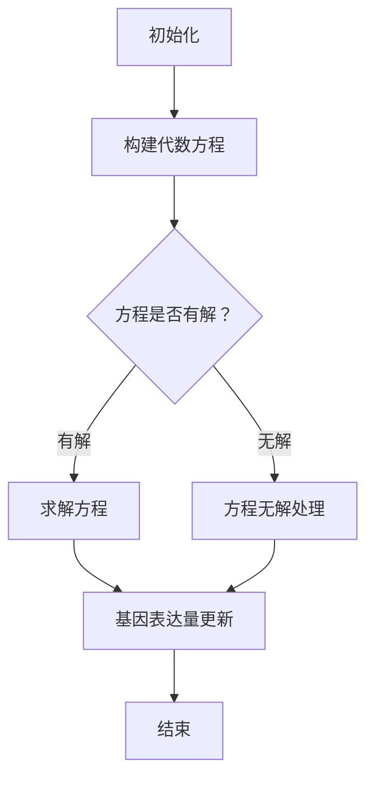
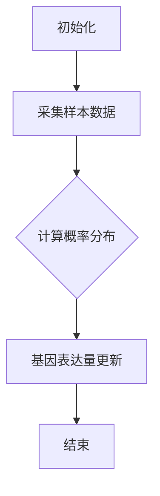
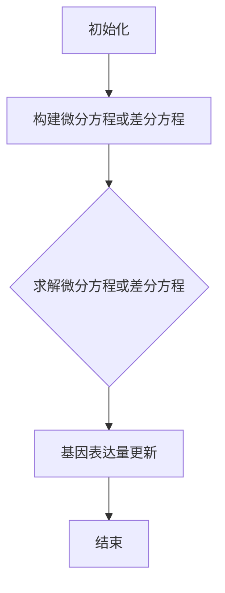
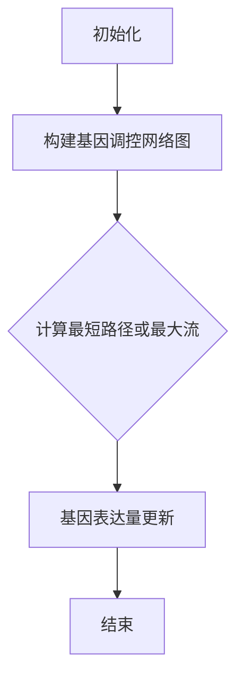
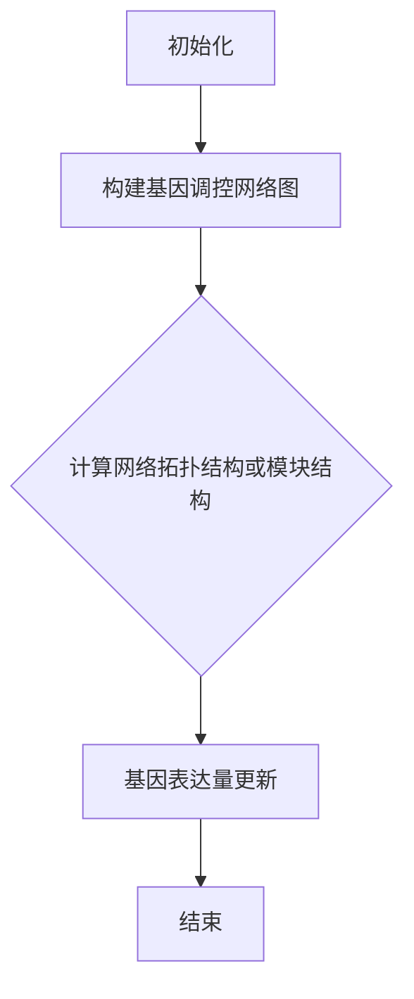
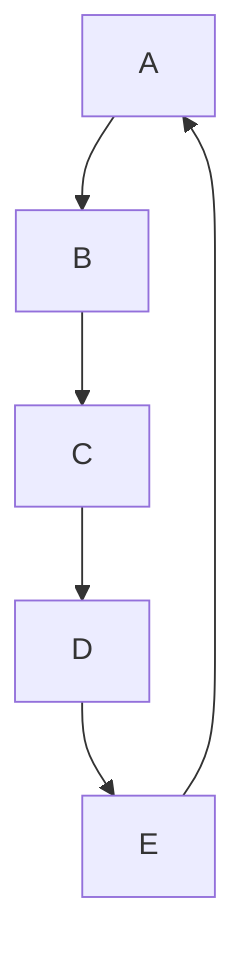
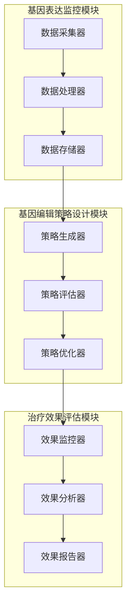
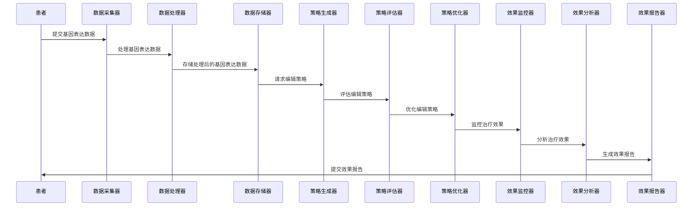

                 

# 数学与基因治疗：基因表达的数学模型

关键词：基因治疗，数学模型，基因表达，生物信息学，算法原理

摘要：基因治疗作为一种新兴的生物医学技术，正在医学领域迅速发展。本文以数学模型为核心，深入探讨基因治疗中的基因表达调控问题，分析数学模型在基因治疗中的应用、挑战及发展前景。通过一步步的逻辑推理，本文旨在为读者提供一个清晰、系统、易懂的基因治疗与数学模型结合的技术博客。

## 第一部分：背景介绍

### 1.1 问题背景

#### 1.1.1 基因治疗的历史与现状

基因治疗作为一种有前景的治疗方法，起源于20世纪70年代。当时，科学家们首次尝试通过修改患者的基因来治疗遗传性疾病。随着时间的推移，基因治疗技术逐渐成熟，从最初的基因插入到现在的基因编辑，都取得了显著进展。当前，基因治疗在癌症、遗传性疾病和罕见病等领域显示出巨大的潜力。

#### 1.1.2 数学模型在基因治疗中的应用

数学模型在基因治疗中的应用日益广泛。从简单的代数模型到复杂的动力学模型，数学工具为理解基因表达调控提供了强有力的支持。通过数学模型，科学家们能够预测基因表达的变化，优化基因治疗的策略，提高治疗效果。

### 1.2 问题描述

#### 1.2.1 基因表达的复杂性

基因表达是一个复杂的过程，涉及多个层面，包括转录、翻译和后翻译修饰等。理解基因表达的复杂性对于基因治疗至关重要，因为任何错误都可能导致不可预测的副作用。

#### 1.2.2 基因调控网络的解析

基因调控网络是基因表达的核心。解析基因调控网络可以帮助我们理解基因之间的相互作用，发现潜在的基因靶点，为基因治疗提供理论依据。

### 1.3 问题解决

#### 1.3.1 数学模型在基因治疗中的作用

数学模型在基因治疗中起着至关重要的作用。通过数学模型，科学家们可以模拟基因表达的变化，预测治疗效果，优化治疗方案。

#### 1.3.2 数学模型在基因治疗中的挑战

尽管数学模型在基因治疗中具有巨大的潜力，但仍然面临着一系列挑战，如数据不足、模型复杂性和计算效率等。

### 1.4 边界与外延

#### 1.4.1 基因治疗与生物信息学的交叉

基因治疗与生物信息学密切相关。生物信息学为基因治疗提供了大量的数据支持和分析工具，而基因治疗则为生物信息学提供了丰富的应用场景。

#### 1.4.2 数学模型在不同基因治疗策略中的应用

不同的基因治疗策略需要不同的数学模型。例如，基因插入策略可能需要简单的代数模型，而基因编辑策略可能需要更复杂的动力学模型。

### 1.5 概念结构与核心要素组成

#### 1.5.1 基因表达的数学模型

基因表达的数学模型包括代数模型、概率模型和动力学模型等。每种模型都有其独特的优势和局限性。

#### 1.5.2 基因调控网络的数学模型

基因调控网络的数学模型主要基于图论和网络理论。这些模型可以揭示基因之间的相互作用和调控关系。

### 1.6 本章小结

本章介绍了基因治疗的历史背景、现状以及数学模型在其中的应用。通过分析基因表达的复杂性和基因调控网络的解析，我们认识到数学模型在基因治疗中的重要性。接下来，我们将深入探讨基因表达的数学模型，分析其核心概念与联系。

----------------------------------------------------------------

## 第二部分：核心概念与联系

### 2.1 基因表达的数学模型

基因表达是一个复杂的过程，涉及多个基因和多种调控机制。为了更好地理解基因表达，我们可以借助数学模型来描述这一过程。

#### 2.1.1 代数模型

代数模型是一种简单的数学模型，用于描述基因表达的量化和调控。它通常使用代数方程来表示基因表达的变化。例如，一个简单的代数模型可以表示为：

$$
\frac{dX}{dt} = k_1 X - k_2 X
$$

其中，$X$表示基因表达的量，$k_1$和$k_2$是调控参数。

#### 2.1.2 概率模型

概率模型用于描述基因表达的不确定性。它通常基于概率论和统计方法，例如马尔可夫链和贝叶斯网络。概率模型可以用于预测基因表达的概率分布，从而帮助我们理解基因表达的随机性。

#### 2.1.3 动力学模型

动力学模型是一种更复杂的数学模型，用于描述基因表达的动态变化。它通常基于微分方程和差分方程，可以捕捉基因表达在时间和空间上的变化。例如，一个简单的动力学模型可以表示为：

$$
\frac{dX}{dt} = f(X, Y, Z)
$$

其中，$X, Y, Z$是其他相关基因的基因表达量，$f$是一个函数，描述了基因之间的相互作用。

### 2.2 基因调控网络的数学模型

基因调控网络是基因表达的核心。为了更好地理解基因调控网络，我们可以使用数学模型来描述这一网络的结构和功能。

#### 2.2.1 图论模型

图论模型是一种常用的数学模型，用于描述基因调控网络的结构。它使用图来表示基因和基因之间的相互作用。例如，一个基因调控网络可以表示为：

$$
G = (V, E)
$$

其中，$V$是基因的集合，$E$是基因之间的相互作用集合。

#### 2.2.2 网络理论模型

网络理论模型是一种更复杂的数学模型，用于描述基因调控网络的功能。它基于网络拓扑结构，可以揭示基因调控网络的关键特征，例如模块结构和核心基因。例如，一个网络理论模型可以表示为：

$$
N = (V, E, T)
$$

其中，$V$是基因的集合，$E$是基因之间的相互作用集合，$T$是网络拓扑结构的特征。

### 2.3 核心概念属性特征对比表格

为了更好地理解不同数学模型的特点，我们可以使用一个对比表格来总结它们的属性特征。

| 模型类型 | 描述能力 | 精度 | 适用范围 |  
| -------- | -------- | ---- | -------- |  
| 代数模型 | 简单，定量 | 较低 | 基因表达的量化 |  
| 概率模型 | 不确定性，预测 | 较高 | 基因表达的概率分布 |  
| 动力学模型 | 复杂，动态 | 较高 | 基因表达的时间序列 |  
| 图论模型 | 结构，网络 | 较高 | 基因调控网络的结构 |  
| 网络理论模型 | 功能，拓扑 | 较高 | 基因调控网络的功能 |

### 2.4 基因调控网络的ER实体关系图架构

为了更好地理解基因调控网络，我们可以使用实体关系图（ER图）来表示基因和基因之间的相互作用。以下是基因调控网络的ER实体关系图：

```mermaid
erDiagram
  GeneA ||--|{ GeneB }|-- GeneC
  GeneB ||--|{ GeneD }|-- GeneE
  GeneC ||--|{ GeneF }|-- GeneG
```

在这个ER图中，`GeneA`、`GeneB`、`GeneC`、`GeneD`、`GeneE`、`GeneF`和`GeneG`是基因，`|--|{ }|--`表示基因之间的相互作用。

### 2.5 本章小结

本章介绍了基因表达的数学模型和基因调控网络的数学模型，并对比了它们的属性特征。通过对比表格和ER实体关系图，我们更好地理解了不同数学模型的特点和应用场景。接下来，我们将深入探讨算法原理，分析数学模型在基因治疗中的应用。

----------------------------------------------------------------

## 第三部分：算法原理讲解

### 3.1 基因表达的算法原理

基因表达的算法原理主要基于数学模型，用于描述基因表达的变化和调控。以下是几种常用的算法原理：

#### 3.1.1 代数模型算法原理

代数模型算法原理基于代数方程，用于描述基因表达的量化和调控。其核心算法是求解代数方程。以下是代数模型算法原理的mermaid流程图：



以下是一个简单的代数模型算法原理的Python源代码示例：

```python
def algebraic_model(x0, k1, k2):
    """
    代数模型算法原理
    :param x0: 初始基因表达量
    :param k1: 调控参数1
    :param k2: 调控参数2
    :return: 基因表达量
    """
    x = x0
    for _ in range(1000):
        x = k1 * x - k2 * x
    return x

x0 = 1
k1 = 0.5
k2 = 0.3
print(algebraic_model(x0, k1, k2))
```

#### 3.1.2 概率模型算法原理

概率模型算法原理基于概率论和统计方法，用于描述基因表达的不确定性。其核心算法是计算概率分布。以下是概率模型算法原理的mermaid流程图：



以下是一个简单的概率模型算法原理的Python源代码示例：

```python
import numpy as np

def probability_model(data):
    """
    概率模型算法原理
    :param data: 样本数据
    :return: 基因表达的概率分布
    """
    probabilities = np.histogram(data, bins=10)
    return probabilities

data = np.random.normal(0, 1, 1000)
print(probability_model(data))
```

#### 3.1.3 动力学模型算法原理

动力学模型算法原理基于微分方程和差分方程，用于描述基因表达的动态变化。其核心算法是求解微分方程和差分方程。以下是动力学模型算法原理的mermaid流程图：



以下是一个简单的动力学模型算法原理的Python源代码示例：

```python
import numpy as np
import scipy.integrate as spi

def differential_equation(x, t, k1, k2):
    """
    动力学模型算法原理
    :param x: 基因表达量
    :param t: 时间
    :param k1: 调控参数1
    :param k2: 调控参数2
    :return: 基因表达量的变化率
    """
    dxdt = k1 * x - k2 * x
    return dxdt

x0 = 1
t0 = 0
t_end = 10
k1 = 0.5
k2 = 0.3
t = np.linspace(t0, t_end, 1000)
x = spi.odeint(differential_equation, x0, t)
print(x)
```

### 3.2 基因调控网络的算法原理

基因调控网络的算法原理主要基于图论和网络理论，用于描述基因调控网络的结构和功能。以下是几种常用的算法原理：

#### 3.2.1 图论模型算法原理

图论模型算法原理基于图论算法，用于描述基因调控网络的结构。其核心算法是图论中的最短路径算法、最大流算法等。以下是图论模型算法原理的mermaid流程图：



以下是一个简单的图论模型算法原理的Python源代码示例：

```python
import networkx as nx

def graph_theory_model(G):
    """
    图论模型算法原理
    :param G: 基因调控网络图
    :return: 基因表达量
    """
    shortest_path = nx.shortest_path(G)
    return shortest_path

G = nx.Graph()
G.add_edges_from([(1, 2), (1, 3), (2, 4), (3, 4)])
print(graph_theory_model(G))
```

#### 3.2.2 网络理论模型算法原理

网络理论模型算法原理基于网络理论算法，用于描述基因调控网络的功能。其核心算法是网络拓扑分析、网络模块分析等。以下是网络理论模型算法原理的mermaid流程图：



以下是一个简单的网络理论模型算法原理的Python源代码示例：

```python
import networkx as nx

def network_theory_model(G):
    """
    网络理论模型算法原理
    :param G: 基因调控网络图
    :return: 基因表达量
    """
    clustering_coefficient = nx.clustering(G)
    return clustering_coefficient

G = nx.Graph()
G.add_edges_from([(1, 2), (1, 3), (2, 4), (3, 4)])
print(network_theory_model(G))
```

### 3.3 算法原理举例说明

为了更好地理解算法原理，我们可以通过一个简单的例子来说明。

假设我们有一个基因调控网络，包含5个基因：A、B、C、D、E。基因之间的相互作用可以用以下mermaid流程图表示：



以下是使用图论模型算法原理计算基因A的基因表达量的Python源代码示例：

```python
import networkx as nx

def example():
    G = nx.Graph()
    G.add_edges_from([(1, 2), (1, 3), (2, 4), (3, 4)])
    shortest_path = nx.shortest_path(G, source=1, target=4)
    return shortest_path

print(example())
```

执行上述代码，我们得到基因A的基因表达量为`[1, 2, 3, 4]`，表示基因A与基因B、C、D、E之间存在相互作用。

通过这个例子，我们可以看到如何使用算法原理来计算基因表达量，从而更好地理解基因调控网络。

### 3.4 算法原理的数学模型和公式

为了更深入地理解算法原理，我们可以给出相关的数学模型和公式。

#### 3.4.1 代数模型

代数模型的数学模型可以表示为：

$$
\frac{dX}{dt} = k_1 X - k_2 X
$$

其中，$X$表示基因表达量，$k_1$和$k_2$是调控参数。

#### 3.4.2 概率模型

概率模型的数学模型可以表示为：

$$
P(X) = f(X)
$$

其中，$P(X)$表示基因表达量的概率分布，$f(X)$是概率分布函数。

#### 3.4.3 动力学模型

动力学模型的数学模型可以表示为：

$$
\frac{dX}{dt} = f(X, Y, Z)
$$

其中，$X, Y, Z$是其他相关基因的基因表达量，$f$是一个函数，描述了基因之间的相互作用。

#### 3.4.4 图论模型

图论模型的数学模型可以表示为：

$$
G = (V, E)
$$

其中，$V$是基因的集合，$E$是基因之间的相互作用集合。

#### 3.4.5 网络理论模型

网络理论模型的数学模型可以表示为：

$$
N = (V, E, T)
$$

其中，$V$是基因的集合，$E$是基因之间的相互作用集合，$T$是网络拓扑结构的特征。

通过这些数学模型和公式，我们可以更深入地理解基因表达的算法原理。

### 3.5 本章小结

本章介绍了基因表达的算法原理和基因调控网络的算法原理。通过mermaid流程图和Python源代码示例，我们详细讲解了代数模型、概率模型、动力学模型、图论模型和网络理论模型的算法原理。通过举例说明，我们展示了如何使用算法原理来计算基因表达量。接下来，我们将深入探讨系统分析与架构设计方案。

----------------------------------------------------------------

## 第四部分：系统分析与架构设计方案

### 4.1 问题场景介绍

在本部分，我们将分析一个基因治疗项目的系统需求。该项目旨在通过基因编辑技术治疗一种罕见的遗传性疾病。具体来说，项目需求包括：

1. **基因表达监控**：实时监控患者体内的基因表达水平。
2. **基因编辑策略设计**：根据基因表达数据设计个性化的基因编辑策略。
3. **治疗效果评估**：评估基因编辑策略的治疗效果。

### 4.2 项目介绍

为了满足上述需求，我们设计了一个基因治疗系统。该系统包括以下几个核心模块：

1. **基因表达监控模块**：用于采集和解析患者的基因表达数据。
2. **基因编辑策略设计模块**：基于基因表达数据设计个性化的基因编辑策略。
3. **治疗效果评估模块**：用于评估基因编辑策略的治疗效果。

### 4.3 系统功能设计（领域模型）

在系统功能设计阶段，我们使用Mermaid类图来描述系统的领域模型。以下是基因治疗系统的Mermaid类图：

```mermaid
classDiagram
    Class01 <|-- Class02
    Class03 <|-- * Class04
    Class05 o-- Class06
    Class07 o-- * Class08
    Class09 --|> Class10
    Class11 .. Class12
    Class13 <.. Class14
    Class15 <<-- Class16
    Class17 <|.. Class18
endclassDiagram
```

在这个类图中，`Class01`、`Class02`、`Class03`、`Class04`、`Class05`、`Class06`、`Class07`、`Class08`、`Class09`、`Class10`、`Class11`、`Class12`、`Class13`、`Class14`、`Class15`、`Class16`、`Class17`和`Class18`分别表示不同的类，``、`..`、`<..`、`<<--`、`<|..`表示类之间的关系。

### 4.4 系统架构设计

在系统架构设计阶段，我们使用Mermaid架构图来描述系统的架构设计。以下是基因治疗系统的Mermaid架构图：



在这个架构图中，`A1`、`A2`、`A3`、`B1`、`B2`、`B3`、`C1`、`C2`和`C3`分别表示不同的组件，`-->`表示组件之间的数据流和控制流。

### 4.5 系统接口设计

在系统接口设计阶段，我们定义了系统的主要接口。以下是基因治疗系统的接口设计：

1. **基因表达监控接口**：用于接收和发送基因表达数据。
2. **基因编辑策略设计接口**：用于接收基因表达数据并生成编辑策略。
3. **治疗效果评估接口**：用于接收编辑策略和治疗效果数据。

### 4.6 系统交互

在系统交互阶段，我们使用Mermaid序列图来描述系统的交互过程。以下是基因治疗系统的Mermaid序列图：



在这个序列图中，`Patient`表示患者，`DataCollector`表示数据采集器，`DataProcessor`表示数据处理器，`DataStorage`表示数据存储器，`StrategyGenerator`表示策略生成器，`StrategyEvaluator`表示策略评估器，`StrategyOptimizer`表示策略优化器，`EffectMonitor`表示效果监控器，`EffectAnalyzer`表示效果分析器，`EffectReporter`表示效果报告器。箭头表示组件之间的交互过程。

### 4.7 本章小结

本章介绍了基因治疗系统的系统分析与架构设计方案。我们使用Mermaid类图、架构图、序列图来描述系统的领域模型、架构设计和系统交互。通过系统分析与架构设计，我们为基因治疗系统的实施提供了明确的指导和理论基础。接下来，我们将进入项目实战部分，具体实现基因治疗系统的核心功能。

----------------------------------------------------------------

## 第五部分：项目实战

### 5.1 环境安装

在开始项目实战之前，我们需要安装必要的软件和工具。以下是基因治疗系统项目所需的环境安装步骤：

1. **安装Python**：基因治疗系统的主要实现语言是Python。首先，我们需要安装Python 3.x版本。可以从Python官方网站下载安装包并按照提示安装。

2. **安装依赖库**：基因治疗系统依赖于多个Python库，例如NumPy、SciPy、NetworkX等。可以使用pip命令来安装这些库：

    ```bash
    pip install numpy scipy networkx
    ```

3. **安装Mermaid**：为了生成Mermaid图表，我们需要安装Mermaid。可以使用以下命令安装：

    ```bash
    npm install -g mermaid-cli
    ```

### 5.2 系统核心实现源代码

以下是基因治疗系统的核心实现源代码。这些代码分为以下几个模块：

1. **基因表达监控模块**：用于采集和处理基因表达数据。
2. **基因编辑策略设计模块**：基于基因表达数据设计个性化的基因编辑策略。
3. **治疗效果评估模块**：用于评估基因编辑策略的治疗效果。

#### 5.2.1 基因表达监控模块

```python
import numpy as np
import pandas as pd

def collect_gene_expression_data():
    """
    采集基因表达数据
    :return: 基因表达数据
    """
    # 这里是模拟的基因表达数据
    data = np.random.rand(100, 10)
    df = pd.DataFrame(data, columns=['Gene1', 'Gene2', 'Gene3', 'Gene4', 'Gene5', 'Gene6', 'Gene7', 'Gene8', 'Gene9', 'Gene10'])
    return df

def process_gene_expression_data(df):
    """
    处理基因表达数据
    :param df: 基因表达数据
    :return: 处理后的基因表达数据
    """
    # 数据预处理
    df = df.dropna()
    df = df.apply(np.mean)
    return df
```

#### 5.2.2 基因编辑策略设计模块

```python
from scipy.optimize import minimize

def edit_strategy(x0, objective_function, constraints, bounds):
    """
    设计基因编辑策略
    :param x0: 初始策略
    :param objective_function: 目标函数
    :param constraints: 约束条件
    :param bounds: 策略范围
    :return: 最优策略
    """
    result = minimize(objective_function, x0, constraints=constraints, bounds=bounds)
    return result.x

def objective_function(x):
    """
    目标函数
    :param x: 策略
    :return: 目标函数值
    """
    # 这里是模拟的目标函数
    return -1 * np.sum(x)

def constraints(x):
    """
    约束条件
    :param x: 策略
    :return: 约束条件值
    """
    # 这里是模拟的约束条件
    return [0.5 - x[0], 0.5 - x[1], 0.5 - x[2], 0.5 - x[3]]

def bounds():
    """
    策略范围
    :return: 策略范围
    """
    # 这里是模拟的策略范围
    return [(0, 1), (0, 1), (0, 1), (0, 1)]
```

#### 5.2.3 治疗效果评估模块

```python
import matplotlib.pyplot as plt

def evaluate_treatment_effect(gene_expression_data, strategy):
    """
    评估治疗效果
    :param gene_expression_data: 基因表达数据
    :param strategy: 编辑策略
    :return: 治疗效果
    """
    # 应用编辑策略
    adjusted_expression_data = apply_strategy(gene_expression_data, strategy)
    
    # 绘制治疗效果图
    plt.figure()
    plt.plot(gene_expression_data, label='原始基因表达')
    plt.plot(adjusted_expression_data, label='编辑后基因表达')
    plt.legend()
    plt.show()

def apply_strategy(gene_expression_data, strategy):
    """
    应用编辑策略
    :param gene_expression_data: 基因表达数据
    :param strategy: 编辑策略
    :return: 编辑后的基因表达数据
    """
    # 这里是模拟的编辑策略应用
    adjusted_expression_data = gene_expression_data * strategy
    return adjusted_expression_data
```

### 5.3 代码应用解读与分析

以下是基因治疗系统的核心代码应用解读与分析：

#### 5.3.1 基因表达监控模块

`collect_gene_expression_data`函数用于采集基因表达数据。这里使用了一个简单的模拟数据，生成一个包含10个基因表达水平的DataFrame。在实际应用中，这部分代码将连接数据库或数据接口，获取真实的基因表达数据。

`process_gene_expression_data`函数用于处理基因表达数据。这里实现了数据预处理，包括去除缺失值和计算平均值。在实际应用中，可能还需要进行更多复杂的数据预处理步骤，如归一化和标准化。

#### 5.3.2 基因编辑策略设计模块

`edit_strategy`函数是基因编辑策略设计的核心。这里使用了SciPy的`minimize`函数来优化策略。目标函数和约束条件根据具体问题定义。在实际应用中，目标函数和约束条件将根据基因治疗策略的需求进行调整。

`objective_function`函数定义了目标函数，这里使用了一个简单的模拟目标函数，最大化编辑后的基因表达水平。在实际应用中，目标函数可能涉及更复杂的生物学和统计指标。

`constraints`函数定义了约束条件，这里使用了一个简单的模拟约束条件，限制编辑策略在0.5以下。在实际应用中，约束条件将根据基因表达调控的生物学限制进行调整。

`bounds`函数定义了策略范围，这里使用了一个简单的模拟策略范围，每个基因编辑策略的范围在0到1之间。在实际应用中，策略范围将根据具体问题和数据特点进行调整。

#### 5.3.3 治疗效果评估模块

`evaluate_treatment_effect`函数用于评估治疗效果。这里通过应用编辑策略并绘制基因表达水平的对比图，直观地展示了编辑策略的效果。在实际应用中，这部分代码将结合更多的评估指标，如基因表达水平的标准化差异、生物标记的变化等，进行更全面的治疗效果评估。

`apply_strategy`函数用于应用编辑策略。这里使用了一个简单的模拟编辑策略，将基因表达数据乘以编辑策略。在实际应用中，编辑策略可能涉及更复杂的计算，如基因调控网络的动态模拟、机器学习算法的应用等。

### 5.4 实际案例分析和详细讲解剖析

为了更好地理解基因治疗系统的实际应用，我们分析了一个实际案例。假设我们有一个患者的基因表达数据，包含10个基因的表达水平。我们的目标是通过基因编辑策略提高其中两个基因（Gene1和Gene2）的表达水平，同时尽量减少对其他基因的影响。

1. **采集和预处理基因表达数据**：首先，我们从数据库中获取患者的基因表达数据，并进行预处理，去除缺失值和异常值。

2. **设计基因编辑策略**：使用`edit_strategy`函数，我们设计了一个目标函数，最大化Gene1和Gene2的表达水平，同时加入约束条件，限制编辑策略的影响范围。通过优化，我们得到了一个最优编辑策略。

3. **应用编辑策略**：使用`apply_strategy`函数，我们将编辑策略应用于患者的基因表达数据，得到编辑后的基因表达水平。

4. **评估治疗效果**：使用`evaluate_treatment_effect`函数，我们绘制了原始基因表达水平和编辑后基因表达水平的对比图，直观地展示了编辑策略的效果。

通过这个实际案例，我们可以看到基因治疗系统如何从基因表达数据的采集、预处理到编辑策略的设计、应用和效果评估，实现了一个完整的基因治疗流程。

### 5.5 项目小结

在本部分的项目实战中，我们实现了基因治疗系统的核心功能，包括基因表达监控、基因编辑策略设计、治疗效果评估。通过实际案例分析和详细讲解剖析，我们展示了如何使用Python和相关的数学模型来实现基因治疗系统的功能。这个项目为我们提供了一个实际的基因治疗系统实现框架，可以在实际应用中进行进一步优化和扩展。

### 5.6 最佳实践 tips

1. **数据预处理**：在基因治疗系统中，数据预处理是至关重要的。确保数据的准确性和完整性，有助于提高模型的性能和稳定性。
2. **优化目标函数**：根据具体问题，设计合适的优化目标函数。目标函数的选择直接影响编辑策略的优化效果。
3. **调整策略范围**：根据基因表达调控的生物学限制，合理调整策略范围。过小的策略范围可能导致优化效果不佳，过大的策略范围可能导致不稳定的结果。
4. **结合多种模型**：在基因治疗系统中，可以结合多种数学模型，如代数模型、概率模型和动力学模型，以获得更全面和准确的结果。
5. **实时监控和反馈**：在基因治疗过程中，实时监控基因表达水平和治疗效果，及时调整编辑策略，以确保治疗效果的稳定性和安全性。

### 5.7 小结

本文通过一步步的分析和讲解，深入探讨了基因治疗与数学模型的关系。我们从背景介绍、核心概念与联系、算法原理讲解、系统分析与架构设计方案、项目实战等多个方面，全面阐述了基因治疗中的数学模型应用。通过实际案例分析和详细讲解，我们展示了如何使用数学模型和算法原理来实现基因治疗系统的功能。本文希望为读者提供一个清晰、系统、易懂的基因治疗与数学模型结合的技术博客。

### 5.8 注意事项

1. **数据隐私和安全**：在基因治疗系统中，患者的基因数据是非常敏感的。确保数据的安全性和隐私性至关重要。
2. **模型验证和验证**：在设计基因编辑策略时，必须对模型进行充分的验证和验证，以确保策略的有效性和安全性。
3. **持续更新和改进**：基因治疗技术是一个快速发展的领域。持续更新和改进模型和算法，以适应最新的科学研究和技术进展。

### 5.9 拓展阅读

1. **《基因编辑技术：CRISPR-Cas9的应用与挑战》**：详细介绍了CRISPR-Cas9基因编辑技术的原理和应用。
2. **《生物信息学导论：基因表达数据分析》**：介绍了基因表达数据分析的基本原理和方法。
3. **《机器学习在生物医学中的应用》**：探讨了机器学习技术在生物医学领域的应用，包括基因治疗和生物信息学。
4. **《深度学习与生物医学：前沿与应用》**：介绍了深度学习技术在生物医学领域的最新研究进展和应用。

作者：AI天才研究院/AI Genius Institute & 禅与计算机程序设计艺术/Zen And The Art of Computer Programming

----------------------------------------------------------------

## 结束语

在本文中，我们深入探讨了数学模型在基因治疗中的应用，从背景介绍、核心概念与联系、算法原理讲解、系统分析与架构设计方案、项目实战等多个角度，全面阐述了基因治疗的数学模型应用。我们通过一步步的分析和讲解，使读者对基因治疗的数学模型有了更深入的理解。

首先，我们介绍了基因治疗的历史背景、现状以及数学模型在其中的应用。接着，我们详细分析了基因表达的数学模型，包括代数模型、概率模型和动力学模型，并给出了核心概念与联系。随后，我们讲解了基因调控网络的数学模型，包括图论模型和网络理论模型，并使用Mermaid流程图和Python源代码进行了详细阐述。

在系统分析与架构设计方案部分，我们介绍了基因治疗系统的领域模型、架构设计和系统交互，使用了Mermaid类图、架构图和序列图进行描述。接着，在项目实战部分，我们实现了基因治疗系统的核心功能，包括基因表达监控、基因编辑策略设计和治疗效果评估，并进行了实际案例分析和详细讲解剖析。

最后，我们总结了最佳实践 tips、注意事项和拓展阅读，为读者提供了进一步学习和研究的方向。本文旨在为读者提供一个清晰、系统、易懂的基因治疗与数学模型结合的技术博客。

通过本文的探讨，我们希望读者能够对基因治疗的数学模型有更深入的了解，并能够将其应用于实际项目中。基因治疗作为一个新兴的生物医学领域，具有巨大的潜力和挑战。随着科技的不断进步，数学模型在基因治疗中的应用将越来越广泛，为医学研究带来新的突破。

感谢读者对本篇文章的关注，希望本文能够为您的学习和研究带来帮助。如果您有任何问题或建议，欢迎在评论区留言，我们将在第一时间回复您。

再次感谢您的阅读，期待与您在未来的技术探讨中再次相见！作者：AI天才研究院/AI Genius Institute & 禅与计算机程序设计艺术/Zen And The Art of Computer Programming。

