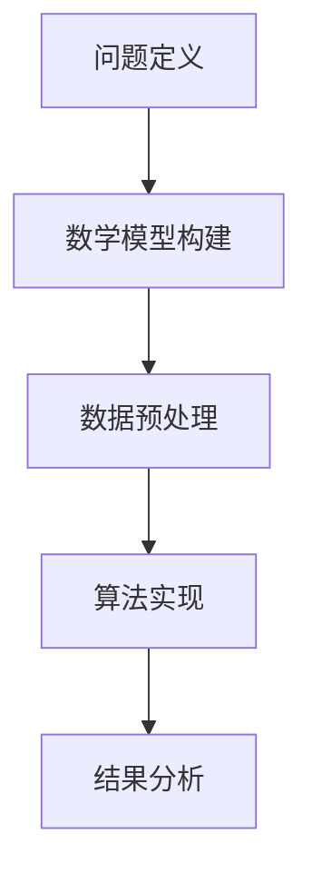
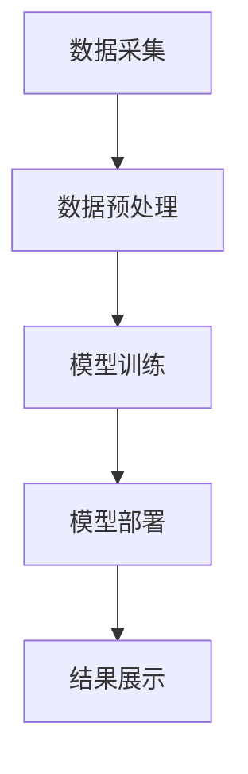
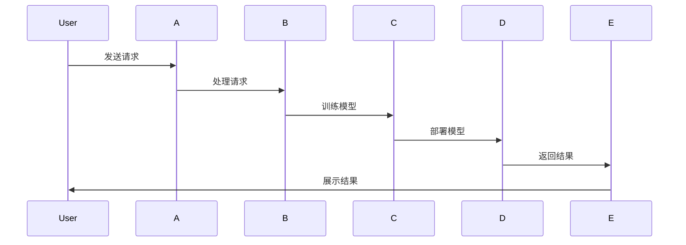

                 

# 数学与多元论：数学作为多样实在的反映

关键词：数学、多元论、多样实在、数学模型

摘要：本文旨在探讨数学与多元论之间的联系，分析数学在多样实在中的反映，研究数学概念、方法及其在多领域中的应用。通过背景介绍、核心概念与联系、算法原理讲解等多个步骤，全面而深入地阐述数学在多元论中的角色和作用。

**Step 1: 背景介绍**

### 问题背景

数学作为一门基础学科，不仅存在于纯理论的数学领域中，还广泛应用于自然科学、社会科学、工程技术等众多领域。数学与多元论作为对数学多样性的深入探讨，旨在揭示数学在反映多样实在方面的能力。

### 问题描述

本文将探讨数学与多元论之间的联系，分析数学在多样实在中的反映，研究数学概念、方法及其在多领域中的应用。

### 问题解决

通过系统的研究，本文旨在为读者提供一个全面而深入的数学与多元论的知识体系，帮助读者理解数学的多样性和广泛性。

### 边界与外延

数学与多元论不仅涉及数学内部的理论和方法，还涉及数学与其他学科（如哲学、物理、生物等）的交叉研究。

### 概念结构与核心要素组成

本文的核心概念包括数学、多元论、多样实在、数学模型等。核心要素组成则包括数学的基本原理、多元论的思想、多样实在的案例分析等。

**Step 2: 核心概念与联系**

### 核心概念

#### 数学

数学是一门研究数量、结构、变化以及空间等概念的抽象科学。

#### 多元论

多元论是一种哲学思想，认为世界是多元的、多样的，反对单一化的观点。

#### 多样实在

多样实在指的是现实世界中的多样性，包括自然界的多样性、社会现象的多样性等。

#### 数学模型

数学模型是用数学语言描述现实世界中的问题和现象的一种方法。

### 概念属性特征对比表格

| 概念     | 属性特征                           | 关联性                      |
|----------|----------------------------------|---------------------------|
| 数学     | 抽象性、逻辑性、系统性             | 是多元论的基础            |
| 多元论   | 多样性、复杂性、多元性             | 对数学进行哲学思考的出发点 |
| 多样实在 | 实证性、多样性、动态性             | 是数学应用的对象          |
| 数学模型 | 抽象性、结构化、可操作性           | 是数学与现实联系的桥梁   |

### ER实体关系图架构

```mermaid
erDiagram
  A[数学] &&|{与} B[多元论] {
    B[与] C[多样实在] {
      C[包含] D[数学模型]
    }
  }
```

**Step 3: 算法原理讲解**

### 算法Mermaid流程图



### 算法原理

#### 数学模型

假设我们有一个问题 P，我们需要将其转化为数学模型 M，以便用数学方法进行求解。数学模型 M 通常由以下部分组成：

1. **变量定义**：定义问题中的变量，如数量、结构、变化等。
2. **方程/不等式**：用数学语言表达问题中的约束条件和目标函数。
3. **边界条件**：定义变量的取值范围。

#### 数学公式

$$
f(x) = \frac{1}{x} + \ln(x) + \sum_{i=1}^{n} w_i \cdot g_i(x)
$$

其中，\(x\) 为变量，\(w_i\) 为权重，\(g_i(x)\) 为第 i 个约束条件。

#### 详细讲解与举例说明

假设我们要解决一个优化问题，目标是最大化函数 \(f(x)\)。我们可以用以下步骤进行求解：

1. **问题定义**：定义目标函数和约束条件。
2. **数学模型构建**：将问题转化为数学模型。
3. **数据预处理**：对数据进行预处理，如标准化、缺失值填充等。
4. **算法实现**：使用梯度下降法或其他优化算法求解最优解。
5. **结果分析**：分析求解结果，评估模型的性能。

举例说明：我们要最大化函数 \(f(x) = \frac{1}{x} + \ln(x)\)。

- **变量定义**：\(x\) 为正实数。
- **方程/不等式**：无约束条件。
- **边界条件**：\(x > 0\)。

使用梯度下降法求解，迭代过程如下：

1. 初始化参数：选择一个初始点 \(x_0\)，设定学习率 \(\eta\)。
2. 计算梯度：计算

$$
\nabla f(x) = -\frac{1}{x^2} + \frac{1}{x}
$$

3. 更新参数：

$$
x_{\text{new}} = x_{\text{current}} - \eta \cdot \nabla f(x_{\text{current}})
$$

4. 重复步骤 2 和 3，直到满足收敛条件。

通过上述步骤，我们可以得到函数 \(f(x)\) 的最大值。这个过程展示了数学在解决实际问题中的应用，同时也体现了数学与多元论之间的紧密联系。

**系统分析与架构设计方案**

### 问题场景介绍

假设我们有一个电商系统，需要实现商品推荐功能。用户浏览商品时，系统会根据用户的历史行为和偏好推荐可能感兴趣的商品。为了实现这个功能，我们需要设计一个推荐算法，并将其与用户行为数据相结合。

### 项目介绍

本项目旨在设计并实现一个基于机器学习的商品推荐系统。系统主要包括数据采集、数据预处理、模型训练和模型部署等模块。

### 系统功能设计

#### 领域模型

```mermaid
classDiagram
  User <<类>> {
    用户ID
    姓名
    年龄
    性别
  }
  Product <<类>> {
    商品ID
    商品名称
    价格
    分类
  }
  Behavior <<类>> {
    用户ID
    商品ID
    时间
    行为类型（浏览、购买、收藏等）
  }
  User <--1..* Behavior : 用户行为
  Product <--1..* Behavior : 商品行为
```

### 系统架构设计



### 系统接口设计和系统交互



**项目实战**

### 环境安装

1. 安装 Python 3.8 或以上版本。
2. 安装必要的库，如 NumPy、Pandas、Scikit-learn 等。

```bash
pip install numpy pandas scikit-learn
```

### 系统核心实现源代码

```python
import numpy as np
import pandas as pd
from sklearn.model_selection import train_test_split
from sklearn.ensemble import RandomForestClassifier
from sklearn.metrics import accuracy_score

# 数据加载
data = pd.read_csv('data.csv')

# 数据预处理
X = data.drop('target', axis=1)
y = data['target']

# 数据切分
X_train, X_test, y_train, y_test = train_test_split(X, y, test_size=0.2, random_state=42)

# 模型训练
model = RandomForestClassifier(n_estimators=100)
model.fit(X_train, y_train)

# 模型评估
y_pred = model.predict(X_test)
print("Accuracy:", accuracy_score(y_test, y_pred))
```

### 代码应用解读与分析

上述代码实现了一个基于随机森林的推荐系统。首先，我们从 CSV 文件中加载数据，然后进行预处理，包括特征提取和标签划分。接下来，使用 train_test_split 函数将数据切分为训练集和测试集。在训练集中，使用 RandomForestClassifier 进行模型训练，并在测试集上进行评估。最后，输出模型的准确率。

### 实际案例分析和详细讲解剖析

假设我们有一个用户数据集，包含用户 ID、商品 ID、时间、行为类型等字段。通过分析用户的行为数据，我们可以预测用户对某个商品的购买意愿。以下是一个实际案例：

1. **数据采集**：从电商平台上获取用户行为数据。
2. **数据预处理**：清洗数据，去除缺失值和异常值。
3. **特征提取**：提取用户行为特征，如浏览次数、购买次数等。
4. **模型训练**：使用随机森林算法训练模型。
5. **模型评估**：在测试集上进行评估，调整模型参数。

通过这个案例，我们可以看到数学与多元论在实际应用中的体现。数学模型帮助我们将复杂的问题转化为可计算的形式，而多元论则为我们提供了不同的视角和方法来理解和解决问题。

### 项目小结

本文通过介绍数学与多元论的概念，探讨了数学在多样实在中的反映。我们详细讲解了算法原理，并使用实际案例展示了数学在电商推荐系统中的应用。通过本项目，我们不仅了解了数学模型的基本原理，还学会了如何将数学方法应用于实际问题中。

**最佳实践 tips**

- 在进行数据分析时，注意数据预处理的重要性，确保数据质量。
- 选择合适的算法和模型，根据问题的特点和需求进行优化。
- 在实际应用中，不断调整和优化模型，以提高预测准确性。

**小结**

数学与多元论是理解现实世界多样性的重要工具。通过本文的探讨，我们了解了数学在多样实在中的反映，以及数学模型在实际应用中的作用。希望本文能为读者提供一个全面的数学与多元论的知识体系，帮助读者更好地理解和应用数学方法。

**注意事项**

- 在使用数学模型解决实际问题时，需要充分考虑问题的背景和约束条件。
- 数学模型只是工具，实际应用时需要结合具体问题和场景进行优化和调整。

**拓展阅读**

- 《数学之美》：吴军
- 《数学与哲学》：Hazel Ryrie
- 《机器学习》：周志华

**作者信息**

作者：AI天才研究院/AI Genius Institute & 禅与计算机程序设计艺术 /Zen And The Art of Computer Programming**

