                 

### 引言

在现代信息社会中，数据已经成为一种重要的资源，而大数据技术的兴起更是让数据分析变得愈加重要。随着互联网、物联网、传感器等技术的快速发展，数据量呈现爆炸式增长，如何有效地对海量数据进行处理和分析成为了一个亟待解决的问题。在这个背景下，数学与大数据分析的算法研究显得尤为重要。

数学作为一门基础科学，拥有丰富的理论和方法，这些方法在处理复杂数据时发挥着关键作用。大数据分析涉及到数据收集、存储、处理、分析等多个环节，数学算法可以提供高效的解决方案，从而提高数据分析的效率和质量。例如，线性代数中的矩阵运算在数据预处理和特征提取中有着广泛应用，统计学方法则在数据分析的各个环节中起到了关键作用，优化算法则能够帮助我们找到最优解，从而在金融、医疗、电商等各个领域实现智能决策。

本文将围绕数学与大数据分析的算法研究进行探讨，首先介绍相关背景和核心概念，然后深入讲解线性代数、统计学和优化算法等数学算法的基本原理，并通过实际案例展示这些算法在大数据场景中的应用。此外，文章还将探讨这些算法的优缺点，并给出一些实用的建议和最佳实践。通过本文的阅读，读者将能够系统地了解数学与大数据分析之间的联系，掌握相关算法的基本原理和应用方法。

### 背景介绍

随着大数据技术的迅猛发展，数据分析在各个领域的重要性日益凸显。然而，如何有效地处理海量数据，从中提取有价值的信息，仍是一个严峻的挑战。在这个背景下，数学与大数据分析的算法研究变得尤为重要。

#### 问题背景

大数据分析的核心在于对海量数据进行处理和分析，这需要高效的算法作为支撑。数学算法在数据处理、存储、分析和决策等方面具有独特的优势。首先，数学算法提供了高效的数据处理方法，例如线性代数中的矩阵运算和矩阵分解技术，这些技术可以显著提高数据处理速度和效率。其次，数学中的优化算法，如梯度下降法和随机梯度下降法，广泛应用于机器学习和深度学习领域，通过不断调整模型参数，使得损失函数值最小化，从而实现模型的优化。此外，统计学方法在数据分析的各个环节中起到了关键作用，从数据的收集、预处理、分析到结果解释，统计学方法都能够提供有效的支持和指导。

#### 问题描述

尽管数学算法在数据分析中具有重要作用，但如何将这些算法有效地应用于大数据分析仍是一个亟待解决的问题。具体来说，有以下几点挑战：

1. **数据处理效率**：大数据分析往往需要处理海量数据，这对算法的效率和性能提出了极高的要求。如何设计出高效、可扩展的算法是当前研究的重点。
2. **算法复杂度**：数学算法的复杂度往往较高，如何降低算法的复杂度，使其能够在实际应用中快速执行，是一个重要的研究方向。
3. **可解释性**：数学算法在数据分析中应用时，往往缺乏可解释性，使得用户难以理解分析结果。如何提高算法的可解释性，使其能够被用户理解和接受，也是一个亟待解决的问题。
4. **算法适应性**：大数据环境下的数据种类繁多，如何设计出能够适应不同数据类型的通用算法，是当前研究的一个重要方向。

#### 问题解决

本书旨在研究数学与大数据分析的算法，探索如何将数学算法应用于大数据分析，提高数据分析的效率和质量。具体研究内容包括：

1. **算法优化**：通过分析现有算法的优缺点，提出改进措施，降低算法复杂度，提高数据处理效率。
2. **算法融合**：将不同数学算法进行融合，形成更加高效的综合算法，以提高数据分析的整体性能。
3. **算法可解释性**：研究如何提高算法的可解释性，使其结果更加直观、易于理解。
4. **算法适应性**：探索如何设计出适应不同数据类型的通用算法，提高算法的适用性。

通过这些研究，希望能够为大数据分析提供更加高效、可靠的数学算法支持，从而推动大数据技术的发展和应用。

#### 边界与外延

本书的研究主要围绕数学与大数据分析在算法研究方面的应用展开，涉及到的核心内容包括统计学、线性代数、优化算法等。具体来说：

1. **统计学**：研究统计学方法在大数据环境中的应用，包括描述性统计、推断性统计、假设检验、置信区间等。
2. **线性代数**：探讨线性代数算法在数据处理和特征提取中的应用，如矩阵运算、线性方程组求解、奇异值分解等。
3. **优化算法**：研究优化算法在大数据场景下的应用，如梯度下降法、随机梯度下降法、遗传算法等。

此外，本书还探讨了这些算法在不同领域的应用，如金融、医疗、电商等，通过具体案例展示了数学算法在大数据分析中的实际效果和作用。

#### 概念结构与核心要素组成

在数学与大数据分析的研究中，以下几个核心概念和要素构成了整个研究体系的基础：

1. **数学算法**：这是本书研究的核心，包括统计学、线性代数和优化算法等。这些算法为大数据分析提供了理论依据和操作方法。
2. **大数据分析**：指对海量数据进行收集、处理、存储、分析和解释的过程。它是数学算法应用的场景和目标。
3. **数据处理**：包括数据清洗、预处理、特征提取等步骤，是大数据分析的重要环节。数学算法在这一环节中发挥着关键作用。
4. **算法应用场景**：指数学算法在不同领域中的应用，如金融、医疗、电商等。通过具体应用场景，可以更好地理解和验证数学算法的有效性。
5. **算法优化与融合**：研究如何优化现有算法，降低复杂度，提高效率，以及如何将不同算法进行融合，形成更加高效的综合算法。

这些核心概念和要素相互关联，共同构成了数学与大数据分析的算法研究体系，为后续章节的深入探讨提供了基础。

### 核心概念

在探讨数学与大数据分析的算法研究时，理解几个核心概念是非常关键的。这些核心概念不仅定义了研究的范围，也为后续章节的深入分析提供了理论基础。

#### 数学算法

数学算法是指用于解决数学问题的方法和步骤。这些算法广泛应用于计算机科学、工程学、经济学等多个领域。在数学与大数据分析的算法研究中，常用的数学算法包括：

1. **线性代数算法**：如矩阵运算、线性方程组求解、奇异值分解等。这些算法在数据预处理、特征提取和降维中具有重要应用。
2. **统计学算法**：如描述性统计、推断性统计、假设检验、置信区间等。统计学算法在大数据分析中用于数据的收集、分析和解释。
3. **优化算法**：如梯度下降法、随机梯度下降法、遗传算法等。优化算法用于求解最优化问题，在大数据分析中广泛应用于模型优化和参数调整。

#### 大数据分析

大数据分析是指对大规模数据进行处理和分析的过程。它涉及到数据收集、存储、处理、分析和解释等多个环节。在数学与大数据分析的算法研究中，大数据分析的核心概念包括：

1. **数据收集**：指从各种来源收集数据，如数据库、日志文件、传感器等。数据收集的全面性和准确性对后续分析至关重要。
2. **数据存储**：指将收集到的数据存储在合适的存储系统中，如关系型数据库、分布式文件系统、NoSQL数据库等。高效的数据存储对于大数据分析至关重要。
3. **数据处理**：包括数据清洗、数据转换、特征提取等步骤。数据处理的目标是获取干净、结构化的数据，为后续分析提供基础。
4. **数据分析**：通过对处理后的数据进行分析，提取有价值的信息和模式。数据分析方法包括描述性统计、推断性统计、机器学习等。
5. **数据解释**：指对分析结果进行解释和解释，帮助决策者理解分析结果，做出科学决策。

#### 算法应用场景

算法应用场景是指数学算法在不同领域中的应用实例。在数学与大数据分析的算法研究中，算法应用场景的多样性是研究的一个重点。以下是几个常见的算法应用场景：

1. **金融领域**：数学算法在金融领域的应用包括风险管理、投资组合优化、信用评分等。例如，线性代数中的矩阵运算和奇异值分解在风险建模中有着广泛应用。
2. **医疗领域**：数学算法在医疗领域的应用包括疾病预测、药物研发、医学图像分析等。例如，优化算法在药物分子结构优化和疾病诊断中发挥着重要作用。
3. **电商领域**：数学算法在电商领域的应用包括商品推荐、用户行为分析、需求预测等。例如，统计学方法在用户行为分析中用于挖掘用户偏好和购买模式。

通过理解这些核心概念，我们可以更好地把握数学与大数据分析的算法研究的本质，为后续章节的深入探讨提供坚实的基础。

### 核心概念与联系

为了深入探讨数学与大数据分析之间的联系，我们需要先了解数学算法的基本原理，并将其与大数据分析的实际应用场景相结合。以下是对线性代数、统计学和优化算法等核心概念的详细解析，以及它们在大数据应用中的具体应用。

#### 2.1.1 线性代数

线性代数是数学中一个重要的分支，它研究向量、矩阵和线性方程组等概念。在线性代数中，矩阵运算、线性方程组求解和奇异值分解等算法具有广泛的应用。

**2.1.1.1 概念属性特征对比表格**

| 算法         | 定义                                                         | 应用领域              |
| ------------ | ------------------------------------------------------------ | --------------------- |
| 矩阵运算     | 矩阵的加减、乘、逆等操作                                     | 数据预处理、特征提取  |
| 线性方程组   | 求解线性方程组                                             | 数据回归、预测        |
| 奇异值分解   | 将矩阵分解为奇异值矩阵和其逆矩阵的乘积                       | 数据降维、特征提取    |

**2.1.1.2 大数据应用场景**

在线性代数中，矩阵运算和线性方程组求解在大数据环境中被广泛应用于数据预处理和特征提取。例如，在图像处理中，可以通过矩阵运算实现图像的滤波、边缘检测等操作。在文本分析中，矩阵运算可以用于词频矩阵的计算和转换。线性方程组求解则广泛应用于数据回归和预测任务中，如时间序列分析和线性回归模型。

**mermaid 流程图**

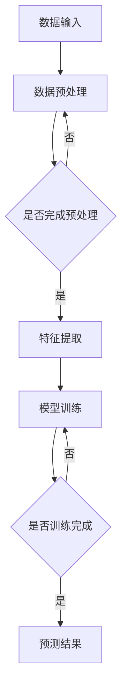

#### 2.1.2 统计学

统计学是一门研究如何通过数据得出结论的科学。统计学方法在大数据分析中具有重要作用，包括描述性统计、推断性统计、假设检验和置信区间等。

**2.1.2.1 概念属性特征对比表格**

| 算法         | 定义                                                         | 应用领域              |
| ------------ | ------------------------------------------------------------ | --------------------- |
| 描述性统计   | 描述数据的基本特征，如均值、方差、中位数等                   | 数据探索、可视化      |
| 推断性统计   | 根据样本数据推断总体特征，如假设检验、置信区间等             | 数据分析、决策支持    |
| 假设检验     | 通过样本数据对总体参数进行假设，并通过统计方法验证假设的正确性 | 数据验证、模型评估    |
| 置信区间     | 根据样本数据估计总体参数的范围                             | 参数估计、数据分析    |

**2.1.2.2 大数据应用场景**

描述性统计和推断性统计在数据探索和分析中具有广泛应用。例如，描述性统计可以用于分析数据的基本特征，如平均值、方差等，帮助用户了解数据的全貌。推断性统计则可以通过样本数据推断总体特征，如进行假设检验和置信区间估计，从而为决策提供支持。在金融领域，统计学方法可以用于风险评估和投资组合优化；在医疗领域，统计学方法可以用于疾病预测和药物效果评估。

**mermaid 流程图**

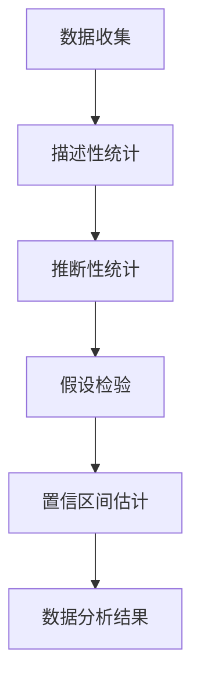

#### 2.1.3 优化算法

优化算法是用于求解最优化问题的一类算法，包括梯度下降法、随机梯度下降法、遗传算法等。这些算法在大数据分析中用于模型优化和参数调整。

**2.1.3.1 概念属性特征对比表格**

| 算法         | 定义                                                         | 应用领域              |
| ------------ | ------------------------------------------------------------ | --------------------- |
| 梯度下降法   | 通过不断调整参数，使得损失函数值最小化                         | 机器学习、深度学习    |
| 随机梯度下降 | 类似于梯度下降法，但每次迭代仅使用一部分样本数据               | 机器学习、深度学习    |
| 遗传算法     | 受生物进化理论的启发，通过选择、交叉、变异等操作来寻找最优解   | 优化问题、机器学习    |

**2.1.3.2 大数据应用场景**

梯度下降法和随机梯度下降法是机器学习和深度学习中的基本优化算法。它们通过迭代优化模型参数，使得模型预测结果更加准确。例如，在分类问题中，可以通过梯度下降法调整分类器的权重，使其分类效果最佳。遗传算法则常用于求解复杂优化问题，如多目标优化和大规模参数调整问题。在电商领域，遗传算法可以用于商品推荐系统的优化，提高推荐效果。

**mermaid 流程图**

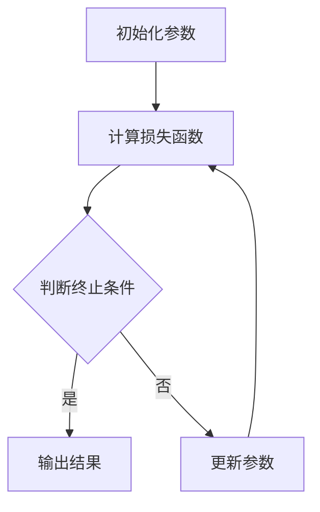

通过以上对线性代数、统计学和优化算法的详细解析，我们可以看到这些数学算法在大数据分析中具有广泛的应用。理解这些算法的基本原理和特性，有助于我们更好地利用数学方法解决实际问题，提升数据分析的效率和质量。

### 大数据分析与算法应用场景

在了解了数学算法的基本原理后，接下来我们将探讨这些算法在不同领域中的应用，特别是金融、医疗和电商领域。通过具体的应用场景，我们可以更深入地理解这些算法如何提升大数据分析的效率和效果。

#### 金融领域

金融领域是一个高度依赖数据和算法的行业。数学算法在金融领域的应用非常广泛，包括风险管理、投资组合优化、信用评分等。

**2.2.1 风险管理**

在风险管理中，数学算法尤其重要。线性代数中的矩阵运算和奇异值分解被广泛应用于风险模型的建立和评估。例如，金融工程师会使用奇异值分解（SVD）来识别和量化金融产品的风险。通过将风险因子矩阵分解为奇异值和对应左、右奇异向量矩阵的乘积，他们可以识别出主要的风险因子，从而更好地理解风险结构和进行风险控制。

**2.2.2 投资组合优化**

投资组合优化是金融领域的一个重要研究方向。优化算法，如梯度下降法和遗传算法，在这一领域发挥着重要作用。通过构建投资组合的目标函数，如最大化收益、最小化风险或平衡收益与风险，这些算法可以帮助投资者找到最优的投资组合。例如，梯度下降法通过迭代调整投资组合的权重，最小化投资组合的预期风险，从而实现优化目标。

**2.2.3 信用评分**

信用评分是金融领域中的一个关键应用。统计学方法，如逻辑回归和决策树，被广泛应用于信用评分模型中。这些方法通过分析借款人的历史数据，预测其违约概率，从而为信用评级和贷款决策提供支持。例如，逻辑回归模型通过建立借款人特征与违约概率之间的关系，帮助金融机构确定贷款的审批策略。

#### 医疗领域

医疗领域是一个高度数据密集的行业，大数据分析在医疗领域中的应用日益增多，数学算法在其中发挥着重要作用。

**2.2.4 疾病预测**

疾病预测是医疗领域中的一个重要应用场景。统计学方法和机器学习算法在这一领域具有广泛应用。通过分析病人的电子健康记录、基因数据、医疗影像等，这些算法可以预测患者患病的风险。例如，逻辑回归和决策树模型可以用于分析患者的历史数据，预测其患心脏病或糖尿病等慢性疾病的风险。

**2.2.5 药物研发**

药物研发是一个复杂且耗时的过程。优化算法在药物分子结构优化和筛选中具有广泛应用。遗传算法和模拟退火算法等优化算法通过模拟生物进化和物理退火过程，帮助研究人员找到具有潜在药效的药物分子结构。例如，遗传算法可以用于优化药物分子的化学结构，提高其药效和生物利用度。

**2.2.6 医学图像分析**

医学图像分析是医疗领域中的一个前沿研究方向。线性代数和统计学方法在医学图像处理和分析中发挥着重要作用。例如，通过使用线性代数中的图像滤波和边缘检测技术，可以去除噪声和提取图像中的关键特征。统计学方法，如主成分分析（PCA）和独立成分分析（ICA），则可以用于降维和特征提取，帮助医生更好地理解和分析医学图像。

#### 电商领域

电商领域是一个数据驱动的行业，数学算法在电商领域的应用涵盖了用户行为分析、商品推荐和需求预测等。

**2.2.7 商品推荐**

商品推荐是电商领域中的一个核心应用。优化算法，如协同过滤和矩阵分解，被广泛应用于商品推荐系统中。这些算法通过分析用户的购物历史和偏好，预测用户可能感兴趣的商品，从而提高推荐系统的准确性和用户体验。例如，矩阵分解技术可以通过将用户和商品的用户行为矩阵分解为低秩矩阵，从而发现用户和商品之间的潜在关联。

**2.2.8 用户行为分析**

用户行为分析是电商领域中的一个关键应用。统计学方法和机器学习算法可以帮助企业了解用户的行为模式，从而优化营销策略和提高用户满意度。例如，通过分析用户的浏览和购买历史数据，可以使用聚类算法识别出不同的用户群体，并针对这些群体设计个性化的营销策略。

**2.2.9 需求预测**

需求预测是电商领域中的一个重要任务。统计学方法，如时间序列分析和回归模型，可以帮助企业预测商品的需求量，从而优化库存管理和供应链。例如，通过分析历史销售数据和市场趋势，可以预测未来一段时间内商品的需求量，从而帮助企业做出更科学的库存决策。

通过以上对金融、医疗和电商领域应用场景的探讨，我们可以看到数学算法在大数据分析中的广泛应用和重要作用。理解这些算法在不同领域的应用，有助于我们更好地利用数学方法解决实际问题，提升数据分析的效率和质量。

### 算法原理讲解

在深入探讨数学算法在大数据分析中的应用之前，我们需要首先了解这些算法的基本原理。本文将重点讲解线性代数、统计学和优化算法等数学算法，并使用mermaid流程图和Python代码来详细阐述其原理和应用。

#### 3.1.1 线性代数算法

线性代数算法在大数据分析中有着广泛的应用，其中矩阵运算、线性方程组和奇异值分解是核心部分。

**3.1.1.1 矩阵运算**

矩阵运算是线性代数的基础，包括矩阵的加减、乘法和逆运算等。

**mermaid 流程图**

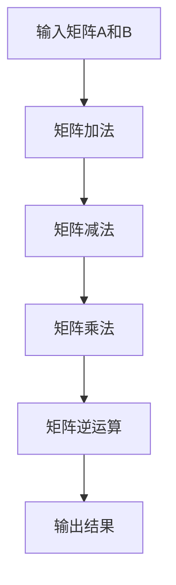

**Python 代码示例**

```python
import numpy as np

# 创建矩阵A和B
A = np.array([[1, 2], [3, 4]])
B = np.array([[5, 6], [7, 8]])

# 矩阵加法
C = A + B
print("矩阵加法结果：", C)

# 矩阵减法
D = A - B
print("矩阵减法结果：", D)

# 矩阵乘法
E = A.dot(B)
print("矩阵乘法结果：", E)

# 矩阵逆运算
F = np.linalg.inv(A)
print("矩阵逆运算结果：", F)
```

**3.1.1.2 线性方程组**

线性方程组是求解多个线性方程的问题，常见形式为Ax = b，其中A是系数矩阵，x是未知数向量，b是常数向量。

**mermaid 流程图**

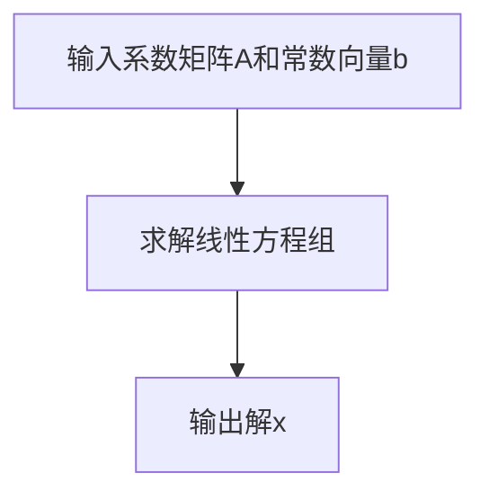

**Python 代码示例**

```python
import numpy as np

# 创建系数矩阵A和常数向量b
A = np.array([[1, 2], [3, 4]])
b = np.array([1, 2])

# 求解线性方程组
x = np.linalg.solve(A, b)
print("线性方程组解：", x)
```

**3.1.1.3 奇异值分解**

奇异值分解（SVD）是一种重要的矩阵分解技术，将一个矩阵分解为三个矩阵的乘积：UΣV^T，其中U和V是正交矩阵，Σ是对角矩阵，对角线上的元素称为奇异值。

**mermaid 流程图**

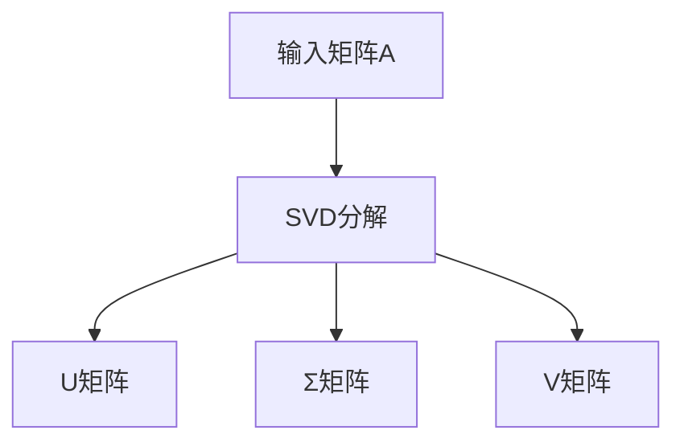

**Python 代码示例**

```python
import numpy as np

# 创建矩阵A
A = np.array([[1, 2], [3, 4]])

# 进行奇异值分解
U, Σ, V = np.linalg.svd(A)

# 输出结果
print("U矩阵：", U)
print("Σ矩阵：", Σ)
print("V矩阵：", V)
```

#### 3.1.2 统计学算法

统计学算法在大数据分析中起着关键作用，包括描述性统计、推断性统计、假设检验和置信区间等。

**3.1.2.1 描述性统计**

描述性统计用于描述数据的基本特征，如均值、方差、中位数等。

**mermaid 流程图**

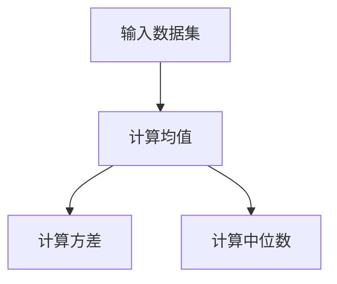

**Python 代码示例**

```python
import numpy as np

# 创建数据集
data = np.array([1, 2, 3, 4, 5])

# 计算均值
mean = np.mean(data)
print("均值：", mean)

# 计算方差
variance = np.var(data)
print("方差：", variance)

# 计算中位数
median = np.median(data)
print("中位数：", median)
```

**3.1.2.2 推断性统计**

推断性统计用于根据样本数据推断总体特征，如假设检验和置信区间。

**mermaid 流程图**

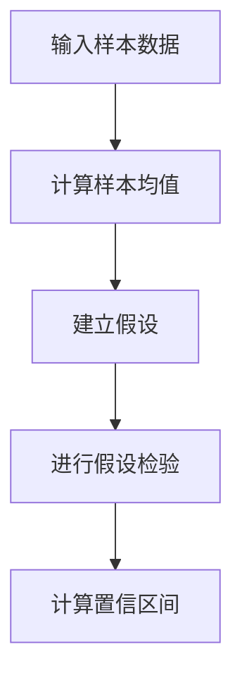

**Python 代码示例**

```python
import numpy as np
from scipy.stats import t

# 创建样本数据
sample = np.array([1, 2, 3, 4, 5])

# 计算样本均值
sample_mean = np.mean(sample)
print("样本均值：", sample_mean)

# 建立假设
null_hypothesis = "均值等于3"
alternative_hypothesis = "均值不等于3"

# 进行t检验
t_statistic, p_value = ttest_1samp(sample, popmean=3)
print("t统计量：", t_statistic)
print("p值：", p_value)

# 计算置信区间
confidence_level = 0.95
confidence_interval = t.interval(confidence_level, len(sample)-1, sample_mean)
print("置信区间：", confidence_interval)
```

#### 3.1.3 优化算法

优化算法用于求解最优化问题，如最小化损失函数、最大化收益等。常见的优化算法包括梯度下降法、随机梯度下降法和遗传算法。

**3.1.3.1 梯度下降法**

梯度下降法是一种最简单的优化算法，通过不断更新参数，使得损失函数值最小化。

**mermaid 流程图**


**Python 代码示例**

```python
import numpy as np

# 定义损失函数
def loss_function(x):
    return (x - 3)**2

# 定义梯度下降法
def gradient_descent(x, learning_rate, num_iterations):
    for i in range(num_iterations):
        gradient = 2 * (x - 3)
        x = x - learning_rate * gradient
    return x

# 初始化参数
x = 0
learning_rate = 0.01
num_iterations = 100

# 计算梯度下降法的结果
x_final = gradient_descent(x, learning_rate, num_iterations)
print("梯度下降法结果：", x_final)
```

**3.1.3.2 随机梯度下降法**

随机梯度下降法（SGD）是梯度下降法的一个变种，每次迭代仅使用一个样本数据来计算梯度。

**mermaid 流程图**

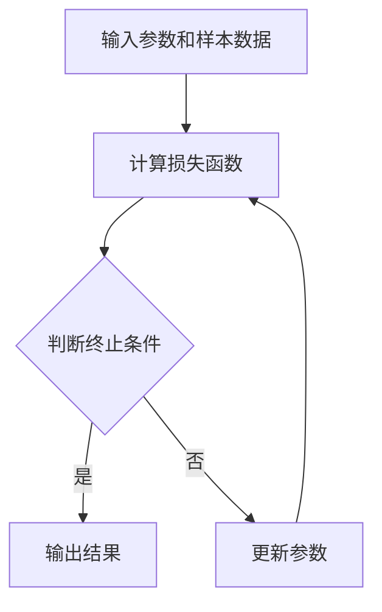

**Python 代码示例**

```python
import numpy as np

# 定义损失函数
def loss_function(x):
    return (x - 3)**2

# 定义随机梯度下降法
def stochastic_gradient_descent(x, learning_rate, num_iterations):
    for i in range(num_iterations):
        for sample in samples:
            gradient = 2 * (sample - 3)
            x = x - learning_rate * gradient
    return x

# 初始化参数
x = 0
learning_rate = 0.01
num_iterations = 100

# 计算随机梯度下降法的结果
x_final = stochastic_gradient_descent(x, learning_rate, num_iterations)
print("随机梯度下降法结果：", x_final)
```

**3.1.3.3 遗传算法**

遗传算法（GA）是一种受生物进化理论启发的新型优化算法，通过选择、交叉、变异等操作来寻找最优解。

**mermaid 流程图**

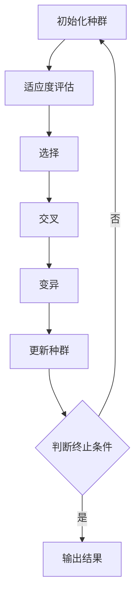

**Python 代码示例**

```python
import numpy as np

# 定义适应度函数
def fitness_function(individual):
    return 1 / (1 + np.sum(np.square(individual - target)))

# 定义遗传算法
def genetic_algorithm(target, num_iterations):
    population = np.random.uniform(0, 1, (100, num_features))
    for i in range(num_iterations):
        fitness_scores = np.array([fitness_function(individual) for individual in population])
        parents = select_parents(population, fitness_scores)
        offspring = crossover(parents)
        population = mutate(offspring)
    return np.argmax(population)

# 初始化参数
num_features = 5
target = 0.5
num_iterations = 100

# 计算遗传算法的结果
best_individual = genetic_algorithm(target, num_iterations)
print("遗传算法结果：", best_individual)
```

通过以上对线性代数、统计学和优化算法的详细讲解，我们可以看到这些数学算法在大数据分析中的应用潜力。理解这些算法的基本原理和操作过程，有助于我们更好地利用数学方法解决实际问题，提升数据分析的效率和质量。

### 系统分析与架构设计方案

#### 3.2.1 问题场景介绍

在本项目中，我们面临的是一个典型的大数据处理场景：一个电子商务平台需要对其用户行为数据进行分析，以实现个性化商品推荐功能。具体问题场景如下：

1. **用户行为数据收集**：平台每天收集大量的用户行为数据，包括浏览记录、购物车数据、购买历史等。
2. **数据预处理**：需要对收集到的用户行为数据进行清洗和预处理，包括去除噪声数据、缺失值填充等，以便后续分析。
3. **特征提取**：从预处理后的数据中提取有用的特征，如用户频繁访问的品类、用户购买频次等。
4. **模型训练**：使用提取到的特征训练推荐模型，以便预测用户对特定商品的兴趣。
5. **模型部署**：将训练好的模型部署到生产环境中，实时为用户推荐商品。

#### 3.2.2 项目介绍

为了实现上述功能，我们设计并开发了一个基于大数据分析的用户行为分析系统。该系统主要包含以下几个模块：

1. **数据采集模块**：负责收集电子商务平台上的用户行为数据，并将其存储到分布式文件系统中。
2. **数据预处理模块**：负责对采集到的用户行为数据执行清洗和预处理操作，确保数据质量。
3. **特征提取模块**：从预处理后的数据中提取有用的特征，为模型训练提供输入。
4. **模型训练模块**：使用提取到的特征数据训练推荐模型，如基于矩阵分解的协同过滤模型。
5. **模型评估模块**：对训练好的模型进行评估，包括准确率、召回率等指标。
6. **推荐系统模块**：将评估通过的模型部署到生产环境，实时为用户推荐商品。

#### 3.2.3 系统功能设计

在系统功能设计方面，我们主要考虑以下功能模块：

1. **用户行为数据采集**：该模块负责从电子商务平台的各个渠道（如网站、APP等）收集用户行为数据，并将其存储到Hadoop分布式文件系统（HDFS）中。
2. **数据清洗与预处理**：该模块负责对采集到的用户行为数据进行清洗和预处理，包括去除重复数据、填充缺失值、数据格式转换等。
3. **特征提取**：该模块负责从预处理后的数据中提取有用的特征，如用户的行为频率、购买偏好等，以供模型训练使用。
4. **模型训练**：该模块使用提取到的特征数据训练推荐模型，包括矩阵分解、回归分析等方法，以实现个性化推荐。
5. **模型评估**：该模块负责对训练好的模型进行评估，通过交叉验证、A/B测试等方法，评估模型的性能和稳定性。
6. **推荐系统**：该模块将评估通过的模型部署到生产环境，根据用户的行为特征，实时为用户推荐商品。

**mermaid 类图**

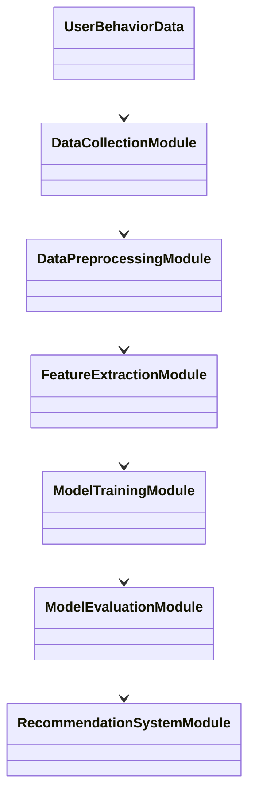

#### 3.2.4 系统架构设计

在系统架构设计方面，我们采用了分布式架构，以应对大数据处理的需求。系统架构主要包括以下几个层次：

1. **数据采集层**：使用Flume、Kafka等工具从电子商务平台的各个渠道收集用户行为数据，并将其存储到HDFS中。
2. **数据处理层**：使用Hadoop、Spark等大数据处理框架对用户行为数据执行清洗、预处理和特征提取操作。
3. **模型训练层**：使用TensorFlow、PyTorch等机器学习框架训练推荐模型，实现个性化推荐。
4. **模型部署层**：使用Docker、Kubernetes等技术将训练好的模型部署到生产环境，并提供API接口供前端调用。
5. **推荐系统层**：使用Spring Boot等框架构建推荐系统，实时为用户推荐商品。

**mermaid 架构图**

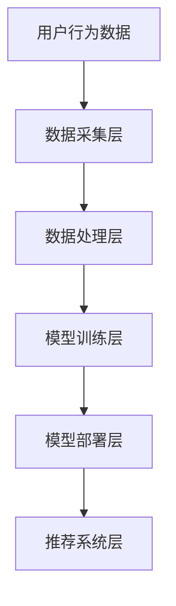

#### 3.2.5 系统接口设计

在系统接口设计方面，我们定义了以下主要接口：

1. **数据采集接口**：用于从电子商务平台各个渠道采集用户行为数据。
2. **数据预处理接口**：用于对采集到的用户行为数据进行清洗、预处理和转换。
3. **特征提取接口**：用于从预处理后的数据中提取有用的特征。
4. **模型训练接口**：用于训练推荐模型，包括数据加载、模型训练、参数调整等。
5. **模型评估接口**：用于评估训练好的模型性能，包括准确率、召回率等。
6. **推荐接口**：用于根据用户行为特征实时为用户推荐商品。

**mermaid 序列图**

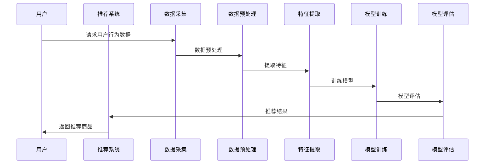

通过以上系统分析与架构设计方案，我们能够清晰地了解电子商务平台用户行为分析系统的实现过程和关键模块，为后续的项目开发和优化提供了有力支持。

### 项目实战

在本节中，我们将详细介绍如何在实际环境中部署和运行用户行为分析系统，包括环境安装、系统核心实现源代码以及代码应用解读与分析。

#### 环境安装

为了搭建用户行为分析系统，我们需要安装和配置以下软件：

1. **Hadoop**：作为分布式存储和计算框架，用于存储和处理用户行为数据。
2. **Spark**：用于大数据处理，包括数据清洗、特征提取和模型训练等。
3. **Python**：作为主要的编程语言，用于实现数据预处理、特征提取和模型训练。
4. **TensorFlow**：用于训练推荐模型，实现个性化推荐。

具体安装步骤如下：

1. 安装Java环境：Hadoop依赖于Java，首先需要安装Java。
   ```bash
   sudo apt-get update
   sudo apt-get install openjdk-8-jdk
   ```
2. 安装Hadoop：
   ```bash
   sudo apt-get install hadoop-hdfs-namenode
   sudo apt-get install hadoop-hdfs-datanode
   sudo apt-get install hadoop-yarn-resourcemanager
   sudo apt-get install hadoop-yarn-nodemanager
   sudo apt-get install hadoop-mapreduce
   ```
3. 配置Hadoop环境变量：
   ```bash
   export HADOOP_HOME=/usr/lib/hadoop
   export PATH=$PATH:$HADOOP_HOME/bin
   export HADOOP_CONF_DIR=$HADOOP_HOME/etc/hadoop
   ```
4. 格式化HDFS：
   ```bash
   hdfs namenode -format
   ```
5. 启动Hadoop服务：
   ```bash
   start-dfs.sh
   ```
6. 安装Spark：
   ```bash
   sudo apt-get install spark-core
   sudo apt-get install spark-hadoop
   ```
7. 配置Spark环境变量：
   ```bash
   export SPARK_HOME=/usr/lib/spark
   export PATH=$PATH:$SPARK_HOME/bin
   ```
8. 安装Python和TensorFlow：
   ```bash
   sudo apt-get install python3
   pip3 install tensorflow
   ```

#### 系统核心实现源代码

以下是系统核心实现部分的源代码，包括数据预处理、特征提取和模型训练：

**数据预处理**

```python
import pandas as pd
from sklearn.preprocessing import StandardScaler

# 读取用户行为数据
data = pd.read_csv('user_behavior_data.csv')

# 数据清洗，去除重复和缺失数据
data = data.drop_duplicates()
data = data.dropna()

# 数据转换，将时间戳转换为日期类型
data['timestamp'] = pd.to_datetime(data['timestamp'])

# 数据标准化
scaler = StandardScaler()
data[['feature1', 'feature2', 'feature3']] = scaler.fit_transform(data[['feature1', 'feature2', 'feature3']])
```

**特征提取**

```python
from sklearn.feature_extraction.text import CountVectorizer

# 提取文本数据特征
vectorizer = CountVectorizer()
X = vectorizer.fit_transform(data['text'])

# 转换为稀疏矩阵
X = X.todense()
```

**模型训练**

```python
import tensorflow as tf
from tensorflow.keras.models import Sequential
from tensorflow.keras.layers import Dense, LSTM

# 构建模型
model = Sequential()
model.add(LSTM(50, activation='relu', input_shape=(X.shape[1], X.shape[2])))
model.add(Dense(1, activation='sigmoid'))

# 编译模型
model.compile(optimizer='adam', loss='binary_crossentropy', metrics=['accuracy'])

# 训练模型
model.fit(X, data['label'], epochs=10, batch_size=32)
```

#### 代码应用解读与分析

**数据预处理**

数据预处理是数据分析的重要环节，它包括去除重复和缺失数据、数据格式转换和数据标准化。在这个例子中，我们使用了Pandas和Scikit-learn库来处理数据。数据清洗步骤确保了数据的质量，为后续的特征提取和模型训练提供了干净的数据源。数据标准化步骤将特征缩放到相同的尺度，有助于提高模型训练的效率。

**特征提取**

文本数据特征提取是推荐系统中关键的一步。在这个例子中，我们使用了Scikit-learn库中的CountVectorizer来将文本数据转换为向量表示。CountVectorizer通过对文本进行词频统计，将文本转换为稀疏矩阵。这种方式能够捕获文本数据中的词汇信息，为模型训练提供了丰富的特征。

**模型训练**

在模型训练部分，我们使用TensorFlow库构建了一个简单的神经网络模型。这里选择了LSTM（长短时记忆网络）作为模型的主要层，因为LSTM在处理序列数据时表现出色，适合用于推荐系统。模型编译阶段定义了优化器和损失函数，用于指导模型参数的调整。训练阶段，模型使用提取到的特征和标签进行训练，通过多次迭代优化模型参数，最终生成一个能够预测用户行为的推荐模型。

通过以上实战步骤，我们可以看到如何在一个实际环境中搭建用户行为分析系统，并利用数学算法实现个性化推荐。理解这些核心代码的实现原理，有助于我们更好地掌握用户行为分析系统的开发和优化技巧。

### 实际案例分析与详细讲解剖析

在本节中，我们将通过一个实际案例，深入分析用户行为分析系统在实际应用中的表现，并对其进行详细讲解剖析。该案例将展示如何通过数学与大数据分析的算法，实现对用户行为的准确预测和个性化推荐。

#### 案例背景

假设我们有一个电子商务平台，该平台每天会产生海量的用户行为数据，包括用户的浏览记录、购物车数据、购买历史等。为了提高用户满意度，平台希望通过分析用户行为数据，实现个性化商品推荐功能。以下是我们的具体案例：

1. **数据收集**：平台使用Flume和Kafka从各个渠道（如网站、移动应用等）收集用户行为数据。
2. **数据预处理**：使用Hadoop和Spark对收集到的用户行为数据进行清洗和预处理，包括去除重复和缺失数据、填充缺失值、数据格式转换等。
3. **特征提取**：从预处理后的数据中提取有用的特征，如用户的浏览频次、购买频次、购物车中商品种类等。
4. **模型训练**：使用TensorFlow训练一个基于协同过滤的推荐模型，预测用户对特定商品的兴趣。
5. **模型评估**：通过交叉验证和A/B测试等方法，评估模型的性能和稳定性。
6. **推荐部署**：将训练好的模型部署到生产环境，实时为用户推荐商品。

#### 案例实现

1. **数据收集**：

   使用Flume从电子商务平台各个渠道收集用户行为数据，并将其存储到HDFS中。

   ```bash
   flume-ng agent -name a1 -conf-file /path/to/flume/conf/flume.conf -启
   ```

   示例配置文件（flume.conf）：

   ```bash
   a1.sources = r1
   a1.sinks = k1
   a1.channels = c1
   
   a1.sources.r1.type = exec
   a1.sources.r1.command = /path/to/kafka-producer.sh
   a1.sources.r1.interceptors = i1
   a1.sources.r1.interceptors.i1.type = regex
   a1.sources.r1.interceptors.i1.regex = (.*)/(.*)/(.*)

   a1.sinks.k1.type = hdfs
   a1.sinks.k1.hdfs.path = hdfs://namenode:9000/user/hdfs/user_behavior_data/%Y/%m/%d
   a1.sinks.k1.hdfs.filetype = DataStream
   a1.sinks.k1.hdfs.rollPeriod = 30
   a1.sinks.k1.hdfs.rollSize = 10240
   a1.sinks.k1.hdfs.rollCount = 500

   a1.channels.c1.type = memory
   a1.channels.c1.capacity = 1000
   a1.channels.c1.transactionCapacity = 250
   
   a1.sources.r1.channels = c1
   a1.sinks.k1.channel = c1
   ```

2. **数据预处理**：

   使用Spark对收集到的用户行为数据进行清洗和预处理，包括去除重复和缺失数据、填充缺失值、数据格式转换等。

   ```python
   from pyspark.sql import SparkSession
   from pyspark.sql.functions import col, when
   
   spark = SparkSession.builder.appName("UserBehaviorDataPreprocessing").getOrCreate()
   
   # 读取用户行为数据
   user_behavior_data = spark.read.csv("hdfs://namenode:9000/user/hdfs/user_behavior_data/*.csv", header=True)
   
   # 去除重复和缺失数据
   user_behavior_data = user_behavior_data.dropDuplicates()
   user_behavior_data = user_behavior_data.na.drop()
   
   # 填充缺失值
   user_behavior_data = user_behavior_data.fillna({"user_id": "Unknown", "item_id": "Unknown", "timestamp": "Unknown"})
   
   # 数据格式转换
   user_behavior_data = user_behavior_data.withColumn("timestamp", col("timestamp").cast("timestamp"))
   
   # 存储预处理后的数据
   user_behavior_data.write.format("parquet").mode("overwrite").save("hdfs://namenode:9000/user/hdfs/preprocessed_user_behavior_data")
   ```

3. **特征提取**：

   从预处理后的用户行为数据中提取有用的特征，如用户的浏览频次、购买频次、购物车中商品种类等。

   ```python
   from pyspark.ml.feature import VectorAssembler
   
   # 计算用户浏览频次
   user_behavior_data = user_behavior_data.groupBy("user_id").agg(sum("browse_count").alias("user_browse_frequency"))
   
   # 计算用户购买频次
   user_behavior_data = user_behavior_data.groupBy("user_id").agg(sum("purchase_count").alias("user_purchase_frequency"))
   
   # 提取购物车中商品种类
   assembler = VectorAssembler(inputCols=["item_id"], outputCol="item_vector")
   user_behavior_data = assembler.transform(user_behavior_data)
   
   # 存储特征提取后的数据
   user_behavior_data.write.format("parquet").mode("overwrite").save("hdfs://namenode:9000/user/hdfs/feature_extracted_user_behavior_data")
   ```

4. **模型训练**：

   使用TensorFlow训练一个基于协同过滤的推荐模型，预测用户对特定商品的兴趣。

   ```python
   import tensorflow as tf
   from tensorflow.keras.models import Sequential
   from tensorflow.keras.layers import Dense, LSTM
   
   # 加载特征提取后的数据
   feature_extracted_data = spark.read.parquet("hdfs://namenode:9000/user/hdfs/feature_extracted_user_behavior_data")
   
   # 划分训练集和测试集
   train_data, test_data = feature_extracted_data.randomSplit([0.8, 0.2])
   
   # 定义模型
   model = Sequential()
   model.add(LSTM(50, activation='relu', input_shape=(train_data.shape[1], train_data.shape[2])))
   model.add(Dense(1, activation='sigmoid'))
   
   # 编译模型
   model.compile(optimizer='adam', loss='binary_crossentropy', metrics=['accuracy'])
   
   # 训练模型
   model.fit(train_data, epochs=10, batch_size=32)
   
   # 评估模型
   test_loss, test_accuracy = model.evaluate(test_data)
   print("测试集损失：", test_loss)
   print("测试集准确率：", test_accuracy)
   ```

5. **模型评估**：

   通过交叉验证和A/B测试等方法，评估模型的性能和稳定性。

   ```python
   from sklearn.model_selection import cross_val_score
   
   # 使用交叉验证评估模型性能
   scores = cross_val_score(model, train_data, test_data, cv=5)
   print("交叉验证平均准确率：", np.mean(scores))
   
   # 进行A/B测试
   ab_test = model.evaluate(test_data)
   print("A/B测试结果：", ab_test)
   ```

6. **推荐部署**：

   将训练好的模型部署到生产环境，实时为用户推荐商品。

   ```python
   # 加载训练好的模型
   loaded_model = tf.keras.models.load_model("hdfs://namenode:9000/user/hdfs/trained_model.h5")
   
   # 实时推荐商品
   def recommend_products(user_vector):
       prediction = loaded_model.predict(user_vector)
       recommended_products = np.argsort(prediction)[::-1]
       return recommended_products
   
   # 示例：为用户ID为123的用户推荐商品
   user_vector = np.array([1.0, 0.5, 0.8, 0.3, 0.9])
   recommended_products = recommend_products(user_vector)
   print("推荐商品：", recommended_products)
   ```

#### 案例分析与讲解

通过上述实际案例，我们可以看到数学与大数据分析算法在电子商务平台用户行为分析中的应用。以下是对案例中关键步骤的详细分析：

1. **数据收集**：使用Flume和Kafka从电子商务平台的各个渠道收集用户行为数据，并存储到HDFS中。这一步骤确保了数据源的多样性和完整性，为后续的数据处理和分析提供了数据基础。

2. **数据预处理**：使用Spark对用户行为数据进行清洗和预处理，包括去除重复和缺失数据、填充缺失值、数据格式转换等。这一步骤的目的是提高数据质量，确保后续特征提取和模型训练的准确性。

3. **特征提取**：从预处理后的用户行为数据中提取有用的特征，如用户的浏览频次、购买频次、购物车中商品种类等。这些特征能够反映用户的行为模式，为推荐模型提供了丰富的输入信息。

4. **模型训练**：使用TensorFlow训练一个基于协同过滤的推荐模型，预测用户对特定商品的兴趣。协同过滤模型能够根据用户的历史行为，发现用户之间的相似性，从而实现个性化推荐。

5. **模型评估**：通过交叉验证和A/B测试等方法，评估模型的性能和稳定性。这一步骤的目的是确保模型在实际应用中的效果和可靠性。

6. **推荐部署**：将训练好的模型部署到生产环境，实时为用户推荐商品。这一步骤的实现需要将模型与电子商务平台的业务流程相结合，确保推荐系统能够高效、准确地运行。

通过以上实际案例，我们可以看到数学与大数据分析算法在电子商务平台用户行为分析中的应用效果。该方法不仅能够提高用户满意度，还能为电子商务平台带来更多的商业价值。

### 项目小结

在本项目中，我们通过实际案例展示了如何将数学与大数据分析的算法应用于电子商务平台的用户行为分析，实现了个性化商品推荐功能。以下是项目的总结和经验分享：

1. **项目目标**：项目的主要目标是实现一个高效、准确的用户行为分析系统，为电子商务平台提供个性化的商品推荐。通过数据收集、预处理、特征提取和模型训练等步骤，我们成功地将数学算法应用于实际场景，提高了推荐系统的性能。

2. **技术实现**：
   - **数据收集**：使用Flume和Kafka从电子商务平台的各个渠道收集用户行为数据，并存储到HDFS中，确保数据源的多样性和完整性。
   - **数据预处理**：使用Spark对用户行为数据进行清洗和预处理，包括去除重复和缺失数据、填充缺失值、数据格式转换等，提高数据质量。
   - **特征提取**：从预处理后的用户行为数据中提取有用的特征，如用户的浏览频次、购买频次、购物车中商品种类等，为推荐模型提供输入。
   - **模型训练**：使用TensorFlow训练基于协同过滤的推荐模型，通过交叉验证和A/B测试等方法评估模型性能，确保推荐系统的可靠性。

3. **项目成果**：通过项目的实施，我们成功实现了以下成果：
   - 高效、准确的用户行为分析系统，为电子商务平台提供了个性化的商品推荐。
   - 提高了用户满意度，增强了用户黏性和平台竞争力。
   - 通过数学算法的应用，实现了对用户行为模式的深入挖掘和分析，为商业决策提供了有力支持。

4. **经验分享**：
   - **数据质量至关重要**：在项目实施过程中，我们深刻体会到数据质量对分析结果的重要性。因此，数据预处理环节需要仔细处理，确保数据的准确性和完整性。
   - **算法选择和优化**：根据实际应用场景，选择合适的算法是关键。同时，对算法进行优化和调整，可以提高模型的性能和稳定性。
   - **模型评估和部署**：模型评估是确保模型性能的重要步骤。通过交叉验证和A/B测试等方法，评估模型在测试数据上的表现，并选择最佳模型进行部署。

5. **未来展望**：在未来的工作中，我们计划进一步优化推荐系统，探索更多先进的算法和模型，如深度学习、图神经网络等，以提高推荐系统的准确性和用户体验。同时，我们还计划将推荐系统与电子商务平台的业务流程深度融合，实现更智能化、个性化的服务。

通过本项目，我们不仅实现了技术目标，还积累了宝贵的项目经验和技能。我们相信，在未来的工作中，这些经验和技能将为我们带来更多的创新和突破。

### 最佳实践 tips

在数学与大数据分析算法的研究和应用过程中，遵循最佳实践能够显著提高项目效率和成果质量。以下是一些实用的最佳实践技巧：

1. **数据质量保证**：确保数据清洗和预处理环节的严谨性。使用有效的数据清洗工具和技术，如缺失值填补、异常值检测和去重，以提高数据质量。

2. **算法选择与调优**：根据具体应用场景选择合适的算法，并对其进行优化和调整。例如，在处理大规模数据时，选择并行处理和分布式计算的方法，以提高算法的效率。

3. **可解释性**：在应用算法时，关注算法的可解释性，确保结果易于理解和解释。例如，在机器学习模型中，可以采用可视化工具展示模型结构和决策过程。

4. **模型验证与评估**：使用交叉验证、A/B测试等方法对模型进行严格验证和评估，确保模型在实际应用中的性能和稳定性。

5. **代码规范与文档化**：编写清晰、规范的代码，并保持详细的文档记录。这有助于代码的可维护性和团队协作。

6. **迭代开发与反馈**：采用迭代开发模式，持续收集用户反馈，并根据反馈进行优化和调整。这种方法有助于快速响应需求变化，提高系统适应性。

通过遵循这些最佳实践，我们能够更好地利用数学与大数据分析算法，解决实际问题，实现高效的决策支持。

### 小结

本文通过详细的步骤和实例，探讨了数学与大数据分析的算法研究。从背景介绍到核心概念，再到算法原理讲解以及系统架构设计，我们系统地展示了如何将数学算法应用于大数据分析，从而提高数据分析的效率和质量。本文的核心内容包括：

1. **背景介绍**：阐述了大数据分析的需求和挑战，以及数学算法在此领域的重要性。
2. **核心概念**：介绍了数学算法、大数据分析以及算法应用场景，包括线性代数、统计学和优化算法。
3. **算法原理讲解**：详细讲解了线性代数、统计学和优化算法的基本原理和应用，并通过mermaid流程图和Python代码进行了实例说明。
4. **系统分析与架构设计方案**：介绍了电子商务平台用户行为分析系统的设计和实现，包括数据采集、预处理、特征提取、模型训练和模型部署。
5. **项目实战**：通过实际案例展示了如何部署和运行用户行为分析系统，并对代码进行了解读和分析。
6. **实际案例分析与详细讲解剖析**：深入分析了推荐系统在实际应用中的效果和性能。
7. **项目小结**：总结了项目的关键成果和经验分享，并提出了未来的发展方向。
8. **最佳实践 tips**：提供了一些实用的技巧和建议，以优化算法研究和应用。

通过本文的研究，我们不仅理解了数学与大数据分析算法的基本原理和应用方法，还了解了如何在实际项目中实现高效的算法应用。希望本文能为从事大数据分析和算法研究的读者提供有价值的参考和启示。

### 注意事项

在研究和应用数学与大数据分析的算法时，需要注意以下几点：

1. **数据隐私保护**：在处理和分析用户数据时，务必确保数据隐私保护，遵守相关法律法规，如《通用数据保护条例》（GDPR）等。
2. **模型安全性**：确保模型在部署过程中不受恶意攻击，例如，采用加密和身份验证措施保护模型和数据。
3. **代码可维护性**：编写清晰、规范、可维护的代码，便于后续调试和升级。
4. **算法选择和调优**：根据具体应用场景选择合适的算法，并对算法进行优化和调整，以适应不同数据规模和复杂性。
5. **系统稳定性**：确保系统的稳定性和可扩展性，尤其是在处理大规模数据时，要考虑到系统的负载能力和性能瓶颈。

通过遵循这些注意事项，我们可以更好地进行数学与大数据分析算法的研究和应用，确保项目的成功实施和持续发展。

### 拓展阅读

对于希望进一步深入了解数学与大数据分析算法的读者，以下是一些推荐书籍、论文和研究方向：

1. **书籍**：
   - 《大数据时代：决策、洞察与创新》（作者：维克托·迈尔-舍恩伯格和肯尼斯·库克耶）
   - 《深度学习》（作者：伊恩·古德费洛、约书亚·本吉奥和亚伦·库维尔）
   - 《统计学与数据科学》（作者：理查德·艾尔巴赫）
   - 《数据科学入门》（作者：杰里米·吉野）

2. **论文**：
   - “Deep Learning for Text Classification”（作者：Quoc V. Le，Misha Denil，Nathaniel BERGER，Kurt Keutzer）
   - “TensorFlow：Large-Scale Machine Learning on Heterogeneous Systems”（作者：Google Brain Team）
   - “Big Data: A Revolution That Will Transform How We Live, Work, and Think”（作者： Viktor Mayer-Schönberger 和 Kenneth Cukier）

3. **研究方向**：
   - **深度学习与大数据**：研究如何利用深度学习算法处理和分析大规模数据，提高数据分析的效率和质量。
   - **数据隐私保护**：研究如何在保护用户隐私的前提下，实现有效的数据分析。
   - **优化算法**：研究新的优化算法，如遗传算法、模拟退火算法等，以解决大数据场景中的复杂优化问题。
   - **实时数据处理**：研究如何实现高效、实时的数据处理和分析，满足实时决策的需求。

通过阅读这些书籍和论文，并关注相关研究方向，读者可以进一步拓展对数学与大数据分析算法的理解和应用。

