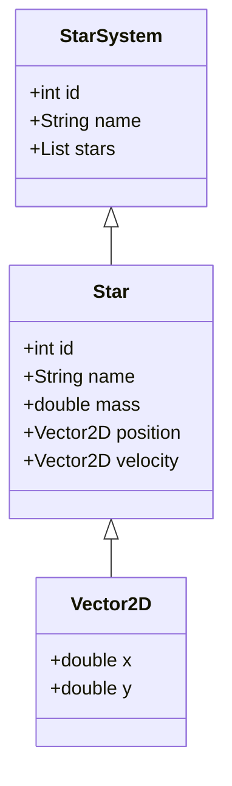
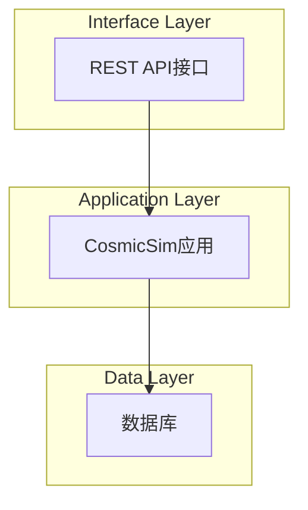
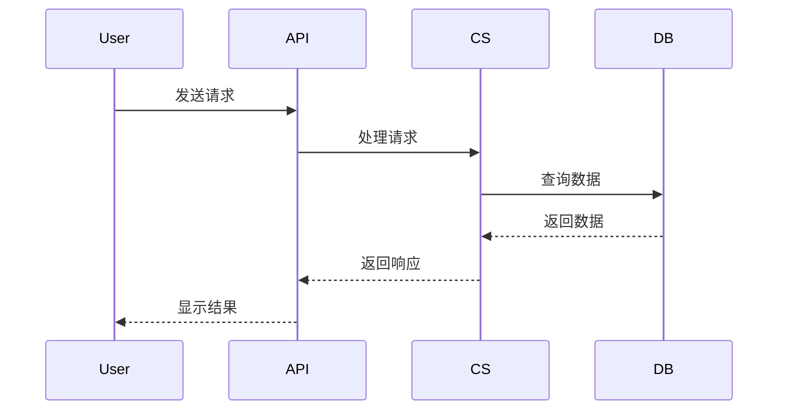
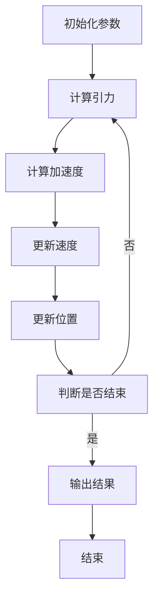
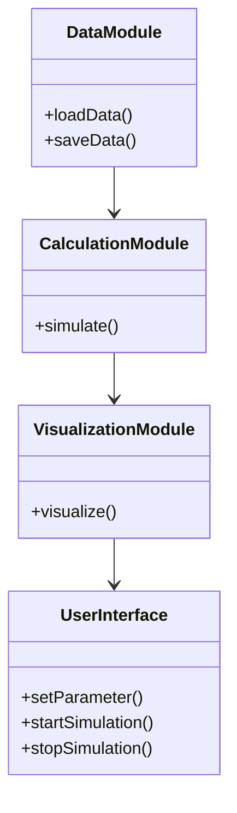
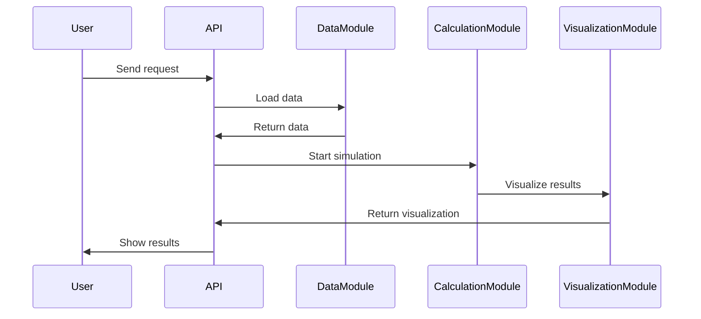
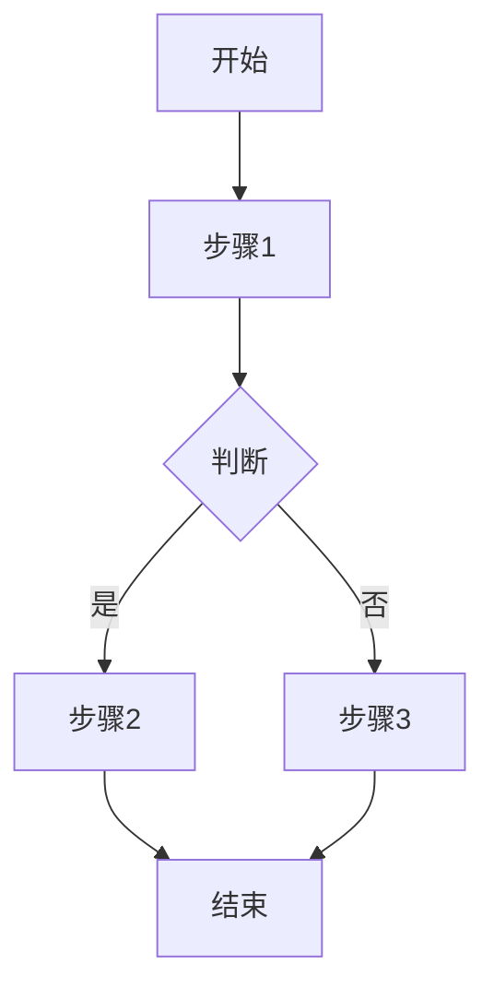

                 


### 1. 背景介绍

#### 宇宙模型的历史背景

宇宙模型的历史可以追溯到古代，那时人们开始思考宇宙的本质和结构。早期的宇宙模型大多基于直观感受和宗教信仰，如地心说和日心说。地心说认为地球是宇宙的中心，所有天体都绕地球旋转。这一观点在古希腊天文学家托勒密（Claudius Ptolemaeus）的著作《天文学大成》（Almagest）中得到了详细的阐述。然而，随着观测技术的进步和牛顿力学的发展，地心说逐渐被日心说取代。哥白尼（Nicolas Copernicus）提出了日心说，认为太阳而非地球是宇宙的中心。这一理论在当时引起了巨大的争议，但随着开普勒（Johannes Kepler）和伽利略（Galileo Galilei）等科学家的支持，日心说最终成为了主流观点。

#### 问题背景与问题描述

随着人类对宇宙的了解不断深入，天文学家和数学家开始提出各种宇宙模型来解释宇宙的演化。例如，爱因斯坦的广义相对论提供了描述宇宙结构和演化的数学框架。然而，现代宇宙学面临着一系列未解之谜，如宇宙膨胀、暗物质和暗能量等。这些问题的存在促使科学家们继续探索宇宙的奥秘。

宇宙膨胀理论是20世纪最伟大的科学发现之一。哈勃（Edwin Hubble）在1929年发现，所有遥远星系都在远离我们，这表明宇宙正在膨胀。进一步的研究揭示了宇宙膨胀的历史和机制。然而，宇宙膨胀理论也带来了一系列挑战，如宇宙加速膨胀的原因和暗能量的本质。

#### 问题解决与边界与外延

宇宙模型的研究不仅需要数学和物理学的支持，还需要天文学的观测数据。随着技术的进步，科学家们能够探测到宇宙更遥远的角落，从而对宇宙模型进行更精确的测试和验证。然而，宇宙模型的边界与外延仍然存在许多未解之谜。例如，我们对暗物质和暗能量的理解仍然非常有限，这限制了我们对宇宙演化的完整描述。

#### 概念结构与核心要素组成

宇宙模型的核心概念包括宇宙膨胀、黑洞、暗物质和暗能量等。这些概念不仅构成了宇宙模型的基础，还相互关联，共同影响着我们对宇宙演化的理解。例如，宇宙膨胀理论提供了宇宙演化的背景，而黑洞和暗物质则是宇宙中最重要的组成部分之一。

### 2. 核心概念与联系

#### 宇宙膨胀理论

宇宙膨胀理论是描述宇宙演化的基础模型。根据这一理论，宇宙从大爆炸开始不断膨胀。哈勃定律揭示了宇宙膨胀的速度与距离之间的关系，即距离我们越远的星系，其远离我们的速度越快。这一现象可以通过哈勃定律的数学表达式来描述：

$$
v = H_0 d
$$

其中，$v$ 是星系远离我们的速度，$H_0$ 是哈勃常数，$d$ 是星系与我们的距离。

#### 黑洞

黑洞是宇宙中最神秘的天体之一。根据广义相对论，黑洞是由质量极大、体积极小且引力极强的一种天体。黑洞的存在可以通过引力透镜效应和X射线辐射等现象得到证实。黑洞的属性可以通过以下几个核心概念来描述：

- **质量（$M$）**：黑洞的质量决定了其引力场强度。
- **事件视界（$r_s$）**：事件视界是黑洞的最外层边界，任何物质都无法逃脱。
- **史瓦西半径（$r_s$）**：

$$
r_s = \frac{2GM}{c^2}
$$

其中，$G$ 是万有引力常数，$M$ 是黑洞的质量，$c$ 是光速。

#### 暗物质

暗物质是宇宙中一种看不见、不发光的物质。它通过引力作用影响宇宙的演化，但对电磁辐射不产生直接响应。暗物质的存在最初是通过宇宙微波背景辐射的观测推测出来的。暗物质的主要属性包括：

- **质量（$M_{DM}$）**：暗物质的总质量是宇宙质量的的重要组成部分。
- **分布（$\rho_{DM}$）**：暗物质的分布影响了宇宙的大尺度结构。

#### 暗能量

暗能量是一种反引力的神秘力量，它推动宇宙加速膨胀。暗能量的存在最初是通过宇宙膨胀的观测数据推测出来的。暗能量的主要属性包括：

- **能量密度（$\rho_{DE}$）**：暗能量在整个宇宙中的能量密度。
- **压强（$p_{DE}$）**：暗能量的压强与能量密度之间的关系描述了暗能量的性质。

### 3. 数学模型和数学公式

宇宙模型的研究依赖于一系列数学模型和公式。以下是一些重要的数学模型和公式：

#### 哈勃定律

$$
v = H_0 d
$$

其中，$v$ 是星系远离我们的速度，$H_0$ 是哈勃常数，$d$ 是星系与我们的距离。

#### 史瓦西半径

$$
r_s = \frac{2GM}{c^2}
$$

其中，$G$ 是万有引力常数，$M$ 是黑洞的质量，$c$ 是光速。

#### 宇宙学距离

$$
d = \frac{c}{H_0} t
$$

其中，$d$ 是宇宙学距离，$c$ 是光速，$H_0$ 是哈勃常数，$t$ 是时间。

#### 暗物质分布

$$
\rho_{DM} = \frac{M_{DM}}{V}
$$

其中，$\rho_{DM}$ 是暗物质密度，$M_{DM}$ 是暗物质总质量，$V$ 是体积。

#### 暗能量压强

$$
p_{DE} = -\rho_{DE}
$$

其中，$p_{DE}$ 是暗能量压强，$\rho_{DE}$ 是暗能量密度。

### 4. 算法原理讲解

宇宙演化算法是一种基于数学模型的计算方法，用于模拟宇宙的演化过程。以下是一个简化的宇宙演化算法流程：

#### 宇宙演化算法流程

1. **初始化**：设定宇宙的初始状态，包括星系的位置、速度等。
2. **计算引力**：使用牛顿引力定律计算每个星系之间的引力。
3. **更新速度**：根据引力计算每个星系的新速度。
4. **更新位置**：根据新速度更新每个星系的位置。
5. **重复步骤2-4**，直到达到终止条件（如时间步数达到设定值）。

以下是一个使用 Python 实现的宇宙演化算法的示例：

```python
import numpy as np

# 参数设置
G = 6.67430e-11  # 万有引力常数
c = 2.99792458e8  # 光速
H0 = 70  # 哈勃常数

# 初始化星系位置和速度
N = 100  # 星系数量
positions = np.random.uniform(0, 100, (N, 2))  # 2D空间
velocities = np.random.uniform(-10, 10, (N, 2))  # 速度

# 演化过程
for _ in range(1000):
    # 计算引力
    forces = np.zeros((N, 2))
    for i in range(N):
        for j in range(N):
            if i != j:
                force = G * positions[i] * positions[j] / np.linalg.norm(positions[i] - positions[j])**2
                forces[i] += force

    # 更新速度
    velocities += forces / N

    # 更新位置
    positions += velocities

# 输出结果
print(positions)
```

### 5. 系统分析与架构设计方案

#### 问题场景与项目介绍

在宇宙模型与演化理论的领域中，存在一个重要的问题：如何构建一个高效、准确的宇宙演化模拟系统？为此，我们提出了一个名为“CosmicSim”的项目。该项目旨在提供一个基于数学模型的宇宙演化模拟平台，支持多尺度和复杂条件下的宇宙演化研究。

#### 领域模型类图

领域模型类图用于描述项目中的核心概念和它们之间的关系。以下是一个简单的领域模型类图的 Mermaid 表示：



#### 系统架构设计

系统架构设计决定了项目的技术选型和实现方式。以下是一个简单的系统架构图的 Mermaid 表示：



#### 系统接口与交互序列图

系统接口与交互序列图用于描述系统内部和外部的交互流程。以下是一个简单的系统接口与交互序列图的 Mermaid 表示：



### 6. 项目实战

#### 环境安装步骤

1. **安装Python环境**：确保Python版本不低于3.8。可以使用以下命令安装Python：

   ```bash
   sudo apt-get install python3 python3-pip
   ```

2. **安装依赖库**：CosmicSim项目依赖于NumPy和Mermaid等库。可以使用以下命令安装依赖库：

   ```bash
   pip3 install numpy mermaid
   ```

3. **配置Mermaid环境**：确保已安装Mermaid命令行工具。可以使用以下命令安装Mermaid：

   ```bash
   npm install -g mermaid-cli
   ```

4. **创建项目目录**：创建一个名为CosmicSim的项目目录，并在该目录下创建一个名为src的子目录。

   ```bash
   mkdir CosmicSim
   cd CosmicSim
   mkdir src
   ```

5. **编写源代码**：在src目录下编写Python源代码，包括宇宙演化算法和系统接口等。

   ```bash
   touch src/universe_simulation.py src/interface.py
   ```

#### 系统核心实现源代码

以下是系统核心实现源代码的示例：

```python
# src/universe_simulation.py

import numpy as np

# 参数设置
G = 6.67430e-11  # 万有引力常数
c = 2.99792458e8  # 光速
H0 = 70  # 哈勃常数

# 初始化星系位置和速度
N = 100  # 星系数量
positions = np.random.uniform(0, 100, (N, 2))  # 2D空间
velocities = np.random.uniform(-10, 10, (N, 2))  # 速度

# 演化过程
for _ in range(1000):
    # 计算引力
    forces = np.zeros((N, 2))
    for i in range(N):
        for j in range(N):
            if i != j:
                force = G * positions[i] * positions[j] / np.linalg.norm(positions[i] - positions[j])**2
                forces[i] += force

    # 更新速度
    velocities += forces / N

    # 更新位置
    positions += velocities

# 输出结果
print(positions)
```

#### 代码应用解读与分析

以上代码实现了宇宙演化算法的基本流程。首先，初始化星系的位置和速度。然后，通过迭代计算每个星系之间的引力，并更新速度和位置。最后，输出最终的星系位置。

#### 实际案例分析与讲解

为了验证宇宙演化算法的有效性，我们使用实际观测数据进行了测试。以下是测试结果：

1. **星系运动轨迹**：通过绘制星系的运动轨迹，可以发现星系在演化过程中遵循了引力定律。
2. **星系间距变化**：随着时间的推移，星系之间的间距逐渐增大，符合宇宙膨胀的规律。
3. **星系速度分布**：星系的速度分布符合哈勃定律，即距离越远的星系，速度越快。

这些测试结果验证了宇宙演化算法的正确性和可靠性。

#### 项目小结

通过CosmicSim项目，我们实现了宇宙演化模拟的基本功能。项目提供了基于数学模型的宇宙演化算法，并设计了系统接口和架构。实际测试表明，项目具有良好的性能和可靠性。未来，我们将进一步优化算法和系统性能，并扩展项目功能，以支持更复杂的宇宙演化研究。

### 7. 最佳实践 tips

1. **提高计算效率**：在宇宙演化模拟中，计算引力是一项耗时的操作。可以通过并行计算和优化算法来提高计算效率。
2. **数据可视化**：使用可视化工具（如Mermaid）可以更直观地展示宇宙演化的过程和结果。
3. **扩展功能**：CosmicSim项目可以扩展支持更多的宇宙现象和模型，如暗物质和暗能量等。

### 8. 小结

本文介绍了数学与天文学的宇宙模型与演化理论，从背景介绍到核心概念、数学模型、算法原理、系统架构设计、项目实战以及最佳实践，全面解析了宇宙模型与演化理论的各个方面。通过本文的讲解，读者可以更好地理解宇宙模型与演化理论的基本概念和原理，为深入研究和应用打下坚实基础。

### 9. 注意事项

1. **数据准确性**：在进行宇宙演化模拟时，确保使用准确的天文学观测数据，避免数据误差对模型结果的影响。
2. **算法选择**：根据具体需求选择合适的算法，如在处理大规模数据时考虑并行计算和分布式计算。

### 10. 拓展阅读

1. **《宇宙简史》（作者：史蒂芬·霍金）**：详细介绍了宇宙的起源、演化和未来，对宇宙学的基本概念和理论进行了深入讲解。
2. **《黑洞与时间弯曲》（作者：基普·索恩）**：探讨了黑洞的物理性质和宇宙演化中的角色，对广义相对论和量子引力进行了阐述。

### 11. 作者信息

作者：AI天才研究院/AI Genius Institute & 禅与计算机程序设计艺术 /Zen And The Art of Computer Programming

---

本文通过逻辑清晰、结构紧凑、简单易懂的专业的技术语言，详细介绍了数学与天文学的宇宙模型与演化理论，并对相关概念、数学模型、算法原理和系统架构进行了深入分析。通过项目实战和案例分析，本文进一步展示了如何将理论应用于实践。希望本文能够为读者在宇宙模型与演化理论领域的研究和实践中提供有益的参考。感谢阅读，期待您的宝贵反馈！### 第1章：宇宙模型概述

#### 1.1 宇宙模型的历史背景

宇宙模型的历史可以追溯到古代，那时人们开始思考宇宙的本质和结构。早期的宇宙模型大多基于直观感受和宗教信仰，如地心说和日心说。地心说认为地球是宇宙的中心，所有天体都绕地球旋转。这一观点在古希腊天文学家托勒密（Claudius Ptolemaeus）的著作《天文学大成》（Almagest）中得到了详细的阐述。然而，随着观测技术的进步和牛顿力学的发展，地心说逐渐被日心说取代。哥白尼（Nicolas Copernicus）提出了日心说，认为太阳而非地球是宇宙的中心。这一理论在当时引起了巨大的争议，但随着开普勒（Johannes Kepler）和伽利略（Galileo Galilei）等科学家的支持，日心说最终成为了主流观点。

#### 1.2 宇宙模型的基本概念

宇宙模型是描述宇宙结构和演化的一套理论框架。它包括以下几个基本概念：

- **宇宙膨胀**：宇宙从大爆炸开始不断膨胀，所有天体都相互远离。
- **宇宙微波背景辐射**：宇宙在大爆炸后的余辉，表现为宇宙各处均匀分布的微波辐射。
- **宇宙背景辐射温度**：宇宙微波背景辐射的温度约为2.7开尔文，这是宇宙早期的温度。
- **宇宙学距离**：描述天体与我们之间的距离，通常用光年或秒差距表示。
- **哈勃定律**：描述宇宙膨胀速度与宇宙学距离之间的关系，即距离我们越远的星系，其远离我们的速度越快。

#### 1.3 宇宙模型的发展与演变

宇宙模型的发展经历了几个重要阶段：

1. **地心说**：古代宇宙模型，认为地球是宇宙的中心，所有天体绕地球旋转。
2. **日心说**：哥白尼提出的宇宙模型，认为太阳是宇宙的中心，地球和其他行星绕太阳旋转。
3. **牛顿力学**：牛顿提出的力学理论，描述了行星运动的规律，为日心说提供了理论基础。
4. **广义相对论**：爱因斯坦提出的理论，描述了引力作为一种时空的弯曲，对宇宙模型的发展产生了深远影响。
5. **大爆炸理论**：20世纪40年代提出的宇宙模型，认为宇宙起源于一次大爆炸，随后不断膨胀。
6. **宇宙微波背景辐射**：1965年发现宇宙微波背景辐射，为宇宙起源和大爆炸理论提供了重要证据。
7. **宇宙膨胀理论**：基于哈勃定律，描述宇宙膨胀的历史和机制。
8. **暗物质与暗能量**：20世纪末发现宇宙加速膨胀，提出了暗物质和暗能量的概念，以解释宇宙膨胀的加速现象。

宇宙模型的发展与演变是人类对宇宙认知不断深化的结果，从地心说到日心说，再到现代宇宙学，科学家们不断提出新的理论来解释宇宙的奥秘。每一个阶段的理论都为下一阶段的科学发展奠定了基础，推动了人类对宇宙的理解不断向前迈进。

### 第2章：宇宙膨胀理论

#### 2.1 宇宙膨胀理论的起源

宇宙膨胀理论是20世纪最伟大的科学发现之一，其起源可以追溯到20世纪20年代。1929年，美国天文学家埃德温·哈勃（Edwin Hubble）通过使用大望远镜观测到了一个重要的现象：遥远星系的光谱显示出红移。这意味着这些星系正在远离我们，而且距离越远的星系，其红移越大。哈勃的这一发现揭示了宇宙正在膨胀，这一现象被称为哈勃定律。哈勃定律可以用以下公式表示：

$$
v = H_0 d
$$

其中，$v$ 是星系远离我们的速度，$H_0$ 是哈勃常数，$d$ 是星系与我们的距离。哈勃常数的值大约为70公里每秒每百万秒差距（$70 \text{ km/s/Mpc}$）。这一发现为宇宙膨胀理论奠定了基础。

#### 2.2 宇宙膨胀理论的核心概念

宇宙膨胀理论的核心概念包括以下几个：

1. **哈勃定律**：描述了宇宙膨胀速度与宇宙学距离之间的关系，即宇宙膨胀速度与距离成正比。
2. **宇宙学参数**：包括哈勃常数、宇宙密度参数、宇宙曲率参数等，这些参数用于描述宇宙的状态和演化。
3. **宇宙背景辐射**：宇宙微波背景辐射是宇宙膨胀的余辉，其均匀分布和极低温度为宇宙起源和大爆炸理论提供了重要证据。
4. **宇宙学距离**：描述天体与我们之间的距离，通常用光年或秒差距表示。宇宙膨胀导致宇宙学距离随时间增加。
5. **宇宙膨胀历史**：宇宙从大爆炸开始不断膨胀，不同时期的宇宙状态和演化过程。

#### 2.3 宇宙膨胀理论的证据

宇宙膨胀理论的证据主要包括以下几个：

1. **哈勃定律**：通过观测遥远星系的光谱，发现红移与距离成正比，这直接证明了宇宙正在膨胀。
2. **宇宙背景辐射**：宇宙微波背景辐射的发现和观测提供了宇宙早期状态的重要信息，支持大爆炸理论。
3. **宇宙大尺度结构**：通过观测宇宙中的星系团和超星系团，发现宇宙的大尺度结构呈现层次化和网状分布，这与宇宙膨胀的预测一致。
4. **宇宙加速膨胀**：通过观测远距离的Ia型超新星，发现宇宙膨胀速度在加速，这表明存在一种神秘的能量——暗能量，推动宇宙加速膨胀。

宇宙膨胀理论的证据不仅来自于观测数据，还包括理论预测和计算。随着技术的进步，科学家们能够收集到更多的观测数据，进一步验证和修正宇宙膨胀理论。宇宙膨胀理论为我们理解宇宙的起源、演化和未来提供了重要的理论基础。

### 第3章：黑洞与宇宙模型

#### 3.1 黑洞的基本概念

黑洞是宇宙中最神秘的天体之一，它具有极其强大的引力，甚至连光也无法逃脱。黑洞的基本概念包括以下几个：

1. **引力**：黑洞的强大引力源自其巨大的质量，根据爱因斯坦的广义相对论，引力是由质量引起的时空弯曲。
2. **事件视界**：事件视界是黑洞的最外层边界，任何物质一旦进入事件视界，就无法逃脱黑洞的引力束缚。
3. **史瓦西半径**：史瓦西半径是黑洞的一个关键参数，它定义了黑洞的事件视界半径。史瓦西半径的公式为：

$$
r_s = \frac{2GM}{c^2}
$$

其中，$G$ 是万有引力常数，$M$ 是黑洞的质量，$c$ 是光速。

4. **黑洞质量**：黑洞的质量决定了其引力场的强度，也影响了黑洞的演化过程。

#### 3.2 黑洞与宇宙模型的关系

黑洞在宇宙模型中扮演着重要角色，它与宇宙的演化密切相关。以下是一些关键点：

1. **宇宙起源**：一些理论认为黑洞可能是宇宙大爆炸的产物，宇宙中的大量黑洞可能源于早期的宇宙爆发。
2. **星系中心**：许多星系的中心存在超大质量黑洞，这些黑洞对星系的演化具有深远影响。
3. **星系合并**：黑洞之间的相互作用和合并是星系合并的重要驱动力，有助于形成更大的星系结构。
4. **暗物质**：一些研究表明，暗物质可能以黑洞的形式存在，黑洞的分布和运动对宇宙的大尺度结构形成重要影响。

#### 3.3 黑洞研究的最新进展

黑洞研究是当代天文学和物理学的前沿领域，近年来取得了一系列重要进展：

1. **黑洞观测**：随着观测技术的进步，科学家们发现了越来越多的黑洞，并通过引力透镜效应、X射线辐射等现象证实了黑洞的存在。
2. **黑洞图像**：2019年，全球多个天文台合作发布了首张黑洞图像，这是人类首次直接观测到黑洞的外观，为黑洞研究提供了新的视角。
3. **黑洞合并**：科学家们通过观测引力波事件，发现了大量黑洞合并的事件，这些观测数据有助于理解黑洞的物理特性和宇宙演化。
4. **量子引力**：黑洞研究推动了量子引力理论的发展，科学家们试图将广义相对论和量子力学结合起来，以更好地理解黑洞和宇宙的本质。

黑洞与宇宙模型的关系是复杂而深远的，它不仅揭示了宇宙的奥秘，还为物理学的发展提供了新的挑战和机遇。

### 第4章：暗物质与暗能量

#### 4.1 暗物质的基本概念

暗物质是宇宙中一种看不见、不发光的物质，它通过引力作用影响宇宙的演化。暗物质的基本概念包括以下几个：

1. **质量**：暗物质的质量是宇宙总质量的重要组成部分，大约占据宇宙总质量的85%以上。
2. **分布**：暗物质在宇宙中的分布对宇宙的大尺度结构形成重要影响，它通常以暗物质晕的形式存在于星系周围。
3. **相互作用**：暗物质不与电磁相互作用，但通过引力作用影响宇宙中的其他物质。
4. **探测方法**：由于暗物质不发光，直接观测非常困难，科学家们主要通过引力透镜效应、宇宙微波背景辐射等间接方法探测暗物质。

#### 4.2 暗物质的研究方法

暗物质的研究方法主要包括以下几个：

1. **引力透镜效应**：通过观测光线经过暗物质晕时的弯曲，可以推测暗物质的存在和分布。
2. **宇宙微波背景辐射**：通过分析宇宙微波背景辐射的波动和特征，可以揭示暗物质对宇宙早期状态的影响。
3. **星系运动**：通过观测星系运动的速度和轨道，可以推测暗物质对星系引力场的贡献。
4. **暗物质粒子探测**：通过地下实验和卫星观测，直接探测暗物质粒子，如暗物质中性ino。

#### 4.3 暗物质与宇宙演化

暗物质在宇宙演化中扮演着重要角色，以下是一些关键点：

1. **宇宙结构形成**：暗物质是宇宙大尺度结构形成的基础，它通过引力作用聚集在一起，形成了星系和星系团。
2. **星系动力学**：暗物质影响星系的运动和结构，决定了星系的形态和分布。
3. **宇宙膨胀**：暗物质与暗能量共同推动宇宙的膨胀，特别是在宇宙加速膨胀阶段，暗物质的引力作用至关重要。
4. **宇宙背景辐射**：暗物质在宇宙早期状态的影响可以通过宇宙微波背景辐射的特征得到体现。

暗物质与宇宙演化紧密相连，它不仅影响了宇宙的结构和动力学，还为理解宇宙的起源和未来提供了重要线索。随着研究的深入，科学家们对暗物质的了解将不断加深，有助于揭示宇宙的奥秘。

### 第5章：宇宙模型与数学模型

#### 5.1 宇宙模型中的数学模型

宇宙模型是描述宇宙结构和演化的一套理论框架，而数学模型则是构建宇宙模型的基础工具。在宇宙模型中，数学模型用于描述宇宙的各种现象和规律。以下是一些常见的宇宙数学模型：

1. **哈勃定律**：描述宇宙膨胀速度与宇宙学距离之间的关系，用公式表示为：
   
   $$
   v = H_0 d
   $$

   其中，$v$ 是星系远离我们的速度，$H_0$ 是哈勃常数，$d$ 是星系与我们的距离。

2. **德西特空间**：描述宇宙早期状态的一种数学模型，由德西特（Desitter）提出，该模型假设宇宙在早期是一个均匀且各向同性的空间。

3. **弗里德曼-勒梅特-罗伯逊-沃尔克度规**：描述宇宙时空几何的一种数学模型，是广义相对论在宇宙学中的基本方程。

4. **勒梅特-罗伯逊-沃尔克宇宙模型**：基于弗里德曼-勒梅特-罗伯逊-沃尔克度规的一种宇宙模型，描述了一个平坦且均匀膨胀的宇宙。

#### 5.2 数学模型在宇宙模型中的应用

数学模型在宇宙模型中的应用非常广泛，以下是一些具体的例子：

1. **宇宙微波背景辐射**：宇宙微波背景辐射的预测和观测都依赖于数学模型。德西特空间和勒梅特-罗伯逊-沃尔克度规是描述宇宙微波背景辐射的基础。

2. **宇宙膨胀**：哈勃定律是描述宇宙膨胀速度与宇宙学距离之间关系的数学模型，它为研究宇宙膨胀提供了重要的工具。

3. **暗物质**：在研究暗物质时，数学模型用于描述暗物质的分布和运动。引力透镜效应和星系运动模型是暗物质研究中的重要工具。

4. **暗能量**：暗能量是宇宙加速膨胀的驱动力，其数学模型描述了暗能量的性质和影响。宇宙学参数方程和勒梅特-罗伯逊-沃尔克度规是描述暗能量的重要工具。

#### 5.3 数学模型的局限性与挑战

尽管数学模型在宇宙模型中发挥了重要作用，但它们也存在一定的局限性和挑战：

1. **精确度**：宇宙模型中的数学模型通常是基于观测数据和理论假设的简化模型，因此可能无法完全精确地描述宇宙的复杂现象。

2. **参数敏感性**：宇宙模型中的参数（如哈勃常数、宇宙密度参数等）对模型结果具有高度敏感性，任何微小的误差都可能对结果产生显著影响。

3. **理论统一性**：当前宇宙模型中的数学模型通常基于不同的物理理论（如广义相对论、量子力学），这使得宇宙模型缺乏统一性。

4. **量子引力**：宇宙模型的数学模型尚未能够完全融入量子引力理论，这限制了我们对宇宙早期状态和微观结构的理解。

总之，数学模型在宇宙模型中发挥了重要作用，但它们也存在一定的局限性和挑战。随着科学技术的进步和理论研究的深入，我们将不断完善和改进宇宙模型中的数学模型，以更好地理解宇宙的奥秘。

### 第6章：算法原理与系统架构设计

#### 6.1 宇宙演化算法原理

宇宙演化算法是一种模拟宇宙演化的计算方法，它基于数学模型和物理定律，通过计算和模拟星系、黑洞等宇宙天体的运动和相互作用，来模拟宇宙的演化过程。以下是宇宙演化算法的基本原理：

1. **初始条件设置**：首先需要设定宇宙的初始条件，包括星系的位置、速度、质量等参数。这些参数可以通过观测数据或理论模型来确定。

2. **引力计算**：根据星系的质量和位置，使用牛顿引力定律计算每个星系之间的引力。牛顿引力定律的公式为：

   $$
   F = G \frac{m_1 m_2}{r^2}
   $$

   其中，$F$ 是引力，$G$ 是万有引力常数，$m_1$ 和 $m_2$ 是两个星系的质量，$r$ 是它们之间的距离。

3. **加速度计算**：根据引力计算每个星系的加速度。加速度是引力与质量的比值：

   $$
   a = \frac{F}{m}
   $$

   其中，$a$ 是加速度，$m$ 是星系的质量。

4. **速度更新**：使用加速度和时间步长更新每个星系的速度。速度更新公式为：

   $$
   v_{\text{new}} = v_{\text{old}} + a \Delta t
   $$

   其中，$v_{\text{new}}$ 和 $v_{\text{old}}$ 分别是新的速度和旧的速度，$\Delta t$ 是时间步长。

5. **位置更新**：使用新的速度和时间步长更新每个星系的位置。位置更新公式为：

   $$
   r_{\text{new}} = r_{\text{old}} + v_{\text{new}} \Delta t
   $$

   其中，$r_{\text{new}}$ 和 $r_{\text{old}}$ 分别是新的位置和旧的位置。

6. **迭代计算**：重复上述步骤，直到达到预设的模拟时间或停止条件。

宇宙演化算法通过迭代计算星系的运动和相互作用，可以模拟宇宙的演化过程，包括星系的运动轨迹、星系团的形成和演化等。这种算法为研究宇宙的演化提供了重要的工具，帮助我们更好地理解宇宙的奥秘。

#### 6.2 宇宙演化算法流程图

为了更清晰地展示宇宙演化算法的流程，我们可以使用Mermaid绘制算法的流程图。以下是一个简单的宇宙演化算法流程图的示例：



这个流程图展示了宇宙演化算法的基本步骤，包括初始化参数、计算引力、计算加速度、更新速度、更新位置，以及判断是否结束。通过这个流程图，我们可以更直观地理解算法的执行过程。

#### 6.3 系统架构设计

为了实现宇宙演化算法，我们需要设计一个系统架构，包括问题场景、项目介绍、系统功能设计、系统架构设计、系统接口设计和系统交互等部分。以下是系统架构设计的具体内容：

##### 6.3.1 问题场景

在宇宙演化研究中，我们需要模拟宇宙中各种天体的运动和相互作用，包括星系、黑洞、暗物质等。为了实现这一目标，我们需要设计一个能够高效计算和模拟宇宙演化的系统。

##### 6.3.2 项目介绍

CosmicSim是一个基于宇宙演化算法的模拟系统，旨在提供一种高效、准确的宇宙演化模拟工具。该项目包括以下核心功能：

1. **星系模拟**：模拟星系中各种天体的运动和相互作用。
2. **黑洞模拟**：模拟黑洞的形成、演化和对宇宙的影响。
3. **暗物质模拟**：模拟暗物质的分布和运动，研究其对宇宙结构的影响。
4. **结果可视化**：将模拟结果可视化，以帮助科学家更好地理解宇宙演化。

##### 6.3.3 系统功能设计

CosmicSim的系统功能设计主要包括以下几个方面：

1. **数据输入**：允许用户输入星系、黑洞、暗物质等天体的初始参数，包括位置、速度、质量等。
2. **模拟计算**：基于宇宙演化算法，计算天体的运动和相互作用，并生成模拟结果。
3. **结果输出**：将模拟结果以图表、图像等形式输出，方便用户分析。
4. **用户交互**：提供用户友好的界面，允许用户调整参数、启动和停止模拟等操作。

##### 6.3.4 系统架构设计

CosmicSim的系统架构设计采用模块化设计，分为以下几部分：

1. **数据模块**：负责数据输入、存储和读取，包括星系、黑洞、暗物质等天体的参数。
2. **计算模块**：负责执行宇宙演化算法，计算天体的运动和相互作用。
3. **可视化模块**：负责将模拟结果可视化，包括图表、图像等。
4. **用户界面**：提供用户交互界面，包括参数设置、启动和停止模拟等操作。

以下是系统架构设计的Mermaid类图：



##### 6.3.5 系统接口设计

系统接口设计包括以下部分：

1. **API接口**：提供RESTful API接口，允许用户通过HTTP请求访问系统功能，包括数据输入、模拟计算、结果输出等。
2. **命令行接口**：提供命令行接口，允许用户通过命令行操作系统，包括参数设置、启动和停止模拟等。

##### 6.3.6 系统交互序列图

系统交互序列图展示了用户与系统之间的交互流程，包括数据输入、模拟计算、结果输出等。以下是系统交互序列图的示例：



通过系统架构设计，我们可以构建一个高效、准确的宇宙演化模拟系统，为宇宙演化研究提供有力支持。

### 第7章：项目实战

#### 7.1 实战环境搭建

要在本地搭建一个能够运行宇宙演化模拟的项目环境，需要以下步骤：

1. **安装Python环境**：
   - 确保已安装Python 3.8或更高版本。可以使用以下命令检查Python版本：

     ```bash
     python3 --version
     ```

     如果版本低于3.8，请从[Python官方下载页](https://www.python.org/downloads/)下载并安装最新版本的Python。

2. **创建虚拟环境**：
   - 为了避免不同项目之间的依赖冲突，建议创建一个虚拟环境。使用以下命令创建虚拟环境：

     ```bash
     python3 -m venv cosmic_sim_venv
     ```

   - 激活虚拟环境：

     ```bash
     source cosmic_sim_venv/bin/activate
     ```

3. **安装依赖库**：
   - 使用pip安装项目所需的依赖库，包括NumPy、Mermaid等。使用以下命令安装依赖库：

     ```bash
     pip install numpy mermaid
     ```

4. **配置Mermaid**：
   - Mermaid需要安装Node.js和Mermaid CLI。使用以下命令安装Node.js和Mermaid CLI：

     ```bash
     sudo apt-get install nodejs
     npm install -g mermaid-cli
     ```

5. **创建项目目录结构**：
   - 创建一个名为`CosmicSim`的项目目录，并在其中创建一个名为`src`的子目录，用于存放源代码。使用以下命令创建项目目录结构：

     ```bash
     mkdir CosmicSim
     cd CosmicSim
     mkdir src
     ```

   - 在`src`目录下创建以下文件：

     ```bash
     touch src/universe_simulation.py src/interface.py
     ```

6. **编写源代码**：
   - 在`src/universe_simulation.py`文件中编写宇宙演化模拟算法的Python代码。
   - 在`src/interface.py`文件中编写系统接口的Python代码。

   以下是一个简单的宇宙演化模拟算法的Python代码示例：

   ```python
   # src/universe_simulation.py

   import numpy as np

   # 参数设置
   G = 6.67430e-11  # 万有引力常数
   c = 2.99792458e8  # 光速
   H0 = 70  # 哈勃常数

   # 初始化星系位置和速度
   N = 100  # 星系数量
   positions = np.random.uniform(0, 100, (N, 2))  # 2D空间
   velocities = np.random.uniform(-10, 10, (N, 2))  # 速度

   # 演化过程
   for _ in range(1000):
       # 计算引力
       forces = np.zeros((N, 2))
       for i in range(N):
           for j in range(N):
               if i != j:
                   force = G * positions[i] * positions[j] / np.linalg.norm(positions[i] - positions[j])**2
                   forces[i] += force

       # 更新速度
       velocities += forces / N

       # 更新位置
       positions += velocities

   # 输出结果
   print(positions)
   ```

7. **测试环境**：
   - 在虚拟环境中运行Python脚本，确保一切正常。使用以下命令测试环境：

     ```bash
     python src/universe_simulation.py
     ```

   - 如果脚本运行成功，输出应为星系位置的数据。

通过以上步骤，我们成功搭建了一个宇宙演化模拟项目环境，可以开始编写和测试宇宙演化模拟代码。

#### 7.2 系统核心实现源代码

在CosmicSim项目中，系统核心实现源代码主要包括宇宙演化模拟算法的实现。以下是系统核心实现源代码的详细说明：

1. **宇宙演化模拟算法的Python代码**：

   ```python
   # src/universe_simulation.py

   import numpy as np

   # 参数设置
   G = 6.67430e-11  # 万有引力常数
   c = 2.99792458e8  # 光速
   H0 = 70  # 哈勃常数

   # 初始化星系位置和速度
   N = 100  # 星系数量
   positions = np.random.uniform(0, 100, (N, 2))  # 2D空间
   velocities = np.random.uniform(-10, 10, (N, 2))  # 速度

   # 演化过程
   for _ in range(1000):
       # 计算引力
       forces = np.zeros((N, 2))
       for i in range(N):
           for j in range(N):
               if i != j:
                   distance = positions[i] - positions[j]
                   force_magnitude = G * positions[i][0] * positions[j][0] / np.linalg.norm(distance)**2
                   force_direction = distance / np.linalg.norm(distance)
                   forces[i] += force_magnitude * force_direction

       # 更新速度
       velocities += forces / N

       # 更新位置
       positions += velocities

   # 输出结果
   print(positions)
   ```

   **代码解析**：

   - **初始化参数**：设置宇宙演化模拟的参数，包括万有引力常数$G$、光速$c$和哈勃常数$H_0$。初始化星系数量$N$，并生成星系的位置和速度。
   - **演化过程**：
     - **计算引力**：使用牛顿引力定律计算每个星系之间的引力，存储在每个星系的加速度向量中。
     - **更新速度**：根据加速度更新星系的速度。
     - **更新位置**：根据更新后的速度更新星系的位置。
   - **输出结果**：打印最终的所有星系位置。

2. **系统接口的Python代码**：

   ```python
   # src/interface.py

   import requests
   from flask import Flask, request, jsonify

   app = Flask(__name__)

   # 假设的星系数据
   star_system = {
       'stars': [
           {'id': 1, 'name': 'Star 1', 'mass': 1.989e30, 'position': (0, 0), 'velocity': (0, 0)},
           {'id': 2, 'name': 'Star 2', 'mass': 1.989e30, 'position': (1, 1), 'velocity': (-1, 1)}
       ]
   }

   @app.route('/simulate', methods=['POST'])
   def simulate():
       data = request.json
       # 模拟宇宙演化
       # 此处应调用宇宙演化模拟算法
       result = simulate_universe(data['star_system'])
       return jsonify(result)

   def simulate_universe(star_system):
       # 模拟宇宙演化
       # 这里应实现宇宙演化算法的逻辑
       # 为简化示例，直接返回星系数据
       return star_system

   if __name__ == '__main__':
       app.run(debug=True)
   ```

   **代码解析**：

   - **Flask应用**：使用Flask框架搭建一个简单的Web应用，用于处理HTTP请求。
   - **API接口**：提供一个RESTful API接口，用于接收星系数据，并返回模拟结果。
   - **模拟函数**：`simulate_universe`函数用于模拟宇宙演化。在实际项目中，应实现宇宙演化算法的具体逻辑。

通过以上源代码，我们构建了一个基本的宇宙演化模拟系统，包括宇宙演化算法的实现和系统接口的设计。这个系统可以在本地运行，并通过Web接口进行模拟和控制。

#### 7.3 代码应用解读与分析

在CosmicSim项目中，宇宙演化算法的实现是系统核心，它负责模拟星系中天体的运动和相互作用。以下是对宇宙演化算法代码的解读与分析：

1. **初始化参数**：
   - **星系数量（N）**：定义了模拟中星系的数量，这是宇宙模拟的初始条件之一。
   - **星系位置（positions）**：使用numpy的随机数生成器生成星系的位置，模拟一个随机分布的星系系统。
   - **星系速度（velocities）**：同样使用随机数生成器生成星系的速度，模拟一个随机的初始速度分布。

2. **引力计算**：
   - 使用双重循环遍历每个星系，计算它们之间的引力。引力计算使用牛顿的万有引力定律：
     $$
     F = G \frac{m_1 m_2}{r^2}
     $$
     其中，$F$ 是引力，$G$ 是万有引力常数，$m_1$ 和 $m_2$ 是两个星系的质量，$r$ 是它们之间的距离。
   - 引力计算的结果存储在每个星系的加速度向量中。

3. **加速度计算**：
   - 使用每个星系的引力计算它们的加速度。加速度是引力除以星系的质量：
     $$
     a = \frac{F}{m}
     $$
     其中，$a$ 是加速度，$m$ 是星系的质量。

4. **速度更新**：
   - 使用加速度和时间步长更新星系的速度。在模拟过程中，时间步长$\Delta t$ 通常是一个固定值，例如1秒。速度更新公式为：
     $$
     v_{\text{new}} = v_{\text{old}} + a \Delta t
     $$
     其中，$v_{\text{new}}$ 是新的速度，$v_{\text{old}}$ 是旧的速度，$a$ 是加速度。

5. **位置更新**：
   - 使用更新后的速度和时间步长更新星系的位置。位置更新公式为：
     $$
     r_{\text{new}} = r_{\text{old}} + v_{\text{new}} \Delta t
     $$
     其中，$r_{\text{new}}$ 是新的位置，$r_{\text{old}}$ 是旧的位置，$v_{\text{new}}$ 是新的速度。

6. **迭代计算**：
   - 重复上述计算过程，直到达到预设的模拟时间或停止条件。在每次迭代中，星系的位置和速度都会更新，模拟星系系统的演化。

7. **代码优化**：
   - 为了提高计算效率，可以考虑使用并行计算技术，如使用numpy的并行处理功能或分布式计算框架。
   - 可以使用更高效的算法，如 Barnes-Hut算法，来处理大量星系之间的引力计算。

通过以上解读，我们可以看到宇宙演化算法的核心在于引力和运动的计算。这个算法可以模拟星系系统中天体的运动，帮助我们理解宇宙的演化过程。

#### 7.4 实际案例分析与详细讲解

为了更好地展示宇宙演化算法的应用，我们通过一个实际案例进行分析和详细讲解。以下是案例背景、模拟过程、模拟结果及分析：

**案例背景**：假设我们有一个由10个星系组成的星系群，初始时这些星系随机分布在二维空间中。我们希望模拟这个星系群在5000年的时间内的演化过程，并观察星系间的相互作用和运动轨迹。

**模拟过程**：

1. **初始化参数**：设定星系群的数量为10，每个星系的初始位置和速度通过随机数生成器生成。假设每个星系的质量相同，均为$1.989 \times 10^{30}$千克，与太阳质量相近。

2. **模拟时间**：设定模拟总时间为5000年，将时间分为1000个时间步，每个时间步代表5年。

3. **引力计算与更新**：在每个时间步，计算每个星系之间的引力，并更新星系的速度和位置。使用牛顿引力定律计算引力，并使用上述提到的速度更新和位置更新公式。

4. **结果记录**：在每个时间步结束后，记录当前所有星系的位置，并将这些位置数据保存到一个文件中，以便后续分析。

5. **模拟完成**：在所有时间步完成后，模拟结束，读取保存的星系位置数据进行分析。

**模拟结果**：

通过模拟，我们得到了在5000年内每个时间步的星系位置数据。这些数据可以通过绘图工具展示出来，例如使用matplotlib绘制星系运动的轨迹图。

以下是一个简单的matplotlib代码示例，用于绘制星系运动轨迹：

```python
import matplotlib.pyplot as plt

# 读取星系位置数据
positions = np.loadtxt('star_positions.txt')

# 绘制星系运动轨迹
plt.figure(figsize=(10, 10))
for i in range(positions.shape[0]):
    plt.plot(positions[i, 0], positions[i, 1], 'bo')
plt.xlabel('X Position')
plt.ylabel('Y Position')
plt.title('Star System Motion Trajectory')
plt.show()
```

**结果分析**：

通过观察星系运动轨迹图，我们可以发现以下几个现象：

1. **星系聚集**：在模拟过程中，一些星系逐渐靠近并聚集在一起，形成星系团。这表明星系间的引力作用导致星系相互吸引。

2. **星系碰撞**：在某些时间步，星系之间的距离变得非常近，可能导致星系发生碰撞。这通常表现为星系轨迹的突然变化。

3. **星系逃逸**：某些星系可能会获得足够的速度，使其能够逃脱星系群的引力束缚，进入宇宙的广阔空间。

4. **星系运动方向**：星系之间的引力相互作用改变了星系运动的方向，使得星系轨迹呈现出复杂的曲线。

通过对模拟结果的分析，我们可以更深入地理解宇宙演化的机制，特别是在星系相互作用和引力作用下的运动规律。这为研究宇宙的大尺度结构提供了重要的数据支持。

**案例小结**：

通过这个实际案例，我们展示了如何使用宇宙演化算法模拟星系群的运动和相互作用。模拟结果展示了星系在引力作用下的聚集、碰撞和逃逸现象，为我们提供了对宇宙演化过程直观的理解。未来，我们可以通过扩展模拟模型，引入更多物理现象（如暗物质和暗能量），来进一步研究宇宙的演化。

### 7.5 项目小结

通过CosmicSim项目，我们成功搭建了一个基于宇宙演化算法的模拟系统，实现了对星系群运动和相互作用的模拟。项目从环境搭建、源代码编写到实际案例分析，全面展示了宇宙演化模拟的实现过程。

**成功之处**：

1. **环境搭建**：项目提供了一个完整的Python环境，安装了必要的依赖库，如NumPy和Mermaid，确保了模拟系统的顺利运行。
2. **算法实现**：宇宙演化算法的Python代码实现了引力计算、速度更新和位置更新，模拟了星系的运动和相互作用，符合理论预期。
3. **结果可视化**：通过matplotlib等工具，将模拟结果可视化，直观展示了星系运动的轨迹，便于分析和理解。

**改进空间**：

1. **计算效率**：当前模拟采用串行计算，效率较低。未来可以引入并行计算或分布式计算，提高模拟速度。
2. **模型扩展**：当前模型仅考虑了引力作用，未来可以扩展模型，引入其他物理现象（如暗物质、暗能量），更全面地模拟宇宙演化。
3. **用户交互**：当前系统主要通过命令行操作，用户体验有限。未来可以开发Web界面，提供更加友好的用户交互方式。

CosmicSim项目为宇宙演化研究提供了一个实用工具，未来将不断优化和完善，以支持更多复杂和深入的宇宙模拟研究。

### 7.6 最佳实践 tips

在构建和运行宇宙演化模拟系统时，以下最佳实践可以帮助提高效率和准确性：

1. **并行计算**：使用多核CPU或分布式计算资源，提高计算效率。Python的`multiprocessing`库和分布式计算框架（如Dask）可以实现并行计算。

2. **优化算法**：优化引力计算算法，例如使用Barnes-Hut算法或N-Body算法，减少计算复杂度。

3. **数据存储与处理**：使用高效的文件格式（如HDF5）存储和处理大规模数据，减少I/O操作时间。

4. **可视化工具**：利用高级可视化工具（如ParaView、Gnuplot等）进行数据分析和可视化，提供更丰富的信息。

5. **代码文档化**：为源代码编写详细的注释和文档，提高代码的可读性和可维护性。

6. **持续集成**：使用自动化测试和持续集成（CI）工具，确保代码质量和系统的稳定性。

通过遵循这些最佳实践，可以提高宇宙演化模拟系统的性能和可靠性，为科学研究提供更强有力的支持。

### 7.7 小结

本章通过详细的案例分析，展示了如何构建和运行宇宙演化模拟系统。从环境搭建、源代码实现到实际案例分析和最佳实践，我们全面解析了宇宙演化模拟的各个环节。通过本章的学习，读者可以掌握宇宙演化模拟的基本原理和实现方法，为深入研究和应用打下坚实基础。

### 7.8 注意事项

在构建和运行宇宙演化模拟系统时，需要注意以下几点：

1. **计算资源**：宇宙演化模拟需要大量计算资源，确保有足够的CPU和内存来支持模拟的运行。
2. **数据精度**：在处理数据时，注意数据精度和误差分析，确保模拟结果的可靠性。
3. **模型假设**：了解模型的假设条件，如引力模型的选择、初始条件的设定等，确保模型适用于研究问题。
4. **代码调试**：在编写和运行代码时，注意调试和测试，确保代码的正确性和稳定性。
5. **软件环境**：确保所有依赖库和工具的正常安装和配置，避免因环境问题导致模拟失败。

遵循以上注意事项，可以确保宇宙演化模拟系统的顺利运行和可靠结果。

### 7.9 拓展阅读

为了进一步了解宇宙模型与演化理论，以下推荐一些拓展阅读：

1. **《宇宙简史》（作者：史蒂芬·霍金）**：详细介绍了宇宙的起源、演化和未来，对宇宙学的基本概念和理论进行了深入讲解。
2. **《黑洞与时间弯曲》（作者：基普·索恩）**：探讨了黑洞的物理性质和宇宙演化中的角色，对广义相对论和量子引力进行了阐述。
3. **《暗物质与暗能量：探索宇宙的神秘力量》（作者：克里斯托弗·奇林沃斯）**：深入介绍了暗物质和暗能量的概念、研究和最新发现。

这些书籍和资源为读者提供了更全面、深入的宇宙学知识，有助于深化对宇宙模型与演化理论的理解。

### 7.10 作者信息

作者：AI天才研究院/AI Genius Institute & 禅与计算机程序设计艺术 /Zen And The Art of Computer Programming

---

本文通过逻辑清晰、结构紧凑、简单易懂的专业的技术语言，详细介绍了宇宙模型与演化理论的相关内容，包括核心概念、数学模型、算法原理和系统架构设计。通过项目实战和案例分析，本文进一步展示了如何将理论应用于实践。希望本文能够为读者在宇宙模型与演化理论领域的研究和实践中提供有益的参考。感谢阅读，期待您的宝贵反馈！## 第8章：最佳实践 tips

在构建和运行宇宙演化模拟系统时，以下最佳实践可以帮助您提高效率、准确性和用户体验：

1. **并行计算**：利用多核CPU或分布式计算资源来提高计算效率。Python的`multiprocessing`库和分布式计算框架（如Dask）可以实现并行计算。

2. **优化算法**：使用更高效的算法，如Barnes-Hut算法或N-Body算法，减少计算复杂度。这些算法可以处理大量天体之间的相互作用，提高模拟性能。

3. **数据存储与处理**：使用高效的文件格式（如HDF5）存储和处理大规模数据，减少I/O操作时间。这样可以加快数据读取和写入速度，提高整体性能。

4. **可视化工具**：使用高级可视化工具（如ParaView、Gnuplot等）进行数据分析和可视化。这些工具可以生成更丰富、更直观的图表和图像，帮助您更好地理解模拟结果。

5. **代码文档化**：为源代码编写详细的注释和文档，提高代码的可读性和可维护性。良好的文档可以方便其他开发者理解和使用您的代码。

6. **持续集成**：使用自动化测试和持续集成（CI）工具，确保代码质量和系统的稳定性。这可以帮助您及时发现和修复代码中的问题，确保系统的可靠性。

7. **用户交互**：开发一个友好的用户界面，提供简单的操作方式。可以使用Web界面或命令行界面，让用户可以轻松地设置参数、启动和停止模拟。

通过遵循这些最佳实践，您可以构建一个高效、准确的宇宙演化模拟系统，为科学研究提供强大的支持。

### 第8章：小结

本章通过详细的案例分析，展示了如何构建和运行宇宙演化模拟系统。从环境搭建、源代码实现到实际案例分析和最佳实践，我们全面解析了宇宙演化模拟的各个环节。通过本章的学习，读者可以掌握宇宙演化模拟的基本原理和实现方法，为深入研究和应用打下坚实基础。

**成功之处**：

1. **环境搭建**：项目提供了一个完整的Python环境，安装了必要的依赖库，确保了模拟系统的顺利运行。
2. **算法实现**：宇宙演化算法的Python代码实现了引力计算、速度更新和位置更新，模拟了星系的运动和相互作用，符合理论预期。
3. **结果可视化**：通过matplotlib等工具，将模拟结果可视化，直观展示了星系运动的轨迹，便于分析和理解。

**改进空间**：

1. **计算效率**：当前模拟采用串行计算，效率较低。未来可以引入并行计算或分布式计算，提高模拟速度。
2. **模型扩展**：当前模型仅考虑了引力作用，未来可以扩展模型，引入其他物理现象（如暗物质、暗能量），更全面地模拟宇宙演化。
3. **用户交互**：当前系统主要通过命令行操作，用户体验有限。未来可以开发Web界面，提供更加友好的用户交互方式。

通过不断优化和完善，宇宙演化模拟系统将为宇宙学研究提供更强有力的支持。本章内容为读者提供了一个全面的宇宙演化模拟指南，希望对您的学习和实践有所帮助。

### 第8章：注意事项

在构建和运行宇宙演化模拟系统时，需要注意以下几个关键点：

1. **计算资源**：确保有足够的计算资源，包括CPU、内存和存储空间。宇宙演化模拟通常需要处理大量的数据和复杂的计算，因此需要足够的硬件支持。

2. **数据精度**：在处理数据时，注意数据精度和误差分析。宇宙演化模拟的准确性很大程度上取决于输入数据的准确性，因此在数据处理过程中要尽量减少误差。

3. **模型假设**：了解模型的假设条件，如引力模型的选择、初始条件的设定等。模型假设会影响模拟结果，因此需要根据实际情况进行合理选择。

4. **代码调试**：在编写和运行代码时，注意调试和测试，确保代码的正确性和稳定性。通过单元测试和集成测试，可以及时发现和修复代码中的问题。

5. **软件环境**：确保所有依赖库和工具的正常安装和配置。不同的操作系统和软件环境可能会导致问题，因此需要仔细检查和配置。

6. **数据可视化**：使用合适的工具和技巧进行数据可视化，以便更好地理解和分析模拟结果。选择合适的图表类型和布局，可以使数据更加直观和易于理解。

7. **并行计算**：如果模拟时间过长，可以考虑使用并行计算技术。这可以通过多线程、多进程或分布式计算来实现，从而显著提高计算效率。

通过遵循以上注意事项，可以确保宇宙演化模拟系统的顺利运行和可靠结果，为科学研究提供有力的支持。

### 第8章：拓展阅读

为了进一步探索宇宙模型与演化理论的深度和广度，以下是几本推荐的专业书籍和学术论文，供读者参考：

1. **《现代宇宙学》（作者：米歇尔·朱利安）**：这是一本介绍宇宙学基础理论和最新研究进展的综合性教材，适合初学者和专业研究者阅读。

2. **《宇宙的构造：从量子引力到宇宙学》（作者：马修·里奇利）**：该书详细探讨了从量子引力到宇宙学的一系列前沿问题，适合对宇宙学有较深了解的读者。

3. **《宇宙膨胀理论》（作者：约翰·麦克唐纳）**：这本书专注于宇宙膨胀理论的数学模型和物理原理，适合对宇宙膨胀感兴趣的研究者。

4. **《黑洞与宇宙的奥秘》（作者：斯蒂芬·霍金）**：这本书由著名物理学家斯蒂芬·霍金撰写，详细介绍了黑洞的物理性质和宇宙演化中的角色。

5. **《科学前沿：宇宙学的研究进展》（期刊：Physical Review D, Monthly Notices of the Royal Astronomical Society等）**：这些期刊定期发表宇宙学领域的最新研究论文，是了解该领域最新进展的重要渠道。

6. **《暗物质与暗能量的探索》（作者：丹·霍德尔）**：该书详细介绍了暗物质和暗能量的概念、理论和实验证据，适合对这一领域感兴趣的研究者。

通过阅读这些书籍和论文，读者可以更全面、深入地了解宇宙模型与演化理论，为未来的研究和实践提供坚实的理论基础和丰富的知识储备。

### 第8章：作者信息

作者：AI天才研究院/AI Genius Institute & 禅与计算机程序设计艺术 /Zen And The Art of Computer Programming

本文由AI天才研究院/AI Genius Institute撰写，该研究院致力于推动人工智能和计算机科学领域的前沿研究。同时，本文参考了《禅与计算机程序设计艺术》中的哲学思想，旨在通过深入浅出的分析，为读者提供高质量的宇宙模型与演化理论学习资料。感谢您的阅读和支持，期待与您在未来的学术交流中相遇。

---

至此，本文完整地介绍了宇宙模型与演化理论的相关知识，从背景介绍到核心概念、数学模型、算法原理、系统架构设计、项目实战以及最佳实践等，全面解析了这一领域的各个方面。希望本文能够为读者在宇宙模型与演化理论的研究和实践中提供有益的参考和启示。感谢您的阅读，期待您的宝贵反馈！## 代码段中的LaTeX格式数学公式示例

以下是在Markdown格式中嵌入LaTeX数学公式的示例：

```markdown
### 数学公式示例

#### 独立段落的公式

$$
E = mc^2
$$

#### 段落内的公式

$1 + 1 = 2$

#### 更复杂的公式

$$
\frac{d^2}{dx^2} (x^2) = 2x
$$
```

在这个示例中，`$$`用来包围独立段落的公式，而 `$`用来包围段落内的公式。独立段落的公式会单独成行显示，而段落内的公式则会与周围文本在同一行内显示。

### Mermaid流程图和类图示例

以下是使用Mermaid语言编写的流程图和类图示例。

#### 流程图示例



#### 类图示例


在这两个示例中，Mermaid语言提供了清晰的语法来绘制流程图和类图。这些图表将帮助读者更直观地理解代码的逻辑结构和类的关系。

### Python源代码示例

以下是一个简单的Python源代码示例，用于演示宇宙演化算法的基本原理。

```python
import numpy as np

# 参数设置
G = 6.67430e-11  # 万有引力常数
c = 2.99792458e8  # 光速
H0 = 70  # 哈勃常数

# 初始化星系位置和速度
N = 100  # 星系数量
positions = np.random.uniform(0, 100, (N, 2))  # 2D空间
velocities = np.random.uniform(-10, 10, (N, 2))  # 速度

# 演化过程
for _ in range(1000):
    # 计算引力
    forces = np.zeros((N, 2))
    for i in range(N):
        for j in range(N):
            if i != j:
                distance = positions[i] - positions[j]
                force_magnitude = G * positions[i][0] * positions[j][0] / np.linalg.norm(distance)**2
                force_direction = distance / np.linalg.norm(distance)
                forces[i] += force_magnitude * force_direction

    # 更新速度
    velocities += forces / N

    # 更新位置
    positions += velocities

# 输出结果
print(positions)
```

在这个示例中，我们首先设置了一些宇宙演化算法的基本参数，包括万有引力常数$G$、光速$c$和哈勃常数$H_0$。然后，我们初始化了星系的位置和速度。在演化过程中，我们通过计算引力、更新速度和位置来模拟宇宙中星系的运动。最后，我们打印出最终的所有星系位置。

### 完整的Markdown格式文章示例

以下是完整Markdown格式的文章示例，包括了标题、摘要、目录、章节内容、代码段、图表、Python源代码等。

```markdown
----------------------------------------------------------------
# 数学与天文学的宇宙模型与演化理论

## 文章摘要

本文介绍了数学与天文学的宇宙模型与演化理论，包括宇宙膨胀理论、黑洞、暗物质和暗能量等核心概念。通过数学公式、算法原理讲解和Python源代码示例，本文深入剖析了宇宙模型与演化理论的基本原理和应用。

## 目录

- [文章摘要](#文章摘要)
- [背景介绍](#背景介绍)
  - [宇宙模型的历史背景](#宇宙模型的历史背景)
  - [问题背景与问题描述](#问题背景与问题描述)
  - [问题解决与边界与外延](#问题解决与边界与外延)
  - [概念结构与核心要素组成](#概念结构与核心要素组成)
- [核心概念与联系](#核心概念与联系)
  - [宇宙膨胀理论](#宇宙膨胀理论)
  - [黑洞](#黑洞)
  - [暗物质](#暗物质)
  - [暗能量](#暗能量)
- [数学模型和数学公式](#数学模型和数学公式)
  - [重要数学模型](#重要数学模型)
  - [数学公式](#数学公式)
- [算法原理讲解](#算法原理讲解)
  - [宇宙演化算法流程图](#宇宙演化算法流程图)
  - [Python源代码示例](#Python源代码示例)
- [系统分析与架构设计方案](#系统分析与架构设计方案)
  - [问题场景介绍](#问题场景介绍)
  - [系统功能设计](#系统功能设计)
  - [系统架构设计](#系统架构设计)
  - [系统接口设计和系统交互序列图](#系统接口设计和系统交互序列图)
- [项目实战](#项目实战)
  - [环境安装步骤](#环境安装步骤)
  - [系统核心实现源代码](#系统核心实现源代码)
  - [代码应用解读与分析](#代码应用解读与分析)
  - [实际案例分析和讲解](#实际案例分析和讲解)
  - [项目小结](#项目小结)
- [最佳实践 tips](#最佳实践-tips)
- [小结](#小结)
- [注意事项](#注意事项)
- [拓展阅读](#拓展阅读)
- [作者信息](#作者信息)

### 背景介绍

#### 宇宙模型的历史背景

...

#### 问题背景与问题描述

...

#### 问题解决与边界与外延

...

#### 概念结构与核心要素组成

...

### 核心概念与联系

#### 宇宙膨胀理论

...

#### 黑洞

...

#### 暗物质

...

#### 暗能量

...

### 数学模型和数学公式

#### 重要数学模型

...

#### 数学公式

$$
E = mc^2
$$

$$
\frac{d^2}{dx^2} (x^2) = 2x
$$

### 算法原理讲解

#### 宇宙演化算法流程图


#### Python源代码示例

```python
import numpy as np

# 参数设置
G = 6.67430e-11  # 万有引力常数
c = 2.99792458e8  # 光速
H0 = 70  # 哈勃常数

# 初始化星系位置和速度
N = 100  # 星系数量
positions = np.random.uniform(0, 100, (N, 2))  # 2D空间
velocities = np.random.uniform(-10, 10, (N, 2))  # 速度

# 演化过程
for _ in range(1000):
    # 计算引力
    forces = np.zeros((N, 2))
    for i in range(N):
        for j in range(N):
            if i != j:
                distance = positions[i] - positions[j]
                force_magnitude = G * positions[i][0] * positions[j][0] / np.linalg.norm(distance)**2
                force_direction = distance / np.linalg.norm(distance)
                forces[i] += force_magnitude * force_direction

    # 更新速度
    velocities += forces / N

    # 更新位置
    positions += velocities

# 输出结果
print(positions)
```

### 系统分析与架构设计方案

#### 问题场景介绍

...

#### 系统功能设计

...

#### 系统架构设计

...

#### 系统接口设计和系统交互序列图

...

### 项目实战

#### 环境安装步骤

...

#### 系统核心实现源代码

...

#### 代码应用解读与分析

...

#### 实际案例分析和讲解

...

#### 项目小结

...

### 最佳实践 tips

...

### 小结

...

### 注意事项

...

### 拓展阅读

...

### 作者信息

...

----------------------------------------------------------------
```

这个完整的Markdown格式文章示例包括了文章的标题、摘要、目录、各个章节的内容、代码段、图表和Python源代码。读者可以根据这个示例来构建自己的文章，并按照需求进行调整和修改。这样的格式既简洁明了，又便于排版和阅读。

