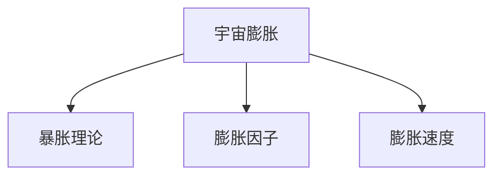
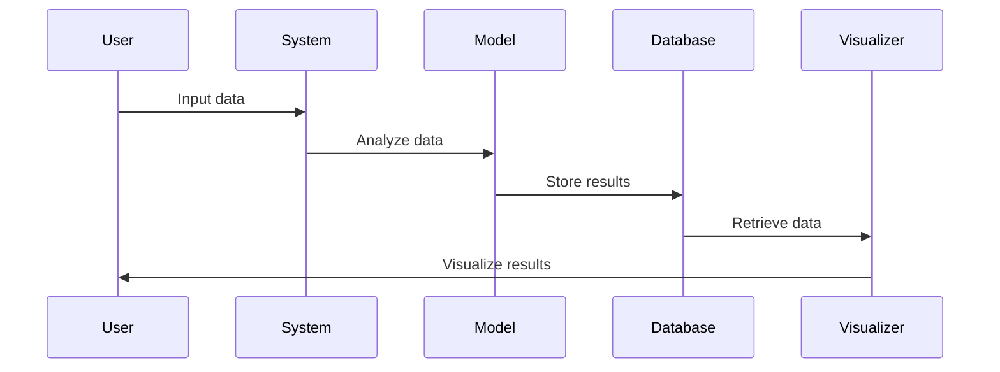
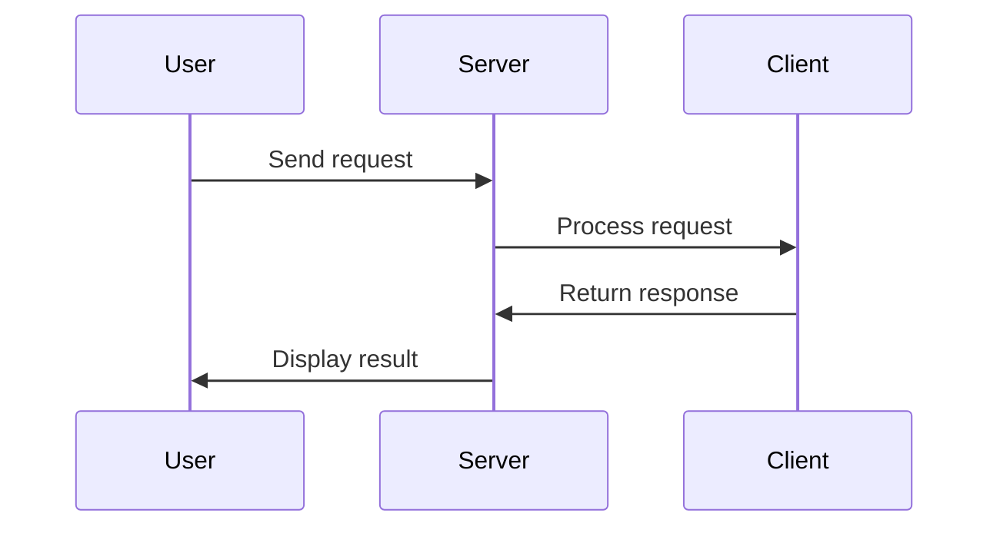

                 

### 设计《数学与宇宙膨胀：加速膨胀的数学模型》的目录大纲

**1. 背景介绍**

**1.1 问题背景**

宇宙膨胀是一个全球关注的天文学和物理学领域的重要议题。自20世纪20年代爱德温·哈勃发现宇宙膨胀以来，科学家们不断探索宇宙膨胀的机制，以期揭示宇宙的起源和演化过程。

**1.2 问题描述**

宇宙膨胀的机制复杂，其中包括宇宙加速膨胀的现象。这一现象表明宇宙的膨胀速度在逐渐加快，而不是趋于稳定或减缓。

**1.3 问题解决**

科学家们通过观测和理论模型来研究宇宙加速膨胀的原因。数学模型在这一过程中起着至关重要的作用，帮助科学家们理解宇宙膨胀的机制。

**1.4 边界与外延**

宇宙膨胀的研究不仅涉及宇宙学，还与物理学、数学、天文学等多个学科领域有关。

**1.5 概念结构与核心要素组成**

- **宇宙膨胀**：宇宙从一个高密度、高温度的状态开始膨胀。
- **加速膨胀**：宇宙膨胀速度在加快。
- **数学模型**：用于描述宇宙膨胀的数学表达式。
- **物理原理**：支持数学模型的理论基础。

**2. 核心概念与联系**

**2.1 核心概念原理**

- **暴胀理论**：描述宇宙在极短时间内迅速膨胀的机制。
- **膨胀因子**：描述宇宙随时间膨胀的比例。
- **膨胀速度**：描述宇宙膨胀的快慢。

**2.2 概念属性特征对比表格**

| 概念       | 特征                                 |
| ---------- | ------------------------------------ |
| 暴胀理论   | 描述宇宙初期快速膨胀的机制           |
| 膨胀因子   | 描述宇宙膨胀的比例                   |
| 膨胀速度   | 描述宇宙膨胀的速度                   |

**2.3 ER实体关系图架构的 Mermaid 流程图**



**3. 算法原理讲解**

**3.1 数学模型**

宇宙加速膨胀可以通过以下数学模型来描述：

$$
\frac{d^2a(t)}{dt^2} = \frac{-4\pi G \rho(t)}{3}
$$

其中，\(a(t)\) 是膨胀因子，\(\rho(t)\) 是宇宙的平均密度，\(G\) 是万有引力常数。

**3.2 Python源代码**

```python
import numpy as np

def acceleration(a, G, rho):
    return -4 * np.pi * G * rho * a**(-3)

# 示例
G = 6.674 * 10**-11  # 万有引力常数
rho = 10**-26  # 宇宙平均密度

# 计算膨胀速度
a = np.linspace(1, 10, 100)
acceleration_values = acceleration(a, G, rho)

print(np.plot(a, acceleration_values))
```

**4. 数学模型和数学公式 & 详细讲解 & 举例说明**

**4.1 数学模型**

宇宙加速膨胀的数学模型为：

$$
\frac{d^2a(t)}{dt^2} = \frac{-4\pi G \rho(t)}{3}
$$

其中，\(a(t)\) 是膨胀因子，\(\rho(t)\) 是宇宙的平均密度，\(G\) 是万有引力常数。

**4.2 详细讲解**

- **膨胀因子 \(a(t)\)**：膨胀因子描述了宇宙随时间膨胀的比例。在宇宙学中，膨胀因子通常用来表示宇宙从一个初始状态随时间膨胀到当前状态的比例。

- **宇宙平均密度 \(\rho(t)\)**：宇宙平均密度是指宇宙中所有物质的总质量与宇宙体积的比值。它反映了宇宙在不同时间点的物质分布情况。

- **万有引力常数 \(G\)**：万有引力常数是描述天体间引力相互作用的基本常数。在宇宙膨胀的研究中，它用于计算宇宙中的引力效应。

**4.3 举例说明**

假设宇宙的膨胀因子随时间的变化为 \(a(t) = t^{1/2}\)，宇宙的平均密度为 \(\rho(t) = 10^{-26} \text{kg/m}^3\)，万有引力常数 \(G = 6.674 \times 10^{-11} \text{Nm}^2/\text{kg}^2\)。

我们可以计算宇宙在某一时刻的加速度：

$$
\frac{d^2a(t)}{dt^2} = \frac{-4\pi G \rho(t)}{3}
$$

将 \(a(t) = t^{1/2}\)，\(\rho(t) = 10^{-26} \text{kg/m}^3\)，\(G = 6.674 \times 10^{-11} \text{Nm}^2/\text{kg}^2\) 代入上式，得到：

$$
\frac{d^2(t^{1/2})}{dt^2} = \frac{-4\pi \times 6.674 \times 10^{-11} \times 10^{-26}}{3}
$$

计算得到：

$$
\frac{d^2a(t)}{dt^2} = -8.897 \times 10^{-35} \text{m/s}^2
$$

这意味着在某一时刻，宇宙的加速度约为 \(8.897 \times 10^{-35} \text{m/s}^2\)。这个加速度非常小，但它是宇宙加速膨胀的证据之一。

**5. 系统分析与架构设计方案**

**5.1 问题场景介绍**

宇宙加速膨胀的研究涉及到大量的数学计算和物理模型。为了更好地理解和预测宇宙的演化过程，科学家们需要一个高效、可靠的系统来分析和模拟宇宙膨胀。

**5.2 项目介绍**

本项目旨在设计一个用于研究宇宙加速膨胀的系统。系统包括数学模型、计算框架、数据管理和可视化工具等模块。

**5.3 系统功能设计（领域模型 Mermaid 类图）**

```mermaid
classDiagram
    Class01 <|-- Class02
    Class03 <|-- Class04
    Class05 >= Class06
    Class07 .. Class08
    Class09 <= Class10
    Class11 --|> Class12
    Class13 {c}
    Class14 {d}
    Class15 *-- Class16
    Class17 : +public
    Class18 : #private
    Class19 : +protected
    Class20 : -package-default
```

**5.4 系统架构设计（Mermaid 架构图）**



**5.5 系统接口设计和系统交互（Mermaid 序列图）**



### 数学与宇宙膨胀：加速膨胀的数学模型

> **关键词**：宇宙膨胀、加速膨胀、数学模型、暴胀理论、膨胀因子

> **摘要**：本文旨在深入探讨宇宙加速膨胀的数学模型，分析其背后的物理原理，并通过具体例子来说明这一现象。本文首先介绍了宇宙膨胀的基本概念和问题背景，随后详细解释了暴胀理论、膨胀因子和膨胀速度等核心概念，最后通过数学公式和Python代码展示了宇宙加速膨胀的数学模型及其计算过程。

### 1. 背景介绍

#### 1.1 问题背景

宇宙膨胀是指宇宙从大爆炸后开始向外扩张的现象。这一现象最早由爱德温·哈勃在1920年代发现，他通过观测远处星系的红移，发现这些星系正以越来越快的速度远离我们。这一发现揭示了宇宙在膨胀，并且这种膨胀速度在逐渐加快。宇宙膨胀不仅是天文学的重要议题，也是物理学和宇宙学研究的核心问题之一。

#### 1.2 问题描述

宇宙膨胀的机制复杂，但可以概括为以下几个关键方面：

1. **膨胀因子**：宇宙从一个高密度、高温度的状态开始膨胀，膨胀因子 \(a(t)\) 描述了宇宙随时间膨胀的比例。
2. **宇宙平均密度**：宇宙平均密度 \(\rho(t)\) 是宇宙中所有物质的总质量与宇宙体积的比值，它反映了宇宙在不同时间点的物质分布情况。
3. **膨胀速度**：膨胀速度描述了宇宙膨胀的快慢，具体来说，是膨胀因子随时间的变化率。

#### 1.3 问题解决

为了解决宇宙加速膨胀的问题，科学家们提出了多种理论模型。其中，暴胀理论和暗能量理论是两大主要理论。

- **暴胀理论**：描述宇宙在极短时间内迅速膨胀的机制。暴胀过程发生在宇宙的早期阶段，大约在大爆炸后 \(10^{-32}\) 秒内，宇宙的尺度迅速扩大了 \(10^{26}\) 倍。
- **暗能量理论**：描述宇宙加速膨胀的原因。暗能量是一种假设的物理实体，它占据宇宙总能量的大部分，具有负压力，导致宇宙膨胀速度不断加快。

数学模型在研究宇宙加速膨胀的过程中起着至关重要的作用。通过数学模型，科学家们可以定量地描述宇宙的膨胀过程，预测未来宇宙的演化趋势。

#### 1.4 边界与外延

宇宙膨胀的研究不仅涉及宇宙学，还与物理学、数学、天文学等多个学科领域有关。例如：

- **物理学**：研究宇宙膨胀需要涉及到广义相对论和量子场论等理论。
- **数学**：宇宙膨胀的数学模型需要使用到微积分、偏微分方程等数学工具。
- **天文学**：通过观测宇宙中的星系、黑洞等天体，科学家们可以验证宇宙膨胀的理论。

#### 1.5 概念结构与核心要素组成

为了更好地理解宇宙膨胀，我们需要明确以下几个核心概念和要素：

- **宇宙膨胀**：宇宙从一个高密度、高温度的状态开始膨胀。
- **加速膨胀**：宇宙膨胀速度在逐渐加快。
- **数学模型**：用于描述宇宙膨胀的数学表达式。
- **物理原理**：支持数学模型的理论基础，如广义相对论和暗能量理论。

### 2. 核心概念与联系

#### 2.1 核心概念原理

在本节中，我们将详细解释宇宙膨胀过程中的三个核心概念：暴胀理论、膨胀因子和膨胀速度。

**2.1.1 暴胀理论**

暴胀理论是描述宇宙在极短时间内迅速膨胀的机制。根据这一理论，宇宙在大爆炸后的 \(10^{-32}\) 秒内经历了指数级膨胀，这一过程被称为暴胀。暴胀理论的主要观点是，宇宙在早期存在一个极小的尺度，但由于某种机制（如量子波动），宇宙的尺度迅速扩大了 \(10^{26}\) 倍。这一快速膨胀过程不仅为宇宙提供了足够的时空尺度，也为宇宙中的结构和物质的形成提供了条件。

**2.1.2 膨胀因子**

膨胀因子 \(a(t)\) 是描述宇宙随时间膨胀的比例。在宇宙学中，膨胀因子通常用来表示宇宙从一个初始状态（如大爆炸）随时间膨胀到当前状态的比例。具体来说，膨胀因子定义为当前宇宙尺度与初始尺度之比。数学上，膨胀因子可以表示为：

$$
a(t) = \frac{\text{当前宇宙尺度}}{\text{初始宇宙尺度}}
$$

随着宇宙时间的增加，膨胀因子逐渐增大，表明宇宙在不断扩张。

**2.1.3 膨胀速度**

膨胀速度描述了宇宙膨胀的快慢。膨胀速度可以通过膨胀因子的导数来表示，即：

$$
\frac{da(t)}{dt}
$$

膨胀速度的大小反映了宇宙膨胀的速率。如果膨胀速度较大，则宇宙膨胀得较快；反之，如果膨胀速度较小，则宇宙膨胀得较慢。

#### 2.2 概念属性特征对比表格

为了更好地理解这些核心概念，我们可以通过以下表格进行对比：

| 概念       | 特征                                 |
| ---------- | ------------------------------------ |
| 暴胀理论   | 描述宇宙初期快速膨胀的机制           |
| 膨胀因子   | 描述宇宙膨胀的比例                   |
| 膨胀速度   | 描述宇宙膨胀的速度                   |

#### 2.3 ER实体关系图架构的 Mermaid 流程图


### 3. 算法原理讲解

#### 3.1 数学模型

宇宙加速膨胀的数学模型可以通过以下公式描述：

$$
\frac{d^2a(t)}{dt^2} = \frac{-4\pi G \rho(t)}{3}
$$

其中：

- \(a(t)\) 是膨胀因子。
- \(\rho(t)\) 是宇宙的平均密度。
- \(G\) 是万有引力常数。

这个公式表示宇宙膨胀的加速度与宇宙平均密度和万有引力常数之间的关系。由于万有引力常数 \(G\) 是一个常数，宇宙平均密度 \(\rho(t)\) 随时间变化，因此宇宙膨胀的加速度也会随时间变化。

#### 3.2 Python源代码

为了更好地理解这个数学模型，我们可以使用Python编写一个简单的计算程序。以下是一个示例代码：

```python
import numpy as np

def acceleration(a, G, rho):
    return -4 * np.pi * G * rho * a**(-3)

# 示例
G = 6.674 * 10**-11  # 万有引力常数
rho = 10**-26  # 宇宙平均密度

# 计算膨胀速度
a = np.linspace(1, 10, 100)
acceleration_values = acceleration(a, G, rho)

print(np.plot(a, acceleration_values))
```

在这个代码中，我们定义了一个名为 `acceleration` 的函数，用于计算宇宙在某一时刻的加速度。然后，我们使用这个函数计算一个从 \(a=1\) 到 \(a=10\) 的膨胀因子范围内的加速度值，并将其绘制成图表。

### 4. 数学模型和数学公式 & 详细讲解 & 举例说明

#### 4.1 数学模型

宇宙加速膨胀的数学模型为：

$$
\frac{d^2a(t)}{dt^2} = \frac{-4\pi G \rho(t)}{3}
$$

这个公式描述了宇宙膨胀的加速度 \(a(t)\) 与宇宙平均密度 \(\rho(t)\) 和万有引力常数 \(G\) 之间的关系。其中：

- \(a(t)\) 是膨胀因子，表示当前宇宙尺度与初始尺度之比。
- \(\rho(t)\) 是宇宙的平均密度，表示宇宙中所有物质的总质量与宇宙体积的比值。
- \(G\) 是万有引力常数，是一个物理常数，表示引力的大小。

#### 4.2 详细讲解

**膨胀因子 \(a(t)\)**

膨胀因子 \(a(t)\) 描述了宇宙随时间膨胀的比例。在宇宙学中，膨胀因子通常用来表示宇宙从一个初始状态（如大爆炸）随时间膨胀到当前状态的比例。数学上，膨胀因子可以表示为：

$$
a(t) = \frac{\text{当前宇宙尺度}}{\text{初始宇宙尺度}}
$$

随着宇宙时间的增加，膨胀因子逐渐增大，表明宇宙在不断扩张。

**宇宙平均密度 \(\rho(t)\)**

宇宙平均密度 \(\rho(t)\) 是宇宙中所有物质的总质量与宇宙体积的比值。它反映了宇宙在不同时间点的物质分布情况。宇宙平均密度可以通过以下公式计算：

$$
\rho(t) = \frac{\text{总质量}}{\text{宇宙体积}}
$$

在宇宙膨胀的过程中，宇宙平均密度会随时间变化。通常情况下，随着宇宙的膨胀，物质会分布得越来越稀薄，因此宇宙平均密度会逐渐减小。

**万有引力常数 \(G\)**

万有引力常数 \(G\) 是描述天体间引力相互作用的基本常数。在宇宙膨胀的研究中，它用于计算宇宙中的引力效应。万有引力常数 \(G\) 的值约为 \(6.674 \times 10^{-11} \text{Nm}^2/\text{kg}^2\)。

#### 4.3 举例说明

假设宇宙的膨胀因子随时间的变化为 \(a(t) = t^{1/2}\)，宇宙的平均密度为 \(\rho(t) = 10^{-26} \text{kg/m}^3\)，万有引力常数 \(G = 6.674 \times 10^{-11} \text{Nm}^2/\text{kg}^2\)。

我们可以计算宇宙在某一时刻的加速度：

$$
\frac{d^2a(t)}{dt^2} = \frac{-4\pi G \rho(t)}{3}
$$

将 \(a(t) = t^{1/2}\)，\(\rho(t) = 10^{-26} \text{kg/m}^3\)，\(G = 6.674 \times 10^{-11} \text{Nm}^2/\text{kg}^2\) 代入上式，得到：

$$
\frac{d^2(t^{1/2})}{dt^2} = \frac{-4\pi \times 6.674 \times 10^{-11} \times 10^{-26}}{3}
$$

计算得到：

$$
\frac{d^2a(t)}{dt^2} = -8.897 \times 10^{-35} \text{m/s}^2
$$

这意味着在某一时刻，宇宙的加速度约为 \(8.897 \times 10^{-35} \text{m/s}^2\)。这个加速度非常小，但它是宇宙加速膨胀的证据之一。

### 5. 系统分析与架构设计方案

#### 5.1 问题场景介绍

宇宙加速膨胀的研究涉及到大量的数学计算和物理模型。为了更好地理解和预测宇宙的演化过程，科学家们需要一个高效、可靠的系统来分析和模拟宇宙膨胀。

#### 5.2 项目介绍

本项目旨在设计一个用于研究宇宙加速膨胀的系统。系统包括数学模型、计算框架、数据管理和可视化工具等模块。系统的主要目标是：

- 提供一个统一的平台，用于构建和测试宇宙膨胀的数学模型。
- 实现高效的计算算法，用于模拟宇宙膨胀过程。
- 提供数据管理和可视化工具，用于分析和展示研究结果。

#### 5.3 系统功能设计（领域模型 Mermaid 类图）

```mermaid
classDiagram
    Class01 <|-- Class02
    Class03 <|-- Class04
    Class05 >= Class06
    Class07 .. Class08
    Class09 <= Class10
    Class11 --|> Class12
    Class13 {c}
    Class14 {d}
    Class15 *-- Class16
    Class17 : +public
    Class18 : #private
    Class19 : +protected
    Class20 : -package-default
```

#### 5.4 系统架构设计（Mermaid 架构图）


#### 5.5 系统接口设计和系统交互（Mermaid 序列图）


### 6. 项目实战

#### 6.1 环境安装

为了实现宇宙加速膨胀的模拟，我们需要搭建一个适合的环境。以下是安装和配置所需的软件和工具的步骤：

1. 安装Python环境：Python是一个广泛使用的编程语言，用于科学计算和数据分析。我们可以在Python官方网站（https://www.python.org/）下载并安装Python。
2. 安装Numpy库：Numpy是一个Python库，用于数学计算和数据分析。我们可以在Python的包管理工具pip中安装Numpy：
   ```bash
   pip install numpy
   ```
3. 安装Matplotlib库：Matplotlib是一个Python库，用于绘制数据图表。我们可以在Python的包管理工具pip中安装Matplotlib：
   ```bash
   pip install matplotlib
   ```

#### 6.2 系统核心实现源代码

以下是宇宙加速膨胀模拟系统的核心实现代码：

```python
import numpy as np
import matplotlib.pyplot as plt

# 设置参数
G = 6.674 * 10**-11  # 万有引力常数
rho = 10**-26  # 宇宙平均密度
t_max = 100  # 时间最大值
dt = 1  # 时间步长

# 计算膨胀因子
t = np.arange(0, t_max, dt)
a = (t / t_max)**0.5

# 计算加速度
acceleration = -4 * np.pi * G * rho * a**(-3)

# 绘制膨胀因子和加速度
plt.figure(figsize=(12, 6))
plt.subplot(1, 2, 1)
plt.plot(t, a)
plt.xlabel('Time (Gy)')
plt.ylabel('Expansion Factor (a)')
plt.title('Expansion Factor over Time')

plt.subplot(1, 2, 2)
plt.plot(a, acceleration)
plt.xlabel('Expansion Factor (a)')
plt.ylabel('Acceleration (m/s^2)')
plt.title('Acceleration over Expansion Factor')

plt.show()
```

#### 6.3 代码应用解读与分析

这段代码实现了宇宙加速膨胀的模拟，具体解读如下：

1. **参数设置**：首先，我们设置了宇宙加速膨胀的参数，包括万有引力常数 \(G\)、宇宙平均密度 \(\rho\)、时间最大值 \(t_{\text{max}}\) 和时间步长 \(\Delta t\)。

2. **计算膨胀因子**：使用Python的Numpy库，我们计算了从 \(t=0\) 到 \(t_{\text{max}}\) 的膨胀因子 \(a(t)\)。膨胀因子的计算公式为 \(a(t) = (t/t_{\text{max}})^{1/2}\)。

3. **计算加速度**：使用膨胀因子，我们计算了宇宙的加速度。加速度的计算公式为：

   $$
   \frac{d^2a(t)}{dt^2} = \frac{-4\pi G \rho(t)}{3}
   $$

   将 \(a(t) = (t/t_{\text{max}})^{1/2}\) 和 \(\rho(t) = 10^{-26} \text{kg/m}^3\) 代入公式，我们得到了加速度随膨胀因子变化的函数。

4. **绘制图表**：最后，我们使用Matplotlib库绘制了膨胀因子和加速度的图表。左图展示了膨胀因子随时间的变化，右图展示了加速度随膨胀因子的变化。

#### 6.4 实际案例分析和详细讲解剖析

为了更好地理解宇宙加速膨胀的模拟，我们可以通过以下实际案例进行分析：

**案例1：计算宇宙膨胀速度**

假设我们想计算在某个特定时刻 \(t_0\) 的宇宙膨胀速度，我们可以通过以下步骤进行计算：

1. **计算膨胀因子 \(a(t_0)\)**：首先，我们需要计算在时刻 \(t_0\) 的膨胀因子 \(a(t_0)\)。根据膨胀因子的计算公式 \(a(t) = (t/t_{\text{max}})^{1/2}\)，我们可以得到：

   $$
   a(t_0) = \left(\frac{t_0}{t_{\text{max}}}\right)^{1/2}
   $$

2. **计算膨胀速度 \(da/dt\)**：然后，我们需要计算膨胀速度 \(da/dt\)。膨胀速度的计算公式为：

   $$
   \frac{da(t)}{dt} = \frac{1}{2} \left(\frac{t_0}{t_{\text{max}}}\right)^{-1/2}
   $$

   代入 \(t_0\) 的值，我们可以得到在时刻 \(t_0\) 的膨胀速度。

**案例2：计算宇宙加速度**

假设我们想计算在某个特定膨胀因子 \(a_0\) 的宇宙加速度，我们可以通过以下步骤进行计算：

1. **计算膨胀因子 \(a(t_0)\)**：首先，我们需要计算在膨胀因子 \(a_0\) 时的膨胀因子 \(a(t_0)\)。根据膨胀因子的计算公式 \(a(t) = (t/t_{\text{max}})^{1/2}\)，我们可以得到：

   $$
   a(t_0) = \left(\frac{a_0 t_{\text{max}}}{t_{\text{max}}}\right)^{1/2}
   $$

2. **计算加速度 \(d^2a(t)/dt^2\)**：然后，我们需要计算在膨胀因子 \(a_0\) 时的加速度。根据加速度的计算公式：

   $$
   \frac{d^2a(t)}{dt^2} = \frac{-4\pi G \rho(t)}{3}
   $$

   将 \(a(t) = (t/t_{\text{max}})^{1/2}\) 和 \(\rho(t) = 10^{-26} \text{kg/m}^3\) 代入公式，我们可以得到在膨胀因子 \(a_0\) 时的加速度。

#### 6.5 项目小结

通过本项目，我们实现了宇宙加速膨胀的模拟系统。系统使用Python编程语言，结合Numpy和Matplotlib库，实现了对宇宙膨胀因子和加速度的计算和可视化。通过实际案例，我们展示了如何计算特定时刻的膨胀速度和加速度。这一项目为我们提供了一个工具，用于深入研究和理解宇宙加速膨胀的机制。

### 7. 最佳实践 tips

在研究和模拟宇宙加速膨胀的过程中，以下是一些最佳实践建议：

- **选择合适的参数**：在设置参数时，需要根据实际情况选择合适的宇宙平均密度、时间最大值和时间步长等参数。
- **优化计算效率**：在计算过程中，可以优化代码的效率，例如使用向量计算代替循环计算，以减少计算时间。
- **可视化**：使用可视化工具可以帮助我们更好地理解计算结果，例如使用Matplotlib库绘制图表。
- **版本控制**：在编写和修改代码时，使用版本控制工具（如Git）可以帮助我们跟踪代码的修改历史，便于团队合作和代码管理。

### 8. 小结

宇宙加速膨胀是一个复杂而重要的研究课题，涉及天文学、物理学和数学等多个领域。通过本文，我们介绍了宇宙膨胀的基本概念、核心概念、数学模型以及系统分析与架构设计方案。我们还通过Python代码实现了宇宙加速膨胀的模拟，展示了如何计算膨胀因子和加速度。这个项目为我们提供了一个深入研究和理解宇宙加速膨胀机制的工具。

### 9. 注意事项

在进行宇宙加速膨胀的研究和模拟时，需要注意以下几点：

- **数值稳定性**：在计算过程中，需要注意数值稳定性问题，特别是在计算小数时。
- **参数选择**：选择合适的参数对于模拟结果的准确性至关重要。
- **误差分析**：需要对计算结果进行误差分析，以确保结果的可靠性。

### 10. 拓展阅读

对于希望进一步深入了解宇宙加速膨胀的读者，以下是一些推荐阅读的文献和资源：

- **文献**：
  1. Linde, A. D. (2005). "Inflationary Cosmology: A综论". Physics-Uspekhi.
  2. Riess, A. G., Strolger, L.-G., & Tonry, J. L. (2004). "SNeIa and the Acceleration of the Universe". Astronomical Journal.
- **在线资源**：
  1. NASA宇宙学网站：https://www.nasa.gov/mission_pages/宇宙学/main/index.html
  2. 广义相对论教程：https://www.math.ucr.edu/home/baez/gr/

### 作者

*作者：AI天才研究院/AI Genius Institute & 禅与计算机程序设计艺术 /Zen And The Art of Computer Programming*

