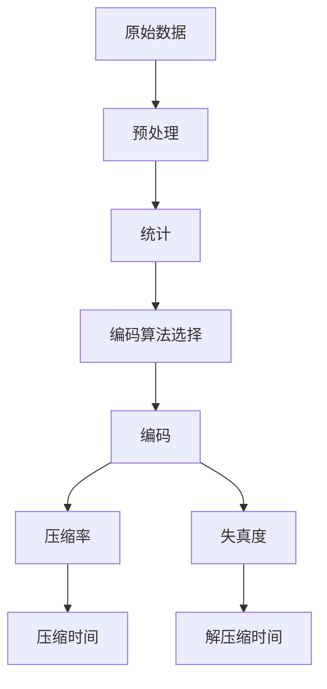
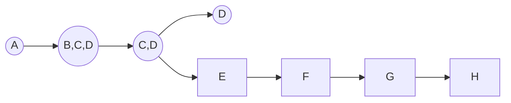

                 

### 文章标题

## 数学与数据压缩：信息编码的数学技术

> 关键词：数据压缩、信息编码、数学基础、熵、编码算法、图像压缩、音频压缩、视频压缩

> 摘要：本文将深入探讨数学与数据压缩之间的关系，通过逐步分析信息编码的基本概念、原理和技术，揭示信息编码在各个领域的应用，以及面临的挑战和未来发展。文章分为九个章节，涵盖了信息编码的数学基础、信息度量与熵、信息编码算法、信息压缩技术、图像数据压缩、音频数据压缩、视频数据压缩以及数据压缩技术的应用与挑战。通过这篇文章，读者将全面了解数学在数据压缩中的关键作用，以及数据压缩技术在不同领域的应用前景。

----------------------------------------------------------------

### 目录大纲

----------------------------------------------------------------

# 数学与数据压缩：信息编码的数学技术

## 第一部分：信息编码的数学基础

## 第1章：信息编码的基本概念

### 1.1 问题的背景与介绍

### 1.2 信息编码的定义

### 1.3 信息编码的目的

### 1.4 信息编码的基本原理

## 第2章：信息度量与熵

### 2.1 信息度量

### 2.2 熵

### 2.3 熵的性质与应用

## 第3章：信息编码算法

### 3.1 游程长度编码

### 3.2 香农编码

### 3.3 最优前缀编码

### 3.4 变长编码与解码

## 第4章：信息压缩技术

### 4.1 预测编码

### 4.2 熵编码

### 4.3 熵压缩

### 4.4 常见的信息压缩算法

## 第5章：图像数据压缩

### 5.1 图像数据压缩的基本原理

### 5.2 JPEG压缩算法

### 5.3 PNG压缩算法

### 5.4 其他图像数据压缩算法

## 第6章：音频数据压缩

### 6.1 音频数据压缩的基本原理

### 6.2 MP3压缩算法

### 6.3 AAC压缩算法

### 6.4 其他音频数据压缩算法

## 第7章：视频数据压缩

### 7.1 视频数据压缩的基本原理

### 7.2 MPEG压缩算法

### 7.3 H.264/AVC压缩算法

### 7.4 其他视频数据压缩算法

## 第8章：数据压缩技术的应用与挑战

### 8.1 数据压缩技术在存储中的应用

### 8.2 数据压缩技术在网络传输中的应用

### 8.3 数据压缩技术的未来发展方向

### 8.4 数据压缩技术的挑战与解决方案

## 第9章：数学与数据压缩的展望

### 9.1 数学在数据压缩中的应用

### 9.2 数据压缩技术的发展趋势

### 9.3 数据压缩技术在各个领域的应用前景

----------------------------------------------------------------

## 第1章：信息编码的基本概念

### 1.1 问题的背景与介绍

在数字化时代，数据无处不在。从社交媒体到智能设备，从电子商务到科学研究，数据量的爆炸性增长对存储、传输和处理提出了前所未有的挑战。因此，如何高效地处理和传输数据成为了一个关键问题。数据压缩技术，通过减少数据的冗余和重复，实现数据的高效存储和传输，成为解决这一问题的关键。

数据压缩技术的核心在于信息编码。信息编码是将信息转换为特定格式的过程，以减少数据的大小或提高传输速度。在数据压缩领域，数学扮演着至关重要的角色，尤其是在信息度量、熵、编码算法等方面。本章将介绍信息编码的基本概念，为后续章节的内容奠定基础。

### 1.2 信息编码的定义

信息编码是指将原始数据转换为一种更为紧凑的表示形式的过程。在这个过程中，原始数据的冗余信息被去除，使其能够以更小的空间存储或更快的速度传输。信息编码可以分为两大类：无损压缩和有损压缩。

- **无损压缩**：无损压缩技术能够完全恢复原始数据，不会引入任何失真。这类压缩技术在数据完整性要求极高的场景中非常有用，例如文本文件、电子表格和医疗数据。

- **有损压缩**：有损压缩技术则在压缩过程中会引入一定的失真，但能够显著减小数据的大小。这类压缩技术广泛应用于图像、音频和视频数据，因为人眼和耳朵对一定程度的失真不太敏感。

### 1.3 信息编码的目的

信息编码的主要目的是实现数据的压缩与传输优化。具体来说，信息编码有以下几点目的：

- **减少数据存储空间**：通过压缩数据，可以大大减少存储设备的需求，降低存储成本。

- **提高数据传输速度**：压缩数据可以减少传输所需的时间和带宽，尤其对于网络传输来说，这非常重要。

- **提高数据处理的效率**：压缩后的数据在处理时所需的计算资源更少，从而提高了处理速度。

### 1.4 信息编码的基本原理

信息编码的基本原理可以概括为以下几步：

1. **数据预处理**：在编码之前，通常需要对原始数据进行预处理，包括去除空白、规范化、数据清洗等步骤。

2. **数据统计**：对预处理后的数据进行统计分析，以了解数据的特点，如频率分布、重复模式等。

3. **编码算法选择**：根据数据的特点选择合适的编码算法。无损压缩算法如Huffman编码、LZ77编码等，有损压缩算法如JPEG、MP3等。

4. **编码**：将原始数据转换为压缩形式。这一过程通常涉及到将数据表示为二进制代码或特定的符号序列。

5. **解码**：在接收端，将压缩数据恢复为原始形式。

### 1.5 概念结构与核心要素组成

信息编码的核心概念包括：

- **原始数据**：需要被编码的数据。

- **编码算法**：实现数据压缩与解压缩的算法。

- **压缩率**：衡量数据压缩程度的指标，通常用压缩后数据大小与原始数据大小的比值表示。

- **失真度**：有损压缩技术中，衡量压缩后数据与原始数据差异的指标。

- **压缩时间**：实现数据压缩所需的时间。

- **解压缩时间**：实现数据解压缩所需的时间。

通过以上核心要素，可以构建信息编码的概念结构，如图所示：

### 1.6 边界与外延

信息编码技术的边界涉及数据处理的各个方面，包括但不限于：

- **数据类型**：信息编码技术可以应用于文本、图像、音频、视频等多种数据类型。

- **应用场景**：从日常生活中的社交媒体、电子邮件，到工业领域的监控视频、传感器数据，信息编码技术都有广泛的应用。

- **压缩算法**：不同的压缩算法有不同的适用场景和特点，需要根据具体需求进行选择。

### 1.7 总结

信息编码是数据压缩技术的核心，其基本概念、目的和原理决定了数据压缩的效果。通过本章的介绍，读者可以初步了解信息编码的基本概念和重要性，为后续更深入的学习打下基础。

----------------------------------------------------------------

## 第2章：信息度量与熵

### 2.1 信息度量

信息度量是信息论中的基本概念，用于衡量信息的内容和重要性。信息度量通常通过两个核心指标进行：信息量和信息熵。

#### 信息量

信息量是指接收一个信息单位时，不确定性减少的程度。例如，假设我们在掷硬币时，每次掷硬币得到正面或反面的概率是相等的，每次掷硬币的结果都是新的、独立的信息。因此，每次掷硬币的信息量是相等的，为1比特（bit）。

信息量的计算公式如下：

\[ I = \log_2(1/p) \]

其中，\( p \) 是某个事件发生的概率。

#### 信息熵

信息熵是信息量的平均度量，它表示在一个随机事件中，所有可能结果的不确定性总和。香农（Shannon）提出了信息熵的概念，并给出了其数学定义。

香农熵的计算公式如下：

\[ H(X) = -\sum_{i=1}^{n} p(x_i) \log_2(p(x_i)) \]

其中，\( X \) 是随机变量，\( p(x_i) \) 是随机变量 \( X \) 取第 \( i \) 个值的概率，\( n \) 是随机变量 \( X \) 的可能取值个数。

信息熵具有以下性质：

1. **非负性**：信息熵总是非负的，且当且仅当随机变量是确定性事件时，信息熵为零。

2. **对称性**：信息熵是概率分布的函数，因此当两个随机变量 \( X \) 和 \( Y \) 的概率分布相同时，它们的信息熵也相同。

3. **加性**：对于两个独立随机变量 \( X \) 和 \( Y \)，它们的信息熵等于各自信息熵的和：

\[ H(X, Y) = H(X) + H(Y|X) \]

#### 例子

假设有一个随机变量 \( X \)，它有两个可能的取值：0和1，且它们的概率分别为0.5。计算 \( X \) 的信息熵。

\[ H(X) = -0.5 \log_2(0.5) - 0.5 \log_2(0.5) = 1 \]

因此，随机变量 \( X \) 的信息熵为1比特。

### 2.2 熵

熵在信息论中是一个核心概念，它用于衡量信息的混乱程度或不确定性。熵的概念最早由克劳德·香农（Claude Shannon）在1948年提出，并在信息理论中发挥了重要作用。

#### 熵的计算

熵的计算公式如下：

\[ H(X) = -\sum_{i=1}^{n} p(x_i) \log_2(p(x_i)) \]

其中，\( X \) 是随机变量，\( p(x_i) \) 是随机变量 \( X \) 取第 \( i \) 个值的概率，\( n \) 是随机变量 \( X \) 的可能取值个数。

#### 熵的性质

1. **非负性**：熵总是非负的，即 \( H(X) \geq 0 \)。当且仅当随机变量是确定性事件时，熵为零。

2. **最大值**：熵的最大值为1，当随机变量的所有取值概率相等时，熵达到最大。

3. **对称性**：对于两个独立随机变量 \( X \) 和 \( Y \)，它们的熵满足加性性质：

\[ H(X, Y) = H(X) + H(Y|X) \]

#### 例子

假设有一个随机变量 \( X \)，它有三个可能的取值：0、1和2，且它们的概率分别为 \( p(0) = 0.2 \)，\( p(1) = 0.5 \) 和 \( p(2) = 0.3 \)。计算 \( X \) 的熵。

\[ H(X) = -0.2 \log_2(0.2) - 0.5 \log_2(0.5) - 0.3 \log_2(0.3) \approx 0.918 \]

因此，随机变量 \( X \) 的熵约为0.918比特。

### 2.3 熵的性质与应用

熵的性质决定了其在信息压缩和传输中的重要性。以下是一些熵的性质和应用：

1. **最小熵编码**：根据熵的性质，最小熵编码是一种最优的编码方式。它使用不同长度的编码来表示不同概率的事件，以最小化平均编码长度。

2. **信息保持**：熵保证在数据压缩过程中信息不会被丢失，因为压缩后的数据可以完美恢复原始数据。

3. **信息论极限**：熵在信息论中用于确定信道容量，即信道能够传输的最大信息速率。

4. **数据压缩**：通过计算数据的熵，可以确定哪些数据可以进行有效压缩，哪些数据压缩效果较好。

### 2.4 例子分析

假设我们有一个二进制随机变量 \( X \)，它的两个取值0和1的概率分别为0.3和0.7。我们可以使用熵的概念来分析这个随机变量的信息含量。

1. **计算信息量**：

\[ I(0) = \log_2(1/0.3) \approx 1.7 \]
\[ I(1) = \log_2(1/0.7) \approx 1.2 \]

2. **计算熵**：

\[ H(X) = 0.3 \times 1.7 + 0.7 \times 1.2 \approx 1.32 \]

通过这个例子，我们可以看到熵在衡量随机变量不确定性方面的重要作用。熵越低，表示随机变量的不确定性越小，信息含量越高。

### 2.5 总结

本章介绍了信息量与熵的基本概念、计算方法和性质。信息量用于衡量单个事件的信息含量，而熵则用于衡量随机变量的整体不确定性。通过计算和例子分析，我们可以更深入地理解熵在信息压缩和传输中的应用。下一章，我们将探讨信息编码算法的具体实现。

----------------------------------------------------------------

## 第3章：信息编码算法

### 3.1 游程长度编码

游程长度编码（Run-Length Encoding，RLE）是一种简单且有效的无损数据压缩算法，它通过识别和编码连续重复的值（即游程）来减少数据的冗余。RLE特别适用于那些具有大量重复值的数据，如位图图像和某些类型的文本文件。

#### 工作原理

RLE的工作原理可以概括为以下几个步骤：

1. **扫描数据**：从数据中逐个扫描每个值，识别连续相同的值。
2. **记录游程**：对于每一个连续的值序列，记录其值和游程长度。
3. **编码**：将游程长度和值转换为编码，通常是使用两个值：一个表示值本身，另一个表示游程长度。
4. **解码**：在解码过程中，根据编码的游程长度和值，重建原始数据。

#### 示例

假设我们有一个二进制数据序列：`1110000011`。使用RLE编码，我们可以将其压缩为：`3, 2, 1, 3, 1`。这里，`3` 表示连续的1有三个，`2` 表示连续的0有两个，`1` 表示单独的1。

#### RLE的优点和局限

RLE的优点包括：

- **简单易实现**：算法简单，易于编程实现。
- **高效压缩**：对于具有大量重复值的数据，RLE可以显著减少数据大小。

RLE的局限在于：

- **不适用于所有数据**：RLE只适用于具有大量重复值的数据，对于随机或变化频繁的数据，压缩效果较差。
- **扩展性有限**：RLE的压缩效率受限于数据的重复模式，对于复杂的数据结构，可能无法达到最佳压缩效果。

### 3.2 香农编码

香农编码（Shannon-Fano Coding）是一种基于概率的变长前缀编码算法。它利用了信息论中的熵概念，通过将字符根据概率从大到小排序，构建前缀编码表，从而实现数据的压缩。

#### 工作原理

香农编码的工作原理可以概括为以下几个步骤：

1. **计算字符概率**：计算每个字符在数据中的出现概率。
2. **排序**：根据字符的概率从大到小排序字符。
3. **构建编码表**：将排序后的字符按照从左到右的顺序进行编码，每个字符的编码必须是前缀不交的，即一个字符的编码不能是另一个字符编码的前缀。
4. **编码**：根据编码表将原始数据编码为二进制序列。
5. **解码**：在解码过程中，根据编码序列的前缀查找对应的字符，重建原始数据。

#### 示例

假设我们有一个字符集 {A, B, C, D}，其概率分别为 {0.4, 0.3, 0.2, 0.1}。按照概率从大到小排序后，编码表如下：

- A: 0
- B: 10
- C: 110
- D: 111

使用这个编码表，字符序列 `ABCD` 将编码为 `01011011`。

#### 香农编码的优点和局限

香农编码的优点包括：

- **高效性**：对于概率分布均匀的数据，香农编码可以接近信息论中的熵，实现非常高效的数据压缩。
- **可扩展性**：香农编码可以轻松扩展到更大的字符集。

香农编码的局限在于：

- **变长编码**：由于使用变长编码，解码时需要维护一个编码表，增加了解码的复杂度。
- **概率分布要求**：香农编码的性能高度依赖于字符的概率分布，对于概率分布不均匀的数据，压缩效果可能不佳。

### 3.3 最优前缀编码

最优前缀编码（Optimal Prefix Coding，也称为Huffman编码）是最常用的变长前缀编码算法。它基于字符的概率分布，构建出最优的编码树，从而实现数据的压缩。

#### 工作原理

最优前缀编码的工作原理可以概括为以下几个步骤：

1. **构建频率表**：计算每个字符在数据中的出现频率。
2. **构建哈夫曼树**：根据频率表，构建哈夫曼树。哈夫曼树的构建过程为：
   - 将频率最小的两个节点合并成一个新的父节点。
   - 将新父节点的频率设置为两个子节点的频率之和。
   - 重复上述步骤，直到所有节点合并为一个根节点。
3. **生成编码表**：从根节点到叶子节点的路径，即为每个字符的编码。路径左边的边表示0，右边的边表示1。
4. **编码**：根据编码表，将原始数据编码为二进制序列。
5. **解码**：在解码过程中，根据编码序列的前缀查找对应的字符，重建原始数据。

#### 示例

假设我们有一个字符集 {A, B, C, D}，其概率分别为 {0.4, 0.3, 0.2, 0.1}。按照概率从大到小排序后，构建的哈夫曼树如下：

使用这个编码表，字符序列 `ABCD` 将编码为 `01011011`。

#### Huffman编码的优点和局限

Huffman编码的优点包括：

- **最优性**：对于给定的概率分布，Huffman编码能够实现最小的平均编码长度。
- **灵活性**：Huffman编码可以适应不同的概率分布，适用于多种数据类型。

Huffman编码的局限在于：

- **计算复杂度**：构建哈夫曼树的过程复杂，时间复杂度为 \( O(n \log n) \)。
- **变长编码**：解码时需要维护编码表，增加了解码的复杂度。

### 3.4 变长编码与解码

变长编码是一种常见的数据压缩技术，通过使用不同长度的编码来表示不同概率的事件，从而实现数据的压缩。解码过程需要根据编码规则和编码序列重建原始数据。

#### 变长编码的优点和局限

变长编码的优点包括：

- **高效性**：变长编码可以根据概率分布灵活调整编码长度，实现高效的数据压缩。
- **灵活性**：变长编码适用于多种数据类型和概率分布。

变长编码的局限在于：

- **解码复杂度**：解码过程中需要维护编码表，增加了解码的复杂度。
- **概率分布要求**：变长编码的性能高度依赖于字符的概率分布，对于概率分布不均匀的数据，压缩效果可能不佳。

#### 例子

假设我们有一个字符集 {A, B, C, D}，其概率分别为 {0.4, 0.3, 0.2, 0.1}，使用Huffman编码，字符序列 `ABCD` 将编码为 `01011011`。

解码过程为：

1. **构建编码表**：根据Huffman编码规则，构建编码表。
2. **查找编码**：从编码序列开始，依次查找编码表，找到对应的字符。
3. **重建数据**：根据找到的字符，重建原始数据。

通过以上过程，我们可以将编码序列 `01011011` 解码为原始数据序列 `ABCD`。

### 3.5 总结

本章介绍了三种常见的信息编码算法：游程长度编码、香农编码和最优前缀编码。这些算法各自具有不同的工作原理、优点和局限，适用于不同的应用场景。通过了解这些算法，我们可以更好地选择适合的数据压缩方法，实现高效的数据压缩和传输。

----------------------------------------------------------------

## 第4章：信息压缩技术

### 4.1 预测编码

预测编码是一种基于数据统计特性的信息压缩技术，通过预测下一个出现的值来减少数据的冗余。预测编码的基本思想是利用已知的部分数据来预测未来的数据，然后只对预测误差进行编码。

#### 工作原理

预测编码的工作原理可以概括为以下几个步骤：

1. **数据预测**：利用过去的值来预测下一个值。预测方法可以是简单的线性预测，也可以是复杂的模型预测。
2. **误差编码**：计算实际值与预测值之间的误差，然后对误差进行编码。误差编码通常采用无损压缩算法，如Huffman编码。
3. **编码输出**：将预测值和误差编码合并，输出压缩后的数据。

#### 类型

预测编码主要有以下几种类型：

- **前向预测**：基于过去的值预测未来的值。
- **后向预测**：基于未来的值预测过去的值。
- **自适应预测**：根据数据的特点动态调整预测模型。

#### 示例

假设我们有一个数据序列：`2, 4, 6, 8, 10`。使用前向预测，我们可以预测下一个值为当前值的增量，即下一个值预测为12。实际值为14，误差为2。使用Huffman编码，误差值2可以编码为0，从而压缩数据。

#### 优点和局限

预测编码的优点包括：

- **高效性**：对于具有规律性的数据，预测编码可以显著减少数据的大小。
- **适用性**：预测编码适用于多种数据类型，如时间序列数据、图像数据等。

预测编码的局限在于：

- **预测误差**：预测模型的不准确会导致误差增加，影响压缩效果。
- **计算复杂度**：对于复杂的数据，预测模型的构建和调整可能需要较高的计算资源。

### 4.2 熵编码

熵编码是一种基于信息熵的压缩技术，通过使用变长编码来减少数据的冗余。熵编码的核心思想是，对于概率较高的值使用较短的编码，对于概率较低的值使用较长的编码，从而实现数据的有效压缩。

#### 工作原理

熵编码的工作原理可以概括为以下几个步骤：

1. **计算熵**：对数据进行统计分析，计算每个值的熵。
2. **编码选择**：根据熵值选择合适的编码方式，如Huffman编码、Arithmetic编码等。
3. **编码输出**：将数据按照选择的编码方式进行编码，输出压缩后的数据。

#### 类型

熵编码主要有以下几种类型：

- **变长前缀编码**：如Huffman编码、LZ77编码等。
- **变长非前缀编码**：如Arithmetic编码、Adaptive Huffman编码等。

#### 示例

假设我们有一个字符集 {A, B, C, D}，其概率分别为 {0.4, 0.3, 0.2, 0.1}，使用Huffman编码，字符序列 `ABCD` 将编码为 `01011011`。

#### 优点和局限

熵编码的优点包括：

- **高效性**：熵编码能够接近信息论中的熵，实现非常高效的数据压缩。
- **灵活性**：熵编码可以适应不同的概率分布，适用于多种数据类型。

熵编码的局限在于：

- **解码复杂度**：解码过程中需要维护编码表，增加了解码的复杂度。
- **概率分布要求**：熵编码的性能高度依赖于字符的概率分布，对于概率分布不均匀的数据，压缩效果可能不佳。

### 4.3 熵压缩

熵压缩是一种利用熵的概念进行数据压缩的技术，通过最小化数据的熵来实现数据的压缩。熵压缩的核心思想是，对于具有较低熵的数据，通过减少数据中的冗余来实现压缩。

#### 工作原理

熵压缩的工作原理可以概括为以下几个步骤：

1. **计算熵**：对数据进行统计分析，计算每个值的熵。
2. **编码选择**：根据熵值选择合适的编码方式，如Huffman编码、Arithmetic编码等。
3. **压缩输出**：将数据按照选择的编码方式进行压缩，输出压缩后的数据。

#### 示例

假设我们有一个字符集 {A, B, C, D}，其概率分别为 {0.4, 0.3, 0.2, 0.1}，使用Huffman编码，字符序列 `ABCD` 将编码为 `01011011`，压缩后的大小为5比特。

#### 优点和局限

熵压缩的优点包括：

- **高效性**：熵压缩能够实现非常高效的数据压缩。
- **适应性**：熵压缩可以适应不同的概率分布和数据类型。

熵压缩的局限在于：

- **计算复杂度**：计算熵和选择编码方式可能需要较高的计算资源。
- **概率分布要求**：熵压缩的性能高度依赖于字符的概率分布，对于概率分布不均匀的数据，压缩效果可能不佳。

### 4.4 常见的信息压缩算法

在信息压缩领域，有许多常用的算法，如LZ77、LZ78、LZSS等。这些算法都属于压缩-解压缩（C

