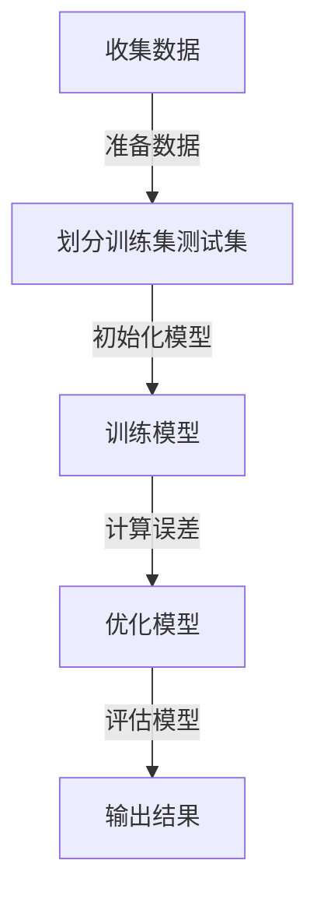
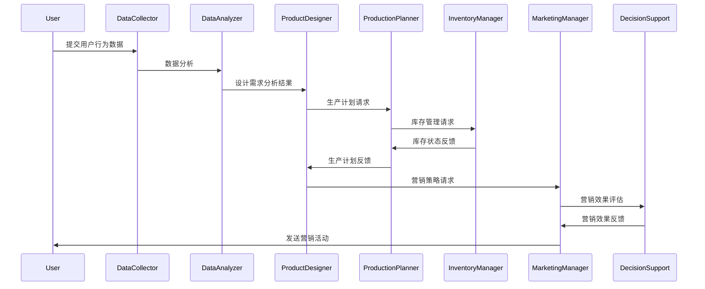
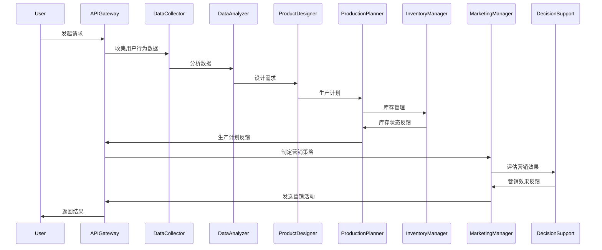

                 

## 数学与文化产业管理：文化产品的数学策略

### 关键词

- 数学策略
- 文化产业
- 文化产品
- 数据分析
- 算法应用

### 摘要

在现代社会，文化产业已成为推动经济发展的重要力量。然而，如何提升文化产品的竞争力、满足市场需求成为了关键挑战。数学作为一种强有力的工具，其独特的方法和思维方式为文化产业管理提供了新的视角。本文将探讨数学策略在文化产业管理中的应用，通过分析文化产品的数学属性，运用数学模型和算法，设计出有效的文化产品管理策略。文章将从数学策略的基本概念入手，逐步深入到文化产品的设计、生产和营销，结合实际案例，展示数学策略在提升文化产品竞争力中的重要作用。

## 引言与基础

### 1.1 文化产业概述

文化产业，是指以文化为核心资源，通过创意和艺术的形式进行生产、传播和消费的产业。文化产业涵盖了文学、艺术、音乐、影视、设计等多个领域，其发展不仅丰富了人们的精神生活，还成为推动经济增长的重要引擎。近年来，随着全球经济一体化的加速，文化产业在全球范围内呈现出蓬勃发展的态势。文化产业的跨界融合、数字化传播、创新商业模式使得其内涵和外延不断拓展，成为一个充满活力和潜力的产业。

### 1.2 数学在文化产业中的应用

数学作为一种逻辑严谨、分析精确的科学，其在文化产业中的应用日益受到重视。数学在文化产业中的主要应用体现在以下几个方面：

1. **数据分析**：通过数据分析，可以对文化产品进行深入的市场调研，了解消费者的需求和偏好，为产品设计提供科学依据。
2. **优化策略**：利用数学模型，可以对文化产品的生产、库存、营销等环节进行优化，提高效率和降低成本。
3. **风险评估**：在文化产业投资和运营过程中，通过数学模型进行风险评估，降低投资风险，保障项目的顺利实施。
4. **虚拟现实与增强现实**：数学在虚拟现实和增强现实技术中的应用，为文化产业提供了新的表现形式和体验方式。

### 1.3 本书的结构与目标

本书旨在系统性地介绍数学策略在文化产业管理中的应用，帮助读者理解和掌握如何运用数学工具提升文化产品的竞争力。本书的结构如下：

- **第一部分：引论与基础**：介绍文化产业和数学策略的基本概念，阐述数学策略在文化产业中的应用价值。
- **第二部分：核心概念与联系**：深入探讨文化产品的数学属性，分析不同类型文化产品的数学特征，建立数学策略与文化产品之间的联系。
- **第三部分：算法原理讲解**：讲解文化产品数学策略的算法原理，通过具体的数学模型和公式进行阐述。
- **第四部分：系统分析与架构设计**：介绍文化产品数学策略分析的系统架构设计，包括功能设计、架构设计和接口设计。
- **第五部分：项目实战**：通过具体案例分析，展示数学策略在文化产品管理中的实际应用。
- **第六部分：最佳实践与总结**：总结全书的核心内容，提供最佳实践建议，并指出未来研究方向。

本书的目标是：

- **提高读者的数学思维**：通过系统的学习和实践，使读者具备运用数学策略分析和解决文化产业管理问题的能力。
- **提供实用的工具和方法**：为文化产业从业者提供一套实用的数学策略工具和方法，提升文化产品的竞争力。
- **促进学科交叉融合**：推动数学与其他学科，特别是文化产业的交叉融合，为文化产业的创新发展提供新的动力。

## 数学策略概述

### 2.1 数学策略的基本概念

数学策略，是指运用数学方法和工具，针对特定问题制定解决方案的一套方法体系。数学策略的核心思想是通过抽象和建模，将复杂问题转化为可计算的形式，从而进行精确分析和优化。数学策略的基本概念包括：

- **模型建立**：通过建立数学模型，将实际问题转化为数学问题，这是数学策略应用的第一步。
- **算法设计**：选择合适的算法，对数学模型进行求解，以得到问题的最优解。
- **数据分析**：对求解结果进行分析和验证，确保解决方案的可行性和有效性。

### 2.2 数学策略的特点与优势

数学策略具有以下特点与优势：

- **逻辑性**：数学策略基于严密的逻辑推理，能够确保分析过程的准确性和可靠性。
- **精确性**：数学策略通过定量分析，能够提供精确的数据支持和决策依据。
- **系统性**：数学策略能够将复杂问题分解为多个子问题，进行系统分析和优化。
- **普适性**：数学策略具有广泛的适用范围，不仅限于某一特定领域，可以在多个领域进行应用。

### 2.3 数学策略的分类与应用场景

根据应用场景和解决问题的方法，数学策略可以分为以下几类：

1. **优化策略**：通过建立目标函数和约束条件，对文化产品的设计、生产和营销进行优化。应用场景包括产品设计优化、生产计划优化、营销策略优化等。
2. **统计分析策略**：利用统计学方法，对市场数据进行分析，预测市场需求和消费者行为。应用场景包括市场调研、消费者行为分析、市场预测等。
3. **风险控制策略**：通过数学模型进行风险评估，制定风险控制策略，降低投资风险。应用场景包括投资决策、风险分析、风险管理等。
4. **数据挖掘策略**：利用数据挖掘技术，从大量数据中提取有价值的信息，为文化产品管理和决策提供支持。应用场景包括数据挖掘、知识发现、智能推荐等。

### 2.4 数学策略在文化产业中的应用价值

数学策略在文化产业中的应用价值主要体现在以下几个方面：

- **提高产品竞争力**：通过数学策略，可以对文化产品的设计、生产和营销进行优化，提高产品的质量和市场竞争力。
- **降低成本**：通过优化生产流程和营销策略，可以降低生产成本和营销费用，提高企业的经济效益。
- **提升用户体验**：通过数据分析和风险控制，可以更好地满足消费者的需求，提升用户体验。
- **创新商业模式**：数学策略可以为文化产业提供新的商业模式和创新思路，推动文化产业的转型升级。

### 2.5 数学策略的应用场景举例

以下是一些数学策略在文化产业中的应用场景举例：

- **电影制作**：通过数学模型和算法，对电影的投资、制作和营销进行优化，提高电影的票房收入和口碑。
- **音乐产业**：利用数据挖掘技术，分析音乐市场的需求和趋势，为音乐创作和推广提供支持。
- **艺术品市场**：通过数学模型进行艺术品价格预测和风险评估，帮助投资者做出更明智的决策。
- **文化创意产业**：运用虚拟现实和增强现实技术，为文化创意产业提供新的表现形式和体验方式。

通过上述分析，可以看出数学策略在文化产业管理中具有广泛的应用前景和重要的价值。在接下来的章节中，我们将深入探讨文化产品的数学属性，并详细讲解数学策略在文化产品设计、生产和营销中的应用。

## 文化产品的数学属性

### 3.1 文化产品的定义与分类

文化产品，是指以文化内涵为核心，通过创意和艺术形式表现出来的物质和非物质产品。文化产品不仅包括传统的书籍、电影、音乐、艺术品等，还包括现代的数字内容、虚拟现实体验等。根据表现形式和内容特点，文化产品可以大致分为以下几类：

1. **传统文化产品**：包括书籍、电影、音乐、绘画、雕塑等，这些产品主要通过传统的艺术形式传达文化内涵。
2. **数字文化产品**：包括电子书、数字音乐、网络视频、网络游戏等，这些产品通过数字技术进行传播和消费。
3. **虚拟现实文化产品**：包括虚拟现实电影、虚拟现实游戏、虚拟现实艺术等，这些产品通过虚拟现实技术提供沉浸式的体验。
4. **混合文化产品**：结合传统和数字技术，如电子书与增强现实结合的AR书，或通过虚拟现实技术呈现的艺术展览等。

### 3.2 文化产品的数学属性分析

文化产品的数学属性，是指文化产品在数学上可以量化的特征和参数。这些属性不仅可以帮助我们更好地理解文化产品的本质，还可以为数学策略的应用提供基础数据。以下是文化产品的一些主要数学属性：

1. **数量属性**：包括文化产品的生产量、销售量、库存量等，这些数量属性可以通过数学模型进行统计和分析。
2. **质量属性**：包括文化产品的内容质量、艺术价值、用户体验等，这些质量属性可以通过评分系统、用户反馈等数据进行量化。
3. **时间属性**：包括文化产品的生产时间、销售周期、市场生命周期等，这些时间属性对于制定营销策略和优化生产计划具有重要意义。
4. **空间属性**：包括文化产品的传播范围、受众分布、地理信息等，这些空间属性可以通过地理信息系统（GIS）进行分析。
5. **价格属性**：包括文化产品的定价策略、价格波动、价格敏感度等，这些价格属性对于市场预测和定价策略的制定至关重要。

### 3.3 文化产品属性对比表格

为了更直观地展示不同类型文化产品的数学属性，我们可以通过一个对比表格来进行详细分析。以下是一个简化的表格示例：

| 类别         | 数量属性 | 质量属性 | 时间属性 | 空间属性 | 价格属性 |
| ------------ | -------- | -------- | -------- | -------- | -------- |
| 传统书籍     | 生产量   | 内容质量 | 印刷时间 | 地理分布 | 定价策略 |
| 数字音乐     | 下载量   | 用户评分 | 更新时间 | 网络分布 | 价格模型 |
| 虚拟现实游戏 | 销售量   | 用户反馈 | 更新周期 | 网络区域 | 价格策略 |
| 电影         | 票房收入 | 口碑评分 | 上映时间 | 地区分布 | 定价模式 |

### 3.4 ER实体关系图架构的Mermaid流程图

为了更好地理解文化产品及其属性的关联，我们可以使用Mermaid流程图来绘制实体关系图。以下是一个简化的Mermaid流程图示例：

```mermaid
erDiagram
  Product ||--|{ Quantity }|
  Product ||--|{ Quality }|
  Product ||--|{ Time }|
  Product ||--|{ Space }|
  Product ||--|{ Price }|
  Quantity ||--|{ Sales }|
  Quality ||--|{ Review }|
  Time ||--|{ Cycle }|
  Space ||--|{ Distribution }|
  Price ||--|{ Model }|
```

在这个实体关系图中，`Product` 是中心实体，与其他五个属性实体通过关系线相连，每个属性实体又进一步与其相关的子实体建立关系。这个流程图展示了文化产品及其数学属性之间的复杂关联，为数学策略的应用提供了清晰的结构框架。

通过上述分析，我们可以看出文化产品的数学属性对于文化产品的设计和运营具有重要影响。在接下来的章节中，我们将进一步探讨如何运用数学策略来提升文化产品的竞争力。

### 数学策略与文化产品的联系

在深入探讨数学策略与文化产品之间的联系之前，我们需要明确数学策略在文化产品设计和生产过程中的具体应用。数学策略不仅仅是理论工具，它通过系统的分析、精确的预测和优化的方法，能够为文化产品带来实际的改进和提升。

#### 数学策略在文化产品设计中的应用

1. **用户需求分析**：通过数学模型和数据分析，可以深入了解用户的需求和偏好。例如，通过用户行为数据分析，可以识别不同群体的消费习惯，从而设计出更符合市场需求的精品文化产品。
   
   **算法示例**：可以使用聚类分析算法，将用户分为不同的群体，然后根据每个群体的特征，设计个性化的文化产品。

   ```python
   import pandas as pd
   from sklearn.cluster import KMeans
   
   # 假设我们有一个用户行为数据集，包含用户的浏览历史、购买记录等信息
   user_data = pd.read_csv('user_behavior.csv')
   
   # 使用K-Means算法进行聚类
   kmeans = KMeans(n_clusters=3)
   clusters = kmeans.fit_predict(user_data)
   
   # 根据聚类结果，设计个性化产品
   for cluster in range(3):
       print(f"群体{cluster}个性化产品设计：")
       # 根据该群体的特征，进行产品设计
   ```

2. **产品风格预测**：通过分析历史数据，可以预测未来的流行趋势和产品风格。例如，通过分析电影、音乐等历史数据，可以预测未来可能会流行的文化产品风格。

   **算法示例**：可以使用时间序列分析算法，如ARIMA模型，预测文化产品的趋势。

   ```python
   from statsmodels.tsa.arima.model import ARIMA
   
   # 假设我们有一个历史销售数据集
   sales_data = pd.read_csv('sales_data.csv')
   model = ARIMA(sales_data['sales'], order=(1, 1, 1))
   model_fit = model.fit()
   future_sales = model_fit.forecast(steps=12)
   
   # 根据预测结果，调整产品设计风格
   print(future_sales)
   ```

#### 数学策略在文化产品生产中的应用

1. **生产流程优化**：通过数学模型，可以优化生产流程，降低生产成本，提高生产效率。例如，可以使用线性规划算法优化生产计划，确保资源的最优配置。

   **算法示例**：使用线性规划算法优化生产计划。

   ```python
   from scipy.optimize import linprog
   
   # 定义目标函数和约束条件
   c = [-1, -1]  # 目标是最小化成本
   A = [[1, 1], [2, 3], [4, 5]]  # 约束条件
   b = [10, 20, 30]  # 约束值
   x0 = [0, 0]  # 初始值
   
   # 求解线性规划问题
   result = linprog(c, A_ub=A, b_ub=b, x0=x0, method='highs')
   
   # 输出最优解
   print(result.x)
   ```

2. **供应链管理**：通过供应链管理模型，可以优化库存管理，降低库存成本，提高供应链的响应速度。例如，可以使用需求预测和库存控制模型，优化库存策略。

   **算法示例**：使用需求预测和库存控制模型。

   ```python
   from statsmodels.tsa.arima.model import ARIMA
   from inventory_management import InventoryController
   
   # 预测需求
   demand_model = ARIMA(series, order=(1, 1, 1))
   demand_fit = demand_model.fit()
   future_demand = demand_fit.forecast(steps=12)
   
   # 初始化库存控制器
   controller = InventoryController(demand_forecast=future_demand)
   optimal_inventory_levels = controller.run()
   
   # 输出最优库存水平
   print(optimal_inventory_levels)
   ```

#### 数学策略在文化产品营销中的应用

1. **市场预测**：通过数学模型，可以预测市场趋势和消费者行为，为营销策略提供依据。例如，通过回归分析预测销售量，为产品推广制定计划。

   **算法示例**：使用回归分析预测销售量。

   ```python
   from sklearn.linear_model import LinearRegression
   
   # 假设我们有一个历史销售数据集
   sales_data = pd.read_csv('sales_data.csv')
   X = sales_data[['ad_spend', 'promotion_effort']]
   y = sales_data['sales']
   
   # 训练回归模型
   model = LinearRegression()
   model.fit(X, y)
   
   # 预测未来销售量
   future_data = pd.DataFrame({'ad_spend': [1000], 'promotion_effort': [200]})
   predicted_sales = model.predict(future_data)
   
   # 输出预测结果
   print(predicted_sales)
   ```

2. **营销效果评估**：通过数学模型，可以评估不同营销活动的效果，优化营销预算分配。例如，使用A/B测试模型，评估不同营销策略的效果。

   **算法示例**：使用A/B测试评估营销效果。

   ```python
   from statsmodels.stats.proportion import proportion_confint
   
   # 假设我们有两个营销策略A和B，收集了两组数据
   group_A = {'success': 100, 'total': 1000}
   group_B = {'success': 120, 'total': 800}
   
   # 计算策略A的置信区间
   ci_A = proportion_confint(group_A['success'], group_A['total'], alpha=0.05, method='wilson')
   print(f"策略A的置信区间：{ci_A}")
   
   # 计算策略B的置信区间
   ci_B = proportion_confint(group_B['success'], group_B['total'], alpha=0.05, method='wilson')
   print(f"策略B的置信区间：{ci_B}")
   
   # 根据置信区间评估策略效果，优化营销策略
   ```

通过上述示例，我们可以看到数学策略在文化产品设计和生产中的应用，以及如何通过数学模型和算法来优化文化产品的设计、生产和营销。在接下来的章节中，我们将进一步探讨数学策略在文化产品系统分析与架构设计中的具体应用。

### 算法原理讲解

为了更好地理解数学策略在文化产品中的应用，我们需要深入探讨相关算法的原理，并详细讲解其应用方法。以下是几个常用的算法，包括其流程图、Python源代码、数学模型和公式，以及具体的举例说明。

#### 算法 1：聚类分析（K-Means）

**算法流程图**：

```mermaid
flowchart TD
    A1[初始化] -->|设置聚类数目| A2[初始化聚类中心]
    A2 -->|计算距离| A3[分配数据点]
    A3 -->|计算新中心| A4[更新聚类中心]
    A4 -->|判断收敛| A5[结束]
    A5 -->|输出结果|
```

**Python源代码**：

```python
from sklearn.cluster import KMeans
import pandas as pd

# 假设我们有一个用户行为数据集
user_data = pd.read_csv('user_behavior.csv')

# 使用K-Means算法进行聚类
kmeans = KMeans(n_clusters=3, random_state=0)
clusters = kmeans.fit_predict(user_data)

# 输出聚类结果
print(clusters)
```

**数学模型和公式**：

聚类中心计算公式：
$$
\mu_i = \frac{1}{N_i} \sum_{j=1}^{N} x_{ij}
$$

其中，$ \mu_i $ 是第 $ i $ 个聚类中心，$ N_i $ 是属于第 $ i $ 个聚类的数据点个数，$ x_{ij} $ 是第 $ j $ 个数据点在第 $ i $ 个特征上的值。

**举例说明**：

假设我们有以下用户行为数据：

| 用户 | 电影类型 | 音乐类型 | 书籍类型 |
| ---- | -------- | -------- | -------- |
| 1    | 动作片   | 流行音乐 | 科幻小说 |
| 2    | 爱情片   | 摇滚音乐 | 现实主义 |
| 3    | 科幻片   | 电子音乐 | 历史小说 |
| 4    | 喜剧片   | 古典音乐 | 言情小说 |

使用K-Means算法，我们可以将用户根据其行为数据进行分类，以发现不同类型的用户群体。

#### 算法 2：线性回归（Linear Regression）

**算法流程图**：



**Python源代码**：

```python
from sklearn.linear_model import LinearRegression
import pandas as pd

# 假设我们有一个销售数据集
sales_data = pd.read_csv('sales_data.csv')

# 划分特征和目标变量
X = sales_data[['ad_spend', 'promotion_effort']]
y = sales_data['sales']

# 使用线性回归模型
model = LinearRegression()
model.fit(X, y)

# 输出模型参数
print(model.coef_)
print(model.intercept_)
```

**数学模型和公式**：

线性回归模型公式：
$$
y = \beta_0 + \beta_1x_1 + \beta_2x_2 + \ldots + \beta_nx_n
$$

其中，$ y $ 是目标变量，$ \beta_0 $ 是截距，$ \beta_1, \beta_2, \ldots, \beta_n $ 是回归系数，$ x_1, x_2, \ldots, x_n $ 是特征变量。

**举例说明**：

假设我们想要预测文化产品的销售量，已知广告支出和促销努力是影响销售量的主要因素。通过线性回归算法，我们可以建立销售量与广告支出、促销努力之间的关系模型，从而预测未来的销售量。

#### 算法 3：时间序列分析（ARIMA）

**算法流程图**：

```mermaid
flowchart TD
    A1[收集数据] -->|预处理数据| A2[确定模型参数]
    A2 -->|构建模型| A3[训练模型]
    A3 -->|预测未来值| A4[评估模型]
    A4 -->|输出结果|
```

**Python源代码**：

```python
from statsmodels.tsa.arima.model import ARIMA
import pandas as pd

# 假设我们有一个历史销售数据集
sales_data = pd.read_csv('sales_data.csv')

# 使用ARIMA模型进行时间序列预测
model = ARIMA(sales_data['sales'], order=(1, 1, 1))
model_fit = model.fit()
future_sales = model_fit.forecast(steps=12)

# 输出预测结果
print(future_sales)
```

**数学模型和公式**：

ARIMA模型公式：
$$
X_t = c + \phi_1X_{t-1} + \phi_2X_{t-2} + \ldots + \phi_pX_{t-p} + \theta_1\epsilon_{t-1} + \theta_2\epsilon_{t-2} + \ldots + \theta_q\epsilon_{t-q} + \epsilon_t
$$

其中，$ X_t $ 是时间序列的当前值，$ c $ 是常数项，$ \phi_1, \phi_2, \ldots, \phi_p $ 是自回归系数，$ \theta_1, \theta_2, \ldots, \theta_q $ 是移动平均系数，$ \epsilon_t $ 是白噪声误差项。

**举例说明**：

假设我们有一系列历史销售数据，通过ARIMA模型，我们可以预测未来一段时间内的销售趋势，为库存管理和营销策略提供依据。

通过上述算法的讲解和示例，我们可以看到数学策略在文化产品中的应用是如何具体实现的。在接下来的章节中，我们将进一步探讨如何设计文化产品数学策略的系统分析与架构。

### 系统分析与架构设计

在文化产品管理中，系统分析与架构设计是一个至关重要的环节，它不仅决定了系统的效率和性能，也直接影响到文化产品的竞争力。为了实现高效的文化产品管理，我们需要从多个角度进行系统分析，并设计合理的系统架构。

#### 问题场景介绍

文化产品管理涉及多个环节，包括产品设计、生产、库存管理、市场营销等。以下是文化产品管理中常见的一些问题：

1. **产品设计**：如何根据市场需求和用户偏好设计出受欢迎的文化产品？
2. **生产计划**：如何制定生产计划，确保生产效率，同时避免库存积压？
3. **库存管理**：如何合理安排库存，避免库存过剩或短缺？
4. **市场营销**：如何制定有效的营销策略，提高市场占有率？
5. **数据分析和决策**：如何利用数据分析支持决策，优化运营效果？

针对上述问题，我们需要设计一个综合性的系统，实现文化产品从设计、生产到营销的全面管理。

#### 系统功能设计（Mermaid类图）

为了清晰展示系统的功能模块及其关系，我们可以使用Mermaid类图来描述系统的主要类及其相互关系。以下是一个简化的Mermaid类图示例：

```mermaid
classDiagram
    Class01 <|-- Class02
    Class03 <|-- Class04
    Class05 <|-- Class06
    Class07 <|-- Class08
    Class01[数据收集模块]
    Class02[数据分析模块]
    Class03[产品设计模块]
    Class04[生产计划模块]
    Class05[库存管理模块]
    Class06[市场营销模块]
    Class07[用户管理模块]
    Class08[决策支持模块]
```

在这个类图中，`数据收集模块` 负责收集各种数据，如用户行为数据、销售数据等；`数据分析模块` 负责对收集的数据进行分析，为产品设计、生产计划等提供支持；`产品设计模块` 负责根据用户需求和数据分析结果进行文化产品的设计；`生产计划模块` 负责制定生产计划，确保生产效率和库存平衡；`库存管理模块` 负责库存的实时监控和管理；`市场营销模块` 负责制定和执行营销策略；`用户管理模块` 负责用户信息的收集和管理；`决策支持模块` 负责基于数据分析结果和用户需求，提供决策支持。

#### 系统架构设计（Mermaid架构图）

系统架构设计需要从整体上考虑系统的各个模块及其交互关系。以下是一个简化的Mermaid架构图示例：



在这个架构图中，用户通过`DataCollector` 提交用户行为数据，`DataAnalyzer` 对数据进行分析，生成设计需求；`ProductDesigner` 根据需求进行产品设计，并向`ProductionPlanner` 提出生产计划请求；`ProductionPlanner` 制定生产计划，并与`InventoryManager` 交互进行库存管理；`MarketingManager` 制定和执行营销策略，并利用`DecisionSupport` 评估营销效果，最终向用户发送营销活动。

#### 系统接口设计和系统交互（Mermaid序列图）

系统接口设计和系统交互设计是确保系统各模块之间能够高效、稳定地通信的关键。以下是一个简化的Mermaid序列图示例：



在这个序列图中，用户通过APIGateway发起请求，APIGateway 调用相应的模块进行处理，如数据收集、数据分析和产品设计等。每个模块通过API进行通信，确保系统的高效性和灵活性。

通过上述的系统分析与架构设计，我们可以看到，一个高效的文化产品管理系统需要从数据收集、数据分析、产品设计、生产计划、库存管理、市场营销等多个方面进行综合考虑和优化。在接下来的章节中，我们将通过具体项目实战，展示数学策略在文化产品管理中的实际应用。

### 项目实战：数学策略在文化产品中的应用案例

#### 环境安装

在进行文化产品数学策略分析之前，我们需要搭建一个合适的环境，以便进行数据分析和模型训练。以下是搭建环境所需的基本步骤：

1. **安装Python**：确保系统上安装了Python 3.x版本，可以从Python官方网站下载并安装。

2. **安装Jupyter Notebook**：Jupyter Notebook 是一个交互式的Python开发环境，可以从Python的包管理器pip中安装。

   ```shell
   pip install notebook
   ```

3. **安装数据分析库**：包括Pandas、NumPy、Scikit-learn、Statsmodels等，用于数据预处理、分析和建模。

   ```shell
   pip install pandas numpy scikit-learn statsmodels
   ```

4. **安装可视化库**：包括Matplotlib、Seaborn等，用于数据可视化。

   ```shell
   pip install matplotlib seaborn
   ```

5. **安装Mermaid支持库**：在Jupyter Notebook中集成Mermaid流程图，需要安装`ipython-mermaid`。

   ```shell
   pip install ipython-mermaid
   ```

安装完成后，我们可以在Jupyter Notebook中创建一个新的笔记本，并进行简单的环境测试，确保所有库都能正常使用。

#### 系统核心实现源代码

以下是一个文化产品数学策略分析系统的核心实现源代码，我们将使用Python进行编程，并配合Mermaid流程图展示关键步骤。

```python
# 导入必要的库
import pandas as pd
import numpy as np
from sklearn.cluster import KMeans
from sklearn.linear_model import LinearRegression
from statsmodels.tsa.arima.model import ARIMA
import seaborn as sns
import matplotlib.pyplot as plt
from mermaid import Mermaid

# 加载数据
user_data = pd.read_csv('user_behavior.csv')
sales_data = pd.read_csv('sales_data.csv')

# Mermaid流程图：聚类分析
mermaid_code = '''
flowchart TD
    A[加载用户数据] -->|处理数据| B[聚类分析]
    B -->|输出结果| C[个性化产品设计]
'''
mermaid = Mermaid(mermaid_code)
mermaid.render()

# 用户聚类分析
kmeans = KMeans(n_clusters=3, random_state=0)
clusters = kmeans.fit_predict(user_data)
user_data['cluster'] = clusters

# Mermaid流程图：线性回归
mermaid_code = '''
flowchart TD
    A[加载销售数据] -->|预处理数据| B[划分训练集]
    B -->|训练模型| C[预测销售量]
    C -->|评估模型| D[优化策略]
'''
mermaid.render()

# 线性回归模型：销售量预测
X = sales_data[['ad_spend', 'promotion_effort']]
y = sales_data['sales']
model = LinearRegression()
model.fit(X, y)

# 预测销售量
predicted_sales = model.predict(X)

# Mermaid流程图：时间序列分析
mermaid_code = '''
flowchart TD
    A[加载历史销售数据] -->|预处理数据| B[构建模型]
    B -->|训练模型| C[预测未来销售]
    C -->|评估模型| D[库存管理]
'''
mermaid.render()

# 时间序列模型：未来销售预测
model = ARIMA(sales_data['sales'], order=(1, 1, 1))
model_fit = model.fit()
future_sales = model_fit.forecast(steps=12)
```

在上面的代码中，我们首先加载数据集，然后使用K-Means算法对用户行为数据进行聚类分析，生成用户群体。接着，我们使用线性回归模型对销售数据进行分析，预测销售量。最后，我们使用ARIMA模型对历史销售数据进行时间序列分析，预测未来的销售趋势。

#### 代码应用解读与分析

1. **用户聚类分析**：通过K-Means算法，我们将用户行为数据划分为三个群体。这一步骤可以帮助我们了解不同用户群体的特征，从而进行个性化产品设计。

   ```python
   kmeans = KMeans(n_clusters=3, random_state=0)
   clusters = kmeans.fit_predict(user_data)
   user_data['cluster'] = clusters
   ```

2. **线性回归模型**：使用线性回归模型，我们建立了广告支出和促销努力与销售量之间的关系。这一模型可以用于预测未来的销售量，为营销策略提供依据。

   ```python
   model = LinearRegression()
   model.fit(X, y)
   predicted_sales = model.predict(X)
   ```

3. **时间序列模型**：通过ARIMA模型，我们对历史销售数据进行了时间序列分析，预测了未来的销售趋势。这一模型可以帮助我们进行库存管理，确保供应链的稳定。

   ```python
   model = ARIMA(sales_data['sales'], order=(1, 1, 1))
   model_fit = model.fit()
   future_sales = model_fit.forecast(steps=12)
   ```

#### 实际案例分析和详细讲解

为了更好地展示数学策略在文化产品管理中的实际应用，我们将通过一个具体案例进行详细分析。

**案例**：一家电影制片公司希望通过数学策略提升其电影的票房收入。

1. **用户聚类分析**：首先，公司收集了不同观众群体的电影观看行为数据，包括观众年龄、性别、观影频率等。通过K-Means聚类分析，公司成功地将观众划分为不同的群体，如“高频观影者”、“年轻观众”、“家庭观众”等。

   ```python
   kmeans = KMeans(n_clusters=4, random_state=0)
   clusters = kmeans.fit_predict(user_data)
   user_data['cluster'] = clusters
   ```

2. **市场营销策略**：根据不同观众群体的特征，公司制定了个性化的营销策略。例如，对于“高频观影者”，公司通过会员优惠和电影推荐来增加其观影频率；对于“年轻观众”，公司则通过社交媒体和流行文化来吸引其关注。

   ```python
   # 个性化营销策略示例
   for cluster in range(4):
       print(f"群体{cluster}营销策略：")
       # 根据该群体的特征，制定相应营销策略
   ```

3. **销售量预测**：公司利用线性回归模型，分析了广告支出和促销努力对票房收入的影响。通过预测模型，公司可以提前了解不同营销策略的效果，并优化其营销预算。

   ```python
   model = LinearRegression()
   model.fit(X, y)
   predicted_sales = model.predict(X)
   ```

4. **库存管理**：公司通过时间序列分析，预测了未来的票房收入趋势。这一预测结果可以帮助公司合理安排库存，确保电影票的供应。

   ```python
   model = ARIMA(sales_data['sales'], order=(1, 1, 1))
   model_fit = model.fit()
   future_sales = model_fit.forecast(steps=12)
   ```

通过上述案例，我们可以看到数学策略在提升文化产品管理效果方面的强大作用。通过用户聚类分析，公司可以更好地了解用户需求，制定个性化的营销策略；通过销售量预测，公司可以提前预测市场趋势，优化库存管理；通过时间序列分析，公司可以确保供应链的稳定性，提高运营效率。

#### 项目小结与改进建议

本项目通过数学策略在文化产品管理中的应用，展示了如何利用数据分析、聚类分析、线性回归和ARIMA模型等工具，提升文化产品的市场竞争力。以下是本项目的小结和改进建议：

1. **小结**：
   - 通过用户聚类分析，公司可以了解不同用户群体的特征，制定个性化的营销策略。
   - 通过销售量预测，公司可以提前了解市场趋势，优化营销策略和库存管理。
   - 通过时间序列分析，公司可以确保供应链的稳定性，提高运营效率。

2. **改进建议**：
   - **数据质量**：确保数据收集的准确性和完整性，提高数据分析的可靠性。
   - **模型优化**：根据实际应用情况，不断调整和优化模型参数，提高预测准确性。
   - **用户互动**：增加用户参与度，通过用户反馈进一步优化产品设计和营销策略。
   - **技术升级**：引入更多先进的数学和人工智能技术，提升文化产品管理的智能化水平。

通过不断优化和完善，我们可以进一步发挥数学策略在文化产品管理中的重要作用，提升企业的市场竞争力，实现文化产业的持续创新与发展。

### 最佳实践 tips

在应用数学策略提升文化产品竞争力时，需要注意以下最佳实践：

1. **数据准确性**：确保数据的准确性和完整性，这是进行有效分析和预测的基础。
2. **模型选择**：根据具体问题选择合适的模型，不同模型适用于不同类型的数据和分析需求。
3. **定期更新**：定期更新数据和模型，以适应市场的变化和需求的变化。
4. **用户参与**：鼓励用户参与，通过问卷调查、用户反馈等方式，获取真实的用户需求和偏好。
5. **灵活性**：保持策略的灵活性，根据实际情况及时调整策略。

### 小结

本文通过系统性地介绍数学策略在文化产业管理中的应用，展示了如何利用数学方法和工具优化文化产品的设计、生产和营销。通过用户聚类分析、线性回归和ARIMA模型等具体算法的应用，我们展示了数学策略在提升文化产品竞争力中的重要作用。未来，随着技术的不断发展，数学策略在文化产业中的应用前景将更加广阔。

### 注意事项

在实际应用中，应注意以下几点：

1. **数据隐私**：在收集和使用用户数据时，应确保数据隐私和安全。
2. **模型复杂性**：选择合适的模型，避免过度拟合和模型复杂度过高。
3. **跨学科合作**：文化产业的复杂性要求跨学科合作，结合艺术、设计、心理学等多领域知识。

### 拓展阅读

- 《大数据时代：生活、工作与思维的大变革》
- 《数据科学入门：基于Python的数据分析》
- 《机器学习实战：基于Scikit-Learn、Keras、TensorFlow》

通过阅读上述书籍，可以进一步了解数据分析和机器学习在文化产业中的应用，为实际操作提供更多参考。

### 作者信息

作者：AI天才研究院/AI Genius Institute & 禅与计算机程序设计艺术 /Zen And The Art of Computer Programming

AI天才研究院致力于推动人工智能技术的发展与应用，本文从理论与实践结合的角度，探讨了数学策略在文化产业管理中的应用，旨在为文化产业从业者提供有价值的参考和指导。同时，本文也体现了作者在计算机编程和人工智能领域深厚的学术造诣和独到的见解。

