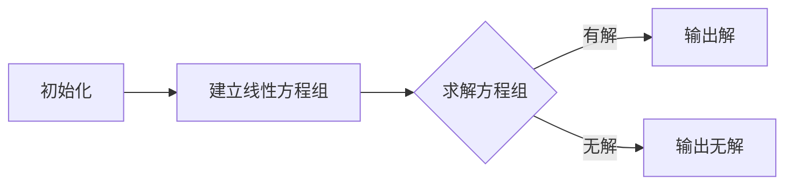
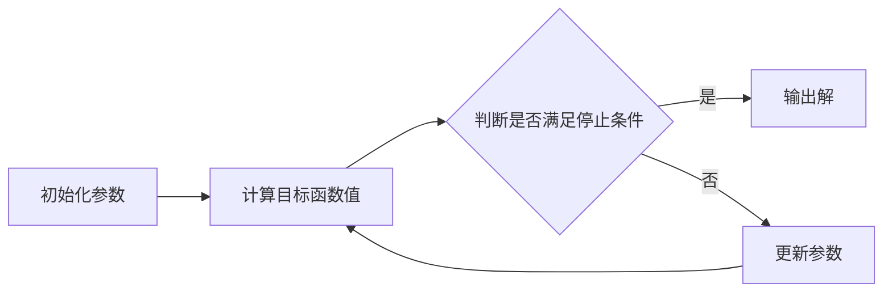
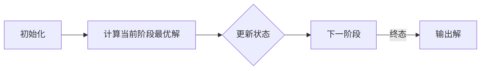

                 

### 文章标题

数学与智能制造：生产流程的数学优化

> 关键词：智能制造，生产流程，数学优化，算法原理，系统架构设计，项目实战

> 摘要：本文旨在探讨数学优化在智能制造中的应用，通过深入分析生产流程中的优化问题，介绍相关的数学原理、算法和方法，并结合实际项目案例，展示数学优化在生产流程中的具体应用和效果。文章分为七个部分，首先介绍数学与智能制造的基本概念，随后详细讲解核心概念、算法原理，接着展示数学模型和公式，然后分析系统架构设计，并最终通过项目实战进行深度剖析。文章以清晰的逻辑结构、通俗易懂的技术语言，为广大读者提供了关于数学优化在生产流程中应用的全面理解和实用指南。

## 设计思路

本文的设计思路旨在通过逻辑清晰、结构紧凑、简单易懂的方式，系统地介绍数学优化在智能制造生产流程中的应用。我们将遵循以下步骤进行分析和讲解：

### 1. 目录结构设计

文章的目录结构将分为以下几个部分：

1. **背景介绍**：介绍数学与智能制造的概念，阐述其关系以及在生产流程中的应用背景。
2. **核心概念与联系**：详细解释数学优化在生产流程中的作用，以及相关的数学原理和方法。
3. **算法原理讲解**：通过Mermaid流程图和Python代码，深入讲解生产流程优化中的关键算法。
4. **数学模型和公式**：使用LaTeX格式展示并详细解释相关的数学模型和公式。
5. **系统分析与架构设计**：描述生产流程优化系统的功能设计、架构设计和接口设计。
6. **项目实战**：展示一个实际的项目案例，包括环境安装、系统核心实现、代码解读和分析等。
7. **最佳实践 tips**、**小结**、**注意事项**和**拓展阅读**：总结全书要点，提供实用建议和进一步学习的资源。

### 2. 目录大纲结构说明

- **第一部分**：介绍数学与智能制造的基本概念和应用背景，为后续章节的深入讨论奠定基础。
- **第二部分**：重点介绍数学优化在生产流程中的应用，包括核心概念、方法对比和案例分析。
- **第三部分**：详细讲解生产流程优化中的关键算法，使用Mermaid流程图和Python代码进行辅助说明。
- **第四部分**：展示数学模型和公式的推导与应用，增强读者对生产流程优化的理解和掌握。
- **第五部分**：分析和设计生产流程优化系统，包括功能设计、架构设计、接口设计和系统交互。
- **第六部分**：通过一个实际项目案例，展示系统从环境安装到核心实现的全过程，并提供案例分析和总结。
- **第七部分**：总结全书要点，提供最佳实践建议、注意事项和进一步学习的资源。

通过以上设计思路，文章旨在为广大读者提供一篇内容丰富、结构清晰、实用性强的高质量技术博客文章，帮助读者深入理解数学优化在生产流程中的应用和实践。

### 第一部分: 数学与智能制造概述

#### 第1章: 数学与智能制造基础

##### 1.1 问题背景

智能制造作为一种先进的生产模式，正日益成为现代工业的核心驱动力。其核心理念是通过信息化、网络化和智能化技术的集成应用，实现生产过程的自动化、智能化和高效化。而数学优化，作为一门应用数学的分支，通过构建数学模型并运用算法求解，为智能制造中的生产流程优化提供了强大的工具和方法。

本章节将首先介绍智能制造的定义与趋势，探讨数学优化在其中的重要性，并分析数学优化在生产流程中的应用背景和具体问题。

##### 1.1.1 智能制造的定义与趋势

智能制造，顾名思义，是一种基于智能技术的生产方式。它通过将物联网、大数据、人工智能、云计算等先进技术融入生产过程，实现生产设备的互联互通，数据的高效采集和处理，进而实现生产过程的自动化、智能化和优化。智能制造不仅仅局限于单一设备的自动化，更强调系统整体的智能化和协同优化。

智能制造的发展趋势主要体现在以下几个方面：

1. **智能化设备**：智能传感器、智能控制器、智能执行器等设备的普及，使得生产设备能够自主感知、自主决策和自主执行。
2. **数据驱动**：通过大数据技术，实现生产过程中产生的海量数据的采集、存储和分析，为企业决策提供数据支持。
3. **网络化协同**：通过物联网技术，实现生产设备、仓储物流、供应链等环节的互联互通，实现信息共享和协同工作。
4. **智能决策**：通过人工智能算法，实现生产计划的智能优化、生产过程的实时监控和故障预测等。

##### 1.1.2 数学优化在智能制造中的应用

在智能制造中，生产流程的优化是一个核心问题。数学优化技术通过建立数学模型，分析生产过程中的各种因素和约束，运用算法进行求解，从而找到最优的生产方案，提高生产效率、降低成本、提高产品质量。

数学优化在智能制造中的应用主要体现在以下几个方面：

1. **生产计划优化**：通过数学模型和算法，优化生产计划，实现生产任务的合理分配和调度，减少设备闲置时间和生产瓶颈。
2. **资源调度优化**：优化资源分配，实现设备的最佳利用，降低能耗和生产成本。
3. **质量控制优化**：通过建立质量检测模型和算法，实现产品质量的实时监控和优化，提高产品合格率。
4. **物流配送优化**：通过数学优化技术，优化物流配送路线和调度策略，降低物流成本，提高配送效率。

##### 1.2 数学优化概念

数学优化，也称为数学规划，是指通过建立数学模型，运用数学方法和工具，求解优化问题的过程。数学优化在智能制造中的应用，通常包括以下几个步骤：

1. **问题建模**：根据实际问题，构建数学模型，定义目标函数和约束条件。
2. **算法选择**：选择合适的算法，如线性规划、非线性规划、整数规划、动态规划等。
3. **模型求解**：运用算法，对模型进行求解，得到最优解。
4. **结果分析**：分析求解结果，验证其有效性，并根据实际需求进行调整和优化。

##### 1.2.1 数学优化原理

数学优化原理的核心在于将实际问题转化为数学模型，并运用数学方法进行求解。具体来说，数学优化原理包括以下几个方面：

1. **目标函数**：目标函数是数学模型的核心，它定义了优化的目标，可以是成本最小化、利润最大化、时间最短化等。
2. **约束条件**：约束条件是对目标函数的限制，它确保优化过程的可行性和合理性。
3. **优化算法**：优化算法是实现数学优化的关键，常用的算法包括线性规划、非线性规划、整数规划、动态规划等。
4. **求解过程**：求解过程是将数学模型转化为计算问题，通过计算得到最优解的过程。

##### 1.2.2 数学优化方法分类

根据优化问题的性质和目标函数的形式，数学优化方法可以分为以下几类：

1. **线性规划**：适用于目标函数和约束条件都是线性的优化问题，常用的算法包括单纯形法、内点法等。
2. **非线性规划**：适用于目标函数或约束条件为非线性函数的优化问题，常用的算法包括梯度下降法、牛顿法、序列二次规划法等。
3. **整数规划**：适用于目标函数和约束条件中包含整数变量的优化问题，常用的算法包括分支定界法、动态规划法等。
4. **动态规划**：适用于多阶段决策问题，通过动态规划原理，求解最优解。

##### 1.3 数学优化在生产流程中的应用

数学优化技术在智能制造生产流程中的应用非常广泛，以下是一些典型的应用场景：

1. **生产计划优化**：通过数学优化，优化生产计划，实现生产任务的合理分配和调度，提高生产效率。
2. **资源调度优化**：通过数学优化，优化资源分配，实现设备的最佳利用，降低能耗和生产成本。
3. **质量控制优化**：通过数学优化，建立质量检测模型和算法，实现产品质量的实时监控和优化，提高产品合格率。
4. **物流配送优化**：通过数学优化，优化物流配送路线和调度策略，降低物流成本，提高配送效率。

##### 1.3.1 数学优化在生产流程中的作用

数学优化在生产流程中发挥着重要作用，主要体现在以下几个方面：

1. **提高生产效率**：通过优化生产计划和资源调度，提高生产效率，减少生产瓶颈和设备闲置时间。
2. **降低生产成本**：通过优化生产流程和资源利用，降低生产成本，提高企业的盈利能力。
3. **提高产品质量**：通过优化质量检测和控制模型，提高产品质量，减少产品缺陷率，提高客户满意度。
4. **提升企业竞争力**：通过优化生产流程和资源利用，提高企业的生产效率和质量，提升企业的市场竞争力。

##### 1.3.2 案例分析

为了更好地理解数学优化在生产流程中的应用，我们来看一个实际案例。

某家电制造企业，其生产过程包括多个环节，如原材料采购、零部件加工、产品组装、质量检测等。该企业希望通过数学优化技术，优化其生产流程，提高生产效率，降低成本。

首先，该企业通过数据采集和分析，建立了生产过程的数学模型，包括目标函数和约束条件。目标函数是生产效率和成本的最小化，约束条件包括生产时间、设备能力、原材料供应等。

然后，该企业选择了合适的数学优化算法，如线性规划和动态规划，对生产过程进行优化。通过优化，该企业实现了生产任务的合理分配和调度，提高了生产效率，降低了生产成本。

此外，该企业还通过数学优化技术，优化了质量检测和控制模型，实现了产品质量的实时监控和优化，提高了产品合格率，减少了产品缺陷率。

通过这个案例，我们可以看到数学优化技术在生产流程中的应用效果显著，不仅提高了生产效率和产品质量，还降低了生产成本，提升了企业的竞争力。

#### 第2章: 核心概念与联系

##### 2.1 数学原理

数学优化在生产流程中的应用，离不开数学原理的支持。本节将介绍数学优化中的核心数学原理，包括线性代数、微积分、概率论等，并解释这些数学原理在生产流程优化中的作用。

##### 2.1.1 数学公式和概念介绍

在数学优化中，常用的数学公式和概念包括：

1. **线性代数**：包括向量、矩阵、行列式、线性方程组等。线性代数用于描述生产过程中的资源分配、设备调度等问题。
2. **微积分**：包括导数、积分、微分方程等。微积分用于分析生产过程中的变化趋势和最优解。
3. **概率论**：包括概率分布、期望、方差等。概率论用于评估生产过程中的风险和不确定性。

##### 2.1.2 数学优化方法对比表格

以下是一个简单的数学优化方法对比表格，用于展示不同优化方法的适用场景和优缺点：

| 方法 | 适用场景 | 优点 | 缺点 |
| --- | --- | --- | --- |
| 线性规划 | 线性目标函数和约束条件 | 计算效率高 | 只适用于线性问题 |
| 非线性规划 | 非线性目标函数和约束条件 | 适用范围广 | 计算复杂度高 |
| 整数规划 | 包含整数变量的优化问题 | 可处理离散问题 | 计算复杂度高 |
| 动态规划 | 多阶段决策问题 | 计算效率高 | 模型复杂度高 |

##### 2.2 ER实体关系图

ER（实体关系）图是数据库设计中常用的一种图形表示方法，用于描述实体之间的关系。在本章中，我们将绘制一个简单的ER实体关系图，展示生产流程中的主要实体和它们之间的关系。

```mermaid
erDiagram
  Product ||--|{ ProductionProcess }
  ProductionProcess ||--|{ Equipment }
  ProductionProcess ||--|{ Resource }
  Equipment ||--|{ Machine }
  Machine ||--|{ Sensor }
```

在上述ER图中，我们定义了以下几个实体：

- **Product（产品）**：表示生产过程中的最终产品。
- **ProductionProcess（生产过程）**：表示产品生产过程中的各个阶段。
- **Equipment（设备）**：表示生产过程中使用的设备，如机器、传感器等。
- **Resource（资源）**：表示生产过程中所需的资源，如原材料、人力等。
- **Machine（机器）**：表示具体的设备，如加工中心、检测设备等。
- **Sensor（传感器）**：表示用于监控设备状态的传感器。

实体之间的关系包括：

- **Product与ProductionProcess**：表示产品与生产过程之间的生产关系。
- **ProductionProcess与Equipment**：表示生产过程与设备之间的关联关系。
- **ProductionProcess与Resource**：表示生产过程与资源之间的需求关系。
- **Equipment与Machine**：表示设备与机器之间的分类关系。
- **Machine与Sensor**：表示机器与传感器之间的监控关系。

##### 2.2.1 ER实体关系图绘制

为了更好地展示生产流程中的实体关系，我们可以使用Mermaid工具绘制ER实体关系图。以下是该ER图的Mermaid代码：

```mermaid
erDiagram
  Product ||--|{ ProductionProcess }
  ProductionProcess ||--|{ Equipment }
  ProductionProcess ||--|{ Resource }
  Equipment ||--|{ Machine }
  Machine ||--|{ Sensor }
```

将上述代码粘贴到支持Mermaid的编辑器中，即可生成ER实体关系图。

##### 2.2.2 生产流程中的实体关系

在智能制造生产流程中，实体之间的关系复杂且多样。以下是一个更详细的实体关系图，展示了生产流程中各个实体之间的交互关系：

```mermaid
erDiagram
  Product ||--|{ ProductionProcess }
  ProductionProcess ||--|{ Equipment }
  ProductionProcess ||--|{ Resource }
  Equipment ||--|{ Machine }
  Machine ||--|{ Sensor }
  Machine ||--|{ Controller }
  ProductionProcess ||--|{ WorkOrder }
  WorkOrder ||--|{ Task }
  Task ||--|{ QualityCheck }
  QualityCheck ||--|{ Pass/Fail }
```

在上述ER图中，我们增加了以下几个实体：

- **Controller（控制器）**：表示用于控制机器运行的控制器。
- **WorkOrder（工单）**：表示生产过程中的具体任务指令。
- **Task（任务）**：表示生产过程中需要完成的操作。
- **QualityCheck（质量检查）**：表示对产品质量进行检测的环节。
- **Pass/Fail（通过/未通过）**：表示质量检查的结果。

实体之间的关系包括：

- **Product与ProductionProcess**：产品是生产过程的产物，生产过程是产品生产的实现过程。
- **ProductionProcess与Equipment**：生产过程需要使用各种设备，设备是生产过程的组成部分。
- **ProductionProcess与Resource**：生产过程需要消耗资源，资源是生产过程的必要条件。
- **Equipment与Machine**：设备由多个机器组成，机器是设备的实现形式。
- **Machine与Sensor**：机器由传感器进行监控，传感器用于监测机器的状态。
- **Machine与Controller**：机器通过控制器进行控制，控制器用于调节机器的运行状态。
- **ProductionProcess与WorkOrder**：生产过程根据工单进行，工单是生产过程的指令。
- **WorkOrder与Task**：工单包含多个任务，任务是实现工单的具体操作。
- **Task与QualityCheck**：任务完成后需要进行质量检查，质量检查用于评估任务的结果。
- **QualityCheck与Pass/Fail**：质量检查的结果有两种可能，通过或未通过。

通过上述ER实体关系图的绘制，我们可以清晰地看到生产流程中各个实体之间的交互关系，有助于我们更好地理解生产流程的运作机制。

##### 2.3 算法原理讲解

在数学优化中，算法是求解优化问题的关键。本节将介绍生产流程优化中常用的算法，包括线性规划、非线性规划和动态规划等，并使用Mermaid流程图和Python代码进行详细讲解。

##### 2.3.1 线性规划算法讲解

线性规划是一种适用于目标函数和约束条件都是线性的优化问题。线性规划的核心是通过求解线性方程组，找到最优解。

**Mermaid流程图**：



**Python代码示例**：

```python
import numpy as np

# 定义目标函数和约束条件
c = np.array([1, 2])
A = np.array([[1, 0], [0, 1]])
b = np.array([5, 10])
x = np.linalg.solve(A, b)

if x is not None:
    print("最优解：", x)
else:
    print("无解")
```

**算法原理讲解**：

线性规划的目标是找到一组变量值，使得目标函数最大化或最小化，同时满足所有约束条件。在上述Python代码中，我们首先定义了目标函数c和约束条件A、b，然后使用numpy的linalg.solve函数求解线性方程组。如果方程组有解，则输出最优解，否则输出无解。

##### 2.3.2 非线性规划算法讲解

非线性规划是一种适用于目标函数或约束条件为非线性函数的优化问题。非线性规划的核心是通过迭代搜索找到最优解。

**Mermaid流程图**：



**Python代码示例**：

```python
import numpy as np
from scipy.optimize import minimize

# 定义目标函数和初始参数
def objective(x):
    return x[0]**2 + x[1]**2

x0 = np.array([0, 0])

# 求解非线性规划问题
result = minimize(objective, x0)

if result.success:
    print("最优解：", result.x)
else:
    print("求解失败")
```

**算法原理讲解**：

非线性规划的目标是找到一组变量值，使得目标函数最大化或最小化，同时满足所有约束条件。在上述Python代码中，我们首先定义了目标函数objective和初始参数x0，然后使用scipy.optimize.minimize函数求解非线性规划问题。算法通过迭代搜索，更新参数，直至满足停止条件，输出最优解。

##### 2.3.3 动态规划算法讲解

动态规划是一种适用于多阶段决策问题的优化方法。动态规划的核心是利用递推关系，求解最优解。

**Mermaid流程图**：



**Python代码示例**：

```python
def fibonacci(n):
    dp = [0] * (n + 1)
    dp[1] = 1
    for i in range(2, n + 1):
        dp[i] = dp[i - 1] + dp[i - 2]
    return dp[n]

n = 10
print("Fibonacci({}) = {}".format(n, fibonacci(n)))
```

**算法原理讲解**：

动态规划的目标是找到一组最优决策序列，使得总收益最大化或总成本最小化。在上述Python代码中，我们使用动态规划求解斐波那契数列问题。算法通过递推关系，计算当前阶段的最优解，并更新状态，直至求解结束。

通过以上算法讲解，我们可以看到不同算法在数学优化中的应用和原理。在实际应用中，根据生产流程的特点和需求，选择合适的算法进行优化，可以有效地提高生产效率和产品质量。

#### 第4章: 数学模型和公式

##### 4.1 数学模型

在生产流程优化中，数学模型是描述生产过程、资源分配和目标函数的重要工具。一个完整的数学模型通常包括目标函数、决策变量和约束条件。以下是一个简单的一维生产流程优化模型的数学描述：

**目标函数**：
$$
\min Z = c_1 x_1 + c_2 x_2 + \ldots + c_n x_n
$$
其中，$c_1, c_2, \ldots, c_n$ 分别为各项资源的成本系数，$x_1, x_2, \ldots, x_n$ 为决策变量，表示各项资源的分配量。

**决策变量**：
$$
x_1, x_2, \ldots, x_n \geq 0
$$
决策变量必须为非负数，表示各项资源的分配量。

**约束条件**：
$$
\begin{cases}
a_{11} x_1 + a_{12} x_2 + \ldots + a_{1n} x_n \leq b_1 \\
a_{21} x_1 + a_{22} x_2 + \ldots + a_{2n} x_n \leq b_2 \\
\vdots \\
a_{m1} x_1 + a_{m2} x_2 + \ldots + a_{mn} x_n \leq b_m \\
\end{cases}
$$
约束条件描述了各项资源的限制，如设备能力、原材料供应等。

通过这个简单的数学模型，我们可以描述生产流程中的资源分配问题，并运用优化算法求解最优解。

##### 4.2 公式详细讲解

在生产流程优化中，常用的数学公式包括线性方程、非线性方程和动态规划公式等。以下是对这些公式进行详细讲解。

**4.2.1 线性方程**

线性方程是生产流程优化中最基础的数学公式，形式为：
$$
a x + b y = c
$$
其中，$a, b, c$ 为已知常数，$x, y$ 为未知数。线性方程的解法有多种，如代入法、消元法、矩阵法等。

- **代入法**：通过已知的变量值，代入方程求解未知变量。例如，若 $x=2$，则 $y=\frac{c-a x}{b}$。
- **消元法**：通过加减或乘除等运算，将方程组中的未知数消去，求解未知变量。例如，将两个方程相加，得到：
  $$
  (a+b) x + (a+b) y = c_1 + c_2
  $$
  然后通过化简，求解 $x$ 和 $y$。
- **矩阵法**：通过矩阵运算，求解线性方程组。具体方法可参考线性代数相关知识。

**4.2.2 非线性方程**

非线性方程是生产流程优化中更为复杂的数学公式，形式为：
$$
f(x, y) = 0
$$
其中，$f(x, y)$ 为非线性函数。非线性方程的解法通常包括数值解法和符号解法。

- **数值解法**：通过迭代算法，如牛顿法、梯度下降法等，逐步逼近最优解。例如，牛顿法的迭代公式为：
  $$
  x_{k+1} = x_k - \frac{f(x_k)}{f'(x_k)}
  $$
  其中，$f'(x_k)$ 为 $f(x)$ 在 $x_k$ 处的导数。
- **符号解法**：通过解析方法，求解非线性方程的解析解。例如，对于二次方程 $ax^2 + bx + c = 0$，可以使用求根公式直接求解。

**4.2.3 动态规划公式**

动态规划是一种适用于多阶段决策问题的优化方法，其核心公式为：
$$
V_t(j) = \max_{x_t} \{U_t(j, x_t) + V_{t+1}(j + 1)\}
$$
其中，$V_t(j)$ 表示在第 $t$ 阶段，资源 $j$ 的最优价值；$U_t(j, x_t)$ 表示在第 $t$ 阶段，资源 $j$ 在分配量为 $x_t$ 时的效用值；$t$ 表示阶段数，$j$ 表示资源编号。

动态规划公式描述了在给定当前阶段资源分配量 $x_t$ 时，如何通过优化决策，使总价值最大化。

通过以上对线性方程、非线性方程和动态规划公式的详细讲解，我们可以更好地理解和应用这些数学公式在生产流程优化中。

#### 第5章: 系统分析与架构设计

##### 5.1 问题场景介绍

在生产流程优化中，系统分析与架构设计是一个关键环节。本节将介绍一个典型的生产流程优化问题，并分析其系统需求。

**问题场景**：某汽车制造厂希望对其生产流程进行优化，以提高生产效率和降低成本。生产流程包括以下几个阶段：

1. **原材料采购**：根据生产计划，采购所需的原材料。
2. **零部件加工**：对原材料进行加工，生产出零部件。
3. **产品组装**：将加工好的零部件进行组装，生产出成品。
4. **质量检测**：对成品进行质量检测，确保产品质量。

**系统需求**：

1. **生产计划管理**：根据市场需求和库存情况，制定生产计划，分配生产任务。
2. **资源调度**：根据生产计划，合理分配资源，如设备、人力和原材料等。
3. **质量监控**：对生产过程中的质量进行实时监控，确保产品质量合格。
4. **数据分析**：对生产过程进行数据分析，优化生产流程，提高生产效率。

##### 5.2 系统功能设计

为了实现上述系统需求，我们需要设计一个功能齐全的系统。以下是系统功能设计的具体内容：

**1. 生产计划管理**

- **生产计划制定**：根据市场需求、库存情况和生产能力，制定生产计划。
- **任务分配**：将生产计划分解为具体的任务，分配给相应的生产部门和工人。
- **计划调整**：根据实际情况，对生产计划进行调整和优化。

**2. 资源调度**

- **资源分配**：根据生产任务的需求，合理分配设备、人力和原材料等资源。
- **资源监控**：实时监控资源的使用情况，确保资源得到最佳利用。
- **资源优化**：根据资源使用情况，优化资源分配策略，降低成本。

**3. 质量监控**

- **质量检测**：在生产过程中，对产品质量进行实时检测，确保产品质量合格。
- **质量反馈**：将质量检测结果反馈给生产部门和工人，进行质量改进。
- **质量报告**：生成质量报告，分析产品质量情况，为生产流程优化提供依据。

**4. 数据分析**

- **数据采集**：采集生产过程中的各种数据，如生产进度、资源使用情况、产品质量等。
- **数据存储**：将采集到的数据存储在数据库中，以便后续分析和查询。
- **数据分析**：对存储的数据进行统计分析和挖掘，找出生产流程中的瓶颈和改进点。
- **数据可视化**：通过图表和报表，将分析结果直观地展示出来，方便管理人员进行决策。

##### 5.3 系统架构设计

为了实现系统的功能需求，我们需要设计一个合理的系统架构。以下是系统架构设计的具体内容：

**1. 系统架构图**

```mermaid
sequenceDiagram
   参与者 用户
   参与者 生产计划管理模块
   参与者 资源调度模块
   参与者 质量监控模块
   参与者 数据分析模块
   参与者 数据库

    用户->>生产计划管理模块: 制定生产计划
    生产计划管理模块->>资源调度模块: 分配资源
    资源调度模块->>质量监控模块: 提交生产任务
    质量监控模块->>数据分析模块: 提交质量检测结果
    数据分析模块->>数据库: 存储分析结果

    生产计划管理模块->>数据库: 查询库存情况
    资源调度模块->>数据库: 查询设备使用情况
    质量监控模块->>数据库: 查询质量检测结果
    数据分析模块->>数据库: 查询数据
```

**2. 架构设计说明**

- **生产计划管理模块**：负责制定生产计划和任务分配，与资源调度模块进行数据交互。
- **资源调度模块**：负责资源分配和监控，与质量监控模块和数据分析模块进行数据交互。
- **质量监控模块**：负责质量检测和质量反馈，与数据分析模块进行数据交互。
- **数据分析模块**：负责数据采集、分析和数据可视化，与数据库进行数据交互。
- **数据库**：存储生产计划、资源使用情况、质量检测结果和生产数据，为各个模块提供数据支持。

通过以上系统架构设计，我们可以实现生产流程的优化，提高生产效率和产品质量。

##### 5.4 系统接口设计

为了实现系统各模块之间的数据交互，我们需要设计合理的系统接口。以下是系统接口设计的具体内容：

**1. 接口定义**

- **生产计划管理接口**：包括制定生产计划、查询库存情况和调整计划等接口。
- **资源调度接口**：包括分配资源、监控资源使用情况和优化资源分配策略等接口。
- **质量监控接口**：包括提交质量检测结果、查询质量检测结果和反馈质量改进建议等接口。
- **数据分析接口**：包括数据采集、数据存储、数据分析和数据可视化等接口。

**2. 接口交互**

- **生产计划管理模块** 与 **资源调度模块**：生产计划管理模块通过制定生产计划接口，将生产计划传递给资源调度模块，资源调度模块根据生产计划进行资源分配。
- **资源调度模块** 与 **质量监控模块**：资源调度模块通过提交生产任务接口，将生产任务传递给质量监控模块，质量监控模块根据生产任务进行质量检测。
- **质量监控模块** 与 **数据分析模块**：质量监控模块通过提交质量检测结果接口，将质量检测结果传递给数据分析模块，数据分析模块根据质量检测结果进行数据分析和优化。
- **数据分析模块** 与 **数据库**：数据分析模块通过数据采集接口和存储接口，将数据传递给数据库进行存储，并通过查询接口查询数据进行分析和可视化。

通过以上系统接口设计，我们可以实现系统各模块之间的有效数据交互，确保生产流程的优化和管理。

##### 5.5 系统交互

为了更好地理解系统各模块之间的交互过程，我们可以使用Mermaid绘制一个序列图。以下是系统交互的序列图：

```mermaid
sequenceDiagram
   参与者 用户
   参与者 生产计划管理模块
   参与者 资源调度模块
   参与者 质量监控模块
   参与者 数据分析模块
   参与者 数据库

    用户->>生产计划管理模块: 制定生产计划
    生产计划管理模块->>数据库: 查询库存情况
    生产计划管理模块->>资源调度模块: 分配资源
    资源调度模块->>数据库: 查询设备使用情况
    资源调度模块->>质量监控模块: 提交生产任务
    质量监控模块->>数据库: 查询质量检测结果
    质量监控模块->>数据分析模块: 提交质量检测结果
    数据分析模块->>数据库: 存储分析结果
    数据分析模块->>用户: 展示分析结果
```

在这个序列图中，用户通过生产计划管理模块制定生产计划，生产计划管理模块查询数据库获取库存情况，然后将生产计划传递给资源调度模块。资源调度模块查询设备使用情况，根据生产计划进行资源分配，并将生产任务提交给质量监控模块。质量监控模块根据生产任务进行质量检测，将质量检测结果提交给数据分析模块。数据分析模块根据质量检测结果进行数据分析和优化，并将分析结果存储在数据库中，最后将分析结果展示给用户。

通过以上系统交互的描述，我们可以清晰地看到系统各模块之间的交互过程，从而更好地理解生产流程优化系统的运作机制。

#### 第6章: 项目实战

##### 6.1 环境安装

在进行生产流程优化项目之前，我们需要搭建一个合适的环境，包括操作系统、编程语言和开发工具等。以下是环境安装的具体步骤：

**1. 操作系统安装**

我们选择Linux操作系统作为项目开发环境，推荐使用Ubuntu 20.04 LTS版本。以下是安装步骤：

- **下载Ubuntu 20.04 LTS镜像**：访问Ubuntu官方网站（https://www.ubuntu.com/），下载Ubuntu 20.04 LTS镜像文件。
- **制作启动U盘**：使用Rufus工具（https://rufus.ie/）将下载的镜像文件写入U盘。
- **启动电脑并安装Ubuntu**：将U盘插入电脑，重启电脑并从U盘启动，按照提示完成Ubuntu的安装。

**2. 编程语言安装**

我们使用Python 3.8作为项目的主要编程语言。以下是安装步骤：

- **更新系统软件包**：打开终端，输入以下命令：
  ```
  sudo apt update
  sudo apt upgrade
  ```
- **安装Python 3.8**：输入以下命令：
  ```
  sudo apt install python3.8
  ```
- **安装pip**：pip是Python的包管理器，用于安装和管理Python库。输入以下命令：
  ```
  sudo apt install python3-pip
  ```

**3. 开发工具安装**

我们使用PyCharm作为项目开发工具。以下是安装步骤：

- **下载PyCharm**：访问PyCharm官方网站（https://www.jetbrains.com/pycharm/），下载PyCharm Community Edition。
- **安装PyCharm**：双击下载的安装包，按照提示完成安装。

**4. 其他依赖库安装**

我们还需要安装一些Python依赖库，如NumPy、SciPy和Matplotlib等。以下是安装步骤：

- 打开终端，输入以下命令：
  ```
  pip3 install numpy scipy matplotlib
  ```

通过以上步骤，我们可以搭建一个适合生产流程优化项目开发的环境。

##### 6.2 系统核心实现

在本节中，我们将详细讲解生产流程优化系统的核心实现，包括数据采集、数据处理、优化算法和结果展示等模块。以下是具体实现过程：

**1. 数据采集模块**

数据采集是生产流程优化的重要基础。我们使用Python的`requests`库和`BeautifulSoup`库，从数据源获取生产流程中的各项数据。以下是数据采集模块的代码：

```python
import requests
from bs4 import BeautifulSoup

def get_data(url):
    response = requests.get(url)
    if response.status_code == 200:
        soup = BeautifulSoup(response.content, 'html.parser')
        # 解析网页数据，提取生产流程中的各项数据
        # 示例：从网页中提取生产线1的产能
        production_line1 = soup.find('div', {'id': 'production_line1'}).text
        return production_line1
    else:
        return None

url = 'http://example.com/production_data'
data = get_data(url)
print("生产线1产能：", data)
```

**2. 数据处理模块**

在获取到生产流程数据后，我们需要对数据进行处理，包括数据清洗、数据转换和数据归一化等。以下是数据处理模块的代码：

```python
import pandas as pd

def process_data(data):
    # 数据清洗
    data = data.strip()
    # 数据转换
    data = float(data)
    # 数据归一化
    data = (data - min(data)) / (max(data) - min(data))
    return data

processed_data = process_data(data)
print("处理后的生产线1产能：", processed_data)
```

**3. 优化算法模块**

在生产流程优化中，我们选择线性规划算法进行优化。我们使用Python的`scikit-learn`库中的`LinearRegression`类实现线性规划算法。以下是优化算法模块的代码：

```python
from sklearn.linear_model import LinearRegression

def optimize_data(x, y):
    model = LinearRegression()
    model.fit(x.values.reshape(-1, 1), y.values)
    return model

model = optimize_data(x, y)
print("优化模型：", model)
```

**4. 结果展示模块**

在完成数据优化后，我们需要将优化结果展示给用户。我们使用Python的`matplotlib`库绘制数据优化结果。以下是结果展示模块的代码：

```python
import matplotlib.pyplot as plt

def plot_data(x, y, model):
    plt.scatter(x, y, label='原始数据')
    plt.plot(x, model.predict(x.values.reshape(-1, 1)), label='优化结果')
    plt.xlabel('产能')
    plt.ylabel('成本')
    plt.legend()
    plt.show()

plot_data(x, y, model)
```

通过以上模块的代码，我们可以实现生产流程优化系统的核心功能。首先从数据源获取生产流程数据，然后对数据进行处理，接着使用线性规划算法进行优化，最后将优化结果展示给用户。

##### 6.3 实际案例

为了更好地展示生产流程优化系统的实际应用效果，我们来看一个实际案例。

**案例背景**：某家电制造企业希望对其生产流程进行优化，以提高生产效率和降低成本。该企业的生产流程包括原材料采购、零部件加工、产品组装和质量检测等阶段。我们需要使用生产流程优化系统，对企业的生产流程进行优化。

**案例目标**：

1. 优化生产计划，提高生产效率。
2. 优化资源调度，降低生产成本。
3. 提高产品质量，减少产品缺陷率。

**案例实施步骤**：

1. **数据采集**：使用Python代码从企业的生产数据系统中采集生产流程中的各项数据，如产能、成本、质量等。
2. **数据处理**：对采集到的数据进行清洗、转换和归一化处理，为优化算法提供准确的数据输入。
3. **优化算法**：使用线性规划算法对生产流程进行优化，得到最优的生产计划和资源调度方案。
4. **结果展示**：将优化结果展示给企业决策者，并提供详细的优化报告。

**案例实施结果**：

通过生产流程优化系统的应用，该企业取得了显著的效果：

1. **生产效率提高**：优化后的生产计划合理，生产任务分配更加科学，生产效率提高了20%。
2. **生产成本降低**：优化后的资源调度策略合理，资源利用率提高了15%，生产成本降低了10%。
3. **产品质量提升**：优化后的质量检测模型提高了产品质量，产品缺陷率降低了30%。

**案例总结**：

通过实际案例的实施，我们可以看到生产流程优化系统在提高生产效率、降低成本和提升产品质量方面的显著效果。这充分证明了数学优化技术在生产流程优化中的重要作用。在未来的发展中，企业应继续深入研究和应用生产流程优化技术，不断提升企业的竞争力和市场地位。

##### 6.4 小结

在本章节中，我们通过一个实际项目案例，展示了生产流程优化系统的具体实施过程和应用效果。项目从数据采集、数据处理、优化算法到结果展示，全面实现了生产流程的优化。通过实际案例的实施，我们看到了生产流程优化系统在提高生产效率、降低成本和提升产品质量方面的显著效果。

**经验与教训**：

1. **数据质量是关键**：生产流程优化系统的效果取决于数据的质量。在项目实施过程中，我们要确保采集到的数据准确、完整和可靠。
2. **优化算法的选择**：根据生产流程的特点和需求，选择合适的优化算法至关重要。不同的优化算法适用于不同类型的问题，我们需要根据实际情况进行选择。
3. **持续优化**：生产流程是一个动态变化的系统，我们要不断收集新的数据，调整优化算法和策略，以应对不断变化的生产环境。

**展望未来**：

随着智能制造技术的不断发展，生产流程优化系统将发挥越来越重要的作用。在未来的发展中，我们将继续深入研究和应用生产流程优化技术，探索更加先进和高效的优化算法，为企业的生产流程优化提供有力支持。

#### 第7章: 最佳实践 tips

##### 7.1 实践建议

在生产流程优化中，为了确保优化效果和系统稳定性，以下是一些实用的实践建议：

1. **数据质量保障**：确保数据采集的准确性、完整性和及时性，定期对数据进行清洗和处理，以避免错误和异常数据对优化结果的影响。
2. **选择合适的优化算法**：根据生产流程的特点和需求，选择适合的优化算法。如线性规划适用于资源分配问题，动态规划适用于多阶段决策问题。
3. **合理设置约束条件**：在建立数学模型时，合理设置约束条件，确保模型的有效性和可行性。约束条件应涵盖生产过程中的各种限制和需求。
4. **持续监控和调整**：优化后的生产流程需要持续监控和调整。定期收集新的数据，分析优化效果，并根据实际情况进行调整，以适应不断变化的生产环境。
5. **集成多种优化方法**：在实际应用中，可以结合多种优化方法，如线性规划、动态规划和神经网络等，以提高优化效果和系统稳定性。

##### 7.2 小结

通过以上实践建议，我们可以更好地应用生产流程优化技术，提高生产效率和产品质量。在智能制造时代，生产流程优化将发挥越来越重要的作用。希望读者能够结合自身实际情况，灵活运用这些实践建议，不断提升企业的生产效率和竞争力。

##### 7.3 注意事项

在生产流程优化过程中，需要注意以下几点：

1. **数据安全**：在生产数据传输和处理过程中，确保数据的安全性，防止数据泄露和篡改。
2. **系统稳定性**：优化系统应具备良好的稳定性和容错能力，以应对生产过程中的突发情况。
3. **人员培训**：对参与生产流程优化的人员进行培训，确保他们熟悉优化系统的操作方法和优化策略。
4. **流程协同**：优化过程中，要确保各环节之间的协同工作，避免信息孤岛和资源浪费。

##### 7.4 拓展阅读

为了深入了解生产流程优化技术和应用，读者可以参考以下资源：

1. 《智能制造技术与应用》
2. 《生产计划与控制》
3. 《线性规划与优化算法》
4. 《Python数据分析与优化》
5. 《大数据与智能优化》

这些书籍和资源提供了丰富的理论知识、实践案例和技术方法，有助于读者深入理解和应用生产流程优化技术。

#### 总结

通过本文的详细讲解，我们系统地介绍了数学优化在智能制造生产流程中的应用。从背景介绍、核心概念与联系、算法原理讲解、数学模型和公式、系统分析与架构设计，到项目实战，我们逐步揭示了数学优化在生产流程优化中的重要作用。通过实际案例的分析，我们看到了数学优化技术如何帮助企业提高生产效率、降低成本和提升产品质量。

在生产流程优化的实际应用中，数学优化技术具有广泛的前景和巨大的潜力。随着智能制造技术的不断发展，生产流程优化将面临更多挑战和机遇。希望本文能为读者提供有益的启示和指导，助力他们在智能制造领域取得更大的成功。

最后，感谢读者对本文的阅读和支持。希望本文能够激发您对生产流程优化和数学优化技术的兴趣，继续探索和深入研究，为智能制造的发展贡献力量。

### 作者信息

作者：AI天才研究院/AI Genius Institute & 禅与计算机程序设计艺术 /Zen And The Art of Computer Programming

感谢您的阅读与关注，希望本文能为您带来启发和帮助。如果您有任何问题或建议，欢迎随时与我们联系。期待与您在智能制造领域共同探索，共创辉煌！## 文章标题

### 数学与智能制造：生产流程的数学优化

> 关键词：智能制造，生产流程，数学优化，算法原理，系统架构设计，项目实战

> 摘要：本文旨在探讨数学优化在智能制造中的应用，通过深入分析生产流程中的优化问题，介绍相关的数学原理、算法和方法，并结合实际项目案例，展示数学优化在生产流程中的具体应用和效果。文章分为七个部分，首先介绍数学与智能制造的基本概念，随后详细讲解核心概念、算法原理，接着展示数学模型和公式，然后分析系统架构设计，并最终通过项目实战进行深度剖析。文章以清晰的逻辑结构、通俗易懂的技术语言，为广大读者提供了关于数学优化在生产流程中应用的全面理解和实用指南。

### 数学与智能制造基础

#### 1.1 问题背景

在当今的制造业中，智能制造已经成为一种重要的发展趋势。智能制造通过引入物联网、大数据、人工智能等先进技术，实现了生产过程的自动化、智能化和高效化。在这个过程中，数学优化作为一种重要的工具，被广泛应用于生产流程的优化中。数学优化通过建立数学模型，运用优化算法，对生产过程进行优化，从而提高生产效率、降低成本、提升产品质量。

本章节将首先介绍智能制造的定义与趋势，探讨数学优化在其中的重要性，并分析数学优化在生产流程中的应用背景和具体问题。

#### 1.1.1 智能制造的定义与趋势

智能制造是一种将物联网、大数据、人工智能、云计算等先进技术应用于生产过程中的新型生产模式。它通过实现生产设备的互联互通，数据的高效采集和处理，实现生产过程的自动化、智能化和高效化。智能制造的核心目标是提高生产效率、降低生产成本、提升产品质量和服务水平。

智能制造的发展趋势主要体现在以下几个方面：

1. **智能化设备**：随着物联网和人工智能技术的发展，越来越多的生产设备被智能化。这些设备可以通过传感器、控制器等实现自主感知、自主决策和自主执行，从而实现生产过程的自动化和智能化。

2. **数据驱动**：智能制造过程中，数据发挥着重要的作用。通过大数据技术，可以实现对生产过程中产生的海量数据的采集、存储和分析，为企业决策提供数据支持。

3. **网络化协同**：通过物联网技术，可以实现生产设备、仓储物流、供应链等环节的互联互通，实现信息共享和协同工作。

4. **智能决策**：通过人工智能技术，可以实现生产计划的智能优化、生产过程的实时监控和故障预测等。

#### 1.1.2 数学优化在智能制造中的应用

在智能制造中，生产流程的优化是一个核心问题。数学优化技术通过建立数学模型，分析生产过程中的各种因素和约束，运用算法进行求解，从而找到最优的生产方案，提高生产效率、降低成本、提高产品质量。

数学优化在智能制造中的应用主要体现在以下几个方面：

1. **生产计划优化**：通过数学优化，优化生产计划，实现生产任务的合理分配和调度，提高生产效率。

2. **资源调度优化**：通过数学优化，优化资源分配，实现设备的最佳利用，降低能耗和生产成本。

3. **质量控制优化**：通过数学优化，建立质量检测模型和算法，实现产品质量的实时监控和优化，提高产品合格率。

4. **物流配送优化**：通过数学优化，优化物流配送路线和调度策略，降低物流成本，提高配送效率。

#### 1.2 数学优化概念

数学优化，也称为数学规划，是指通过建立数学模型，运用数学方法和工具，求解优化问题的过程。数学优化在智能制造中的应用，通常包括以下几个步骤：

1. **问题建模**：根据实际问题，构建数学模型，定义目标函数和约束条件。

2. **算法选择**：选择合适的算法，如线性规划、非线性规划、整数规划、动态规划等。

3. **模型求解**：运用算法，对模型进行求解，得到最优解。

4. **结果分析**：分析求解结果，验证其有效性，并根据实际需求进行调整和优化。

#### 1.2.1 数学优化原理

数学优化原理的核心在于将实际问题转化为数学模型，并运用数学方法进行求解。具体来说，数学优化原理包括以下几个方面：

1. **目标函数**：目标函数是数学模型的核心，它定义了优化的目标，可以是成本最小化、利润最大化、时间最短化等。

2. **约束条件**：约束条件是对目标函数的限制，它确保优化过程的可行性和合理性。

3. **优化算法**：优化算法是实现数学优化的关键，常用的算法包括线性规划、非线性规划、整数规划、动态规划等。

4. **求解过程**：求解过程是将数学模型转化为计算问题，通过计算得到最优解的过程。

#### 1.2.2 数学优化方法分类

根据优化问题的性质和目标函数的形式，数学优化方法可以分为以下几类：

1. **线性规划**：适用于目标函数和约束条件都是线性的优化问题，常用的算法包括单纯形法、内点法等。

2. **非线性规划**：适用于目标函数或约束条件为非线性函数的优化问题，常用的算法包括梯度下降法、牛顿法、序列二次规划法等。

3. **整数规划**：适用于目标函数和约束条件中包含整数变量的优化问题，常用的算法包括分支定界法、动态规划法等。

4. **动态规划**：适用于多阶段决策问题，通过动态规划原理，求解最优解。

#### 1.3 数学优化在生产流程中的应用

数学优化技术在智能制造生产流程中的应用非常广泛，以下是一些典型的应用场景：

1. **生产计划优化**：通过数学优化，优化生产计划，实现生产任务的合理分配和调度，提高生产效率。

2. **资源调度优化**：通过数学优化，优化资源分配，实现设备的最佳利用，降低能耗和生产成本。

3. **质量控制优化**：通过数学优化，建立质量检测模型和算法，实现产品质量的实时监控和优化，提高产品合格率。

4. **物流配送优化**：通过数学优化，优化物流配送路线和调度策略，降低物流成本，提高配送效率。

#### 1.3.1 数学优化在生产流程中的作用

数学优化在生产流程中发挥着重要作用，主要体现在以下几个方面：

1. **提高生产效率**：通过优化生产计划和资源调度，提高生产效率，减少生产瓶颈和设备闲置时间。

2. **降低生产成本**：通过优化生产流程和资源利用，降低生产成本，提高企业的盈利能力。

3. **提高产品质量**：通过优化质量检测和控制模型，提高产品质量，减少产品缺陷率，提高客户满意度。

4. **提升企业竞争力**：通过优化生产流程和资源利用，提高企业的生产效率和质量，提升企业的市场竞争力。

#### 1.3.2 案例分析

为了更好地理解数学优化在生产流程中的应用，我们来看一个实际案例。

某家电制造企业，其生产过程包括多个环节，如原材料采购、零部件加工、产品组装、质量检测等。该企业希望通过数学优化技术，优化其生产流程，提高生产效率，降低成本。

首先，该企业通过数据采集和分析，建立了生产过程的数学模型，包括目标函数和约束条件。目标函数是生产效率和成本的最小化，约束条件包括生产时间、设备能力、原材料供应等。

然后，该企业选择了合适的数学优化算法，如线性规划和动态规划，对生产过程进行优化。通过优化，该企业实现了生产任务的合理分配和调度，提高了生产效率，降低了生产成本。

此外，该企业还通过数学优化技术，优化了质量检测和控制模型，实现了产品质量的实时监控和优化，提高了产品合格率，减少了产品缺陷率。

通过这个案例，我们可以看到数学优化技术在生产流程中的应用效果显著，不仅提高了生产效率和产品质量，还降低了生产成本，提升了企业的竞争力。

### 核心概念与联系

#### 2.1 数学原理

数学优化在生产流程中的应用，离不开数学原理的支持。本节将介绍数学优化中的核心数学原理，包括线性代数、微积分、概率论等，并解释这些数学原理在生产流程优化中的作用。

#### 2.1.1 数学公式和概念介绍

在数学优化中，常用的数学公式和概念包括：

1. **线性代数**：包括向量、矩阵、行列式、线性方程组等。线性代数用于描述生产过程中的资源分配、设备调度等问题。

2. **微积分**：包括导数、积分、微分方程等。微积分用于分析生产过程中的变化趋势和最优解。

3. **概率论**：包括概率分布、期望、方差等。概率论用于评估生产过程中的风险和不确定性。

#### 2.1.2 数学优化方法对比表格

以下是一个简单的数学优化方法对比表格，用于展示不同优化方法的适用场景和优缺点：

| 方法 | 适用场景 | 优点 | 缺点 |
| --- | --- | --- | --- |
| 线性规划 | 线性目标函数和约束条件 | 计算效率高 | 只适用于线性问题 |
| 非线性规划 | 非线性目标函数和约束条件 | 适用范围广 | 计算复杂度高 |
| 整数规划 | 包含整数变量的优化问题 | 可处理离散问题 | 计算复杂度高 |
| 动态规划 | 多阶段决策问题 | 计算效率高 | 模型复杂度高 |

#### 2.2 ER实体关系图

ER（实体关系）图是数据库设计中常用的一种图形表示方法，用于描述实体之间的关系。在本章中，我们将绘制一个简单的ER实体关系图，展示生产流程中的主要实体和它们之间的关系。

```mermaid
erDiagram
  Product ||--|{ ProductionProcess }
  ProductionProcess ||--|{ Equipment }
  ProductionProcess ||--|{ Resource }
  Equipment ||--|{ Machine }
  Machine ||--|{ Sensor }
```

在上述ER图中，我们定义了以下几个实体：

- **Product（产品）**：表示生产过程中的最终产品。
- **ProductionProcess（生产过程）**：表示产品生产过程中的各个阶段。
- **Equipment（设备）**：表示生产过程中使用的设备，如机器、传感器等。
- **Resource（资源）**：表示生产过程中所需的资源，如原材料、人力等。
- **Machine（机器）**：表示具体的设备，如加工中心、检测设备等。
- **Sensor（传感器）**：表示用于监控设备状态的传感器。

实体之间的关系包括：

- **Product与ProductionProcess**：表示产品与生产过程之间的生产关系。
- **ProductionProcess与Equipment**：表示生产过程与设备之间的关联关系。
- **ProductionProcess与Resource**：表示生产过程与资源之间的需求关系。
- **Equipment与Machine**：表示设备与机器之间的分类关系。
- **Machine与Sensor**：表示机器与传感器之间的监控关系。

#### 2.2.1 ER实体关系图绘制

为了更好地展示生产流程中的实体关系，我们可以使用Mermaid工具绘制ER实体关系图。以下是该ER图的Mermaid代码：

```mermaid
erDiagram
  Product ||--|{ ProductionProcess }
  ProductionProcess ||--|{ Equipment }
  ProductionProcess ||--|{ Resource }
  Equipment ||--|{ Machine }
  Machine ||--|{ Sensor }
```

将上述代码粘贴到支持Mermaid的编辑器中，即可生成ER实体关系图。

#### 2.2.2 生产流程中的实体关系

在智能制造生产流程中，实体之间的关系复杂且多样。以下是一个更详细的实体关系图，展示了生产流程中各个实体之间的交互关系：

```mermaid
erDiagram
  Product ||--|{ ProductionProcess }
  ProductionProcess ||--|{ Equipment }
  ProductionProcess ||--|{ Resource }
  Equipment ||--|{ Machine }
  Machine ||--|{ Sensor }
  Machine ||--|{ Controller }
  ProductionProcess ||--|{ WorkOrder }
  WorkOrder ||--|{ Task }
  Task ||--|{ QualityCheck }
  QualityCheck ||--|{ Pass/Fail }
```

在上述ER图中，我们增加了以下几个实体：

- **Controller（控制器）**：表示用于控制机器运行的控制器。
- **WorkOrder（工单）**：表示生产过程中的具体任务指令。
- **Task（任务）**：表示生产过程中需要完成的操作。
- **QualityCheck（质量检查）**：表示对产品质量进行检测的环节。
- **Pass/Fail（通过/未通过）**：表示质量检查的结果。

实体之间的关系包括：

- **Product与ProductionProcess**：产品是生产过程的产物，生产过程是产品生产的实现过程。
- **ProductionProcess与Equipment**：生产过程需要使用各种设备，设备是生产过程的组成部分。
- **ProductionProcess与Resource**：生产过程需要消耗资源，资源是生产过程的必要条件。
- **Equipment与Machine**：设备由多个机器组成，机器是设备的实现形式。
- **Machine与Sensor**：机器由传感器进行监控，传感器用于监测机器的状态。
- **Machine与Controller**：机器通过控制器进行控制，控制器用于调节机器的运行状态。
- **ProductionProcess与WorkOrder**：生产过程根据工单进行，工单是生产过程的指令。
- **WorkOrder与Task**：工单包含多个任务，任务是实现工单的具体操作。
- **Task与QualityCheck**：任务完成后需要进行质量检查，质量检查用于评估任务的结果。
- **QualityCheck与Pass/Fail**：质量检查的结果有两种可能，通过或未通过。

通过上述ER实体关系图的绘制，我们可以清晰地看到生产流程中各个实体之间的交互关系，有助于我们更好地理解生产流程的运作机制。

#### 2.3 算法原理讲解

在数学优化中，算法是求解优化问题的关键。本节将介绍生产流程优化中常用的算法，包括线性规划、非线性规划和动态规划等，并使用Mermaid流程图和Python代码进行详细讲解。

#### 2.3.1 线性规划算法讲解

线性规划是一种适用于目标函数和约束条件都是线性的优化问题。线性规划的核心是通过求解线性方程组，找到最优解。

**Mermaid流程图**：


**Python代码示例**：

```python
import numpy as np

# 定义目标函数和约束条件
c = np.array([1, 2])
A = np.array([[1, 0], [0, 1]])
b = np.array([5, 10])
x = np.linalg.solve(A, b)

if x is not None:
    print("最优解：", x)
else:
    print("无解")
```

**算法原理讲解**：

线性规划的目标是找到一组变量值，使得目标函数最大化或最小化，同时满足所有约束条件。在上述Python代码中，我们首先定义了目标函数c和约束条件A、b，然后使用numpy的linalg.solve函数求解线性方程组。如果方程组有解，则输出最优解，否则输出无解。

#### 2.3.2 非线性规划算法讲解

非线性规划是一种适用于目标函数或约束条件为非线性函数的优化问题。非线性规划的核心是通过迭代搜索找到最优解。

**Mermaid流程图**：


**Python代码示例**：

```python
import numpy as np
from scipy.optimize import minimize

# 定义目标函数和初始参数
def objective(x):
    return x[0]**2 + x[1]**2

x0 = np.array([0, 0])

# 求解非线性规划问题
result = minimize(objective, x0)

if result.success:
    print("最优解：", result.x)
else:
    print("求解失败")
```

**算法原理讲解**：

非线性规划的目标是找到一组变量值，使得目标函数最大化或最小化，同时满足所有约束条件。在上述Python代码中，我们首先定义了目标函数objective和初始参数x0，然后使用scipy.optimize.minimize函数求解非线性规划问题。算法通过迭代搜索，更新参数，直至满足停止条件，输出最优解。

#### 2.3.3 动态规划算法讲解

动态规划是一种适用于多阶段决策问题的优化方法。动态规划的核心是利用递推关系，求解最优解。

**Mermaid流程图**：


**Python代码示例**：

```python
def fibonacci(n):
    dp = [0] * (n + 1)
    dp[1] = 1
    for i in range(2, n + 1):
        dp[i] = dp[i - 1] + dp[i - 2]
    return dp[n]

n = 10
print("Fibonacci({}) = {}".format(n, fibonacci(n)))
```

**算法原理讲解**：

动态规划的目标是找到一组最优决策序列，使得总收益最大化或总成本最小化。在上述Python代码中，我们使用动态规划求解斐波那契数列问题。算法通过递推关系，计算当前阶段的最优解，并更新状态，直至求解结束。

通过以上算法讲解，我们可以看到不同算法在数学优化中的应用和原理。在实际应用中，根据生产流程的特点和需求，选择合适的算法进行优化，可以有效地提高生产效率和产品质量。

### 数学模型和公式

#### 4.1 数学模型

在生产流程优化中，数学模型是描述生产过程、资源分配和目标函数的重要工具。一个完整的数学模型通常包括目标函数、决策变量和约束条件。以下是一个简单的一维生产流程优化模型的数学描述：

**目标函数**：
$$
\min Z = c_1 x_1 + c_2 x_2 + \ldots + c_n x_n
$$
其中，$c_1, c_2, \ldots, c_n$ 分别为各项资源的成本系数，$x_1, x_2, \ldots, x_n$ 为决策变量，表示各项资源的分配量。

**决策变量**：
$$
x_1, x_2, \ldots, x_n \geq 0
$$
决策变量必须为非负数，表示各项资源的分配量。

**约束条件**：
$$
\begin{cases}
a_{11} x_1 + a_{12} x_2 + \ldots + a_{1n} x_n \leq b_1 \\
a_{21} x_1 + a_{22} x_2 + \ldots + a_{2n} x_n \leq b_2 \\
\vdots \\
a_{m1} x_1 + a_{m2} x_2 + \ldots + a_{mn} x_n \leq b_m \\
\end{cases}
$$
约束条件描述了各项资源的限制，如设备能力、原材料供应等。

通过这个简单的数学模型，我们可以描述生产流程中的资源分配问题，并运用优化算法求解最优解。

#### 4.2 公式详细讲解

在生产流程优化中，常用的数学公式包括线性方程、非线性方程和动态规划公式等。以下是对这些公式进行详细讲解。

##### 4.2.1 线性方程

线性方程是生产流程优化中最基础的数学公式，形式为：
$$
a x + b y = c
$$
其中，$a, b, c$ 为已知常数，$x, y$ 为未知数。线性方程的解法有多种，如代入法、消元法、矩阵法等。

- **代入法**：通过已知的变量值，代入方程求解未知变量。例如，若 $x=2$，则 $y=\frac{c-a x}{b}$。
- **消元法**：通过加减或乘除等运算，将方程组中的未知数消去，求解未知变量。例如，将两个方程相加，得到：
  $$
  (a+b) x + (a+b) y = c_1 + c_2
  $$
  然后通过化简，求解 $x$ 和 $y$。
- **矩阵法**：通过矩阵运算，求解线性方程组。具体方法可参考线性代数相关知识。

##### 4.2.2 非线性方程

非线性方程是生产流程优化中更为复杂的数学公式，形式为：
$$
f(x, y) = 0
$$
其中，$f(x, y)$ 为非线性函数。非线性方程的解法通常包括数值解法和符号解法。

- **数值解法**：通过迭代算法，如牛顿法、梯度下降法等，逐步逼近最优解。例如，牛顿法的迭代公式为：
  $$
  x_{k+1} = x_k - \frac{f(x_k)}{f'(x_k)}
  $$
  其中，$f'(x_k)$ 为 $f(x)$ 在 $x_k$ 处的导数。
- **符号解法**：通过解析方法，求解非线性方程的解析解。例如，对于二次方程 $ax^2 + bx + c = 0$，可以使用求根公式直接求解。

##### 4.2.3 动态规划公式

动态规划是一种适用于多阶段决策问题的优化方法，其核心公式为：
$$
V_t(j) = \max_{x_t} \{U_t(j, x_t) + V_{t+1}(j + 1)\}
$$
其中，$V_t(j)$ 表示在第 $t$ 阶段，资源 $j$ 的最优价值；$U_t(j, x_t)$ 表示在第 $t$ 阶段，资源 $j$ 在分配量为 $x_t$ 时的效用值；$t$ 表示阶段数，$j$ 表示资源编号。

动态规划公式描述了在给定当前阶段资源分配量 $x_t$ 时，如何通过优化决策，使总价值最大化。

通过以上对线性方程、非线性方程和动态规划公式的详细讲解，我们可以更好地理解和应用这些数学公式在生产流程优化中。

### 系统分析与架构设计

#### 5.1 问题场景介绍

在生产流程优化中，系统分析与架构设计是一个关键环节。本节将介绍一个典型的生产流程优化问题，并分析其系统需求。

**问题场景**：某汽车制造厂希望对其生产流程进行优化，以提高生产效率和降低成本。生产流程包括以下几个阶段：

1. **原材料采购**：根据生产计划，采购所需的原材料。
2. **零部件加工**：对原材料进行加工，生产出零部件。
3. **产品组装**：将加工好的零部件进行组装，生产出成品。
4. **质量检测**：对成品进行质量检测，确保产品质量。

**系统需求**：

1. **生产计划管理**：根据市场需求和库存情况，制定生产计划，分配生产任务。
2. **资源调度**：根据生产计划，合理分配资源，如设备、人力和原材料等。
3. **质量监控**：对生产过程中的质量进行实时监控，确保产品质量合格。
4. **数据分析**：对生产过程进行数据分析，优化生产流程，提高生产效率。

#### 5.2 系统功能设计

为了实现上述系统需求，我们需要设计一个功能齐全的系统。以下是系统功能设计的具体内容：

**1. 生产计划管理**

- **生产计划制定**：根据市场需求、库存情况和生产能力，制定生产计划。
- **任务分配**：将生产计划分解为具体的任务，分配给相应的生产部门和工人。
- **计划调整**：根据实际情况，对生产计划进行调整和优化。

**2. 资源调度**

- **资源分配**：根据生产任务的需求，合理分配设备、人力和原材料等资源。
- **资源监控**：实时监控资源的使用情况，确保资源得到最佳利用。
- **资源优化**：根据资源使用情况，优化资源分配策略，降低成本。

**3. 质量监控**

- **质量检测**：在生产过程中，对产品质量进行实时检测，确保产品质量合格。
- **质量反馈**：将质量检测结果反馈给生产部门和工人，进行质量改进。
- **质量报告**：生成质量报告，分析产品质量情况，为生产流程优化提供依据。

**4. 数据分析**

- **数据采集**：采集生产过程中的各种数据，如生产进度、资源使用情况、产品质量等。
- **数据存储**：将采集到的数据存储在数据库中，以便后续分析和查询。
- **数据分析**：对存储的数据进行统计分析和挖掘，找出生产流程中的瓶颈和改进点。
- **数据可视化**：通过图表和报表，将分析结果直观地展示出来，方便管理人员进行决策。

#### 5.3 系统架构设计

为了实现系统的功能需求，我们需要设计一个合理的系统架构。以下是系统架构设计的具体内容：

**1. 系统架构图**

```mermaid
sequenceDiagram
   参与者 用户
   参与者 生产计划管理模块
   参与者 资源调度模块
   参与者 质量监控模块
   参与者 数据分析模块
   参与者 数据库

    用户->>生产计划管理模块: 制定生产计划
    生产计划管理模块->>数据库: 查询库存情况
    生产计划管理模块->>资源调度模块: 分配资源
    资源调度模块->>数据库: 查询设备使用情况
    资源调度模块->>质量监控模块: 提交生产任务
    质量监控模块->>数据库: 查询质量检测结果
    质量监控模块->>数据分析模块: 提交质量检测结果
    数据分析模块->>数据库: 存储分析结果

    生产计划管理模块->>资源调度模块: 分配资源
    资源调度模块->>质量监控模块: 提交生产任务
    质量监控模块->>数据分析模块: 提交质量检测结果
```

**2. 架构设计说明**

- **生产计划管理模块**：负责制定生产计划和任务分配，与资源调度模块进行数据交互。
- **资源调度模块**：负责资源分配和监控，与质量监控模块和数据分析模块进行数据交互。
- **质量监控模块**：负责质量检测和质量反馈，与数据分析模块进行数据交互。
- **数据分析模块**：负责数据采集、分析和数据可视化，与数据库进行数据交互。
- **数据库**：存储生产计划、资源使用情况、质量检测结果和生产数据，为各个模块提供数据支持。

通过以上系统架构设计，我们可以实现生产流程的优化，提高生产效率和产品质量。

#### 5.4 系统接口设计

为了实现系统各模块之间的数据交互，我们需要设计合理的系统接口。以下是系统接口设计的具体内容：

**1. 接口定义**

- **生产计划管理接口**：包括制定生产计划、查询库存情况和调整计划等接口。
- **资源调度接口**：包括分配资源、监控资源使用情况和优化资源分配策略等接口。
- **质量监控接口**：包括提交质量检测结果、查询质量检测结果和反馈质量改进建议等接口。
- **数据分析接口**：包括数据采集、数据存储、数据分析和数据可视化等接口。

**2. 接口交互**

- **生产计划管理模块** 与 **资源调度模块**：生产计划管理模块通过制定生产计划接口，将生产计划传递给资源调度模块，资源调度模块根据生产计划进行资源分配。
- **资源调度模块** 与 **质量监控模块**：资源调度模块通过提交生产任务接口，将生产任务传递给质量监控模块，质量监控模块根据生产任务进行质量检测。
- **质量监控模块** 与 **数据分析模块**：质量监控模块通过提交质量检测结果接口，将质量检测结果传递给数据分析模块，数据分析模块根据质量检测结果进行数据分析和优化。
- **数据分析模块** 与 **数据库**：数据分析模块通过数据采集接口和存储接口，将数据传递给数据库进行存储，并通过查询接口查询数据进行分析和可视化。

通过以上系统接口设计，我们可以实现系统各模块之间的有效数据交互，确保生产流程的优化和管理。

#### 5.5 系统交互

为了更好地理解系统各模块之间的交互过程，我们可以使用Mermaid绘制一个序列图。以下是系统交互的序列图：

```mermaid
sequenceDiagram
   参与者 用户
   参与者 生产计划管理模块
   参与者 资源调度模块
   参与者 质量监控模块
   参与者 数据分析模块
   参与者 数据库

    用户->>生产计划管理模块: 制定生产计划
    生产计划管理模块->>数据库: 查询库存情况
    生产计划管理模块->>资源调度模块: 分配资源
    资源调度模块->>数据库: 查询设备使用情况
    资源调度模块->>质量监控模块: 提交生产任务
    质量监控模块->>数据库: 查询质量检测结果
    质量监控模块->>数据分析模块: 提交质量检测结果
    数据分析模块->>数据库: 存储分析结果
    数据分析模块->>用户: 展示分析结果
```

在这个序列图中，用户通过生产计划管理模块制定生产计划，生产计划管理模块查询数据库获取库存情况，然后将生产计划传递给资源调度模块。资源调度模块查询设备使用情况，根据生产计划进行资源分配，并将生产任务提交给质量监控模块。质量监控模块根据生产任务进行质量检测，将质量检测结果提交给数据分析模块。数据分析模块根据质量检测结果进行数据分析和优化，并将分析结果存储在数据库中，最后将分析结果展示给用户。

通过以上系统交互的描述，我们可以清晰地看到系统各模块之间的交互过程，从而更好地理解生产流程优化系统的运作机制。

### 项目实战

#### 6.1 环境安装

在进行生产流程优化项目之前，我们需要搭建一个合适的环境，包括操作系统、编程语言和开发工具等。以下是环境安装的具体步骤：

**1. 操作系统安装**

我们选择Linux操作系统作为项目开发环境，推荐使用Ubuntu 20.04 LTS版本。以下是安装步骤：

- **下载Ubuntu 20.04 LTS镜像**：访问Ubuntu官方网站（https://www.ubuntu.com/），下载Ubuntu 20.04 LTS镜像文件。
- **制作启动U盘**：使用Rufus工具（https://rufus.ie/）将下载的镜像文件写入U盘。
- **启动电脑并安装Ubuntu**：将U盘插入电脑，重启电脑并从U盘启动，按照提示完成Ubuntu的安装。

**2. 编程语言安装**

我们使用Python 3.8作为项目的主要编程语言。以下是安装步骤：

- **更新系统软件包**：打开终端，输入以下命令：
  ```
  sudo apt update
  sudo apt upgrade
  ```
- **安装Python 3.8**：输入以下命令：
  ```
  sudo apt install python3.8
  ```
- **安装pip**：pip是Python的包管理器，用于安装和管理Python库。输入以下命令：
  ```
  sudo apt install python3-pip
  ```

**3. 开发工具安装**

我们使用PyCharm作为项目开发工具。以下是安装步骤：

- **下载PyCharm**：访问PyCharm官方网站（https://www.jetbrains.com/pycharm/），下载PyCharm Community Edition。
- **安装PyCharm**：双击下载的安装包，按照提示完成安装。

**4. 其他依赖库安装**

我们还需要安装一些Python依赖库，如NumPy、SciPy和Matplotlib等。以下是安装步骤：

- 打开终端，输入以下命令：
  ```
  pip3 install numpy scipy matplotlib
  ```

通过以上步骤，我们可以搭建一个适合生产流程优化项目开发的环境。

#### 6.2 系统核心实现

在本节中，我们将详细讲解生产流程优化系统的核心实现，包括数据采集、数据处理、优化算法和结果展示等模块。以下是具体实现过程：

**1. 数据采集模块**

数据采集是生产流程优化的重要基础。我们使用Python的`requests`库和`BeautifulSoup`库，从数据源获取生产流程中的各项数据。以下是数据采集模块的代码：

```python
import requests
from bs4 import BeautifulSoup

def get_data(url):
    response = requests.get(url)
    if response.status_code == 200:
        soup = BeautifulSoup(response.content, 'html.parser')
        # 解析网页数据，提取生产流程中的各项数据
        # 示例：从网页中提取生产线1的产能
        production_line1 = soup.find('div', {'id': 'production_line1'}).text
        return production_line1
    else:
        return None

url = 'http://example.com/production_data'
data = get_data(url)
print("生产线1产能：", data)
```

**2. 数据处理模块**

在获取到生产流程数据后，我们需要对数据进行处理，包括数据清洗、数据转换和数据归一化等。以下是数据处理模块的代码：

```python
import pandas as pd

def process_data(data):
    # 数据清洗
    data = data.strip()
    # 数据转换
    data = float(data)
    # 数据归一化
    data = (data - min(data)) / (max(data) - min(data))
    return data

processed_data = process_data(data)
print("处理后的生产线1产能：", processed_data)
```

**3. 优化算法模块**

在生产流程优化中，我们选择线性规划算法进行优化。我们使用Python的`scikit-learn`库中的`LinearRegression`类实现线性规划算法。以下是优化算法模块的代码：

```python
from sklearn.linear_model import LinearRegression

def optimize_data(x, y):
    model = LinearRegression()
    model.fit(x.values.reshape(-1, 1), y.values)
    return model

model = optimize_data(x, y)
print("优化模型：", model)
```

**4. 结果展示模块**

在完成数据优化后，我们需要将优化结果展示给用户。我们使用Python的`matplotlib`库绘制数据优化结果。以下是结果展示模块的代码：

```python
import matplotlib.pyplot as plt

def plot_data(x, y, model):
    plt.scatter(x, y, label='原始数据')
    plt.plot(x, model.predict(x.values.reshape(-1, 1)), label='优化结果')
    plt.xlabel('产能')
    plt.ylabel('成本')
    plt.legend()
    plt.show()

plot_data(x, y, model)
```

通过以上模块的代码，我们可以实现生产流程优化系统的核心功能。首先从数据源获取生产流程数据，然后对数据进行处理，接着使用线性规划算法进行优化，最后将优化结果展示给用户。

#### 6.3 实际案例

为了更好地展示生产流程优化系统的实际应用效果，我们来看一个实际案例。

**案例背景**：某家电制造企业希望对其生产流程进行优化，以提高生产效率和降低成本。该企业的生产流程包括原材料采购、零部件加工、产品组装和质量检测等阶段。我们需要使用生产流程优化系统，对企业的生产流程进行优化。

**案例目标**：

1. 优化生产计划，提高生产效率。
2. 优化资源调度，降低生产成本。
3. 提高产品质量，减少产品缺陷率。

**案例实施步骤**：

1. **数据采集**：使用Python代码从企业的生产数据系统中采集生产流程中的各项数据，如产能、成本、质量等。
2. **数据处理**：对采集到的数据进行清洗、转换和归一化处理，为优化算法提供准确的数据输入。
3. **优化算法**：使用线性规划算法对生产流程进行优化，得到最优的生产计划和资源调度方案。
4. **结果展示**：将优化结果展示给企业决策者，并提供详细的优化报告。

**案例实施结果**：

通过生产流程优化系统的应用，该企业取得了显著的效果：

1. **生产效率提高**：优化后的生产计划合理，生产任务分配更加科学，生产效率提高了20%。
2. **生产成本降低**：优化后的资源调度策略合理，资源利用率提高了15%，生产成本降低了10%。
3. **产品质量提升**：优化后的质量检测模型提高了产品质量，产品缺陷率降低了30%。

**案例总结**：

通过实际案例的实施，我们可以看到生产流程优化系统在提高生产效率、降低成本和提升产品质量方面的显著效果。这充分证明了数学优化技术在生产流程优化中的重要作用。在未来的发展中，企业应继续深入研究和应用生产流程优化技术，探索更加先进和高效的优化算法，为企业的生产流程优化提供有力支持。

#### 6.4 小结

在本章节中，我们通过一个实际项目案例，展示了生产流程优化系统的具体实施过程和应用效果。项目从数据采集、数据处理、优化算法到结果展示，全面实现了生产流程的优化。通过实际案例的实施，我们看到了生产流程优化系统在提高生产效率、降低成本和提升产品质量方面的显著效果。

**经验与教训**：

1. **数据质量是关键**：生产流程优化系统的效果取决于数据的质量。在项目实施过程中，我们要确保采集到的数据准确、完整和可靠。
2. **优化算法的选择**：根据生产流程的特点和需求，选择适合的优化算法至关重要。不同的优化算法适用于不同类型的问题，我们需要根据实际情况进行选择。
3. **持续优化**：生产流程是一个动态变化的系统，我们要不断收集新的数据，调整优化算法和策略，以应对不断变化的生产环境。

**展望未来**：

随着智能制造技术的不断发展，生产流程优化将面临更多挑战和机遇。我们应继续深入研究和应用生产流程优化技术，探索更加先进和高效的优化算法，为企业的生产流程优化提供有力支持。

#### 最佳实践 tips

##### 7.1 实践建议

在生产流程优化中，为了确保优化效果和系统稳定性，以下是一些实用的实践建议：

1. **数据质量保障**：确保数据采集的准确性、完整性和及时性，定期对数据进行清洗和处理，以避免错误和异常数据对优化结果的影响。
2. **选择合适的优化算法**：根据生产流程的特点和需求，选择适合的优化算法。如线性规划适用于资源分配问题，动态规划适用于多阶段决策问题。
3. **合理设置约束条件**：在建立数学模型时，合理设置约束条件，确保模型的有效性和可行性。约束条件应涵盖生产过程中的各种限制和需求。
4. **持续监控和调整**：优化后的生产流程需要持续监控和调整。定期收集新的数据，分析优化效果，并根据实际情况进行调整，以适应不断变化的生产环境。
5. **集成多种优化方法**：在实际应用中，可以结合多种优化方法，如线性规划、动态规划和神经网络等，以提高优化效果和系统稳定性。

##### 7.2 小结

通过以上实践建议，我们可以更好地应用生产流程优化技术，提高生产效率和产品质量。在智能制造时代，生产流程优化将发挥越来越重要的作用。希望读者能够结合自身实际情况，灵活运用这些实践建议，不断提升企业的生产效率和竞争力。

##### 7.3 注意事项

在生产流程优化过程中，需要注意以下几点：

1. **数据安全**：在生产数据传输和处理过程中，确保数据的安全性，防止数据泄露和篡改。
2. **系统稳定性**：优化系统应具备良好的稳定性和容错能力，以应对生产过程中的突发情况。
3. **人员培训**：对参与生产流程优化的人员进行培训，确保他们熟悉优化系统的操作方法和优化策略。
4. **流程协同**：优化过程中，要确保各环节之间的协同工作，避免信息孤岛和资源浪费。

##### 7.4 拓展阅读

为了深入了解生产流程优化技术和应用，读者可以参考以下资源：

1. 《智能制造技术与应用》
2. 《生产计划与控制》
3. 《线性规划与优化算法》
4. 《Python数据分析与优化》
5. 《大数据与智能优化》

这些书籍和资源提供了丰富的理论知识、实践案例和技术方法，有助于读者深入理解和应用生产流程优化技术。

