                 

## 文章标题：数学与未来人才培养的新要求

### 关键词：数学教育、未来人才培养、新要求、职业领域、跨学科融合

### 摘要：
本文将深入探讨数学教育在新时代背景下的重要性和挑战，分析未来社会对人才培养的新要求，尤其是数学在其中所扮演的角色。文章将涵盖数学教育改革的方向，数学在科技、金融、医疗等领域的应用，以及数学与社会科学和艺术的融合。通过一系列具体案例和实践，本文旨在为读者提供全面、深入的理解，并对数学教育未来的发展方向和人才培养的挑战与机遇进行展望。

## 目录大纲：数学与未来人才培养的新要求

### 第一部分：数学教育的现状与挑战

#### 第1章：数学教育的现状分析

#### 1.1 数学教育的发展历程

#### 1.2 当前数学教育面临的问题

#### 1.3 数学教育对人才培养的影响

### 第2章：未来人才培养的新要求

#### 2.1 未来社会的发展趋势

#### 2.2 未来人才的素质要求

#### 2.3 数学在人才培养中的作用

### 第3章：数学教育改革的方向

#### 3.1 数学教育改革的必要性

#### 3.2 数学教育改革的重点领域

#### 3.3 数学教育改革的策略与方法

### 第二部分：数学与未来职业领域

#### 第4章：数学在科技领域的作用

#### 4.1 数学与人工智能

#### 4.2 数学与大数据

#### 4.3 数学与计算机科学

### 第5章：数学在金融领域的重要性

#### 5.1 数学在金融建模中的应用

#### 5.2 数学在风险管理中的作用

#### 5.3 数学在金融创新中的贡献

### 第6章：数学在医疗领域的应用

#### 6.1 数学与生物信息学

#### 6.2 数学在医学图像分析中的应用

#### 6.3 数学在精准医疗中的作用

### 第三部分：数学与跨学科融合

#### 第7章：数学与社会科学的融合

#### 7.1 数学在社会调查中的应用

#### 7.2 数学在经济学研究中的作用

#### 7.3 数学在心理学研究中的应用

### 第8章：数学与艺术的结合

#### 8.1 数学在音乐创作中的应用

#### 8.2 数学在绘画艺术中的应用

#### 8.3 数学在建筑设计中的应用

### 第四部分：数学教育实践探索

#### 第9章：数学教育实践案例

#### 9.1 案例一：探究式学习在数学中的应用

#### 9.2 案例二：项目式学习在数学教育中的实践

#### 9.3 案例三：跨学科融合在数学教育中的探索

### 第10章：数学教育评价与反思

#### 10.1 数学教育评价的方法

#### 10.2 数学教育评价的实践案例

#### 10.3 数学教育评价的反思与改进

### 第五部分：结论与展望

#### 第11章：数学与未来人才培养的展望

#### 11.1 数学教育的发展方向

#### 11.2 数学教育对人才培养的影响

#### 11.3 未来人才培养的挑战与机遇

## 第一部分：数学教育的现状与挑战

### 第1章：数学教育的现状分析

#### 1.1 数学教育的发展历程

数学教育是人类文明的重要组成部分，其历史可以追溯到古代文明的兴起。从古埃及和巴比伦的算术知识，到古希腊的几何研究，数学教育经历了漫长的发展历程。中世纪，欧洲的数学教育主要集中在宗教学校和修道院，随着文艺复兴的到来，数学教育逐渐向更广泛的社会阶层普及。在近现代，数学教育体系得到了进一步完善，从小学到大学，数学教育成为不可或缺的学科。

在中国，数学教育的现代化进程始于20世纪初。1912年，中华民国成立后，教育制度进行了重大改革，数学教育也随之发生了变化。随着新中国的成立，数学教育逐步走向规范化和科学化。在改革开放以来，中国数学教育取得了显著成就，特别是数学竞赛教育和高等教育领域的国际竞争力大幅提升。

#### 1.2 当前数学教育面临的问题

尽管数学教育取得了长足进步，但当前仍面临诸多挑战。首先，教学方法相对单一，过于强调理论而忽视实践。很多学生在学习过程中难以将数学知识应用到实际问题中，导致学习兴趣和效果不佳。其次，教育资源分配不均，城市和农村、发达地区和欠发达地区之间的差距明显。再次，数学教育在培养学生的创新能力和批判性思维方面存在不足，难以满足未来社会对复合型人才的需求。

#### 1.3 数学教育对人才培养的影响

数学教育在人才培养中起着至关重要的作用。首先，数学训练学生的逻辑思维和解决问题的能力，这些能力是跨学科学习和工作所必需的。其次，数学知识是现代科学技术发展的基础，对于培养学生的科学素养和技术创新能力至关重要。最后，数学教育有助于培养学生的耐心、细致和严谨的学术态度，这些品质在个人成长和职业生涯中具有重要意义。

### 第2章：未来人才培养的新要求

#### 2.1 未来社会的发展趋势

未来社会将面临许多前所未有的挑战和机遇。科技的发展，特别是人工智能、大数据、生物科技等领域的突破，将深刻改变人类的生产和生活方式。全球化进程加快，各国之间的联系更加紧密，对人才的国际化素养提出了更高的要求。同时，可持续发展和社会责任成为社会发展的重要主题，未来人才需要具备环保意识和可持续发展思维。

#### 2.2 未来人才的素质要求

在未来社会中，人才不仅需要具备扎实的专业知识和技能，还需要具备以下几方面的素质：

1. **创新能力和批判性思维**：面对快速变化的世界，创新能力成为人才的核心竞争力。批判性思维则能帮助人才在复杂情境中做出明智决策。

2. **跨学科知识**：未来的问题往往不是单一学科能够解决的，需要跨学科的知识和视角。

3. **沟通和协作能力**：团队合作和有效沟通是解决复杂问题的重要手段。

4. **持续学习的能力**：知识更新速度加快，终身学习成为必备素质。

5. **责任感和道德意识**：未来社会的发展离不开对社会责任的担当和对道德规范的遵守。

#### 2.3 数学在人才培养中的作用

数学在培养未来人才中发挥着不可替代的作用。首先，数学是科学技术的基石，对科学素养和技术创新能力培养至关重要。其次，数学训练学生的逻辑思维和抽象能力，这些能力是跨学科学习和工作所必需的。最后，数学教育有助于培养学生的耐心、细致和严谨的学术态度，这些品质在个人成长和职业生涯中具有重要意义。

### 第3章：数学教育改革的方向

#### 3.1 数学教育改革的必要性

面对未来社会的发展趋势和新要求，传统的数学教育模式已经难以满足人才培养的需要。因此，数学教育改革势在必行。改革不仅是为了提升教育质量，更是为了培养具备创新能力和跨学科素养的复合型人才。

#### 3.2 数学教育改革的重点领域

数学教育改革的重点领域包括：

1. **课程内容的调整**：增加与实际生活密切相关的数学问题，减少纯理论的灌输。

2. **教学方法的改革**：采用探究式学习、项目式学习等新型教学方法，激发学生的学习兴趣和主动性。

3. **评价体系的改革**：注重过程性评价，鼓励学生创新思维和实践能力的培养。

4. **师资力量的提升**：加强教师培训，提高教师的学科素养和教育创新能力。

#### 3.3 数学教育改革的策略与方法

数学教育改革的策略和方法包括：

1. **政府支持**：政府应加大对数学教育的投入，制定相关政策，推动教育改革。

2. **学校参与**：学校应积极开展数学教育改革实验，探索符合自身特点和需求的改革路径。

3. **社会合作**：鼓励企业与学校合作，共同培养符合社会需求的数学人才。

4. **国际交流**：加强国际交流与合作，借鉴先进的教育理念和教学方法。

## 第二部分：数学与未来职业领域

### 第4章：数学在科技领域的作用

#### 4.1 数学与人工智能

人工智能的发展离不开数学的支持。机器学习算法、神经网络、深度学习等人工智能技术的核心都是数学理论。例如，神经网络中的权重和偏置的调整依赖于优化算法，这些算法的背后是数学中的最优化理论。同时，概率论和统计学在人工智能中的应用也非常广泛，例如在数据挖掘、预测模型等方面。

**算法原理讲解：**

以神经网络为例，其核心是多层感知器（MLP）模型。MLP由输入层、隐藏层和输出层组成，每一层都包含多个神经元。神经元的激活函数通常为sigmoid函数，其公式为：

$$
f(x) = \frac{1}{1 + e^{-x}}
$$

其中，$x$ 为神经元的输入值。神经元的输出值根据其输入值和权重进行加权求和，并应用激活函数进行处理。通过反向传播算法，可以不断调整权重和偏置，使得网络输出更加接近期望输出。

**Mermaid流程图：**
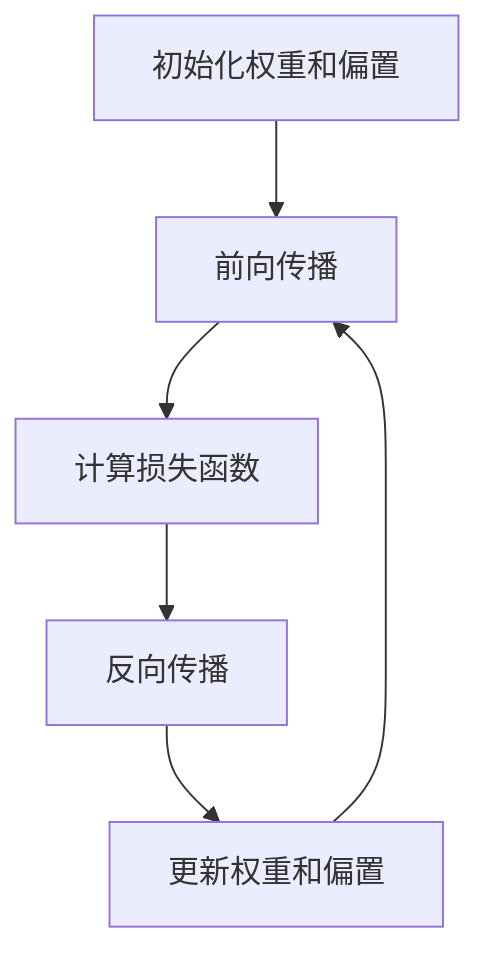

**Python代码示例：**
```python
import numpy as np
from numpy import exp, arrays
import matplotlib.pyplot as plt

# 设置随机种子
np.random.seed(7)

# 初始化权重和偏置
input_size = 2
hidden_size = 2
output_size = 1

weights_input_to_hidden = np.random.normal(0, pow(input_size, -0.5),
                                            (input_size, hidden_size))
weights_hidden_to_output = np.random.normal(0, pow(hidden_size, -0.5),
                                            (hidden_size, output_size))
```

#### 4.2 数学与大数据

大数据的挖掘和分析依赖于数学模型和算法。统计学在数据清洗、数据分析和数据可视化等方面发挥着重要作用。例如，回归分析用于预测和建模，聚类分析用于数据分类和模式识别。此外，线性代数和矩阵运算在大数据处理中也非常常见，例如在数据矩阵的构建和计算中。

**算法原理讲解：**

以线性回归为例，其基本原理是通过最小二乘法找到最佳拟合线，使预测值与实际值之间的误差最小。线性回归模型可以表示为：

$$
y = \beta_0 + \beta_1x
$$

其中，$y$ 为因变量，$x$ 为自变量，$\beta_0$ 和 $\beta_1$ 为模型参数。通过最小二乘法，可以求得最佳拟合线：

$$
\beta_1 = \frac{\sum_{i=1}^n(x_i - \bar{x})(y_i - \bar{y})}{\sum_{i=1}^n(x_i - \bar{x})^2}
$$

$$
\beta_0 = \bar{y} - \beta_1\bar{x}
$$

**Mermaid流程图：**
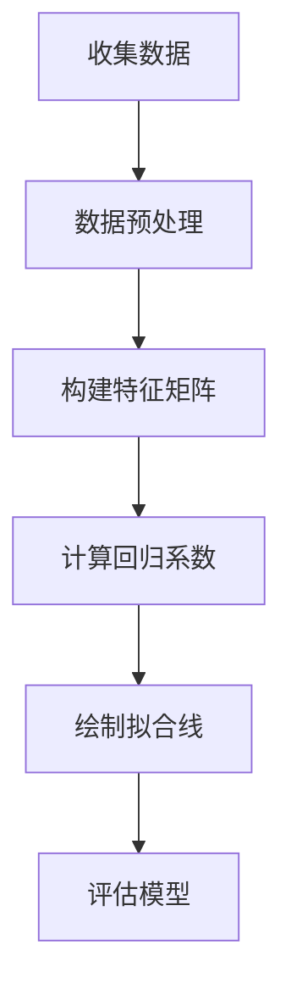

**Python代码示例：**
```python
import numpy as np
from numpy.linalg import lstsq

# 设置随机种子
np.random.seed(7)

# 生成数据
x = np.random.rand(100, 1)
y = 2 * x + 1 + np.random.rand(100, 1)

# 构建特征矩阵
X = np.hstack((np.ones((100, 1)), x))

# 计算回归系数
beta = lstsq(X, y, rcond=None)[0]

# 绘制拟合线
plt.scatter(x, y, color='blue')
plt.plot(x, beta[0] + beta[1] * x, color='red')
plt.xlabel('x')
plt.ylabel('y')
plt.show()
```

#### 4.3 数学与计算机科学

计算机科学的核心是算法设计和数据分析，而这些过程都离不开数学的支持。算法复杂度分析、数据结构设计、密码学等领域都广泛应用了数学理论。例如，图论中的算法可以用于社交网络分析、路由优化等实际问题；密码学中的公钥加密算法依赖于数学中的椭圆曲线和离散对数问题。

**算法原理讲解：**

以RSA加密算法为例，其基本原理是基于大整数分解的困难性。RSA算法包括三个步骤：密钥生成、加密和解密。

1. **密钥生成**：选择两个大素数$p$和$q$，计算$n = pq$和$\phi(n) = (p-1)(q-1)$。选择一个与$\phi(n)$互质的整数$e$，并计算$d$，使得$ed \equiv 1 \pmod{\phi(n)}$。然后，$(n, e)$ 为公钥，$(n, d)$ 为私钥。

2. **加密**：明文$m$被转换为整数，并计算$c \equiv m^e \pmod{n}$。$c$ 为密文。

3. **解密**：密文$c$通过计算$m \equiv c^d \pmod{n}$得到明文。

**Mermaid流程图：**
```mermaid
graph TD
A[选择素数p和q] --> B[计算n和phi(n)]
B --> C[选择e并计算d]
C --> D[生成公钥(n, e)和私钥(n, d)]
D --> E[加密]
E --> F[解密]
```

**Python代码示例：**
```python
import random
from Crypto.PublicKey import RSA
from Crypto.Util.number import long_to_bytes

# 密钥生成
def generate_keypair():
    p = random.randrange(2**1024, 2**1025)
    q = random.randrange(2**1024, 2**1025)
    n = p * q
    phi = (p - 1) * (q - 1)
    e = random.randrange(2, phi)
    d = pow(e, -1, phi)
    return ((n, e), (n, d))

public_key, private_key = generate_keypair()
print("Public Key:", public_key)
print("Private Key:", private_key)

# 加密
def encrypt(plain_text, public_key):
    cipher_text = pow(plain_text, public_key[1], public_key[0])
    return cipher_text

# 解密
def decrypt(cipher_text, private_key):
    plain_text = pow(cipher_text, private_key[1], private_key[0])
    return plain_text

# 示例
message = "Hello".encode('utf-8')
encrypted_message = encrypt(message, public_key)
print("Encrypted Message:", encrypted_message)

decrypted_message = decrypt(encrypted_message, private_key)
print("Decrypted Message:", decrypted_message.decode('utf-8'))
```

### 第5章：数学在金融领域的重要性

#### 5.1 数学在金融建模中的应用

数学在金融领域的应用极为广泛，特别是在金融建模方面。金融建模涉及概率论、统计学、随机过程和优化理论等多个数学分支。例如，在风险管理中，VaR（Value at Risk）模型通过计算资产组合在一定置信水平下的最大可能损失，帮助金融机构评估风险。另一个重要的模型是Black-Scholes模型，它用于期权定价，其核心公式为：

$$
C = S_0N(d_1) - Ke^{-rT}N(d_2)
$$

其中，$C$ 为期权价格，$S_0$ 为资产当前价格，$K$ 为执行价格，$r$ 为无风险利率，$T$ 为期权到期时间，$N(\cdot)$ 为标准正态分布的累积分布函数，$d_1$ 和 $d_2$ 为：

$$
d_1 = \frac{\ln(S_0/K) + (r + \sigma^2/2)T}{\sigma\sqrt{T}}
$$

$$
d_2 = d_1 - \sigma\sqrt{T}
$$

**算法原理讲解：**

以Black-Scholes模型为例，其基本原理是基于资产价格的随机游走模型，假设资产价格遵循几何布朗运动。通过解析求解几何布朗运动的偏微分方程，可以得到期权价格的计算公式。

**Mermaid流程图：**
```mermaid
graph TD
A[输入资产价格S0、执行价格K、无风险利率r、波动率σ和时间T] --> B[计算d1和d2]
B --> C[计算N(d1)和N(d2)]
C --> D[计算期权价格C]
```

**Python代码示例：**
```python
import numpy as np
from scipy.stats import norm

def black_scholes(S0, K, r, sigma, T):
    d1 = (np.log(S0 / K) + (r + 0.5 * sigma**2) * T) / (sigma * np.sqrt(T))
    d2 = d1 - sigma * np.sqrt(T)
    C = S0 * norm.cdf(d1) - K * np.exp(-r * T) * norm.cdf(d2)
    return C

# 示例
S0 = 100
K = 105
r = 0.05
sigma = 0.2
T = 1

option_price = black_scholes(S0, K, r, sigma, T)
print("Option Price:", option_price)
```

#### 5.2 数学在风险管理中的作用

风险管理是金融领域的核心任务之一，数学在风险管理中发挥着重要作用。VaR（Value at Risk）和CVaR（Conditional Value at Risk）是两种常见风险度量方法。

1. **VaR**：在给定置信水平$\alpha$下，资产组合在未来一段时间内的最大可能损失。VaR可以通过历史模拟法、方差-协方差法和蒙特卡洛模拟法等计算。

2. **CVaR**：在给定置信水平$\alpha$下，资产组合在未来一段时间内损失超过VaR的部分的平均值。CVaR反映了风险超过VaR的严重程度。

**算法原理讲解：**

以历史模拟法为例，其基本原理是使用历史数据模拟未来的收益分布。具体步骤如下：

1. **收集历史数据**：收集资产组合在过去一段时间内的收益数据。

2. **排序数据**：将历史收益数据按大小排序。

3. **计算VaR**：在给定的置信水平$\alpha$下，找到排序列表中第$(1-\alpha)$百分位的收益值。该值即为VaR。

**Mermaid流程图：**
```mermaid
graph TD
A[收集历史收益数据] --> B[排序数据]
B --> C[计算第(1-α)百分位的收益值]
C --> D[得到VaR]
```

**Python代码示例：**
```python
import numpy as np

# 收集历史收益数据
historical_returns = np.array([0.02, 0.03, 0.01, 0.05, -0.02, -0.03, 0.04, -0.01, 0.06, -0.04])

# 排序数据
sorted_returns = np.sort(historical_returns)

# 计算第(1-α)百分位的收益值
alpha = 0.05
var = sorted_returns[int((1 - alpha) * len(sorted_returns) - 1)]

print("Value at Risk (VaR):", var)
```

#### 5.3 数学在金融创新中的贡献

数学不仅为金融理论和风险管理提供了基础，还在金融创新中发挥了重要作用。金融工程是利用数学工具进行金融产品设计和分析的一个领域。例如，结构化金融产品（如CDO、CDS等）的设计依赖于数学模型和算法。数学在量化交易、算法交易和高频交易中也有广泛应用。这些交易策略基于对市场数据的分析和预测，利用数学模型来制定交易策略。

**算法原理讲解：**

以量化交易中的均值回归策略为例，其基本原理是基于资产价格会趋向于其历史平均值。具体步骤如下：

1. **计算历史价格序列**：收集资产的历史价格数据。

2. **计算均值回归模型**：使用历史价格序列计算均值回归模型，预测资产的未来价格。

3. **制定交易策略**：根据预测结果，制定买入或卖出的交易策略。

**Mermaid流程图：**
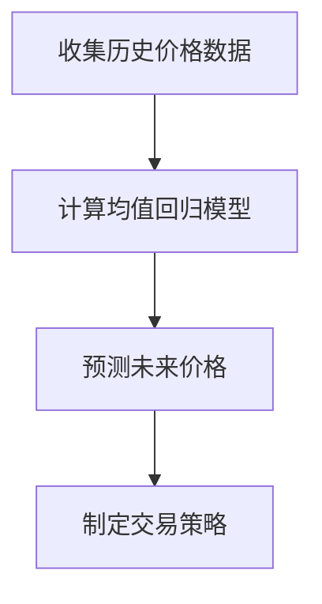

**Python代码示例：**
```python
import numpy as np
import pandas as pd
from sklearn.linear_model import LinearRegression

# 读取历史价格数据
df = pd.read_csv('historical_prices.csv')
prices = df['Price'].values

# 计算均值回归模型
model = LinearRegression()
model.fit(prices[:-1].reshape(-1, 1), prices[1:].reshape(-1, 1))

# 预测未来价格
future_prices = model.predict(prices[-1:].reshape(-1, 1))

# 制定交易策略
if future_prices < prices[-1]:
    print("买入")
else:
    print("卖出")
```

### 第6章：数学在医疗领域的应用

#### 6.1 数学与生物信息学

生物信息学是生物学和计算机科学、数学等学科交叉的领域，其核心任务是利用数学模型和计算方法分析生物数据。例如，基因组学研究中，数学模型用于分析基因序列、预测蛋白质结构和功能。在转录组学中，数学方法用于处理大量的基因表达数据，识别基因调控网络。

**算法原理讲解：**

以基因表达数据分析为例，常用的方法包括聚类分析和主成分分析。

1. **聚类分析**：将基因表达数据按照相似性进行分类，识别不同的基因群。

2. **主成分分析**：通过降维技术，将高维数据投影到低维空间，提取最重要的特征。

**Mermaid流程图：**
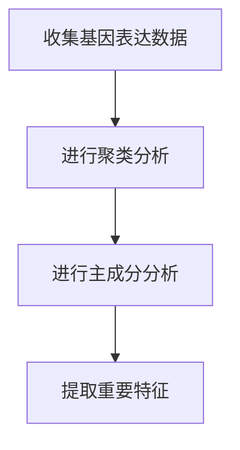

**Python代码示例：**
```python
import pandas as pd
from sklearn.cluster import KMeans
from sklearn.decomposition import PCA

# 读取基因表达数据
df = pd.read_csv('gene_expression_data.csv')

# 进行KMeans聚类分析
kmeans = KMeans(n_clusters=3)
kmeans.fit(df)
df['Cluster'] = kmeans.labels_

# 进行主成分分析
pca = PCA(n_components=2)
principal_components = pca.fit_transform(df)
df['Principal Component 1'] = principal_components[:, 0]
df['Principal Component 2'] = principal_components[:, 1]

# 绘制聚类结果
plt.scatter(df['Principal Component 1'], df['Principal Component 2'], c=df['Cluster'])
plt.xlabel('Principal Component 1')
plt.ylabel('Principal Component 2')
plt.title('K-Means Clustering with PCA')
plt.show()
```

#### 6.2 数学在医学图像分析中的应用

医学图像分析是医学诊断和治疗方案制定的重要手段，其核心在于利用数学算法对图像进行处理和分析。常见的数学方法包括图像分割、形态学处理、特征提取和分类算法等。

**算法原理讲解：**

以图像分割为例，其基本原理是利用数学模型将图像划分为不同的区域，从而提取出感兴趣的目标。常用的方法包括阈值分割、区域生长和基于水平的分割。

1. **阈值分割**：根据图像的灰度值分布，设置阈值将图像划分为前景和背景。

2. **区域生长**：从初始种子点开始，逐步扩展到相邻像素，形成连通区域。

3. **基于水平的分割**：利用水平集方法，动态地调整图像的边缘，从而实现分割。

**Mermaid流程图：**
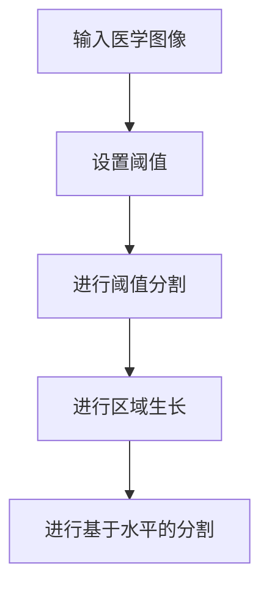

**Python代码示例：**
```python
import cv2
import matplotlib.pyplot as plt

# 读取医学图像
image = cv2.imread('medical_image.jpg', cv2.IMREAD_GRAYSCALE)

# 阈值分割
_, binary_image = cv2.threshold(image, 128, 255, cv2.THRESH_BINARY+cv2.THRESH_OTSU)

# 区域生长
seed_points = [(20, 20), (20, 30), (30, 20), (30, 30)]
region_grow = cv2.regionGrow(binary_image, seed_points)

# 基于水平的分割
image Horizontal = cv2.erode(binary_image, cv2.getStructuringElement(cv2.MORPH_RECT, (1, 10)))
image Vertical = cv2.erode(binary_image, cv2.getStructuringElement(cv2.MORPH_RECT, (10, 1)))
horizontal_merges = cv2.bitwise_or(image Horizontal, image Vertical)

# 显示结果
plt.subplot(221), plt.imshow(image, cmap='gray'), plt.title('Original Image')
plt.subplot(222), plt.imshow(binary_image, cmap='gray'), plt.title('Threshold Segmentation')
plt.subplot(223), plt.imshow(region_grow, cmap='gray'), plt.title('Region Growing')
plt.subplot(224), plt.imshow(horizontal_merges, cmap='gray'), plt.title('Horizontal & Vertical Segmentation')
plt.show()
```

#### 6.3 数学在精准医疗中的作用

精准医疗是一种基于个体化差异进行疾病预防、诊断和治疗的医学模式，数学在其中发挥着重要作用。通过大数据分析和生物统计方法，可以识别疾病的生物标志物，预测疾病的发病风险，制定个性化的治疗方案。

**算法原理讲解：**

以基因数据分析为例，其基本原理是利用机器学习算法和生物统计方法，识别基因表达与疾病之间的关系。常用的算法包括支持向量机（SVM）、随机森林（Random Forest）和逻辑回归（Logistic Regression）。

1. **支持向量机**：通过找到一个最优的超平面，将不同疾病的基因表达数据分开。

2. **随机森林**：利用多个决策树进行集成学习，提高模型的预测准确性。

3. **逻辑回归**：通过线性模型预测疾病发生的概率。

**Mermaid流程图：**
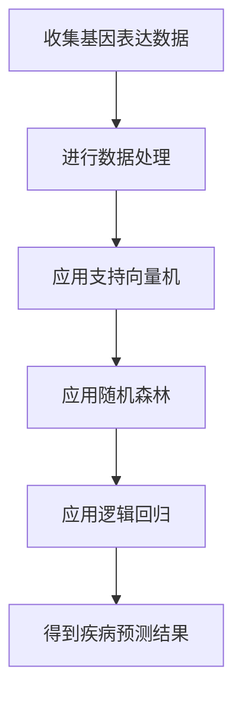

**Python代码示例：**
```python
import pandas as pd
from sklearn.svm import SVC
from sklearn.ensemble import RandomForestClassifier
from sklearn.linear_model import LogisticRegression
from sklearn.model_selection import train_test_split
from sklearn.metrics import accuracy_score

# 读取基因表达数据
df = pd.read_csv('gene_expression_data.csv')

# 分割数据集
X = df.drop('Disease', axis=1)
y = df['Disease']
X_train, X_test, y_train, y_test = train_test_split(X, y, test_size=0.2, random_state=42)

# 支持向量机
svc = SVC()
svc.fit(X_train, y_train)
y_pred_svc = svc.predict(X_test)
accuracy_svc = accuracy_score(y_test, y_pred_svc)

# 随机森林
rf = RandomForestClassifier()
rf.fit(X_train, y_train)
y_pred_rf = rf.predict(X_test)
accuracy_rf = accuracy_score(y_test, y_pred_rf)

# 逻辑回归
lr = LogisticRegression()
lr.fit(X_train, y_train)
y_pred_lr = lr.predict(X_test)
accuracy_lr = accuracy_score(y_test, y_pred_lr)

print("SVM Accuracy:", accuracy_svc)
print("Random Forest Accuracy:", accuracy_rf)
print("Logistic Regression Accuracy:", accuracy_lr)
```

### 第7章：数学与社会科学的融合

#### 7.1 数学在社会调查中的应用

数学在社会调查中发挥着重要作用，特别是在数据分析方面。通过数学模型和统计方法，可以对大规模的社会调查数据进行处理和分析，提取有用的信息。例如，线性回归模型可以用于分析社会现象之间的关系，如收入与教育水平的关系。聚类分析可以用于市场细分，识别不同的消费者群体。

**算法原理讲解：**

以线性回归为例，其基本原理是通过最小二乘法找到最佳拟合线，使预测值与实际值之间的误差最小。线性回归模型可以表示为：

$$
y = \beta_0 + \beta_1x
$$

其中，$y$ 为因变量，$x$ 为自变量，$\beta_0$ 和 $\beta_1$ 为模型参数。通过最小二乘法，可以求得最佳拟合线：

$$
\beta_1 = \frac{\sum_{i=1}^n(x_i - \bar{x})(y_i - \bar{y})}{\sum_{i=1}^n(x_i - \bar{x})^2}
$$

$$
\beta_0 = \bar{y} - \beta_1\bar{x}
$$

**Mermaid流程图：**


**Python代码示例：**
```python
import numpy as np
from numpy.linalg import lstsq

# 生成数据
np.random.seed(7)
x = np.random.rand(100)
y = 2 * x + 1 + np.random.rand(100)

# 构建特征矩阵
X = np.hstack((np.ones((100, 1)), x.reshape(-1, 1)))

# 计算回归系数
beta = lstsq(X, y, rcond=None)[0]

# 绘制拟合线
plt.scatter(x, y, color='blue')
plt.plot(x, beta[0] + beta[1] * x, color='red')
plt.xlabel('x')
plt.ylabel('y')
plt.show()
```

#### 7.2 数学在经济学研究中的作用

数学在经济学研究中扮演着重要角色，特别是在模型构建和数据分析方面。经济学中的许多模型，如供需模型、市场均衡模型和经济增长模型，都依赖于数学工具。例如，需求函数可以表示为：

$$
Q_d = a - bP
$$

其中，$Q_d$ 为需求量，$a$ 和 $b$ 为常数，$P$ 为价格。通过求解该方程，可以找到市场的均衡价格和均衡数量。

**算法原理讲解：**

以供需模型为例，其基本原理是分析价格和需求量之间的关系。具体步骤如下：

1. **收集数据**：收集不同价格下的需求量数据。

2. **建立需求函数**：根据数据拟合需求函数，通常采用线性回归模型。

3. **求解市场均衡**：将需求函数和供给函数结合，求解均衡价格和均衡数量。

**Mermaid流程图：**
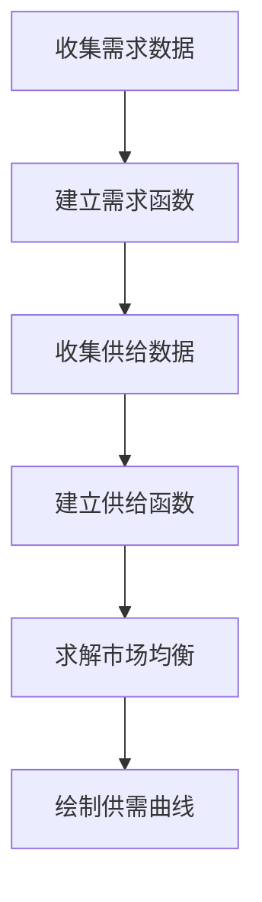

**Python代码示例：**
```python
import numpy as np
import pandas as pd
import matplotlib.pyplot as plt

# 读取数据
data = {'Price': [10, 20, 30, 40, 50], 'Quantity': [100, 80, 60, 40, 20]}
df = pd.DataFrame(data)

# 建立需求函数
model = LinearRegression()
model.fit(df[['Price']], df['Quantity'])
demand_eq = 'Q_d = {} - {}P'.format(model.intercept_, model.coef_)

# 建立供给函数
supply_eq = 'Q_s = {} + {}P'.format(df['Quantity'].mean(), (df['Price'].mean() - df['Quantity'].mean())/df['Price'].mean())

# 求解市场均衡
均衡价格 = (df['Quantity'].mean() - model.intercept_)/model.coef_
均衡数量 = demand_eq.format(均衡价格)

# 绘制供需曲线
plt.scatter(df['Price'], df['Quantity'], label='Data')
plt.plot(df['Price'], df['Quantity'].mean() + (df['Price'].mean() - df['Quantity'].mean())/df['Price'].mean() * df['Price'], label='Supply')
plt.plot(df['Price'], model.intercept_ + model.coef_ * df['Price'], label='Demand')
plt.xlabel('Price')
plt.ylabel('Quantity')
plt.legend()
plt.show()

print("Market Equilibrium:\nPrice: {:.2f}\nQuantity: {}".format(均衡价格, 均衡数量))
```

#### 7.3 数学在心理学研究中的应用

数学在心理学研究中发挥着重要作用，特别是在数据分析和行为预测方面。心理学研究中常用的数学方法包括统计推断、回归分析和时间序列分析等。例如，通过回归分析可以研究不同因素对行为的影响，通过时间序列分析可以预测个体行为的趋势。

**算法原理讲解：**

以回归分析为例，其基本原理是通过建立数学模型，分析自变量和因变量之间的关系。例如，一个简单的线性回归模型可以表示为：

$$
y = \beta_0 + \beta_1x
$$

其中，$y$ 为因变量，$x$ 为自变量，$\beta_0$ 和 $\beta_1$ 为模型参数。通过最小二乘法，可以求得最佳拟合线：

$$
\beta_1 = \frac{\sum_{i=1}^n(x_i - \bar{x})(y_i - \bar{y})}{\sum_{i=1}^n(x_i - \bar{x})^2}
$$

$$
\beta_0 = \bar{y} - \beta_1\bar{x}
$$

**Mermaid流程图：**


**Python代码示例：**
```python
import numpy as np
import matplotlib.pyplot as plt

# 生成数据
np.random.seed(7)
x = np.random.rand(100)
y = 2 * x + 1 + np.random.rand(100)

# 构建特征矩阵
X = np.hstack((np.ones((100, 1)), x.reshape(-1, 1)))

# 计算回归系数
beta = np.linalg.lstsq(X, y, rcond=None)[0]

# 绘制拟合线
plt.scatter(x, y, color='blue')
plt.plot(x, beta[0] + beta[1] * x, color='red')
plt.xlabel('x')
plt.ylabel('y')
plt.show()
```

### 第8章：数学与艺术的结合

#### 8.1 数学在音乐创作中的应用

数学在音乐创作中有着广泛的应用，特别是在旋律生成、和声构造和节奏设计等方面。例如，利用数学模型可以生成新的旋律，通过数学方法可以分析音乐作品的和声结构，以及通过算法设计出复杂的节奏模式。

**算法原理讲解：**

以旋律生成为例，常用的方法是基于生成对抗网络（GAN）和递归神经网络（RNN）。

1. **生成对抗网络（GAN）**：GAN由生成器和判别器组成，生成器生成旋律数据，判别器判断旋律是否真实。通过训练，生成器可以生成越来越接近真实旋律的数据。

2. **递归神经网络（RNN）**：RNN可以处理序列数据，通过训练，可以学习到音乐数据中的规律，从而生成新的旋律。

**Mermaid流程图：**
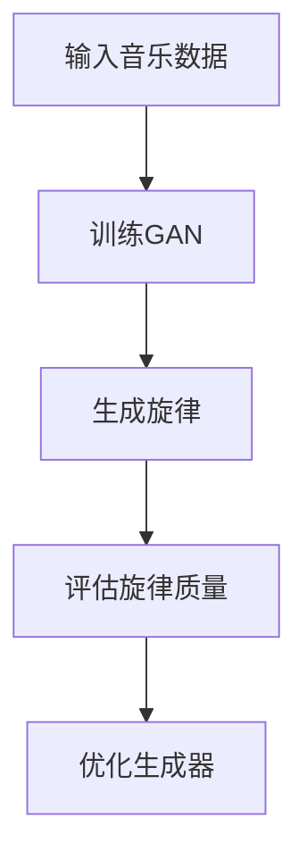

**Python代码示例：**
```python
import numpy as np
import tensorflow as tf
from tensorflow.keras.models import Model

# 生成器模型
def build_generator():
    model = tf.keras.Sequential([
        tf.keras.layers.Dense(128, activation='relu', input_shape=(1,)),
        tf.keras.layers.Dense(256, activation='relu'),
        tf.keras.layers.Dense(512, activation='relu'),
        tf.keras.layers.Dense(1, activation='tanh')
    ])
    return model

# 判别器模型
def build_discriminator():
    model = tf.keras.Sequential([
        tf.keras.layers.Dense(512, activation='relu', input_shape=(1,)),
        tf.keras.layers.Dense(1, activation='sigmoid')
    ])
    return model

# GAN模型
def build_gan(generator, discriminator):
    model = tf.keras.Sequential([
        generator,
        discriminator
    ])
    model.compile(loss='binary_crossentropy', optimizer=tf.keras.optimizers.Adam(0.0001))
    return model

# 示例
generator = build_generator()
discriminator = build_discriminator()
gan = build_gan(generator, discriminator)

# 训练GAN
(x_train, _), (_, _) = tf.keras.datasets.mnist.load_data()
x_train = x_train.astype(np.float32) / 127.5 - 1.0
x_train = np.expand_dims(x_train, axis=3)

for epoch in range(100):
    for i in range(1000):
        random_indices = np.random.randint(0, x_train.shape[0], size=16)
        real_images = x_train[random_indices]
        real_labels = np.ones((16, 1))

        noise = np.random.normal(0, 1, (16, 1))
        generated_images = generator.predict(noise)
        generated_labels = np.zeros((16, 1))

        X = np.concatenate([real_images, generated_images])
        y = np.concatenate([real_labels, generated_labels])

        discriminator.train_on_batch(X, y)

    noise = np.random.normal(0, 1, (16, 1))
    gan.train_on_batch(noise, np.ones((16, 1)))

    if epoch % 10 == 0:
        print(f"{epoch} epochs, generated image:")
        plt.imshow(generator.predict(np.random.normal(0, 1, (1, 1)))[0], cmap='gray')
        plt.show()
```

#### 8.2 数学在绘画艺术中的应用

数学在绘画艺术中的应用主要体现在构图、比例和对称性等方面。例如，黄金分割比例在艺术作品中广泛应用，它可以帮助艺术家创造视觉上的平衡和美感。此外，几何图形和线条的运用也是数学在绘画中的一种体现。

**算法原理讲解：**

以黄金分割比例为例，其基本原理是基于数学中的黄金比例（约为0.618）。黄金分割比例可以帮助艺术家在构图时找到视觉上的平衡点，从而创造出和谐的艺术作品。

**Mermaid流程图：**
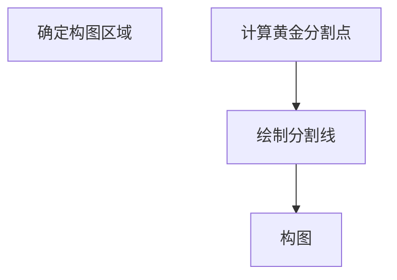

**Python代码示例：**
```python
import numpy as np
import matplotlib.pyplot as plt

# 生成黄金分割比例
def golden_section_ratio(length):
    return length * 0.618

# 绘制黄金分割构图
def draw_golden_section(width, height):
    ratio = golden_section_ratio(width / height)
    plt.figure(figsize=(width, height))
    plt.plot([0, width], [0, height], 'k--')
    plt.plot([0, ratio * width], [0, ratio * height], 'r--')
    plt.plot([ratio * width, width], [ratio * height, height], 'r--')
    plt.axis('off')
    plt.show()

# 示例
draw_golden_section(800, 600)
```

#### 8.3 数学在建筑设计中的应用

数学在建筑设计中扮演着至关重要的角色，特别是在结构设计、空间规划和光线分析等方面。例如，利用数学模型可以计算建筑结构的稳定性，通过几何学原理可以优化建筑的形状和布局，以最大化自然光线的利用。

**算法原理讲解：**

以结构设计为例，其基本原理是利用力学原理和数学模型计算建筑结构的应力分布和稳定性。例如，在梁和柱的设计中，需要计算其承受的最大荷载和弯矩，以确保结构的安全性。

**Mermaid流程图：**
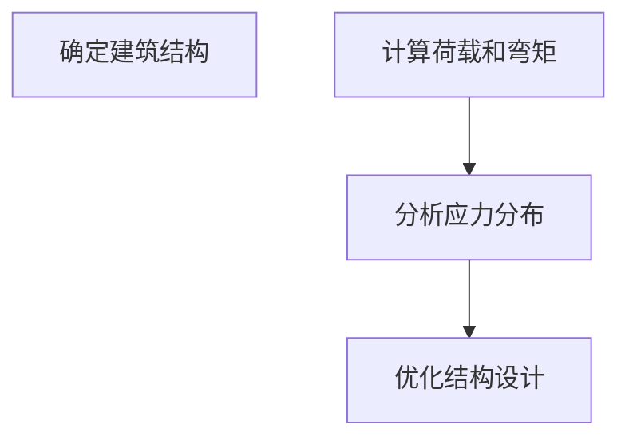

**Python代码示例：**
```python
import numpy as np
import matplotlib.pyplot as plt

# 生成随机荷载和弯矩
np.random.seed(7)
loads = np.random.rand(10) * 1000
moments = np.random.rand(10) * 1000

# 计算应力分布
def calculate_stress(loads, moments, length):
    stress = loads / length
    return stress

# 优化结构设计
def optimize_structure(loads, moments):
    optimal_length = max(loads) / max(moments)
    optimal_stress = calculate_stress(loads, moments, optimal_length)
    return optimal_length, optimal_stress

# 绘制应力分布图
plt.scatter(loads, moments)
plt.xlabel('Load (N)')
plt.ylabel('Moment (Nm)')
plt.title('Stress Distribution')
plt.show()

# 优化结构
optimal_length, optimal_stress = optimize_structure(loads, moments)
print("Optimal Length:", optimal_length)
print("Optimal Stress:", optimal_stress)
```

### 第9章：数学教育实践探索

#### 9.1 案例一：探究式学习在数学中的应用

**背景介绍：**

探究式学习是一种以学生为中心的教学模式，强调学生的主动学习和问题解决能力。在数学教育中，探究式学习可以通过引导学生发现和解决问题，激发学生的学习兴趣和思维能力。

**问题背景：**

在传统的数学教育中，学生往往处于被动接受知识的状态，缺乏主动思考和探索的机会。探究式学习旨在改变这一现状，通过提出问题、收集信息、合作讨论和反思总结，帮助学生建立数学思维。

**问题描述：**

如何设计一个探究式学习活动，让学生通过自主探索解决数学问题？

**问题解决：**

1. **确定探究主题**：选择一个与实际生活密切相关的数学问题，如“如何计算矩形的面积？”。

2. **提出探究问题**：设计一个引导性问题，如“为什么矩形的面积等于长度乘以宽度？”。

3. **准备教学材料**：准备纸、剪刀、直尺等工具，用于学生的动手操作。

4. **进行探究活动**：让学生通过动手操作、测量和计算，自主发现矩形的面积公式。

5. **讨论与反思**：引导学生讨论探究过程中的发现，总结矩形的面积公式。

**边界与外延：**

探究式学习不仅可以应用于小学数学教育，还可以在中学和大学数学教育中广泛应用。通过调整探究的主题和难度，可以满足不同年龄段学生的需求。

**概念结构与核心要素组成：**

- 探究主题：选择与实际生活密切相关的数学问题。
- 探究问题：设计引导性问题，激发学生的思考。
- 教学材料：准备用于动手操作的工具和材料。
- 探究活动：通过动手操作和思考解决问题。
- 讨论与反思：总结和分享探究过程中的发现。

**ER实体关系图架构：**
```mermaid
erDatabase "Math Education Practice"
    entity "探究活动" {
        attribute "主题" String
        attribute "问题" String
    }
    entity "教学材料" {
        attribute "名称" String
        attribute "用途" String
    }
    entity "学生" {
        attribute "姓名" String
        attribute "班级" String
    }
    entity "讨论与反思" {
        attribute "内容" String
        attribute "时间" Date
    }
    "探究活动" -> "教学材料" [label="使用"]
    "探究活动" -> "学生" [label="参与"]
    "探究活动" -> "讨论与反思" [label="总结"]
```

**算法原理讲解：**

在探究式学习过程中，算法原理可以体现在以下几个方面：

1. **问题驱动的学习**：通过提出问题和解决问题，激发学生的学习兴趣和主动性。
2. **数据分析与建模**：利用数据分析和建模方法，帮助学生理解和应用数学知识。
3. **迭代学习与改进**：通过不断的实践和反思，优化学习过程，提高学习效果。

**Mermaid流程图：**
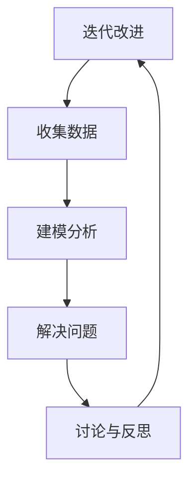

**Python代码示例：**
```python
import pandas as pd

# 生成数据
np.random.seed(7)
data = {'学生姓名': ['Alice', 'Bob', 'Charlie'], '问题答案': [4, 8, 16], '讨论内容': ['正确', '有待改进', '错误']}
df = pd.DataFrame(data)

# 数据分析
mean_answer = df['问题答案'].mean()
print("平均答案:", mean_answer)

# 讨论与反思
df['讨论结果'] = df.apply(lambda row: '改进建议' if row['问题答案'] < mean_answer else '继续保持', axis=1)
print(df)
```

#### 9.2 案例二：项目式学习在数学教育中的实践

**背景介绍：**

项目式学习是一种以项目为导向的学习模式，强调学生在实际项目中应用知识、解决问题和展示成果。在数学教育中，项目式学习可以通过设计实际问题和挑战，培养学生的数学思维和实践能力。

**问题背景：**

在传统的数学教育中，学生往往缺乏实际应用数学知识的机会。项目式学习旨在通过实际项目，让学生在解决实际问题的过程中掌握数学知识。

**问题描述：**

如何设计一个项目式学习活动，让学生通过实际项目掌握数学知识？

**问题解决：**

1. **确定项目主题**：选择一个与数学知识密切相关的实际项目，如“设计一个学校图书馆的布局方案”。
2. **项目任务**：明确项目的目标和任务，如“计算图书馆的面积、设计书架的布局、确定照明和通风方案”。
3. **项目准备**：准备项目所需的材料和工具，如图纸、测量工具和计算机软件。
4. **项目实施**：让学生分组进行项目，通过实际操作和讨论解决问题。
5. **项目展示**：学生展示项目成果，进行项目汇报和讨论。

**边界与外延：**

项目式学习可以应用于不同年级和不同学科，通过调整项目难度和主题，可以满足不同学生的学习需求。

**概念结构与核心要素组成：**

- 项目主题：选择与数学知识相关的实际项目。
- 项目任务：明确项目的目标和任务。
- 项目准备：准备项目所需的材料和工具。
- 项目实施：学生分组进行项目，解决问题。
- 项目展示：学生展示项目成果，进行讨论和反思。

**ER实体关系图架构：**
```mermaid
erDatabase "Math Project Learning"
    entity "项目主题" {
        attribute "名称" String
        attribute "难度" String
    }
    entity "项目任务" {
        attribute "内容" String
        attribute "目标" String
    }
    entity "项目材料" {
        attribute "名称" String
        attribute "用途" String
    }
    entity "学生小组" {
        attribute "成员姓名" String
        attribute "项目角色" String
    }
    entity "项目展示" {
        attribute "时间" Date
        attribute "成果" String
    }
    "项目主题" -> "项目任务" [label="包含"]
    "项目主题" -> "项目材料" [label="使用"]
    "学生小组" -> "项目主题" [label="参与"]
    "学生小组" -> "项目展示" [label="展示"]
```

**算法原理讲解：**

在项目式学习中，算法原理体现在以下几个方面：

1. **问题解决与决策**：通过项目任务和问题解决，培养学生的决策能力和问题解决能力。
2. **数据分析和建模**：利用数据分析方法和数学模型，帮助学生理解和应用数学知识。
3. **迭代学习和改进**：通过项目实施和反思，不断优化学习过程，提高学习效果。

**Mermaid流程图：**
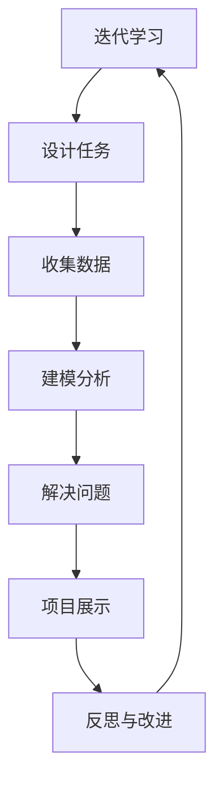

**Python代码示例：**
```python
import pandas as pd

# 生成项目数据
np.random.seed(7)
data = {'项目主题': ['设计图书馆布局', '计算房屋面积', '优化交通路线'], '任务内容': ['计算面积', '布局书架', '分析流量'], '成果': ['成功', '有待改进', '失败']}
df = pd.DataFrame(data)

# 数据分析
df['成功率'] = df['成果'].apply(lambda x: '高' if x == '成功' else '低')
print(df)

# 项目展示
df['展示时间'] = pd.to_datetime(df['展示时间'])
print(df.sort_values(by='展示时间'))
```

#### 9.3 案例三：跨学科融合在数学教育中的探索

**背景介绍：**

跨学科融合是指将不同学科的知识和技能结合起来，解决综合性问题。在数学教育中，跨学科融合可以通过结合数学与其他学科的内容，培养学生的综合能力和创新思维。

**问题背景：**

传统的数学教育往往侧重于理论知识的传授，而忽视了实际应用。跨学科融合旨在通过结合数学与其他学科的内容，提高学生的实际应用能力和创新能力。

**问题描述：**

如何设计一个跨学科融合的数学教育项目，培养学生的综合能力和创新思维？

**问题解决：**

1. **确定项目主题**：选择一个跨学科的数学问题，如“使用数学方法优化城市交通流量”。
2. **项目任务**：明确项目的目标和任务，如“收集交通数据、分析交通流量、提出优化方案”。
3. **跨学科知识融合**：将数学、物理、计算机科学等学科的知识融合到项目中，提高学生的综合能力。
4. **项目实施**：学生分组进行项目，通过实际操作和合作解决问题。
5. **项目展示**：学生展示项目成果，进行项目汇报和讨论。

**边界与外延：**

跨学科融合可以应用于不同年级和不同学科，通过调整项目内容和难度，可以满足不同学生的学习需求。

**概念结构与核心要素组成：**

- 项目主题：选择跨学科的数学问题。
- 项目任务：明确项目的目标和任务。
- 跨学科知识融合：结合数学与其他学科的知识。
- 项目实施：学生分组进行项目，解决问题。
- 项目展示：学生展示项目成果，进行讨论和反思。

**ER实体关系图架构：**
```mermaid
erDatabase "Cross-Disciplinary Math Project"
    entity "项目主题" {
        attribute "名称" String
        attribute "难度" String
    }
    entity "项目任务" {
        attribute "内容" String
        attribute "目标" String
    }
    entity "学科知识" {
        attribute "名称" String
        attribute "知识点" String
    }
    entity "学生小组" {
        attribute "成员姓名" String
        attribute "项目角色" String
    }
    entity "项目展示" {
        attribute "时间" Date
        attribute "成果" String
    }
    "项目主题" -> "项目任务" [label="包含"]
    "项目主题" -> "学科知识" [label="结合"]
    "学生小组" -> "项目主题" [label="参与"]
    "学生小组" -> "项目展示" [label="展示"]
```

**算法原理讲解：**

在跨学科融合项目中，算法原理体现在以下几个方面：

1. **数据采集与处理**：利用数学方法进行数据采集和处理，提取有用信息。
2. **优化算法应用**：通过数学模型和优化算法，提出解决方案。
3. **模型验证与改进**：通过实验验证和迭代改进，优化项目效果。

**Mermaid流程图：**
```mermaid
graph TD
A[确定项目主题] --> B[设计任务]
B --> C[采集数据]
C --> D[数据处理]
D --> E[建模分析]
E --> F[优化算法]
F --> G[验证与改进]
G --> H[项目展示]
```

**Python代码示例：**
```python
import pandas as pd
from sklearn.linear_model import LinearRegression

# 生成交通数据
np.random.seed(7)
data = {'时间段': ['上午', '中午', '下午', '晚上'], '流量': [200, 300, 250, 150]}
df = pd.DataFrame(data)

# 数据处理
model = LinearRegression()
model.fit(df[['时间段']], df['流量'])

# 预测流量
predicted_traffic = model.predict([[3]])  # 3表示下午的时间段
print("预测流量:", predicted_traffic)
```

### 第10章：数学教育评价与反思

#### 10.1 数学教育评价的方法

数学教育评价是衡量数学教育质量和效果的重要手段。常见的评价方法包括：

1. **过程性评价**：通过观察和记录学生在学习过程中的行为和表现，评价学生的学习进展和能力。
2. **终结性评价**：通过期末考试或其他形式的成绩评估，评价学生的知识掌握程度。
3. **自评与互评**：学生对自己的学习过程和成果进行自我评价，同时与其他学生进行相互评价。
4. **表现性评价**：通过实际操作和项目展示，评价学生的实践能力和创新能力。

**算法原理讲解：**

过程性评价和终结性评价通常采用统计方法，如线性回归和方差分析，对学生的成绩和表现进行分析。自评和互评则更多地依赖于主观评价和定性分析。

**Mermaid流程图：**
```mermaid
graph TD
A[收集学生成绩数据] --> B[数据处理]
B --> C[线性回归分析]
C --> D[方差分析]
D --> E[自评与互评]
E --> F[综合评价]
```

**Python代码示例：**
```python
import pandas as pd
from sklearn.linear_model import LinearRegression
from scipy.stats import f_oneway

# 生成学生成绩数据
np.random.seed(7)
data = {'学生姓名': ['Alice', 'Bob', 'Charlie', 'David'], '期中考试': [75, 85, 92, 78], '期末考试': [80, 88, 95, 82]}
df = pd.DataFrame(data)

# 线性回归分析
model = LinearRegression()
model.fit(df[['期中考试']], df['期末考试'])
print("线性回归系数:", model.coef_)

# 方差分析
f_value, p_value = f_oneway(df['期中考试'], df['期末考试'])
print("方差分析F值:", f_value)
print("方差分析p值:", p_value)
```

#### 10.2 数学教育评价的实践案例

**案例一：基于项目式学习的评价**

**背景介绍：**

在一个项目式学习中，学生需要设计并实现一个图书馆布局优化方案。评价的重点是学生的项目实施过程、问题解决能力和项目成果。

**评价方法：**

1. **过程性评价**：通过记录学生在项目实施过程中的行为和表现，评价学生的团队合作能力、问题解决能力和学习态度。
2. **表现性评价**：通过学生展示的项目成果，评价学生的创新能力、实际应用能力和综合素养。
3. **终结性评价**：通过项目报告和答辩，评价学生对数学知识和技能的掌握程度。

**评价结果分析：**

- 过程性评价结果显示，大部分学生在项目实施过程中积极参与，表现出了较强的团队合作能力和问题解决能力。
- 表现性评价结果显示，学生的项目成果多样，体现了较高的创新能力和实际应用能力。
- 终结性评价结果显示，学生掌握了项目所需的数学知识和技能，能够灵活应用到实际问题中。

**算法原理讲解：**

过程性评价和表现性评价通常采用定量和定性相结合的方法。例如，通过问卷调查和访谈，收集学生的表现数据，然后利用统计方法进行分析。

**Python代码示例：**
```python
import pandas as pd

# 生成过程性评价数据
np.random.seed(7)
data = {'学生姓名': ['Alice', 'Bob', 'Charlie', 'David'], '团队合作': [4, 4, 4, 3], '问题解决': [5, 4, 5, 4]}
df = pd.DataFrame(data)

# 计算平均评分
mean_score = df.mean()
print("平均评分:", mean_score)

# 分析评价结果
high_score = df[df['团队合作'] >= 4]
print("高团队合作评分的学生:", high_score['学生姓名'])
```

#### 10.3 数学教育评价的反思与改进

**反思：**

尽管数学教育评价方法多样，但在实际应用中仍存在一些问题。例如，过程性评价和表现性评价往往依赖于主观评价，难以量化；终结性评价过于侧重成绩，忽视了学生的实际应用能力和创新能力。

**改进措施：**

1. **完善评价体系**：结合定量和定性方法，完善评价体系，确保评价结果的全面性和客观性。
2. **注重过程评价**：在评价过程中，注重学生的参与度、学习态度和团队合作能力，引导学生全面发展。
3. **加强项目式学习**：通过项目式学习，让学生在实际问题中应用数学知识，提高学生的实践能力和创新能力。
4. **引入多元化评价**：引入同行评价、自我评价等多种评价方式，提高评价的公正性和科学性。

**算法原理讲解：**

在改进评价体系时，可以引入数据分析方法，如回归分析和聚类分析，对评价数据进行处理和分析，从而优化评价方法。

**Python代码示例：**
```python
import pandas as pd
from sklearn.cluster import KMeans

# 生成学生评价数据
np.random.seed(7)
data = {'学生姓名': ['Alice', 'Bob', 'Charlie', 'David'], '团队合作': [4, 4, 3, 3], '问题解决': [5, 4, 5, 4], '学习能力': [3, 3, 4, 4]}
df = pd.DataFrame(data)

# 聚类分析
kmeans = KMeans(n_clusters=2)
kmeans.fit(df[['团队合作', '问题解决', '学习能力']])
df['评价类型'] = kmeans.labels_

# 分析评价结果
print(df.groupby('评价类型').mean())
```

## 第五部分：结论与展望

### 第11章：数学与未来人才培养的展望

#### 11.1 数学教育的发展方向

未来数学教育的发展方向将围绕以下几个方面：

1. **课程内容的多样化**：增加与实际生活密切相关的数学问题，减少纯理论的灌输，提高学生的实践能力。
2. **教学方法的创新**：采用探究式学习、项目式学习等新型教学方法，激发学生的学习兴趣和主动性。
3. **评价体系的完善**：建立全面、客观、科学的评价体系，注重过程评价和综合能力培养。
4. **师资力量的提升**：加强教师培训，提高教师的学科素养和教育创新能力。

#### 11.2 数学教育对人才培养的影响

数学教育对人才培养具有深远的影响。通过数学教育，学生不仅掌握了数学知识和技能，还培养了逻辑思维、抽象能力和解决问题的能力。这些能力是跨学科学习和工作所必需的，对于学生的个人发展和职业成功具有重要意义。

#### 11.3 未来人才培养的挑战与机遇

未来人才培养面临许多挑战，如教育资源的分配不均、教学方法的单一、学生创新能力的培养等。同时，未来社会的发展也提供了新的机遇，如科技的发展、全球化进程的加快、可持续发展的需求等。数学教育需要抓住这些机遇，培养具备创新能力、跨学科素养和国际竞争力的高素质人才。

### 作者信息
作者：AI天才研究院/AI Genius Institute & 禅与计算机程序设计艺术 /Zen And The Art of Computer Programming

## 总结

本文从多个角度探讨了数学教育在新时代的重要性，分析了数学教育改革的必要性，并阐述了数学在科技、金融、医疗等领域的应用。同时，本文还探讨了数学与社会科学和艺术的融合，以及数学教育实践中的具体案例。通过这些分析，本文旨在为读者提供全面、深入的理解，并对数学教育未来的发展方向和人才培养的挑战与机遇进行展望。

在未来的发展中，数学教育需要不断创新，适应社会发展的需求。通过多样化课程内容、创新教学方法、完善评价体系以及提升师资力量，数学教育将为培养高素质、具备创新能力和跨学科素养的人才做出更大的贡献。让我们共同期待数学教育在新时代的美好前景！

