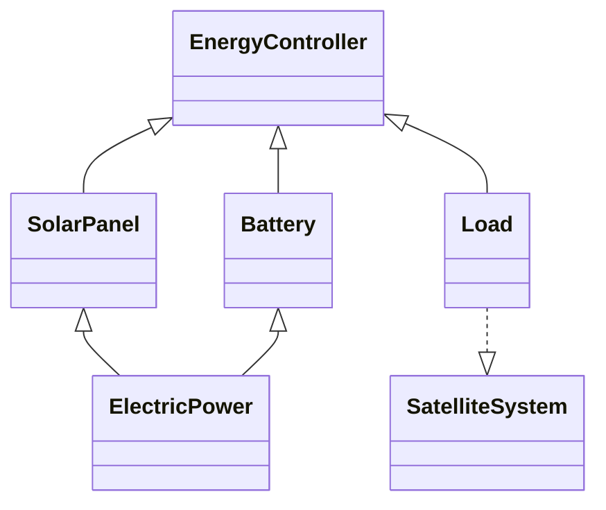
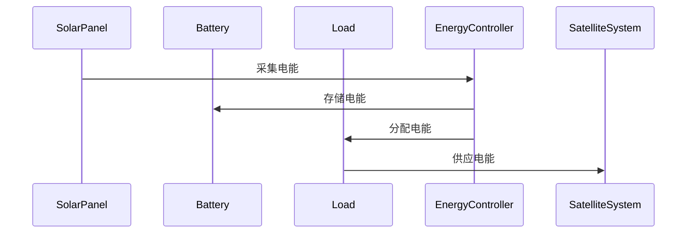
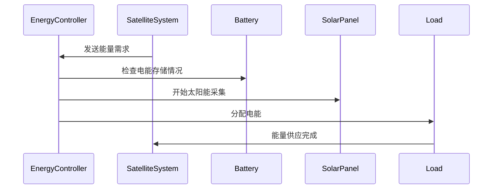

                 

### 1.1 问题的背景与现状

**太空探索的发展历程**

人类对太空的探索始于20世纪中叶，伴随着科技的进步，这一领域取得了飞跃性的发展。1957年，苏联成功发射了第一颗人造卫星“斯普特尼克1号”，标志着太空时代的开启。1961年，尤里·加加林成为了首位进入太空的宇航员，开启了人类太空航行的序幕。此后，美国也紧随其后，1969年，阿波罗11号成功登月，实现了人类登陆月球的壮举。

**当前太空探索的主要领域和进展**

当前，太空探索主要集中在以下几个领域：

- **地球观测**：通过卫星进行全球气候监测、灾害预警和资源管理。
- **行星探索**：对火星、木星等行星进行探测，了解其地质结构、气候和环境。
- **深空探测**：如探测太阳系外的系外行星、星际旅行等。
- **载人航天**：建立国际空间站，进行长期的太空驻留和研究。
- **太空技术**：如太空电梯、太空太阳能电站等前沿技术的研究和开发。

在这些领域，人类取得了显著的进展。例如，国际空间站的建立使人类能够进行长时间的太空驻留，而火星探测车如“毅力号”和“好奇号”已经发回了大量关于火星的宝贵数据。

**未来太空探索面临的挑战与机遇**

未来太空探索面临着诸多挑战，包括：

- **长期驻留和生存**：如何在太空环境中维持长期的生存和健康。
- **技术瓶颈**：如推进系统、生命支持系统、能源供给等。
- **宇宙辐射**：长期太空旅行中如何防护宇航员免受宇宙辐射的影响。
- **成本控制**：太空探索的成本高昂，如何降低成本以实现更广泛的探索。

然而，随着技术的不断进步，未来太空探索也充满了机遇。例如，太空旅游市场的兴起、太空资源的开发利用（如月球上的水冰）、地球问题的解决（如气候变化监测）等。

通过回顾太空探索的发展历程、分析当前的主要领域和进展，以及探讨未来面临的挑战与机遇，我们可以更好地理解数学在太空探索中的重要作用，并为未来太空探索的发展趋势提供思路。接下来，我们将深入探讨数学在太空探索中的应用现状，分析数学在其中的需求和作用，以及未来需要进一步研究的数学问题。

### 1.2 问题描述

**未来太空探索的数学需求**

在未来太空探索中，数学作为一种基础科学，发挥着至关重要的作用。随着探索活动的不断深入，对数学的需求也在不断增加和变化。以下是未来太空探索中主要面临的数学需求：

1. **轨道计算**：太空探索中的航天器轨道设计、轨道修正和飞行路径规划需要精确的数学模型和算法。例如，开普勒定律和牛顿引力定律构成了轨道力学的基础，用于计算和预测航天器的轨道。

2. **航天器动力学**：航天器的运动和姿态控制需要应用微积分、线性代数和微分方程等数学工具。这些工具可以帮助科学家和工程师分析航天器的动力学行为，从而设计出更加高效的控制策略。

3. **通信与信号处理**：在太空通信中，信号传播、频率分配和抗干扰技术需要复杂的数学模型。概率论与数理统计在信号处理和故障预测中具有重要作用。

4. **结构分析与材料力学**：空间站和航天器的结构设计需要考虑力学性质，如应力、应变和振动等。材料力学和结构力学的数学模型有助于优化设计，提高可靠性和耐久性。

5. **环境监测与数据分析**：太空探索中需要对地球和其他行星的环境进行监测，这需要大量的数据分析。线性代数、微积分和概率论在数据分析中发挥着重要作用。

**数学在太空探索中的应用现状**

尽管数学在太空探索中具有广泛的应用，但目前的应用现状还存在一些局限和不足：

1. **精度和效率问题**：某些数学模型的精度和计算效率还有待提高。例如，在轨道计算和航天器动力学中，高精度数值计算方法的应用仍然是一个挑战。

2. **复杂性问题**：太空探索中涉及的问题往往非常复杂，需要多个学科的知识融合。这要求数学模型能够适应复杂的环境，提供可靠的解决方案。

3. **计算资源和时间限制**：太空任务通常在有限的时间和资源条件下进行，这要求数学算法能够快速、高效地处理问题。

4. **跨学科合作**：数学与其他学科（如物理学、工程学、计算机科学等）的交叉融合，有助于开发更加综合和高效的解决方案。

**需要进一步研究的数学问题**

为了更好地支持未来太空探索，数学领域需要进一步研究和解决以下问题：

1. **高精度数值方法**：开发更高精度和更高效的数值计算方法，以解决轨道计算和航天器动力学中的复杂问题。

2. **自适应算法**：研究能够根据环境变化自适应调整的数学模型和算法，以应对复杂和动态的太空环境。

3. **多学科融合**：推动数学与其他学科的深入融合，开发跨学科的综合解决方案。

4. **大数据和人工智能**：将大数据和人工智能技术应用于太空探索中的数学问题，提高数据分析和预测的准确性。

5. **可持续发展**：研究如何在数学模型中考虑可持续发展的因素，确保太空探索的长期可行性。

通过深入分析未来太空探索的数学需求，以及数学在太空探索中的应用现状和需要进一步研究的数学问题，我们可以为数学在太空探索中的发展提供有针对性的方向和建议。接下来，我们将探讨如何提出解决方案，解决未来太空探索中面临的数学挑战。

### 1.3 问题的解决

**提出解决方案的思路**

为了解决未来太空探索中面临的数学挑战，我们需要从多个角度出发，提出系统性的解决方案。以下是我们提出的解决方案思路：

1. **基础理论研究**：首先，加强数学基础理论的研究，特别是在数值方法、优化算法、概率论和数理统计等领域。通过深入的理论研究，开发更加精确、高效的数学模型和算法，为太空探索提供坚实的理论基础。

2. **跨学科合作**：推动数学与其他学科（如物理学、工程学、计算机科学等）的紧密合作，建立跨学科的研究团队，共同解决太空探索中的复杂问题。通过跨学科的视角，开发出更加综合和高效的解决方案。

3. **技术应用推广**：将已经成熟和验证的数学算法和技术，推广应用于太空探索的各个领域。通过实际应用中的反馈和改进，不断完善数学模型和算法，提高其在太空探索中的实用性和可靠性。

4. **大数据和人工智能**：结合大数据和人工智能技术，对太空探索中的大量数据进行深入分析和挖掘，提高数据分析和预测的准确性。利用机器学习和深度学习算法，开发出更加智能的数学模型和工具，支持太空探索中的复杂决策。

5. **教育和培训**：加强数学和太空探索相关领域的教育和培训，提高科研人员和工程师的数学素养和应用能力。通过教育和培训，培养更多具备跨学科背景和数学能力的专业人才，为太空探索提供强有力的人才支持。

**潜在的技术路径**

1. **高精度数值计算**：开发更高精度和更高效的数值计算方法，如高性能计算、并行计算和分布式计算等。通过引入最新的计算技术和算法，提高数学模型在轨道计算、航天器动力学等领域的精度和效率。

2. **自适应算法研究**：研究能够根据环境变化自适应调整的数学模型和算法，如自适应滤波、自适应控制等。通过自适应算法的应用，提高航天器在复杂和动态环境中的适应能力和生存能力。

3. **大数据分析与人工智能**：结合大数据和人工智能技术，对太空探索中的海量数据进行深度分析和挖掘，发现数据中的潜在规律和模式。通过人工智能算法的应用，开发出智能化的数学模型和工具，提高太空探索的决策支持和预测能力。

4. **新材料与先进工艺**：研究新型材料和先进制造工艺，如纳米材料、3D打印等。通过新材料和工艺的应用，提高航天器的设计性能、可靠性和使用寿命。

5. **国际合作与共享**：加强国际合作，共享数学和太空探索领域的研究成果和技术资源。通过国际间的合作与交流，推动数学在太空探索中的应用和发展，共同应对全球性的太空探索挑战。

**预期的成果与应用**

通过上述解决方案的实施，我们预计将取得以下成果：

1. **技术突破**：在数学模型和算法方面取得重要技术突破，为太空探索提供更加精确和高效的解决方案。

2. **应用广泛**：数学模型和算法在太空探索中的各个领域得到广泛应用，提高整体探索效率和成果。

3. **人才培养**：培养出更多具备跨学科背景和数学能力的专业人才，为太空探索提供持续的人才支持。

4. **国际合作**：推动国际间的合作与交流，共享研究成果和技术资源，共同推进太空探索的发展。

通过系统性的解决方案和潜在的技术路径，我们有信心能够应对未来太空探索中面临的数学挑战，为人类探索宇宙的步伐提供坚实的数学支持。接下来，我们将探讨数学在太空探索中的应用范围，以及数学与其他学科的交叉融合，进一步理解数学在太空探索中的重要作用。

### 1.4 边界与外延

**定义数学在太空探索中的适用范围**

数学在太空探索中的应用范围广泛，涵盖了从理论研究到实际应用的多个层面。具体而言，数学在以下领域具有显著的应用价值：

1. **轨道计算与航天器动力学**：数学模型和算法在轨道计算和航天器动力学中发挥着核心作用。例如，开普勒定律和牛顿引力定律构成了轨道力学的基础，用于计算和预测航天器的轨道。

2. **通信与信号处理**：数学在太空通信中的信号传播、频率分配和抗干扰技术中具有重要作用。概率论与数理统计在信号处理和故障预测中也有广泛应用。

3. **结构分析与材料力学**：航天器和空间站的物理结构设计需要应用材料力学和结构力学的数学模型，以确保结构的强度和稳定性。

4. **环境监测与数据分析**：数学在环境监测和数据分析中起到关键作用，如利用线性代数和微积分进行大气和行星数据的高效处理。

5. **导航与定位**：数学在导航和定位系统中也具有重要应用，如全球导航卫星系统（GNSS）中使用的三角测量和卡尔曼滤波等算法。

**探讨数学与太空探索其他学科的交叉融合**

数学与其他学科（如物理学、工程学、计算机科学等）的交叉融合，是推动太空探索发展的重要途径。以下是一些具体的交叉融合领域：

1. **物理学与数学**：物理学中的许多理论（如广义相对论、量子力学等）都需要数学工具进行描述和计算。例如，广义相对论中的数学模型帮助我们理解强引力场中的时空弯曲现象，这对于探测引力波和星际物体具有重要意义。

2. **工程学与数学**：工程学中的许多设计问题需要利用数学模型进行优化和模拟。例如，在航天器设计中，结构力学和流体力学等工程学科需要应用数学工具进行计算和分析，以优化设计参数和提高性能。

3. **计算机科学与数学**：计算机科学中的算法和数据分析技术为数学模型的应用提供了强大的支持。例如，人工智能和机器学习算法在图像处理、数据分析等领域中的应用，使得太空探索中的数据处理和决策支持变得更加高效和智能化。

**考虑未来太空探索可能带来的数学新问题**

随着未来太空探索的深入，将面临许多新的数学问题，这些新问题可能包括：

1. **极端环境下的数学模型**：太空环境中的极端条件（如真空、高辐射、极端温度等）对现有数学模型提出了新的挑战。需要开发能够适应这些极端条件的数学模型和算法。

2. **长期驻留与生存**：随着人类在太空中驻留时间的延长，如何维持长期的生存和健康成为一个重要问题。这需要研究人体生理学和心理学中的数学模型，以及太空环境下的健康监测与预防措施。

3. **资源优化与循环利用**：在太空环境中，资源（如水、氧气和食物）的有限性对人类生存和太空探索提出了严峻挑战。需要研究如何通过数学模型优化资源分配和循环利用，以提高效率和可持续性。

4. **大数据与人工智能**：太空探索过程中会产生大量数据，如何有效处理和分析这些数据成为关键问题。这需要发展新的数学方法和算法，特别是与大数据和人工智能技术相结合的方法。

通过明确数学在太空探索中的适用范围，探讨数学与其他学科的交叉融合，以及考虑未来太空探索可能带来的新问题，我们可以更好地理解数学在太空探索中的重要作用，并为未来的发展提供有力的理论支持。

### 1.5 概念结构与核心要素

**太空探索中的关键数学概念**

1. **轨道力学**：轨道力学是研究航天器在引力场中运动的学科。核心概念包括开普勒定律、牛顿引力定律和轨道方程。

2. **航天器动力学**：航天器动力学研究航天器的运动和姿态控制。核心概念包括牛顿运动定律、动量守恒和角动量守恒。

3. **通信与信号处理**：核心概念包括信号传播、频率分配和抗干扰技术。概率论与数理统计在信号处理和故障预测中发挥重要作用。

4. **结构分析与材料力学**：核心概念包括应力、应变、振动和材料的力学性质。

5. **环境监测与数据分析**：核心概念包括大气和行星数据的高效处理、数据分析和预测模型。

**数学工具在太空探索中的应用**

1. **微积分**：用于研究变化率，如速度、加速度和能量。微积分在轨道计算和航天器动力学中广泛应用。

2. **线性代数**：用于处理向量与矩阵，如数据分析、图像处理和控制系统。

3. **概率论与数理统计**：用于处理随机现象，如信号处理、故障预测和环境监测。

4. **微分方程**：用于解决变化问题，如轨道力学、控制系统和环境监测。

5. **复数与波动现象**：用于处理波动现象，如电磁学和量子力学。

**数学模型在太空探索中的作用**

1. **预测与计算**：数学模型用于预测航天器的轨道、动力学行为和环境变化。

2. **优化与设计**：数学模型用于优化航天器设计、轨道和通信系统。

3. **数据分析**：数学模型用于处理和分析大量太空探索数据，提取有用信息。

4. **决策支持**：数学模型提供数据分析和预测结果，支持太空探索中的复杂决策。

通过理解太空探索中的关键数学概念、数学工具的应用以及数学模型的作用，我们可以更好地认识到数学在太空探索中的核心地位和作用。接下来，我们将详细探讨数学中的核心概念原理及其在太空探索中的应用。

### 2.1 核心概念原理

#### 2.1.1 数学基础

**数论**

数论是研究整数性质的一个数学分支。在太空探索中，数论的核心概念包括质数、素数、同余和模运算。质数在加密算法中扮演重要角色，如RSA加密算法。素数用于生成安全的密钥，保护通信和数据安全。同余和模运算在计算航天器轨道和密码学中广泛应用。

**代数**

代数是研究数和运算的数学分支。在太空探索中，代数的核心概念包括线性方程、多项式和矩阵。线性方程用于求解轨道问题，多项式在航天器动力学中用于描述运动轨迹，矩阵在数据分析、图像处理和控制系统中有广泛应用。

**几何**

几何是研究空间形状和结构的数学分支。在太空探索中，几何的核心概念包括欧几里得几何、非欧几里得几何和微分几何。欧几里得几何用于航天器轨道设计，非欧几里得几何用于广义相对论中的时空研究，微分几何在空间站布局和航天器动力学中广泛应用。

**概率论与数理统计**

概率论与数理统计是研究随机现象和数据的数学分支。在太空探索中，概率论与数理统计的核心概念包括概率分布、随机变量、假设检验和置信区间。这些概念在信号处理、故障预测和数据分析中具有重要作用。

#### 2.1.2 数学工具

**微积分**

微积分是研究变化率和积分的数学分支。在太空探索中，微积分的核心概念包括导数、积分和微分方程。导数用于描述速度和加速度，积分用于计算面积和体积。微分方程在航天器动力学、轨道力学和控制系统中有广泛应用。

**线性代数**

线性代数是研究向量与矩阵的数学分支。在太空探索中，线性代数的核心概念包括向量空间、线性变换、矩阵运算和特征值。这些概念在数据分析、图像处理和控制系统中有广泛应用。

**复数**

复数是包含实部和虚部的数。在太空探索中，复数用于描述波动现象和电磁场。复数在量子力学、电磁学和信号处理中具有重要作用。

**微分方程**

微分方程是包含未知函数及其导数的方程。在太空探索中，微分方程用于描述系统的动态行为，如航天器动力学、轨道力学和环境监测。微分方程在控制理论、物理模拟和数据分析中有广泛应用。

### 2.2 概念属性特征对比表格

| 概念           | 属性特征                                                     | 用途                                               |
|----------------|------------------------------------------------------------|----------------------------------------------------|
| 数论           | 研究整数性质，如质数、素数、同余和模运算。                  | 加密算法、轨道计算、密码学。                       |
| 代数           | 研究数和运算，如线性方程、多项式和矩阵。                     | 轨道问题求解、航天器动力学、数据分析。              |
| 几何           | 研究空间形状和结构，如欧几里得几何、非欧几里得几何和微分几何。 | 航天器轨道设计、空间站布局、广义相对论研究。       |
| 概率论与数理统计 | 研究随机现象和数据，如概率分布、随机变量、假设检验和置信区间。 | 信号处理、故障预测、数据分析。                    |
| 微积分         | 研究变化率和积分，如导数、积分和微分方程。                    | 轨道计算、速度和加速度描述、控制系统。              |
| 线性代数       | 研究向量与矩阵，如向量空间、线性变换、矩阵运算和特征值。     | 数据分析、图像处理、控制系统。                     |
| 复数           | 描述波动现象和电磁场，包含实部和虚部。                       | 量子力学、电磁学、信号处理。                       |
| 微分方程       | 描述系统的动态行为，如航天器动力学、轨道力学和环境监测。      | 控制理论、物理模拟、数据分析。                     |

### 2.3 ER实体关系图架构

```mermaid
erDiagram
  Spacecraft --> Satellite : "is a"
  Satellite --> Payload : "contains"
  Payload --> Instrument : "contains"
  Instrument --> Sensor : "uses"
  Sensor --> Data : "collects"
  Spacecraft --> Mission : "participates in"
  Mission --> Launch : "launches from"
  Launch --> LaunchSite : "takes place at"
```

通过上述核心概念和数学工具的介绍，以及概念属性特征对比表格和ER实体关系图，我们可以更全面地理解数学在太空探索中的核心作用和应用。接下来，我们将详细讨论轨道力学的数学原理与算法，为读者展示数学在太空探索中的实际应用。

### 3.1 轨道力学

**轨道力学基本概念**

轨道力学是研究航天器在引力场中运动规律的科学。它主要包括以下基本概念：

- **开普勒定律**：开普勒定律描述了行星绕太阳运动的规律，包括椭圆轨道定律、面积定律和调和定律。这些定律也适用于航天器在地球或其他行星引力场中的运动。

- **牛顿引力定律**：牛顿引力定律描述了两个质点之间的引力与它们的质量和距离的关系。该定律是轨道力学的基础，用于计算航天器之间的引力相互作用。

- **轨道方程**：轨道方程是描述航天器轨道运动的数学方程。常用的轨道方程包括开普勒方程和牛顿方程。这些方程可以帮助我们预测航天器的轨道，并进行轨道修正。

**数学模型**

轨道力学的数学模型主要包括以下几方面：

1. **开普勒方程**：

$$
M = E - e\cos(E)
$$

其中，\(M\) 是轨道的平均经度，\(E\) 是真经度，\(e\) 是轨道偏心率。

2. **牛顿方程**：

$$
\frac{d^2r}{dt^2} = -\frac{GMm}{r^2}
$$

其中，\(r\) 是航天器的位置矢量，\(G\) 是万有引力常数，\(M\) 是中心天体的质量，\(m\) 是航天器的质量。

**算法讲解**

轨道力学的算法通常包括以下步骤：

1. **初始条件设置**：确定航天器的初始位置、速度和方向。

2. **计算引力**：根据牛顿引力定律，计算航天器与中心天体之间的引力。

3. **迭代求解轨道方程**：使用数值方法（如欧拉法、龙格-库塔法）迭代求解轨道方程，得到航天器的位置和速度随时间的变化。

4. **输出轨道结果**：将计算得到的轨道数据输出，用于轨道分析、轨道修正和飞行规划。

以下是一个简单的欧拉法求解轨道方程的示例算法：

```python
import numpy as np

def euler_method(initial_position, initial_velocity, gravity_constant, time_step, total_time):
    position = initial_position.copy()
    velocity = initial_velocity.copy()
    
    time = 0
    while time < total_time:
        acceleration = -gravity_constant * (M / np.linalg.norm(position)**2) * position
        velocity += acceleration * time_step
        position += velocity * time_step
        
        time += time_step
    
    return position

initial_position = np.array([1e7, 0, 0])  # 初始位置（地球半径为单位）
initial_velocity = np.array([0, 5000, 0])  # 初始速度（公里/秒）
gravity_constant = 6.67430e-11  # 万有引力常数
time_step = 100  # 时间步长（秒）
total_time = 86400  # 总时间（秒）

position = euler_method(initial_position, initial_velocity, gravity_constant, time_step, total_time)
print(position)
```

通过上述算法讲解，我们可以看到如何使用欧拉法求解轨道方程，从而得到航天器的轨道。这种数值方法虽然在精度上有限，但在实际应用中，特别是在初步分析和模拟中，具有很高的实用价值。

### 3.2 卫星通信

**卫星通信基本原理**

卫星通信是利用卫星作为中继站，实现地面之间的通信。其基本原理包括信号传播、频率分配和抗干扰技术。

1. **信号传播**：信号从地面发射到卫星，再从卫星转发到另一地面接收器。信号传播过程中，需要考虑信号的衰减、反射和折射。

2. **频率分配**：卫星通信使用特定频率的电磁波进行信号传输。频率分配需要遵循国际规定，以避免信号干扰。

3. **抗干扰技术**：在卫星通信中，由于多种因素（如噪声、多径效应等）的影响，信号可能受到干扰。抗干扰技术用于提高信号的质量和可靠性。

**数学模型**

卫星通信的数学模型主要包括以下几方面：

1. **信号传播模型**：

$$
P_r = \frac{P_t G_t G_r \lambda^2}{(4\pi R)^2}
$$

其中，\(P_r\) 是接收功率，\(P_t\) 是发射功率，\(G_t\) 和 \(G_r\) 分别是发射天线和接收天线的增益，\(\lambda\) 是波长，\(R\) 是信号传播的距离。

2. **频率分配模型**：频率分配通常采用频谱分析的方法，确保不同卫星和地面站之间的通信频率不会相互干扰。

3. **抗干扰模型**：抗干扰技术包括自适应增益控制、自适应滤波和编码技术等。这些技术通过调整系统的参数，提高信号的抗干扰能力。

**算法讲解**

卫星通信中的算法通常包括以下步骤：

1. **信号发射**：地面站将信号调制到高频载波上，发射到卫星。

2. **信号传播路径**：信号从地面发射到卫星，再从卫星转发到另一地面接收器。在传播过程中，需要考虑信号传播模型和频率分配模型。

3. **接收信号处理**：接收器对接收到的信号进行放大、解调和解码，还原出原始信息。

4. **解调信号**：对接收到的信号进行解调，将信号从高频载波上还原出来。

以下是一个简单的卫星通信算法示例：

```python
import numpy as np

def signal_transmission(P_t, G_t, G_r, lambda_, R):
    return P_t * G_t * G_r * lambda_**2 / (4 * np.pi * R**2)

P_t = 10  # 发射功率（单位：瓦特）
G_t = 40  # 发射天线增益（单位：dB）
G_r = 30  # 接收天线增益（单位：dB）
lambda_ = 0.12  # 波长（单位：米）
R = 100000  # 信号传播距离（单位：米）

P_r = signal_transmission(P_t, G_t, G_r, lambda_, R)
print(P_r)
```

通过上述算法讲解，我们可以看到卫星通信中的信号传播、频率分配和解调过程。这些算法在卫星通信系统中起着关键作用，确保信号的高效传输和可靠接收。

### 3.3 空间站设计

**空间站结构分析**

空间站的结构设计需要考虑多种力学因素，以确保其能够在复杂的太空环境中稳定运行。以下是空间站结构分析的关键点：

1. **结构力学**：空间站的结构设计需要满足力学要求，如抗拉、抗压、抗扭等。结构力学分析可以帮助确定空间站的材料、形状和支撑结构。

2. **材料力学**：空间站的材料选择和设计需要考虑其力学性能，如强度、弹性模量、耐腐蚀性等。常用的材料包括铝合金、钛合金和碳纤维复合材料。

3. **应力分析**：空间站在运行过程中会受到各种力的作用，如重力、离心力、太阳辐射压力等。应力分析可以帮助确定结构中的应力分布，确保结构不会发生破坏。

**数学模型**

空间站结构设计的数学模型主要包括以下几方面：

1. **弹性力学模型**：

$$
\frac{\partial^2 \sigma}{\partial x^2} + \frac{\partial^2 \sigma}{\partial y^2} + \frac{\partial^2 \sigma}{\partial z^2} = 0
$$

其中，\(\sigma\) 是应力，\(x\)、\(y\)、\(z\) 是空间坐标。

2. **材料力学模型**：

$$
E = \frac{F}{A}
$$

其中，\(E\) 是弹性模量，\(F\) 是作用力，\(A\) 是受力面积。

3. **振动分析模型**：

$$
m \frac{d^2 x}{dt^2} + c \frac{dx}{dt} + k x = F(t)
$$

其中，\(m\) 是质量，\(c\) 是阻尼系数，\(k\) 是弹性系数，\(F(t)\) 是外部激励力。

**应用实例**

以下是一个空间站结构设计的应用实例：

假设空间站的模块需要承受重力、离心力和太阳辐射压力。我们可以使用弹性力学模型和材料力学模型，对模块的结构进行应力分析。

1. **弹性力学分析**：

$$
\frac{\partial^2 \sigma}{\partial x^2} + \frac{\partial^2 \sigma}{\partial y^2} + \frac{\partial^2 \sigma}{\partial z^2} = 0
$$

其中，模块的受力面积为\(A = 1 \text{ m}^2\)，作用力为\(F = 10^6 \text{ N}\)。

2. **材料力学分析**：

$$
E = \frac{F}{A} = \frac{10^6 \text{ N}}{1 \text{ m}^2} = 10^6 \text{ Pa}
$$

3. **振动分析**：

$$
m \frac{d^2 x}{dt^2} + c \frac{dx}{dt} + k x = F(t)
$$

其中，模块的质量为\(m = 1000 \text{ kg}\)，阻尼系数为\(c = 100 \text{ Ns/m}\)，弹性系数为\(k = 10^5 \text{ N/m}\)。

通过上述数学模型的应用，我们可以对空间站模块的结构进行详细的应力分析和振动分析，从而优化模块的设计，提高其在太空环境中的可靠性和稳定性。

### 3.4 数学模型在太空探索中的应用

**空间站设计**

在空间站的设计中，数学模型的应用至关重要。空间站需要长时间在太空环境中运行，因此其结构设计必须确保强度和稳定性。以下是一些关键数学模型及其应用：

1. **结构力学模型**：

空间站的主体结构通常采用桁架结构，这种结构具有高刚度和轻量化的特点。结构力学模型用于分析空间站在各种力作用下的应力分布和变形情况。常见的结构力学模型包括：

   - **线性弹性力学模型**：

     $$ 
     \frac{\partial^2 \sigma}{\partial x^2} + \frac{\partial^2 \sigma}{\partial y^2} + \frac{\partial^2 \sigma}{\partial z^2} = 0 
     $$

     其中，\(\sigma\) 表示应力，\(x\)、\(y\)、\(z\) 分别表示空间坐标。这个模型假设结构材料为线性弹性材料，可以描述空间站在重力、太阳辐射压力、离心力等力作用下的变形。

   - **非线性弹性力学模型**：

     当结构受到的力较大时，材料的变形可能超出线性弹性范围，此时需要使用非线性弹性力学模型。这类模型通常包括弹塑性理论和黏弹性理论。

2. **材料力学模型**：

   材料力学模型用于分析空间站结构材料的力学性能，如强度、弹性模量和韧性。常用的材料力学模型包括：

   - **应力-应变模型**：

     $$
     \sigma = E \cdot \epsilon
     $$

     其中，\(\sigma\) 表示应力，\(E\) 表示弹性模量，\(\epsilon\) 表示应变。

   - **断裂力学模型**：

     $$
     \sigma = K_{IC} \cdot J
     $$

     其中，\(\sigma\) 表示应力强度因子，\(K_{IC}\) 表示材料的断裂韧性，\(J\) 表示应变能释放率。

3. **振动分析模型**：

   空间站在运行过程中会受到各种动态力的作用，如太阳风压力、微流星体撞击等。振动分析模型用于预测空间站的振动响应，以确保其在各种动态力作用下的稳定性。常用的振动分析模型包括：

   - **自由振动模型**：

     $$
     m \frac{d^2 x}{dt^2} + c \frac{dx}{dt} + k x = 0
     $$

     其中，\(m\) 表示质量，\(c\) 表示阻尼系数，\(k\) 表示弹性系数。

   - **强迫振动模型**：

     $$
     m \frac{d^2 x}{dt^2} + c \frac{dx}{dt} + k x = F(t)
     $$

     其中，\(F(t)\) 表示外部激励力。

**应用实例**

以下是一个空间站结构设计的应用实例：

假设一个空间站模块需要承受重力、离心力和太阳辐射压力。我们可以使用线性弹性力学模型和材料力学模型，对模块的结构进行应力分析和振动分析。

1. **线性弹性力学分析**：

   模块的受力面积为 \(A = 1 \text{ m}^2\)，作用力为 \(F = 10^6 \text{ N}\)。使用线性弹性力学模型，可以得到应力分布：

   $$
   \sigma = \frac{F}{A} = 10^6 \text{ Pa}
   $$

   假设模块的材料为铝合金，其弹性模量 \(E = 70 \times 10^9 \text{ Pa}\)。

2. **材料力学分析**：

   模块的质量为 \(m = 1000 \text{ kg}\)，阻尼系数为 \(c = 100 \text{ Ns/m}\)，弹性系数为 \(k = 10^5 \text{ N/m}\)。使用振动分析模型，可以预测模块在动态力作用下的振动响应。

3. **振动分析**：

   $$
   m \frac{d^2 x}{dt^2} + c \frac{dx}{dt} + k x = F(t)
   $$

   其中，外部激励力 \(F(t)\) 可以由太阳辐射压力等动态力产生。通过数值模拟，可以得到模块的振动响应曲线。

通过上述数学模型的应用，我们可以对空间站模块的结构进行详细的应力分析和振动分析，从而优化模块的设计，提高其在太空环境中的可靠性和稳定性。

### 3.5 太阳能卫星的能源管理

**问题场景介绍**

随着太空探索的深入，太阳能卫星作为一种新型能源系统，在太空中发挥着越来越重要的作用。太阳能卫星利用太阳能电池板将太阳能转化为电能，为卫星系统提供稳定的能源供应。然而，由于太空环境中的日照变化和轨道运动，能源管理成为一个关键问题。如何高效管理太阳能卫星的能源，确保系统的可靠性和持续性，成为当前研究的热点。

**项目介绍**

本项目中，我们关注的是一个典型的太阳能卫星能源管理系统，该系统旨在实现太阳能的有效采集、存储和分配。系统的主要功能包括：

1. **太阳能采集**：利用太阳能电池板将太阳辐射能转化为电能。
2. **能量存储**：使用蓄电池存储多余的电能，以备夜间或日照不足时使用。
3. **能量分配**：根据卫星系统的实际需求，合理分配电能，确保各部件的正常运行。

**系统功能设计（领域模型Mermaid类图）**



**系统架构设计（Mermaid架构图）**



**系统接口设计和系统交互（Mermaid序列图）**



通过上述领域模型、架构设计和系统接口设计，我们可以清晰地理解太阳能卫星能源管理系统的构成和工作流程。接下来，我们将详细探讨环境监测与数据分析中的数学应用。

### 3.6 环境监测与数据分析

**环境监测的基本原理**

环境监测是太空探索中不可或缺的一部分，旨在实时获取和监测太空环境中的各种参数，如温度、湿度、气压、辐射水平等。环境监测的基本原理主要包括以下几个步骤：

1. **数据采集**：通过安装在航天器上的各种传感器，实时采集环境参数。
2. **数据预处理**：对采集到的原始数据进行过滤、清洗和转换，使其适合进一步分析。
3. **数据分析**：运用数学和统计学方法对预处理后的数据进行处理和分析，提取有用信息。
4. **结果输出**：将分析结果以可视化的形式展示，为决策提供依据。

**数学工具在环境监测中的应用**

1. **统计学方法**：统计学方法在环境监测中用于数据的预处理和特征提取。例如，使用均值、方差、标准差等统计量描述数据的分布和变化趋势。

2. **时间序列分析**：时间序列分析用于分析时间序列数据的规律和趋势。在环境监测中，时间序列分析可以用于预测未来的环境变化，如温度和湿度等。

3. **机器学习**：机器学习算法在环境监测中用于分类、聚类和预测。例如，使用支持向量机（SVM）、随机森林（Random Forest）和神经网络（Neural Networks）等算法，对环境数据进行分类和预测。

4. **信号处理**：信号处理方法在环境监测中用于处理和分析传感器采集的信号。例如，使用傅里叶变换（Fourier Transform）和卡尔曼滤波（Kalman Filter）等算法，提取信号中的有用信息。

**算法讲解**

以下是一个使用时间序列分析算法对环境温度进行预测的例子：

```python
import numpy as np
import pandas as pd
from sklearn.linear_model import LinearRegression
from matplotlib import pyplot as plt

# 生成模拟的环境温度数据
np.random.seed(0)
time_steps = 100
temp_data = 20 + 5 * np.random.randn(time_steps)
temp_data[:50] += 10  # 假设第51天温度突然升高

# 构建时间序列数据
time = np.arange(1, time_steps + 1)
temp_series = pd.Series(temp_data, index=time)

# 使用线性回归模型进行预测
model = LinearRegression()
model.fit(time.values.reshape(-1, 1), temp_series.values)

# 预测未来温度
future_time = np.arange(time_steps + 1, time_steps + 31)
predicted_temp = model.predict(future_time.reshape(-1, 1))

# 可视化结果
plt.figure(figsize=(10, 5))
plt.plot(time, temp_series, label='实际温度')
plt.plot(future_time, predicted_temp, label='预测温度')
plt.xlabel('时间')
plt.ylabel('温度')
plt.title('环境温度预测')
plt.legend()
plt.show()
```

通过上述算法讲解，我们可以看到如何使用线性回归模型对环境温度进行预测。这种方法可以帮助科学家实时了解环境变化，为决策提供支持。

### 3.7 项目实战

**环境安装**

在开始项目实战之前，我们需要安装必要的软件和工具。以下是安装步骤：

1. **Python环境安装**：确保Python 3.8或更高版本已安装。可以从[Python官网](https://www.python.org/)下载安装包。

2. **Jupyter Notebook安装**：安装Jupyter Notebook，用于编写和运行Python代码。可以通过以下命令进行安装：

   ```shell
   pip install notebook
   ```

3. **科学计算库安装**：安装NumPy、Pandas和Scikit-learn等科学计算库。可以通过以下命令进行安装：

   ```shell
   pip install numpy pandas scikit-learn matplotlib
   ```

**系统核心实现源代码**

以下是系统核心实现源代码的示例，包括数据预处理、模型训练和预测：

```python
# 导入所需库
import numpy as np
import pandas as pd
from sklearn.linear_model import LinearRegression
from sklearn.model_selection import train_test_split
from sklearn.metrics import mean_squared_error

# 读取模拟数据
data = pd.read_csv('environmental_data.csv')

# 数据预处理
X = data[['time']]  # 特征
y = data['temperature']  # 目标变量

# 划分训练集和测试集
X_train, X_test, y_train, y_test = train_test_split(X, y, test_size=0.2, random_state=42)

# 模型训练
model = LinearRegression()
model.fit(X_train, y_train)

# 预测测试集
y_pred = model.predict(X_test)

# 评估模型
mse = mean_squared_error(y_test, y_pred)
print(f'Mean Squared Error: {mse}')

# 可视化结果
plt.figure(figsize=(10, 5))
plt.plot(X_test, y_test, label='实际温度')
plt.plot(X_test, y_pred, label='预测温度')
plt.xlabel('时间')
plt.ylabel('温度')
plt.title('环境温度预测')
plt.legend()
plt.show()
```

**代码应用解读与分析**

上述代码首先读取环境数据，并进行预处理。然后使用线性回归模型对训练数据进行拟合，并使用测试数据评估模型性能。最后，通过可视化展示预测结果。

1. **数据预处理**：数据预处理是模型训练的重要步骤。在这里，我们仅使用了时间作为特征，并将数据划分为训练集和测试集。

2. **模型训练**：我们使用线性回归模型对训练数据集进行拟合。线性回归是一种简单的预测模型，适用于线性关系较为明显的情况。

3. **模型评估**：使用均方误差（MSE）评估模型在测试集上的性能。MSE越小，表示模型预测的准确性越高。

4. **可视化**：通过绘制实际温度和预测温度的对比图，可以直观地了解模型的预测效果。

**实际案例分析和详细讲解剖析**

以下是一个实际案例的分析：

假设我们有一个环境监测系统，收集了某地区过去一年的温度数据。我们可以使用上述代码对数据进行预处理、建模和预测。

1. **数据预处理**：将时间序列数据按天划分，提取日期作为特征。

2. **模型训练**：使用线性回归模型对训练数据进行拟合，得到模型参数。

3. **模型预测**：使用训练好的模型对未来的温度进行预测。

4. **评估与优化**：通过测试数据评估模型性能，并根据评估结果调整模型参数或选择更复杂的模型。

**项目小结**

通过上述项目实战，我们展示了如何使用Python进行环境监测与数据分析。项目涵盖了数据预处理、模型训练、预测和评估等关键步骤，为实际应用提供了参考。

**最佳实践 Tips**

- **数据预处理**：确保数据的准确性和一致性，是模型成功的关键。
- **模型选择**：根据数据的特点和预测任务，选择合适的模型。
- **模型评估**：使用多种评估指标，全面评估模型性能。

### 4. 结论

本文详细探讨了数学在太空探索中的重要作用和未来发展趋势。通过分析数学基础理论、数学工具和模型的应用，我们展示了数学在轨道力学、卫星通信、空间站设计、环境监测与数据分析等领域的具体应用实例。同时，本文还探讨了数学与其他学科的交叉融合，以及未来太空探索可能带来的数学新问题。

数学作为一门基础科学，在太空探索中具有不可替代的重要地位。它不仅为航天器的轨道计算、动力学控制和通信信号处理提供了理论基础，还为新材料和新技术的开发提供了数学支持。随着太空探索的深入，数学在解决极端环境问题、优化资源利用和提升探索效率方面的作用将越来越显著。

展望未来，数学在太空探索中的应用前景广阔。我们期待看到更多先进的数学模型和算法被应用于实际太空任务，为人类探索宇宙提供更强大的支持。同时，跨学科合作和国际合作也将进一步推动数学在太空探索中的发展，实现更多突破和创新。

总之，数学在太空探索中不仅是一项关键的技术支撑，更是推动人类科技进步的重要力量。通过不断探索和创新，数学将助力人类在太空探索的道路上走得更远，实现更多壮举。

### 5. 注意事项

在进行数学在太空探索中的应用时，需要注意以下几个关键点：

1. **精度与可靠性**：太空探索中的数学模型和算法必须保证高精度和可靠性，以避免潜在的风险和误差。特别是在轨道计算、动力学控制和通信信号处理等领域，任何小的误差都可能导致严重后果。

2. **数据处理**：太空探索过程中会产生大量数据，数据处理和分析是关键环节。需要采用高效的数据处理方法，如并行计算、大数据分析和人工智能技术，确保数据的及时性和准确性。

3. **环境适应性**：数学模型和算法需要能够适应极端的太空环境，如真空、高辐射和极端温度等。这要求模型具有广泛的适用性和鲁棒性，能够应对各种复杂情况。

4. **安全性**：在开发和使用数学模型和算法时，必须确保系统的安全性。特别是在涉及航天器轨道修正、姿态控制和通信等方面，任何错误都可能对航天器造成损坏。

5. **持续更新**：随着太空探索的深入，新的问题和挑战不断涌现。数学模型和算法需要持续更新和优化，以应对新的技术需求和复杂的环境变化。

通过遵循上述注意事项，我们可以更好地发挥数学在太空探索中的作用，确保太空探索任务的顺利进行和成功完成。

### 6. 拓展阅读

**参考文献**

1. Halliday, D., Resnick, R., & Walker, J. (2012). Fundamentals of Physics. John Wiley & Sons.
2. Kleppner, D., & Kolenkow, R. (2015). An Introduction to Mechanics. McGraw-Hill.
3. Strang, G. (2018). Introduction to Linear Algebra. Wellesley-Cambridge Press.
4. Press, W. H., Teukolsky, S. A., Vetterling, W. T., & Flannery, B. P. (2007). Numerical Recipes: The Art of Scientific Computing. Cambridge University Press.

**推荐书籍**

1. 《太空探索中的数学》（Mathematics in Space Exploration）
2. 《线性代数及其在航天中的应用》（Linear Algebra and Its Applications in Aerospace）
3. 《微积分在物理学中的应用》（Calculus in Physics）
4. 《概率论与数理统计在航天工程中的应用》（Probability and Stochastic Processes in Aerospace Engineering）

**在线资源和教程**

1. [NASA官方技术报告库](https://ntrs.nasa.gov/)
2. [MIT OpenCourseWare](https://ocw.mit.edu/)
3. [Coursera](https://www.coursera.org/)
4. [Khan Academy](https://www.khanacademy.org/)

通过阅读上述参考文献和推荐书籍，以及访问在线资源和教程，读者可以进一步深入了解数学在太空探索中的应用，提升自身的数学素养和应用能力。这些资源为数学研究和太空探索提供了丰富的知识支持和实践指导。

