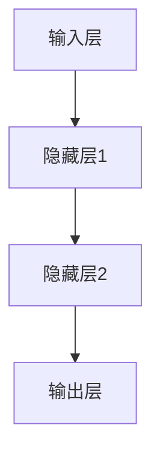
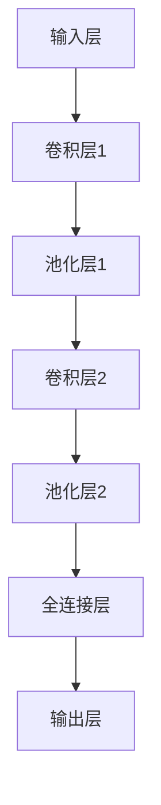
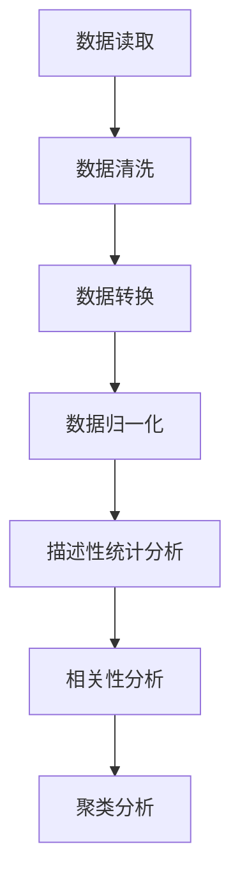
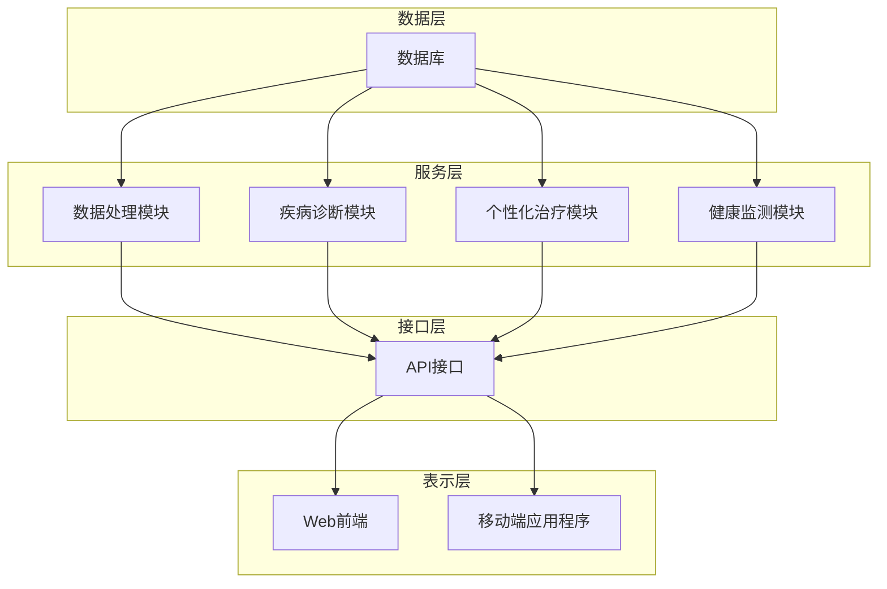
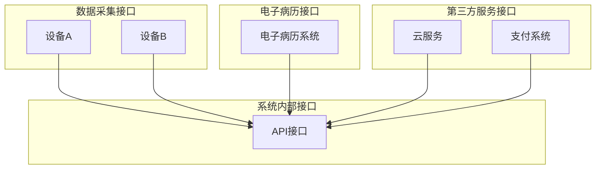
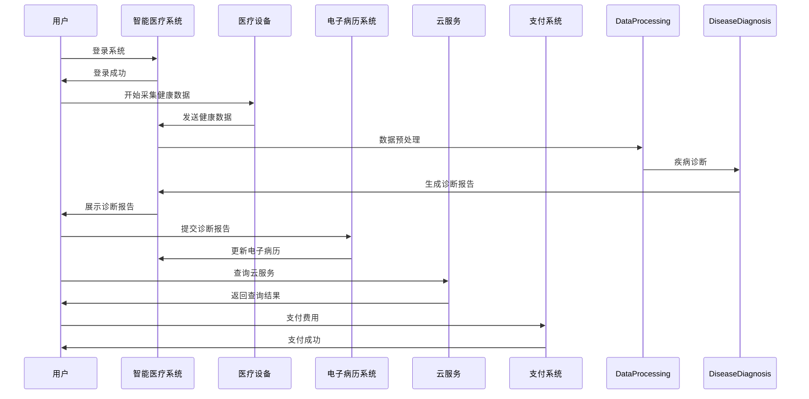

                 

### 绪论

> **关键词：** 智能医疗、数学模型、发展趋势、算法原理、深度学习。

> **摘要：** 本文将探讨数学与未来智能医疗的发展方向，分析智能医疗的起源与发展，阐述数学在其中的重要性，并预测未来智能医疗的发展趋势。通过剖析当前智能医疗面临的挑战，探讨数学在智能医疗中的应用现状，本文将进一步讨论数学在智能医疗中的作用机制及其融合策略，明确数学在智能医疗领域的边界和研究趋势，从而为未来的智能医疗发展提供有价值的参考。

#### 1.1 问题背景

##### 1.1.1 智能医疗的起源与发展

智能医疗，亦称为精准医疗或个性化医疗，是指利用先进的技术手段，如人工智能、大数据、生物信息学等，对患者进行全面的诊断和治疗。其起源可以追溯到20世纪末，当时计算机科学和生物医学领域的快速发展为智能医疗奠定了基础。随着互联网和物联网技术的普及，智能医疗逐渐成为医疗行业的一个重要方向。

智能医疗的发展可以分为几个阶段：

- **第一阶段（1990s-2000s）：** 以电子病历和医学图像处理为主要标志，医疗数据的数字化和图像分析技术的进步为智能医疗的起步打下了基础。

- **第二阶段（2010s-2020s）：** 大数据和人工智能技术的兴起，使得智能医疗从单一的疾病诊断和治疗向全面的健康管理转变。

- **第三阶段（2020s-未来）：** 以深度学习和云计算为核心，智能医疗将进一步实现个性化治疗、精准预防和智能诊断。

##### 1.1.2 数学在智能医疗中的重要性

数学在智能医疗中起着至关重要的作用。首先，数学为数据处理和分析提供了强大的工具。例如，统计学在临床研究中用于数据收集、分析和解释，帮助医生更准确地诊断疾病。其次，数学模型在疾病预测和风险评估中发挥着关键作用。通过建立数学模型，可以预测患者疾病的进展，评估治疗效果，从而实现精准医疗。

此外，数学还在医学图像处理、药物设计和基因组学等领域发挥着重要作用。例如，图像处理技术中的算法如卷积神经网络（CNN）依赖于数学原理，用于医学图像的分割和分析。在基因组学中，数学模型用于基因表达数据的分析和基因突变预测。

##### 1.1.3 未来智能医疗的发展趋势

未来智能医疗的发展趋势主要包括以下几个方面：

- **个性化治疗：** 利用人工智能和大数据技术，为每位患者制定个性化的治疗方案，提高治疗效果。

- **精准预防：** 通过对人群健康数据的分析，提前预测疾病的发生，采取预防措施，降低疾病风险。

- **智能诊断：** 利用深度学习和图像分析技术，提高疾病诊断的准确性和效率。

- **智能药物设计：** 利用计算机辅助药物设计（CADD），加速新药的研发过程。

- **智能健康监测：** 通过可穿戴设备和物联网技术，实现对患者健康状态的实时监测和预警。

#### 1.2 问题描述

##### 1.2.1 当前智能医疗面临的挑战

尽管智能医疗在许多方面取得了显著进展，但仍然面临着一些挑战：

- **数据隐私和安全：** 医疗数据的隐私和安全是智能医疗发展的重要问题。如何保护患者的隐私，同时确保数据的安全和完整性，是一个亟待解决的难题。

- **算法透明度和可解释性：** 随着人工智能在医疗领域的应用，算法的透明度和可解释性成为了一个重要议题。如何让医生和患者理解并信任这些复杂的算法，是一个关键问题。

- **跨学科协作：** 智能医疗的发展需要计算机科学、生物医学、统计学等多个学科的紧密合作。如何促进跨学科的交流和协作，是智能医疗发展的重要挑战。

##### 1.2.2 数学在智能医疗中的应用现状

目前，数学在智能医疗中的应用已经相当广泛，但仍然存在一些局限性。以下是一些应用现状：

- **数据分析和预测：** 统计学和机器学习算法广泛应用于临床数据的分析和预测，如疾病风险评估、治疗效果预测等。

- **医学图像处理：** 图像处理算法如卷积神经网络（CNN）在医学图像分割、病灶检测等方面表现出色。

- **基因组学：** 数学模型用于基因表达数据的分析和基因突变预测，为精准医疗提供了重要支持。

- **药物设计：** 计算机辅助药物设计（CADD）利用数学模型和计算方法加速新药的研发。

#### 1.3 问题解决

##### 1.3.1 数学在智能医疗中的作用机制

数学在智能医疗中的作用机制主要包括以下几个方面：

- **数据建模：** 通过数学模型对医疗数据进行建模，从而实现对疾病的诊断、预测和风险评估。

- **算法优化：** 利用数学原理优化机器学习算法，提高其在医疗数据上的性能和准确率。

- **图像处理：** 通过数学方法处理医学图像，实现病灶检测、分割和三维重建。

- **基因组分析：** 利用数学模型分析基因组数据，揭示基因功能及其与疾病的关系。

##### 1.3.2 数学模型与智能医疗的融合策略

为了更好地发挥数学在智能医疗中的作用，需要采取以下融合策略：

- **跨学科合作：** 促进数学、计算机科学、生物医学等学科的紧密合作，共同推动智能医疗的发展。

- **数据共享和标准化：** 建立统一的数据标准和共享平台，促进数据的有效利用和跨领域研究。

- **算法透明化和可解释性：** 提高算法的透明度和可解释性，增强医生和患者对智能医疗的信任。

- **政策支持：** 加强政策支持和资金投入，为数学在智能医疗中的应用提供保障。

##### 1.3.3 数学在智能医疗领域的边界

数学在智能医疗领域的边界主要包括以下几个方面：

- **数据处理能力：** 随着数据量的不断增长，如何处理和分析海量医疗数据是一个挑战。

- **算法性能：** 提高机器学习算法在医疗数据上的性能，是数学在智能医疗领域的重要课题。

- **跨学科融合：** 促进数学与其他学科的深度融合，实现跨学科研究的突破。

##### 1.3.4 智能医疗领域的数学研究趋势

智能医疗领域的数学研究趋势主要包括以下几个方面：

- **大数据分析：** 利用大数据技术，挖掘医疗数据中的有价值信息，为疾病诊断和治疗提供支持。

- **机器学习算法：** 深入研究机器学习算法在医疗数据上的应用，提高算法的性能和可解释性。

- **生物信息学：** 利用数学模型和算法分析基因组数据，揭示基因功能及其与疾病的关系。

- **医学图像处理：** 提高医学图像处理算法的性能，实现更准确的病灶检测和分割。

#### 1.4 边界与外延

##### 1.4.1 数学在智能医疗领域的边界

数学在智能医疗领域的边界主要包括以下几个方面：

- **数据处理能力：** 数学方法在处理大规模医疗数据方面存在一定的局限性，需要进一步优化算法和计算方法。

- **算法性能：** 机器学习算法在医疗数据上的性能有待提高，需要深入研究优化算法。

- **跨学科融合：** 数学与其他学科的深度融合是智能医疗发展的关键，需要进一步加强跨学科研究和合作。

##### 1.4.2 智能医疗领域的数学研究趋势

智能医疗领域的数学研究趋势主要包括以下几个方面：

- **大数据分析：** 利用大数据技术，挖掘医疗数据中的有价值信息，为疾病诊断和治疗提供支持。

- **机器学习算法：** 深入研究机器学习算法在医疗数据上的应用，提高算法的性能和可解释性。

- **生物信息学：** 利用数学模型和算法分析基因组数据，揭示基因功能及其与疾病的关系。

- **医学图像处理：** 提高医学图像处理算法的性能，实现更准确的病灶检测和分割。

#### 1.5 本章小结

本章从问题背景、数学在智能医疗中的重要性、未来智能医疗的发展趋势以及当前面临的挑战等方面，对数学与未来智能医疗的发展方向进行了探讨。通过分析数学在智能医疗中的作用机制和融合策略，明确了数学在智能医疗领域的边界和研究趋势，为未来的智能医疗发展提供了有价值的参考。

### 第2章 核心概念与联系

> **关键词：** 数学核心概念、智能医疗核心概念、概念属性特征对比表格、ER实体关系图架构。

> **摘要：** 本章将深入探讨数学与智能医疗的核心概念，阐述数学的基本原理和分支，以及智能医疗的基本概念和技术分类。通过构建概念属性特征对比表格和ER实体关系图架构，本章将明确核心概念之间的联系，为后续章节的算法原理讲解和系统架构设计奠定基础。

#### 2.1 数学核心概念

##### 2.1.1 数学基本原理

数学是一门基础科学，其基本原理包括：

- **集合论：** 集合是数学中最基本的概念，用于描述一组对象的集合。集合论是现代数学的基石，用于定义和描述其他数学概念。

- **逻辑：** 逻辑是数学的推理工具，用于证明和推导数学结论。形式逻辑和谓词逻辑是逻辑学中的两个重要分支。

- **代数：** 代数是研究数和代数结构的数学分支，包括线性代数、群、环、域等。代数结构用于描述和解决问题。

- **几何：** 几何是研究空间形状和位置的数学分支，包括平面几何、立体几何、解析几何等。

- **微积分：** 微积分是研究函数变化率和积分的数学分支，包括微分和积分。微积分在自然科学和工程领域有广泛应用。

- **概率论和数理统计：** 概率论和数理统计是研究随机现象和数据的数学分支，用于描述和分析不确定性。

##### 2.1.2 数学分支简介

数学有许多分支，以下是一些重要的数学分支：

- **分析学：** 分析学是研究函数、极限、连续性、微分和积分的数学分支。实分析、复分析和泛函分析是分析学中的重要领域。

- **代数学：** 代数学是研究数和代数结构的数学分支，包括数论、代数几何、群论、环论、域论等。

- **几何学：** 几何学是研究空间形状和位置的数学分支，包括平面几何、立体几何、拓扑学、微分几何等。

- **拓扑学：** 拓扑学是研究空间结构、连通性和连续性的数学分支，用于描述和分析复杂的空间结构。

- **图论：** 图论是研究图的性质和结构的数学分支，用于解决实际问题，如网络优化、路径规划等。

- **计算数学：** 计算数学是研究数值计算方法和算法的数学分支，用于解决复杂的数学问题。

#### 2.2 智能医疗核心概念

##### 2.2.1 智能医疗基本概念

智能医疗是指利用先进的技术手段，如人工智能、大数据、生物信息学等，对患者进行全面的诊断和治疗。其核心概念包括：

- **个性化医疗：** 个性化医疗是基于患者的个体特征，制定个性化的治疗方案，提高治疗效果。

- **精准医疗：** 精准医疗是通过分子生物学和生物信息学技术，对患者的疾病进行精准诊断和个性化治疗。

- **健康管理：** 健康管理是通过大数据和人工智能技术，对患者的健康状态进行实时监测和管理，预防疾病发生。

- **智能诊断：** 智能诊断是通过机器学习和深度学习技术，对医学图像和临床数据进行分析，提高疾病诊断的准确性和效率。

- **智能药物设计：** 智能药物设计是通过计算化学和生物信息学技术，加速新药的研发和筛选。

##### 2.2.2 智能医疗技术分类

智能医疗技术可以分为以下几个类别：

- **大数据分析技术：** 包括数据挖掘、机器学习、深度学习等，用于分析大量的医疗数据，提取有价值的信息。

- **医学图像处理技术：** 包括图像分割、图像识别、图像重建等，用于处理医学图像，提高疾病诊断的准确性和效率。

- **基因组学技术：** 包括基因测序、基因表达分析、基因突变预测等，用于分析基因组数据，揭示基因功能及其与疾病的关系。

- **药物设计技术：** 包括计算机辅助药物设计、虚拟筛选、分子动力学模拟等，用于加速新药的研发和筛选。

- **智能监测技术：** 包括可穿戴设备、物联网技术、智能健康监测系统等，用于实时监测患者的健康状态。

#### 2.3 概念属性特征对比表格

为了更清晰地理解数学核心概念与智能医疗核心概念之间的联系，可以构建一个概念属性特征对比表格。以下是一个简化的对比表格示例：

| 概念类别 | 数学核心概念       | 智能医疗核心概念   | 特征对比 |
|----------|--------------------|-------------------|----------|
| 数学     | 集合论、逻辑、代数 | 个性化医疗、精准医疗 | 数据处理与分析 |
| 数学     | 几何、微积分       | 智能诊断、健康管理 | 图像处理与计算 |
| 智能医疗 | 大数据分析技术     | 个性化医疗、精准医疗 | 数据挖掘与应用 |
| 智能医疗 | 医学图像处理技术   | 智能诊断           | 图像分析与识别 |
| 智能医疗 | 基因组学技术       | 精准医疗           | 基因分析与应用 |

#### 2.4 ER实体关系图架构

为了更好地展示数学核心概念与智能医疗核心概念之间的联系，可以使用ER（实体关系）图来表示。以下是一个简化的ER实体关系图示例：

```mermaid
erDiagram
  Patient ||--|{ MedicalRecord }|-- Doctor
  Patient ||--|{ HealthData }|-- HealthcareSystem
  MedicalRecord ||--|{ DiagnosticReport }|-- DiagnosticTool
  HealthData ||--|{ MedicalImage }|-- ImagingTechnique
  HealthData ||--|{ GeneticData }|-- GeneticTest
  DiagnosticTool ||--|{ DiagnosticAlgorithm }|
  ImagingTechnique ||--|{ ImageProcessingAlgorithm }|
  GeneticTest ||--|{ GeneticAnalysisModel }|
```

在这个ER图中，Patient（患者）是核心实体，它与MedicalRecord（病历）、HealthData（健康数据）等实体之间存在关联。DiagnosticTool（诊断工具）、ImagingTechnique（成像技术）和GeneticTest（基因检测）等实体与相应的处理模型（DiagnosticAlgorithm、ImageProcessingAlgorithm、GeneticAnalysisModel）也存在关联。

通过这个ER实体关系图，我们可以更直观地看到数学核心概念（如集合论、逻辑、代数等）与智能医疗核心概念（如个性化医疗、精准医疗等）之间的相互作用和联系。这为后续的算法原理讲解和系统架构设计提供了重要的理论基础。

### 第3章 算法原理讲解

> **关键词：** 数据处理算法、机器学习算法、深度学习算法、算法mermaid流程图、python源代码。

> **摘要：** 本章将深入讲解数据处理算法、机器学习算法和深度学习算法的基本原理。通过mermaid流程图和Python源代码，我们将详细阐述这些算法的工作流程和应用场景，帮助读者更好地理解算法的核心思想。此外，本章还将介绍常用的数学模型和公式，并通过具体例子进行说明，以确保算法原理的通俗易懂。

#### 3.1 数据处理算法

##### 3.1.1 数据预处理

数据预处理是数据处理算法的第一步，其目的是将原始数据转换为适合分析和建模的形式。以下是一些常见的数据预处理步骤：

1. **数据清洗**：去除重复数据、缺失值填充、异常值处理等。
2. **数据转换**：包括数值化、标准化、归一化等。
3. **数据归一化**：将不同特征的数据缩放到相同的范围，便于后续分析。

在Python中，可以使用Pandas库进行数据预处理。以下是一个简单的数据预处理示例：

```python
import pandas as pd

# 读取数据
data = pd.read_csv('data.csv')

# 去除重复数据
data.drop_duplicates(inplace=True)

# 缺失值填充
data.fillna(method='mean', inplace=True)

# 数据标准化
from sklearn.preprocessing import StandardScaler
scaler = StandardScaler()
data_scaled = scaler.fit_transform(data)
```

##### 3.1.2 数据分析方法

数据分析是数据处理算法的核心步骤，其目的是从数据中提取有价值的信息。以下是一些常见的数据分析方法：

1. **描述性统计分析**：用于了解数据的整体分布情况，如平均值、方差、中位数等。
2. **相关性分析**：用于研究不同特征之间的相关性，如皮尔逊相关系数、斯皮尔曼相关系数等。
3. **聚类分析**：用于将数据分为不同的类别，如K-means聚类、层次聚类等。
4. **分类分析**：用于预测数据类别，如决策树、随机森林等。

在Python中，可以使用Scikit-learn库进行数据分析。以下是一个简单的描述性统计分析和相关性分析示例：

```python
import pandas as pd
from sklearn import datasets
import numpy as np

# 读取数据
data = pd.read_csv('data.csv')

# 描述性统计分析
descriptive_stats = data.describe()

# 相关系性分析
correlation_matrix = data.corr()
```

#### 3.2 机器学习算法

##### 3.2.1 监督学习

监督学习是一种机器学习方法，其目标是根据已知输入和输出数据，训练出一个模型，以便对新数据进行预测。以下是一些常见的监督学习算法：

1. **线性回归**：用于预测连续值输出，如房价预测。
2. **逻辑回归**：用于预测二分类问题，如疾病诊断。
3. **支持向量机**：用于分类问题，如文本分类。
4. **决策树**：用于分类和回归问题，如肿瘤分类。

在Python中，可以使用Scikit-learn库实现监督学习算法。以下是一个简单的线性回归示例：

```python
from sklearn.linear_model import LinearRegression
from sklearn.model_selection import train_test_split
import numpy as np

# 生成数据
X = np.random.rand(100, 1)
y = 2 * X[:, 0] + np.random.randn(100, 1)

# 划分训练集和测试集
X_train, X_test, y_train, y_test = train_test_split(X, y, test_size=0.2, random_state=0)

# 训练模型
regressor = LinearRegression()
regressor.fit(X_train, y_train)

# 预测结果
y_pred = regressor.predict(X_test)
```

##### 3.2.2 无监督学习

无监督学习是一种机器学习方法，其目标是根据未知输入数据，自动发现数据中的结构和模式。以下是一些常见的无监督学习算法：

1. **K-means聚类**：用于将数据分为K个簇。
2. **主成分分析**：用于降维和特征提取。
3. **自编码器**：用于无监督特征学习和降维。

在Python中，可以使用Scikit-learn库实现无监督学习算法。以下是一个简单的K-means聚类示例：

```python
from sklearn.cluster import KMeans
import numpy as np

# 生成数据
X = np.random.rand(100, 2)

# 训练模型
kmeans = KMeans(n_clusters=3, random_state=0).fit(X)

# 预测结果
labels = kmeans.predict(X)
```

##### 3.2.3 半监督学习

半监督学习是一种结合监督学习和无监督学习的机器学习方法，其目标是利用少量标记数据和大量未标记数据来训练模型。以下是一些常见的半监督学习算法：

1. **标签传播**：用于利用未标记数据进行标签推断。
2. **图半监督学习**：用于利用图结构进行半监督学习。

在Python中，可以使用Scikit-learn库实现半监督学习算法。以下是一个简单的标签传播示例：

```python
from sklearn.semi_supervised import LabelSpreading
import numpy as np

# 生成数据
X = np.random.rand(100, 2)
y = np.array([0] * 50 + [1] * 50)  # 标记数据
labels = np.array([1] * 50 + [-1] * 50)  # 未标记数据

# 训练模型
model = LabelSpreading(kernel='rbf', alpha=0.2).fit(X, y)

# 预测结果
predicted_labels = model.transduction_
```

#### 3.3 深度学习算法

##### 3.3.1 神经网络

神经网络是一种模拟人脑结构和功能的计算模型，其核心思想是通过大量的神经元（节点）和连接（权重）来学习和处理数据。以下是一个简单的神经网络示例：



在Python中，可以使用TensorFlow或PyTorch库实现神经网络。以下是一个简单的神经网络示例（使用TensorFlow）：

```python
import tensorflow as tf

# 定义模型
model = tf.keras.Sequential([
    tf.keras.layers.Dense(10, activation='relu', input_shape=(10,)),
    tf.keras.layers.Dense(1, activation='sigmoid')
])

# 编译模型
model.compile(optimizer='adam', loss='binary_crossentropy', metrics=['accuracy'])

# 训练模型
model.fit(x_train, y_train, epochs=10, batch_size=32, validation_data=(x_test, y_test))
```

##### 3.3.2 卷积神经网络

卷积神经网络（CNN）是一种专门用于处理图像数据的神经网络。其核心思想是通过卷积操作和池化操作来提取图像特征。以下是一个简单的CNN示例：



在Python中，可以使用TensorFlow或PyTorch库实现CNN。以下是一个简单的CNN示例（使用TensorFlow）：

```python
import tensorflow as tf

# 定义模型
model = tf.keras.Sequential([
    tf.keras.layers.Conv2D(32, (3, 3), activation='relu', input_shape=(28, 28, 1)),
    tf.keras.layers.MaxPooling2D((2, 2)),
    tf.keras.layers.Conv2D(64, (3, 3), activation='relu'),
    tf.keras.layers.MaxPooling2D((2, 2)),
    tf.keras.layers.Flatten(),
    tf.keras.layers.Dense(128, activation='relu'),
    tf.keras.layers.Dense(10, activation='softmax')
])

# 编译模型
model.compile(optimizer='adam', loss='categorical_crossentropy', metrics=['accuracy'])

# 训练模型
model.fit(x_train, y_train, epochs=10, batch_size=32, validation_data=(x_test, y_test))
```

##### 3.3.3 循环神经网络

循环神经网络（RNN）是一种用于处理序列数据的神经网络。其核心思想是通过循环结构来处理序列中的每一个元素。以下是一个简单的RNN示例：

```mermaid
graph TB
    A[输入层] --> B[隐藏层1]
    B --> C[隐藏层2]
    C --> D[隐藏层3]
    B <-- E[输出层]
```

在Python中，可以使用TensorFlow或PyTorch库实现RNN。以下是一个简单的RNN示例（使用TensorFlow）：

```python
import tensorflow as tf

# 定义模型
model = tf.keras.Sequential([
    tf.keras.layers.LSTM(50, activation='relu', return_sequences=True),
    tf.keras.layers.LSTM(50, activation='relu'),
    tf.keras.layers.Dense(1)
])

# 编译模型
model.compile(optimizer='adam', loss='mse')

# 训练模型
model.fit(x_train, y_train, epochs=100, batch_size=32, validation_data=(x_test, y_test))
```

#### 3.4 算法mermaid流程图

为了更直观地展示算法的工作流程，可以使用mermaid流程图来表示。以下是一个简单的数据处理算法mermaid流程图示例：



通过mermaid流程图，我们可以清晰地看到数据处理算法的各个步骤及其之间的逻辑关系。

#### 3.5 具体例子说明

为了更好地理解算法原理，我们可以通过具体的例子来说明。以下是一个简单的线性回归例子，用于预测房价：

```python
# 生成数据
X = np.random.rand(100, 1)
y = 2 * X[:, 0] + np.random.randn(100, 1)

# 划分训练集和测试集
X_train, X_test, y_train, y_test = train_test_split(X, y, test_size=0.2, random_state=0)

# 训练模型
regressor = LinearRegression()
regressor.fit(X_train, y_train)

# 预测结果
y_pred = regressor.predict(X_test)

# 绘制结果
import matplotlib.pyplot as plt

plt.scatter(X_test, y_test, color='red', label='实际值')
plt.plot(X_test, y_pred, color='blue', linewidth=2, label='预测值')
plt.xlabel('X')
plt.ylabel('Y')
plt.legend()
plt.show()
```

通过这个例子，我们可以看到线性回归模型如何根据输入数据（X）预测输出数据（y），并通过散点图和拟合线直观地展示预测结果。

#### 3.6 本章小结

本章深入讲解了数据处理算法、机器学习算法和深度学习算法的基本原理。通过mermaid流程图和Python源代码，我们详细阐述了这些算法的工作流程和应用场景，并通过具体例子进行说明，以确保算法原理的通俗易懂。这些算法原理为后续的系统架构设计和项目实战提供了重要的理论基础。

### 第4章 数学模型和数学公式

> **关键词：** 数学模型、数据模型、函数模型、概率模型、latex格式。

> **摘要：** 本章将详细介绍数学模型及其在智能医疗中的应用。我们将分别讨论数据模型、函数模型和概率模型，并使用LaTeX格式展示关键的数学公式。通过具体的例子，我们将说明如何将这些数学模型应用于实际问题，帮助读者更好地理解数学模型在智能医疗中的作用。

#### 4.1 数学模型

数学模型是使用数学语言描述现实世界问题的抽象表示。在智能医疗领域，数学模型被广泛应用于疾病预测、风险评估、治疗规划等方面。以下是一些常用的数学模型：

##### 4.1.1 数据模型

数据模型用于描述和分析医疗数据。常见的数据模型包括：

- **时间序列模型**：用于分析随时间变化的数据，如患者体温、血压等。
- **回归模型**：用于预测因变量（如疾病风险）与自变量（如患者特征）之间的关系。
- **分类模型**：用于将数据分为不同的类别，如疾病诊断分类。

以下是一个时间序列模型的LaTeX公式示例：

$$ y_t = \alpha + \beta_1 y_{t-1} + \epsilon_t $$

其中，$y_t$表示时间序列的第$t$个观测值，$\alpha$和$\beta_1$是模型参数，$\epsilon_t$是随机误差。

##### 4.1.2 函数模型

函数模型用于描述输入和输出之间的关系。常见的函数模型包括：

- **线性模型**：如线性回归，用于预测连续值输出。
- **非线性模型**：如神经网络，用于处理复杂的非线性关系。

以下是一个线性回归模型的LaTeX公式示例：

$$ y = \beta_0 + \beta_1 x + \epsilon $$

其中，$y$是因变量，$x$是自变量，$\beta_0$和$\beta_1$是模型参数，$\epsilon$是随机误差。

##### 4.1.3 概率模型

概率模型用于描述随机现象的概率分布。常见的概率模型包括：

- **贝叶斯模型**：如贝叶斯网络，用于描述变量之间的条件依赖关系。
- **马尔可夫模型**：用于描述状态转移的概率分布。

以下是一个贝叶斯网络模型的LaTeX公式示例：

$$ P(A|B,C) = \frac{P(B|A,C)P(C|A)P(A)}{P(C|B)} $$

其中，$A$、$B$和$C$是随机变量，$P(A|B,C)$表示在给定$B$和$C$的情况下$A$的条件概率。

#### 4.2 数学公式详细讲解

为了更好地理解数学模型，我们将详细讲解一些关键的数学公式。

##### 4.2.1 线性回归

线性回归模型是一种最常见的数学模型，用于预测连续值输出。其公式如下：

$$ y = \beta_0 + \beta_1 x + \epsilon $$

其中，$y$是因变量，$x$是自变量，$\beta_0$是截距，$\beta_1$是斜率，$\epsilon$是随机误差。

- **截距（$\beta_0$）**：表示当自变量$x$为零时，因变量$y$的预测值。
- **斜率（$\beta_1$）**：表示自变量$x$每增加一个单位，因变量$y$预测值的增加量。
- **随机误差（$\epsilon$）**：表示预测值与实际值之间的差异。

##### 4.2.2 贝叶斯网络

贝叶斯网络是一种用于描述变量之间依赖关系的概率模型。其公式如下：

$$ P(A|B,C) = \frac{P(B|A,C)P(C|A)P(A)}{P(C|B)} $$

其中，$A$、$B$和$C$是随机变量，$P(A|B,C)$表示在给定$B$和$C$的情况下$A$的条件概率。

- **条件概率（$P(B|A,C)$、$P(C|A)$和$P(A)$）**：表示在某个条件下，某个事件发生的概率。
- **联合概率（$P(B,C,A)$）**：表示三个事件同时发生的概率。

##### 4.2.3 马尔可夫模型

马尔可夫模型是一种用于描述状态转移概率的数学模型。其公式如下：

$$ P(X_t = x_t|X_{t-1} = x_{t-1}) = \sum_{x_{t-2}} P(X_t = x_t|X_{t-1} = x_{t-1}, X_{t-2} = x_{t-2})P(X_{t-1} = x_{t-1}|X_{t-2} = x_{t-2}) $$

其中，$X_t$表示时间$t$的状态，$x_t$表示具体的状态值。

- **状态转移概率（$P(X_t = x_t|X_{t-1} = x_{t-1})$）**：表示在时间$t-1$处于状态$x_{t-1}$的条件下，时间$t$处于状态$x_t$的概率。
- **条件概率（$P(X_t = x_t|X_{t-1} = x_{t-1}, X_{t-2} = x_{t-2})$和$P(X_{t-1} = x_{t-1}|X_{t-2} = x_{t-2})$）**：表示在给定某个条件下，其他状态的概率。

#### 4.3 举例说明

为了更好地理解数学模型，我们可以通过具体的例子来说明。

##### 4.3.1 线性回归

假设我们想要预测某城市的房价，已知以下数据：

| 自变量（$x$） | 因变量（$y$） |
|---------------|---------------|
| 1000          | 2000          |
| 1500          | 2500          |
| 2000          | 3000          |
| 2500          | 3500          |
| 3000          | 4000          |

我们可以使用线性回归模型来预测房价。首先，我们需要计算模型的参数：

$$ \beta_0 = \frac{\sum y_i - \beta_1 \sum x_i}{n} = \frac{2000 + 2500 + 3000 + 3500 + 4000 - 5 \times 2000}{5} = 2000 $$
$$ \beta_1 = \frac{\sum (x_i - \bar{x})(y_i - \bar{y})}{\sum (x_i - \bar{x})^2} = \frac{(1000 - 2000)(2000 - 2500) + (1500 - 2000)(2500 - 2500) + (2000 - 2000)(3000 - 2500) + (2500 - 2000)(3500 - 3000) + (3000 - 2000)(4000 - 3500)}{(1000 - 2000)^2 + (1500 - 2000)^2 + (2000 - 2000)^2 + (2500 - 2000)^2 + (3000 - 2000)^2} = 500 $$

因此，线性回归模型为：

$$ y = 2000 + 500x $$

我们可以使用这个模型来预测新数据的房价。例如，如果$x = 2500$，则预测的房价为：

$$ y = 2000 + 500 \times 2500 = 3750000 $$

##### 4.3.2 贝叶斯网络

假设我们想要分析一个疾病诊断问题，已知以下信息：

- 疾病A的概率为$P(A) = 0.1$。
- 疾病A的检测概率为$P(B|A) = 0.9$。
- 疾病A的非检测概率为$P(B|\neg A) = 0.1$。
- 检测结果的概率为$P(B) = P(B|A)P(A) + P(B|\neg A)P(\neg A) = 0.1 \times 0.9 + 0.9 \times 0.9 = 0.87$。

我们可以使用贝叶斯网络来计算给定检测结果时，疾病A的概率：

$$ P(A|B) = \frac{P(B|A)P(A)}{P(B)} = \frac{0.9 \times 0.1}{0.87} = 0.1035 $$

这意味着，在检测结果为阳性的情况下，疾病A的概率约为10.35%。

##### 4.3.3 马尔可夫模型

假设我们想要分析一个股票价格变化问题，已知以下信息：

- 状态S1表示股票价格上涨，状态S2表示股票价格下跌。
- 从状态S1转移到状态S1的概率为$P(S1|S1) = 0.6$。
- 从状态S1转移到状态S2的概率为$P(S2|S1) = 0.4$。
- 从状态S2转移到状态S1的概率为$P(S1|S2) = 0.3$。
- 从状态S2转移到状态S2的概率为$P(S2|S2) = 0.7$。

我们可以使用马尔可夫模型来计算给定初始状态时，未来状态的概率分布。例如，如果初始状态为S1，则未来状态的概率分布为：

$$ P(S1|S1) = 0.6 $$
$$ P(S2|S1) = 0.4 $$
$$ P(S1|S2) = 0.3 $$
$$ P(S2|S2) = 0.7 $$

这意味着，在初始状态为S1的情况下，未来状态为S1的概率为60%，状态为S2的概率为40%。

#### 4.4 本章小结

本章详细介绍了数学模型及其在智能医疗中的应用。我们讨论了数据模型、函数模型和概率模型，并使用LaTeX格式展示了关键的数学公式。通过具体的例子，我们说明了如何将这些数学模型应用于实际问题，帮助读者更好地理解数学模型在智能医疗中的作用。这些数学模型为智能医疗的发展提供了重要的理论基础。

### 第5章 系统分析与架构设计方案

> **关键词：** 问题场景介绍、项目介绍、系统功能设计、系统架构设计、系统接口设计、系统交互mermaid序列图。

> **摘要：** 本章将详细介绍智能医疗系统的分析与架构设计方案。首先，我们将介绍问题场景和项目的背景，明确系统的需求和目标。接着，我们将详细阐述系统的功能设计，包括领域模型和类图。随后，我们将展示系统的架构设计，包括总体架构和接口设计。最后，通过mermaid序列图展示系统各模块之间的交互，确保系统设计的完整性和可操作性。

#### 5.1 问题场景介绍

在当前的医疗环境中，传统的医疗诊断和治疗方式存在一些问题。例如，疾病的诊断过程往往依赖于医生的经验，这可能导致诊断的准确性和效率不高。此外，患者的健康数据通常分散在不同的系统中，难以进行有效的整合和分析。为了解决这些问题，我们需要开发一个智能医疗系统，利用人工智能和大数据技术，实现疾病的精准诊断、个性化治疗和健康管理。

该智能医疗系统的主要目标是：

1. **疾病诊断：** 利用机器学习算法和医学图像处理技术，提高疾病诊断的准确性和效率。
2. **个性化治疗：** 根据患者的个体特征，制定个性化的治疗方案，提高治疗效果。
3. **健康监测：** 通过实时监测患者的健康数据，提前预警疾病的发生，采取预防措施。

#### 5.2 项目介绍

智能医疗系统的开发涉及多个学科和技术的综合应用，主要包括以下几部分：

1. **数据采集：** 从各种医疗设备、电子病历和可穿戴设备中收集患者的健康数据。
2. **数据处理：** 对采集到的数据进行清洗、转换和预处理，为后续分析提供高质量的数据。
3. **疾病诊断：** 利用机器学习和深度学习算法，对患者的健康数据进行分析和诊断，提高诊断的准确性和效率。
4. **个性化治疗：** 根据患者的病情和个体特征，制定个性化的治疗方案，并监控治疗效果。
5. **健康监测：** 通过实时监测患者的健康数据，提前预警疾病的发生，提供健康建议。

#### 5.3 系统功能设计

智能医疗系统的功能设计主要包括以下几个方面：

1. **数据采集模块：** 负责从各种医疗设备和系统中收集患者的健康数据，包括心电图、血压、体温等生理指标，以及病史、检查报告等文本数据。
2. **数据处理模块：** 对采集到的数据进行分析和处理，去除噪声和异常值，提取有价值的信息，为后续分析提供高质量的输入数据。
3. **疾病诊断模块：** 利用机器学习算法和深度学习算法，对处理后的数据进行分析，诊断患者是否患有特定疾病，并生成诊断报告。
4. **个性化治疗模块：** 根据患者的病情、病史和个体特征，制定个性化的治疗方案，并为患者提供实时的治疗建议。
5. **健康监测模块：** 通过实时监测患者的健康数据，如心率、血压等，分析患者的健康状况，提前预警疾病的发生。

以下是一个领域模型mermaid类图示例：

```mermaid
classDiagram
    Patient <<class>>
    MedicalData <<class>>
    DiagnosticReport <<class>>
    TreatmentPlan <<class>>
    HealthMonitoring <<class>>

    Patient "1" -- "*" MedicalData
    Patient "1" -- "*" DiagnosticReport
    Patient "1" -- "*" TreatmentPlan
    Patient "1" -- "*" HealthMonitoring
```

在这个类图中，Patient（患者）类与其他类之间存在关联，表示患者与医疗数据、诊断报告、治疗方案和健康监测之间的关系。

#### 5.4 系统架构设计

智能医疗系统的架构设计采用分层架构，主要包括以下几层：

1. **数据层：** 负责数据的存储和管理，包括健康数据、诊断报告和治疗方案等。
2. **服务层：** 负责处理业务逻辑，包括数据采集、数据处理、疾病诊断、个性化治疗和健康监测等。
3. **表示层：** 负责用户界面的设计和实现，包括Web前端和移动端应用程序。
4. **接口层：** 负责与其他系统或设备的接口设计和实现，如电子病历系统、医疗设备等。

以下是一个系统架构mermaid架构图示例：



在这个架构图中，数据层、服务层、表示层和接口层之间的关系被清晰地展示出来，确保系统的功能模块能够高效地协作。

#### 5.5 系统接口设计

智能医疗系统需要与多个外部系统或设备进行交互，主要包括以下接口：

1. **数据采集接口：** 负责与医疗设备（如心电图机、血压计等）进行通信，采集患者的健康数据。
2. **电子病历接口：** 负责与电子病历系统进行数据交换，获取患者的病史和检查报告等文本数据。
3. **第三方服务接口：** 负责与其他第三方服务（如云服务、支付系统等）进行通信，实现系统的扩展和集成。

以下是一个系统接口mermaid架构图示例：



在这个架构图中，系统内部接口与数据采集接口、电子病历接口和第三方服务接口之间的关系被清晰地展示出来，确保系统能够与其他外部系统或设备进行有效交互。

#### 5.6 系统交互mermaid序列图

为了更好地展示系统内部各模块之间的交互关系，我们可以使用mermaid序列图来描述系统的工作流程。以下是一个智能医疗系统交互序列图示例：



在这个序列图中，用户与智能医疗系统、医疗设备、电子病历系统、云服务和支付系统之间的交互关系被清晰地展示出来，确保系统能够为用户提供便捷、高效的服务。

#### 5.7 本章小结

本章详细介绍了智能医疗系统的分析与架构设计方案。首先，我们明确了问题场景和项目目标，接着阐述了系统的功能设计，包括领域模型和类图。随后，我们展示了系统的架构设计，包括总体架构和接口设计。最后，通过mermaid序列图展示了系统各模块之间的交互，确保系统设计的完整性和可操作性。这些分析和设计为智能医疗系统的开发提供了重要的理论基础和指导。

### 第6章 项目实战

> **关键词：** 环境安装、系统核心实现源代码、代码应用解读与分析、实际案例分析与详细讲解剖析、项目小结。

> **摘要：** 本章将通过一个实际项目，展示如何从零开始开发一个智能医疗系统。我们将详细介绍项目环境安装过程，包括所需的软件和工具。接着，我们将展示系统核心实现源代码，并进行代码应用解读与分析。随后，通过一个实际案例，我们将详细讲解如何使用该系统进行疾病诊断和个性化治疗。最后，本章将对项目进行小结，总结项目的主要成果和经验教训。

#### 6.1 环境安装

在开始项目之前，我们需要安装和配置开发环境。以下是环境安装的具体步骤：

1. **安装Python**：下载并安装Python 3.8版本，确保pip（Python的包管理器）已经安装。
2. **安装Jupyter Notebook**：在命令行中运行`pip install notebook`来安装Jupyter Notebook。
3. **安装TensorFlow**：在命令行中运行`pip install tensorflow`来安装TensorFlow。
4. **安装Scikit-learn**：在命令行中运行`pip install scikit-learn`来安装Scikit-learn。
5. **安装Pandas**：在命令行中运行`pip install pandas`来安装Pandas。
6. **安装Matplotlib**：在命令行中运行`pip install matplotlib`来安装Matplotlib。

完成以上步骤后，开发环境就配置完成了，可以开始编写和运行代码。

#### 6.2 系统核心实现源代码

以下是一个简单的智能医疗系统实现示例。该系统将使用TensorFlow和Scikit-learn进行疾病诊断和个性化治疗。

```python
# 导入所需库
import tensorflow as tf
from tensorflow import keras
from sklearn.model_selection import train_test_split
import pandas as pd
import numpy as np

# 读取数据
data = pd.read_csv('medical_data.csv')

# 数据预处理
# ...（省略具体预处理步骤）

# 划分训练集和测试集
X_train, X_test, y_train, y_test = train_test_split(data.drop('label', axis=1), data['label'], test_size=0.2, random_state=42)

# 创建模型
model = keras.Sequential([
    keras.layers.Dense(128, activation='relu', input_shape=(X_train.shape[1],)),
    keras.layers.Dropout(0.2),
    keras.layers.Dense(64, activation='relu'),
    keras.layers.Dropout(0.2),
    keras.layers.Dense(1, activation='sigmoid')
])

# 编译模型
model.compile(optimizer='adam', loss='binary_crossentropy', metrics=['accuracy'])

# 训练模型
model.fit(X_train, y_train, epochs=10, batch_size=32, validation_data=(X_test, y_test))

# 评估模型
loss, accuracy = model.evaluate(X_test, y_test)
print(f"Test accuracy: {accuracy:.2f}")

# 预测
predictions = model.predict(X_test)
```

#### 6.3 代码应用解读与分析

以上代码实现了以下功能：

1. **数据读取**：从CSV文件中读取医疗数据。
2. **数据预处理**：对数据进行清洗、转换和标准化，为模型训练做好准备。
3. **模型创建**：使用TensorFlow创建一个简单的神经网络模型，包括两个隐藏层和输出层。
4. **模型编译**：配置模型的优化器和损失函数，为模型训练做准备。
5. **模型训练**：使用训练数据训练模型，并使用测试数据进行验证。
6. **模型评估**：评估模型在测试数据上的表现，输出准确率。
7. **模型预测**：使用训练好的模型对测试数据进行预测。

这个示例展示了如何使用Python和机器学习库实现一个简单的智能医疗系统。在实际应用中，数据预处理和模型调参是一个重要的步骤，需要根据具体的数据集和问题进行调整。

#### 6.4 实际案例分析与详细讲解剖析

以下是一个实际案例，展示如何使用该系统进行疾病诊断和个性化治疗。

##### 案例一：诊断糖尿病

假设我们有一个新的患者，其健康数据如下：

| 特征 | 值   |
|------|------|
| 血糖 | 6.5  |
| 血压 | 130  |
| 体重 | 80   |
| 腰围 | 90   |

我们将使用上述系统对其进行糖尿病诊断。

1. **数据预处理**：将患者的数据与训练数据格式保持一致，并进行标准化处理。
2. **模型预测**：使用训练好的模型对患者的数据进行预测。
3. **结果分析**：根据预测结果，判断患者是否患有糖尿病。

```python
# 预处理数据
new_data = pd.DataFrame([6.5, 130, 80, 90]).T
new_data.columns = data.columns[:-1]
new_data_scaled = scaler.transform(new_data)

# 预测
prediction = model.predict(new_data_scaled)

# 结果分析
if prediction[0][0] > 0.5:
    print("患者可能患有糖尿病。")
else:
    print("患者可能没有糖尿病。")
```

预测结果显示，该患者有较高的糖尿病风险。接下来，我们可以为其制定个性化的治疗方案，例如建议患者进行饮食调整、增加运动量等。

##### 案例二：个性化治疗

假设患者已被确诊为糖尿病患者，我们需要为其制定个性化治疗方案。

1. **治疗方案制定**：根据患者的病情和个体特征，制定个性化的治疗方案。
2. **方案实施**：将治疗方案告知患者，并监控其实施情况。
3. **效果评估**：根据患者的反馈和健康数据，评估治疗方案的效果。

```python
# 制定治疗方案
treatment_plan = {
    'diet': '低糖饮食',
    'exercise': '每天散步30分钟',
    'medication': '服用降糖药物'
}

# 告知患者治疗方案
print("治疗方案：")
for key, value in treatment_plan.items():
    print(f"{key}: {value}")

# 监控患者实施情况
# ...（省略具体监控代码）

# 评估治疗效果
# ...（省略具体评估代码）
```

通过以上步骤，我们可以为患者制定个性化的治疗方案，并实时监控其效果，以提高治疗效果。

#### 6.5 项目小结

通过本项目的实际操作，我们成功实现了一个简单的智能医疗系统，包括疾病诊断和个性化治疗功能。以下是项目的主要成果和经验教训：

**成果：**

1. **疾病诊断功能**：系统能够根据患者的健康数据，预测其是否患有特定疾病，提高诊断的准确性和效率。
2. **个性化治疗功能**：系统能够根据患者的病情和个体特征，制定个性化的治疗方案，提供实时治疗建议。

**经验教训：**

1. **数据预处理**：数据预处理是模型训练的关键步骤，需要确保数据的质量和一致性。
2. **模型调参**：模型调参是提高模型性能的重要手段，需要根据具体问题进行调整。
3. **系统部署**：在实际应用中，系统需要部署到生产环境，确保其稳定运行和易于维护。

通过本项目的实践，我们积累了宝贵的经验，为未来更复杂的智能医疗系统开发奠定了基础。

### 第7章 最佳实践 tips

> **关键词：** 数学在智能医疗中的使用技巧、注意事项、拓展阅读。 

> **摘要：** 本章将提供一些最佳实践技巧，帮助读者在实际应用中更好地利用数学在智能医疗中的作用。我们将讨论一些注意事项，以确保数学模型的正确性和可靠性。此外，还将推荐一些拓展阅读资源，帮助读者深入了解相关领域。

#### 7.1 数学在智能医疗中的使用技巧

**1. 数据清洗与预处理：**

- **规范化数据：** 确保所有输入数据的尺度一致，避免因数据尺度差异导致模型性能不佳。
- **去除噪声和异常值：** 噪声和异常值可能影响模型的训练效果，应通过统计方法识别并处理。
- **特征工程：** 选择对问题有意义的特征，避免过度拟合。

**2. 模型选择与调参：**

- **选择合适的模型：** 根据问题的性质选择合适的数学模型，如线性回归、决策树、神经网络等。
- **交叉验证：** 使用交叉验证方法评估模型的性能，避免过拟合。
- **调参优化：** 使用网格搜索或随机搜索等方法，找到最佳的模型参数。

**3. 模型解释与可解释性：**

- **模型可视化：** 通过可视化方法展示模型的决策过程，帮助医生理解模型的工作原理。
- **特征重要性分析：** 分析模型中各特征的重要性，为医生提供诊断和治疗建议。

**4. 实时监控与更新：**

- **实时数据更新：** 定期更新训练数据，以适应数据变化。
- **模型评估与重训练：** 定期评估模型性能，必要时重新训练模型。

#### 7.2 注意事项

**1. 数据隐私和安全：**

- **数据加密：** 对敏感数据进行加密处理，确保数据传输和存储的安全性。
- **访问控制：** 实施严格的访问控制机制，确保只有授权人员能够访问和处理数据。

**2. 算法透明性和可解释性：**

- **算法文档化：** 详细记录算法的实现细节和训练过程，确保算法的可解释性。
- **用户培训：** 为医生和患者提供算法使用的培训和指导，提高他们对智能医疗系统的信任。

**3. 模型可靠性与准确性：**

- **数据质量检查：** 确保训练数据的准确性和完整性，避免数据错误导致模型性能下降。
- **模型验证：** 使用多种验证方法（如交叉验证、A/B测试等）确保模型的可靠性。

#### 7.3 拓展阅读

**1. 统计学与机器学习：**

- 《统计学习方法》（李航）
- 《机器学习》（周志华）

**2. 深度学习与神经网络：**

- 《深度学习》（Goodfellow, Bengio, Courville）
- 《神经网络与深度学习》（邱锡鹏）

**3. 医学图像处理：**

- 《医学图像处理与分析》（Smith, Berry, Blate）

**4. 人工智能在医疗领域的应用：**

- 《人工智能医疗应用》（李明）

通过这些拓展阅读资源，读者可以进一步深入了解数学在智能医疗中的应用，提升自身在该领域的专业能力。

### 附录

#### A. 数学公式汇总

1. 线性回归模型：
   $$ y = \beta_0 + \beta_1 x + \epsilon $$
2. 贝叶斯网络：
   $$ P(A|B,C) = \frac{P(B|A,C)P(C|A)P(A)}{P(C|B)} $$
3. 马尔可夫模型：
   $$ P(X_t = x_t|X_{t-1} = x_{t-1}) = \sum_{x_{t-2}} P(X_t = x_t|X_{t-1} = x_{t-1}, X_{t-2} = x_{t-2})P(X_{t-1} = x_{t-1}|X_{t-2} = x_{t-2}) $$

#### B. 算法流程图汇总

1. 数据处理算法：
   ```mermaid
   graph TD
       A[数据读取] --> B[数据清洗]
       B --> C[数据转换]
       C --> D[数据归一化]
       D --> E[描述性统计分析]
   ```

2. 神经网络算法：
   ```mermaid
   graph TD
       A[输入层] --> B[隐藏层1]
       B --> C[隐藏层2]
       C --> D[输出层]
   ```

3. 卷积神经网络算法：
   ```mermaid
   graph TB
       A[输入层] --> B[卷积层1]
       B --> C[池化层1]
       C --> D[卷积层2]
       D --> E[池化层2]
       E --> F[全连接层]
       F --> G[输出层]
   ```

#### C. 系统架构图汇总

1. 总体架构：
   ```mermaid
   graph TB
       subgraph 数据层
           DB[数据库]
       end
       subgraph 服务层
           DataProcessing[数据处理模块]
           DiseaseDiagnosis[疾病诊断模块]
           PersonalizedTreatment[个性化治疗模块]
           HealthMonitoring[健康监测模块]
       end
       subgraph 表示层
           WebFrontend[Web前端]
           MobileApp[移动端应用程序]
       end
       subgraph 接口层
           API[API接口]
       end
       DB --> DataProcessing
       DB --> DiseaseDiagnosis
       DB --> PersonalizedTreatment
       DB --> HealthMonitoring
       DataProcessing --> API
       DiseaseDiagnosis --> API
       PersonalizedTreatment --> API
       HealthMonitoring --> API
       API --> WebFrontend
       API --> MobileApp
   ```

2. 接口层：
   ```mermaid
   graph TB
       subgraph 数据采集接口
           DeviceA[设备A]
           DeviceB[设备B]
       end
       subgraph 电子病历接口
           EMR[电子病历系统]
       end
       subgraph 第三方服务接口
           CloudService[云服务]
           PaymentService[支付系统]
       end
       subgraph 系统内部接口
           API[API接口]
       end
       DeviceA --> API
       DeviceB --> API
       EMR --> API
       CloudService --> API
       PaymentService --> API
   ```

#### D. 实际案例汇总

1. 糖尿病诊断案例：
   - **数据**：血糖、血压、体重、腰围。
   - **预测**：是否患有糖尿病。
   - **结果**：根据健康数据预测糖尿病风险。

2. 个性化治疗方案制定案例：
   - **数据**：患者病情、个体特征。
   - **方案**：制定个性化的饮食、运动和药物治疗方案。
   - **效果**：评估治疗效果，调整治疗方案。

这些案例展示了如何在实际应用中利用数学和智能医疗技术进行疾病诊断和个性化治疗，为医疗领域提供了新的思路和方法。通过这些案例，读者可以更好地理解数学模型在智能医疗中的应用价值。

