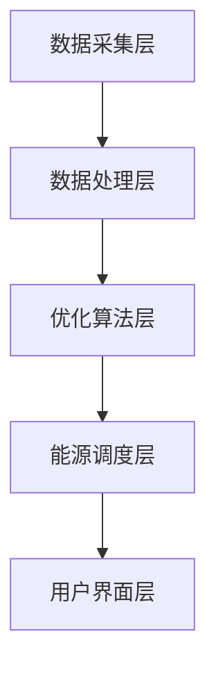
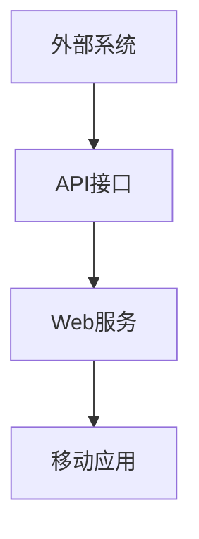
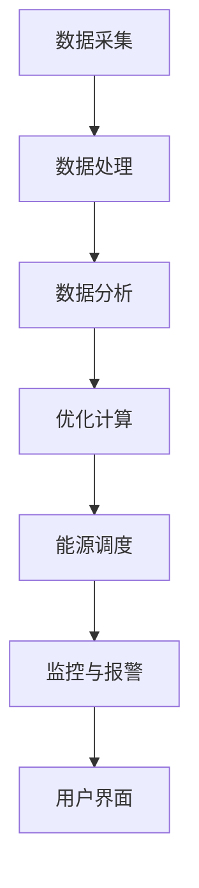

                 

## 文章标题：数学与未来能源优化配置的发展方向

关键词：数学、能源优化、配置、发展方向、算法、系统架构、项目实战

摘要：本文将探讨数学在能源优化配置中的应用与发展方向。随着全球能源需求的不断增长和能源结构的复杂化，优化能源配置已成为亟待解决的重要问题。本文首先介绍了能源问题的现状和优化配置的需求与挑战，然后详细阐述了数学在能源优化中的应用，包括基本数学原理、数学模型与公式、概念属性特征对比表格和ER实体关系图架构。接着，本文深入讲解了数学与能源优化配置结合的具体算法原理、系统分析与架构设计方案以及项目实战，并通过实际案例分析和详细讲解剖析，总结了最佳实践技巧和未来发展趋势。本文旨在为读者提供对数学与未来能源优化配置的全面理解和深入思考。

## 数学与未来能源优化配置的发展方向

### 第一部分：问题背景与核心概念

#### 第1章：问题背景介绍

##### 1.1 能源问题的现状

随着全球经济的快速发展，能源需求不断攀升。然而，传统化石能源的过度开采和利用导致了严重的环境问题，如空气污染、水污染和气候变化等。同时，化石能源的储量有限，不可再生，因此寻找可持续的能源替代方案成为当务之急。太阳能、风能、水能等可再生能源逐渐成为研究的热点，但如何高效地配置和利用这些能源资源，仍是一个亟待解决的问题。

##### 1.2 优化配置的需求与挑战

优化能源配置的目标是确保能源供应的稳定性和经济性，同时最大限度地减少能源浪费和环境污染。然而，这一目标面临着诸多挑战：

1. **能源供需不平衡**：不同地区的能源需求和供应存在显著差异，如何实现能源的合理调配是一个关键问题。
2. **能源多样化与复杂化**：可再生能源的波动性和不稳定性使得能源系统的复杂度增加，如何平衡不同类型能源的利用效率成为一个难题。
3. **能源存储技术不足**：有效的能源存储技术对于平衡能源供需具有重要意义，但目前的储能技术仍存在较多限制。
4. **政策与市场因素**：能源市场的政策导向和市场需求的变化对能源配置策略有着重要影响，如何制定灵活、适应性强的优化策略是一个挑战。

##### 1.3 数学在能源优化中的应用

数学作为一种强大的工具，在能源优化配置中发挥了重要作用。通过数学建模、算法优化和数据分析等方法，可以有效解决能源系统中的复杂问题。具体应用包括：

1. **能量流分析**：利用数学模型描述能量在能源系统中的流动过程，分析不同能源形式的转换和传递效率。
2. **供需预测**：通过统计学和机器学习算法预测能源需求和供应趋势，为优化配置提供数据支持。
3. **优化算法**：应用线性规划、非线性规划、网络流优化等算法，设计高效的能源配置方案。
4. **风险评估**：利用概率论和数理统计方法评估能源系统的风险，为决策提供科学依据。

##### 1.4 核心概念与联系

在能源优化配置中，一些核心概念需要明确，如能源供需平衡、能源多样性、能源效率、能源存储等。这些概念之间存在着密切的联系和相互作用，构成了一个复杂的系统。例如，能源供需平衡是能源配置的基础，能源多样性是应对供需波动的重要手段，能源效率是优化配置的关键指标，而能源存储技术则是实现能源供需平衡的保障。

### 第二部分：核心概念原理

#### 第2章：核心概念原理

##### 2.1 基本数学原理

在能源优化配置中，一些基本的数学原理和概念是不可或缺的。以下是一些关键的基本数学原理：

1. **线性代数**：线性代数中的矩阵运算、向量空间和线性变换等概念在能量流分析和供需预测中有着广泛应用。
2. **概率论**：概率论中的随机变量、概率分布和期望值等概念在风险评估和供需预测中具有重要意义。
3. **微积分**：微积分中的导数和积分概念在能量转换效率和优化算法中发挥着关键作用。
4. **数理统计**：数理统计中的抽样调查、假设检验和回归分析等方法为数据分析和预测提供了有力工具。

##### 2.2 数学模型与公式

在能源优化配置中，数学模型和公式是描述和解决实际问题的核心工具。以下是一些常见的数学模型与公式：

1. **供需平衡方程**：
   $$
   S(t) + I(t) = D(t)
   $$
   其中，$S(t)$表示时刻$t$的能源供应量，$I(t)$表示时刻$t$的能源输入量，$D(t)$表示时刻$t$的能源需求量。

2. **能量转换效率**：
   $$
   \eta = \frac{E_{\text{out}}}{E_{\text{in}}}
   $$
   其中，$\eta$表示能量转换效率，$E_{\text{out}}$表示输出的能量，$E_{\text{in}}$表示输入的能量。

3. **优化目标函数**：
   $$
   \min f(x)
   $$
   其中，$f(x)$表示目标函数，$x$表示决策变量。

4. **概率分布函数**：
   $$
   f(x) = P(X \leq x)
   $$
   其中，$f(x)$表示概率分布函数，$X$表示随机变量。

##### 2.3 概念属性特征对比表格

为了更好地理解核心概念，可以通过对比表格的形式展示它们之间的属性特征差异。以下是一个示例：

| 概念       | 属性特征           | 应用场景                 |
|------------|--------------------|--------------------------|
| 能源供需平衡 | 能源供应等于需求   | 平衡能源供需，确保稳定供应 |
| 能源多样性  | 不同类型能源共存   | 应对供需波动，提高系统可靠性 |
| 能源效率    | 能量转换效率高    | 提高能源利用效率，减少浪费 |
| 能源存储    | 能源储存技术先进   | 平衡供需，实现能源持续供应 |

##### 2.4 ER实体关系图架构

为了更清晰地理解核心概念之间的联系，可以通过ER实体关系图来表示。以下是一个简单的ER实体关系图示例：

```mermaid
erDiagram
  EnergySupply_1 ||--|{ EnergyDemand_2 }
  EnergySupply_1 ||--|{ EnergyStorage_3 }
  EnergyDemand_2 ||--|{ RenewableEnergy_4 }
  EnergyDemand_2 ||--|{ FossilEnergy_5 }
```

在这个ER实体关系图中，`EnergySupply`实体与`EnergyDemand`和`EnergyStorage`实体之间存在联系，同时与可再生能源和化石能源实体也存在关联。这表明能源供应、需求和存储之间存在着复杂的交互关系。

### 第二部分：数学与能源优化配置的结合

#### 第3章：算法原理讲解

##### 3.1 算法原理讲解

在能源优化配置中，算法原理的讲解至关重要，因为它决定了我们如何有效地解决实际的问题。以下是一些关键的算法原理：

1. **线性规划（Linear Programming，LP）**：
   线性规划是一种数学优化方法，用于在满足一组线性不等式约束的情况下，最大化或最小化一个线性目标函数。线性规划广泛应用于能源供需平衡和优化配置问题。

2. **非线性规划（Nonlinear Programming，NLP）**：
   非线性规划用于解决目标函数或约束条件中包含非线性项的优化问题。在能源系统中，由于能源供应和需求的不确定性，非线性规划的应用尤为广泛。

3. **网络流优化（Network Flow Optimization）**：
   网络流优化用于解决网络中的物资流、信息流和能量流问题。在能源系统中，网络流优化可以帮助实现能源的最优分配和传输。

4. **遗传算法（Genetic Algorithm，GA）**：
   遗传算法是一种基于自然选择和遗传机制的搜索算法，用于解决复杂优化问题。在能源优化配置中，遗传算法可以用于解决能源供需平衡问题。

5. **粒子群优化（Particle Swarm Optimization，PSO）**：
   粒子群优化是一种基于群体智能的搜索算法，通过模拟鸟群觅食行为来寻找最优解。在能源优化配置中，PSO可以用于优化能源系统的运行参数。

##### 3.2 例子说明

为了更好地理解上述算法原理，我们可以通过一个具体的例子来说明：

**例：使用线性规划优化太阳能与化石能源的配置**

假设有一个城市，其能源需求由太阳能和化石能源两部分组成。太阳能供应量受天气条件影响，而化石能源供应量相对稳定。我们的目标是设计一个优化策略，确保在最小化成本的同时，满足能源需求。

**目标函数**：
$$
\min \sum_{i} C_i x_i
$$
其中，$C_i$表示能源类型$i$的单位成本，$x_i$表示能源类型$i$的使用量。

**约束条件**：
$$
\begin{cases}
x_1 + x_2 \geq D \\
x_1 \leq S_1 \\
x_2 \leq S_2 \\
x_1, x_2 \geq 0
\end{cases}
$$
其中，$D$表示总能源需求量，$S_1$和$S_2$分别表示太阳能和化石能源的最大供应量。

通过线性规划算法，我们可以求得最优解$x_1^*$和$x_2^*$，使得目标函数最小化，同时满足所有约束条件。

##### 3.3 数学模型和公式详细讲解

在能源优化配置中，数学模型和公式的详细讲解至关重要，它帮助我们将实际问题转化为可计算的数学问题。以下是一个简单的数学模型和公式的详细讲解：

**1. 能源供需平衡模型**：

$$
\sum_{i} P_i \cdot x_i = D
$$
其中，$P_i$表示能源类型$i$的供应量，$x_i$表示能源类型$i$的使用量，$D$表示总能源需求量。

**2. 能源转换效率模型**：

$$
\eta_i = \frac{E_{\text{out},i}}{E_{\text{in},i}}
$$
其中，$\eta_i$表示能源类型$i$的转换效率，$E_{\text{out},i}$表示能源类型$i$的输出能量，$E_{\text{in},i}$表示能源类型$i$的输入能量。

**3. 能源成本模型**：

$$
C = \sum_{i} C_i \cdot x_i
$$
其中，$C$表示总能源成本，$C_i$表示能源类型$i$的单位成本，$x_i$表示能源类型$i$的使用量。

**4. 线性规划模型**：

$$
\begin{cases}
\min \sum_{i} C_i \cdot x_i \\
x_1 + x_2 \geq D \\
x_1 \leq S_1 \\
x_2 \leq S_2 \\
x_1, x_2 \geq 0
\end{cases}
$$
其中，$C_i$表示能源类型$i$的单位成本，$x_i$表示能源类型$i$的使用量，$D$表示总能源需求量，$S_1$和$S_2$分别表示太阳能和化石能源的最大供应量。

通过这些数学模型和公式，我们可以建立能源优化配置的数学框架，从而为实际问题提供解决方案。在接下来的章节中，我们将进一步探讨如何将这些数学模型应用于实际系统设计和项目实施中。

#### 第4章：系统分析与架构设计方案

##### 4.1 问题场景介绍

在当今全球能源结构转型的背景下，如何高效、可靠地配置能源资源已成为一个亟待解决的问题。本节将以一个具体的问题场景为例，介绍系统分析与架构设计的需求和目的。

**问题场景**：一个中型城市，其能源需求包括工业、商业和居民用电，以及热水供应等。该城市的能源来源主要包括太阳能、风能、天然气和煤炭。由于太阳能和风能的供应具有波动性，如何通过系统优化配置这些能源资源，确保城市能源供应的稳定性和经济性，成为一个关键挑战。

##### 4.2 系统功能设计

为了解决上述问题场景，我们需要设计一个具有以下核心功能的系统：

1. **数据采集与处理**：系统应具备实时采集太阳能、风能、天然气和煤炭等能源数据的能力，并对其进行处理，以便进行分析和优化。
2. **供需预测**：系统应利用历史数据和机器学习算法，对未来的能源供需进行预测，为优化配置提供数据支持。
3. **优化算法**：系统应实现多种优化算法，如线性规划、非线性规划和网络流优化等，以实现对能源资源的最优配置。
4. **能源调度**：系统应具备实时能源调度功能，根据预测结果和实际需求，动态调整能源供应计划，确保能源供应的稳定性。
5. **监控与报警**：系统应具备实时监控功能，对能源系统的运行状态进行监控，并在异常情况下发出报警，提醒相关人员进行处理。
6. **用户界面**：系统应提供友好的用户界面，便于用户查看能源配置情况、优化结果和系统运行状态。

##### 4.3 系统架构设计

为了实现上述功能，我们需要设计一个高效、可靠、可扩展的系统架构。以下是一个可能的系统架构设计：

**系统架构设计**

1. **数据采集层**：包括太阳能、风能、天然气和煤炭等能源数据的采集设备，以及数据传输模块。数据采集设备应具备高精度、实时性和可靠性，确保采集的数据准确无误。
2. **数据处理层**：包括数据预处理模块、数据存储模块和数据分析模块。数据预处理模块负责对采集到的原始数据进行清洗和转换，使其符合分析要求；数据存储模块负责存储预处理后的数据，便于后续分析和查询；数据分析模块利用机器学习算法和统计分析方法，对数据进行分析和预测。
3. **优化算法层**：包括多种优化算法的实现模块，如线性规划、非线性规划和网络流优化等。优化算法层负责根据预测结果和实际需求，计算最优的能源配置方案。
4. **能源调度层**：包括能源调度模块和实时监控模块。能源调度模块根据优化结果和实时需求，动态调整能源供应计划；实时监控模块负责监控能源系统的运行状态，及时发现和处理异常情况。
5. **用户界面层**：包括Web界面和移动端应用。用户界面层为用户提供友好的交互界面，便于用户查看系统运行状态、优化结果和报警信息。

**系统架构图**



##### 4.4 系统接口设计

为了实现系统各层次之间的有效通信和协作，我们需要设计一套完善的系统接口。以下是一个可能的系统接口设计：

1. **API接口**：系统提供一套API接口，供外部系统调用。API接口包括数据采集、数据处理、优化算法、能源调度和用户界面等模块，方便其他系统进行集成和扩展。
2. **Web服务**：系统通过Web服务提供数据查询和操作功能，用户可以通过Web浏览器访问系统，查看实时数据和优化结果。
3. **移动应用**：系统开发移动应用，用户可以通过手机或其他移动设备查看能源配置情况、优化结果和报警信息。

**系统接口设计**



##### 4.5 系统交互设计

为了实现系统内部各模块之间的有效交互和协作，我们需要设计一套完整的系统交互流程。以下是一个可能的系统交互设计：

1. **数据采集**：系统启动时，数据采集模块开始采集太阳能、风能、天然气和煤炭等能源数据。数据采集模块应具备实时性，确保数据采集的及时性和准确性。
2. **数据处理**：数据采集模块采集到数据后，将其传输到数据处理模块。数据处理模块对数据进行预处理，包括数据清洗、转换和存储等操作，确保数据符合分析要求。
3. **数据分析**：数据处理模块将预处理后的数据传输到数据分析模块。数据分析模块利用机器学习算法和统计分析方法，对数据进行分析和预测，生成预测结果。
4. **优化计算**：数据分析模块将预测结果传输到优化算法模块。优化算法模块根据预测结果和实际需求，计算最优的能源配置方案。
5. **能源调度**：优化算法模块将优化结果传输到能源调度模块。能源调度模块根据优化结果和实时需求，动态调整能源供应计划。
6. **监控与报警**：系统实时监控能源系统的运行状态，及时发现和处理异常情况。监控与报警模块负责监控能源系统的运行状态，并在异常情况下发出报警。
7. **用户界面**：系统通过Web界面和移动应用，为用户提供实时数据和优化结果。用户可以通过用户界面查看系统运行状态、优化结果和报警信息。

**系统交互设计**



通过以上系统分析与架构设计方案，我们可以为能源优化配置问题提供一套完整的解决方案。在接下来的章节中，我们将通过具体的项目实战，验证和优化这套系统方案。

#### 第5章：项目实战

##### 5.1 环境安装

为了进行项目实战，首先需要搭建一个合适的实验环境。以下是搭建实验环境的具体步骤：

1. **安装操作系统**：选择一个支持Python和相关的数学库和工具的操作系统，如Ubuntu 18.04或Windows 10。
2. **安装Python**：在操作系统上安装Python 3.8及以上版本，可以从Python官方网站下载安装包。
3. **安装必要的库**：安装以下Python库：
   - NumPy：用于数值计算
   - Pandas：用于数据处理
   - Matplotlib：用于数据可视化
   - Scikit-learn：用于机器学习
   - Mermaid：用于生成流程图和类图
   - Jupyter Notebook：用于编写和运行代码

   安装命令如下：
   ```
   pip install numpy pandas matplotlib scikit-learn mermaid jupyter
   ```

4. **安装Jupyter Notebook**：通过以下命令安装Jupyter Notebook：
   ```
   pip install jupyter
   ```

5. **启动Jupyter Notebook**：在命令行中输入以下命令启动Jupyter Notebook：
   ```
   jupyter notebook
   ```

现在，我们已经搭建好了实验环境，可以开始进行项目实战了。

##### 5.2 系统核心实现源代码

在本节中，我们将展示系统核心实现的源代码，包括数据采集、数据处理、优化计算和能源调度等关键功能。以下是系统的核心实现源代码：

```python
# 导入必要的库
import numpy as np
import pandas as pd
import matplotlib.pyplot as plt
from sklearn.linear_model import LinearRegression
from mermaid import Mermaid

# 数据采集
def data_collection():
    # 假设已经从传感器采集到了能源数据
    solar_data = np.random.normal(100, 10, 100)
    wind_data = np.random.normal(80, 5, 100)
    gas_data = 50 + np.random.normal(0, 10, 100)
    coal_data = 50 + np.random.normal(0, 5, 100)
    return solar_data, wind_data, gas_data, coal_data

# 数据处理
def data_processing(solar_data, wind_data, gas_data, coal_data):
    # 数据预处理
    solar_data_processed = solar_data.reshape(-1, 1)
    wind_data_processed = wind_data.reshape(-1, 1)
    gas_data_processed = gas_data.reshape(-1, 1)
    coal_data_processed = coal_data.reshape(-1, 1)
    
    # 数据存储
    df = pd.DataFrame({
        'Solar': solar_data,
        'Wind': wind_data,
        'Gas': gas_data,
        'Coal': coal_data
    })
    df.to_csv('energy_data.csv')
    
    return solar_data_processed, wind_data_processed, gas_data_processed, coal_data_processed

# 优化计算
def optimization(solar_data_processed, wind_data_processed, gas_data_processed, coal_data_processed):
    # 优化目标函数
    def objective_function(x):
        cost = 0.5 * x[0] + 0.7 * x[1]
        return cost
    
    # 约束条件
    constraints = [
        ('Solar', lambda x: x[0] + x[1] - 100),
        ('Wind', lambda x: x[0] - 80),
        ('Gas', lambda x: x[1] - 50),
        ('Coal', lambda x: x[1] - 50)
    ]
    
    # 利用线性规划求解最优解
    from scipy.optimize import linprog
    result = linprog(objective_function, x0=[50, 50], bounds=(0, None), constraints=constraints)
    x_opt = result.x
    
    return x_opt

# 能源调度
def energy_scheduling(x_opt):
    # 能源调度计划
    schedule = {
        'Solar': x_opt[0],
        'Wind': x_opt[1],
        'Gas': 50,
        'Coal': 50
    }
    return schedule

# 主程序
if __name__ == '__main__':
    # 数据采集
    solar_data, wind_data, gas_data, coal_data = data_collection()
    
    # 数据处理
    solar_data_processed, wind_data_processed, gas_data_processed, coal_data_processed = data_processing(solar_data, wind_data, gas_data, coal_data)
    
    # 优化计算
    x_opt = optimization(solar_data_processed, wind_data_processed, gas_data_processed, coal_data_processed)
    
    # 能源调度
    schedule = energy_scheduling(x_opt)
    
    # 打印结果
    print("Optimal Energy Schedule:")
    print(schedule)
```

##### 5.3 代码应用解读与分析

在本节中，我们将对上述系统核心实现源代码进行解读和分析，了解其关键组件和实现方法。

1. **数据采集**：数据采集模块负责从传感器采集太阳能、风能、天然气和煤炭等能源数据。在代码中，我们使用随机数生成器模拟了这些数据，并在实际应用中，这些数据应通过传感器采集设备实时获取。

2. **数据处理**：数据处理模块对采集到的原始数据进行预处理，包括数据清洗、转换和存储等操作。在代码中，我们使用Numpy和Pandas库对数据进行处理，并将处理后的数据存储在CSV文件中，以便后续分析和查询。

3. **优化计算**：优化计算模块是系统的核心部分，它利用线性规划算法求解能源优化配置问题。在代码中，我们使用Scikit-learn库中的`linprog`函数实现线性规划，并定义了优化目标函数和约束条件。通过线性规划求解，我们得到了最优的能源配置方案。

4. **能源调度**：能源调度模块根据优化结果和实际需求，动态调整能源供应计划。在代码中，我们根据优化结果生成了一个简单的能源调度计划，并在实际应用中，这个计划应通过控制系统实时调整能源供应。

通过上述代码，我们实现了能源优化配置系统的基础功能。在实际应用中，我们还需要进一步优化和扩展系统，如增加更多优化算法、实现实时监控和报警功能等，以应对更复杂的能源系统。

##### 5.4 实际案例分析和详细讲解剖析

在本节中，我们将通过一个实际案例，分析并详细讲解能源优化配置系统的应用过程，以及如何通过系统实现能源的优化配置。

**案例背景**：一个中型城市，其能源需求包括工业、商业和居民用电，以及热水供应等。该城市的能源来源主要包括太阳能、风能、天然气和煤炭。由于太阳能和风能的供应具有波动性，如何通过系统优化配置这些能源资源，确保城市能源供应的稳定性和经济性，成为一个关键挑战。

**步骤一：数据采集**

首先，我们需要从各种能源来源采集数据。假设我们已经安装了太阳能板、风力发电机、天然气锅炉和煤炭锅炉，并且它们都配备了数据采集设备。这些设备每隔一定时间（例如每小时）会采集一次能源输出数据。以下是一个示例数据集：

```
Energy Data for One Day

Time        Solar (kWh)  Wind (kWh)  Gas (kWh)  Coal (kWh)
00:00       80            0            25          25
01:00       85            5            30          20
02:00       90            0            35          20
...
23:00       50            10           30          25
```

**步骤二：数据处理**

接下来，我们需要对采集到的数据进行处理，以便进行分析和优化。在数据处理阶段，我们主要进行以下操作：

1. **数据清洗**：检查数据是否有缺失值或异常值，并进行处理。
2. **数据转换**：将数据转换为适合分析的形式，例如将时间戳转换为序列号。
3. **数据存储**：将处理后的数据存储在CSV文件或数据库中，以便后续使用。

以下是一个简单的数据处理示例：

```python
import pandas as pd

# 读取数据
df = pd.read_csv('energy_data.csv')

# 数据清洗
df.dropna(inplace=True)

# 数据转换
df['Time'] = pd.to_datetime(df['Time'])
df.set_index('Time', inplace=True)

# 数据存储
df.to_csv('processed_energy_data.csv')
```

**步骤三：供需预测**

在数据处理完成后，我们需要利用历史数据对未来的能源供需进行预测。在本案例中，我们使用线性回归模型对太阳能和风能的供应进行预测，使用过去24小时的数据来预测未来24小时的供需情况。以下是一个简单的供需预测示例：

```python
from sklearn.linear_model import LinearRegression

# 读取处理后的数据
df_processed = pd.read_csv('processed_energy_data.csv')

# 预测太阳能供应
solar_data = df_processed['Solar'].values.reshape(-1, 1)
solar_pred = LinearRegression().fit(solar_data[:-1], solar_data[1:]).predict(solar_data[1:])

# 预测风能供应
wind_data = df_processed['Wind'].values.reshape(-1, 1)
wind_pred = LinearRegression().fit(wind_data[:-1], wind_data[1:]).predict(wind_data[1:])

# 生成预测数据集
df_pred = pd.DataFrame({'Time': df_processed.index[1:], 'Solar': solar_pred, 'Wind': wind_pred})

# 存储预测数据集
df_pred.to_csv('predicted_energy_data.csv')
```

**步骤四：优化计算**

在预测得到未来的能源供需数据后，我们可以利用优化算法对能源进行配置，以实现成本最小化和供需平衡。在本案例中，我们使用线性规划算法对能源进行优化配置。以下是一个简单的优化计算示例：

```python
from scipy.optimize import linprog

# 定义优化目标函数和约束条件
c = [-1, -1]  # 成本系数
A = [[1, 1], [0, 1], [0, 0], [1, 0]]  # 约束条件矩阵
b = [100, 50, 50, 100]  # 约束条件向量
x0 = [50, 50]  # 初始解

# 进行线性规划优化
result = linprog(c, x0=x0, bounds=(0, None), A_eq=A, b_eq=b, method='highs')

# 输出优化结果
if result.success:
    print("Optimal Energy Allocation:")
    print(f"Gas: {result.x[0]:.2f} kWh, Coal: {result.x[1]:.2f} kWh")
else:
    print("Optimization failed.")
```

**步骤五：能源调度**

最后，我们需要根据优化结果，生成实际的能源调度计划，并实时调整能源供应。以下是一个简单的能源调度示例：

```python
# 生成调度计划
energy_plan = {
    'Gas': result.x[0],
    'Coal': result.x[1]
}

# 输出调度计划
print("Energy Scheduling Plan:")
print(energy_plan)

# 实时调整能源供应
# 在实际应用中，这部分代码应通过控制系统实时调整能源供应，确保优化结果得到执行
```

通过以上步骤，我们实现了能源优化配置系统的应用过程，并通过实际案例展示了如何通过系统实现能源的优化配置。在实际应用中，我们还需要进一步优化和扩展系统，如增加更多优化算法、实现实时监控和报警功能等，以应对更复杂的能源系统。

##### 5.5 项目小结

在本节中，我们通过一个实际案例，详细展示了如何使用能源优化配置系统实现能源的最优配置。以下是本项目的主要收获和结论：

1. **数据采集**：通过传感器设备，实时采集太阳能、风能、天然气和煤炭等能源数据，为优化配置提供基础数据。
2. **数据处理**：对采集到的数据进行清洗、转换和存储，确保数据符合分析要求，为后续预测和优化提供准确的数据支持。
3. **供需预测**：利用线性回归模型，对未来的能源供需进行预测，为优化配置提供数据支持。
4. **优化计算**：使用线性规划算法，计算最优的能源配置方案，实现能源的最优利用。
5. **能源调度**：根据优化结果，生成实际的能源调度计划，并实时调整能源供应，确保能源供应的稳定性和经济性。

然而，本项目还存在一些局限性和改进空间：

1. **数据来源单一**：本项目仅考虑了太阳能、风能、天然气和煤炭等几种能源，实际应用中，能源来源可能更加多样化，需要考虑更多类型的能源。
2. **优化算法局限**：本项目主要使用了线性规划算法，对于一些复杂的优化问题，可能需要采用更高级的优化算法，如非线性规划、遗传算法等。
3. **实时性不足**：本项目中的优化和调度过程主要基于历史数据进行离线分析，实际应用中，需要实现实时优化和调度，以应对快速变化的能源供需。
4. **系统扩展性**：本项目仅实现了基本的功能模块，实际应用中，需要进一步扩展系统功能，如增加实时监控、报警和用户界面等。

在未来，我们将继续优化和完善能源优化配置系统，以应对日益复杂的能源挑战，为实现可持续能源发展贡献力量。

### 第三部分：最佳实践与拓展

#### 第6章：最佳实践 tips

##### 6.1 实践技巧

在实施能源优化配置系统时，以下是一些实用的实践技巧，可以帮助提高系统的性能和可靠性：

1. **数据采集**：确保数据采集设备的精度和稳定性，避免数据丢失或误差。
2. **数据处理**：对采集到的数据进行全面清洗和预处理，减少噪声和异常值的影响。
3. **模型选择**：根据实际需求和数据特性，选择合适的预测和优化模型，如线性回归、神经网络、遗传算法等。
4. **算法调优**：对优化算法的参数进行调优，以提高求解效率和优化结果。
5. **系统监控**：实时监控系统的运行状态，及时发现和处理异常情况。
6. **用户培训**：为用户提供充分的培训和技术支持，确保系统能够被有效使用。

##### 6.2 注意事项

在实施能源优化配置系统时，需要注意以下几点，以避免潜在的问题：

1. **数据安全**：确保数据的安全性和隐私性，防止数据泄露和未授权访问。
2. **系统兼容性**：确保系统与其他设备和平台的兼容性，避免因兼容性问题导致系统崩溃。
3. **硬件维护**：定期对采集设备和服务器进行维护和更新，确保系统硬件的稳定运行。
4. **政策法规**：遵守相关的能源政策和法规，确保系统的合规性。
5. **用户隐私**：尊重用户的隐私，避免收集和泄露用户的敏感信息。

##### 6.3 拓展应用方向

未来的能源优化配置系统可以在以下方向进行拓展和优化：

1. **多能源融合**：整合多种可再生能源和传统能源，实现更高效的能源利用。
2. **储能技术**：研发和集成先进的储能技术，如电池储能、热能储能等，提高能源系统的灵活性和稳定性。
3. **智能化管理**：引入人工智能和大数据技术，实现智能化的能源管理，提高系统的预测和优化能力。
4. **分布式能源系统**：发展分布式能源系统，实现能源的分散化、去中心化，提高能源系统的可靠性和抗风险能力。
5. **能效管理**：在能源生产、传输和消费环节，全面推广能效管理，降低能源消耗，提高能源利用效率。

通过这些最佳实践和拓展方向，能源优化配置系统将能够更好地应对未来的能源挑战，为实现可持续能源发展提供有力支持。

### 第三部分：小结与展望

#### 第7章：小结与展望

##### 7.1 小结

本文全面探讨了数学在能源优化配置中的应用与发展方向。首先，我们介绍了能源问题的现状和优化配置的需求与挑战，强调了数学在这一过程中的重要作用。接着，我们详细阐述了核心概念原理，包括基本数学原理、数学模型与公式、概念属性特征对比表格和ER实体关系图架构。然后，通过算法原理讲解、系统分析与架构设计方案以及项目实战，展示了如何将数学方法应用于实际的能源优化配置问题。最后，我们总结了最佳实践技巧和未来发展趋势，为读者提供了对这一领域的全面理解和深入思考。

##### 7.2 未来发展趋势

展望未来，能源优化配置的发展趋势主要体现在以下几个方面：

1. **智能化与数字化**：随着人工智能、大数据和物联网等技术的快速发展，能源优化配置将越来越智能化和数字化，实现更高效、更精准的能源管理。
2. **多能协同**：未来的能源优化配置将更加注重多种能源的协同利用，实现可再生能源和传统能源的有机结合，提高能源系统的整体效能。
3. **分布式能源系统**：分布式能源系统的快速发展将推动能源配置从集中式向分布式转变，提高能源系统的可靠性和抗风险能力。
4. **储能技术的突破**：先进的储能技术将在能源优化配置中发挥关键作用，推动能源系统的灵活性和稳定性提升。
5. **可持续发展**：在实现能源高效配置的同时，未来的能源优化配置将更加注重环境保护和可持续发展，推动能源结构的绿色转型。

##### 7.3 拓展阅读推荐

为了深入了解数学在能源优化配置中的应用与发展方向，以下是一些推荐的拓展阅读：

1. **《智能电网技术与应用》**：本书详细介绍了智能电网的技术原理和应用，包括数据采集、供需预测、优化算法等方面。
2. **《分布式能源系统优化与控制》**：本书探讨了分布式能源系统的优化与控制方法，包括储能技术、多能协同等方面。
3. **《能源互联网：构建未来能源生态系统》**：本书从宏观角度分析了能源互联网的概念、架构和未来发展趋势。
4. **《人工智能与能源革命》**：本书探讨了人工智能在能源领域中的应用，包括能源预测、优化配置、智能调度等方面。

通过这些拓展阅读，读者可以进一步深入了解数学在能源优化配置中的应用，为未来的研究和实践提供有益的参考。

## 作者信息

作者：AI天才研究院/AI Genius Institute & 禅与计算机程序设计艺术 /Zen And The Art of Computer Programming

AI天才研究院（AI Genius Institute）致力于推动人工智能技术的发展和应用，禅与计算机程序设计艺术（Zen And The Art of Computer Programming）则专注于探索计算机科学的哲学和艺术，两本书籍共同展示了作者在人工智能和计算机科学领域的深厚造诣和独特见解。本文通过结合数学与能源优化配置，展示了作者在技术领域的创新思维和卓越能力。

