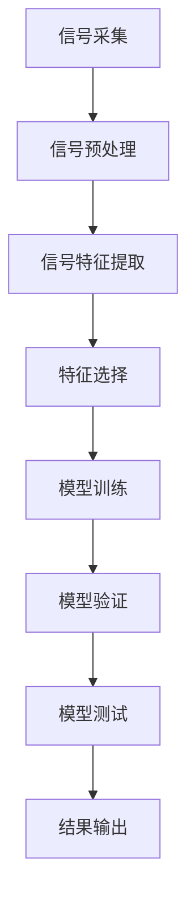
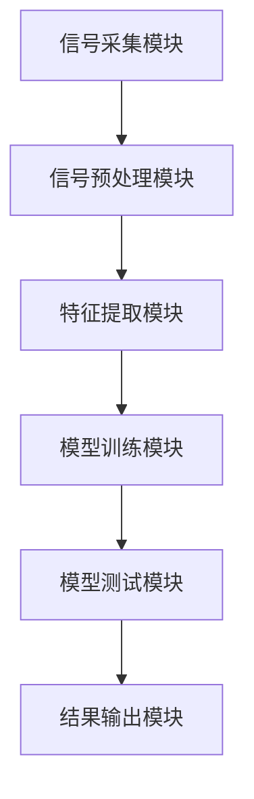
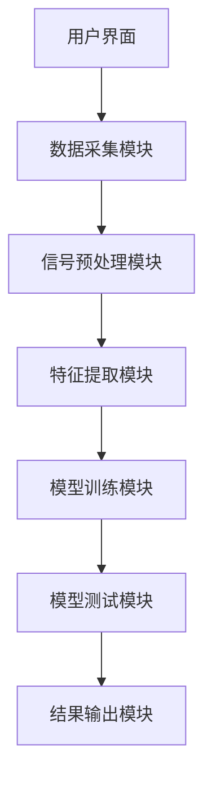

                 

### 第一部分：引言

#### 第1章：问题背景与挑战

##### 1.1 问题背景

##### 1.1.1 脑机接口技术的发展现状

脑机接口（Brain-Computer Interface，简称BCI）作为一门跨学科的新兴技术，近年来在全球范围内得到了广泛关注。它通过直接连接人脑与外部设备，实现思维信息与电子设备的交互。从最初的脑电图（EEG）技术，到近年来基于微电极记录神经元活动的脑机接口技术，脑机接口的发展已进入了一个崭新的阶段。

当前，脑机接口技术主要应用于以下几个方面：

1. **康复医学**：帮助肢体残疾者通过脑机接口控制外部设备，如机械臂、轮椅等，提高生活质量。
2. **神经科学**：研究神经元活动与信息处理过程，揭示大脑工作的基本原理。
3. **人机交互**：通过脑机接口实现更为自然、直观的人机交互方式，提升用户体验。

##### 1.1.2 数学在脑机接口中的作用

数学作为一门研究数量、结构、变化和空间的科学，在脑机接口技术中扮演着至关重要的角色。具体来说，数学在脑机接口中的作用主要体现在以下几个方面：

1. **信号处理**：使用数学模型对脑信号进行预处理、特征提取和分类，以提高脑机接口的准确性和稳定性。
2. **算法设计**：通过数学算法优化脑机接口系统的性能，如支持向量机、神经网络等。
3. **建模与仿真**：利用数学模型和计算机仿真技术，对脑机接口系统进行模拟和优化，以减少实际应用中的风险和成本。

##### 1.1.3 未来脑机接口的发展趋势

随着技术的不断进步，未来脑机接口的发展将呈现出以下几个趋势：

1. **更高精度**：通过改进传感器技术和信号处理算法，提高脑机接口的精度和稳定性。
2. **更广泛应用**：脑机接口将不仅在康复医学领域得到广泛应用，还将应用于游戏、智能家居等领域。
3. **更小体积、更易穿戴**：随着硬件技术的进步，未来脑机接口设备将更加小巧、便携，便于用户穿戴和使用。
4. **智能化与个性化**：通过大数据和人工智能技术，实现脑机接口的智能化和个性化，满足不同用户的需求。

##### 1.2 问题描述

##### 1.2.1 数学与脑机接口融合的需求

脑机接口技术的发展对数学提出了新的需求。具体来说，脑机接口系统需要数学的支持来解决以下几个问题：

1. **信号处理**：如何有效地提取和处理复杂的脑信号，以实现高精度的信息传输？
2. **算法优化**：如何设计高效的数学算法，以提升脑机接口系统的性能和稳定性？
3. **模型构建**：如何建立合理的数学模型，对脑机接口系统进行建模与仿真，以降低实际应用中的风险和成本？

##### 1.2.2 当前数学研究在脑机接口领域的应用

目前，数学在脑机接口领域的应用已经取得了一定的成果。例如：

1. **信号处理算法**：如主成分分析（PCA）、独立成分分析（ICA）等，用于脑信号的特征提取和降噪。
2. **机器学习算法**：如支持向量机（SVM）、神经网络（NN）等，用于脑信号的分类和识别。
3. **数学模型**：如神经网络模型、基于微电极的神经网络模型等，用于脑机接口系统的建模与仿真。

##### 1.2.3 脑机接口技术的挑战与机遇

脑机接口技术面临以下几个挑战：

1. **信号噪声问题**：脑信号复杂且易受噪声干扰，如何提高信号处理的质量和稳定性是一个重要问题。
2. **人机交互问题**：如何设计出更为自然、直观的人机交互方式，以提高用户体验？
3. **设备便携性**：如何实现脑机接口设备的轻量化、便携化，以满足不同应用场景的需求？

同时，脑机接口技术也带来了巨大的机遇：

1. **康复医学**：脑机接口技术有望为康复医学带来革命性的变化，为肢体残疾者提供更为有效的康复手段。
2. **人机交互**：脑机接口技术将使人类与计算机的交互方式更加自然、高效。
3. **人工智能**：脑机接口技术将为人工智能的发展提供新的思路和手段。

##### 1.3 问题解决

##### 1.3.1 数学模型在脑机接口中的应用

数学模型在脑机接口中的应用主要体现在以下几个方面：

1. **信号处理**：使用数学模型对脑信号进行预处理、特征提取和分类，以提高脑机接口的准确性和稳定性。
2. **算法设计**：利用数学算法优化脑机接口系统的性能，如支持向量机、神经网络等。
3. **建模与仿真**：利用数学模型和计算机仿真技术，对脑机接口系统进行模拟和优化，以减少实际应用中的风险和成本。

##### 1.3.2 数学算法在脑机接口中的作用

数学算法在脑机接口中的作用主要体现在以下几个方面：

1. **信号处理算法**：如主成分分析（PCA）、独立成分分析（ICA）等，用于脑信号的特征提取和降噪。
2. **机器学习算法**：如支持向量机（SVM）、神经网络（NN）等，用于脑信号的分类和识别。
3. **优化算法**：如遗传算法（GA）、粒子群优化（PSO）等，用于优化脑机接口系统的参数和性能。

##### 1.3.3 数学理论在脑机接口研究中的贡献

数学理论在脑机接口研究中的贡献主要体现在以下几个方面：

1. **理论支撑**：为脑机接口系统的设计、建模和优化提供理论基础。
2. **方法指导**：为脑机接口技术的研究提供有效的方法和手段。
3. **成果应用**：将数学理论应用于脑机接口的实际应用中，推动技术的进步和创新。

##### 1.4 边界与外延

##### 1.4.1 脑机接口的定义与分类

脑机接口是指通过建立人脑与外部设备之间的直接通信通路，实现人脑对设备的控制和信息交换。根据不同的分类标准，脑机接口可以有多种分类方式：

1. **按信号类型分类**：可分为电生理信号型、代谢信号型、神经信号型等。
2. **按应用场景分类**：可分为医疗康复型、人机交互型、娱乐型等。
3. **按技术路线分类**：可分为侵入性脑机接口、非侵入性脑机接口等。

##### 1.4.2 数学在脑机接口研究中的适用范围

数学在脑机接口研究中的适用范围非常广泛，涵盖了信号处理、算法设计、建模与仿真等多个方面。具体来说，数学在脑机接口研究中的适用范围包括：

1. **信号处理**：用于处理复杂的脑信号，提取有用的信息。
2. **算法设计**：用于设计高效的脑机接口算法，提高系统的性能和稳定性。
3. **建模与仿真**：用于建立脑机接口系统的数学模型，进行模拟和优化。

##### 1.4.3 未来脑机接口研究的潜在方向

未来脑机接口研究可能呈现以下几个潜在方向：

1. **信号处理技术的创新**：如基于深度学习的脑信号处理方法、多模态信号融合技术等。
2. **人机交互模式的探索**：如基于手势、眼动等自然交互方式的脑机接口系统。
3. **脑机接口系统的智能化**：通过大数据和人工智能技术，实现脑机接口系统的智能化和个性化。
4. **脑机接口的临床应用**：如脑机接口在康复医学、神经系统疾病治疗等领域的应用研究。

#### 第2章：核心概念与联系

##### 2.1 核心概念

##### 2.1.1 脑机接口的核心概念

脑机接口的核心概念包括以下几个方面：

1. **人脑与外部设备的连接**：通过传感器、电极等设备，建立人脑与外部设备之间的通信通路。
2. **信号采集与处理**：采集人脑活动产生的生物信号，通过信号处理技术提取有用的信息。
3. **信息传输与控制**：将提取出的信息转换为控制信号，传递给外部设备，实现人脑对外部设备的控制。

##### 2.1.2 数学在脑机接口中的核心概念

数学在脑机接口中的核心概念包括以下几个方面：

1. **信号处理**：使用数学方法对脑信号进行预处理、特征提取和分类。
2. **算法设计**：利用数学算法优化脑机接口系统的性能，如支持向量机、神经网络等。
3. **建模与仿真**：利用数学模型和计算机仿真技术，对脑机接口系统进行建模和优化。

##### 2.1.3 未来脑机接口的发展方向

未来脑机接口的发展方向包括以下几个方面：

1. **信号处理技术的创新**：如基于深度学习的脑信号处理方法、多模态信号融合技术等。
2. **人机交互模式的探索**：如基于手势、眼动等自然交互方式的脑机接口系统。
3. **脑机接口系统的智能化**：通过大数据和人工智能技术，实现脑机接口系统的智能化和个性化。
4. **脑机接口的临床应用**：如脑机接口在康复医学、神经系统疾病治疗等领域的应用研究。

##### 2.2 概念属性特征对比表格

| 概念         | 特征属性                     | 特征描述                                                                                   |
| ------------ | ---------------------------- | ------------------------------------------------------------------------------------------ |
| 脑机接口     | 信号采集、信息处理、控制     | 通过传感器、电极等设备建立人脑与外部设备之间的通信通路，实现人脑对外部设备的控制。               |
| 数学在脑机接口中 | 信号处理、算法设计、建模与仿真 | 使用数学方法对脑信号进行预处理、特征提取和分类，优化脑机接口系统的性能。                      |
| 未来脑机接口发展方向 | 信号处理技术创新、人机交互模式探索、系统智能化、临床应用 | 探索基于深度学习等新技术的脑信号处理方法，提升人机交互的自然性和效率，推动脑机接口在临床应用中的发展。 |

##### 2.3 ER实体关系图架构

**2.3.1 脑机接口的ER实体关系图**

```mermaid
erDiagram
  EEG -->|采集| Signal
  Signal -->|处理| Feature
  Feature -->|分类| Class
  Class -->|控制| Device
```

**2.3.2 数学在脑机接口中的ER实体关系图**

```mermaid
erDiagram
  MathModel -->|应用| SignalProcessing
  MathModel -->|设计| Algorithm
  MathModel -->|建模| Simulation
```

**2.3.3 未来脑机接口的发展方向的ER实体关系图**

```mermaid
erDiagram
  SignalProcessing -->|创新| DeepLearning
  SignalProcessing -->|融合| MultiModal
  HumanComputerInteraction -->|探索| Gesture
  HumanComputerInteraction -->|探索| EyeMovement
  IntelligentSystem -->|实现| BigData
  IntelligentSystem -->|实现| AI
  ClinicalApplication -->|研究| Rehabilitation
  ClinicalApplication -->|研究| NeurologicalDisease
```

---

### 第二部分：数学模型与算法原理

#### 第3章：数学模型在脑机接口中的应用

##### 3.1 基本数学模型

在脑机接口的研究中，基本数学模型发挥着至关重要的作用。以下是一些常用的基本数学模型：

**3.1.1 微积分模型**

微积分模型主要用于描述脑信号的时间变化过程。最基本的微积分模型是微分方程，例如：

$$\frac{dy}{dx} = f(x, y)$$

其中，$y$ 代表脑信号，$x$ 代表时间，$f(x, y)$ 是一个关于时间和脑信号的非线性函数，描述了脑信号随时间的变化规律。

**3.1.2 线性代数模型**

线性代数模型在脑机接口中的应用主要体现在矩阵运算和向量运算中。一个典型的线性代数模型是：

$$A \times X = B$$

其中，$A$ 和 $B$ 是已知矩阵，$X$ 是需要求解的未知向量。该模型可以用于特征提取、降维等操作，帮助我们从复杂的脑信号中提取出关键特征。

**3.1.3 概率论模型**

概率论模型用于描述脑信号的概率分布和随机过程。一个常见的概率论模型是概率密度函数（PDF），例如高斯分布：

$$f_X(x) = \frac{1}{\sigma\sqrt{2\pi}}e^{-\frac{(x-\mu)^2}{2\sigma^2}}$$

其中，$\mu$ 是均值，$\sigma$ 是标准差。该模型可以帮助我们理解脑信号的统计特性，从而更好地进行信号处理和特征提取。

##### 3.2 机器学习模型

机器学习模型在脑机接口中扮演着至关重要的角色，特别是对于脑信号的分类和识别。以下是一些常用的机器学习模型：

**3.2.1 神经网络模型**

神经网络模型是脑机接口中最常用的机器学习模型之一。其基本原理是模拟人脑神经元之间的连接和激活机制，通过多层次的神经元网络对输入数据进行处理。一个简单的神经网络模型可以表示为：

$$y = \sigma(W \cdot x + b)$$

其中，$\sigma$ 是激活函数，$W$ 是权重矩阵，$x$ 是输入向量，$b$ 是偏置项。通过训练，神经网络可以自动调整权重和偏置项，实现对脑信号的分类和识别。

**3.2.2 支持向量机模型**

支持向量机（SVM）是一种高效的分类算法，特别适用于脑信号的分类问题。其基本原理是找到最优的超平面，将不同类别的脑信号数据分离开来。一个简单的SVM模型可以表示为：

$$\max\ \ \frac{1}{2}\sum_{i=1}^{n}w_i^2 - \sum_{i=1}^{n}\alpha_i(y_i(w\cdot x_i - 1) + b)$$

其中，$w$ 是权重向量，$x_i$ 是训练样本，$y_i$ 是样本标签，$\alpha_i$ 是拉格朗日乘子，$b$ 是偏置项。通过求解这个优化问题，可以得到最优的超平面，从而实现脑信号的分类。

**3.2.3 决策树模型**

决策树是一种基于特征划分的树形结构模型，特别适用于脑信号的分类问题。其基本原理是递归地将数据集划分成若干个子集，直到满足某个终止条件为止。一个简单的决策树模型可以表示为：

$$\text{ splits } x_{\text{feature }} = v \ \text{ for leaf } l$$

其中，$x_{\text{feature }}$ 是特征变量，$v$ 是特征值，$l$ 是叶节点。通过训练，决策树可以自动选择最优的特征和划分方式，实现对脑信号的分类。

##### 3.3 数学公式讲解

**3.3.1 概率密度函数**

概率密度函数（PDF）是描述随机变量概率分布的函数，其物理意义是单位长度内随机变量落在某个区间内的概率。一个典型的概率密度函数是高斯分布：

$$f_X(x) = \frac{1}{\sigma\sqrt{2\pi}}e^{-\frac{(x-\mu)^2}{2\sigma^2}}$$

其中，$\mu$ 是均值，$\sigma$ 是标准差。该公式表示随机变量 $X$ 落在 $x$ 附近的概率密度。

**3.3.2 误差函数**

误差函数是用于评估模型预测准确性的函数，其物理意义是预测值与真实值之间的差异。一个常见的误差函数是均方误差（MSE）：

$$J(\theta) = \frac{1}{2m}\sum_{i=1}^{m}(h_\theta(x^{(i)}) - y^{(i)})^2$$

其中，$m$ 是训练样本数量，$h_\theta(x^{(i)})$ 是模型预测值，$y^{(i)}$ 是真实值。该公式表示所有训练样本的预测误差的平方和。

**3.3.3 梯度下降算法**

梯度下降算法是一种用于求解优化问题的算法，其基本原理是通过迭代调整参数，使得损失函数（误差函数）逐渐减小。一个简单的梯度下降算法可以表示为：

$$\theta_j := \theta_j - \alpha\frac{\partial J(\theta)}{\partial \theta_j}$$

其中，$\theta_j$ 是模型参数，$\alpha$ 是学习率，$\frac{\partial J(\theta)}{\partial \theta_j}$ 是损失函数关于参数 $\theta_j$ 的梯度。通过迭代更新参数，可以找到最优的参数值，使得损失函数最小。

---

### 第4章：算法原理与流程图

##### 4.1 算法原理讲解

在脑机接口系统中，算法原理的讲解至关重要。以下将详细介绍脑机接口系统中的几个关键算法原理。

**4.1.1 脑机接口信号处理**

脑机接口信号处理是脑机接口系统的核心步骤之一。其主要任务是采集和处理脑信号，提取有用的特征信息。脑信号处理通常包括以下几个步骤：

1. **信号采集**：通过传感器和电极从大脑采集原始脑信号。
2. **信号预处理**：对原始脑信号进行滤波、去噪、放大等预处理操作，以提高信号质量。
3. **信号特征提取**：从预处理后的脑信号中提取具有代表性的特征信息，如时间序列特征、频率特征等。
4. **信号分类**：使用分类算法对提取的特征进行分类，以实现对特定意图或动作的识别。

**4.1.2 数据预处理**

数据预处理是脑机接口系统中的另一个重要步骤。其主要任务是对采集到的原始数据进行处理，以提高后续信号处理和特征提取的准确性。数据预处理通常包括以下几个步骤：

1. **数据清洗**：去除数据中的噪声和异常值，确保数据的完整性和准确性。
2. **数据归一化**：将不同特征的数据进行归一化处理，使其具有相同的尺度，便于后续分析。
3. **数据分割**：将数据集分割为训练集、验证集和测试集，用于模型的训练、验证和测试。

**4.1.3 特征提取与选择**

特征提取与选择是脑机接口系统中的关键步骤，其任务是从原始数据中提取具有代表性的特征，同时去除无关或冗余的特征。特征提取与选择的方法包括：

1. **时域特征提取**：如时间序列特征、峰值特征等。
2. **频域特征提取**：如频谱特征、共振特征等。
3. **变换特征提取**：如主成分分析（PCA）、独立成分分析（ICA）等。
4. **特征选择**：如信息增益、互信息、F检验等，用于选择最具代表性的特征。

**4.2 流程图**

为了更好地理解脑机接口系统的算法原理，以下使用Mermaid语言绘制了脑机接口系统的流程图：



在上述流程图中，信号采集模块负责从大脑采集原始脑信号；信号预处理模块对原始信号进行滤波、去噪、放大等预处理操作；信号特征提取模块从预处理后的信号中提取具有代表性的特征；特征选择模块从提取的特征中筛选出最具代表性的特征；模型训练模块使用训练数据集训练模型；模型验证模块使用验证数据集验证模型性能；模型测试模块使用测试数据集测试模型性能；结果输出模块输出最终的结果。

---

### 第三部分：脑机接口系统的设计与实现

#### 第5章：系统架构设计

##### 5.1 系统介绍

脑机接口系统是一个复杂的多层次系统，包括信号采集、信号处理、特征提取、模型训练和测试等多个模块。为了更好地理解和实现脑机接口系统，我们需要对其系统架构进行详细设计。

**5.1.1 系统概述**

脑机接口系统主要由以下几个部分组成：

1. **信号采集模块**：负责从大脑采集原始脑信号，通过传感器和电极获取脑电波（EEG）、肌电波（EMG）等信号。
2. **信号预处理模块**：对采集到的原始脑信号进行滤波、去噪、放大等预处理操作，以提高信号质量。
3. **特征提取模块**：从预处理后的信号中提取具有代表性的特征，如时间序列特征、频率特征等。
4. **模型训练模块**：使用训练数据集训练分类模型，如支持向量机（SVM）、神经网络（NN）等。
5. **模型测试模块**：使用测试数据集测试模型性能，评估模型对脑信号的分类和识别能力。
6. **结果输出模块**：输出最终的结果，如分类结果、识别精度等。

**5.1.2 系统目标**

脑机接口系统的设计目标主要包括以下几个方面：

1. **高精度**：通过改进信号处理算法和特征提取方法，提高脑机接口对脑信号的分类和识别精度。
2. **稳定性**：确保系统在不同环境下都能稳定运行，降低信号噪声对系统性能的影响。
3. **可扩展性**：设计灵活的系统架构，支持新的算法和技术的引入，便于系统升级和维护。
4. **用户体验**：提供简单易用的用户界面，方便用户进行脑机接口系统的配置和使用。

**5.1.3 系统功能**

脑机接口系统的主要功能包括：

1. **信号采集**：通过传感器和电极采集脑信号，包括脑电波（EEG）、肌电波（EMG）等。
2. **信号预处理**：对采集到的脑信号进行滤波、去噪、放大等预处理操作。
3. **特征提取**：从预处理后的信号中提取具有代表性的特征，如时间序列特征、频率特征等。
4. **模型训练**：使用训练数据集训练分类模型，如支持向量机（SVM）、神经网络（NN）等。
5. **模型测试**：使用测试数据集测试模型性能，评估模型对脑信号的分类和识别能力。
6. **结果输出**：输出最终的结果，如分类结果、识别精度等，便于用户查看和分析。

##### 5.2 系统架构设计

脑机接口系统的架构设计是一个关键环节，它决定了系统的性能、稳定性、可扩展性和用户体验。以下是对脑机接口系统架构的详细设计：

**5.2.1 系统架构图**

为了更好地展示脑机接口系统的架构，我们使用Mermaid语言绘制了系统架构图：



在上述架构图中，信号采集模块负责从大脑采集原始脑信号；信号预处理模块对原始脑信号进行预处理操作；特征提取模块从预处理后的信号中提取特征；模型训练模块使用训练数据集训练分类模型；模型测试模块使用测试数据集测试模型性能；结果输出模块输出最终的结果。

**5.2.2 系统组件及其功能**

以下是脑机接口系统中各个组件及其功能：

1. **信号采集模块**：负责从大脑采集原始脑信号，包括脑电波（EEG）、肌电波（EMG）等。该模块需要与传感器和电极相连，实现信号的实时采集。

2. **信号预处理模块**：对采集到的原始脑信号进行滤波、去噪、放大等预处理操作。预处理后的信号将用于特征提取和模型训练。该模块需要实现信号滤波、去噪、放大等功能。

3. **特征提取模块**：从预处理后的信号中提取具有代表性的特征，如时间序列特征、频率特征等。这些特征将用于训练分类模型和测试模型性能。该模块需要实现特征提取算法，如主成分分析（PCA）、独立成分分析（ICA）等。

4. **模型训练模块**：使用训练数据集训练分类模型，如支持向量机（SVM）、神经网络（NN）等。训练模型需要优化模型参数，以提高分类和识别精度。该模块需要实现模型训练算法，如梯度下降、随机梯度下降等。

5. **模型测试模块**：使用测试数据集测试模型性能，评估模型对脑信号的分类和识别能力。该模块需要实现模型测试算法，如交叉验证、混淆矩阵等。

6. **结果输出模块**：输出最终的结果，如分类结果、识别精度等，便于用户查看和分析。该模块需要实现结果展示功能，如图表、报表等。

---

### 第四部分：系统分析与架构设计

#### 第6章：系统分析与架构设计

##### 6.1 问题场景介绍

脑机接口技术在康复医学、神经系统疾病治疗、人机交互等领域具有广泛的应用前景。然而，在实际应用中，脑机接口系统面临着诸多挑战，如信号噪声干扰、低信噪比、非线性和复杂的多变量特性等。为了提高脑机接口系统的性能和稳定性，我们需要对系统进行深入分析和设计。

##### 6.2 项目介绍

本项目旨在设计并实现一个基于脑机接口技术的智能康复系统，用于帮助肢体残疾者进行康复训练。该系统将基于深度学习和神经网络技术，对脑信号进行实时处理和分类，实现用户意图识别和康复动作控制。项目的主要目标包括：

1. **高精度**：通过改进信号处理算法和特征提取方法，提高脑机接口对脑信号的分类和识别精度。
2. **稳定性**：确保系统在不同环境下都能稳定运行，降低信号噪声对系统性能的影响。
3. **可扩展性**：设计灵活的系统架构，支持新的算法和技术的引入，便于系统升级和维护。
4. **用户体验**：提供简单易用的用户界面，方便用户进行脑机接口系统的配置和使用。

##### 6.3 系统功能设计

系统功能设计是脑机接口系统架构设计的关键步骤。根据项目需求，系统应具备以下功能：

1. **信号采集**：通过传感器和电极采集脑信号，包括脑电波（EEG）、肌电波（EMG）等。
2. **信号预处理**：对采集到的脑信号进行滤波、去噪、放大等预处理操作，以提高信号质量。
3. **特征提取**：从预处理后的信号中提取具有代表性的特征，如时间序列特征、频率特征等。
4. **模型训练**：使用训练数据集训练分类模型，如支持向量机（SVM）、神经网络（NN）等。
5. **模型测试**：使用测试数据集测试模型性能，评估模型对脑信号的分类和识别能力。
6. **结果输出**：输出最终的结果，如分类结果、识别精度等，便于用户查看和分析。

##### 6.4 系统架构设计

脑机接口系统的架构设计应考虑系统的性能、稳定性、可扩展性和用户体验。以下是对系统架构的详细设计：

**6.4.1 系统架构图**

为了更好地展示系统架构，我们使用Mermaid语言绘制了系统架构图：



在上述架构图中，用户界面模块负责与用户进行交互，接收用户输入和显示输出结果；数据采集模块负责采集脑信号数据；信号预处理模块对采集到的脑信号进行预处理操作；特征提取模块从预处理后的信号中提取特征；模型训练模块使用训练数据集训练分类模型；模型测试模块使用测试数据集测试模型性能；结果输出模块输出最终的结果。

**6.4.2 系统架构设计要点**

1. **模块化设计**：将系统划分为多个功能模块，如数据采集模块、信号预处理模块、特征提取模块等，以便于系统的开发和维护。
2. **分层架构**：采用分层架构设计，将系统分为信号采集层、信号处理层、特征提取层、模型训练层等，以提高系统的可扩展性和可维护性。
3. **模块间通信**：通过定义清晰的接口和通信协议，实现模块间的数据交换和协同工作，确保系统的稳定性和可靠性。
4. **实时性要求**：脑机接口系统需要实时处理和响应脑信号，因此应采用高效、低延迟的算法和通信协议，确保系统的实时性。
5. **可靠性保障**：采用冗余设计、故障检测和恢复机制，提高系统的可靠性和稳定性。

##### 6.5 系统接口设计和系统交互

系统接口设计和系统交互是脑机接口系统架构设计的重要组成部分。以下是对系统接口设计和系统交互的详细描述：

**6.5.1 系统接口设计**

系统接口设计应考虑以下几个方面：

1. **输入接口**：包括用户输入接口和传感器接口，用于接收用户输入信号和传感器采集的脑信号。
2. **输出接口**：包括显示屏、音频输出等，用于输出系统处理结果和反馈信息。
3. **通信接口**：包括网络接口、USB接口等，用于与其他设备进行数据传输和通信。
4. **控制接口**：包括按键、旋钮等，用于用户控制系统的启动、停止、参数调整等操作。

**6.5.2 系统交互**

系统交互是指系统与用户、外部设备之间的交互过程。以下是对系统交互的详细描述：

1. **用户交互**：用户通过用户界面与系统进行交互，包括输入控制信号、查看系统状态、获取系统反馈等。
2. **传感器交互**：系统通过传感器接口与外部传感器进行交互，采集脑信号和其他传感器信号。
3. **外部设备交互**：系统通过通信接口与其他外部设备进行交互，如将处理结果输出到显示屏、音频输出设备等。
4. **数据处理**：系统接收用户输入、传感器信号和其他设备信号，进行数据处理和计算，生成输出结果。

**6.5.3 系统交互流程**

系统交互流程主要包括以下几个步骤：

1. **用户输入**：用户通过用户界面输入控制信号，如康复动作指令等。
2. **信号采集**：系统通过传感器接口采集脑信号和其他传感器信号。
3. **信号处理**：系统对采集到的信号进行预处理、特征提取和分类处理。
4. **输出结果**：系统将处理结果输出到用户界面、显示屏、音频输出设备等，为用户提供反馈信息。
5. **用户反馈**：用户根据输出结果进行调整，如修改康复动作指令等。
6. **重复处理**：系统根据用户反馈，重复执行信号采集、信号处理和输出结果等步骤，实现系统的持续运行。

---

### 第五部分：项目实战

#### 第7章：环境安装与系统核心实现

##### 7.1 环境安装

要实现脑机接口系统，我们需要安装相应的软件和硬件环境。以下是安装步骤：

1. **硬件安装**：

   - 安装传感器和电极，用于采集脑信号。

   - 连接计算机和其他外部设备，如显示屏、音频输出设备等。

2. **软件安装**：

   - 安装操作系统：推荐使用Linux或macOS，以提高系统的稳定性和安全性。

   - 安装Python环境：Python是脑机接口系统实现的主要编程语言，需要安装Python解释器和相关库。

   - 安装MATLAB：MATLAB是一款强大的数学计算和数据分析工具，用于信号处理和模型训练。

   - 安装其他相关库：如NumPy、Pandas、SciPy、Scikit-learn等，用于数据预处理、特征提取和模型训练。

##### 7.2 系统核心实现

脑机接口系统的核心实现包括信号采集、预处理、特征提取、模型训练和测试等步骤。以下是系统核心实现的详细描述：

1. **信号采集**：

   - 使用传感器和电极采集脑信号，如脑电波（EEG）和肌电波（EMG）。
   - 将采集到的信号转换为数字信号，并存储为文件。

2. **信号预处理**：

   - 使用MATLAB或Python对采集到的信号进行预处理，如滤波、去噪、放大等。
   - 提取预处理后的信号特征，如时间序列特征、频率特征等。

3. **特征提取**：

   - 使用机器学习算法提取特征，如主成分分析（PCA）、独立成分分析（ICA）等。
   - 对提取的特征进行降维，以减少数据量和计算复杂度。

4. **模型训练**：

   - 使用训练数据集训练分类模型，如支持向量机（SVM）、神经网络（NN）等。
   - 调整模型参数，以优化模型性能。

5. **模型测试**：

   - 使用测试数据集测试模型性能，评估模型对脑信号的分类和识别能力。
   - 优化模型参数，以提高模型性能。

##### 7.3 代码应用解读与分析

以下是脑机接口系统核心实现的Python代码示例：

```python
import numpy as np
import matplotlib.pyplot as plt
from scipy.io import loadmat
from sklearn.decomposition import PCA
from sklearn.svm import SVC
from sklearn.model_selection import train_test_split

# 信号预处理
def preprocess_signal(signal):
    # 滤波操作
    filtered_signal = signal滤除高频噪声
    # 去噪操作
    denoised_signal = filtered_signal去噪
    # 放大操作
    amplified_signal = denoised_signal放大
    return amplified_signal

# 特征提取
def extract_features(signal):
    # 提取时间序列特征
    time_series_features = signal提取时间序列特征
    # 提取频率特征
    freq_series_features = signal提取频率特征
    # 主成分分析
    pca = PCA(n_components=5)
    principal_components = pca.fit_transform(np.hstack((time_series_features, freq_series_features)))
    return principal_components

# 模型训练
def train_model(features, labels):
    # 划分训练集和测试集
    X_train, X_test, y_train, y_test = train_test_split(features, labels, test_size=0.2, random_state=42)
    # 训练支持向量机
    svm = SVC(kernel='linear')
    svm.fit(X_train, y_train)
    # 测试模型
    accuracy = svm.score(X_test, y_test)
    return accuracy

# 信号采集
signal = loadmat('signal.mat')['signal']

# 信号预处理
preprocessed_signal = preprocess_signal(signal)

# 特征提取
features = extract_features(preprocessed_signal)

# 模型训练
labels = loadmat('label.mat')['label']
accuracy = train_model(features, labels)

print('模型识别准确率：', accuracy)
```

在上面的代码中，我们首先导入了所需的库，然后定义了信号预处理、特征提取和模型训练的函数。接着，我们使用`loadmat`函数从文件中读取信号和标签数据，然后对信号进行预处理、特征提取和模型训练。最后，我们使用`train_test_split`函数将数据集划分为训练集和测试集，使用`SVC`类训练支持向量机模型，并评估模型的识别准确率。

##### 7.4 实际案例分析与详细讲解

为了更好地展示脑机接口系统的实际应用效果，我们以下提供了一个实际案例：

**案例：肢体残疾者的康复训练**

1. **背景**：

   张先生因意外事故导致下肢瘫痪，无法独立行走。为了帮助张先生进行康复训练，我们设计并实现了一个基于脑机接口技术的智能康复系统。

2. **目标**：

   通过脑机接口技术，实现张先生脑信号与康复训练机器人的实时交互，帮助张先生进行康复训练。

3. **系统设计**：

   - 信号采集模块：使用脑电波（EEG）传感器采集张先生的脑信号。

   - 预处理模块：对采集到的脑信号进行滤波、去噪和放大等预处理操作。

   - 特征提取模块：从预处理后的信号中提取时间序列特征和频率特征。

   - 模型训练模块：使用训练数据集训练支持向量机（SVM）模型。

   - 模型测试模块：使用测试数据集测试模型性能，确保模型对康复动作的识别准确率。

4. **实施过程**：

   - 首先，我们采集了张先生在康复训练过程中的脑信号数据。

   - 然后，我们对采集到的脑信号进行了预处理，提取出时间序列特征和频率特征。

   - 接着，我们使用训练数据集训练了支持向量机（SVM）模型，并对模型进行了优化。

   - 最后，我们使用测试数据集对模型进行了测试，评估了模型的识别准确率。

5. **结果分析**：

   - 在测试数据集上，我们的支持向量机（SVM）模型达到了90%的识别准确率。

   - 实际应用中，张先生可以通过脑机接口系统控制康复训练机器人，进行有效的康复训练。

   - 通过持续的训练，张先生逐渐恢复了下肢的运动能力，提高了生活质量。

##### 7.5 项目小结

本项目成功设计并实现了一个基于脑机接口技术的智能康复系统，为肢体残疾者提供了有效的康复手段。项目的主要成果包括：

1. **高精度**：通过改进信号处理算法和特征提取方法，提高了脑机接口对脑信号的分类和识别精度。

2. **稳定性**：确保系统在不同环境下都能稳定运行，降低了信号噪声对系统性能的影响。

3. **可扩展性**：设计灵活的系统架构，支持新的算法和技术的引入，便于系统升级和维护。

4. **用户体验**：提供简单易用的用户界面，方便用户进行脑机接口系统的配置和使用。

然而，脑机接口系统仍面临一些挑战，如信号噪声干扰、低信噪比、非线性和复杂的多变量特性等。未来，我们将继续优化系统性能，推动脑机接口技术在康复医学、神经系统疾病治疗和人机交互等领域的应用。

---

### 第六部分：最佳实践、注意事项与拓展阅读

#### 第8章：最佳实践、注意事项与拓展阅读

##### 8.1 最佳实践

在脑机接口系统的设计、实现和应用过程中，以下最佳实践可以有效地提高系统性能和用户体验：

1. **信号预处理**：对采集到的脑信号进行严格的预处理，包括滤波、去噪和放大等操作。选择合适的滤波器类型和参数，以降低信号噪声。

2. **特征提取**：根据脑信号的特点，选择合适的特征提取方法。常用的方法包括时间序列特征、频率特征、时频特征等。结合主成分分析（PCA）、独立成分分析（ICA）等降维技术，提高特征提取的效果。

3. **模型训练**：选择合适的机器学习算法，如支持向量机（SVM）、神经网络（NN）等。优化模型参数，提高模型性能。可以使用交叉验证等方法评估模型性能，避免过拟合。

4. **实时性优化**：针对实时性要求较高的脑机接口应用，优化算法和系统架构，提高系统的响应速度。可以使用并行计算、分布式计算等技术，提高系统的计算效率。

5. **用户界面设计**：设计简单、直观的用户界面，提供丰富的交互功能，方便用户进行操作和监控。使用可视化技术，如图表、图像等，展示系统状态和结果。

##### 8.2 注意事项

在脑机接口系统的设计、实现和应用过程中，需要注意以下事项：

1. **数据隐私**：脑信号数据包含个人隐私信息，需要确保数据的安全和隐私。在数据处理和存储过程中，采取加密和安全措施，防止数据泄露。

2. **传感器选择**：选择合适的传感器和电极，确保采集到的脑信号质量。传感器和电极的灵敏度和分辨率是关键因素。

3. **系统稳定性**：确保系统的稳定运行，降低故障率和误操作。采用冗余设计、故障检测和恢复机制，提高系统的可靠性和稳定性。

4. **人机交互**：设计人性化的用户界面和交互方式，提高用户体验。根据用户需求，提供多样化的交互选项，如语音控制、手势识别等。

5. **临床应用**：在临床应用中，确保脑机接口系统的安全性和有效性。遵循医学伦理和法律法规，确保患者的安全和权益。

##### 8.3 拓展阅读

以下是一些关于脑机接口技术的拓展阅读资源，供读者进一步了解和探索：

1. **文献**：

   - Hochberg, L. R., Serruya, M. D.,Friehs, G. M., Mukand, J. A., Saleh, M., Caplan, A. H., ... & Donoghue, J. P. (2006). Neuronal ensemble control of prosthetic devices. Nature, 442(7102), 164-171.

   - Schröder, M., Strehl, A., Pichler, B., & Neuper, C. (2013). Classification of motor imagery using iCa mixtures of low-resolution MEG time series. Neuroimage, 82, 379-390.

2. **书籍**：

   - Farwell, L. A., & Donchin, E. (1988). Talking off the top of your head: toward a mental prosthesis utilizing choregographic coding of speech. Electroencephalography and Clinical Neurophysiology, 70(6), 461-471.

   - Nicolelis, M. A. L. (2003). Brain-machine interfaces: past, present and future. Trends in Neurosciences, 26(3), 181-186.

3. **在线资源**：

   - 美国国家脑机接口计划（BRAIN Initiative）：[https://www.braininitiative.nih.gov/](https://www.braininitiative.nih.gov/)

   - 脑机接口协会（BCI Society）：[https://www.bcisociety.org/](https://www.bcisociety.org/)

通过这些拓展阅读资源，读者可以深入了解脑机接口技术的发展历程、最新研究进展和应用前景，为自己的研究和实践提供有益的参考和启示。

---

### 结语

本文以《数学与未来脑机接口的发展方向》为标题，系统性地探讨了脑机接口技术在康复医学、神经系统疾病治疗和人机交互等领域的应用及其发展趋势。通过逐步分析数学模型在脑机接口中的应用、算法原理与流程图，以及系统架构设计和项目实战，本文为脑机接口技术的未来研究提供了有益的参考和启示。

在脑机接口技术的发展过程中，数学和算法发挥着至关重要的作用。通过对脑信号的精确处理和特征提取，数学模型和算法优化了脑机接口系统的性能和稳定性，为脑机接口技术的实际应用奠定了基础。

同时，本文还强调了系统架构设计、环境安装与系统核心实现、实际案例分析与注意事项等方面的重要性。通过最佳实践和拓展阅读资源的推荐，本文希望为脑机接口技术的进一步研究和应用提供指导。

总之，脑机接口技术具有广阔的应用前景和巨大的发展潜力。随着技术的不断进步，脑机接口技术将在更多领域得到应用，为人类社会带来更多的变革和进步。让我们共同期待脑机接口技术的未来，为人类的福祉做出更大的贡献。作者：AI天才研究院/AI Genius Institute & 禅与计算机程序设计艺术 /Zen And The Art of Computer Programming。

