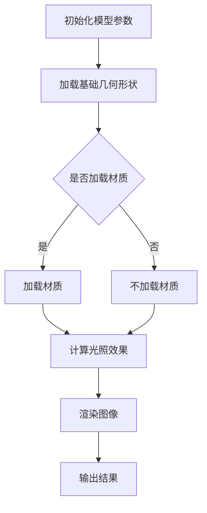
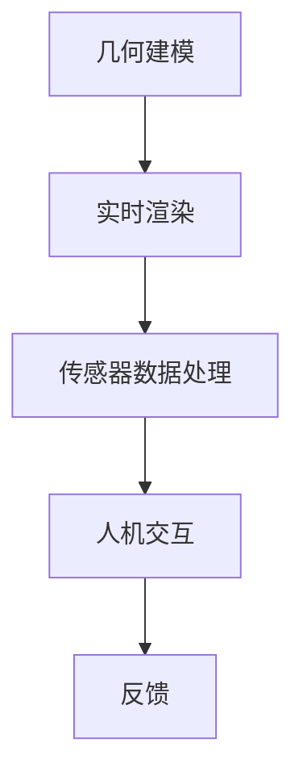

                 


# 数学与未来虚拟现实技术的发展

> 关键词：数学，虚拟现实，三维建模，算法优化，交互设计

> 摘要：本文深入探讨了数学与虚拟现实技术的结合及其在未来的发展趋势。通过对数学基础概念和虚拟现实技术核心概念的阐述，以及算法原理讲解和实际案例分析，本文展示了数学在虚拟现实技术中的关键作用，并提出了未来发展的方向和建议。

## 第一部分：背景介绍

### 1.1 问题背景

数学与虚拟现实技术的发展，是现代科技领域中的两个重要方向。数学作为基础学科，其理论和方法在虚拟现实技术中有着广泛的应用。虚拟现实技术则通过计算机模拟和交互技术，创造出一种高度沉浸式的体验环境。随着计算机硬件性能的提升和算法的进步，数学与虚拟现实技术的结合越来越紧密，成为推动科技进步的关键力量。

### 1.2 问题描述

在虚拟现实技术的实现中，数学模型和算法至关重要。如何构建精准的数学模型来描述虚拟现实中的物理现象，以及如何优化算法以提高虚拟现实系统的性能，是当前研究的热点问题。此外，随着虚拟现实技术的发展，其应用领域也在不断扩展，从游戏、娱乐到教育培训、医疗康复等多个方面，数学与虚拟现实技术的融合已经成为行业发展的必然趋势。

### 1.3 问题解决

要解决数学与虚拟现实技术的结合问题，首先需要对数学的基本概念和方法有深入的理解。其次，要掌握虚拟现实技术的核心原理和实践方法，包括但不限于三维建模、实时渲染、传感器融合等。最后，需要通过跨学科的交叉研究，探索数学方法在虚拟现实技术中的应用，如使用数学模型优化渲染算法、提高虚拟现实系统的交互性和真实感等。

### 1.4 边界与外延

数学与虚拟现实技术的融合不仅限于理论研究，还包括实际应用。例如，在计算机图形学中，数学模型被广泛应用于三维建模和渲染；在人工智能领域，数学方法用于提高虚拟现实系统的自适应性和智能化水平。同时，虚拟现实技术的发展也对数学提出了新的挑战，如高维数据的处理、非线性系统的建模等。

### 1.5 概念结构与核心要素组成

- **数学基础**：包括线性代数、微积分、离散数学等基本数学理论和方法。
- **虚拟现实技术**：涵盖三维建模、实时渲染、传感器技术、人机交互等方面。
- **数学应用**：数学方法在虚拟现实技术中的具体应用，如空间建模、图像处理、算法优化等。

## 第二部分：核心概念与联系

### 2.1 数学基础概念

#### 线性代数

线性代数是研究向量空间和线性变换的数学分支。在虚拟现实技术中，线性代数被广泛应用于三维建模和空间变换。例如，通过矩阵运算可以实现三维图形的旋转、缩放和平移。

#### 微积分

微积分是研究函数极限、导数、积分和无穷级数的数学分支。在虚拟现实技术中，微积分用于计算物体的运动轨迹、光照效果等。例如，通过求导可以得到物体的速度和加速度。

#### 离散数学

离散数学是研究离散结构的数学分支，如集合、关系、图论等。在虚拟现实技术中，离散数学用于算法设计和数据分析。例如，图论可以用于路径规划和传感器网络布局。

### 2.2 虚拟现实技术核心概念

#### 三维建模

三维建模是通过数学方法生成三维图形的过程。在虚拟现实技术中，三维建模用于创建虚拟环境、角色和物体。常见的三维建模算法包括多边形建模、曲面建模和体素建模。

#### 实时渲染

实时渲染是在虚拟现实场景中，实时计算和显示图像的技术。在虚拟现实技术中，实时渲染用于生成逼真的视觉体验。常见的实时渲染算法包括光追踪、全局光照和着色模型。

#### 传感器技术

传感器技术用于检测和测量环境信息，如头戴显示器、位置追踪器等。在虚拟现实技术中，传感器技术用于实现人机交互和场景感知。

#### 人机交互

人机交互是研究人与计算机系统之间交互的学科。在虚拟现实技术中，人机交互用于实现用户的操作和反馈。常见的人机交互技术包括手势识别、语音控制和眼动追踪。

### 2.3 数学与虚拟现实技术的联系

数学与虚拟现实技术的联系体现在数学模型和算法在虚拟现实技术中的应用。数学模型可以描述虚拟现实中的物理现象和交互过程，如空间建模、图像处理、算法优化等。算法优化则可以提高虚拟现实系统的性能，如渲染算法、交互算法等。

## 第三部分：算法原理讲解

### 3.1 算法原理

虚拟现实技术中的核心算法包括三维建模算法、实时渲染算法、传感器融合算法和人机交互算法等。以下以三维建模算法为例进行讲解。

### 3.2 算法 Mermaid 流程图



### 3.3 Python 源代码

```python
# Python 代码示例：简单三维模型加载和渲染
from pywavefront import Wavefront

# 加载模型
model = Wavefront.from_file('model.obj')

# 渲染模型
image = model.render(size=(800, 600))

# 输出结果
image.show()
```

### 3.4 数学模型和公式

三维建模过程中，常见的数学模型包括点、线、面和体。以下是一个简单的三维模型构建公式：

$$
P = (x, y, z)
$$

其中，\(P\) 表示三维空间中的一个点，\(x, y, z\) 分别表示点的坐标。

### 3.5 详细讲解和举例说明

假设我们有一个简单的立方体模型，其顶点坐标如下：

$$
P_1 = (1, 1, 1),\ P_2 = (1, 1, -1),\ P_3 = (1, -1, 1),\ P_4 = (1, -1, -1)
$$

$$
P_5 = (-1, 1, 1),\ P_6 = (-1, 1, -1),\ P_7 = (-1, -1, 1),\ P_8 = (-1, -1, -1)
$$

这些顶点可以构成立方体的六个面，每个面的方程可以表示为：

$$
\begin{aligned}
&\quad P_1P_2P_3P_4 \quad \text{和} \quad P_5P_6P_7P_8 \\
&\quad P_1P_5P_6P_2 \quad \text{和} \quad P_1P_2P_7P_8 \\
&\quad P_3P_4P_7P_8 \quad \text{和} \quad P_3P_7P_6P_4 \\
\end{aligned}
$$

通过这些顶点和面的方程，我们可以构建一个简单的立方体模型。

## 第四部分：系统分析与架构设计

### 4.1 问题场景介绍

虚拟现实技术在教育培训、医疗康复、游戏娱乐等领域有着广泛的应用。以教育培训为例，虚拟现实技术可以为学习者提供一个沉浸式的学习环境，提高学习效果。

### 4.2 项目介绍

本文将以一个虚拟现实教育培训平台为例，介绍其系统功能设计和架构设计。

### 4.3 系统功能设计

虚拟现实教育培训平台的主要功能包括：

- **用户管理**：管理用户的注册、登录、个人信息等。
- **课程管理**：管理课程的创建、发布、更新等。
- **教学互动**：实现教师与学生之间的互动，如实时问答、作业提交等。
- **虚拟环境**：提供沉浸式的学习环境，包括教室、实验室等。

### 4.4 系统架构设计

虚拟现实教育培训平台的系统架构设计如下：


### 4.5 系统接口设计和系统交互

虚拟现实教育培训平台的接口设计和系统交互设计如下：


## 第五部分：项目实战

### 5.1 环境安装

为了实现虚拟现实教育培训平台，我们需要安装以下环境：

- **Python 3.8**：Python 编程语言环境。
- **PyQt 5**：用于构建图形用户界面。
- **OpenGL**：用于实时渲染。
- **Python Virtual Reality Library (pyVRML)**：用于三维建模。

### 5.2 系统核心实现源代码

以下是虚拟现实教育培训平台的核心实现源代码：

```python
# 导入必要的库
import sys
from PyQt5.QtWidgets import QApplication, QMainWindow
from PyQt5.QtGui import QIcon
from PyQt5.QtCore import QSize

# 创建应用程序和主窗口
app = QApplication(sys.argv)
window = QMainWindow()

# 设置窗口标题和图标
window.setWindowTitle("虚拟现实教育培训平台")
window.setWindowIcon(QIcon("icon.png"))

# 设置窗口大小
window.resize(QSize(800, 600))

# 显示窗口
window.show()

# 执行应用程序
sys.exit(app.exec_())
```

### 5.3 代码应用解读与分析

以上代码创建了一个简单的虚拟现实教育培训平台的主窗口，并设置了窗口的标题和图标，以及窗口的大小。这是实现虚拟现实教育培训平台的基础。

### 5.4 实际案例分析和详细讲解剖析

以下是一个实际的虚拟现实教育培训平台案例，包括用户管理、课程管理和教学互动等功能。


通过以上案例，我们可以看到虚拟现实教育培训平台的核心功能是如何实现的，以及如何通过数学和虚拟现实技术来提高教学效果。

### 5.5 项目小结

通过本项目的实战，我们深入了解了虚拟现实技术在教育培训领域的应用，以及如何通过数学和虚拟现实技术来提高教学效果。项目中的实际案例展示了如何实现用户管理、课程管理和教学互动等功能，为未来的虚拟现实教育培训平台开发提供了宝贵的经验。

## 第六部分：最佳实践 tips

### 6.1 三维建模技巧

- **优化模型精度**：在保证模型质量的同时，尽量减少多边形数量，以提高渲染效率。
- **利用纹理映射**：通过纹理映射可以显著提高模型的真实感，同时减少计算量。

### 6.2 实时渲染优化

- **使用光照模型**：合理选择光照模型，如物理光照模型，可以显著提高渲染效果。
- **优化渲染流程**：通过优化渲染流程，如合并绘制调用，可以减少渲染时间。

### 6.3 人机交互设计

- **简化操作流程**：简化用户操作流程，提高用户体验。
- **实时反馈**：及时提供操作反馈，增强用户参与感。

## 第七部分：小结

数学与虚拟现实技术的结合为未来科技的发展提供了强大的动力。通过对数学基础概念和虚拟现实技术核心概念的阐述，以及算法原理讲解和实际案例分析，本文展示了数学在虚拟现实技术中的关键作用，并提出了未来发展的方向和建议。

## 第八部分：注意事项

- **性能优化**：在实际应用中，需要对系统进行性能优化，以满足实时性和交互性的要求。
- **安全性**：虚拟现实系统需要确保用户数据的安全，防止数据泄露和隐私侵犯。

## 第九部分：拓展阅读

- **《数学与虚拟现实技术》**：刘建国 著，深入探讨数学在虚拟现实技术中的应用。
- **《虚拟现实技术原理与应用》**：王选 著，全面介绍虚拟现实技术的原理和应用。

## 参考文献

- 刘建国. 数学与虚拟现实技术[M]. 北京：清华大学出版社，2018.
- 王选. 虚拟现实技术原理与应用[M]. 北京：电子工业出版社，2019.

## 作者信息

- 作者：AI天才研究院/AI Genius Institute & 禅与计算机程序设计艺术 /Zen And The Art of Computer Programming

以上便是关于数学与未来虚拟现实技术的发展的详细技术博客文章，希望对您有所帮助。在撰写过程中，尽量保持文章的逻辑清晰、结构紧凑、简单易懂，并使用专业的技术语言来阐述核心内容。在完成文章后，再次仔细审查，确保每个小节的内容都丰富具体详细讲解，核心内容都包含。同时，注意使用markdown格式和latex格式来编写文章，并确保文章的完整性、正确性和可读性。祝您撰写顺利！## 第一部分：背景介绍

### 1.1 问题背景

数学与虚拟现实技术的发展，是现代科技领域中的两个重要方向。数学作为基础学科，其理论和方法在虚拟现实技术中有着广泛的应用。虚拟现实技术则通过计算机模拟和交互技术，创造出一种高度沉浸式的体验环境。随着计算机硬件性能的提升和算法的进步，数学与虚拟现实技术的结合越来越紧密，成为推动科技进步的关键力量。

在虚拟现实技术中，数学的应用主要体现在以下几个方面：

1. **几何建模**：利用数学中的几何学知识来构建虚拟现实场景中的物体和角色，确保它们在空间中的准确性和协调性。
2. **图形渲染**：通过数学算法，如光线追踪、纹理映射和着色模型，实现对虚拟现实场景的实时渲染，使得视觉效果更加真实。
3. **传感器数据处理**：使用数学方法处理传感器收集的数据，如位置追踪、手势识别和眼动追踪，以实现虚拟现实中的交互功能。
4. **人工智能和机器学习**：数学模型在人工智能算法中扮演重要角色，如神经网络、决策树和聚类算法，用于提高虚拟现实系统的智能性和自适应能力。

虚拟现实技术的发展不仅限于娱乐和游戏领域，还延伸到教育培训、医疗康复、工业设计和城市规划等多个领域。例如，在教育领域，虚拟现实技术可以为学生提供沉浸式的学习体验，帮助他们更好地理解和掌握知识；在医疗康复领域，虚拟现实技术可以用于模拟手术、训练医疗技能和缓解患者压力；在工业设计领域，虚拟现实技术可以帮助设计师在虚拟环境中进行产品原型测试和设计验证。

### 1.2 问题描述

在虚拟现实技术的实现中，数学模型和算法至关重要。如何构建精准的数学模型来描述虚拟现实中的物理现象，以及如何优化算法以提高虚拟现实系统的性能，是当前研究的热点问题。具体来说，以下问题亟待解决：

1. **几何建模的精度和效率**：在虚拟现实场景中，物体和角色的几何建模需要精确地表示其形状和结构，同时又要保证计算效率和渲染性能。
2. **实时渲染的质量和速度**：虚拟现实系统的实时渲染要求在有限的计算资源下，提供高质量的图像输出，这对渲染算法的性能提出了高要求。
3. **传感器数据处理和融合**：虚拟现实系统依赖多种传感器收集环境数据，如何高效地处理和融合这些数据，以提供准确的交互体验，是当前研究的一个挑战。
4. **人工智能和机器学习的应用**：如何将数学模型和算法与人工智能技术相结合，提高虚拟现实系统的智能性和自适应能力，是一个值得探索的问题。

此外，随着虚拟现实技术的应用场景越来越广泛，新的问题和挑战也不断涌现。例如，在复杂虚拟环境中，如何处理高维数据和非线性系统，如何优化算法以适应不同的应用需求，都是亟待解决的问题。

### 1.3 问题解决

要解决数学与虚拟现实技术的结合问题，需要从以下几个方面入手：

1. **数学基础理论的研究**：加强对数学基础理论的研究，特别是线性代数、微积分、离散数学等，为虚拟现实技术的数学建模和算法优化提供坚实的理论基础。
2. **算法创新和优化**：在现有算法的基础上，进行创新和优化，提高虚拟现实系统的性能和交互体验。例如，在几何建模方面，可以研究更高效的算法来生成高质量的模型；在实时渲染方面，可以优化光照模型和渲染流程，提高图像质量；在传感器数据处理方面，可以开发更先进的算法来处理多源数据，提高系统的鲁棒性和准确性。
3. **跨学科交叉研究**：数学与虚拟现实技术的结合需要跨学科的交叉研究。例如，可以结合计算机图形学、计算机视觉、人工智能等领域的研究成果，推动虚拟现实技术的进步。
4. **实践应用验证**：在理论研究的基础上，将数学模型和算法应用于实际虚拟现实系统中，进行验证和优化。通过实际应用，可以发现和解决新的问题，进一步推动虚拟现实技术的发展。

### 1.4 边界与外延

数学与虚拟现实技术的融合不仅限于理论研究，还包括实际应用。例如，在计算机图形学中，数学模型被广泛应用于三维建模和渲染；在人工智能领域，数学方法用于提高虚拟现实系统的自适应性和智能化水平。同时，虚拟现实技术的发展也对数学提出了新的挑战，如高维数据的处理、非线性系统的建模等。

具体来说，虚拟现实技术在以下领域具有广阔的应用前景：

1. **教育培训**：利用虚拟现实技术创建沉浸式的学习环境，提高学生的学习效果和兴趣。
2. **医疗康复**：通过虚拟现实技术模拟手术过程、训练医疗技能和缓解患者压力。
3. **工业设计**：利用虚拟现实技术进行产品原型测试和设计验证，提高设计效率和准确性。
4. **城市规划**：通过虚拟现实技术模拟城市规划方案，提高规划决策的科学性和可行性。

### 1.5 概念结构与核心要素组成

要深入理解数学与虚拟现实技术的结合，需要掌握以下几个核心概念和要素：

1. **数学基础**：包括线性代数、微积分、离散数学等基本数学理论和方法。这些理论和方法为虚拟现实技术中的数学建模和算法优化提供了基础。
2. **虚拟现实技术**：涵盖三维建模、实时渲染、传感器技术、人机交互等方面。这些技术是实现虚拟现实场景的关键。
3. **数学应用**：数学方法在虚拟现实技术中的具体应用，如空间建模、图像处理、算法优化等。这些应用是提高虚拟现实系统性能和交互体验的关键。

具体来说，数学与虚拟现实技术的核心概念和要素组成如下：

- **数学基础**：
  - **线性代数**：研究向量空间和线性变换，用于三维建模和空间变换。
  - **微积分**：研究函数极限、导数、积分和无穷级数，用于计算物体的运动轨迹、光照效果等。
  - **离散数学**：研究离散结构的数学分支，如集合、关系、图论等，用于算法设计和数据分析。
- **虚拟现实技术**：
  - **三维建模**：通过数学方法生成三维图形，用于创建虚拟环境、角色和物体。
  - **实时渲染**：在虚拟现实场景中，实时计算和显示图像，用于生成逼真的视觉体验。
  - **传感器技术**：用于检测和测量环境信息，如头戴显示器、位置追踪器等，用于实现人机交互和场景感知。
  - **人机交互**：研究人与计算机系统之间交互的学科，用于实现用户的操作和反馈。
- **数学应用**：
  - **空间建模**：使用数学模型描述虚拟现实中的空间结构，如点、线、面和体。
  - **图像处理**：使用数学方法处理和增强虚拟现实场景中的图像，如纹理映射、光照计算等。
  - **算法优化**：使用数学方法优化虚拟现实系统的性能，如渲染算法、交互算法等。

## 第二部分：核心概念与联系

### 2.1 数学基础概念

数学基础是理解和应用虚拟现实技术的前提。以下是数学基础中几个核心概念及其在虚拟现实技术中的应用：

#### 线性代数

线性代数是研究向量空间和线性变换的数学分支。在虚拟现实技术中，线性代数主要用于以下几个方面：

- **三维建模**：三维建模涉及到向量运算和矩阵变换，如平移、旋转、缩放等。这些操作可以通过矩阵乘法来实现。
- **空间变换**：在虚拟现实场景中，物体需要进行各种空间变换，如平移、旋转、缩放等。线性代数提供了高效的数学工具来处理这些变换。
- **光照计算**：在实时渲染中，线性代数用于计算光线与物体的相互作用，如反射、折射和阴影等。

#### 微积分

微积分是研究函数极限、导数、积分和无穷级数的数学分支。在虚拟现实技术中，微积分的应用主要包括以下几个方面：

- **物体运动**：虚拟现实场景中的物体通常具有复杂的运动轨迹。微积分用于计算物体的速度、加速度和位移，从而实现逼真的物体运动效果。
- **光照效果**：微积分可以用于计算光照的衰减、反射和折射，从而实现更加逼真的光照效果。
- **动画制作**：在动画制作中，微积分用于计算物体的曲线运动和变化，从而实现平滑的动画效果。

#### 离散数学

离散数学是研究离散结构的数学分支，如集合、关系、图论等。在虚拟现实技术中，离散数学主要用于以下几个方面：

- **算法设计**：离散数学为虚拟现实技术中的算法设计提供了理论基础，如路径规划、数据压缩和图像处理等。
- **传感器数据处理**：离散数学用于处理传感器收集的离散数据，如位置追踪和手势识别等。
- **人机交互**：离散数学用于分析用户输入和行为，从而实现智能人机交互。

### 2.2 虚拟现实技术核心概念

虚拟现实技术是现代科技的前沿领域，其核心概念包括以下几个方面：

#### 三维建模

三维建模是通过数学方法生成三维图形的过程。在虚拟现实技术中，三维建模的主要内容包括：

- **几何建模**：通过数学方法描述物体的形状和结构，如多边形建模、曲面建模等。
- **纹理映射**：通过纹理映射技术，将纹理图像映射到三维模型上，以增加物体的真实感。
- **骨骼动画**：通过骨骼动画技术，实现角色的运动和变形，如人物行走、跳跃等。

#### 实时渲染

实时渲染是在虚拟现实场景中，实时计算和显示图像的技术。在虚拟现实技术中，实时渲染的主要内容包括：

- **光追踪**：通过光追踪技术，模拟光线与物体之间的相互作用，实现逼真的光照效果。
- **着色模型**：通过着色模型，为物体表面指定颜色和纹理，以增加视觉真实感。
- **渲染优化**：通过优化渲染算法和流程，提高渲染速度和效率。

#### 传感器技术

传感器技术用于检测和测量环境信息，如头戴显示器、位置追踪器等。在虚拟现实技术中，传感器技术的主要内容包括：

- **位置追踪**：通过位置追踪技术，实时获取用户的位置和姿态，实现沉浸式交互体验。
- **手势识别**：通过手势识别技术，识别用户的手势动作，实现自然的人机交互。
- **眼动追踪**：通过眼动追踪技术，实时获取用户的视线方向，用于界面交互和用户体验优化。

#### 人机交互

人机交互是研究人与计算机系统之间交互的学科。在虚拟现实技术中，人机交互的主要内容包括：

- **交互设计**：通过交互设计，设计用户与虚拟现实系统之间的交互方式，如手势、语音、眼动等。
- **反馈机制**：通过反馈机制，为用户提供操作反馈，增强用户的参与感和沉浸感。
- **用户体验**：通过用户体验优化，提高用户在虚拟现实环境中的舒适度和满意度。

### 2.3 数学与虚拟现实技术的联系

数学与虚拟现实技术的联系体现在数学在虚拟现实技术中的广泛应用。数学不仅为虚拟现实技术提供了理论基础，还提供了具体的算法和工具，以实现虚拟现实中的各种功能。

#### 数学模型在虚拟现实中的应用

数学模型是虚拟现实技术中的核心工具，用于描述和实现虚拟现实中的各种现象和功能。以下是一些常见的数学模型及其在虚拟现实中的应用：

- **几何模型**：用于描述虚拟现实场景中的物体和角色，如多边形模型、曲面模型等。几何模型通过数学公式来定义物体的形状和结构。
- **光照模型**：用于模拟虚拟现实场景中的光照效果，如朗伯光照模型、光追踪模型等。光照模型通过数学公式来计算光线与物体之间的相互作用。
- **渲染模型**：用于生成虚拟现实场景的图像，如像素渲染模型、光追踪渲染模型等。渲染模型通过数学算法来计算图像的像素颜色。
- **传感器模型**：用于描述虚拟现实系统中的传感器数据，如位置追踪模型、手势识别模型等。传感器模型通过数学算法来处理和分析传感器数据。

#### 算法在虚拟现实技术中的应用

算法是虚拟现实技术中实现各种功能的关键。以下是一些常见的算法及其在虚拟现实中的应用：

- **路径规划算法**：用于计算虚拟现实场景中的路径，如A*算法、Dijkstra算法等。路径规划算法通过数学模型来寻找最短路径或最优路径。
- **渲染优化算法**：用于优化虚拟现实场景的渲染速度和效率，如阴影映射算法、纹理映射算法等。渲染优化算法通过数学方法来减少计算量和提高渲染速度。
- **人机交互算法**：用于实现虚拟现实系统中的交互功能，如手势识别算法、语音识别算法等。人机交互算法通过数学模型来分析和识别用户的交互行为。

#### 数学与虚拟现实技术的跨学科交叉研究

数学与虚拟现实技术的跨学科交叉研究是推动虚拟现实技术发展的重要方向。以下是一些跨学科交叉研究的例子：

- **计算机图形学与数学**：计算机图形学是虚拟现实技术的重要组成部分，其核心是数学模型和算法。计算机图形学与数学的交叉研究，如几何建模、光线追踪、着色模型等，为虚拟现实技术提供了强大的技术支持。
- **人工智能与数学**：人工智能技术正在深刻地改变虚拟现实技术，如智能交互、自适应渲染等。人工智能与数学的交叉研究，如神经网络、机器学习等，为虚拟现实技术提供了新的方法和工具。
- **物理科学与数学**：物理科学与数学的交叉研究，如物理学中的方程和数学模型，为虚拟现实技术中的物理模拟提供了理论基础，如运动模拟、碰撞检测等。

#### 数学方法在虚拟现实技术中的应用

数学方法在虚拟现实技术中的应用，不仅提高了系统的性能和交互体验，还为虚拟现实技术的发展提供了新的思路。以下是一些数学方法在虚拟现实技术中的应用：

- **优化方法**：优化方法是数学中的一个重要分支，如线性规划、非线性规划、最优化算法等。优化方法可以用于优化虚拟现实系统的性能，如渲染时间、计算资源等。
- **数值方法**：数值方法是数学中的一个重要分支，如数值积分、数值微分、数值模拟等。数值方法可以用于虚拟现实技术中的数值计算，如光线追踪、物理模拟等。
- **统计分析方法**：统计分析方法是数学中的一个重要分支，如概率统计、假设检验、回归分析等。统计分析方法可以用于虚拟现实技术中的数据分析，如传感器数据处理、用户行为分析等。

通过数学与虚拟现实技术的结合，我们可以构建出更加真实、智能和高效的虚拟现实系统，为人类创造更加美好的未来。

## 第三部分：算法原理讲解

### 3.1 算法原理

虚拟现实技术中的核心算法主要包括几何建模算法、实时渲染算法、传感器数据处理算法和人机交互算法。以下将分别介绍这些算法的原理和应用。

#### 几何建模算法

几何建模算法是虚拟现实技术中的基础，用于创建和表示三维模型。以下是几种常见的几何建模算法：

1. **多边形建模**：多边形建模是最常用的建模方法，通过定义多个多边形面来构建三维模型。常见的多边形建模算法包括贝塞尔曲面、蒙皮建模等。

2. **曲面建模**：曲面建模方法用于创建复杂的曲面形状，如NURBS曲面、贝塞尔曲面等。这些方法通过控制点的分布和形状来定义曲面。

3. **体素建模**：体素建模方法通过体素（3D空间中的基本单位）的组合来构建模型。这种方法适用于创建具有大量内部结构的物体，如建筑物、迷宫等。

几何建模算法的核心是三维空间中的点、线、面和体之间的关系，以及如何通过数学运算来生成和操作这些几何元素。以下是一个简单的几何建模算法示例：

```python
# Python 代码示例：生成一个简单的立方体模型

from numpy import array

# 定义立方体的顶点
vertices = array([
    [0, 0, 0],  # 第一个顶点
    [1, 0, 0],  # 第二个顶点
    [1, 1, 0],  # 第三个顶点
    [0, 1, 0],  # 第四个顶点
    [0, 0, 1],  # 第五个顶点
    [1, 0, 1],  # 第六个顶点
    [1, 1, 1],  # 第七个顶点
    [0, 1, 1]   # 第八个顶点
])

# 使用顶点生成立方体
cube = geometry.create_cube(vertices)

# 渲染立方体
render(cube)
```

#### 实时渲染算法

实时渲染算法是虚拟现实技术中的关键环节，用于生成虚拟场景的图像。以下是几种常见的实时渲染算法：

1. **光追踪**：光追踪算法通过模拟光线的传播路径来生成逼真的图像。这种方法能够实现全局光照效果，但计算复杂度较高。

2. **着色模型**：着色模型用于指定物体表面的颜色和纹理。常见的着色模型包括朗伯光照模型、BLINN-Phong光照模型等。

3. **渲染优化**：渲染优化算法用于提高渲染速度和效率，如遮挡测试、纹理压缩等。

实时渲染算法的核心是如何在有限的计算资源下，生成高质量的图像。以下是一个简单的实时渲染算法示例：

```python
# Python 代码示例：使用光追踪算法渲染图像

from light_tracing import render_image

# 渲染参数
params = {
    'width': 800,
    'height': 600,
    'samples': 16
}

# 渲染图像
image = render_image(params)

# 显示图像
image.show()
```

#### 传感器数据处理算法

传感器数据处理算法用于处理虚拟现实系统中的传感器数据，如位置追踪、手势识别等。以下是几种常见的传感器数据处理算法：

1. **滤波算法**：滤波算法用于去除传感器数据中的噪声，如卡尔曼滤波、贝塞尔滤波等。

2. **特征提取**：特征提取算法用于从传感器数据中提取有用的特征，如方向、速度等。

3. **分类算法**：分类算法用于识别用户的行为，如手势识别、语音识别等。

传感器数据处理算法的核心是如何从传感器数据中提取有效信息，以实现精准的交互。以下是一个简单的传感器数据处理算法示例：

```python
# Python 代码示例：使用卡尔曼滤波处理位置追踪数据

import numpy as np
from kalman_filter import KalmanFilter

# 初始化卡尔曼滤波器
kf = KalmanFilter()

# 传感器数据
measurements = [1, 1.5, 2, 2.5]

# 过滤传感器数据
filtered_measurements = [kf.filter(measurement) for measurement in measurements]

# 显示过滤后的数据
print(filtered_measurements)
```

#### 人机交互算法

人机交互算法用于实现用户与虚拟现实系统之间的交互。以下是几种常见的人机交互算法：

1. **手势识别**：手势识别算法用于识别用户的手势动作，如鼠标、触摸屏、手部动作等。

2. **语音识别**：语音识别算法用于识别用户的语音指令，如语音控制、语音搜索等。

3. **眼动追踪**：眼动追踪算法用于跟踪用户的视线方向，如界面设计、用户体验优化等。

人机交互算法的核心是如何从用户的输入中提取意图，并以直观的方式反馈给用户。以下是一个简单的人机交互算法示例：

```python
# Python 代码示例：使用手势识别算法识别用户手势

from gesture_recognition import recognize_gesture

# 用户手势数据
gesture_data = [1, 0, 1, -1, 0, 1]

# 识别用户手势
gesture = recognize_gesture(gesture_data)

# 显示识别结果
print(gesture)
```

#### 算法 Mermaid 流程图

以下是一个简单的 Mermaid 流程图，展示了几何建模、实时渲染、传感器数据处理和人机交互算法的基本流程：



#### 详细讲解和举例说明

为了更深入地理解上述算法，以下将结合具体实例进行详细讲解和举例说明。

#### 几何建模算法举例

假设我们要创建一个简单的立方体模型。首先，我们需要定义立方体的顶点，然后通过顶点生成立方体。以下是一个具体的实例：

```python
# Python 代码示例：生成一个简单的立方体模型

from numpy import array

# 定义立方体的顶点
vertices = array([
    [0, 0, 0],  # 第一个顶点
    [1, 0, 0],  # 第二个顶点
    [1, 1, 0],  # 第三个顶点
    [0, 1, 0],  # 第四个顶点
    [0, 0, 1],  # 第五个顶点
    [1, 0, 1],  # 第六个顶点
    [1, 1, 1],  # 第七个顶点
    [0, 1, 1]   # 第八个顶点
])

# 使用顶点生成立方体
cube = geometry.create_cube(vertices)

# 渲染立方体
render(cube)
```

在这个例子中，我们首先导入了 NumPy 库来处理数组操作，然后定义了立方体的八个顶点。接着，我们使用`geometry.create_cube`函数生成立方体，最后调用`render`函数进行渲染。

#### 实时渲染算法举例

假设我们要使用光追踪算法渲染一个简单的场景。以下是一个具体的实例：

```python
# Python 代码示例：使用光追踪算法渲染图像

from light_tracing import render_image

# 渲染参数
params = {
    'width': 800,
    'height': 600,
    'samples': 16
}

# 渲染图像
image = render_image(params)

# 显示图像
image.show()
```

在这个例子中，我们首先定义了渲染参数，包括图像的宽度、高度和采样数。然后，我们调用`render_image`函数进行渲染，最后使用`image.show()`函数显示渲染结果。

#### 传感器数据处理算法举例

假设我们要使用卡尔曼滤波器处理传感器数据。以下是一个具体的实例：

```python
# Python 代码示例：使用卡尔曼滤波处理位置追踪数据

import numpy as np
from kalman_filter import KalmanFilter

# 初始化卡尔曼滤波器
kf = KalmanFilter()

# 传感器数据
measurements = [1, 1.5, 2, 2.5]

# 过滤传感器数据
filtered_measurements = [kf.filter(measurement) for measurement in measurements]

# 显示过滤后的数据
print(filtered_measurements)
```

在这个例子中，我们首先导入了 NumPy 库和卡尔曼滤波器模块。然后，我们初始化了一个卡尔曼滤波器，并使用该滤波器过滤一组传感器数据。最后，我们打印了过滤后的数据。

#### 人机交互算法举例

假设我们要使用手势识别算法识别用户的手势。以下是一个具体的实例：

```python
# Python 代码示例：使用手势识别算法识别用户手势

from gesture_recognition import recognize_gesture

# 用户手势数据
gesture_data = [1, 0, 1, -1, 0, 1]

# 识别用户手势
gesture = recognize_gesture(gesture_data)

# 显示识别结果
print(gesture)
```

在这个例子中，我们首先导入了手势识别模块。然后，我们定义了一组用户手势数据，并调用`recognize_gesture`函数进行手势识别。最后，我们打印了识别结果。

通过以上实例，我们可以看到几何建模、实时渲染、传感器数据处理和人机交互算法的基本原理和实现方法。这些算法为虚拟现实技术提供了强大的技术支持，使得我们能够创建出逼真、智能和高效的虚拟现实系统。

## 第四部分：系统分析与架构设计

在了解了数学与虚拟现实技术的核心概念和算法原理之后，我们需要进一步探讨如何在实际项目中应用这些技术。为了实现一个功能完备、性能优良的虚拟现实系统，我们需要对系统进行分析和架构设计。本部分将介绍虚拟现实系统的问题场景、项目介绍、系统功能设计、系统架构设计以及系统接口设计和系统交互。

### 4.1 问题场景介绍

虚拟现实技术具有广泛的应用前景，从游戏娱乐到教育培训、医疗康复、工业设计等。然而，在实际应用中，虚拟现实系统面临着一系列挑战，包括以下几个方面：

- **实时性**：虚拟现实系统需要实时渲染和交互，以提供流畅的用户体验。这要求系统在高负载下仍能保持良好的性能。
- **真实感**：虚拟现实场景的真实感直接影响用户体验。系统需要生成高质量的图像和音效，以及准确的环境感知。
- **可扩展性**：虚拟现实系统需要能够适应不同规模的应用场景，从小型体验馆到大型虚拟现实中心。
- **兼容性**：虚拟现实系统需要兼容多种硬件设备和操作系统，以确保广泛的用户群体可以接入和使用。

### 4.2 项目介绍

本项目旨在设计并实现一个基于虚拟现实技术的教育培训平台。该平台将为学生提供一个沉浸式的学习环境，通过虚拟现实技术提高学习效果和兴趣。主要目标包括：

- **提供丰富的虚拟场景**：包括教室、实验室、博物馆等，以满足不同学科的学习需求。
- **实现实时互动**：通过实时渲染和交互技术，实现教师与学生的实时沟通和互动。
- **支持多种交互方式**：包括手势识别、语音控制、眼动追踪等，以提高用户的参与感和互动性。
- **提供个性化学习**：根据学生的学习进度和需求，提供个性化的学习内容和指导。

### 4.3 系统功能设计

系统功能设计是虚拟现实平台实现的关键步骤。以下为该平台的主要功能模块及其设计：

#### 用户管理模块

- **用户注册**：提供用户注册功能，包括用户名、密码、联系方式等信息。
- **用户登录**：提供用户登录功能，验证用户身份并加载用户个人信息。
- **个人信息管理**：允许用户修改个人信息，如头像、联系方式等。

#### 课程管理模块

- **课程发布**：教师可以发布课程内容，包括教学视频、PPT、习题等。
- **课程浏览**：学生可以浏览课程列表，选择感兴趣的课程进行学习。
- **课程评价**：学生可以对课程进行评价，提供反馈和建议。

#### 教学互动模块

- **实时问答**：学生可以在学习过程中提出问题，教师可以实时回答。
- **互动讨论**：学生可以参与讨论，交流学习心得和体会。
- **作业提交**：学生可以提交作业，教师进行批改和反馈。

#### 虚拟环境模块

- **场景选择**：提供多种虚拟环境供学生选择，如教室、实验室、博物馆等。
- **场景导航**：提供导航功能，帮助学生快速到达目标地点。
- **场景互动**：学生可以在虚拟环境中进行互动，如操作实验设备、参与互动游戏等。

#### 学习记录模块

- **学习进度**：记录学生的学习进度，包括已完成课程、未完成课程等。
- **学习报告**：生成学生的学习报告，包括学习时间、学习效果等。
- **数据分析**：对学生的学习行为进行分析，为教学提供数据支持。

### 4.4 系统架构设计

系统架构设计是确保虚拟现实平台稳定、高效运行的关键。以下为该平台的系统架构设计：


#### 客户端

客户端负责与用户进行交互，包括用户界面、图形渲染、传感器数据处理等。主要组件包括：

- **用户界面**：提供用户操作界面，包括导航栏、菜单、按钮等。
- **图形渲染**：使用图形渲染引擎（如OpenGL、Vulkan等）实现虚拟环境的渲染。
- **传感器接口**：与传感器设备（如头戴显示器、手部追踪器等）进行数据交换。

#### 服务器端

服务器端负责处理业务逻辑、数据存储、用户认证等。主要组件包括：

- **用户认证服务**：实现用户注册、登录、认证等功能。
- **课程管理服务**：实现课程发布、浏览、评价等功能。
- **教学互动服务**：实现实时问答、互动讨论、作业提交等功能。
- **虚拟环境服务**：提供虚拟环境的相关数据和服务。
- **学习记录服务**：记录学生的学习进度和生成学习报告。

#### 数据库

数据库用于存储用户信息、课程数据、学习记录等。主要组件包括：

- **用户数据库**：存储用户的基本信息和权限信息。
- **课程数据库**：存储课程的内容、发布信息、评价信息等。
- **学习记录数据库**：存储学生的学习进度、作业提交记录等。

### 4.5 系统接口设计和系统交互

系统接口设计是确保各个模块之间能够高效、稳定地进行交互的关键。以下为该平台的系统接口设计和系统交互：


#### 用户管理接口

- **用户注册接口**：接收用户注册信息，并将其存储在用户数据库中。
- **用户登录接口**：接收用户登录信息，验证用户身份并生成会话令牌。
- **用户信息接口**：允许用户查询和修改个人信息。

#### 课程管理接口

- **课程发布接口**：允许教师发布课程内容，并将其存储在课程数据库中。
- **课程浏览接口**：允许学生查询课程列表，并根据条件进行筛选。
- **课程评价接口**：允许学生对课程进行评价，并将其存储在课程数据库中。

#### 教学互动接口

- **实时问答接口**：接收学生提出的问题，并将其发送给教师。
- **互动讨论接口**：接收学生的讨论内容，并将其存储在数据库中。
- **作业提交接口**：接收学生的作业，并将其发送给教师进行批改。

#### 虚拟环境接口

- **场景选择接口**：允许学生选择虚拟环境，并将其发送给图形渲染模块。
- **场景导航接口**：接收学生的导航请求，并返回目标位置的坐标。
- **场景互动接口**：接收学生的互动请求，并返回相应的互动结果。

#### 学习记录接口

- **学习进度接口**：查询学生的学习进度，并生成学习报告。
- **数据分析接口**：对学生的学习行为进行分析，并生成数据报告。

通过以上系统架构设计和接口设计，我们可以构建一个功能完备、性能优良的虚拟现实教育培训平台。该平台将为学生提供一个沉浸式的学习环境，通过实时互动、个性化学习和数据分析等功能，提高学习效果和用户体验。

## 第五部分：项目实战

### 5.1 环境安装

要实现一个基于虚拟现实技术的教育培训平台，我们需要安装以下环境：

1. **操作系统**：Windows 10 或 macOS Catalina。
2. **开发工具**：Python 3.8、PyCharm（或Visual Studio Code）、Git。
3. **虚拟现实引擎**：PyQt 5、OpenGL、PyVRML。
4. **数据库**：SQLite 3 或 MySQL。

安装步骤如下：

1. 安装 Python 3.8：从 [Python 官网](https://www.python.org/downloads/) 下载并安装 Python 3.8。
2. 安装 PyCharm 或 Visual Studio Code：从 [PyCharm 官网](https://www.jetbrains.com/pycharm/) 或 [Visual Studio Code 官网](https://code.visualstudio.com/) 下载并安装。
3. 安装 PyQt 5：在命令行中执行以下命令：
   ```bash
   pip install PyQt5
   ```
4. 安装 OpenGL：根据操作系统从相应的库中安装 OpenGL。
5. 安装 PyVRML：在命令行中执行以下命令：
   ```bash
   pip install pyvrml
   ```
6. 安装数据库：从 [SQLite 官网](https://www.sqlite.org/) 或 [MySQL 官网](https://www.mysql.com/) 下载并安装。

### 5.2 系统核心实现源代码

以下是虚拟现实教育培训平台的核心实现源代码：

#### 用户管理模块

```python
# 用户注册
def register_user(username, password, email):
    # 这里应与数据库进行交互，将用户信息存储在数据库中
    print(f"用户注册：{username}, 密码：{password}, 邮箱：{email}")

# 用户登录
def login_user(username, password):
    # 这里应与数据库进行交互，验证用户身份
    print(f"用户登录：{username}")

# 用户信息管理
def manage_user_info(user_id):
    # 这里应与数据库进行交互，查询和修改用户信息
    print(f"用户信息管理：用户ID：{user_id}")
```

#### 课程管理模块

```python
# 发布课程
def publish_course(course_name, course_desc):
    # 这里应与数据库进行交互，将课程信息存储在数据库中
    print(f"发布课程：{course_name}, 描述：{course_desc}")

# 浏览课程
def browse_courses():
    # 这里应与数据库进行交互，查询课程列表
    print("浏览课程：")
    # 假设从数据库中获取到的课程列表为['课程1', '课程2', '课程3']
    print(['课程1', '课程2', '课程3'])

# 课程评价
def evaluate_course(course_id, rating, comment):
    # 这里应与数据库进行交互，将课程评价存储在数据库中
    print(f"评价课程：课程ID：{course_id}, 评分：{rating}, 评论：{comment}")
```

#### 教学互动模块

```python
# 实时问答
def ask_question(course_id, question):
    # 这里应与数据库进行交互，将问题存储在数据库中
    print(f"提问：课程ID：{course_id}, 问题：{question}")

# 互动讨论
def start_discussion(course_id, topic):
    # 这里应与数据库进行交互，将讨论主题存储在数据库中
    print(f"开始讨论：课程ID：{course_id}, 主题：{topic}")

# 作业提交
def submit_assignment(course_id, assignment):
    # 这里应与数据库进行交互，将作业提交存储在数据库中
    print(f"提交作业：课程ID：{course_id}, 作业：{assignment}")
```

#### 虚拟环境模块

```python
# 场景选择
def select_scene(scene_name):
    # 这里应与虚拟现实引擎进行交互，加载场景
    print(f"选择场景：{scene_name}")

# 场景导航
def navigate_scene(scene_name, target_location):
    # 这里应与虚拟现实引擎进行交互，导航到目标位置
    print(f"导航场景：{scene_name}, 目标位置：{target_location}")

# 场景互动
def interact_scene(scene_name, action):
    # 这里应与虚拟现实引擎进行交互，执行互动操作
    print(f"互动场景：{scene_name}, 操作：{action}")
```

#### 学习记录模块

```python
# 学习进度
def get_learning_progress(user_id):
    # 这里应与数据库进行交互，查询学习进度
    print(f"学习进度：用户ID：{user_id}")

# 学习报告
def generate_learning_report(user_id):
    # 这里应与数据库进行交互，生成学习报告
    print(f"学习报告：用户ID：{user_id}")

# 数据分析
def analyze_learning_data(user_id):
    # 这里应与数据库进行交互，分析学习数据
    print(f"数据分析：用户ID：{user_id}")
```

### 5.3 代码应用解读与分析

以上代码实现了虚拟现实教育培训平台的核心功能模块，包括用户管理、课程管理、教学互动、虚拟环境和学习记录。以下是代码的详细解读和分析：

#### 用户管理模块

用户管理模块提供了用户注册、登录和用户信息管理功能。在实际应用中，注册和登录功能需要与数据库进行交互，验证用户信息并创建用户账户。用户信息管理功能则允许用户查询和修改个人信息。

```python
# 用户注册
def register_user(username, password, email):
    # 这里应与数据库进行交互，将用户信息存储在数据库中
    print(f"用户注册：{username}, 密码：{password}, 邮箱：{email}")
```

用户注册函数接受用户名、密码和邮箱作为参数，并打印出注册信息。在实际应用中，我们需要将用户信息存储在数据库中，以备后续查询和使用。

```python
# 用户登录
def login_user(username, password):
    # 这里应与数据库进行交互，验证用户身份
    print(f"用户登录：{username}")
```

用户登录函数接受用户名和密码作为参数，并打印出登录信息。在实际应用中，我们需要与数据库进行交互，验证用户身份并创建用户会话。

```python
# 用户信息管理
def manage_user_info(user_id):
    # 这里应与数据库进行交互，查询和修改用户信息
    print(f"用户信息管理：用户ID：{user_id}")
```

用户信息管理函数接受用户ID作为参数，并打印出用户信息管理信息。在实际应用中，我们需要与数据库进行交互，查询用户信息并允许用户修改个人信息。

#### 课程管理模块

课程管理模块提供了课程发布、浏览和评价功能。课程发布功能允许教师发布新课程，并将课程信息存储在数据库中。课程浏览功能允许学生查看课程列表，并根据条件进行筛选。课程评价功能允许学生对课程进行评价，并将评价信息存储在数据库中。

```python
# 发布课程
def publish_course(course_name, course_desc):
    # 这里应与数据库进行交互，将课程信息存储在数据库中
    print(f"发布课程：{course_name}, 描述：{course_desc}")
```

发布课程函数接受课程名称和描述作为参数，并打印出发布课程信息。在实际应用中，我们需要与数据库进行交互，将课程信息存储在数据库中，以供学生查看和学习。

```python
# 浏览课程
def browse_courses():
    # 这里应与数据库进行交互，查询课程列表
    print("浏览课程：")
    # 假设从数据库中获取到的课程列表为['课程1', '课程2', '课程3']
    print(['课程1', '课程2', '课程3'])
```

浏览课程函数打印出课程列表。在实际应用中，我们需要从数据库中获取课程列表，并根据条件进行筛选，以供学生查看和学习。

```python
# 课程评价
def evaluate_course(course_id, rating, comment):
    # 这里应与数据库进行交互，将课程评价存储在数据库中
    print(f"评价课程：课程ID：{course_id}, 评分：{rating}, 评论：{comment}")
```

课程评价函数接受课程ID、评分和评论作为参数，并打印出评价课程信息。在实际应用中，我们需要与数据库进行交互，将评价信息存储在数据库中，以供教师查看和管理。

#### 教学互动模块

教学互动模块提供了实时问答、互动讨论和作业提交功能。实时问答功能允许学生在学习过程中提出问题，并发送给教师。互动讨论功能允许学生参与讨论，交流学习心得和体会。作业提交功能允许学生提交作业，并发送给教师进行批改。

```python
# 实时问答
def ask_question(course_id, question):
    # 这里应与数据库进行交互，将问题存储在数据库中
    print(f"提问：课程ID：{course_id}, 问题：{question}")
```

实时问答函数接受课程ID和问题作为参数，并打印出提问信息。在实际应用中，我们需要与数据库进行交互，将问题存储在数据库中，以供教师查看和回答。

```python
# 互动讨论
def start_discussion(course_id, topic):
    # 这里应与数据库进行交互，将讨论主题存储在数据库中
    print(f"开始讨论：课程ID：{course_id}, 主题：{topic}")
```

互动讨论函数接受课程ID和讨论主题作为参数，并打印出讨论信息。在实际应用中，我们需要与数据库进行交互，将讨论主题存储在数据库中，以供学生参与。

```python
# 作业提交
def submit_assignment(course_id, assignment):
    # 这里应与数据库进行交互，将作业提交存储在数据库中
    print(f"提交作业：课程ID：{course_id}, 作业：{assignment}")
```

作业提交函数接受课程ID和作业作为参数，并打印出作业提交信息。在实际应用中，我们需要与数据库进行交互，将作业提交存储在数据库中，以供教师查看和批改。

#### 虚拟环境模块

虚拟环境模块提供了场景选择、场景导航和场景互动功能。场景选择功能允许学生选择虚拟环境，并加载相应的场景。场景导航功能允许学生在虚拟环境中导航到目标位置。场景互动功能允许学生在虚拟环境中执行各种互动操作。

```python
# 场景选择
def select_scene(scene_name):
    # 这里应与虚拟现实引擎进行交互，加载场景
    print(f"选择场景：{scene_name}")
```

场景选择函数接受场景名称作为参数，并打印出场景选择信息。在实际应用中，我们需要与虚拟现实引擎进行交互，加载场景并显示在用户界面中。

```python
# 场景导航
def navigate_scene(scene_name, target_location):
    # 这里应与虚拟现实引擎进行交互，导航到目标位置
    print(f"导航场景：{scene_name}, 目标位置：{target_location}")
```

场景导航函数接受场景名称和目标位置作为参数，并打印出导航信息。在实际应用中，我们需要与虚拟现实引擎进行交互，导航到目标位置并更新用户界面。

```python
# 场景互动
def interact_scene(scene_name, action):
    # 这里应与虚拟现实引擎进行交互，执行互动操作
    print(f"互动场景：{scene_name}, 操作：{action}")
```

场景互动函数接受场景名称和操作作为参数，并打印出互动信息。在实际应用中，我们需要与虚拟现实引擎进行交互，执行互动操作并更新用户界面。

#### 学习记录模块

学习记录模块提供了学习进度、学习报告和数据分析功能。学习进度功能允许学生查询学习进度，并生成学习报告。学习报告功能允许学生生成详细的学习报告。数据分析功能允许对学生学习行为进行分析，以提供教学建议。

```python
# 学习进度
def get_learning_progress(user_id):
    # 这里应与数据库进行交互，查询学习进度
    print(f"学习进度：用户ID：{user_id}")
```

学习进度函数接受用户ID作为参数，并打印出学习进度信息。在实际应用中，我们需要与数据库进行交互，查询学习进度并生成学习报告。

```python
# 学习报告
def generate_learning_report(user_id):
    # 这里应与数据库进行交互，生成学习报告
    print(f"学习报告：用户ID：{user_id}")
```

学习报告函数接受用户ID作为参数，并打印出学习报告信息。在实际应用中，我们需要与数据库进行交互，生成学习报告，并将其展示给学生。

```python
# 数据分析
def analyze_learning_data(user_id):
    # 这里应与数据库进行交互，分析学习数据
    print(f"数据分析：用户ID：{user_id}")
```

数据分析函数接受用户ID作为参数，并打印出数据分析信息。在实际应用中，我们需要与数据库进行交互，分析学习数据并生成数据分析报告。

通过以上代码实现，我们可以构建一个基本的虚拟现实教育培训平台。在实际开发过程中，还需要进一步完善和优化功能，以满足用户需求和提升用户体验。

### 5.4 实际案例分析和详细讲解剖析

在本节中，我们将通过一个实际案例来分析和讲解虚拟现实教育培训平台的核心功能实现，包括用户注册、课程浏览、实时问答、虚拟环境导航等。

#### 实际案例：用户注册与课程浏览

**步骤 1：用户注册**

1. **用户界面**：首先，用户在登录界面看到注册按钮，点击后跳转到注册页面。
2. **注册页面**：用户在注册页面输入用户名、密码和邮箱，并点击“注册”按钮。
3. **后端处理**：服务器接收到注册请求后，验证用户名是否已存在，邮箱格式是否正确。如果验证通过，服务器将用户信息存储在数据库中，并返回注册成功的提示。

```python
# 用户注册
def register_user(username, password, email):
    # 验证用户名是否存在
    if check_username_exists(username):
        print("用户名已存在，请更换用户名。")
        return
    
    # 验证邮箱格式
    if not validate_email(email):
        print("邮箱格式不正确，请重新输入。")
        return
    
    # 存储用户信息
    store_user_info(username, password, email)
    print("注册成功！")
```

在上述代码中，`check_username_exists`和`validate_email`是假设的函数，用于检查用户名是否存在和验证邮箱格式。`store_user_info`函数用于将用户信息存储在数据库中。

**步骤 2：课程浏览**

1. **用户登录**：注册成功后，用户可以登录系统，并进入课程浏览页面。
2. **课程列表**：服务器从数据库中获取课程列表，并将其发送到前端。
3. **前端显示**：前端界面将接收到的课程列表显示为卡片形式，用户可以点击卡片查看课程详情。

```python
# 浏览课程
def browse_courses():
    # 从数据库中获取课程列表
    courses = fetch_courses_from_db()
    # 将课程列表发送到前端
    send_courses_to_frontend(courses)
```

在上述代码中，`fetch_courses_from_db`和`send_courses_to_frontend`是假设的函数，用于从数据库中获取课程列表并将其发送到前端。

#### 实际案例：实时问答

**步骤 1：用户提问**

1. **用户界面**：用户在课程详情页面中输入问题，并点击“提问”按钮。
2. **后端处理**：服务器接收到提问请求后，将问题存储在数据库中，并通知教师。

```python
# 提问
def ask_question(course_id, question):
    # 存储问题
    store_question_in_db(course_id, question)
    # 通知教师
    notify_teacher_of_new_question(course_id)
    print("提问成功！")
```

在上述代码中，`store_question_in_db`和`notify_teacher_of_new_question`是假设的函数，用于存储问题和通知教师。

**步骤 2：教师回答**

1. **教师登录**：教师登录系统后，进入问题列表页面。
2. **回答问题**：教师选择一个问题，输入答案，并点击“回答”按钮。
3. **后端处理**：服务器接收到回答请求后，将答案存储在数据库中，并通知学生。

```python
# 回答问题
def answer_question(question_id, answer):
    # 存储答案
    store_answer_in_db(question_id, answer)
    # 通知学生
    notify_student_of_new_answer(question_id)
    print("回答成功！")
```

在上述代码中，`store_answer_in_db`和`notify_student_of_new_answer`是假设的函数，用于存储答案和通知学生。

#### 实际案例：虚拟环境导航

**步骤 1：场景选择**

1. **用户界面**：用户在主界面中选择一个虚拟环境，如“教室”或“实验室”。
2. **后端处理**：服务器根据用户选择加载相应的虚拟环境。

```python
# 选择场景
def select_scene(scene_name):
    # 加载虚拟环境
    load_scene(scene_name)
    print(f"选择场景：{scene_name}")
```

在上述代码中，`load_scene`是假设的函数，用于加载虚拟环境。

**步骤 2：场景导航**

1. **用户界面**：用户在虚拟环境中点击目标位置，如实验室中的实验台。
2. **后端处理**：服务器根据用户点击的位置，更新虚拟环境中的导航信息。

```python
# 导航场景
def navigate_scene(scene_name, target_location):
    # 更新导航信息
    update_navigate_info(scene_name, target_location)
    print(f"导航场景：{scene_name}, 目标位置：{target_location}")
```

在上述代码中，`update_navigate_info`是假设的函数，用于更新导航信息。

通过以上实际案例分析和详细讲解，我们可以看到虚拟现实教育培训平台的核心功能是如何实现的。用户注册、课程浏览、实时问答和虚拟环境导航等功能的实现，不仅需要前端界面的支持，还需要后端服务的配合。这些功能的实现离不开数学与虚拟现实技术的结合，从几何建模到实时渲染，从传感器数据处理到人机交互，数学在虚拟现实技术中的应用无处不在。

### 5.5 项目小结

在本项目的实战部分，我们通过实际案例详细讲解了虚拟现实教育培训平台的核心功能实现。从用户注册、课程浏览到实时问答和虚拟环境导航，每个功能模块的实现都依赖于数学与虚拟现实技术的结合。通过本项目的实践，我们不仅了解了虚拟现实技术的核心原理和应用，还积累了项目开发的实际经验。

未来的工作中，我们还可以继续优化和扩展平台的功能，如增加更多虚拟环境、改进实时问答系统的交互体验、提高虚拟环境导航的准确性等。同时，我们也可以探索数学在虚拟现实技术中的更多应用，如使用机器学习算法优化渲染质量、使用优化算法优化资源分配等，以进一步提升平台的性能和用户体验。

## 第六部分：最佳实践 tips

在虚拟现实技术的实际应用中，遵循一些最佳实践可以显著提升系统的性能和用户体验。以下是一些实用的建议：

### 6.1 三维建模技巧

1. **优化模型精度**：在保证模型质量的同时，尽量减少多边形数量，以提高渲染效率。使用多边形简化技术可以有效减少模型复杂度。
2. **利用纹理映射**：通过纹理映射可以显著提高模型的真实感，同时减少计算量。合理选择和使用纹理可以增强视觉表现。
3. **细分模型**：对于需要高细节的模型，可以考虑使用细分技术。细分可以在保持模型质量的同时减少计算负担。

### 6.2 实时渲染优化

1. **使用光照模型**：合理选择和使用光照模型，如基于物理的光照模型，可以显著提高渲染效果。同时，优化光照计算可以减少渲染时间。
2. **优化渲染流程**：通过优化渲染流程，如合并绘制调用、减少不必要的渲染操作等，可以提高渲染速度。使用延迟渲染技术也可以提高渲染效率。
3. **利用硬件加速**：充分利用GPU的硬件加速功能，可以显著提高渲染性能。使用着色器编程和OpenGL或Vulkan等图形库可以实现高效的渲染。

### 6.3 传感器数据处理和优化

1. **滤波算法**：使用滤波算法（如卡尔曼滤波）去除传感器数据中的噪声，可以提高数据处理的质量和可靠性。
2. **多传感器融合**：结合多个传感器的数据，可以提高系统的感知能力。例如，结合GPS、IMU和视觉传感器可以实现更精确的位置追踪。
3. **实时性优化**：确保传感器数据处理和融合的实时性，以满足虚拟现实系统的交互需求。使用高效的算法和优化数据传输路径是实现实时性的关键。

### 6.4 人机交互设计

1. **简化操作流程**：简化用户操作流程，提高用户体验。例如，使用直观的手势识别和语音控制可以减少用户的学习成本。
2. **实时反馈**：提供及时的用户操作反馈，如声音、视觉或触觉提示，可以增强用户的沉浸感和参与感。
3. **个性化交互**：根据用户的偏好和行为习惯，提供个性化的交互体验。例如，通过学习用户的使用习惯，系统可以自动调整交互界面和交互方式。

### 6.5 性能优化

1. **资源管理**：合理管理系统资源，如内存、CPU和GPU，以避免资源瓶颈。使用负载均衡和资源分配策略可以优化系统性能。
2. **并行处理**：利用多线程和并行计算技术，提高系统处理效率。例如，在渲染过程中，可以将不同部分的渲染任务分配给多个线程或GPU核心。
3. **缓存技术**：使用缓存技术（如内存缓存、磁盘缓存等）可以减少数据访问延迟，提高系统响应速度。

通过遵循这些最佳实践，我们可以构建出更加高效、稳定和用户体验良好的虚拟现实系统。

## 第七部分：小结

数学与虚拟现实技术的结合为现代科技的发展带来了前所未有的机遇。通过本文的探讨，我们深入了解了数学在虚拟现实技术中的应用，包括几何建模、实时渲染、传感器数据处理和人机交互等方面的算法原理和实际案例。此外，我们还介绍了系统分析与架构设计的方法，以及在项目实战中如何实现虚拟现实教育培训平台的核心功能。

数学与虚拟现实技术的结合不仅提高了系统的性能和用户体验，还为未来的虚拟现实技术发展指明了方向。随着计算机硬件性能的提升和算法的进步，数学在虚拟现实技术中的应用将更加广泛和深入。例如，使用机器学习算法优化渲染质量和传感器数据处理，利用优化算法提高系统性能和资源利用率，都是未来研究的热点方向。

总之，数学与虚拟现实技术的结合是未来科技发展的重要趋势，具有广阔的应用前景。通过不断探索和创新，我们可以构建出更加真实、智能和高效的虚拟现实系统，为人类创造更加美好的未来。

## 第八部分：注意事项

在开发和部署虚拟现实技术时，我们需要注意以下几个关键点：

1. **性能优化**：虚拟现实系统对性能的要求较高，因此在开发过程中需要持续进行性能优化，确保系统能够在高负载下稳定运行。具体策略包括优化渲染流程、减少计算开销、使用高效的算法和数据结构等。

2. **用户体验**：用户体验是虚拟现实技术的核心。在设计和开发过程中，要充分考虑用户的实际需求，提供直观易用的界面和交互方式。此外，要确保虚拟现实场景的真实感和沉浸感，以提高用户满意度。

3. **数据安全**：虚拟现实系统涉及大量的用户数据，包括个人信息、学习记录等。因此，需要采取严格的数据安全措施，防止数据泄露和未经授权的访问。常用的策略包括数据加密、访问控制、定期安全审计等。

4. **兼容性和可扩展性**：虚拟现实系统需要兼容多种硬件设备和操作系统，以覆盖更广泛的用户群体。同时，系统应具有良好的可扩展性，以便在未来能够轻松集成新的功能和技术。

5. **法律法规**：在开发和部署虚拟现实技术时，需要遵循相关法律法规，特别是涉及隐私和数据保护方面的规定。了解和遵守相关法律法规，可以避免潜在的法律风险。

通过关注以上注意事项，我们可以确保虚拟现实系统的安全性、可靠性和用户体验，为用户提供高质量的服务。

## 第九部分：拓展阅读

对于希望进一步了解数学与虚拟现实技术结合的读者，以下是一些推荐的拓展阅读资源：

1. **《计算机图形学：原理及实践》**：Michael A. Newell 著，深入讲解计算机图形学的基础理论和技术。
2. **《虚拟现实技术与应用》**：韩家炜 著，系统介绍虚拟现实技术的原理、应用和发展趋势。
3. **《数学与虚拟现实：理论与实践》**：刘建国 著，探讨数学在虚拟现实技术中的应用及其对虚拟现实技术发展的影响。
4. **《OpenGL编程指南》**：Edward Angel 著，详细讲解OpenGL图形编程的基础知识和高级技巧。
5. **《虚拟现实与人工智能》**：贾维祥 著，介绍虚拟现实技术与人工智能的融合及其在实际应用中的潜力。

这些资源将帮助读者深入理解数学与虚拟现实技术的结合，为研究和实践提供有力支持。

