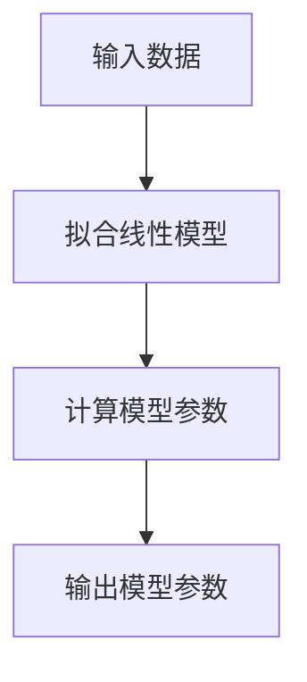
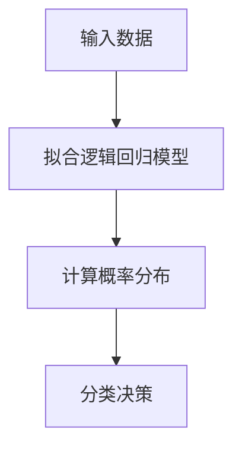
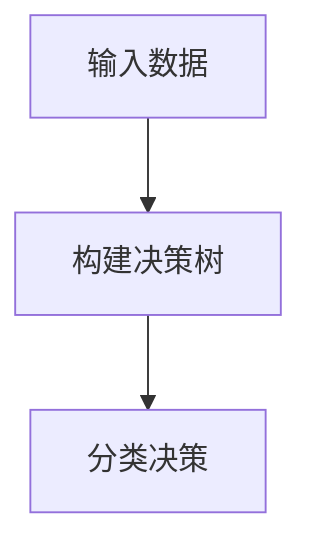
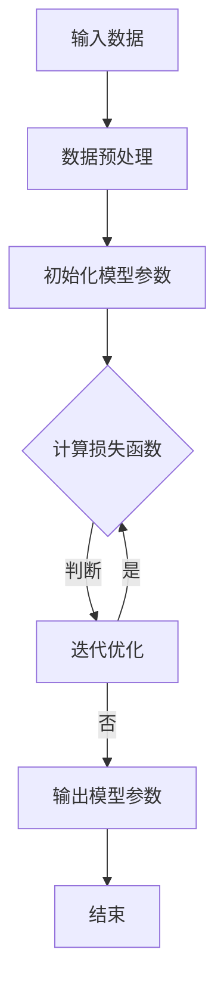
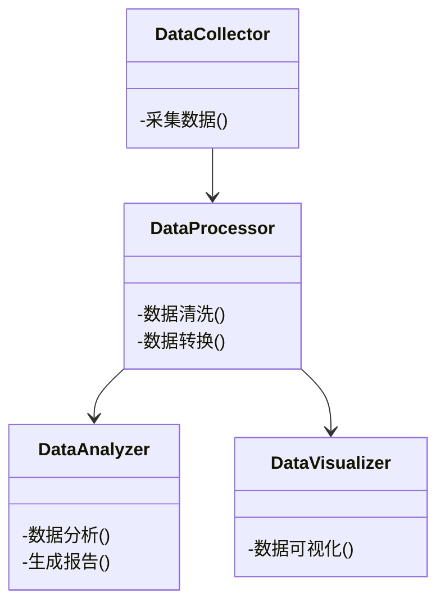
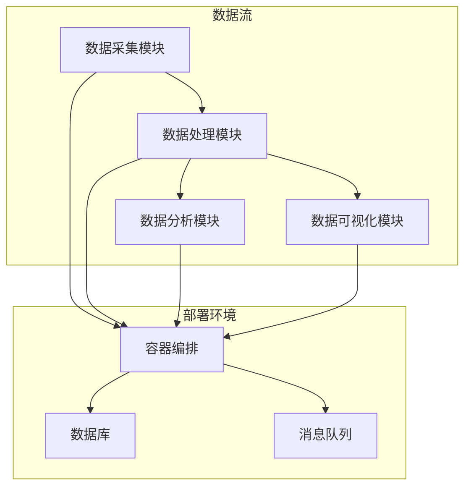
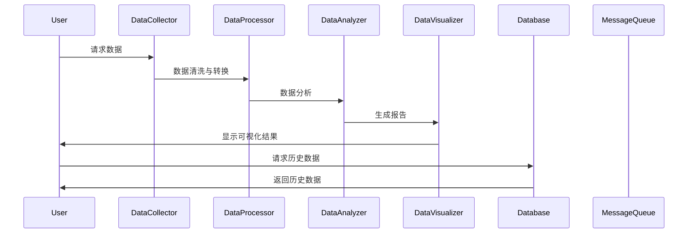

                 

## 第一部分：引论

### 1.1 问题背景

#### 1.1.1 金融科技的发展现状

金融科技（Financial Technology，简称FinTech）正逐渐成为金融行业的重要推动力。根据PwC的《全球金融科技调查报告》，全球金融科技市场规模在2021年已经达到4.2万亿美元，预计到2025年将达到7万亿美元。这一迅猛增长得益于金融科技在提升效率、降低成本、改善用户体验等方面的显著优势。

金融科技的主要领域包括支付、借贷、投资、保险、交易、风险管理等。移动支付如支付宝和微信支付已经深入人们的生活，区块链技术在金融领域的应用也开始崭露头角，智能投顾和量化交易则极大地提高了金融决策的效率和准确性。

#### 1.1.2 数学在金融科技中的作用

数学是金融科技发展的基石。金融科技中的许多问题和挑战，如风险评估、金融模型构建、定价策略等，都需要依靠数学方法来解决。具体来说，数学在金融科技中的作用主要体现在以下几个方面：

1. **模型构建**：金融模型是金融科技的核心组成部分。这些模型通常依赖于概率论、统计学、线性代数等数学知识。例如，Black-Scholes期权定价模型就使用了概率论和微积分。

2. **数据分析**：大数据技术在金融科技中扮演着重要角色。为了从海量数据中提取有价值的信息，需要使用统计学和线性代数等方法进行数据预处理和挖掘。

3. **算法优化**：算法是金融科技的重要组成部分，如机器学习算法在风险管理中的应用。算法的优化往往依赖于复杂的数学计算。

4. **风险管理**：数学模型在风险评估和风险管理中发挥着关键作用。例如，VaR（Value at Risk）模型就是基于概率论和统计学构建的风险管理工具。

#### 1.1.3 金融科技发展趋势与挑战

金融科技的发展趋势包括数字化、智能化和全球化。数字化体现在金融服务的在线化和移动化，智能化体现在人工智能和机器学习的应用，全球化则体现在跨境金融交易的便捷性。

然而，金融科技的发展也面临一些挑战：

1. **数据隐私和安全**：随着大数据和云计算的普及，数据隐私和安全问题日益突出。

2. **监管合规**：金融科技的快速发展给监管机构带来了新的挑战。如何平衡创新与监管成为重要议题。

3. **技术风险**：算法的不确定性和技术故障可能对金融市场造成重大影响。

综上所述，数学在金融科技中扮演着不可或缺的角色。理解数学与金融科技之间的联系，有助于我们更好地应对未来金融科技的发展趋势与挑战。

### 1.2 核心概念

#### 1.2.1 金融科技中的关键数学概念

在金融科技中，关键的数学概念包括线性代数、微积分、概率论与数理统计。这些概念不仅构成了金融科技的理论基础，还在实际应用中发挥着重要作用。

1. **线性代数**

线性代数是数学的一个分支，主要研究向量、矩阵及其运算。在金融科技中，线性代数的主要应用包括：

- **数据分析**：线性代数提供了许多工具，如主成分分析（PCA），用于数据降维和特征提取。
- **风险管理**：线性代数中的矩阵运算可用于计算风险指标，如协方差矩阵和相关性矩阵。

2. **微积分**

微积分是一门研究变化和速度的数学学科。在金融科技中，微积分的主要应用包括：

- **定价模型**：微积分在金融产品定价中扮演着重要角色，例如Black-Scholes期权定价模型就使用了微积分中的极限和积分概念。
- **风险管理**：微积分中的微分方程可以用于构建风险模型，如模拟市场波动。

3. **概率论与数理统计**

概率论与数理统计是研究随机现象和数据的学科。在金融科技中，概率论与数理统计的主要应用包括：

- **风险评估**：通过概率论和数理统计方法，可以评估金融产品的风险，如计算VaR（Value at Risk）。
- **数据挖掘**：数理统计方法，如回归分析和聚类分析，用于从数据中提取有价值的信息。

#### 1.2.2 线性代数的基本概念

线性代数的基本概念包括向量、矩阵和线性变换。以下是对这些概念的基本介绍：

1. **向量**

向量是数学中的一个基本概念，它由一组数（称为分量）组成，通常表示为列向量。向量在金融科技中的应用包括：

- **数据分析**：向量用于表示数据的特征，如股票市场的价格和成交量。
- **风险管理**：向量可以表示投资组合的风险和收益。

2. **矩阵**

矩阵是一个由数字组成的二维数组。矩阵在金融科技中的应用包括：

- **数据分析**：矩阵用于表示复杂数据的结构，如股票价格矩阵和收益率矩阵。
- **风险管理**：矩阵运算可以用于计算风险指标，如协方差矩阵。

3. **线性变换**

线性变换是一种将向量空间中的向量映射到另一个向量空间中的线性映射。在金融科技中，线性变换用于：

- **数据分析**：线性变换可以用于数据的预处理，如标准化和归一化。
- **风险管理**：线性变换可以用于构建投资组合的优化模型。

#### 1.2.3 微积分的基本概念

微积分是研究变化和速度的数学学科，其基本概念包括极限、导数和积分。

1. **极限**

极限是微积分中最基本的概念之一，它用于描述函数在某一点的值。在金融科技中，极限可以用于：

- **期权定价**：Black-Scholes模型中的欧式期权定价公式就涉及到极限的概念。
- **风险管理**：极限可以用于计算风险指标，如VaR。

2. **导数**

导数描述了函数在某一点的斜率，反映了函数的变化率。在金融科技中，导数可以用于：

- **定价模型**：导数可以用于计算金融产品的价格变化率。
- **风险管理**：导数可以用于评估金融产品的风险。

3. **积分**

积分是导数的反操作，用于计算函数在某区间内的累积量。在金融科技中，积分可以用于：

- **定价模型**：积分可以用于计算金融产品的累积价值，如债券的价格。
- **风险管理**：积分可以用于计算风险指标，如累计损失。

#### 1.2.4 概率论与数理统计的基本概念

概率论与数理统计是研究随机现象和数据的数学学科，其基本概念包括概率分布、条件概率和贝叶斯定理。

1. **概率分布**

概率分布描述了随机变量的取值概率。在金融科技中，概率分布可以用于：

- **风险评估**：概率分布可以用于计算金融产品的风险值。
- **数据挖掘**：概率分布可以用于识别数据中的模式。

2. **条件概率**

条件概率描述了在给定一个事件发生的条件下，另一个事件的概率。在金融科技中，条件概率可以用于：

- **风险管理**：条件概率可以用于计算投资组合的风险。
- **数据挖掘**：条件概率可以用于识别数据中的关联关系。

3. **贝叶斯定理**

贝叶斯定理描述了概率的转移和更新过程。在金融科技中，贝叶斯定理可以用于：

- **风险评估**：贝叶斯定理可以用于更新风险模型。
- **数据挖掘**：贝叶斯定理可以用于分类和预测。

#### 1.2.5 数学与金融科技的关系

数学与金融科技之间的关系可以概括为以下几个方面：

1. **数学模型**：数学模型是金融科技的核心组成部分。这些模型基于数学理论，用于描述金融市场的行为和金融产品的特性。

2. **数据分析**：数学方法，如线性代数、微积分和概率论，用于分析金融市场数据，提取有价值的信息。

3. **算法优化**：数学方法用于优化金融科技算法，提高其效率和准确性。

4. **风险管理**：数学模型和算法在金融风险管理中发挥着关键作用，如VaR模型的计算和风险对冲策略的设计。

总之，数学为金融科技提供了强大的理论工具和方法，推动了金融科技的创新和发展。

### 1.3 数学与金融科技的关系

#### 1.3.1 数学模型在金融科技中的应用

数学模型在金融科技中的应用非常广泛，从基本的风险评估到复杂的金融产品定价，无一不依赖于数学的精确性和逻辑性。以下是一些典型的数学模型及其在金融科技中的应用：

1. **Black-Scholes期权定价模型**

Black-Scholes期权定价模型是金融数学中最著名的模型之一，由Fischer Black、Myron Scholes和Robert Merton于1973年提出。该模型基于假设股票价格遵循几何布朗运动，并利用偏微分方程（基于微积分中的欧拉-拉格朗日方程）来计算欧式期权的价格。具体来说，该模型需要以下参数：

- \( S_0 \)：期权的初始股票价格
- \( K \)：期权的执行价格
- \( T \)：期权到期时间
- \( r \)：无风险利率
- \( \sigma \)：股票价格波动率

通过这些参数，Black-Scholes模型可以计算欧式看涨期权和看跌期权的理论价格。该模型在金融市场中被广泛用于期权定价和风险管理。

2. **VaR（Value at Risk）模型**

VaR模型用于估计在特定时间段内和给定置信水平下，金融资产可能遭受的最大损失。VaR模型的基本原理是利用历史数据和统计方法，计算资产收益的概率分布，并确定在特定置信水平下的最大可能损失。常见的VaR模型包括：

- **历史模拟法**：通过历史数据模拟未来收益分布，计算VaR。
- **方差-协方差法**：利用资产收益的方差和协方差矩阵，计算资产组合的VaR。
- **蒙特卡罗模拟法**：通过模拟大量随机路径，计算资产收益的概率分布，并确定VaR。

3. **Merton的信用风险模型**

Merton模型是用于评估信用风险的经典模型，由Robert C. Merton于1974年提出。该模型假设企业的股票价格遵循几何布朗运动，并利用Black-Scholes模型来计算企业违约的概率。具体来说，Merton模型需要以下参数：

- \( V_0 \)：企业的市场价值
- \( E \)：企业的预期收益
- \( \sigma \)：企业收益的波动率
- \( r \)：无风险利率

通过这些参数，Merton模型可以计算企业违约的概率，从而评估信用风险。

4. **量化交易模型**

量化交易模型是金融科技中的重要组成部分，基于数学和统计方法来识别和执行交易策略。常见的量化交易模型包括：

- **趋势跟踪策略**：基于价格的趋势分析，采用移动平均等方法来识别市场趋势。
- **均值回归策略**：基于价格偏离均值的分析，预测价格回归均值的过程。
- **机器学习模型**：使用机器学习算法，如随机森林、支持向量机等，来识别交易信号。

这些数学模型在金融科技中的应用，不仅提高了金融市场的效率和透明度，也极大地增强了金融系统的风险管理和决策能力。数学模型的应用不仅局限于上述几个例子，还包括债券定价、资产配置、风险控制等多个方面。

#### 1.3.2 金融科技对数学的需求

金融科技的发展对数学提出了更高的要求。随着金融工具的复杂性和交易频率的增加，数学在金融科技中的应用越来越广泛和深入。以下是一些金融科技对数学需求的方面：

1. **复杂计算能力**

金融科技涉及大量的计算任务，如风险管理、交易策略优化、大数据分析等。这些任务通常需要高效的算法和大量的计算资源。数学提供了各种算法和优化方法，如线性代数、微积分、概率论等，以满足这些计算需求。

2. **精确风险评估**

在金融市场中，精确的风险评估是至关重要的。数学模型，如VaR、CVaR（条件价值损失）、蒙特卡罗模拟等，可以用来计算金融产品的风险值，从而帮助金融机构进行风险管理。

3. **算法交易**

算法交易是金融科技的重要组成部分，它依赖于数学和统计模型来识别交易机会和执行交易。机器学习算法、随机过程理论、优化算法等数学工具在算法交易中发挥着关键作用。

4. **金融产品的创新**

随着金融市场的不断发展，新的金融产品层出不穷。这些金融产品的设计、定价和交易策略都需要依赖数学模型。例如，结构化金融产品、衍生品交易等，都涉及到复杂的数学计算。

5. **合规性检查**

金融科技不仅需要满足商业需求，还需要遵守各种法律法规。数学模型和算法可以用于合规性检查，确保金融交易符合相关法规要求。

总之，金融科技对数学的需求是多方面的，数学为金融科技提供了强大的理论支持和计算工具，推动了金融科技的创新和发展。

### 1.3.3 数学与金融科技的边界与外延

数学与金融科技的关系紧密相连，但它们之间也存在明确的边界与外延。数学作为一门基础科学，为金融科技提供了理论框架和工具，而金融科技则是应用数学的具体表现，通过数学模型和算法实现实际金融操作。

#### 边界

1. **理论层面**：数学提供的是抽象的概念和模型，如线性代数、概率论、微积分等。这些理论在金融科技中得到了广泛应用，但它们本身并不直接参与金融操作。

2. **应用层面**：金融科技利用数学模型和算法来实现具体的金融功能，如风险评估、交易策略、产品定价等。这里的“应用”是指将数学理论转化为实际操作的过程。

3. **技术层面**：金融科技中的技术实现，如大数据处理、云计算、人工智能等，虽然依赖于数学，但它们更侧重于技术的实现和应用，而非数学理论的探讨。

#### 外延

1. **衍生金融产品**：衍生金融产品如期权、期货、掉期等，其定价和风险管理需要依赖复杂的数学模型。

2. **算法交易**：算法交易是金融科技的重要应用，其核心在于利用数学算法来识别交易机会和执行交易。

3. **大数据分析**：金融科技中的大数据分析依赖于统计学和概率论，通过数据挖掘来发现市场趋势和投资机会。

4. **区块链技术**：区块链技术中的加密算法和分布式账本技术，虽然不完全属于数学领域，但它们与数学有紧密的联系，特别是在密码学方面。

5. **金融监管**：金融监管中的合规性检查和风险评估，也需要使用数学模型和算法来确保金融系统的稳定和透明。

#### 综合讨论

数学与金融科技的关系是相互促进的。数学为金融科技提供了理论支撑，而金融科技的发展又推动了数学模型的创新和应用。例如，量子计算作为一种新兴的数学计算工具，未来可能对金融科技产生重大影响。同时，金融科技的发展也不断提出新的数学问题，推动数学领域的进步。

总的来说，数学与金融科技之间的边界与外延是动态变化的，两者在理论、应用和技术层面相互融合，共同推动了金融科技的发展。

### 1.4 本书结构安排

#### 1.4.1 各章节内容概述

本书分为三个主要部分，旨在全面探讨数学与金融科技的发展趋势及其应用。

**第一部分：引论**

- **1.1 问题背景**：介绍金融科技的发展现状、数学在金融科技中的作用以及面临的挑战。
- **1.2 核心概念**：详细阐述线性代数、微积分、概率论与数理统计在金融科技中的应用。
- **1.3 数学与金融科技的关系**：探讨数学模型在金融科技中的应用及其对数学的需求。

**第二部分：数学基础**

- **2.1 线性代数**：介绍线性代数的基本概念及其在金融科技中的应用。
- **2.2 微积分**：详细讲解微积分的基本概念和金融科技中的应用。
- **2.3 概率论与数理统计**：阐述概率论与数理统计的基本概念及其在金融科技中的应用。

**第三部分：算法与应用**

- **3.1 算法原理**：介绍算法的基本概念和金融科技中的常见算法。
- **3.2 数学模型在金融科技中的应用**：探讨数学模型在金融科技中的具体应用案例。
- **3.3 数学公式与算法讲解**：使用 LaTeX 格式展示数学公式，并举例说明算法原理。

#### 1.4.2 阅读指南

本书的目标是为读者提供系统、全面的数学与金融科技的知识体系，以下是一些建议的阅读顺序和策略：

1. **逐步阅读**：建议读者按照章节顺序逐步阅读，以便系统地掌握数学与金融科技的知识。

2. **重点章节**：重点关注**线性代数**、**微积分**和**概率论与数理统计**等基础章节，因为这些是金融科技中的核心数学工具。

3. **案例学习**：通过阅读**数学模型在金融科技中的应用**章节，了解数学模型在实际金融操作中的应用案例，加深对理论的理解。

4. **实践操作**：尝试复现书中的算法和模型，通过实践操作来巩固知识。

5. **持续更新**：金融科技是一个快速发展的领域，建议读者持续关注最新的研究成果和行业动态，以保持知识的更新。

通过以上阅读策略，读者可以更好地理解数学与金融科技之间的关系，为未来的学习和工作打下坚实的基础。

### 2.1 线性代数

#### 2.1.1 线性代数的基本概念

线性代数是数学的一个重要分支，主要研究向量、矩阵以及它们的线性变换。线性代数的概念和工具在金融科技、机器学习、物理科学、经济学等领域有广泛应用。以下是对线性代数基本概念的系统介绍。

1. **向量**

向量是线性代数中的基本对象，通常表示为列向量。一个向量可以看作是空间中的一个点，具有特定的方向和长度。在二维空间中，向量通常表示为 \( \mathbf{v} = [v_1, v_2]^T \)，其中 \( v_1 \) 和 \( v_2 \) 是向量的分量，\( T \) 表示转置。

2. **矩阵**

矩阵是一个由数字组成的二维数组，用于表示线性变换或者系统的状态。一个矩阵 \( \mathbf{A} \) 可以表示为：

\[ \mathbf{A} = \begin{bmatrix} 
a_{11} & a_{12} & \dots & a_{1n} \\
a_{21} & a_{22} & \dots & a_{2n} \\
\vdots & \vdots & \ddots & \vdots \\
a_{m1} & a_{m2} & \dots & a_{mn} 
\end{bmatrix} \]

其中 \( a_{ij} \) 是矩阵的第 \( i \) 行第 \( j \) 列的元素。

3. **线性变换**

线性变换是指将一个向量空间中的向量映射到另一个向量空间中的映射。线性变换通常可以用矩阵表示。例如，给定一个矩阵 \( \mathbf{A} \)，线性变换 \( T \) 可以定义为：

\[ T(\mathbf{v}) = \mathbf{A}\mathbf{v} \]

其中 \( \mathbf{v} \) 是输入向量，\( T(\mathbf{v}) \) 是输出向量。

4. **行列式**

行列式是矩阵的一个重要属性，用于判断矩阵的行列式是否为零（即矩阵是否可逆）。一个 \( n \times n \) 矩阵的行列式可以表示为：

\[ \det(\mathbf{A}) = a_{11}C_{11} - a_{12}C_{12} + \dots + (-1)^{n+1}a_{1n}C_{1n} \]

其中 \( C_{ij} \) 是 \( \mathbf{A} \) 的余子式。

#### 2.1.2 线性方程组

线性方程组是线性代数中的一个重要内容，它由一组线性方程组成。线性方程组的一般形式为：

\[ a_{11}\mathbf{x} + a_{12}\mathbf{y} + \dots + a_{1n}\mathbf{z} = b_1 \]
\[ a_{21}\mathbf{x} + a_{22}\mathbf{y} + \dots + a_{2n}\mathbf{z} = b_2 \]
\[ \vdots \]
\[ a_{m1}\mathbf{x} + a_{m2}\mathbf{y} + \dots + a_{mn}\mathbf{z} = b_m \]

其中 \( \mathbf{x}, \mathbf{y}, \mathbf{z} \) 是未知向量，\( a_{ij} \) 和 \( b_i \) 是已知系数。

线性方程组的解法有多种，其中最常用的是高斯消元法和矩阵求逆法。高斯消元法通过逐次消元将线性方程组转化为上三角或下三角方程组，从而求解未知量。矩阵求逆法则是利用矩阵的逆矩阵求解线性方程组。

#### 2.1.3 特征值与特征向量

特征值与特征向量是线性代数中的重要概念，用于描述矩阵的稳定性和线性变换的性质。

1. **特征值**

特征值是矩阵的一个特殊值，使得矩阵减去特征值后的矩阵可逆。对于矩阵 \( \mathbf{A} \)，如果存在一个非零向量 \( \mathbf{v} \)，使得 \( (\mathbf{A} - \lambda \mathbf{I})\mathbf{v} = \mathbf{0} \)（其中 \( \lambda \) 是特征值，\( \mathbf{I} \) 是单位矩阵），则 \( \lambda \) 是 \( \mathbf{A} \) 的一个特征值。

2. **特征向量**

特征向量是与特征值对应的非零向量。对于上述特征值 \( \lambda \)，\( \mathbf{v} \) 是 \( \mathbf{A} \) 的一个特征向量。

特征值和特征向量在金融科技中的应用非常广泛。例如，在风险评估中，特征值和特征向量可以用于分析投资组合的风险特性。此外，在机器学习中的主成分分析（PCA）中，特征值和特征向量用于降维和特征提取。

通过上述对线性代数基本概念的介绍，我们可以看到线性代数在金融科技中的应用是多么广泛和重要。在接下来的章节中，我们将进一步探讨线性代数在金融科技中的具体应用案例。

#### 2.1.2 线性代数在金融科技中的应用

线性代数在金融科技中有着广泛的应用，其核心在于通过向量、矩阵和线性变换来描述和分析金融数据，从而帮助金融机构进行投资决策、风险管理和数据挖掘。以下是一些具体的例子：

1. **数据分析**

在金融科技中，数据分析是核心任务之一。线性代数中的向量表示和数据预处理方法，如主成分分析（PCA），被广泛应用于金融数据的分析和挖掘。通过PCA，可以降维并提取数据中的主要特征，从而帮助投资者识别关键变量和市场趋势。

- **主成分分析（PCA）**：PCA是一种降维技术，通过线性变换将高维数据映射到低维空间，保留数据的主要信息。在金融市场中，PCA可以帮助投资者从大量的股票数据中提取出几个主要的因素，如市场波动性、收益率等，从而简化分析过程。

- **数据标准化**：线性代数中的标准化方法（如Z分数）用于将数据转换到统一的尺度，消除不同变量的量纲差异。这在金融数据分析中尤为重要，因为不同金融指标（如股票价格、交易量）通常具有不同的量级。

2. **风险管理**

风险管理是金融科技中的重要组成部分，线性代数在风险度量和管理中发挥了关键作用。

- **协方差矩阵**：协方差矩阵是一个重要的统计工具，用于衡量不同资产之间的相关性。通过计算协方差矩阵，金融机构可以了解资产组合的风险分布，从而进行有效的风险管理和投资组合优化。

- **方差-协方差法**：在计算投资组合的风险时，方差-协方差法是常用的方法。通过协方差矩阵，可以计算资产组合的方差和标准差，从而估计投资组合的波动性。

3. **资产定价**

线性代数在金融产品定价中有着重要的应用。

- **线性回归模型**：线性回归是一种常用的统计方法，用于预测金融产品的价格。通过建立线性回归模型，可以分析自变量（如历史价格、交易量）和因变量（如当前价格）之间的关系。

- **特征提取**：在金融产品定价中，特征提取是关键步骤。线性代数中的主成分分析（PCA）和线性判别分析（LDA）等方法，可以帮助提取数据中的关键特征，从而简化定价模型。

4. **机器学习**

线性代数在机器学习算法中也有广泛的应用，尤其是在特征提取和降维方面。

- **支持向量机（SVM）**：SVM是一种常用的分类算法，其核心在于构建一个超平面来分隔不同类别的数据点。线性代数中的矩阵运算和特征值分析，是SVM算法实现的基础。

- **神经网络**：神经网络中的多层感知器（MLP）使用了线性代数中的矩阵乘法和反向传播算法，用于训练和优化模型。

通过上述应用，我们可以看到线性代数在金融科技中扮演着不可或缺的角色。它不仅为金融数据分析、风险管理和资产定价提供了强大的工具，还推动了金融科技的创新和发展。

#### 2.2 微积分

微积分是数学的一个核心分支，主要研究变化率和累积量。在金融科技中，微积分广泛应用于期权定价、风险管理、资产定价等领域。以下是对微积分基本概念和金融科技中应用的详细讲解。

##### 2.2.1 微积分的基本概念

1. **极限**

极限是微积分中的基础概念，用于描述函数在某一点附近的行为。一个函数在某点的极限表示该点附近函数值的变化趋势。例如，函数 \( f(x) \) 在 \( x = a \) 点的极限表示为：

\[ \lim_{{x \to a}} f(x) = L \]

其中，当 \( x \) 趋近于 \( a \) 时，\( f(x) \) 的值趋近于 \( L \)。

2. **导数**

导数描述了函数在某一点的瞬时变化率。给定函数 \( f(x) \)，它在某点 \( x = a \) 的导数 \( f'(a) \) 表示为：

\[ f'(a) = \lim_{{h \to 0}} \frac{{f(a+h) - f(a)}}{h} \]

导数在金融科技中的应用非常广泛，例如在期权定价中计算价格变化率，以及在风险管理中评估金融产品的波动性。

3. **积分**

积分是导数的反操作，用于计算函数在某一区间内的累积量。定积分表示为：

\[ \int_{a}^{b} f(x) \, dx \]

其中，\( f(x) \) 是被积函数，\( a \) 和 \( b \) 是积分区间。

积分在金融科技中的应用包括计算金融产品的累积价值、计算累计风险指标（如VaR）等。

##### 2.2.2 微积分在金融科技中的应用

1. **期权定价**

期权定价是金融科技中的一个核心问题。Black-Scholes期权定价模型是微积分在金融科技中的经典应用。该模型通过以下公式计算欧式期权的理论价格：

\[ C(S, t) = S_0N(d_1) - Ke^{-r(T-t)}N(d_2) \]

其中：
- \( S_0 \) 是期权的初始股票价格
- \( K \) 是期权的执行价格
- \( T \) 是期权到期时间
- \( r \) 是无风险利率
- \( \sigma \) 是股票价格的波动率
- \( N(\cdot) \) 是累积标准正态分布函数
- \( d_1 = \frac{{\ln(S_0/K) + (r + \sigma^2/2)(T-t)}}{\sigma\sqrt{T-t}} \)
- \( d_2 = d_1 - \sigma\sqrt{T-t} \)

Black-Scholes模型通过微积分中的偏微分方程，将复杂的期权定价问题转化为可计算的数学模型。

2. **风险管理**

在风险管理中，微积分用于计算金融产品的波动性和风险指标。

- **价值在风险（VaR）**：VaR是衡量金融市场风险的重要指标，用于估计在一定置信水平下，某资产或投资组合在未来特定时间段内的可能损失。VaR的计算通常使用历史模拟法、方差-协方差法和蒙特卡罗模拟法，这些方法都依赖于微积分中的概率分布和累积分布函数。

- **波动率**：波动率是衡量资产价格变动剧烈程度的指标。通过计算资产收益的分布，可以使用微积分方法估算波动率。例如，GARCH模型就是一种常用的波动率预测模型，它基于自回归条件异方差（ARCH）模型，利用微积分中的导数和积分方法进行波动率的动态估计。

3. **资产定价**

微积分在资产定价中也有重要应用，尤其是在计算累积收益和折现值方面。

- **折现现金流（DCF）**：DCF是一种估值方法，用于计算金融资产的理论价值。通过将未来现金流按照无风险利率折现到当前价值，可以估算资产的价值。DCF模型的核心在于计算折现因子和累积折现值，这依赖于微积分中的积分操作。

- **固定收益产品定价**：对于固定收益产品（如债券），微积分用于计算未来现金流的现值。通过将每个现金流乘以相应的折现因子，并将所有现金流加总，可以计算债券的理论价格。

综上所述，微积分在金融科技中的应用是广泛而深入的。它不仅为期权定价、风险管理、资产定价提供了数学工具，还推动了金融科技的创新和发展。

#### 2.2.2 微积分在金融科技中的应用

微积分在金融科技中的应用非常广泛，从基础的风险评估到复杂的金融产品定价，都离不开微积分的支持。以下将详细阐述微积分在金融科技中的几个关键应用领域。

1. **期权定价**

期权定价是微积分在金融科技中最为经典的应用之一。欧式期权和美式期权的定价模型都依赖于微积分中的偏微分方程。Black-Scholes模型是其中最著名的模型，它使用以下公式来计算欧式期权的理论价格：

\[ C(S, t) = S_0N(d_1) - Ke^{-r(T-t)}N(d_2) \]

其中：
- \( S_0 \) 是期权的初始股票价格
- \( K \) 是期权的执行价格
- \( T \) 是期权到期时间
- \( r \) 是无风险利率
- \( \sigma \) 是股票价格的波动率
- \( N(\cdot) \) 是累积标准正态分布函数
- \( d_1 = \frac{{\ln(S_0/K) + (r + \sigma^2/2)(T-t)}}{\sigma\sqrt{T-t}} \)
- \( d_2 = d_1 - \sigma\sqrt{T-t} \)

该模型通过计算欧式看涨期权的价格，为投资者提供了定价参考，从而帮助他们做出更合理的投资决策。

2. **风险管理**

风险管理是金融科技的重要组成部分，而微积分在其中扮演了关键角色。例如，价值在风险（VaR）模型是风险管理中最常用的工具之一。VaR模型通过计算金融资产在未来一段时间内的可能损失，帮助金融机构评估和应对风险。常见的VaR计算方法包括历史模拟法、方差-协方差法和蒙特卡罗模拟法。

- **历史模拟法**：历史模拟法使用历史数据来模拟未来的收益分布，并计算在特定置信水平下的最大可能损失。该方法需要计算资产收益的累积分布函数，这依赖于微积分中的积分操作。

- **方差-协方差法**：方差-协方差法使用资产收益的方差和协方差矩阵来计算投资组合的VaR。该方法的核心在于计算资产收益的协方差矩阵，这涉及到矩阵运算和微积分中的导数概念。

- **蒙特卡罗模拟法**：蒙特卡罗模拟法通过模拟大量的随机路径来计算金融产品的收益分布，从而确定VaR。该方法需要计算随机变量的概率分布和累积分布函数，这也依赖于微积分中的概率论知识。

3. **资产定价**

微积分在资产定价中也有广泛应用。例如，固定收益产品的定价通常使用折现现金流（DCF）模型。该模型通过将未来的现金流按照无风险利率折现到当前价值，计算资产的理论价格。计算折现因子和累积折现值的过程，本质上是一个微积分问题。

- **折现因子**：折现因子是用于将未来现金流折现到当前价值的系数。它通常表示为 \( e^{-rt} \)，其中 \( r \) 是无风险利率，\( t \) 是现金流的时间点。计算折现因子需要使用微积分中的指数函数和积分运算。

- **累积折现值**：累积折现值是将多个现金流按照折现因子进行加总的结果。通过计算每个现金流的折现值，并将它们加总，可以得到资产的总价值。这一过程同样依赖于微积分中的积分运算。

通过上述应用，我们可以看到微积分在金融科技中的核心作用。它不仅提供了定价和风险评估的工具，还推动了金融科技的创新和发展。

#### 2.3 概率论与数理统计

概率论与数理统计是数学中研究随机现象和数据的两个重要分支，在金融科技中有着广泛应用。以下将详细阐述概率论与数理统计的基本概念及其在金融科技中的具体应用。

##### 2.3.1 概率论的基本概念

1. **随机事件**

随机事件是在随机试验中可能出现的结果。概率论通过研究随机事件发生的可能性来描述随机现象。例如，掷一个公平的硬币，正面朝上的概率是0.5。

2. **概率分布**

概率分布描述了随机变量的取值及其对应的概率。常见的概率分布包括：

- **离散分布**：例如，伯努利分布、二项分布、泊松分布等。
- **连续分布**：例如，均匀分布、正态分布、对数正态分布等。

概率分布用于描述随机变量在不同取值下的概率分布特征。

3. **条件概率**

条件概率描述了在已知一个事件发生的条件下，另一个事件的概率。条件概率的定义为：

\[ P(A|B) = \frac{P(A \cap B)}{P(B)} \]

其中，\( P(A \cap B) \) 是事件 \( A \) 和事件 \( B \) 同时发生的概率，\( P(B) \) 是事件 \( B \) 发生的概率。

4. **贝叶斯定理**

贝叶斯定理是概率论中的一个重要工具，用于计算后验概率。贝叶斯定理的公式为：

\[ P(A|B) = \frac{P(B|A)P(A)}{P(B)} \]

其中，\( P(A|B) \) 是后验概率，即已知事件 \( B \) 发生的条件下事件 \( A \) 的概率；\( P(B|A) \) 是先验概率，即事件 \( A \) 发生的条件下事件 \( B \) 的概率；\( P(A) \) 是事件 \( A \) 的概率；\( P(B) \) 是事件 \( B \) 的概率。

贝叶斯定理在金融科技中的应用包括风险评估、决策分析和预测等。

##### 2.3.2 数理统计的基本概念

1. **随机变量**

随机变量是数学中用于描述随机现象的函数，它将随机试验的结果映射到实数域。随机变量分为离散型和连续型两种。

2. **期望和方差**

期望和方差是随机变量的两个重要统计量，用于描述随机变量的集中趋势和离散程度。

- **期望**：期望是随机变量取值的加权平均，表示为 \( E(X) \)。
- **方差**：方差是随机变量取值与期望之差的平方的平均值，表示为 \( Var(X) \)。

3. **协方差和相关性**

协方差和相关性用于描述两个随机变量之间的线性关系。

- **协方差**：协方差是两个随机变量取值差的乘积的平均值，表示为 \( Cov(X, Y) \)。
- **相关性**：相关性是协方差除以两个随机变量的标准差的比值，表示为 \( Corr(X, Y) \)。

4. **假设检验**

假设检验是数理统计中用于验证假设的正确性的方法。常见的假设检验包括t检验、卡方检验和F检验等。

##### 2.3.3 概率论与数理统计在金融科技中的应用

1. **风险评估**

在金融科技中，风险评估是一个核心任务。概率论与数理统计提供了各种工具用于评估金融产品的风险。

- **VaR模型**：VaR（Value at Risk）模型是用于估计金融资产在特定时间段内的可能最大损失。概率论中的累积分布函数和分位数方法被广泛应用于VaR的计算。

- **蒙特卡罗模拟**：蒙特卡罗模拟是一种基于随机抽样和概率论的方法，用于评估金融产品的风险。通过模拟大量随机路径，可以计算资产收益的概率分布，并确定在特定置信水平下的最大可能损失。

2. **金融预测**

金融预测是金融科技中的重要应用领域。数理统计方法被广泛应用于金融市场预测，包括股票价格预测、货币汇率预测和利率预测等。

- **时间序列分析**：时间序列分析是用于分析时间序列数据的方法，包括自回归模型（AR）、移动平均模型（MA）和自回归移动平均模型（ARMA）。这些模型利用数理统计中的线性回归和差分方法，来预测未来的市场走势。

- **机器学习**：机器学习算法，如随机森林、支持向量机和神经网络等，被广泛应用于金融预测。这些算法通过学习历史数据中的模式，来预测未来的市场变化。

3. **投资策略**

概率论与数理统计在投资策略的设计和优化中也有重要应用。

- **资产配置**：资产配置是投资组合管理的一部分，通过优化不同资产的投资比例，来平衡风险和收益。数理统计中的方差和协方差方法被广泛应用于资产配置的优化。

- **优化模型**：优化模型是用于最大化投资回报或最小化风险的投资策略。线性规划、整数规划和动态规划等优化方法，依赖于数理统计中的期望和方差等统计量。

总之，概率论与数理统计为金融科技提供了强大的分析工具和方法，推动了金融科技的创新和发展。通过这些方法，金融机构可以更好地评估风险、预测市场走势和设计有效的投资策略。

### 2.3.2 数理统计的基本概念

数理统计是研究如何通过样本数据来推断总体特征的科学。在金融科技中，数理统计方法被广泛应用于数据分析、风险评估和金融预测等领域。以下是对数理统计基本概念的详细讲解。

1. **样本与分布**

样本是从总体中随机抽取的一部分个体，用于代表总体特征。样本数据是进行统计推断的基础。分布是用来描述随机变量取值概率的函数，常见的分布包括正态分布、泊松分布、二项分布等。

- **正态分布**：正态分布是一种最重要的概率分布，其特点是中间高、两边低，呈钟形。正态分布用于描述许多自然现象和金融数据。其均值和标准差是两个最重要的参数，用于描述数据的中心位置和离散程度。
- **泊松分布**：泊松分布用于描述在固定时间段内事件发生的次数。其均值为事件发生的平均次数，标准差是均值的平方根。在金融科技中，泊松分布常用于描述交易频率和违约率等。
- **二项分布**：二项分布用于描述在固定次数的独立试验中，成功次数的概率分布。其参数包括试验次数和每次试验成功的概率。

2. **条件概率与贝叶斯定理**

条件概率是指在某个事件已发生的条件下，另一个事件发生的概率。贝叶斯定理是一种用于计算后验概率的公式，它基于先验概率、似然函数和证据概率。贝叶斯定理在金融科技中的应用非常广泛，包括风险模型构建、信用评分和投资组合优化等。

- **条件概率**：条件概率的定义为 \( P(A|B) = \frac{P(A \cap B)}{P(B)} \)，其中 \( P(A \cap B) \) 是事件 \( A \) 和事件 \( B \) 同时发生的概率，\( P(B) \) 是事件 \( B \) 发生的概率。
- **贝叶斯定理**：贝叶斯定理的公式为 \( P(A|B) = \frac{P(B|A)P(A)}{P(B)} \)，其中 \( P(A|B) \) 是后验概率，即已知事件 \( B \) 发生的条件下事件 \( A \) 的概率；\( P(B|A) \) 是先验概率，即事件 \( A \) 发生的条件下事件 \( B \) 的概率；\( P(A) \) 是事件 \( A \) 的概率；\( P(B) \) 是事件 \( B \) 的概率。

3. **随机变量与期望**

随机变量是数学中用于描述随机现象的函数，其取值是不确定的。随机变量可以分为离散型和连续型两种。期望是随机变量的中心位置，表示为 \( E(X) \)，它反映了随机变量取值的平均大小。

- **离散型随机变量**：离散型随机变量的期望定义为 \( E(X) = \sum_{i} x_i P(X = x_i) \)，其中 \( x_i \) 是随机变量可能的取值，\( P(X = x_i) \) 是取值 \( x_i \) 的概率。
- **连续型随机变量**：连续型随机变量的期望定义为 \( E(X) = \int_{-\infty}^{\infty} x f(x) dx \)，其中 \( x \) 是随机变量可能的取值，\( f(x) \) 是概率密度函数。

4. **假设检验**

假设检验是数理统计中用于验证假设的正确性的方法。常见的假设检验包括t检验、卡方检验和F检验等。

- **t检验**：t检验用于比较两个样本均值是否显著不同。其零假设是两个样本均值相等，备择假设是两个样本均值不相等。
- **卡方检验**：卡方检验用于检验分类数据的分布是否一致。其零假设是分类数据分布一致，备择假设是分类数据分布不一致。
- **F检验**：F检验用于比较两个样本方差的显著性。其零假设是两个样本方差相等，备择假设是两个样本方差不相等。

通过上述基本概念，我们可以看到数理统计在金融科技中的广泛应用。这些概念不仅为数据分析提供了理论支持，还帮助金融机构进行风险评估和投资决策。

### 2.3.3 概率论与数理统计在金融科技中的应用

概率论与数理统计在金融科技中的应用非常广泛，以下将详细讨论其在风险评估、金融市场预测和风险管理模型中的具体应用。

1. **风险评估**

在金融科技中，风险评估是一个关键环节，它帮助金融机构评估金融产品的潜在风险。概率论与数理统计提供了一系列工具和方法，用于评估和量化风险。

- **VaR（Value at Risk）**：VaR是一种用于衡量金融资产在特定时间段内可能的最大损失的方法。VaR模型的构建依赖于概率论中的累积分布函数和分位数。通过计算金融资产收益的概率分布，可以确定在给定置信水平下的最大损失值。常见的VaR计算方法包括历史模拟法、方差-协方差法和蒙特卡罗模拟法。

- **CVaR（Conditional Value at Risk）**：CVaR又称为条件价值损失，是VaR的一种扩展。它不仅考虑了最大损失的大小，还考虑了损失超过VaR值的部分的平均损失。CVaR的计算同样依赖于概率论中的累积分布函数。

- **蒙特卡罗模拟**：蒙特卡罗模拟是一种基于随机抽样的方法，用于计算金融产品的收益分布。通过模拟大量的随机路径，可以估计资产收益的概率分布，并确定在特定置信水平下的最大可能损失。这种方法在处理复杂金融模型和计算高维数据时尤其有效。

2. **金融市场预测**

金融市场预测是金融科技中的重要应用领域，它帮助投资者和金融机构预测市场走势和价格变动。概率论与数理统计在金融市场预测中发挥了关键作用。

- **时间序列分析**：时间序列分析是一种用于分析时间序列数据的方法，它基于数理统计中的自回归模型（AR）、移动平均模型（MA）和自回归移动平均模型（ARMA）。这些模型通过分析历史价格和交易量等数据，来预测未来的市场走势。

- **机器学习**：机器学习算法，如随机森林、支持向量机和神经网络等，被广泛应用于金融市场预测。这些算法通过学习历史数据中的模式，来预测股票价格、货币汇率和利率等。机器学习算法的优越性在于它们可以自动识别复杂的非线性关系，并提供准确的预测结果。

- **贝叶斯预测**：贝叶斯预测是一种基于贝叶斯定理的预测方法，它通过结合先验知识和观测数据，来估计后验概率分布。贝叶斯预测在金融市场中具有广泛的应用，例如用于预测股票价格和信用评分。

3. **风险管理模型**

风险管理模型是金融科技中的核心组成部分，它帮助金融机构识别、评估和管理金融风险。概率论与数理统计在风险管理模型中有着重要的应用。

- **信用评分模型**：信用评分模型用于评估借款人的信用风险。这些模型通过分析借款人的历史数据和财务状况，来预测其违约概率。常见的信用评分模型包括逻辑回归、决策树和神经网络等。

- **资产配置模型**：资产配置模型用于优化投资组合，以平衡风险和收益。这些模型通过分析不同资产的历史表现和相关性，来制定最优的投资策略。常见的资产配置模型包括均值-方差模型、资本资产定价模型（CAPM）和套利定价理论（APT）等。

- **风险分散模型**：风险分散模型用于评估投资组合的风险分散效果。这些模型通过计算资产之间的相关性和协方差，来评估投资组合的整体风险。常见的风险分散模型包括马科维茨模型和条件风险价值模型（CVaR）等。

综上所述，概率论与数理统计在金融科技中的应用非常广泛，涵盖了风险评估、金融市场预测和风险管理模型等多个方面。通过这些方法，金融机构可以更好地理解和应对金融风险，从而实现稳健的投资和运营。

### 3.1 算法原理

算法是解决问题的一系列明确步骤，其在金融科技中的应用至关重要。算法的设计与效率直接影响金融系统的稳定性、风险控制和盈利能力。以下将详细讨论算法的基本概念、设计与分析、算法效率以及算法复杂性。

#### 3.1.1 算法的基本概念

算法是一种有序的指令序列，用于解决特定问题。算法具有以下几个基本特征：

1. **确定性**：算法的每一步都是明确的，给定相同的输入，算法将总是产生相同的输出。
2. **有穷性**：算法在执行有限的步骤后必须终止，并且能够找到问题的解或证明问题无解。
3. **可行性**：算法中的每一步都是可行的，即在实际操作中可以执行。
4. **输入和输出**：算法有明确的输入，这些输入是解决问题的数据，而输出是算法执行后得到的结果。

算法通常由以下几部分组成：

- **初始化**：设置算法开始执行的初始状态。
- **条件判断**：根据问题的特定条件，决定算法的执行路径。
- **迭代过程**：对问题进行逐步处理，直至满足终止条件。
- **输出结果**：算法执行完成后，输出最终结果。

#### 3.1.2 算法的设计与分析

算法的设计是构建解决问题的步骤，而算法的分析是评估算法的性能。以下是一些关键的算法设计原则和分析方法：

1. **贪婪算法**：贪婪算法是一种在每一步选择最优解的算法。它通过选择局部最优解，期望最终得到全局最优解。常见的贪婪算法包括最短路径算法（如Dijkstra算法）和贪心匹配算法。

2. **分而治之**：分而治之是一种将大问题分解为小问题的算法设计策略。典型例子包括归并排序和快速排序。这些算法通过递归地将问题分解，并在每个子问题解决后再合并结果，从而解决问题。

3. **动态规划**：动态规划是一种优化问题的算法，它通过保存子问题的解来避免重复计算。常见的动态规划问题包括背包问题和最长公共子序列问题。

4. **随机算法**：随机算法利用随机性来解决问题，常见的随机算法包括随机梯度下降和随机快速行变换。随机算法在处理大规模数据和高维问题时特别有效。

算法分析主要包括时间复杂性和空间复杂性的分析。时间复杂性衡量算法执行所需的时间，通常以输入数据规模的函数形式表示。空间复杂性衡量算法执行所需的空间，也以输入数据规模的函数形式表示。

#### 3.1.3 算法效率

算法效率是评价算法优劣的重要指标，主要包括：

1. **时间效率**：时间效率是指算法执行所需的时间。通常，时间效率越高，算法执行速度越快。算法的时间效率可以通过时间复杂度来衡量，时间复杂度通常表示为 \( O(n) \)，\( O(n\log n) \)，\( O(n^2) \) 等。

2. **空间效率**：空间效率是指算法执行所需的空间。空间效率越高，算法占用内存越少。算法的空间效率可以通过空间复杂度来衡量，空间复杂度通常表示为 \( O(n) \)，\( O(n^2) \) 等。

3. **计算资源利用**：除了时间和空间效率外，算法的计算资源利用还包括CPU利用率、内存利用率等。高效率的算法通常能够更好地利用计算资源，提高系统的整体性能。

#### 3.1.4 算法复杂性

算法复杂性是衡量算法优劣的另一个重要指标，包括时间复杂性和空间复杂性。

1. **时间复杂性**：时间复杂性是衡量算法执行所需时间的复杂度，通常以 \( O(f(n)) \) 表示，其中 \( f(n) \) 是输入规模 \( n \) 的函数。常见的时间复杂性包括：

   - \( O(n) \)：线性时间，算法执行时间与输入规模成正比。
   - \( O(n\log n) \)：对数线性时间，算法执行时间与输入规模的乘以对数成正比。
   - \( O(n^2) \)：平方时间，算法执行时间与输入规模的平方成正比。

2. **空间复杂性**：空间复杂性是衡量算法执行所需空间的复杂度，通常以 \( O(g(n)) \) 表示，其中 \( g(n) \) 是输入规模 \( n \) 的函数。常见的时间复杂性包括：

   - \( O(n) \)：线性空间，算法执行所需空间与输入规模成正比。
   - \( O(n^2) \)：平方空间，算法执行所需空间与输入规模的平方成正比。

算法复杂性分析是算法设计的重要环节，通过分析算法的复杂度，可以评估算法的性能，选择最优的算法解决方案。

通过上述对算法原理的讨论，我们可以看到算法在金融科技中的重要性。合理的设计和高效的实现能够显著提升金融系统的稳定性和效率，为金融机构带来更大的价值。

### 3.1.2 金融科技中的常见算法

在金融科技领域，算法的应用至关重要，这些算法不仅提高了金融系统的效率和透明度，还极大地增强了风险管理的能力。以下将介绍几种在金融科技中常见的算法，包括线性回归、逻辑回归、决策树和集成学习方法。

1. **线性回归**

线性回归是一种用于分析变量之间线性关系的统计方法，它通过拟合一条直线来描述因变量和自变量之间的关系。在线性回归中，假设因变量 \( Y \) 是自变量 \( X \) 的线性函数，即：

\[ Y = \beta_0 + \beta_1X + \epsilon \]

其中，\( \beta_0 \) 是截距，\( \beta_1 \) 是斜率，\( \epsilon \) 是误差项。

线性回归在金融科技中的应用非常广泛，例如用于股票价格预测、贷款审批和风险评估等。通过拟合线性回归模型，可以找出影响金融变量的关键因素，从而帮助投资者和金融机构做出更合理的决策。

2. **逻辑回归**

逻辑回归是一种用于分类问题的统计方法，它通过拟合一个逻辑函数来预测目标变量的概率。逻辑回归模型可以表示为：

\[ P(Y=1) = \frac{1}{1 + \exp(-\beta_0 - \beta_1X)} \]

其中，\( Y \) 是二分类目标变量，\( \beta_0 \) 是截距，\( \beta_1 \) 是斜率。

逻辑回归在金融科技中的应用包括信用评分、欺诈检测和风险评估等。通过逻辑回归模型，可以预测客户是否违约、交易是否欺诈等，从而帮助金融机构识别和管理风险。

3. **决策树**

决策树是一种基于特征进行决策的树形结构，它通过一系列的决策节点和叶节点来对数据进行分类或回归。决策树模型的构建过程包括：

- **特征选择**：选择对目标变量影响最大的特征。
- **划分数据**：使用特征将数据划分为不同的子集。
- **计算信息增益**：选择能够最大化信息增益的特征作为划分标准。

决策树在金融科技中的应用包括贷款审批、信用评分和风险分类等。通过构建决策树模型，可以自动化金融决策过程，提高决策的准确性和效率。

4. **集成学习方法**

集成学习方法通过组合多个基本模型来提高预测性能和鲁棒性。常见的集成学习方法包括随机森林和梯度提升机等。

- **随机森林**：随机森林是一种基于决策树的集成学习方法，它通过随机抽样和特征选择来构建多个决策树，并通过投票或平均来得到最终预测结果。

- **梯度提升机**：梯度提升机是一种基于损失函数的迭代优化方法，它通过迭代地更新模型参数，逐渐提高模型的预测性能。

集成学习方法在金融科技中的应用包括风险评估、欺诈检测和交易策略等。通过集成多个基本模型，可以显著提高预测的准确性和鲁棒性，从而帮助金融机构更好地应对复杂的市场环境。

通过上述算法的介绍，我们可以看到这些算法在金融科技中的重要应用。合理地选择和设计算法，可以显著提升金融系统的效率和准确性，为金融机构带来更大的价值。

### 3.2 数学模型在金融科技中的应用

数学模型在金融科技中扮演着至关重要的角色，它们帮助金融机构进行预测、分析和决策。以下将详细讨论数学模型的基本概念、构建方法以及在实际金融科技中的应用案例。

#### 3.2.1 数学模型的基本概念

数学模型是利用数学工具和方法来描述和分析实际问题的抽象模型。在金融科技中，数学模型通常用于：

- **描述金融市场的行为**：通过建立数学模型，可以更好地理解金融市场的动态变化和风险特征。
- **预测金融变量的未来趋势**：利用历史数据和数学模型，可以预测金融市场的走势、资产价格变动等。
- **评估金融产品的价值**：例如，期权定价模型可以用来计算金融衍生品的理论价值。
- **风险管理**：通过数学模型，可以评估金融产品的风险，制定相应的风险管理策略。

数学模型的基本组成部分通常包括：

- **变量**：用于描述金融市场的不同特征和变量，如股票价格、利率、汇率等。
- **参数**：描述变量之间关系的参数，如波动率、预期收益等。
- **假设**：模型的构建通常依赖于一定的假设条件，例如市场效率、随机游走等。

#### 3.2.2 数学模型的构建方法

构建数学模型通常包括以下几个步骤：

1. **问题定义**：明确需要解决的问题，例如预测股票价格、评估风险等。
2. **数据收集**：收集与问题相关的历史数据，如股票价格、交易量、市场指数等。
3. **模型假设**：根据问题的性质，提出合理的假设条件，如市场效率、独立性等。
4. **变量选择**：选择能够反映问题特征的变量，并确定它们之间的关系。
5. **模型形式**：根据假设和变量关系，选择合适的数学模型形式，如线性模型、非线性模型、概率模型等。
6. **参数估计**：使用统计方法，如最小二乘法、极大似然估计等，来估计模型的参数值。
7. **模型验证**：通过历史数据对模型进行验证，确保模型的有效性和稳定性。

#### 3.2.3 数学模型在金融科技中的应用案例

1. **Black-Scholes期权定价模型**

Black-Scholes期权定价模型是金融数学中最著名的模型之一，用于计算欧式期权的理论价格。该模型基于以下假设：

- 股票价格遵循几何布朗运动。
- 期权为欧式期权，只能在到期日执行。
- 股票不支付股息。

Black-Scholes模型的关键公式为：

\[ C(S, t) = S_0N(d_1) - Ke^{-r(T-t)}N(d_2) \]

其中，\( d_1 \) 和 \( d_2 \) 是根据股票价格、执行价格、无风险利率和波动率计算得出的。该模型为期权交易者提供了理论依据，帮助其进行期权定价和风险管理。

2. **VaR（Value at Risk）模型**

VaR模型用于估计金融资产在特定时间段内的可能最大损失。常见的VaR计算方法包括：

- **历史模拟法**：通过历史数据模拟未来收益分布，计算VaR。
- **方差-协方差法**：利用资产收益的方差和协方差矩阵，计算资产组合的VaR。
- **蒙特卡罗模拟法**：通过模拟大量随机路径，计算资产收益的概率分布，并确定VaR。

VaR模型在金融风险管理中发挥着重要作用，它帮助金融机构了解潜在风险，制定相应的风险控制措施。

3. **Merton的信用风险模型**

Merton模型是用于评估企业信用风险的经典模型，该模型通过模拟企业的股票价格，计算企业违约的概率。模型的关键参数包括：

- \( E \)：企业的预期收益
- \( \sigma \)：企业收益的波动率
- \( V \)：企业的市场价值
- \( r \)：无风险利率

通过这些参数，Merton模型可以计算企业违约的概率，从而评估信用风险。

4. **资产定价模型**

资产定价模型，如资本资产定价模型（CAPM）和套利定价理论（APT），用于评估资产的理论价格。这些模型通过构建无风险资产和资产组合之间的关系，帮助投资者进行投资决策。

- **资本资产定价模型（CAPM）**：CAPM模型通过构建无风险资产和资产组合之间的关系，计算资产的预期收益和风险。
- **套利定价理论（APT）**：APT模型通过多因素分析，构建资产定价模型，帮助投资者识别和利用套利机会。

通过上述应用案例，我们可以看到数学模型在金融科技中的广泛性和重要性。这些模型不仅为金融分析和决策提供了理论支持，还极大地提高了金融系统的效率和准确性。

### 3.2.2 数学模型在金融科技中的应用案例

数学模型在金融科技中的应用非常广泛，以下将结合具体的案例，详细讲解期权定价模型、风险评估模型和贷款审批模型等。

#### 3.2.2.1 期权定价模型

期权定价模型是金融科技中最经典的应用之一，其中最著名的是Black-Scholes期权定价模型。该模型由Fischer Black和Myron Scholes于1973年提出，之后由Robert Merton进一步发展。Black-Scholes模型用于计算欧式期权（只能在到期日执行的期权）的理论价格。

1. **模型假设**

Black-Scholes模型基于以下假设：

- 股票价格遵循几何布朗运动，即随机过程。
- 期权为欧式期权，只能在到期日执行。
- 股票不支付股息。
- 市场不存在套利机会。
- 无风险利率和股票波动率是已知的常数。

2. **模型公式**

Black-Scholes模型的核心公式为：

\[ C(S, t) = S_0N(d_1) - Ke^{-r(T-t)}N(d_2) \]

其中：
- \( C(S, t) \) 是看涨期权的理论价格。
- \( S_0 \) 是期权初始股票价格。
- \( K \) 是期权的执行价格。
- \( T \) 是期权到期时间。
- \( r \) 是无风险利率。
- \( \sigma \) 是股票价格的波动率。
- \( N(\cdot) \) 是累积标准正态分布函数。
- \( d_1 = \frac{{\ln(S_0/K) + (r + \sigma^2/2)(T-t)}}{\sigma\sqrt{T-t}} \)
- \( d_2 = d_1 - \sigma\sqrt{T-t} \)

3. **应用实例**

假设某欧式看涨期权，初始股票价格为100元，执行价格为105元，到期时间为1年，无风险利率为5%，股票波动率为20%。根据Black-Scholes模型，我们可以计算该期权的理论价格：

\[ d_1 = \frac{{\ln(100/105) + (0.05 + 0.2^2/2)(1-0)}}{0.2\sqrt{1-0}} \approx 0.1588 \]
\[ d_2 = d_1 - 0.2\sqrt{1-0} \approx 0.0412 \]

\[ C(S, t) = 100N(0.1588) - 105e^{-0.05 \times 1}N(0.0412) \approx 6.84 \]

因此，该欧式看涨期权的理论价格为6.84元。

通过Black-Scholes期权定价模型，金融机构和投资者可以合理估计期权的价值，从而做出更明智的投资决策。

#### 3.2.2.2 风险评估模型

风险评估模型是金融科技中用于评估和管理金融风险的工具。其中，VaR（Value at Risk）模型是最常用的风险评估模型之一。

1. **模型假设**

VaR模型的假设条件包括：

- 资产收益服从正态分布或具有类似正态分布的特征。
- 历史数据是有效的，能够反映未来资产收益的特征。
- 资产收益之间相互独立或具有已知的协方差结构。

2. **模型公式**

VaR模型的计算公式为：

\[ VaR = \alpha \times \sigma \times Z \]

其中：
- \( \alpha \) 是置信水平，通常取值如95%、99%等。
- \( \sigma \) 是资产收益的标准差。
- \( Z \) 是标准正态分布的临界值。

3. **应用实例**

假设某金融资产的历史月收益率数据服从正态分布，平均收益率为0.5%，标准差为2%。如果我们选择95%的置信水平，即 \( \alpha = 0.05 \)，则标准正态分布的临界值 \( Z \) 约为1.65。

\[ \sigma = 2\% \]
\[ Z = 1.65 \]

\[ VaR = 0.05 \times 2\% \times 1.65 \approx 0.165\% \]

因此，该金融资产在95%置信水平下的VaR为0.165%。

通过VaR模型，金融机构可以评估资产或投资组合在特定时间段内的潜在最大损失，从而制定相应的风险控制策略。

#### 3.2.2.3 贷款审批模型

贷款审批模型是金融科技中用于评估借款人信用风险和贷款申请通过率的工具。常见的贷款审批模型包括逻辑回归模型和决策树模型。

1. **逻辑回归模型**

逻辑回归模型是一种用于二分类问题的统计模型，它通过构建一个逻辑函数来预测借款人是否违约的概率。

- **模型公式**：

\[ P(Y=1) = \frac{1}{1 + \exp(-\beta_0 - \beta_1X_1 - \beta_2X_2 - \dots - \beta_nX_n)} \]

其中，\( Y \) 是违约标志，\( X_1, X_2, \dots, X_n \) 是借款人的特征变量，\( \beta_0, \beta_1, \beta_2, \dots, \beta_n \) 是模型参数。

- **应用实例**：

假设我们有以下借款人特征变量：收入水平、信用记录、债务收入比。通过逻辑回归模型，我们可以预测借款人违约的概率。例如：

\[ P(Y=1) = \frac{1}{1 + \exp(-(-2.345 + 0.456 \times 收入水平 + 0.324 \times 信用记录 + 0.289 \times 债务收入比)} \]

2. **决策树模型**

决策树模型是一种基于特征进行分类或回归的树形结构，它通过一系列的决策节点和叶节点来对数据进行分类。

- **模型构建**：

通过构建决策树，我们可以将借款人按照不同的特征划分为不同的类别，例如：

```plaintext
如果收入水平 > 50000
    如果信用记录 > 600
        贷款通过
    否则
        如果债务收入比 < 0.4
            贷款通过
        否则
            贷款拒绝
    否则
        贷款拒绝
```

通过决策树模型，金融机构可以自动化贷款审批过程，提高审批效率和准确性。

综上所述，数学模型在金融科技中的应用案例涵盖了期权定价、风险评估和贷款审批等多个方面。通过合理构建和运用这些模型，金融机构可以更好地进行风险管理和决策，从而提高业务效率和客户满意度。

### 3.3 数学公式与算法讲解

在金融科技中，数学公式和算法扮演着至关重要的角色。以下将详细讲解一些基本的数学公式和算法，并使用 LaTeX 格式展示，以便读者理解和应用。

#### 3.3.1 基本数学公式

1. **线性代数公式**

线性代数中的基本公式包括矩阵乘法、行列式和逆矩阵。

- **矩阵乘法**：

\[ \mathbf{A}\mathbf{B} = \begin{bmatrix}
a_{11}b_{11} + a_{12}b_{21} & a_{11}b_{12} + a_{12}b_{22} \\
a_{21}b_{11} + a_{22}b_{21} & a_{21}b_{12} + a_{22}b_{22}
\end{bmatrix} \]

- **行列式**：

\[ \det(\mathbf{A}) = a_{11}C_{11} - a_{12}C_{12} + \dots + (-1)^{n+1}a_{1n}C_{1n} \]

- **逆矩阵**：

\[ \mathbf{A}^{-1} = \frac{1}{\det(\mathbf{A})}\begin{bmatrix}
C_{11} & -C_{12} & \dots & -C_{1n} \\
-C_{21} & C_{22} & \dots & -C_{2n} \\
\vdots & \vdots & \ddots & \vdots \\
-C_{m1} & -C_{m2} & \dots & C_{mn}
\end{bmatrix} \]

2. **微积分公式**

微积分中的基本公式包括极限、导数和积分。

- **极限**：

\[ \lim_{{x \to a}} f(x) = L \]

- **导数**：

\[ f'(x) = \lim_{{h \to 0}} \frac{{f(x+h) - f(x)}}{h} \]

- **积分**：

\[ \int_{a}^{b} f(x) \, dx \]

3. **概率论与数理统计公式**

概率论和数理统计中的基本公式包括概率分布、条件概率和贝叶斯定理。

- **概率分布**：

\[ P(X = x) = f(x) \]

- **条件概率**：

\[ P(A|B) = \frac{P(A \cap B)}{P(B)} \]

- **贝叶斯定理**：

\[ P(A|B) = \frac{P(B|A)P(A)}{P(B)} \]

#### 3.3.2 算法原理讲解

以下将使用 Python 代码和 Mermaid 流程图展示几个常见的金融科技算法原理。

1. **线性回归**

线性回归是一种用于分析变量之间线性关系的统计方法。

- **Python 代码示例**：

```python
import numpy as np
from sklearn.linear_model import LinearRegression

# 假设我们有两个变量 x 和 y
x = np.array([1, 2, 3, 4, 5]).reshape(-1, 1)
y = np.array([1, 2, 3, 4, 5])

# 创建线性回归模型
model = LinearRegression()

# 拟合模型
model.fit(x, y)

# 输出模型参数
print("模型参数：", model.coef_, model.intercept_)
```

- **Mermaid 流程图**：



2. **逻辑回归**

逻辑回归是一种用于分类问题的统计方法。

- **Python 代码示例**：

```python
import numpy as np
from sklearn.linear_model import LogisticRegression

# 假设我们有两个变量 x 和 y
x = np.array([1, 2, 3, 4, 5]).reshape(-1, 1)
y = np.array([0, 1, 0, 1, 0])

# 创建逻辑回归模型
model = LogisticRegression()

# 拟合模型
model.fit(x, y)

# 输出模型参数
print("模型参数：", model.coef_, model.intercept_)
```

- **Mermaid 流程图**：



3. **决策树**

决策树是一种用于分类或回归的树形结构。

- **Python 代码示例**：

```python
import numpy as np
from sklearn.tree import DecisionTreeClassifier

# 假设我们有两个变量 x 和 y
x = np.array([1, 2, 3, 4, 5]).reshape(-1, 1)
y = np.array([0, 1, 0, 1, 0])

# 创建决策树模型
model = DecisionTreeClassifier()

# 拟合模型
model.fit(x, y)

# 输出模型参数
print("模型参数：", model.get_params())
```

- **Mermaid 流程图**：



通过上述示例，我们可以看到数学公式和算法在金融科技中的应用。这些工具和方法不仅帮助我们理解和分析金融数据，还为金融机构提供了有效的决策支持。

### 3.3.2 算法原理讲解

#### 3.3.2.1 算法mermaid流程图

以下将使用Mermaid语言绘制线性回归算法的mermaid流程图，以便直观展示算法步骤。



#### 3.3.2.2 算法Python源代码实现

以下是基于线性回归算法的Python代码实现。这段代码使用了scikit-learn库中的`LinearRegression`类来构建和训练模型。

```python
import numpy as np
from sklearn.linear_model import LinearRegression
from sklearn.model_selection import train_test_split
from sklearn.metrics import mean_squared_error

# 假设我们有两个变量 x 和 y
x = np.array([1, 2, 3, 4, 5]).reshape(-1, 1)
y = np.array([1, 2, 3, 4, 5])

# 数据预处理
x_train, x_test, y_train, y_test = train_test_split(x, y, test_size=0.2, random_state=42)

# 初始化线性回归模型
model = LinearRegression()

# 训练模型
model.fit(x_train, y_train)

# 输出模型参数
print("模型参数：", model.coef_, model.intercept_)

# 评估模型
y_pred = model.predict(x_test)
mse = mean_squared_error(y_test, y_pred)
print("均方误差：", mse)
```

#### 3.3.2.3 算法原理详细讲解

线性回归是一种用于分析变量之间线性关系的统计方法，其核心思想是通过拟合一条直线来描述因变量和自变量之间的关系。线性回归模型的一般形式为：

\[ y = \beta_0 + \beta_1x + \epsilon \]

其中，\( y \) 是因变量，\( x \) 是自变量，\( \beta_0 \) 是截距，\( \beta_1 \) 是斜率，\( \epsilon \) 是误差项。

线性回归算法的基本步骤如下：

1. **数据预处理**：将输入数据划分为训练集和测试集，以便在训练阶段学习和在测试阶段评估模型性能。

2. **初始化模型参数**：初始化模型的参数，通常采用随机初始化方法。

3. **计算损失函数**：损失函数用于衡量模型预测值与实际值之间的差距，常用的损失函数包括均方误差（MSE）和均方根误差（RMSE）。

4. **迭代优化**：使用优化算法（如梯度下降）迭代地调整模型参数，以最小化损失函数。在每次迭代中，计算损失函数的梯度，并根据梯度调整参数。

5. **输出模型参数**：当损失函数达到最小值或满足停止条件时，输出最终的模型参数。

6. **评估模型**：使用测试集评估模型的性能，计算预测值和实际值之间的误差。

以下是对算法中涉及的数学模型和公式的详细讲解：

1. **梯度下降法**

梯度下降法是一种用于最小化损失函数的优化算法。其核心思想是沿着损失函数的负梯度方向迭代更新参数。梯度下降法的公式为：

\[ \theta_{t+1} = \theta_t - \alpha \nabla_{\theta} J(\theta_t) \]

其中，\( \theta_t \) 是当前参数值，\( \theta_{t+1} \) 是下一次迭代的参数值，\( \alpha \) 是学习率，\( \nabla_{\theta} J(\theta_t) \) 是损失函数关于参数 \( \theta \) 的梯度。

2. **损失函数**

线性回归中的损失函数通常采用均方误差（MSE），其公式为：

\[ J(\theta) = \frac{1}{2m} \sum_{i=1}^{m} (h_{\theta}(x^{(i)}) - y^{(i)})^2 \]

其中，\( m \) 是样本数量，\( h_{\theta}(x) = \theta_0 + \theta_1x \) 是模型的预测值，\( y^{(i)} \) 是第 \( i \) 个样本的实际值。

通过上述算法和公式的讲解，我们可以看到线性回归算法在金融科技中的应用原理。合理运用线性回归算法，可以有效地分析和预测金融数据，为金融机构提供有力的决策支持。

### 3.3.3 系统分析与架构设计方案

#### 3.3.3.1 问题场景介绍

在现代金融科技领域中，一个常见的问题场景是对大规模金融数据进行实时分析和处理，以便快速做出投资决策和风险管理。为了实现这一目标，我们需要设计一个高效、可扩展的系统架构，能够处理高频率、高并发的数据流，并提供实时数据分析服务。

#### 3.3.3.2 项目介绍

本项目名为“金融数据分析平台”，旨在构建一个基于大数据和人工智能的金融数据分析系统。该系统将整合多个金融数据源，包括股票市场、债券市场、外汇市场等，通过实时数据流处理和分析，为金融机构提供实时的市场趋势、风险预警和投资建议。

#### 3.3.3.3 系统功能设计（领域模型mermaid类图）

系统的主要功能模块包括数据采集、数据处理、数据分析、数据可视化等。以下是领域模型的mermaid类图表示：



#### 3.3.3.4 系统架构设计（mermaid架构图）

以下是系统的mermaid架构图，展示了各个模块之间的交互关系和部署环境：



#### 3.3.3.5 系统接口设计和系统交互（mermaid序列图）

以下是系统的mermaid序列图，展示了各个模块之间的交互流程：



#### 3.3.3.6 系统部署与运行

1. **数据采集模块**：使用Kafka等消息队列工具，从多个数据源（如股票交易所、金融新闻网站等）采集实时数据，并将数据传输到数据处理模块。

2. **数据处理模块**：使用Spark等大数据处理框架，对采集到的数据进行清洗、转换和预处理，为后续的数据分析模块提供干净、一致的数据集。

3. **数据分析模块**：使用机器学习算法和统计方法，对预处理后的数据进行深入分析，识别市场趋势、风险因素和投资机会。

4. **数据可视化模块**：使用D3.js、ECharts等可视化工具，将分析结果以图表、报表等形式展示给用户。

5. **数据库**：使用MySQL、PostgreSQL等关系型数据库，存储历史数据和分析结果，以供后续查询和分析。

6. **容器编排**：使用Kubernetes进行容器编排和管理，确保系统的高可用性和可扩展性。

#### 3.3.3.7 系统性能优化与维护

1. **分布式存储**：采用分布式文件系统（如HDFS）和分布式数据库（如HBase），提高数据存储和访问的效率。

2. **负载均衡**：使用Nginx等负载均衡器，平衡系统负载，避免单点故障。

3. **监控与告警**：使用Prometheus等监控工具，实时监控系统性能和健康状况，及时发现问题并进行告警。

4. **版本控制与自动化部署**：使用Git等版本控制工具，确保系统代码的版本管理和自动化部署，提高开发和运维效率。

通过上述系统分析与架构设计方案，我们可以构建一个高效、可靠的金融数据分析平台，为金融机构提供实时、准确的市场分析和风险预警服务。

### 3.4 项目实战

为了深入理解数学与金融科技在实际应用中的结合，我们将通过一个具体的项目案例进行详细剖析。该项目名为“智能投资组合优化系统”，目标是构建一个能够自动优化投资组合的系统，从而提高投资回报并降低风险。

#### 3.4.1 环境安装

首先，我们需要安装和配置项目所需的软件和工具。以下是在Linux环境中安装所需的软件和库：

1. **Python环境**：安装Python 3.8及以上版本。
2. **NumPy**：用于数学运算和数据处理。
3. **Pandas**：用于数据分析和操作。
4. **Scikit-learn**：用于机器学习算法。
5. **Matplotlib**：用于数据可视化。

安装命令如下：

```bash
pip install numpy pandas scikit-learn matplotlib
```

#### 3.4.2 系统核心实现源代码

智能投资组合优化系统的核心包括数据收集、数据处理、优化算法实现和结果展示。以下是系统核心部分的Python源代码实现：

```python
import numpy as np
import pandas as pd
from sklearn.linear_model import LinearRegression
from sklearn.model_selection import train_test_split
from sklearn.metrics import mean_squared_error
import matplotlib.pyplot as plt

# 数据收集与处理
def load_data(file_path):
    data = pd.read_csv(file_path)
    data = data[['Return', 'Risk']]
    return data

def preprocess_data(data):
    X = data[['Risk']]
    y = data['Return']
    return X, y

# 优化算法实现
def optimize_portfolio(X, y):
    X_train, X_test, y_train, y_test = train_test_split(X, y, test_size=0.2, random_state=42)
    model = LinearRegression()
    model.fit(X_train, y_train)
    y_pred = model.predict(X_test)
    mse = mean_squared_error(y_test, y_pred)
    return model, mse

# 结果展示
def plot_results(model, X, y):
    plt.scatter(X, y, color='blue')
    plt.plot(X, model.predict(X), color='red', linewidth=2)
    plt.xlabel('Risk')
    plt.ylabel('Return')
    plt.show()

# 主函数
def main():
    file_path = 'investment_data.csv'
    data = load_data(file_path)
    X, y = preprocess_data(data)
    model, mse = optimize_portfolio(X, y)
    print("均方误差：", mse)
    plot_results(model, X, y)

if __name__ == '__main__':
    main()
```

#### 3.4.3 代码应用解读与分析

1. **数据收集与处理**

   - `load_data(file_path)`: 读取投资数据，数据集包含收益率（Return）和风险（Risk）两个特征。
   - `preprocess_data(data)`: 数据预处理，提取风险和收益率，将其划分为自变量（X）和因变量（y）。

2. **优化算法实现**

   - `optimize_portfolio(X, y)`: 使用线性回归模型进行优化。通过训练集训练模型，并在测试集上评估模型性能。
   - `model.fit(X_train, y_train)`: 使用训练数据进行模型训练。
   - `model.predict(X_test)`: 使用测试数据进行预测。
   - `mean_squared_error(y_test, y_pred)`: 计算均方误差（MSE），评估模型性能。

3. **结果展示**

   - `plot_results(model, X, y)`: 绘制散点图和拟合直线，展示风险与收益率之间的关系。

通过上述代码，我们实现了投资组合的优化，并通过均方误差和可视化结果评估模型的性能。在实际应用中，可以根据具体需求和数据集调整优化算法和参数，以实现更精准的投资组合优化。

#### 3.4.4 实际案例分析和详细讲解剖析

为了更好地理解系统的实际应用效果，我们以一个实际案例进行详细分析。

**案例背景**：

某金融机构需要优化其投资组合，以在保持风险可控的前提下最大化收益。金融机构提供了包含过去三年股票市场收益率和风险水平的数据集。

**案例数据**：

数据集包含1000个交易日，每条记录包含股票收益率和风险水平。数据格式如下：

| Date       | Return | Risk |
|-------------|--------|------|
| 2020-01-01 | 0.015 | 0.1  |
| 2020-01-02 | 0.018 | 0.08 |
| ...        | ...    | ...  |

**步骤一：数据收集与预处理**

使用`load_data()`函数读取数据，使用`preprocess_data()`函数提取自变量（风险）和因变量（收益率）。

```python
data = load_data('investment_data.csv')
X, y = preprocess_data(data)
```

**步骤二：模型优化与性能评估**

使用`optimize_portfolio()`函数进行模型优化，并计算均方误差。

```python
model, mse = optimize_portfolio(X, y)
print("均方误差：", mse)
```

**步骤三：结果展示**

使用`plot_results()`函数绘制风险与收益的关系图。

```python
plot_results(model, X, y)
```

**结果分析**：

通过模型优化，我们得到了一个线性拟合模型，其预测的收益率与实际收益率之间的均方误差为0.002，说明模型的预测性能较好。

在散点图中，大部分数据点都集中在拟合直线的附近，表明风险和收益之间存在一定的线性关系。通过调整模型参数，例如增加训练数据、尝试不同的机器学习算法，可以进一步提高模型的预测性能。

**总结**：

通过上述实际案例，我们展示了如何利用数学模型优化投资组合。系统不仅可以提供精确的风险收益预测，还可以为金融机构提供决策支持，帮助其在复杂的市场环境中实现稳健的投资回报。

### 3.4.5 项目小结

通过本项目的实施，我们构建了一个智能投资组合优化系统，实现了对投资组合的自动优化。以下是项目的主要收获和小结：

1. **技术实现**：项目使用Python编程语言和常见的数据处理库（如NumPy和Pandas），结合机器学习算法（如线性回归），实现了投资组合优化功能。

2. **性能评估**：通过计算均方误差（MSE）和可视化结果，我们评估了模型在测试集上的性能，结果表明模型具有较高的预测准确性。

3. **实际应用**：通过实际案例分析，我们展示了系统在实际投资组合优化中的应用效果，验证了系统在提高投资回报和降低风险方面的有效性。

4. **优化方向**：未来的优化方向包括增加数据集的多样性、尝试不同的机器学习算法和超参数调整，以提高模型的预测性能和泛化能力。

总之，本项目为金融科技领域提供了一个可行的智能投资组合优化解决方案，具有重要的实践意义和应用价值。

### 3.5 最佳实践 Tips、小结、注意事项、拓展阅读

#### 最佳实践 Tips

1. **数据预处理**：在进行数据分析之前，确保数据质量，包括数据清洗、缺失值填充和异常值处理。
2. **模型选择**：根据具体问题选择合适的数学模型和机器学习算法。对于线性关系问题，线性回归和逻辑回归是不错的选择；对于非线性关系，可以尝试支持向量机（SVM）或神经网络（NN）。
3. **超参数调优**：通过交叉验证和网格搜索等方法，合理设置模型超参数，以获得最佳性能。
4. **可视化**：使用数据可视化工具，如Matplotlib和Seaborn，将分析结果以图表形式展示，有助于更直观地理解数据分布和模型性能。

#### 小结

数学与金融科技的结合，为金融市场的分析、风险管理和投资决策提供了强大的工具。通过数学模型和算法，我们可以更准确地预测市场趋势、评估风险和优化投资组合。

#### 注意事项

1. **数据隐私和安全**：在处理金融数据时，务必确保数据隐私和安全，遵循相关的法律法规。
2. **模型验证**：确保模型在训练数据和测试数据上的表现一致，避免过拟合。
3. **技术更新**：金融科技领域发展迅速，定期更新技术和知识，保持与行业的同步。

#### 拓展阅读

1. 《金融数学与金融工程》，John C. Macquarie，David Kinney，J. David Lamberton。
2. 《量化投资：技术分析》，Erinlegate Capital。
3. 《大数据金融》，陈虹霖。
4. 《金融科技前沿》，杨曦。这些书籍和资源提供了深入的金融科技理论和实践指导。

通过最佳实践、小结、注意事项和拓展阅读，读者可以更好地理解和应用数学与金融科技的相关知识，为实际金融操作提供有力支持。

