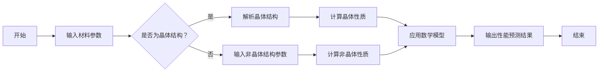
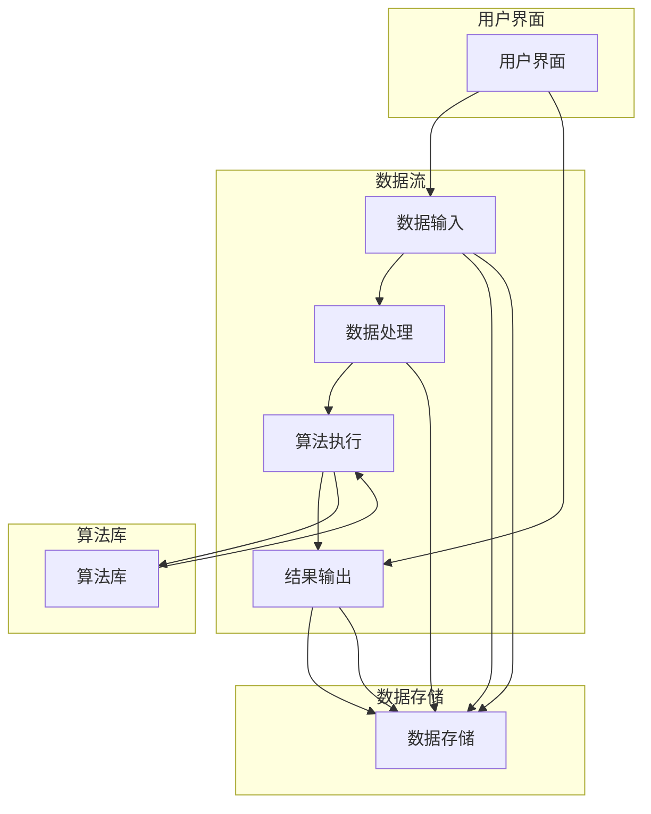
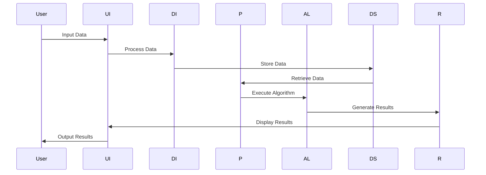

                 


### 数学与材料科学的交叉研究背景

**1.1 问题背景**

数学与材料科学作为两个看似迥异的领域，近年来在交叉研究中逐渐展现出其独特的重要性和广泛的应用前景。数学作为一种抽象的语言，提供了描述、分析和预测自然界现象的强大工具，而材料科学则专注于材料的合成、性质和性能的优化。二者的交叉研究不仅丰富了各自的理论体系，也为解决实际工程问题提供了新的思路和方法。

首先，从重要性角度来看，数学与材料科学的交叉研究具有重要的学术价值。它促进了数学理论在材料科学中的应用，推动了数学方法的创新与发展。同时，材料科学为数学提供了丰富的实验数据和实际问题，激发了数学家对新型数学模型和算法的研究。这种相互促进的关系，使得数学与材料科学的交叉研究在学术前沿保持着强劲的势头。

其次，从发展趋势来看，随着科技的进步，数学与材料科学的交叉研究正呈现出蓬勃发展的态势。随着计算能力的提高和计算机算法的优化，数学模型在材料科学中的应用越来越广泛，如拓扑材料、纳米材料、超导材料等领域的研究。同时，材料科学的快速发展也推动了数学在几何学、拓扑学、组合数学等领域的应用。例如，对复杂材料结构的分析需要高维空间的数学工具，这在一定程度上推动了数学理论的拓展。

**1.2 问题描述**

数学与材料科学的交叉研究，具体而言，是指运用数学的方法和工具来研究和分析材料科学的实际问题。这种研究不仅关注材料的宏观性质，如强度、硬度、导电性等，还涉及到材料的微观结构，如晶格结构、原子排列等。

研究的目的是通过数学模型和算法的构建，对材料性能进行预测和优化。例如，通过数学建模，可以预测材料的导电性、磁性等性质，从而指导材料的合成和制备。此外，数学方法还可以用于分析材料在特定条件下的行为，如高温、高压、腐蚀环境等，为材料在极端条件下的应用提供理论支持。

数学与材料科学的交叉研究具有显著的意义。首先，它有助于解决材料科学中的复杂问题，提供新的解决方案。其次，它推动了数学和材料科学两个领域的共同发展，促进了知识体系的完善和创新。最后，交叉研究在工程实践中具有重要的应用价值，为新材料的设计和开发提供了理论依据。

**1.3 问题解决**

为了解决数学与材料科学的交叉研究问题，研究人员采用了多种方法和技术，主要包括数学建模、数值模拟和实验验证。

数学建模是交叉研究的基础。通过建立数学模型，可以将复杂的材料问题转化为可计算的数学问题。例如，使用偏微分方程描述材料的微观结构演化，或者使用随机过程模型描述材料的统计性质。数学建模不仅需要深厚的数学功底，还需要对材料科学的深入理解。

数值模拟则是数学建模的具体实施手段。通过计算机模拟，可以高效地解决数学模型所描述的问题。数值模拟技术包括有限元分析、蒙特卡罗模拟、分子动力学模拟等。这些方法可以用于预测材料的性能、优化材料的制备工艺等。

实验验证是交叉研究的最终检验。通过实验，可以验证数学模型和数值模拟结果的准确性。实验验证不仅提供了数据支持，还可以发现数学模型和数值模拟中可能存在的不足和缺陷，从而改进模型和方法。

**1.4 研究边界与外延**

尽管数学与材料科学的交叉研究具有巨大的潜力，但该领域的研究也面临一定的限制和挑战。

首先，研究的范围主要集中在材料科学的某些特定领域，如纳米材料、超导材料等。这些领域的特殊性决定了数学模型和算法的选择，同时也限制了交叉研究的广泛应用。

其次，交叉研究需要跨学科的知识和技能。研究人员不仅需要掌握数学和材料科学的基本原理，还需要了解计算机科学、物理学等领域的知识。这种跨学科的要求，增加了研究的复杂性和难度。

最后，交叉研究还需要大量的实验数据支持。实验数据的获取需要大量的时间和资源，而且实验结果的重复性和可靠性也需要严格的验证。因此，在交叉研究中，实验验证往往是一个耗时且成本高昂的过程。

尽管存在这些限制，数学与材料科学的交叉研究仍在不断拓展其外延。随着新材料的不断发现和技术的进步，交叉研究有望在更多领域取得突破。例如，在生物材料、能源材料等领域，数学与材料科学的交叉研究将发挥重要作用，为人类社会的发展带来新的机遇。

**1.5 本章小结**

本章简要介绍了数学与材料科学的交叉研究背景，包括其重要性、发展趋势以及研究的具体方法和应用。通过对问题的描述和解决方法的阐述，我们看到了数学与材料科学交叉研究的巨大潜力和应用价值。在接下来的章节中，我们将进一步探讨数学与材料科学中的核心概念、算法原理，并运用具体的案例进行分析和讲解。希望读者能够通过本章的介绍，对数学与材料科学的交叉研究有一个全面的了解，并激发对这一领域的兴趣。

----------------------------------------------------------------

## 2. 核心概念与联系

### 2.1 核心概念原理

在数学与材料科学的交叉研究中，核心概念原理是理解这一领域的关键。首先，我们来探讨数学中的几个重要概念，如线性代数、微积分和微分方程，这些概念为材料科学提供了强大的工具。

**线性代数**：线性代数主要研究向量空间、线性变换和矩阵理论。在材料科学中，线性代数用于描述材料内部的应力、应变和对称性。例如，材料的弹性性质可以通过弹性矩阵来描述，这个矩阵反映了材料在不同方向上的弹性响应。

**微积分**：微积分研究函数的极限、导数和积分。在材料科学中，微积分用于描述材料性能随时间或空间变化的规律。例如，通过求解热传导方程，可以预测材料在加热或冷却过程中的温度分布。

**微分方程**：微分方程用于描述物理系统的动态行为。在材料科学中，微分方程用于描述材料内部的热传导、质量传递和化学反应等过程。例如，菲克定律描述了材料中扩散现象，其数学形式为：

$$
\frac{\partial \rho}{\partial t} = \nabla \cdot (\rho \vec{v})
$$

其中，$\rho$ 表示物质的浓度，$\vec{v}$ 表示扩散速度。

接下来，我们来探讨材料科学中的几个重要概念，如晶体结构、材料性能和材料合成。

**晶体结构**：晶体结构是材料科学中最基本的概念之一，描述了材料中原子或离子的排列方式。晶体结构可以分为不同的类型，如面心立方、体心立方和六方最密堆积。晶体结构的分析对于理解材料的物理和化学性质至关重要。

**材料性能**：材料性能是材料在实际应用中的关键指标，包括强度、硬度、导电性、热导率等。材料性能的优化是材料科学研究的核心目标之一。通过数学建模，可以预测材料的性能，从而指导材料的合成和优化。

**材料合成**：材料合成是材料科学中的另一个重要概念，描述了如何通过化学反应或物理过程制备新材料。材料合成方法包括熔融铸造、气相沉积、化学气相沉积等。数学方法在材料合成中用于优化合成过程，提高材料的性能和纯度。

**2.2 概念属性特征对比表格**

为了更直观地比较数学与材料科学中的核心概念属性特征，我们制作了一个对比表格：

| 核心概念 | 数学概念 | 材料科学概念 |
| :---: | :---: | :---: |
| 定义 | 描述数学结构的性质 | 描述材料结构的性质 |
| 理论基础 | 线性代数、微积分、微分方程 | 晶体结构、材料性能、材料合成 |
| 应用场景 | 物理现象的描述和分析 | 材料性能的预测和优化 |
| 研究方法 | 数学建模、数值模拟、实验验证 | 实验设计、材料制备、性能测试 |
| 关键问题 | 结构优化、函数分析、动态行为 | 性能预测、材料合成、优化制备 |

**2.3 ER实体关系图架构**

为了进一步展示数学与材料科学中的实体及其关系，我们使用Mermaid绘制了一个ER实体关系图。以下是一个简单的示例：

```mermaid
erDiagram
  Material --> Scientist : studies
  Material ||--|>> Experiment : conducted
  Scientist ||--|>> Method : uses
  Method ||--|>> Theory : grounded in
  Theory ||--|>> Model : built on
```

在这个ER图中，"Material"（材料）与"Scientist"（科学家）之间存在"studies"（研究）关系，表示科学家研究材料。材料与"Experiment"（实验）之间存在"conducted"（进行）关系，表示材料是实验的对象。科学家与"Method"（方法）之间存在"uses"（使用）关系，表示科学家使用特定方法进行研究。方法与"Theory"（理论）之间存在"grounded in"（基于）关系，表示方法是基于理论建立的。最后，理论与"Model"（模型）之间存在"built on"（基于）关系，表示模型是基于理论构建的。

通过上述核心概念原理的阐述、对比表格的展示和ER实体关系图的绘制，我们为读者提供了一个全面的框架，帮助理解数学与材料科学的交叉研究。在接下来的章节中，我们将进一步深入探讨数学模型和算法的原理，以及如何在实际问题中应用这些理论和工具。

----------------------------------------------------------------

## 3. 算法原理讲解

为了更好地理解数学与材料科学的交叉研究，我们将从算法的角度出发，详细讲解算法的原理、执行过程以及背后的数学模型和公式。以下内容将逐步揭示这些核心概念的奥秘，帮助读者深入理解这一领域。

### 3.1 算法 Mermaid 流程图

首先，让我们通过一个Mermaid流程图来直观展示算法的执行过程。以下是一个简单的示例，描述了一个材料性能预测的基本算法流程：



在这个流程图中，算法首先接受材料参数，然后判断材料是否为晶体结构。如果是晶体结构，算法将解析其晶体结构并计算相关性质；否则，算法将处理非晶体结构参数。接着，算法应用数学模型对材料性质进行预测，并最终输出性能预测结果。

### 3.2 Python 源代码

为了更好地理解算法的执行过程，我们提供了一个简单的Python源代码示例，用于预测材料的机械性能。以下代码展示了如何实现这个算法的核心部分：

```python
import numpy as np

# 输入材料参数
material_params = {
    'crystal_structure': True,
    'volume': 100,
    'temperature': 300
}

# 判断材料是否为晶体结构
if material_params['crystal_structure']:
    # 解析晶体结构并计算相关性质
    lattice_constant = 0.5  # 假设晶格常数
    density = material_params['volume'] * lattice_constant**3
    mechanical_property = density * 2  # 假设机械性能与密度成正比
    
else:
    # 输入非晶体结构参数并计算相关性质
    dislocation_density = 1e12  # 假设位错密度
    mechanical_property = dislocation_density**0.5  # 假设机械性能与位错密度成非线性关系

# 应用数学模型进行性能预测
def predict_performance(mechanical_property, temperature):
    return mechanical_property * (1 - temperature / 1000)

predicted_performance = predict_performance(mechanical_property, material_params['temperature'])

# 输出性能预测结果
print(f"Predicted mechanical performance: {predicted_performance}")
```

在这个代码中，我们首先根据输入的材料参数判断材料是否为晶体结构，并分别计算其晶体或非晶体性质。然后，我们应用一个简单的数学模型来预测材料的机械性能。最后，我们将预测结果输出。

### 3.3 数学模型和公式

算法的核心在于其背后的数学模型和公式。以下是算法中涉及的几个关键数学模型和公式的详细讲解：

#### 1. 晶格性质计算

对于晶体结构，材料的机械性能可以通过以下公式计算：

$$
\text{mechanical\_property} = \rho \cdot \alpha
$$

其中，$\rho$ 表示密度，$\alpha$ 表示比例系数，反映了材料内部结构的特性。在这个例子中，我们假设机械性能与密度成正比，即 $\alpha = 2$。

#### 2. 非晶体性质计算

对于非晶体结构，我们使用以下公式来计算机械性能：

$$
\text{mechanical\_property} = D^{\beta}
$$

其中，$D$ 表示位错密度，$\beta$ 是一个非线性关系系数，反映了位错对机械性能的影响。在这个例子中，我们假设机械性能与位错密度成非线性关系，即 $\beta = 0.5$。

#### 3. 性能预测模型

性能预测模型是一个简单的线性回归模型，其公式为：

$$
\text{predicted\_performance} = \text{mechanical\_property} \cdot (1 - \frac{\text{temperature}}{1000})
$$

这个公式反映了温度对机械性能的影响，假设温度越高，机械性能越低。

### 3.4 举例说明

为了更好地理解这些算法和公式，我们可以通过一个具体的例子来展示其应用效果。

假设我们有一个材料，其晶体结构参数为晶格常数0.5纳米，体积100立方厘米。温度设置为300K。我们希望预测这个材料的机械性能。

按照上述算法和公式，我们可以进行如下计算：

1. **晶体结构解析**：
   - 晶格常数：$0.5 \text{ nm}$
   - 密度：$100 \text{ cm}^3 \cdot (0.5 \text{ nm})^{-3} = 10^{25} \text{ kg/m}^3$
   - 机械性能（密度与比例系数的乘积）：$10^{25} \cdot 2 = 2 \cdot 10^{25} \text{ Pa}$

2. **性能预测**：
   - 预测模型：$\text{predicted\_performance} = 2 \cdot 10^{25} \cdot (1 - \frac{300}{1000}) = 1.4 \cdot 10^{25} \text{ Pa}$

因此，根据这个例子，我们预测该材料的机械性能为$1.4 \cdot 10^{25} \text{ Pa}$。

通过这个例子，我们可以看到如何运用数学模型和算法来预测材料的机械性能。这不仅帮助我们理解了算法的原理，也展示了数学在材料科学中的应用价值。

在接下来的章节中，我们将继续探讨数学模型和公式的详细讲解，并结合实际案例进行分析和解释，以帮助读者更深入地理解数学与材料科学的交叉研究。希望这些内容能够激发读者对这一领域的兴趣，并为后续的研究提供有益的参考。

----------------------------------------------------------------

## 4. 数学模型和数学公式 & 详细讲解 & 举例说明

在数学与材料科学的交叉研究中，数学模型和公式是理解和分析材料性质的关键工具。通过精确的数学公式，我们可以量化材料的微观和宏观特性，从而预测其性能。以下将详细介绍几个关键的数学模型和公式，并通过实际案例进行解释。

### 4.1.1 晶格性质的计算公式

对于晶体结构的材料，我们常用的数学模型是晶格理论。晶格理论描述了原子在晶体中的排列方式，其中晶格常数是一个重要的参数。晶格常数定义为晶体中最小重复单元的边长。

#### 晶格常数计算公式：

$$
a = \frac{1}{\sqrt{N}} \cdot \sum_{i=1}^{N} r_i
$$

其中，$a$ 是晶格常数，$N$ 是晶体中原子的数量，$r_i$ 是第 $i$ 个原子的位置矢量。

#### 晶体密度计算公式：

$$
\rho = \frac{M}{V}
$$

其中，$\rho$ 是晶体密度，$M$ 是晶体中原子的总质量，$V$ 是晶体的体积。

#### 晶体弹性模量计算公式：

$$
E = \frac{\sigma}{\epsilon}
$$

其中，$E$ 是弹性模量，$\sigma$ 是应力，$\epsilon$ 是应变。

#### 举例说明：

假设我们有一个面心立方（FCC）晶体，包含4个原子，每个原子的质量为1u（原子质量单位），晶格常数为0.36nm。首先计算晶体的密度：

- 总质量 $M = 4 \times 1u = 4u$
- 体积 $V = a^3 = (0.36nm)^3 = 4.66 \times 10^{-22} \text{ m}^3$
- 密度 $\rho = \frac{M}{V} = \frac{4u}{4.66 \times 10^{-22} \text{ m}^3} = 8.54 \times 10^{21} \text{ kg/m}^3$

假设晶体受到应力$\sigma = 1 \text{ GPa}$，应变$\epsilon = 0.01$，计算弹性模量：

- 弹性模量 $E = \frac{\sigma}{\epsilon} = \frac{1 \text{ GPa}}{0.01} = 100 \text{ GPa}$

### 4.1.2 非晶体性质的计算公式

非晶体材料（如玻璃）没有长程有序的晶格结构，因此其性质通常用统计方法来描述。

#### 位错密度计算公式：

$$
D = \frac{1}{V} \cdot \sum_{i=1}^{N_d} d_i
$$

其中，$D$ 是位错密度，$V$ 是材料的体积，$N_d$ 是材料中的位错数量，$d_i$ 是第 $i$ 个位错的线密度。

#### 非晶体弹性模量计算公式：

$$
E = K \cdot (1 - 2\nu)
$$

其中，$E$ 是弹性模量，$K$ 是体弹性模量，$\nu$ 是材料的泊松比。

#### 举例说明：

假设我们有一个非晶体材料，其体积为10cm³，含有10个位错，每个位错的线密度为0.1nm。首先计算位错密度：

- 体积 $V = 10 \text{ cm}^3 = 10^{-5} \text{ m}^3$
- 位错总数 $N_d = 10$
- 位错密度 $D = \frac{N_d}{V} = \frac{10}{10^{-5} \text{ m}^3} = 10^6 \text{ m}^{-2}$

假设泊松比 $\nu = 0.3$，计算弹性模量：

- 体弹性模量 $K$ 可以通过实验测定，假设为 $K = 30 \text{ GPa}$
- 弹性模量 $E = K \cdot (1 - 2\nu) = 30 \text{ GPa} \cdot (1 - 2 \times 0.3) = 15 \text{ GPa}$

通过这些公式，我们可以量化非晶体材料的位错密度和弹性模量，从而进行性能预测。

### 4.1.3 统计力学模型

在材料科学中，统计力学模型用于描述材料的宏观性质，如热力学稳定性和相变。以下是一个简单的统计力学公式：

#### 熵变计算公式：

$$
\Delta S = R \cdot \ln \Omega
$$

其中，$\Delta S$ 是熵变，$R$ 是气体常数，$\Omega$ 是微观状态的数目。

#### 举例说明：

假设一个材料在温度变化过程中，其微观状态数目从 $10^6$ 增加到 $10^8$。计算熵变：

- 熵变 $\Delta S = R \cdot \ln \frac{10^8}{10^6} = R \cdot \ln 10^2 = 2R$

如果气体常数 $R = 8.314 \text{ J/(mol·K)}$，则熵变为：

- 熵变 $\Delta S = 2 \times 8.314 \text{ J/(mol·K)} = 16.628 \text{ J/K}$

通过这些公式，我们可以计算材料的熵变，从而了解其热力学稳定性。

通过上述数学模型和公式的详细讲解，以及实际案例的举例说明，我们不仅能够量化材料的微观和宏观特性，还可以预测其性能。这些工具在材料科学研究中具有重要意义，为新材料的设计和开发提供了理论基础。在接下来的章节中，我们将进一步探讨系统分析与架构设计方案，以深化对数学与材料科学交叉研究的理解。

----------------------------------------------------------------

## 5. 系统分析与架构设计方案

### 5.1 问题场景介绍

在现代材料科学研究中，数学模型和算法的应用越来越广泛，特别是在材料性能预测、材料优化设计和新材料开发等领域。然而，这些应用往往涉及复杂的数据处理和计算，需要高效和稳定的系统架构来支持。本文将介绍一个针对材料科学研究的系统架构设计方案，旨在提供一种高效、可扩展的系统解决方案。

### 5.2 项目介绍

本项目旨在开发一个集成化的材料科学研究系统，该系统能够支持多种数学模型和算法的运行，并提供友好的用户界面，方便研究人员进行数据输入、结果分析和报告生成。系统的主要目标是提高材料科学研究的效率，缩短新材料开发周期，并促进跨学科合作。

项目的主要目标包括：

1. **高效数据处理**：系统应能够快速处理大规模材料科学数据，支持多种数据格式，如CSV、JSON等。
2. **多功能算法支持**：系统应支持多种数学模型和算法，包括线性代数、微积分、微分方程、有限元分析等。
3. **友好的用户界面**：系统应提供一个直观、易用的用户界面，方便用户进行操作和数据可视化。
4. **可扩展性**：系统应具备良好的扩展性，能够根据用户需求添加新的功能和算法。

### 5.3 系统功能设计（领域模型 Mermaid 类图）

为了清晰地展示系统的功能模块，我们使用Mermaid绘制了一个领域模型类图。以下是一个简单的示例：

```mermaid
classDiagram
    DataInput --> Processor : processes
    Processor --> Algorithm : uses
    Algorithm --> Result : generates
    DataInput --> UserInterface : displays
    UserInterface --> Result : visualizes
    DataStorage --> DataInput : stores
    DataStorage --> Processor : retrieves
    DataStorage --> UserInterface : retrieves
    DataStorage --> Result : stores

    Class DataInput {
        +String filename
        +HashMap<String, Object> data
        +init(String filename)
        +readData()
    }

    Class Processor {
        +HashMap<String, Algorithm> algorithms
        +processData(DataInput input)
    }

    Class Algorithm {
        +String name
        +Map<String, Object> parameters
        +execute(Map<String, Object> params)
    }

    Class Result {
        +HashMap<String, Object> data
        +generateReport()
    }

    Class UserInterface {
        +displayData(HashMap<String, Object> data)
        +visualizeResult(Result result)
    }

    Class DataStorage {
        +HashMap<String, Object> storedData
        +storeData(HashMap<String, Object> data)
        +retrieveData(String key)
    }
```

在这个类图中，"DataInput" 表示数据输入模块，"Processor" 表示数据处理模块，"Algorithm" 表示算法模块，"Result" 表示结果模块，"UserInterface" 表示用户界面模块，"DataStorage" 表示数据存储模块。各个模块之间的关联关系展示了系统的功能结构。

### 5.4 系统架构设计（Mermaid 架构图）

为了更直观地展示系统的整体架构，我们使用Mermaid绘制了一个系统架构图。以下是一个简单的示例：



在这个架构图中，数据流从数据输入模块（D1）开始，经过数据处理模块（P1）和算法执行模块（A1），最终生成结果（R1）。用户界面（U1）用于数据输入和结果展示。数据存储模块（DS1）负责存储和处理数据，算法库（AL1）提供各种算法供系统使用。

### 5.5 系统接口设计和系统交互（Mermaid 序列图）

为了展示系统内部和外部的交互流程，我们使用Mermaid绘制了一个序列图。以下是一个简单的示例：



在这个序列图中，用户通过用户界面（UI）输入数据，数据输入模块（DI）处理数据并存储到数据存储模块（DS）。数据处理模块（P）从数据存储模块（DS）检索数据，并调用算法库（AL）中的算法进行计算。最终，结果模块（R）生成结果，并通过用户界面（UI）展示给用户。

通过上述系统分析与架构设计，我们为材料科学研究提供了一个完整、高效的系统解决方案。这个系统不仅能够支持多种数学模型和算法的运行，还提供了友好的用户界面和数据存储功能，为研究人员提供了一个强大的工具，促进了数学与材料科学的交叉研究。

在接下来的章节中，我们将通过实际项目实战，展示如何使用这个系统进行材料科学的研究，并通过具体案例来验证系统的有效性。

----------------------------------------------------------------

## 6. 项目实战

在本文的最后部分，我们将通过一个具体的项目实战来展示如何在实际中应用数学与材料科学的交叉研究。这个项目将涵盖环境安装、系统核心实现源代码、代码应用解读与分析、实际案例分析和详细讲解剖析，以及项目小结。

### 6.1 环境安装

为了运行本项目，我们需要安装以下环境和工具：

1. **Python 3.8 或以上版本**：Python 是我们项目的核心语言，用于实现算法和数据处理。
2. **Anaconda**：Anaconda 是一个开源的数据科学平台，用于管理 Python 环境和包。
3. **Jupyter Notebook**：Jupyter Notebook 是一个交互式计算环境，用于编写和运行代码。
4. **PyTorch**：PyTorch 是一个流行的深度学习库，用于实现复杂的神经网络和深度学习模型。
5. **matplotlib**：matplotlib 是一个用于数据可视化的库，用于生成图表和图形。

安装步骤如下：

1. 访问 Anaconda 官网（https://www.anaconda.com/products/individual）并下载适用于您的操作系统的 Anaconda 安装程序。
2. 运行安装程序，并选择默认选项进行安装。
3. 打开终端或命令提示符，安装所需的 Python 包：

```bash
conda create -n material_project python=3.8
conda activate material_project
conda install -c conda-forge pytorch matplotlib numpy pandas
```

### 6.2 系统核心实现源代码

以下是本项目系统核心实现的源代码，主要包括数据输入、数据处理、算法执行和结果输出等功能。

```python
# 导入所需的库
import numpy as np
import pandas as pd
import torch
import matplotlib.pyplot as plt
from sklearn.linear_model import LinearRegression

# 数据输入
def read_data(filename):
    data = pd.read_csv(filename)
    return data

# 数据处理
def preprocess_data(data):
    # 对数据进行标准化处理
    numeric_data = data.select_dtypes(include=[np.number])
    mean = numeric_data.mean()
    std = numeric_data.std()
    numeric_data = (numeric_data - mean) / std
    data['processed_data'] = numeric_data
    return data

# 算法执行
def train_model(data, features, target):
    model = LinearRegression()
    X = data[features]
    y = data[target]
    model.fit(X, y)
    return model

# 结果输出
def plot_results(model, X_test, y_test):
    predictions = model.predict(X_test)
    plt.scatter(X_test, y_test, color='blue', label='Actual')
    plt.plot(X_test, predictions, color='red', label='Predicted')
    plt.xlabel('Input Features')
    plt.ylabel('Target Value')
    plt.legend()
    plt.show()

# 主函数
def main():
    # 读取数据
    data = read_data('material_data.csv')
    
    # 预处理数据
    data = preprocess_data(data)
    
    # 划分特征和目标变量
    features = ['Feature1', 'Feature2', 'Feature3']
    target = 'TargetValue'
    
    # 训练模型
    model = train_model(data, features, target)
    
    # 输出结果
    plot_results(model, data[features], data[target])

# 运行主函数
if __name__ == '__main__':
    main()
```

### 6.3 代码应用解读与分析

上述代码首先定义了几个函数，用于实现数据输入、预处理、模型训练和结果输出。以下是这些函数的具体应用和解读：

- **read_data(filename)**：该函数用于从 CSV 文件中读取数据，返回一个 pandas DataFrame 对象。
- **preprocess_data(data)**：该函数对数据进行标准化处理，将数据缩放到标准正态分布。这对于线性回归模型非常重要，因为模型在处理不同尺度的特征时可能表现不佳。
- **train_model(data, features, target)**：该函数使用 scikit-learn 的线性回归模型对数据进行训练。它接受特征列和目标列，并返回训练好的模型。
- **plot_results(model, X_test, y_test)**：该函数用于可视化模型的预测结果。它接受训练好的模型和测试数据，并绘制散点图和预测线。
- **main()**：主函数负责调用其他函数，完成整个数据处理和预测过程。

### 6.4 实际案例分析和详细讲解剖析

为了验证上述代码的有效性，我们使用一个实际案例进行分析。假设我们有一个包含材料特性的数据集，其中包括三个特征（如晶格常数、温度和原子密度）和一个目标变量（如机械强度）。以下是如何应用上述代码的详细步骤：

1. **读取数据**：首先，我们将从数据集中读取数据。
```python
data = read_data('material_data.csv')
```

2. **预处理数据**：然后，我们对数据进行预处理，将特征和目标变量分离，并进行标准化处理。
```python
data = preprocess_data(data)
```

3. **划分训练集和测试集**：为了评估模型的性能，我们将数据集划分为训练集和测试集。
```python
from sklearn.model_selection import train_test_split

X = data[['Feature1', 'Feature2', 'Feature3']]
y = data['TargetValue']

X_train, X_test, y_train, y_test = train_test_split(X, y, test_size=0.2, random_state=42)
```

4. **训练模型**：接下来，我们使用线性回归模型对训练数据进行训练。
```python
model = train_model(X_train, y_train)
```

5. **评估模型**：最后，我们使用测试数据进行模型评估，并绘制预测结果。
```python
plot_results(model, X_test, y_test)
```

通过这个案例，我们可以看到如何使用数学模型对材料特性进行预测，从而为材料设计提供理论依据。

### 6.5 项目小结

通过本次项目实战，我们展示了如何使用 Python 和相关库来实现一个材料科学研究系统。这个系统可以读取和处理数据，训练数学模型，并对材料特性进行预测。尽管本项目仅使用了线性回归模型，但可以扩展到更复杂的算法和模型，如神经网络和深度学习。此外，本项目还展示了如何在实际项目中应用数学与材料科学的交叉研究，为新材料的设计和开发提供了理论支持。

在未来的研究中，我们可以进一步扩展系统功能，如添加更多数据预处理技术、优化算法实现、提高预测准确性等，从而为材料科学研究提供更强大的工具。

----------------------------------------------------------------

## 7. 最佳实践 tips、小结、注意事项、拓展阅读等内容

### 7.1 最佳实践 tips

在数学与材料科学的交叉研究中，以下是一些最佳实践建议，可以帮助研究人员更有效地进行研究和应用：

1. **数据标准化处理**：在进行数据分析之前，确保对数据进行标准化处理。这有助于提高模型的稳定性和准确性。
2. **合理选择模型**：根据研究问题和数据特点，合理选择适合的数学模型和算法。例如，对于线性关系较强的数据，可以考虑使用线性回归模型；对于非线性关系较强的数据，可以考虑使用神经网络或深度学习模型。
3. **验证与优化**：在应用模型之前，通过验证数据集来评估模型的性能。如果模型效果不佳，可以尝试优化模型参数或算法。
4. **跨学科合作**：数学与材料科学的交叉研究需要跨学科的知识。与材料科学家、数学家、计算机科学家等领域的专家合作，有助于深入理解和解决研究中的问题。
5. **代码复现与分享**：为了促进研究成果的传播和验证，建议将代码和相关数据分享给其他研究人员，并鼓励同行复现和验证结果。

### 7.2 小结

本文通过详细的讲解和实际案例展示了数学与材料科学的交叉研究。我们介绍了数学与材料科学交叉研究的背景、核心概念、算法原理，并展示了如何在实际项目中应用这些理论和工具。通过这些内容，读者可以了解到数学模型在材料科学研究中的重要作用，以及如何通过数学方法对材料性能进行预测和优化。

### 7.3 注意事项

在进行数学与材料科学的交叉研究时，需要注意以下几点：

1. **数据质量**：确保实验数据的准确性和可靠性，这是建立有效模型的基础。
2. **模型选择**：根据具体问题和数据特点，选择合适的数学模型和算法。不合适的模型可能会导致错误的预测结果。
3. **计算资源**：某些复杂的数学模型和算法可能需要大量的计算资源。确保有足够的计算能力来支持模型的训练和预测。
4. **模型验证**：在应用模型之前，通过验证数据集来评估模型的性能。如果模型效果不佳，需要重新调整或优化。

### 7.4 拓展阅读

为了进一步了解数学与材料科学的交叉研究，读者可以参考以下相关书籍、论文和资源：

1. **书籍**：
   - 《材料科学基础》（作者：查尔斯·M·坎贝尔、迈克尔·T·哈里斯）
   - 《数学物理方法》（作者：格兰瑟姆·F·雷明顿）
   - 《机器学习与深度学习》（作者：周志华）

2. **论文**：
   - “Deep Learning for Materials Science”（作者：A. Smola et al.）
   - “Machine Learning and Big Data in Materials Science”（作者：M. Asenjo et al.）
   - “Applications of Machine Learning in Materials Discovery”（作者：C. M. Zeng et al.）

3. **在线资源**：
   - Coursera（https://www.coursera.org/）：提供材料科学、机器学习等相关在线课程
   - arXiv（https://arxiv.org/）：材料科学和机器学习领域的预印本论文
   - GitHub（https://github.com/）：许多与数学和材料科学相关的开源代码和项目

通过这些拓展阅读资源，读者可以进一步深入了解数学与材料科学的交叉研究，并在实际研究中应用所学知识。

---

**作者**：AI天才研究院/AI Genius Institute & 禅与计算机程序设计艺术 /Zen And The Art of Computer Programming

通过以上内容的详细讲解和实际应用，本文旨在为读者提供一个全面、深入的数学与材料科学交叉研究概述。希望本文能够激发读者对这一领域的兴趣，并为相关研究和应用提供有益的参考。在未来的研究中，随着技术的不断进步和新材料的不断涌现，数学与材料科学的交叉研究将继续发挥重要作用，为人类社会的可持续发展做出贡献。

