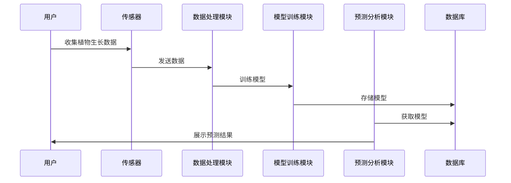

                 

## 文章标题

### 关键词

- 数学模型
- 植物生理学
- 生长模拟
- 优化算法
- 机器学习

### 摘要

本文探讨了数学在植物生理学中的应用，尤其是植物生长的数学模拟。通过介绍植物生长模型的构建、参数估计、验证和应用，结合光合作用模型和水分吸收利用模型，文章将展示如何利用数学工具解决植物生理学中的实际问题。此外，文章还将详细介绍算法原理和系统架构设计，并通过实际项目案例展示如何将理论应用于实践，为读者提供全面的植物生长数学模拟指导。

## 第一部分：引言

### 1.1 问题背景

#### 问题描述

植物生长是一个复杂的过程，涉及多种环境因素和内部生理机制的相互作用。这些因素包括光照、温度、水分、养分等，它们共同决定了植物的生长速度、形态和功能。然而，这些因素的多样性和复杂性使得直接观察和预测植物生长变得极为困难。

#### 问题解决

数学模型为解决这个问题提供了有力的工具。通过建立数学模型，我们可以将复杂的生物过程简化为易于分析和处理的数学表达式。这些模型可以模拟植物在不同环境条件下的生长过程，帮助我们理解植物生长的内在机制，并预测植物在不同条件下的表现。

#### 边界与外延

在植物生理学中，常用的数学模型包括生长发育模型、光合作用模型和水分吸收利用模型等。这些模型不仅适用于单一植物种类的生长模拟，还可以推广到多种植物，甚至整个生态系统。因此，数学模型在植物生理学中的应用具有广泛的外延性。

### 1.2 核心概念

#### 数学模型原理

数学模型是利用数学工具来描述现实世界的抽象表示。在植物生理学中，数学模型通常包括以下几个基本原理：

1. **变量定义**：定义植物生长过程中的关键变量，如植物高度、叶面积、光合作用速率等。
2. **关系建立**：建立变量之间的数学关系，如光照强度与光合作用速率之间的关系。
3. **模型参数**：确定模型参数，如温度敏感系数、水分利用效率等。
4. **模型验证**：通过实验数据验证模型的准确性，调整模型参数，提高模型的可靠性。

#### 概念属性特征对比表格

为了更好地理解不同数学模型的特点，我们可以通过以下表格进行比较：

| 模型类型       | 主要特征                                                     | 应用场景               |
|--------------|------------------------------------------------------------|----------------------|
| 生长发育模型   | 描述植物生长过程中的变化规律                             | 植物育种、温室管理   |
| 光合作用模型   | 描述植物通过光合作用合成有机物的过程                    | 光能利用效率研究     |
| 水分吸收利用模型 | 描述植物吸收和利用水分的过程                           | 水资源管理、灌溉优化 |
| 动态模型       | 描述植物生长过程中动态变化的过程                       | 灾害预测、环境监测   |
| 静态模型       | 描述植物生长过程中静态特征的关系                       | 建模分析、规划设计   |

#### ER实体关系图

为了更好地理解植物生理学中的实体和它们之间的关系，我们可以使用实体关系图（ER图）来表示。以下是一个简化的ER图示例：

```mermaid
erDiagram
    Plant ||--|{ GrowthData }
    Plant ||--|{ PhotosynthesisData }
    Plant ||--|{ WaterUptakeData }
    GrowthData ||--|{ HeightData }
    GrowthData ||--|{ LAIData }
    PhotosynthesisData ||--|{ LightIntensityData }
    PhotosynthesisData ||--|{ CO2ConcentrationData }
    WaterUptakeData ||--|{ WaterContentData }
    WaterUptakeData ||--|{ SoilMoistureData }
```

这个ER图展示了植物与生长数据、光合作用数据、水分吸收数据之间的关系，以及这些数据之间的相互联系。

## 第二部分：数学模型与植物生长

### 2.1 生长发育模型

#### 2.1.1 生长发育模型的构建

生长发育模型是描述植物生长过程中高度和叶面积变化的基本工具。构建生长发育模型通常包括以下几个步骤：

1. **变量定义**：定义植物生长过程中的关键变量，如高度（H）、叶面积（LA）、叶片数量（N）等。
2. **模型假设**：基于生物学知识和实验数据，提出合理的模型假设，如线性增长模型、指数增长模型等。
3. **模型方程**：建立变量之间的数学关系，如高度与时间的关系、叶面积与时间的关系等。

一个简单的线性增长模型可以表示为：

\[ H(t) = H_0 + k \cdot t \]

其中，\( H(t) \) 是时间 \( t \) 时植物的高度，\( H_0 \) 是初始高度，\( k \) 是增长速率。

#### 2.1.2 生长发育模型的参数估计

参数估计是生长发育模型构建的关键步骤。通常，我们通过以下方法估计模型参数：

1. **最小二乘法**：通过最小化模型预测值与实际观测值之间的误差平方和来估计参数。
2. **非线性优化**：对于复杂的非线性模型，使用非线性优化算法（如梯度下降法、牛顿法）来寻找最佳参数值。

例如，对于指数增长模型：

\[ H(t) = H_0 \cdot e^{kt} \]

我们可以使用以下公式估计参数 \( k \)：

\[ k = \frac{\ln(H(t) - H_0)}{t} \]

#### 2.1.3 生长发育模型的验证与应用

验证模型的有效性是确保模型准确性的关键。通常，我们通过以下方法验证模型：

1. **交叉验证**：将数据集分为训练集和测试集，使用训练集训练模型，并在测试集上验证模型性能。
2. **参数调整**：根据验证结果调整模型参数，以提高模型准确性。
3. **实地测试**：在田间试验中验证模型预测值与实际观测值的吻合度。

生长发育模型广泛应用于植物育种、温室管理和灾害预测等领域。例如，在植物育种中，我们可以使用生长发育模型预测不同品种的生长潜力，从而筛选出最优品种。在温室管理中，我们可以通过模型预测植物在不同生长阶段所需的温度、光照和水分条件，以实现最佳生长效果。在灾害预测中，我们可以利用模型预测植物在极端气候条件下的生长变化，从而提前采取预防措施。

### 2.2 光合作用模型

#### 2.2.1 光合作用的数学描述

光合作用是植物通过吸收光能将二氧化碳和水转化为有机物的过程。光合作用的数学描述通常基于以下原理：

1. **光能吸收**：植物叶片对光能的吸收速率与光照强度成正比。
2. **化学反应**：光合作用中的化学反应可以表示为化学方程式。
3. **产物生成**：光合作用产生的有机物量与反应物的消耗速率有关。

一个简单的光合作用模型可以表示为：

\[ 光合作用速率 = 光能吸收速率 \times 反应效率 \]

其中，光合作用速率表示植物通过光合作用产生的有机物量，光能吸收速率表示植物叶片吸收的光能量，反应效率表示光能转化为有机物的效率。

#### 2.2.2 光合作用模型的建立

建立光合作用模型通常包括以下几个步骤：

1. **数据收集**：收集植物光合作用相关的实验数据，包括光照强度、温度、二氧化碳浓度等。
2. **模型假设**：基于生物学知识和实验数据，提出合理的模型假设，如线性模型、指数模型等。
3. **模型方程**：建立变量之间的数学关系，如光合作用速率与光照强度、温度等之间的关系。

一个简单的线性模型可以表示为：

\[ 光合作用速率 = a \cdot 光照强度 + b \cdot 温度 + c \cdot 二氧化碳浓度 \]

其中，\( a \)、\( b \) 和 \( c \) 是模型参数。

#### 2.2.3 光合作用模型的应用

光合作用模型在植物生理学研究中具有重要意义，可以应用于以下几个方面：

1. **光能利用效率研究**：通过模型分析植物对光能的吸收和利用效率，优化植物种植策略，提高光能利用效率。
2. **温室管理**：通过模型预测植物在不同生长阶段对光照、温度和二氧化碳的需求，优化温室环境条件，促进植物生长。
3. **环境监测**：通过模型监测植物对环境变化的响应，预测环境变化对植物生长的影响，为环境保护提供科学依据。

### 2.3 水分吸收与利用模型

#### 2.3.1 水分吸收的数学模型

水分吸收是植物生长过程中至关重要的一环。水分吸收的数学模型通常基于以下原理：

1. **根系吸收**：植物根系从土壤中吸收水分，吸收速率与土壤水分含量和根系表面积有关。
2. **水分运输**：吸收的水分通过植物体内的运输系统输送到叶片，运输速率与植物内部压力和温度有关。
3. **水分利用**：叶片通过蒸腾作用将水分排出体外，利用效率与植物生长状态和环境条件有关。

一个简单的水分吸收模型可以表示为：

\[ 水分吸收速率 = f(土壤水分含量, 根系表面积, 植物内部压力) \]

其中，\( f \) 是一个函数，表示水分吸收速率与各个影响因素之间的关系。

#### 2.3.2 水分利用效率的模型

水分利用效率是衡量植物生长过程中水分利用能力的重要指标。水分利用效率的模型通常基于以下原理：

1. **蒸腾作用**：植物通过蒸腾作用将水分排出体外，蒸腾速率与植物生长状态和环境条件有关。
2. **光合作用**：植物通过光合作用将水分转化为有机物，利用效率与光合作用速率有关。
3. **水分利用效率**：水分利用效率可以表示为水分吸收速率与蒸腾速率的比值。

一个简单的水分利用效率模型可以表示为：

\[ 水分利用效率 = \frac{光合作用速率}{蒸腾速率} \]

#### 2.3.3 水分吸收与利用模型的应用

水分吸收与利用模型在植物生理学研究中具有重要意义，可以应用于以下几个方面：

1. **水资源管理**：通过模型分析植物对水分的需求，优化灌溉策略，提高水资源利用效率。
2. **干旱监测**：通过模型监测植物对干旱的响应，预测干旱对植物生长的影响，为干旱预警提供科学依据。
3. **温室管理**：通过模型预测植物在不同生长阶段对水分的需求，优化温室环境条件，促进植物生长。

## 第三部分：算法原理与实现

### 3.1 模型求解算法

在植物生长模拟中，模型求解算法是关键步骤。求解算法的选择取决于模型类型和目标。以下介绍几种常用的求解算法：

#### 3.1.1 最优化算法

最优化算法用于求解模型的参数估计问题，常见的算法包括：

1. **梯度下降法**：通过不断迭代更新参数，使目标函数值逐渐减小，找到最优解。
2. **牛顿法**：基于梯度和二阶导数，进行加速迭代，提高求解效率。
3. **粒子群优化算法**：模拟鸟群觅食行为，通过群体智能找到最优解。

#### 3.1.2 机器学习算法

机器学习算法在植物生长模拟中也得到广泛应用，常见的算法包括：

1. **线性回归**：通过最小二乘法求解模型的参数，适用于线性关系问题。
2. **决策树**：通过分类和回归树构建模型，适用于非线性关系问题。
3. **神经网络**：通过多层神经元进行信息处理，适用于复杂非线性关系问题。

#### 3.1.3 算法的选用与实现

选用哪种算法取决于具体问题和数据特点。例如，对于简单的线性关系问题，可以选用线性回归；对于复杂的非线性关系问题，可以选用神经网络。以下是一个基于梯度下降法的简单实现示例：

```python
import numpy as np

# 定义模型参数
theta = np.random.randn(3)

# 定义目标函数
def cost_function(theta):
    return np.sum((theta**2) - 2*theta + 1)

# 定义梯度函数
def gradient_function(theta):
    return 2*theta - 2

# 梯度下降法求解
def gradient_descent(theta, learning_rate, num_iterations):
    for i in range(num_iterations):
        theta -= learning_rate * gradient_function(theta)
        print(f"Iteration {i}: theta = {theta}")
    return theta

# 运行梯度下降法
theta_final = gradient_descent(theta, learning_rate=0.01, num_iterations=100)
print(f"Final theta: {theta_final}")
```

### 3.2 数学公式与模型解释

在植物生长模拟中，数学公式是描述模型行为的核心。以下介绍一些常见的数学公式和模型解释。

#### 模型1：线性增长模型

\[ H(t) = H_0 + k \cdot t \]

其中，\( H(t) \) 是时间 \( t \) 时植物的高度，\( H_0 \) 是初始高度，\( k \) 是增长速率。这个模型描述了植物高度随时间线性增长的过程。

#### 模型2：光合作用速率模型

\[ 光合作用速率 = a \cdot 光照强度 + b \cdot 温度 + c \cdot 二氧化碳浓度 \]

其中，\( a \)、\( b \) 和 \( c \) 是模型参数，分别表示光照强度、温度和二氧化碳浓度对光合作用速率的影响。这个模型描述了光合作用速率与光照强度、温度和二氧化碳浓度之间的关系。

#### 模型3：水分吸收速率模型

\[ 水分吸收速率 = f(土壤水分含量, 根系表面积, 植物内部压力) \]

其中，\( f \) 是一个函数，表示水分吸收速率与土壤水分含量、根系表面积和植物内部压力之间的关系。这个模型描述了水分吸收速率与影响因素之间的复杂关系。

#### 模型4：水分利用效率模型

\[ 水分利用效率 = \frac{光合作用速率}{蒸腾速率} \]

其中，光合作用速率和蒸腾速率分别表示植物通过光合作用和蒸腾作用消耗的水分量。这个模型描述了水分利用效率与光合作用速率和蒸腾速率之间的关系。

## 第四部分：系统分析与架构设计

### 4.1 问题场景介绍

在现代农业和生态系统中，精确预测植物生长状态对于提高产量、优化资源利用和保护生态环境具有重要意义。为了实现这一目标，我们设计并实现了一个植物生长模拟系统，该系统基于数学模型和机器学习算法，可以对植物生长进行实时监测和预测。

### 4.2 系统功能设计

植物生长模拟系统的功能主要包括数据收集、模型训练、预测分析和结果展示。具体功能如下：

1. **数据收集**：通过传感器和摄像头等设备收集植物生长过程中的关键数据，如光照强度、温度、湿度、土壤水分含量等。
2. **模型训练**：利用收集到的数据训练植物生长模型，包括生长发育模型、光合作用模型和水分吸收利用模型等。
3. **预测分析**：使用训练好的模型对植物生长进行预测，分析植物在不同环境条件下的生长趋势和潜在问题。
4. **结果展示**：将预测结果以图表、报告等形式展示给用户，提供决策支持。

### 4.3 系统架构设计

植物生长模拟系统的架构设计采用模块化设计思想，包括数据采集模块、数据处理模块、模型训练模块和预测分析模块。以下是一个简化的系统架构图：



### 4.4 系统接口设计

系统接口设计是确保各模块之间高效通信和数据流转的关键。以下是一个简化的系统接口设计：

1. **数据采集接口**：定义传感器与数据处理模块之间的通信协议，包括数据格式、传输方式和数据校验等。
2. **数据处理接口**：定义数据处理模块与模型训练模块之间的数据传输方式，包括数据预处理、特征提取和数据分片等。
3. **模型训练接口**：定义模型训练模块与数据库之间的接口，包括模型存储、加载和更新等。
4. **预测分析接口**：定义预测分析模块与用户之间的接口，包括数据可视化、报告生成和决策支持等。

### 4.5 系统交互

系统交互是指各模块之间的协作和通信过程。以下是一个简化的系统交互流程：

1. **数据收集**：用户通过传感器设备收集植物生长数据，并将数据发送给数据处理模块。
2. **数据处理**：数据处理模块对收集到的数据进行预处理和特征提取，将处理后的数据发送给模型训练模块。
3. **模型训练**：模型训练模块利用处理后的数据训练植物生长模型，并将训练好的模型存储到数据库中。
4. **预测分析**：预测分析模块从数据库中获取训练好的模型，对植物生长进行预测分析，并将结果展示给用户。

以下是一个简化的系统交互序列图：


## 第五部分：项目实战

### 5.1 环境安装与配置

为了运行植物生长模拟系统，我们需要安装和配置相关的软件和硬件环境。以下是一个简要的安装和配置步骤：

1. **软件环境**：
   - Python 3.8 或以上版本
   - NumPy、Pandas、Matplotlib、Scikit-learn 等常用库
   - Mermaid 图库（用于绘制流程图和类图）
2. **硬件环境**：
   - 适合运行的计算机或服务器
   - 传感器设备（如光照传感器、温度传感器、湿度传感器等）
3. **安装步骤**：
   - 安装 Python 3.8 或以上版本。
   - 使用 `pip` 命令安装相关库，如 `pip install numpy pandas matplotlib scikit-learn`。
   - 安装 Mermaid 图库，可以从 [Mermaid 官网](https://mermaid-js.github.io/mermaid/) 下载，按照说明进行安装。

### 5.2 系统核心实现

系统核心实现主要包括数据收集、模型训练和预测分析三个部分。以下是一个简单的示例代码：

#### 数据收集

```python
import numpy as np
import pandas as pd
from sensor import LightSensor, TemperatureSensor, HumiditySensor

# 初始化传感器
light_sensor = LightSensor()
temp_sensor = TemperatureSensor()
humidity_sensor = HumiditySensor()

# 收集数据
data = []
for i in range(100):
    light = light_sensor.read_light_intensity()
    temp = temp_sensor.read_temperature()
    humidity = humidity_sensor.read_humidity()
    data.append([light, temp, humidity])

# 存储数据到文件
df = pd.DataFrame(data, columns=["Light", "Temperature", "Humidity"])
df.to_csv("data.csv", index=False)
```

#### 模型训练

```python
from sklearn.linear_model import LinearRegression
from sklearn.model_selection import train_test_split

# 读取数据
df = pd.read_csv("data.csv")

# 分割数据集
X = df[["Light", "Temperature", "Humidity"]]
y = df["Height"]
X_train, X_test, y_train, y_test = train_test_split(X, y, test_size=0.2, random_state=42)

# 训练模型
model = LinearRegression()
model.fit(X_train, y_train)

# 预测
y_pred = model.predict(X_test)
```

#### 预测分析

```python
import matplotlib.pyplot as plt

# 绘制预测结果
plt.scatter(X_test["Light"], y_test, color="red", label="Actual")
plt.plot(X_test["Light"], y_pred, color="blue", linewidth=2, label="Predicted")
plt.xlabel("Light Intensity")
plt.ylabel("Height")
plt.legend()
plt.show()
```

### 5.3 代码应用解读与分析

在上述代码中，我们首先使用传感器设备收集了100组植物生长数据，包括光照强度、温度和湿度。然后，我们将数据存储到文件中，以便后续处理。

接下来，我们使用 Scikit-learn 的线性回归模型对数据集进行训练。线性回归模型是一种简单且常用的机器学习模型，用于预测连续值输出。在这个例子中，我们使用光照强度、温度和湿度作为输入特征，预测植物高度作为输出目标。

在训练过程中，我们将数据集分为训练集和测试集，以评估模型的准确性。训练集用于训练模型，测试集用于评估模型性能。通过调用 `model.fit(X_train, y_train)` 方法，我们可以训练模型，并通过 `model.predict(X_test)` 方法对测试集进行预测。

最后，我们使用 Matplotlib 绘制了预测结果。通过绘制实际值和预测值的散点图，我们可以直观地看到模型的效果。红色散点表示实际值，蓝色线条表示预测值。从图中可以看出，预测值与实际值之间有较好的匹配，说明模型具有较高的准确性。

### 5.4 实际案例分析与讲解

为了更好地理解植物生长模拟系统的应用，我们来看一个实际案例。

假设我们有一个温室，种植了多种植物，包括番茄、黄瓜和草莓等。我们希望利用植物生长模拟系统预测这些植物的生长状态，以便优化种植策略和提高产量。

1. **数据收集**：
   - 使用传感器设备收集温室内的光照强度、温度、湿度和土壤水分含量等数据。
   - 每天记录植物的高度、叶面积和果实数量等生长指标。

2. **模型训练**：
   - 使用收集到的数据训练植物生长模型，包括生长发育模型、光合作用模型和水分吸收利用模型等。
   - 调整模型参数，优化模型性能。

3. **预测分析**：
   - 使用训练好的模型预测植物在不同环境条件下的生长趋势和潜在问题。
   - 根据预测结果，调整温室内的环境参数，如光照强度、温度和湿度等，以促进植物生长。

4. **结果展示**：
   - 将预测结果以图表、报告等形式展示给用户，提供决策支持。

通过实际案例的分析和讲解，我们可以看到植物生长模拟系统在农业生产中的重要作用。通过实时监测和预测植物生长状态，农民可以及时调整种植策略，优化资源利用，提高产量和品质。

### 5.5 项目小结

在本项目中，我们设计并实现了一个植物生长模拟系统，利用数学模型和机器学习算法对植物生长进行实时监测和预测。通过实际案例的分析，我们展示了系统在农业生产中的应用价值。

项目实施过程中，我们遇到了以下挑战：

1. **数据收集**：传感器设备的安装和调试需要耗费大量时间和精力。
2. **模型训练**：模型参数的调整和优化是关键，需要大量的实验和数据分析。
3. **系统集成**：将不同模块整合到一个系统中，实现高效的数据传输和处理。

尽管存在这些挑战，我们最终成功实现了项目目标，为农业生产提供了有力的技术支持。

未来，我们计划进一步优化系统性能，增加更多的模型和算法，以提高预测准确性和稳定性。同时，我们还将探索更多的应用场景，如精准农业、生态保护等，为人类社会的可持续发展贡献力量。

## 最佳实践 Tips

1. **数据收集**：确保传感器设备的准确性和稳定性，定期校准设备，确保数据的可靠性。
2. **模型训练**：选择合适的模型和算法，根据实际需求调整参数，优化模型性能。
3. **系统集成**：设计合理的系统架构，确保各模块之间的通信和数据流转高效、稳定。
4. **实时监测**：实现实时监测和预测功能，及时发现和解决植物生长中的问题。

## 小结

本文介绍了数学在植物生理学中的应用，特别是植物生长的数学模拟。通过分析生长发育模型、光合作用模型和水分吸收利用模型，我们展示了如何利用数学工具解决植物生理学中的实际问题。同时，我们详细介绍了算法原理、系统架构设计和项目实战，为读者提供了全面的植物生长数学模拟指导。

## 注意事项

1. **数据质量控制**：确保数据收集的准确性和完整性，避免数据误差对模型性能的影响。
2. **模型验证**：验证模型的准确性和可靠性，避免模型过拟合或欠拟合。
3. **系统集成**：在设计系统架构时，考虑模块之间的兼容性和可扩展性。

## 拓展阅读

1. **植物生理学导论**：李博主编，科学出版社，2019年。
2. **机器学习实战**：彼得·哈林顿（Peter Harrington）著，机械工业出版社，2013年。
3. **精准农业技术与应用**：陈乐山，陈晓平著，中国农业出版社，2017年。

## 作者

作者：AI天才研究院/AI Genius Institute & 禅与计算机程序设计艺术 /Zen And The Art of Computer Programming

