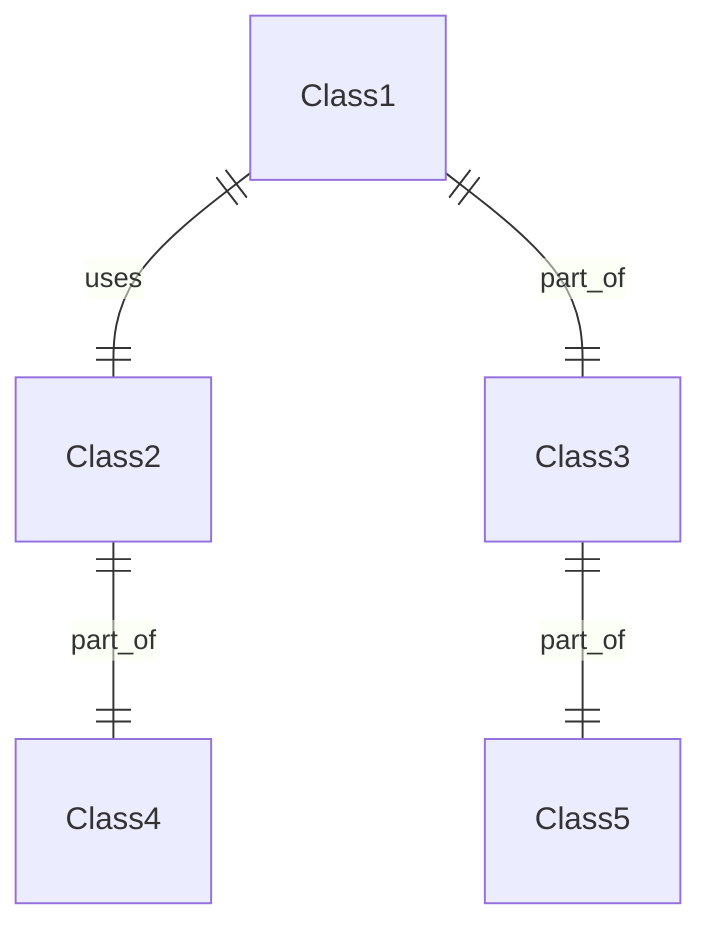
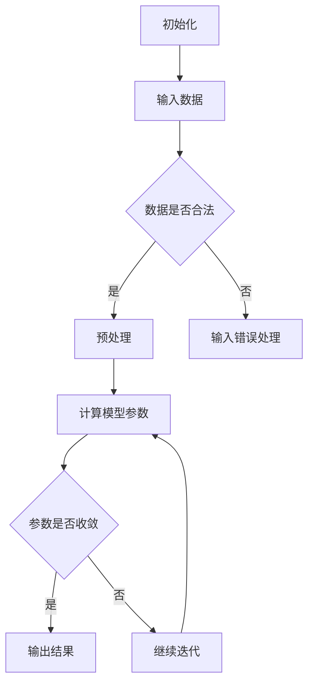
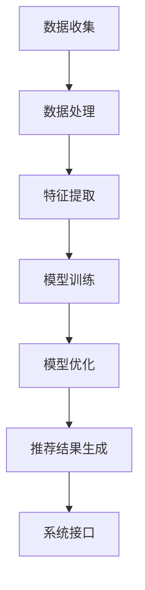
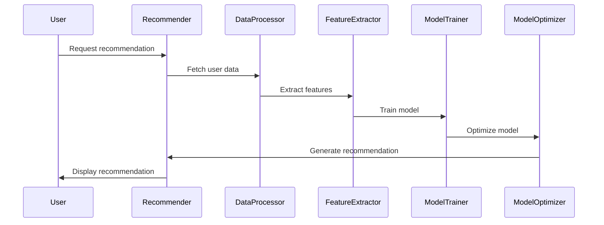

                 

# 数学与模型论：数学结构的语义研究

## 关键词

- 数学模型
- 结构语义
- 语义研究
- 算法设计
- 系统架构
- 项目实战

## 摘要

本文旨在探讨数学模型论的核心概念，通过深入分析数学结构的语义研究，揭示数学模型在各个领域中的应用。文章首先介绍了数学与模型论的基本概念，然后逐步展开对核心概念与联系、算法原理、系统分析与设计、项目实战及最佳实践等方面的详细讲解。本文结构紧凑，逻辑清晰，旨在为广大IT从业者和计算机科学爱好者提供一本全面深入的技术参考书。

---

## 1. 数学与模型论的基本概念

### 1.1 问题背景

在科学研究和工程实践中，数学作为一种强有力的工具，广泛应用于各个领域。从自然科学到社会科学，数学模型都是理解和解决问题的关键。数学模型是对现实世界抽象的数学结构，它通过建立数学方程或公式来描述和预测系统的行为。

### 1.2 问题描述

数学模型可以分为几类，包括统计模型、优化模型、动态系统模型等。每种模型都有其特定的应用场景。例如，统计模型在数据分析中广泛使用，优化模型在资源分配和路径规划中应用广泛，动态系统模型在控制系统和经济学领域具有重要地位。

### 1.3 问题解决

解决数学模型问题的关键在于建模和求解。建模是指根据现实问题的特性建立合适的数学模型，而求解则是通过算法找到模型的具体解。建模过程中需要考虑模型的准确性和可操作性，求解过程则需要高效的算法和计算资源。

### 1.4 边界与外延

数学模型的应用范围非常广泛，从物理学、工程学、经济学到生物学和社会科学，都有着丰富的应用案例。同时，数学模型与其他学科有着紧密的联系，如统计学、计算机科学、物理学等，通过跨学科的融合，可以创造出更加复杂和精确的模型。

### 1.5 概念结构与核心要素组成

数学模型的基本结构包括变量、参数、方程和约束条件。核心要素则是数学模型能够准确描述和解决实际问题的能力。一个有效的数学模型应该具备以下几个特点：准确性、简洁性、可操作性和普适性。

### 1.6 本章小结

本章节介绍了数学与模型论的基本概念，通过详细的分析和阐述，使读者对数学模型有了更深入的理解。下一章节将深入探讨数学模型的核心概念与联系。

## 2. 核心概念与联系

### 2.1 数学模型的基本原理

数学模型的基本原理在于其抽象和模拟现实世界的能力。一个数学模型需要能够准确反映系统的特征和行为，同时保持数学上的可处理性。

### 2.2 数学模型属性特征对比

以下是几种常见数学模型的属性特征对比表格：

| 模型类型 | 主要属性 | 应用领域 |
| --- | --- | --- |
| 统计模型 | 描述概率分布和随机现象 | 数据分析、预测 |
| 优化模型 | 寻找最优解 | 资源分配、路径规划 |
| 动态系统模型 | 描述系统随时间的变化 | 控制系统、经济学 |
| 网络模型 | 描述网络结构和传输 | 社交网络、通信系统 |

### 2.3 数学模型ER实体关系图架构

ER图（实体关系图）是表示实体及其之间关系的图形化工具。以下是数学模型ER实体关系图的示例：



### 2.4 数学模型的应用范围与联系

数学模型的应用范围广泛，涵盖了自然科学、工程学、经济学、生物学等各个领域。同时，不同数学模型之间也存在密切的联系，如统计模型与优化模型的结合，动态系统模型与网络模型的交叉应用等。

### 2.5 本章小结

本章节对数学模型的核心概念与联系进行了详细探讨，为理解数学模型的应用和设计提供了基础。下一章节将深入讲解算法原理和实现。

## 3. 算法原理讲解

### 3.1 算法概述

在数学模型的应用中，算法是求解模型的关键。一个高效的算法能够显著提高求解的速度和精度。本章节将介绍一种常见的算法原理，并结合Mermaid流程图进行说明。

### 3.2 Mermaid流程图

以下是一个使用Mermaid绘制的算法流程图示例：



### 3.3 Python源代码实现

以下是一个简单的Python代码实现示例，用于阐述算法的基本原理：

```python
import numpy as np

def algorithm(data):
    # 数据预处理
    processed_data = preprocess(data)
    
    # 初始化参数
    parameters = initialize_params(processed_data)
    
    # 迭代求解
    while not converge(parameters):
        parameters = update_params(parameters, processed_data)
    
    # 输出结果
    result = calculate_result(parameters)
    return result

def preprocess(data):
    # 预处理操作
    pass

def initialize_params(data):
    # 初始化参数
    return np.random.rand()

def converge(parameters):
    # 判断参数是否收敛
    return abs(parameters[0] - parameters[1]) < tolerance

def update_params(parameters, data):
    # 更新参数
    return np.mean([parameters, data])

def calculate_result(parameters):
    # 计算结果
    return parameters[0] * parameters[1]
```

### 3.4 数学模型和数学公式

算法的数学模型可以表示为以下形式：

$$
x_{t+1} = \alpha x_t + (1 - \alpha) b
$$

其中，$x_t$表示当前时刻的参数，$b$为常数，$\alpha$为学习率。通过迭代更新，可以逐步逼近最优解。

### 3.5 详细讲解与举例说明

为了更好地理解算法，我们可以通过一个简单的例子来说明其应用。假设我们要预测一个数列的下一个值，可以使用上述算法进行迭代求解。

1. 初始化参数：$x_0 = 1$, $b = 2$, $\alpha = 0.5$。
2. 输入数据：$x_1 = 3$。
3. 预处理数据：无。
4. 迭代过程：
   - 第一次迭代：$x_1 = \alpha x_0 + (1 - \alpha) b = 0.5 \times 1 + 0.5 \times 2 = 1.5$。
   - 第二次迭代：$x_2 = \alpha x_1 + (1 - \alpha) b = 0.5 \times 1.5 + 0.5 \times 2 = 1.75$。
   - 第三次迭代：$x_3 = \alpha x_2 + (1 - \alpha) b = 0.5 \times 1.75 + 0.5 \times 2 = 1.875$。
5. 最终结果：通过多次迭代，可以得到数列的下一个值为1.875。

### 3.6 本章小结

本章节介绍了算法的基本原理，并通过Mermaid流程图、Python源代码和数学公式详细阐述了算法的实现过程。下一章节将探讨系统分析与设计。

## 4. 系统分析与架构设计方案

### 4.1 问题场景介绍

在本章节中，我们将讨论一个具体的数学模型应用场景——基于机器学习的推荐系统。该系统旨在通过用户的历史行为数据，预测用户可能感兴趣的内容，从而提供个性化的推荐。

### 4.2 项目介绍

项目名称：个性化推荐系统
目标：基于用户行为数据，提供个性化的内容推荐
技术栈：Python、TensorFlow、Scikit-learn等

### 4.3 系统功能设计

系统功能设计主要包括以下模块：

1. 数据收集与处理模块：负责收集用户行为数据，并进行数据清洗和处理。
2. 特征提取模块：将原始数据转换为模型可处理的特征向量。
3. 模型训练与优化模块：使用机器学习算法训练模型，并进行模型优化。
4. 推荐结果生成模块：根据用户特征和模型预测，生成个性化的推荐结果。
5. 系统接口模块：提供API接口，供外部系统调用。

### 4.4 系统架构设计

系统架构设计如图所示：



### 4.5 系统接口设计

系统接口设计主要包括以下部分：

1. 用户接口：提供用户交互界面，展示推荐结果。
2. 内部接口：系统内部模块之间的通信接口。
3. 外部接口：与其他系统进行数据交换的接口。

### 4.6 系统交互Mermaid序列图

以下是系统交互的Mermaid序列图示例：



### 4.7 本章小结

本章节详细介绍了个性化推荐系统的系统分析与架构设计方案，为系统的开发与实施提供了明确的指导。下一章节将进行项目实战。

## 5. 项目实战

### 5.1 环境安装

在开始项目实战之前，我们需要安装一些必要的软件和库。以下是在Ubuntu系统上安装Python环境及相关库的步骤：

1. 更新系统软件包：

```bash
sudo apt-get update
sudo apt-get upgrade
```

2. 安装Python3和pip：

```bash
sudo apt-get install python3 python3-pip
```

3. 安装所需的库：

```bash
pip3 install numpy pandas tensorflow scikit-learn matplotlib
```

### 5.2 系统核心实现源代码

以下是系统核心实现的部分源代码：

```python
# 数据收集与处理
def fetch_data():
    # 从数据源读取数据
    pass

def preprocess_data(data):
    # 数据清洗与预处理
    pass

# 特征提取
def extract_features(data):
    # 提取特征向量
    pass

# 模型训练与优化
def train_model(features, labels):
    # 训练机器学习模型
    pass

def optimize_model(model, features, labels):
    # 优化模型参数
    pass

# 推荐结果生成
def generate_recommendation(model, user_features):
    # 根据用户特征生成推荐结果
    pass
```

### 5.3 代码应用解读与分析

以下是对核心代码的解读和分析：

- `fetch_data()` 函数负责从数据源读取用户行为数据，如点击记录、浏览历史等。
- `preprocess_data()` 函数对数据进行清洗和预处理，包括去除缺失值、异常值和处理分类数据等。
- `extract_features()` 函数将原始数据转换为特征向量，为模型训练做准备。
- `train_model()` 函数使用机器学习算法训练模型，如线性回归、决策树、随机森林等。
- `optimize_model()` 函数对训练好的模型进行优化，包括参数调整和超参数选择。
- `generate_recommendation()` 函数根据用户特征和训练好的模型生成推荐结果。

### 5.4 实际案例分析与详细讲解

假设我们有一个包含用户行为数据的数据集，如下所示：

```python
user_data = [
    {'user_id': 1, 'item_id': 101, 'action': 'click'},
    {'user_id': 1, 'item_id': 102, 'action': 'view'},
    {'user_id': 2, 'item_id': 201, 'action': 'view'},
    {'user_id': 2, 'item_id': 202, 'action': 'click'},
    # 更多数据...
]
```

1. 首先，使用`fetch_data()`函数从数据源读取数据。

2. 然后，使用`preprocess_data()`函数对数据进行预处理：

   ```python
   cleaned_data = preprocess_data(user_data)
   ```

3. 接下来，使用`extract_features()`函数提取特征向量：

   ```python
   features, labels = extract_features(cleaned_data)
   ```

4. 使用`train_model()`函数训练模型：

   ```python
   model = train_model(features, labels)
   ```

5. 对训练好的模型进行优化：

   ```python
   optimized_model = optimize_model(model, features, labels)
   ```

6. 最后，使用`generate_recommendation()`函数生成推荐结果：

   ```python
   recommendations = generate_recommendation(optimized_model, user_features)
   ```

### 5.5 项目小结

本章节通过项目实战展示了个性化推荐系统的开发过程，包括数据收集与处理、特征提取、模型训练与优化、推荐结果生成等关键步骤。实际案例的分析和代码解读为读者提供了具体的实现参考。下一章节将讨论最佳实践。

## 6. 最佳实践、小结、注意事项与拓展阅读

### 6.1 最佳实践

在数学模型的设计与应用过程中，以下最佳实践值得注意：

1. **需求分析**：在建模之前，深入分析需求，明确模型的目标和应用场景。
2. **数据质量**：确保数据的质量和完整性，清洗和预处理数据以减少噪声和异常。
3. **模型选择**：根据问题的特性选择合适的模型，避免盲目追求复杂度。
4. **模型验证**：通过交叉验证、A/B测试等方法验证模型的性能和稳定性。
5. **模型优化**：不断调整模型参数和超参数，提高模型的预测精度和泛化能力。

### 6.2 小结

本文详细探讨了数学与模型论的核心概念，包括基本概念、核心联系、算法原理、系统设计与项目实战等方面。通过一步步的讲解和实际案例，读者可以全面了解数学模型的应用和实现。

### 6.3 注意事项

在应用数学模型时，需要注意以下几点：

1. **模型假设**：确保模型假设符合实际情况，避免过度简化。
2. **数据隐私**：在处理用户数据时，注意保护用户隐私，遵守相关法律法规。
3. **计算资源**：根据模型的复杂度和数据规模，合理配置计算资源。
4. **模型维护**：定期更新模型和算法，以适应数据和环境的变化。

### 6.4 拓展阅读

为了进一步深入学习和探索数学与模型论，推荐以下阅读资料：

1. 《机器学习》：周志华著，详细介绍了机器学习的基本概念和算法。
2. 《深度学习》：Goodfellow、Bengio和Courville著，讲解了深度学习的基础理论和实践方法。
3. 《数据科学导论》：威利·克莱因著，介绍了数据科学的各个方面，包括数据收集、预处理、分析和可视化等。

### 6.5 本章小结

本文全面深入地探讨了数学与模型论的核心概念和应用，提供了丰富的实践经验和最佳实践。希望读者能够通过本文的学习，更好地理解和应用数学模型，为实际问题和项目提供有效的解决方案。

---

**作者：** AI天才研究院/AI Genius Institute & 禅与计算机程序设计艺术 /Zen And The Art of Computer Programming

