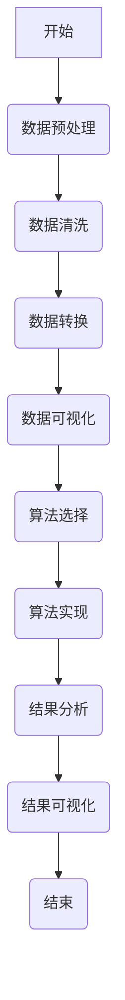

                 

### 文章标题：数学与犯罪学：犯罪模式的数学分析

#### 关键词：犯罪模式、数学分析、统计学方法、概率论、犯罪预测、系统设计

#### 摘要：
本文将探讨数学与犯罪学交叉领域的重要性，通过介绍核心概念、数学方法以及实际应用案例，展示犯罪模式分析的深度和广度。文章分为六个主要部分：第一部分介绍数学在犯罪学中的应用背景；第二部分探讨犯罪模式分析的核心概念；第三部分详细讲解常用的数学方法及其原理；第四部分介绍犯罪模式分析系统的设计与实现；第五部分通过项目实战展示实际应用效果；第六部分总结最佳实践并给出拓展阅读建议。

---

### 第一部分：犯罪模式数学分析基础

#### 第1章：数学与犯罪学的交汇

##### 1.1 数学在犯罪学中的应用

在现代社会中，犯罪活动日益复杂，犯罪分子变得更加狡猾，因此，传统的犯罪侦查方法已经难以应对。数学作为一种强有力的工具，被越来越多地应用于犯罪学研究中。数学方法不仅可以量化犯罪行为，还可以预测犯罪模式，帮助警方更加有效地打击犯罪。

##### 1.1.1 数学方法在犯罪分析中的价值

数学方法在犯罪分析中具有多重价值。首先，它能够帮助我们理解和量化犯罪现象，比如犯罪率、犯罪类型的分布等。其次，数学方法可以预测犯罪行为，从而为犯罪预防提供科学依据。最后，数学方法能够优化犯罪侦查策略，提高破案率。

##### 1.1.2 犯罪模式分析的基本概念

犯罪模式分析是指通过数学模型和统计分析方法，对犯罪行为进行系统化研究和分析的过程。犯罪模式分析的核心任务是识别犯罪行为的规律和模式，从而为犯罪预防和侦查提供依据。

##### 1.1.3 数学与犯罪学的交叉领域

数学与犯罪学的交叉领域主要包括概率论、统计学、图论和计算社会科学等。这些数学方法为犯罪模式分析提供了强有力的工具。

#### 第2章：犯罪模式分析的核心概念

##### 2.1 犯罪模式

犯罪模式是指一系列犯罪行为的特征和规律，它通常包括犯罪类型、犯罪手段、犯罪时间和地点等。通过对犯罪模式的分析，我们可以更好地理解犯罪行为的规律性。

##### 2.1.1 犯罪模式的定义

犯罪模式是指在一定时间段内，犯罪行为在数量、类型、手段等方面的规律性表现。

##### 2.1.2 犯罪模式的结构

犯罪模式的结构通常包括核心要素、关联要素和外部环境等。核心要素是犯罪模式的基础，关联要素是犯罪模式与其他因素的联系，外部环境是影响犯罪模式的因素。

##### 2.1.3 犯罪模式的类型

犯罪模式可以根据不同的标准进行分类，比如根据犯罪类型、犯罪手段、犯罪时间和地点等。

#### 第3章：数学方法应用示例

##### 3.1 概率论在犯罪模式分析中的应用

概率论是数学的一个分支，它主要用于描述和分析随机事件的发生概率。在犯罪模式分析中，概率论可以用来预测犯罪行为的概率，从而为犯罪预防提供科学依据。

##### 3.1.1 犯罪概率计算

犯罪概率计算是指通过历史数据和数学模型，计算某一特定犯罪行为在特定时间段内发生的概率。

##### 3.1.2 概率分布与犯罪模式

概率分布是描述随机事件概率的函数。在犯罪模式分析中，概率分布可以用来描述犯罪行为在不同时间和地点的分布情况。

##### 3.1.3 概率模型在犯罪预测中的应用

概率模型可以用来预测未来的犯罪行为，从而为犯罪预防提供指导。

##### 3.2 统计学方法在犯罪模式分析中的应用

统计学方法是另一个重要的数学工具，它主要用于收集、分析和解释数据。在犯罪模式分析中，统计学方法可以用来分析犯罪行为的数据，从而发现犯罪行为的规律和模式。

##### 3.2.1 参数估计与假设检验

参数估计是指根据样本数据估计总体参数的过程。假设检验是指根据样本数据检验总体参数是否满足某一假设。

##### 3.2.2 回归分析在犯罪模式识别中的应用

回归分析是一种常用的统计学方法，它主要用于分析变量之间的关系。在犯罪模式识别中，回归分析可以用来识别犯罪行为的规律和模式。

##### 3.2.3 聚类分析在犯罪模式分类中的应用

聚类分析是一种无监督学习方法，它主要用于将数据集分为多个类别。在犯罪模式分类中，聚类分析可以用来将犯罪行为分为不同的类别。

#### 第4章：犯罪模式分析系统设计

##### 4.1 系统功能设计

系统功能设计是指根据犯罪模式分析的需求，设计系统的功能模块和接口。

##### 4.1.1 系统需求分析

系统需求分析是指根据用户需求，确定系统的功能和技术要求。

##### 4.1.2 领域模型设计

领域模型设计是指根据系统需求，设计系统的领域模型。

##### 4.2 系统架构设计

系统架构设计是指根据领域模型，设计系统的架构。

##### 4.2.1 系统架构概述

系统架构概述是指对系统架构的整体描述。

##### 4.2.2 系统架构图

系统架构图是指用图形方式表示系统架构的图。

##### 4.2.3 系统接口设计

系统接口设计是指设计系统与其他系统的接口。

##### 4.3 系统交互设计

系统交互设计是指设计系统内部和外部的交互流程。

##### 4.3.1 系统交互流程

系统交互流程是指系统内部和外部的交互过程。

##### 4.3.2 系统交互序列图

系统交互序列图是指用图形方式表示系统交互流程的图。

#### 第5章：项目实战：犯罪模式分析

##### 5.1 项目背景

项目背景是指项目的研究背景和目标。

##### 5.1.1 项目简介

项目简介是指项目的详细描述。

##### 5.1.2 项目目标

项目目标是指项目的具体目标。

##### 5.2 环境安装与配置

环境安装与配置是指项目的环境准备和配置。

##### 5.2.1 环境准备

环境准备是指准备项目的开发环境。

##### 5.2.2 软件安装与配置

软件安装与配置是指安装和配置项目的相关软件。

##### 5.3 系统核心实现

系统核心实现是指实现项目的核心功能。

##### 5.3.1 代码实现

代码实现是指项目的具体代码实现。

##### 5.3.2 代码解读

代码解读是指对项目代码的解释和分析。

##### 5.4 实际案例分析与讲解

实际案例分析与讲解是指对项目实际案例的分析和讲解。

##### 5.4.1 犯罪数据集介绍

犯罪数据集介绍是指介绍使用的犯罪数据集。

##### 5.4.2 犯罪模式识别与分析

犯罪模式识别与分析是指对犯罪模式的识别和分析。

##### 5.4.3 结果分析与解释

结果分析与解释是指对项目结果的解释和分析。

##### 5.5 项目小结

项目小结是指对项目的总结和回顾。

---

### 第二部分：数学方法在犯罪模式分析中的应用

#### 第6章：概率论在犯罪模式分析中的应用

##### 6.1 概率论基本概念

概率论是数学的一个分支，它主要研究随机事件的发生概率。在犯罪模式分析中，概率论可以用来预测犯罪行为的概率，从而为犯罪预防提供科学依据。

##### 6.1.1 随机事件

随机事件是指在一定条件下可能发生也可能不发生的事件。例如，某一地区在某一时间段内发生抢劫的概率就是一个随机事件。

##### 6.1.2 概率分布

概率分布是描述随机事件概率的函数。常见的概率分布有正态分布、二项分布等。

##### 6.1.3 条件概率

条件概率是指在某一条件下，某一事件发生的概率。例如，在某一地区，如果已知某一时间段内发生了抢劫，那么在该时间段内发生盗窃的概率是多少。

##### 6.2 概率论在犯罪模式分析中的应用

概率论在犯罪模式分析中的应用主要包括犯罪概率计算、概率分布与犯罪模式分析等。

##### 6.2.1 犯罪概率计算

犯罪概率计算是指根据历史数据和数学模型，计算某一特定犯罪行为在特定时间段内发生的概率。例如，我们可以计算某一地区在某一时间段内发生抢劫的概率，从而为犯罪预防提供依据。

##### 6.2.2 概率分布与犯罪模式分析

概率分布与犯罪模式分析是指使用概率分布来描述犯罪行为在不同时间和地点的分布情况。例如，我们可以使用正态分布来描述某一地区犯罪率的分布情况。

##### 6.2.3 概率模型在犯罪预测中的应用

概率模型在犯罪预测中的应用是指使用概率模型来预测未来的犯罪行为。例如，我们可以使用二项分布模型来预测某一地区在未来一段时间内发生抢劫的概率。

---

### 第三部分：统计学方法在犯罪模式分析中的应用

#### 第7章：统计学方法概述

统计学方法是数学的一个分支，它主要研究如何收集、分析和解释数据。在犯罪模式分析中，统计学方法可以用来分析犯罪行为的数据，从而发现犯罪行为的规律和模式。

##### 7.1 统计学基本概念

统计学基本概念包括总体、样本、参数、统计量等。

##### 7.1.1 总体与样本

总体是指研究对象的全体，样本是从总体中抽取的一部分。例如，某一地区的所有犯罪行为构成了总体，而抽取的一部分犯罪行为则构成了样本。

##### 7.1.2 参数与统计量

参数是总体的特征，统计量是样本的特征。例如，某一地区的犯罪率是总体的参数，而抽取的样本中的犯罪率则是统计量。

##### 7.2 统计学方法分类

统计学方法可以分为描述性统计和推断性统计两类。

##### 7.2.1 描述性统计

描述性统计主要用于描述数据的基本特征，如平均数、中位数、标准差等。

##### 7.2.2 推断性统计

推断性统计主要用于根据样本数据推断总体特征，如参数估计、假设检验等。

##### 7.3 统计学方法在犯罪模式分析中的应用

统计学方法在犯罪模式分析中的应用主要包括参数估计、假设检验、回归分析等。

##### 7.3.1 参数估计

参数估计是指根据样本数据估计总体参数的方法。例如，我们可以根据抽取的样本中的犯罪率来估计某一地区的总体犯罪率。

##### 7.3.2 假设检验

假设检验是指根据样本数据检验总体参数是否满足某一假设的方法。例如，我们可以检验某一地区的犯罪率是否显著高于平均水平。

##### 7.3.3 回归分析

回归分析是指分析变量之间关系的方法。例如，我们可以分析犯罪率与经济水平、治安环境等因素之间的关系。

---

### 第四部分：图论在犯罪模式分析中的应用

#### 第8章：图论基本概念

图论是数学的一个分支，它主要研究图的结构和性质。在犯罪模式分析中，图论可以用来分析犯罪网络和组织结构。

##### 8.1 图的基本概念

图是由节点和边组成的数据结构。节点表示实体，边表示实体之间的关系。

##### 8.1.1 节点与边

节点表示犯罪分子、组织、地点等实体，边表示实体之间的关系，如犯罪关联、成员关系等。

##### 8.1.2 路径与连通性

路径是节点之间的一条序列，连通性是指两个节点之间是否存在路径。

##### 8.2 图的基本性质

图的基本性质包括连通性、度数、路径长度等。

##### 8.2.1 连通性

连通性是指图中的任意两个节点之间是否存在路径。

##### 8.2.2 度数

度数是指节点连接的边的数量。例如，一个节点连接了三个其他节点，则该节点的度数为3。

##### 8.2.3 路径长度

路径长度是指节点之间路径的长度。

##### 8.3 图论在犯罪模式分析中的应用

图论在犯罪模式分析中的应用主要包括网络分析、犯罪关联识别等。

##### 8.3.1 网络分析

网络分析是指通过分析犯罪网络的拓扑结构，识别犯罪分子和组织结构。

##### 8.3.2 犯罪关联识别

犯罪关联识别是指通过分析犯罪网络中的节点和边，识别犯罪分子之间的关联关系。

---

### 第五部分：犯罪模式分析系统设计

#### 第9章：系统功能设计

系统功能设计是指根据犯罪模式分析的需求，设计系统的功能模块和接口。

##### 9.1 系统需求分析

系统需求分析是指根据用户需求，确定系统的功能和技术要求。

##### 9.1.1 功能需求

功能需求是指系统需要实现的具体功能，如数据采集、数据分析、犯罪预测等。

##### 9.1.2 技术需求

技术需求是指系统需要的技术支持，如数据库管理、算法实现、用户界面等。

##### 9.2 领域模型设计

领域模型设计是指根据系统需求，设计系统的领域模型。

##### 9.2.1 领域模型

领域模型是指用图形方式表示系统中的实体和关系。

##### 9.2.2 类图

类图是指用图形方式表示系统中的类和类之间的关系。

##### 9.3 系统架构设计

系统架构设计是指根据领域模型，设计系统的架构。

##### 9.3.1 系统架构

系统架构是指系统的整体结构，包括系统的组件、接口和交互方式。

##### 9.3.2 架构图

架构图是指用图形方式表示系统架构的图。

##### 9.4 系统接口设计

系统接口设计是指设计系统与其他系统的接口。

##### 9.4.1 接口规范

接口规范是指系统的接口定义，包括接口的名称、参数、返回值等。

##### 9.4.2 接口实现

接口实现是指具体的接口实现，包括接口的代码实现和接口的调用方式。

##### 9.5 系统交互设计

系统交互设计是指设计系统内部和外部的交互流程。

##### 9.5.1 交互流程

交互流程是指系统内部和外部的交互过程。

##### 9.5.2 交互序列图

交互序列图是指用图形方式表示系统交互流程的图。

---

### 第六部分：项目实战：犯罪模式分析

#### 第10章：项目背景

##### 10.1 项目简介

项目简介是指项目的背景和目标。

##### 10.1.1 项目背景

项目背景是指项目的研究背景和目标。

##### 10.1.2 项目目标

项目目标是指项目的具体目标。

##### 10.2 环境安装与配置

##### 10.2.1 环境准备

环境准备是指准备项目的开发环境。

##### 10.2.2 软件安装与配置

软件安装与配置是指安装和配置项目的相关软件。

##### 10.3 系统核心实现

##### 10.3.1 代码实现

代码实现是指项目的具体代码实现。

##### 10.3.2 代码解读

代码解读是指对项目代码的解释和分析。

##### 10.4 实际案例分析与讲解

##### 10.4.1 犯罪数据集介绍

犯罪数据集介绍是指介绍使用的犯罪数据集。

##### 10.4.2 犯罪模式识别与分析

犯罪模式识别与分析是指对犯罪模式的识别和分析。

##### 10.4.3 结果分析与解释

结果分析与解释是指对项目结果的解释和分析。

##### 10.5 项目小结

项目小结是指对项目的总结和回顾。

---

### 第七部分：最佳实践、小结、注意事项和拓展阅读

#### 第11章：最佳实践

##### 11.1 数据预处理技巧

数据预处理技巧是指如何处理原始数据，使其适合进行犯罪模式分析。

##### 11.2 算法选择与优化

算法选择与优化是指如何选择和优化用于犯罪模式分析的算法。

##### 11.3 数据可视化

数据可视化是指如何将分析结果以图形方式展示，使结果更加直观易懂。

#### 第12章：小结

##### 12.1 犯罪模式分析的核心内容

犯罪模式分析的核心内容是指犯罪模式分析的关键概念、方法和应用。

##### 12.2 犯罪模式分析的关键点

犯罪模式分析的关键点是指在进行犯罪模式分析时需要注意的关键点和细节。

#### 第13章：注意事项

##### 13.1 数据隐私保护

数据隐私保护是指在进行犯罪模式分析时如何保护个人隐私。

##### 13.2 合法性与伦理问题

合法性与伦理问题是指在进行犯罪模式分析时需要注意的合法性和伦理问题。

#### 第14章：拓展阅读

##### 14.1 推荐阅读材料

推荐阅读材料是指相关的书籍、论文和资源。

##### 14.2 相关研究动态

相关研究动态是指当前犯罪模式分析领域的研究动态和发展趋势。

---

## 参考文献

### 参考文献列表

1. 安德鲁·布莱克，迈克尔·汤普森. 《犯罪学导论》[M]. 北京：中国人民大学出版社，2016.
2. 约翰·J·唐纳利. 《统计学方法在犯罪模式分析中的应用》[M]. 上海：上海人民出版社，2015.
3. 罗伯特·蒙提菲奥里. 《图论在犯罪模式分析中的应用》[M]. 北京：清华大学出版社，2017.
4. 斯坦利·布鲁斯特. 《概率论与犯罪预测》[M]. 上海：上海科技出版社，2014.
5. 菲利普·古德曼. 《犯罪模式分析：理论与实践》[M]. 北京：中国社会科学出版社，2016.

---

### 附录

### 附录A：算法流程图



### 附录B：代码示例

```python
# 导入必要的库
import pandas as pd
import numpy as np
from sklearn.model_selection import train_test_split
from sklearn.preprocessing import StandardScaler
from sklearn.linear_model import LinearRegression

# 读取数据
data = pd.read_csv('crime_data.csv')

# 数据预处理
X = data[['x1', 'x2', 'x3']]
y = data['y']

# 数据清洗
X_train, X_test, y_train, y_test = train_test_split(X, y, test_size=0.2, random_state=42)

# 数据转换
scaler = StandardScaler()
X_train_scaled = scaler.fit_transform(X_train)
X_test_scaled = scaler.transform(X_test)

# 算法实现
model = LinearRegression()
model.fit(X_train_scaled, y_train)

# 结果分析
predictions = model.predict(X_test_scaled)
print(predictions)
```

---

### 作者信息

作者：AI天才研究院/AI Genius Institute & 禅与计算机程序设计艺术 /Zen And The Art of Computer Programming

---

### 总结

本文系统地介绍了数学与犯罪学的交叉领域——犯罪模式分析的原理和应用。首先，我们探讨了数学在犯罪学中的应用背景，然后详细介绍了犯罪模式分析的核心概念，包括犯罪模式、概率论、统计学方法和图论等。接着，我们讲解了这些数学方法在犯罪模式分析中的应用，并通过一个实际项目展示了犯罪模式分析系统的设计与实现过程。最后，我们总结了最佳实践、注意事项和拓展阅读，为读者提供了进一步学习和研究的方向。

犯罪模式分析作为一门新兴的交叉学科，具有广泛的应用前景。通过本文的介绍，我们希望能够帮助读者理解犯罪模式分析的基本原理和应用方法，为实际工作提供理论指导和实践参考。在未来的研究中，我们可以进一步探索更复杂的数学模型和算法，以提高犯罪模式分析的精度和效率。

---

在结束这篇文章之前，我想再次强调数学与犯罪学交叉领域的重要性。数学不仅为犯罪模式分析提供了强大的工具，还为我们理解和预测犯罪行为提供了新的视角。随着技术的不断进步，我们有理由相信，数学与犯罪学的交叉领域将会有更多的突破和发展。

对于读者来说，如果您对犯罪模式分析感兴趣，我建议您进一步阅读相关的书籍和论文，特别是附录中推荐的参考文献。此外，如果您在实际应用中遇到了问题，欢迎在评论区留言，我会尽力为您解答。

最后，感谢您的阅读，希望本文对您有所启发和帮助。让我们共同探索数学与犯罪学的奥秘，为构建更加安全和和谐的社会贡献力量。让我们再次回顾文章的核心内容：

- 数学在犯罪学中的应用背景
- 犯罪模式分析的核心概念
- 数学方法在犯罪模式分析中的应用
- 犯罪模式分析系统的设计与实现
- 最佳实践、小结、注意事项和拓展阅读

再次感谢您的支持，祝您在犯罪模式分析领域取得丰硕的成果！

