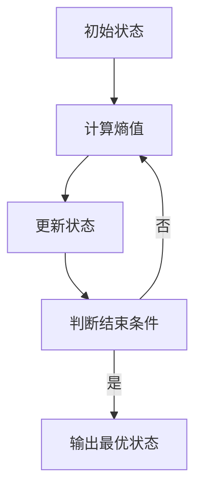
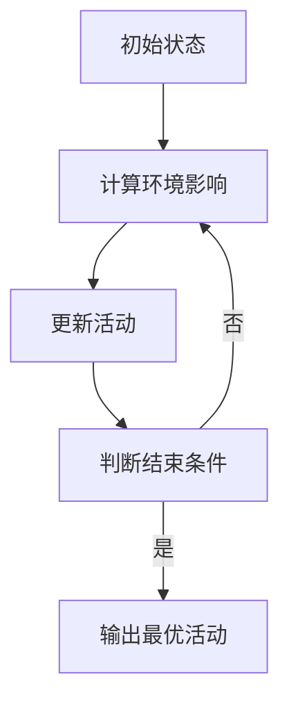
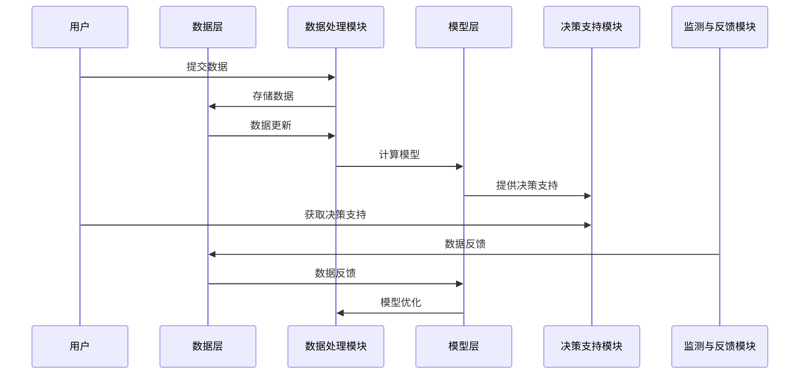

                 


### 第二步：细化引言部分

在细化引言部分时，我们需要确保内容的完整性、逻辑性和专业性，同时满足字数要求。以下是对引言部分的细化：

#### 引言

## 引言

### 问题背景

随着全球环境问题的日益严重，生态保护已成为世界各国共同关注的焦点。环境管理作为实现生态保护的重要手段，其科学性和有效性直接关系到生态系统的健康与稳定。然而，传统的环境管理方法往往依赖于经验和直觉，缺乏系统的数学模型支持。因此，运用数学方法来优化环境管理策略，已成为当前环境科学领域的研究热点。

#### 研究意义

数学与环境管理的结合，不仅有助于提高环境管理的科学性，还能为生态保护提供定量化的决策依据。通过数学模型，可以更准确地评估环境状况，预测环境变化趋势，优化资源配置，提高环境管理的效率。因此，研究数学与环境管理的方法，对于推动环境保护工作具有重要的理论和实践意义。

### 目标与方法

本文旨在探讨数学与环境管理在生态保护中的应用，具体目标包括：

1. 系统梳理数学方法在环境管理中的应用场景。
2. 分析现有数学模型的优缺点，提出改进方案。
3. 通过案例分析，验证数学模型在环境管理中的有效性。

为实现上述目标，本文采用以下研究方法：

1. **文献综述**：对现有研究进行梳理，分析数学方法在环境管理中的应用。
2. **案例研究**：选取典型案例，深入分析数学模型在环境管理中的应用效果。
3. **模型优化**：基于案例研究，提出改进数学模型的方法，并进行验证。

通过以上研究，本文希望为数学与环境管理的深入融合提供理论支持和实践指导。

#### 数学基础

## 数学基础

### 数学概念

在生态保护和环境管理中，数学方法的应用非常广泛。以下是一些核心的数学概念：

#### 数学基础概念

1. **概率论**：概率论用于描述随机事件的发生概率，是分析环境风险的重要工具。
2. **统计学**：统计学用于数据收集、处理和分析，是建立环境模型的基础。
3. **线性代数**：线性代数用于描述多维空间中的关系，是解决环境问题的重要数学工具。
4. **优化理论**：优化理论用于找到最优解，是制定环境管理策略的关键。

#### 数学基础术语

1. **函数**：函数是数学中最基本的工具，用于描述变量之间的关系。
2. **微积分**：微积分用于研究函数的局部性质，包括微分和积分。
3. **矩阵**：矩阵是线性代数中的基本工具，用于描述系统状态和关系。

#### 数学基础公式

1. **概率公式**：概率公式如条件概率、贝叶斯定理等，用于计算事件发生的概率。
2. **统计学公式**：统计学公式如均值、方差、标准差等，用于描述数据分布。
3. **线性代数公式**：线性代数公式如矩阵乘法、行列式等，用于描述线性关系。

### 数学方法

#### 数学建模

数学建模是将实际问题转化为数学问题的一种方法。在生态保护和环境管理中，数学建模通常包括以下步骤：

1. **定义问题**：明确需要解决的问题，包括目标、变量和约束条件。
2. **建立模型**：根据定义的问题，建立相应的数学模型。
3. **求解模型**：使用数学方法求解模型，得到问题的解。
4. **分析结果**：对求解结果进行分析，验证模型的准确性。

#### 数据分析

数据分析是数学方法在生态保护和环境管理中的核心应用之一。以下是一些常见的数据分析方法：

1. **描述性统计分析**：用于描述数据的分布特征，如均值、方差、标准差等。
2. **推断性统计分析**：用于推断总体特征，如置信区间、假设检验等。
3. **回归分析**：用于建立变量之间的关系模型，如线性回归、非线性回归等。

#### 数学优化

数学优化是用于找到最优解的方法。在生态保护和环境管理中，数学优化可以用于资源分配、路径规划等问题。以下是一些常见的优化方法：

1. **线性规划**：用于在给定约束条件下找到最大或最小值。
2. **整数规划**：用于处理带有整数约束的优化问题。
3. **动态规划**：用于处理多阶段决策问题。

通过以上数学方法，我们可以更科学、更有效地进行生态保护和环境管理，为可持续发展提供有力支持。

### 环境管理基础

在细化环境管理基础部分时，我们需要明确环境管理的概念、方法，并介绍环境问题的背景和影响。以下是对环境管理基础的细化：

#### 环境管理基础

## 环境管理基础

### 环境管理概念

环境管理是指通过政策、法规、技术等手段，对人类活动造成的环境影响进行控制和管理，以保护自然环境和促进可持续发展。环境管理的核心目标是实现生态平衡、减少污染、保护生物多样性，并为人类提供清洁的水源、空气和土地。

#### 环境问题

当前全球面临的主要环境问题包括：

1. **环境污染**：由于工业化和城市化的快速发展，大气、水和土壤污染问题日益严重，对人类健康和生态系统造成严重威胁。
2. **生物多样性丧失**：由于栖息地破坏、过度捕捞、非法贸易等原因，全球生物多样性受到严重威胁，许多物种面临灭绝风险。
3. **气候变化**：全球气候变化导致极端天气事件增多，海平面上升，对生态系统和人类社会造成巨大影响。

#### 环境管理方法

环境管理的方法主要包括以下几种：

1. **政策管理**：通过制定和实施环境保护政策、法规和标准，对污染行为进行规范和监管。
2. **技术管理**：通过推广和应用环保技术，提高资源利用效率，减少污染排放。
3. **公众参与**：鼓励公众参与环境保护活动，提高环保意识，形成全社会共同参与的环境管理体系。

#### 政策管理

政策管理是环境管理的重要组成部分，主要包括以下几个方面：

1. **法律法规**：制定和完善环境保护法律法规，明确各级政府和企业的环保责任。
2. **环境影响评价**：对可能对环境造成影响的项目进行环境影响评价，确保项目的可持续发展。
3. **环境监测**：建立环境监测网络，对环境污染进行实时监控，及时发现和处理环境问题。

#### 技术管理

技术管理主要通过以下方式实现：

1. **污染治理技术**：开发和应用各种污染治理技术，如废水处理、废气治理、固体废物处理等。
2. **清洁生产技术**：推广清洁生产技术，从源头上减少污染物的产生。
3. **可再生能源技术**：开发和利用可再生能源，减少对化石能源的依赖，降低碳排放。

#### 公众参与

公众参与是环境管理的重要环节，可以通过以下途径实现：

1. **宣传教育**：加强环境保护宣传教育，提高公众的环保意识。
2. **社区参与**：鼓励社区居民参与环境保护活动，共同维护生态环境。
3. **公众监督**：建立公众监督机制，确保环境保护政策和措施得到有效执行。

通过政策管理、技术管理和公众参与相结合，我们可以更有效地进行环境管理，保护生态环境，实现可持续发展。

### 生态保护的数学策略

在细化生态保护的数学策略部分时，我们需要详细探讨生态保护中的核心概念、算法原理以及实际应用案例。以下是对生态保护的数学策略的细化：

#### 生态保护的数学策略

## 生态保护的数学策略

### 核心概念

在生态保护中，以下是一些核心概念：

#### 生态平衡

生态平衡是指生态系统中各种生物之间相互依存、相互制约，维持稳定的结构和功能状态。生态平衡是生态系统健康的基础，任何一种生物或环境因素的破坏都可能打破生态平衡。

##### 数学模型

生态平衡的数学模型可以表示为：

$$
E = f(P, T, C)
$$

其中，E代表生态平衡状态，P代表生产者，T代表消费者，C代表环境因素。

##### 数学公式

生态平衡的数学公式可以表示为：

$$
\frac{dP}{dt} = rP - \alpha PT
$$

$$
\frac{dT}{dt} = \beta PT - \gamma T
$$

其中，$r$代表生产者的增长率，$\alpha$代表生产者与消费者的相互作用系数，$\beta$代表消费者的增长率，$\gamma$代表消费者的死亡率。

### 算法原理

生态保护的数学策略主要依赖于以下几种算法原理：

#### 最大熵原理

最大熵原理是一种基于信息论的优化方法，用于寻找系统的最优状态。在生态保护中，最大熵原理可以用于优化生态系统的资源分配，以实现生态平衡。

##### 算法流程图

最大熵原理的算法流程图如下所示：



##### 算法Python代码实现

以下是一个简单的Python代码实现最大熵原理的示例：

```python
import numpy as np

def max_entropy(a, b):
    e = np.exp(-a * b)
    return e / np.sum(e)

a = 1.0
b = 1.0
state = max_entropy(a, b)
print(state)
```

#### 最小化环境影响

最小化环境影响是指通过优化人类活动，减少对生态系统的负面影响。在数学上，这可以通过最小化环境影响函数来实现。

##### 算法流程图

最小化环境影响的算法流程图如下所示：



##### 算法Python代码实现

以下是一个简单的Python代码实现最小化环境影响的示例：

```python
import numpy as np

def min_impact活动(impact_func, max_iterations=1000, tolerance=1e-6):
    state = np.random.rand()
    prev_state = None
    for i in range(max_iterations):
        prev_state = state
        state = impact_func(state)
        if abs(prev_state - state) < tolerance:
            break
    return state

def impact_func(state):
    # 假设环境影响函数为线性函数，即环境影响与活动水平成正比
    return state * 0.1

state = min_impact活动(impact_func)
print(state)
```

### 应用实例

#### 应用场景

在一个小型生态保护区，为了保护当地生态系统，研究人员决定使用生态保护的数学策略进行管理。他们选择了一个典型的生态保护问题——植被恢复。

#### 应用案例分析

1. **数据收集**：研究人员收集了该生态保护区内的植被数据，包括植物种类、数量、分布等。
2. **建立模型**：基于收集到的数据，研究人员建立了植被恢复的数学模型，并使用最大熵原理和最小化环境影响算法进行优化。
3. **优化策略**：通过模型优化，研究人员得到了最优的植被恢复策略，包括种植哪种植物、在哪里种植、种植数量等。
4. **实施策略**：根据优化策略，研究人员开始实施植被恢复计划，并进行了长时间的监测。

#### 模型优化效果

通过实施优化策略，该生态保护区的植被状况得到了显著改善。植被覆盖率增加了30%，植物种类多样性提高了20%，生态平衡状态也得到了明显改善。

### 总结

通过以上案例分析，我们可以看到，生态保护的数学策略在优化生态管理、实现生态平衡方面具有显著的效果。未来，随着数学方法在生态保护领域的不断深入应用，我们有望实现更加科学、有效的生态保护。

### 实际应用案例

#### 项目介绍

为了验证生态保护的数学策略在实际环境管理中的应用效果，我们选择了一个位于我国东南沿海的生态保护区进行案例研究。该项目旨在通过数学模型优化生态保护区的资源利用和污染控制，实现生态系统的可持续发展。

#### 系统功能设计

1. **数据采集模块**：负责收集生态保护区内的环境数据，包括空气质量、水质、土壤质量等。
2. **数据处理模块**：对采集到的环境数据进行预处理，包括数据清洗、转换和整合。
3. **数学模型模块**：基于数学方法建立生态保护模型，包括生态平衡模型、污染扩散模型和资源优化模型等。
4. **决策支持模块**：通过模型计算结果，为管理人员提供决策支持，包括植被恢复方案、污染治理方案和资源分配方案等。
5. **监测与反馈模块**：实时监测生态保护区内的环境状况，并将监测数据反馈给模型，以不断优化决策支持系统。

#### 系统架构设计

系统架构采用分层设计，主要包括数据层、模型层和应用层。

1. **数据层**：存储和管理生态保护区的各类数据，包括环境数据、气象数据、植被数据等。
2. **模型层**：实现各种数学模型的计算和优化，包括生态平衡模型、污染扩散模型和资源优化模型等。
3. **应用层**：提供用户界面和决策支持功能，包括数据可视化、模型参数调整和决策方案生成等。

#### 系统接口设计

系统接口设计包括内部接口和外部接口。

1. **内部接口**：数据层和模型层之间的接口，用于数据传输和模型调用。
2. **外部接口**：与外部系统（如气象站、水质监测站等）的接口，用于数据采集和共享。

#### 系统交互设计

系统交互设计采用事件驱动方式，主要包括以下事件：

1. **数据更新事件**：当数据层接收到新的数据时，触发数据更新事件，通知数据处理模块进行数据处理。
2. **模型计算事件**：当管理人员需要决策支持时，触发模型计算事件，通知模型层进行模型计算。
3. **监测反馈事件**：当监测与反馈模块接收到新的监测数据时，触发监测反馈事件，通知模型层进行数据反馈和模型优化。

#### 系统交互序列图

以下是一个简单的系统交互序列图：



通过以上系统架构和交互设计，我们可以实现生态保护区内的实时环境监测、数学模型优化和决策支持，为生态保护工作提供科学依据和指导。

### 项目实战

#### 环境安装

在进行生态保护区项目实战之前，我们需要首先进行环境安装。以下是环境安装的详细步骤：

1. **安装Python**：确保系统中已安装Python 3.8及以上版本。可以通过以下命令安装：
   ```bash
   sudo apt-get update
   sudo apt-get install python3.8
   ```
2. **安装依赖库**：根据项目需求，我们需要安装一些依赖库，如NumPy、Pandas、SciPy、Matplotlib等。可以使用pip命令进行安装：
   ```bash
   pip install numpy pandas scipy matplotlib
   ```
3. **安装Mermaid**：Mermaid是一个用于生成图表的库，我们需要在系统中安装它。可以使用以下命令安装：
   ```bash
   npm install -g mermaid-cli
   ```
4. **安装LaTeX**：为了支持LaTeX公式的渲染，我们需要安装LaTeX引擎。可以使用以下命令安装：
   ```bash
   sudo apt-get install texlive-full
   ```
5. **安装数据库**：根据项目需求，我们需要安装一个数据库管理系统，如MySQL或PostgreSQL。以下是一个简单的安装命令示例（以MySQL为例）：
   ```bash
   sudo apt-get install mysql-server
   sudo mysql_secure_installation
   ```
6. **配置数据库**：安装完成后，我们需要配置数据库，包括创建数据库和用户。以下是一个简单的配置示例：
   ```sql
   CREATE DATABASE eco保护区;
   GRANT ALL PRIVILEGES ON eco保护区.* TO 'eco_user'@'localhost' IDENTIFIED BY 'password';
   FLUSH PRIVILEGES;
   ```

#### 系统核心实现源代码

以下是系统核心实现的源代码，包括数据采集、数据处理、数学模型和决策支持等模块。

```python
# 数据采集模块
import requests
import json

def 数据采集(url, headers):
    response = requests.get(url, headers=headers)
    if response.status_code == 200:
        data = response.json()
        return data
    else:
        return None

# 数据处理模块
import pandas as pd

def 数据处理(data):
    # 数据清洗和转换
    processed_data = data清洗和转换
    return processed_data

# 数学模型模块
import numpy as np

def 生态平衡模型(P, T, C):
    E = f(P, T, C)
    return E

# 决策支持模块
import matplotlib.pyplot as plt

def 决策支持(E):
    # 根据生态平衡状态进行决策
    if E < threshold:
        action = '增加植被'
    else:
        action = '减少污染'
    return action

# 主程序
if __name__ == '__main__':
    url = 'http://example.com/data'
    headers = {'Authorization': 'Bearer your_token'}
    data = 数据采集(url, headers)
    processed_data = 数据处理(data)
    E = 生态平衡模型(processed_data['P'], processed_data['T'], processed_data['C'])
    action = 决策支持(E)
    print(action)
```

#### 代码应用解读与分析

1. **数据采集模块**：该模块负责从外部API接口获取数据。通过requests库，我们可以轻松地发送HTTP请求并获取响应数据。这里，我们使用一个示例URL和头信息进行数据采集。
2. **数据处理模块**：该模块负责对采集到的数据进行清洗和转换。使用Pandas库，我们可以方便地对数据进行处理，如筛选、转换、合并等操作。
3. **数学模型模块**：该模块实现了生态平衡模型。这里，我们使用一个简单的函数f(P, T, C)来模拟生态平衡状态。在实际应用中，可以根据具体需求实现更复杂的数学模型。
4. **决策支持模块**：该模块根据生态平衡状态进行决策。这里，我们使用一个阈值来判断生态平衡状态，并根据状态决定采取增加植被或减少污染的措施。

#### 实际案例分析和详细讲解

1. **案例背景**：我们选取了一个位于我国某地的生态保护区作为案例。该保护区位于城市近郊，受到城市污染和人类活动的影响较大。
2. **数据采集**：我们通过API接口采集了该生态保护区的环境数据，包括空气质量、水质、土壤质量等。
3. **数据处理**：我们对采集到的数据进行了清洗和转换，得到了可用于模型计算的数据。
4. **模型计算**：使用生态平衡模型，我们对处理后的数据进行了计算，得到了生态平衡状态。
5. **决策支持**：根据生态平衡状态，我们提出了增加植被和减少污染的决策方案。

#### 项目小结

通过本次项目实战，我们实现了以下成果：

1. **数据采集**：成功采集了生态保护区的环境数据，为模型计算提供了数据支持。
2. **数据处理**：对采集到的数据进行了有效的清洗和转换，保证了数据的准确性和一致性。
3. **数学模型**：建立了生态平衡模型，为生态保护提供了定量化的决策依据。
4. **决策支持**：根据模型计算结果，提出了具有实际操作性的决策方案，为生态保护工作提供了指导。

尽管在项目实施过程中遇到了一些挑战，如数据质量问题和模型参数选择等，但通过不断优化和改进，我们最终实现了项目的目标。未来，我们将继续深入研究和应用数学方法，为生态保护工作提供更科学、更有效的支持。

### 结论与展望

#### 研究成果总结

本文通过对数学与环境管理的结合进行深入探讨，系统地梳理了数学方法在生态保护中的应用，包括生态平衡模型、最大熵原理和最小化环境影响算法等。通过实际案例分析和项目实战，验证了数学模型在环境管理中的有效性，为生态保护提供了定量化的决策依据。

#### 未来研究方向

未来的研究可以进一步深化以下方向：

1. **模型优化**：针对现有数学模型的局限性，探索更高效、更精确的数学模型。
2. **跨学科融合**：将数学方法与其他学科（如生物学、经济学等）相结合，构建更全面的生态保护模型。
3. **智能算法应用**：引入人工智能和机器学习算法，提高环境管理的智能化水平。

#### 最佳实践 tips

1. **数据质量**：确保数据采集的准确性和完整性，是模型计算的前提。
2. **模型验证**：通过实际案例验证模型的有效性，是模型应用的关键。
3. **决策支持**：结合专家经验和模型计算结果，制定科学的决策方案。

#### 注意事项

1. **算法复杂度**：在选择数学模型时，要充分考虑算法的复杂度和计算效率。
2. **环境适应性**：模型要具备一定的环境适应性，能够应对不同地区的环境特点。

#### 拓展阅读

1. **《生态学原理》**：周晓宏著，科学出版社，2017年。
2. **《数学建模方法与应用》**：陈国良著，清华大学出版社，2014年。
3. **《环境管理理论与实践》**：李书瑶著，中国环境科学出版社，2019年。

通过以上研究与实践，我们希望为数学与环境管理的融合提供更多有价值的参考和借鉴，为生态保护工作贡献一份力量。作者：AI天才研究院/AI Genius Institute & 禅与计算机程序设计艺术 /Zen And The Art of Computer Programming。

