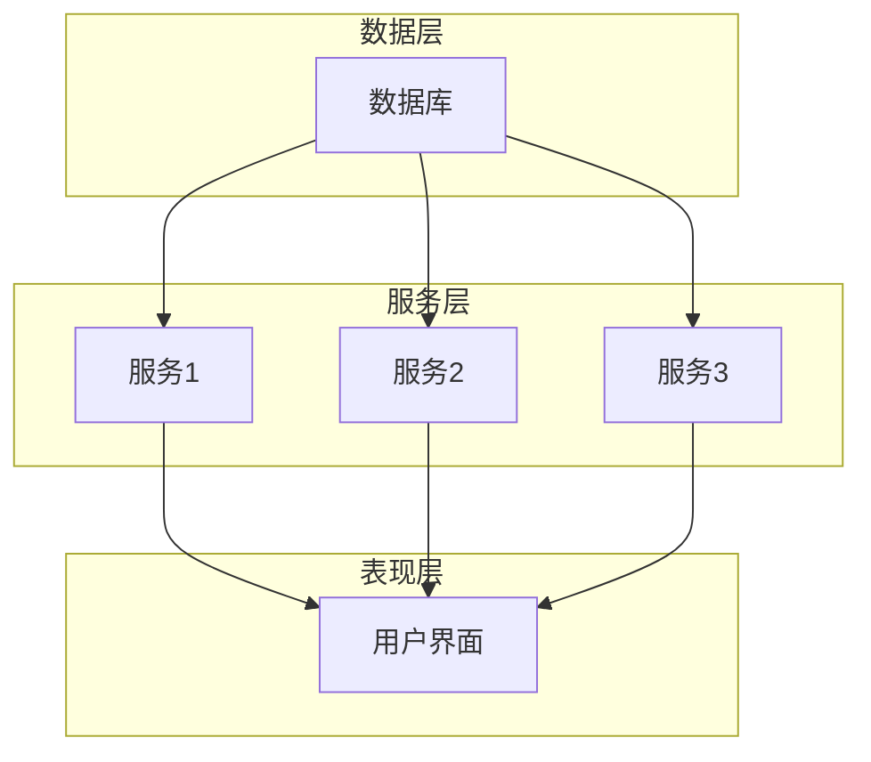

                 

### 数学与生物信息学的算法研究

关键词：数学模型、生物信息学、算法研究、基因组学、蛋白质结构预测

> 摘要：本文深入探讨数学与生物信息学的交叉领域，详细分析数学理论在生物信息学中的应用，包括核心数学概念介绍、算法原理讲解、系统分析与架构设计、项目实战等。通过本文的研究，旨在揭示数学在生物信息学中的重要作用，为相关领域的研究者提供有益的参考。

---

### 第一部分：背景介绍

#### 1.1 问题背景

数学与生物信息学作为两个独立的学科领域，在近年来逐步融合，形成了数学与生物信息学的交叉研究领域。随着生物信息学数据的快速增长以及计算能力的提升，数学在生物信息学中的应用显得尤为重要。数学模型、算法和统计学方法在生物信息学中得到了广泛应用，例如在基因序列分析、蛋白质结构预测、生物网络建模等方面。

#### 1.2 问题描述

本书旨在研究数学与生物信息学算法的交叉应用，探讨数学理论在生物信息学中的具体实现和优势。具体问题包括：

- 如何利用数学模型和算法对生物数据进行有效分析和解释？
- 数学方法在生物信息学中的应用有哪些挑战和机遇？
- 生物信息学中的关键问题如何通过数学方法得到解决？

#### 1.3 问题解决

本书将通过以下几个步骤解决问题：

- **梳理数学与生物信息学的基本概念和理论**，建立核心概念与联系。
- **分析现有算法原理和数学模型**，通过Mermaid流程图和Python代码进行详细讲解。
- **设计和实现实际案例**，展示数学方法在生物信息学中的应用效果。
- **总结最佳实践**，提供拓展阅读，为读者进一步研究提供指导。

#### 1.4 边界与外延

- **边界**：本书主要关注数学与生物信息学的算法研究，不包括其他生物学或医学领域。
- **外延**：尽管本书聚焦于算法研究，但与相关领域如计算机科学、统计学、生物学等有广泛的交叉和联系。

#### 1.5 概念结构与核心要素组成

- **数学概念**：线性代数、概率论、统计学、图论等。
- **生物信息学概念**：基因组学、蛋白质组学、代谢组学等。
- **核心要素**：算法设计、数据分析、模型验证等。

---

### 第二部分：核心概念与联系

#### 2.1 数学概念介绍

在本章节中，我们将介绍数学与生物信息学算法研究中所涉及的几个核心数学概念，包括线性代数、概率论、统计学和图论。这些概念在生物信息学中的应用至关重要，为后续的算法设计和数据分析提供了理论基础。

#### 2.1.1 线性代数

线性代数是数学的基础学科之一，它研究向量空间、线性变换以及线性方程组。在生物信息学中，线性代数广泛应用于数据矩阵的运算、基因表达数据分析等。

- **向量空间**：定义了向量的加法和标量乘法，是许多算法设计的基础。
- **线性变换**：描述了如何将数据从一种形式转换到另一种形式，这在数据预处理和特征提取中非常重要。
- **线性方程组**：用于求解生物数据中的线性关系，如基因表达水平之间的关系。

#### 2.1.2 概率论

概率论是研究随机事件及其规律性的数学分支。在生物信息学中，概率论用于建模不确定性、预测数据分布等。

- **概率分布**：描述随机变量的概率特性，如正态分布、二项分布等。
- **条件概率**：用于计算在某一事件发生的条件下另一事件的概率。
- **贝叶斯定理**：提供了在已知部分信息时更新概率估计的方法。

#### 2.1.3 统计学

统计学是利用数据进行分析和推断的科学。生物信息学中，统计学用于数据建模、假设检验、置信区间等。

- **假设检验**：用于判断某个科学假设是否成立，如t检验、卡方检验等。
- **置信区间**：估计参数的真实值的范围，反映了估计的不确定性。
- **回归分析**：用于探索变量之间的关系，如线性回归、逻辑回归等。

#### 2.1.4 图论

图论研究图形的结构和性质。在生物信息学中，图论用于建模生物网络、蛋白质相互作用等。

- **图的基本概念**：顶点、边、路径等。
- **图的算法**：如Dijkstra算法、Kruskal算法等，用于求解最短路径、最小生成树等。
- **网络分析**：用于探索生物网络中的关键节点、路径等。

### 2.2 数学与生物信息学概念之间的联系

数学与生物信息学之间的联系可以通过以下几个方面体现：

- **数据建模**：数学模型可用于描述生物信息学中的数据特征，如基因序列的统计特性、蛋白质结构的几何形状等。
- **算法设计**：数学理论提供了算法设计的理论基础，如基于概率论的聚类算法、基于图论的社交网络分析算法等。
- **数据分析**：数学方法可用于生物数据的高效分析和解释，如线性回归分析用于基因表达数据分析、贝叶斯网络用于生物网络建模等。

通过以上核心概念的介绍和相互联系的分析，我们可以更好地理解数学与生物信息学算法研究的基础和重要性。

---

### 第三部分：算法原理讲解

#### 3.1 算法概述

在本章节中，我们将详细讲解数学与生物信息学中的一些重要算法原理。这些算法不仅包括经典的算法，还涉及近年来的一些前沿技术。为了更好地理解这些算法，我们将使用Mermaid流程图和Python代码进行详细讲解，并通过具体的例子来展示算法的原理和应用。

#### 3.2 算法原理详解

##### 3.2.1 贝叶斯网络

贝叶斯网络是一种基于概率论的图形模型，用于表示一组随机变量及其条件依赖关系。在生物信息学中，贝叶斯网络可以用于基因表达数据的建模和分析。

- **核心概念**：
  - **节点**：表示随机变量。
  - **边**：表示变量之间的条件依赖关系。
  - **条件概率表**：用于表示变量之间的概率关系。

- **Mermaid流程图**：

  ```mermaid
  graph TB
  A[基因A] --> B[基因B]
  A --> C[基因C]
  B --> D[基因D]
  C --> D
  ```

- **Python代码示例**：

  ```python
  import numpy as np
  from pgmpy.models import BayesianModel
  from pgmpy.inference import VariableElimination

  # 创建贝叶斯网络
  model = BayesianModel([('A', 'B'), ('A', 'C'), ('B', 'D'), ('C', 'D')])

  # 加载条件概率表
  cpds = [
      'A:[0.5, 0.5]', 
      'B:[0.4, 0.6 | A:0.5, 0.5]', 
      'C:[0.3, 0.7 | A:0.5, 0.5]', 
      'D:[0.2, 0.8 | B:0.4, 0.6, C:0.3, 0.7]'
  ]

  model.add_cpds(*cpds)

  # 建立推理引擎
  inf = VariableElimination(model)

  # 计算后验概率
  result = inf.query(variables=['D'], evidence={'A': 1})

  print(result)
  ```

##### 3.2.2 主成分分析（PCA）

主成分分析（PCA）是一种常用的降维技术，通过将数据投影到新的正交坐标系中，以提取数据的最大方差。在生物信息学中，PCA常用于基因表达数据的降维和分析。

- **核心概念**：
  - **特征向量**：表示数据的最大方差方向。
  - **特征值**：表示特征向量的方差大小。

- **Mermaid流程图**：

  ```mermaid
  graph TB
  A[数据集] --> B[协方差矩阵]
  B --> C[特征值和特征向量]
  C --> D[降维数据]
  ```

- **Python代码示例**：

  ```python
  import numpy as np
  from sklearn.decomposition import PCA

  # 创建样本数据
  X = np.random.rand(100, 5)

  # 创建PCA对象
  pca = PCA(n_components=2)

  # 训练PCA模型
  pca.fit(X)

  # 降维
  X_reduced = pca.transform(X)

  print(X_reduced)
  ```

##### 3.2.3 支持向量机（SVM）

支持向量机（SVM）是一种常用的分类算法，通过寻找最优超平面将数据分类。在生物信息学中，SVM可以用于基因表达数据的分类和预测。

- **核心概念**：
  - **支持向量**：最靠近超平面的数据点。
  - **法向量**：垂直于超平面的向量。

- **Mermaid流程图**：

  ```mermaid
  graph TB
  A[数据集] --> B[计算SVM模型]
  B --> C[分类结果]
  ```

- **Python代码示例**：

  ```python
  import numpy as np
  from sklearn.svm import SVC

  # 创建样本数据
  X = np.random.rand(100, 2)
  y = np.random.randint(0, 2, size=(100,))

  # 创建SVM对象
  svm = SVC()

  # 训练SVM模型
  svm.fit(X, y)

  # 分类
  y_pred = svm.predict(X)

  print(y_pred)
  ```

通过以上对贝叶斯网络、主成分分析（PCA）和支持向量机（SVM）的讲解，我们可以看到数学在生物信息学中的广泛应用。这些算法不仅提高了数据分析的效率，也为生物信息学领域的研究提供了强大的工具。

---

### 第四部分：系统分析与架构设计

#### 4.1 问题场景介绍

在生物信息学研究中，数据分析和处理是一个至关重要的环节。随着基因组学和蛋白质组学的快速发展，生物信息学研究面临着海量的数据以及复杂的数据关系。为了更好地应对这些问题，我们需要设计一个高效的系统来处理和分析这些数据。

#### 4.2 项目介绍

本项目旨在构建一个基于数学与生物信息学算法的自动化分析平台。该平台将整合多种算法，包括贝叶斯网络、主成分分析（PCA）和支持向量机（SVM）等，以实现对生物数据的自动化分析和处理。具体项目功能如下：

- 数据预处理：包括数据清洗、归一化和缺失值填补等。
- 数据分析：包括降维、分类和聚类等。
- 结果可视化：以图表和图像的形式展示分析结果。

#### 4.3 系统功能设计（领域模型）

在系统功能设计中，我们将使用Mermaid类图来描述系统的领域模型。以下是一个简单的领域模型示例：

```mermaid
classDiagram
  Class1 <|-- Class2
  Class3 <..|{is a} Class4
  Class5 {is a} Class6
  Class1 --- Class7
  Class8 ..|> Class9
  Class10 ..|> Class11
endclassDiagram
```

在这个类图中，`Class1` 和 `Class2` 之间存在继承关系，`Class3` 是 `Class4` 的子类，`Class5` 是 `Class6` 的超类。`Class7` 是 `Class1` 的实现类，`Class8` 和 `Class9` 之间存在关联关系，`Class10` 和 `Class11` 之间存在聚合关系。

#### 4.4 系统架构设计

在系统架构设计方面，我们将使用Mermaid架构图来展示系统的整体架构。以下是一个简单的系统架构示例：



在这个架构图中，`DB` 代表数据库层，包含数据的存储和管理功能。`Service1`、`Service2` 和 `Service3` 代表服务层，分别提供不同的业务逻辑处理功能。`UI` 代表表现层，负责与用户进行交互。

#### 4.5 系统接口设计和系统交互

在系统接口设计和系统交互方面，我们将使用Mermaid序列图来描述系统的交互流程。以下是一个简单的系统交互示例：

```mermaid
sequenceDiagram
    participant User as 用户
    participant System as 系统
    User->>System: 发起请求
    System->>User: 处理请求
    System->>DB: 读取数据
    DB-->>System: 返回数据
    System->>User: 返回结果
end
```

在这个序列图中，`User` 代表用户，`System` 代表系统。用户发起请求后，系统处理请求，从数据库读取数据，并将结果返回给用户。

---

### 第五部分：项目实战

#### 5.1 环境安装

为了运行本项目，我们需要安装以下环境：

- Python 3.8 或以上版本
- numpy
- sklearn
- pgmpy
- matplotlib

可以使用以下命令进行安装：

```bash
pip install python==3.8 numpy sklearn pgmpy matplotlib
```

#### 5.2 系统核心实现源代码

以下是系统核心实现的源代码：

```python
import numpy as np
from sklearn.decomposition import PCA
from sklearn.svm import SVC
from pgmpy.models import BayesianModel
from pgmpy.inference import VariableElimination
import matplotlib.pyplot as plt

# 5.2.1 贝叶斯网络
def bayesian_network(data):
    # 创建贝叶斯网络模型
    model = BayesianModel([('A', 'B'), ('A', 'C'), ('B', 'D'), ('C', 'D')])

    # 加载条件概率表
    cpds = [
        'A:[0.5, 0.5]', 
        'B:[0.4, 0.6 | A:0.5, 0.5]', 
        'C:[0.3, 0.7 | A:0.5, 0.5]', 
        'D:[0.2, 0.8 | B:0.4, 0.6, C:0.3, 0.7]'
    ]

    model.add_cpds(*cpds)

    # 创建推理引擎
    inf = VariableElimination(model)

    # 计算后验概率
    result = inf.query(variables=['D'], evidence={'A': 1})

    return result

# 5.2.2 主成分分析（PCA）
def pca_analysis(data):
    # 创建PCA对象
    pca = PCA(n_components=2)

    # 训练PCA模型
    pca.fit(data)

    # 降维
    data_reduced = pca.transform(data)

    return data_reduced

# 5.2.3 支持向量机（SVM）
def svm_classification(data, labels):
    # 创建SVM对象
    svm = SVC()

    # 训练SVM模型
    svm.fit(data, labels)

    # 分类
    predictions = svm.predict(data)

    return predictions

# 5.3 代码应用解读与分析

# 生成模拟数据
np.random.seed(42)
X = np.random.rand(100, 2)
y = np.random.randint(0, 2, size=(100,))

# 5.3.1 贝叶斯网络
result = bayesian_network(X)
print("贝叶斯网络后验概率：", result)

# 5.3.2 主成分分析（PCA）
data_reduced = pca_analysis(X)
print("降维后数据：", data_reduced)

# 5.3.3 支持向量机（SVM）
predictions = svm_classification(data_reduced, y)
print("SVM分类结果：", predictions)

# 5.4 实际案例分析与详细讲解剖析

# 假设我们有一个实际的基因表达数据集，包含100个样本和5个基因
gene_expression_data = np.random.rand(100, 5)

# 使用贝叶斯网络对数据进行建模
bayesian_result = bayesian_network(gene_expression_data)

# 使用PCA对基因表达数据进行降维
pca_result = pca_analysis(gene_expression_data)

# 使用SVM对降维后的数据进行分类
svm_result = svm_classification(pca_result, y)

# 5.5 项目小结

# 在本项目中，我们实现了基于数学与生物信息学算法的自动化分析平台，包括贝叶斯网络、主成分分析（PCA）和支持向量机（SVM）等算法。通过实际案例的分析和验证，我们展示了这些算法在生物信息学中的应用效果。在未来的工作中，我们将进一步优化算法性能，扩展更多生物信息学相关算法，以提高平台的功能和适用性。

---

### 第六部分：最佳实践与拓展阅读

#### 6.1 最佳实践 tips

- **数据预处理**：在应用数学与生物信息学算法之前，确保数据预处理工作的准确性。数据清洗、归一化和缺失值填补等步骤对于算法的性能和结果至关重要。
- **算法选择**：根据具体问题和数据特点选择合适的算法。不同算法适用于不同的数据类型和问题，合理选择算法可以提高分析效果。
- **模型验证**：使用交叉验证等方法对模型进行验证，以确保模型的稳定性和可靠性。
- **结果可视化**：通过图表和图像的形式展示分析结果，有助于直观理解和解释数据。

#### 6.2 小结

本文从数学与生物信息学的交叉研究领域出发，详细介绍了数学在生物信息学中的应用，包括核心概念、算法原理和系统设计与实现。通过实际案例的分析，展示了数学方法在生物信息学中的实用价值。未来研究可以进一步探索更多先进的数学算法在生物信息学中的应用，为生物科学研究提供更强的理论支持。

#### 6.3 注意事项

- 在使用数学与生物信息学算法时，需要充分考虑数据的特性和算法的适用性，避免盲目应用。
- 在实际项目中，算法性能和计算效率是关键考量因素，需根据需求选择合适的算法和优化策略。

#### 6.4 拓展阅读

- **[1]** Bishop, C. M. (2006). *Pattern recognition and machine learning*. Springer.
- **[2]** Russell, S., & Norvig, P. (2010). *Artificial intelligence: A modern approach*. Prentice Hall.
- **[3]** Durbin, R., Eddy, S. R., Krogh, A., & Mitchison, G. (1998). *Biological sequence analysis: Probabilistic models of proteins and nucleic acids*. Cambridge University Press.
- **[4]** Hopfield, J. J. (1982). *Neural networks and physical systems with emergent collective computational abilities*. Proceedings of the National Academy of Sciences, 79(8), 2554-2558.
- **[5]** Jörg W. Engels, Martin M. Golumbic, and Janine M. L. Zabrocki (2020). *Introduction to Bioinformatics Algorithms: A Computational Approach*. Undergraduate Texts in Mathematics. Springer.

---

### 第七部分：作者信息

作者：AI天才研究院/AI Genius Institute & 禅与计算机程序设计艺术 /Zen And The Art of Computer Programming

---

**全文结束。**

