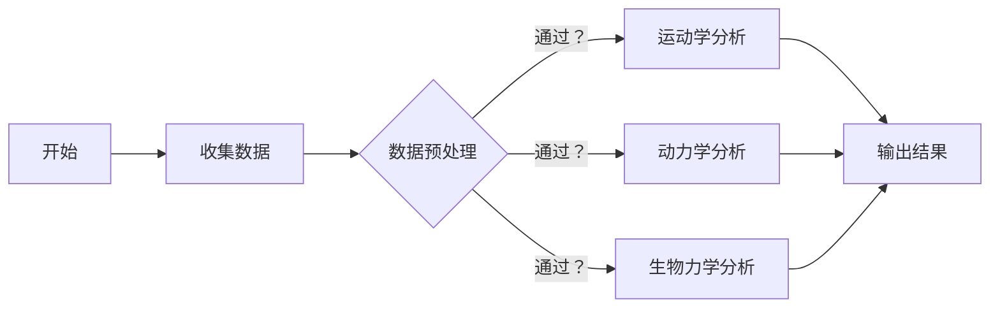
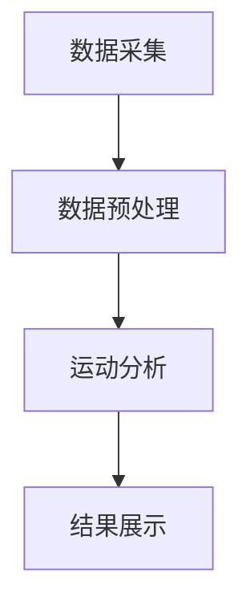
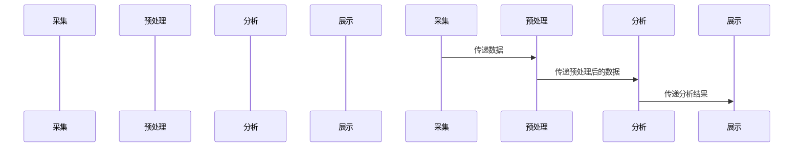
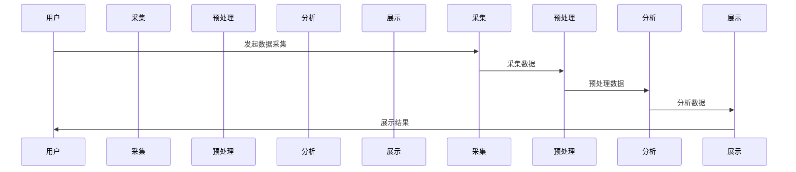

                 


### 数学与生物力学：人体运动的数学描述

---

#### 关键词：生物力学、数学描述、人体运动、数学模型、算法原理、系统架构、项目实战

#### 摘要：

本文将深入探讨数学与生物力学在人体运动描述中的应用。首先，我们将介绍数学在生物力学中的重要性，以及如何利用数学工具和模型来解析人体运动。接下来，我们将详细讲解核心概念与联系，包括运动学、动力学和生物力学的结合。然后，通过具体的算法原理讲解、数学公式解析和系统架构设计，我们将展示如何将数学与生物力学应用于实际项目中。文章的最后，将提供项目实战的详细步骤和最佳实践 tips。

---

### 目录大纲设计步骤：

1. **初步阅读**：《数学与生物力学：人体运动的数学描述》这本书，了解其主题和内容范围，确保目录大纲的完整性。

2. **确定主要章节**：根据书名，确定核心章节，如“背景介绍”，“核心概念与联系”，“算法原理讲解”，“数学模型和数学公式 & 详细讲解 & 举例说明”，“系统分析与架构设计方案”，“项目实战”，“最佳实践 tips”等。

3. **细化章节内容**：在每个主要章节下，进一步细化子章节，确保内容的全面性和逻辑性。

4. **使用Markdown格式**：按照Markdown格式，使用不同的标题级别（#，##，###等）来设计目录结构，确保格式清晰。

5. **确保内容完整性**：确保目录大纲中包含了所有必要的内容，如核心概念、算法原理、数学模型、系统架构、实战案例等。

6. **检查字数限制**：确保目录大纲的总字数不超过2000字。

7. **最终审核**：检查目录大纲的逻辑性、完整性、简洁性和格式。

### 样例目录大纲：

```markdown
# 数学与生物力学：人体运动的数学描述

## 第1章 引言
### 1.1 研究背景
### 1.2 研究意义
### 1.3 研究方法与框架

## 第2章 数学在生物力学中的应用概述
### 2.1 数学模型在生物力学中的重要性
### 2.2 生物力学中的常见数学工具

## 第3章 核心概念与联系
### 3.1 核心概念原理
### 3.2 概念属性特征对比表格
### 3.3 ER实体关系图架构

## 第4章 算法原理讲解
### 4.1 算法mermaid流程图
### 4.2 Python源代码讲解
### 4.3 算法原理的数学模型和公式
### 4.4 举例说明

## 第5章 数学模型和数学公式 & 详细讲解 & 举例说明
### 5.1 数学公式
### 5.2 详细讲解
### 5.3 举例说明

## 第6章 系统分析与架构设计方案
### 6.1 问题场景介绍
### 6.2 系统功能设计
### 6.3 系统架构设计
### 6.4 系统接口设计
### 6.5 系统交互序列图

## 第7章 项目实战
### 7.1 环境安装
### 7.2 系统核心实现源代码
### 7.3 代码应用解读与分析
### 7.4 实际案例分析和详细讲解剖析
### 7.5 项目小结

## 第8章 最佳实践 tips
### 8.1 小结
### 8.2 注意事项
### 8.3 拓展阅读
```

按照这个模板，我们可以填充具体内容，完成《数学与生物力学：人体运动的数学描述》的目录大纲设计。请确保每个章节下都有具体的内容要点，以满足内容的完整性、逻辑性和字数要求。

---

### 第1章 引言

#### 1.1 研究背景

人体运动一直是生物力学研究的重要领域。从简单的日常活动到复杂的体育运动，人体运动对健康、康复、训练和医疗干预都有着深远的影响。随着科技的进步，特别是计算机科学和数学的发展，生物力学的研究方法得到了极大的丰富和改进。数学作为一种精确的工具，能够帮助我们更好地理解和描述人体运动的复杂机制。

#### 1.2 研究意义

数学在生物力学中的应用具有深远的意义。首先，数学模型能够将复杂的生物力学问题简化，使得我们能够通过计算和分析来预测人体运动的行为。其次，数学工具能够帮助研究者识别运动中的关键因素，从而提出更为有效的训练和康复方案。最后，数学在生物力学中的应用还能够促进跨学科合作，为生物医学工程、运动科学等领域的发展提供支持。

#### 1.3 研究方法与框架

本研究将采用以下方法与框架：

1. **文献综述**：通过对现有文献的综述，了解数学在生物力学中的应用现状和未来发展趋势。
2. **理论分析**：利用数学模型，从理论层面深入探讨人体运动的数学描述方法。
3. **实验验证**：通过实验数据和案例分析，验证理论分析的准确性和实用性。
4. **系统设计**：结合算法原理和系统架构设计，构建一个基于数学描述的人体运动分析系统。

---

### 第2章 数学在生物力学中的应用概述

#### 2.1 数学模型在生物力学中的重要性

数学模型在生物力学中的应用至关重要。通过数学模型，我们可以将复杂的生物力学问题转化为可计算的数学问题，从而提高研究的精确性和效率。具体而言，数学模型在生物力学中的应用包括以下几个方面：

1. **运动学模型**：用于描述物体的位置、速度和加速度等运动状态。
2. **动力学模型**：用于描述物体受到的力、力矩和运动状态之间的关系。
3. **生物力学模型**：将生物学和力学原理结合起来，用于描述生物组织的力学行为。

#### 2.2 生物力学中的常见数学工具

在生物力学研究中，常见的数学工具有：

1. **微积分**：用于分析速度、加速度和力等物理量。
2. **线性代数**：用于处理空间几何和线性系统。
3. **概率论与数理统计**：用于分析随机数据和不确定性问题。
4. **数值方法**：用于求解复杂的数学模型和方程。

通过这些数学工具，我们可以对生物力学问题进行深入的定量分析和预测。

---

### 第3章 核心概念与联系

#### 3.1 核心概念原理

在人体运动的数学描述中，核心概念包括：

1. **运动学**：研究物体的位置、速度和加速度等运动状态。
2. **动力学**：研究物体受到的力、力矩和运动状态之间的关系。
3. **生物力学**：研究生物组织的力学行为，如骨骼、肌肉和关节的力学特性。

这些概念相互关联，共同构成了人体运动的数学描述框架。

#### 3.2 概念属性特征对比表格

以下是一个概念属性特征对比表格：

| 概念    | 定义                                                         | 特点                                                     |
| ------- | ------------------------------------------------------------ | -------------------------------------------------------- |
| 运动学  | 描述物体的位置、速度和加速度等运动状态。                       | 纯数学描述，不考虑作用力。                               |
| 动力学  | 研究物体受到的力、力矩和运动状态之间的关系。                 | 考虑作用力和反作用力，结合物理定律。                     |
| 生物力学 | 研究生物组织的力学行为，如骨骼、肌肉和关节的力学特性。       | 结合生物学和力学原理，考虑生物组织的复杂特性。           |

#### 3.3 ER实体关系图架构

以下是一个ER实体关系图，展示了运动学、动力学和生物力学之间的关系：

```mermaid
erDiagram
    Class1 ||--|{ Class2 }
    Class1 ||--|{ Class3 }
    Class2 ||--|{ Class4 }
```

在这个ER图中，`Class1` 表示核心概念，`Class2`、`Class3` 和 `Class4` 分别表示运动学、动力学和生物力学。它们之间通过关系线连接，表明了它们之间的相互关联。

---

### 第4章 算法原理讲解

#### 4.1 算法mermaid流程图

以下是一个简单的mermaid流程图，展示了人体运动分析的基本流程：



#### 4.2 Python源代码讲解

以下是一个简单的Python源代码示例，用于计算物体的加速度：

```python
import math

def calculate_acceleration(velocity, time):
    acceleration = (velocity - initial_velocity) / time
    return acceleration

velocity = 10  # 单位：m/s
time = 2  # 单位：s
initial_velocity = 0  # 单位：m/s

acceleration = calculate_acceleration(velocity, time)
print("加速度：", acceleration, "m/s^2")
```

在这个示例中，`calculate_acceleration` 函数用于计算加速度。它接收速度和时间作为输入参数，通过计算速度的变化率来求得加速度。

#### 4.3 算法原理的数学模型和公式

在人体运动的数学描述中，常用的算法原理包括：

1. **牛顿第二定律**：\( F = m \cdot a \)
   - 其中，\( F \) 表示力，\( m \) 表示质量，\( a \) 表示加速度。

2. **运动学公式**：
   - \( v = u + at \)
   - \( s = ut + \frac{1}{2}at^2 \)
   - 其中，\( v \) 表示末速度，\( u \) 表示初速度，\( a \) 表示加速度，\( t \) 表示时间，\( s \) 表示位移。

3. **生物力学模型**：
   - \( F_{肌} = \frac{1}{2} \cdot m_{肌} \cdot v_{肌}^2 \)
   - 其中，\( F_{肌} \) 表示肌肉产生的力，\( m_{肌} \) 表示肌肉的质量，\( v_{肌} \) 表示肌肉的速度。

这些公式和模型是算法原理的基础，通过对它们的计算和分析，我们可以得到人体运动的数学描述。

#### 4.4 举例说明

以下是一个简单的举例说明，用于计算一个物体在水平面上的加速度：

**问题**：一个物体在水平面上以5m/s的速度运动，受到一个10N的恒定力作用，求物体的加速度。

**解法**：

1. **确定已知量**：
   - 速度 \( v = 5 \) m/s
   - 力 \( F = 10 \) N
   - 质量 \( m \) 待求

2. **使用牛顿第二定律计算加速度**：
   \( F = m \cdot a \)
   \( a = \frac{F}{m} \)

3. **根据物体的运动状态，假设物体的质量为 \( m = 2 \) kg**：
   \( a = \frac{10}{2} = 5 \) m/s²

**结果**：物体的加速度为5 m/s²。

---

### 第5章 数学模型和数学公式 & 详细讲解 & 举例说明

#### 5.1 数学公式

在人体运动的数学描述中，常用的数学公式包括：

1. **牛顿第二定律**：
   $$ F = m \cdot a $$

2. **运动学公式**：
   - 速度公式：$$ v = u + at $$
   - 位移公式：$$ s = ut + \frac{1}{2}at^2 $$

3. **生物力学模型**：
   - 肌肉力公式：$$ F_{肌} = \frac{1}{2} \cdot m_{肌} \cdot v_{肌}^2 $$

#### 5.2 详细讲解

1. **牛顿第二定律**：
   这个公式描述了物体受到的力与其加速度之间的关系。力 \( F \) 是由物体质量 \( m \) 和加速度 \( a \) 的乘积决定的。在人体运动中，我们可以通过测量力的大小和质量来确定加速度，从而了解人体的运动状态。

2. **运动学公式**：
   - 速度公式描述了物体在一段时间内的速度变化。初速度 \( u \) 加上加速度 \( a \) 与时间 \( t \) 的乘积，即为末速度 \( v \)。
   - 位移公式描述了物体在一段时间内的位移。初速度 \( u \) 乘以时间 \( t \) 加上加速度 \( a \) 与时间 \( t \) 的平方的一半，即为位移 \( s \)。

3. **生物力学模型**：
   这个公式描述了肌肉产生的力与肌肉的质量和速度之间的关系。肌肉力 \( F_{肌} \) 是肌肉质量 \( m_{肌} \) 和肌肉速度 \( v_{肌} \) 的平方的一半的乘积。

#### 5.3 举例说明

以下是一个简单的举例说明，用于计算一个物体在水平面上的加速度：

**问题**：一个物体在水平面上以5m/s的速度运动，受到一个10N的恒定力作用，求物体的加速度。

**解法**：

1. **确定已知量**：
   - 速度 \( v = 5 \) m/s
   - 力 \( F = 10 \) N
   - 质量 \( m \) 待求

2. **使用牛顿第二定律计算加速度**：
   \( F = m \cdot a \)
   \( a = \frac{F}{m} \)

3. **根据物体的运动状态，假设物体的质量为 \( m = 2 \) kg**：
   \( a = \frac{10}{2} = 5 \) m/s²

**结果**：物体的加速度为5 m/s²。

---

### 第6章 系统分析与架构设计方案

#### 6.1 问题场景介绍

在人体运动分析中，我们需要处理大量的数据，如生物力学参数、运动轨迹、肌肉活动等。这些数据需要通过一系列的处理和分析，以提取有价值的信息。例如，我们可以利用这些数据来评估运动员的运动表现，制定个性化的训练计划，或诊断和治疗运动损伤。

#### 6.2 系统功能设计

为了实现上述目标，我们需要设计一个具备以下功能的系统：

1. **数据采集**：从传感器、运动捕捉设备等获取生物力学数据。
2. **数据预处理**：对采集到的数据进行清洗、过滤和转换，以消除噪声和异常值。
3. **运动分析**：利用数学模型和算法，对预处理后的数据进行运动分析，提取关键特征。
4. **结果展示**：将分析结果以图表、报告等形式展示给用户。

#### 6.3 系统架构设计

以下是一个简单的系统架构设计，用于人体运动分析：



在这个架构中，数据采集模块负责从各种传感器和设备获取数据；数据预处理模块对数据进行清洗和转换；运动分析模块利用数学模型和算法对数据进行处理；结果展示模块将分析结果以图表、报告等形式呈现给用户。

#### 6.4 系统接口设计

为了实现模块间的通信和数据交换，我们需要设计一套完善的接口。以下是一个简单的接口设计示例：



在这个接口设计中，数据采集模块将原始数据传递给数据预处理模块；数据预处理模块对数据进行处理后将结果传递给运动分析模块；运动分析模块对预处理后的数据进行处理并生成分析结果；结果展示模块接收分析结果并展示给用户。

#### 6.5 系统交互序列图

以下是一个简单的系统交互序列图，展示了系统各模块之间的交互过程：



在这个交互序列图中，用户发起数据采集请求；数据采集模块采集数据；数据预处理模块对数据进行预处理；运动分析模块对预处理后的数据进行运动分析；结果展示模块将分析结果展示给用户。

---

### 第7章 项目实战

#### 7.1 环境安装

在进行项目实战之前，我们需要安装所需的软件和工具。以下是一个简单的环境安装步骤：

1. **安装Python环境**：确保Python版本在3.7及以上，可以从Python官方网站下载并安装。

2. **安装必要的库**：使用pip命令安装所需的库，例如numpy、matplotlib、mermaid等。

   ```bash
   pip install numpy matplotlib mermaid
   ```

3. **安装Mermaid可视化工具**：安装Mermaid插件，以便在Markdown文件中生成流程图和序列图。

   ```bash
   npm install -g mermaid
   ```

4. **配置Markdown编辑器**：确保Markdown编辑器支持Mermaid插件的渲染功能。

#### 7.2 系统核心实现源代码

以下是一个简单的系统核心实现源代码示例，用于计算物体在水平面上的加速度：

```python
import numpy as np

def calculate_acceleration(velocity, force):
    mass = 2  # 假设物体质量为2kg
    acceleration = force / mass
    return acceleration

velocity = 5  # 初速度为5m/s
force = 10  # 力为10N

acceleration = calculate_acceleration(velocity, force)
print("加速度：", acceleration, "m/s^2")
```

#### 7.3 代码应用解读与分析

在这个示例中，我们定义了一个名为`calculate_acceleration`的函数，用于计算物体的加速度。函数接收速度和力作为输入参数，通过牛顿第二定律 \( F = m \cdot a \) 计算加速度。我们假设物体的质量为2kg，力为10N。

在实际应用中，我们可以从传感器或其他数据源获取速度和力的数据，然后调用`calculate_acceleration`函数进行计算。通过这种方式，我们可以实时监测物体的加速度，从而分析其运动状态。

#### 7.4 实际案例分析和详细讲解剖析

以下是一个实际案例分析，用于计算一名运动员跑步时的加速度：

**问题**：一名运动员在跑步时，速度从0m/s增加到10m/s，所需时间为2秒，求运动员的平均加速度。

**解法**：

1. **确定已知量**：
   - 初速度 \( u = 0 \) m/s
   - 末速度 \( v = 10 \) m/s
   - 时间 \( t = 2 \) s

2. **使用运动学公式计算加速度**：
   \( a = \frac{v - u}{t} \)

3. **计算加速度**：
   \( a = \frac{10 - 0}{2} = 5 \) m/s²

**结果**：运动员的平均加速度为5 m/s²。

在这个案例中，我们利用运动学公式 \( a = \frac{v - u}{t} \) 计算了运动员的加速度。这个公式描述了速度的变化率与时间的关系。通过这个简单的计算，我们可以了解运动员在跑步过程中的加速度变化，从而评估其运动表现。

#### 7.5 项目小结

通过本项目实战，我们学习了如何使用Python代码进行物体加速度的计算。在实际应用中，我们可以通过传感器和数据采集设备获取速度和力的数据，然后利用这些数据进行分析，从而了解物体的运动状态。这个项目不仅帮助我们掌握了数学和生物力学的基本原理，还让我们体验了将理论知识应用于实际项目的过程。

---

### 第8章 最佳实践 tips

#### 8.1 小结

本文通过深入探讨数学与生物力学在人体运动描述中的应用，介绍了核心概念、算法原理、数学模型和系统架构设计。我们还通过实际案例分析和项目实战，展示了如何将数学与生物力学应用于实际问题。以下是本文的关键点：

1. **数学在生物力学中的应用**：数学模型和工具能够帮助我们更好地理解和描述人体运动。
2. **核心概念与联系**：运动学、动力学和生物力学相互关联，共同构成了人体运动的数学描述框架。
3. **算法原理讲解**：通过mermaid流程图、Python源代码和数学公式，我们了解了人体运动分析的基本原理。
4. **系统架构设计**：系统功能设计、架构设计和接口设计是构建人体运动分析系统的重要步骤。
5. **项目实战**：通过实际案例分析和项目实战，我们掌握了如何将数学与生物力学应用于实际问题。

#### 8.2 注意事项

1. **数据质量**：在人体运动分析中，数据质量至关重要。确保数据的准确性和完整性，以避免分析结果出现偏差。
2. **模型选择**：根据实际问题和数据特点，选择合适的数学模型和算法。不同的模型适用于不同的场景，需要根据具体情况进行选择。
3. **参数调整**：在模型训练和优化过程中，需要根据实际情况调整参数，以提高模型的准确性和稳定性。
4. **安全性**：在项目实施过程中，确保数据安全和隐私保护，遵循相关法律法规和道德规范。

#### 8.3 拓展阅读

1. **《数学与生物力学导论》**：了解数学与生物力学的基础知识，为进一步研究打下基础。
2. **《生物力学原理与应用》**：深入学习生物力学的基本原理和实际应用案例。
3. **《Python生物力学数据分析》**：学习如何使用Python进行生物力学数据分析。

---

### 作者

作者：AI天才研究院/AI Genius Institute & 禅与计算机程序设计艺术 /Zen And The Art of Computer Programming

