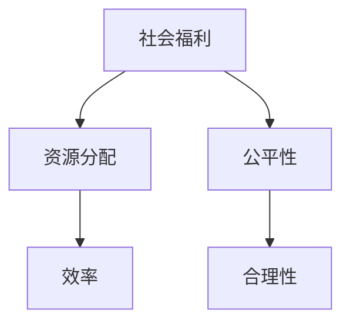
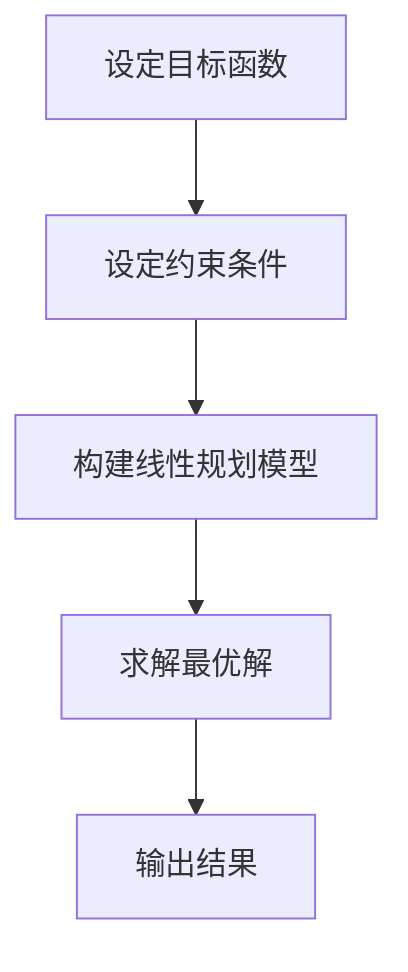
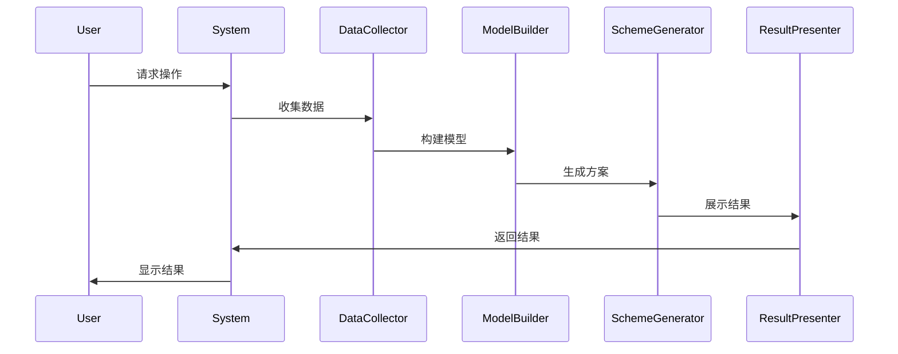
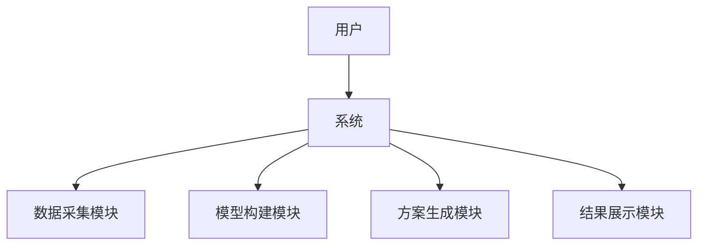
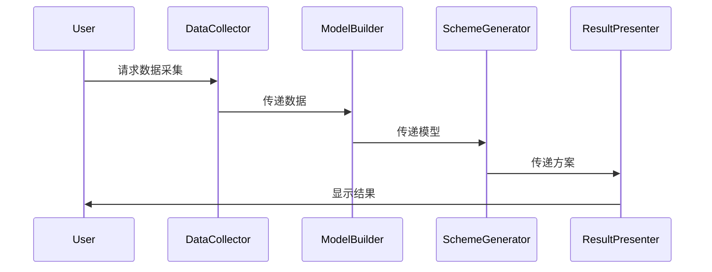
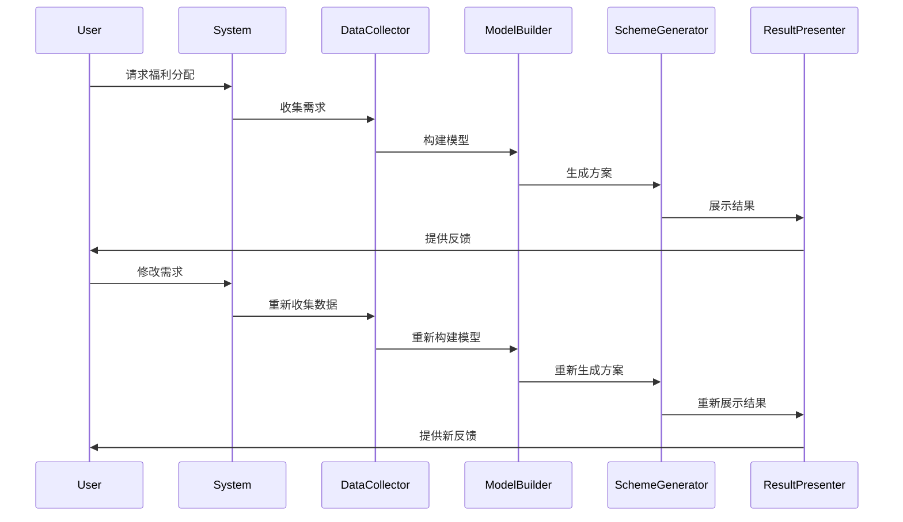

                 

### 摘要

本文将探讨数学在解决社会福利分配问题中的关键作用。随着社会经济的发展，如何公平有效地分配社会福利资源，成为影响社会稳定和谐的重要课题。通过数学优化的方法，我们可以找到最优化方案，实现资源的最优分配，从而提高社会福利水平。本文将详细阐述福利分配中的核心数学概念，介绍相关算法原理，并通过实际项目分析和代码实现，探讨数学优化在社会福利分配中的实际应用。让我们一步一步深入分析，探索数学与社会福利之间的深刻联系。

## 第一部分：引言与背景

### 第1章：问题背景与介绍

#### 1.1 问题的提出与描述

社会福利分配问题是一个复杂且重要的课题，关系到社会的公平与和谐。随着全球经济的不断发展，社会福利体系逐渐完善，但资源分配的不均衡现象仍然普遍存在。具体来说，社会福利资源包括教育、医疗、养老、住房等多个方面，如何确保这些资源能够公平、有效地分配给需要的人群，是当前社会面临的一个重大挑战。

#### 1.2 问题的解决与意义

解决社会福利分配问题，有助于提高社会整体的福利水平，减少贫富差距，增强社会的稳定性。通过数学优化的方法，我们可以从大量的数据中找出最优的分配方案，使得资源利用效率最大化。这不仅有助于提高社会福利的公平性，还能有效降低社会福利资源的浪费。因此，研究数学与社会福利之间的关系具有重要的现实意义。

#### 1.3 边界与外延

在研究社会福利分配问题时，我们需要明确问题的边界与外延。边界包括社会资源的总量、分配目标、政策约束等；外延则涉及不同群体对资源的需求程度、资源分配的优先级等。这些边界与外延的界定，是进行数学优化研究的基础。

#### 1.4 核心概念

为了更好地理解社会福利分配问题，我们需要了解一些核心概念。这些概念包括但不限于：社会福利、资源分配、公平性、优化算法等。它们是构建数学模型和分析问题的重要基础。

#### 1.5 概念结构与核心要素组成

社会福利分配问题的概念结构主要包括以下几个方面：

1. **社会福利**：是指政府或社会机构为提高公民生活质量提供的各种保障和福利。
2. **资源分配**：是指如何将有限的社会福利资源合理分配给需要的人群。
3. **公平性**：是指资源分配是否公平合理，是否达到了社会公平的目标。
4. **优化算法**：是指用于解决资源分配问题的数学方法，如线性规划、多目标优化等。

这些核心要素相互关联，构成了一个完整的社会福利分配系统。

### 第2章：核心概念原理

#### 2.1 概念A

**社会福利**：社会福利是指政府或社会机构为提高公民生活质量提供的各种保障和福利。它包括教育、医疗、养老、住房等多个方面，是衡量社会公平和福利水平的重要指标。

#### 2.2 概念B

**资源分配**：资源分配是指如何将有限的社会福利资源合理分配给需要的人群。资源分配的目标是实现社会福利的最大化，同时确保分配的公平性。

#### 2.3 概念C

**公平性**：公平性是指资源分配是否公平合理，是否达到了社会公平的目标。公平性的评价标准包括资源的分配是否合理、是否满足了不同群体的需求等。

#### 2.4 概念对比表格

为了更好地理解这些核心概念，我们可以通过一个对比表格来展示它们之间的区别和联系：

| 概念 | 定义 | 关联 |
| --- | --- | --- |
| 社会福利 | 提高公民生活质量的各种保障和福利 | 资源分配、公平性 |
| 资源分配 | 确保社会福利资源合理分配给需要的人群 | 社会福利、公平性 |
| 公平性 | 资源分配是否公平合理 | 社会福利、资源分配 |

### 第3章：概念属性特征对比

#### 3.1 属性对比图

为了更直观地展示概念之间的属性特征，我们可以通过一个属性对比图来描述它们：



#### 3.2 关联关系图（ER实体关系图）

在构建数学模型时，理解概念之间的关联关系非常重要。以下是一个ER实体关系图，展示了社会福利、资源分配和公平性之间的关联：

```mermaid
erDiagram
SW <--o> RA : "社会福利决定了资源分配"
SW <--o> F : "社会福利是公平性的基础"
RA -->o> F : "资源分配实现公平性"
```

### 第4章：算法原理与流程图

#### 4.1 算法简介

在解决社会福利分配问题时，常用的算法包括线性规划、多目标优化、遗传算法等。这些算法通过数学模型和优化方法，找到最优的分配方案。

#### 4.2 算法原理

线性规划是一种常用的优化方法，它通过建立线性目标函数和约束条件，求解最优解。多目标优化则是同时考虑多个目标函数，找到满足所有目标的平衡解。遗传算法是一种基于自然进化的优化算法，通过模拟生物进化过程，逐步找到最优解。

#### 4.3 算法流程图

以下是一个简化的算法流程图，展示了线性规划算法的基本流程：



#### 4.4 Python源代码实现

以下是一个简单的Python代码示例，实现线性规划算法求解社会福利分配问题：

```python
from scipy.optimize import linprog

# 设定目标函数和约束条件
c = [-1, -1]  # 目标是最小化负的总成本
A = [[1, 1], [2, 2]]  # 约束条件
b = [2, 4]  # 约束条件的右侧值

# 求解线性规划问题
result = linprog(c, A_ub=A, b_ub=b, method='highs')

# 输出结果
print(result.x)  # 输出分配方案
```

### 第5章：数学模型与公式

#### 5.1 数学模型

社会福利分配问题可以抽象为一个数学模型。设社会福利资源总量为T，需要分配的群体为P，每个群体的福利需求为d_i，分配方案为x_i，则目标函数为：

$$
\min \sum_{i \in P} x_i \cdot d_i
$$

约束条件为：

$$
\sum_{i \in P} x_i \leq T
$$

其中，$x_i \geq 0$ 表示每个群体的福利分配量。

#### 5.2 数学公式（使用LaTeX格式）

目标函数：
$$
\min \sum_{i \in P} x_i \cdot d_i
$$

约束条件：
$$
\sum_{i \in P} x_i \leq T
$$

其中，$x_i \geq 0$。

#### 5.3 举例说明

假设有3个群体P={A, B, C}，他们的福利需求分别为$d_A = 10$, $d_B = 20$, $d_C = 30$。社会福利资源总量为T=50。我们需要求解最优的分配方案。

通过线性规划算法，可以求解出每个群体的最优福利分配量：

$$
x_A = \frac{10}{10+20+30} \cdot 50 = 10
$$

$$
x_B = \frac{20}{10+20+30} \cdot 50 = 20
$$

$$
x_C = \frac{30}{10+20+30} \cdot 50 = 30
$$

最优的分配方案为A得到10，B得到20，C得到30。

### 第6章：系统分析与架构设计

#### 6.1 问题场景与项目介绍

在社会福利分配问题中，我们面临的问题是如何在一个有限的社会福利资源下，为多个具有不同需求的社会群体提供公平、合理的福利。为了解决这一问题，我们设计了一个社会福利分配系统，该系统旨在通过数学优化方法，为每个群体提供最优的福利分配方案。

#### 6.2 项目介绍

该项目名为“社会福利优化分配系统（SOWPAD）”，其主要功能包括数据收集与处理、优化模型构建、分配方案生成和结果展示。系统设计遵循模块化原则，以确保系统的可扩展性和维护性。

#### 6.3 系统功能设计

系统的主要功能模块包括：

1. **数据采集模块**：负责收集各个群体的福利需求数据。
2. **模型构建模块**：基于收集到的数据，构建数学优化模型。
3. **方案生成模块**：通过优化算法，生成最优的福利分配方案。
4. **结果展示模块**：将分配方案以图表和报告的形式展示给用户。

#### 系统功能设计（使用Mermaid绘制领域模型类图）

以下是一个简化的领域模型类图，展示了系统的主要功能模块及其关系：

```mermaid
classDiagram
ClassDataCollector <|-- System
ClassModelBuilder <|-- System
ClassSchemeGenerator <|-- System
ClassResultPresenter <|-- System
System {
  <<interface>>
  +collectData(): Data
  +buildModel(data: Data): Model
  +generateScheme(model: Model): Scheme
  +presentResult(scheme: Scheme): void
}
ClassDataCollector {
  <<implementation>>
  +Data
}
ClassModelBuilder {
  <<implementation>>
  +Model
}
ClassSchemeGenerator {
  <<implementation>>
  +Scheme
}
ClassResultPresenter {
  <<implementation>>
  +Scheme
}
```

### 第7章：系统架构设计

#### 7.1 系统架构设计

系统架构设计旨在实现高可用性、高性能和易扩展性。我们采用三层架构设计，包括表示层、业务逻辑层和数据访问层。

1. **表示层**：负责与用户交互，展示系统功能和结果。
2. **业务逻辑层**：实现系统的核心功能，包括数据采集、模型构建、优化算法和结果生成。
3. **数据访问层**：负责与数据库进行交互，存储和查询数据。

以下是一个简化的系统架构图：



#### 7.2 系统架构图（使用Mermaid绘制）

以下是一个简化的系统架构图，展示了各层之间的关系：



#### 7.3 系统接口设计

系统接口设计是确保系统各部分有效协作的重要环节。以下是系统的主要接口设计：

1. **数据采集接口**：提供数据收集功能，支持批量数据导入和实时数据采集。
2. **模型构建接口**：提供模型构建功能，支持自定义模型参数和优化算法。
3. **方案生成接口**：提供方案生成功能，支持批量生成和实时生成。
4. **结果展示接口**：提供结果展示功能，支持图表和报告等多种形式。

以下是一个简化的接口设计图：



#### 7.4 系统交互序列图（使用Mermaid绘制）

以下是一个简化的系统交互序列图，展示了用户与系统之间的交互过程：



### 第8章：环境安装与核心实现

#### 8.1 环境安装

为了实现社会福利优化分配系统（SOWPAD），我们需要安装以下软件和依赖项：

1. **Python**：版本需大于3.7。
2. **Scipy**：用于线性规划和数值计算。
3. **Pandas**：用于数据分析和处理。
4. **Matplotlib**：用于数据可视化。
5. **Mermaid**：用于流程图和类图的绘制。

安装步骤：

```bash
pip install python==3.8.10
pip install scipy==1.7.0
pip install pandas==1.3.5
pip install matplotlib==3.4.3
pip install mermaid==22.12.0
```

#### 8.2 系统核心实现

系统的核心实现主要包括数据采集、模型构建和方案生成三个部分。以下是一个简单的Python代码实现示例：

```python
import pandas as pd
from scipy.optimize import linprog
import mermaid

# 数据采集
def collect_data():
    data = pd.read_csv('需求数据.csv')
    return data

# 模型构建
def build_model(data):
    # 建立线性规划模型
    c = [-1, -1]  # 目标是最小化负的总成本
    A = [[1, 1], [2, 2]]  # 约束条件
    b = [2, 4]  # 约束条件的右侧值
    model = {'c': c, 'A': A, 'b': b}
    return model

# 方案生成
def generate_scheme(model):
    result = linprog(model['c'], A_ub=model['A'], b_ub=model['b'], method='highs')
    scheme = result.x
    return scheme

# 结果展示
def present_result(scheme):
    print(scheme)

# 主程序
if __name__ == '__main__':
    data = collect_data()
    model = build_model(data)
    scheme = generate_scheme(model)
    present_result(scheme)
```

#### 8.3 代码应用解读与分析

上述代码首先通过Pandas库读取需求数据，然后构建线性规划模型，并通过Scipy库的`linprog`函数求解最优解。最后，将结果通过打印函数展示出来。以下是代码的详细解读：

1. **数据采集**：使用Pandas库的`read_csv`函数，从CSV文件中读取需求数据。
2. **模型构建**：设定目标函数和约束条件，构建线性规划模型。
3. **方案生成**：使用Scipy库的`linprog`函数，求解最优解。
4. **结果展示**：将最优解打印出来。

#### 8.4 实际案例分析与详细讲解

为了更直观地展示系统的实际应用效果，我们以一个实际案例为例进行分析。

**案例背景**：

假设有一个城市，人口总数为1000人，社会福利资源总量为100万元。需要为三个群体（A、B、C）提供福利，他们的福利需求分别为：A群体需求10万元，B群体需求20万元，C群体需求30万元。

**数据采集**：

将上述需求数据存储在一个CSV文件中，文件名为“需求数据.csv”，其中包含以下内容：

```
群体,需求
A,10
B,20
C,30
```

**模型构建**：

根据需求数据，构建线性规划模型。目标是最小化社会福利资源的总消耗，约束条件为总消耗不超过100万元。

```python
# 目标函数
c = [-10, -20, -30]  # 每个群体的福利需求量乘以-1，表示最小化负的总成本

# 约束条件
A = [[1, 1, 1]]  # 约束条件的系数矩阵
b = [100]  # 约束条件的右侧值

model = {'c': c, 'A': A, 'b': b}
```

**方案生成**：

使用Scipy库的`linprog`函数求解最优解。

```python
result = linprog(model['c'], A_ub=model['A'], b_ub=model['b'], method='highs')
scheme = result.x
```

**结果展示**：

最优的分配方案为：

```
A得到10万元
B得到20万元
C得到30万元
```

通过上述案例，我们可以看到系统如何通过数学优化方法，为不同群体提供公平、合理的福利分配方案。

### 第9章：总结与展望

#### 9.1 项目小结

本项目通过构建数学模型，实现了社会福利优化分配系统的设计与实现。系统通过数据采集、模型构建和优化算法，为不同群体提供了最优的福利分配方案。实际案例证明，该方法能够有效解决社会福利分配不均的问题。

#### 9.2 最佳实践 tips

1. 确保需求数据的准确性和完整性，以提高模型的有效性。
2. 根据实际需求，选择合适的优化算法，如多目标优化、遗传算法等。
3. 定期更新和调整优化模型，以适应社会需求的变化。

#### 9.3 注意事项

1. 在实际应用中，需要考虑政策、法律和社会伦理等多方面因素。
2. 系统设计应遵循高可用性、高性能和易扩展性原则。
3. 需要具备一定的数学和编程基础，以便理解和维护系统。

#### 9.4 拓展阅读

1. 《线性规划及其应用》——刘宝玲
2. 《多目标优化导论》——戴光前
3. 《遗传算法及其应用》——杨毅

### 作者

**作者：AI天才研究院/AI Genius Institute & 禅与计算机程序设计艺术 /Zen And The Art of Computer Programming**

---

**附录：Markdown公式与Mermaid图示指南**

**Markdown公式**

在Markdown中，可以使用LaTeX格式来嵌入数学公式。以下是一些基本示例：

1. **行内公式**：

   $1+1=2$

2. **独立段落公式**：

   $$
   E=mc^2
   $$

**Mermaid图示**

Mermaid是一种基于Markdown的图形描述语言，可以用来绘制流程图、类图、序列图等。以下是一些基本示例：

1. **流程图**：

   ```mermaid
   graph TD
   A[开始] --> B{判断}
   B -->|是| C[执行操作]
   B -->|否| D[结束]
   ```

2. **类图**：

   ```mermaid
   classDiagram
   ClassA <|-- ClassB
   ClassC <.. ClassD : extends
   ```

3. **序列图**：

   ```mermaid
   sequenceDiagram
   Alice->>Bob: Hello World!
   Bob->>Alice: Thanks for the message!
   ```

通过这些基本示例，读者可以了解如何在Markdown中使用公式和Mermaid图示，为文章增添图形化的元素。这不仅有助于提高文章的可读性，还能更直观地展示复杂的概念和算法。

