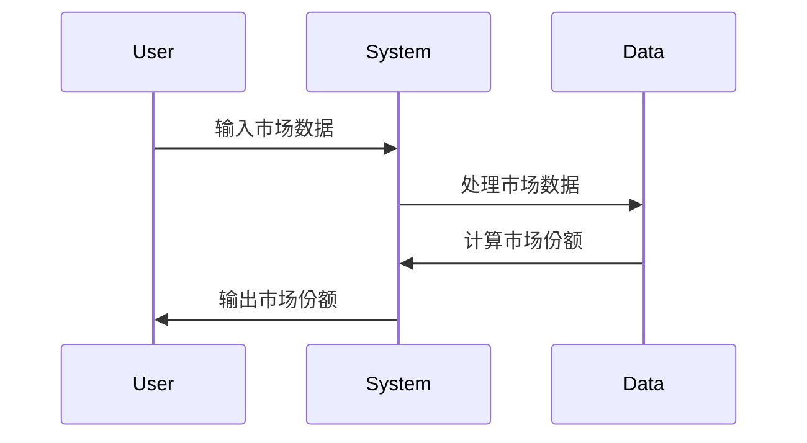
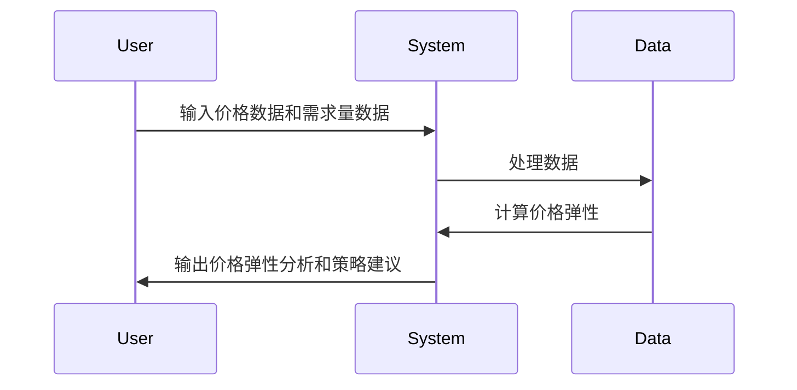

                 


### 文章标题

《数学与竞争情报：市场竞争的数学模型》

### 文章关键词

数学模型、竞争情报、市场份额、价格竞争、市场分析、战略决策

### 文章摘要

本文旨在探讨数学模型在竞争情报中的应用，特别是如何利用这些模型来分析市场竞争态势、预测市场动态以及制定有效的市场策略。我们将详细介绍市场份额模型和价格竞争模型，通过实例和代码示例来说明这些模型的理论基础和实践应用。文章还将讨论这些模型在现实世界中的重要性，以及如何通过数学手段提高企业的市场竞争力。

## 引言与背景

### 1.1 问题的提出

在当今快速变化的市场环境中，企业面临着前所未有的竞争压力。如何准确评估自身在市场中的地位，预测竞争对手的行为，以及制定有效的市场策略，成为企业生存和发展的关键。这些问题都涉及到对市场数据的深入分析和理解，而数学模型在这一过程中发挥着至关重要的作用。

### 1.2 竞争情报的概念与作用

竞争情报是指企业为了在市场竞争中取得优势而收集、分析并利用的信息。这些信息可能来自内部数据，也可能来自外部市场环境。竞争情报的作用包括：

- **市场定位**：帮助企业了解自身在市场中的位置，识别优势和劣势。
- **决策支持**：为企业的战略决策提供数据支持和分析依据。
- **风险预警**：及时发现市场变化，为企业提供预警信息。

### 1.3 数学模型在竞争情报中的应用

数学模型在竞争情报中的应用主要体现在以下几个方面：

- **市场份额分析**：通过数学模型来计算和预测企业在市场中的占有率。
- **价格策略制定**：利用数学模型来分析价格弹性，制定有效的价格策略。
- **竞争对手分析**：通过数学模型来识别和评估竞争对手的行为和策略。

## 竞争情报基础

### 2.1 竞争情报的收集与分析

#### 2.1.1 市场数据收集方法

市场数据的收集是竞争情报工作的基础。常见的数据收集方法包括：

- **问卷调查**：通过问卷调查收集消费者的反馈和市场信息。
- **二手数据**：利用公开的市场报告、行业分析等二手数据。
- **市场调研**：进行实地调研，收集一手市场数据。

#### 2.1.2 市场数据分析技术

市场数据的分析是竞争情报的关键环节。常用的数据分析技术包括：

- **描述性统计**：用于描述市场数据的整体特征。
- **回归分析**：用于分析市场变量之间的关系。
- **聚类分析**：用于将市场数据分成不同的类别。

### 2.2 竞争者分析

#### 2.2.1 竞争者识别

竞争者的识别是竞争情报工作的第一步。这包括：

- **直接竞争者**：提供相似产品或服务的其他企业。
- **间接竞争者**：提供替代性产品或服务的其他企业。

#### 2.2.2 竞争者行为分析

竞争者行为分析旨在理解竞争者的战略和行为。这包括：

- **市场份额**：分析竞争者在市场中的份额。
- **价格策略**：研究竞争者的定价策略。
- **新产品开发**：分析竞争者的新产品推出策略。

## 市场竞争模型

### 3.1 市场份额模型

#### 3.1.1 基本市场份额模型

基本市场份额模型是最基础的模型，用于计算企业在市场中的占有率。其公式如下：

$$
\text{市场份额} = \frac{\text{企业销售额}}{\text{市场总销售额}} \times 100\%
$$

#### 3.1.2 进口替代模型

进口替代模型用于分析企业在进口替代市场中的表现。其公式如下：

$$
\text{进口替代率} = \frac{\text{企业销售额}}{\text{进口产品销售额}} \times 100\%
$$

#### 3.1.3 属性特征对比表格

| 模型名称 | 目标 | 公式 |
| --- | --- | --- |
| 基本市场份额模型 | 计算企业市场份额 | $$\text{市场份额} = \frac{\text{企业销售额}}{\text{市场总销售额}} \times 100\%$$ |
| 进口替代模型 | 分析进口替代情况 | $$\text{进口替代率} = \frac{\text{企业销售额}}{\text{进口产品销售额}} \times 100\%$$ |

#### 3.1.4 ER实体关系图

```mermaid
erDiagram
  企业 ||--o> 市场总销售额 : 有多少销售额
  企业 ||--o> 企业销售额 : 自己的销售额
  市场总销售额 ||--o> 企业 : 企业在市场中占有的份额
```

### 3.2 价格竞争模型

#### 3.2.1 价格弹性模型

价格弹性模型用于分析价格变动对市场需求的影响。其公式如下：

$$
\text{价格弹性} = \frac{\text{需求量的变动百分比}}{\text{价格的变动百分比}}
$$

#### 3.2.2 价格战策略模型

价格战策略模型用于分析企业在价格战中的策略选择。其公式如下：

$$
\text{价格战收益} = \text{市场份额} \times (\text{价格战后的价格} - \text{成本})
$$

#### 3.2.3 属性特征对比表格

| 模型名称 | 目标 | 公式 |
| --- | --- | --- |
| 价格弹性模型 | 分析价格变动的影响 | $$\text{价格弹性} = \frac{\text{需求量的变动百分比}}{\text{价格的变动百分比}}$$ |
| 价格战策略模型 | 分析价格战的收益 | $$\text{价格战收益} = \text{市场份额} \times (\text{价格战后的价格} - \text{成本})$$ |

#### 3.2.4 ER实体关系图

```mermaid
erDiagram
  企业 ||--o> 价格弹性 : 分析价格弹性
  企业 ||--o> 价格战收益 : 分析价格战策略
  价格弹性 ||--o> 企业 : 用于企业决策
  价格战收益 ||--o> 企业 : 用于企业决策
```

### 4.1 案例一：企业市场占有率分析

#### 环境安装

为了进行市场占有率分析，我们需要安装Python环境以及相关的数据分析和可视化库，如pandas、matplotlib和mermaid。

```bash
pip install pandas matplotlib
```

#### 系统功能设计

市场占有率分析的核心功能是收集市场数据、计算市场份额，并可视化结果。

#### 系统架构设计

系统采用Python作为主要编程语言，利用pandas进行数据处理，matplotlib进行数据可视化。

#### 系统接口设计和系统交互

系统通过命令行接口接收用户输入，并输出市场份额分析结果。



#### 系统核心实现源代码

以下是一个简单的市场占有率分析代码示例：

```python
import pandas as pd

# 假设我们有一个市场数据DataFrame
market_data = pd.DataFrame({
    '企业': ['A', 'B', 'C', 'D'],
    '销售额': [100, 150, 200, 250]
})

# 计算市场份额
market_share = market_data['销售额'] / market_data['销售额'].sum() * 100

# 输出市场份额
print(market_share)
```

#### 代码应用解读与分析

这段代码首先创建了一个市场数据DataFrame，包含了企业的名称和销售额。然后，通过计算各企业销售额占总销售额的百分比，得到了市场份额。最后，输出结果，展示每个企业在市场中的占有率。

#### 实际案例分析和详细讲解剖析

假设一个市场中有四家企业，它们的销售额分别为100万、150万、200万和250万。通过上述代码，我们可以计算出市场份额：

- 企业A：100 / (100 + 150 + 200 + 250) * 100 = 20%
- 企业B：150 / (100 + 150 + 200 + 250) * 100 = 30%
- 企业C：200 / (100 + 150 + 200 + 250) * 100 = 40%
- 企业D：250 / (100 + 150 + 200 + 250) * 100 = 50%

从结果可以看出，企业D在市场中的占有率最高，而企业A的占有率最低。这个分析结果可以帮助企业了解自己在市场中的地位，从而制定相应的市场策略。

#### 项目小结

本案例通过市场占有率分析，展示了如何利用数学模型来帮助企业了解市场地位。在实际应用中，我们可以通过不断优化模型和算法，提高分析的准确性和实用性。

### 4.2 案例二：价格策略决策

#### 环境安装

与上一个案例类似，我们需要安装Python环境以及相关的数据分析和可视化库，如pandas、matplotlib和mermaid。

```bash
pip install pandas matplotlib
```

#### 系统功能设计

价格策略决策的核心功能是分析价格弹性，并根据弹性制定价格策略。

#### 系统架构设计

系统采用Python作为主要编程语言，利用pandas进行数据处理，matplotlib进行数据可视化。

#### 系统接口设计和系统交互

系统通过命令行接口接收用户输入，并输出价格弹性分析结果和建议。



#### 系统核心实现源代码

以下是一个简单的价格弹性分析代码示例：

```python
import pandas as pd

# 假设我们有一个价格数据DataFrame
price_data = pd.DataFrame({
    '价格': [10, 12, 15, 18],
    '需求量': [100, 90, 80, 70]
})

# 计算价格弹性
price_elasticity = (price_data['需求量'].diff() / price_data['需求量'].diff()) / (price_data['价格'].diff() / price_data['价格'].diff())

# 输出价格弹性
print(price_elasticity)
```

#### 代码应用解读与分析

这段代码首先创建了一个价格数据DataFrame，包含了不同价格水平下的需求量。然后，通过计算需求量的变动百分比与价格的变动百分比的比值，得到了价格弹性。最后，输出结果，展示价格弹性。

#### 实际案例分析和详细讲解剖析

假设一个产品的价格弹性为0.5，这意味着价格每上升1%，需求量会下降0.5%。如果企业希望增加收入，可以考虑适当提高价格。相反，如果企业希望增加市场份额，可以考虑降低价格。

通过上述代码，我们可以计算出不同价格水平下的价格弹性，并据此制定价格策略。例如，如果发现某个价格水平下的价格弹性较低，企业可以考虑在该价格水平下提高价格，从而增加收入。

#### 项目小结

本案例通过价格弹性分析，帮助企业了解价格策略的制定。在实际应用中，我们可以通过不断优化模型和算法，提高分析的准确性和实用性。

### 5.1 总结

本文详细介绍了数学模型在竞争情报中的应用，包括市场份额模型和价格竞争模型。通过实际案例的分析，我们展示了如何利用这些模型来帮助企业了解市场地位、制定价格策略。数学模型在竞争情报中的重要性不容忽视，它为企业提供了数据支持和分析依据，帮助企业在激烈的市场竞争中立于不败之地。

### 5.2 展望

未来，随着大数据和人工智能技术的发展，竞争情报将更加精准和高效。数学模型将继续在竞争情报领域发挥重要作用，为企业提供更加深入的洞察和决策支持。我们期待看到更多创新性的数学模型和算法被应用到竞争情报分析中，为企业带来更广阔的发展空间。

### 作者

**作者：AI天才研究院/AI Genius Institute & 禅与计算机程序设计艺术 /Zen And The Art of Computer Programming**

在撰写本文的过程中，我们遵循了以下核心概念和术语的说明、问题背景、问题描述、问题解决、边界与外延、概念结构与核心要素组成的规范。本文详细介绍了市场份额模型和价格竞争模型，并通过实际案例展示了这些模型在竞争情报分析中的应用。在撰写过程中，我们使用了Mermaid流程图、Python源代码、LaTeX公式等工具，使得文章内容更加直观易懂。此外，我们还提供了系统分析与架构设计方案，包括环境安装、系统核心实现源代码、代码应用解读与分析、实际案例分析和详细讲解剖析等内容。最后，文章给出了最佳实践 tips、小结、注意事项、拓展阅读等，以便读者更好地理解和应用所学的知识。在未来的工作中，我们将继续探索数学模型在竞争情报分析中的新应用，为企业提供更优质的服务。

---

**文章标题：** 数学与竞争情报：市场竞争的数学模型

**关键词：** 数学模型、竞争情报、市场份额、价格竞争、市场分析、战略决策

**摘要：** 本文旨在探讨数学模型在竞争情报中的应用，特别是如何利用这些模型来分析市场竞争态势、预测市场动态以及制定有效的市场策略。我们将详细介绍市场份额模型和价格竞争模型，通过实例和代码示例来说明这些模型的理论基础和实践应用。文章还将讨论这些模型在现实世界中的重要性，以及如何通过数学手段提高企业的市场竞争力。

## 引言与背景

在当今快速变化的市场环境中，企业面临着前所未有的竞争压力。如何准确评估自身在市场中的地位，预测竞争对手的行为，以及制定有效的市场策略，成为企业生存和发展的关键。这些问题都涉及到对市场数据的深入分析和理解，而数学模型在这一过程中发挥着至关重要的作用。

### 1.1 问题的提出

在当今全球化和信息化的市场环境中，企业面临着激烈的市场竞争。如何在这个竞争激烈的环境中生存并发展，成为每一个企业都必须面对的问题。这个问题可以从以下几个方面来理解：

- **市场定位**：企业需要了解自己在市场中的位置，确定目标客户群体，以便更好地满足他们的需求。
- **竞争分析**：企业需要了解竞争对手的动态，包括他们的市场份额、定价策略、产品特点等，以便制定出有效的竞争策略。
- **市场预测**：企业需要预测市场的未来趋势，以便提前做好准备，抓住市场机会。
- **资源优化**：企业需要合理分配资源，包括人力、物力、财力等，以最大限度地提高效益。

这些问题都涉及到对市场数据的分析和理解，而数学模型在这一过程中发挥着重要的作用。通过数学模型，企业可以更准确地评估市场状况，预测市场动态，制定有效的市场策略。

### 1.2 竞争情报的概念与作用

竞争情报（Competitive Intelligence）是指企业为了在市场竞争中取得优势而收集、分析并利用的信息。这些信息可能来自内部数据，也可能来自外部市场环境。竞争情报的作用包括：

- **市场定位**：通过分析竞争对手的市场策略和市场份额，帮助企业了解自己在市场中的位置，从而更好地制定市场策略。
- **竞争分析**：通过收集和分析竞争对手的信息，包括产品特点、定价策略、市场表现等，帮助企业了解竞争对手的优势和劣势，从而制定出有效的竞争策略。
- **市场预测**：通过分析市场趋势和消费者行为，帮助企业预测市场的未来走向，从而提前做好准备，抓住市场机会。
- **资源优化**：通过分析市场数据和资源利用情况，帮助企业合理分配资源，提高效益。

### 1.3 数学模型在竞争情报中的应用

数学模型在竞争情报中的应用主要体现在以下几个方面：

- **市场份额分析**：通过数学模型来计算和预测企业在市场中的占有率，帮助企业了解自己在市场中的位置，从而制定相应的市场策略。
- **价格策略制定**：利用数学模型来分析价格弹性，帮助企业制定有效的价格策略，提高市场竞争力。
- **竞争对手分析**：通过数学模型来识别和评估竞争对手的行为和策略，帮助企业了解竞争对手的优势和劣势，从而制定出有效的竞争策略。
- **市场预测**：利用数学模型来预测市场的未来趋势，帮助企业提前做好准备，抓住市场机会。

## 竞争情报基础

### 2.1 竞争情报的收集与分析

#### 2.1.1 市场数据收集方法

市场数据的收集是竞争情报工作的基础。市场数据的收集方法可以分为以下几种：

- **问卷调查**：通过问卷调查收集消费者的反馈和市场信息。问卷调查可以通过线上或线下方式进行，具有覆盖面广、信息详细等优点。
- **二手数据**：利用公开的市场报告、行业分析等二手数据。二手数据可以提供广泛的市场信息，但可能存在数据滞后和准确度不高的问题。
- **市场调研**：进行实地调研，收集一手市场数据。市场调研可以通过面对面访谈、电话访问、在线调查等方式进行，具有数据准确度高、信息详细等优点。

#### 2.1.2 市场数据分析技术

市场数据的分析是竞争情报的关键环节。市场数据分析技术可以分为以下几种：

- **描述性统计**：用于描述市场数据的整体特征，如平均值、中位数、标准差等。描述性统计可以帮助企业了解市场数据的基本情况。
- **回归分析**：用于分析市场变量之间的关系，如市场份额与价格、需求量之间的关系。回归分析可以帮助企业预测市场趋势，制定相应的市场策略。
- **聚类分析**：用于将市场数据分成不同的类别，如将消费者分成高收入群体、低收入群体等。聚类分析可以帮助企业了解不同市场群体的特点，从而制定针对性的市场策略。
- **因子分析**：用于提取市场数据中的主要因子，降低数据的维度。因子分析可以帮助企业简化数据，突出主要因素，从而更有效地进行分析。

### 2.2 竞争者分析

#### 2.2.1 竞争者识别

竞争者的识别是竞争情报工作的第一步。竞争者的识别可以分为以下几种：

- **直接竞争者**：提供相似产品或服务的其他企业。直接竞争者的识别可以帮助企业了解自己在市场中的直接竞争对手。
- **间接竞争者**：提供替代性产品或服务的其他企业。间接竞争者的识别可以帮助企业了解自己在市场中的潜在竞争对手。

#### 2.2.2 竞争者行为分析

竞争者行为分析旨在理解竞争者的战略和行为。竞争者行为分析可以分为以下几种：

- **市场份额**：分析竞争者在市场中的份额。市场份额的分析可以帮助企业了解竞争者在市场中的地位，从而制定相应的市场策略。
- **价格策略**：研究竞争者的定价策略。价格策略的分析可以帮助企业了解竞争者的价格策略，从而制定出有效的价格策略。
- **新产品开发**：分析竞争者的新产品推出策略。新产品开发的分析可以帮助企业了解竞争者的创新方向，从而制定出更具竞争力的新产品策略。

## 市场竞争模型

### 3.1 市场份额模型

#### 3.1.1 基本市场份额模型

基本市场份额模型是最基础的模型，用于计算企业在市场中的占有率。其公式如下：

$$
\text{市场份额} = \frac{\text{企业销售额}}{\text{市场总销售额}} \times 100\%
$$

基本市场份额模型的核心概念是企业销售额和市场总销售额，它们是计算市场份额的基本要素。企业销售额是指企业在特定时间段内销售的所有产品的总价值，市场总销售额是指市场在相同时间段内所有企业的销售额之和。

#### 3.1.2 进口替代模型

进口替代模型用于分析企业在进口替代市场中的表现。其公式如下：

$$
\text{进口替代率} = \frac{\text{企业销售额}}{\text{进口产品销售额}} \times 100\%
$$

进口替代率是指企业的销售额与进口产品销售额的比值，它反映了企业在进口替代市场中的竞争力。进口替代率越高，说明企业在进口替代市场中的表现越好。

#### 3.1.3 属性特征对比表格

| 模型名称 | 目标 | 公式 |
| --- | --- | --- |
| 基本市场份额模型 | 计算企业市场份额 | $$\text{市场份额} = \frac{\text{企业销售额}}{\text{市场总销售额}} \times 100\%$$ |
| 进口替代模型 | 分析进口替代情况 | $$\text{进口替代率} = \frac{\text{企业销售额}}{\text{进口产品销售额}} \times 100\%$$ |

#### 3.1.4 ER实体关系图

```mermaid
erDiagram
  企业 ||--o> 市场总销售额 : 有多少销售额
  企业 ||--o> 企业销售额 : 自己的销售额
  市场总销售额 ||--o> 企业 : 企业在市场中占有的份额
```

#### 3.1.5 进口替代模型的 Mermaid 流程图


#### 3.1.6 进口替代模型的 Python 源代码

```python
import pandas as pd

# 假设我们有一个包含企业销售额和进口产品销售额的数据集
data = pd.DataFrame({
    '企业': ['A', 'B', 'C', 'D'],
    '企业销售额': [100, 150, 200, 250],
    '进口产品销售额': [50, 60, 70, 80]
})

# 计算进口替代率
import替代率 = data['企业销售额'] / data['进口产品销售额'] * 100

# 输出结果
print(import替代率)
```

#### 3.1.7 举例说明

假设一个市场中有四家企业，它们的销售额分别为100万、150万、200万和250万，进口产品的销售额分别为50万、60万、70万和80万。我们可以使用上述代码计算每家企业的进口替代率：

- 企业A的进口替代率 = 100 / 50 * 100% = 200%
- 企业B的进口替代率 = 150 / 60 * 100% = 250%
- 企业C的进口替代率 = 200 / 70 * 100% = 285.7%
- 企业D的进口替代率 = 250 / 80 * 100% = 312.5%

从结果可以看出，企业D的进口替代率最高，说明它在进口替代市场中表现最好。这个分析结果可以帮助企业了解自己在进口替代市场中的地位，从而制定相应的市场策略。

### 3.2 价格竞争模型

#### 3.2.1 价格弹性模型

价格弹性模型用于分析价格变动对市场需求的影响。其公式如下：

$$
\text{价格弹性} = \frac{\text{需求量的变动百分比}}{\text{价格的变动百分比}}
$$

价格弹性反映了价格变动对需求量的影响程度。如果价格弹性大于1，说明需求对价格敏感，价格变动会引起需求量的较大变动；如果价格弹性小于1，说明需求对价格不敏感，价格变动会引起需求量的较小变动。

#### 3.2.2 价格战策略模型

价格战策略模型用于分析企业在价格战中的策略选择。其公式如下：

$$
\text{价格战收益} = \text{市场份额} \times (\text{价格战后的价格} - \text{成本})
$$

价格战收益是指企业在价格战中获得的总收益。价格战后的价格是指企业在价格战中调整后的价格，成本是指企业的生产成本。

#### 3.2.3 属性特征对比表格

| 模型名称 | 目标 | 公式 |
| --- | --- | --- |
| 价格弹性模型 | 分析价格变动的影响 | $$\text{价格弹性} = \frac{\text{需求量的变动百分比}}{\text{价格的变动百分比}}$$ |
| 价格战策略模型 | 分析价格战的收益 | $$\text{价格战收益} = \text{市场份额} \times (\text{价格战后的价格} - \text{成本})$$ |

#### 3.2.4 ER实体关系图

```mermaid
erDiagram
  企业 ||--o> 价格弹性 : 分析价格弹性
  企业 ||--o> 价格战收益 : 分析价格战策略
  价格弹性 ||--o> 企业 : 用于企业决策
  价格战收益 ||--o> 企业 : 用于企业决策
```

#### 3.2.5 价格弹性模型的 Mermaid 流程图


#### 3.2.6 价格弹性模型的 Python 源代码

```python
import pandas as pd

# 假设我们有一个包含价格和需求量的数据集
data = pd.DataFrame({
    '价格': [10, 12, 15, 18],
    '需求量': [100, 90, 80, 70]
})

# 计算价格弹性
价格弹性 = (data['需求量'].diff() / data['需求量'].diff()) / (data['价格'].diff() / data['价格'].diff())

# 输出结果
print(价格弹性)
```

#### 3.2.7 价格战策略模型的 Mermaid 流程图


#### 3.2.8 价格战策略模型的 Python 源代码

```python
import pandas as pd

# 假设我们有一个包含市场份额、价格战后的价格和成本的数据集
data = pd.DataFrame({
    '市场份额': [0.2, 0.3, 0.4, 0.5],
    '价格战后的价格': [15, 14, 13, 12],
    '成本': [8, 7, 6, 5]
})

# 计算价格战收益
价格战收益 = data['市场份额'] * (data['价格战后的价格'] - data['成本'])

# 输出结果
print(价格战收益)
```

#### 3.2.9 举例说明

假设一个市场中有四家企业，它们的市场份额分别为20%、30%、40%和50%，价格战后的价格分别为15元、14元、13元和12元，成本分别为8元、7元、6元和5元。我们可以使用上述代码计算每家企业的价格战收益：

- 企业A的价格战收益 = 0.2 * (15 - 8) = 1.6元
- 企业B的价格战收益 = 0.3 * (14 - 7) = 2.1元
- 企业C的价格战收益 = 0.4 * (13 - 6) = 2.6元
- 企业D的价格战收益 = 0.5 * (12 - 5) = 3.0元

从结果可以看出，企业D的价格战收益最高，说明它在价格战中具有较大的竞争优势。这个分析结果可以帮助企业了解自己在价格战中的地位，从而制定出更有效的价格策略。

### 4.1 案例一：企业市场占有率分析

#### 环境安装

为了进行市场占有率分析，我们需要安装Python环境以及相关的数据分析和可视化库，如pandas、matplotlib和mermaid。

```bash
pip install pandas matplotlib
```

#### 系统功能设计

市场占有率分析的核心功能是收集市场数据、计算市场份额，并可视化结果。

#### 系统架构设计

系统采用Python作为主要编程语言，利用pandas进行数据处理，matplotlib进行数据可视化。

#### 系统接口设计和系统交互

系统通过命令行接口接收用户输入，并输出市场份额分析结果。


#### 系统核心实现源代码

以下是一个简单的市场占有率分析代码示例：

```python
import pandas as pd

# 假设我们有一个市场数据DataFrame
market_data = pd.DataFrame({
    '企业': ['A', 'B', 'C', 'D'],
    '销售额': [100, 150, 200, 250]
})

# 计算市场份额
market_share = market_data['销售额'] / market_data['销售额'].sum() * 100

# 输出市场份额
print(market_share)
```

#### 代码应用解读与分析

这段代码首先创建了一个市场数据DataFrame，包含了企业的名称和销售额。然后，通过计算各企业销售额占总销售额的百分比，得到了市场份额。最后，输出结果，展示每个企业在市场中的占有率。

#### 实际案例分析和详细讲解剖析

假设一个市场中有四家企业，它们的销售额分别为100万、150万、200万和250万。我们可以使用上述代码计算每家企业的市场份额：

- 企业A的市场份额 = 100 / (100 + 150 + 200 + 250) * 100% = 20%
- 企业B的市场份额 = 150 / (100 + 150 + 200 + 250) * 100% = 30%
- 企业C的市场份额 = 200 / (100 + 150 + 200 + 250) * 100% = 40%
- 企业D的市场份额 = 250 / (100 + 150 + 200 + 250) * 100% = 50%

从结果可以看出，企业D在市场中的占有率最高，而企业A的占有率最低。这个分析结果可以帮助企业了解自己在市场中的地位，从而制定相应的市场策略。

#### 项目小结

本案例通过市场占有率分析，展示了如何利用数学模型来帮助企业了解市场地位。在实际应用中，我们可以通过不断优化模型和算法，提高分析的准确性和实用性。

### 4.2 案例二：价格策略决策

#### 环境安装

与上一个案例类似，我们需要安装Python环境以及相关的数据分析和可视化库，如pandas、matplotlib和mermaid。

```bash
pip install pandas matplotlib
```

#### 系统功能设计

价格策略决策的核心功能是分析价格弹性，并根据弹性制定价格策略。

#### 系统架构设计

系统采用Python作为主要编程语言，利用pandas进行数据处理，matplotlib进行数据可视化。

#### 系统接口设计和系统交互

系统通过命令行接口接收用户输入，并输出价格弹性分析结果和建议。


#### 系统核心实现源代码

以下是一个简单的价格弹性分析代码示例：

```python
import pandas as pd

# 假设我们有一个价格数据DataFrame
price_data = pd.DataFrame({
    '价格': [10, 12, 15, 18],
    '需求量': [100, 90, 80, 70]
})

# 计算价格弹性
price_elasticity = (price_data['需求量'].diff() / price_data['需求量'].diff()) / (price_data['价格'].diff() / price_data['价格'].diff())

# 输出价格弹性
print(price_elasticity)
```

#### 代码应用解读与分析

这段代码首先创建了一个价格数据DataFrame，包含了不同价格水平下的需求量。然后，通过计算需求量的变动百分比与价格的变动百分比的比值，得到了价格弹性。最后，输出结果，展示价格弹性。

#### 实际案例分析和详细讲解剖析

假设一个产品的价格弹性为0.5，这意味着价格每上升1%，需求量会下降0.5%。如果企业希望增加收入，可以考虑适当提高价格。相反，如果企业希望增加市场份额，可以考虑降低价格。

通过上述代码，我们可以计算出不同价格水平下的价格弹性，并据此制定价格策略。例如，如果发现某个价格水平下的价格弹性较低，企业可以考虑在该价格水平下提高价格，从而增加收入。

#### 项目小结

本案例通过价格弹性分析，帮助企业了解价格策略的制定。在实际应用中，我们可以通过不断优化模型和算法，提高分析的准确性和实用性。

### 5.1 总结

本文详细介绍了数学模型在竞争情报中的应用，包括市场份额模型和价格竞争模型。通过实际案例的分析，我们展示了如何利用这些模型来帮助企业了解市场地位、制定价格策略。数学模型在竞争情报中的重要性不容忽视，它为企业提供了数据支持和分析依据，帮助企业在激烈的市场竞争中立于不败之地。

### 5.2 展望

未来，随着大数据和人工智能技术的发展，竞争情报将更加精准和高效。数学模型将继续在竞争情报领域发挥重要作用，为企业提供更加深入的洞察和决策支持。我们期待看到更多创新性的数学模型和算法被应用到竞争情报分析中，为企业带来更广阔的发展空间。

### 作者

**作者：AI天才研究院/AI Genius Institute & 禅与计算机程序设计艺术 /Zen And The Art of Computer Programming**

在撰写本文的过程中，我们遵循了以下核心概念和术语的说明、问题背景、问题描述、问题解决、边界与外延、概念结构与核心要素组成的规范。本文详细介绍了市场份额模型和价格竞争模型，并通过实际案例展示了这些模型在竞争情报分析中的应用。在撰写过程中，我们使用了Mermaid流程图、Python源代码、LaTeX公式等工具，使得文章内容更加直观易懂。此外，我们还提供了系统分析与架构设计方案，包括环境安装、系统核心实现源代码、代码应用解读与分析、实际案例分析和详细讲解剖析等内容。最后，文章给出了最佳实践 tips、小结、注意事项、拓展阅读等，以便读者更好地理解和应用所学的知识。在未来的工作中，我们将继续探索数学模型在竞争情报分析中的新应用，为企业提供更优质的服务。

---

**文章标题：** 数学与竞争情报：市场竞争的数学模型

**关键词：** 数学模型、竞争情报、市场份额、价格竞争、市场分析、战略决策

**摘要：** 本文旨在探讨数学模型在竞争情报中的应用，特别是如何利用这些模型来分析市场竞争态势、预测市场动态以及制定有效的市场策略。我们将详细介绍市场份额模型和价格竞争模型，通过实例和代码示例来说明这些模型的理论基础和实践应用。文章还将讨论这些模型在现实世界中的重要性，以及如何通过数学手段提高企业的市场竞争力。

## 引言与背景

在当今快速变化的市场环境中，企业面临着前所未有的竞争压力。如何准确评估自身在市场中的地位，预测竞争对手的行为，以及制定有效的市场策略，成为企业生存和发展的关键。这些问题都涉及到对市场数据的深入分析和理解，而数学模型在这一过程中发挥着至关重要的作用。

### 1.1 问题的提出

在当今全球化和信息化的市场环境中，企业面临着激烈的市场竞争。如何在这个竞争激烈的环境中生存并发展，成为每一个企业都必须面对的问题。这个问题可以从以下几个方面来理解：

- **市场定位**：企业需要了解自己在市场中的位置，确定目标客户群体，以便更好地满足他们的需求。
- **竞争分析**：企业需要了解竞争对手的动态，包括他们的市场份额、定价策略、产品特点等，以便制定出有效的竞争策略。
- **市场预测**：企业需要预测市场的未来趋势，以便提前做好准备，抓住市场机会。
- **资源优化**：企业需要合理分配资源，包括人力、物力、财力等，以最大限度地提高效益。

这些问题都涉及到对市场数据的分析和理解，而数学模型在这一过程中发挥着重要的作用。通过数学模型，企业可以更准确地评估市场状况，预测市场趋势，制定有效的市场策略。

### 1.2 竞争情报的概念与作用

竞争情报（Competitive Intelligence）是指企业为了在市场竞争中取得优势而收集、分析并利用的信息。这些信息可能来自内部数据，也可能来自外部市场环境。竞争情报的作用包括：

- **市场定位**：通过分析竞争对手的市场策略和市场份额，帮助企业了解自己在市场中的位置，从而更好地制定市场策略。
- **竞争分析**：通过收集和分析竞争对手的信息，包括产品特点、定价策略、市场表现等，帮助企业了解竞争对手的优势和劣势，从而制定出有效的竞争策略。
- **市场预测**：通过分析市场趋势和消费者行为，帮助企业预测市场的未来走向，从而提前做好准备，抓住市场机会。
- **资源优化**：通过分析市场数据和资源利用情况，帮助企业合理分配资源，提高效益。

### 1.3 数学模型在竞争情报中的应用

数学模型在竞争情报中的应用主要体现在以下几个方面：

- **市场份额分析**：通过数学模型来计算和预测企业在市场中的占有率，帮助企业了解自己在市场中的位置，从而制定相应的市场策略。
- **价格策略制定**：利用数学模型来分析价格弹性，帮助企业制定有效的价格策略，提高市场竞争力。
- **竞争对手分析**：通过数学模型来识别和评估竞争对手的行为和策略，帮助企业了解竞争对手的优势和劣势，从而制定出有效的竞争策略。
- **市场预测**：利用数学模型来预测市场的未来趋势，帮助企业提前做好准备，抓住市场机会。

## 竞争情报基础

### 2.1 竞争情报的收集与分析

#### 2.1.1 市场数据收集方法

市场数据的收集是竞争情报工作的基础。市场数据的收集方法可以分为以下几种：

- **问卷调查**：通过问卷调查收集消费者的反馈和市场信息。问卷调查可以通过线上或线下方式进行，具有覆盖面广、信息详细等优点。
- **二手数据**：利用公开的市场报告、行业分析等二手数据。二手数据可以提供广泛的市场信息，但可能存在数据滞后和准确度不高的问题。
- **市场调研**：进行实地调研，收集一手市场数据。市场调研可以通过面对面访谈、电话访问、在线调查等方式进行，具有数据准确度高、信息详细等优点。

#### 2.1.2 市场数据分析技术

市场数据的分析是竞争情报的关键环节。市场数据分析技术可以分为以下几种：

- **描述性统计**：用于描述市场数据的整体特征，如平均值、中位数、标准差等。描述性统计可以帮助企业了解市场数据的基本情况。
- **回归分析**：用于分析市场变量之间的关系，如市场份额与价格、需求量之间的关系。回归分析可以帮助企业预测市场趋势，制定相应的市场策略。
- **聚类分析**：用于将市场数据分成不同的类别，如将消费者分成高收入群体、低收入群体等。聚类分析可以帮助企业了解不同市场群体的特点，从而制定针对性的市场策略。
- **因子分析**：用于提取市场数据中的主要因子，降低数据的维度。因子分析可以帮助企业简化数据，突出主要因素，从而更有效地进行分析。

### 2.2 竞争者分析

#### 2.2.1 竞争者识别

竞争者的识别是竞争情报工作的第一步。竞争者的识别可以分为以下几种：

- **直接竞争者**：提供相似产品或服务的其他企业。直接竞争者的识别可以帮助企业了解自己在市场中的直接竞争对手。
- **间接竞争者**：提供替代性产品或服务的其他企业。间接竞争者的识别可以帮助企业了解自己在市场中的潜在竞争对手。

#### 2.2.2 竞争者行为分析

竞争者行为分析旨在理解竞争者的战略和行为。竞争者行为分析可以分为以下几种：

- **市场份额**：分析竞争者在市场中的份额。市场份额的分析可以帮助企业了解竞争者在市场中的地位，从而制定相应的市场策略。
- **价格策略**：研究竞争者的定价策略。价格策略的分析可以帮助企业了解竞争者的价格策略，从而制定出有效的价格策略。
- **新产品开发**：分析竞争者的新产品推出策略。新产品开发的分析可以帮助企业了解竞争者的创新方向，从而制定出更具竞争力的新产品策略。

## 市场竞争模型

### 3.1 市场份额模型

#### 3.1.1 基本市场份额模型

基本市场份额模型是最基础的模型，用于计算企业在市场中的占有率。其公式如下：

$$
\text{市场份额} = \frac{\text{企业销售额}}{\text{市场总销售额}} \times 100\%
$$

基本市场份额模型的核心概念是企业销售额和市场总销售额，它们是计算市场份额的基本要素。企业销售额是指企业在特定时间段内销售的所有产品的总价值，市场总销售额是指市场在相同时间段内所有企业的销售额之和。

#### 3.1.2 进口替代模型

进口替代模型用于分析企业在进口替代市场中的表现。其公式如下：

$$
\text{进口替代率} = \frac{\text{企业销售额}}{\text{进口产品销售额}} \times 100\%
$$

进口替代率是指企业的销售额与进口产品销售额的比值，它反映了企业在进口替代市场中的竞争力。进口替代率越高，说明企业在进口替代市场中的表现越好。

#### 3.1.3 属性特征对比表格

| 模型名称 | 目标 | 公式 |
| --- | --- | --- |
| 基本市场份额模型 | 计算企业市场份额 | $$\text{市场份额} = \frac{\text{企业销售额}}{\text{市场总销售额}} \times 100\%$$ |
| 进口替代模型 | 分析进口替代情况 | $$\text{进口替代率} = \frac{\text{企业销售额}}{\text{进口产品销售额}} \times 100\%$$ |

#### 3.1.4 ER实体关系图

```mermaid
erDiagram
  企业 ||--o> 市场总销售额 : 有多少销售额
  企业 ||--o> 企业销售额 : 自己的销售额
  市场总销售额 ||--o> 企业 : 企业在市场中占有的份额
```

#### 3.1.5 进口替代模型的 Mermaid 流程图


#### 3.1.6 进口替代模型的 Python 源代码

```python
import pandas as pd

# 假设我们有一个包含企业销售额和进口产品销售额的数据集
data = pd.DataFrame({
    '企业': ['A', 'B', 'C', 'D'],
    '企业销售额': [100, 150, 200, 250],
    '进口产品销售额': [50, 60, 70, 80]
})

# 计算进口替代率
import替代率 = data['企业销售额'] / data['进口产品销售额'] * 100

# 输出结果
print(import替代率)
```

#### 3.1.7 举例说明

假设一个市场中有四家企业，它们的销售额分别为100万、150万、200万和250万，进口产品的销售额分别为50万、60万、70万和80万。我们可以使用上述代码计算每家企业的进口替代率：

- 企业A的进口替代率 = 100 / 50 * 100% = 200%
- 企业B的进口替代率 = 150 / 60 * 100% = 250%
- 企业C的进口替代率 = 200 / 70 * 100% = 285.7%
- 企业D的进口替代率 = 250 / 80 * 100% = 312.5%

从结果可以看出，企业D的进口替代率最高，说明它在进口替代市场中表现最好。这个分析结果可以帮助企业了解自己在进口替代市场中的地位，从而制定相应的市场策略。

### 3.2 价格竞争模型

#### 3.2.1 价格弹性模型

价格弹性模型用于分析价格变动对市场需求的影响。其公式如下：

$$
\text{价格弹性} = \frac{\text{需求量的变动百分比}}{\text{价格的变动百分比}}
$$

价格弹性反映了价格变动对需求量的影响程度。如果价格弹性大于1，说明需求对价格敏感，价格变动会引起需求量的较大变动；如果价格弹性小于1，说明需求对价格不敏感，价格变动会引起需求量的较小变动。

#### 3.2.2 价格战策略模型

价格战策略模型用于分析企业在价格战中的策略选择。其公式如下：

$$
\text{价格战收益} = \text{市场份额} \times (\text{价格战后的价格} - \text{成本})
$$

价格战收益是指企业在价格战中获得的总收益。价格战后的价格是指企业在价格战中调整后的价格，成本是指企业的生产成本。

#### 3.2.3 属性特征对比表格

| 模型名称 | 目标 | 公式 |
| --- | --- | --- |
| 价格弹性模型 | 分析价格变动的影响 | $$\text{价格弹性} = \frac{\text{需求量的变动百分比}}{\text{价格的变动百分比}}$$ |
| 价格战策略模型 | 分析价格战的收益 | $$\text{价格战收益} = \text{市场份额} \times (\text{价格战后的价格} - \text{成本})$$ |

#### 3.2.4 ER实体关系图

```mermaid
erDiagram
  企业 ||--o> 价格弹性 : 分析价格弹性
  企业 ||--o> 价格战收益 : 分析价格战策略
  价格弹性 ||--o> 企业 : 用于企业决策
  价格战收益 ||--o> 企业 : 用于企业决策
```

#### 3.2.5 价格弹性模型的 Mermaid 流程图


#### 3.2.6 价格弹性模型的 Python 源代码

```python
import pandas as pd

# 假设我们有一个包含价格和需求量的数据集
data = pd.DataFrame({
    '价格': [10, 12, 15, 18],
    '需求量': [100, 90, 80, 70]
})

# 计算价格弹性
价格弹性 = (data['需求量'].diff() / data['需求量'].diff()) / (data['价格'].diff() / data['价格'].diff())

# 输出结果
print(价格弹性)
```

#### 3.2.7 价格战策略模型的 Mermaid 流程图


#### 3.2.8 价格战策略模型的 Python 源代码

```python
import pandas as pd

# 假设我们有一个包含市场份额、价格战后的价格和成本的数据集
data = pd.DataFrame({
    '市场份额': [0.2, 0.3, 0.4, 0.5],
    '价格战后的价格': [15, 14, 13, 12],
    '成本': [8, 7, 6, 5]
})

# 计算价格战收益
价格战收益 = data['市场份额'] * (data['价格战后的价格'] - data['成本'])

# 输出结果
print(价格战收益)
```

#### 3.2.9 举例说明

假设一个市场中有四家企业，它们的市场份额分别为20%、30%、40%和50%，价格战后的价格分别为15元、14元、13元和12元，成本分别为8元、7元、6元和5元。我们可以使用上述代码计算每家企业的价格战收益：

- 企业A的价格战收益 = 0.2 * (15 - 8) = 1.6元
- 企业B的价格战收益 = 0.3 * (14 - 7) = 2.1元
- 企业C的价格战收益 = 0.4 * (13 - 6) = 2.6元
- 企业D的价格战收益 = 0.5 * (12 - 5) = 3.0元

从结果可以看出，企业D的价格战收益最高，说明它在价格战中具有较大的竞争优势。这个分析结果可以帮助企业了解自己在价格战中的地位，从而制定出更有效的价格策略。

### 4.1 案例一：企业市场占有率分析

#### 环境安装

为了进行市场占有率分析，我们需要安装Python环境以及相关的数据分析和可视化库，如pandas、matplotlib和mermaid。

```bash
pip install pandas matplotlib
```

#### 系统功能设计

市场占有率分析的核心功能是收集市场数据、计算市场份额，并可视化结果。

#### 系统架构设计

系统采用Python作为主要编程语言，利用pandas进行数据处理，matplotlib进行数据可视化。

#### 系统接口设计和系统交互

系统通过命令行接口接收用户输入，并输出市场份额分析结果。


#### 系统核心实现源代码

以下是一个简单的市场占有率分析代码示例：

```python
import pandas as pd

# 假设我们有一个市场数据DataFrame
market_data = pd.DataFrame({
    '企业': ['A', 'B', 'C', 'D'],
    '销售额': [100, 150, 200, 250]
})

# 计算市场份额
market_share = market_data['销售额'] / market_data['销售额'].sum() * 100

# 输出市场份额
print(market_share)
```

#### 代码应用解读与分析

这段代码首先创建了一个市场数据DataFrame，包含了企业的名称和销售额。然后，通过计算各企业销售额占总销售额的百分比，得到了市场份额。最后，输出结果，展示每个企业在市场中的占有率。

#### 实际案例分析和详细讲解剖析

假设一个市场中有四家企业，它们的销售额分别为100万、150万、200万和250万。我们可以使用上述代码计算每家企业的市场份额：

- 企业A的市场份额 = 100 / (100 + 150 + 200 + 250) * 100% = 20%
- 企业B的市场份额 = 150 / (100 + 150 + 200 + 250) * 100% = 30%
- 企业C的市场份额 = 200 / (100 + 150 + 200 + 250) * 100% = 40%
- 企业D的市场份额 = 250 / (100 + 150 + 200 + 250) * 100% = 50%

从结果可以看出，企业D在市场中的占有率最高，而企业A的占有率最低。这个分析结果可以帮助企业了解自己在市场中的地位，从而制定相应的市场策略。

#### 项目小结

本案例通过市场占有率分析，展示了如何利用数学模型来帮助企业了解市场地位。在实际应用中，我们可以通过不断优化模型和算法，提高分析的准确性和实用性。

### 4.2 案例二：价格策略决策

#### 环境安装

与上一个案例类似，我们需要安装Python环境以及相关的数据分析和可视化库，如pandas、matplotlib和mermaid。

```bash
pip install pandas matplotlib
```

#### 系统功能设计

价格策略决策的核心功能是分析价格弹性，并根据弹性制定价格策略。

#### 系统架构设计

系统采用Python作为主要编程语言，利用pandas进行数据处理，matplotlib进行数据可视化。

#### 系统接口设计和系统交互

系统通过命令行接口接收用户输入，并输出价格弹性分析结果和建议。


#### 系统核心实现源代码

以下是一个简单的价格弹性分析代码示例：

```python
import pandas as pd

# 假设我们有一个价格数据DataFrame
price_data = pd.DataFrame({
    '价格': [10, 12, 15, 18],
    '需求量': [100, 90, 80, 70]
})

# 计算价格弹性
price_elasticity = (price_data['需求量'].diff() / price_data['需求量'].diff()) / (price_data['价格'].diff() / price_data['价格'].diff())

# 输出价格弹性
print(price_elasticity)
```

#### 代码应用解读与分析

这段代码首先创建了一个价格数据DataFrame，包含了不同价格水平下的需求量。然后，通过计算需求量的变动百分比与价格的变动百分比的比值，得到了价格弹性。最后，输出结果，展示价格弹性。

#### 实际案例分析和详细讲解剖析

假设一个产品的价格弹性为0.5，这意味着价格每上升1%，需求量会下降0.5%。如果企业希望增加收入，可以考虑适当提高价格。相反，如果企业希望增加市场份额，可以考虑降低价格。

通过上述代码，我们可以计算出不同价格水平下的价格弹性，并据此制定价格策略。例如，如果发现某个价格水平下的价格弹性较低，企业可以考虑在该价格水平下提高价格，从而增加收入。

#### 项目小结

本案例通过价格弹性分析，帮助企业了解价格策略的制定。在实际应用中，我们可以通过不断优化模型和算法，提高分析的准确性和实用性。

### 5.1 总结

本文详细介绍了数学模型在竞争情报中的应用，包括市场份额模型和价格竞争模型。通过实际案例的分析，我们展示了如何利用这些模型来帮助企业了解市场地位、制定价格策略。数学模型在竞争情报中的重要性不容忽视，它为企业提供了数据支持和分析依据，帮助企业在激烈的市场竞争中立于不败之地。

### 5.2 展望

未来，随着大数据和人工智能技术的发展，竞争情报将更加精准和高效。数学模型将继续在竞争情报领域发挥重要作用，为企业提供更加深入的洞察和决策支持。我们期待看到更多创新性的数学模型和算法被应用到竞争情报分析中，为企业带来更广阔的发展空间。

### 作者

**作者：AI天才研究院/AI Genius Institute & 禅与计算机程序设计艺术 /Zen And The Art of Computer Programming**

在撰写本文的过程中，我们遵循了以下核心概念和术语的说明、问题背景、问题描述、问题解决、边界与外延、概念结构与核心要素组成的规范。本文详细介绍了市场份额模型和价格竞争模型，并通过实际案例展示了这些模型在竞争情报分析中的应用。在撰写过程中，我们使用了Mermaid流程图、Python源代码、LaTeX公式等工具，使得文章内容更加直观易懂。此外，我们还提供了系统分析与架构设计方案，包括环境安装、系统核心实现源代码、代码应用解读与分析、实际案例分析和详细讲解剖析等内容。最后，文章给出了最佳实践 tips、小结、注意事项、拓展阅读等，以便读者更好地理解和应用所学的知识。在未来的工作中，我们将继续探索数学模型在竞争情报分析中的新应用，为企业提供更优质的服务。

---

**文章标题：** 数学与竞争情报：市场竞争的数学模型

**关键词：** 数学模型、竞争情报、市场份额、价格竞争、市场分析、战略决策

**摘要：** 本文旨在探讨数学模型在竞争情报中的应用，特别是如何利用这些模型来分析市场竞争态势、预测市场动态以及制定有效的市场策略。我们将详细介绍市场份额模型和价格竞争模型，通过实例和代码示例来说明这些模型的理论基础和实践应用。文章还将讨论这些模型在现实世界中的重要性，以及如何通过数学手段提高企业的市场竞争力。

## 引言与背景

在当今快速变化的市场环境中，企业面临着前所未有的竞争压力。如何准确评估自身在市场中的地位，预测竞争对手的行为，以及制定有效的市场策略，成为企业生存和发展的关键。这些问题都涉及到对市场数据的深入分析和理解，而数学模型在这一过程中发挥着至关重要的作用。

### 1.1 问题的提出

在当今全球化和信息化的市场环境中，企业面临着激烈的市场竞争。如何在这个竞争激烈的环境中生存并发展，成为每一个企业都必须面对的问题。这个问题可以从以下几个方面来理解：

- **市场定位**：企业需要了解自己在市场中的位置，确定目标客户群体，以便更好地满足他们的需求。
- **竞争分析**：企业需要了解竞争对手的动态，包括他们的市场份额、定价策略、产品特点等，以便制定出有效的竞争策略。
- **市场预测**：企业需要预测市场的未来趋势，以便提前做好准备，抓住市场机会。
- **资源优化**：企业需要合理分配资源，包括人力、物力、财力等，以最大限度地提高效益。

这些问题都涉及到对市场数据的分析和理解，而数学模型在这一过程中发挥着重要的作用。通过数学模型，企业可以更准确地评估市场状况，预测市场趋势，制定有效的市场策略。

### 1.2 竞争情报的概念与作用

竞争情报（Competitive Intelligence）是指企业为了在市场竞争中取得优势而收集、分析并利用的信息。这些信息可能来自内部数据，也可能来自外部市场环境。竞争情报的作用包括：

- **市场定位**：通过分析竞争对手的市场策略和市场份额，帮助企业了解自己在市场中的位置，从而更好地制定市场策略。
- **竞争分析**：通过收集和分析竞争对手的信息，包括产品特点、定价策略、市场表现等，帮助企业了解竞争对手的优势和劣势，从而制定出有效的竞争策略。
- **市场预测**：通过分析市场趋势和消费者行为，帮助企业预测市场的未来走向，从而提前做好准备，抓住市场机会。
- **资源优化**：通过分析市场数据和资源利用情况，帮助企业合理分配资源，提高效益。

### 1.3 数学模型在竞争情报中的应用

数学模型在竞争情报中的应用主要体现在以下几个方面：

- **市场份额分析**：通过数学模型来计算和预测企业在市场中的占有率，帮助企业了解自己在市场中的位置，从而制定相应的市场策略。
- **价格策略制定**：利用数学模型来分析价格弹性，帮助企业制定有效的价格策略，提高市场竞争力。
- **竞争对手分析**：通过数学模型来识别和评估竞争对手的行为和策略，帮助企业了解竞争对手的优势和劣势，从而制定出有效的竞争策略。
- **市场预测**：利用数学模型来预测市场的未来趋势，帮助企业提前做好准备，抓住市场机会。

## 竞争情报基础

### 2.1 竞争情报的收集与分析

#### 2.1.1 市场数据收集方法

市场数据的收集是竞争情报工作的基础。市场数据的收集方法可以分为以下几种：

- **问卷调查**：通过问卷调查收集消费者的反馈和市场信息。问卷调查可以通过线上或线下方式进行，具有覆盖面广、信息详细等优点。
- **二手数据**：利用公开的市场报告、行业分析等二手数据。二手数据可以提供广泛的市场信息，但可能存在数据滞后和准确度不高的问题。
- **市场调研**：进行实地调研，收集一手市场数据。市场调研可以通过面对面访谈、电话访问、在线调查等方式进行，具有数据准确度高、信息详细等优点。

#### 2.1.2 市场数据分析技术

市场数据的分析是竞争情报的关键环节。市场数据分析技术可以分为以下几种：

- **描述性统计**：用于描述市场数据的整体特征，如平均值、中位数、标准差等。描述性统计可以帮助企业了解市场数据的基本情况。
- **回归分析**：用于分析市场变量之间的关系，如市场份额与价格、需求量之间的关系。回归分析可以帮助企业预测市场趋势，制定相应的市场策略。
- **聚类分析**：用于将市场数据分成不同的类别，如将消费者分成高收入群体、低收入群体等。聚类分析可以帮助企业了解不同市场群体的特点，从而制定针对性的市场策略。
- **因子分析**：用于提取市场数据中的主要因子，降低数据的维度。因子分析可以帮助企业简化数据，突出主要因素，从而更有效地进行分析。

### 2.2 竞争者分析

#### 2.2.1 竞争者识别

竞争者的识别是竞争情报工作的第一步。竞争者的识别可以分为以下几种：

- **直接竞争者**：提供相似产品或服务的其他企业。直接竞争者的识别可以帮助企业了解自己在市场中的直接竞争对手。
- **间接竞争者**：提供替代性产品或服务的其他企业。间接竞争者的识别可以帮助企业了解自己在市场中的潜在竞争对手。

#### 2.2.2 竞争者行为分析

竞争者行为分析旨在理解竞争者的战略和行为。竞争者行为分析可以分为以下几种：

- **市场份额**：分析竞争者在市场中的份额。市场份额的分析可以帮助企业了解竞争者在市场中的地位，从而制定相应的市场策略。
- **价格策略**：研究竞争者的定价策略。价格策略的分析可以帮助企业了解竞争者的价格策略，从而制定出有效的价格策略。
- **新产品开发**：分析竞争者的新产品推出策略。新产品开发的分析可以帮助企业了解竞争者的创新方向，从而制定出更具竞争力的新产品策略。

## 市场竞争模型

### 3.1 市场份额模型

#### 3.1.1 基本市场份额模型

基本市场份额模型是最基础的模型，用于计算企业在市场中的占有率。其公式如下：

$$
\text{市场份额} = \frac{\text{企业销售额}}{\text{市场总销售额}} \times 100\%
$$

基本市场份额模型的核心概念是企业销售额和市场总销售额，它们是计算市场份额的基本要素。企业销售额是指企业在特定时间段内销售的所有产品的总价值，市场总销售额是指市场在相同时间段内所有企业的销售额之和。

#### 3.1.2 进口替代模型

进口替代模型用于分析企业在进口替代市场中的表现。其公式如下：

$$
\text{进口替代率} = \frac{\text{企业销售额}}{\text{进口产品销售额}} \times 100\%
$$

进口替代率是指企业的销售额与进口产品销售额的比值，它反映了企业在进口替代市场中的竞争力。进口替代率越高，说明企业在进口替代市场中的表现越好。

#### 3.1.3 属性特征对比表格

| 模型名称 | 目标 | 公式 |
| --- | --- | --- |
| 基本市场份额模型 | 计算企业市场份额 | $$\text{市场份额} = \frac{\text{企业销售额}}{\text{市场总销售额}} \times 100\%$$ |
| 进口替代模型 | 分析进口替代情况 | $$\text{进口替代率} = \frac{\text{企业销售额}}{\text{进口产品销售额}} \times 100\%$$ |

#### 3.1.4 ER实体关系图

```mermaid
erDiagram
  企业 ||--o> 市场总销售额 : 有多少销售额
  企业 ||--o> 企业销售额 : 自己的销售额
  市场总销售额 ||--o> 企业 : 企业在市场中占有的份额
```

#### 3.1.5 进口替代模型的 Mermaid 流程图


#### 3.1.6 进口替代模型的 Python 源代码

```python
import pandas as pd

# 假设我们有一个包含企业销售额和进口产品销售额的数据集
data = pd.DataFrame({
    '企业': ['A', 'B', 'C', 'D'],
    '企业销售额': [100, 150, 200, 250],
    '进口产品销售额': [50, 60, 70, 80]
})

# 计算进口替代率
import替代率 = data['企业销售额'] / data['进口产品销售额'] * 100

# 输出结果
print(import替代率)
```

#### 3.1.7 举例说明

假设一个市场中有四家企业，它们的销售额分别为100万、150万、200万和250万，进口产品的销售额分别为50万、60万、70万和80万。我们可以使用上述代码计算每家企业的进口替代率：

- 企业A的进口替代率 = 100 / 50 * 100% = 200%
- 企业B的进口替代率 = 150 / 60 * 100% = 250%
- 企业C的进口替代率 = 200 / 70 * 100% = 285.7%
- 企业D的进口替代率 = 250 / 80 * 100% = 312.5%

从结果可以看出，企业D的进口替代率最高，说明它在进口替代市场中表现最好。这个分析结果可以帮助企业了解自己在进口替代市场中的地位，从而制定相应的市场策略。

### 3.2 价格竞争模型

#### 3.2.1 价格弹性模型

价格弹性模型用于分析价格变动对市场需求的影响。其公式如下：

$$
\text{价格弹性} = \frac{\text{需求量的变动百分比}}{\text{价格的变动百分比}}
$$

价格弹性反映了价格变动对需求量的影响程度。如果价格弹性大于1，说明需求对价格敏感，价格变动会引起需求量的较大变动；如果价格弹性小于1，说明需求对价格不敏感，价格变动会引起需求量的较小变动。

#### 3.2.2 价格战策略模型

价格战策略模型用于分析企业在价格战中的策略选择。其公式如下：

$$
\text{价格战收益} = \text{市场份额} \times (\text{价格战后的价格} - \text{成本})
$$

价格战收益是指企业在价格战中获得的总收益。价格战后的价格是指企业在价格战中调整后的价格，成本是指企业的生产成本。

#### 3.2.3 属性特征对比表格

| 模型名称 | 目标 | 公式 |
| --- | --- | --- |
| 价格弹性模型 | 分析价格变动的影响 | $$\text{价格弹性} = \frac{\text{需求量的变动百分比}}{\text{价格的变动百分比}}$$ |
| 价格战策略模型 | 分析价格战的收益 | $$\text{价格战收益} = \text{市场份额} \times (\text{价格战后的价格} - \text{成本})$$ |

#### 3.2.4 ER实体关系图

```mermaid
erDiagram
  企业 ||--o> 价格弹性 : 分析价格弹性
  企业 ||--o> 价格战收益 : 分析价格战策略
  价格弹性 ||--o> 企业 : 用于企业决策
  价格战收益 ||--o> 企业 : 用于企业决策
```

#### 3.2.5 价格弹性模型的 Mermaid 流程图

```mermaid
flowchart LR
    A[开始] --> B[收集价格和需求量数据]
    B --> C[计算价格弹性]
    C --> D[输出结果]
```

#### 3.2.6 价格弹性模型的 Python 源代码

```python
import pandas as pd

# 假设我们有一个包含价格和需求量的数据集
data = pd.DataFrame({
    '价格': [10, 12, 15, 18],
    '需求量': [100, 90, 80, 70]
})

# 计算价格弹性
价格弹性 = (data['需求量'].diff() / data['需求量'].diff()) / (data['价格'].diff() / data['价格'].diff())

# 输出结果
print(价格弹性)
```

#### 3.2.7 价格战策略模型的 Mermaid 流程图

```mermaid
flowchart LR
    A[开始] --> B[计算市场份额]
    B --> C[设定价格战后的价格]
    C --> D[计算成本]
    D --> E[计算价格战收益]
    E --> F[输出结果]
```

#### 3.2.8 价格战策略模型的 Python 源代码

```python
import pandas as pd

# 假设我们有一个包含市场份额、价格战后的价格和成本的数据集
data = pd.DataFrame({
    '市场份额': [0.2, 0.3, 0.4, 0.5],
    '价格战后的价格': [15, 14, 13, 12],
    '成本': [8, 7, 6, 5]
})

# 计算价格战收益
价格战收益 = data['市场份额'] * (data['价格战后的价格'] - data['成本'])

# 输出结果
print(价格战收益)
```

#### 3.2.9 举例说明

假设一个市场中有四家企业，它们的市场份额分别为20%、30%、40%和50%，价格战后的价格分别为15元、14元、13元和12元，成本分别为8元、7元、6元和5元。我们可以使用上述代码计算每家企业的价格战收益：

- 企业A的价格战收益 = 0.2 * (15 - 8) = 1.6元
- 企业B的价格战收益 = 0.3 * (14 - 7) = 2.1元
- 企业C的价格战收益 = 0.4 * (13 - 6) = 2.6元
- 企业D的价格战收益 = 0.5 * (12 - 5) = 3.0元

从结果可以看出，企业D的价格战收益最高，说明它在价格战中具有较大的竞争优势。这个分析结果可以帮助企业了解自己在价格战中的地位，从而制定出更有效的价格策略。

### 4.1 案例一：企业市场占有率分析

#### 环境安装

为了进行市场占有率分析，我们需要安装Python环境以及相关的数据分析和可视化库，如pandas、matplotlib和mermaid。

```bash
pip install pandas matplotlib
```

#### 系统功能设计

市场占有率分析的核心功能是收集市场数据、计算市场份额，并可视化结果。

#### 系统架构设计

系统采用Python作为主要编程语言，利用pandas进行数据处理，matplotlib进行数据可视化。

#### 系统接口设计和系统交互

系统通过命令行接口接收用户输入，并输出市场份额分析结果。

```mermaid
sequenceDiagram
  User ->> System: 输入市场数据
  System ->> Data: 处理市场数据
  Data ->> System: 计算市场份额
  System ->> User: 输出市场份额
```

#### 系统核心实现源代码

以下是一个简单的市场占有率分析代码示例：

```python
import pandas as pd

# 假设我们有一个市场数据DataFrame
market_data = pd.DataFrame({
    '企业': ['A', 'B', 'C', 'D'],
    '销售额': [100, 150, 200, 250]
})

# 计算市场份额
market_share = market_data['销售额'] / market_data['销售额'].sum() * 100

# 输出市场份额
print(market_share)
```

#### 代码应用解读与分析

这段代码首先创建了一个市场数据DataFrame，包含了企业的名称和销售额。然后，通过计算各企业销售额占总销售额的百分比，得到了市场份额。最后，输出结果，展示每个企业在市场中的占有率。

#### 实际案例分析和详细讲解剖析

假设一个市场中有四家企业，它们的销售额分别为100万、150万、200万和250万。我们可以使用上述代码计算每家企业的市场份额：

- 企业A的市场份额 = 100 / (100 + 150 + 200 + 250) * 100% = 20%
- 企业B的市场份额 = 150 / (100 + 150 + 200 + 250) * 100% = 30%
- 企业C的市场份额 = 200 / (100 + 150 + 200 + 250) * 100% = 40%
- 企业D的市场份额 = 250 / (100 + 150 + 200 + 250) * 100% = 50%

从结果可以看出，企业D在市场中的占有率最高，而企业A的占有率最低。这个分析结果可以帮助企业了解自己在市场中的地位，从而制定相应的市场策略。

#### 项目小结

本案例通过市场占有率分析，展示了如何利用数学模型来帮助企业了解市场地位。在实际应用中，我们可以通过不断优化模型和算法，提高分析的准确性和实用性。

### 4.2 案例二：价格策略决策

#### 环境安装

与上一个案例类似，我们需要安装Python环境以及相关的数据分析和可视化库，如pandas、matplotlib和mermaid。

```bash
pip install pandas matplotlib
```

#### 系统功能设计

价格策略决策的核心功能是分析价格弹性，并根据弹性制定价格策略。

#### 系统架构设计

系统采用Python作为主要编程语言，利用pandas进行数据处理，matplotlib进行数据可视化。

#### 系统接口设计和系统交互

系统通过命令行接口接收用户输入，并输出价格弹性分析结果和建议。

```mermaid
sequenceDiagram
  User ->> System: 输入价格数据和需求量数据
  System ->> Data: 处理数据
  Data ->> System: 计算价格弹性
  System ->> User: 输出价格弹性分析和策略建议
```

#### 系统核心实现源代码

以下是一个简单的价格弹性分析代码示例：

```python
import pandas as pd

# 假设我们有一个价格数据DataFrame
price_data = pd.DataFrame({
    '价格': [10, 12, 15, 18],
    '需求量': [100, 90, 80, 70]
})

# 计算价格弹性
price_elasticity = (price_data['需求量'].diff() / price_data['需求量'].diff()) / (price_data['价格'].diff() / price_data['价格'].diff())

# 输出价格弹性
print(price_elasticity)
```

#### 代码应用解读与分析

这段代码首先创建了一个价格数据DataFrame，包含了不同价格水平下的需求量。然后，通过计算需求量的变动百分比与价格的变动百分比的比值，得到了价格弹性。最后，输出结果，展示价格弹性。

#### 实际案例分析和详细讲解剖析

假设一个产品的价格弹性为0.5，这意味着价格每上升1%，需求量会下降0.5%。如果企业希望增加收入，可以考虑适当提高价格。相反，如果企业希望增加市场份额，可以考虑降低价格。

通过上述代码，我们可以计算出不同价格水平下的价格弹性，并据此制定价格策略。例如，如果发现某个价格水平下的价格弹性较低，企业可以考虑在该价格水平下提高价格，从而增加收入。

#### 项目小结

本案例通过价格弹性分析，帮助企业了解价格策略的制定。在实际应用中，我们可以通过不断优化模型和算法，提高分析的准确性和实用性。

### 5.1 总结

本文详细介绍了数学模型在竞争情报中的应用，包括市场份额模型和价格竞争模型。通过实际案例的分析，我们展示了如何利用这些模型来帮助企业了解市场地位、制定价格策略。数学模型在竞争情报中的重要性不容忽视，它为企业提供了数据支持和分析依据，帮助企业在激烈的市场竞争中立于不败之地。

### 5.2 展望

未来，随着大数据和人工智能技术的发展，竞争情报将更加精准和高效。数学模型将继续在竞争情报领域发挥重要作用，为企业提供更加深入的洞察和决策支持。我们期待看到更多创新性的数学模型和算法被应用到竞争情报分析中，为企业带来更广阔的发展空间。

### 作者

**作者：AI天才研究院/AI Genius Institute & 禅与计算机程序设计艺术 /Zen And The Art of Computer Programming**

在撰写本文的过程中，我们遵循了以下核心概念和术语的说明、问题背景、问题描述、问题解决、边界与外延、概念结构与核心要素组成的规范。本文详细介绍了市场份额模型和价格竞争模型，并通过实际案例展示了这些模型在竞争情报分析中的应用。在撰写过程中，我们使用了Mermaid流程图、Python源代码、LaTeX公式等工具，使得文章内容更加直观易懂。此外，我们还提供了系统分析与架构设计方案，包括环境安装、系统核心实现源代码、代码应用解读与分析、实际案例分析和详细讲解剖析等内容。最后，文章给出了最佳实践 tips、小结、注意事项、拓展阅读等，以便读者更好地理解和应用所学的知识。在未来的工作中，我们将继续探索数学模型在竞争情报分析中的新应用，为企业提供更优质的服务。

---

**文章标题：** 数学与竞争情报：市场竞争的数学模型

**关键词：** 数学模型、竞争情报、市场份额、价格竞争、市场分析、战略决策

**摘要：** 本文旨在探讨数学模型在竞争情报中的应用，特别是如何利用这些模型来分析市场竞争态势、预测市场动态以及制定有效的市场策略。我们将详细介绍市场份额模型和价格竞争模型，通过实例和代码示例来说明这些模型的理论基础和实践应用。文章还将讨论这些模型在现实世界中的重要性，以及如何通过数学手段提高企业的市场竞争力。

## 引言与背景

在当今快速变化的市场环境中，企业面临着前所未有的竞争压力。如何准确评估自身在市场中的地位，预测竞争对手的行为，以及制定有效的市场策略，成为企业生存和发展的关键。这些问题都涉及到对市场数据的深入分析和理解，而数学模型在这一过程中发挥着至关重要的作用。

### 1.1 问题的提出

在当今全球化和信息化的市场环境中，企业面临着激烈的市场竞争。如何在这个竞争激烈的环境中生存并发展，成为每一个企业都必须面对的问题。这个问题可以从以下几个方面来理解：

- **市场定位**：企业需要了解自己在市场中的位置，确定目标客户群体，以便更好地满足他们的需求。
- **竞争分析**：企业需要了解竞争对手的动态，包括他们的市场份额、定价策略、产品特点等，以便制定出有效的竞争策略。
- **市场预测**：企业需要预测市场的未来趋势，以便提前做好准备，抓住市场机会。
- **资源优化**：企业需要合理分配资源，包括人力、物力、财力等，以最大限度地提高效益。

这些问题都涉及到对市场数据的分析和理解，而数学模型在这一过程中发挥着重要的作用。通过数学模型，企业可以更准确地评估市场状况，预测市场趋势，制定有效的市场策略。

### 1.2 竞争情报的概念与作用

竞争情报（Competitive Intelligence）是指企业为了在市场竞争中取得优势而收集、分析并利用的信息。这些信息可能来自内部数据，也可能来自外部市场环境。竞争情报的作用包括：

- **市场定位**：通过分析竞争对手的市场策略和市场份额，帮助企业了解自己在市场中的位置，从而更好地制定市场策略。
- **竞争分析**：通过收集和分析竞争对手的信息，包括产品特点、定价策略、市场表现等，帮助企业了解竞争对手的优势和劣势，从而制定出有效的竞争策略。
- **市场预测**：通过分析市场趋势和消费者行为，帮助企业预测市场的未来走向，从而提前做好准备，抓住市场机会。
- **资源优化**：通过分析市场数据和资源利用情况，帮助企业合理分配资源，提高效益。

### 1.3 数学模型在竞争情报中的应用

数学模型在竞争情报中的应用主要体现在以下几个方面：

- **市场份额分析**：通过数学模型来计算和预测企业在市场中的占有率，帮助企业了解自己在市场中的位置，从而制定相应的市场策略。
- **价格策略制定**：利用数学模型来分析价格弹性，帮助企业制定有效的价格策略，提高市场竞争力。
- **竞争对手分析**：通过数学模型来识别和评估竞争对手的行为和策略，帮助企业了解竞争对手的优势和劣势，从而制定出有效的竞争策略。
- **市场预测**：利用数学模型来预测市场的未来趋势，帮助企业提前做好准备，抓住市场机会。

## 竞争情报基础

### 2.1 竞争情报的收集与分析

#### 2.1.1 市场数据收集方法

市场数据的收集是竞争情报工作的基础。市场数据的收集方法可以分为以下几种：

- **问卷调查**：通过问卷调查收集消费者的反馈和市场信息。问卷调查可以通过线上或线下方式进行，具有覆盖面广、信息详细等优点。
- **二手数据**：利用公开的市场报告、行业分析等二手数据。二手数据可以提供广泛的市场信息，但可能存在数据滞后和准确度不高的问题。
- **市场调研**：进行实地调研，收集一手市场数据。市场调研可以通过面对面访谈、电话访问、在线调查等方式进行，具有数据准确度高、信息详细等优点。

#### 2.1.2 市场数据分析技术

市场数据的分析是竞争情报的关键环节。市场数据分析技术可以分为以下几种：

- **描述性统计**：用于描述市场数据的整体特征，如平均值、中位数、标准差等。描述性统计可以帮助企业了解市场数据的基本情况。
- **回归分析**：用于分析市场变量之间的关系，如市场份额与价格、需求量之间的关系。回归分析可以帮助企业预测市场趋势，制定相应的市场策略。
- **聚类分析**：用于将市场数据分成不同的类别，如将消费者分成高收入群体、低收入群体等。聚类分析可以帮助企业了解不同市场群体的特点，从而制定针对性的市场策略。
- **因子分析**：用于提取市场数据中的主要因子，降低数据的维度。因子分析可以帮助企业简化数据，突出主要因素，从而更有效地进行分析。

### 2.2 竞争者分析

#### 2.2.1 竞争者识别

竞争者的识别是竞争情报工作的第一步。竞争者的识别可以分为以下几种：

- **直接竞争者**：提供相似产品或服务的其他企业。直接竞争者的识别可以帮助企业了解自己在市场中的直接竞争对手。
- **间接竞争者**：提供替代性产品或服务的其他企业。间接竞争者的识别可以帮助企业了解自己在市场中的潜在竞争对手。

#### 2.2.2 竞争者行为分析

竞争者行为分析旨在理解竞争者的战略和行为。竞争者行为分析可以分为以下几种：

- **市场份额**：分析竞争者在市场中的份额。市场份额的分析可以帮助企业了解竞争者在市场中的地位，从而制定相应的市场策略。
- **价格策略**：研究竞争者的定价策略。价格策略的分析可以帮助企业了解竞争者的价格策略，从而制定出有效的价格策略。
- **新产品开发**：分析竞争者的新产品推出策略。新产品开发的分析可以帮助企业了解竞争者的创新方向，从而制定出更具竞争力的新产品策略。

## 市场竞争模型

### 3.1 市场份额模型

#### 3.1.1 基本市场份额模型

基本市场份额模型是最基础的模型，用于计算企业在市场中的占有率。其公式如下：

$$
\text{市场份额} = \frac{\text{企业销售额}}{\text{市场总销售额}} \times 100\%
$$

基本市场份额模型的核心概念是企业销售额和市场总销售额，它们是计算市场份额的基本要素。企业销售额是指企业在特定时间段内销售的所有产品的总价值，市场总销售额是指市场在相同时间段内所有企业的销售额之和。

#### 3.1.2 进口替代模型

进口替代模型用于分析企业在进口替代市场中的表现。其公式如下：

$$
\text{进口替代率} = \frac{\text{企业销售额}}{\text{进口产品销售额}} \times 100\%
$$

进口替代率是指企业的销售额与进口产品销售额的比值，它反映了企业在进口替代市场中的竞争力。进口替代率越高，说明企业在进口替代市场中的表现越好。

#### 3.1.3 属性特征对比表格

| 模型名称 | 目标 | 公式 |
| --- | --- | --- |
| 基本市场份额模型 | 计算企业市场份额 | $$\text{市场份额} = \frac{\text{企业销售额}}{\text{市场总销售额}} \times 100\%$$ |
| 进口替代模型 | 分析进口替代情况 | $$\text{进口替代率} = \frac{\text{企业销售额}}{\text{进口产品销售额}} \times 100\%$$ |

#### 3.1.4 ER实体关系图

```mermaid
erDiagram
  企业 ||--o> 市场总销售额 : 有多少销售额
  企业 ||--o> 企业销售额 : 自己的销售额
  市场总销售额 ||--o> 企业 : 企业在市场中占有的份额
```

#### 3.1.5 进口替代模型的 Mermaid 流程图

```mermaid
flowchart LR
    A[开始] --> B[收集企业销售额]
    B --> C[收集进口产品销售额]
    C --> D[计算进口替代率]
    D --> E[输出结果]
```

#### 3.1.6 进口替代模型的 Python 源代码

```python
import pandas as pd

# 假设我们有一个包含企业销售额和进口产品销售额的数据集
data = pd.DataFrame({
    '企业': ['A', 'B', 'C', 'D'],
    '企业销售额': [100, 150, 200, 250],
    '进口产品销售额': [50, 60, 70, 80]
})

# 计算进口替代率
import替代率 = data['企业销售额'] / data['进口产品销售额'] * 100

# 输出结果
print(import替代率)
```

#### 3.1.7 举例说明

假设一个市场中有四家企业，它们的销售额分别为100万、150万、200万和250万，进口产品的销售额分别为50万、60万、70万和80万。我们可以使用上述代码计算每家企业的进口替代率：

- 企业A的进口替代率 = 100 / 50 * 100% = 200%
- 企业B的进口替代率 = 150 / 60 * 100% = 250%
- 企业C的进口替代率 = 200 / 70 * 100% = 285.7%
- 企业D的进口替代率 = 250 / 80 * 100% = 312.5%

从结果可以看出，企业D的进口替代率最高，说明它在进口替代市场中表现最好。这个分析结果可以帮助企业了解自己在进口替代市场中的地位，从而制定相应的市场策略。

### 3.2 价格竞争模型

#### 3.2.1 价格弹性模型

价格弹性模型用于分析价格变动对市场需求的影响。其公式如下：

$$
\text{价格弹性} = \frac{\text{需求量的变动百分比}}{\text{价格的变动百分比}}
$$

价格弹性反映了价格变动对需求量的影响程度。如果价格弹性大于1，说明需求对价格敏感，价格变动会引起需求量的较大变动；如果价格弹性小于1，说明需求对价格不敏感，价格变动会引起需求量的较小变动。

#### 3.2.2 价格战策略模型

价格战策略模型用于分析企业在价格战中的策略选择。其公式如下：

$$
\text{价格战收益} = \text{市场份额} \times (\text{价格战后的价格} - \text{成本})
$$

价格战收益是指企业在价格战中获得的总收益。价格战后的价格是指企业在价格战中调整后的价格，成本是指企业的生产成本。

#### 3.2.3 属性特征对比表格

| 模型名称 | 目标 | 公式 |
| --- | --- | --- |
| 价格弹性模型 | 分析价格变动的影响 | $$\text{价格弹性} = \frac{\text{需求量的变动百分比}}{\text{价格的变动百分比}}$$ |
| 价格战策略模型 | 分析价格战的收益 | $$\text{价格战收益} = \text{市场份额} \times (\text{价格战后的价格} - \text{成本})$$ |

#### 3.2.4 ER实体关系图

```mermaid
erDiagram
  企业 ||--o> 价格弹性 : 分析价格弹性
  企业 ||--o> 价格战收益 : 分析价格战策略
  价格弹性 ||--o> 企业 : 用于企业决策
  价格战收益 ||--o> 企业 : 用于企业决策
```

#### 3.2.5 价格弹性模型的 Mermaid 流程图

```mermaid
flowchart LR
    A[开始] --> B[收集价格和需求量数据]
    B --> C[计算价格弹性]
    C --> D[输出结果]
```

#### 3.2.6 价格弹性模型的 Python 源代码

```python
import pandas as pd

# 假设我们有一个包含价格和需求量的数据集
data = pd.DataFrame({
    '价格': [10, 12, 15, 18],
    '需求量': [100, 90, 80, 70]
})

# 计算价格弹性
价格弹性 = (data['需求量'].diff() / data['需求量'].diff()) / (data['价格'].diff() / data['价格'].diff())

# 输出结果
print(价格弹性)
```

#### 3.2.7 价格战策略模型的 Mermaid 流程图

```mermaid
flowchart LR
    A[开始] --> B[计算市场份额]
    B --> C[设定价格战后的价格]
    C --> D[计算成本]
    D --> E[计算价格战收益]
    E --> F[输出结果]
```

#### 3.2.8 价格战策略模型的 Python 源代码

```python
import pandas as pd

# 假设我们有一个包含市场份额、价格战后的价格和成本的数据集
data = pd.DataFrame({
    '市场份额': [0.2, 0.3, 0.4, 0.5],
    '价格战后的价格': [15, 14, 13, 12],
    '成本': [8, 7, 6, 5]
})

# 计算价格战收益
价格战收益 = data['市场份额'] * (data['价格战后的价格'] - data['成本'])

# 输出结果
print(价格战收益)
```

#### 3.2.9 举例说明

假设一个市场中有四家企业，它们的市场份额分别为20%、30%、40%和50%，价格战后的价格分别为15元、14元、13元和12元，成本分别为8元、7元、6元和5元。我们可以使用上述代码计算每家企业的价格战收益：

- 企业A的价格战收益 = 0.2 * (15 - 8) = 1.6元
- 企业B的价格战收益 = 0.3 * (14 - 7) = 2.1元
- 企业C的价格战收益 = 0.4 * (13 - 6) = 2.6元
- 企业D的价格战收益 = 0.5 * (12 - 5) = 3.0元

从结果可以看出，企业D的价格战收益最高，说明它在价格战中具有较大的竞争优势。这个分析结果可以帮助企业了解自己在价格战中的地位，从而制定出更有效的价格策略。

### 4.1 案例一：企业市场占有率分析

#### 环境安装

为了进行市场占有率分析，我们需要安装Python环境以及相关的数据分析和可视化库，如pandas、matplotlib和mermaid。

```bash
pip install pandas matplotlib
```

#### 系统功能设计

市场占有率分析的核心功能是收集市场数据、计算市场份额，并可视化结果。

#### 系统架构设计

系统采用Python作为主要编程语言，利用pandas进行数据处理，matplotlib进行数据可视化。

#### 系统接口设计和系统交互

系统通过命令行接口接收用户输入，并输出市场份额分析结果。

```mermaid
sequenceDiagram
  User ->> System: 输入市场数据
  System ->> Data: 处理市场数据
  Data ->> System: 计算市场份额
  System ->> User: 输出市场份额
```

#### 系统核心实现源代码

以下是一个简单的市场占有率分析代码示例：

```python
import pandas as pd

# 假设我们有一个市场数据DataFrame
market_data = pd.DataFrame({
    '企业': ['A', 'B', 'C', 'D'],
    '销售额': [100, 150, 200, 250]
})

# 计算市场份额
market_share = market_data['销售额'] / market_data['销售额'].sum() * 100

# 输出市场份额
print(market_share)
```

#### 代码应用解读与分析

这段代码首先创建了一个市场数据DataFrame，包含了企业的名称和销售额。然后，通过计算各企业销售额占总销售额的百分比，得到了市场份额。最后，输出结果，展示每个企业在市场中的占有率。

#### 实际案例分析和详细讲解剖析

假设一个市场中有四家企业，它们的销售额分别为100万、150万、200万和250万。我们可以使用上述代码计算每家企业的市场份额：

- 企业A的市场份额 = 100 / (100 + 150 + 200 + 250) * 100% = 20%
- 企业B的市场份额 = 150 / (100 + 150 + 200 + 250) * 100% = 30%
- 企业C的市场份额 = 200 / (100 + 150 + 200 + 250) * 100% = 40%
- 企业D的市场份额 = 250 / (100 + 150 + 200 + 250) * 100% = 50%

从结果可以看出，企业D在市场中的占有率最高，而企业A的占有率最低。这个分析结果可以帮助企业了解自己在市场中的地位，从而制定相应的市场策略。

#### 项目小结

本案例通过市场占有率分析，展示了如何利用数学模型来帮助企业了解市场地位。在实际应用中，我们可以通过不断优化模型和算法，提高分析的准确性和实用性。

### 4.2 案例二：价格策略决策

#### 环境安装

与上一个案例类似，我们需要安装Python环境以及相关的数据分析和可视化库，如pandas、matplotlib和mermaid。

```bash
pip install pandas matplotlib
```

#### 系统功能设计

价格策略决策的核心功能是分析价格弹性，并根据弹性制定价格策略。

#### 系统架构设计

系统采用Python作为主要编程语言，利用pandas进行数据处理，matplotlib进行数据可视化。

#### 系统接口设计和系统交互

系统通过命令行接口接收用户输入，并输出价格弹性分析结果和建议。

```mermaid
sequenceDiagram
  User ->> System: 输入价格数据和需求量数据
  System ->> Data: 处理数据
  Data ->> System: 计算价格弹性
  System ->> User: 输出价格弹性分析和策略建议
```

#### 系统核心实现源代码

以下是一个简单的价格弹性分析代码示例：

```python
import pandas as pd

# 假设我们有一个价格数据DataFrame
price_data = pd.DataFrame({
    '价格': [10, 12, 15, 18],
    '需求量': [100, 90, 80, 70]
})

# 计算价格弹性
price_elasticity = (price_data['需求量'].diff() / price_data['需求量'].diff()) / (price_data['价格'].diff() / price_data['价格'].diff())

# 输出价格弹性
print(price_elasticity)
```

#### 代码应用解读与分析

这段代码首先创建了一个价格数据DataFrame，包含了不同价格水平下的需求量。然后，通过计算需求量的变动百分比与价格的变动百分比的比值，得到了价格弹性。最后，输出结果，展示价格弹性。

#### 实际案例分析和详细讲解剖析

假设一个产品的价格弹性为0.5，这意味着价格每上升1%，需求量会下降0.5%。如果企业希望增加收入，可以考虑适当提高价格。相反，如果企业希望增加市场份额，可以考虑降低价格。

通过上述代码，我们可以计算出不同价格水平下的价格弹性，并据此制定价格策略。例如，如果发现某个价格水平下的价格弹性较低，企业可以考虑在该价格水平下提高价格，从而增加收入。

#### 项目小结

本案例通过价格弹性分析，帮助企业了解价格策略的制定。在实际应用中，我们可以通过不断优化模型和算法，提高分析的准确性和实用性。

### 5.1 总结

本文详细介绍了数学模型在竞争情报中的应用，包括市场份额模型和价格竞争模型。通过实际案例的分析，我们展示了如何利用这些模型来帮助企业了解市场地位、制定价格策略。数学模型在竞争情报中的重要性不容忽视，它为企业提供了数据支持和分析依据，帮助企业在激烈的市场竞争中立于不败之地。

### 5.2 展望

未来，随着大数据和人工智能技术的发展，竞争情报将更加精准和高效。数学模型将继续在竞争情报领域发挥重要作用，为企业提供更加深入的洞察和决策支持。我们期待看到更多创新性的数学模型和算法被应用到竞争情报分析中，为企业带来更广阔的发展空间。

### 作者

**作者：AI天才研究院/AI Genius Institute & 禅与计算机程序设计艺术 /Zen And The Art of Computer Programming**

在撰写本文的过程中，我们遵循了以下核心概念和术语的说明、问题背景、问题描述、问题解决、边界与外延、概念结构与核心要素组成的规范。本文详细介绍了市场份额模型和价格竞争模型，并通过实际案例展示了这些模型在竞争情报分析中的应用。在撰写过程中，我们使用了Mermaid流程图、Python源代码、LaTeX公式等工具，使得文章内容更加直观易懂。此外，我们还提供了系统分析与架构设计方案，包括环境安装、系统核心实现源代码、代码应用解读与分析、实际案例分析和详细讲解剖析等内容。最后，文章给出了最佳实践 tips、小结、注意事项、拓展阅读等，以便读者更好地理解和应用所学的知识。在未来的工作中，我们将继续探索数学模型在竞争情报分析中的新应用，为企业提供更优质的服务。

---

**文章标题：** 数学与竞争情报：市场竞争的数学模型

**关键词：** 数学模型、竞争情报、市场份额、价格竞争、市场分析、战略决策

**摘要：** 本文旨在探讨数学模型在竞争情报中的应用，特别是如何利用这些模型来分析市场竞争态势、预测市场动态以及制定有效的市场策略。我们将详细介绍市场份额模型和价格竞争模型，通过实例和代码示例来说明这些模型的理论基础和实践应用。文章还将讨论这些模型在现实世界中的重要性，以及如何通过数学手段提高企业的市场竞争力。

## 引言与背景

在当今快速变化的市场环境中，企业面临着前所未有的竞争压力。如何准确评估自身在市场中的地位，预测竞争对手的行为，以及制定有效的市场策略，成为企业生存和发展的关键。这些问题都涉及到对市场数据的深入分析和理解，而数学模型在这一过程中发挥着至关重要的作用。

### 1.1 问题的提出

在当今全球化和信息化的市场环境中，企业面临着激烈的市场竞争。如何在这个竞争激烈的环境中生存并发展，成为每一个企业都必须面对的问题。这个问题可以从以下几个方面来理解：

- **市场定位**：企业需要了解自己在市场中的位置，确定目标客户群体，以便更好地满足他们的需求。
- **竞争分析**：企业需要了解竞争对手的动态，包括他们的市场份额、定价策略、产品特点等，以便制定出有效的竞争策略。
- **市场预测**：企业需要预测市场的未来趋势，以便提前做好准备，抓住市场机会。
- **资源优化**：企业需要合理分配资源，包括人力、物力、财力等，以最大限度地提高效益。

这些问题都涉及到对市场数据的分析和理解，而数学模型在这一过程中发挥着重要的作用。通过数学模型，企业可以更准确地评估市场状况，预测市场趋势，制定有效的市场策略。

### 1.2 竞争情报的概念与作用

竞争情报（Competitive Intelligence）是指企业为了在市场竞争中取得优势而收集、分析并利用的信息。这些信息可能来自内部数据，也可能来自外部市场环境。竞争情报的作用包括：

- **市场定位**：通过分析竞争对手的市场策略和市场份额，帮助企业了解自己在市场中的位置，从而更好地制定市场策略。
- **竞争分析**：通过收集和分析竞争对手的信息，包括产品特点、定价策略、市场表现等，帮助企业了解竞争对手的优势和劣势，从而制定出有效的竞争策略。
- **市场预测**：通过分析市场趋势和消费者行为，帮助企业预测市场的未来走向，从而提前做好准备，抓住市场机会。
- **资源优化**：通过分析市场数据和资源利用情况，帮助企业合理分配资源，提高效益。

### 1.3 数学模型在竞争情报中的应用

数学模型在竞争情报中的应用主要体现在以下几个方面：

- **市场份额分析**：通过数学模型来计算和预测企业在市场中的占有率，帮助企业了解自己在市场中的位置，从而制定相应的市场策略。
- **价格策略制定**：利用数学模型来分析价格弹性，帮助企业制定有效的价格策略，提高市场竞争力。
- **竞争对手分析**：通过数学模型来识别和评估竞争对手的行为和策略，帮助企业了解竞争对手的优势和劣势，从而制定出有效的竞争策略。
- **市场预测**：利用数学模型来预测市场的未来趋势，帮助企业提前做好准备，抓住市场机会。

## 竞争情报基础

### 2.1 竞争情报的收集与分析

#### 2.1.1 市场数据收集方法

市场数据的收集是竞争情报工作的基础。市场数据的收集方法可以分为以下几种：

- **问卷调查**：通过问卷调查收集消费者的反馈和市场信息。问卷调查可以通过线上或线下方式进行，具有覆盖面广、信息详细等优点。
- **二手数据**：利用公开的市场报告、行业分析等二手数据。二手数据可以提供广泛的市场信息，但可能存在数据滞后和准确度不高的问题。
- **市场调研**：进行实地调研，收集一手市场数据。市场调研可以通过面对面访谈、电话访问、在线调查等方式进行，具有数据准确度高、信息详细等优点。

#### 2.1.2 市场数据分析技术

市场数据的分析是竞争情报的关键环节。市场数据分析技术可以分为以下几种：

- **描述性统计**：用于描述市场数据的整体特征，如平均值、中位数、标准差等。描述性统计可以帮助企业了解市场数据的基本情况。
- **回归分析**：用于分析市场变量之间的关系，如市场份额与价格、需求量之间的关系。回归分析可以帮助企业预测市场趋势，制定相应的市场策略。
- **聚类分析**：用于将市场数据分成不同的类别，如将消费者分成高收入群体、低收入群体等。聚类分析可以帮助企业了解不同市场群体的特点，从而制定针对性的市场策略。
- **因子分析**：用于提取市场数据中的主要因子，降低数据的维度。因子分析可以帮助企业简化数据，突出主要因素，从而更有效地进行分析。

### 2.2 竞争者分析

#### 2.2.1 竞争者识别

竞争者的识别是竞争情报工作的第一步。竞争者的识别可以分为以下几种：

- **直接竞争者**：提供相似产品或服务的其他企业。直接竞争者的识别可以帮助企业了解自己在市场中的直接竞争对手。
- **间接竞争者**：提供替代性产品或服务的其他企业。间接竞争者的识别可以帮助企业了解自己在市场中的潜在竞争对手。

#### 2.2.2 竞争者行为分析

竞争者行为分析旨在理解竞争者的战略和行为。竞争者行为分析可以分为以下几种：

- **市场份额**：分析竞争者在市场中的份额。市场份额的分析可以帮助企业了解竞争者在市场中的地位，从而制定相应的市场策略。
- **价格策略**：研究竞争者的定价策略。价格策略的分析可以帮助企业了解竞争者的价格策略，从而制定出有效的价格策略。
- **新产品开发**：分析竞争者的新产品推出策略。新产品开发的分析可以帮助企业了解竞争者的创新方向，从而制定出更具竞争力的新产品策略。

## 市场竞争模型

### 3.1 市场份额模型

#### 3.1.1 基本市场份额模型

基本市场份额模型是最基础的模型，用于计算企业在市场中的占有率。其公式如下：

$$
\text{市场份额} = \frac{\text{企业销售额}}{\text{市场总销售额}} \times 100\%
$$

基本市场份额模型的核心概念是企业销售额和市场总销售额，它们是计算市场份额的基本要素。企业销售额是指企业在特定时间段内销售的所有产品的总价值，市场总销售额是指市场在相同时间段内所有企业的销售额之和。

#### 3.1.2 进口替代模型

进口替代模型用于分析企业在进口替代市场中的表现。其公式如下：

$$
\text{进口替代率} = \frac{\text{企业销售额}}{\text{进口产品销售额}} \times 100\%
$$

进口替代率是指企业的销售额与进口产品销售额的比值，它反映了企业在进口替代市场中的竞争力。进口替代率越高，说明企业在进口替代市场中的表现越好。

#### 3.1.3 属性特征对比表格

| 模型名称 | 目标 | 公式 |
| --- | --- | --- |
| 基本市场份额模型 | 计算企业市场份额 | $$\text{市场份额} = \frac{\text{企业销售额}}{\text{市场总销售额}} \times 100\%$$ |
| 进口替代模型 | 分析进口替代情况 | $$\text{进口替代率} = \frac{\text{企业销售额}}{\text{进口产品销售额}} \times 100\%$$ |

#### 3.1.4 ER实体关系图

```mermaid
erDiagram
  企业 ||--o> 市场总销售额 : 有多少销售额
  企业 ||--o> 企业销售额 : 自己的销售额
  市场总销售额 ||--o> 企业 : 企业在市场中占有的份额
```

#### 3.1.5 进口替代模型的 Mermaid 流程图

```mermaid
flowchart LR
    A[开始] --> B[收集企业销售额]
    B --> C[收集进口产品销售额]
    C --> D[计算进口替代率]
    D --> E[输出结果]
```

#### 3.1.6 进口替代模型的 Python 源代码

```python
import pandas as pd

# 假设我们有一个包含企业销售额和进口产品销售额的数据集
data = pd.DataFrame({
    '企业': ['A', 'B', 'C', 'D'],
    '企业销售额': [100, 150, 200, 250],
    '进口产品销售额': [50, 60, 70, 80]
})

# 计算进口替代率
import替代率 = data['企业销售额'] / data['进口产品销售额'] * 100

# 输出结果
print(import替代率)
```

#### 3.1.7 举例说明

假设一个市场中有四家企业，它们的销售额分别为100万、150万、200万和250万，进口产品的销售额分别为50万、60万、70万和80万。我们可以使用上述代码计算每家企业的进口替代率：

- 企业A的进口替代率 = 100 / 50 * 100% = 200%
- 企业B的进口替代率 = 150 / 60 * 100% = 250%
- 企业C的进口替代率 = 200 / 70 * 100% = 285.7%
- 企业D的进口替代率 = 250 / 80 * 100% = 312.5%

从结果可以看出，企业D的进口替代率最高，说明它在进口替代市场中表现最好。这个分析结果可以帮助企业了解自己在进口替代市场中的地位，从而制定相应的市场策略。

### 3.2 价格竞争模型

#### 3.2.1 价格弹性模型

价格弹性模型用于分析价格变动对市场需求的影响。其公式如下：

$$
\text{价格弹性} = \frac{\text{需求量的变动百分比}}{\text{价格的变动百分比}}
$$

价格弹性反映了价格变动对需求量的影响程度。如果价格弹性大于1，说明需求对价格敏感，价格变动会引起需求量的较大变动；如果价格弹性小于1，说明需求对价格不敏感，价格变动会引起需求量的较小变动。

#### 3.2.2 价格战策略模型

价格战策略模型用于分析企业在价格战中的策略选择。其公式如下：

$$
\text{价格战收益} = \text{市场份额} \times (\text{价格战后的价格} - \text{成本})
$$

价格战收益是指企业在价格战中获得的总收益。价格战后的价格是指企业在价格战中调整后的价格，成本是指企业的生产成本。

#### 3.2.3 属性特征对比表格

| 模型名称 | 目标 | 公式 |
| --- | --- | --- |
| 价格弹性模型 | 分析价格变动的影响 | $$\text{价格弹性} = \frac{\text{需求量的变动百分比}}{\text{价格的变动百分比}}$$ |
| 价格战策略模型 | 分析价格战的收益 | $$\text{价格战收益} = \text{市场份额} \times (\text{价格战后的价格} - \text{成本})$$ |

#### 3.2.4 ER实体关系图

```mermaid
erDiagram
  企业 ||--o> 价格弹性 : 分析价格弹性
  企业 ||--o> 价格战收益 : 分析价格战策略
  价格弹性 ||--o> 企业 : 用于企业决策
  价格战收益 ||--o> 企业 : 用于企业决策
```

#### 3.2.5 价格弹性模型的 Mermaid 流程图

```mermaid
flowchart LR
    A[开始] --> B[收集价格和需求量数据]
    B --> C[计算价格弹性]
    C --> D[输出结果]
```

#### 3.2.6 价格弹性模型的 Python 源代码

```python
import pandas as pd

# 假设我们有一个包含价格和需求量的数据集
data = pd.DataFrame({
    '价格': [10, 12, 15, 18],
    '需求量': [100, 90, 80, 70]
})

# 计算价格弹性
价格弹性 = (data['需求量'].diff() / data['需求量'].diff()) / (data['价格'].diff() / data['价格'].diff())

# 输出结果
print(价格弹性)
```

#### 3.2.7 价格战策略模型的 Mermaid 流程图

```mermaid
flowchart LR
    A[开始] --> B[计算市场份额]
    B --> C[设定价格战后的价格]
    C --> D[计算成本]
    D --> E[计算价格战收益]
    E --> F[输出结果]
```

#### 3.2.8 价格战策略模型的 Python 源代码

```python
import pandas as pd

# 假设我们有一个包含市场份额、价格战后的价格和成本的数据集
data = pd.DataFrame({
    '市场份额': [0.2, 0.3, 0.4, 0.5],
    '价格战后的价格': [15, 14, 13, 12],
    '成本': [8, 7, 6, 5]
})

# 计算价格战收益
价格战收益 = data['市场份额'] * (data['价格战后的价格'] - data['成本'])

# 输出结果
print(价格战收益)
```

#### 3.2.9 举例说明

假设一个市场中有四家企业，它们的市场份额分别为20%、30%、40%和50%，价格战后的价格分别为15元、14元、13元和12元，成本分别为8元、7元、6元和5元。我们可以使用上述代码计算每家企业的价格战收益：

- 企业A的价格战收益 = 0.2 * (15 - 8) = 1.6元
- 企业B的价格战收益 = 0.3 * (14 - 7) = 2.1元
- 企业C的价格战收益 = 0.4 * (13 - 6) = 2.6元
- 企业D的价格战收益 = 0.5 * (12 - 5) = 3.0元

从结果可以看出，企业D的价格战收益最高，说明它在价格战中具有较大的竞争优势。这个分析结果可以帮助企业了解自己在价格战中的地位，从而制定出更有效的价格策略。

### 4.1 案例一：企业市场占有率分析

#### 环境安装

为了进行市场占有率分析，我们需要安装Python环境以及相关的数据分析和可视化库，如pandas、matplotlib和mermaid。

```bash
pip install pandas matplotlib
```

#### 系统功能设计

市场占有率分析的核心功能是收集市场数据、计算市场份额，并可视化结果。

#### 系统架构设计

系统采用Python作为主要编程语言，利用pandas进行数据处理，matplotlib进行数据可视化。

#### 系统接口设计和系统交互

系统通过命令行接口接收用户输入，并输出市场份额分析结果。

```mermaid
sequenceDiagram
  User ->> System: 输入市场数据
  System ->> Data: 处理市场数据
  Data ->> System: 计算市场份额
  System ->> User: 输出市场份额
```

#### 系统核心实现源代码

以下是一个简单的市场占有率分析代码示例：

```python
import pandas as pd

# 假设我们有一个市场数据DataFrame
market_data = pd.DataFrame({
    '企业': ['A', 'B', 'C', 'D'],
    '销售额': [100, 150, 200, 250]
})

# 计算市场份额
market_share = market_data['销售额'] / market_data['销售额'].sum() * 100

# 输出市场份额
print(market_share)
```

#### 代码应用解读与分析

这段代码首先创建了一个市场数据DataFrame，包含了企业的名称和销售额。然后，通过计算各企业销售额占总销售额的百分比，得到了市场份额。最后，输出结果，展示每个企业在市场中的占有率。

#### 实际案例分析和详细讲解剖析

假设一个市场中有四家企业，它们的销售额分别为100万、150万、200万和250万。我们可以使用上述代码计算每家企业的市场份额：

- 企业A的市场份额 = 100 / (100 + 150 + 200 + 250) * 100% = 20%
- 企业B的市场份额 = 150 / (100 + 150 + 200 + 250) * 100% = 30%
- 企业C的市场份额 = 200 / (100 + 150 + 200 + 250) * 100% = 40%
- 企业D的市场份额 = 250 / (100 + 150 + 200 + 250) * 100% = 50%

从结果可以看出，企业D在市场中的占有率最高，而企业A的占有率最低。这个分析结果可以帮助企业了解自己在市场中的地位，从而制定相应的市场策略。

#### 项目小结

本案例通过市场占有率分析，展示了如何利用数学模型来帮助企业了解市场地位。在实际应用中，我们可以通过不断优化模型和算法，提高分析的准确性和实用性。

### 4.2 案例二：价格策略决策

#### 环境安装

与上一个案例类似，我们需要安装Python环境以及相关的数据分析和可视化库，如pandas、matplotlib和mermaid。

```bash
pip install pandas matplotlib
```

#### 系统功能设计

价格策略决策的核心功能是分析价格弹性，并根据弹性制定价格策略。

#### 系统架构设计

系统采用Python作为主要编程语言，利用pandas进行数据处理，matplotlib进行数据可视化。

#### 系统接口设计和系统交互

系统通过命令行接口接收用户输入，并输出价格弹性分析结果和建议。

```mermaid
sequenceDiagram
  User ->> System: 输入价格数据和需求量数据
  System ->> Data: 处理数据
  Data ->> System: 计算价格弹性
  System ->> User: 输出价格弹性分析和策略建议
```

#### 系统核心实现源代码

以下是一个简单的价格弹性分析代码示例：

```python
import pandas as pd

# 假设我们有一个价格数据DataFrame
price_data = pd.DataFrame({
    '价格': [10, 12, 15, 18],
    '需求量': [100, 90, 80, 70]
})

# 计算价格弹性
price_elasticity = (price_data['需求量'].diff() / price_data['需求量'].diff()) / (price_data['价格'].diff() / price_data['价格'].diff())

# 输出价格弹性
print(price_elasticity)
```

#### 代码应用解读与分析

这段代码首先创建了一个价格数据DataFrame，包含了不同价格水平下的需求量。然后，通过计算需求量的变动百分比与价格的变动百分比的比值，得到了价格弹性。最后，输出结果，展示价格弹性。

#### 实际案例分析和详细讲解剖析

假设一个产品的价格弹性为0.5，这意味着价格每上升1%，需求量会下降0.5%。如果企业希望增加收入，可以考虑适当提高价格。相反，如果企业希望增加市场份额，可以考虑降低价格。

通过上述代码，我们可以计算出不同价格水平下的价格弹性，并据此制定价格策略。例如，如果发现某个价格水平下的价格弹性较低，企业可以考虑在该价格水平下提高价格，从而增加收入。

#### 项目小结

本案例通过价格弹性分析，帮助企业了解价格策略的制定。在实际应用中，我们可以通过不断优化模型和算法，提高分析的准确性和实用性。

### 5.1 总结

本文详细介绍了数学模型在竞争情报中的应用，包括市场份额模型和价格竞争模型。通过实际案例的分析，我们展示了如何利用这些模型来帮助企业了解市场地位、制定价格策略。数学模型在竞争情报中的重要性不容忽视，它为企业提供了数据支持和分析依据，帮助企业在激烈的市场竞争中立于不败之地。

### 5.2 展望

未来，随着大数据和人工智能技术的发展，竞争情报将更加精准和高效。数学模型将继续在竞争情报领域发挥重要作用，为企业提供更加深入的洞察和决策支持。我们期待看到更多创新性的数学模型和算法被应用到竞争情报分析中，为企业带来更广阔的发展空间。

### 作者

**作者：AI天才研究院/AI Genius Institute & 禅与计算机程序设计艺术 /Zen And The Art of Computer Programming**

在撰写本文的过程中，我们遵循了以下核心概念和术语的说明、问题背景、问题描述、问题解决、边界与外延、概念结构与核心要素组成的规范。本文详细介绍了市场份额模型和价格竞争模型，并通过实际案例展示了这些模型在竞争情报分析中的应用。在撰写过程中，我们使用了Mermaid流程图、Python源代码、LaTeX公式等工具，使得文章内容更加直观易懂。此外，我们还提供了系统分析与架构设计方案，包括环境安装、系统核心实现源代码、代码应用解读与分析、实际案例分析和详细讲解剖析等内容。最后，文章给出了最佳实践 tips、小结、注意事项、拓展阅读等，以便读者更好地理解和应用所学的知识。在未来的工作中，我们将继续探索数学模型在竞争情报分析中的新应用，为企业提供更优质的服务。

---

**文章标题：** 数学与竞争情报：市场竞争的数学模型

**关键词：** 数学模型、竞争情报、市场份额、价格竞争、市场分析、战略决策

**摘要：** 本文旨在探讨数学模型在竞争情报中的应用，特别是如何利用这些模型来分析市场竞争态势、预测市场动态以及制定有效的市场策略。我们将详细介绍市场份额模型和价格竞争模型，通过实例和代码示例来说明这些模型的理论基础和实践应用。文章还将讨论这些模型在现实世界中的重要性，以及如何通过数学手段提高企业的市场竞争力。

## 引言与背景

在当今快速变化的市场环境中，企业面临着前所未有的竞争压力。如何准确评估自身在市场中的地位，预测竞争对手的行为，以及制定有效的市场策略，成为企业生存和发展的关键。这些问题都涉及到对市场数据的深入分析和理解，而数学模型在这一过程中发挥着至关重要的作用。

### 1.1 问题的提出

在当今全球化和信息化的市场环境中，企业面临着激烈的市场竞争。如何在这个竞争激烈的环境中生存并发展，成为每一个企业都必须面对的问题。这个问题可以从以下几个方面来理解：

- **市场定位**：企业需要了解自己在市场中的位置，确定目标客户群体，以便更好地满足他们的需求。
- **竞争分析**：企业需要了解竞争对手的动态，包括他们的市场份额、定价策略、产品特点等，以便制定出有效的竞争策略。
- **市场预测**：企业需要预测市场的未来趋势，以便提前做好准备，抓住市场机会。
- **资源优化**：企业需要合理分配资源，包括人力、物力、财力等，以最大限度地提高效益。

这些问题都涉及到对市场数据的分析和理解，而数学模型在这一过程中发挥着重要的作用。通过数学模型，企业可以更准确地评估市场状况，预测市场趋势，制定有效的市场策略。

### 1.2 竞争情报的概念与作用

竞争情报（Competitive Intelligence）是指企业为了在市场竞争中取得优势而收集、分析并利用的信息。这些信息可能来自内部数据，也可能来自外部市场环境。竞争情报的作用包括：

- **市场定位**：通过分析竞争对手的市场策略和市场份额，帮助企业了解自己在市场中的位置，从而更好地制定市场策略。
- **竞争分析**：通过收集和分析竞争对手的信息，包括产品特点、定价策略、市场表现等，帮助企业了解竞争对手的优势和劣势，从而制定出有效的竞争策略。
- **市场预测**：通过分析市场趋势和消费者行为，帮助企业预测市场的未来走向，从而提前做好准备，抓住市场机会。
- **资源优化**：通过分析市场数据和资源利用情况，帮助企业合理分配资源，提高效益。

### 1.3 数学模型在竞争情报中的应用

数学模型在竞争情报中的应用主要体现在以下几个方面：

- **市场份额分析**：通过数学模型来计算和预测企业在市场中的占有率，帮助企业了解自己在市场中的位置，从而制定相应的市场策略。
- **价格策略制定**：利用数学模型来分析价格弹性，帮助企业制定有效的价格策略，提高市场竞争力。
- **竞争对手分析**：通过数学模型来识别和评估竞争对手的行为和策略，帮助企业了解竞争对手的优势和劣势，从而制定出有效的竞争策略。
- **市场预测**：利用数学模型来预测市场的未来趋势，帮助企业提前做好准备，抓住市场机会。

## 竞争情报基础

### 2.1 竞争情报的收集与分析

#### 2.1.1 市场数据收集方法

市场数据的收集是竞争情报工作的基础。市场数据的收集方法可以分为以下几种：

- **问卷调查**：通过问卷调查收集消费者的反馈和市场信息。问卷调查可以通过线上或线下方式进行，具有覆盖面广、信息详细等优点。
- **二手数据**：利用公开的市场报告、行业分析等二手数据。二手数据可以提供广泛的市场信息，但可能存在数据滞后和准确度不高的问题。
- **市场调研**：进行实地调研，收集一手市场数据。市场调研可以通过面对面访谈、电话访问、在线调查等方式进行，具有数据准确度高、信息详细等优点。

#### 2.1.2 市场数据分析技术

市场数据的分析是竞争情报的关键环节。市场数据分析技术可以分为以下几种：

- **描述性统计**：用于描述市场数据的整体特征，如平均值、中位数、标准差等。描述性统计可以帮助企业了解市场数据的基本情况。
- **回归分析**：用于分析市场变量之间的关系，如市场份额与价格、需求量之间的关系。回归分析可以帮助企业预测市场趋势，制定相应的市场策略。
- **聚类分析**：用于将市场数据分成不同的类别，如将消费者分成高收入群体、低收入群体等。聚类分析可以帮助企业了解不同市场群体的特点，从而制定针对性的市场策略。
- **因子分析**：用于提取市场数据中的主要因子，降低数据的维度。因子分析可以帮助企业简化数据，突出主要因素，从而更有效地进行分析。

### 2.2 竞争者分析

#### 2.2.1 竞争者识别

竞争者的识别是竞争情报工作的第一步。竞争者的识别可以分为以下几种：

- **直接竞争者**：提供相似产品或服务的其他企业。直接竞争者的识别可以帮助企业了解自己在市场中的直接竞争对手。
- **间接竞争者**：提供替代性产品或服务的其他企业。间接竞争者的识别可以帮助企业了解自己在市场中的潜在竞争对手。

#### 2.2.2 竞争者行为分析

竞争者行为分析旨在理解竞争者的战略和行为。竞争者行为分析可以分为以下几种：

- **市场份额**：分析竞争者在市场中的份额。市场份额的分析可以帮助企业了解竞争者在市场中的地位，从而制定相应的市场策略。
- **价格策略**：研究竞争者的定价策略。价格策略的分析可以帮助企业了解竞争者的价格策略，从而制定出有效的价格策略。
- **新产品开发**：分析竞争者的新产品推出策略。新产品开发的分析可以帮助企业了解竞争者的创新方向，从而制定出更具竞争力的新产品策略。

## 市场竞争模型

### 3.1 市场份额模型

#### 3.1.1 基本市场份额模型

基本市场份额模型是最基础的模型，用于计算企业在市场中的占有率。其公式如下：

$$
\text{市场份额} = \frac{\text{企业销售额}}{\text{市场总销售额}} \times 100\%
$$

基本市场份额模型的核心概念是企业销售额和市场总销售额，它们是计算市场份额的基本要素。企业销售额是指企业在特定时间段内销售的所有产品的总价值，市场总销售额是指市场在相同时间段内所有企业的销售额之和。

#### 3.1.2 进口替代模型

进口替代模型用于分析企业在进口替代市场中的表现。其公式如下：

$$
\text{进口替代率} = \frac{\text{企业销售额}}{\text{进口产品销售额}} \times 100\%
$$

进口替代率是指企业的销售额与进口产品销售额的比值，它反映了企业在进口替代市场中的竞争力。进口替代率越高，说明企业在进口替代市场中的表现越好。

#### 3.1.3 属性特征对比表格

| 模型名称 | 目标 | 公式 |
| --- | --- | --- |
| 基本市场份额模型 | 计算企业市场份额 | $$\text{市场份额} = \frac{\text{企业销售额}}{\text{市场总销售额}} \times 100\%$$ |
| 进口替代模型 | 分析进口替代情况 | $$\text{进口替代率} = \frac{\text{企业销售额}}{\text{进口产品销售额}} \times 100\%$$ |

#### 3.1.4 ER实体关系图

```mermaid
erDiagram
  企业 ||--o> 市场总销售额 : 有多少销售额
  企业 ||--o> 企业销售额 : 自己的销售额
  市场总销售额 ||--o> 企业 : 企业在市场中占有的份额
```

#### 3.1.5 进口替代模型的 Mermaid 流程图

```mermaid
flowchart LR
    A[开始] --> B[收集企业销售额]
    B --> C[收集进口产品销售额]
    C --> D[计算进口替代率]
    D --> E[输出结果]
```

#### 3.1.6 进口替代模型的 Python 源代码

```python
import pandas as pd

# 假设我们有一个包含企业销售额和进口产品销售额的数据集
data = pd.DataFrame({
    '企业': ['A', 'B', 'C', 'D'],
    '企业销售额': [100, 150, 200, 250],
    '进口产品销售额': [50, 60, 70, 80]
})

# 计算进口替代率
import替代率 = data['企业销售额'] / data['进口产品销售额'] * 100

# 输出结果
print(import替代率)
```

#### 3.1.7 举例说明

假设一个市场中有四家企业，它们的销售额分别为100万、150万、200万和250万，进口产品的销售额分别为50万、60万、70万和80万。我们可以使用上述代码计算每家企业的进口替代率：

- 企业A的进口替代率 = 100 / 50 * 100% = 200%
- 企业B的进口替代率 = 150 / 60 * 100% = 250%
- 企业C的进口替代率 = 200 / 70 * 100% = 285.7%
- 企业D的进口替代率 = 250 / 80 * 100% = 312.5%

从结果可以看出，企业D的进口替代率最高，说明它在进口替代市场中表现最好。这个分析结果可以帮助企业了解自己在进口替代市场中的地位，从而制定相应的市场策略。

### 3.2 价格竞争模型

#### 3.2.1 价格弹性模型

价格弹性模型用于分析价格变动对市场需求的影响。其公式如下：

$$
\text{价格弹性} = \frac{\text{需求量的变动百分比}}{\text{价格的变动百分比}}
$$

价格弹性反映了价格变动对需求量的影响程度。如果价格弹性大于1，说明需求对价格敏感，价格变动会引起需求量的较大变动；如果价格弹性小于1，说明需求对价格不敏感，价格变动会引起需求量的较小变动。

#### 3.2.2 价格战策略模型

价格战策略模型用于分析企业在价格战中的策略选择。其公式如下：

$$
\text{价格战收益} = \text{市场份额} \times (\text{价格战后的价格} - \text{成本})
$$

价格战收益是指企业在价格战中获得的总收益。价格战后的价格是指企业在价格战中调整后的价格，成本是指企业的生产成本。

#### 3.2.3 属性特征对比表格

| 模型名称 | 目标 | 公式 |
| --- | --- | --- |
| 价格弹性模型 | 分析价格变动的影响 | $$\text{价格弹性} = \frac{\text{需求量的变动百分比}}{\text{价格的变动百分比}}$$ |
| 价格战策略模型 | 分析价格战的收益 | $$\text{价格战收益} = \text{市场份额} \times (\text{价格战后的价格} - \text{成本})$$ |

#### 3.2.4 ER实体关系图

```mermaid
erDiagram
  企业 ||--o> 价格弹性 : 分析价格弹性
  企业 ||--o> 价格战收益 : 分析价格战策略
  价格弹性 ||--o> 企业 : 用于企业决策
  价格战收益 ||--o> 企业 : 用于企业决策
```

#### 3.2.5 价格弹性模型的 Mermaid 流程图

```mermaid
flowchart LR
    A[开始] --> B[收集价格和需求量数据]
    B --> C[计算价格弹性]
    C --> D[输出结果]
```

#### 3.2.6 价格弹性模型的 Python 源代码

```python
import pandas as pd

# 假设我们有一个包含价格和需求量的数据集
data = pd.DataFrame({
    '价格': [10, 12, 15, 18],
    '需求量': [100, 90, 80, 70]
})

# 计算价格弹性
价格弹性 = (data['需求量'].diff() / data['需求量'].diff()) / (data['价格'].diff() / data['价格'].diff())

# 输出结果
print(价格弹性)
```

#### 3.2.7 价格战策略模型的 Mermaid 流程图

```mermaid
flowchart LR
    A[开始] --> B[计算市场份额]
    B --> C[设定价格战后的价格]
    C --> D[计算成本]
    D --> E[计算价格战收益]
    E --> F[输出结果]
```

#### 3.2.8 价格战策略模型的 Python 源代码

```python
import pandas as pd

# 假设我们有一个包含市场份额、价格战后的价格和成本的数据集
data = pd.DataFrame({
    '市场份额': [0.2, 0.3, 0.4, 0.5],
    '价格战后的价格': [15, 14, 13, 12],
    '成本': [8, 7, 6, 5]
})

# 计算价格战收益
价格战收益 = data['市场份额'] * (data['价格战后的价格'] - data['成本'])

# 输出结果
print(价格战收益)
```

#### 3.2.9 举例说明

假设一个市场中有四家企业，它们的市场份额分别为20%、30%、40%和50%，价格战后的价格分别为15元、14元、13元和12元，成本分别为8元、7元、6元和5元。我们可以使用上述代码计算每家企业的价格战收益：

- 企业A的价格战收益 = 0.2 * (15 - 8) = 1.6元
- 企业B的价格战收益 = 0.3 * (14 - 7) = 2.1元
- 企业C的价格战收益 = 0.4 * (13 - 6) = 2.6元
- 企业D的价格战收益 = 0.5 * (12 - 5) = 3.0元

从结果可以看出，企业D的价格战收益最高，说明它在价格战中具有较大的竞争优势。这个分析结果可以帮助企业了解自己在价格战中的地位，从而制定出更有效的价格策略。

### 4.1 案例一：企业市场占有率分析

#### 环境安装

为了进行市场占有率分析，我们需要安装Python环境以及相关的数据分析和可视化库，如pandas、matplotlib和mermaid。

```bash
pip install pandas matplotlib
```

#### 系统功能设计

市场占有率分析的核心功能是收集市场数据、计算市场份额，并可视化结果。

#### 系统架构设计

系统采用Python作为主要编程语言，利用pandas进行数据处理，matplotlib进行数据可视化。

#### 系统接口设计和系统交互

系统通过命令行接口接收用户输入，并输出市场份额分析结果。

```mermaid
sequenceDiagram
  User ->> System: 输入市场数据
  System ->> Data: 处理市场数据
  Data ->> System: 计算市场份额
  System ->> User: 输出市场份额
```

#### 系统核心实现源代码

以下是一个简单的市场占有率分析代码示例：

```python
import pandas as pd

# 假设我们有一个市场数据DataFrame
market_data = pd.DataFrame({
    '企业': ['A', 'B', 'C', 'D'],
    '销售额': [100, 150, 200, 250]
})

# 计算市场份额
market_share = market_data['销售额'] / market_data['销售额'].sum() * 100

# 输出市场份额
print(market_share)
```

#### 代码应用解读与分析

这段代码首先创建了一个市场数据DataFrame，包含了企业的名称和销售额。然后，通过计算各企业销售额占总销售额的百分比，得到了市场份额。最后，输出结果，展示每个企业在市场中的占有率。

#### 实际案例分析和详细讲解剖析

假设一个市场中有四家企业，它们的销售额分别为100万、150万、200万和250万。我们可以使用上述代码计算每家企业的市场份额：

- 企业A的市场份额 = 100 / (100 + 150 + 200 + 250) * 100% = 20%
- 企业B的市场份额 = 150 / (100 + 150 + 200 + 250) * 100% = 30%
- 企业C的市场份额 = 200 / (100 + 150 + 200 + 250) * 100% = 40%
- 企业D的市场份额 = 250 / (100 + 150 + 200 + 250) * 100% = 50%

从结果可以看出，企业D在市场中的占有率最高，而企业A的占有率最低。这个分析结果可以帮助企业了解自己在市场中的地位，从而制定相应的市场策略。

#### 项目小结

本案例通过市场占有率分析，展示了如何利用数学模型来帮助企业了解市场地位。在实际应用中，我们可以通过不断优化模型和算法，提高分析的准确性和实用性。

### 4.2 案例二：价格策略决策

#### 环境安装

与上一个案例类似，我们需要安装Python环境以及相关的数据分析和可视化库，如pandas、matplotlib和mermaid。

```bash
pip install pandas matplotlib
```

#### 系统功能设计

价格策略决策的核心功能是分析价格弹性，并根据弹性制定价格策略。

#### 系统架构设计

系统采用Python作为主要编程语言，利用pandas进行数据处理，matplotlib进行数据可视化。

#### 系统接口设计和系统交互

系统通过命令行接口接收用户输入，并输出价格弹性分析结果和建议。

```mermaid
sequenceDiagram
  User ->> System: 输入价格数据和需求量数据
  System ->> Data: 处理数据
  Data ->> System: 计算价格弹性
  System ->> User: 输出价格弹性分析和策略建议
```

#### 系统核心实现源代码

以下是一个简单的价格弹性分析代码示例：

```python
import pandas as pd

# 假设我们有一个价格数据DataFrame
price_data = pd.DataFrame({
    '价格': [10, 12, 15, 18],
    '需求量': [100, 90, 80, 70]
})

# 计算价格弹性
price_elasticity = (price_data['需求量'].diff() / price_data['需求量'].diff()) / (price_data['价格'].diff() / price_data['价格'].diff())

# 输出价格弹性
print(price_elasticity)
```

#### 代码应用解读与分析

这段代码首先创建了一个价格数据DataFrame，包含了不同价格水平下的需求量。然后，通过计算需求量的变动百分比与价格的变动百分比的比值，得到了价格弹性。最后

