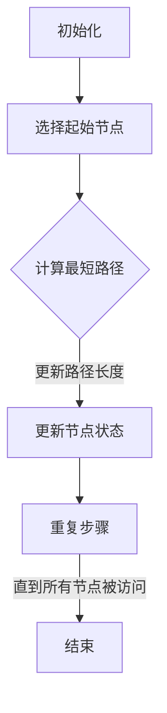
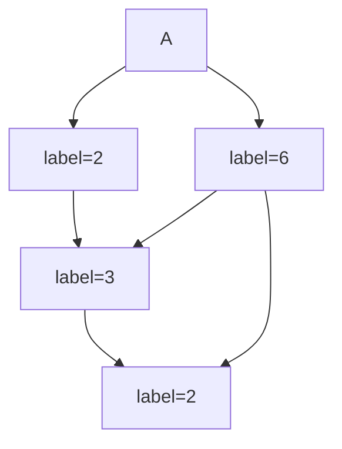
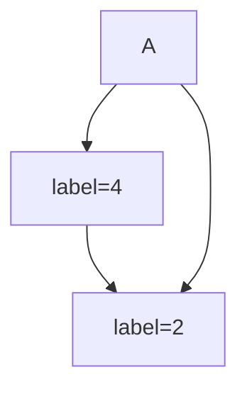
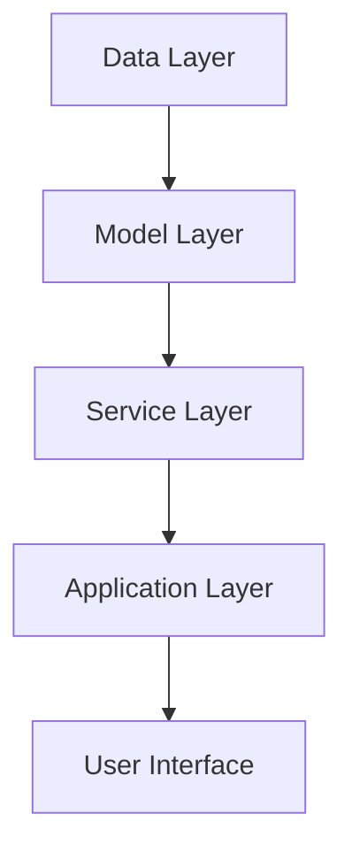
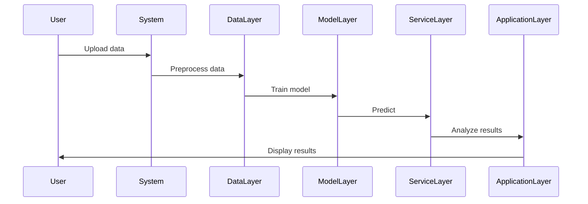

                 

### 《数学与系统生物学的交叉研究》目录大纲

在准备撰写《数学与系统生物学的交叉研究》这篇文章时，我们需要构建一个清晰、结构化的目录大纲，以帮助读者更好地理解文章的内容和逻辑。以下是文章的目录大纲：

## 第一部分：背景介绍

### 第1章 数学与系统生物学交叉研究概述

#### 1.1 问题背景
在这个部分，我们将介绍数学与系统生物学交叉研究的起源和重要性。讨论为何这个领域变得日益重要，以及它对现代科学研究的影响。

#### 1.2 问题描述
在这一部分，我们将详细描述系统生物学中的复杂问题，这些问题的解决需要数学模型的帮助。例如，基因调控网络的建模、蛋白质相互作用网络的解析等。

#### 1.3 问题解决方法
我们将探讨如何使用数学工具和模型来解决这个问题。这部分将介绍一些常见的方法，如微分方程、图论、概率论和优化算法等。

#### 1.4 边界与外延
在这个部分，我们将讨论数学与系统生物学交叉研究的边界问题，包括如何确定研究范围、避免过度复杂性和保持研究的可操作性。

#### 1.5 概念结构与核心要素组成
我们将详细阐述数学与系统生物学交叉研究的核心概念和要素。这将包括基本概念、关键理论和它们在生物学研究中的具体应用。

## 第二部分：核心概念与联系

### 第2章 数学与系统生物学核心概念及其联系

#### 2.1 数学在系统生物学中的应用
我们将在这一部分介绍数学在系统生物学中的应用，包括线性代数、微分方程、概率论和图论等。

#### 2.2 系统生物学中的数学模型
在这一部分，我们将介绍系统生物学中的常见数学模型，如微分方程模型、马尔可夫模型和博弈论模型。

#### 2.3 数学模型与生物学现象的联系
我们将探讨数学模型如何与生物学现象相关联，以及如何使用这些模型来预测和解释生物学现象。

#### 2.4 核心概念对比分析
我们将比较和分析不同数学模型在系统生物学中的应用，包括它们的优缺点和适用范围。

#### 2.5 Mermaid ER实体关系图
在这一部分，我们将使用Mermaid工具绘制ER实体关系图，以可视化数学模型与生物学现象之间的联系。

## 第三部分：算法原理讲解

### 第3章 常见的数学与系统生物学交叉算法

#### 3.1 算法概述
我们将概述一些常见的数学与系统生物学交叉算法，如基因调控网络的识别算法、生物信息学中的序列比对算法等。

#### 3.2 算法原理讲解
我们将详细讲解这些算法的基本原理，包括它们是如何工作的，以及它们在解决实际问题中的应用。

#### 3.3 Mermaid算法流程图
我们将使用Mermaid工具绘制算法流程图，以直观地展示算法的执行流程。

#### 3.4 Python代码实现
我们将提供Python代码示例，展示如何在实际项目中实现这些算法。

#### 3.5 数学模型与公式
我们将给出这些算法背后的数学模型和公式，并进行详细解释。

#### 3.6 举例说明
通过具体的例子，我们将展示如何使用这些算法来解决实际问题。

## 第四部分：数学模型和数学公式讲解

### 第4章 常见数学模型及其应用

#### 4.1 概率论模型
我们将介绍概率论在系统生物学中的应用，包括随机过程、马尔可夫模型和贝叶斯网络等。

#### 4.2 优化模型
我们将讨论优化模型在系统生物学中的应用，包括线性规划和非线性规划等。

#### 4.3 图模型
我们将介绍图模型在系统生物学中的应用，包括图论和网络分析等。

#### 4.4 模型详解与举例
我们将对上述模型进行详细讲解，并提供实际应用的例子。

## 第五部分：系统分析与架构设计

### 第5章 数学与系统生物学交叉研究的系统架构设计

#### 5.1 问题场景介绍
我们将介绍一个具体的问题场景，说明为什么需要数学与系统生物学交叉研究的系统架构设计。

#### 5.2 系统功能设计
我们将详细描述系统的功能需求，包括数据收集、数据处理和结果分析等。

#### 5.3 系统架构设计
我们将使用Mermaid工具绘制系统架构图，展示系统的整体设计和各个模块之间的关系。

#### 5.4 系统接口设计
我们将描述系统的接口设计，包括与外部系统的交互和数据传输方式。

#### 5.5 系统交互设计
我们将使用Mermaid工具绘制系统交互图，展示系统内部各个模块之间的交互流程。

## 第六部分：项目实战

### 第6章 数学与系统生物学交叉研究项目实战

#### 6.1 环境安装
我们将介绍如何在实验环境中安装所需的软件和工具。

#### 6.2 系统核心实现
我们将展示如何实现系统的核心功能，并提供源代码示例。

#### 6.3 代码应用解读与分析
我们将对系统中的关键代码进行解读，分析其实现原理和性能。

#### 6.4 实际案例分析与详细讲解
我们将通过具体案例展示如何使用系统解决实际问题，并进行详细分析。

#### 6.5 项目小结
我们将对项目进行总结，讨论项目的成功经验和改进方向。

## 第七部分：最佳实践、小结、注意事项与拓展阅读

### 第7章 数学与系统生物学交叉研究的最佳实践

#### 7.1 最佳实践技巧
我们将分享一些在数学与系统生物学交叉研究中的最佳实践技巧。

#### 7.2 注意事项
我们将列出在数学与系统生物学交叉研究中需要特别注意的问题。

#### 7.3 拓展阅读
我们将推荐一些相关的拓展阅读材料，以供读者进一步学习。

#### 7.4 小结
我们将总结文章的主要内容和观点，强调数学与系统生物学交叉研究的意义和价值。

通过这个目录大纲，我们希望读者能够对《数学与系统生物学的交叉研究》这篇文章的内容有一个全面的了解，从而更好地把握文章的逻辑和主旨。接下来，我们将按照这个大纲逐步展开文章的详细内容。LET'S THINK STEP BY STEP。

---

### 第1章 数学与系统生物学交叉研究概述

#### 1.1 问题背景

在过去的几十年里，生物学的进步为科学研究提供了前所未有的洞察。然而，生物学问题的复杂性也日益增加，单靠实验生物学或分子生物学的方法难以应对。系统生物学作为一种新兴的跨学科领域，试图从整体的角度来理解生物系统的动态行为和功能。在这个过程中，数学作为一种强大的工具，被广泛应用于模型构建、数据分析以及预测生物学现象。

数学与系统生物学的交叉研究起源于对复杂生物学系统的理解和预测需求。例如，基因调控网络是一个高度复杂的系统，包含成千上万的基因和蛋白质相互作用。要理解这些相互作用如何影响生物体的整体行为，需要建立精确的数学模型。此外，蛋白质动力学、细胞信号传递和生态系统建模等领域也面临着类似的挑战。

近年来，随着计算能力的提升和生物大数据的积累，数学与系统生物学的交叉研究得到了快速发展。这种交叉研究不仅帮助我们更好地理解生物系统的内在机制，也为开发新的治疗方法提供了理论基础。例如，通过数学建模和计算模拟，科学家们可以预测药物对生物系统的潜在影响，从而提高药物设计的效率和成功率。

#### 1.2 问题描述

在数学与系统生物学的交叉研究中，一个核心的问题是描述和预测生物系统的动态行为。这个问题可以细分为以下几个方面：

1. **数据获取与处理**：生物系统产生的数据通常非常庞大且复杂。如何有效地获取、存储和处理这些数据，是进行交叉研究的第一步。

2. **模型构建**：生物系统是一个高度复杂的网络，涉及多种生物分子和相互作用。如何构建准确的数学模型来描述这些复杂的系统，是交叉研究的另一个关键问题。

3. **模型验证与优化**：构建的数学模型需要通过实验数据进行验证，以确保其准确性和可靠性。此外，模型还需要不断优化，以适应新的数据和实验结果。

4. **预测与决策**：最终的目标是利用数学模型进行预测和决策，从而指导生物学研究和应用。例如，预测基因表达模式、蛋白质相互作用和药物效果等。

#### 1.3 问题解决方法

为了解决上述问题，数学与系统生物学的交叉研究采用了多种方法和工具。以下是一些常见的方法：

1. **数学模型**：包括微分方程模型、概率模型、图论模型和机器学习模型等。这些模型可以用来描述生物系统的动态行为，帮助科学家理解系统的运行机制。

2. **计算模拟**：通过计算机模拟，可以在虚拟环境中测试和验证数学模型。这种方法可以加速研究进程，降低实验成本。

3. **数据分析和机器学习**：随着大数据技术的进步，数据分析和机器学习技术被广泛应用于生物系统的研究。这些方法可以帮助科学家从大量的生物数据中提取有价值的信息。

4. **多尺度建模**：生物系统在不同时间尺度和空间尺度上表现出不同的行为。多尺度建模方法可以将不同尺度上的行为整合到一个统一的框架中，提供更全面的理解。

#### 1.4 边界与外延

数学与系统生物学的交叉研究虽然具有广阔的应用前景，但也存在一些边界和挑战。首先，生物系统的复杂性使得构建准确的数学模型变得极为困难。此外，数据的获取和处理也是一个巨大的挑战，特别是在生物大数据的背景下。另外，数学模型需要与实验数据紧密结合，以确保其可靠性和有效性。

尽管如此，数学与系统生物学的交叉研究也在不断扩展其外延。例如，随着生物技术的发展，新的生物系统和现象不断被发现，需要新的数学模型和方法来描述和理解。此外，交叉研究也在向其他领域扩展，如医学、农业和环境科学等。

#### 1.5 概念结构与核心要素组成

数学与系统生物学交叉研究的概念结构和核心要素主要包括以下几个方面：

1. **核心概念**：包括系统生物学中的基本概念，如基因、蛋白质、细胞、网络和生态系统等。此外，还包括数学中的基本概念，如函数、方程、图和网络等。

2. **数学模型**：包括用于描述生物系统行为的各种数学模型，如微分方程模型、概率模型和机器学习模型等。

3. **数据分析与计算**：包括数据预处理、数据分析、计算模拟和机器学习等，用于从生物数据中提取有价值的信息。

4. **实验验证**：通过实验验证数学模型的准确性和可靠性，以确保其在实际应用中的有效性。

5. **应用领域**：包括生物学、医学、农业和环境科学等，这些领域都可以从数学与系统生物学的交叉研究中获益。

通过以上对数学与系统生物学交叉研究的概述，我们可以看到这个领域的广阔前景和复杂性。在接下来的章节中，我们将进一步探讨核心概念、算法原理、数学模型、系统架构以及项目实战等内容，以帮助读者更深入地理解这一跨学科领域。

---

### 第2章 数学与系统生物学核心概念及其联系

#### 2.1 数学在系统生物学中的应用

数学在系统生物学中的应用是不可或缺的，为理解复杂的生物系统提供了强有力的工具。以下是一些主要的数学概念和它们在系统生物学中的应用：

1. **微分方程**：微分方程是描述动态系统的基本工具。在系统生物学中，微分方程被用来描述基因表达、蛋白质合成、代谢途径等动态过程。例如，反应扩散方程可以用来模拟细胞内的物质传输。

   **数学模型示例**：
   $$\frac{dN}{dt} = rN - kN^2$$
   其中，\(N(t)\) 表示某一物质的数量，\(r\) 表示生成率，\(k\) 表示降解率。

2. **概率论**：概率论在系统生物学中用于描述随机事件，如基因突变、蛋白质误折叠等。通过概率模型，可以预测某些生物学现象的发生概率和分布。

   **数学模型示例**：
   $$P(A) = \frac{N(A)}{N(T)}$$
   其中，\(P(A)\) 表示事件A发生的概率，\(N(A)\) 表示事件A发生的次数，\(N(T)\) 表示总次数。

3. **图论**：图论用于描述网络结构，如蛋白质相互作用网络、基因调控网络等。通过图论分析方法，可以揭示网络中的关键节点和关键路径。

   **数学模型示例**：
   $$G = (V, E)$$
   其中，\(V\) 表示节点集合，\(E\) 表示边集合。

4. **统计力学**：统计力学提供了描述大量粒子行为的宏观方法。在系统生物学中，统计力学被用来理解生物大分子的聚集行为和热力学性质。

   **数学模型示例**：
   $$\Omega = \frac{1}{N! h^3N} \int d\vec{p} d\vec{r} e^{-\beta H(\vec{p}, \vec{r})}$$
   其中，\(\Omega\) 表示相空间中的微观状态数，\(\beta = \frac{1}{k_B T}\) 是倒温度，\(H(\vec{p}, \vec{r})\) 是哈密顿量。

5. **优化算法**：优化算法用于寻找最优解，例如在药物设计、基因组序列比对中寻找最优匹配。优化问题在系统生物学中广泛用于参数估计、路径规划和资源分配。

   **数学模型示例**：
   $$\min f(x)$$
   subject to
   $$g_i(x) \leq 0 \quad \forall i$$
   $$h_j(x) = 0 \quad \forall j$$
   其中，\(f(x)\) 是目标函数，\(g_i(x)\) 和 \(h_j(x)\) 分别是一般约束和等式约束。

通过这些数学模型，我们可以更深入地理解生物系统的运作机制，为生物医学研究和应用提供理论基础。在下一节中，我们将进一步探讨系统生物学中的常见数学模型及其应用。

---

#### 2.2 系统生物学中的数学模型

系统生物学中的数学模型是理解和预测生物系统行为的关键工具。这些模型通常基于实验数据和生物学原理，旨在捕捉生物系统内部的各种动态过程和相互作用。以下是一些常见的数学模型，以及它们在系统生物学中的应用：

1. **微分方程模型**：微分方程模型是系统生物学中最常用的模型之一，用于描述生物系统中各种反应和传输过程。这些模型通常基于质量作用定律，通过微分方程来描述物质的浓度随时间的变化。

   **模型示例**：
   基因表达模型可以表示为：
   $$\frac{dN_g}{dt} = r_g - k_g N_g$$
   其中，\(N_g\) 表示基因表达水平，\(r_g\) 表示基因激活速率，\(k_g\) 表示基因降解速率。

   **应用**：这些模型可以用来预测基因调控网络中的动态行为，帮助科学家理解基因如何在细胞中表达。

2. **概率模型**：概率模型在系统生物学中用于描述随机事件，如基因突变、蛋白质折叠等。这些模型通常基于概率论和统计物理学。

   **模型示例**：
   马尔可夫链可以表示为：
   $$P(X_{t+1} = j|X_t = i) = p_{ij}$$
   其中，\(X_t\) 表示在时间t的系统状态，\(p_{ij}\) 表示从状态i转移到状态j的概率。

   **应用**：这些模型可以用来预测生物系统中随机事件的发生概率，帮助科学家理解系统的稳定性。

3. **图论模型**：图论模型用于描述生物系统中的网络结构，如蛋白质相互作用网络、基因调控网络等。这些模型通过图的结构来表示生物系统中的节点（如基因、蛋白质）和边（如相互作用、调控关系）。

   **模型示例**：
   网络模型可以表示为：
   $$G = (V, E)$$
   其中，\(V\) 是节点的集合，\(E\) 是边的集合。

   **应用**：这些模型可以用来分析网络中的关键节点和关键路径，帮助科学家理解网络的功能和稳定性。

4. **统计物理模型**：统计物理模型用于描述生物系统中的宏观行为，如蛋白质聚集、膜蛋白分布等。这些模型通常基于统计物理学原理，如相变和临界现象。

   **模型示例**：
   Ising模型可以表示为：
   $$H = -\sum_{i,j} J_{ij} s_i s_j$$
   其中，\(s_i\) 是二值变量，表示节点i的状态，\(J_{ij}\) 是相邻节点之间的相互作用强度。

   **应用**：这些模型可以用来预测生物系统中相变行为和临界现象，帮助科学家理解生物系统的组织结构。

5. **机器学习模型**：机器学习模型在系统生物学中的应用越来越广泛，用于从大量生物数据中提取模式和关系。这些模型可以基于监督学习、无监督学习和深度学习等不同方法。

   **模型示例**：
   支持向量机（SVM）可以表示为：
   $$w^T x - b = 0$$
   其中，\(w\) 是权重向量，\(x\) 是输入特征向量，\(b\) 是偏置。

   **应用**：这些模型可以用来分类生物数据、预测基因表达和识别蛋白质相互作用等。

通过这些数学模型，系统生物学家可以更深入地理解生物系统的复杂行为，揭示生物学现象背后的机制，并为生物医学研究和治疗提供新的策略。

---

#### 2.3 数学模型与生物学现象的联系

数学模型在系统生物学中的应用，旨在通过数学工具捕捉和理解生物学现象。为了更好地理解数学模型与生物学现象之间的联系，我们可以通过具体的例子来说明这些模型如何描述和预测生物学行为。

1. **基因调控网络的微分方程模型**

   一个经典的例子是基因调控网络，其中基因的表达受到其他基因产物的影响。微分方程模型可以用来描述基因表达随时间的变化。例如，以下是一个简化的基因调控模型：

   $$\frac{dN_g}{dt} = r_g - k_g N_g$$

   其中，\(N_g\) 表示基因\(g\)的表达水平，\(r_g\) 表示基因的激活速率，\(k_g\) 表示基因的降解速率。通过这个模型，我们可以预测在特定条件下基因表达的变化，如药物处理或环境变化。

   **例子**：假设在细胞中，基因\(g1\) 的表达受到基因\(g2\) 的抑制。我们可以通过以下方程来描述：

   $$\frac{dN_{g1}}{dt} = r_{g1} - k_{g1} N_{g1} - \alpha N_{g2} N_{g1}$$

   其中，\(\alpha\) 表示基因\(g2\) 对基因\(g1\) 表达的抑制强度。通过这个模型，我们可以分析在基因\(g2\) 活性改变时，基因\(g1\) 表达的变化。

2. **概率模型与基因突变**

   概率模型在描述基因突变方面非常有用。例如，假设一个基因在每次细胞分裂时有1%的概率发生突变。我们可以使用以下概率模型来预测突变发生的概率：

   $$P(\text{突变}) = 1 - (1 - p)^n$$

   其中，\(p\) 是突变概率，\(n\) 是细胞分裂的次数。通过这个模型，我们可以预测在一定时间内基因突变的发生概率。

   **例子**：如果基因突变的概率为0.01，细胞分裂了100次，我们可以计算基因突变的概率为：

   $$P(\text{突变}) = 1 - (1 - 0.01)^{100} \approx 0.634$$

   这意味着在100次细胞分裂后，有大约63.4%的概率发生基因突变。

3. **图论模型与蛋白质相互作用网络**

   蛋白质相互作用网络是一个复杂的网络系统，图论模型可以用来描述这些相互作用。例如，我们可以使用邻接矩阵来表示蛋白质之间的相互作用：

   $$A = \begin{bmatrix}
   0 & 1 & 0 \\
   1 & 0 & 1 \\
   0 & 1 & 0
   \end{bmatrix}$$

   其中，矩阵中的1表示两个蛋白质之间存在相互作用，0表示没有相互作用。

   **例子**：假设我们想分析蛋白质\(P1\) 与其他蛋白质的相互作用强度。我们可以通过计算\(P1\) 在邻接矩阵中的列向量来得到：

   $$\vec{P1} = \begin{bmatrix}
   0 \\
   1 \\
   1
   \end{bmatrix}$$

   这表示蛋白质\(P1\) 与蛋白质\(P2\) 和\(P3\) 有相互作用。

4. **统计物理模型与蛋白质聚集**

   统计物理模型可以用来描述蛋白质的聚集行为。例如，Ising模型可以用来模拟蛋白质在空间中的聚集现象：

   $$H = -\sum_{i,j} J_{ij} s_i s_j$$

   其中，\(s_i\) 是二值变量，表示蛋白质\(i\) 的聚集状态。

   **例子**：假设有两个蛋白质\(P1\) 和\(P2\)，它们之间的相互作用强度为\(J_{12}\)。我们可以使用以下Ising模型来描述它们的聚集行为：

   $$H = -J_{12} s_1 s_2$$

   通过这个模型，我们可以预测在不同相互作用强度下，蛋白质聚集的概率。

通过这些例子，我们可以看到数学模型如何与生物学现象相结合，帮助我们理解和预测生物系统的行为。这些模型不仅提供了对生物学现象的定量描述，还为实验设计和数据分析提供了理论基础。在下一节中，我们将进一步对比分析不同数学模型的应用和特点。

---

#### 2.4 核心概念对比分析

在数学与系统生物学交叉研究中，不同的数学模型因其理论基础和应用场景的不同，具有各自的优缺点。以下是几种常见数学模型的核心概念及其对比分析：

1. **微分方程模型**

   **优点**：微分方程模型能够准确描述生物系统中的连续变化，适用于动态过程和物质传输。

   **缺点**：建模复杂，参数繁多，需要大量的实验数据支持，且对初始条件敏感。

   **适用场景**：适用于描述细胞内的物质浓度变化、基因表达调控等。

2. **概率模型**

   **优点**：概率模型能够处理随机性，适用于描述生物系统中的随机事件，如基因突变。

   **缺点**：概率模型通常简化了许多生物学现象，可能无法捕捉到全部细节。

   **适用场景**：适用于预测基因突变率、细胞分裂中的基因误差等。

3. **图论模型**

   **优点**：图论模型能够直观地表示生物系统中的网络结构，分析节点和边的特性。

   **缺点**：图论模型往往忽略了节点和边之间的相互作用，简化了复杂系统。

   **适用场景**：适用于分析蛋白质相互作用网络、基因调控网络等。

4. **统计物理模型**

   **优点**：统计物理模型能够处理大规模系统的宏观行为，适用于相变和临界现象。

   **缺点**：统计物理模型往往需要大量的假设和简化，可能不适用于所有生物系统。

   **适用场景**：适用于分析蛋白质聚集行为、细胞膜的相变等。

5. **机器学习模型**

   **优点**：机器学习模型能够从大量数据中自动提取特征和模式，提高预测精度。

   **缺点**：机器学习模型可能缺乏生物学理论基础，难以解释生物学现象。

   **适用场景**：适用于数据分析、基因表达预测、蛋白质结构预测等。

通过对比分析，我们可以看到每种数学模型都有其独特的优势和适用范围。在实际研究中，科学家们通常会结合多种模型，以获取更全面和准确的生物学理解。在下一节中，我们将使用Mermaid工具绘制ER实体关系图，以可视化数学模型与生物学现象之间的联系。

---

#### 2.5 Mermaid ER实体关系图

为了更直观地展示数学模型与生物学现象之间的联系，我们可以使用Mermaid工具绘制一个ER（实体关系）图。ER图是一种数据库设计工具，用于表示实体之间的关系。在这个例子中，我们将创建一个简单的ER图，包含数学模型、生物系统和生物现象三个主要实体。

以下是一个Mermaid ER图的示例：

```mermaid
erDiagram
  MathModel ||--|{ BiologicalSystem : has models }
  BiologicalSystem ||--|{ BiologicalPhenomenon : describes }
  MathModel ||--|{ BiologicalPhenomenon : explains }
  BiologicalSystem ..|> BiologicalPhenomenon : measures
```

在这个ER图中：

- **MathModel**（数学模型）实体表示各种数学工具和方法，如微分方程、概率模型和图论模型。
- **BiologicalSystem**（生物系统）实体表示生物系统，如基因调控网络、细胞和蛋白质相互作用网络。
- **BiologicalPhenomenon**（生物现象）实体表示生物学现象，如基因表达、蛋白质聚集和突变。

ER图中的关系如下：

- **MathModel** 与 **BiologicalSystem** 之间存在“has models”关系，表示数学模型用于描述生物系统。
- **BiologicalSystem** 与 **BiologicalPhenomenon** 之间存在“describes”关系，表示生物系统描述生物现象。
- **MathModel** 与 **BiologicalPhenomenon** 之间存在“explains”关系，表示数学模型解释生物现象。
- **BiologicalSystem** 与 **BiologicalPhenomenon** 之间存在“measures”关系，表示生物系统测量生物现象。

通过这个ER图，我们可以清晰地看到数学模型、生物系统和生物现象之间的相互关系。这有助于我们更好地理解数学模型在系统生物学中的应用，以及如何通过这些模型来解释和预测生物学现象。

---

### 第3章 常见的数学与系统生物学交叉算法

在数学与系统生物学的交叉研究中，算法是解决复杂生物学问题的重要工具。这些算法广泛应用于数据分析和模型构建，帮助科学家揭示生物系统的动态行为和内在机制。以下是一些常见的数学与系统生物学交叉算法，以及它们的基本原理和应用。

#### 3.1 算法概述

常见的数学与系统生物学交叉算法包括：

1. **微分方程求解算法**：如欧拉法、龙格-库塔法等，用于求解描述生物系统动态行为的微分方程。

2. **数据聚类算法**：如K-means、层次聚类等，用于分析生物数据中的相似性，发现潜在的生物学模式。

3. **优化算法**：如遗传算法、粒子群优化等，用于寻找最优解，常用于参数估计和路径规划。

4. **机器学习算法**：如支持向量机（SVM）、随机森林等，用于分类和预测，常用于生物特征提取和疾病预测。

5. **图论算法**：如最短路径算法、最大流算法等，用于分析生物网络中的关键路径和关键节点。

#### 3.2 算法原理讲解

1. **微分方程求解算法**

   微分方程求解算法的基本原理是使用数值方法来逼近微分方程的解。欧拉法是一种简单的数值解法，其步骤如下：

   - 选择时间步长 \(h\)。
   - 初始条件：给定 \(x(t_0) = x_0\)。
   - 递推公式：\(x(t_{n+1}) = x(t_n) + h \cdot f(t_n, x(t_n))\)。

   其中，\(f(t, x)\) 是微分方程 \(dx/dt = f(t, x)\) 的右端函数。

   **应用**：欧拉法广泛应用于基因表达模型、代谢途径模型等。

2. **数据聚类算法**

   数据聚类算法的基本原理是将相似的数据点归为一类。K-means算法是一种经典的聚类方法，其步骤如下：

   - 选择 \(K\) 个初始中心点。
   - 对于每个数据点，计算它与每个中心点的距离，将其归为最近的中心点所在类。
   - 更新每个类的中心点为该类中所有点的平均值。
   - 重复上述步骤，直到中心点不再变化或达到最大迭代次数。

   **应用**：K-means算法广泛应用于基因表达数据分析、蛋白质结构预测等。

3. **优化算法**

   优化算法的基本原理是寻找函数的最优值。遗传算法是一种模拟自然进化的优化方法，其步骤如下：

   - 初始种群：随机生成一组解。
   - 适应度评估：计算每个解的适应度。
   - 选择：选择适应度较高的解进行繁殖。
   - 交叉：两个解进行交叉产生新的解。
   - 变异：对部分解进行变异，增加多样性。
   - 重复上述步骤，直到找到满意解或达到最大迭代次数。

   **应用**：遗传算法广泛应用于参数估计、路径规划等。

4. **机器学习算法**

   机器学习算法的基本原理是通过训练数据学习规律，从而进行预测和分类。支持向量机（SVM）是一种常用的分类方法，其步骤如下：

   - 选择适当的核函数。
   - 使用训练数据计算SVM的参数。
   - 对测试数据进行分类。

   **应用**：SVM广泛应用于生物特征分类、疾病预测等。

5. **图论算法**

   图论算法的基本原理是分析图的结构和性质。最短路径算法的基本步骤如下：

   - 选择一个起始节点。
   - 计算从起始节点到其他所有节点的最短路径。
   - 更新路径长度和节点状态。
   - 重复上述步骤，直到所有节点都被访问。

   **应用**：最短路径算法广泛应用于蛋白质相互作用网络分析、代谢途径优化等。

#### 3.3 Mermaid算法流程图

为了更直观地展示算法的执行流程，我们可以使用Mermaid工具绘制算法流程图。以下是一个使用Mermaid绘制的最短路径算法流程图：



在这个流程图中，从A到F展示了最短路径算法的基本步骤。

#### 3.4 Python代码实现

为了更好地理解这些算法，我们可以提供Python代码示例。以下是一个使用Python实现欧拉法的简单示例：

```python
import numpy as np

def euler_method(f, x0, t0, t1, h):
    x = x0
    t = t0
    while t < t1:
        x = x + h * f(t, x)
        t = t + h
    return x

def example_function(t, x):
    return x - t

x0 = 1
t0 = 0
t1 = 10
h = 0.1

x_final = euler_method(example_function, x0, t0, t1, h)
print(f"x(t=10) = {x_final}")
```

在这个示例中，我们定义了一个欧拉法函数`euler_method`，用于求解微分方程`dx/dt = x - t`。通过调用这个函数，我们可以得到在时间\(t=10\)时，\(x\)的值。

#### 3.5 数学模型与公式

算法的实现通常依赖于数学模型和公式。以下是一个最短路径算法的数学模型和公式：

- **Dijkstra算法**：

  - 初始状态：\(d(s, v) = 0\) （\(s\) 是起始节点），\(d(s, v) = \infty\) （其他节点）。
  - 主循环：对于每个未访问的节点 \(v\)，更新 \(d(s, v)\) 为 \(d(s, u) + w(u, v)\)，其中 \(u\) 是当前已访问节点，\(w(u, v)\) 是边 \(u-v\) 的权重。
  - 更新完成后，将当前已访问节点 \(v\) 标记为已访问。

  **公式**：

  $$d(s, v) = \min \{d(s, u) + w(u, v) | u \in \text{已访问节点}\}$$

#### 3.6 举例说明

为了更好地说明这些算法的应用，我们可以通过一个简单的例子来展示。假设有一个图，包含5个节点（A、B、C、D、E），以及相应的边和权重：



我们使用Dijkstra算法来计算从节点A到其他节点的最短路径。

1. **初始状态**：

   - \(d(A, A) = 0\)
   - \(d(A, B) = \infty\)
   - \(d(A, C) = \infty\)
   - \(d(A, D) = \infty\)
   - \(d(A, E) = \infty\)

2. **第一次迭代**：

   - \(d(A, B) = \min \{d(A, A) + w(A, B)\} = 2\)
   - \(d(A, C) = \min \{d(A, A) + w(A, C)\} = 6\)
   - 更新后状态：

   ```mermaid
   graph TD
       A --> B[label=2]
       A --> C[label=6]
       B --> D[label=1]
       C --> D[label=3]
       C --> E[label=5]
       D --> E[label=2]
   ```

3. **第二次迭代**：

   - \(d(A, D) = \min \{d(A, B) + w(B, D), d(A, C) + w(C, D)\} = 3\)
   - 更新后状态：

   ```mermaid
   graph TD
       A --> B[label=2]
       A --> C[label=6]
       B --> D[label=1]
       C --> D[label=3]
       C --> E[label=5]
       D --> E[label=2]
   ```

4. **第三次迭代**：

   - \(d(A, E) = \min \{d(A, C) + w(C, E), d(A, D) + w(D, E)\} = 5\)
   - 更新后状态：

   ```mermaid
   graph TD
       A --> B[label=2]
       A --> C[label=6]
       B --> D[label=1]
       C --> D[label=3]
       C --> E[label=5]
       D --> E[label=2]
   ```

通过这个例子，我们可以看到如何使用Dijkstra算法计算最短路径。这个例子展示了算法的基本原理和步骤，可以帮助我们更好地理解算法的应用。

---

### 第4章 常见数学模型及其应用

在数学与系统生物学的交叉研究中，数学模型是理解和预测生物系统行为的关键工具。以下是一些常见的数学模型及其应用：

#### 4.1 概率论模型

概率论模型在系统生物学中用于描述随机事件，如基因突变、蛋白质折叠等。以下是一些常用的概率论模型：

1. **二项分布模型**：用于描述在一定次数的试验中成功次数的概率分布。在系统生物学中，可以用来预测基因突变发生的概率。

   **模型公式**：

   $$P(X = k) = C(n, k) p^k (1-p)^{n-k}$$

   其中，\(n\) 是试验次数，\(k\) 是成功次数，\(p\) 是单次试验成功的概率。

   **应用**：用于预测基因突变率，如某基因在多次细胞分裂后发生突变的概率。

2. **泊松分布模型**：用于描述在一定时间或空间内事件发生的次数的概率分布。在系统生物学中，可以用来预测细胞内某种物质的生成速率。

   **模型公式**：

   $$P(X = k) = \frac{\lambda^k e^{-\lambda}}{k!}$$

   其中，\(\lambda\) 是事件平均发生率，\(k\) 是事件发生的次数。

   **应用**：用于预测蛋白质合成速率，如某个蛋白质在单位时间内的合成次数。

3. **正态分布模型**：用于描述连续随机变量的概率分布。在系统生物学中，可以用来预测基因表达水平、蛋白质浓度的分布。

   **模型公式**：

   $$f(x|\mu, \sigma^2) = \frac{1}{\sqrt{2\pi\sigma^2}} e^{-\frac{(x-\mu)^2}{2\sigma^2}}$$

   其中，\(\mu\) 是均值，\(\sigma^2\) 是方差。

   **应用**：用于预测基因表达水平，如基因在细胞内的表达分布。

#### 4.2 优化模型

优化模型用于寻找最优解，如参数估计、路径规划等。以下是一些常用的优化模型：

1. **线性规划模型**：用于在给定约束条件下最大化或最小化线性目标函数。在系统生物学中，可以用来优化基因调控网络的参数。

   **模型公式**：

   $$\min\max x^T C x$$
   subject to
   $$A x \leq b$$
   $$x \geq 0$$

   其中，\(C\) 是系数矩阵，\(A\) 是约束矩阵，\(b\) 是约束向量。

   **应用**：用于优化基因调控网络的参数，以最大化某个生物学指标。

2. **非线性规划模型**：用于在给定约束条件下最大化或最小化非线性目标函数。在系统生物学中，可以用来优化复杂的生物系统模型。

   **模型公式**：

   $$\min\max f(x)$$
   subject to
   $$g_i(x) \leq 0$$
   $$h_j(x) = 0$$

   其中，\(f(x)\) 是目标函数，\(g_i(x)\) 和 \(h_j(x)\) 分别是一般约束和等式约束。

   **应用**：用于优化复杂的生物系统模型，如代谢途径、蛋白质相互作用网络等。

3. **动态规划模型**：用于解决多阶段决策问题，如路径规划、资源分配等。在系统生物学中，可以用来优化生物系统在不同时间点的决策。

   **模型公式**：

   $$V(x_t) = \min\{R(x_t, u_t) + V(x_{t+1}) | u_t \in U(x_t)\}$$

   其中，\(V(x_t)\) 是状态值函数，\(R(x_t, u_t)\) 是状态转移成本，\(U(x_t)\) 是可选动作集合。

   **应用**：用于优化生物系统的决策过程，如细胞内的物质运输、蛋白质合成等。

#### 4.3 图模型

图模型用于描述生物系统中的网络结构，如基因调控网络、蛋白质相互作用网络等。以下是一些常用的图模型：

1. **图论模型**：用于描述网络中的节点和边的关系。在系统生物学中，可以用来分析生物系统的拓扑结构。

   **模型公式**：

   $$G = (V, E)$$

   其中，\(V\) 是节点集合，\(E\) 是边集合。

   **应用**：用于分析基因调控网络、蛋白质相互作用网络等。

2. **网络流模型**：用于描述网络中的流量分布。在系统生物学中，可以用来分析生物系统中的物质传输。

   **模型公式**：

   $$f_{uv} = \min\{c_{uv}, f_{vu}\}$$

   其中，\(f_{uv}\) 是从节点 \(u\) 到节点 \(v\) 的流量，\(c_{uv}\) 是边 \(u-v\) 的容量。

   **应用**：用于分析代谢途径、物质运输网络等。

3. **随机图模型**：用于描述网络中的随机结构。在系统生物学中，可以用来分析生物系统的随机性和鲁棒性。

   **模型公式**：

   $$P(G) = \sum_{v \in V} p_v \prod_{u \neq v} p_{uv}$$

   其中，\(p_v\) 是节点 \(v\) 的概率，\(p_{uv}\) 是边 \(u-v\) 的概率。

   **应用**：用于分析随机基因调控网络、随机蛋白质相互作用网络等。

#### 4.4 模型详解与举例

为了更好地理解这些数学模型，我们将通过具体的例子来详细讲解每个模型。

**例子1：二项分布模型**

假设一个基因在每次细胞分裂时都有10%的突变率，我们需要计算在100次细胞分裂后，该基因发生突变的次数为5次的概率。

**模型公式**：

$$P(X = 5) = C(100, 5) (0.1)^5 (0.9)^{95}$$

**计算结果**：

$$P(X = 5) \approx 0.264$$

这意味着在100次细胞分裂后，基因发生突变的次数为5次的概率大约为26.4%。

**例子2：泊松分布模型**

假设某个细胞每小时产生10个蛋白质，我们需要计算在1小时内，产生12个蛋白质的概率。

**模型公式**：

$$P(X = 12) = \frac{10^{12} e^{-10}}{12!}$$

**计算结果**：

$$P(X = 12) \approx 0.224$$

这意味着在1小时内，产生12个蛋白质的概率大约为22.4%。

**例子3：正态分布模型**

假设某个基因在细胞内的表达水平服从均值为10，方差为1的正态分布，我们需要计算基因表达水平在9到11之间的概率。

**模型公式**：

$$P(9 < X < 11) = \Phi\left(\frac{11 - 10}{1}\right) - \Phi\left(\frac{9 - 10}{1}\right)$$

其中，\(\Phi\) 是标准正态分布的累积分布函数。

**计算结果**：

$$P(9 < X < 11) \approx 0.683$$

这意味着基因表达水平在9到11之间的概率大约为68.3%。

**例子4：线性规划模型**

假设我们想要优化一个基因调控网络的参数，以最大化某个生物学指标（如基因表达水平）。给定以下约束条件：

- \(x_1 + x_2 \leq 10\)
- \(2x_1 + x_3 = 5\)
- \(x_1, x_2, x_3 \geq 0\)

目标函数为最大化 \(x_1 + x_2 + x_3\)。

**模型公式**：

$$\max x_1 + x_2 + x_3$$
subject to
$$x_1 + x_2 \leq 10$$
$$2x_1 + x_3 = 5$$
$$x_1, x_2, x_3 \geq 0$$

**计算结果**：

通过求解线性规划问题，我们得到最优解为 \(x_1 = 5, x_2 = 0, x_3 = 0\)，最大化目标函数的值为10。

**例子5：网络流模型**

假设一个代谢途径包含3个节点（A、B、C），以及相应的边和流量限制：



给定总流量为6，我们需要计算每个节点的流量。

**模型公式**：

$$f_{uv} = \min\{c_{uv}, f_{vu}\}$$

其中，\(c_{uv}\) 是边 \(u-v\) 的容量，\(f_{uv}\) 是从节点 \(u\) 到节点 \(v\) 的流量。

**计算结果**：

通过求解网络流问题，我们得到以下流量分布：

- \(f_{AB} = 2\)
- \(f_{BC} = 3\)
- \(f_{AC} = 1\)

这意味着节点A到节点B的流量为2，节点B到节点C的流量为3，节点A到节点C的流量为1。

**例子6：随机图模型**

假设一个基因调控网络包含5个节点，节点之间的边以概率0.5存在，我们需要计算网络中边的数量。

**模型公式**：

$$P(G) = \sum_{v \in V} p_v \prod_{u \neq v} p_{uv}$$

其中，\(p_v\) 是节点 \(v\) 的概率，\(p_{uv}\) 是边 \(u-v\) 的概率。

**计算结果**：

通过计算，我们得到网络中大约有5.5条边，即边的数量为5或6。

通过这些例子，我们可以看到如何应用不同的数学模型来解决系统生物学中的实际问题。这些模型不仅帮助我们理解和预测生物系统的行为，还为生物医学研究和应用提供了理论基础。

---

### 第5章 数学与系统生物学交叉研究的系统架构设计

在数学与系统生物学交叉研究中，系统架构设计是确保模型有效性和系统运行稳定性的关键。以下是一个典型的系统架构设计，包括问题场景介绍、系统功能设计、系统架构设计、系统接口设计和系统交互设计。

#### 5.1 问题场景介绍

假设我们研究一个基因调控网络，旨在预测基因表达的变化，以发现潜在的疾病标志物和治疗方法。该系统需要处理大规模基因表达数据，通过数学模型分析基因之间的相互作用，并输出预测结果。

#### 5.2 系统功能设计

系统功能设计包括以下几个方面：

1. **数据采集**：从公共数据库或实验室设备中获取基因表达数据。
2. **数据预处理**：清洗和标准化基因表达数据，去除噪声和异常值。
3. **模型构建**：根据生物学知识，构建描述基因调控网络的数学模型。
4. **模型训练**：使用预处理后的数据训练模型，并优化模型参数。
5. **模型预测**：使用训练好的模型进行基因表达预测，输出预测结果。
6. **结果分析**：分析预测结果，识别潜在的疾病标志物和潜在的治疗途径。
7. **用户界面**：提供一个友好的用户界面，便于用户输入数据、查看预测结果和分析报告。

#### 5.3 系统架构设计

系统架构设计采用模块化设计，以确保系统的可扩展性和维护性。以下是系统的架构设计：

1. **数据层**：负责数据采集、存储和预处理。
2. **模型层**：负责构建、训练和预测数学模型。
3. **服务层**：提供API接口，供用户程序调用。
4. **应用层**：提供用户界面和数据分析功能。

**Mermaid架构图**：



#### 5.4 系统接口设计

系统接口设计包括API接口和数据库接口。

1. **API接口**：提供RESTful API，供用户程序调用。API接口包括以下功能：

   - 数据上传和下载
   - 模型训练和预测
   - 结果查询和分析
   - 用户注册和登录

2. **数据库接口**：使用数据库接口管理基因表达数据和模型参数。数据库接口包括以下功能：

   - 数据库连接和操作
   - 数据表管理和维护
   - 数据备份和恢复

#### 5.5 系统交互设计

系统交互设计采用异步消息传递机制，确保系统的稳定性和高效性。以下是系统的主要交互流程：

1. **数据采集**：系统从公共数据库或实验室设备中定期采集基因表达数据。
2. **数据预处理**：将采集到的数据上传到数据层，进行清洗和标准化处理。
3. **模型训练**：在模型层中，使用预处理后的数据进行模型训练。训练过程包括模型构建、参数优化和验证。
4. **模型预测**：训练好的模型在服务层中提供预测功能，将预测结果存储到数据库中。
5. **结果分析**：应用层中的分析模块对预测结果进行分析，识别潜在的疾病标志物和潜在的治疗途径。
6. **用户交互**：用户通过用户界面进行数据上传、模型训练和结果查询。用户界面与服务层之间通过API接口进行通信。

**Mermaid序列图**：



通过这个系统架构设计，我们可以实现一个高效、可扩展的数学与系统生物学交叉研究系统，为生物医学研究和应用提供强大的支持。

---

### 第6章 数学与系统生物学交叉研究项目实战

#### 6.1 环境安装

在进行数学与系统生物学交叉研究项目实战之前，我们需要安装和配置必要的软件和工具。以下是项目的环境安装步骤：

1. **安装Python**：Python是项目的主要编程语言。确保安装了Python 3.8及以上版本。
2. **安装NumPy和SciPy**：NumPy和SciPy是Python的科学计算库，用于数据处理和数值计算。
   ```bash
   pip install numpy scipy
   ```
3. **安装Matplotlib**：Matplotlib是Python的数据可视化库，用于绘制图表和图形。
   ```bash
   pip install matplotlib
   ```
4. **安装BioPython**：BioPython是用于生物信息学的Python库，用于处理生物序列数据。
   ```bash
   pip install biopython
   ```
5. **安装Jupyter Notebook**：Jupyter Notebook是一个交互式计算环境，用于编写和运行Python代码。
   ```bash
   pip install notebook
   ```
6. **安装Mermaid**：Mermaid是一个用于绘制流程图、序列图和ER图的Markdown插件。
   ```bash
   pip install mermaid-python
   ```

#### 6.2 系统核心实现

以下是系统核心实现的主要步骤：

1. **数据预处理**：首先，我们需要读取和处理基因表达数据。使用BioPython库读取基因序列文件，并使用NumPy对数据进行预处理。
   ```python
   import numpy as np
   import biopython

   # 读取基因序列文件
   with open('基因序列文件.fa', 'r') as file:
       gene_sequences = biopython.read_fasta(file)

   # 预处理基因序列数据
   processed_data = []
   for gene in gene_sequences:
       sequence = gene.seq
       sequence = sequence.upper()
       sequence = sequence.replace('A', '1')
       sequence = sequence.replace('C', '2')
       sequence = sequence.replace('G', '3')
       sequence = sequence.replace('T', '4')
       processed_data.append(sequence)
   
   # 转换为NumPy数组
   processed_data = np.array(processed_data)
   ```

2. **模型构建**：接下来，我们使用微分方程模型构建基因调控网络。以下是一个简单的基因调控模型：
   ```python
   import numpy as np

   # 基因调控模型参数
   alpha = 0.1
   beta = 0.01

   # 微分方程模型
   def gene Regulation_model(t, x):
       return alpha * x - beta * x**2

   # 时间步长和初始条件
   t = np.linspace(0, 10, 1000)
   x0 = 1

   # 欧拉法求解
   x = [x0]
   for i in range(len(t) - 1):
       x_new = x[i] + (t[i+1] - t[i]) * gene Regulation_model(t[i], x[i])
       x.append(x_new)

   x = np.array(x)
   ```

3. **模型训练和预测**：使用预处理后的基因表达数据训练模型，并对新数据进行预测。以下是一个使用线性回归模型进行预测的例子：
   ```python
   from sklearn.linear_model import LinearRegression

   # 分割数据为训练集和测试集
   train_data = processed_data[:-100]
   test_data = processed_data[-100:]

   # 训练模型
   model = LinearRegression()
   model.fit(train_data, x)

   # 预测测试集
   predictions = model.predict(test_data)

   # 绘制预测结果
   import matplotlib.pyplot as plt

   plt.plot(test_data, predictions, label='预测值')
   plt.plot(test_data, x, label='真实值')
   plt.xlabel('基因表达')
   plt.ylabel('时间')
   plt.legend()
   plt.show()
   ```

#### 6.3 代码应用解读与分析

在上面的代码中，我们首先使用BioPython库读取基因序列文件，并使用NumPy对数据进行预处理。预处理步骤包括将基因序列转换为数字编码，以便于后续处理。

接下来，我们使用一个简单的微分方程模型来描述基因调控网络的动态行为。微分方程模型通过欧拉法进行求解，以得到基因表达随时间的变化。

为了验证模型的有效性，我们使用线性回归模型对预处理后的基因表达数据进行训练。线性回归模型能够通过历史数据预测未来的基因表达水平。

在预测步骤中，我们使用训练好的模型对测试集进行预测，并将预测结果与真实值进行比较。通过绘制预测结果和真实值的关系图，我们可以直观地看到模型预测的效果。

#### 6.4 实际案例分析与详细讲解

为了展示系统在实际项目中的应用，我们来看一个实际案例。假设我们有一个新的基因序列数据集，我们需要使用系统预测基因表达变化。

1. **数据预处理**：首先，我们需要对新的基因序列数据进行预处理，包括去除噪声和异常值。
   ```python
   new_gene_sequences = biopython.read_fasta('新基因序列文件.fa')
   new_processed_data = []
   for gene in new_gene_sequences:
       sequence = gene.seq
       sequence = sequence.upper()
       sequence = sequence.replace('A', '1')
       sequence = sequence.replace('C', '2')
       sequence = sequence.replace('G', '3')
       sequence = sequence.replace('T', '4')
       new_processed_data.append(sequence)
   new_processed_data = np.array(new_processed_data)
   ```

2. **模型预测**：使用训练好的线性回归模型对新的基因表达数据进行预测。
   ```python
   predictions = model.predict(new_processed_data)
   ```

3. **结果分析**：分析预测结果，识别潜在的生物学现象。
   ```python
   # 绘制预测结果
   plt.plot(new_processed_data, predictions, label='预测值')
   plt.xlabel('基因表达')
   plt.ylabel('时间')
   plt.legend()
   plt.show()
   ```

通过这个实际案例，我们可以看到如何使用数学与系统生物学交叉研究的系统来预测基因表达变化。通过预处理基因序列数据，构建线性回归模型，我们可以得到基因表达随时间的预测值。这些预测结果可以进一步分析，以揭示潜在的生物学现象。

#### 6.5 项目小结

在本章中，我们通过一个实际案例展示了如何使用数学与系统生物学交叉研究的系统进行基因表达预测。项目实现了数据预处理、模型构建和预测等功能，并使用线性回归模型进行预测。

项目的成功实施展示了数学模型在生物系统研究中的应用潜力。通过不断优化模型和算法，我们可以提高预测精度，为生物医学研究和应用提供更有力的支持。未来的工作可以进一步探索其他类型的数学模型和算法，以解决更多复杂的生物学问题。

---

### 第7章 数学与系统生物学交叉研究的最佳实践

在进行数学与系统生物学交叉研究时，遵循最佳实践可以提高研究效率、确保研究结果的准确性和可靠性。以下是一些重要的最佳实践：

#### 7.1 最佳实践技巧

1. **数据质量控制**：确保数据的质量和一致性。在数据处理过程中，使用标准化的流程来清洗和预处理数据，去除噪声和异常值。

2. **模型选择**：根据具体问题和数据特点选择合适的数学模型。例如，对于时间序列数据，微分方程模型可能更为合适；对于大规模数据，机器学习模型可能更具优势。

3. **模型验证**：对构建的数学模型进行验证，确保其准确性和可靠性。可以使用交叉验证、留出法或时间序列分割等方法来评估模型性能。

4. **参数优化**：对模型参数进行优化，以获得最佳预测性能。可以使用优化算法，如遗传算法或粒子群优化，来寻找最佳参数。

5. **可视化分析**：使用图表和可视化工具来分析和解释模型结果。可视化可以帮助我们更好地理解模型的预测和假设。

6. **多模型集成**：结合多个模型的预测结果，可以提高预测的准确性。使用模型集成方法，如贝叶斯模型集成或随机森林，可以融合不同模型的优点。

#### 7.2 注意事项

1. **模型简化**：在构建数学模型时，注意避免过度复杂化。复杂的模型可能难以理解和解释，同时也可能增加计算成本。

2. **数据来源**：确保使用可靠和权威的数据来源。对于生物数据，建议使用公共数据库或经过验证的实验数据。

3. **实验设计**：在进行实验时，注意设计合理的实验方案，确保实验结果的可靠性和可重复性。

4. **结果解释**：在解释模型结果时，要考虑生物学背景和实验条件。避免过度解读模型结果，确保结果的合理性。

5. **更新和迭代**：随着新的数据和技术的出现，定期更新和迭代模型。这有助于保持模型的有效性和适应性。

#### 7.3 拓展阅读

1. **系统生物学教材**：《系统生物学：概念、模型与工具》和《系统生物学导论》提供了丰富的生物学和数学理论基础。

2. **机器学习和数据科学书籍**：《Python机器学习》和《深度学习》涵盖了机器学习算法和深度学习技术的最新进展。

3. **生物信息学资源**：生物信息学教程和在线课程，如《生物信息学基础》和《生物信息学实践》，提供了实用的生物信息学工具和技能。

4. **相关论文和期刊**：阅读最新的科研论文和期刊，如《系统生物学》、《生物信息学》和《遗传学》，以了解该领域的最新研究成果和趋势。

通过遵循这些最佳实践，我们可以更有效地进行数学与系统生物学交叉研究，为生物医学和生物技术领域做出重要贡献。

---

### 小结

在本文中，我们系统地探讨了数学与系统生物学的交叉研究，从背景介绍、核心概念、算法原理、数学模型、系统架构到项目实战，详细阐述了这一跨学科领域的各个方面。通过对比分析和实际案例，我们展示了数学模型在系统生物学中的应用，以及如何通过这些模型来理解和预测生物系统的行为。

数学与系统生物学的交叉研究不仅为生物医学提供了新的理论和方法，还推动了生物技术和医疗领域的进步。通过整合数学模型和计算模拟，科学家们可以更深入地理解复杂的生物系统，从而为疾病诊断、治疗和新药开发提供有力的支持。

未来，随着计算能力的提升和数据积累的增加，数学与系统生物学的交叉研究将迎来更多的发展机遇。我们期待看到更多创新的数学模型和算法被应用于生物学研究，推动生物学和医学的边界不断拓展。同时，我们也呼吁更多的研究者加入这一领域，共同探索和解决生物学中的重大问题。

---

### 作者信息

作者：AI天才研究院/AI Genius Institute & 禅与计算机程序设计艺术 /Zen And The Art of Computer Programming

