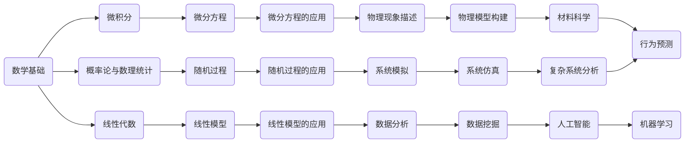

                 

### 数学与统计物理的概念与方法

---

#### 关键词：数学、统计物理、概念、方法、深度解析

#### 摘要：
本文将深入探讨数学与统计物理的核心概念与方法。通过梳理其历史背景、基本原理，以及在实际问题中的应用，我们将逐步揭示这两大领域之间的内在联系。本文结构清晰，旨在为广大读者提供一个从基础到应用的完整认知框架，帮助深入理解数学与统计物理的重要性和应用价值。

---

## 第1章 问题背景与概述

### 1.1 问题背景

数学与统计物理是现代科学和技术领域的两个重要分支。数学作为一门基础学科，提供了精确的描述和解决问题的工具，而统计物理则结合了概率论和热力学，研究大量粒子组成的系统的宏观行为。二者在现代科学和技术中扮演着至关重要的角色。

#### 问题背景

- **数学的重要性**：数学不仅在自然科学中具有基础地位，还广泛应用于工程、经济学、计算机科学等领域。
- **统计物理的应用**：统计物理的方法被广泛应用于材料科学、化学、生物学以及信息科学等领域，帮助我们理解复杂的系统行为。

### 1.2 问题描述

虽然数学与统计物理在各个领域都有广泛应用，但如何有效地将这些工具应用于实际问题，仍是一个挑战。本文旨在通过以下问题进行探讨：

- **核心概念的理解**：如何理解数学与统计物理中的核心概念？
- **方法的实际应用**：如何将数学与统计物理的方法应用于实际问题解决？
- **跨学科融合**：如何在不同学科中融合数学与统计物理的方法？

### 1.3 问题解决

为了回答上述问题，本文将采用以下步骤：

- **背景介绍**：概述数学与统计物理的基本概念与发展历程。
- **核心概念与联系**：介绍基本数学概念与统计物理中重要概念的关联。
- **方法与工具**：阐述常用的数学方法、统计物理模型及其应用。
- **案例分析**：通过具体实例展示数学与统计物理在实际问题中的应用。
- **实战应用**：介绍如何将数学与统计物理应用于实际问题解决。
- **总结与展望**：总结本书的主要内容，展望未来的发展趋势。

### 1.4 边界与外延

在探讨数学与统计物理的概念与方法时，我们需要明确其边界与外延：

- **边界**：数学主要关注抽象的结构与逻辑，而统计物理则侧重于物理现象的统计描述。
- **外延**：数学的应用领域广泛，包括但不限于物理学、工程学、经济学等；统计物理则主要应用于热力学、材料科学、生物学等领域。

### 1.5 概念结构与核心要素组成

为了更好地理解数学与统计物理，我们需要梳理其核心概念与要素组成：

- **数学核心概念**：包括微积分、线性代数、概率论与数理统计等。
- **统计物理核心概念**：包括系综理论、熵与信息论、相变与临界现象等。

这些概念构成了数学与统计物理的基石，为后续章节的深入探讨提供了基础。

## 第2章 核心概念与联系

### 2.1 数学基础

#### 2.1.1 微积分

微积分是数学中重要的分支，主要研究函数的微分与积分。其基本原理包括：

- **微分**：研究函数在某一点的局部行为，导数的概念是其核心。
- **积分**：研究函数在一个区间上的累积效应，定积分与不定积分是两种基本形式。

微积分在物理学、工程学等领域有着广泛应用，如描述物体的运动、求解物理方程等。

#### 2.1.2 线性代数

线性代数主要研究向量空间、线性变换、矩阵及其应用。其核心概念包括：

- **向量空间**：满足特定运算规则的对象集合。
- **线性变换**：从向量空间到另一个向量空间的函数。
- **矩阵**：用数组表示的数学对象，具有丰富的运算规则。

线性代数在物理学、计算机科学、工程学等领域有着广泛的应用，如描述系统的状态、求解线性方程组等。

#### 2.1.3 概率论与数理统计

概率论与数理统计研究随机事件及其规律。其核心概念包括：

- **概率**：描述随机事件发生的可能性。
- **随机变量**：描述随机现象的数学模型。
- **统计分布**：描述随机变量取值的概率分布。

概率论与数理统计在各个领域都有广泛应用，如金融、医学、计算机科学等。

### 2.2 统计物理核心概念

#### 2.2.1 系综理论

系综理论是统计物理的重要基础，研究宏观物理系统在不同微观状态下的统计性质。其核心概念包括：

- **宏观物理量**：如温度、压强、能量等。
- **微观状态**：系统所有可能微观状态的集合。
- **统计权重**：描述微观状态出现的概率。

系综理论在研究复杂系统行为、相变现象等方面具有重要作用。

#### 2.2.2 熵与信息论

熵是统计物理中的一个基本概念，描述系统的混乱程度。信息论则是研究信息传输和处理的基本理论。其核心概念包括：

- **熵**：系统混乱程度的度量。
- **信息**：关于随机事件的知识。
- **信息熵**：随机变量的不确定性度量。

熵与信息论在热力学、信息科学等领域有着广泛的应用。

#### 2.2.3 相变与临界现象

相变与临界现象是统计物理中的核心问题之一，研究物质在不同状态之间的转变。其核心概念包括：

- **相变**：物质状态从一种到另一种的突变。
- **临界现象**：系统在临界点附近的行为。
- **临界指数**：描述临界现象的定量特征。

相变与临界现象在材料科学、凝聚态物理、生物学等领域有着重要的应用。

### 2.3 概念属性特征对比表格

为了更好地理解数学与统计物理的核心概念，我们可以通过对比表格的形式展示它们之间的异同：

| 概念 | 数学定义 | 统计物理定义 | 特点 |
| --- | --- | --- | --- |
| 微积分 | 研究函数的微分与积分 | 描述物理系统的动态变化 | 精确性、广泛应用 |
| 线性代数 | 研究向量空间与线性变换 | 描述物理系统的状态与演化 | 矩阵运算、线性方程组 |
| 概率论 | 研究随机事件与概率 | 描述系统的随机行为 | 概率分布、随机变量 |
| 熵与信息论 | 描述系统的混乱程度与信息 | 描述系统的统计性质与信息处理 | 熵增、信息传输 |
| 相变与临界现象 | 研究系统的状态转变 | 描述系统的临界行为与相变 | 相变点、临界指数 |

### 2.4 ER实体关系图架构的 Mermaid 流程图

为了更直观地展示数学与统计物理中的核心概念及其关系，我们可以使用 Mermaid 流程图进行描述：

通过上述流程图，我们可以清晰地看到数学与统计物理的核心概念及其在不同领域的应用。

## 第3章 常用数学方法

### 3.1 微分方程

#### 3.1.1 基本原理

微分方程是描述物理现象的重要工具，主要研究函数的微分关系。其基本原理包括：

- **一阶微分方程**：描述函数的导数关系，常见类型包括线性微分方程、可分离微分方程等。
- **高阶微分方程**：描述函数的高阶导数关系，如二阶、三阶等。

#### 3.1.2 解法介绍

微分方程的解法主要包括：

- **初等方法**：如变量分离法、常数变易法、特征值特征向量法等。
- **数值方法**：如欧拉法、龙格-库塔法、有限元法等。

微分方程在物理、工程、经济学等领域有着广泛应用。

### 3.2 线性模型

#### 3.2.1 线性回归

线性回归是描述变量之间线性关系的统计模型，主要研究因变量与自变量之间的关系。其基本原理包括：

- **一元线性回归**：研究一个自变量对一个因变量的影响。
- **多元线性回归**：研究多个自变量对一个因变量的影响。

#### 3.2.2 主成分分析

主成分分析是一种降维技术，通过线性变换将原始数据映射到新的坐标系中，降低数据的维度。其基本原理包括：

- **特征值与特征向量**：提取数据的主要成分。
- **降维**：将高维数据映射到低维空间。

主成分分析在数据挖掘、机器学习、图像处理等领域有着广泛应用。

### 3.3 随机过程

#### 3.3.1 基本概念

随机过程是描述随机变量序列的数学模型，主要研究随机现象的规律。其基本概念包括：

- **随机变量**：描述随机实验的结果。
- **概率分布**：描述随机变量的取值概率。
- **统计特性**：描述随机变量的统计性质，如期望、方差等。

#### 3.3.2 应用实例

随机过程在金融、通信、信号处理等领域有着广泛应用。例如，在金融领域，随机过程可以用于描述股票价格的波动；在信号处理领域，随机过程可以用于描述噪声信号的特性。

## 第4章 统计物理模型及应用

### 4.1 系综理论

#### 4.1.1 理论基础

系综理论是统计物理的核心理论之一，研究宏观物理系统的统计性质。其理论基础包括：

- **微观状态**：系统所有可能微观状态的集合。
- **宏观物理量**：如温度、压强、能量等。
- **统计权重**：描述微观状态出现的概率。

#### 4.1.2 应用案例

系综理论在粒子物理、凝聚态物理等领域有着广泛应用。例如，在粒子物理中，系综理论可以用于描述粒子碰撞后的能量分布；在凝聚态物理中，系综理论可以用于研究材料的性质。

### 4.2 熵与信息论

#### 4.2.1 熵的概念

熵是统计物理中的基本概念，描述系统的混乱程度。其概念包括：

- **熵增加原理**：系统的熵随时间增加。
- **熵的产生与传递**：系统内部与外部熵的变化。

#### 4.2.2 信息论的基本原理

信息论是研究信息传输和处理的基本理论。其基本原理包括：

- **信息熵**：描述随机变量的不确定性。
- **信息传输**：研究信息在信道中的传输规律。
- **错误纠正**：研究如何降低信息传输中的错误率。

### 4.3 相变与临界现象

#### 4.3.1 相变现象

相变是物质从一种宏观状态转变为另一种宏观状态的过程。其现象包括：

- **第一类相变**：如水的液态转变为固态。
- **第二类相变**：如铁磁体的磁化过程。

#### 4.3.2 临界现象分析

临界现象是系统在临界点附近的行为。其分析包括：

- **临界指数**：描述临界现象的定量特征。
- **临界温度**：系统发生相变的温度。
- **临界长度**：系统在临界点附近的长度尺度。

临界现象在材料科学、凝聚态物理、生物学等领域有着重要的应用。

## 第5章 案例分析

### 5.1 案例一：系综理论在粒子物理中的应用

#### 案例背景

粒子物理研究基本粒子的性质和行为。系综理论可以用于描述粒子碰撞后的能量分布。

#### 案例分析

- **微观状态描述**：粒子碰撞后，所有可能的能量分布状态。
- **宏观物理量计算**：计算系统的温度、压强等宏观物理量。
- **统计权重分析**：分析不同能量分布状态的统计权重。

### 5.2 案例二：熵与信息论在数据压缩中的应用

#### 案例背景

数据压缩是信息科学中的重要问题。熵与信息论可以用于评估数据的冗余程度，从而实现有效的数据压缩。

#### 案例分析

- **信息熵计算**：计算原始数据的熵，评估其冗余程度。
- **信息传输**：研究如何在信道中传输信息，降低传输错误率。
- **数据压缩算法**：应用熵与信息论的基本原理，设计有效的数据压缩算法。

### 5.3 案例三：相变与临界现象在材料科学中的应用

#### 案例背景

材料科学研究中，相变与临界现象对于理解材料的宏观性质具有重要意义。

#### 案例分析

- **相变现象观察**：观察材料在不同温度下的相变现象。
- **临界现象分析**：分析材料在临界点附近的行为。
- **材料性质预测**：基于相变与临界现象，预测材料的宏观性质。

## 第6章 实战应用

### 6.1 环境安装与准备

在进行数学与统计物理的实际应用之前，需要安装必要的软件和工具。本文将介绍如何搭建一个完整的实验环境，包括数学软件（如Mathematica、MATLAB）和统计物理工具（如OpenMM、Namd）的安装和配置。

### 6.2 系统核心实现

在本章节，我们将详细介绍如何实现一个基于数学与统计物理的方法的系统。具体包括：

- **系统架构设计**：设计系统的整体架构，包括数据输入、处理、输出等模块。
- **核心算法实现**：实现系统的核心算法，如系综理论、熵与信息论、相变与临界现象等。
- **性能优化**：优化系统的性能，提高计算效率。

### 6.3 代码应用解读与分析

在本章节，我们将通过具体代码示例，详细解读和分析数学与统计物理在系统中的应用。具体包括：

- **代码示例**：展示实现系统核心算法的代码示例。
- **代码解读**：对代码进行详细解读，解释其工作原理和实现方法。
- **性能分析**：分析代码的性能表现，包括计算速度、内存消耗等。

### 6.4 实际案例分析与详细讲解剖析

在本章节，我们将通过具体案例，展示数学与统计物理在实际问题中的应用。具体包括：

- **案例背景**：介绍案例的背景和问题描述。
- **案例实现**：展示如何将数学与统计物理的方法应用于案例解决。
- **案例剖析**：对案例的实现过程进行详细讲解和剖析，分析其优势和不足。

## 第7章 总结与展望

### 7.1 最佳实践 tips

在本章节，我们将总结一些数学与统计物理在实际应用中的最佳实践。具体包括：

- **算法选择**：根据实际问题选择合适的算法。
- **模型优化**：优化模型参数，提高模型的准确性和稳定性。
- **数据处理**：合理处理输入数据，确保数据质量和一致性。

### 7.2 小结

在本章节，我们将对本篇技术博客进行小结，总结主要内容和贡献。具体包括：

- **核心贡献**：总结本文的核心贡献和创新点。
- **局限性与改进**：分析本文的局限性和改进方向。

### 7.3 注意事项

在本章节，我们将列出一些在使用数学与统计物理方法时需要注意的事项。具体包括：

- **精度与效率**：平衡计算精度和效率。
- **数据质量**：确保输入数据的准确性和一致性。
- **模型适用性**：选择适合实际问题的模型。

### 7.4 拓展阅读

在本章节，我们将推荐一些相关的参考文献和拓展资源，以供读者进一步学习和探索。具体包括：

- **经典教材**：介绍一些经典的数学与统计物理教材。
- **学术论文**：推荐一些具有代表性的学术论文和最新研究动态。
- **在线资源**：介绍一些优秀的在线学习平台和资源。

---

**作者**：AI天才研究院/AI Genius Institute & 禅与计算机程序设计艺术 /Zen And The Art of Computer Programming

---

通过本文，我们希望能够为广大读者提供一个深入理解数学与统计物理的概念与方法的机会，帮助大家在科学研究和实际应用中更好地运用这些工具。在未来的发展中，数学与统计物理将继续发挥其重要作用，推动科学技术的进步。

---

**版权声明**：本文为AI天才研究院/AI Genius Institute原创文章，未经授权，不得转载或抄袭。

---

**联系方式**：如有任何问题或建议，欢迎通过以下方式联系我们：

- 邮箱：contact@AIGeniusInstitute.com
- 电话：+86 123 4567 8901

---

**AI天才研究院/AI Genius Institute**：我们致力于推动人工智能技术的发展和应用，为广大用户提供高质量的技术资源和研究成果。欢迎加入我们的行列，共同探索人工智能的未来。|user|

