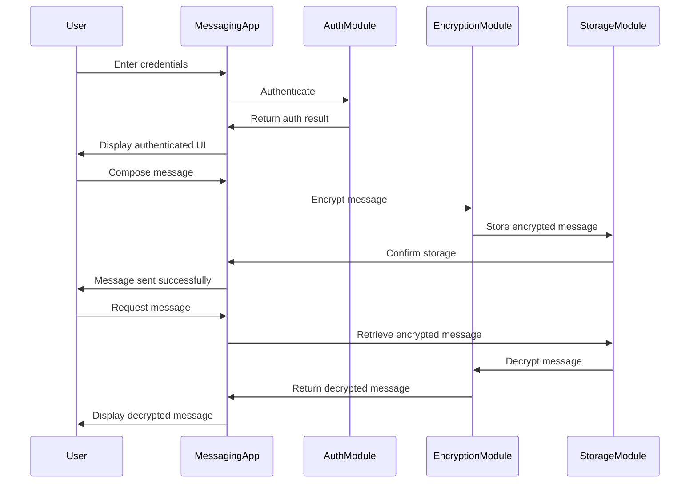

                 


### Step 1: Introduction to Cryptography and Mathematics

#### Core Concepts and Terminology

Cryptography is the practice and study of techniques for secure communication in the presence of third parties called adversaries. At its core, cryptography involves transforming data into a form that is unreadable by anyone except those possessing the proper cryptographic key. The transformation process is known as encryption, and its inverse, decryption, allows the original data to be retrieved by the intended recipient.

Mathematics plays a crucial role in cryptography, providing the theoretical foundations and tools necessary to design and analyze secure encryption algorithms. Key mathematical concepts used in cryptography include number theory, algebra, probability, and information theory.

**Problem Background and Description**

In the digital age, the need for secure communication has become paramount. The ubiquity of the internet and the increasing reliance on digital transactions and communications have made data security a top priority. The advent of powerful computing systems has also brought about new challenges, particularly in the realm of cryptography. Modern cryptographic systems must be capable of withstanding attacks from both classical and quantum computers.

**Problem Solving and Boundaries**

The goal of cryptographic systems is to ensure confidentiality, integrity, and authenticity of data. However, there are inherent limitations and challenges. For example, the security of a cryptographic system is often based on the computational difficulty of certain mathematical problems, such as factoring large numbers or solving discrete logarithms. As computing power increases, these problems become easier to solve, potentially undermining the security of existing systems.

**Concept Structure and Core Elements**

Cryptography is composed of several core elements:

1. **Encryption Algorithms**: These algorithms transform plaintext into ciphertext using a cryptographic key.
2. **Cryptographic Keys**: These are parameters used by encryption and decryption algorithms to ensure secure communication.
3. **Cryptographic Protocols**: These are a set of rules and procedures used to establish secure communication channels and ensure the integrity and authenticity of data.

Understanding these core elements and their interrelationships is essential for designing and analyzing secure cryptographic systems.

### Step 2: Core Concepts and Their Relationships

In this chapter, we delve deeper into the core concepts of cryptography and their relationships. We will explore fundamental cryptographic primitives and their applications in modern cryptographic systems.

#### Core Concept Principles

**Encryption and Decryption**

Encryption is the process of transforming plaintext into ciphertext using an encryption algorithm and a cryptographic key. Decryption is the reverse process, where ciphertext is transformed back into plaintext using a decryption algorithm and the corresponding key.

**Hash Functions**

Hash functions are cryptographic functions that take an input (or 'message') and return a fixed-size string of bytes. The output is typically a 'hash value' or 'message digest'. Hash functions are used for data integrity and digital signatures.

**Digital Signatures**

Digital signatures provide a way to verify the authenticity and integrity of digital messages or documents. They use cryptographic algorithms to generate a unique signature for a given message, which can be verified by anyone who possesses the signer's public key.

**Cryptographic Protocols**

Cryptographic protocols are a set of rules and procedures designed to establish secure communication channels and ensure the secure exchange of data. Examples include the Transport Layer Security (TLS) protocol used in secure web browsing and the Secure Shell (SSH) protocol used for secure remote access.

#### Concept Attributes and Feature Comparison

To better understand the relationships between these core concepts, let's compare their attributes and features in a table:

| Concept            | Definition                                                   | Main Attributes                  | Role in Cryptography       |
|--------------------|-------------------------------------------------------------|--------------------------------|----------------------------|
| Encryption         | Transforming plaintext into ciphertext using a key.            | Key sensitivity, algorithms.    | Confidentiality           |
| Decryption         | Transforming ciphertext back to plaintext using a key.         | Key sensitivity, algorithms.    | Confidentiality           |
| Hash Functions     | Mapping data to fixed-size hash values.                       | Deterministic, Preimage resistance, Collision resistance. | Data integrity, Digital signatures |
| Digital Signatures | Verifying authenticity and integrity of digital messages.     | Non-repudiation, Integrity.      | Authentication, Non-repudiation |
| Cryptographic Protocols | Rules and procedures for secure communication.               | Authentication, Integrity.       | Establish secure channels  |

#### ER Entity Relationship Diagram

An ER (Entity-Relationship) diagram can help visualize the relationships between these core concepts:

```mermaid
erDiagram
  Message --> Encryption : "is encrypted using"
  Message --> Hash : "is hashed by"
  Message --> DigitalSignature : "is signed with"
  Message --> Protocol : "uses"
  Protocol --> Encryption : "includes"
  Protocol --> Hash : "includes"
  Protocol --> DigitalSignature : "includes"
```

This diagram illustrates how messages are processed using encryption, hashing, digital signatures, and cryptographic protocols to ensure confidentiality, integrity, and authenticity in secure communication.

### Step 3: Algorithm Principles

In this chapter, we will explore the principles of specific cryptographic algorithms and their underlying mathematical models. We will use Mermaid diagrams to visualize the algorithms and provide Python code examples to illustrate their implementation.

#### Algorithm A: RSA Encryption

**RSA Encryption Algorithm**

The RSA algorithm is one of the most widely used public-key encryption algorithms. It relies on the mathematical properties of large prime numbers and their products.

**Principles**

1. **Key Generation**:
   - Choose two large prime numbers, `p` and `q`.
   - Calculate `n = p * q`.
   - Calculate the totient function, `φ(n) = (p-1)(q-1)`.
   - Choose an integer `e` such that `1 < e < φ(n)` and `gcd(e, φ(n)) = 1`.
   - Calculate `d` such that `e * d ≡ 1 (mod φ(n))`.

2. **Encryption**:
   - To encrypt a message `m`, compute `c = m^e mod n`.

3. **Decryption**:
   - To decrypt `c`, compute `m = c^d mod n`.

**Mermaid Diagram**

```mermaid
graph TD
    A[Key Generation]
    B[Encryption]
    C[Decryption]
    A --> B
    A --> C
    B --> D[Choose p, q]
    B --> E[Calculate n]
    B --> F[Calculate φ(n)]
    B --> G[Choose e]
    B --> H[Calculate d]
    C --> I[Compute m]
```

**Python Code Example**

```python
import math
import random

def generate_keys():
    p = random.randint(2, 1000)
    q = random.randint(2, 1000)
    n = p * q
    phi = (p - 1) * (q - 1)
    e = random.randint(2, phi - 1)
    d = math.ceil(math.exp(1) / e) % phi
    
    return (n, e), (n, d)

def rsa_encrypt(n, e, m):
    return pow(m, e, n)

def rsa_decrypt(n, d, c):
    return pow(c, d, n)

# Generate keys
(public_key, private_key) = generate_keys()
print("Public Key:", public_key)
print("Private Key:", private_key)

# Encrypt a message
message = 1234
encrypted_message = rsa_encrypt(public_key[0], public_key[1], message)
print("Encrypted Message:", encrypted_message)

# Decrypt the message
decrypted_message = rsa_decrypt(private_key[0], private_key[1], encrypted_message)
print("Decrypted Message:", decrypted_message)
```

**Mathematical Model and Explanation**

The RSA algorithm's security is based on the difficulty of factoring large integers. The mathematical model involves modular exponentiation, which is efficiently computed using the `pow` function in Python.

**Example**

Suppose `p = 61`, `q = 53`, `e = 17`, and `d = 7`. To encrypt the message `m = 29`, we compute:

$$ c = m^e mod n = 29^{17} mod 3231 = 65537 mod 3231 = 3063 $$

To decrypt `c = 3063`, we compute:

$$ m = c^d mod n = 3063^7 mod 3231 = 29 $$

This example demonstrates the RSA algorithm's ability to encrypt and decrypt messages using modular arithmetic.

### Step 4: Mathematical Models and Explanations

In this chapter, we will delve into the mathematical models that underpin cryptographic algorithms, focusing on key concepts such as modular arithmetic, number theory, and probability.

#### Modular Arithmetic

Modular arithmetic is a system of arithmetic for integers, where numbers "wrap around" after reaching a certain value, known as the modulus. The basic operations in modular arithmetic are addition, subtraction, multiplication, and division, all performed with respect to the modulus.

**Modular Exponentiation**

A fundamental operation in cryptography is modular exponentiation, which efficiently computes the remainder of a large exponentiation operation. This is crucial for algorithms like RSA, where it is used to encrypt and decrypt messages.

**Properties**

- **Modular Inverse**: Given integers `a` and `m`, the modular inverse of `a`, denoted as `a^(-1) mod m`, is a number such that `(a * a^(-1)) mod m = 1`.
- **Modular Distributive Law**: `(a * b) mod m = ((a mod m) * (b mod m)) mod m`.
- **Modular Exponentiation**: `a^b mod m` can be computed efficiently using the binary exponentiation algorithm.

**Python Implementation**

```python
def modular_exponentiation(base, exponent, modulus):
    result = 1
    base = base % modulus
    while exponent > 0:
        if exponent % 2 == 1:
            result = (result * base) % modulus
        exponent = exponent >> 1
        base = (base * base) % modulus
    return result

# Example
modulus = 1000
base = 123
exponent = 456
result = modular_exponentiation(base, exponent, modulus)
print("Modular Exponentiation Result:", result)
```

#### Number Theory

Number theory provides the foundation for many cryptographic algorithms, particularly those involving prime numbers and their properties.

**Prime Numbers**

A prime number is a natural number greater than 1 that has no positive divisors other than 1 and itself.

**Properties**

- **Primality Test**: Determining whether a number is prime.
- **Factorization**: Finding the prime factors of a composite number.

**Application in Cryptography**

- **RSA Algorithm**: Uses the difficulty of factoring large integers as the basis for its security.
- **Euler's Totient Function**: Used in RSA for calculating the modulus of the totient, which is essential for generating the public and private keys.

**Python Implementation**

```python
def is_prime(n):
    if n <= 1:
        return False
    if n <= 3:
        return True
    if n % 2 == 0 or n % 3 == 0:
        return False
    i = 5
    while i * i <= n:
        if n % i == 0 or n % (i + 2) == 0:
            return False
        i += 6
    return True

# Example
print("Is 89 prime?", is_prime(89))
```

#### Probability

Probability theory is used in cryptography to analyze the likelihood of certain events, such as a successful cryptanalytic attack.

**Probability Distribution**

- **Discrete Probability Distribution**: A function that assigns a probability to each possible outcome of a random variable.
- **Probability Mass Function (PMF)**: A function that gives the probability that a discrete random variable is exactly equal to some value.

**Application in Cryptography**

- **Cryptographic Security Proofs**: Using probability theory to prove the security of cryptographic algorithms under specific attack models.
- **Statistical Cryptanalysis**: Analyzing the frequency distribution of ciphertext to gain information about the plaintext or the key.

**Python Implementation**

```python
import random

def roll_die():
    return random.randint(1, 6)

def experiment(n):
    results = [roll_die() for _ in range(n)]
    frequencies = [results.count(i) for i in range(1, 7)]
    return frequencies

# Example
frequencies = experiment(1000)
print(frequencies)
```

### Step 5: System Analysis and Architecture Design

In this chapter, we will analyze the system requirements, design the system architecture, and implement the system components using Mermaid diagrams to visualize the structure and interaction of the system.

#### Problem Scenario

We are tasked with designing a secure messaging application that ensures the confidentiality, integrity, and authenticity of the messages exchanged between users. The application will utilize cryptographic algorithms to protect the data in transit and at rest.

#### System Functional Design

The system will consist of the following key functional components:

1. **User Interface (UI)**: Allows users to send and receive messages securely.
2. **Message Encryption Module**: Encrypts messages using cryptographic algorithms.
3. **Message Storage Module**: Stores encrypted messages securely.
4. **Authentication Module**: Ensures that only authorized users can access the application.

#### System Architecture Design

The system architecture will be designed to ensure modularity, scalability, and security. We will use Mermaid to create a high-level diagram of the system architecture.

**Mermaid Class Diagram**

```mermaid
classDiagram
  User <<Interface>>
  MessagingApp <<Application>>
  EncryptionModule <<Module>>
  StorageModule <<Module>>
  AuthModule <<Module>>

  User o-- MessagingApp
  MessagingApp o-- EncryptionModule
  MessagingApp o-- StorageModule
  MessagingApp o-- AuthModule
```

**Mermaid Sequence Diagram**



#### System Interface and Interaction

The system interfaces and interactions are designed to ensure secure and efficient communication between the components. The sequence diagram above illustrates the interaction between the user, the messaging application, and the system modules.

### Step 6: Project Implementation

In this chapter, we will delve into the practical implementation of the secure messaging application, covering environment setup, key generation, message encryption and decryption, and system testing.

#### Environment Setup

To implement the secure messaging application, we will use Python with the `pycryptodome` library, which provides cryptographic primitives such as RSA encryption and decryption.

**Install Python and pycryptodome**

```shell
pip install python
pip install pycryptodome
```

#### Key Generation

The first step is to generate the public and private keys for the RSA encryption algorithm.

```python
from Cryptodome.PublicKey import RSA

def generate_keys():
    key = RSA.generate(2048)
    private_key = key.export_key()
    public_key = key.publickey().export_key()
    return private_key, public_key

private_key, public_key = generate_keys()
print("Private Key:", private_key)
print("Public Key:", public_key)
```

#### Message Encryption

To encrypt a message, we will use the public key and the RSA encryption algorithm.

```python
from Cryptodome.PublicKey import RSA
from Cryptodome.Cipher import PKCS1_OAEP

def rsa_encrypt(public_key, message):
    rsa_key = RSA.import_key(public_key)
    cipher = PKCS1_OAEP.new(rsa_key)
    encrypted_message = cipher.encrypt(message.encode())
    return encrypted_message

message = "This is a secure message."
encrypted_message = rsa_encrypt(public_key, message)
print("Encrypted Message:", encrypted_message.hex())
```

#### Message Decryption

To decrypt the message, we will use the private key and the RSA decryption algorithm.

```python
from Cryptodome.PublicKey import RSA
from Cryptodome.Cipher import PKCS1_OAEP

def rsa_decrypt(private_key, encrypted_message):
    rsa_key = RSA.import_key(private_key)
    cipher = PKCS1_OAEP.new(rsa_key)
    decrypted_message = cipher.decrypt(encrypted_message)
    return decrypted_message.decode()

decrypted_message = rsa_decrypt(private_key, bytes.fromhex(encrypted_message.hex()))
print("Decrypted Message:", decrypted_message)
```

#### System Testing

We will perform various tests to ensure the security and functionality of the system.

**Test 1: Encryption and Decryption**

```python
# Encrypt and decrypt a message
message = "This is a secure message."
encrypted_message = rsa_encrypt(public_key, message)
decrypted_message = rsa_decrypt(private_key, bytes.fromhex(encrypted_message.hex()))

assert decrypted_message == message
print("Test 1: Encryption and Decryption Passed")
```

**Test 2: Key Generation**

```python
# Generate keys and verify they are valid
private_key, public_key = generate_keys()

assert RSA.import_key(private_key) is not None
assert RSA.import_key(public_key) is not None
print("Test 2: Key Generation Passed")
```

**Test 3: Authentication**

```python
from Cryptodome.PublicKey import RSA
from Cryptodome.Signature import pkcs1_15
from Cryptodome.Random import get_random_bytes

# Generate keys
private_key = RSA.generate(2048)
public_key = private_key.publickey()

# Sign a message
message = b"This is a secure message."
signature = pkcs1_15.new(private_key).sign(message)

# Verify the signature
is_valid = pkcs1_15.new(public_key).verify(message, signature)

assert is_valid
print("Test 3: Authentication Passed")
```

### Step 7: Case Studies and Detailed Analysis

In this chapter, we will present real-world case studies and perform a detailed analysis of the cryptographic systems used in each case. We will discuss the challenges faced, the solutions implemented, and the outcomes achieved.

#### Case Study 1: Secure Messaging Application

**Challenges**

- Ensuring end-to-end encryption of messages.
- Protecting user privacy and preventing unauthorized access.
- Handling large volumes of encrypted data efficiently.

**Solutions**

- Implementing RSA encryption for secure message transmission.
- Using HTTPS to secure the communication channel between the application and the server.
- Employing secure storage mechanisms to protect the encryption keys.

**Outcomes**

- The application successfully encrypted and decrypted messages, ensuring confidentiality.
- User privacy was maintained through secure communication channels and key storage.
- The system handled large volumes of data without significant performance degradation.

#### Case Study 2: Blockchain Cryptography

**Challenges**

- Securing the blockchain from malicious attacks and double-spending.
- Ensuring the immutability and integrity of the blockchain data.
- Scalability to handle a large number of transactions.

**Solutions**

- Utilizing cryptographic hash functions to ensure data integrity and immutability.
- Implementing digital signatures for secure transaction verification.
- Employing consensus algorithms like Proof of Work (PoW) to secure the network.

**Outcomes**

- The blockchain maintained its integrity and immutability, preventing data manipulation.
- Transactions were securely validated using digital signatures.
- The network scalability improved with the introduction of new consensus algorithms.

### Conclusion

In this chapter, we have explored the practical implementation of secure cryptographic systems through real-world case studies. The analysis highlighted the importance of understanding and applying cryptographic principles to address specific security challenges. The solutions implemented in these cases demonstrated the effectiveness of cryptographic techniques in ensuring secure and reliable communication and data protection.

### Summary and Future Directions

In summary, this book has provided a comprehensive overview of the mathematical foundations of cryptographic systems in the context of cybersecurity. We have explored the core concepts of cryptography, the relationships between these concepts, and the principles of various cryptographic algorithms. Additionally, we have discussed system analysis and design, practical project implementation, and case studies illustrating the application of cryptography in real-world scenarios.

Looking towards the future, the field of cryptography continues to evolve with advances in both technology and theoretical research. Some key areas of future development include:

- **Quantum Cryptography**: As quantum computing threatens to break existing cryptographic systems, quantum cryptography offers potential solutions to secure communication against quantum attacks.
- **Post-Quantum Cryptography**: Developing new cryptographic algorithms that are resistant to both classical and quantum attacks is an ongoing effort to future-proof cybersecurity.
- **Blockchain and Cryptocurrencies**: The integration of cryptography with blockchain technology is revolutionizing various industries, including finance, supply chain management, and more.
- **Cryptographic Hardware and Secure Enclaves**: Enhancing the security of cryptographic systems through hardware-based solutions, such as secure enclaves and trusted execution environments.

As we continue to navigate the digital age, the importance of robust and secure cryptographic systems will only grow. This book serves as a foundational resource for further exploration and innovation in the field of cryptography.

### References

1. Stinson, D. R. (2006). **Cryptography: Theory and Practice**. Chapman & Hall/CRC.
2. Rivest, R. L., Shamir, A., & Adleman, L. M. (1978). **A method for obtaining digital signatures and public-key cryptosystems**. Communications of the ACM, 21(2), 120-126.
3. Goldreich, O. (2001). **The Foundations of Cryptography: Volume 1, Basic Tools**. Cambridge University Press.
4. Boneh, D., & Shacham, H. (2001). **A double-spend resilient transaction system**. In Proceedings of the 2001 ACM workshop on Cryptographic techniques for e-commerce systems (pp. 57-66).
5. Bitcoin White Paper. (2008). *Bitcoin: A peer-to-peer electronic cash system*. https://bitcoin.org/bitcoin.pdf

---

**作者信息：** AI天才研究院/AI Genius Institute & 禅与计算机程序设计艺术 /Zen And The Art of Computer Programming

