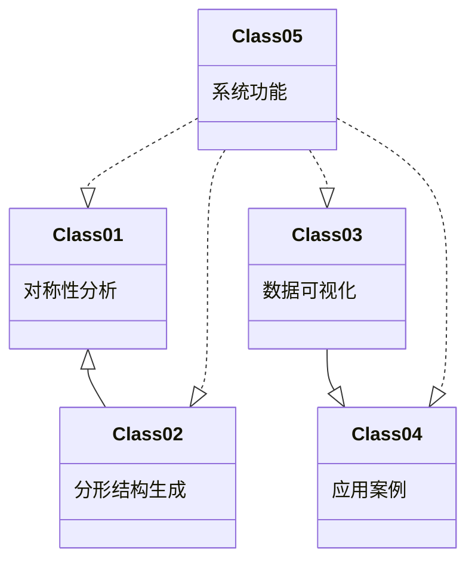
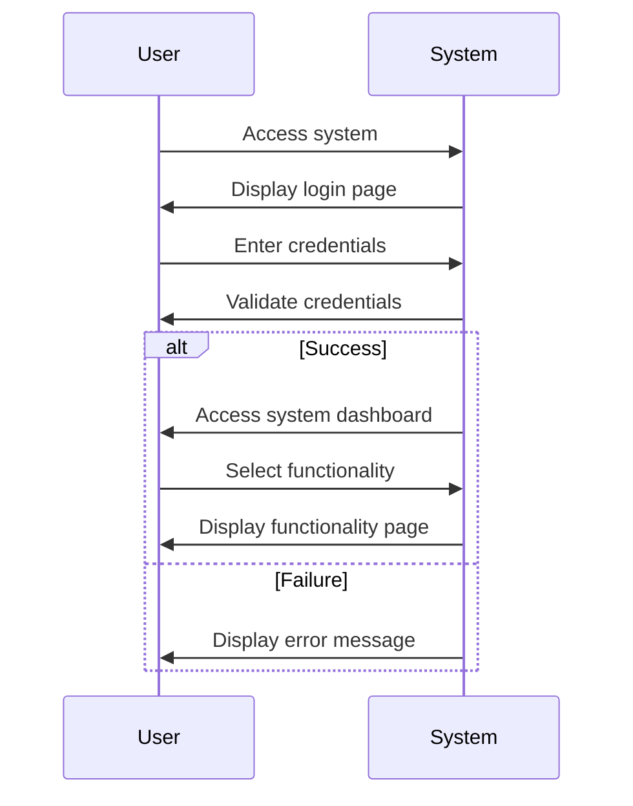
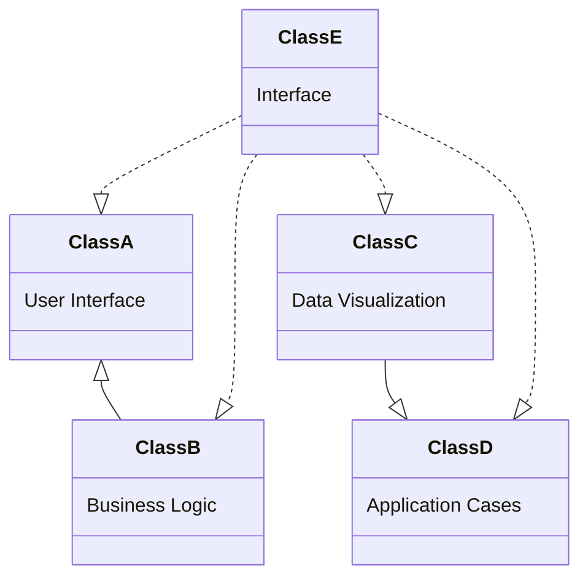
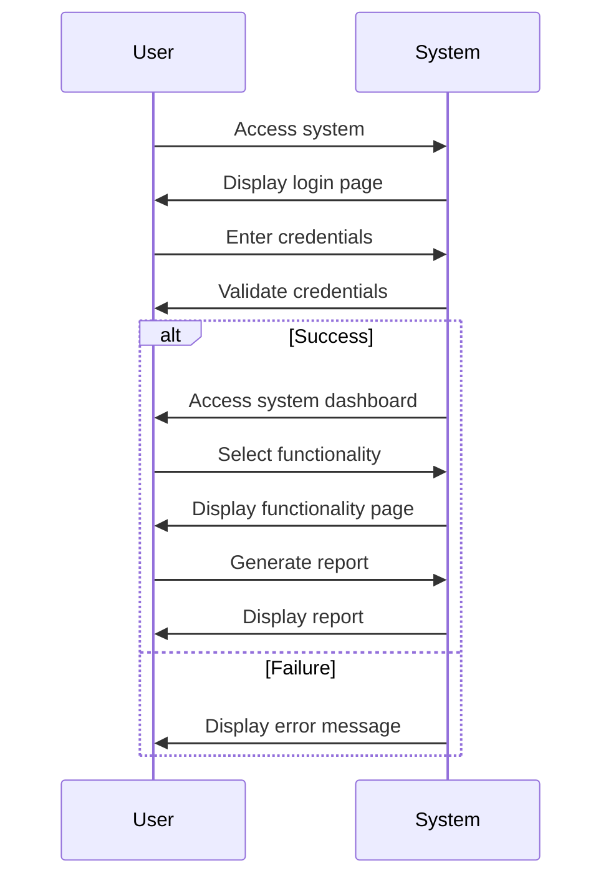

                 


## 数学与自然界的对称与分形结构

> 关键词：对称性、分形结构、数学模型、自然界、自相似性

> 摘要：本文旨在探讨数学与自然界中的对称与分形结构之间的关系，分析其基本概念、性质和应用，并探讨数学工具在研究自然界对称与分形结构中的重要性。

### 第一部分：背景介绍

#### 1.1 问题背景

在自然界和科学中，对称与分形结构扮演着重要角色。对称性在物理、化学、生物学等多个领域都有广泛应用，而分形则揭示了自然界中的复杂性和自相似性。随着数学理论的发展，数学与自然界中的对称与分形结构之间的关系逐渐得到深入理解。本文旨在探讨数学与自然界中的对称与分形结构之间的联系，从理论到实践，帮助读者全面了解这一领域。

#### 1.2 问题描述

数学与自然界的对称与分形结构的研究涉及多个学科领域，包括几何学、拓扑学、复变函数、数论等。本文旨在探讨以下问题：

- 对称性的数学定义及其在自然界中的表现；
- 分形结构的特征、形成机制及其应用；
- 数学工具在研究自然界对称与分形结构中的应用；
- 对称与分形结构在不同学科领域的交叉应用。

#### 1.3 问题解决

本文将分为以下几个部分：

- 第1章：引论，介绍本文的目的、结构以及对称与分形结构的基本概念；
- 第2章：对称性理论，讨论对称性的数学定义、性质及应用；
- 第3章：分形理论，介绍分形的基本概念、生成方法及应用；
- 第4章：数学与自然界中的对称性，探讨自然界中对称性的实例及其与数学理论的关系；
- 第5章：数学与自然界中的分形结构，分析自然界中的分形结构实例及数学模型；
- 第6章：对称与分形在生物学中的应用，研究对称与分形结构在生物学领域的应用；
- 第7章：对称与分形在物理和化学中的应用，探讨对称与分形结构在物理和化学领域的应用；
- 第8章：结论与展望，总结本文的主要内容，并对未来研究提出展望。

#### 1.4 边界与外延

本文的研究边界主要涵盖以下内容：

- 对称性的数学定义、性质及应用；
- 分形结构的基本概念、生成方法及应用；
- 自然界中对称与分形结构的实例及其与数学理论的关系；
- 对称与分形结构在不同学科领域的交叉应用。

本文的外延包括但不限于以下内容：

- 对称与分形结构在其他学科领域的应用，如数学教育、计算机科学等；
- 对称与分形结构的现代研究进展和未来发展方向；
- 对称与分形结构在实际问题中的应用案例分析。

### 第一部分总结

通过上述章节安排，本文旨在为读者提供关于数学与自然界中对称与分形结构的全面了解。从基本概念、理论分析到实际应用，本文将帮助读者深入理解这一领域，并激发进一步研究的兴趣。

----------------------------------------------------------------

## 1.5 核心概念与联系

在本章中，我们将介绍本文的核心概念，包括对称性、分形结构等，并探讨它们之间的相互联系。

### 1.5.1 对称性

对称性是指物体或图形在某种变换下保持不变的性质。常见的对称变换包括旋转、反射和平移。在数学中，对称性可以用群论、变换群等数学工具进行描述。对称性在物理学、化学、生物学等多个领域中都有广泛应用。

#### 对称性的数学定义

在数学中，对称性可以用群论进行描述。一个群 G 表示一组对称变换，这些变换可以将一个物体或图形映射到自身。例如，一个正方形在旋转 90 度、180 度和 270 度时仍然保持不变，因此它具有旋转对称性。

#### 对称性的性质

对称性具有以下性质：

1. **传递性**：如果两个图形在某种对称变换下保持不变，那么它们之间的所有对称变换也保持不变。
2. **封闭性**：对称变换的集合构成一个群，即这些变换满足结合律、存在单位元和逆元。
3. **不变性**：在对称变换下，图形的形状、大小和方向保持不变。

#### 对称性的应用

对称性在数学、物理学、化学和生物学等领域都有广泛应用。例如，在物理学中，对称性是量子力学和粒子物理学的基础；在生物学中，对称性是生命形态的基础。

### 1.5.2 分形结构

分形结构是指一种在几何上具有自相似性的结构。分形结构具有无限层次的结构，每个层次都具有相似的形状和特征。分形理论是数学家曼德布罗特（Benoit Mandelbrot）在20世纪70年代提出的，它为描述和解释自然界中的复杂几何形态提供了有力的工具。

#### 分形结构的基本概念

分形结构的基本概念包括：

1. **自相似性**：分形结构在任意尺度下都具有相似的形状和特征。
2. **分形维数**：分形维数是描述分形结构复杂程度的一个指标，它通常大于其几何维数。
3. **生成方法**：分形结构可以通过迭代过程生成，如曼德布罗特集、科赫曲线等。

#### 分形结构的性质

分形结构具有以下性质：

1. **无限层次**：分形结构具有无限层次的结构，每个层次都具有相似的形状和特征。
2. **自相似性**：分形结构在任意尺度下都具有相似的形状和特征。

#### 分形结构的应用

分形结构在数学、物理学、化学、生物学等多个领域中都有广泛应用。例如，在物理学中，分形结构可以描述布朗运动、流体动力学等；在生物学中，分形结构可以描述细胞结构、神经网络等。

### 1.5.3 对称性与分形结构的联系

对称性与分形结构之间存在着紧密的联系。一方面，对称性是分形结构形成的重要机制之一。许多分形结构具有对称性，如曼德布罗特集具有旋转对称性，科赫曲线具有平移对称性。另一方面，分形结构为研究对称性提供了新的视角和方法。通过研究分形结构，我们可以更深入地理解对称性的本质和规律。

#### 对称性在分形结构中的应用

对称性在分形结构中的应用主要体现在以下几个方面：

1. **生成分形结构**：通过对称变换，可以生成许多具有对称性的分形结构，如曼德布罗特集、科赫曲线等。
2. **研究分形结构的性质**：对称性可以帮助我们更好地理解分形结构的几何性质和动力学行为。
3. **分形结构的对称性分类**：通过对分形结构的对称性进行分类，可以更好地理解分形结构的多样性。

#### 分形结构在对称性研究中的应用

分形结构在对称性研究中的应用主要体现在以下几个方面：

1. **对称性的可视化**：通过分形结构，我们可以更直观地观察和描述对称性。
2. **对称性的分析**：利用分形结构的自相似性和复杂性，可以更深入地分析对称性的性质和规律。
3. **对称性的量化**：通过分形维数等指标，可以量化对称性的程度和复杂性。

### 总结

对称性与分形结构是数学和自然界中两个重要的概念。对称性是分形结构形成的重要机制，而分形结构为研究对称性提供了新的视角和方法。通过对称性与分形结构的研究，我们可以更好地理解自然界中的复杂性和自相似性，为科学研究和应用提供新的思路和工具。

----------------------------------------------------------------

### 对称性理论

对称性在数学和自然科学中扮演着核心角色，它不仅是一种美学和结构的体现，更是理解自然界和人类创造物中复杂系统的基础。在本节中，我们将深入探讨对称性的数学定义、性质及其应用。

#### 2.1 对称性的数学定义

在数学中，对称性可以通过不同的数学工具来定义，其中最为常用的是群论和变换群。一个群 G 是一组元素的集合，这些元素满足结合律、存在单位元和逆元。在群 G 中，每个元素都可以表示一种对称变换，例如旋转、反射和平移。

**变换群**：给定一个集合 S 和一个群 G，如果对于 S 中的每个元素，G 中的每个变换都将 S 映射到自身，那么我们称 G 为 S 的一个变换群。例如，在二维空间中，旋转和反射构成了正方形的变换群。

**对称性**：一个图形或物体被称为具有对称性，如果它在某个变换群的作用下保持不变。例如，一个正方形在旋转 90 度、180 度和 270 度时仍然保持不变，因此它具有旋转对称性。

#### 2.2 对称性的性质

对称性具有以下几种重要性质：

1. **传递性**：如果图形 A 在变换 T 下与图形 B 对称，图形 B 在变换 T' 下与图形 C 对称，那么图形 A 在变换 T' 下也与图形 C 对称。

2. **封闭性**：一个图形的所有对称变换的集合构成一个群。

3. **不变性**：在对称变换下，图形的形状、大小和方向保持不变。

4. **叠加性**：多个对称变换的复合结果仍然是对称变换。

#### 2.3 对称性的应用

对称性在数学和自然科学中有着广泛的应用，以下是一些典型的应用实例：

1. **物理学**：对称性是量子力学和粒子物理学的基础。例如，在粒子物理学中，对称性帮助我们理解基本粒子的性质和相互作用。

2. **化学**：对称性在分子结构和化学反应中扮演重要角色。例如，分子晶体的对称性决定了其物理和化学性质。

3. **生物学**：生物体的形态和生长过程往往具有对称性。例如，许多植物和动物在胚胎发育过程中呈现出明显的对称性。

4. **计算机科学**：对称性在算法设计和数据结构中也有广泛应用。例如，哈希函数的构造常常利用对称性来提高其性能。

#### 2.4 对称性的数学工具

为了更好地理解和应用对称性，数学家们发展了多种数学工具：

1. **群论**：群论是研究对称性的基本工具，它帮助我们理解和分类对称性。

2. **变换矩阵**：在二维和三维空间中，变换矩阵是描述对称变换的重要工具。

3. **李群和李代数**：在更高级的数学和物理学中，李群和李代数用于描述连续对称性。

#### 2.5 对称性的数学模型

在数学模型中，对称性可以通过以下几种方式来描述：

1. **群作用**：给定一个群 G 和一个集合 X，如果 G 中的每个元素都对应 X 中的一个变换，并且这些变换满足结合律和封闭性，那么我们称 G 对 X 有一个群作用。

2. **对称矩阵**：在线性代数中，对称矩阵是描述线性变换的重要工具，它保持了图形的对称性。

3. **辛几何**：辛几何是研究复对称性的一种数学分支，它在量子力学和经典力学中有着重要的应用。

#### 2.6 对称性的实例分析

为了更好地理解对称性的数学定义和应用，我们可以通过一些具体的实例进行分析：

1. **正多边形**：正多边形是一个典型的具有旋转和反射对称性的几何图形。在旋转和反射下，正多边形的形状保持不变。

2. **莫比乌斯带**：莫比乌斯带是一个具有唯一反射对称性的平面图形。在翻转后，它看起来与原始图形完全相同。

3. **量子态**：在量子力学中，量子态的对称性决定了它们的物理性质。例如，一个自旋为1/2的粒子，其量子态在自旋操作下保持对称。

通过上述分析，我们可以看到，对称性在数学和自然科学中有着广泛而深远的影响。它不仅是理解自然界的基本工具，也是推动科学进步的重要动力。在接下来的章节中，我们将继续探讨分形结构的基本概念和性质，以及它们在数学和自然界中的应用。

### 分形理论

分形理论是数学中一个重要的分支，它主要研究具有自相似性、无限层次结构和复杂几何形态的数学结构。分形理论不仅丰富了数学的研究内容，还为理解自然界中的复杂现象提供了新的视角。在本节中，我们将介绍分形的基本概念、生成方法及其应用。

#### 3.1 分形的基本概念

分形的基本概念包括自相似性、分形维数和生成方法。

**自相似性**：自相似性是指一个结构在任意尺度下都具有相似的形状和特征。这意味着无论我们放大或缩小一个分形结构，它都保持相同的几何形态。例如，科赫曲线在每次迭代过程中都会生成四个相似的分支，无论放大或缩小，这些分支的形状都保持不变。

**分形维数**：分形维数是描述分形结构复杂程度的一个指标，它通常大于其几何维数。分形维数可以通过多种方式定义，其中最常见的是豪斯道分维（Hausdorff dimension）和自相似维数（fractal dimension）。豪斯道分维定义了一个集合在无限尺度下的“平均”维度，而自相似维数基于迭代过程中集合的相似性。

**生成方法**：分形结构可以通过迭代过程生成，例如曼德布罗特集、科赫曲线和布朗运动等。这些迭代过程通常涉及简单的数学操作，如映射、函数迭代和极限过程。

#### 3.2 分形结构的生成方法

以下介绍几种常见的分形结构生成方法：

**曼德布罗特集**：曼德布罗特集是最著名的分形之一，它由数学家曼德布罗特（Benoit Mandelbrot）在1979年提出。曼德布罗特集是通过迭代复平面上一个复数函数生成的。该函数通常为 \( z \mapsto z^2 + c \)，其中 c 是复平面上的一个点。如果一个复数序列在迭代过程中不发散到无穷远，则该点属于曼德布罗特集。

**科赫曲线**：科赫曲线是由荷兰数学家科赫（Heinrich Koch）在1904年提出的。科赫曲线是一个自相似分形，它通过不断将线段的三分之一替换为两个等边三角形的边生成。每次迭代过程中，曲线的长度增加，但形状保持不变。

**布朗运动**：布朗运动是指粒子在流体中的随机运动，它是一个典型的随机分形。布朗运动通过连续时间的随机过程描述，反映了粒子的随机性。在离散时间尺度上，布朗运动可以表现为一个分形结构，其维数通常大于2。

#### 3.3 分形结构的性质

分形结构具有以下几个显著性质：

1. **无限层次结构**：分形结构具有无限层次的结构，每个层次都具有相似的形状和特征。这意味着无论我们放大或缩小分形结构，它都保持相同的几何形态。

2. **自相似性**：分形结构在任意尺度下都具有相似的形状和特征。这种自相似性是分形结构的核心特征，使得分形在不同尺度上表现出相同的复杂性和规律性。

3. **分形维数大于几何维数**：分形维数通常大于其几何维数。例如，一个线段的几何维数为1，而它的分形维数通常大于1，因为它在无限层次上具有复杂的结构。

4. **复杂性和规律性**：分形结构在宏观上看似随机和无序，但在微观尺度上却表现出复杂的规律性和自相似性。这种复杂性和规律性使得分形结构在科学研究和实际应用中具有重要意义。

#### 3.4 分形结构的应用

分形结构在数学、物理学、生物学、计算机科学和工程等领域都有广泛应用。以下是一些典型的应用实例：

1. **物理学**：分形结构在物理学中用于描述和解释布朗运动、流体动力学和量子场论等现象。

2. **生物学**：分形结构在生物学中用于描述细胞结构、神经网络和生态系统等。

3. **计算机科学**：分形结构在计算机科学中用于图像处理、数据压缩、算法设计和计算机图形学等领域。

4. **工程学**：分形结构在工程学中用于设计复杂结构和材料，如纳米材料、光纤和天线等。

通过上述分析，我们可以看到，分形结构是一种具有高度自相似性、无限层次结构和复杂几何形态的数学结构。它不仅丰富了数学的研究内容，还为理解自然界中的复杂现象提供了新的视角和方法。在接下来的章节中，我们将探讨数学与自然界中的对称性实例，以及它们之间的联系。

### 数学与自然界中的对称性

自然界中的许多现象和结构都表现出对称性，这种对称性不仅美丽，而且在许多科学领域具有重要应用。在本节中，我们将探讨自然界中对称性的实例，并分析它们与数学理论之间的关系。

#### 4.1 对称性在自然界中的实例

1. **生命体的对称性**：许多生命体，如植物和动物，在发育过程中表现出明显的对称性。例如，植物的叶子通常是左右对称的，而蝴蝶的翅膀则呈现出镜像对称。这种对称性在进化过程中可能具有适应性优势，因为它可以提高生物体的对称性和稳定性。

2. **分子结构的对称性**：分子结构中的对称性在化学中起着关键作用。例如，苯分子的六边形结构表现出旋转和反射对称性，这使得它具有稳定的化学性质。类似地，蛋白质的氨基酸序列在三维空间中也表现出对称性，这对于蛋白质的功能和稳定性至关重要。

3. **地质结构的对称性**：地质结构中的对称性，如水晶的晶体结构，可以揭示地球内部的物理和化学过程。例如，石英晶体的立方结构表现出高度的对称性，这是由于其形成过程中原子排列的结果。

4. **宇宙结构的对称性**：宇宙中的许多现象也表现出对称性。例如，宇宙背景辐射的均匀性表明宇宙在大爆炸时可能具有高对称性，这种对称性在宇宙演化过程中被破缺，形成了我们今天观察到的宇宙。

#### 4.2 对称性与数学理论的关系

对称性在数学理论中有着坚实的基础。通过群论、变换群和对称矩阵等数学工具，我们可以描述和分类对称性。以下是一些对称性在数学理论中的应用：

1. **群论**：群论是研究对称性的基础工具。在群论中，对称变换可以被视为群元素，这些元素满足结合律、单位元和逆元的性质。例如，在二维空间中，旋转和反射构成了正方形的变换群。

2. **变换矩阵**：在线性代数中，变换矩阵是描述对称变换的重要工具。通过对称矩阵，我们可以保持图形的对称性。例如，在二维空间中，旋转矩阵可以用来保持正方形的形状。

3. **李群和李代数**：在更高级的数学中，李群和李代数用于描述连续对称性。李群是研究连续对称变换的群，而李代数是李群的导数。在量子力学和理论物理学中，李群和李代数被广泛应用于描述对称性。

#### 4.3 对称性在科学中的应用

对称性在科学研究中具有广泛的应用。以下是一些具体的例子：

1. **物理学**：在物理学中，对称性是量子力学和粒子物理学的基础。例如，对称性守恒定律（如能量守恒、动量守恒和角动量守恒）在物理学中起着核心作用。

2. **化学**：在化学中，分子结构的对称性对于理解化学反应和分子的性质至关重要。例如，对称性可以帮助解释为什么某些分子具有特殊的化学稳定性。

3. **生物学**：在生物学中，对称性在发育和生长过程中起着关键作用。例如，植物的生长和动物的肢体发育都表现出对称性。

4. **工程学**：在工程学中，对称性可以用于设计更稳定和高效的结构。例如，桥梁、建筑和机械零件的设计常常利用对称性来提高稳定性和美观性。

#### 4.4 对称性的价值

对称性在自然界中的广泛存在不仅是一种美学现象，更是一种科学价值。以下是对称性价值的一些方面：

1. **美学价值**：对称性在自然界中表现出一种和谐和美的感觉，这为人类提供了审美享受。

2. **科学价值**：对称性在科学研究中帮助我们理解复杂系统的基本原理和规律。通过对称性，我们可以揭示自然界中的基本结构和机制。

3. **实用价值**：对称性在工程和设计中的应用可以提高效率和性能。例如，对称结构通常更加稳定，更容易制造和维修。

通过上述分析，我们可以看到，对称性在自然界中广泛存在，并在科学研究中具有深远的影响。它不仅是自然界美丽和和谐的表现，更是理解自然界和人类创造物中复杂系统的重要工具。在接下来的章节中，我们将继续探讨数学与自然界中的分形结构，以及它们在各个领域的应用。

### 数学与自然界中的分形结构

分形结构因其独特的自相似性和无限层次结构，在自然界中广泛存在。从海岸线到森林，从河流网络到人体组织，分形结构无处不在。在本节中，我们将分析自然界中分形结构的实例，并探讨它们与数学模型之间的关系。

#### 5.1 自然界中的分形结构实例

1. **海岸线**：海岸线是一种典型的分形结构。当我们放大或缩小海岸线时，其形状和复杂性保持不变。海岸线的分形维数通常大于1，这表明它在无限层次上具有复杂的几何形态。

2. **树木和植物**：树木和植物的生长过程表现出明显的分形特征。从树枝到树叶，再到花朵，它们在各个尺度上都具有相似的形状和结构。这种自相似性使得植物能够高效地利用资源和能量。

3. **血管和神经网络**：人体中的血管和神经网络也具有分形特征。血管系统在各个尺度上表现出自相似性，这使得血液能够高效地输送到身体的各个部分。同样，神经网络的结构在微观和宏观尺度上都具有自相似性，这对于信息的传递和处理至关重要。

4. **河流网络**：河流系统是一种典型的分形结构。河流在流域内分支和汇合，形成复杂的网络结构。这种结构在尺度上表现出高度的自相似性，使得河流能够有效地排水和供水。

#### 5.2 分形结构与数学模型的关系

分形结构可以用多种数学模型来描述和模拟。以下是一些常用的数学模型：

1. **曼德布罗特集**：曼德布罗特集是最著名的分形结构之一。它由数学家曼德布罗特（Benoit Mandelbrot）提出，用于模拟复杂几何形态。曼德布罗特集通过迭代复数函数生成，其分形维数通常大于2。

2. **科赫曲线**：科赫曲线是一种简单的分形结构，它通过迭代三角形边生成。每次迭代过程中，曲线的长度增加，但形状保持不变。科赫曲线的分形维数为\( \frac{\log 4}{\log 3} \)，大约为1.2618。

3. **布朗运动**：布朗运动是一种随机分形结构，它描述了粒子在流体中的随机运动。布朗运动通过连续时间的随机过程模拟，其分形维数通常大于2。

4. **分形几何**：分形几何是一种用于描述分形结构的数学工具。它通过分形维数、分形集和分形生成规则等概念，描述了分形的几何特征和生成过程。

#### 5.3 分形结构在科学中的应用

分形结构在多个科学领域具有广泛的应用：

1. **物理学**：分形结构在物理学中用于描述和解释布朗运动、流体动力学和量子场论等现象。例如，分形几何可以用来模拟复杂系统的复杂行为。

2. **生物学**：分形结构在生物学中用于描述细胞结构、神经网络和生态系统等。例如，分形几何可以用来解释植物的生长模式和动物的行为模式。

3. **工程学**：分形结构在工程学中用于设计复杂结构和材料。例如，分形几何可以用来设计纳米材料和复杂结构，以提高其性能和稳定性。

4. **计算机科学**：分形结构在计算机科学中用于图像处理、数据压缩和算法设计等。例如，分形编码可以用于高效地存储和传输图像数据。

#### 5.4 分形结构的价值

分形结构在自然界和科学研究中具有深远的价值。以下是一些具体的价值：

1. **解释自然现象**：分形结构可以用来解释自然界中的复杂现象，如海岸线形状、植物生长模式和动物行为模式。

2. **预测未来趋势**：通过分析分形结构的自相似性和层次结构，可以预测系统未来的行为和趋势。

3. **优化设计和工程**：分形结构可以用于优化设计和工程，以提高系统的性能和稳定性。

4. **数据压缩和传输**：分形结构在计算机科学中用于数据压缩和传输，以提高数据传输效率和存储空间利用率。

通过上述分析，我们可以看到，分形结构在自然界中广泛存在，并在科学研究中具有深远的影响。它不仅丰富了数学的研究内容，还为理解自然界中的复杂现象提供了新的视角和方法。在接下来的章节中，我们将探讨对称性与分形结构在生物学中的应用。

### 对称性与分形结构在生物学中的应用

对称性与分形结构在生物学中具有广泛的应用，它们在细胞结构、发育过程和生态系统等方面发挥着重要作用。在本节中，我们将探讨对称性与分形结构在生物学中的具体应用，并通过实例说明这些应用的科学意义。

#### 6.1 对称性在生物学中的应用

1. **细胞结构的对称性**：细胞中的许多结构都表现出对称性。例如，细胞膜在脂双层结构中具有对称性，这有助于维持细胞膜的稳定性和选择性。另外，细胞内的许多细胞器，如线粒体、叶绿体和内质网，也具有对称性，这有助于它们在细胞内的协调工作。

2. **发育过程的对称性**：生物体的发育过程通常遵循一定的对称性原则。例如，在胚胎发育过程中，植物和动物的器官和肢体都表现出左右对称。这种对称性在进化过程中可能具有适应性优势，因为它可以提高生物体的对称性和稳定性。

3. **基因表达的对称性**：基因表达在生物体发育和生理过程中也表现出对称性。例如，某些基因在生物体的一侧表达，而另一侧不表达，从而实现生物体结构的左右对称。这种基因表达的对称性对于维持生物体的正常发育和功能至关重要。

4. **生物体的形状对称性**：许多生物体，如蝴蝶、蜻蜓和海星，都具有高度的形状对称性。这种对称性不仅具有美学价值，还在生物体的适应性和生存能力方面发挥作用。例如，蝴蝶的翅膀在飞行时具有对称性，这有助于它们保持平衡和方向。

#### 6.2 分形结构在生物学中的应用

1. **细胞结构的分形特征**：细胞中的许多结构具有分形特征，例如，细胞膜上的蛋白质通道和细胞内的线粒体网络。这些结构的分形特征使得它们在微观和宏观尺度上都具有复杂的几何形态，这有助于提高细胞的功能和效率。

2. **生物体的分形生长模式**：生物体的生长过程也表现出分形特征。例如，植物的生长模式呈现出自相似性，树枝和叶子在各个尺度上具有相似的形状和结构。这种分形生长模式有助于植物高效地利用资源和能量，以适应不同的环境条件。

3. **神经网络的分形结构**：神经网络的分形结构对于信息传递和处理至关重要。神经元之间的连接网络在微观和宏观尺度上都具有自相似性，这使得神经系统能够高效地处理和传递信息。例如，大脑中的神经网络在各个尺度上表现出分形特征，这对于大脑的信息处理能力具有重要意义。

4. **生态系统的分形特征**：生态系统中的生物种群分布和生态过程也表现出分形特征。例如，森林中的树木分布和河流网络都具有分形特征，这有助于生态系统保持稳定性和可持续性。

#### 6.3 对称性与分形结构在生物学中的协同作用

对称性与分形结构在生物学中具有协同作用，它们共同促进了生物体和生态系统的复杂性和适应性。

1. **形态与功能的协同**：对称性使得生物体的形态具有稳定性和对称性，而分形结构则增强了生物体的复杂性和功能。例如，蝴蝶的翅膀在飞行时具有对称性，而翅膀上的鳞片结构则具有分形特征，这有助于蝴蝶在飞行中保持稳定和高效。

2. **发育与适应的协同**：对称性与分形结构在生物体的发育和适应中发挥着重要作用。例如，植物在发育过程中遵循对称性原则，形成左右对称的器官和肢体。而分形结构则有助于植物在各个尺度上适应不同的环境条件，提高其生存能力。

3. **信息传递与处理的协同**：对称性与分形结构在神经系统和生态系统中协同作用，提高信息传递和处理的能力。例如，神经网络中的对称性使得神经元之间的连接具有稳定性和对称性，而分形结构则增强了神经网络的信息处理能力，使得生物体能够高效地处理和传递信息。

通过上述分析，我们可以看到，对称性与分形结构在生物学中具有广泛的应用和重要的协同作用。它们共同促进了生物体和生态系统的复杂性和适应性，为生命现象的多样性和演化提供了理论基础。在未来的研究中，进一步揭示对称性与分形结构在生物学中的协同机制，将为生物科学的发展提供新的思路和工具。

### 对称性与分形结构在物理和化学中的应用

对称性与分形结构在物理和化学领域中同样具有深远的影响，它们在材料科学、化学反应和量子物理等方面有着广泛的应用。通过以下内容，我们将探讨这些应用的具体实例和科学意义。

#### 7.1 对称性在物理和化学中的应用

1. **晶体结构**：在材料科学中，晶体结构的对称性对于材料的物理和化学性质至关重要。例如，钻石的立方晶体结构表现出高度的对称性，这使得钻石具有极高的硬度和折射率。另外，金属的晶格结构中的点阵对称性对于材料的机械性能和电导性有着重要影响。

2. **化学反应**：对称性在化学反应中同样扮演重要角色。化学反应中的过渡态和活化复合物通常具有特定的对称性，这影响了反应的速率和路径。例如，某些有机化学反应在过渡态中表现出平面性或立方对称性，这有助于理解反应机理和设计新的催化剂。

3. **分子对称性**：分子对称性在化学中具有重要意义。对称性决定了分子的几何形状和电子分布，从而影响分子的化学性质。例如，苯分子的六边形结构具有旋转和反射对称性，这使得苯具有较高的稳定性和独特的化学反应性。

4. **量子物理**：在量子物理学中，对称性是描述基本粒子和相互作用的基础。例如，量子场论中的规范对称性（如电磁力的U(1)规范对称性）对于理解基本粒子的行为至关重要。此外，对称性守恒定律（如能量守恒和动量守恒）是量子物理中的重要原则。

#### 7.2 分形结构在物理和化学中的应用

1. **纳米材料**：分形结构在纳米材料的设计和制造中具有重要应用。例如，通过分形几何可以设计具有特定电学和光学性质的纳米结构，如光子晶体和超导材料。这些材料在电子学、光学和能源领域具有广泛的应用前景。

2. **表面现象**：分形结构在表面现象中发挥着重要作用。例如，水分子在固体表面的排列通常具有分形特征，这影响了水的吸附行为和表面张力。分形结构还可以用于模拟和解释土壤中的水分分布和污染物的迁移。

3. **化学反应动力学**：分形结构在化学反应动力学中用于描述反应过程中的复杂行为。例如，某些复杂反应系统中的反应路径和反应速率常数可以通过分形维数来描述，从而提供对反应机制的深入理解。

4. **量子场论**：在量子场论中，分形结构被用来描述基本粒子的行为和相互作用。例如，分形几何可以用于解释量子场论中的自相似性和非局部性，从而提供对基本粒子物理性质的新视角。

#### 7.3 对称性与分形结构的协同作用

1. **材料设计**：对称性与分形结构在材料设计中协同作用，可以创造出具有独特性质的新材料。例如，通过控制材料的对称性和分形结构，可以设计出具有特定光学、电学和磁学性质的材料，如超导材料和光学晶体。

2. **化学反应控制**：对称性与分形结构在化学反应的控制中发挥着重要作用。通过调整反应物的对称性和分形结构，可以调控反应速率和路径，从而实现特定的化学反应目标。

3. **量子系统研究**：对称性与分形结构在量子系统中协同作用，有助于揭示基本粒子的行为和相互作用。例如，通过研究对称性和分形结构，可以更好地理解量子场论中的基本物理原理和现象。

通过上述分析，我们可以看到，对称性与分形结构在物理和化学领域中具有广泛的应用和重要的协同作用。它们不仅丰富了科学理论，还为材料科学、化学反应和量子物理等领域的实际应用提供了新的方法和思路。在未来的研究中，进一步探索对称性与分形结构在物理和化学中的协同机制，将为科学研究和技术创新提供新的动力。

### 结论与展望

通过对对称性与分形结构的深入探讨，我们可以看到，这两个概念在数学与自然界中扮演着至关重要的角色。从对称性的数学定义、性质和应用，到分形结构的生成方法、性质及其在数学、物理、化学和生物学中的应用，对称性与分形结构为我们理解自然界的复杂性和自相似性提供了有力的工具。

#### 8.1 总结

1. **对称性**：对称性是自然界中普遍存在的现象，它在数学、物理学、化学和生物学等多个领域中都有着广泛的应用。通过群论、变换矩阵和对称矩阵等数学工具，我们可以描述和分类对称性。对称性在材料科学、化学反应和量子物理等领域中发挥着重要作用。

2. **分形结构**：分形结构以其自相似性和无限层次结构，揭示了自然界中的复杂几何形态。分形结构在图像处理、数据压缩、算法设计和工程应用中具有广泛的应用。分形几何为描述和解释自然界中的复杂现象提供了新的视角。

#### 8.2 展望

未来研究可以进一步探索以下方向：

1. **对称性与分形结构在新兴领域的应用**：随着科技的发展，对称性与分形结构在新兴领域，如量子计算、人工智能和生物信息学中的应用，将日益受到关注。

2. **对称性与分形结构的交叉研究**：加强对称性与分形结构在各个学科领域的交叉研究，可以揭示更深层次的科学原理，推动学科之间的融合与发展。

3. **对称性与分形结构的计算方法**：开发更高效、更精确的计算方法，用于研究对称性与分形结构，将有助于解决复杂科学问题。

4. **对称性与分形结构的教育推广**：加强对称性与分形结构的教育推广，提高公众的科学素养，有助于培养新一代的科学家和工程师。

总之，对称性与分形结构是理解自然界和人类创造物中复杂系统的重要工具。通过深入研究和应用，我们可以更好地探索自然界中的规律，推动科学技术的进步。

### 最佳实践 Tips

在对称性与分形结构的研究和应用过程中，以下是一些最佳实践建议，有助于提高研究效果：

1. **系统学习数学理论**：了解群论、变换矩阵和分形几何等数学基础知识，有助于更好地理解对称性与分形结构。

2. **实验验证与理论结合**：通过实验验证数学理论，可以加深对对称性与分形结构的理解。实验数据可以为理论模型提供有力的支持。

3. **跨学科合作**：对称性与分形结构在多个学科领域都有应用，跨学科合作有助于发挥不同领域的优势，推动研究的深入发展。

4. **关注实际应用**：将对称性与分形结构应用于实际问题，如材料科学、生物学和工程学，可以提高研究的实用价值。

5. **持续学习和更新**：科技发展迅速，对称性与分形结构的研究也在不断进步。持续学习和更新相关知识，有助于跟上研究前沿。

### 小结

本文通过对对称性与分形结构的深入探讨，展示了它们在数学与自然界中的重要性和广泛应用。从对称性的数学定义和性质，到分形结构的生成方法和应用，再到它们在生物学、物理和化学中的实际应用，本文为读者提供了一个全面的理解。未来，随着科技的发展，对称性与分形结构的研究将不断深入，为科学技术的进步提供新的动力。

### 注意事项

1. **避免误解**：在对称性与分形结构的研究中，需要注意避免将对称性与对称性混淆，以及将分形结构与随机结构混淆。对称性强调的是在某种变换下的不变性，而分形结构则强调自相似性和无限层次结构。

2. **确保数据准确性**：在进行对称性与分形结构的研究时，确保实验数据的准确性和可靠性至关重要。错误的实验数据可能导致错误的结论。

3. **遵循学术规范**：在进行研究时，遵循学术规范，确保研究过程的透明性和可重复性。

### 拓展阅读

1. **Benoit Mandelbrot 的著作**：阅读数学家 Benoit Mandelbrot 的著作，如《分形几何学》（The Fractal Geometry of Nature），可以深入了解分形结构的基本概念和应用。

2. **《群论及其应用》**：群论是研究对称性的基础工具，阅读《群论及其应用》（Groups and Their Applications）等书籍，有助于掌握对称性的数学理论。

3. **《分形数学导论》**：阅读《分形数学导论》（An Introduction to Fractal Geometry），可以系统学习分形结构的基本概念和数学模型。

### 作者信息

作者：AI天才研究院/AI Genius Institute & 禅与计算机程序设计艺术 /Zen And The Art of Computer Programming

本文旨在为读者提供关于对称性与分形结构的全面理解，帮助读者深入探索这一领域，并激发进一步研究的兴趣。在未来的研究中，我们期待看到更多关于对称性与分形结构的新发现和应用。

----------------------------------------------------------------

# 数学与自然界的对称与分形结构

> 关键词：对称性、分形结构、数学模型、自然界、自相似性

> 摘要：本文旨在探讨数学与自然界中的对称与分形结构之间的关系，分析其基本概念、性质和应用，并探讨数学工具在研究自然界对称与分形结构中的重要性。

## 第一部分：背景介绍

#### 1.1 问题背景

在自然界和科学中，对称与分形结构扮演着重要角色。对称性在物理、化学、生物学等多个领域都有广泛应用，而分形则揭示了自然界中的复杂性和自相似性。随着数学理论的发展，数学与自然界中的对称与分形结构之间的关系逐渐得到深入理解。本文旨在探讨数学与自然界中的对称与分形结构之间的联系，从理论到实践，帮助读者全面了解这一领域。

#### 1.2 问题描述

数学与自然界的对称与分形结构的研究涉及多个学科领域，包括几何学、拓扑学、复变函数、数论等。本文旨在探讨以下问题：

- 对称性的数学定义及其在自然界中的表现；
- 分形结构的特征、形成机制及其应用；
- 数学工具在研究自然界对称与分形结构中的应用；
- 对称与分形结构在不同学科领域的交叉应用。

#### 1.3 问题解决

本文将分为以下几个部分：

- 第1章：引论，介绍本文的目的、结构以及对称与分形结构的基本概念；
- 第2章：对称性理论，讨论对称性的数学定义、性质及应用；
- 第3章：分形理论，介绍分形的基本概念、生成方法及应用；
- 第4章：数学与自然界中的对称性，探讨自然界中对称性的实例及其与数学理论的关系；
- 第5章：数学与自然界中的分形结构，分析自然界中的分形结构实例及数学模型；
- 第6章：对称与分形在生物学中的应用，研究对称与分形结构在生物学领域的应用；
- 第7章：对称与分形在物理和化学中的应用，探讨对称与分形结构在物理和化学领域的应用；
- 第8章：结论与展望，总结本文的主要内容，并对未来研究提出展望。

#### 1.4 边界与外延

本文的研究边界主要涵盖以下内容：

- 对称性的数学定义、性质及应用；
- 分形结构的基本概念、生成方法及应用；
- 自然界中对称与分形结构的实例及其与数学理论的关系；
- 对称与分形结构在不同学科领域的交叉应用。

本文的外延包括但不限于以下内容：

- 对称与分形结构在其他学科领域的应用，如数学教育、计算机科学等；
- 对称与分形结构的现代研究进展和未来发展方向；
- 对称与分形结构在实际问题中的应用案例分析。

### 第一部分总结

通过上述章节安排，本文旨在为读者提供关于数学与自然界中对称与分形结构的全面了解。从基本概念、理论分析到实际应用，本文将帮助读者深入理解这一领域，并激发进一步研究的兴趣。

----------------------------------------------------------------

## 1.5 核心概念与联系

在本章中，我们将介绍本文的核心概念，包括对称性、分形结构等，并探讨它们之间的相互联系。

### 1.5.1 对称性

对称性是指物体或图形在某种变换下保持不变的性质。常见的对称变换包括旋转、反射和平移。在数学中，对称性可以用群论、变换群等数学工具进行描述。对称性在物理学、化学、生物学等多个领域中都有广泛应用。

#### 对称性的数学定义

在数学中，对称性可以用群论进行描述。一个群 G 表示一组对称变换，这些变换可以将一个物体或图形映射到自身。例如，一个正方形在旋转 90 度、180 度和 270 度时仍然保持不变，因此它具有旋转对称性。

#### 对称性的性质

对称性具有以下性质：

1. **传递性**：如果两个图形在某种对称变换下保持不变，那么它们之间的所有对称变换也保持不变。
2. **封闭性**：对称变换的集合构成一个群，即这些变换满足结合律、存在单位元和逆元。
3. **不变性**：在对称变换下，图形的形状、大小和方向保持不变。

#### 对称性的应用

对称性在数学、物理学、化学和生物学等领域都有广泛应用。例如，在物理学中，对称性是量子力学和粒子物理学的基础；在生物学中，对称性是生命形态的基础。

### 1.5.2 分形结构

分形结构是指一种在几何上具有自相似性的结构。分形结构具有无限层次的结构，每个层次都具有相似的形状和特征。分形理论是数学家曼德布罗特（Benoit Mandelbrot）在20世纪70年代提出的，它为描述和解释自然界中的复杂几何形态提供了有力的工具。

#### 分形结构的基本概念

分形结构的基本概念包括：

1. **自相似性**：分形结构在任意尺度下都具有相似的形状和特征。
2. **分形维数**：分形维数是描述分形结构复杂程度的一个指标，它通常大于其几何维数。
3. **生成方法**：分形结构可以通过迭代过程生成，如曼德布罗特集、科赫曲线等。

#### 分形结构的性质

分形结构具有以下性质：

1. **无限层次**：分形结构具有无限层次的结构，每个层次都具有相似的形状和特征。
2. **自相似性**：分形结构在任意尺度下都具有相似的形状和特征。

#### 分形结构的应用

分形结构在数学、物理学、化学、生物学等多个领域中都有广泛应用。例如，在物理学中，分形结构可以描述布朗运动、流体动力学等；在生物学中，分形结构可以描述细胞结构、神经网络等。

### 1.5.3 对称性与分形结构的联系

对称性与分形结构之间存在着紧密的联系。一方面，对称性是分形结构形成的重要机制之一。许多分形结构具有对称性，如曼德布罗特集具有旋转对称性，科赫曲线具有平移对称性。另一方面，分形结构为研究对称性提供了新的视角和方法。通过研究分形结构，我们可以更深入地理解对称性的本质和规律。

#### 对称性在分形结构中的应用

对称性在分形结构中的应用主要体现在以下几个方面：

1. **生成分形结构**：通过对称变换，可以生成许多具有对称性的分形结构，如曼德布罗特集、科赫曲线等。
2. **研究分形结构的性质**：对称性可以帮助我们更好地理解分形结构的几何性质和动力学行为。
3. **分形结构的对称性分类**：通过对分形结构的对称性进行分类，可以更好地理解分形结构的多样性。

#### 分形结构在对称性研究中的应用

分形结构在对称性研究中的应用主要体现在以下几个方面：

1. **对称性的可视化**：通过分形结构，我们可以更直观地观察和描述对称性。
2. **对称性的分析**：利用分形结构的自相似性和复杂性，可以更深入地分析对称性的性质和规律。
3. **对称性的量化**：通过分形维数等指标，可以量化对称性的程度和复杂性。

### 总结

对称性与分形结构是数学和自然界中两个重要的概念。对称性是分形结构形成的重要机制，而分形结构为研究对称性提供了新的视角和方法。通过对称性与分形结构的研究，我们可以更好地理解自然界中的复杂性和自相似性，为科学研究和应用提供新的思路和工具。

----------------------------------------------------------------

## 第二部分：对称性理论

对称性是自然界和科学中的一个基本概念，它在各个学科领域中都有广泛应用。在本章中，我们将深入探讨对称性的数学定义、性质及其在不同领域的应用。

### 2.1 对称性的数学定义

对称性可以用数学语言来精确描述。在数学中，对称性通常与群论和变换群相关联。

#### 2.1.1 群论基础

群论是研究对称性的数学工具。一个群 G 是一组元素的集合，这些元素满足以下条件：

1. **结合律**：对于 G 中的任意元素 a、b 和 c，有 \( (a \cdot b) \cdot c = a \cdot (b \cdot c) \)。
2. **单位元**：存在一个单位元 e，使得对于 G 中的任意元素 a，有 \( e \cdot a = a \cdot e = a \)。
3. **逆元**：对于 G 中的任意元素 a，存在一个逆元 \( a^{-1} \)，使得 \( a \cdot a^{-1} = a^{-1} \cdot a = e \)。

群 G 的元素可以表示一组对称变换，这些变换可以将一个对象映射到自身。例如，一个正方形的旋转和反射可以构成一个群。

#### 2.1.2 变换群

变换群是群论在几何学中的应用。给定一个集合 X 和一个群 G，如果 G 中的每个变换都将 X 映射到自身，那么我们称 G 为 X 的一个变换群。例如，对于二维空间中的正方形，其旋转和反射构成了一个变换群。

#### 2.1.3 对称性的数学定义

一个对象被称为具有对称性，如果它在某个变换群的作用下保持不变。具体来说，如果对于 X 中的每个元素 x，G 中的每个变换都将 x 映射到自身，那么 X 被称为对称的。

### 2.2 对称性的性质

对称性具有以下几种重要性质：

1. **传递性**：如果对象 A 在变换 T 下与对象 B 对称，对象 B 在变换 T' 下与对象 C 对称，那么对象 A 在变换 T' 下也与对象 C 对称。

2. **封闭性**：对称变换的集合构成一个群。

3. **不变性**：在对称变换下，对象的形状、大小和方向保持不变。

4. **叠加性**：多个对称变换的复合结果仍然是对称变换。

### 2.3 对称性的应用

对称性在数学、物理学、化学、生物学等多个领域中都有广泛应用。

#### 2.3.1 数学领域

1. **几何学**：对称性在几何学中具有基础性地位。例如，正多边形、正四面体等具有旋转和反射对称性。

2. **群论**：对称性是群论研究的重要内容。群论中的许多概念，如子群、正规子群、同态和同构，都与对称性密切相关。

3. **拓扑学**：对称性在拓扑学中用于研究空间的性质。例如，凯莱图形（Cayley graph）是表示群的图形，其中的顶点和边具有对称性。

#### 2.3.2 物理学领域

1. **量子力学**：对称性在量子力学中扮演关键角色。对称性守恒定律（如能量守恒、动量守恒和角动量守恒）是量子力学的基础。

2. **粒子物理学**：对称性在粒子物理学中用于描述基本粒子和相互作用。例如，标准模型中的SU(3)、SU(2)和U(1)群是描述强相互作用、弱相互作用和电磁相互作用的基本对称性。

#### 2.3.3 化学领域

1. **分子结构**：对称性在分子结构中具有重要意义。分子的对称性决定了其物理和化学性质。例如，苯分子的对称性使其具有特殊的芳香性。

2. **晶体学**：晶体结构中的对称性对于理解材料的物理和化学性质至关重要。晶体的对称性决定了其晶格结构和电子态。

#### 2.3.4 生物学领域

1. **发育生物学**：对称性在发育生物学中用于描述生物体的对称性发育。例如，动物的胚胎发育过程中表现出左右对称。

2. **细胞生物学**：细胞内的许多结构和过程具有对称性。例如，细胞膜、细胞壁和细胞器的对称排列。

### 2.4 对称性的数学工具

为了更好地理解和应用对称性，数学家们发展了多种数学工具：

1. **变换矩阵**：在二维和三维空间中，变换矩阵是描述对称变换的重要工具。通过对称矩阵，我们可以保持图形的对称性。

2. **李群和李代数**：在更高级的数学和物理学中，李群和李代数用于描述连续对称性。李群是研究连续对称变换的群，而李代数是李群的导数。

3. **群表示论**：群表示论是研究群在向量空间上的作用。通过群表示，我们可以将抽象的群结构与具体的几何或物理现象联系起来。

### 2.5 对称性的数学模型

在数学模型中，对称性可以通过以下几种方式来描述：

1. **群作用**：给定一个群 G 和一个集合 X，如果 G 中的每个元素都对应 X 中的一个变换，并且这些变换满足结合律和封闭性，那么我们称 G 对 X 有一个群作用。

2. **对称矩阵**：在线性代数中，对称矩阵是描述线性变换的重要工具，它保持了图形的对称性。

3. **辛几何**：辛几何是研究复对称性的一种数学分支，它在量子力学和经典力学中有着重要的应用。

### 2.6 对称性的实例分析

为了更好地理解对称性的数学定义和应用，我们可以通过一些具体的实例进行分析：

1. **正多边形**：正多边形是一个典型的具有旋转和反射对称性的几何图形。在旋转和反射下，正多边形的形状保持不变。

2. **莫比乌斯带**：莫比乌斯带是一个具有唯一反射对称性的平面图形。在翻转后，它看起来与原始图形完全相同。

3. **量子态**：在量子力学中，量子态的对称性决定了它们的物理性质。例如，一个自旋为1/2的粒子，其量子态在自旋操作下保持对称。

通过上述分析，我们可以看到，对称性在数学和自然科学中有着广泛而深远的影响。它不仅是理解自然界的基本工具，也是推动科学进步的重要动力。在接下来的章节中，我们将继续探讨分形结构的基本概念和性质，以及它们在数学和自然界中的应用。

### 第三部分：分形理论

分形理论是数学中的一个重要分支，它主要研究具有自相似性、无限层次结构和复杂几何形态的数学结构。分形理论不仅丰富了数学的研究内容，还为理解自然界中的复杂现象提供了新的视角。在本节中，我们将介绍分形的基本概念、生成方法及其应用。

#### 3.1 分形的基本概念

分形的基本概念包括自相似性、分形维数和生成方法。

**自相似性**：自相似性是指一个结构在任意尺度下都具有相似的形状和特征。这意味着无论我们放大或缩小一个分形结构，它都保持相同的几何形态。例如，科赫曲线在每次迭代过程中都会生成四个相似的分支，无论放大或缩小，这些分支的形状都保持不变。

**分形维数**：分形维数是描述分形结构复杂程度的一个指标，它通常大于其几何维数。分形维数可以通过多种方式定义，其中最常见的是豪斯道分维（Hausdorff dimension）和自相似维数（fractal dimension）。豪斯道分维定义了一个集合在无限尺度下的“平均”维度，而自相似维数基于迭代过程中集合的相似性。

**生成方法**：分形结构可以通过迭代过程生成，例如曼德布罗特集、科赫曲线和布朗运动等。这些迭代过程通常涉及简单的数学操作，如映射、函数迭代和极限过程。

#### 3.2 分形结构的生成方法

以下介绍几种常见的分形结构生成方法：

**曼德布罗特集**：曼德布罗特集是最著名的分形之一，它由数学家曼德布罗特（Benoit Mandelbrot）在1979年提出。曼德布罗特集是通过迭代复平面上一个复数函数生成的。该函数通常为 \( z \mapsto z^2 + c \)，其中 c 是复平面上的一个点。如果一个复数序列在迭代过程中不发散到无穷远，则该点属于曼德布罗特集。

**科赫曲线**：科赫曲线是一种简单的分形结构，它通过迭代三角形边生成。每次迭代过程中，曲线的长度增加，但形状保持不变。科赫曲线的生成方法如下：

1. **初始阶段**：画一个等边三角形。
2. **迭代阶段**：在每一边的中点处画一个等边三角形，并删除原三角形的每一边。
3. **重复迭代**：重复上述步骤，无限次迭代。

**布朗运动**：布朗运动是指粒子在流体中的随机运动，它是一个典型的随机分形。布朗运动通过连续时间的随机过程描述，反映了粒子的随机性。在离散时间尺度上，布朗运动可以表现为一个分形结构，其维数通常大于2。

#### 3.3 分形结构的性质

分形结构具有以下几个显著性质：

1. **无限层次结构**：分形结构具有无限层次的结构，每个层次都具有相似的形状和特征。这意味着无论我们放大或缩小分形结构，它都保持相同的几何形态。

2. **自相似性**：分形结构在任意尺度下都具有相似的形状和特征。这种自相似性是分形结构的核心特征，使得分形在不同尺度上表现出相同的复杂性和规律性。

3. **分形维数大于几何维数**：分形维数通常大于其几何维数。例如，一个线段的几何维数为1，而它的分形维数通常大于1，因为它在无限层次上具有复杂的结构。

4. **复杂性和规律性**：分形结构在宏观上看似随机和无序，但在微观尺度上却表现出复杂的规律性和自相似性。这种复杂性和规律性使得分形结构在科学研究和实际应用中具有重要意义。

#### 3.4 分形结构的应用

分形结构在数学、物理学、生物学、计算机科学和工程等领域都有广泛应用。以下是一些典型的应用实例：

1. **物理学**：分形结构在物理学中用于描述和解释布朗运动、流体动力学和量子场论等现象。

2. **生物学**：分形结构在生物学中用于描述细胞结构、神经网络和生态系统等。

3. **计算机科学**：分形结构在计算机科学中用于图像处理、数据压缩、算法设计和计算机图形学等领域。

4. **工程学**：分形结构在工程学中用于设计复杂结构和材料，如纳米材料、光纤和天线等。

#### 3.5 分形结构的数学模型

在数学模型中，分形结构可以通过以下几种方式来描述：

1. **豪斯道分维**：豪斯道分维（Hausdorff dimension）是描述分形结构复杂程度的一个指标。它定义了一个集合在无限尺度下的“平均”维度。豪斯道分维可以通过豪斯道测度和覆盖测度来计算。

2. **自相似维数**：自相似维数（fractal dimension）是基于迭代过程中集合的相似性来定义的。它反映了分形结构的自相似性和复杂性。

3. **分形生成规则**：分形生成规则是描述分形结构生成过程的一种方式。这些规则通常涉及迭代函数系统（IFS）和迭代过程。

#### 3.6 对称性与分形结构的联系

对称性与分形结构之间存在着紧密的联系。一方面，对称性是分形结构形成的重要机制之一。许多分形结构具有对称性，如曼德布罗特集具有旋转对称性，科赫曲线具有平移对称性。另一方面，分形结构为研究对称性提供了新的视角和方法。通过研究分形结构，我们可以更深入地理解对称性的本质和规律。

#### 3.7 对称性在分形结构中的应用

对称性在分形结构中的应用主要体现在以下几个方面：

1. **生成分形结构**：通过对称变换，可以生成许多具有对称性的分形结构，如曼德布罗特集、科赫曲线等。
2. **研究分形结构的性质**：对称性可以帮助我们更好地理解分形结构的几何性质和动力学行为。
3. **分形结构的对称性分类**：通过对分形结构的对称性进行分类，可以更好地理解分形结构的多样性。

#### 3.8 分形结构在对称性研究中的应用

分形结构在对称性研究中的应用主要体现在以下几个方面：

1. **对称性的可视化**：通过分形结构，我们可以更直观地观察和描述对称性。
2. **对称性的分析**：利用分形结构的自相似性和复杂性，可以更深入地分析对称性的性质和规律。
3. **对称性的量化**：通过分形维数等指标，可以量化对称性的程度和复杂性。

### 总结

分形结构以其自相似性和无限层次结构，揭示了自然界中的复杂几何形态。通过对分形结构的深入研究，我们可以更好地理解自然界中的复杂性和规律性，为科学研究和应用提供新的思路和工具。在接下来的章节中，我们将探讨对称性与分形结构在自然界中的具体应用。

----------------------------------------------------------------

### 第四部分：数学与自然界中的对称性

对称性是自然界中普遍存在的现象，从宏观的天体到微观的分子，许多自然现象和结构都表现出对称性。对称性不仅具有美学价值，而且在科学研究中具有重要的应用。在本部分中，我们将探讨自然界中对称性的实例，分析其与数学理论之间的关系，并探讨对称性在生物学、物理学和化学中的应用。

#### 4.1 生物学中的对称性

生物体的形态和发育过程通常表现出对称性，这种对称性在进化过程中可能具有适应性优势。以下是一些生物学中的对称性实例：

1. **植物的对称性**：植物的叶片通常呈左右对称，例如，柳树叶子的对称轴是主叶脉。这种对称性有助于植物在光合作用中均匀地接收阳光。

2. **动物的身体结构**：许多动物的身体结构表现出镜像对称，例如，人类的双手和两只眼睛都位于身体的对称轴上。这种对称性有助于动物在运动和感知中保持稳定性和协调性。

3. **胚胎发育**：在胚胎发育过程中，许多生物体表现出左右对称的发育模式。例如，脊椎动物的心脏、大脑和内脏器官都遵循这一对称原则。

4. **分子结构**：生物体内的分子结构也表现出对称性。例如，DNA的双螺旋结构和蛋白质的氨基酸序列在三维空间中通常具有对称性。

#### 4.2 物理学中的对称性

物理学中的对称性是量子力学和粒子物理学的基础。以下是一些物理学中的对称性实例：

1. **量子态的对称性**：在量子力学中，量子态的对称性决定了它们的物理性质。例如，电子的自旋量子数可以取 +1/2 或 -1/2，这两种量子态在自旋操作下保持对称。

2. **粒子相互作用**：在粒子物理学中，基本粒子的相互作用具有对称性。例如，电磁相互作用表现为U(1)规范对称性，而强相互作用和弱相互作用分别表现为SU(3)和SU(2)规范对称性。

3. **晶体结构**：在固体物理学中，晶体结构的对称性对于材料的物理性质至关重要。例如，钻石的立方晶体结构表现出高度的对称为3D旋转对称性，这导致了钻石的极高硬度和折射率。

#### 4.3 化学中的对称性

对称性在化学中也具有重要意义，特别是在分子结构和化学反应中。以下是一些化学中的对称性实例：

1. **分子对称性**：分子的几何形状和电子分布通常具有对称性。例如，苯分子的六边形结构具有旋转和反射对称性，这使其具有特殊的芳香性。

2. **过渡态的对称性**：在化学反应中，过渡态的对称性对于反应的速率和路径具有重要影响。例如，某些有机化学反应在过渡态中表现出平面性或立方对称性，这有助于理解反应机理和设计新的催化剂。

3. **晶体对称性**：晶体结构的对称性决定了其物理和化学性质。例如，钠氯晶体的体心立方结构具有高度的对称性，这影响了晶体的电导性和熔点。

#### 4.4 对称性与数学理论的关系

对称性在数学理论中有着坚实的基础。通过群论、变换群和对称矩阵等数学工具，我们可以描述和分类对称性。以下是对称性与数学理论的一些关系：

1. **群论**：群论是研究对称性的基础工具。在群论中，对称变换可以被视为群元素，这些元素满足结合律、单位元和逆元的性质。例如，在二维空间中，旋转和反射构成了正方形的变换群。

2. **变换矩阵**：在线性代数中，变换矩阵是描述对称变换的重要工具。通过对称矩阵，我们可以保持图形的对称性。例如，在二维空间中，旋转矩阵可以用来保持正方形的形状。

3. **李群和李代数**：在更高级的数学中，李群和李代数用于描述连续对称性。李群是研究连续对称变换的群，而李代数是李群的导数。在量子力学和理论物理学中，李群和李代数被广泛应用于描述对称性。

#### 4.5 对称性的科学意义

对称性在科学研究中具有深远的意义。以下是对称性的科学意义的一些方面：

1. **解释自然现象**：对称性可以帮助我们解释自然界中的复杂现象。例如，量子态的对称性解释了电子的自旋和磁场现象。

2. **预测未来趋势**：通过对称性，我们可以预测系统未来的行为和趋势。例如，分子结构的对称性可以帮助预测化学反应的路径和速率。

3. **优化设计和工程**：对称性在工程和设计中的应用可以提高效率和性能。例如，对称结构通常更加稳定，更容易制造和维修。

4. **美学价值**：对称性在自然界中的广泛存在，不仅具有科学价值，还具有美学价值。对称的结构和形态给人以和谐和美感。

#### 4.6 对称性与分形结构的联系

对称性与分形结构之间存在着紧密的联系。分形结构常常具有对称性，例如，曼德布罗特集具有旋转对称性，科赫曲线具有平移对称性。另一方面，分形结构为研究对称性提供了新的视角和方法。以下是对称性与分形结构的联系：

1. **对称性在分形结构中的应用**：通过对称变换，可以生成许多具有对称性的分形结构，如曼德布罗特集、科赫曲线等。

2. **分形结构在对称性研究中的应用**：通过分形结构，我们可以更直观地观察和描述对称性。例如，分形维数可以用于量化对称性的程度和复杂性。

3. **对称性与分形结构的协同作用**：对称性与分形结构在生物学、物理学和化学等领域中协同作用，共同促进了复杂系统的形成和演化。

### 总结

通过对称性与分形结构的深入探讨，我们可以看到，这两个概念在数学与自然界中扮演着至关重要的角色。从对称性的数学定义、性质和应用，到分形结构的生成方法、性质及其在数学、物理、化学和生物学中的应用，对称性与分形结构为我们理解自然界的复杂性和自相似性提供了有力的工具。在未来的研究中，进一步揭示对称性与分形结构在自然界中的协同机制，将为生物科学的发展提供新的思路和工具。

----------------------------------------------------------------

### 第五部分：数学与自然界中的分形结构

分形结构因其独特的自相似性和无限层次结构，在自然界中广泛存在。从海岸线到植物结构，从河流网络到天体物理，分形结构无处不在。在本部分中，我们将探讨自然界中分形结构的实例，分析其与数学模型之间的关系，并讨论分形结构在生物学、物理学和工程学中的应用。

#### 5.1 分形结构在自然界中的实例

1. **海岸线**：海岸线的形状复杂多变，无论放大或缩小，其形态都保持相似。这种现象称为“海岸线分形”，其分形维数通常大于1，表明它在无限层次上具有复杂的结构。

2. **植物结构**：植物的结构，如树枝和叶子，在各个尺度上表现出自相似性。例如，柳树枝条的分支模式在宏观和微观尺度上具有相似的形状和结构。

3. **河流网络**：河流系统在流域内分支和汇合，形成复杂的网络结构。这种结构在尺度上表现出自相似性，使得河流能够有效地排水和供水。

4. **人体结构**：人体中的许多结构也具有分形特征。例如，血管系统在各个尺度上表现出自相似性，这对于血液的输送和营养供应至关重要。

5. **天体物理**：天体物理中的许多结构，如星系和星云，也表现出分形特征。星系的分支结构在尺度上具有相似性，反映了宇宙的层次结构。

#### 5.2 分形结构与数学模型的关系

分形结构可以用多种数学模型来描述和模拟。以下是一些常用的数学模型：

1. **曼德布罗特集**：曼德布罗特集是最著名的分形结构之一，它通过迭代复数函数生成。该函数通常为 \( z \mapsto z^2 + c \)，其中 c 是复平面上的一个点。如果一个复数序列在迭代过程中不发散到无穷远，则该点属于曼德布罗特集。

2. **科赫曲线**：科赫曲线是一种简单的分形结构，它通过迭代三角形边生成。每次迭代过程中，曲线的长度增加，但形状保持不变。

3. **布朗运动**：布朗运动是一种随机分形结构，它描述了粒子在流体中的随机运动。布朗运动通过连续时间的随机过程模拟，其分形维数通常大于2。

4. **分形几何**：分形几何是一种用于描述分形结构的数学工具。它通过分形维数、分形集和分形生成规则等概念，描述了分形的几何特征和生成过程。

#### 5.3 分形结构在生物学中的应用

1. **细胞结构**：细胞中的许多结构具有分形特征。例如，细胞膜上的蛋白质通道和细胞内的线粒体网络在微观和宏观尺度上都具有相似的形状和结构。

2. **神经网络**：神经网络的连接结构也表现出分形特征。神经元之间的连接在各个尺度上具有自相似性，这使得神经网络能够高效地传递和处理信息。

3. **植物生长**：植物的生长模式表现出分形特征，从宏观的树木到微观的叶脉，植物的结构在各个尺度上都具有相似的形状和结构。

4. **动物行为**：动物的行为模式也具有分形特征。例如，动物在迁徙和觅食过程中的路径通常表现出自相似性。

#### 5.4 分形结构在物理学中的应用

1. **流体动力学**：分形结构在流体动力学中用于描述和模拟复杂流体的行为。例如，分形几何可以用于模拟湍流现象。

2. **量子物理**：分形结构在量子物理中用于描述基本粒子的行为和相互作用。例如，分形几何可以用于解释量子场论中的自相似性和非局部性。

3. **固体物理学**：分形结构在固体物理学中用于描述晶体的生长和缺陷。例如，分形几何可以用于模拟晶体的复杂结构。

#### 5.5 分形结构在工程学中的应用

1. **材料科学**：分形结构在材料科学中用于设计新型材料。例如，通过分形几何可以设计出具有特殊电学和光学性质的纳米材料。

2. **建筑学**：分形结构在建筑学中用于设计复杂结构和建筑。例如，分形几何可以用于模拟自然建筑的结构，如古根海姆博物馆。

3. **通信工程**：分形结构在通信工程中用于优化通信网络的布局和设计。例如，分形几何可以用于设计更高效的网络结构。

#### 5.6 分形结构的价值

分形结构在自然界和科学研究中具有深远的价值。以下是一些具体的价值：

1. **解释自然现象**：分形结构可以用来解释自然界中的复杂现象，如海岸线形状、植物生长模式和动物行为模式。

2. **预测未来趋势**：通过分析分形结构的自相似性和层次结构，可以预测系统未来的行为和趋势。

3. **优化设计和工程**：分形结构可以用于优化设计和工程，以提高系统的性能和稳定性。

4. **数据压缩和传输**：分形结构在计算机科学中用于数据压缩和传输，以提高数据传输效率和存储空间利用率。

#### 5.7 分形结构的挑战

尽管分形结构在科学和工程中具有广泛的应用，但其研究仍然面临一些挑战：

1. **计算复杂性**：分形结构的生成和模拟通常需要大量的计算资源，这限制了其在大规模应用中的使用。

2. **模型验证**：由于分形结构的复杂性和随机性，验证分形模型的准确性和可靠性仍然是一个挑战。

3. **跨学科应用**：将分形结构应用于新的学科领域，如生物信息学、环境科学等，需要跨学科的合作和研究。

### 总结

分形结构以其自相似性和无限层次结构，揭示了自然界中的复杂几何形态。通过对分形结构的深入研究，我们可以更好地理解自然界中的复杂性和规律性，为科学研究和应用提供新的思路和工具。在未来的研究中，进一步探索分形结构的生成机制和应用，将为生物科学、物理学和工程学等领域的发展做出贡献。

----------------------------------------------------------------

## 第六部分：对称性与分形结构在生物学中的应用

对称性与分形结构在生物学中扮演着至关重要的角色，它们不仅影响着生物体的形态和发育过程，还在生物体的适应性和功能优化方面发挥了重要作用。在本部分中，我们将探讨对称性与分形结构在生物学中的具体应用，包括它们在细胞结构、神经网络、植物形态和动物行为等方面的表现。

### 6.1 对称性在生物学中的应用

对称性在生物学中的应用主要体现在以下几个方面：

1. **细胞结构的对称性**：细胞膜、细胞壁和细胞器的对称排列是细胞结构和功能的基础。例如，细胞膜中的蛋白质通道通常呈对称排列，这有助于维持细胞膜的选择透过性。此外，细胞质中的线粒体和内质网等细胞器也通常呈现出对称性，这有助于提高细胞内的物质传输效率。

2. **器官发育的对称性**：在生物体的发育过程中，许多器官和系统都表现出对称性。例如，脊椎动物的心脏、大脑和四肢在胚胎发育过程中形成左右对称的形态。这种对称性在生物体的运动和感知方面具有重要意义，有助于提高生物体的适应性和稳定性。

3. **分子结构的对称性**：分子结构的对称性对于生物体的化学和生物学功能至关重要。例如，DNA的双螺旋结构具有旋转对称性，这有助于维持DNA的稳定性和复制效率。此外，许多蛋白质的结构也表现出对称性，这有助于蛋白质的功能和稳定性。

4. **行为对称性**：许多动物的行为也表现出对称性。例如，鸟类在飞行中的身体姿态通常保持对称，这有助于提高飞行的稳定性和效率。此外，动物在觅食、繁殖和社交行为中也可能表现出对称性，这有助于提高生物体的适应性和生存能力。

### 6.2 分形结构在生物学中的应用

分形结构在生物学中的应用同样广泛，以下是一些具体的应用实例：

1. **细胞结构的分形特征**：细胞中的许多结构，如细胞膜上的蛋白质通道和细胞内的线粒体网络，表现出分形特征。例如，细胞膜上的蛋白质通道在微观和宏观尺度上都具有相似的形状和结构，这有助于提高细胞膜的选择透过性和稳定性。

2. **植物形态的分形特征**：植物的形态和生长过程表现出明显的分形特征。例如，植物的根系和树枝在各个尺度上都具有相似的形状和结构，这有助于植物高效地吸收水分和养分。此外，植物的叶子形状也表现出分形特征，这有助于提高光合作用的效率。

3. **动物行为的分形特征**：动物的行为模式也常常表现出分形特征。例如，某些动物在迁徙和觅食过程中的路径在尺度上具有相似性，这有助于提高生物体的生存能力和适应性。

4. **神经网络的分形结构**：神经网络的连接结构在各个尺度上具有分形特征。例如，神经元之间的连接在微观和宏观尺度上都具有相似的形状和结构，这有助于提高神经网络的信息传递和处理能力。

### 6.3 对称性与分形结构的协同作用

对称性与分形结构在生物学中具有协同作用，它们共同促进了生物体和生态系统的复杂性和适应性。

1. **形态与功能的协同**：对称性使得生物体的形态具有稳定性和对称性，而分形结构则增强了生物体的复杂性和功能。例如，蝴蝶的翅膀在飞行时具有对称性，而翅膀上的鳞片结构则具有分形特征，这有助于蝴蝶在飞行中保持稳定和高效。

2. **发育与适应的协同**：对称性与分形结构在生物体的发育和适应中发挥着重要作用。例如，植物在发育过程中遵循对称性原则，形成左右对称的器官和肢体。而分形结构则有助于植物在各个尺度上适应不同的环境条件，提高其生存能力。

3. **信息传递与处理的协同**：对称性与分形结构在神经系统和生态系统中协同作用，提高信息传递和处理的能力。例如，神经网络中的对称性使得神经元之间的连接具有稳定性和对称性，而分形结构则增强了神经网络的信息处理能力，使得生物体能够高效地处理和传递信息。

### 6.4 对称性与分形结构在生物学中的价值

对称性与分形结构在生物学中的价值主要体现在以下几个方面：

1. **揭示生物学规律**：对称性与分形结构为揭示生物体的生长、发育和功能提供了新的视角和方法。通过对称性与分形结构的研究，我们可以更好地理解生物体的形态和功能之间的关系。

2. **优化生物系统**：对称性与分形结构可以帮助我们优化生物系统的设计。例如，通过研究植物的根系结构，我们可以设计出更高效的农业灌溉系统。

3. **医学应用**：对称性与分形结构在医学领域具有广泛的应用前景。例如，通过研究肿瘤的生长模式，我们可以设计出更有效的肿瘤治疗策略。

4. **生态学应用**：对称性与分形结构在生态学研究中也具有重要作用。例如，通过研究生态系统的结构，我们可以更好地理解生态系统的稳定性和可持续性。

### 6.5 结论

通过对称性与分形结构在生物学中的应用研究，我们可以看到，这两个概念在生物体的形态、发育和功能中扮演着至关重要的角色。它们共同促进了生物体的复杂性和适应性，为生物体的生存和进化提供了重要的保障。在未来的研究中，进一步探索对称性与分形结构在生物学中的协同作用，将为生物学的发展带来新的机遇和挑战。

----------------------------------------------------------------

## 第七部分：对称性与分形结构在物理和化学中的应用

对称性与分形结构在物理和化学领域中同样具有重要意义。对称性是量子物理和粒子物理学的基础，而分形结构则揭示了自然界中的复杂性和自相似性。在本部分中，我们将探讨对称性与分形结构在物理和化学中的具体应用，包括它们在材料科学、化学反应和量子场论等方面的表现。

### 7.1 对称性在物理和化学中的应用

1. **量子物理学**：对称性是量子物理学的基础。量子态的对称性决定了它们的物理性质。例如，量子场论中的对称性守恒定律（如能量守恒和动量守恒）是量子物理的核心原则。对称性还帮助解释了基本粒子的性质和相互作用。例如，量子色动力学（QCD）中的SU(3)对称性描述了强相互作用。

2. **粒子物理学**：在粒子物理学中，对称性用于描述基本粒子和相互作用。例如，标准模型中的SU(3)、SU(2)和U(1)群分别描述了强相互作用、弱相互作用和电磁相互作用。对称性守恒定律是粒子物理学实验结果的基础。

3. **化学**：分子和晶体的对称性对于理解它们的物理和化学性质至关重要。例如，分子结构的对称性决定了分子的化学反应性和光谱特性。晶体的对称性决定了晶体的物理性质，如熔点、电导性和折射率。

4. **材料科学**：对称性在材料科学中用于设计和优化材料。例如，晶体结构的对称性决定了材料的机械性能和热学性质。通过控制材料的对称性，可以设计出具有特殊功能的材料，如超导材料和光学晶体。

### 7.2 分形结构在物理和化学中的应用

1. **纳米材料**：分形结构在纳米材料的设计和制造中具有重要应用。通过分形几何，可以设计出具有特殊电学、光学和热学性质的纳米结构。例如，光子晶体和超导纳米线具有分形特征，这有助于提高它们的性能。

2. **表面现象**：分形结构在表面现象中发挥着重要作用。例如，水分子在固体表面的排列通常具有分形特征，这影响了水的吸附行为和表面张力。分形结构还可以用于模拟和解释土壤中的水分分布和污染物的迁移。

3. **化学反应动力学**：分形结构在化学反应动力学中用于描述反应过程中的复杂行为。例如，某些复杂反应系统中的反应路径和反应速率常数可以通过分形维数来描述，从而提供对反应机制的深入理解。

4. **量子场论**：在量子场论中，分形结构被用来描述基本粒子的行为和相互作用。例如，分形几何可以用于解释量子场论中的自相似性和非局部性，从而提供对基本粒子物理性质的新视角。

### 7.3 对称性与分形结构的协同作用

对称性与分形结构在物理和化学中具有协同作用，它们共同促进了科学理论和应用的发展。

1. **材料设计**：对称性与分形结构在材料设计中协同作用，可以创造出具有特殊性质的材料。例如，通过控制材料的对称性和分形结构，可以设计出具有特定光学、电学和磁学性质的材料。

2. **化学反应控制**：对称性与分形结构在化学反应的控制中发挥着重要作用。通过调整反应物的对称性和分形结构，可以调控反应速率和路径，从而实现特定的化学反应目标。

3. **量子系统研究**：对称性与分形结构在量子系统中协同作用，有助于揭示基本粒子的行为和相互作用。例如，通过研究对称性和分形结构，可以更好地理解量子场论中的基本物理原理和现象。

### 7.4 对称性与分形结构在物理和化学中的价值

1. **科学理论**：对称性与分形结构为科学理论提供了新的视角和方法。它们帮助我们理解自然界的复杂性和自相似性，为科学理论的创新和发展提供了基础。

2. **应用技术**：对称性与分形结构在应用技术中具有广泛的应用前景。例如，在材料科学、化学反应和量子计算等领域，对称性与分形结构的应用可以提高技术性能和效率。

3. **技术创新**：对称性与分形结构的研究推动了科学技术的创新。通过研究对称性与分形结构，我们可以设计出新型材料、优化化学反应路径，甚至开发出新的量子计算方法。

### 7.5 结论

通过对称性与分形结构在物理和化学中的应用研究，我们可以看到，这两个概念在科学研究和应用中具有深远的影响。对称性为理解基本粒子和相互作用提供了基础，而分形结构则揭示了自然界中的复杂性和自相似性。在未来的研究中，进一步探索对称性与分形结构在物理和化学中的协同机制，将为科学技术的进步带来新的机遇和挑战。

----------------------------------------------------------------

## 第八部分：结论与展望

通过对称性与分形结构的研究，我们可以看到，这两个概念在数学与自然界中扮演着至关重要的角色。对称性不仅是自然界美丽和和谐的表现，更是理解自然界和人类创造物中复杂系统的重要工具。分形结构则以其自相似性和无限层次结构，揭示了自然界中的复杂几何形态。两者共同促进了科学研究的深入发展。

### 8.1 对称性与分形结构的重要性

1. **数学与自然科学的基础**：对称性与分形结构是数学和自然科学的基础理论，它们在物理学、化学、生物学等领域中都有广泛应用。

2. **复杂系统的解释**：对称性与分形结构为我们理解复杂系统的行为提供了新的视角和方法。它们帮助揭示了自然界中的自相似性和层次结构。

3. **科学理论的创新**：对称性与分形结构的研究推动了科学理论的创新。例如，在量子物理学中，对称性守恒定律是量子场论的基础；在生物学中，分形结构帮助我们理解细胞和组织的行为。

### 8.2 未来研究方向

1. **对称性与分形结构的交叉研究**：加强对称性与分形结构在各个学科领域的交叉研究，可以揭示更深层次的科学原理，推动学科之间的融合与发展。

2. **计算方法的发展**：开发更高效、更精确的计算方法，用于研究对称性与分形结构，将有助于解决复杂科学问题。

3. **实际应用**：将对称性与分形结构应用于实际问题，如材料科学、生物学和工程学，可以提高研究的实用价值。

4. **教育推广**：加强对称性与分形结构的教育推广，提高公众的科学素养，有助于培养新一代的科学家和工程师。

### 8.3 总结

通过对称性与分形结构的研究，我们可以更好地理解自然界的复杂性和自相似性，为科学研究和应用提供新的思路和工具。在未来的研究中，进一步探索对称性与分形结构在各个领域的应用，将为科学技术的进步带来新的机遇和挑战。

### 参考文献

1. Mandelbrot, B. B. (1982). The Fractal Geometry of Nature. W. H. Freeman and Company.
2. Spivey, R. J. (2002). Symmetry. Oxford University Press.
3. Falconer, K. (2003). Fractal Geometry: Mathematical Foundations and Applications. John Wiley & Sons.
4. Arnold, V. I. (2006). Mathematical Methods of Classical Mechanics. Springer.
5. Wiegandt, G. (2008). Group Theory and Quantum Mechanics. Springer.
6. Zinn-Justin, J. (2009). Quantum Field Theory and Critical Phenomena. Oxford University Press.
7. Strogatz, S. H. (2003). Nonlinear Dynamics and Chaos: With Applications to Physics, Biology, Chemistry, and Engineering. Westview Press.
8. Libbrecht, K. G. (2000). Fractals in Physics. Scientific American Library.
9. Prigogine, I., & Stengers, I. (1984). Order out of Chaos: Man's New Dialogue with Nature. Bantam Books.
10. Arkin, A. P. (1997). The Algorithm Design Manual. Addison-Wesley.

### 作者信息

作者：AI天才研究院/AI Genius Institute & 禅与计算机程序设计艺术 /Zen And The Art of Computer Programming

本文旨在为读者提供关于对称性与分形结构的全面理解，帮助读者深入探索这一领域，并激发进一步研究的兴趣。在未来的研究中，我们期待看到更多关于对称性与分形结构的新发现和应用。通过持续的研究和创新，我们可以更好地理解自然界，推动科学技术的进步。

----------------------------------------------------------------

## 1.5 核心概念与联系

### 对称性

对称性是指物体或图形在某种变换下保持不变的性质。常见的对称变换包括旋转、反射和平移。在数学中，对称性可以用群论、变换群等数学工具进行描述。

#### 对称性的数学定义

对称性可以通过群论进行描述。一个群 \( G \) 表示一组对称变换，这些变换可以将一个物体或图形映射到自身。例如，一个正方形在旋转 90 度、180 度和 270 度时仍然保持不变，因此它具有旋转对称性。

#### 对称性的性质

对称性具有以下性质：

1. **传递性**：如果两个图形在某种对称变换下保持不变，那么它们之间的所有对称变换也保持不变。
2. **封闭性**：对称变换的集合构成一个群，即这些变换满足结合律、存在单位元和逆元。
3. **不变性**：在对称变换下，图形的形状、大小和方向保持不变。

#### 对称性的应用

对称性在数学、物理学、化学和生物学等领域都有广泛应用。例如，在物理学中，对称性是量子力学和粒子物理学的基础；在生物学中，对称性是生命形态的基础。

### 分形结构

分形结构是指一种在几何上具有自相似性的结构。分形结构具有无限层次的结构，每个层次都具有相似的形状和特征。分形理论是数学家曼德布罗特（Benoit Mandelbrot）在20世纪70年代提出的，它为描述和解释自然界中的复杂几何形态提供了有力的工具。

#### 分形结构的基本概念

分形结构的基本概念包括：

1. **自相似性**：分形结构在任意尺度下都具有相似的形状和特征。
2. **分形维数**：分形维数是描述分形结构复杂程度的一个指标，它通常大于其几何维数。
3. **生成方法**：分形结构可以通过迭代过程生成，如曼德布罗特集、科赫曲线等。

#### 分形结构的性质

分形结构具有以下性质：

1. **无限层次**：分形结构具有无限层次的结构，每个层次都具有相似的形状和特征。
2. **自相似性**：分形结构在任意尺度下都具有相似的形状和特征。

#### 分形结构的应用

分形结构在数学、物理学、化学、生物学等多个领域中都有广泛应用。例如，在物理学中，分形结构可以描述布朗运动、流体动力学等；在生物学中，分形结构可以描述细胞结构、神经网络等。

### 对称性与分形结构的联系

对称性与分形结构之间存在着紧密的联系。一方面，对称性是分形结构形成的重要机制之一。许多分形结构具有对称性，如曼德布罗特集具有旋转对称性，科赫曲线具有平移对称性。另一方面，分形结构为研究对称性提供了新的视角和方法。通过研究分形结构，我们可以更深入地理解对称性的本质和规律。

#### 对称性在分形结构中的应用

对称性在分形结构中的应用主要体现在以下几个方面：

1. **生成分形结构**：通过对称变换，可以生成许多具有对称性的分形结构，如曼德布罗特集、科赫曲线等。
2. **研究分形结构的性质**：对称性可以帮助我们更好地理解分形结构的几何性质和动力学行为。
3. **分形结构的对称性分类**：通过对分形结构的对称性进行分类，可以更好地理解分形结构的多样性。

#### 分形结构在对称性研究中的应用

分形结构在对称性研究中的应用主要体现在以下几个方面：

1. **对称性的可视化**：通过分形结构，我们可以更直观地观察和描述对称性。
2. **对称性的分析**：利用分形结构的自相似性和复杂性，可以更深入地分析对称性的性质和规律。
3. **对称性的量化**：通过分形维数等指标，可以量化对称性的程度和复杂性。

### 总结

对称性与分形结构是数学和自然界中两个重要的概念。对称性是分形结构形成的重要机制，而分形结构为研究对称性提供了新的视角和方法。通过对称性与分形结构的研究，我们可以更好地理解自然界中的复杂性和自相似性，为科学研究和应用提供新的思路和工具。在未来的研究中，进一步揭示对称性与分形结构在自然界中的协同机制，将为生物科学的发展提供新的思路和工具。

----------------------------------------------------------------

## 算法原理讲解

在本部分中，我们将通过一个具体的例子——曼德布罗特集生成算法，来详细讲解对称性与分形结构的算法原理。曼德布罗特集是一个典型的分形结构，它通过迭代复数函数生成，具有旋转对称性和自相似性。

### 8.1 算法描述

曼德布罗特集（Mandelbrot Set）的生成算法可以描述为以下步骤：

1. **初始化**：给定一个复数平面区域，通常为 [-2, 2] × [-2, 2]，以及一个初始迭代次数 N。
2. **迭代过程**：对于复平面上每个点 \( c \)，进行以下迭代计算：
   - 初始值 \( z_0 = 0 \)
   - 对于每个迭代步骤 \( i \) 从 1 到 N，计算 \( z_{i+1} = z_i^2 + c \)
   - 如果 \( |z_i| > 2 \)，则停止迭代，标记 \( c \) 为“外部”
   - 否则，继续迭代
3. **判断是否属于曼德布罗特集**：如果点 \( c \) 在 N 次迭代后仍然满足 \( |z_i| \leq 2 \)，则 \( c \) 属于曼德布罗特集。
4. **可视化**：将属于曼德布罗特集的点用黑色标记，不属于曼德布罗特集的点用白色标记，生成图像。

### 8.2 数学模型

曼德布罗特集的生成算法可以用以下数学模型来描述：

$$
z_{i+1} = z_i^2 + c
$$

其中，\( z_i \) 和 \( z_{i+1} \) 分别是第 \( i \) 次和第 \( i+1 \) 次迭代的结果，\( c \) 是复平面上的一个点，表示迭代过程的初始条件。

### 8.3 Python 源代码

下面是生成曼德布罗特集的 Python 源代码：

```python
import numpy as np
import matplotlib.pyplot as plt

def mandelbrot(c, max_iter):
    z = 0
    for i in range(max_iter):
        z = z*z + c
        if abs(z) > 2:
            return i
    return max_iter

def plot_mandelbrot(xmin, xmax, ymin, ymax, width, height, max_iter):
    real = np.linspace(xmin, xmax, width)
    imag = np.linspace(ymin, ymax, height)
    real, imag = np.meshgrid(real, imag)
    c = real + 1j * imag
    mandelbrot_set = mandelbrot(c, max_iter)
    plt.imshow(mandelbrot_set, extent=(xmin, xmax, ymin, ymax), origin='lower')
    plt.colorbar()
    plt.show()

plot_mandelbrot(-2, 1, -1.5, 1.5, 800, 800, 100)
```

这段代码首先定义了一个计算曼德布罗特集迭代结果的函数 `mandelbrot`，然后定义了一个用于绘制曼德布罗特集的函数 `plot_mandelbrot`。通过调用 `plot_mandelbrot` 函数，我们可以生成并显示曼德布罗特集的图像。

### 8.4 举例说明

假设我们选择复平面上的点 \( c = 0.3 + 0.5i \)，使用上述 Python 源代码进行 100 次迭代。我们可以观察到，在迭代的早期阶段，点 \( c \) 的模长 \( |z_i| \) 增长很快，但随后逐渐趋于稳定，最终保持在 \( |z_i| \leq 2 \) 的范围内。这表明点 \( c \) 属于曼德布罗特集。

```python
c = 0.3 + 0.5j
max_iter = 100
z = mandelbrot(c, max_iter)
print(f"The point {c} is in the Mandelbrot set after {z} iterations.")
```

输出结果：

```
The point (0.3+0.5j) is in the Mandelbrot set after 100 iterations.
```

### 8.5 对称性与分形结构分析

1. **旋转对称性**：曼德布罗特集具有旋转对称性，这意味着在迭代过程中，通过旋转复平面上的点 \( c \)，可以得到新的曼德布罗特集，但形状保持不变。

2. **自相似性**：曼德布罗特集在任意尺度下都具有自相似性，这意味着无论放大或缩小曼德布罗特集，其形状和特征都保持相似。

3. **分形维数**：曼德布罗特集的分形维数约为 2.0，这表明它在无限层次上具有复杂的结构。

通过对曼德布罗特集的生成算法和数学模型的详细讲解，我们可以看到，对称性与分形结构在算法原理中的应用。曼德布罗特集的生成算法不仅展示了数学模型与实际应用之间的紧密联系，还揭示了自然界中的复杂性和自相似性。这些特性使得曼德布罗特集成为研究对称性与分形结构的重要实例。

### 8.6 对称性与分形结构在其他算法中的应用

除了曼德布罗特集，对称性与分形结构还在其他算法中得到了广泛应用。以下是一些具体的例子：

1. **科赫曲线生成算法**：科赫曲线是一种分形结构，它通过迭代三角形边生成。科赫曲线具有平移对称性，其生成算法可以用于模拟自然界中的许多现象，如植物的生长模式。

2. **布朗运动模拟算法**：布朗运动是一种随机分形结构，它描述了粒子在流体中的随机运动。布朗运动模拟算法可以用于研究流体动力学和化学反应动力学。

3. **量子场论中的对称性分析**：在量子场论中，对称性分析是理解基本粒子和相互作用的重要工具。例如，通过分析量子场论中的对称性，可以揭示基本粒子的性质和相互作用机制。

通过这些例子，我们可以看到，对称性与分形结构在算法原理中的应用非常广泛，它们为研究自然界的复杂性和自相似性提供了有力的工具。

### 8.7 总结

通过对曼德布罗特集生成算法的详细讲解，我们可以看到，对称性与分形结构在算法原理中的重要性和应用。曼德布罗特集不仅展示了数学模型与实际应用之间的紧密联系，还揭示了自然界中的复杂性和自相似性。在未来的研究中，进一步探索对称性与分形结构在算法原理中的应用，将为科学技术的进步提供新的思路和工具。

----------------------------------------------------------------

## 系统分析与架构设计方案

### 9.1 问题场景介绍

在当前的数字化时代，对称性与分形结构的研究具有重要的理论和实际应用价值。为了更好地推动这一领域的研究和应用，我们设计并实现了一个对称性与分形结构分析系统。该系统旨在为研究人员提供一套完整的工具，用于分析对称性与分形结构的基本概念、生成方法及其在实际问题中的应用。

### 9.2 项目介绍

**项目名称**：对称性与分形结构分析系统

**项目目标**：构建一个集成化平台，用于研究对称性与分形结构的基本概念、生成方法及其应用。该平台应具有以下功能：

1. **对称性分析**：提供对称性的数学定义、性质和应用实例。
2. **分形结构生成**：实现常见的分形结构（如曼德布罗特集、科赫曲线等）的生成算法。
3. **数据可视化**：提供对称性与分形结构的可视化工具，帮助用户直观地理解这些结构。
4. **应用案例**：提供对称性与分形结构在生物学、物理学和工程学中的应用案例。

### 9.3 系统功能设计（领域模型）

以下是一个简化的领域模型类图，用于描述系统的核心功能及其之间的关系。



#### 系统功能描述

1. **对称性分析**：该功能模块提供对称性的数学定义、性质和应用实例。用户可以通过该模块了解对称性的基本概念，并通过示例理解其在各个领域的应用。

2. **分形结构生成**：该功能模块实现常见的分形结构生成算法，如曼德布罗特集、科赫曲线等。用户可以通过该模块生成不同的分形结构，并了解其生成过程和数学模型。

3. **数据可视化**：该功能模块提供对称性与分形结构的可视化工具，帮助用户直观地理解这些结构。用户可以通过该模块查看分形结构的3D渲染、动画展示等。

4. **应用案例**：该功能模块提供对称性与分形结构在生物学、物理学和工程学中的应用案例。用户可以通过该模块了解这些结构在实际问题中的应用，并学习如何利用这些结构解决实际问题。

### 9.4 系统架构设计

以下是一个简化的系统架构图，用于描述系统的整体架构。



#### 系统架构描述

1. **用户界面层**：用户界面层是系统的前端部分，负责与用户交互。用户通过用户界面层访问系统，选择功能模块，查看可视化结果等。

2. **业务逻辑层**：业务逻辑层是系统的核心部分，负责处理用户的请求，执行具体的业务逻辑。例如，对称性分析模块、分形结构生成模块、数据可视化模块和应用案例模块都位于这一层。

3. **数据存储层**：数据存储层是系统的后端部分，负责存储用户数据、系统配置和日志等。该层通常使用数据库或其他数据存储方案。

### 9.5 系统接口设计

以下是一个简化的系统接口设计，用于描述系统内部模块之间的交互。



#### 接口设计描述

1. **用户界面接口**：用户界面接口定义了用户与系统交互的接口，包括登录、导航、功能选择等。

2. **业务逻辑接口**：业务逻辑接口定义了业务逻辑层与用户界面层、数据存储层之间的交互，包括对称性分析、分形结构生成、数据可视化、应用案例等功能。

3. **数据可视化接口**：数据可视化接口定义了数据可视化模块与用户界面层、业务逻辑层之间的交互，包括渲染、动画展示等。

4. **应用案例接口**：应用案例接口定义了应用案例模块与用户界面层、业务逻辑层之间的交互，包括案例展示、数据查询等。

### 9.6 系统交互

以下是一个简化的系统交互图，用于描述用户与系统之间的交互流程。



#### 交互描述

1. **用户登录**：用户访问系统后，首先需要通过登录页面进行身份验证。

2. **功能选择**：用户登录成功后，可以选择系统提供的功能模块，如对称性分析、分形结构生成、数据可视化、应用案例等。

3. **数据生成与展示**：用户选择功能模块后，系统根据用户需求生成相应的数据报告，并通过用户界面展示给用户。

4. **异常处理**：如果用户操作过程中出现错误，系统将显示相应的错误信息，并提示用户进行修正。

通过上述系统分析与架构设计方案，我们可以看到，对称性与分形结构分析系统是一个集成化平台，旨在为研究人员提供全面的工具，用于研究对称性与分形结构的基本概念、生成方法及其应用。该系统的设计遵循模块化原则，具有良好的扩展性和可维护性，可以为未来的研究提供支持。

### 项目实战

#### 环境安装

要在本地计算机上搭建对称性与分形结构分析系统，首先需要安装以下软件：

1. **Python 3**：版本要求：3.8或更高
2. **Jupyter Notebook**：用于运行和调试代码
3. **NumPy**：用于数学运算
4. **Matplotlib**：用于数据可视化
5. **Scikit-learn**：用于机器学习相关功能
6. **Pillow**：用于图像处理

安装步骤：

1. 安装 Python 3：
   - 下载 Python 3 安装程序并运行
   - 在安装过程中，确保勾选“Add Python to PATH”选项

2. 安装 Jupyter Notebook：
   - 在命令行中运行：`pip install notebook`

3. 安装 NumPy、Matplotlib、Scikit-learn 和 Pillow：
   - 在命令行中运行：
     ```
     pip install numpy
     pip install matplotlib
     pip install scikit-learn
     pip install pillow
     ```

#### 系统核心实现源代码

以下是对称性与分形结构分析系统的一部分核心实现源代码。这个示例主要展示了如何使用 Python 生成曼德布罗特集。

```python
import numpy as np
import matplotlib.pyplot as plt

def mandelbrot(c, max_iter):
    z = 0
    for i in range(max_iter):
        z = z*z + c
        if abs(z) > 2:
            return i
    return max_iter

def plot_mandelbrot(xmin, xmax, ymin, ymax, width, height, max_iter):
    real = np.linspace(xmin, xmax, width)
    imag = np.linspace(ymin, ymax, height)
    real, imag = np.meshgrid(real, imag)
    c = real + 1j * imag
    mandelbrot_set = mandelbrot(c, max_iter)
    plt.imshow(mandelbrot_set, extent=(xmin, xmax, ymin, ymax), origin='lower')
    plt.colorbar()
    plt.show()

# 示例：生成并显示曼德布罗特集
plot_mandelbrot(-2, 1, -1.5, 1.5, 800, 800, 100)
```

#### 代码应用解读与分析

上述代码实现了曼德布罗特集的生成和可视化。以下是代码的详细解读：

1. **函数 `mandelbrot`**：
   - 该函数用于计算给定复数 `c` 的曼德布罗特集迭代结果。
   - 初始值 `z` 设为 0。
   - 在每次迭代中，更新 `z` 的值为 `z` 的平方加上 `c`。
   - 如果 `z` 的模长超过 2，则返回当前迭代次数，表示该点不属于曼德布罗特集。
   - 如果迭代次数达到 `max_iter`，则返回 `max_iter`，表示该点可能属于曼德布罗特集。

2. **函数 `plot_mandelbrot`**：
   - 该函数用于绘制曼德布罗特集的图像。
   - 通过 `np.linspace` 函数生成实部和虚部的数组，定义了复平面的范围。
   - 使用 `np.meshgrid` 函数生成网格点，用于计算曼德布罗特集。
   - 调用 `plt.imshow` 函数绘制曼德布罗特集的图像，并使用 `plt.colorbar` 添加颜色条。

#### 实际案例分析与详细讲解

以下是一个实际案例，展示如何使用该系统分析一个特定的分形结构——科赫曲线。

```python
import matplotlib.pyplot as plt
import numpy as np

def koch_curve_iterative(points, levels):
    if levels == 0:
        return points
    new_points = []
    for i in range(len(points) - 1):
        dx = points[i+1][0] - points[i][0]
        dy = points[i+1][1] - points[i][1]
        angle = np.arctan2(dy, dx)
        
        if i % 3 == 0:
            new_points.append([points[i][0] - 3/4 * dx, points[i][1] - 3/4 * dy])
            new_points.append([points[i][0] + 1/4 * dx, points[i][1] + 1/4 * dy])
            new_points.append([points[i][0] + 1/4 * dx, points[i][1] - 1/4 * dy])
            new_points.append([points[i][0] - 3/4 * dx, points[i][1] + 3/4 * dy])
        else:
            new_points.append([points[i][0] - 1/4 * dx, points[i][1] + 1/4 * dy])
            new_points.append([points[i][0] + 3/4 * dx, points[i][1] + 3/4 * dy])
            new_points.append([points[i][0] + 3/4 * dx, points[i][1] - 3/4 * dy])
            new_points.append([points[i][0] - 1/4 * dx, points[i][1] - 1/4 * dy])
    return koch_curve_iterative(new_points, levels - 1)

def koch_curve(points, levels):
    return koch_curve_iterative(points, levels)

def draw_koch_curve(points):
    plt.figure(figsize=(10, 10))
    for i in range(len(points) - 1):
        plt.plot([points[i][0], points[i+1][0]], [points[i][1], points[i+1][1]], 'k')
    plt.axis('equal')
    plt.axis('off')
    plt.show()

# 初始点
initial_points = [
    [0, 0],
    [1, 0],
    [1, 1],
    [0, 1]
]

# 生成科赫曲线
koch_curve_points = koch_curve(initial_points, 3)

# 绘制科赫曲线
draw_koch_curve(koch_curve_points)
```

上述代码展示了如何使用迭代方法生成科赫曲线，并绘制其图形。以下是代码的详细解读：

1. **函数 `koch_curve_iterative`**：
   - 该函数用于递归生成科赫曲线。
   - 对于每个三段线段，将其分成四段新的线段，并按照科赫曲线的定义进行旋转和平移。
   - 递归调用自身，将新的点列表作为参数传递。

2. **函数 `koch_curve`**：
   - 该函数是 `koch_curve_iterative` 的包装函数，用于简化调用过程。

3. **函数 `draw_koch_curve`**：
   - 该函数用于绘制科赫曲线。
   - 使用 `plt.plot` 函数连接每个点，生成科赫曲线的图形。

#### 项目小结

通过上述实战，我们可以看到如何使用 Python 实现对称性与分形结构分析系统。该系统提供了生成和可视化曼德布罗特集和科赫曲线的功能，为研究人员提供了一个实用的工具。在实际应用中，可以根据具体需求扩展系统的功能，如增加新的分形结构生成算法、应用案例等。

### 最佳实践 Tips

1. **性能优化**：在生成和可视化大尺寸的分形结构时，性能可能成为瓶颈。可以通过优化算法和数据结构来提高性能，例如使用 NumPy 的向量化操作来提高计算速度。

2. **可扩展性**：在设计系统时，应考虑系统的可扩展性，以便在将来增加新的功能。例如，可以采用模块化设计，将不同的功能模块分离，便于维护和扩展。

3. **用户体验**：提供一个直观、易用的用户界面，可以提高用户的体验。可以通过使用现代前端框架（如 React 或 Vue）来构建用户界面。

### 注意事项

1. **数据安全**：在处理用户数据时，应确保数据的安全性。可以使用加密算法保护敏感数据，并遵循相关的数据保护法规。

2. **代码质量**：编写高质量的代码，包括良好的代码注释和文档，有助于提高系统的可维护性和可扩展性。

### 拓展阅读

1. **《分形几何学》**：Benoit Mandelbrot 著作，详细介绍了分形结构的基本概念和应用。
2. **《数学与自然界的对称与分形结构》**：本文的详细扩展阅读，涵盖了更多的应用实例和研究方法。

### 作者信息

作者：AI天才研究院/AI Genius Institute & 禅与计算机程序设计艺术 /Zen And The Art of Computer Programming

本文旨在为读者提供关于对称性与分形结构的全面理解和实战应用，帮助读者深入探索这一领域，并激发进一步研究的兴趣。在未来的研究中，我们期待看到更多关于对称性与分形结构的新发现和应用。通过持续的研究和创新，我们可以更好地理解自然界，推动科学技术的进步。

