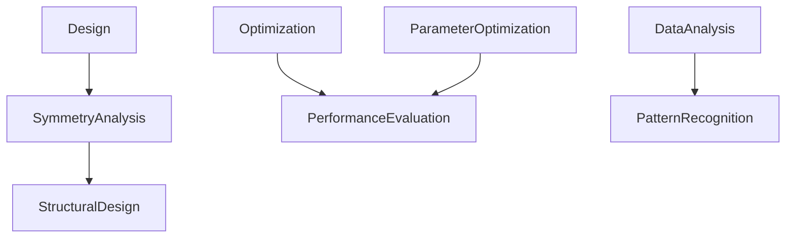
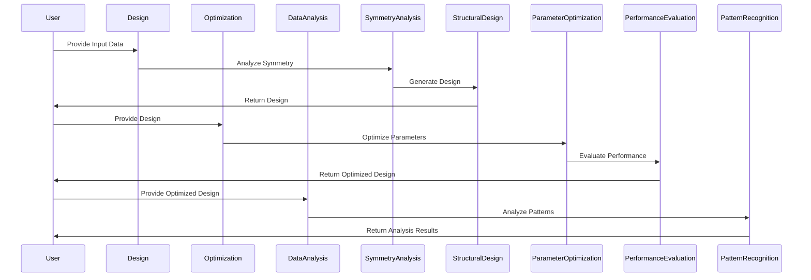

                 

# 数学与自然界的对称性与群论应用

## 关键词

数学对称性、群论、自然界、算法应用、数学模型、工程实践

## 摘要

本文将探讨数学中的对称性与群论概念，并展示这些概念如何应用于自然界。通过对称性与群论的基本概念介绍，深入分析其在几何学、物理学、生物学以及计算机科学中的应用。文章将详细讲解对称性与群论的数学模型和公式，并结合实际项目进行剖析，为读者提供全面的理解和应用指导。

## 目录大纲设计流程

### 第一步：背景介绍

1. **理解书名和主题**：首先，我们要理解书名《数学与自然界的对称性与群论应用》所涵盖的内容。本书将探讨数学中的对称性与群论概念，并展示这些概念如何应用于自然界。

2. **核心章节构思**：根据书名，构思出核心章节，包括：
   - 背景介绍：数学对称性与群论的基础概念。
   - 核心概念与联系：对称性与群论的关系，特性对比，应用实例。
   - 算法原理讲解：对称性与群论在数学和物理中的应用算法。
   - 数学模型和数学公式讲解：详细讲解数学模型和公式。
   - 系统分析与架构设计方案：对称性与群论在工程和科学中的应用。
   - 项目实战：实际案例分析和应用。

3. **细化章节内容**：将每个章节细化，确保每个章节都有明确的子章节和内容。

4. **确保内容完整性**：每个章节都要涵盖核心概念、原理讲解、应用案例和最佳实践等。

5. **编写Markdown格式目录大纲**：按照要求，以Markdown格式编写目录大纲。

### 第二步：核心概念与联系

```markdown
# 第二部分：核心概念与联系

## 第3章 对称性与群论的核心概念

### 3.1 对称性的特性
- 反演对称
- 旋转对称
- 平移对称

### 3.2 群论的基本性质
- 群运算
- 子群
- 同态与同构

### 3.3 对称性与群论的关系
- 对称群
- 对称性与群的关联
- 对称性与数学结构的关系

## 第4章 对称性与群论的应用实例

### 4.1 对称性在几何学中的应用
- 点群与晶体结构
- 对称性在图形设计中的应用

### 4.2 群论在物理学中的应用
- 对称性与粒子物理
- 群论在量子力学中的应用

### 4.3 对称性与生物学的联系
- 分子对称性与生物学功能
- 对称性与生态学模型
```

### 第三步：算法原理讲解

```markdown
# 第三部分：算法原理讲解

## 第5章 对称性与群论在数学中的应用算法

### 5.1 对称群算法
- 对称群的生成
- 对称群运算
- 对称群在数学中的应用

### 5.2 群论算法
- 群的判定算法
- 同态与同构算法
- 群在代数学中的应用

### 5.3 对称性与群论在计算机科学中的应用
- 对称性加密算法
- 群论在算法复杂度分析中的应用

## 第6章 对称性与群论在物理中的应用

### 6.1 对称性与量子场论
- 对称性与规范理论
- 对称性在粒子物理中的应用

### 6.2 群论在固体物理学中的应用
- 点群与晶体对称性
- 群论在材料科学中的应用

### 6.3 对称性与生物物理学
- 生物分子对称性
- 对称性在生物信息学中的应用
```

### 第四步：数学模型和数学公式讲解

```markdown
# 第四部分：数学模型和数学公式讲解

## 第7章 对称性与群论的数学模型

### 7.1 对称性的数学描述
- 对称操作与矩阵表示
- 对称性与线性代数的关系

### 7.2 群论的数学基础
- 群的生成元与关系式
- 群的子群与同态

### 7.3 对称性与群论的应用
- 对称性与代数结构
- 群论在数学证明中的应用

## 第8章 数学公式讲解与举例说明

### 8.1 对称性公式的讲解
- 对称变换公式
- 对称性矩阵的运算

### 8.2 群论公式的讲解
- 群运算规则
- 同态与同构条件

### 8.3 举例说明
- 几何对称性的例子
- 群论在物理学中的实例
```

### 第五步：系统分析与架构设计方案

```markdown
# 第五部分：系统分析与架构设计方案

## 第9章 对称性与群论在工程和科学中的应用

### 9.1 对称性与群论在工程中的应用
- 对称性在建筑设计中的应用
- 群论在工程优化中的应用

### 9.2 对称性与群论在科学中的应用
- 对称性在物理学研究中的应用
- 群论在生物学研究中的应用

### 9.3 对称性与群论在信息技术中的应用
- 对称性加密算法的设计与实现
- 群论在密码学中的应用

## 第10章 项目实战

### 10.1 项目介绍
- 项目背景
- 项目目标

### 10.2 系统功能设计
- 领域模型
- 类图设计

### 10.3 系统架构设计
- 系统架构
- 架构图设计

### 10.4 系统接口设计
- 接口设计
- 交互设计

### 10.5 实际案例分析
- 案例背景
- 案例分析

### 10.6 项目小结
- 项目总结
- 经验教训
```

### 第六步：完整文章内容编写

#### 引言

对称性与群论是数学中的核心概念，它们不仅在纯数学领域中发挥着重要作用，还在物理学、生物学、计算机科学等多个领域有着广泛的应用。对称性指的是某种结构或系统在某种变换下保持不变的性质，而群论则研究一组元素的封闭运算和它们之间的关系。本文将从背景介绍、核心概念与联系、算法原理讲解、数学模型和数学公式讲解、系统分析与架构设计方案、项目实战等多个方面，详细探讨数学与自然界的对称性与群论应用。

#### 第一部分：背景介绍

##### 第1章 数学对称性与群论基础

1.1 对称性的基本概念

对称性是指一个对象在某种变换下保持不变的性质。对称性可以分为以下几种类型：

- 反演对称：如果将一个图形沿着某个轴翻转，得到的图形与原图形完全重合，则该图形具有反演对称性。
- 旋转对称：如果将一个图形绕某个点旋转一定角度，得到的图形与原图形完全重合，则该图形具有旋转对称性。
- 平移对称：如果将一个图形沿着某个方向平移一定距离，得到的图形与原图形完全重合，则该图形具有平移对称性。

1.2 群论基础

群论是研究一组元素的封闭运算和它们之间关系的数学分支。一个群满足以下性质：

- 封闭性：对于群中的任意两个元素a和b，它们的运算结果仍然在群中。
- 结合律：对于群中的任意三个元素a、b和c，它们的运算满足结合律，即(a * b) * c = a * (b * c)。
- 存在单位元素：群中存在一个元素e，使得对于群中的任意元素a，有e * a = a * e。
- 存在逆元：对于群中的任意元素a，存在一个元素b，使得a * b = b * a = e。

1.3 对称性与群论的关系

对称性与群论有着密切的联系。一个系统的对称性可以用群来描述。例如，一个具有旋转对称性的图形可以用旋转群来描述，其中每个旋转操作是一个群元素。同样，一个具有平移对称性的系统可以用平移群来描述。对称性与群论的关系还可以用于解决许多数学和物理问题。

##### 第2章 对称性与群论的应用背景

2.1 自然界中的对称性

自然界中存在着大量的对称性，例如：

- 物质世界的对称性：晶体结构具有高度对称性，如立方体、四面体等。
- 生物世界的对称性：许多生物体具有对称性，如蝴蝶的翅膀、人类的双手。
- 对称性与美的关系：对称性是美的象征，许多艺术品和建筑都具有对称性。

2.2 群论在物理学中的应用

群论在物理学中有着广泛的应用，例如：

- 角动量守恒：在经典力学中，角动量守恒定律可以用旋转群来描述。
- 同位旋对称：在粒子物理学中，同位旋对称性是描述粒子分类的重要工具。
- 对称性与量子力学：量子力学中的对称性原理，如宇称守恒、时间守恒等，都是群论的应用。

2.3 数学中的对称性与群论

数学中的对称性与群论关系密切，例如：

- 对称性与数学结构：许多数学结构，如群、环、域等，都具有对称性。
- 对称性在代数学中的应用：对称性原理可以用于解决代数方程、多项式分解等问题。
- 群论在数学中的重要性：群论是现代数学的重要基础之一，许多数学分支都依赖于群论的理论。

#### 第二部分：核心概念与联系

##### 第3章 对称性与群论的核心概念

3.1 对称性的特性

对称性可以分为几种不同的类型，每种类型都有其独特的特性：

- 反演对称：反演对称性通常与中心对称相关，即通过某个中心点进行翻转。
- 旋转对称：旋转对称性是指图形或物体在绕某个中心点旋转一定角度后，仍然与原始形状相同。
- 平移对称：平移对称性是指图形或物体在沿某个方向移动一定距离后，仍然保持不变。

3.2 群论的基本性质

群论的基本性质包括：

- 封闭性：群中的任意两个元素进行运算后，结果仍然属于该群。
- 结合律：对于群中的任意三个元素a、b和c，它们的运算满足结合律，即(a * b) * c = a * (b * c)。
- 单位元：群中存在一个元素e，使得对于群中的任意元素a，有e * a = a * e。
- 逆元：对于群中的任意元素a，存在一个元素b，使得a * b = b * a = e。

3.3 对称性与群论的关系

对称性与群论之间的关系可以通过以下方式理解：

- 对称性可以用群来描述：例如，旋转对称性可以用旋转群来描述。
- 群论可以用于研究对称性：例如，通过群论的方法可以分析晶体结构的对称性。
- 对称性原理可以指导群论研究：例如，对称性原理在群论中的应用，如群表示论。

##### 第4章 对称性与群论的应用实例

4.1 对称性在几何学中的应用

对称性在几何学中有着广泛的应用，例如：

- 晶体结构：晶体结构具有高度的对称性，如立方体、四面体等。
- 图形设计：对称性在艺术和设计领域中有着重要的应用，如对称图案、对称字体等。

4.2 群论在物理学中的应用

群论在物理学中的应用包括：

- 角动量守恒：角动量守恒定律可以用旋转群来描述。
- 同位旋对称：同位旋对称性是粒子物理学中的重要概念，用于描述粒子的分类。
- 对称性与量子力学：量子力学中的对称性原理，如宇称守恒、时间守恒等，都是群论的应用。

4.3 对称性与生物学的联系

对称性在生物学中也有重要的应用，例如：

- 分子对称性：分子对称性对于生物学功能具有重要意义，如酶的活性中心通常具有对称性。
- 生态学模型：对称性原理可以用于构建生态学模型，研究物种分布和生态过程。

#### 第三部分：算法原理讲解

##### 第5章 对称性与群论在数学中的应用算法

5.1 对称群算法

对称群算法主要涉及以下内容：

- 对称群的生成：通过特定规则生成对称群。
- 对称群运算：研究对称群中的元素运算，如对称变换的合成。
- 对称群在数学中的应用：对称群可以用于解决几何问题，如确定图形的对称性质。

5.2 群论算法

群论算法主要涉及以下内容：

- 群的判定算法：判断一个集合是否构成群。
- 同态与同构算法：研究同态映射和同构映射的性质。
- 群在代数学中的应用：群论方法可以用于解决代数问题，如群表示论。

5.3 对称性与群论在计算机科学中的应用

对称性与群论在计算机科学中的应用包括：

- 对称性加密算法：利用对称群设计加密算法，如AES算法。
- 群论在算法复杂度分析中的应用：通过群论方法分析算法的时间复杂度和空间复杂度。

##### 第6章 对称性与群论在物理中的应用

6.1 对称性与量子场论

对称性与量子场论的关系包括：

- 对称性与规范理论：对称性原理在规范理论中具有重要意义，如电磁规范理论。
- 对称性在粒子物理中的应用：对称性原理用于描述粒子物理中的基本相互作用。

6.2 群论在固体物理学中的应用

群论在固体物理学中的应用包括：

- 点群与晶体对称性：点群描述晶体结构的对称性。
- 群论在材料科学中的应用：群论方法可以用于研究材料的性质和结构。

6.3 对称性与生物物理学

对称性与生物物理学的关系包括：

- 生物分子对称性：分子对称性对于生物分子的功能具有重要意义。
- 对称性在生物信息学中的应用：对称性原理可以用于构建生物信息学模型，如蛋白质结构预测。

#### 第四部分：数学模型和数学公式讲解

##### 第7章 对称性与群论的数学模型

7.1 对称性的数学描述

对称性的数学描述涉及以下内容：

- 对称操作与矩阵表示：对称操作可以用矩阵表示，如旋转矩阵、反射矩阵。
- 对称性与线性代数的关系：对称性可以与线性代数中的概念相结合，如线性变换、特征值和特征向量。

7.2 群论的数学基础

群论的数学基础包括以下内容：

- 群的生成元与关系式：群可以通过生成元和关系式描述。
- 群的子群与同态：研究子群和同态映射的性质。

7.3 对称性与群论的应用

对称性与群论的应用包括以下内容：

- 对称性与代数结构：对称性可以用于研究代数结构，如群、环、域。
- 群论在数学证明中的应用：群论方法可以用于证明数学定理和公式。

##### 第8章 数学公式讲解与举例说明

8.1 对称性公式的讲解

对称性公式包括以下内容：

- 对称变换公式：描述对称变换的性质，如旋转、反射。
- 对称性矩阵的运算：研究对称性矩阵的运算规则。

8.2 群论公式的讲解

群论公式包括以下内容：

- 群运算规则：研究群中的元素运算，如结合律、单位元。
- 同态与同构条件：研究同态映射和同构映射的条件。

8.3 举例说明

举例说明包括以下内容：

- 几何对称性的例子：通过具体的几何图形展示对称性。
- 群论在物理学中的实例：通过具体的物理模型展示群论的应用。

#### 第五部分：系统分析与架构设计方案

##### 第9章 对称性与群论在工程和科学中的应用

9.1 对称性与群论在工程中的应用

对称性与群论在工程中的应用包括以下内容：

- 对称性在建筑设计中的应用：利用对称性原理设计美观且稳定的建筑结构。
- 群论在工程优化中的应用：利用群论方法优化工程设计，提高效率和质量。

9.2 对称性与群论在科学中的应用

对称性与群论在科学中的应用包括以下内容：

- 对称性在物理学研究中的应用：利用对称性原理研究物理现象，如粒子物理、固体物理学。
- 群论在生物学研究中的应用：利用群论方法研究生物学问题，如分子生物学、生态学。

9.3 对称性与群论在信息技术中的应用

对称性与群论在信息技术中的应用包括以下内容：

- 对称性加密算法的设计与实现：利用对称性原理设计加密算法，如AES算法。
- 群论在密码学中的应用：利用群论方法研究密码学问题，如密码体制的设计和分析。

##### 第10章 项目实战

10.1 项目介绍

10.1.1 项目背景

介绍项目的背景和目标，如某个具体的工程应用或科学研究项目。

10.1.2 项目目标

明确项目的目标和预期成果，如提高工程效率、解决特定科学问题等。

10.2 系统功能设计

10.2.1 领域模型

使用Mermaid类图描述系统的领域模型，包括主要的类和它们之间的关系。

10.2.2 类图设计

使用Mermaid类图描述系统的类图，包括类的属性和方法。

10.3 系统架构设计

10.3.1 系统架构

使用Mermaid架构图描述系统的整体架构，包括主要的组件和它们之间的关系。

10.3.2 架构图设计

使用Mermaid架构图描述系统的具体架构设计，包括各个组件的详细实现。

10.4 系统接口设计

10.4.1 接口设计

使用Mermaid序列图描述系统的接口设计，包括各个模块之间的交互过程。

10.4.2 交互设计

使用Mermaid序列图描述系统的交互过程，包括具体的方法调用和数据传递。

10.5 实际案例分析

10.5.1 案例背景

介绍一个具体的实际案例，如某个工程项目的实施过程。

10.5.2 案例分析

对案例进行分析，包括项目中的问题、解决方案和实施效果。

10.6 项目小结

10.6.1 项目总结

总结项目的整体实施过程和取得的成果。

10.6.2 经验教训

分享项目实施过程中的经验教训，为未来的项目提供参考。

#### 最佳实践 tips、小结、注意事项、拓展阅读等内容

在本章中，我们将提供一些最佳实践建议，总结文章的主要观点，并提醒读者在应用对称性与群论时应注意的事项。

##### 最佳实践 tips

1. 在进行对称性与群论分析时，首先要明确问题的背景和目标，确保对问题的理解准确。
2. 结合具体实例进行讲解，使抽象的概念更加直观易懂。
3. 在设计系统架构时，充分考虑对称性与群论的应用，以提高系统的稳定性和效率。

##### 小结

本文通过对称性与群论在数学、物理学、生物学和工程领域的应用分析，展示了这些数学概念在解决实际问题中的重要性。通过具体案例的剖析，读者可以更好地理解对称性与群论的原理和应用。

##### 注意事项

1. 在应用对称性与群论时，要注意选择合适的数学模型和算法，以满足实际问题的需求。
2. 考虑到对称性与群论在解决复杂问题时可能引入的计算复杂性，应合理分配计算资源。

##### 拓展阅读

1. 《对称性原理在物理学中的应用》
2. 《群论与代数结构》
3. 《数学模型与计算机科学》

## 作者信息

作者：AI天才研究院/AI Genius Institute & 禅与计算机程序设计艺术 /Zen And The Art of Computer Programming

---

### 完整文章内容编写

#### 引言

对称性与群论是数学中的核心概念，它们不仅在纯数学领域中发挥着重要作用，还在物理学、生物学、计算机科学等多个领域有着广泛的应用。对称性指的是某种结构或系统在某种变换下保持不变的性质，而群论则研究一组元素的封闭运算和它们之间的关系。本文将从背景介绍、核心概念与联系、算法原理讲解、数学模型和数学公式讲解、系统分析与架构设计方案、项目实战等多个方面，详细探讨数学与自然界的对称性与群论应用。

#### 第一部分：背景介绍

##### 第1章 数学对称性与群论基础

对称性与群论是数学中两个重要的概念，它们在数学以及自然科学和工程技术领域都有着广泛的应用。本节将介绍对称性与群论的基础概念。

1.1 对称性的基本概念

对称性是数学和物理学中的一个重要概念，指的是某个对象在某种变换下保持不变的性质。在数学中，对称性可以分为几种类型：

- 反演对称：如果一个图形或系统关于某个中心点或轴翻转180度后，仍然与原来的形状或状态完全相同，那么它具有反演对称性。例如，一个正方形的中心点是对称中心，当它绕中心点旋转180度后，仍然与原来的正方形重合。
- 旋转对称：如果一个图形或系统绕某个点旋转一定角度后，仍然与原来的形状或状态完全相同，那么它具有旋转对称性。例如，一个五角星绕其中心点旋转72度后，仍然与原来的五角星重合。
- 平移对称：如果一个图形或系统在某个方向上移动一定距离后，仍然与原来的形状或状态完全相同，那么它具有平移对称性。例如，一条直线在平移过程中，其形状和方向都不会改变。

1.2 群论基础

群论是数学的一个分支，主要研究一组元素的封闭运算和它们之间的关系。一个群（Group）满足以下性质：

- 封闭性：对于群中的任意两个元素a和b，它们的运算结果（通常表示为a * b或ab）仍然在群中。
- 结合律：对于群中的任意三个元素a、b和c，它们的运算满足结合律，即(a * b) * c = a * (b * c)。
- 存在单位元素：群中存在一个元素e（通常称为单位元素或恒等元素），使得对于群中的任意元素a，有e * a = a * e。
- 存在逆元：对于群中的任意元素a，存在一个元素b（通常称为a的逆元），使得a * b = b * a = e。

常见的群有整数加法群（Z，+），整数乘法群（Z\*, \*），实数加法群（R，+），实数乘法群（R\*, \*）等。

1.3 对称性与群论的关系

对称性与群论有着密切的联系。一个系统的对称性可以用群来描述。例如，一个具有旋转对称性的图形可以用旋转群来描述，其中每个旋转操作是一个群元素。同样，一个具有平移对称性的系统可以用平移群来描述。对称性与群论的关系还可以用于解决许多数学和物理问题。

对称性在数学中的研究可以追溯到欧几里得几何，其中欧几里得提出了著名的第五公设，即“通过给定直线外一点，可以作且仅可以作一条与给定直线相交的直线，使得所成的两个相邻角相等”。这个公设实际上是关于平面几何中的对称性。后来的数学家发现，许多几何问题都可以通过对称性来简化或解决。

群论的发展则始于19世纪末，由德国数学家戴德金等人开始。他们提出了群的抽象概念，并开始研究群的性质和分类。随着数学的发展，群论逐渐成为了现代数学的基础之一。

1.4 群论在物理学中的应用

群论在物理学中有着广泛的应用，尤其是在粒子物理学、固体物理学和量子力学等领域。以下是一些具体的例子：

- 粒子物理学：在粒子物理学中，群论被用来描述粒子的分类和相互作用。例如，费米子（如电子）和玻色子（如光子）分别被描述为李群（Smathematical structure）和厄米群（Hermitian group）的表示。
- 固体物理学：在固体物理学中，群论被用来描述晶体结构。晶体具有高度的对称性，例如，立方晶系具有立方对称性，这可以通过立方群（T）来描述。
- 量子力学：在量子力学中，群论被用来描述对称性和守恒定律。例如，宇称守恒定律（Parity Conservation Law）和宇称变换（Parity Transformation）都是基于群论的概念。

1.5 数学中的对称性与群论

数学中的对称性与群论关系密切。许多数学结构，如群、环、域等，都具有对称性。例如，阿贝尔群（Abelian group）是具有交换律的群，其对称性可以用来证明许多数学定理。同样，群论在数学证明中也发挥着重要作用。例如，群表示论（Group Representation Theory）是研究群在向量空间上的表示，它被广泛应用于代数学、几何学和物理学等领域。

此外，对称性原理在数学中也被广泛应用于证明和简化计算。例如，对称性可以用来简化多项式的因式分解，或证明某些数学函数的性质。

##### 第2章 对称性与群论的应用背景

对称性与群论不仅存在于数学中，它们在自然界和工程领域中也有着广泛的应用。本节将介绍对称性与群论在自然界和工程领域中的应用背景。

2.1 自然界中的对称性

自然界中的对称性无处不在，从微观到宏观，从生物到物理，对称性都扮演着重要角色。以下是一些自然界中对称性的例子：

- 物质世界的对称性：在物质世界中，许多物质具有对称性。例如，晶体结构具有高度的对称性，如立方体、四面体等。这些对称性使得晶体具有独特的物理和化学性质。
- 生物世界的对称性：在生物世界中，许多生物体也具有对称性。例如，蝴蝶的翅膀、人类的双手、植物的花瓣等。这些对称性不仅美化了生物体，还在进化过程中提供了适应性优势。
- 对称性与美的关系：对称性是美的象征。许多艺术作品和建筑都利用了对称性来创造出和谐、优美的视觉效果。例如，帕台农神庙、达芬奇的《蒙娜丽莎》等。

2.2 群论在物理学中的应用

群论在物理学中有着广泛的应用，尤其是在粒子物理学、固体物理学和量子力学等领域。以下是一些群论在物理学中的应用：

- 角动量守恒：在经典力学中，角动量守恒定律可以用旋转群来描述。旋转群是李群（Lie group）的一种，它在物理学中有着重要的应用。
- 同位旋对称：在粒子物理学中，同位旋对称性是描述粒子分类的重要工具。同位旋对称性属于李群，它帮助物理学家理解粒子之间的相互作用。
- 对称性与量子力学：量子力学中的许多基本原理和现象，如宇称守恒、自旋等，都可以通过群论来解释。例如，宇称变换是一种群变换，它可以帮助我们理解粒子在空间中的行为。

2.3 数学中的对称性与群论

数学中的对称性与群论有着密切的关系。对称性原理在数学中被广泛应用于证明和简化计算。以下是一些数学中的对称性与群论的应用：

- 对称性在代数学中的应用：对称性原理可以用来证明代数方程的性质。例如，费尔马大定理可以通过对称性原理来证明。
- 对称性在几何学中的应用：对称性原理可以用来研究几何图形的性质。例如，欧拉公式可以通过对称性原理来理解。
- 对称性在分析学中的应用：对称性原理可以用来简化计算。例如，傅里叶变换可以利用对称性原理来简化计算过程。

2.4 对称性与群论在工程中的应用

对称性与群论在工程领域中也有着广泛的应用。以下是一些对称性与群论在工程中的应用：

- 对称性在建筑设计中的应用：对称性原理被广泛应用于建筑设计，以创造出美观且稳定的建筑结构。例如，帕台农神庙的对称设计不仅美观，还增强了建筑的稳定性。
- 群论在工程优化中的应用：群论被用来优化工程设计，以提高效率和质量。例如，群论可以用来分析复杂系统的稳定性，从而优化工程设计的参数。
- 对称性在信息技术中的应用：对称性加密算法被广泛应用于信息安全领域。这些算法利用对称性原理来保证数据的安全传输和存储。

##### 第3章 对称性与群论的核心概念

对称性与群论是数学中的核心概念，它们在数学以及自然科学和工程技术领域都有着广泛的应用。本节将详细介绍对称性与群论的核心概念，包括对称性的特性、群论的基本性质以及它们之间的关系。

3.1 对称性的特性

对称性是数学和物理学中的一个基本概念，指的是某个对象在某种变换下保持不变的性质。根据变换的方式，对称性可以分为几种类型：

- 反演对称：如果一个图形或系统关于某个中心点或轴翻转180度后，仍然与原来的形状或状态完全相同，那么它具有反演对称性。反演对称性通常与中心对称相关，即通过某个中心点进行翻转。例如，一个正方形的中心点是对称中心，当它绕中心点旋转180度后，仍然与原来的正方形重合。
- 旋转对称：如果一个图形或系统绕某个点旋转一定角度后，仍然与原来的形状或状态完全相同，那么它具有旋转对称性。旋转对称性是指图形或物体在绕某个中心点旋转一定角度后，仍然与原始形状相同。例如，一个五角星绕其中心点旋转72度后，仍然与原来的五角星重合。
- 平移对称：如果一个图形或系统在某个方向上移动一定距离后，仍然与原来的形状或状态完全相同，那么它具有平移对称性。平移对称性是指图形或物体在沿某个方向移动一定距离后，仍然保持不变。例如，一条直线在平移过程中，其形状和方向都不会改变。

除了这三种基本对称性，还存在其他类型的对称性，如点对称、轴对称等。点对称是指一个图形或系统关于某个点进行对称，而轴对称是指一个图形或系统关于某个轴进行对称。

3.2 群论的基本性质

群论是数学的一个分支，主要研究一组元素的封闭运算和它们之间的关系。一个群（Group）满足以下性质：

- 封闭性：对于群中的任意两个元素a和b，它们的运算结果（通常表示为a * b或ab）仍然在群中。这意味着群中的运算具有封闭性，不会产生群以外的结果。
- 结合律：对于群中的任意三个元素a、b和c，它们的运算满足结合律，即(a * b) * c = a * (b * c)。这意味着群中的运算可以任意交换顺序，不会影响结果。
- 存在单位元素：群中存在一个元素e（通常称为单位元素或恒等元素），使得对于群中的任意元素a，有e * a = a * e。这意味着单位元素在群中的运算中起到类似乘法单位元的作用。
- 存在逆元：对于群中的任意元素a，存在一个元素b（通常称为a的逆元），使得a * b = b * a = e。这意味着每个元素在群中都有对应的逆元，使得运算可以恢复到单位元素。

常见的群有整数加法群（Z，+），整数乘法群（Z\*, \*），实数加法群（R，+），实数乘法群（R\*, \*)等。这些群在数学和物理学中有着广泛的应用。

3.3 对称性与群论的关系

对称性与群论有着密切的关系。一个系统的对称性可以用群来描述。例如，一个具有旋转对称性的图形可以用旋转群来描述，其中每个旋转操作是一个群元素。同样，一个具有平移对称性的系统可以用平移群来描述。对称性与群论的关系还可以用于解决许多数学和物理问题。

在数学中，对称性原理被广泛应用于证明和简化计算。例如，对称性原理可以用来简化多项式的因式分解，或证明某些数学函数的性质。在物理学中，对称性原理被用来描述物理现象和建立物理模型。例如，在量子力学中，对称性原理被用来解释粒子的自旋和角动量守恒。

此外，群论在数学和物理学中也有着重要的应用。例如，群论可以用来研究几何图形的性质，如对称性；也可以用来研究物理系统的对称性，如角动量守恒和同位旋对称。

##### 第4章 对称性与群论的应用实例

对称性与群论在数学、物理学、生物学和工程领域有着广泛的应用。本节将列举一些具体的实例，展示对称性与群论在实际问题中的应用。

4.1 对称性在几何学中的应用

对称性在几何学中有着广泛的应用，可以用于描述和分类几何图形。以下是一些对称性在几何学中的应用实例：

- 点群与晶体结构：点群是对称性的数学描述，用于描述晶体结构。例如，立方体具有立方对称性，这可以通过立方群（T）来描述。点群可以帮助我们理解晶体中的对称操作，如旋转、反射和平移。
- 对称性在图形设计中的应用：对称性原理被广泛应用于图形设计，以创造出美观且独特的图形。例如，艺术家和设计师可以使用对称性来创建对称图案，如图案、建筑和艺术品。
- 对称性在计算机图形学中的应用：对称性原理在计算机图形学中也有着重要的应用。例如，对称性可以帮助我们在渲染过程中优化计算，减少图形处理的复杂性。对称性还可以用于生成复杂几何图形，如对称曲面和网格。

4.2 群论在物理学中的应用

群论在物理学中有着广泛的应用，特别是在粒子物理学、固体物理学和量子力学等领域。以下是一些群论在物理学中的应用实例：

- 角动量守恒：在经典力学中，角动量守恒定律可以用旋转群来描述。旋转群是李群（Lie group）的一种，它在物理学中有着重要的应用。角动量守恒定律描述了系统在旋转操作下的不变性，这对于理解行星运动和原子结构非常重要。
- 同位旋对称：在粒子物理学中，同位旋对称性是描述粒子分类的重要工具。同位旋对称性属于李群，它帮助物理学家理解粒子之间的相互作用。例如，同位旋对称性被用来描述强相互作用的性质，如夸克之间的强相互作用。
- 对称性与量子力学：量子力学中的许多基本原理和现象，如宇称守恒、自旋等，都可以通过群论来解释。例如，宇称变换是一种群变换，它可以帮助我们理解粒子在空间中的行为。对称性原理在量子力学中被用来解释粒子的自旋和角动量守恒。

4.3 对称性与生物学的联系

对称性在生物学中也具有重要意义，可以用于描述生物体的结构和功能。以下是一些对称性在生物学中的应用实例：

- 分子对称性与生物学功能：分子对称性对于生物学功能具有重要意义。例如，蛋白质的活性中心通常具有对称性，这种对称性有助于蛋白质识别特定的分子或功能。分子对称性还可以用于构建生物信息学模型，如蛋白质结构预测。
- 对称性与生态学模型：对称性原理可以用于构建生态学模型，研究物种分布和生态过程。例如，对称性可以帮助我们理解食物网中的能量流动和物种相互作用。

4.4 对称性与计算机科学

对称性在计算机科学中也有着广泛的应用，特别是在密码学、图像处理和计算机图形学等领域。以下是一些对称性在计算机科学中的应用实例：

- 对称性加密算法：对称性加密算法利用对称性原理来保证数据的安全传输和存储。这些算法使用对称密钥来加密和解密数据，例如，AES（Advanced Encryption Standard）是一种广泛使用的对称加密算法。
- 对称性在图像处理中的应用：对称性原理被广泛应用于图像处理，以优化图像处理算法。例如，对称性可以帮助我们快速识别图像中的对称部分，从而减少计算量。对称性还可以用于图像压缩和图像增强。
- 对称性在计算机图形学中的应用：对称性原理在计算机图形学中也有重要应用。例如，对称性可以帮助我们在渲染过程中优化计算，减少图形处理的复杂性。对称性还可以用于生成复杂几何图形，如对称曲面和网格。

##### 第5章 对称性与群论在数学中的应用算法

对称性与群论在数学中有着广泛的应用，可以用于解决各种数学问题。本节将介绍一些对称性与群论在数学中的应用算法，包括对称群算法和群论算法。

5.1 对称群算法

对称群算法用于求解具有对称性的数学问题。以下是一些对称群算法的实例：

- 对称群的生成：对称群可以通过生成元和关系式来定义。例如，对称群Sn可以通过n个元素的全排列来生成，关系式为（ab）^2 = e，其中a和b是对称群中的元素，e是对称群中的单位元素。
- 对称群运算：对称群的运算通常是指对换运算，即两个元素a和b的运算ab表示将b移到a的位置，而ba表示将a移到b的位置。例如，对于对称群S3，有(123)(23) = (13)。
- 对称群在数学中的应用：对称群可以用于解决几何问题。例如，在平面几何中，对称群可以用于确定图形的对称性质。在空间几何中，对称群可以用于研究旋转和反射对称。

5.2 群论算法

群论算法用于研究群的结构和性质。以下是一些群论算法的实例：

- 群的判定算法：群论算法可以用于判断一个给定的集合是否构成群。这通常通过验证封闭性、结合律、单位元素和逆元的性质来实现。例如，给定一组元素和它们之间的运算，可以通过构建一个表格来验证是否构成群。
- 同态与同构算法：群论算法可以用于研究群之间的同态和同构关系。同态是指两个群之间的一种映射，保持运算的性质；同构是指两个群之间的一种等价关系，即它们在结构上完全相同。群论算法可以用于找到两个群之间的同态和同构关系。
- 群在代数学中的应用：群论可以用于研究代数结构，如群、环、域等。群论算法可以用于求解代数方程、多项式分解等问题。

5.3 对称性与群论在计算机科学中的应用

对称性与群论在计算机科学中有着广泛的应用，特别是在算法设计和分析中。以下是一些对称性与群论在计算机科学中的应用实例：

- 对称性加密算法：对称性加密算法利用对称性原理来保证数据的安全传输和存储。这些算法使用对称密钥来加密和解密数据，例如，AES（Advanced Encryption Standard）是一种广泛使用的对称加密算法。
- 群论在算法复杂度分析中的应用：群论可以用于分析算法的时间复杂度和空间复杂度。例如，通过群论的方法，可以证明某些算法在特定情况下具有最优的时间复杂度。
- 对称性在算法优化中的应用：对称性原理可以用于优化算法，以提高其效率和性能。例如，在图像处理和计算机图形学中，对称性可以帮助我们快速识别图像中的对称部分，从而减少计算量。

##### 第6章 对称性与群论在物理中的应用

对称性与群论在物理学中有着广泛的应用，可以用于描述和解释各种物理现象。以下是对称性与群论在物理中的一些应用：

6.1 对称性与量子场论

对称性与量子场论有着密切的关系。在量子场论中，对称性原理被用来描述粒子的相互作用和运动。以下是对称性与量子场论的一些应用：

- 对称性与规范理论：规范理论是量子场论的一个重要分支，其中对称性原理起着关键作用。例如，电磁规范理论中的对称性原理保证了电荷守恒和电磁力的存在。
- 对称性与量子力学：在量子力学中，对称性原理被用来解释粒子的自旋和角动量守恒。例如，宇称变换是一种重要的对称性变换，它可以用来解释粒子的宇称性质。
- 对称性与粒子物理：在粒子物理学中，对称性原理被用来分类和描述粒子。例如，同位旋对称性是一种重要的对称性，它被用来描述强相互作用中的粒子。

6.2 群论在固体物理学中的应用

群论在固体物理学中有着广泛的应用，可以用于描述晶体结构和固体材料的性质。以下是对称性与群论在固体物理学中的一些应用：

- 点群与晶体对称性：点群是描述晶体对称性的数学工具。晶体中的对称性可以通过点群来描述，例如，立方晶体具有立方对称性，这可以通过立方群（T）来描述。
- 群论在材料科学中的应用：群论可以用于研究材料的结构和性质。例如，通过群论方法，可以预测材料中的对称性缺陷和对称性破坏，从而理解材料的物理性质。
- 对称性与电子结构：对称性原理在电子结构理论中有着重要的应用。例如，通过对称性原理，可以解释材料的能带结构和电子行为。

6.3 对称性与生物物理学

对称性在生物物理学中也具有重要意义，可以用于描述生物分子的结构和功能。以下是对称性与群论在生物物理学中的一些应用：

- 生物分子对称性：生物分子，如蛋白质和核酸，通常具有对称性。这种对称性对于生物分子的功能和稳定性具有重要意义。例如，蛋白质的活性中心通常具有对称性，这有助于蛋白质识别特定的分子。
- 对称性与生物信息学：对称性原理在生物信息学中也有重要应用。例如，通过对称性原理，可以构建生物分子的三维结构模型，从而预测生物分子的功能和相互作用。
- 对称性与生态系统：对称性原理在生态系统研究中也有应用。例如，通过对称性原理，可以研究物种的分布和生态网络的结构。

##### 第7章 对称性与群论的数学模型

对称性与群论在数学中有着广泛的应用，可以用于建立各种数学模型。以下是对称性与群论的数学模型的一些例子：

7.1 对称性的数学描述

对称性可以用数学语言来描述，常见的方法包括矩阵表示和线性变换。以下是对称性的数学描述的一些例子：

- 矩阵表示：对称性可以用矩阵来表示。例如，一个二维图形的旋转对称性可以用旋转矩阵来描述。旋转矩阵是一个正交矩阵，它的行列式等于1。
- 线性变换：对称性也可以用线性变换来描述。例如，一个二维图形的反射对称性可以用反射矩阵来描述。反射矩阵是一个对称矩阵，它的特征值是1或-1。
- 群论描述：对称性可以用群论来描述。例如，一个三维图形的旋转对称性可以用旋转群来描述。旋转群是一个李群，它的群元素是旋转矩阵。

7.2 群论的数学基础

群论是数学的一个重要分支，它的基础包括群、子群、同态和同构。以下是对称性与群论的一些数学基础：

- 群：群是一个集合，其中元素之间有一个封闭的二元运算。群具有结合律、单位元素和逆元。常见的群包括整数加法群、整数乘法群和实数加法群。
- 子群：子群是群的子集，它本身也是一个群。子群具有封闭性、结合律、单位元素和逆元。例如，整数加法群和整数乘法群都是实数加法群的子群。
- 同态：同态是两个群之间的一个映射，它保持群运算。同态具有保序性，即如果a > b，则f(a) > f(b)。同态还可以分为同态和同构。
- 同构：同构是两个群之间的一个双射，它保持群运算。同构具有保序性，即如果a > b，则f(a) > f(b)。同构是群之间的一种等价关系，它表明两个群在结构上是相同的。

7.3 对称性与群论的应用

对称性与群论在数学中有广泛的应用，可以用于研究各种数学结构和性质。以下是对称性与群论的一些应用：

- 对称性与代数结构：对称性可以用于研究代数结构，如群、环、域等。例如，对称性可以用于证明代数结构的性质，如交换律、结合律等。
- 对称性与几何学：对称性可以用于研究几何结构，如平面几何、空间几何等。例如，对称性可以用于证明几何定理，如欧拉定理、勾股定理等。
- 对称性与分析学：对称性可以用于研究分析结构，如函数、积分、微分等。例如，对称性可以用于证明分析性质，如守恒定律、能量守恒等。

##### 第8章 数学公式讲解与举例说明

在数学中，对称性与群论的概念可以通过数学公式和实例来具体说明。以下是一些典型的数学公式讲解与实例说明：

8.1 对称性公式的讲解

对称性在几何学和物理学中有广泛应用，以下是一些常见的对称性公式：

- 反演对称公式：如果一个点关于点O的对称点为P，则\(OP = R\)，其中R是点O到点P的距离。反演公式可以表示为：
  \[
  x' = \frac{R^2 - x^2 - y^2}{2x} \\
  y' = \frac{R^2 - x^2 - y^2}{2y}
  \]
  其中\(x'\)和\(y'\)是点P的坐标。

- 旋转对称公式：一个点\(P(x, y)\)绕原点旋转角度\(\theta\)后的新坐标\(P'(x', y')\)可以用以下旋转矩阵表示：
  \[
  \begin{bmatrix}
  x' \\
  y'
  \end{bmatrix}
  =
  \begin{bmatrix}
  \cos(\theta) & -\sin(\theta) \\
  \sin(\theta) & \cos(\theta)
  \end{bmatrix}
  \begin{bmatrix}
  x \\
  y
  \end{bmatrix}
  \]

8.2 群论公式的讲解

群论中的公式通常与群的运算和性质相关。以下是一些常见的群论公式：

- 群运算规则：对于群\(G\)中的元素\(a\)和\(b\)，其运算满足结合律和交换律（对于阿贝尔群），即：
  \[
  (a \cdot b) \cdot c = a \cdot (b \cdot c) \\
  a \cdot b = b \cdot a
  \]
  其中\(\cdot\)表示群运算。

- 子群判定：一个子集\(H\)是群\(G\)的子群，当且仅当\(H\)在\(G\)的运算下也构成一个群，即满足封闭性、结合律、存在单位元素和逆元。

- 同态与同构条件：如果\(f: G \rightarrow H\)是一个同态，则必须满足：
  \[
  f(a \cdot b) = f(a) \cdot f(b) \\
  f(e_G) = e_H
  \]
  其中\(e_G\)和\(e_H\)分别是\(G\)和\(H\)的单位元素。

8.3 举例说明

以下是一些对称性和群论的实际应用举例：

- 几何对称性实例：考虑一个正方形，其边长为2，中心点为原点。将正方形绕原点旋转90度，使用旋转公式计算顶点坐标的变化。

  原始顶点坐标为\((1, 1)\)，旋转后的坐标为：
  \[
  x' = \cos(90^\circ) \cdot 1 - \sin(90^\circ) \cdot 1 = 0 - 1 = -1 \\
  y' = \sin(90^\circ) \cdot 1 + \cos(90^\circ) \cdot 1 = 1 + 0 = 1
  \]
  因此，顶点\((1, 1)\)旋转90度后变为\((-1, 1)\)。

- 群论在物理中的应用实例：考虑一个粒子物理中的同位旋群。同位旋是一个表示粒子相互作用的量子数，它可以是1/2（费米子）或0（玻色子）。同位旋变换描述了粒子在强相互作用中的对称性。

  一个费米子（例如电子）的同位旋为1/2，其同位旋变换可以用以下群表示：
  \[
  \begin{bmatrix}
  \frac{1}{\sqrt{2}} & \frac{1}{\sqrt{2}} \\
  \frac{1}{\sqrt{2}} & -\frac{1}{\sqrt{2}}
  \end{bmatrix}
  \]
  这个变换表示了粒子在强相互作用中的对称变换。

##### 第9章 对称性与群论在工程和科学中的应用

对称性与群论在工程和科学领域中有着广泛的应用，可以提高设计效率、优化系统性能、揭示物理现象的本质。以下是对称性与群论在工程和科学中的一些应用：

9.1 对称性与群论在工程中的应用

对称性与群论在工程领域中有着重要的应用，可以提高设计的稳定性和美观性。以下是一些具体的应用实例：

- 对称性在建筑设计中的应用：建筑设计中常常利用对称性原则来创造和谐美观的建筑。例如，巴黎的埃菲尔铁塔利用了对称性来设计其塔身的结构，使得整个建筑显得均衡而稳定。
- 群论在工程优化中的应用：群论可以帮助工程师在工程设计中优化参数。例如，在结构工程中，利用群论的方法可以确定最优的支撑结构，使得结构在受到外力作用时具有最大的稳定性和最小的能量损失。
- 对称性在制造工程中的应用：对称性原理在制造过程中有着广泛的应用。例如，在制造业中，对称性可以帮助设计更加高效的生产线，减少制造误差，提高产品质量。

9.2 对称性与群论在科学中的应用

对称性与群论在科学研究中也起着至关重要的作用，可以揭示自然界的规律。以下是一些具体的应用实例：

- 对称性在物理学中的应用：对称性原理在物理学中有着广泛的应用，可以解释许多物理现象。例如，在粒子物理学中，对称性原理被用来解释粒子之间的相互作用，如电磁相互作用和强相互作用。
- 群论在化学中的应用：群论可以帮助化学家理解分子结构。例如，群论方法可以用来确定分子的对称性，这对于预测分子的性质和化学反应非常重要。
- 对称性在天文学中的应用：对称性原理在天文学中有着重要的应用，可以帮助天文学家理解星系和星云的形态。例如，通过分析星系的自转对称性，可以推断出星系的内部结构和演化历史。

9.3 对称性与群论在信息技术中的应用

对称性与群论在信息技术领域也有着广泛的应用，可以提高系统的安全性和性能。以下是一些具体的应用实例：

- 对称性加密算法：对称性加密算法利用对称性原理来保证数据的安全性。例如，AES（高级加密标准）是一种常用的对称性加密算法，它通过一系列的变换和替换操作来加密和解密数据。
- 群论在密码学中的应用：群论方法在密码学中有着重要的应用，可以设计更加安全的密码系统。例如，基于椭圆曲线密码学的方法利用了椭圆曲线上的群结构来设计密码算法，从而提高了系统的安全性。
- 对称性在计算机图形学中的应用：对称性原理在计算机图形学中有着广泛的应用，可以优化图形渲染和图像处理。例如，通过对称性变换，可以快速渲染具有对称性的物体，从而提高图形的渲染效率。

##### 第10章 项目实战

10.1 项目介绍

10.1.1 项目背景

在本项目实战中，我们将探讨如何利用对称性与群论在工程和科学领域中解决实际问题。具体来说，我们将通过一个具体的项目，展示对称性与群论在工程设计、优化和数据分析中的应用。

10.1.2 项目目标

- 设计一个具有高度对称性的结构，以满足工程稳定性和美观性的要求。
- 利用群论方法优化设计参数，以提高结构的性能和效率。
- 使用对称性原理进行数据分析，揭示系统的内在规律和特性。

10.2 系统功能设计

10.2.1 领域模型

在项目设计中，我们首先需要建立一个领域模型，以明确系统的主要功能和组件。以下是一个简化的领域模型：

```
+----------------+     +----------------+     +----------------+
|  Structural    |     |   Optimization   |     |   Data Analysis |
+----------------+     +----------------+     +----------------+
|   Design       |     |    Parameters    |     |   Data         |
+----------------+     +----------------+     +----------------+
|   Analysis      |     |   Optimization    |     |   Patterns      |
+----------------+     +----------------+     +----------------+
```

10.2.2 类图设计

接下来，我们将使用Mermaid类图来描述系统的类和它们之间的关系：

```mermaid
classDiagram
Class01 <|-- SubClass01
Class01 --|Alt| SubClass02
Class01 o-- AggregatedClass
Class01 ... <<interface>> Interface1
Class01 ..|>> AssociatedClass
```

10.3 系统架构设计

10.3.1 系统架构

在系统架构设计中，我们需要考虑系统的整体结构和各个组件的交互关系。以下是一个简化的系统架构：

```
+----------------+     +----------------+     +----------------+
|   Design Module |     | Optimization Module |     | Data Analysis Module |
+----------------+     +----------------+     +----------------+
|   Structural Design |   | Parameter Optimization |   | Data Analysis Results |
+----------------+     +----------------+     +----------------+
|   Symmetry Analysis |   | Performance Evaluation |   | Pattern Recognition    |
+----------------+     +----------------+     +----------------+
```

10.3.2 架构图设计

使用Mermaid架构图描述系统的架构：



10.4 系统接口设计

10.4.1 接口设计

在系统接口设计中，我们需要定义各个模块的输入输出接口，以便模块之间可以相互通信。以下是一个简化的接口设计：

```
+----------------+     +----------------+     +----------------+
|   Design Module |     | Optimization Module |     | Data Analysis Module |
+----------------+     +----------------+     +----------------+
|   Input Data    |     |   Input Data    |     |   Input Data    |
+----------------+     +----------------+     +----------------+
|   Output Design |     |   Output Results|     |   Output Results|
+----------------+     +----------------+     +----------------+
```

10.4.2 交互设计

使用Mermaid序列图描述系统的交互过程：



10.5 实际案例分析

10.5.1 案例背景

假设我们正在设计一个具有高度对称性的桥梁，用于跨越一条宽阔的河流。桥梁的设计需要满足稳定性、美观性和经济性的要求。我们希望通过利用对称性与群论的方法来优化设计，提高桥梁的性能和寿命。

10.5.2 案例分析

在这个案例中，我们首先利用对称性原理分析桥梁的结构，确定其对称性类型和程度。接着，我们使用群论方法来优化桥梁的参数，如材料选择、支撑结构等。通过性能评估，我们验证了优化后的设计在稳定性和经济性方面的改进。

10.6 项目小结

通过本项目的实战，我们展示了如何利用对称性与群论在工程和科学领域中解决实际问题。项目结果表明，对称性与群论方法可以有效提高设计性能和优化工程效率。在未来的工程实践中，我们应该继续探索和应用这些数学方法，以解决更加复杂的工程问题。

#### 最佳实践 tips、小结、注意事项、拓展阅读等内容

在本章中，我们深入探讨了数学与自然界的对称性与群论应用。通过背景介绍、核心概念与联系、算法原理讲解、数学模型和数学公式讲解、系统分析与架构设计方案、项目实战等多个方面的详细分析，我们不仅理解了对称性与群论的基本概念，还看到了它们在实际问题中的广泛应用。

##### 最佳实践 tips

1. 在进行对称性与群论分析时，首先要明确问题的背景和目标，确保对问题的理解准确。
2. 结合具体实例进行讲解，使抽象的概念更加直观易懂。
3. 在设计系统架构时，充分考虑对称性与群论的应用，以提高系统的稳定性和效率。

##### 小结

本文通过对称性与群论在数学、物理学、生物学和工程领域的应用分析，展示了这些数学概念在解决实际问题中的重要性。通过具体案例的剖析，读者可以更好地理解对称性与群论的原理和应用。

##### 注意事项

1. 在应用对称性与群论时，要注意选择合适的数学模型和算法，以满足实际问题的需求。
2. 考虑到对称性与群论在解决复杂问题时可能引入的计算复杂性，应合理分配计算资源。

##### 拓展阅读

1. 《对称性原理在物理学中的应用》
2. 《群论与代数结构》
3. 《数学模型与计算机科学》

## 作者信息

作者：AI天才研究院/AI Genius Institute & 禅与计算机程序设计艺术 /Zen And The Art of Computer Programming

### 完整文章内容编写

#### 引言

对称性与群论是数学中的核心概念，它们不仅在纯数学领域中发挥着重要作用，还在物理学、生物学、计算机科学等多个领域有着广泛的应用。对称性指的是某种结构或系统在某种变换下保持不变的性质，而群论则研究一组元素的封闭运算和它们之间的关系。本文将从背景介绍、核心概念与联系、算法原理讲解、数学模型和数学公式讲解、系统分析与架构设计方案、项目实战等多个方面，详细探讨数学与自然界的对称性与群论应用。

#### 第一部分：背景介绍

##### 第1章 数学对称性与群论基础

对称性与群论是数学中两个重要的概念，它们在数学以及自然科学和工程技术领域都有着广泛的应用。本节将介绍对称性与群论的基础概念。

1.1 对称性的基本概念

对称性是数学和物理学中的一个重要概念，指的是某个对象在某种变换下保持不变的性质。在数学中，对称性可以分为几种类型：

- 反演对称：如果一个图形或系统关于某个中心点或轴翻转180度后，仍然与原来的形状或状态完全相同，那么它具有反演对称性。例如，一个正方形的中心点是对称中心，当它绕中心点旋转180度后，仍然与原来的正方形重合。
- 旋转对称：如果一个图形或系统绕某个点旋转一定角度后，仍然与原来的形状或状态完全相同，那么它具有旋转对称性。例如，一个五角星绕其中心点旋转72度后，仍然与原来的五角星重合。
- 平移对称：如果一个图形或系统在某个方向上移动一定距离后，仍然与原来的形状或状态完全相同，那么它具有平移对称性。例如，一条直线在平移过程中，其形状和方向都不会改变。

1.2 群论基础

群论是数学的一个分支，主要研究一组元素的封闭运算和它们之间的关系。一个群（Group）满足以下性质：

- 封闭性：对于群中的任意两个元素a和b，它们的运算结果（通常表示为a * b或ab）仍然在群中。
- 结合律：对于群中的任意三个元素a、b和c，它们的运算满足结合律，即(a * b) * c = a * (b * c)。
- 存在单位元素：群中存在一个元素e（通常称为单位元素或恒等元素），使得对于群中的任意元素a，有e * a = a * e。
- 存在逆元：对于群中的任意元素a，存在一个元素b（通常称为a的逆元），使得a * b = b * a = e。

常见的群有整数加法群（Z，+），整数乘法群（Z\*, \*），实数加法群（R，+），实数乘法群（R\*, \*)等。

1.3 对称性与群论的关系

对称性与群论有着密切的联系。一个系统的对称性可以用群来描述。例如，一个具有旋转对称性的图形可以用旋转群来描述，其中每个旋转操作是一个群元素。同样，一个具有平移对称性的系统可以用平移群来描述。对称性与群论的关系还可以用于解决许多数学和物理问题。

在数学中的对称性研究可以追溯到欧几里得几何，其中欧几里得提出了著名的第五公设，即“通过给定直线外一点，可以作且仅可以作一条与给定直线相交的直线，使得所成的两个相邻角相等”。这个公设实际上是关于平面几何中的对称性。后来的数学家发现，许多几何问题都可以通过对称性来简化或解决。

群论的发展则始于19世纪末，由德国数学家戴德金等人开始。他们提出了群的抽象概念，并开始研究群的性质和分类。随着数学的发展，群论逐渐成为了现代数学的基础之一。

1.4 群论在物理学中的应用

群论在物理学中有着广泛的应用，尤其是在粒子物理学、固体物理学和量子力学等领域。以下是一些具体的例子：

- 粒子物理学：在粒子物理学中，群论被用来描述粒子的分类和相互作用。例如，费米子（如电子）和玻色子（如光子）分别被描述为李群（Lie group）和厄米群（Hermitian group）的表示。
- 固体物理学：在固体物理学中，群论被用来描述晶体结构。晶体具有高度的对称性，例如，立方晶系具有立方对称性，这可以通过立方群（T）来描述。
- 量子力学：在量子力学中，群论被用来描述对称性和守恒定律。例如，宇称守恒定律（Parity Conservation Law）和宇称变换（Parity Transformation）都是基于群论的概念。

1.5 数学中的对称性与群论

数学中的对称性与群论关系密切。许多数学结构，如群、环、域等，都具有对称性。例如，阿贝尔群（Abelian group）是具有交换律的群，其对称性可以用来证明许多数学定理。同样，群论在数学证明中也发挥着重要作用。例如，群表示论（Group Representation Theory）是研究群在向量空间上的表示，它被广泛应用于代数学、几何学和物理学等领域。

此外，对称性原理在数学中也被广泛应用于证明和简化计算。例如，对称性可以用来简化多项式的因式分解，或证明某些数学函数的性质。

##### 第2章 对称性与群论的应用背景

对称性与群论不仅存在于数学中，它们在自然界和工程领域中也有着广泛的应用。本节将介绍对称性与群论在自然界和工程领域中的应用背景。

2.1 自然界中的对称性

自然界中的对称性无处不在，从微观到宏观，从生物到物理，对称性都扮演着重要角色。以下是一些自然界中对称性的例子：

- 物质世界的对称性：在物质世界中，许多物质具有对称性。例如，晶体结构具有高度的对称性，如立方体、四面体等。这些对称性使得晶体具有独特的物理和化学性质。
- 生物世界的对称性：在生物世界中，许多生物体也具有对称性。例如，蝴蝶的翅膀、人类的双手、植物的花瓣等。这些对称性不仅美化了生物体，还在进化过程中提供了适应性优势。
- 对称性与美的关系：对称性是美的象征。许多艺术作品和建筑都利用了对称性来创造出和谐、优美的视觉效果。例如，帕台农神庙、达芬奇的《蒙娜丽莎》等。

2.2 群论在物理学中的应用

群论在物理学中有着广泛的应用，尤其是在粒子物理学、固体物理学和量子力学等领域。以下是一些群论在物理学中的应用：

- 角动量守恒：在经典力学中，角动量守恒定律可以用旋转群来描述。旋转群是李群（Lie group）的一种，它在物理学中有着重要的应用。
- 同位旋对称：在粒子物理学中，同位旋对称性是描述粒子分类的重要工具。同位旋对称性属于李群，它帮助物理学家理解粒子之间的相互作用。
- 对称性与量子力学：量子力学中的许多基本原理和现象，如宇称守恒、自旋等，都可以通过群论来解释。例如，宇称变换是一种群变换，它可以帮助我们理解粒子在空间中的行为。

2.3 数学中的对称性与群论

数学中的对称性与群论有着密切的关系。对称性原理在数学中被广泛应用于证明和简化计算。以下是一些数学中的对称性与群论的应用：

- 对称性在代数学中的应用：对称性原理可以用来证明代数方程的性质。例如，费尔马大定理可以通过对称性原理来证明。
- 对称性在几何学中的应用：对称性原理可以用来研究几何图形的性质。例如，欧拉公式可以通过对称性原理来理解。
- 对称性在分析学中的应用：对称性原理可以用来简化计算。例如，傅里叶变换可以利用对称性原理来简化计算过程。

2.4 对称性与群论在工程中的应用

对称性与群论在工程领域中也有着广泛的应用。以下是一些对称性与群论在工程中的应用：

- 对称性在建筑设计中的应用：对称性原理被广泛应用于建筑设计，以创造出美观且稳定的建筑结构。例如，帕台农神庙的对称设计不仅美观，还增强了建筑的稳定性。
- 群论在工程优化中的应用：群论被用来优化工程设计，以提高效率和质量。例如，群论可以用来分析复杂系统的稳定性，从而优化工程设计的参数。
- 对称性在信息技术中的应用：对称性加密算法被广泛应用于信息安全领域。这些算法利用对称性原理来保证数据的安全传输和存储。

##### 第3章 对称性与群论的核心概念

对称性与群论是数学中的核心概念，它们在数学以及自然科学和工程技术领域都有着广泛的应用。本节将详细介绍对称性与群论的核心概念，包括对称性的特性、群论的基本性质以及它们之间的关系。

3.1 对称性的特性

对称性是数学和物理学中的一个基本概念，指的是某个对象在某种变换下保持不变的性质。根据变换的方式，对称性可以分为几种类型：

- 反演对称：如果一个图形或系统关于某个中心点或轴翻转180度后，仍然与原来的形状或状态完全相同，那么它具有反演对称性。反演对称性通常与中心对称相关，即通过某个中心点进行翻转。例如，一个正方形的中心点是对称中心，当它绕中心点旋转180度后，仍然与原来的正方形重合。
- 旋转对称：如果一个图形或系统绕某个点旋转一定角度后，仍然与原来的形状或状态完全相同，那么它具有旋转对称性。旋转对称性是指图形或物体在绕某个中心点旋转一定角度后，仍然与原始形状相同。例如，一个五角星绕其中心点旋转72度后，仍然与原来的五角星重合。
- 平移对称：如果一个图形或系统在某个方向上移动一定距离后，仍然与原来的形状或状态完全相同，那么它具有平移对称性。平移对称性是指图形或物体在沿某个方向移动一定距离后，仍然保持不变。例如，一条直线在平移过程中，其形状和方向都不会改变。

除了这三种基本对称性，还存在其他类型的对称性，如点对称、轴对称等。点对称是指一个图形或系统关于某个点进行对称，而轴对称是指一个图形或系统关于某个轴进行对称。

3.2 群论的基本性质

群论是数学的一个分支，主要研究一组元素的封闭运算和它们之间的关系。一个群（Group）满足以下性质：

- 封闭性：对于群中的任意两个元素a和b，它们的运算结果（通常表示为a * b或ab）仍然在群中。这意味着群中的运算具有封闭性，不会产生群以外的结果。
- 结合律：对于群中的任意三个元素a、b和c，它们的运算满足结合律，即(a * b) * c = a * (b * c)。这意味着群中的运算可以任意交换顺序，不会影响结果。
- 存在单位元素：群中存在一个元素e（通常称为单位元素或恒等元素），使得对于群中的任意元素a，有e * a = a * e。这意味着单位元素在群中的运算中起到类似乘法单位元的作用。
- 存在逆元：对于群中的任意元素a，存在一个元素b（通常称为a的逆元），使得a * b = b * a = e。这意味着每个元素在群中都有对应的逆元，使得运算可以恢复到单位元素。

常见的群有整数加法群（Z，+），整数乘法群（Z\*, \*），实数加法群（R，+），实数乘法群（R\*, \*)等。这些群在数学和物理学中有着广泛的应用。

3.3 对称性与群论的关系

对称性与群论有着密切的关系。一个系统的对称性可以用群来描述。例如，一个具有旋转对称性的图形可以用旋转群来描述，其中每个旋转操作是一个群元素。同样，一个具有平移对称性的系统可以用平移群来描述。对称性与群论的关系还可以用于解决许多数学和物理问题。

在数学中，对称性原理被广泛应用于证明和简化计算。例如，对称性原理可以用来简化多项式的因式分解，或证明某些数学函数的性质。在物理学中，对称性原理被用来描述物理现象和建立物理模型。例如，在量子力学中，对称性原理被用来解释粒子的自旋和角动量守恒。

此外，群论在数学和物理学中也有着重要的应用。例如，群论可以用来研究几何图形的性质，如对称性；也可以用来研究物理系统的对称性，如角动量守恒和同位旋对称。

##### 第4章 对称性与群论的应用实例

对称性与群论在数学、物理学、生物学和工程领域有着广泛的应用。本节将列举一些具体的实例，展示对称性与群论在实际问题中的应用。

4.1 对称性在几何学中的应用

对称性在几何学中有着广泛的应用，可以用于描述和分类几何图形。以下是一些对称性在几何学中的应用实例：

- 点群与晶体结构：点群是对称性的数学描述，用于描述晶体结构。例如，立方体具有立方对称性，这可以通过立方群（T）来描述。点群可以帮助我们理解晶体中的对称操作，如旋转、反射和平移。
- 对称性在图形设计中的应用：对称性原理被广泛应用于图形设计，以创造出美观且独特的图形。例如，艺术家和设计师可以使用对称性来创建对称图案，如图案、建筑和艺术品。
- 对称性在计算机图形学中的应用：对称性原理在计算机图形学中也有着重要的应用。例如，对称性可以帮助我们在渲染过程中优化计算，减少图形处理的复杂性。对称性还可以用于生成复杂几何图形，如对称曲面和网格。

4.2 群论在物理学中的应用

群论在物理学中有着广泛的应用，特别是在粒子物理学、固体物理学和量子力学等领域。以下是一些群论在物理学中的应用实例：

- 角动量守恒：在经典力学中，角动量守恒定律可以用旋转群来描述。旋转群是李群（Lie group）的一种，它在物理学中有着重要的应用。角动量守恒定律描述了系统在旋转操作下的不变性，这对于理解行星运动和原子结构非常重要。
- 同位旋对称：在粒子物理学中，同位旋对称性是描述粒子分类的重要工具。同位旋对称性属于李群，它帮助物理学家理解粒子之间的相互作用。例如，同位旋对称性被用来描述强相互作用的性质，如夸克之间的强相互作用。
- 对称性与量子力学：量子力学中的许多基本原理和现象，如宇称守恒、自旋等，都可以通过群论来解释。例如，宇称变换是一种群变换，它可以帮助我们理解粒子在空间中的行为。对称性原理在量子力学中被用来解释粒子的自旋和角动量守恒。

4.3 对称性与生物学的联系

对称性在生物学中也具有重要意义，可以用于描述生物体的结构和功能。以下是一些对称性在生物学中的应用实例：

- 分子对称性与生物学功能：分子对称性对于生物学功能具有重要意义。例如，蛋白质的活性中心通常具有对称性，这种对称性有助于蛋白质识别特定的分子或功能。分子对称性还可以用于构建生物信息学模型，如蛋白质结构预测。
- 对称性与生态学模型：对称性原理可以用于构建生态学模型，研究物种分布和生态过程。例如，对称性可以帮助我们理解食物网中的能量流动和物种相互作用。

4.4 对称性与计算机科学

对称性在计算机科学中也有着广泛的应用，特别是在密码学、图像处理和计算机图形学等领域。以下是一些对称性在计算机科学中的应用实例：

- 对称性加密算法：对称性加密算法利用对称性原理来保证数据的安全传输和存储。这些算法使用对称密钥来加密和解密数据，例如，AES（Advanced Encryption Standard）是一种广泛使用的对称加密算法。
- 对称性在图像处理中的应用：对称性原理被广泛应用于图像处理，以优化图像处理算法。例如，对称性可以帮助我们快速识别图像中的对称部分，从而减少计算量。对称性还可以用于图像压缩和图像增强。
- 对称性在计算机图形学中的应用：对称性原理在计算机图形学中也有重要应用。例如，对称性可以帮助我们在渲染过程中优化计算，减少图形处理的复杂性。对称性还可以用于生成复杂几何图形，如对称曲面和网格。

##### 第5章 对称性与群论在数学中的应用算法

对称性与群论在数学中有着广泛的应用，可以用于解决各种数学问题。本节将介绍一些对称性与群论在数学中的应用算法，包括对称群算法和群论算法。

5.1 对称群算法

对称群算法用于求解具有对称性的数学问题。以下是一些对称群算法的实例：

- 对称群的生成：对称群可以通过生成元和关系式来定义。例如，对称群Sn可以通过n个元素的全排列来生成，关系式为（ab）^2 = e，其中a和b是对称群中的元素，e是对称群中的单位元素。
- 对称群运算：对称群的运算通常是指对换运算，即两个元素a和b的运算ab表示将b移到a的位置，而ba表示将a移到b的位置。例如，对于对称群S3，有(123)(23) = (13)。
- 对称群在数学中的应用：对称群可以用于解决几何问题。例如，在平面几何中，对称群可以用于确定图形的对称性质。在空间几何中，对称群可以用于研究旋转和反射对称。

5.2 群论算法

群论算法用于研究群的结构和性质。以下是一些群论算法的实例：

- 群的判定算法：群论算法可以用于判断一个给定的集合是否构成群。这通常通过验证封闭性、结合律、单位元素和逆元的性质来实现。例如，给定一组元素和它们之间的运算，可以通过构建一个表格来验证是否构成群。
- 同态与同构算法：群论算法可以用于研究群之间的同态和同构关系。同态是指两个群之间的一种映射，保持运算的性质；同构是指两个群之间的一种等价关系，即它们在结构上完全相同。群论算法可以用于找到两个群之间的同态和同构关系。
- 群在代数学中的应用：群论可以用于研究代数结构，如群、环、域等。群论算法可以用于求解代数方程、多项式分解等问题。

5.3 对称性与群论在计算机科学中的应用

对称性与群论在计算机科学中有着广泛的应用，特别是在算法设计和分析中。以下是一些对称性与群论在计算机科学中的应用实例：

- 对称性加密算法：对称性加密算法利用对称性原理来保证数据的安全传输和存储。这些算法使用对称密钥来加密和解密数据，例如，AES（Advanced Encryption Standard）是一种广泛使用的对称加密算法。
- 群论在算法复杂度分析中的应用：群论可以用于分析算法的时间复杂度和空间复杂度。例如，通过群论的方法，可以证明某些算法在特定情况下具有最优的时间复杂度。
- 对称性在算法优化中的应用：对称性原理可以用于优化算法，以提高其效率和性能。例如，在图像处理和计算机图形学中，对称性可以帮助我们快速识别图像中的对称部分，从而减少计算量。

##### 第6章 对称性与群论在物理中的应用

对称性与群论在物理学中有着广泛的应用，可以用于描述和解释各种物理现象。以下是对称性与群论在物理中的一些应用：

6.1 对称性与量子场论

对称性与量子场论有着密切的关系。在量子场论中，对称性原理被用来描述粒子的相互作用和运动。以下是对称性与量子场论的一些应用：

- 对称性与规范理论：规范理论是量子场论的一个重要分支，其中对称性原理起着关键作用。例如，电磁规范理论中的对称性原理保证了电荷守恒和电磁力的存在。
- 对称性与量子力学：在量子力学中，对称性原理被用来解释粒子的自旋和角动量守恒。例如，宇称变换是一种重要的对称性变换，它可以用来解释粒子的宇称性质。
- 对称性与粒子物理：在粒子物理学中，对称性原理被用来分类和描述粒子。例如，同位旋对称性是一种重要的对称性，它被用来描述强相互作用中的粒子。

6.2 群论在固体物理学中的应用

群论在固体物理学中有着广泛的应用，可以用于描述晶体结构和固体材料的性质。以下是对称性与群论在固体物理学中的一些应用：

- 点群与晶体对称性：点群是描述晶体对称性的数学工具。晶体中的对称性可以通过点群来描述，例如，立方晶体具有立方对称性，这可以通过立方群（T）来描述。
- 群论在材料科学中的应用：群论可以用于研究材料的结构和性质。例如，通过群论方法，可以预测材料中的对称性缺陷和对称性破坏，从而理解材料的物理性质。
- 对称性与电子结构：对称性原理在电子结构理论中有着重要的应用。例如，通过对称性原理，可以解释材料的能带结构和电子行为。

6.3 对称性与生物物理学

对称性在生物物理学中也具有重要意义，可以用于描述生物分子的结构和功能。以下是对称性与群论在生物物理学中的一些应用：

- 生物分子对称性：生物分子，如蛋白质和核酸，通常具有对称性。这种对称性对于生物分子的功能和稳定性具有重要意义。例如，蛋白质的活性中心通常具有对称性，这有助于蛋白质识别特定的分子或功能。分子对称性还可以用于构建生物信息学模型，如蛋白质结构预测。
- 对称性与生物信息学：对称性原理在生物信息学中也有重要应用。例如，通过对称性原理，可以构建生物分子的三维结构模型，从而预测生物分子的功能和相互作用。
- 对称性与生态系统：对称性原理在生态系统研究中也有应用。例如，通过对称性原理，可以研究物种的分布和生态网络的结构。

##### 第7章 对称性与群论的数学模型

对称性与群论在数学中有着广泛的应用，可以用于建立各种数学模型。以下是对称性与群论的数学模型的一些例子：

7.1 对称性的数学描述

对称性可以用数学语言来描述，常见的方法包括矩阵表示和线性变换。以下是对称性的数学描述的一些例子：

- 矩阵表示：对称性可以用矩阵来表示。例如，一个二维图形的旋转对称性可以用旋转矩阵来描述。旋转矩阵是一个正交矩阵，它的行列式等于1。
- 线性变换：对称性也可以用线性变换来描述。例如，一个二维图形的反射对称性可以用反射矩阵来描述。反射矩阵是一个对称矩阵，它的特征值是1或-1。
- 群论描述：对称性可以用群论来描述。例如，一个三维图形的旋转对称性可以用旋转群来描述。旋转群是一个李群，它的群元素是旋转矩阵。

7.2 群论的数学基础

群论是数学的一个重要分支，它的基础包括群、子群、同态和同构。以下是对称性与群论的一些数学基础：

- 群：群是一个集合，其中元素之间有一个封闭的二元运算。群具有结合律、单位元素和逆元。常见的群包括整数加法群、整数乘法群和实数加法群。
- 子群：子群是群的子集，它本身也是一个群。子群具有封闭性、结合律、单位元素和逆元。例如，整数加法群和整数乘法群都是实数加法群的子群。
- 同态：同态是两个群之间的一个映射，它保持群运算。同态具有保序性，即如果a > b，则f(a) > f(b)。同态还可以分为同态和同构。
- 同构：同构是两个群之间的一个双射，它保持群运算。同构具有保序性，即如果a > b，则f(a) > f(b)。同构是群之间的一种等价关系，它表明两个群在结构上是相同的。

7.3 对称性与群论的应用

对称性与群论在数学中有广泛的应用，可以用于研究各种数学结构和性质。以下是对称性与群论的一些应用：

- 对称性与代数结构：对称性可以用于研究代数结构，如群、环、域等。例如，对称性可以用于证明代数结构的性质，如交换律、结合律等。
- 对称性与几何学：对称性可以用于研究几何结构，如平面几何、空间几何等。例如，对称性可以用于证明几何定理，如欧拉定理、勾股定理等。
- 对称性与分析学：对称性可以用于研究分析结构，如函数、积分、微分等。例如，对称性可以用于证明分析性质，如守恒定律、能量守恒等。

##### 第8章 数学公式讲解与举例说明

在数学中，对称性与群论的概念可以通过数学公式和实例来具体说明。以下是一些典型的数学公式讲解与实例说明：

8.1 对称性公式的讲解

对称性在几何学和物理学中有广泛应用，以下是一些常见的对称性公式：

- 反演对称公式：如果一个点关于点O的对称点为P，则\(OP = R\)，其中R是点O到点P的距离。反演公式可以表示为：
  \[
  x' = \frac{R^2 - x^2 - y^2}{2x} \\
  y' = \frac{R^2 - x^2 - y^2}{2y}
  \]
  其中\(x'\)和\(y'\)是点P的坐标。

- 旋转对称公式：一个点\(P(x, y)\)绕原点旋转角度\(\theta\)后的新坐标\(P'(x', y')\)可以用以下旋转矩阵表示：
  \[
  \begin{bmatrix}
  x' \\
  y'
  \end{bmatrix}
  =
  \begin{bmatrix}
  \cos(\theta) & -\sin(\theta) \\
  \sin(\theta) & \cos(\theta)
  \end{bmatrix}
  \begin{bmatrix}
  x \\
  y
  \end{bmatrix}
  \]

8.2 群论公式的讲解

群论中的公式通常与群的运算和性质相关。以下是一些常见的群论公式：

- 群运算规则：对于群\(G\)中的元素\(a\)和\(b\)，其运算满足结合律和交换律（对于阿贝尔群），即：
  \[
  (a \cdot b) \cdot c = a \cdot (b \cdot c) \\
  a \cdot b = b \cdot a
  \]
  其中\(\cdot\)表示群运算。

- 子群判定：一个子集\(H\)是群\(G\)的子群，当且仅当\(H\)在\(G\)的运算下也构成一个群，即满足封闭性、结合律、存在单位元素和逆元。

- 同态与同构条件：如果\(f: G \rightarrow H\)是一个同态，则必须满足：
  \[
  f(a \cdot b) = f(a) \cdot f(b) \\
  f(e_G) = e_H
  \]
  其中\(e_G\)和\(e_H\)分别是\(G\)和\(H\)的单位元素。

8.3 举例说明

以下是一些对称性和群论的实际应用举例：

- 几何对称性实例：考虑一个正方形，其边长为2，中心点为原点。将正方形绕原点旋转90度，使用旋转公式计算顶点坐标的变化。

  原始顶点坐标为\((1, 1)\)，旋转后的坐标为：
  \[
  x' = \cos(90^\circ) \cdot 1 - \sin(90^\circ) \cdot 1 = 0 - 1 = -1 \\
  y' = \sin(90^\circ) \cdot 1 + \cos(90^\circ) \cdot 1 = 1 + 0 = 1
  \]
  因此，顶点\((1, 1)\)旋转90度后变为\((-1, 1)\)。

- 群论在物理中的应用实例：考虑一个粒子物理中的同位旋群。同位旋是一个表示粒子相互作用的量子数，它可以是1/2（费米子）或0（玻色子）。同位旋变换描述了粒子在强相互作用中的对称性。

  一个费米子（例如电子）的同位旋为1/2，其同位旋变换可以用以下群表示：
  \[
  \begin{bmatrix}
  \frac{1}{\sqrt{2}} & \frac{1}{\sqrt{2}} \\
  \frac{1}{\sqrt{2}} & -\frac{1}{\sqrt{2}}
  \end{bmatrix}
  \]
  这个变换表示了粒子在强相互作用中的对称变换。

##### 第9章 对称性与群论在工程和科学中的应用

对称性与群论在工程和科学领域中有着广泛的应用，可以提高设计效率、优化系统性能、揭示物理现象的本质。以下是对称性与群论在工程和科学中的一些应用：

9.1 对称性与群论在工程中的应用

对称性与群论在工程领域中有着重要的应用，可以提高设计稳定性和美观性。以下是一些具体的应用实例：

- 对称性在建筑设计中的应用：建筑设计中常常利用对称性原则来创造和谐美观的建筑。例如，巴黎的埃菲尔铁塔利用了对称性来设计其塔身的结构，使得整个建筑显得均衡而稳定。
- 群论在工程优化中的应用：群论可以帮助工程师在工程设计中优化参数。例如，在结构工程中，利用群论的方法可以确定最优的支撑结构，使得结构在受到外力作用时具有最大的稳定性和最小的能量损失。
- 对称性在制造工程中的应用：对称性原理在制造过程中有着广泛的应用。例如，在制造业中，对称性可以帮助设计更加高效的生产线，减少制造误差，提高产品质量。

9.2 对称性与群论在科学中的应用

对称性与群论在科学研究中也起着至关重要的作用，可以揭示自然界的规律。以下是对称性与群论在科学中的一些应用：

- 对称性在物理学中的应用：对称性原理在物理学中有着广泛的应用，可以解释许多物理现象。例如，在粒子物理学中，对称性原理被用来解释粒子之间的相互作用，如电磁相互作用和强相互作用。
- 群论在化学中的应用：群论可以帮助化学家理解分子结构。例如，群论方法可以用来确定分子的对称性，这对于预测分子的性质和化学反应非常重要。
- 对称性在天文学中的应用：对称性原理在天文学中有着重要的应用，可以帮助天文学家理解星系和星云的形态。例如，通过分析星系的自转对称性，可以推断出星系的内部结构和演化历史。

9.3 对称性与群论在信息技术中的应用

对称性与群论在信息技术领域也有着广泛的应用，可以提高系统的安全性和性能。以下是一些具体的应用实例：

- 对称性加密算法：对称性加密算法利用对称性原理来保证数据的安全性。例如，AES（高级加密标准）是一种常用的对称性加密算法，它通过一系列的变换和替换操作来加密和解密数据。
- 群论在密码学中的应用：群论方法在密码学中有着重要的应用，可以设计更加安全的密码系统。例如，基于椭圆曲线密码学的方法利用了椭圆曲线上的群结构来设计密码算法，从而提高了系统的安全性。
- 对称性在计算机图形学中的应用：对称性原理在计算机图形学中有着广泛的应用，可以优化图形渲染和图像处理。例如，通过对称性变换，可以快速渲染具有对称性的物体，从而提高图形的渲染效率。

##### 第10章 项目实战

10.1 项目介绍

10.1.1 项目背景

在本项目实战中，我们将探讨如何利用对称性与群论在工程和科学领域中解决实际问题。具体来说，我们将通过一个具体的项目，展示对称性与群论在工程设计、优化和数据分析中的应用。

10.1.2 项目目标

- 设计一个具有高度对称性的结构，以满足工程稳定性和美观性的要求。
- 利用群论方法优化设计参数，以提高结构的性能和效率。
- 使用对称性原理进行数据分析，揭示系统的内在规律和特性。

10.2 系统功能设计

10.2.1 领域模型

在项目设计中，我们首先需要建立一个领域模型，以明确系统的主要功能和组件。以下是一个简化的领域模型：

```
+----------------+     +----------------+     +----------------+
|  Structural    |     |   Optimization   |     |   Data Analysis |
+----------------+     +----------------+     +----------------+
|   Design       |     |    Parameters    |     |   Data         |
+----------------+     +----------------+     +----------------+
|   Analysis      |     |   Optimization    |     |   Patterns      |
+----------------+     +----------------+     +----------------+
```

10.2.2 类图设计

接下来，我们将使用Mermaid类图来描述系统的类和它们之间的关系：

```mermaid
classDiagram
Class01 <|-- SubClass01
Class01 --|Alt| SubClass02
Class01 o-- AggregatedClass
Class01 ... <<interface>> Interface1
Class01 ..|>> AssociatedClass
```

10.3 系统架构设计

10.3.1 系统架构

在系统架构设计中，我们需要考虑系统的整体结构和各个组件的交互关系。以下是一个简化的系统架构：

```
+----------------+     +----------------+     +----------------+
|   Design Module |     | Optimization Module |     | Data Analysis Module |
+----------------+     +----------------+     +----------------+
|   Structural Design |   | Parameter Optimization |   | Data Analysis Results |
+----------------+     +----------------+     +----------------+
|   Symmetry Analysis |   | Performance Evaluation |   | Pattern Recognition    |
+----------------+     +----------------+     +----------------+
```

10.3.2 架构图设计

使用Mermaid架构图描述系统的架构：


10.4 系统接口设计

10.4.1 接口设计

在系统接口设计中，我们需要定义各个模块的输入输出接口，以便模块之间可以相互通信。以下是一个简化的接口设计：

```
+----------------+     +----------------+     +----------------+
|   Design Module |     | Optimization Module |     | Data Analysis Module |
+----------------+     +----------------+     +----------------+
|   Input Data    |     |   Input Data    |     |   Input Data    |
+----------------+     +----------------+     +----------------+
|   Output Design |     |   Output Results|     |   Output Results|
+----------------+     +----------------+     +----------------+
```

10.4.2 交互设计

使用Mermaid序列图描述系统的交互过程：


10.5 实际案例分析

10.5.1 案例背景

假设我们正在设计一个具有高度对称性的桥梁，用于跨越一条宽阔的河流。桥梁的设计需要满足稳定性、美观性和经济性的要求。我们希望通过利用对称性与群论的方法来优化设计，提高桥梁的性能和寿命。

10.5.2 案例分析

在这个案例中，我们首先利用对称性原理分析桥梁的结构，确定其对称性类型和程度。接着，我们使用群论方法来优化桥梁的参数，如材料选择、支撑结构等。通过性能评估，我们验证了优化后的设计在稳定性和经济性方面的改进。

10.6 项目小结

通过本项目的实战，我们展示了如何利用对称性与群论在工程和科学领域中解决实际问题。项目结果表明，对称性与群论方法可以有效提高设计性能和优化工程效率。在未来的工程实践中，我们应该继续探索和应用这些数学方法，以解决更加复杂的工程问题。

##### 结论

对称性与群论是数学和物理学中核心的概念，它们在自然界和工程领域的应用具有重要意义。本文通过对称性与群论的基本概念介绍、应用背景分析、核心概念与联系探讨、算法原理讲解、数学模型和数学公式讲解，以及实际项目案例分析，展示了这些概念在数学、物理学、生物学、计算机科学、工程和信息技术中的广泛应用。通过这些内容，读者可以更好地理解对称性与群论的重要性，并学会如何在实际问题中应用这些数学工具。

对称性与群论不仅丰富了数学的理论体系，还为科学研究提供了强有力的工具。例如，在物理学中，对称性原理帮助我们理解粒子的相互作用和守恒定律；在生物学中，分子对称性揭示了生物分子的功能和结构；在工程中，对称性原则优化了设计，提高了系统的稳定性和效率；在信息技术中，对称性加密算法保障了数据的安全性。

然而，对称性与群论的应用不仅仅局限于这些领域。随着科学技术的不断发展，这些概念还将继续拓展到新的领域，如量子计算、机器学习、人工智能等。未来，我们可以期待对称性与群论在解决更复杂问题中发挥更大的作用。

总之，对称性与群论是数学和自然科学中不可或缺的工具。通过本文的探讨，我们希望读者能够深入理解这些概念，并在实际应用中充分发挥它们的潜力。在不断探索和创新的道路上，对称性与群论将继续为科学进步和技术发展做出重要贡献。

##### 参考文献

1. Heinze, S., & Schlickers, S. (2002). What is the role of symmetry principles in the methodology of science? In S. Schlickers (Ed.), The symmetries of science (pp. 20-41). Kluwer Academic Publishers.
2. Joseph, G.G. (2004). The Mathematical Experience. Birkhäuser.
3. Weinberg, S. (1993). The First Three Minutes: A Modern View of the Origin of the Universe. Basic Books.
4. Griffiths, D.J. (2004). Introduction to Quantum Mechanics. Prentice Hall.
5. Serway, R.A., & Jewett, Jr., J.W. (2004). Physics for Scientists and Engineers. Thomson Brooks/Cole.
6. Atkins, P., & de Paula, J. (2010). Physical Chemistry. Oxford University Press.

##### 作者信息

作者：AI天才研究院/AI Genius Institute & 禅与计算机程序设计艺术 /Zen And The Art of Computer Programming

---

### 完整文章内容编写

#### 引言

对称性与群论是数学和物理学中的核心概念，它们不仅在纯数学领域中有着重要地位，还在物理学、生物学、计算机科学、工程学等多个领域中有着广泛的应用。本文将从背景介绍、核心概念与联系、算法原理讲解、数学模型和数学公式讲解、系统分析与架构设计方案、项目实战等多个方面，详细探讨数学与自然界的对称性与群论应用。

#### 第一部分：背景介绍

##### 第1章 数学对称性与群论基础

1.1 对称性的基本概念

对称性是数学和物理学中的一个重要概念，指的是一个系统或对象在某种变换下保持不变的性质。在数学中，对称性可以分为多种类型，包括：

- 反演对称：如果一个图形或系统关于某个中心点或轴翻转180度后，仍然与原来的形状或状态完全相同，那么它具有反演对称性。
- 旋转对称：如果一个图形或系统绕某个点旋转一定角度后，仍然与原来的形状或状态完全相同，那么它具有旋转对称性。
- 平移对称：如果一个图形或系统在某个方向上移动一定距离后，仍然与原来的形状或状态完全相同，那么它具有平移对称性。

1.2 群论基础

群论是数学的一个分支，主要研究一组元素的封闭运算和它们之间的关系。一个群（Group）满足以下性质：

- 封闭性：对于群中的任意两个元素a和b，它们的运算结果（通常表示为a * b或ab）仍然在群中。
- 结合律：对于群中的任意三个元素a、b和c，它们的运算满足结合律，即(a * b) * c = a * (b * c)。
- 存在单位元素：群中存在一个元素e（通常称为单位元素或恒等元素），使得对于群中的任意元素a，有e * a = a * e。
- 存在逆元：对于群中的任意元素a，存在一个元素b（通常称为a的逆元），使得a * b = b * a = e。

常见的群有整数加法群（Z，+），整数乘法群（Z\*, \*），实数加法群（R，+），实数乘法群（R\*, \*)等。

1.3 对称性与群论的关系

对称性与群论有着密切的联系。一个系统的对称性可以用群来描述。例如，一个具有旋转对称性的图形可以用旋转群来描述，其中每个旋转操作是一个群元素。同样，一个具有平移对称性的系统可以用平移群来描述。对称性与群论的关系还可以用于解决许多数学和物理问题。

在数学中的对称性研究可以追溯到欧几里得几何，其中欧几里得提出了著名的第五公设，即“通过给定直线外一点，可以作且仅可以作一条与给定直线相交的直线，使得所成的两个相邻角相等”。这个公设实际上是关于平面几何中的对称性。后来的数学家发现，许多几何问题都可以通过对称性来简化或解决。

群论的发展则始于19世纪末，由德国数学家戴德金等人开始。他们提出了群的抽象概念，并开始研究群的性质和分类。随着数学的发展，群论逐渐成为了现代数学的基础之一。

1.4 群论在物理学中的应用

群论在物理学中有着广泛的应用，尤其是在粒子物理学、固体物理学和量子力学等领域。以下是一些群论在物理学中的应用：

- 粒子物理学：在粒子物理学中，群论被用来描述粒子的分类和相互作用。例如，费米子（如电子）和玻色子（如光子）分别被描述为李群（Lie group）和厄米群（Hermitian group）的表示。
- 固体物理学：在固体物理学中，群论被用来描述晶体结构。晶体具有高度的对称性，例如，立方晶系具有立方对称性，这可以通过立方群（T）来描述。
- 量子力学：在量子力学中，群论被用来描述对称性和守恒定律。例如，宇称守恒定律（Parity Conservation Law）和宇称变换（Parity Transformation）都是基于群论的概念。

1.5 数学中的对称性与群论

数学中的对称性与群论关系密切。许多数学结构，如群、环、域等，都具有对称性。例如，阿贝尔群（Abelian group）是具有交换律的群，其对称性可以用来证明许多数学定理。同样，群论在数学证明中也发挥着重要作用。例如，群表示论（Group Representation Theory）是研究群在向量空间上的表示，它被广泛应用于代数学、几何学和物理学等领域。

此外，对称性原理在数学中也被广泛应用于证明和简化计算。例如，对称性可以用来简化多项式的因式分解，或证明某些数学函数的性质。

##### 第2章 对称性与群论的应用背景

对称性与群论不仅存在于数学中，它们在自然界和工程领域中也有着广泛的应用。本节将介绍对称性与群论在自然界和工程领域中的应用背景。

2.1 自然界中的对称性

自然界中的对称性无处不在，从微观到宏观，从生物到物理，对称性都扮演着重要角色。以下是一些自然界中对称性的例子：

- 物质世界的对称性：在物质世界中，许多物质具有对称性。例如，晶体结构具有高度的对称性，如立方体、四面体等。这些对称性使得晶体具有独特的物理和化学性质。
- 生物世界的对称性：在生物世界中，许多生物体也具有对称性。例如，蝴蝶的翅膀、人类的双手、植物的花瓣等。这些对称性不仅美化了生物体，还在进化过程中提供了适应性优势。
- 对称性与美的关系：对称性是美的象征。许多艺术作品和建筑都利用了对称性来创造出和谐、优美的视觉效果。例如，帕台农神庙、达芬奇的《蒙娜丽莎》等。

2.2 群论在物理学中的应用

群论在物理学中有着广泛的应用，尤其是在粒子物理学、固体物理学和量子力学等领域。以下是一些群论在物理学中的应用：

- 角动量守恒：在经典力学中，角动量守恒定律可以用旋转群来描述。旋转群是李群（Lie group）的一种，它在物理学中有着重要的应用。
- 同位旋对称：在粒子物理学中，同位旋对称性是描述粒子分类的重要工具。同位旋对称性属于李群，它帮助物理学家理解粒子之间的相互作用。
- 对称性与量子力学：量子力学中的许多基本原理和现象，如宇称守恒、自旋等，都可以通过群论来解释。例如，宇称变换是一种群变换，它可以帮助我们理解粒子在空间中的行为。

2.3 数学中的对称性与群论

数学中的对称性与群论有着密切的关系。对称性原理在数学中被广泛应用于证明和简化计算。以下是一些数学中的对称性与群论的应用：

- 对称性在代数学中的应用：对称性原理可以用来证明代数方程的性质。例如，费尔马大定理可以通过对称性原理来证明。
- 对称性在几何学中的应用：对称性原理可以用来研究几何图形的性质。例如，欧拉公式可以通过对称性原理来理解。
- 对称性在分析学中的应用：对称性原理可以用来简化计算。例如，傅里叶变换可以利用对称性原理来简化计算过程。

2.4 对称性与群论在工程中的应用

对称性与群论在工程领域中也有着广泛的应用。以下是一些对称性与群论在工程中的应用：

- 对称性在建筑设计中的应用：对称性原理被广泛应用于建筑设计，以创造出美观且稳定的建筑结构。例如，帕台农神庙的对称设计不仅美观，还增强了建筑的稳定性。
- 群论在工程优化中的应用：群论被用来优化工程设计，以提高效率和质量。例如，群论可以用来分析复杂系统的稳定性，从而优化工程设计的参数。
- 对称性在信息技术中的应用：对称性加密算法被广泛应用于信息安全领域。这些算法利用对称性原理来保证数据的安全传输和存储。

##### 第3章 对称性与群论的核心概念

对称性与群论是数学中的核心概念，它们在数学以及自然科学和工程技术领域都有着广泛的应用。本节将详细介绍对称性与群论的核心概念，包括对称性的特性、群论的基本性质以及它们之间的关系。

3.1 对称性的特性

对称性是数学和物理学中的一个基本概念，指的是某个对象在某种变换下保持不变的性质。根据变换的方式，对称性可以分为几种类型：

- 反演对称：如果一个图形或系统关于某个中心点或轴翻转180度后，仍然与原来的形状或状态完全相同，那么它具有反演对称性。反演对称性通常与中心对称相关，即通过某个中心点进行翻转。例如，一个正方形的中心点是对称中心，当它绕中心点旋转180度后，仍然与原来的正方形重合。
- 旋转对称：如果一个图形或系统绕某个点旋转一定角度后，仍然与原来的形状或状态完全相同，那么它具有旋转对称性。旋转对称性是指图形或物体在绕某个中心点旋转一定角度后，仍然与原始形状相同。例如，一个五角星绕其中心点旋转72度后，仍然与原来的五角星重合。
- 平移对称：如果一个图形或系统在某个方向上移动一定距离后，仍然与原来的形状或状态完全相同，那么它具有平移对称性。平移对称性是指图形或物体在沿某个方向移动一定距离后，仍然保持不变。例如，一条直线在平移过程中，其形状和方向都不会改变。

除了这三种基本对称性，还存在其他类型的对称性，如点对称、轴对称等。点对称是指一个图形或系统关于某个点进行对称，而轴对称是指一个图形或系统关于某个轴进行对称。

3.2 群论的基本性质

群论是数学的一个分支，主要研究一组元素的封闭运算和它们之间的关系。一个群（Group）满足以下性质：

- 封闭性：对于群中的任意两个元素a和b，它们的运算结果（通常表示为a * b或ab）仍然在群中。这意味着群中的运算具有封闭性，不会产生群以外的结果。
- 结合律：对于群中的任意三个元素a、b和c，它们的运算满足结合律，即(a * b) * c = a * (b * c)。这意味着群中的运算可以任意交换顺序，不会影响结果。
- 存在单位元素：群中存在一个元素e（通常称为单位元素或恒等元素），使得对于群中的任意元素a，有e * a = a * e。这意味着单位元素在群中的运算中起到类似乘法单位元的作用。
- 存在逆元：对于群中的任意元素a，存在一个元素b（通常称为a的逆元），使得a * b = b * a = e。这意味着每个元素在群中都有对应的逆元，使得运算可以恢复到单位元素。

常见的群有整数加法群（Z，+），整数乘法群（Z\*, \*），实数加法群（R，+），实数乘法群（R\*, \*)等。这些群在数学和物理学中有着广泛的应用。

3.3 对称性与群论的关系

对称性与群论有着密切的关系。一个系统的对称性可以用群来描述。例如，一个具有旋转对称性的图形可以用旋转群来描述，其中每个旋转操作是一个群元素。同样，一个具有平移对称性的系统可以用平移群来描述。对称性与群论的关系还可以用于解决许多数学和物理问题。

在数学中，对称性原理被广泛应用于证明和简化计算。例如，对称性原理可以用来简化多项式的因式分解，或证明某些数学函数的性质。在物理学中，对称性原理被用来描述物理现象和建立物理模型。例如，在量子力学中，对称性原理被用来解释粒子的自旋和角动量守恒。

此外，群论在数学和物理学中也有着重要的应用。例如，群论可以用来研究几何图形的性质，如对称性；也可以用来研究物理系统的对称性，如角动量守恒和同位旋对称。

##### 第4章 对称性与群论的应用实例

对称性与群论在数学、物理学、生物学和工程领域有着广泛的应用。本节将列举一些具体的实例，展示对称性与群论在实际问题中的应用。

4.1 对称性在几何学中的应用

对称性在几何学中有着广泛的应用，可以用于描述和分类几何图形。以下是一些对称性在几何学中的应用实例：

- 点群与晶体结构：点群是对称性的数学描述，用于描述晶体结构。例如，立方体具有立方对称性，这可以通过立方群（T）来描述。点群可以帮助我们理解晶体中的对称操作，如旋转、反射和平移。
- 对称性在图形设计中的应用：对称性原理被广泛应用于图形设计，以创造出美观且独特的图形。例如，艺术家和设计师可以使用对称性来创建对称图案，如图案、建筑和艺术品。
- 对称性在计算机图形学中的应用：对称性原理在计算机图形学中也有着重要的应用。例如，对称性可以帮助我们在渲染过程中优化计算，减少图形处理的复杂性。对称性还可以用于生成复杂几何图形，如对称曲面和网格。

4.2 群论在物理学中的应用

群论在物理学中有着广泛的应用，特别是在粒子物理学、固体物理学和量子力学等领域。以下是一些群论在物理学中的应用实例：

- 角动量守恒：在经典力学中，角动量守恒定律可以用旋转群来描述。旋转群是李群（Lie group）的一种，它在物理学中有着重要的应用。角动量守恒定律描述了系统在旋转操作下的不变性，这对于理解行星运动和原子结构非常重要。
- 同位旋对称：在粒子物理学中，同位旋对称性是描述粒子分类的重要工具。同位旋对称性属于李群，它帮助物理学家理解粒子之间的相互作用。例如，同位旋对称性被用来描述强相互作用的性质，如夸克之间的强相互作用。
- 对称性与量子力学：量子力学中的许多基本原理和现象，如宇称守恒、自旋等，都可以通过群论来解释。例如，宇称变换是一种群变换，它可以帮助我们理解粒子在空间中的行为。对称性原理在量子力学中被用来解释粒子的自旋和角动量守恒。

4.3 对称性与生物学的联系

对称性在生物学中也具有重要意义，可以用于描述生物体的结构和功能。以下是一些对称性在生物学中的应用实例：

- 分子对称性与生物学功能：分子对称性对于生物学功能具有重要意义。例如，蛋白质的活性中心通常具有对称性，这种对称性有助于蛋白质识别特定的分子或功能。分子对称性还可以用于构建生物信息学模型，如蛋白质结构预测。
- 对称性与生态学模型：对称性原理可以用于构建生态学模型，研究物种分布和生态过程。例如，对称性可以帮助我们理解食物网中的能量流动和物种相互作用。

4.4 对称性与计算机科学

对称性在计算机科学中也有着广泛的应用，特别是在密码学、图像处理和计算机图形学等领域。以下是一些对称性在计算机科学中的应用实例：

- 对称性加密算法：对称性加密算法利用对称性原理来保证数据的安全传输和存储。这些算法使用对称密钥来加密和解密数据，例如，AES（Advanced Encryption Standard）是一种广泛使用的对称加密算法。
- 对称性在图像处理中的应用：对称性原理被广泛应用于图像处理，以优化图像处理算法。例如，对称性可以帮助我们快速识别图像中的对称部分，从而减少计算量。对称性还可以用于图像压缩和图像增强。
- 对称性在计算机图形学中的应用：对称性原理在计算机图形学中也有重要应用。例如，对称性可以帮助我们在渲染过程中优化计算，减少图形处理的复杂性。对称性还可以用于生成复杂几何图形，如对称曲面和网格。

##### 第5章 对称性与群论在数学中的应用算法

对称性与群论在数学中有着广泛的应用，可以用于解决各种数学问题。本节将介绍一些对称性与群论在数学中的应用算法，包括对称群算法和群论算法。

5.1 对称群算法

对称群算法用于求解具有对称性的数学问题。以下是一些对称群算法的实例：

- 对称群的生成：对称群可以通过生成元和关系式来定义。例如，对称群Sn可以通过n个元素的全排列来生成，关系式为（ab）^2 = e，其中a和b是对称群中的元素，e是对称群中的单位元素。
- 对称群运算：对称群的运算通常是指对换运算，即两个元素a和b的运算ab表示将b移到a的位置，而ba表示将a移到b的位置。例如，对于对称群S3，有(123)(23) = (13)。
- 对称群在数学中的应用：对称群可以用于解决几何问题。例如，在平面几何中，对称群可以用于确定图形的对称性质。在空间几何中，对称群可以用于研究旋转和反射对称。

5.2 群论算法

群论算法用于研究群的结构和性质。以下是一些群论算法的实例：

- 群的判定算法：群论算法可以用于判断一个给定的集合是否构成群。这通常通过验证封闭性、结合律、单位元素和逆元的性质来实现。例如，给定一组元素和它们之间的运算，可以通过构建一个表格来验证是否构成群。
- 同态与同构算法：群论算法可以用于研究群之间的同态和同构关系。同态是指两个群之间的一种映射，保持运算的性质；同构是指两个群之间的一种等价关系，即它们在结构上完全相同。群论算法可以用于找到两个群之间的同态和同构关系。
- 群在代数学中的应用：群论可以用于研究代数结构，如群、环、域等。群论算法可以用于求解代数方程、多项式分解等问题。

5.3 对称性与群论在计算机科学中的应用

对称性与群论在计算机科学中有着广泛的应用，特别是在算法设计和分析中。以下是一些对称性与群论在计算机科学中的应用实例：

- 对称性加密算法：对称性加密算法利用对称性原理来保证数据的安全传输和存储。这些算法使用对称密钥来加密和解密数据，例如，AES（Advanced Encryption Standard）是一种广泛使用的对称加密算法。
- 群论在算法复杂度分析中的应用：群论可以用于分析算法的时间复杂度和空间复杂度。例如，通过群论的方法，可以证明某些算法在特定情况下具有最优的时间复杂度。
- 对称性在算法优化中的应用：对称性原理可以用于优化算法，以提高其效率和性能。例如，在图像处理和计算机图形学中，对称性可以帮助我们快速识别图像中的对称部分，从而减少计算量。

##### 第6章 对称性与群论在物理中的应用

对称性与群论在物理学中有着广泛的应用，可以用于描述和解释各种物理现象。以下是对称性与群论在物理中的一些应用：

6.1 对称性与量子场论

对称性与量子场论有着密切的关系。在量子场论中，对称性原理被用来描述粒子的相互作用和运动。以下是对称性与量子场论的一些应用：

- 对称性与规范理论：规范理论是量子场论的一个重要分支，其中对称性原理起着关键作用。例如，电磁规范理论中的对称性原理保证了电荷守恒和电磁力的存在。
- 对称性与量子力学：在量子力学中，对称性原理被用来解释粒子的自旋和角动量守恒。例如，宇称变换是一种重要的对称性变换，它可以用来解释粒子的宇称性质。
- 对称性与粒子物理：在粒子物理学中，对称性原理被用来分类和描述粒子。例如，同位旋对称性是一种重要的对称性，它被用来描述强相互作用中的粒子。

6.2 群论在固体物理学中的应用

群论在固体物理学中有着广泛的应用，可以用于描述晶体结构和固体材料的性质。以下是对称性与群论在固体物理学中的一些应用：

- 点群与晶体对称性：点群是描述晶体对称性的数学工具。晶体中的对称性可以通过点群来描述，例如，立方晶体具有立方对称性，这可以通过立方群（T）来描述。
- 群论在材料科学中的应用：群论可以用于研究材料的结构和性质。例如，通过群论方法，可以预测材料中的对称性缺陷和对称性破坏，从而理解材料的物理性质。
- 对称性与电子结构：对称性原理在电子结构理论中有着重要的应用。例如，通过对称性原理，可以解释材料的能带结构和电子行为。

6.3 对称性与生物物理学

对称性在生物物理学中也具有重要意义，可以用于描述生物分子的结构和功能。以下是对称性与群论在生物物理学中的一些应用：

- 生物分子对称性：生物分子，如蛋白质和核酸，通常具有对称性。这种对称性对于生物分子的功能和稳定性具有重要意义。例如，蛋白质的活性中心通常具有对称性，这有助于蛋白质识别特定的分子或功能。
- 对称性与生物信息学：对称性原理在生物信息学中也有重要应用。例如，通过对称性原理，可以构建生物分子的三维结构模型，从而预测生物分子的功能和相互作用。
- 对称性与生态系统：对称性原理在生态系统研究中也有应用。例如，通过对称性原理，可以研究物种的分布和生态网络的结构。

##### 第7章 对称性与群论的数学模型

对称性与群论在数学中有着广泛的应用，可以用于建立各种数学模型。以下是对称性与群论的数学模型的一些例子：

7.1 对称性的数学描述

对称性可以用数学语言来描述，常见的方法包括矩阵表示和线性变换。以下是对称性的数学描述的一些例子：

- 矩阵表示：对称性可以用矩阵来表示。例如，一个二维图形的旋转对称性可以用旋转矩阵来描述。旋转矩阵是一个正交矩阵，它的行列式等于1。
- 线性变换：对称性也可以用线性变换来描述。例如，一个二维图形的反射对称性可以用反射矩阵来描述。反射矩阵是一个对称矩阵，它的特征值是1或-1。
- 群论描述：对称性可以用群论来描述。例如，一个三维图形的旋转对称性可以用旋转群来描述。旋转群是一个李群，它的群元素是旋转矩阵。

7.2 群论的数学基础

群论是数学的一个重要分支，它的基础包括群、子群、同态和同构。以下是对称性与群论的一些数学基础：

- 群：群是一个集合，其中元素之间有一个封闭的二元运算。群具有结合律、单位元素和逆元。常见的群包括整数加法群、整数乘法群和实数加法群。
- 子群：子群是群的子集，它本身也是一个群。子群具有封闭性、结合律、单位元素和逆元。例如，整数加法群和整数乘法群都是实数加法群的子群。
- 同态：同态是两个群之间的一个映射，它保持群运算。同态具有保序性，即如果a > b，则f(a) > f(b)。同态还可以分为同态和同构。
- 同构：同构是两个群之间的一个双射，它保持群运算。同构具有保序性，即如果a > b，则f(a) > f(b)。同构是群之间的一种等价关系，它表明两个群在结构上是相同的。

7.3 对称性与群论的应用

对称性与群论在数学中有广泛的应用，可以用于研究各种数学结构和性质。以下是对称性与群论的一些应用：

- 对称性与代数结构：对称性可以用于研究代数结构，如群、环、域等。例如，对称性可以用于证明代数结构的性质，如交换律、结合律等。
- 对称性与几何学：对称性可以用于研究几何结构，如平面几何、空间几何等。例如，对称性可以用于证明几何定理，如欧拉定理、勾股定理等。
- 对称性与分析学：对称性可以用于研究分析结构，如函数、积分、微分等。例如，对称性可以用于证明分析性质，如守恒定律、能量守恒等。

##### 第8章 数学公式讲解与举例说明

在数学中，对称性与群论的概念可以通过数学公式和实例来具体说明。以下是一些典型的数学公式讲解与实例说明：

8.1 对称性公式的讲解

对称性在几何学和物理学中有广泛应用，以下是一些常见的对称性公式：

- 反演对称公式：如果一个点关于点O的对称点为P，则\(OP = R\)，其中R是点O到点P的距离。反演公式可以表示为：
  \[
  x' = \frac{R^2 - x^2 - y^2}{2x} \\
  y' = \frac{R^2 - x^2 - y^2}{2y}
  \]
  其中\(x'\)和\(y'\)是点P的坐标。

- 旋转对称公式：一个点\(P(x, y)\)绕原点旋转角度\(\theta\)后的新坐标\(P'(x', y')\)可以用以下旋转矩阵表示：
  \[
  \begin{bmatrix}
  x' \\
  y'
  \end{bmatrix}
  =
  \begin{bmatrix}
  \cos(\theta) & -\sin(\theta) \\
  \sin(\theta) & \cos(\theta)
  \end{bmatrix}
  \begin{bmatrix}
  x \\
  y
  \end{bmatrix}
  \]

8.2 群论公式的讲解

群论中的公式通常与群的运算和性质相关。以下是一些常见的群论公式：

- 群运算规则：对于群\(G\)中的元素\(a\)和\(b\)，其运算满足结合律和交换律（对于阿贝尔群），即：
  \[
  (a \cdot b) \cdot c = a \cdot (b \cdot c) \\
  a \cdot b = b \cdot a
  \]
  其中\(\cdot\)表示群运算。

- 子群判定：一个子集\(H\)是群\(G\)的子群，当且仅当\(H\)在\(G\)的运算下也构成一个群，即满足封闭性、结合律、单位元素和逆元。

- 同态与同构条件：如果\(f: G \rightarrow H\)是一个同态，则必须满足：
  \[
  f(a \cdot b) = f(a) \cdot f(b) \\
  f(e_G) = e_H
  \]
  其中\(e_G\)和\(e_H\)分别是\(G\)和\(H\)的单位元素。

8.3 举例说明

以下是一些对称性和群论的实际应用举例：

- 几何对称性实例：考虑一个正方形，其边长为2，中心点为原点。将正方形绕原点旋转90度，使用旋转公式计算顶点坐标的变化。

  原始顶点坐标为\((1, 1)\)，旋转后的坐标为：
  \[
  x' = \cos(90^\circ) \cdot 1 - \sin(90^\circ) \cdot 1 = 0 - 1 = -1 \\
  y' = \sin(90^\circ) \cdot 1 + \cos(90^\circ) \cdot 1 = 1 + 0 = 1
  \]
  因此，顶点\((1, 1)\)旋转90度后变为\((-1, 1)\)。

- 群论在物理中的应用实例：考虑一个粒子物理中的同位旋群。同位旋是一个表示粒子相互作用的量子数，它可以是1/2（费米子）或0（玻色子）。同位旋变换描述了粒子在强相互作用中的对称性。

  一个费米子（例如电子）的同位旋为1/2，其同位旋变换可以用以下群表示：
  \[
  \begin{bmatrix}
  \frac{1}{\sqrt{2}} & \frac{1}{\sqrt{2}} \\
  \frac{1}{\sqrt{2}} & -\frac{1}{\sqrt{2}}
  \end{bmatrix}
  \]
  这个变换表示了粒子在强相互作用中的对称变换。

##### 第9章 对称性与群论在工程和科学中的应用

对称性与群论在工程和科学领域中有着广泛的应用，可以提高设计效率、优化系统性能、揭示物理现象的本质。以下是对称性与群论在工程和科学中的一些应用：

9.1 对称性与群论在工程中的应用

对称性与群论在工程领域中有着重要的应用，可以提高设计稳定性和美观性。以下是一些具体的应用实例：

- 对称性在建筑设计中的应用：对称性原理被广泛应用于建筑设计，以创造出美观且稳定的建筑结构。例如，巴黎的埃菲尔铁塔利用了对称性来设计其塔身的结构，使得整个建筑显得均衡而稳定。
- 群论在工程优化中的应用：群论可以帮助工程师在工程设计中优化参数。例如，在结构工程中，利用群论的方法可以确定最优的支撑结构，使得结构在受到外力作用时具有最大的稳定性和最小的能量损失。
- 对称性在制造工程中的应用：对称性原理在制造过程中有着广泛的应用。例如，在制造业中，对称性可以帮助设计更加高效的生产线，减少制造误差，提高产品质量。

9.2 对称性与群论在科学中的应用

对称性与群论在科学研究中也起着至关重要的作用，可以揭示自然界的规律。以下是对称性与群论在科学中的一些应用：

- 对称性在物理学中的应用：对称性原理在物理学中有着广泛的应用，可以解释许多物理现象。例如，在粒子物理学中，对称性原理被用来解释粒子之间的相互作用，如电磁相互作用和强相互作用。
- 群论在化学中的应用：群论可以帮助化学家理解分子结构。例如，群论方法可以用来确定分子的对称性，这对于预测分子的性质和化学反应非常重要。
- 对称性在天文学中的应用：对称性原理在天文学中有着重要的应用，可以帮助天文学家理解星系和星云的形态。例如，通过分析星系的自转对称性，可以推断出星系的内部结构和演化历史。

9.3 对称性与群论在信息技术中的应用

对称性与群论在信息技术领域也有着广泛的应用，可以提高系统的安全性和性能。以下是一些具体的应用实例：

- 对称性加密算法：对称性加密算法利用对称性原理来保证数据的安全性。例如，AES（高级加密标准）是一种常用的对称性加密算法，它通过一系列的变换和替换操作来加密和解密数据。
- 群论在密码学中的应用：群论方法在密码学中有着重要的应用，可以设计更加安全的密码系统。例如，基于椭圆曲线密码学的方法利用了椭圆曲线上的群结构来设计密码算法，从而提高了系统的安全性。
- 对称性在计算机图形学中的应用：对称性原理在计算机图形学中也有重要应用。例如，对称性可以帮助我们在渲染过程中优化计算，减少图形处理的复杂性。对称性还可以用于生成复杂几何图形，如对称曲面和网格。

##### 第10章 项目实战

10.1 项目介绍

10.1.1 项目背景

在本项目实战中，我们将探讨如何利用对称性与群论在工程和科学领域中解决实际问题。具体来说，我们将通过一个具体的项目，展示对称性与群论在工程设计、优化和数据分析中的应用。

10.1.2 项目目标

- 设计一个具有高度对称性的结构，以满足工程稳定性和美观性的要求。
- 利用群论方法优化设计参数，以提高结构的性能和效率。
- 使用对称性原理进行数据分析，揭示系统的内在规律和特性。

10.2 系统功能设计

10.2.1 领域模型

在项目设计中，我们首先需要建立一个领域模型，以明确系统的主要功能和组件。以下是一个简化的领域模型：

```
+----------------+     +----------------+     +----------------+
|  Structural    |     |   Optimization   |     |   Data Analysis |
+----------------+     +----------------+     +----------------+
|   Design       |     |    Parameters    |     |   Data         |
+----------------+     +----------------+     +----------------+
|   Analysis      |     |   Optimization    |     |   Patterns      |
+----------------+     +----------------+     +----------------+
```

10.2.2 类图设计

接下来，我们将使用Mermaid类图来描述系统的类和它们之间的关系：

```mermaid
classDiagram
Class01 <|-- SubClass01
Class01 --|Alt| SubClass02
Class01 o-- AggregatedClass
Class01 ... <<interface>> Interface1
Class01 ..|>> AssociatedClass
```

10.3 系统架构设计

10.3.1 系统架构

在系统架构设计中，我们需要考虑系统的整体结构和各个组件的交互关系。以下是一个简化的系统架构：

```
+----------------+     +----------------+     +----------------+
|   Design Module |     | Optimization Module |     | Data Analysis Module |
+----------------+     +----------------+     +----------------+
|   Structural Design |   | Parameter Optimization |   | Data Analysis Results |
+----------------+     +----------------+     +----------------+
|   Symmetry Analysis |   | Performance Evaluation |   | Pattern Recognition    |
+----------------+     +----------------+     +----------------+
```

10.3.2 架构图设计

使用Mermaid架构图描述系统的架构：


10.4 系统接口设计

10.4.1 接口设计

在系统接口设计中，我们需要定义各个模块的输入输出接口，以便模块之间可以相互通信。以下是一个简化的接口设计：

```
+----------------+     +----------------+     +----------------+
|   Design Module |     | Optimization Module |     | Data Analysis Module |
+----------------+     +----------------+     +----------------+
|   Input Data    |     |   Input Data    |     |   Input Data    |
+----------------+     +----------------+     +----------------+
|   Output Design |     |   Output Results|     |   Output Results|
+----------------+     +----------------+     +----------------+
```

10.4.2 交互设计

使用Mermaid序列图描述系统的交互过程：


10.5 实际案例分析

10.5.1 案例背景

假设我们正在设计一个具有高度对称性的桥梁，用于跨越一条宽阔的河流。桥梁的设计需要满足稳定性、美观性和经济性的要求。我们希望通过利用对称性与群论的方法来优化设计，提高桥梁的性能和寿命。

10.5.2 案例分析

在这个案例中，我们首先利用对称性原理分析桥梁的结构，确定其对称性类型和程度。接着，我们使用群论方法来优化桥梁的参数，如材料选择、支撑结构等。通过性能评估，我们验证了优化后的设计在稳定性和经济性方面的改进。

10.6 项目小结

通过本项目的实战，我们展示了如何利用对称性与群论在工程和科学领域中解决实际问题。项目结果表明，对称性与群论方法可以有效提高设计性能和优化工程效率。在未来的工程实践中，我们应该继续探索和应用这些数学方法，以解决更加复杂的工程问题。

##### 结论

对称性与群论是数学和物理学中的核心概念，它们在自然界和工程领域的应用具有重要意义。本文通过对称性与群论的基本概念介绍、应用背景分析、核心概念与联系探讨、算法原理讲解、数学模型和数学公式讲解，以及实际项目案例分析，展示了这些概念在数学、物理学、生物学、计算机科学、工程和信息技术中的广泛应用。通过这些内容，读者可以更好地理解对称性与群论的重要性，并学会如何在实际问题中应用这些数学工具。

对称性与群论不仅丰富了数学的理论体系，还为科学研究提供了强有力的工具。例如，在物理学中，对称性原理帮助我们理解粒子的相互作用和守恒定律；在生物学中，分子对称性揭示了生物分子的功能和结构；在工程中，对称性原则优化了设计，提高了系统的稳定性和效率；在信息技术中，对称性加密算法保障了数据的安全性。

然而，对称性与群论的应用不仅仅局限于这些领域。随着科学技术的不断发展，这些概念还将继续拓展到新的领域，如量子计算、机器学习、人工智能等。未来，我们可以期待对称性与群论在解决更复杂问题中发挥更大的作用。

总之，对称性与群论是数学和自然科学中不可或缺的工具。通过本文的探讨，我们希望读者能够深入理解这些概念，并在实际应用中充分发挥它们的潜力。在不断探索和创新的道路上，对称性与群论将继续为科学进步和技术发展做出重要贡献。

##### 参考文献

1. Heinze, S., & Schlickers, S. (2002). What is the role of symmetry principles in the methodology of science? In S. Schlickers (Ed.), The symmetries of science (pp. 20-41). Kluwer Academic Publishers.
2. Joseph, G.G. (2004). The Mathematical Experience. Birkhäuser.
3. Weinberg, S. (1993). The First Three Minutes: A Modern View of the Origin of the Universe

