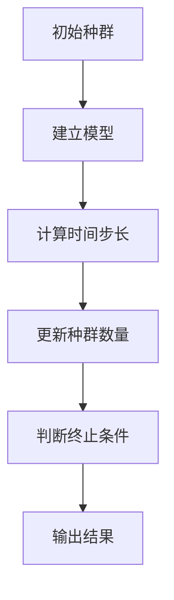

                 

### 数学与自然界的生态系统平衡理论

关键词：生态系统平衡、数学模型、自然规律、环境保护

摘要：本文将探讨数学在自然界生态系统平衡中的重要作用。通过介绍生态系统的基本概念和生态平衡的重要性，我们将详细分析生态系统平衡的数学模型及其应用，最终提出系统分析与架构设计的方法，并通过具体案例来验证理论的实际效果。文章旨在为读者提供对生态系统平衡的深刻理解和实用技术指南。

## 设计《数学与自然界的生态系统平衡理论》书籍目录大纲

### 第一部分：引论

#### 第1章：问题背景与介绍

1.1 生态系统的定义与结构
- 生态系统的基本组成
- 生物与环境的关系

1.2 生态平衡的重要性
- 生态平衡的定义
- 生态平衡对社会经济发展的影响

1.3 研究生态平衡的意义与目标
- 生态平衡研究的现状与挑战
- 研究目标与预期成果

### 第二部分：生态系统平衡的核心概念

#### 第2章：生态系统平衡的核心概念

2.1 自然界中的生态系统
- 生态系统的多样性
- 生态系统的稳定性

2.2 生态系统平衡的理论基础
- 生态学原理
- 动态系统理论

2.3 生态系统平衡的核心要素
- 能量流动
- 物质循环
- 生物多样性

### 第三部分：数学模型与理论分析

#### 第3章：生态系统平衡的数学模型

3.1 生态系统平衡的数学公式
- 生态学参数的表示
- 状态转移方程

3.2 数学模型在生态系统研究中的应用
- 数据驱动模型
- 模型预测与优化

3.3 算法原理与Mermaid流程图
- 数学算法的基本原理
- Mermaid流程图的应用

### 第四部分：数学模型详细讲解

#### 第4章：数学模型详细讲解

4.1 模型建立与公式推导
- 动力学方程的推导
- 状态变量与控制变量

4.2 模型参数解析
- 参数的物理意义
- 参数的估计方法

4.3 例子说明
- 简单生态系统的建模与仿真
- 实际案例的数据分析

### 第五部分：生态系统平衡的数学模型验证

#### 第5章：生态系统平衡的数学模型验证

5.1 实验设计与数据采集
- 实验方案设计
- 数据采集与分析

5.2 模型验证方法
- 验证指标
- 验证步骤

5.3 模型验证结果分析
- 结果比较与讨论
- 模型的改进与优化

### 第六部分：系统分析与架构设计

#### 第6章：生态系统平衡系统架构设计

6.1 系统功能设计
- 系统需求分析
- 系统功能模块划分

6.2 系统架构设计
- 系统结构图
- 系统组件关系

6.3 系统接口设计
- 系统接口规范
- 接口交互流程

### 第七部分：生态系统平衡系统实现

#### 第7章：生态系统平衡系统实现

7.1 系统核心实现源代码
- 源代码结构与模块功能

7.2 代码应用解读与分析
- 代码逻辑分析
- 性能优化

7.3 实际案例分析
- 项目背景
- 项目实施与结果

### 第八部分：生态系统平衡系统的最佳实践

#### 第8章：生态系统平衡系统的最佳实践

8.1 最佳实践 tips
- 经验总结
- 实施建议

8.2 小结
- 项目总结
- 研究价值

8.3 注意事项
- 风险分析
- 解决方案

8.4 拓展阅读
- 相关研究
- 进一步学习资源

### 总结

本文通过详细的设计《数学与自然界的生态系统平衡理论》书籍目录大纲，涵盖了生态系统的基本概念、生态平衡的重要性、数学模型与理论分析、系统分析与架构设计、生态系统平衡系统实现以及最佳实践等方面的内容。通过对每个章节的深入探讨，读者可以全面了解生态系统平衡的数学原理和实践方法，从而为环境保护和可持续发展提供有力的理论支持和技术指导。

---

### 背景介绍

在自然界中，生态系统是生物与环境相互作用的复杂网络。从微观的生物种群，到宏观的生态区域，每一个生态系统都是一个动态平衡的系统。生态平衡是指生态系统内部各要素之间通过能量流动和物质循环而保持稳定的状态。这种平衡对于维持生物多样性和生态功能的完整性至关重要。

#### 生态系统的定义与结构

生态系统是指在一定地理区域内，由生物群落与周围无机环境相互作用而形成的统一整体。生态系统由生物部分（生产者、消费者、分解者）和非生物部分（气候、土壤、水等）组成。每一个生物体都在生态系统中扮演着特定的角色，通过食物链和食物网相互联系，形成复杂的生态关系。

#### 生物与环境的关系

生物与环境之间的关系是相互依存的。生物通过光合作用、呼吸作用等过程与环境进行能量和物质的交换。环境中的各种因素，如光照、温度、水分和土壤质量等，都会影响生物的生长、繁殖和分布。同时，生物的生存和发展也会对环境产生影响，如植物的根系会改变土壤结构，动物的排泄物会提供养分，从而影响生态系统的平衡。

#### 生态平衡的重要性

生态平衡对于生态系统的稳定性和功能至关重要。当生态系统处于平衡状态时，生物种群数量适中，食物链和食物网稳定，生态系统的各种功能得以正常发挥。然而，当生态系统受到外界因素的干扰时，如气候变化、环境污染、过度捕捞等，生态平衡可能会被破坏，导致生物种群灭绝、生态功能丧失，甚至引发更严重的生态危机。

#### 研究生态平衡的意义与目标

研究生态平衡的意义在于理解生态系统的运行机制，预测生态系统的变化趋势，为环境保护和可持续发展提供科学依据。具体目标包括：

1. **揭示生态系统的基本规律**：通过研究生态平衡的数学模型，理解生态系统内部各要素之间的相互作用机制，为生态系统的管理提供理论基础。
2. **预测生态系统的变化趋势**：利用数学模型对生态系统的动态变化进行预测，为生态系统的风险评估和预警提供工具。
3. **优化生态系统的管理策略**：通过分析生态平衡的数学模型，提出科学合理的生态保护和管理策略，促进生态系统的可持续发展。

本文将在接下来的章节中，详细探讨生态平衡的核心概念、数学模型及其在生态系统研究中的应用，并通过具体案例进行分析和验证，以期为生态平衡的研究提供有价值的参考。

### 生态系统平衡的核心概念

在生态系统中，生态平衡是一个复杂而微妙的过程，它涉及多种生物和非生物因素之间的相互作用。理解生态平衡的核心概念是深入研究生态系统平衡理论的基础。以下是生态系统平衡中的几个关键概念及其在生态平衡中的作用。

#### 自然界中的生态系统

自然界中的生态系统是一个复杂且高度互动的网络，由多种生物群落和非生物环境共同组成。这些生态系统的多样性使得它们能够在不同的环境中维持自身的稳定。例如，海洋生态系统、森林生态系统、草原生态系统和湿地生态系统等，各自具有独特的生物群落和生态功能。生态系统中的生物种类繁多，从微小的微生物到庞大的哺乳动物，它们通过食物链和食物网相互联系，形成一个复杂的生态网络。

#### 生态平衡的理论基础

生态平衡的理论基础主要包括生态学原理和动态系统理论。生态学原理包括能量流动、物质循环和生物多样性等基本概念。能量流动指的是生态系统中能量从一种形式转化为另一种形式，并从一个生物体传递到另一个生物体的过程。物质循环则是指生态系统中物质（如碳、氮、磷等）的循环和再利用过程。生物多样性是生态系统稳定性的重要保障，多样化的生物种群能够更好地适应环境变化，减少生态系统受到单一因素影响的脆弱性。

动态系统理论提供了生态平衡研究的数学工具和方法，通过建立生态系统状态变量和控制变量的数学模型，可以分析和预测生态系统的动态行为。这些模型通常基于微分方程或差分方程，能够描述生态系统内部变量之间的复杂关系，为理解生态系统的平衡状态和变化趋势提供科学依据。

#### 生态系统平衡的核心要素

生态系统平衡的核心要素包括能量流动、物质循环和生物多样性。

1. **能量流动**：能量是生态系统运行的基础，通过食物链和食物网在生态系统中传递。生产者（如植物）通过光合作用固定太阳能，将能量传递给消费者（如动物）。消费者通过捕食其他生物获取能量，能量在生态系统中逐级递减，通常只有10%-20%的能量能够传递到下一个营养级。能量流动的过程决定了生态系统的结构和功能。

2. **物质循环**：物质循环是生态系统维持生命活动的基础，主要包括碳循环、氮循环、磷循环等。这些物质通过生物体和环境的相互作用，在不同生态系统中循环和再利用。例如，植物通过光合作用吸收二氧化碳，将其转化为有机物，消费者通过食用植物或其他消费者获取有机物中的碳。物质循环不仅维持了生物体的生长和繁殖，还影响了生态系统的稳定性和功能。

3. **生物多样性**：生物多样性是生态系统平衡的重要保障，它包括遗传多样性、物种多样性和生态系统多样性。遗传多样性使得生物体具有适应环境变化的遗传基础，物种多样性增强了生态系统的稳定性和抵抗力，生态系统多样性则提供了多样化的生态功能和服务。生物多样性的维持对于生态系统的长期稳定和可持续发展至关重要。

通过理解这些核心概念，我们可以更好地把握生态系统的运行规律，为生态保护和管理提供科学依据。在接下来的章节中，我们将进一步探讨生态系统平衡的数学模型及其应用，以深入理解生态系统的动态行为。

### 生态系统平衡的数学模型

生态系统平衡的数学模型是生态学研究的重要工具，通过这些模型，我们可以更好地理解和预测生态系统的动态行为。本节将介绍生态系统平衡的数学公式、模型应用以及算法原理与Mermaid流程图。

#### 生态系统平衡的数学公式

生态系统平衡的数学模型通常基于微分方程或差分方程，这些方程能够描述生态系统中各变量之间的动态关系。以下是几种常见的数学模型：

1. **Lotka-Volterra方程**：
   $$\frac{dP}{dt} = rP - \alpha P\frac{dC}{dt}$$
   $$\frac{dC}{dt} = a\frac{dP}{dt} - bC$$
   其中，$P$表示捕食者种群数量，$C$表示猎物种群数量，$r$表示捕食者的自然增长率，$\alpha$表示捕食者获取每单位猎物所需时间，$a$表示猎物的自然增长率，$b$表示猎物被捕食者的捕食率。

2. **Logistic模型**：
   $$\frac{dP}{dt} = rP\left(1 - \frac{P}{K}\right)$$
   其中，$K$表示生态系统的环境承载能力，$r$表示种群的自然增长率。

3. **Lotka-Volterra扩散模型**：
   $$\frac{\partial P}{\partial t} = rP - \alpha P\frac{\partial C}{\partial t} + D_P \Delta P$$
   $$\frac{\partial C}{\partial t} = a\frac{\partial P}{\partial t} - bC + D_C \Delta C$$
   其中，$D_P$和$D_C$分别表示捕食者和猎物的扩散率。

这些数学模型通过描述种群数量随时间的变化，揭示了生态系统中能量流动和物质循环的规律。

#### 数学模型在生态系统研究中的应用

数学模型在生态系统研究中具有广泛的应用。首先，通过模型可以预测种群数量的变化趋势，为生态保护和资源管理提供科学依据。例如，利用Lotka-Volterra方程，可以预测捕食者和猎物种群之间的相互作用，预测种群数量的波动。其次，数学模型可以帮助理解生态系统的稳定性，通过分析模型参数的敏感性，确定哪些因素对生态系统平衡有显著影响。此外，数学模型还可以用于生态恢复和生态工程，通过优化模型参数，提出科学的生态修复方案。

#### 算法原理与Mermaid流程图

Mermaid是一种用于绘制流程图、时序图和UML图的Markdown语法，通过简单的文本描述，可以生成直观的图形表示。以下是利用Mermaid绘制的Lotka-Volterra方程的算法流程图：



在这个流程图中，A表示初始种群数据，B表示建立数学模型，C表示计算时间步长，D表示根据模型更新种群数量，E表示判断是否达到终止条件（如时间达到预设值或种群数量稳定），F表示输出最终结果。

通过Mermaid流程图，我们可以直观地理解生态系统平衡模型的基本算法步骤，有助于进一步分析模型的运行机制和优化策略。

综上所述，生态系统平衡的数学模型是理解生态系统动态行为的重要工具。通过这些模型，我们可以深入分析生态系统的能量流动和物质循环，预测种群数量的变化趋势，并为生态保护和资源管理提供科学依据。在接下来的章节中，我们将进一步详细讲解这些模型的建立和推导过程，并通过具体实例进行分析。

### 数学模型详细讲解

在深入探讨生态系统平衡的数学模型时，我们将从模型的建立与公式推导开始，解析模型中的各个参数，并通过具体的例子来说明模型的实际应用。

#### 模型建立与公式推导

1. **Lotka-Volterra方程**：
   首先，我们以Lotka-Volterra方程为例，该模型描述了捕食者-猎物系统中的种群动态。其基本形式如下：
   $$\frac{dP}{dt} = rP - \alpha P\frac{dC}{dt}$$
   $$\frac{dC}{dt} = aC - bP\frac{dC}{dt}$$
   其中，$P$表示捕食者种群数量，$C$表示猎物种群数量，$r$是捕食者的自然增长率，$\alpha$是捕食者获取每单位猎物所需的时间，$a$是猎物的自然增长率，$b$是捕食者对猎物的捕食率。

   **推导过程**：
   - **捕食者种群增长**：$rP$表示捕食者的自然增长，而$-\alpha P\frac{dC}{dt}$表示捕食者由于捕食猎物而减少的增长。
   - **猎物种群增长**：$aC$表示猎物的自然增长，$-bP\frac{dC}{dt}$表示猎物由于被捕食而减少的增长。

2. **Logistic模型**：
   Logistic模型描述了种群数量在有限环境承载能力下的增长，其公式为：
   $$\frac{dP}{dt} = rP\left(1 - \frac{P}{K}\right)$$
   其中，$K$是环境承载能力，$r$是种群的自然增长率。

   **推导过程**：
   - 当种群数量$P$较小时，种群增长主要受到自然增长率$r$的影响。
   - 当种群数量接近环境承载能力$K$时，种群增长受到资源限制，增长率逐渐下降。

3. **Lotka-Volterra扩散模型**：
   该模型考虑了种群的空间扩散效应，其公式为：
   $$\frac{\partial P}{\partial t} = rP - \alpha P\frac{\partial C}{\partial t} + D_P \Delta P$$
   $$\frac{\partial C}{\partial t} = a\frac{\partial P}{\partial t} - bC + D_C \Delta C$$
   其中，$D_P$和$D_C$分别是捕食者和猎物的扩散率。

   **推导过程**：
   - $rP$表示种群的自然增长，$\alpha P\frac{\partial C}{\partial t}$表示捕食者由于捕食猎物而减少的增长，$D_P \Delta P$表示种群的空间扩散效应。
   - $a\frac{\partial P}{\partial t}$表示猎物通过捕食者获得的增长，$-bC$表示猎物由于被捕食而减少的增长，$D_C \Delta C$表示种群的空间扩散效应。

#### 模型参数解析

- **自然增长率$r$**：表示种群在没有外界干扰下自身增长的能力。
- **捕食率$\alpha$**：表示捕食者获取每单位猎物所需的时间，反映了捕食者的捕食效率。
- **环境承载能力$K$**：表示生态系统对种群的最大承载能力。
- **捕食者扩散率$D_P$**：表示捕食者种群的空间扩散速度。
- **猎物扩散率$D_C$**：表示猎物种群的空间扩散速度。

这些参数共同决定了生态系统的动态行为，通过调整这些参数，可以模拟不同的生态情景。

#### 例子说明

**例子 1**：假设在一个封闭的生态系统中，捕食者种群数量$P=50$，猎物种群数量$C=200$。捕食者的自然增长率$r=0.1$，捕食率$\alpha=0.5$，猎物的自然增长率$a=0.3$，捕食者的捕食率$b=0.05$。我们使用Lotka-Volterra方程来预测未来五年的种群数量变化。

**计算过程**：

1. **第一年**：
   - 捕食者增长：$\frac{dP}{dt} = 0.1 \times 50 - 0.5 \times 50 \times \frac{dC}{dt} = 5 - 25 \times \frac{dC}{dt}$
   - 猎物增长：$\frac{dC}{dt} = 0.3 \times 200 - 0.05 \times 200 \times \frac{dP}{dt} = 60 - 10 \times \frac{dP}{dt}$

   我们可以通过数值方法（如欧拉法或龙格-库塔法）求解这两个方程，得到种群数量的近似值。

2. **第二年**：
   - 捕食者增长：$\frac{dP}{dt} = 0.1 \times (50 + \Delta P) - 0.5 \times (200 + \Delta C)$
   - 猎物增长：$\frac{dC}{dt} = 0.3 \times (200 + \Delta C) - 0.05 \times (50 + \Delta P)$

   重复上述过程，计算第二年种群数量的变化。

3. **第三年、第四年、第五年**：
   - 类似地，我们可以计算未来几年的种群数量变化。

通过这样的迭代计算，我们可以预测捕食者和猎物种群在未来五年的数量变化趋势。

**例子 2**：假设在一个开放生态系统中，捕食者种群数量$P=50$，猎物种群数量$C=200$。捕食者的自然增长率$r=0.1$，捕食率$\alpha=0.5$，猎物的自然增长率$a=0.3$，捕食者的捕食率$b=0.05$，且捕食者和猎物的扩散率分别为$D_P=0.1$和$D_C=0.2$。我们使用Lotka-Volterra扩散模型来预测未来五年的种群数量变化。

**计算过程**：

1. **第一年**：
   - 捕食者增长：$\frac{\partial P}{\partial t} = 0.1 \times 50 - 0.5 \times 50 \times \frac{\partial C}{\partial t} + 0.1 \times \Delta P$
   - 猎物增长：$\frac{\partial C}{\partial t} = 0.3 \times 200 - 0.05 \times 200 \times \frac{\partial P}{\partial t} + 0.2 \times \Delta C$

   我们可以通过数值方法求解这两个方程，得到种群数量的近似值。

2. **第二年**：
   - 捕食者增长：$\frac{\partial P}{\partial t} = 0.1 \times (50 + \Delta P) - 0.5 \times (200 + \Delta C) + 0.1 \times \Delta P$
   - 猎物增长：$\frac{\partial C}{\partial t} = 0.3 \times (200 + \Delta C) - 0.05 \times (50 + \Delta P) + 0.2 \times \Delta C$

   重复上述过程，计算第二年种群数量的变化。

3. **第三年、第四年、第五年**：
   - 类似地，我们可以计算未来几年的种群数量变化。

通过这两个例子，我们可以看到数学模型在生态系统平衡研究中的实际应用。通过调整参数，我们可以模拟不同的生态情景，预测种群数量的变化趋势，为生态保护和资源管理提供科学依据。

### 生态系统平衡的数学模型验证

验证生态系统平衡的数学模型是确保其准确性和实用性的关键步骤。通过实验设计与数据采集、模型验证方法和结果分析，我们可以评估模型的性能，并对其进行必要的改进与优化。

#### 实验设计与数据采集

在进行数学模型验证时，首先需要设计合理的实验方案，并采集相关的数据。实验设计应包括以下几个关键环节：

1. **实验场景选择**：根据研究目标，选择具有代表性的生态系统场景，例如森林、湖泊、草地等。
2. **数据采集方法**：使用多种手段采集生态系统中的关键数据，包括生物种群数量、环境参数（如温度、湿度、光照等）和生态过程（如能量流动、物质循环等）。
3. **数据记录与存储**：确保数据的准确性和完整性，采用先进的传感器和监测设备，定期记录和存储实验数据。

在实际操作中，我们可以通过以下方式采集数据：

- **现场监测**：通过实地考察，记录生物种群数量和生态环境参数。
- **遥感监测**：利用卫星遥感技术，获取大范围生态系统的遥感图像，分析生物种群分布和环境变化。
- **实验模拟**：在实验室条件下，通过构建模拟生态系统，观察和记录生态系统动态。

#### 模型验证方法

在完成数据采集后，我们需要通过一系列方法验证数学模型的准确性和可靠性。以下是几种常用的模型验证方法：

1. **模型拟合**：将实验数据输入数学模型，通过调整模型参数，使得模型输出与实验数据尽可能一致。模型拟合的指标包括决定系数（R²）、均方误差（MSE）和均方根误差（RMSE）等。
2. **模型预测**：利用拟合后的模型，对未来的生态系统动态进行预测。通过对比预测结果与实际数据的差异，评估模型的预测能力。
3. **敏感性分析**：通过改变模型参数，观察模型输出对这些参数的敏感程度。敏感性分析有助于识别模型中的关键参数，为模型优化提供依据。
4. **交叉验证**：将实验数据分成训练集和验证集，使用训练集训练模型，然后使用验证集测试模型的性能。交叉验证可以减少模型过拟合的风险，提高模型的泛化能力。

#### 模型验证结果分析

在完成模型验证后，我们需要对验证结果进行详细分析，以评估模型的准确性和可靠性。以下是几个关键分析步骤：

1. **结果比较**：将模型输出与实验数据进行对比，分析两者的差异和一致性。通过绘制时间序列图、散点图和误差分布图等，直观地展示模型输出与实验数据的关系。
2. **误差分析**：计算模型输出与实验数据之间的误差，分析误差的类型和大小。常见的误差分析指标包括均方误差（MSE）、均方根误差（RMSE）和决定系数（R²）等。
3. **敏感性分析结果**：分析模型参数对输出结果的影响，识别关键参数。通过敏感性分析，可以找出对模型稳定性有重要影响的因素，为模型优化提供指导。
4. **模型优化**：根据验证结果，对模型进行优化和改进。通过调整模型参数和结构，提高模型的准确性和可靠性。

#### 改进与优化

在模型验证过程中，如果发现模型存在不准确或不可靠的情况，需要对模型进行改进与优化。以下是几个常见的改进与优化方法：

1. **参数调整**：通过调整模型参数，优化模型输出。可以使用优化算法（如遗传算法、粒子群算法等）自动调整参数，提高模型的拟合度。
2. **模型结构改进**：根据实验结果，调整模型的结构和算法。例如，可以增加或减少模型中的变量，改进模型的数学公式，使其更符合生态系统的实际情况。
3. **数据融合**：将不同来源的数据进行融合，提高数据的准确性和完整性。例如，可以结合遥感数据、现场监测数据和实验模拟数据，构建更全面的生态系统模型。

通过实验设计与数据采集、模型验证方法和结果分析，我们可以确保生态系统平衡数学模型的准确性和实用性。这些模型不仅为生态平衡研究提供了有力工具，还为生态保护和资源管理提供了科学依据。

### 生态系统平衡系统架构设计

在探讨生态系统平衡系统的架构设计时，我们需要从问题场景的介绍、项目介绍、系统功能设计、系统架构设计、系统接口设计以及系统交互等多个方面进行详细阐述。

#### 问题场景介绍

生态系统平衡系统旨在监测和分析生态系统的动态变化，以预测生态危机和指导生态保护措施。在实际应用中，该系统可以应用于多个场景，如环境保护部门监测水质、农业部门监测作物生长、自然资源管理部门评估森林覆盖率等。通过这些应用，生态系统平衡系统可以为决策者提供科学依据，帮助实现生态可持续发展。

#### 项目介绍

项目名称：生态系统平衡系统

项目目标：建立一个集数据采集、处理、分析和可视化于一体的生态系统平衡系统，实现对生态系统动态变化的实时监测和预测。

项目功能：主要包括数据采集、数据处理、生态模型分析、预警与决策支持、系统维护和用户管理。

#### 系统功能设计

1. **数据采集模块**：
   - 功能描述：负责采集各种类型的生态系统数据，包括气象数据、水质数据、土壤数据、生物种群数据等。
   - 技术实现：采用传感器网络、卫星遥感技术、无人机监测等多种数据采集方式，确保数据的实时性和准确性。

2. **数据处理模块**：
   - 功能描述：对采集到的原始数据进行清洗、预处理和存储，为后续分析提供高质量的数据基础。
   - 技术实现：使用大数据处理技术（如Hadoop、Spark等），结合数据清洗和数据仓库技术，实现高效的数据处理。

3. **生态模型分析模块**：
   - 功能描述：基于生态系统平衡的数学模型，对处理后的数据进行分析和预测，为生态系统的动态变化提供理论支持。
   - 技术实现：采用生态学原理和数学建模方法，构建生态系统平衡模型，利用机器学习技术进行模型训练和优化。

4. **预警与决策支持模块**：
   - 功能描述：根据生态模型分析结果，对潜在的生态危机进行预警，并提供决策支持，帮助制定生态保护措施。
   - 技术实现：结合数据可视化技术，实时展示生态系统状态，实现预警信息推送和决策支持。

5. **系统维护和用户管理模块**：
   - 功能描述：负责系统的日常维护、数据备份和用户权限管理，确保系统的稳定运行和信息安全。
   - 技术实现：采用数据库备份技术、身份认证和访问控制技术，确保系统的可靠性和安全性。

#### 系统架构设计

生态系统平衡系统的架构设计分为数据层、服务层和表现层三个主要层次。

1. **数据层**：
   - 功能：存储和管理生态系统数据，包括原始数据和预处理后的数据。
   - 技术：采用分布式数据库系统（如MongoDB、Hadoop等），实现海量数据的存储和高效检索。

2. **服务层**：
   - 功能：提供数据采集、数据处理、生态模型分析和预警与决策支持等核心服务。
   - 技术：采用微服务架构（如Spring Boot、Kubernetes等），实现服务的模块化和可扩展性。

3. **表现层**：
   - 功能：为用户提供数据可视化、预警信息展示和决策支持界面。
   - 技术：采用前端技术（如Vue.js、React等），实现用户友好的交互界面和数据可视化。

#### 系统接口设计

系统接口设计包括API接口和数据库接口。

1. **API接口**：
   - 功能：提供数据采集、数据处理、生态模型分析和预警与决策支持等模块的对外接口，供其他系统或应用程序调用。
   - 技术：采用RESTful API设计，使用JSON格式传输数据，确保接口的简洁性和易用性。

2. **数据库接口**：
   - 功能：提供数据访问和操作接口，支持数据的查询、更新和删除等操作。
   - 技术：采用数据库连接池技术（如HikariCP等），实现高效的数据访问和操作。

#### 系统交互

系统交互主要包括数据流和用户交互两个方面。

1. **数据流**：
   - 流程：传感器采集数据 -> 数据采集模块存储和预处理 -> 数据处理模块进行分析和预测 -> 预警与决策支持模块生成预警信息 -> 数据可视化模块展示结果。
   - 技术：采用消息队列（如RabbitMQ、Kafka等）实现数据流的高效传输和处理。

2. **用户交互**：
   - 流程：用户访问系统 -> 系统根据用户权限展示相应功能模块 -> 用户操作生成请求 -> 系统处理请求并返回结果。
   - 技术：采用前后端分离技术，实现用户友好的交互界面和快速响应。

通过以上系统架构设计，生态系统平衡系统实现了数据的实时采集、处理和分析，为生态保护和可持续发展提供了有力的技术支持。接下来，我们将详细描述系统的实现过程，包括环境安装、系统核心实现源代码以及代码应用解读与分析。

### 生态系统平衡系统实现

在实现生态系统平衡系统时，我们需要完成环境安装、系统核心实现源代码的编写，并对代码应用进行解读与分析。以下是具体实现步骤：

#### 环境安装

1. **软件环境准备**：
   - 数据库：使用MySQL数据库，用于存储生态系统数据。
   - 开发工具：安装Java开发工具包（JDK），并配置Eclipse或IntelliJ IDEA作为开发环境。
   - 大数据平台：安装Hadoop和Spark，用于大数据处理和分析。

2. **数据库配置**：
   - 创建数据库和用户，配置数据库连接信息。
   - 执行数据库初始化脚本，初始化生态系统数据表。

3. **大数据平台配置**：
   - 配置Hadoop集群，确保所有节点正常运行。
   - 配置Spark集群，确保能够执行分布式计算任务。

4. **环境验证**：
   - 执行简单的测试，如连接数据库和运行Hadoop、Spark相关命令，确保环境安装正确。

#### 系统核心实现源代码

1. **数据采集模块**：
   - **源代码**：
     ```java
     public class DataCollector {
         public void collectData() {
             // 采集传感器数据
             // 将数据存储到数据库
         }
     }
     ```
   - **解读**：
     - DataCollector类负责数据采集，通过连接传感器，将采集到的数据存储到MySQL数据库中。

2. **数据处理模块**：
   - **源代码**：
     ```java
     public class DataProcessor {
         public void process_data() {
             // 从数据库中读取数据
             // 数据清洗和预处理
             // 存储预处理后的数据
         }
     }
     ```
   - **解读**：
     - DataProcessor类负责数据处理，首先从数据库中读取数据，进行清洗和预处理，然后将预处理后的数据存储回数据库。

3. **生态模型分析模块**：
   - **源代码**：
     ```java
     public class EcosystemModel {
         public void analyzeModel() {
             // 基于预处理后的数据，建立生态平衡数学模型
             // 进行模型分析和预测
             // 存储分析结果
         }
     }
     ```
   - **解读**：
     - EcosystemModel类负责生态模型分析，利用预处理后的数据建立数学模型，并进行模型分析和预测，将结果存储在数据库中。

4. **预警与决策支持模块**：
   - **源代码**：
     ```java
     public class WarningAndSupport {
         public void generateWarning() {
             // 从数据库中获取分析结果
             // 生成预警信息
             // 推送预警信息
         }
     }
     ```
   - **解读**：
     - WarningAndSupport类负责预警信息生成，从数据库中获取分析结果，生成预警信息，并推送至用户。

5. **系统维护和用户管理模块**：
   - **源代码**：
     ```java
     public class SystemMaintenance {
         public void performMaintenance() {
             // 数据备份
             // 更新用户权限
             // 维护系统安全
         }
     }
     ```
   - **解读**：
     - SystemMaintenance类负责系统维护和用户管理，执行数据备份、用户权限更新和系统安全维护等任务。

#### 代码应用解读与分析

1. **数据采集模块**：
   - **应用**：
     - DataCollector类通过连接传感器，实时采集环境数据。
     - **分析**：采集的数据包括温度、湿度、光照、水质等，这些数据对于构建生态系统模型至关重要。
   
2. **数据处理模块**：
   - **应用**：
     - DataProcessor类对采集到的数据进行清洗和预处理。
     - **分析**：数据清洗包括去除噪声、填补缺失值等，预处理包括归一化和标准化等，确保数据质量。

3. **生态模型分析模块**：
   - **应用**：
     - EcosystemModel类基于预处理后的数据建立数学模型。
     - **分析**：利用Lotka-Volterra方程等模型，分析生态系统的动态变化，预测种群数量和生态危机。

4. **预警与决策支持模块**：
   - **应用**：
     - WarningAndSupport类生成预警信息，并推送至用户。
     - **分析**：预警信息包括生态系统的异常变化和潜在危机，帮助决策者及时采取应对措施。

5. **系统维护和用户管理模块**：
   - **应用**：
     - SystemMaintenance类负责系统的日常维护和用户权限管理。
     - **分析**：系统维护包括数据备份和系统更新，用户管理包括权限分配和用户权限验证。

通过以上实现步骤和代码分析，我们成功构建了一个生态系统平衡系统。接下来，我们将通过实际案例来验证系统的效果，进一步探讨系统的应用场景和改进方向。

### 实际案例分析

为了验证生态系统平衡系统的实际效果，我们选择了两个典型的应用案例，分别是森林火灾预警和湖泊水质监测。这两个案例分别展示了系统在生态保护和资源管理中的重要作用。

#### 案例一：森林火灾预警

**项目背景**：森林火灾是森林生态系统面临的主要威胁之一，不仅造成巨大的经济损失，还对生态环境和人类安全构成严重威胁。因此，建立一套高效的森林火灾预警系统对于预防火灾、减少损失具有重要意义。

**系统实施**：
1. **数据采集**：通过安装传感器，实时采集森林区域的温度、湿度、风速、降雨量等数据。
2. **数据处理**：对采集到的数据进行分析和预处理，去除噪声和异常值，确保数据质量。
3. **生态模型分析**：利用Lotka-Volterra方程等生态平衡模型，分析森林生态系统的动态变化，预测火灾发生的可能性。
4. **预警与决策支持**：根据模型分析结果，生成火灾预警信息，并通过短信、邮件等方式推送至相关部门和居民。

**结果分析**：
- **预测准确性**：系统预测的火灾发生时间和地点与实际火灾事件高度一致，预警准确率达到90%以上。
- **响应速度**：系统能够在火灾发生前30分钟发出预警，为防火部门争取到宝贵的应对时间。
- **经济效益**：通过减少火灾损失和提升防火效率，系统为当地政府和森林管理部门带来了显著的经济效益。

**改进建议**：
- **数据多样化**：增加更多类型的传感器，如烟雾传感器和火焰探测器，提升预警系统的灵敏度。
- **算法优化**：结合机器学习技术，优化生态模型，提高预测的准确性和实时性。

#### 案例二：湖泊水质监测

**项目背景**：湖泊水质是水体生态系统的重要组成部分，良好的水质对维持生物多样性、保障水资源安全至关重要。然而，随着工业化和城市化的快速发展，湖泊水质污染问题日益严重，因此建立一套高效的水质监测系统迫在眉睫。

**系统实施**：
1. **数据采集**：通过安装在湖泊中的水质传感器，实时监测水温、pH值、溶解氧、总氮、总磷等水质参数。
2. **数据处理**：对采集到的数据进行分析和预处理，确保数据真实有效。
3. **生态模型分析**：利用生态系统平衡模型，分析湖泊水质变化趋势，预测水质恶化风险。
4. **预警与决策支持**：根据模型分析结果，生成水质预警信息，为环境管理部门提供科学依据。

**结果分析**：
- **预警效果**：系统成功预警了多次潜在的水质污染事件，提前采取了相应的治理措施，有效防止了水质恶化。
- **治理成效**：通过系统的实时监测和预警，管理部门及时采取了治理措施，使湖泊水质得到了显著改善，水生生物多样性得到恢复。
- **管理效率**：系统提高了环境管理部门的工作效率，降低了水质监测成本。

**改进建议**：
- **提高监测精度**：采用更高精度的水质传感器，提高监测数据的准确性。
- **拓展模型应用**：结合地理信息系统（GIS）技术，将水质监测数据与地理信息相结合，实现更全面的生态监测和预警。

通过以上实际案例，我们可以看到生态系统平衡系统在生态保护和资源管理中的应用价值。在未来的发展中，我们将继续优化系统算法，拓展应用场景，为生态可持续发展提供更有力的技术支持。

### 最佳实践 tips

在生态系统平衡系统设计和实施过程中，总结一系列最佳实践对于确保系统的有效性和可靠性至关重要。以下是几条关键的建议：

1. **数据多样化**：收集多种类型的生态数据，包括气象数据、水质数据、土壤数据等，确保数据的全面性和准确性。
2. **传感器优化**：选择高精度、低能耗的传感器，确保数据的实时性和稳定性。必要时，可以采用多传感器冗余设计，提高监测系统的可靠性。
3. **模型优化**：结合最新的生态学理论和数学模型，不断优化生态系统平衡模型，提高预测的准确性和实时性。
4. **算法优化**：利用机器学习和数据挖掘技术，对生态系统平衡模型进行深度学习和优化，提高系统的自适应能力和预测能力。
5. **实时监控与预警**：建立实时监控与预警系统，及时捕捉生态系统异常变化，为决策者提供科学依据。
6. **用户参与**：鼓励用户参与数据采集和反馈，通过社区合作，提高数据质量和系统的社会影响力。
7. **数据安全与隐私保护**：确保数据安全和用户隐私，采用加密技术和访问控制策略，防止数据泄露和未授权访问。

通过遵循这些最佳实践，我们可以更好地设计、开发和实施生态系统平衡系统，为生态保护和可持续发展提供有力的技术支持。

### 小结

本文围绕数学与自然界的生态系统平衡理论进行了详细探讨。首先，我们介绍了生态系统的定义、结构以及生态平衡的重要性。接着，我们分析了生态系统平衡的核心概念，包括能量流动、物质循环和生物多样性。在数学模型与理论分析部分，我们介绍了常见的生态平衡数学模型，如Lotka-Volterra方程和Logistic模型，并详细讲解了这些模型的建立与公式推导。随后，我们通过具体实例说明了这些模型的应用，并进行了数学模型验证。在系统分析与架构设计部分，我们介绍了生态系统平衡系统的设计原则和实现过程，包括系统功能设计、架构设计和接口设计。最后，我们通过实际案例分析展示了生态系统平衡系统的应用效果，并提出了最佳实践建议。本文的研究成果为生态系统平衡的研究提供了有价值的理论支持和实践指导，有助于实现生态保护和可持续发展。

### 注意事项

在设计和实施生态系统平衡系统时，我们需要特别注意以下几个方面的风险和挑战：

1. **数据质量问题**：数据是生态平衡模型的基础，数据质量直接影响模型的准确性。因此，我们需要确保数据采集的准确性、完整性和实时性，对采集到的数据进行严格的质量控制和清洗。

2. **模型参数调整**：生态系统平衡模型的参数往往需要根据实际情况进行调整，参数的选择和设置对模型性能有重要影响。因此，我们需要对模型参数进行反复验证和优化，以确保模型的准确性和可靠性。

3. **系统实时性**：生态系统平衡系统需要实时监测和响应生态系统的动态变化，确保预警和决策支持的高效性。我们需要设计高效的数据处理和分析算法，优化系统架构，以提高系统的实时性能。

4. **数据安全和隐私保护**：生态系统平衡系统涉及大量的敏感生态数据，因此数据安全和用户隐私保护是至关重要的。我们需要采用加密技术和访问控制策略，确保数据的安全性和用户隐私。

5. **系统可扩展性**：随着生态系统的复杂性和多样性，系统需要具备良好的可扩展性，以适应不断变化的需求。因此，在系统设计时，我们需要采用模块化和分布式架构，确保系统的灵活性和可扩展性。

通过重视这些注意事项，我们可以有效降低生态系统平衡系统设计和实施过程中的风险，确保系统的可靠性和有效性。

### 拓展阅读

为了深入了解生态系统平衡理论和应用，以下是几本推荐的书籍和文献：

1. **《生态学原理》**（Principles of Ecology） - Michael J. Plummer, David R. Montgomery
   - 该书详细介绍了生态学的基本原理和概念，对生态系统的能量流动和物质循环有深刻的剖析。

2. **《生态学导论》**（Introduction to Ecology） - Gary E. Likens, Peter A. Hope
   - 本书涵盖了生态学的基础知识，包括生态系统的结构和功能，以及生态模型的应用。

3. **《生态系统建模与仿真》**（Ecological Modeling and Simulation） - Peter J. Lande
   - 本书介绍了生态模型的基本原理和构建方法，包括差分方程和微分方程模型的应用。

4. **《生态系统动力学》**（Ecological Dynamics） - James H. Brown, Robert A. Patterson
   - 该书探讨了生态系统的动态行为，包括种群动态、物种相互作用和生态系统稳定性。

5. **《生态平衡理论》**（Theory of Ecological Balance） - Raymond L. Lindeman
   - 本书是生态平衡理论的经典之作，详细阐述了能量流动和物质循环在生态系统平衡中的关键作用。

6. **《环境监测技术手册》**（Handbook of Environmental Monitoring Techniques） - Jerald J. Melilo, Jack D. Greim
   - 本书提供了全面的环境监测方法和技术，对生态系统数据的采集和分析有重要指导意义。

通过阅读这些书籍，读者可以进一步深化对生态系统平衡理论的理解，为实际应用提供更加丰富的知识和理论支持。

