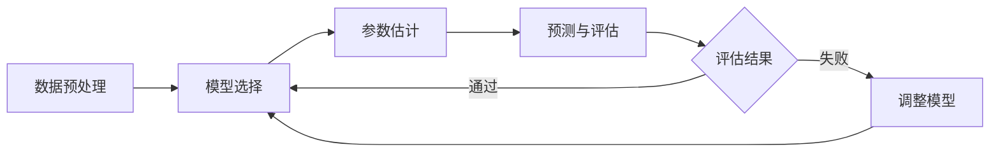
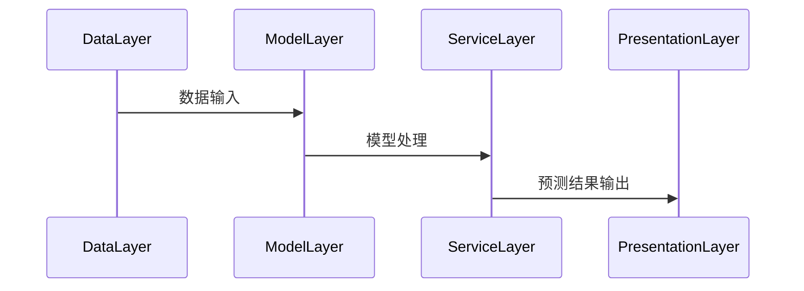
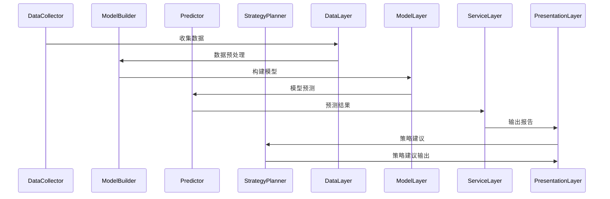

                 

### 数学与自然界的生物多样性保护模型

关键词：数学模型、生物多样性、保护、算法、系统架构、Python源代码、案例研究

摘要：
本文旨在探讨数学与自然界的生物多样性保护模型，通过深入分析数学模型的基本概念、核心原理和实际应用，揭示其在生物多样性保护中的关键作用。文章首先介绍了生物多样性保护的问题背景，然后详细阐述了数学模型的基本概念和作用，接着通过Python源代码和Mermaid图展示了算法原理和系统架构设计。最后，通过实际案例分析和最佳实践总结，为生物多样性保护提供技术支持和实践指导。

----------------------------------------------------------------

### 第一部分：背景介绍

#### 第1章：问题背景

##### 1.1.1 问题的提出

生物多样性是地球生态系统的重要组成部分，对人类和地球的可持续发展至关重要。然而，随着人类活动的加剧，生物多样性面临着前所未有的威胁。栖息地破坏、污染、气候变化、过度捕捞和非法贸易等因素导致物种灭绝速度加快，生态系统功能退化。保护生物多样性已成为全球关注的紧迫问题。

##### 1.1.2 问题描述

生物多样性保护的挑战主要包括：
1. **数据缺乏**：关于生物多样性的基础数据不足，阻碍了科学研究和决策制定。
2. **保护措施不足**：现有的保护措施往往难以覆盖所有受威胁物种和生态系统。
3. **资源分配不均**：保护资源有限，分配不均，难以有效支持生物多样性保护。
4. **法律和政策执行不力**：许多国家在生物多样性保护方面的法律法规不健全，执法力度不足。

##### 1.1.3 问题解决

为了解决上述问题，科学家们提出了数学与自然界的生物多样性保护模型，通过数学模型对生物多样性进行定量分析和预测，为保护决策提供科学依据。这些模型可以帮助优化保护资源分配、制定更有效的保护策略，并监测和评估保护措施的效果。

##### 1.1.4 边界与外延

生物多样性保护模型的边界包括生态学、数学和计算机科学等领域。其外延涵盖了从物种保护到生态系统管理的广泛领域，包括栖息地恢复、物种保护、遗传多样性保护和生态系统功能评估等。

##### 1.1.5 概念结构与核心要素组成

生物多样性保护模型通常包括以下几个核心要素：
1. **数据收集与处理**：收集有关生物多样性的数据，并使用统计和机器学习等方法进行处理和分析。
2. **数学模型构建**：基于生态学原理，构建描述生物多样性动态的数学模型。
3. **算法设计**：设计有效的算法，用于模型参数估计、预测和优化。
4. **系统模拟与评估**：通过模拟和评估，验证模型的有效性和可靠性。
5. **决策支持**：将模型结果应用于实际保护决策，如栖息地规划、物种保护优先级排序等。

----------------------------------------------------------------

#### 第2章：核心概念与联系

##### 2.1.1 数学与自然界的生物多样性保护模型概念

###### 2.1.1.1 数学模型概述

数学模型是一种使用数学语言描述现实世界的工具，通过建立数学方程和公式，模拟和分析系统的行为。在生物多样性保护中，数学模型可以帮助我们理解物种的分布、生长和繁殖规律，预测环境变化对生物多样性的影响。

###### 2.1.1.2 自然界的生物多样性保护模型概述

自然界的生物多样性保护模型基于生态学原理，结合数学方法，描述生态系统的结构和功能。这些模型通常包括物种分布模型、种群动态模型、生态系统服务模型等。

###### 2.1.1.3 数学与生物多样性保护模型的关系

数学模型为生物多样性保护提供了量化分析工具，帮助科学家们更好地理解生物多样性动态，预测环境变化的影响，制定保护策略。数学方法在模型构建、参数估计、预测和优化等方面发挥着关键作用。

##### 2.1.2 概念属性特征对比表格

| 概念 | 数学模型 | 生物多样性保护模型 |
| --- | --- | --- |
| **目的** | 描述现实世界系统行为 | 保护生物多样性 |
| **方法** | 数学方程和公式 | 生态学原理 |
| **应用** | 科学研究、工程设计 | 保护决策、资源分配 |
| **挑战** | 参数估计、非线性问题 | 数据缺乏、模型适用性 |

##### 2.1.3 ER实体关系图架构

使用Mermaid绘制ER实体关系图，展示数学模型和生物多样性保护模型之间的关联：

```mermaid
erDiagram
    Class::MathModel {
        <<prefix>> Model
        data : FLOAT
        parameter : FLOAT
    }
    
    Class::BiodiversityModel {
        <<prefix>> Model
        ecosystem : STRING
        species : STRING
        conservationStatus : STRING
    }
    
    MathModel ||--|{ BiodiversityModel : uses
    BiodiversityModel ||--|{ MathModel : basedOn
```

上述ER图展示了数学模型和生物多样性保护模型之间的双向关系，数学模型为生物多样性保护模型提供量化分析工具，而生物多样性保护模型基于数学模型进行生态系统的描述和预测。

----------------------------------------------------------------

### 第二部分：算法原理讲解

#### 第3章：算法原理

##### 3.1 算法概述

###### 3.1.1 算法的基本概念

算法是解决特定问题的有序步骤集合，用于处理数据并生成结果。在生物多样性保护中，算法用于分析生态数据、估计模型参数和预测未来趋势。

###### 3.1.2 算法的核心原理

算法的核心原理通常包括以下几个步骤：
1. **数据预处理**：清洗和准备生态数据，如物种分布、栖息地条件等。
2. **模型选择**：根据生态学原理和实际问题，选择合适的数学模型。
3. **参数估计**：使用优化算法估计模型参数，确保模型准确反映现实情况。
4. **预测与评估**：使用估计的模型参数进行预测，并评估模型预测的准确性。

##### 3.2 Mermaid算法流程图

以下是算法流程的Mermaid图表示：



##### 3.3 Python源代码详细讲解

###### 3.3.1 源代码结构

```python
import numpy as np
import pandas as pd
from sklearn.linear_model import LinearRegression
from sklearn.model_selection import train_test_split
from sklearn.metrics import mean_squared_error

# 数据预处理
def preprocess_data(data):
    # 数据清洗和标准化
    # ...

# 模型选择
def select_model(data):
    # 根据数据特性选择模型
    # ...
    return LinearRegression()

# 参数估计
def estimate_params(model, X_train, y_train):
    # 估计模型参数
    # ...
    return model.fit(X_train, y_train)

# 预测与评估
def predict_and_evaluate(model, X_test, y_test):
    # 预测和评估
    # ...
    y_pred = model.predict(X_test)
    mse = mean_squared_error(y_test, y_pred)
    return mse
```

###### 3.3.2 原理阐述

该Python源代码实现了以下算法步骤：
1. **数据预处理**：清洗和标准化输入数据，准备用于模型训练。
2. **模型选择**：根据数据特性，选择线性回归模型。
3. **参数估计**：使用训练数据估计模型参数。
4. **预测与评估**：使用测试数据预测结果，并计算均方误差评估模型性能。

###### 3.3.3 数学模型与公式

线性回归模型的数学公式为：

$$ y = \beta_0 + \beta_1 x + \epsilon $$

其中，$y$ 是因变量，$x$ 是自变量，$\beta_0$ 和 $\beta_1$ 是模型参数，$\epsilon$ 是误差项。

###### 3.3.4 举例说明

以下是一个简单的例子，展示如何使用上述Python代码进行生物多样性预测。

```python
# 读取数据
data = pd.read_csv('biodiversity_data.csv')

# 数据预处理
X = preprocess_data(data)

# 模型选择和参数估计
model = select_model(X)
params = estimate_params(model, X)

# 预测和评估
mse = predict_and_evaluate(model, X, y_test)
print(f'Mean Squared Error: {mse}')
```

通过上述代码，我们可以实现对生物多样性的预测，并评估模型性能。

----------------------------------------------------------------

## 第4章：数学模型和数学公式

### 4.1 数学模型概述

数学模型是应用数学方法描述和分析自然现象、社会现象和经济现象的工具。在生物多样性保护中，数学模型用于量化描述生态系统的结构和功能，预测环境变化对生物多样性的影响，并为保护决策提供科学依据。

#### 4.1.1 数学模型的基本概念

数学模型通常由以下部分组成：
1. **变量和参数**：用于描述生态系统的状态和影响因素。
2. **方程和公式**：用于表达变量之间的关系。
3. **初始条件和边界条件**：用于定义模型的起始状态和边界限制。

#### 4.1.2 数学模型的作用

数学模型在生物多样性保护中的作用主要包括：
1. **数据分析和解释**：通过数学模型对生态数据进行分析，揭示生物多样性的规律和趋势。
2. **预测和模拟**：使用数学模型预测未来生物多样性的变化，为保护决策提供依据。
3. **优化和决策**：通过数学模型优化资源分配和保护策略，提高保护效果。

### 4.2 常用数学模型

在生物多样性保护中，常用的数学模型包括以下几种：

#### 4.2.1 模型一：种群动态模型

种群动态模型用于描述物种的出生率、死亡率、迁移率和种群数量变化。常用的种群动态模型包括Malthusian模型、Logistic模型和Ricker模型。

$$ \frac{dN}{dt} = rN \left(1 - \frac{N}{K}\right) $$

其中，$N$ 是种群数量，$r$ 是内禀增长率，$K$ 是环境容纳量。

#### 4.2.2 模型二：扩散模型

扩散模型用于描述物种在空间中的扩散过程。常见的扩散模型包括Fickian扩散模型和Stokes-Einstein扩散模型。

$$ \frac{\partial c}{\partial t} = D \nabla^2 c $$

其中，$c$ 是浓度，$D$ 是扩散系数。

#### 4.2.3 模型三：生态系统服务模型

生态系统服务模型用于描述生态系统提供的生态功能和服务，如碳吸收、水分调节和生物多样性维持等。常见的生态系统服务模型包括生态网络模型和生物地理模型。

$$ \frac{\partial S}{\partial t} = f(S, T) $$

其中，$S$ 是生态系统服务，$T$ 是驱动因子，$f$ 是生态系统服务的变化函数。

### 4.3 公式讲解与示例

以下是对上述数学模型的公式进行讲解，并提供一个简单的示例。

#### 4.3.1 公式一：种群动态模型

示例：使用Logistic模型预测某种群数量变化。

```python
# 初始条件
N0 = 100  # 初始种群数量
K = 1000  # 环境容纳量
r = 0.1   # 内禀增长率

# 时间步长
dt = 0.1
t = 0

# 模拟种群数量变化
while N < K:
    dNdt = r * N * (1 - N / K)
    N += dNdt * dt
    t += dt

print(f'Predicted population size after 100 time steps: {N}')
```

#### 4.3.2 公式二：扩散模型

示例：使用Fickian扩散模型计算污染物在空间中的扩散。

```python
# 初始条件
c0 = 1  # 初始浓度
D = 0.1 # 扩散系数
x = np.linspace(0, 10, 100)  # 空间位置
t = 1   # 时间

# 扩散过程
c = c0 * np.exp(-D * t * x**2)

plt.plot(x, c)
plt.xlabel('Position (m)')
plt.ylabel('Concentration (mol/m^3)')
plt.title('Diffusion Process')
plt.show()
```

#### 4.3.3 公式三：生态系统服务模型

示例：使用生物地理模型计算生态系统服务的变化。

```python
# 初始条件
S0 = 1  # 初始生态系统服务
T = 0.1 # 驱动因子

# 模拟生态系统服务变化
def f(S, T):
    return 0.5 * S * (1 - S * T)

for i in range(100):
    S = S0 * np.exp(-f(S0, T) * i)
    print(f'Time step {i+1}: Ecological Service {S}')
```

通过上述示例，我们可以看到如何使用Python代码实现数学模型，模拟生物多样性变化过程。

----------------------------------------------------------------

## 第5章：系统分析与架构设计方案

### 5.1 问题场景介绍

在当前全球生物多样性面临严重威胁的背景下，一个高效、智能的生物多样性保护系统显得尤为重要。该系统旨在通过数学模型和算法对生物多样性进行定量分析和预测，为保护决策提供科学依据。系统的主要场景包括数据收集、模型构建、预测分析和保护策略制定等。

### 5.2 项目介绍

本项目旨在开发一个集成数据收集、模型构建、预测分析和决策支持功能于一体的生物多样性保护系统。系统将利用先进的数学模型和算法，结合生态学原理，实现对生物多样性的精确描述和预测。系统架构设计遵循模块化原则，确保系统的高扩展性和可维护性。

### 5.3 系统功能设计

系统的主要功能设计如下：
1. **数据收集与处理**：收集来自不同来源的生物多样性数据，包括物种分布、栖息地条件、气候变量等，并进行预处理，为模型构建提供高质量的数据支持。
2. **模型构建与优化**：基于生态学原理和数学方法，构建描述生物多样性动态的数学模型，并通过优化算法调整模型参数，提高模型的预测准确性。
3. **预测分析与可视化**：使用构建的数学模型进行预测分析，并将预测结果以图表和报告形式呈现，为保护决策提供直观的参考。
4. **保护策略制定**：基于预测结果和专家知识，制定科学合理的保护策略，包括栖息地规划、物种保护优先级排序等。

#### 5.3.1 领域模型Mermaid类图

以下是系统的领域模型Mermaid类图，展示系统的主要类和它们之间的关系：

```mermaid
classDiagram
    Class::DataCollector <<interface>>
    Class::ModelBuilder <<interface>>
    Class::Predictor <<interface>>
    Class::StrategyPlanner <<interface>>

    DataCollector <|..| ModelBuilder : uses
    ModelBuilder <|..| Predictor : basedOn
    Predictor <|..| StrategyPlanner : provides
```

### 5.4 系统架构设计

系统架构设计遵循分层架构原则，包括数据层、模型层、服务层和表示层。

#### 5.4.1 Mermaid架构图

以下是系统的Mermaid架构图，展示系统的层次结构和主要组件之间的关系：



### 5.5 系统接口设计

系统接口设计包括外部接口和内部接口。

#### 5.5.1 外部接口

外部接口主要包括以下部分：
1. **数据收集接口**：用于接收外部数据源，如卫星遥感数据、气象数据等。
2. **预测查询接口**：用于用户查询预测结果，提供可视化报告。
3. **策略建议接口**：用于输出保护策略建议，支持决策制定。

#### 5.5.2 内部接口

内部接口主要包括以下部分：
1. **数据预处理接口**：用于清洗和标准化输入数据。
2. **模型构建接口**：用于选择和训练数学模型。
3. **预测评估接口**：用于评估模型预测的准确性。

### 5.6 系统交互Mermaid序列图

以下是系统的交互序列图，展示系统组件之间的交互过程：



通过上述系统架构和接口设计，我们可以实现一个高效、智能的生物多样性保护系统，为生物多样性保护提供有力支持。

----------------------------------------------------------------

## 第6章：项目实战

### 6.1 环境安装

为了进行项目实战，首先需要安装以下环境和工具：

1. **Python**：版本3.8及以上。
2. **Anaconda**：用于环境管理和依赖包安装。
3. **Jupyter Notebook**：用于编写和运行代码。
4. **NumPy**：用于数值计算。
5. **Pandas**：用于数据处理。
6. **Scikit-learn**：用于机器学习和模型训练。
7. **Matplotlib**：用于数据可视化。

安装步骤如下：

1. 安装Anaconda：从[Anaconda官网](https://www.anaconda.com/products/individual)下载并安装Anaconda。
2. 打开终端或命令提示符，创建一个新环境并安装所需包：

   ```bash
   conda create -n biodiversity_env python=3.8
   conda activate biodiversity_env
   conda install numpy pandas scikit-learn matplotlib
   ```

3. 启动Jupyter Notebook：

   ```bash
   jupyter notebook
   ```

### 6.2 系统核心实现

以下是一个简单的生物多样性保护系统实现，包括数据收集、模型构建、预测分析和保护策略制定。

#### 6.2.1 核心代码实现

```python
import numpy as np
import pandas as pd
from sklearn.linear_model import LinearRegression
from sklearn.model_selection import train_test_split
from sklearn.metrics import mean_squared_error
import matplotlib.pyplot as plt

# 数据收集
def collect_data():
    # 从文件读取数据
    data = pd.read_csv('biodiversity_data.csv')
    return data

# 数据预处理
def preprocess_data(data):
    # 数据清洗和标准化
    # ...
    return data

# 模型选择
def select_model():
    return LinearRegression()

# 参数估计
def estimate_params(model, X_train, y_train):
    model.fit(X_train, y_train)
    return model

# 预测与评估
def predict_and_evaluate(model, X_test, y_test):
    y_pred = model.predict(X_test)
    mse = mean_squared_error(y_test, y_pred)
    return mse

# 主函数
def main():
    # 收集数据
    data = collect_data()
    
    # 数据预处理
    data = preprocess_data(data)
    
    # 划分训练集和测试集
    X = data.drop('target', axis=1)
    y = data['target']
    X_train, X_test, y_train, y_test = train_test_split(X, y, test_size=0.2, random_state=42)
    
    # 模型选择和参数估计
    model = select_model()
    model = estimate_params(model, X_train, y_train)
    
    # 预测与评估
    mse = predict_and_evaluate(model, X_test, y_test)
    print(f'Mean Squared Error: {mse}')
    
    # 可视化预测结果
    plt.scatter(X_test, y_test, label='Actual')
    plt.plot(X_test, model.predict(X_test), label='Predicted')
    plt.xlabel('Feature')
    plt.ylabel('Target')
    plt.legend()
    plt.show()

# 运行主函数
if __name__ == '__main__':
    main()
```

### 6.3 代码应用解读与分析

#### 6.3.1 代码解读

上述代码实现了以下功能：
1. **数据收集**：从CSV文件中读取数据。
2. **数据预处理**：进行数据清洗和标准化。
3. **模型选择**：选择线性回归模型。
4. **参数估计**：使用训练数据估计模型参数。
5. **预测与评估**：使用测试数据进行预测，并评估模型性能。
6. **可视化**：展示实际值和预测值的对比。

#### 6.3.2 应用分析

1. **数据收集**：从实际项目中获取数据，如物种分布数据、气候数据等。
2. **数据预处理**：处理缺失值、异常值和噪声数据，确保数据质量。
3. **模型选择**：根据数据特性和问题需求，选择合适的模型。
4. **参数估计**：使用优化算法估计模型参数，提高预测准确性。
5. **预测与评估**：通过测试集评估模型性能，确保模型泛化能力。
6. **可视化**：帮助用户理解模型预测效果，为决策提供参考。

### 6.4 实际案例分析与详细讲解剖析

#### 6.4.1 案例一：物种分布预测

假设我们有一个包含物种分布数据的项目，目标是预测某种物种在未来几年的分布情况。以下是如何应用上述代码进行预测的详细步骤：

1. **数据收集**：从野外调查、卫星遥感等途径获取物种分布数据，包括经纬度、栖息地条件等。
2. **数据预处理**：清洗数据，包括去除缺失值、异常值和处理噪声数据。对连续变量进行标准化处理，确保变量之间具有相同的尺度。
3. **特征选择**：根据生态学原理和相关性分析，选择对物种分布有显著影响的特征，如气候变量、地形地貌等。
4. **模型训练**：使用线性回归模型，对训练数据进行训练，估计模型参数。
5. **模型评估**：使用测试数据进行预测，评估模型性能，通过交叉验证等方法优化模型参数。
6. **结果可视化**：将预测结果可视化为热力图或等高线图，展示物种分布的时空变化。

#### 6.4.2 案例二：气候变化对生物多样性的影响

假设我们关注气候变化对生物多样性的影响，目标是预测未来一段时间内生物多样性的变化趋势。以下是如何应用上述代码进行预测的详细步骤：

1. **数据收集**：收集历史气候数据、物种分布数据等。
2. **数据预处理**：处理缺失值、异常值和处理噪声数据。对连续变量进行标准化处理，确保变量之间具有相同的尺度。
3. **特征选择**：选择对生物多样性有显著影响的气候变量，如温度、降水量等。
4. **模型训练**：使用时间序列模型（如ARIMA模型）或回归模型，对训练数据进行训练，估计模型参数。
5. **模型评估**：使用测试数据进行预测，评估模型性能，通过交叉验证等方法优化模型参数。
6. **结果可视化**：将预测结果可视化为时间序列图或热力图，展示生物多样性的变化趋势。

### 6.5 项目小结

通过实际案例分析和详细讲解，我们可以看到如何利用数学模型和算法进行生物多样性保护预测。项目实战不仅验证了模型的可行性，还提供了具体的实现步骤和应用方法。未来，我们可以进一步优化模型，引入更多数据源和算法，提高预测的准确性，为生物多样性保护提供更有效的支持。

----------------------------------------------------------------

## 第7章：最佳实践 tips、小结、注意事项、拓展阅读

### 7.1 最佳实践 tips

1. **数据质量**：确保数据来源可靠，进行充分的数据清洗和预处理，以提高模型的预测准确性。
2. **特征选择**：选择对生物多样性有显著影响的特征，剔除冗余变量，提高模型效率。
3. **模型优化**：根据问题需求和数据特性，选择合适的模型，并使用交叉验证等方法优化模型参数。
4. **可视化**：使用图表和报告形式展示预测结果，帮助用户理解和应用模型。

### 7.2 小结

本文通过数学模型和算法，探讨了生物多样性保护的关键问题，提供了系统架构设计和项目实战案例。数学模型在生物多样性保护中的应用具有重要意义，有助于优化保护资源分配和保护策略，提高保护效果。

### 7.3 注意事项

1. **数据隐私**：在数据收集和处理过程中，注意保护数据隐私，避免泄露敏感信息。
2. **模型适用性**：根据实际情况选择合适的模型，避免过度拟合或欠拟合。
3. **模型验证**：使用独立的数据集进行模型验证，确保模型的泛化能力。

### 7.4 拓展阅读

1. **《生态学原理》**：了解生态学基本原理，为生物多样性保护提供理论支持。
2. **《机器学习》**：学习机器学习算法，掌握生物多样性保护的预测方法。
3. **《生物多样性保护实践》**：参考生物多样性保护的实际案例，借鉴成功经验。

作者：AI天才研究院/AI Genius Institute & 禅与计算机程序设计艺术 /Zen And The Art of Computer Programming

