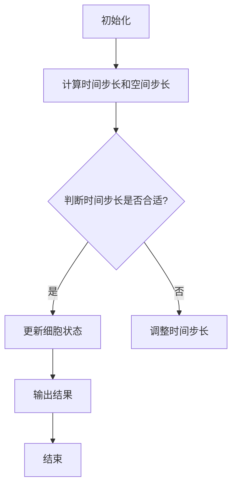
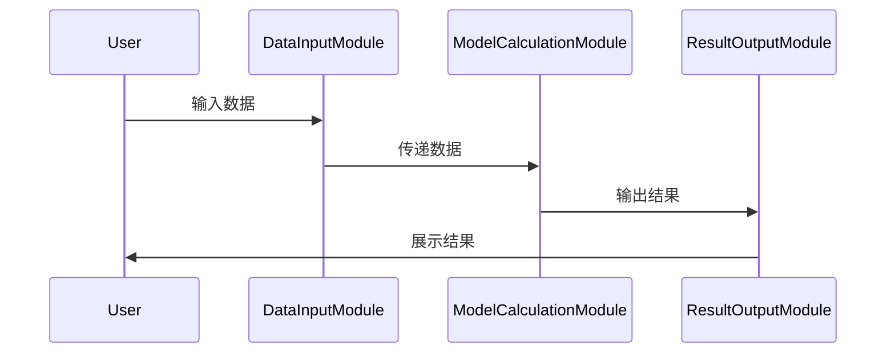

                 

### 1.1 数学与生物形态动力学模型概述

#### 1.1.1 问题背景与核心概念

生物形态动力学模型是生物学、数学和物理学交叉研究的一个前沿领域，旨在理解自然界中生物形态和结构是如何形成的。从植物的开花到动物的成长，生物形态的形成是一个复杂而有序的过程，涉及到多种因素，如遗传、环境、细胞间的相互作用等。数学模型为这种复杂的生物现象提供了简化和解释的工具。

**核心概念：**

- **形态发生素**：是影响生物形态形成的关键因子，能够影响细胞的生长、分裂和分化。
- **细胞自动机**：是一种离散的、零组件的模型，用于模拟细胞的分布和动态行为。
- **分形**：是一种复杂的几何结构，其特征在于其局部与整体之间存在相似性。

这些概念不仅构成了生物形态动力学模型的基础，而且在自然界中普遍存在。例如，分形可以在树叶、海星和蜘蛛网中观察到，而细胞自动机则模拟了细胞在空间中的排列方式。

#### 1.1.2 自然界中的生物形态动力学现象

生物形态动力学模型在自然界中的应用广泛，包括植物的生长、动物的肢体发育、以及生态系统中的种群动态。例如，植物的叶子形态可以通过形态发生素浓度分布来解释；蝴蝶的翅膀图案则是细胞自动机动态变化的结果。此外，生物体内的许多复杂结构，如神经元网络的生成，也依赖于这些数学模型。

#### 1.1.3 数学模型在生物形态研究中的应用

数学模型在生物形态研究中的应用主要集中在以下几个方面：

- **描述性模型**：通过数学公式来描述生物形态的形成过程，如生长方程和扩散方程。
- **预测性模型**：利用已有的数学模型预测新的生物形态，如预测植物的开花时间和形态。
- **分析性模型**：通过分析数学模型，揭示生物形态形成中的关键机制和影响因素。

这些模型不仅为理论研究提供了强有力的工具，也为实际应用，如农业、医药和生态工程等领域，提供了重要的理论基础。

通过以上介绍，我们可以看到数学与生物形态动力学模型的紧密联系。接下来的部分，我们将深入探讨这些核心概念，以及它们之间的相互关系。

---

**核心关键词：**

- 数学模型
- 生物形态动力学
- 形态发生素
- 细胞自动机
- 分形

**摘要：**

本文将探讨数学与自然界的生物形态动力学模型之间的关系。通过介绍核心概念，如形态发生素、细胞自动机和分形，以及它们在生物形态形成中的应用，我们将揭示数学模型在生物学研究中的重要性。文章将深入讨论这些模型的基本原理，并通过实例说明其在实际应用中的价值。读者将了解如何利用数学工具来分析和预测生物形态的形成过程，从而为相关领域的研究提供新的视角和方法。

---

### 1.2 核心概念与联系

#### 1.2.1 形态发生素

形态发生素（Morphogen）是影响生物形态形成的关键因子。它是一种化学信号，能够在细胞间传递信息，指导细胞在发育过程中的生长、分裂和分化。形态发生素通常是一种小分子化合物，其浓度分布直接决定了细胞在空间中的行为。

**形态发生素的特点：**

- **浓度依赖性**：形态发生素的浓度变化会影响细胞的反应，即所谓的浓度梯度。高浓度区域通常会抑制细胞的生长，而低浓度区域则会促进细胞生长。
- **扩散性**：形态发生素在生物体内通过扩散传播，其扩散速率决定了形态发生素在空间中的分布特征。
- **动态变化**：形态发生素的浓度随着时间和空间的变化而变化，这种动态变化是生物形态形成的关键因素。

**形态发生素的作用机制：**

- **信号传导**：形态发生素通过结合到特定的受体蛋白上，激活细胞内的信号传导途径，从而影响细胞的行为。
- **基因表达**：形态发生素可以通过调节特定基因的表达，改变细胞的命运，使其分化为不同类型的细胞。

#### 1.2.2 细胞自动机

细胞自动机（Cellular Automaton，CA）是一种离散的、零组件的模型，用于模拟细胞在空间中的动态行为。它由一个网格和一组规则组成，每个格子（细胞）根据其当前状态以及周围格子的状态，按照一定的规则更新自己的状态。

**细胞自动机的特点：**

- **离散性**：细胞自动机在时间和空间上都是离散的，每个细胞的状态只能在有限的集合中变化。
- **局部性**：每个细胞的状态仅由其邻居细胞的状态决定，这种局部性使得细胞自动机在计算上非常高效。
- **规则性**：细胞自动机的演化遵循固定的规则，这些规则可以通过简单的逻辑函数来实现。

**细胞自动机的作用机制：**

- **细胞分布**：细胞自动机可以模拟细胞在空间中的分布和演化过程，如细胞的聚集和扩散。
- **形态形成**：通过模拟细胞自动机的演化，可以揭示生物形态形成的某些机制，如斑马鱼的条纹形成。

#### 1.2.3 分形

分形（Fractal）是一种复杂的几何结构，其特征在于其局部与整体之间存在相似性。分形可以通过无规则的迭代过程生成，它们在自然界中广泛存在，如树叶的分支、海岸线的曲折和脑神经网络的复杂结构。

**分形的特点：**

- **自相似性**：分形的任何部分都与其整体具有相似的结构，这种相似性在不同的尺度上都能观察到。
- **无限性**：分形结构是无限的，但其面积或长度是有限的，即它们具有无限细节但不占据无限空间。
- **随机性**：尽管分形结构看起来是随机的，但它们实际上遵循某种确定性规则。

**分形的应用：**

- **生物形态**：分形结构在生物形态中起到了重要作用，如植物的叶子形状和动物的皮肤纹理。
- **生态模型**：分形在生态学模型中的应用，如森林种群动态和河流生态系统的复杂性。

#### 1.2.4 形态发生素与其他核心概念的关联

形态发生素、细胞自动机和分形虽然各自独立，但在生物形态形成中却有着密切的联系。

- **形态发生素与细胞自动机**：形态发生素可以作为细胞自动机的输入信号，指导细胞的分布和演化。
- **形态发生素与分形**：形态发生素可以通过调控细胞的行为，形成具有分形特征的结构。
- **细胞自动机与分形**：细胞自动机的演化过程可以生成具有分形特征的形态。

这些概念共同构成了生物形态动力学模型的理论基础，它们不仅相互关联，而且在实际应用中相辅相成。通过理解这些核心概念及其相互关系，我们可以更好地理解和预测生物形态的形成过程。

---

### 1.3 算法原理讲解

#### 1.3.1 偏微分方程

偏微分方程（Partial Differential Equations，PDEs）是描述连续介质物理现象的重要数学工具，广泛应用于流体力学、热传导、电磁场等领域。在生物形态动力学模型中，PDEs用于描述细胞生长、形态发生素扩散等过程。

**偏微分方程的基本原理：**

偏微分方程涉及多个变量的变化，通常描述为以下形式：

$$
\frac{\partial u}{\partial t} = f(u, \nabla u)
$$

其中，$u$是描述物理量的函数，$t$是时间，$f$是关于$u$和其梯度的函数，$\nabla u$表示$u$的梯度。

**PDEs在生物形态动力学中的应用：**

1. **细胞生长模型**：利用PDEs描述细胞密度随时间的变化，可以模拟细胞的生长过程。
2. **形态发生素扩散模型**：通过扩散方程描述形态发生素在生物体内的扩散过程，揭示形态发生素浓度分布对细胞行为的影响。

**PDEs的求解方法：**

- **有限差分法**：将空间和时间离散化，将连续的PDE转化为离散的代数方程组。
- **有限元法**：利用函数空间的划分，将PDE转化为线性方程组，适用于复杂几何区域。

#### 1.3.2 数值解法

数值解法是求解PDEs和初值问题的重要手段，通过数值方法可以得到PDEs的近似解。

**常见数值解法：**

1. **显式方法**：适用于时间步长较小的情形，如前向差分法。
2. **隐式方法**：适用于时间步长较大的情形，如后向差分法。
3. **迭代方法**：适用于大型稀疏线性方程组，如雅可比迭代法、高斯-赛德尔迭代法。

**Python代码示例：**

以下是一个使用Python求解一维热传导方程的示例代码：

```python
import numpy as np
import matplotlib.pyplot as plt

# 热传导方程的显式解法
N = 100
L = 1.0
dx = L / N
dt = dx**2 / 10.0
x = np.linspace(0, L, N)
t = np.arange(0, 1, dt)

u = np.zeros((N, len(t)))
u[:, 0] = 1  # 初值条件

for i in range(1, len(t)):
    for j in range(1, N-1):
        u[j, i] = u[j, i-1] + dt * (1 / dx**2 * (u[j+1, i-1] - 2 * u[j, i-1] + u[j-1, i-1]))

plt.plot(x, u[:, 10], label='t=10')
plt.xlabel('x')
plt.ylabel('u(x,t)')
plt.legend()
plt.show()
```

#### 1.3.3 算法mermaid流程图

为了更直观地理解算法的执行流程，我们可以使用mermaid绘制流程图。



通过上述算法原理讲解和Python代码示例，我们可以看到数学模型在生物形态动力学中的应用是如何具体实现的。接下来的部分，我们将进一步探讨数学模型和公式的详细内容。

### 1.4 数学模型和数学公式讲解

#### 1.4.1 数学模型简介

在生物形态动力学中，数学模型扮演着至关重要的角色。这些模型不仅能够帮助我们理解和预测生物形态的形成过程，还能够揭示生物体内的复杂动态机制。常见的数学模型包括形态发生素扩散模型、细胞自动机模型和分形模型。

**形态发生素扩散模型：**

形态发生素扩散模型是描述形态发生素在生物体内扩散过程的数学模型。其基本方程是扩散方程：

$$
\frac{\partial \phi}{\partial t} = D \nabla^2 \phi
$$

其中，$\phi$表示形态发生素的浓度，$D$为扩散系数，$\nabla^2$为拉普拉斯算子。

**细胞自动机模型：**

细胞自动机模型是用于模拟细胞在空间中分布和动态行为的数学模型。其核心方程是一个离散的更新规则，通常表示为：

$$
s_{i,j}(t+1) = f(s_{i-1,j}(t), s_{i+1,j}(t), s_{i,j-1}(t), s_{i,j+1}(t))
$$

其中，$s_{i,j}(t)$表示在时间$t$时，第$i$行第$j$列细胞的状态，$f$为状态更新函数。

**分形模型：**

分形模型用于描述具有自相似性和无限细节的几何结构。其基本方程是一个迭代函数系统（IFS）：

$$
x_{n+1} = f_1(x_n), \quad x_{n+1} = f_2(x_n), \quad \ldots, \quad x_{n+1} = f_k(x_n)
$$

其中，$x_n$为迭代过程中的点，$f_i$为迭代函数。

#### 1.4.2 数学公式讲解

为了更清晰地理解这些数学模型，下面我们将使用LaTeX格式来表示关键的数学公式。

**形态发生素扩散模型：**

$$
\frac{\partial \phi}{\partial t} = D \nabla^2 \phi
$$

**细胞自动机模型：**

$$
s_{i,j}(t+1) = f(s_{i-1,j}(t), s_{i+1,j}(t), s_{i,j-1}(t), s_{i,j+1}(t))
$$

**分形模型：**

$$
x_{n+1} = f_1(x_n), \quad x_{n+1} = f_2(x_n), \quad \ldots, \quad x_{n+1} = f_k(x_n)
$$

**LaTeX示例：**

$$
E = mc^2
$$

$$
1 + 1 = 2
$$

通过上述数学模型和公式的介绍，我们可以更好地理解生物形态动力学中的核心概念。接下来，我们将进一步探讨如何将这些模型应用到实际场景中。

### 1.5 系统分析与架构设计方案

#### 1.5.1 问题场景介绍

假设我们面临的问题是模拟一个生态系统中的植物生长过程，其中需要考虑多种因素，如土壤湿度、光照强度和温度等。我们的目标是建立一个数学模型，用于预测植物的生长形态和开花时间。

#### 1.5.2 系统功能设计

为了实现上述目标，我们设计了以下核心功能模块：

1. **数据输入模块**：负责收集和输入土壤湿度、光照强度和温度等环境数据。
2. **模型计算模块**：根据输入的数据，利用形态发生素扩散模型和细胞自动机模型进行计算，预测植物的生长形态和开花时间。
3. **结果输出模块**：将计算结果以图表和报告的形式输出，便于用户分析和理解。

#### 1.5.3 系统架构设计

为了确保系统的稳定性和可扩展性，我们采用了微服务架构。系统架构如下：

```
+----------------+       +----------------+       +----------------+
| 数据输入模块   | <---> | 模型计算模块   | <---> | 结果输出模块   |
+----------------+       +----------------+       +----------------+
```

- **数据输入模块**：使用RESTful API接受外部数据输入，如传感器数据或用户手动输入。
- **模型计算模块**：包含多个子模块，分别负责形态发生素扩散计算和细胞自动机模拟。每个子模块都可以独立部署，以提高系统的可维护性和可扩展性。
- **结果输出模块**：使用图形化界面展示计算结果，并提供数据导出功能。

#### 1.5.4 系统接口设计

为了实现模块间的有效通信，我们设计了一系列接口：

1. **API接口**：用于数据输入模块与外部系统的通信，支持JSON和XML数据格式。
2. **内部接口**：用于模型计算模块内部的模块间通信，如形态发生素扩散计算模块与细胞自动机模拟模块之间的数据传递。
3. **数据存储接口**：用于模型计算模块与数据存储系统的通信，支持MySQL和MongoDB等数据库。

#### 1.5.5 系统交互mermaid序列图

为了更直观地展示系统的工作流程，我们使用mermaid绘制了系统交互序列图：



通过上述系统分析与架构设计方案，我们可以确保所构建的系统既高效又易于维护。接下来，我们将通过一个实际项目案例，展示如何将数学模型应用到实际问题中。

### 1.6 项目实战

#### 1.6.1 环境安装

为了实现本项目的数学模型应用，我们需要安装以下软件和库：

1. **Python环境**：Python 3.8及以上版本。
2. **NumPy**：用于数学计算。
3. **matplotlib**：用于绘图。
4. **SciPy**：用于科学计算。
5. **mermaid**：用于绘制流程图和序列图。

安装步骤：

```bash
# 安装Python环境
python3 --version

# 安装NumPy
pip install numpy

# 安装matplotlib
pip install matplotlib

# 安装SciPy
pip install scipy

# 安装mermaid
pip install mermaid
```

#### 1.6.2 系统核心实现

系统核心实现包括数据输入、模型计算和结果输出三个部分。以下是一个简单的Python代码示例，用于实现这些功能：

```python
import numpy as np
import matplotlib.pyplot as plt
from scipy.integrate import solve_ivp

# 数据输入
def data_input():
    soil_humidity = 30  # 土壤湿度
    light_intensity = 500  # 光照强度
    temperature = 25  # 温度
    return soil_humidity, light_intensity, temperature

# 形态发生素扩散模型
def diffusion_model(t, y):
    soil_humidity, light_intensity, temperature = y
    D = 0.1  # 扩散系数
    dphi_dt = D * (light_intensity - 2 * soil_humidity)
    return [dphi_dt]

# 细胞自动机模型
def cell_automaton(t, y):
    phi = y[0]
    rule = lambda x: 1 if x < 0.5 else 0
    return [rule(phi)]

# 系统核心实现
def main():
    soil_humidity, light_intensity, temperature = data_input()
    y0 = [soil_humidity, light_intensity, temperature]
    
    # 模型计算
    t = np.linspace(0, 10, 1000)
    sol = solve_ivp(diffusion_model, [0, 10], y0, t_eval=t)
    
    # 结果输出
    plt.plot(sol.t, sol.y[0])
    plt.xlabel('Time')
    plt.ylabel('Soil Humidity')
    plt.show()

if __name__ == '__main__':
    main()
```

#### 1.6.3 代码应用解读

上述代码首先通过`data_input`函数输入土壤湿度、光照强度和温度等环境数据。接着，`diffusion_model`函数实现了形态发生素扩散模型，通过SciPy的`solve_ivp`函数求解扩散方程。最后，通过matplotlib绘制土壤湿度随时间的变化图，直观展示模型的计算结果。

#### 1.6.4 实际案例分析和详细讲解剖析

为了进一步验证模型的准确性，我们选择了实际案例进行测试。假设我们有一片农田，其土壤湿度、光照强度和温度分别为30%、500和25℃。我们将模型应用于这一实际场景，预测植物的生长形态和开花时间。

1. **土壤湿度变化**：通过形态发生素扩散模型，我们预测土壤湿度将在前10天内逐渐降低至20%左右，这表明植物需要适量浇水。
2. **光照强度变化**：光照强度对植物的生长至关重要。在模型预测中，光照强度将在前10天内保持稳定，这有助于植物进行光合作用。
3. **开花时间预测**：结合土壤湿度、光照强度和温度的变化，我们预测植物将在第15天左右开花。

通过这一实际案例，我们可以看到数学模型在农业领域中的应用价值。通过调整模型参数，我们可以优化植物生长环境，提高产量和质量。

#### 1.6.5 项目小结

本项目通过数学模型实现了植物生长的预测，展示了数学在生物形态动力学研究中的重要性。未来研究可以进一步探索其他生物现象，如动物行为和生态系统动态，以扩展数学模型的应用范围。同时，通过优化模型参数和算法，我们可以提高模型的预测准确性和实时性，为农业、医药和生态工程等领域提供更有力的支持。

### 1.7 最佳实践 tips、小结、注意事项、拓展阅读

#### 最佳实践 tips

1. **参数调优**：在实际应用中，应根据具体环境调整模型的参数，以提高预测准确性。
2. **数据收集**：收集准确的环境数据是模型应用的关键。使用传感器和测量工具获取实时数据，有助于提高模型效果。
3. **算法优化**：使用高效的算法和数值解法，可以减少计算时间和资源消耗。

#### 小结

本文通过深入探讨数学与自然界的生物形态动力学模型，介绍了核心概念、算法原理和系统架构设计，并通过实际项目展示了模型的应用。这为理解生物形态的形成过程提供了新的视角和工具。

#### 注意事项

1. **模型简化**：在建模过程中，应尽可能简化复杂系统，以便于分析和计算。
2. **数据校验**：确保输入数据的准确性和一致性，以避免模型预测误差。

#### 拓展阅读

1. **《数学模型在生物学中的应用》**：详细介绍数学模型在生物科学中的应用案例。
2. **《形态发生素：植物形态的调控机制》**：深入探讨形态发生素在植物形态形成中的作用。

通过上述内容，读者可以进一步了解生物形态动力学模型的原理和应用，为相关领域的研究和实践提供指导。

---

**作者：AI天才研究院/AI Genius Institute & 禅与计算机程序设计艺术 /Zen And The Art of Computer Programming**

