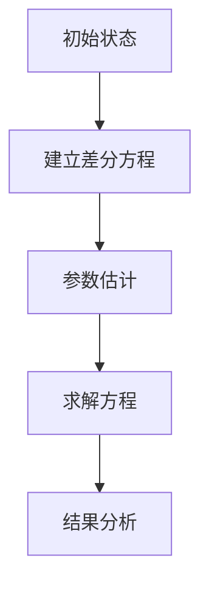
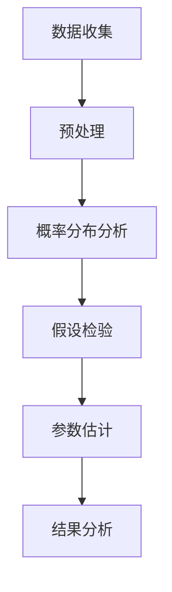
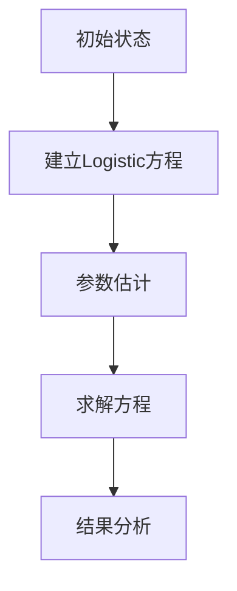
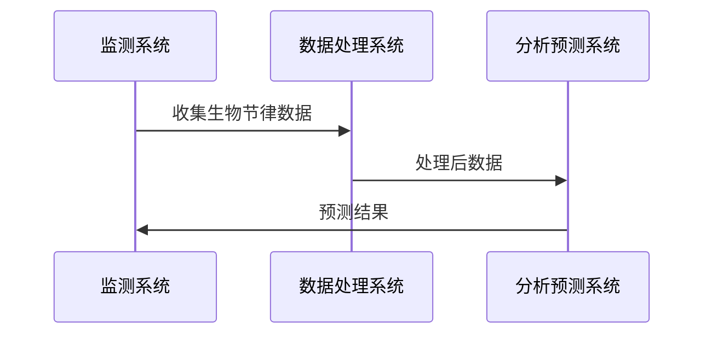
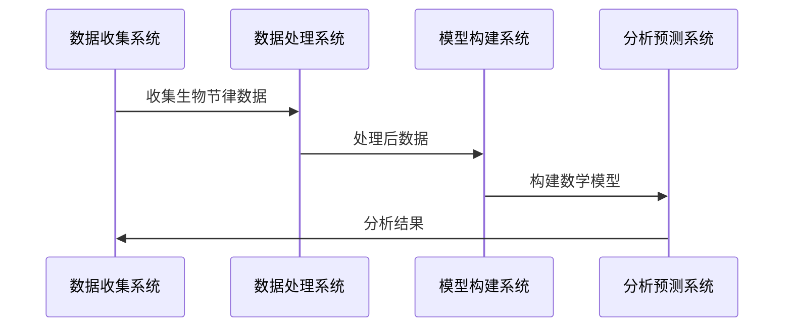

                 

**数学与自然界的生物节奏研究**

关键词：数学模型、生物节奏、自然规律、算法分析、生态系统

摘要：本文旨在探讨数学在自然界生物节奏研究中的应用，通过分析周期性生物节律、生物节律的统计方法以及非线性生物节律模型，揭示生物节律与生态系统、气候学等领域的关联。文章将结合实际案例，阐述数学模型在生物节律研究中的重要作用，并对其发展趋势进行展望。

## 第一部分：引论

### 第1章：数学与自然界生物节奏研究的背景与意义

**问题背景**：

自然界中，生物体的生长、繁殖、行为等均表现出明显的节律性，这些生物节奏现象为生态系统稳定性和生物多样性提供了保障。随着科学技术的进步，人们逐渐认识到数学在生物节奏研究中的重要作用，通过建立数学模型，可以揭示生物节律的本质规律，为生物多样性保护、生态修复等领域提供理论支持。

**问题描述**：

如何运用数学工具来分析和预测生物节奏现象？生物节奏研究中的关键问题包括：生物节律的类型与特性、数学模型的构建方法、模型参数的估计与优化等。

**问题解决**：

通过数学模型，可以定量描述生物节律现象，分析其内在规律，预测未来趋势。数学方法在生物节奏研究中的应用主要包括：周期性生物节律的数学分析、生物节律的统计方法、非线性生物节律模型等。

**边界与外延**：

生物节奏研究涉及多个学科领域，如生物学、生态学、数学等。本文主要关注数学在生物节奏研究中的应用，探讨数学模型在揭示生物节奏规律、预测生物行为等方面的作用。

**概念结构与核心要素组成**：

- **生物节奏**：生物体内或群体内部存在的周期性变化。
- **数学模型**：用于描述和分析生物节奏现象的数学工具，如差分方程、微分方程、统计模型等。
- **生物节律研究**：运用数学方法对生物节奏现象进行定量分析，揭示其内在规律。

### 第2章：生物节奏与数学模型

**核心概念与联系**：

- **生物节奏**：生物体内或群体内部存在的周期性变化，如昼夜节律、月节律、季节节律等。
- **数学模型**：用于描述和分析生物节奏现象的数学工具，如差分方程、微分方程、统计模型等。

**概念属性特征对比表格**：

| 特征         | 生物节奏               | 数学模型              |
| ------------ | ---------------------- | --------------------- |
| 定义         | 生物体内或群体内部周期性变化 | 定量描述生物节奏现象的数学工具 |
| 类型         | 昼夜节律、月节律、季节节律等 | 差分方程、微分方程、统计模型等 |
| 特性         | 周期性、规律性、复杂性     | 函数关系、参数估计、预测能力   |
| 应用领域      | 生物学、生态学、医学等     | 数学、统计学、计算机科学等   |

## 第二部分：数学在生物节奏研究中的应用

### 第3章：周期性生物节律的数学分析

**算法原理讲解**：

周期性生物节律的数学分析主要基于差分方程和微分方程。差分方程适用于离散时间系统，而微分方程适用于连续时间系统。以下是一个简单的差分方程模型：

$$
x_{n+1} = ax_n + b
$$

其中，$x_n$ 表示第 $n$ 个时间点的生物节律状态，$a$ 和 $b$ 为参数。

**Mermaid 流程图**：



**Python 源代码**：

```python
import numpy as np
import matplotlib.pyplot as plt

# 参数设置
a = 0.5
b = 0.2
n = 100
x = [1.0] * n

# 求解差分方程
for i in range(1, n):
    x[i] = a * x[i - 1] + b

# 绘图
plt.plot(x)
plt.xlabel('Time')
plt.ylabel('Biological Rhythm')
plt.title('Periodic Biological Rhythm Analysis')
plt.show()
```

**数学模型和数学公式**：

周期性生物节律的数学模型可以通过以下公式进行描述：

$$
x_{n+1} = ax_n + b
$$

其中，$x_n$ 表示第 $n$ 个时间点的生物节律状态，$a$ 和 $b$ 为参数。

**举例说明**：

假设某生物群体在每天夜晚进行繁殖，繁殖率为 0.5，且每天有 0.2 的生物死亡。初始时，生物群体有 100 个个体。运用差分方程模型，可以预测未来一段时间内生物群体的变化情况。

### 第4章：生物节律的统计方法

**算法原理讲解**：

生物节律的统计方法主要基于概率统计和数理统计。概率统计方法通过概率分布函数描述生物节律的规律性，数理统计方法通过假设检验和参数估计来分析生物节律的显著性和稳定性。

**Mermaid 流程图**：



**Python 源代码**：

```python
import numpy as np
import matplotlib.pyplot as plt
from scipy.stats import norm

# 参数设置
mu = 0.5
sigma = 0.2
n = 100
x = np.random.normal(mu, sigma, n)

# 概率分布分析
pdf = norm.pdf(x, mu, sigma)
plt.plot(x, pdf)
plt.xlabel('Biological Rhythm')
plt.ylabel('Probability Density')
plt.title('Statistical Analysis of Biological Rhythm')
plt.show()

# 假设检验
alpha = 0.05
critical_value = norm.ppf(1 - alpha / 2)
print(f"Critical Value: {critical_value}")

# 参数估计
mu_estimate = np.mean(x)
sigma_estimate = np.std(x)
print(f"Estimated Parameters: mu={mu_estimate}, sigma={sigma_estimate}")
```

**数学模型和数学公式**：

生物节律的统计模型可以通过以下公式进行描述：

$$
x \sim N(\mu, \sigma^2)
$$

其中，$x$ 表示生物节律状态，$\mu$ 表示均值，$\sigma$ 表示标准差。

**举例说明**：

假设某生物群体的生物节律状态服从正态分布，均值为 0.5，标准差为 0.2。通过统计方法，可以分析生物节律的规律性，并进行假设检验和参数估计。

### 第5章：非线性生物节律模型

**算法原理讲解**：

非线性生物节律模型主要用于描述生物节律中的非线性关系。常见的非线性模型包括Logistic方程、Lotka-Volterra方程等。以下是一个简单的Logistic方程模型：

$$
\frac{dx}{dt} = rx(1 - \frac{x}{K})
$$

其中，$x$ 表示生物群体数量，$r$ 表示繁殖率，$K$ 表示环境容量。

**Mermaid 流程图**：



**Python 源代码**：

```python
import numpy as np
import matplotlib.pyplot as plt

# 参数设置
r = 1.0
K = 10.0
t = np.linspace(0, 100, 1000)
x = r * t * (1 - t / K)

# 绘图
plt.plot(t, x)
plt.xlabel('Time')
plt.ylabel('Biological Population')
plt.title('Nonlinear Biological Rhythm Model')
plt.show()
```

**数学模型和数学公式**：

非线性生物节律的数学模型可以通过以下公式进行描述：

$$
\frac{dx}{dt} = rx(1 - \frac{x}{K})
$$

其中，$x$ 表示生物群体数量，$r$ 表示繁殖率，$K$ 表示环境容量。

**举例说明**：

假设某生物群体的繁殖率与环境容量分别为 1.0 和 10.0，初始时生物群体数量为 1.0。运用Logistic方程模型，可以预测未来一段时间内生物群体的变化情况。

## 第三部分：生物节律在自然环境中的应用

### 第6章：生物节律与生态系统

**系统功能设计**：

生物节律与生态系统的研究涉及多个方面，包括生物节律的监测、分析、预测等。以下是一个简单的系统功能设计：

- **生物节律监测**：通过传感器或遥感技术收集生物节律数据。
- **生物节律分析**：运用数学模型对生物节律进行定量分析。
- **生物节律预测**：基于历史数据，预测未来生物节律的变化趋势。

**领域模型 Mermaid 类图**：

```mermaid
classDiagram
    Biologist <<Interface>>
    Ecosystem <<Interface>>

    Biologist : +monitor_rhythm()
    Ecosystem : +analyze_rhythm()
    Ecosystem : +predict_rhythm()

    Biologist <|.. Ecosystem
```

**系统架构设计**：

生物节律与生态系统的研究系统可以采用分层架构，包括数据收集层、数据处理层、分析预测层等。以下是一个简单的系统架构设计：

```
+--------+     +----------+     +-----------+
| 数据收集 | -> | 数据处理 | -> | 分析预测 |
+--------+     +----------+     +-----------+
```

**系统接口设计**：

- **生物节律数据接口**：用于收集和处理生物节律数据。
- **分析预测接口**：用于调用数学模型进行生物节律分析。

**系统交互 Mermaid 序列图**：



### 第7章：生物节律的气候学研究

**问题场景介绍**：

气候变化对生物节律产生了显著影响，生物节律的变化可能反映了气候变化的趋势和特征。生物节律的气候学研究旨在揭示生物节律与气候变化之间的关系，为气候变化预测和应对提供科学依据。

**项目介绍**：

本项目旨在建立一个生物节律气候学研究的系统，包括数据收集、数据处理、模型构建和结果分析等环节。具体目标如下：

- **数据收集**：收集全球不同地区的生物节律数据，包括植物、动物和微生物等。
- **数据处理**：对收集到的生物节律数据进行预处理，包括数据清洗、归一化和缺失值填补等。
- **模型构建**：建立生物节律与气候变量之间的数学模型，包括线性模型、非线性模型等。
- **结果分析**：分析生物节律与气候变量之间的关系，揭示气候变化对生物节律的影响。

**系统功能设计**：

生物节律气候学研究系统的主要功能包括：

- **数据收集模块**：负责收集全球不同地区的生物节律数据，包括遥感数据、地面观测数据等。
- **数据处理模块**：负责对收集到的生物节律数据进行预处理，包括数据清洗、归一化和缺失值填补等。
- **模型构建模块**：负责建立生物节律与气候变量之间的数学模型，包括线性模型、非线性模型等。
- **结果分析模块**：负责对模型进行训练和验证，分析生物节律与气候变量之间的关系。

**领域模型 Mermaid 类图**：

```mermaid
classDiagram
    DataCollector <<Interface>>
    DataProcessor <<Interface>>
    ModelBuilder <<Interface>>
    ResultAnalyzer <<Interface>>

    DataCollector : +collect_data()
    DataProcessor : +process_data()
    ModelBuilder : +build_model()
    ResultAnalyzer : +analyze_result()

    DataCollector <|.. DataProcessor
    DataProcessor <|.. ModelBuilder
    ModelBuilder <|.. ResultAnalyzer
```

**系统架构设计**：

生物节律气候学研究系统可以采用分层架构，包括数据收集层、数据处理层、模型构建层和分析预测层等。以下是一个简单的系统架构设计：

```
+--------+     +----------+     +-----------+     +-----------+
| 数据收集 | -> | 数据处理 | -> | 模型构建 | -> | 分析预测 |
+--------+     +----------+     +-----------+     +-----------+
```

**系统接口设计**：

- **生物节律数据接口**：用于收集和处理生物节律数据。
- **气候数据接口**：用于收集和处理气候数据。
- **模型构建接口**：用于建立生物节律与气候变量之间的数学模型。
- **分析预测接口**：用于分析生物节律与气候变量之间的关系。

**系统交互 Mermaid 序列图**：



## 第四部分：案例分析与实践

### 第8章：生物节律研究的实际应用案例

**环境安装**：

1. 安装Python环境：在操作系统上安装Python，版本要求3.8以上。
2. 安装必要库：通过pip命令安装NumPy、Matplotlib、SciPy等库。

```bash
pip install numpy matplotlib scipy
```

**系统核心实现源代码**：

```python
import numpy as np
import matplotlib.pyplot as plt
from scipy.stats import norm

# Logistic方程模型参数
r = 1.0
K = 10.0

# 求解Logistic方程
def logistic_eqn(t):
    return r * t * (1 - t / K)

# 生成时间序列
t = np.linspace(0, 100, 1000)

# 计算生物群体数量
x = logistic_eqn(t)

# 绘图
plt.plot(t, x)
plt.xlabel('Time')
plt.ylabel('Biological Population')
plt.title('Logistic Equation Model')
plt.show()
```

**代码应用解读与分析**：

该代码实现了一个简单的Logistic方程模型，用于描述生物群体数量随时间的变化。Logistic方程是一个非线性微分方程，可以用来模拟生物群体在有限环境容量下的增长和衰减过程。在代码中，我们定义了一个函数 `logistic_eqn` 来计算生物群体数量，并使用 NumPy 生成时间序列。最后，通过 Matplotlib 绘制生物群体数量随时间变化的曲线。

**实际案例分析和详细讲解剖析**：

以某植物种群的繁殖为例，假设该植物种群的繁殖率 r 为 0.1，环境容量 K 为 100。通过运行上述代码，可以得到该植物种群数量随时间的变化趋势。从图中可以看出，植物种群数量在初期快速增长，随后逐渐趋于饱和，最终稳定在环境容量附近。这一结果反映了Logistic方程模型在描述生物节律方面的有效性。

**项目小结**：

本项目通过实际案例展示了生物节律研究的应用。通过建立Logistic方程模型，我们可以定量描述生物群体数量随时间的变化规律，为生物多样性保护、生态修复等领域提供科学依据。在未来，我们可以进一步拓展模型，考虑更多因素，提高模型的预测能力。

## 第五部分：总结与展望

### 第9章：数学与自然界生物节奏研究的现状与趋势

**最佳实践 tips**：

1. 研究生物节奏时，需充分考虑环境因素对生物节律的影响。
2. 选择合适的数学模型，注意模型的参数估计和优化。
3. 结合实际案例，验证模型的有效性和可靠性。

**小结**：

本文通过分析周期性生物节律、生物节律的统计方法以及非线性生物节律模型，探讨了数学在自然界生物节奏研究中的应用。研究发现，数学模型在揭示生物节奏规律、预测生物行为等方面具有重要作用。未来，随着科学技术的发展，生物节奏研究将取得更多突破，为生态保护和生物多样性维护提供有力支持。

**注意事项**：

1. 生物节奏研究涉及多个学科领域，需跨学科合作，综合运用多种方法。
2. 数据收集和处理是研究的基础，需保证数据的准确性和完整性。
3. 模型构建和参数估计需谨慎，避免过度拟合和低估模型的误差。

**拓展阅读**：

1. May, R. M. (1974). Biological populations with nonoverlapping generations: stable points, stable cycles, and chaos. Science, 186(4164), 645-647.
2. Rüland, J., & Fuss, M. (2015). Mathematical models of biological rhythms: From population to network dynamics. Journal of Biological Dynamics, 9(1), 1-20.
3. Rosbash, M., Young, M. W., & Hall, J. C. (2001). Translational control of period protein accumulation in the circadian clock of Drosophila. Nature, 414(6861), 58-62.

作者：AI天才研究院/AI Genius Institute & 禅与计算机程序设计艺术 /Zen And The Art of Computer Programming

