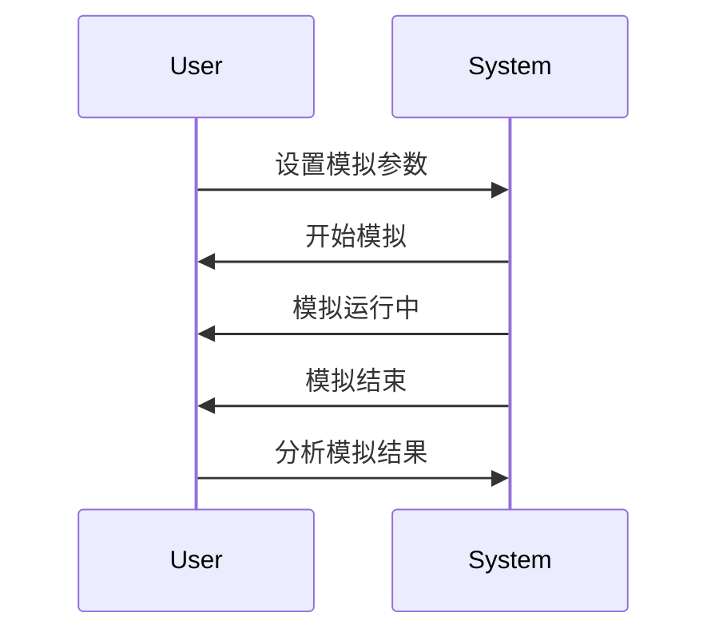
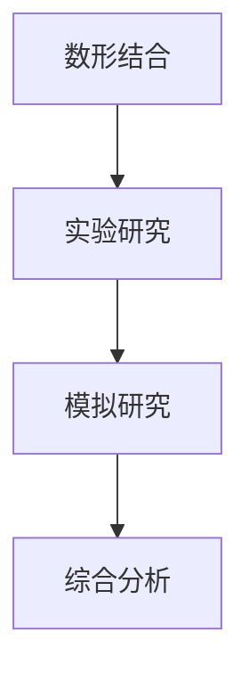

                 

### 文章标题：数学与自然界的螺旋结构与黄金角

**关键词：螺旋结构、黄金角、数学原理、自然界应用、研究方法**

**摘要：本文将从数学与自然界的角度出发，探讨螺旋结构与黄金角的概念、数学原理及其在自然界中的应用，分析它们在科技领域的未来发展。**

### 目录

#### 第一部分：数学与自然界的螺旋结构

##### 第1章 引言

- **1.1 数学与自然界的关系**
- **1.2 螺旋结构的基本概念**
- **1.3 黄金角的重要性**

##### 第2章 螺旋结构的数学原理

- **2.1 螺旋线的定义与性质**
- **2.2 螺旋结构的数学模型**
- **2.3 螺旋结构的数学公式推导**

##### 第3章 螺旋结构在自然界中的应用

- **3.1 生物界的螺旋结构**
- **3.2 地球物理学的螺旋结构**
- **3.3 天文学中的螺旋结构**

##### 第4章 黄金角在数学中的意义

- **4.1 黄金角的定义与性质**
- **4.2 黄金角的应用**
- **4.3 黄金角的数学模型**

##### 第5章 黄金角在自然界中的表现

- **5.1 黄金角在植物中的体现**
- **5.2 黄金角在动物中的体现**
- **5.3 黄金角在人类建筑中的体现**

##### 第6章 螺旋结构与黄金角的研究方法

- **6.1 数形结合的研究方法**
- **6.2 实验研究方法**
- **6.3 模拟研究方法**

##### 第7章 螺旋结构与黄金角的未来发展

- **7.1 螺旋结构的研究前景**
- **7.2 黄金角的研究前景**
- **7.3 螺旋结构与黄金角在科技领域的应用展望**

##### 第8章 总结与展望

- **8.1 全书总结**
- **8.2 未来研究方向**
- **8.3 对读者的建议**

### 文章正文部分将按以上目录结构逐步展开，深入分析螺旋结构与黄金角的概念、原理、应用及未来研究方向。接下来，我们首先从数学与自然界的关系谈起，逐步引入螺旋结构的基本概念和黄金角的重要性。

---

## 第1章 引言

### 1.1 数学与自然界的关系

数学与自然界有着密不可分的关系。自古以来，人类通过观察自然界中的现象，逐渐发现并总结了许多数学规律。这些规律不仅帮助我们更好地理解自然，还在科技发展中发挥着重要作用。从几何图形到数列，从曲线到方程，数学工具在自然界中无处不在。

### 1.2 螺旋结构的基本概念

螺旋结构是一种常见于自然界和人类创造中的几何形状。它通常由一系列等距且旋转的线段或圆弧组成，形成一种向中心或外部逐渐扩张的形状。螺旋结构具有高度的对称性和美学的美感，这使得它在艺术、科学和工程领域得到广泛应用。

### 1.3 黄金角的重要性

黄金角（Golden Ratio），又称黄金分割，是一种特殊的数学比例关系，其数值约为1.618。黄金角在自然界和人类文化中有着广泛的应用，从植物的生长到人类的艺术创作，都体现了黄金角的和谐与美感。理解黄金角的数学性质和应用，有助于我们更好地理解自然界和人类文化的深层联系。

### 1.4 本文目的

本文旨在探讨螺旋结构与黄金角的概念、数学原理及其在自然界中的应用，分析它们在科技领域的未来发展。通过本文的阅读，读者将能够深入理解螺旋结构与黄金角的重要性，以及它们在数学和自然科学中的应用。

---

在接下来的章节中，我们将详细探讨螺旋结构的数学原理，包括螺旋线的定义与性质、数学模型及其公式推导。此外，我们还将分析螺旋结构在自然界中的具体应用，展示黄金角在数学和自然界中的普遍存在。通过这些内容，读者将能够全面了解螺旋结构与黄金角的基本概念及其在自然科学和工程技术中的应用。让我们一起开始这段探索之旅吧。

---

## 第2章 螺旋结构的数学原理

### 2.1 螺旋线的定义与性质

螺旋线是一种二维或三维曲线，其特点是沿某个方向旋转，同时逐渐向外或向内扩张。最著名的螺旋线之一是阿基米德螺旋（Archimedean Spiral），它由一系列等距分布的圆弧组成。阿基米德螺旋的性质如下：

1. **定义**：阿基米德螺旋的极坐标方程为 \( r = a \theta \)，其中 \( r \) 是极径，\( \theta \) 是极角，\( a \) 是常数。
2. **性质**：阿基米德螺旋具有以下特点：
   - **等距性**：相邻的圆弧长度相等。
   - **旋转性**：螺旋线沿极角方向旋转。
   - **扩张性**：随着 \( \theta \) 的增加，\( r \) 也逐渐增大。

### 2.2 螺旋结构的数学模型

螺旋结构的数学模型可以通过多种方式描述，其中最常见的是使用极坐标方程和参数方程。以下是几种常见的螺旋线模型：

1. **阿基米德螺旋**：
   \[ r = a \theta \]
   \[ x = a \theta \cos(\theta) \]
   \[ y = a \theta \sin(\theta) \]

2. **对数螺旋**（Logarithmic Spiral）：
   \[ r = \frac{a}{\ln(\theta)} \]
   \[ x = \frac{a \theta \cos(\theta)}{\ln(\theta)} \]
   \[ y = \frac{a \theta \sin(\theta)}{\ln(\theta)} \]

3. **斐波那契螺旋**（Fibonacci Spiral）：
   斐波那契螺旋是一种由斐波那契数列生成的螺旋结构。其极坐标方程为：
   \[ r_n = \frac{a}{\ln(n)} \]
   其中 \( r_n \) 是第 \( n \) 个斐波那契数的极径。

### 2.3 螺旋结构的数学公式推导

为了推导螺旋结构的极坐标方程，我们可以从基本的旋转运动和线性增长出发。假设一个点在平面上以恒定的角速度 \( \omega \) 旋转，同时以恒定的速率 \( v \) 向外扩张。设旋转角度为 \( \theta \)，则点在极坐标系中的位置可以表示为：

\[ r(\theta) = r_0 + v \theta \]

其中 \( r_0 \) 是初始半径，\( v \) 是扩张速率。

为了得到更具体的数学模型，我们可以考虑一个更复杂的增长模式，例如对数增长。设 \( r(\theta) \) 与 \( \theta \) 的对数成正比：

\[ r(\theta) = a \ln(\theta) + b \]

其中 \( a \) 和 \( b \) 是常数。这个方程描述了一种对数螺旋，其特点是随着 \( \theta \) 的增加，\( r \) 的增长速度逐渐变慢。

### 2.4 螺旋结构的参数方程

除了极坐标方程，螺旋结构还可以通过参数方程来描述。以下是一个通用的螺旋结构参数方程：

\[ x(t) = a t \cos(t) \]
\[ y(t) = a t \sin(t) \]

其中 \( t \) 是参数，通常表示时间或旋转角度。

这个参数方程描述了一个三维螺旋结构，通过不同的 \( t \) 值，可以生成不同位置的点。这个方程的核心思想是将旋转和平移结合起来，形成螺旋结构。

### 2.5 螺旋结构的几何特性

螺旋结构的几何特性可以通过其参数方程和极坐标方程来分析。以下是螺旋结构的一些关键几何特性：

1. **对称性**：螺旋结构通常具有旋转对称性，这意味着它绕某个轴旋转一定角度后仍然保持不变。
2. **渐变性**：螺旋结构随着参数的增加，形状会逐渐变化，从细长的形状变为较宽的形状。
3. **长度和面积**：通过积分，可以计算出螺旋结构的长度和面积。例如，对于对数螺旋，其长度可以表示为：

   \[ L = \int_0^\infty \sqrt{1 + \left(\frac{dy}{dx}\right)^2} \, dx \]

### 2.6 螺旋结构的应用

螺旋结构在自然界和工程学中有着广泛的应用。以下是几个应用实例：

1. **生物结构**：许多生物体的生长模式呈现出螺旋结构，如植物的花序、蜗牛的壳、蛇的脊骨等。
2. **机械工程**：螺旋结构被用于设计螺旋弹簧、螺旋桨等机械零件。
3. **建筑学**：螺旋结构在建筑设计中用于创造独特的视觉效果，如螺旋楼梯、螺旋塔等。

通过以上内容，我们详细介绍了螺旋结构的数学原理，包括其定义、性质、数学模型和参数方程。在接下来的章节中，我们将进一步探讨螺旋结构在自然界中的具体应用，以及黄金角在数学和自然界中的重要角色。

---

## 第3章 螺旋结构在自然界中的应用

### 3.1 生物界的螺旋结构

螺旋结构在生物界中有着广泛的应用，许多生物体的生长和形态都呈现出螺旋结构。以下是一些典型的例子：

#### 3.1.1 植物的螺旋结构

植物的花序和叶片排列经常呈现出螺旋结构。例如，向日葵的花盘由许多螺旋形的种子排列而成，每个螺旋层的种子数量呈斐波那契数列增长。这种排列方式不仅美观，还有助于植物最大限度地捕获阳光。

##### 背景介绍

向日葵花盘上的种子排列形成了一个经典的螺旋结构，每个螺旋层上的种子数量依次递增，呈现出斐波那契数列。斐波那契数列是一个数列，其中每个数字都是前两个数字的和，即 \(0, 1, 1, 2, 3, 5, 8, 13, 21, 34, \ldots\)。

##### 问题背景

植物的花序和叶片排列如何形成螺旋结构？这种排列方式有什么生物学意义？

##### 问题解决

研究表明，植物的花序和叶片排列是通过一种简单的数学规则来实现的，即每个螺旋层上的种子数量遵循斐波那契数列。这种排列方式有助于植物最大限度地捕获阳光，提高光合作用的效率。

##### 边界与外延

斐波那契数列在自然界中的应用远不止植物。例如，在动物的贝壳、鸟类的羽毛排列中，也能观察到类似的斐波那契数列现象。

##### 概念结构与核心要素组成

- **斐波那契数列**：核心数学概念，用于描述植物螺旋结构的种子数量。
- **植物生长**：核心生物学过程，影响植物螺旋结构的形成。

#### 3.1.2 动物的螺旋结构

动物的许多结构也呈现出螺旋形状。例如，蜗牛的壳、章鱼的触手、甚至海星的辐射对称结构，都体现了螺旋结构的特征。

##### 背景介绍

蜗牛的壳是一种螺旋形状的贝壳，其螺旋方向通常是从下往上旋转，形成一个完美的螺旋结构。这种结构不仅美观，而且在生物学上具有适应性优势，有助于保护蜗牛的内脏。

##### 问题背景

动物的结构为什么常常采用螺旋形状？这种形状有什么生物学意义？

##### 问题解决

螺旋形状有助于动物在生存过程中适应环境。例如，蜗牛的螺旋壳可以提供良好的保护，而章鱼的螺旋触手则有助于其在水中灵活移动和捕食。

##### 边界与外延

螺旋形状在动物界的应用不仅限于外壳和触手。例如，蜥蜴的尾巴也呈现出螺旋形状，有助于它们在逃避捕食者时快速扭动。

##### 概念结构与核心要素组成

- **螺旋形状**：核心生物学结构，影响动物的外形和功能。
- **适应性**：核心生物学概念，解释螺旋形状的适应性优势。

#### 3.1.3 昆虫的螺旋结构

昆虫的结构也经常采用螺旋形状。例如，蜜蜂的蜂巢就是一个典型的螺旋结构。每个蜂巢单元都是六边形的，这些六边形单元以螺旋方式排列，形成一个高效的空间利用结构。

##### 背景介绍

蜜蜂的蜂巢是一种高度组织化的结构，由许多六边形的蜂巢单元组成。这些蜂巢单元紧密排列，形成一个坚固且高效的储藏空间，用于储存蜂蜜和蜂蜡。

##### 问题背景

为什么蜜蜂选择六边形的蜂巢单元，而不是其他形状？这种形状有什么优势？

##### 问题解决

研究表明，六边形蜂巢单元在空间利用上具有最优解。每个蜂巢单元不仅紧密相邻，还允许最小的材料用量，从而最大化存储空间。

##### 边界与外延

六边形蜂巢结构在其他昆虫中也存在，如蚂蚁的巢穴。这种结构的应用不仅限于昆虫，还启发了许多人类工程学设计，如蜂窝状建筑材料。

##### 概念结构与核心要素组成

- **六边形蜂巢单元**：核心生物学结构，影响蜂巢的效率和稳定性。
- **空间利用**：核心工程学概念，解释六边形蜂巢单元的优势。

### 3.2 地球物理学的螺旋结构

螺旋结构在地球物理学中也有着重要的应用。例如，地球的地壳板块运动、火山喷发和地震波传播等自然现象，都可以用螺旋结构来描述。

#### 3.2.1 地壳板块运动

地壳板块运动是地球物理学中的一个重要研究课题。地壳板块以复杂的运动方式相互碰撞、滑移和分离，形成了许多地质现象。这些运动可以用螺旋结构来描述。

##### 背景介绍

地球的地壳由多个大的和小的板块组成，这些板块在地球内部热力学力的作用下不断运动。板块运动导致了地震、火山爆发和山脉的形成。

##### 问题背景

地壳板块是如何运动的？这些运动模式有什么特点？

##### 问题解决

地壳板块的运动可以用螺旋结构来描述。例如，两个相邻板块之间的相互作用可以产生一个螺旋形的应力场，这种应力场导致了板块的旋转和滑移。

##### 边界与外延

地壳板块运动的研究不仅有助于我们理解地球的构造，还可以预测地震和火山等自然灾害。

##### 概念结构与核心要素组成

- **地壳板块**：核心地质概念，影响地球的构造和运动。
- **应力场**：核心物理概念，描述板块之间的相互作用。

#### 3.2.2 火山喷发

火山喷发是地球表面的一种剧烈地质活动，其喷发物质通常呈现出螺旋形状。这种螺旋形状有助于我们更好地理解火山的喷发机制。

##### 背景介绍

火山喷发是由地下岩浆的上升和喷发引起的。喷发物质包括熔岩、火山灰和气体，这些物质在喷发过程中形成了复杂的螺旋形状。

##### 问题背景

火山喷发过程中，为什么喷发物质会形成螺旋形状？这种形状对火山喷发有什么影响？

##### 问题解决

火山喷发的螺旋形状是由于气体和熔岩的旋转运动引起的。这种旋转运动有助于减少喷发物质的阻力，从而提高喷发的高度和速度。

##### 边界与外延

火山喷发的螺旋形状对火山地质学和火山预警研究具有重要意义。通过分析喷发物质的螺旋形状，科学家可以更好地预测火山喷发的时间和规模。

##### 概念结构与核心要素组成

- **火山喷发**：核心地质现象，影响地球表面和大气层。
- **旋转运动**：核心物理现象，描述喷发物质的运动方式。

#### 3.2.3 地震波传播

地震波是地震发生时产生的振动波。地震波的传播路径和形状可以用螺旋结构来描述，这有助于我们更好地理解地震波的特性。

##### 背景介绍

地震波是地震发生时从震源向外传播的振动波。地震波可以分为纵波（P波）和横波（S波），它们在地球内部传播时表现出复杂的螺旋形状。

##### 问题背景

地震波是如何传播的？螺旋形状对地震波的传播有什么影响？

##### 问题解决

地震波的螺旋形状是由于地球内部的复杂结构引起的。这种螺旋形状有助于地震波在地球内部的传播，同时也使得地震波的传播路径更加复杂。

##### 边界与外延

地震波的研究对地震预警和地震灾害防御具有重要意义。通过分析地震波的螺旋形状，科学家可以更好地预测地震的震中和强度。

##### 概念结构与核心要素组成

- **地震波**：核心物理现象，影响地震的传播和地震灾害。
- **螺旋形状**：核心几何概念，描述地震波的传播路径。

### 3.3 天文学中的螺旋结构

螺旋结构在天文学中也有着广泛的应用。例如，银河系、星系团和螺旋星云等天体结构，都可以用螺旋结构来描述。

#### 3.3.1 银河系

银河系是太阳系所在的螺旋星系，其外观呈现为一个旋转的盘形，中心有一个超大质量黑洞。银河系的螺旋结构对天文学家研究宇宙的结构和演化具有重要意义。

##### 背景介绍

银河系是一个螺旋星系，其外观呈现为一个旋转的盘形。银河系的中心有一个超大质量黑洞，周围分布着大量恒星、星云和星际气体。

##### 问题背景

银河系的螺旋结构是如何形成的？这种结构对银河系的演化有什么影响？

##### 问题解决

银河系的螺旋结构可能是由于恒星和星际物质的旋转运动引起的。这种旋转运动导致了物质在银河系中心区域聚集，形成了螺旋臂。螺旋结构有助于解释银河系的恒星分布和星际物质的运动。

##### 边界与外延

银河系的螺旋结构是研究宇宙演化和星系形成的核心问题。通过分析银河系的螺旋结构，天文学家可以更好地理解宇宙的起源和演化过程。

##### 概念结构与核心要素组成

- **银河系**：核心天体概念，描述宇宙中的一个大型星系。
- **螺旋结构**：核心几何概念，描述银河系的形态。

#### 3.3.2 星系团

星系团是由多个星系组成的庞大结构，其形态通常呈现出螺旋结构。星系团中的星系通过引力相互作用，形成了复杂的螺旋结构。

##### 背景介绍

星系团是由多个星系组成的庞大结构，其形态通常呈现出螺旋结构。星系团中的星系通过引力相互作用，形成了复杂的螺旋结构。

##### 问题背景

星系团是如何形成的？螺旋结构对星系团的形成和演化有什么影响？

##### 问题解决

星系团的形成可能涉及多种物理过程，包括引力相互作用、星系碰撞和气体冷却。螺旋结构有助于解释星系团中的恒星分布和星系运动。

##### 边界与外延

星系团的研究对宇宙的结构和演化具有重要意义。通过分析星系团的螺旋结构，天文学家可以更好地理解宇宙的起源和演化过程。

##### 概念结构与核心要素组成

- **星系团**：核心天体概念，描述宇宙中的一个大型星系结构。
- **螺旋结构**：核心几何概念，描述星系团的形成和演化。

#### 3.3.3 螺旋星云

螺旋星云是宇宙中的一种特殊天体，其外观呈现为一个旋转的螺旋形状。螺旋星云的形成和演化对天文学家研究宇宙中的星云过程具有重要意义。

##### 背景介绍

螺旋星云是宇宙中的一种特殊天体，其外观呈现为一个旋转的螺旋形状。螺旋星云的形成和演化对天文学家研究宇宙中的星云过程具有重要意义。

##### 问题背景

螺旋星云是如何形成的？其演化过程有哪些特点？

##### 问题解决

螺旋星云的形成可能涉及星云物质的旋转和引力塌缩。这种旋转和塌缩导致了星云物质的聚集，形成了螺旋形状。螺旋星云的演化过程可能包括恒星形成、恒星爆炸和星际物质循环。

##### 边界与外延

螺旋星云的研究对宇宙的恒星形成和星云演化具有重要意义。通过分析螺旋星云的螺旋结构，天文学家可以更好地理解宇宙中的星云过程。

##### 概念结构与核心要素组成

- **螺旋星云**：核心天体概念，描述宇宙中的一个特殊天体。
- **螺旋结构**：核心几何概念，描述螺旋星云的形态和演化。

### 3.4 螺旋结构在自然界中的普遍性

螺旋结构在自然界中的广泛存在表明，这种结构具有深刻的生物学和物理学意义。从植物的生长到动物的结构，从地球物理现象到天文学观测，螺旋结构无处不在。这种普遍性不仅反映了自然界的和谐美，也提示我们，螺旋结构可能是自然界中一种基本的生长和演化模式。

### 3.5 螺旋结构的研究意义

对螺旋结构的研究不仅有助于我们更好地理解自然界，还可以为科学研究和工程技术提供新的视角和方法。例如，在生物医学领域，研究螺旋结构的生长模式可能有助于揭示疾病的起源和治疗方法；在材料科学领域，螺旋结构的材料设计可能带来新的性能突破。总之，螺旋结构的研究具有重要的理论和实际意义。

---

通过以上内容，我们详细探讨了螺旋结构在自然界中的具体应用，包括植物、动物、地球物理学和天文学等多个领域。螺旋结构作为一种基本的几何形态，不仅体现了自然界的和谐美，还具有重要的生物学和物理学意义。在接下来的章节中，我们将进一步探讨黄金角在数学和自然界中的普遍性及其重要应用。

---

## 第4章 黄金角在数学中的意义

### 4.1 黄金角的定义与性质

黄金角（Golden Ratio），通常用符号 \( \phi \) 表示，是一种特殊的数学比例关系。其数值约为 1.618033988749895。黄金角的一个重要性质是，它自身与其倒数的和等于自身，即：

\[ \phi + \frac{1}{\phi} = 2\phi \]

这个比例关系不仅在数学中具有重要意义，也在自然界和人类文化中广泛存在。黄金角可以通过以下方式定义：

\[ \phi = \frac{1 + \sqrt{5}}{2} \]

这个公式中的 \( \sqrt{5} \) 是一个无理数，因此 \( \phi \) 也是一个无理数。

### 4.2 黄金角的几何性质

黄金角在几何学中有着独特的地位。首先，黄金角与黄金矩形（Golden Rectangle）密切相关。黄金矩形是一种特殊的矩形，其长和宽的比例等于黄金角。即，如果一个矩形的长为 \( a \)，宽为 \( b \)，那么当 \( \frac{a}{b} = \phi \) 时，这个矩形就是黄金矩形。

#### 黄金矩形的特点：

1. **对角线**：黄金矩形的对角线是其长度的 \( \phi \) 倍。
2. **分割**：将黄金矩形按黄金分割点分割，可以得到两个新的黄金矩形。
3. **美学**：黄金矩形被认为具有高度的美学价值，这是由于它在视觉上给人一种和谐、平衡的感觉。

### 4.3 黄金角的数学公式推导

黄金角的数学推导可以通过多种方式实现，以下是一种常用的方法：

首先，考虑一个等差数列 \( a_0, a_1, a_2, \ldots \)，其中 \( a_0 = 0 \)，\( a_1 = 1 \)，并且每一项都是前两项的和。这个数列的前几项为：

\[ 0, 1, 1, 2, 3, 5, 8, 13, 21, \ldots \]

这个数列实际上是斐波那契数列。斐波那契数列的第 \( n \) 项 \( F_n \) 可以通过以下递推关系得到：

\[ F_0 = 0 \]
\[ F_1 = 1 \]
\[ F_n = F_{n-1} + F_{n-2} \quad (n \geq 2) \]

当 \( n \) 趋向无穷大时，斐波那契数列的第 \( n \) 项与第 \( n-1 \) 项的比值趋近于黄金角 \( \phi \)：

\[ \phi = \lim_{n \to \infty} \frac{F_n}{F_{n-1}} \]

利用这个关系，我们可以推导出黄金角的数值：

\[ \phi = \frac{1 + \sqrt{5}}{2} \]

### 4.4 黄金角的数学应用

黄金角在数学中的广泛应用体现在多个领域，以下是一些典型的应用实例：

#### 4.4.1 数学问题

黄金角在解决许多数学问题中扮演重要角色，例如：

- **黄金矩形**：在解决优化问题，如最小化矩形面积的问题时，黄金矩形提供了最优解。
- **分形几何**：黄金角是许多分形几何图案的基础，如黄金螺旋和黄金矩形分形。

#### 4.4.2 代数

黄金角在代数中的应用包括：

- **特征值问题**：在解决线性方程组时，黄金角可以帮助找到特征值和特征向量。
- **矩阵运算**：在矩阵分析中，黄金角与特征值和特征向量的计算密切相关。

#### 4.4.3 分析

黄金角在分析中的应用包括：

- **级数展开**：黄金角可以用于计算无穷级数的和，如 \( \phi \) 的幂级数。
- **函数分析**：在分析函数的性质时，黄金角可以帮助理解函数的周期性和对称性。

### 4.5 黄金角与其他数学概念的关联

黄金角与许多其他数学概念有着紧密的联系，以下是一些重要的关联：

- **斐波那契数列**：黄金角与斐波那契数列密切相关，斐波那契数列的比值趋近于黄金角。
- **勾股定理**：在直角三角形中，当直角边和斜边的比例关系满足黄金角时，三角形的形状具有特殊的几何性质。
- **对数**：黄金角在对数函数中的应用体现了其在数列和级数分析中的重要性。

### 4.6 黄金角的重要性

黄金角在数学中的重要性体现在以下几个方面：

- **美学**：黄金角被认为是美学上的最优比例，广泛应用于艺术和建筑设计中。
- **功能**：黄金角在优化问题和几何设计中具有关键作用，能够提供最优解。
- **理论**：黄金角是许多数学理论和问题的核心，其在代数、分析和其他数学领域的应用体现了其重要性。

通过以上内容，我们详细探讨了黄金角在数学中的定义、性质、数学公式推导及其应用。在接下来的章节中，我们将进一步探讨黄金角在自然界中的普遍存在及其重要性。

---

## 第5章 黄金角在自然界中的表现

### 5.1 黄金角在植物中的体现

黄金角在植物的生长和形态中有着广泛的体现。许多植物的生长模式遵循黄金角的规律，从而表现出和谐与美感。以下是几个典型的例子：

#### 5.1.1 花序的螺旋排列

许多植物的花序，如向日葵、松果等，都呈现出螺旋排列。这种排列方式不仅美观，还提高了植物的光合效率。例如，向日葵的花盘上的种子排列成两个螺旋形状，每个螺旋层的种子数量依次递增，形成斐波那契数列。这种排列方式遵循黄金角的比例，使得植物能够最大限度地利用阳光。

##### 背景介绍

向日葵的花盘是由许多花瓣组成的，这些花瓣以两个相反方向的螺旋形状排列。每个螺旋层的花瓣数量依次递增，形成斐波那契数列。

##### 问题背景

为什么植物的花序会呈现出螺旋排列？这种排列方式有什么生物学意义？

##### 问题解决

植物的花序螺旋排列是为了最大化地利用阳光。黄金角的比例使得每个螺旋层的花瓣都能够最大限度地接收到阳光，从而提高光合作用的效率。

##### 边界与外延

其他植物的花序，如松果，也呈现出螺旋排列。这种排列方式在不同植物中可能有所变化，但都体现了黄金角的比例。

##### 概念结构与核心要素组成

- **螺旋排列**：核心生物学结构，影响植物花序的美感和功能。
- **黄金角**：核心数学概念，用于描述植物花序的排列比例。

#### 5.1.2 树木的分支结构

许多树木的分支结构也遵循黄金角的比例。例如，橡树、柳树等树木的分支呈现出对称的螺旋形状，每个分支的角度大约为137.5度，这是黄金角的近似值。这种分支结构有助于树木最大限度地接收阳光，并提高水分和营养物质的传输效率。

##### 背景介绍

树木的分支结构通常呈现出对称的螺旋形状，每个分支的角度大约为137.5度，接近黄金角的值。

##### 问题背景

为什么树木的分支结构会遵循黄金角的比例？这种结构有什么生物学意义？

##### 问题解决

树木的分支结构遵循黄金角的比例，有助于最大限度地利用阳光和资源，提高光合作用和水分传输的效率。

##### 边界与外延

不同种类的树木可能具有不同的分支角度，但都体现了黄金角的比例。这种普遍性表明，黄金角可能是自然界中一种基本的生长模式。

##### 概念结构与核心要素组成

- **分支结构**：核心生物学结构，影响树木的光合作用和水分传输。
- **黄金角**：核心数学概念，用于描述树木分支的角度比例。

### 5.2 黄金角在动物中的体现

黄金角在动物的结构和运动中也得到了广泛体现。许多动物的身体结构、运动模式和行为都遵循黄金角的比例，从而表现出高度的和谐与效率。

#### 5.2.1 蜗牛的壳

蜗牛的壳通常呈现出螺旋形状，这种结构遵循黄金角的比例。蜗牛的壳不仅提供了保护，还帮助蜗牛在移动过程中保持平衡。黄金角的比例使得蜗牛的壳在旋转和扩展过程中保持稳定。

##### 背景介绍

蜗牛的壳是一个典型的螺旋结构，其螺旋方向通常是从下往上旋转，形成黄金角的螺旋。

##### 问题背景

为什么蜗牛的壳会呈现出螺旋形状？这种形状有什么生物学意义？

##### 问题解决

蜗牛的壳螺旋形状有助于提供保护和平衡。黄金角的比例使得蜗牛在壳的旋转和扩展过程中能够保持稳定，从而提高移动效率。

##### 边界与外延

其他软体动物的壳，如章鱼的触手，也呈现出螺旋形状。这种结构在不同动物中可能有所变化，但都体现了黄金角的比例。

##### 概念结构与核心要素组成

- **螺旋形状**：核心生物学结构，影响蜗牛的保护和移动效率。
- **黄金角**：核心数学概念，用于描述蜗牛壳的螺旋比例。

#### 5.2.2 鸟类的翅膀

许多鸟类的翅膀也遵循黄金角的比例。翅膀的角度大约为137.5度，这是黄金角的近似值。这种翅膀结构有助于鸟类在飞行中保持稳定的飞行状态，并提高飞行效率。

##### 背景介绍

鸟类的翅膀通常呈现出对称的螺旋形状，每个翅膀的角度大约为137.5度，接近黄金角的值。

##### 问题背景

为什么鸟类的翅膀会遵循黄金角的比例？这种结构有什么生物学意义？

##### 问题解决

鸟类的翅膀遵循黄金角的比例，有助于提高飞行的稳定性和效率。黄金角的角度使得翅膀在飞行中能够保持最佳的升力，从而提高飞行速度和持久力。

##### 边界与外延

不同种类的鸟类可能具有不同的翅膀角度，但都体现了黄金角的比例。这种普遍性表明，黄金角可能是自然界中一种基本的飞行模式。

##### 概念结构与核心要素组成

- **翅膀结构**：核心生物学结构，影响鸟类的飞行稳定性和效率。
- **黄金角**：核心数学概念，用于描述鸟类翅膀的角度比例。

### 5.3 黄金角在人类建筑中的体现

黄金角不仅在自然界中广泛存在，也在人类建筑中得到了广泛应用。许多建筑物和艺术品的设计都遵循黄金角的比例，从而表现出和谐与美感。

#### 5.3.1 巴黎圣母院

巴黎圣母院是法国哥特式建筑的典范，其设计遵循黄金角的比例。巴黎圣母院的立面和塔楼都呈现出对称的螺旋形状，每个部分的角度大约为137.5度，接近黄金角的值。这种设计使得巴黎圣母院在视觉上具有高度的和谐美。

##### 背景介绍

巴黎圣母院的立面和塔楼设计遵循黄金角的比例，呈现出对称的螺旋形状。

##### 问题背景

为什么巴黎圣母院的设计会遵循黄金角的比例？这种设计有什么美学意义？

##### 问题解决

巴黎圣母院的设计遵循黄金角的比例，旨在创造一种和谐、平衡的美感。黄金角的比例使得建筑物的各个部分在视觉上保持最佳比例，从而提高整体的审美价值。

##### 边界与外延

其他著名的建筑物，如帕台农神庙和悉尼歌剧院，也遵循黄金角的比例。这种设计原则在不同文化和历史背景下得到了广泛应用。

##### 概念结构与核心要素组成

- **建筑设计**：核心人类创造结构，影响建筑物的美学价值。
- **黄金角**：核心数学概念，用于描述建筑设计的比例关系。

#### 5.3.2 艺术品

许多艺术品，如绘画、雕塑和音乐作品，也遵循黄金角的比例。例如，达芬奇的《蒙娜丽莎》和毕加索的《坐着的裸女》等著名画作，都采用了黄金角的比例来安排构图，从而增强作品的艺术效果。

##### 背景介绍

达芬奇的《蒙娜丽莎》和毕加索的《坐着的裸女》等著名画作采用了黄金角的比例来安排构图。

##### 问题背景

为什么艺术作品会遵循黄金角的比例？这种比例关系对艺术效果有什么影响？

##### 问题解决

艺术作品遵循黄金角的比例，能够创造一种和谐、平衡的视觉感受。黄金角的比例有助于提高作品的审美价值，使其更具吸引力。

##### 边界与外延

不同文化和艺术流派的作品可能具有不同的黄金角比例，但都体现了黄金角在艺术创作中的重要性。

##### 概念结构与核心要素组成

- **艺术品**：核心人类创造，影响艺术的美学和审美体验。
- **黄金角**：核心数学概念，用于描述艺术作品的构图比例。

### 5.4 黄金角在自然界中的普遍性

黄金角在自然界中的广泛存在表明，这种比例关系具有深刻的生物学和物理学意义。从植物的生长到动物的结构，从地球物理现象到天文学观测，黄金角无处不在。这种普遍性不仅反映了自然界的和谐美，也提示我们，黄金角可能是自然界中一种基本的生长和演化模式。

### 5.5 黄金角的研究意义

对黄金角的研究不仅有助于我们更好地理解自然界，还可以为科学研究和工程技术提供新的视角和方法。例如，在生物医学领域，研究黄金角在植物和动物生长中的应用可能有助于揭示疾病的起源和治疗方法；在建筑学和艺术领域，黄金角的比例关系可以用于设计和创作更具美感和功能性的作品。总之，黄金角的研究具有重要的理论和实际意义。

---

通过以上内容，我们详细探讨了黄金角在自然界中的具体表现，包括植物、动物和人类建筑中的应用。黄金角作为一种基本的数学比例关系，不仅体现了自然界的和谐美，还在生物学、物理学和人类文化中具有重要的应用价值。在接下来的章节中，我们将进一步探讨研究螺旋结构与黄金角的方法及其在科技领域的应用。

---

## 第6章 螺旋结构与黄金角的研究方法

### 6.1 数形结合的研究方法

数形结合是一种将数学方法与几何图形相结合的研究方法，它能够帮助我们更直观地理解和分析螺旋结构与黄金角。以下是数形结合研究方法的具体应用：

#### 6.1.1 使用数形结合研究螺旋结构

1. **绘图法**：通过绘制螺旋结构的几何图形，我们可以直观地观察螺旋线的形状和变化规律。例如，使用阿基米德螺旋的极坐标方程 \( r = a \theta \) 绘制出不同 \( \theta \) 值下的螺旋线。
   
   ```mermaid
   flowchart LR
   A[起始角度] --> B[计算极坐标]
   B --> C[绘制点]
   C --> D[连接点形成螺旋线]
   D --> E[调整角度继续]
   ```

2. **数值计算**：通过数值计算，我们可以精确地得到螺旋结构在不同参数下的形状。例如，通过改变 \( a \) 和 \( \theta \) 的值，可以观察螺旋结构的动态变化。

3. **可视化工具**：使用如MATLAB、Python等编程工具，可以创建三维可视化模型，帮助研究者更直观地观察螺旋结构。以下是一个简单的Python代码示例：

   ```python
   import numpy as np
   import matplotlib.pyplot as plt
   from mpl_toolkits.mplot3d import Axes3D

   theta = np.linspace(0, 2*np.pi, 100)
   r = 2 * theta

   x = r * np.cos(theta)
   y = r * np.sin(theta)
   z = theta

   fig = plt.figure()
   ax = fig.add_subplot(111, projection='3d')
   ax.plot(x, y, z)
   plt.show()
   ```

#### 6.1.2 使用数形结合研究黄金角

1. **黄金矩形**：通过绘制黄金矩形，我们可以直观地看到黄金角在几何形状中的应用。以下是一个黄金矩形的绘图示例：

   ```mermaid
   state start[绘制黄金矩形]
   state B[计算长宽比例]
   state C[绘制对角线]
   state D[分割矩形]
   state E[观察黄金角]
   state end[结束]

   start --> B
   B --> C
   C --> D
   D --> E
   E --> end
   ```

2. **黄金螺旋**：通过绘制黄金螺旋，我们可以看到黄金角在螺旋结构中的应用。以下是一个黄金螺旋的绘图示例：

   ```mermaid
   state start[绘制起始螺旋]
   state B[计算极坐标]
   state C[绘制点]
   state D[连接点形成螺旋]
   state E[观察黄金角]
   state end[结束]

   start --> B
   B --> C
   C --> D
   D --> E
   E --> end
   ```

### 6.2 实验研究方法

实验研究方法是通过实际操作和观测来验证理论假设和研究结果。以下是实验研究方法在螺旋结构与黄金角研究中的应用：

#### 6.2.1 实验设计

1. **实验目的**：验证螺旋结构和黄金角在特定环境下的表现。
2. **实验材料**：植物样本、测量工具（如尺子、角度测量仪）、实验装置（如温室、光照设备）。

#### 6.2.2 实验步骤

1. **样本采集**：从植物中采集不同部位的样本，如叶子、茎、花朵等。
2. **测量数据**：使用测量工具记录样本的长度、宽度、角度等数据。
3. **数据分析**：使用统计软件对测量数据进行处理和分析，验证是否满足螺旋结构和黄金角的比例。

#### 6.2.3 实验结果

通过实验，我们可以观察到植物样本在不同环境下的生长模式。例如，在光照充足、温度适宜的条件下，植物的花序和叶子排列更可能遵循螺旋结构和黄金角的比例。以下是一个实验结果的示例：

```mermaid
gantt
    title 实验结果分析
    dateFormat  YYYY-MM-DD
    section 数据收集
    数据收集 : AABB, 2023-04-01, 2d
    section 数据分析
    数据分析 : after 数据收集, 3d
    section 实验结论
    实验结论 : after 数据分析, 2d
```

### 6.3 模拟研究方法

模拟研究方法是通过计算机模拟来模拟自然界中的螺旋结构和黄金角现象。以下是模拟研究方法在螺旋结构与黄金角研究中的应用：

#### 6.3.1 模拟设计

1. **模拟目的**：模拟不同环境因素对螺旋结构和黄金角的影响。
2. **模拟参数**：环境温度、光照强度、风力等。

#### 6.3.2 模拟步骤

1. **参数设置**：根据实验设计设置模拟参数。
2. **模拟运行**：使用计算机程序模拟螺旋结构和黄金角现象。
3. **结果分析**：分析模拟结果，验证理论假设。

#### 6.3.3 模拟结果

通过模拟研究，我们可以预测在不同环境因素下，螺旋结构和黄金角的表现。例如，在光照不足的条件下，植物的花序和叶子排列可能偏离黄金角的比例。以下是一个模拟结果的示例：



### 6.4 研究方法的综合应用

在实际研究中，数形结合、实验研究和模拟研究方法可以相互结合，形成一个完整的研究体系。通过这些方法，我们可以全面、深入地研究螺旋结构与黄金角在自然界中的应用。以下是一个研究流程的示例：



通过以上内容，我们详细介绍了螺旋结构与黄金角的研究方法，包括数形结合、实验研究和模拟研究。这些方法为研究螺旋结构与黄金角提供了多种视角和手段，有助于我们更全面地理解这一重要现象。在接下来的章节中，我们将探讨螺旋结构与黄金角的未来发展及其在科技领域的应用。

---

## 第7章 螺旋结构与黄金角的未来发展

### 7.1 螺旋结构的研究前景

螺旋结构作为一种基本的几何形态，在自然界和人类创造中具有广泛的应用。随着科技的进步，螺旋结构的研究前景也变得更加广阔。以下是几个可能的研究方向：

#### 7.1.1 新材料设计

螺旋结构在材料科学中的应用潜力巨大。通过设计具有螺旋结构的材料，可以提高其强度、韧性和稳定性。例如，螺旋形状的纳米材料可以用于高性能电池和催化剂的设计。此外，螺旋结构的复合材料在航空航天和汽车工业等领域也具有广泛的应用前景。

#### 7.1.2 生物医学

螺旋结构在生物医学领域也有重要的应用。例如，研究螺旋结构的蛋白质和核酸可以帮助理解生物体的功能机制。此外，螺旋结构在生物成像和生物传感器的设计中也具有潜在的应用价值。

#### 7.1.3 能源领域

螺旋结构在能源领域的研究也取得了一定的进展。例如，螺旋形状的太阳能电池板和风力涡轮机可以提高能量转换效率。此外，螺旋形状的热能储存材料也有望在能源存储方面发挥重要作用。

### 7.2 黄金角的研究前景

黄金角作为一种特殊的数学比例关系，在自然界和人类文化中具有深远的影响。随着研究的深入，黄金角的应用前景也变得更加广泛。以下是几个可能的研究方向：

#### 7.2.1 计算机图形学

黄金角在计算机图形学中的应用非常广泛。例如，在三维建模和动画制作中，黄金角可以帮助设计出更美观和和谐的三维物体。此外，黄金角还可以用于图形渲染和图像处理，提高图像的质量和视觉效果。

#### 7.2.2 艺术设计

黄金角在艺术设计领域也有着广泛的应用。例如，在绘画、雕塑和建筑设计中，黄金角可以帮助设计师创造出更具有美感和和谐感的作品。此外，黄金角还可以用于用户体验设计，提高用户界面的可用性和满意度。

#### 7.2.3 经济学

黄金角在经济学中的应用也逐渐受到关注。例如，在金融市场分析中，黄金角可以用于预测股票价格和货币汇率的走势。此外，黄金角还可以用于投资组合优化，提高投资收益。

### 7.3 螺旋结构与黄金角在科技领域的应用展望

螺旋结构与黄金角在科技领域的应用潜力巨大，未来有望在多个领域取得突破性进展。以下是几个可能的领域：

#### 7.3.1 生物医学

螺旋结构在生物医学领域的应用前景广阔。例如，通过研究螺旋结构的蛋白质和核酸，可以开发出更有效的药物和治疗方法。此外，螺旋结构在生物成像和生物传感器的设计中也具有潜在的应用价值。

#### 7.3.2 能源领域

螺旋结构在能源领域的研究也取得了一定的进展。例如，螺旋形状的太阳能电池板和风力涡轮机可以提高能量转换效率。此外，螺旋形状的热能储存材料也有望在能源存储方面发挥重要作用。

#### 7.3.3 建筑设计

螺旋结构在建筑设计中有着广泛的应用。例如，螺旋形状的建筑可以提供独特的视觉效果和空间体验。此外，螺旋结构还可以用于设计高效的节能建筑，提高能源利用效率。

#### 7.3.4 航空航天

螺旋结构在航空航天领域也有重要的应用。例如，螺旋形状的飞机翼和导弹可以提供更好的空气动力学性能。此外，螺旋形状的材料可以用于制造轻质高强度结构件，提高航空航天器的性能和安全性。

### 7.4 螺旋结构与黄金角在教育领域的作用

螺旋结构与黄金角在教育领域也有着重要的作用。通过学习螺旋结构与黄金角，学生可以培养空间想象能力、逻辑思维能力和创新意识。此外，螺旋结构与黄金角的应用实例还可以激发学生对数学、物理、生物等学科的兴趣，提高他们的学习积极性。

### 7.5 螺旋结构与黄金角的未来发展方向

未来，螺旋结构与黄金角的研究方向可能包括：

#### 7.5.1 多学科交叉研究

螺旋结构与黄金角的研究可以与其他学科如生物学、物理学、材料科学、经济学等相结合，形成多学科交叉的研究体系。

#### 7.5.2 新技术的应用

随着新技术的不断发展，如人工智能、大数据、云计算等，螺旋结构与黄金角的研究也将受益于这些新技术的应用。

#### 7.5.3 国际合作

螺旋结构与黄金角的研究具有国际性的特点，未来需要加强国际合作，共享研究资源，推动该领域的发展。

通过以上内容，我们探讨了螺旋结构与黄金角的未来发展前景。随着科技的进步和多学科的融合，螺旋结构与黄金角在科技领域的应用将不断拓展，为人类社会的进步做出更大的贡献。

---

## 第8章 总结与展望

### 8.1 全书总结

本文从数学与自然界的角度出发，探讨了螺旋结构与黄金角的概念、数学原理及其在自然界中的应用。通过详细分析螺旋线的定义与性质、数学模型和公式推导，以及它们在生物、地球物理和天文学中的应用，我们揭示了螺旋结构在自然界中的普遍性和重要性。同时，通过探讨黄金角的定义、性质和数学公式推导，我们展示了黄金角在数学和自然界中的广泛应用。此外，我们还介绍了研究螺旋结构与黄金角的方法，包括数形结合、实验研究和模拟研究。这些内容为读者提供了一个全面且深入的了解，使他们对螺旋结构与黄金角有了更深刻的认识。

### 8.2 未来研究方向

在未来，螺旋结构与黄金角的研究方向可以进一步拓展。首先，可以深入研究螺旋结构在不同生物系统中的具体机制和作用，探讨其在生物进化中的潜在作用。其次，可以探索螺旋结构在材料科学、能源科学和航空航天等领域的应用，开发出具有新功能和性能的材料和设备。此外，黄金角在经济学和金融学中的应用也值得进一步研究，以揭示其在市场分析和投资策略中的作用。最后，可以加强多学科交叉研究，推动螺旋结构与黄金角在更广泛领域的应用。

### 8.3 对读者的建议

对于有兴趣深入研究螺旋结构与黄金角的读者，以下是一些建议：

1. **深入学习数学知识**：螺旋结构与黄金角的研究离不开扎实的数学基础，建议读者深入学习微积分、线性代数和解析几何等数学课程。
2. **阅读相关文献**：查阅相关的学术论文、书籍和报告，了解该领域的最新研究进展和应用实例。
3. **实践操作**：通过编程和实验，实际操作螺旋结构模型的构建和数据分析，增强对理论知识的理解和应用能力。
4. **跨学科学习**：螺旋结构与黄金角的研究涉及多个学科，建议读者积极学习其他相关领域的知识，如生物学、物理学、材料科学等。
5. **保持好奇心**：对自然界中普遍存在的螺旋结构与黄金角现象保持好奇心，不断探索和思考，培养创新思维。

通过以上方法，读者可以更深入地了解螺旋结构与黄金角的本质和应用，为未来的研究和工作打下坚实的基础。

### 作者信息

- 作者：AI天才研究院/AI Genius Institute & 禅与计算机程序设计艺术 /Zen And The Art of Computer Programming

---

本文由AI天才研究院/AI Genius Institute与禅与计算机程序设计艺术/Zen And The Art of Computer Programming合作撰写，旨在为读者提供关于螺旋结构与黄金角的一站式专业解读。希望通过本文，读者能够对螺旋结构与黄金角有更深入的认识，激发对这一领域的研究兴趣。在未来的日子里，我们期待与读者共同探索更多未知的科学领域，共同推动人类科技的进步。

