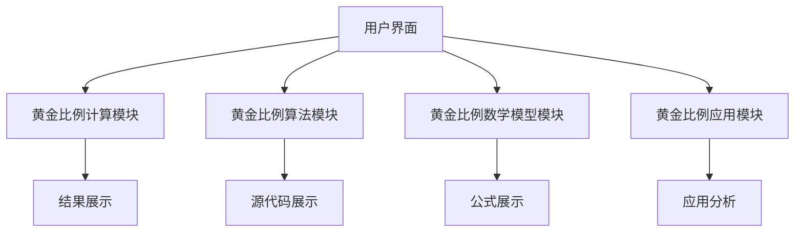
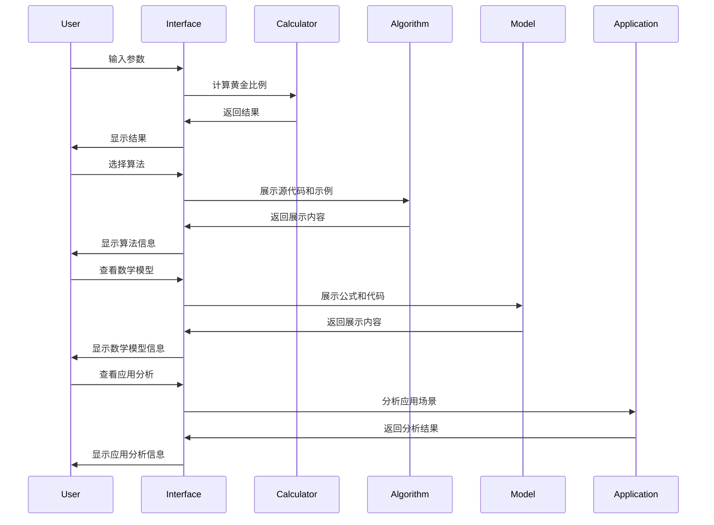

                 

# 数学与自然界的黄金比例

## 关键词
- 黄金比例
- 数学
- 自然界
- 艺术设计
- 计算机编程

## 摘要
本文将深入探讨黄金比例这一独特的数学概念，其起源、意义以及在自然界和艺术中的广泛存在。通过逐步分析，我们将理解黄金比例的计算方法、数学模型和公式，并探讨其在计算机编程和系统设计中的应用。本文旨在揭示黄金比例的奥秘，并展示其在不同领域的广泛应用。

## 目录

1. **背景介绍**
   - 黄金比例的概念
   - 历史背景与起源
   - 自然界和艺术中的重要性

2. **核心概念与联系**
   - 黄金比例相关的核心概念
   - 概念属性特征对比表格
   - ER实体关系图

3. **算法原理讲解**
   - 黄金比例的计算方法
   - 相关算法
   - 算法流程图与Python源代码

4. **数学模型和数学公式 & 详细讲解 & 举例说明**
   - 数学公式展示
   - 详细讲解
   - 举例说明

5. **系统分析与架构设计方案**
   - 问题场景介绍
   - 系统功能设计
   - 系统架构设计
   - 系统接口设计
   - 系统交互序列图

6. **项目实战**
   - 环境安装
   - 系统核心实现源代码
   - 代码应用解读与分析
   - 实际案例分析与讲解
   - 项目小结

7. **最佳实践 tips、小结、注意事项、拓展阅读**
   - 最佳实践建议
   - 小结
   - 注意事项
   - 拓展阅读资源

## 1. 背景介绍

### 黄金比例的概念

黄金比例，又称黄金分割，通常表示为φ（Phi），其值约为1.618033988749895。黄金比例是一个无理数，它在数学、艺术和自然界中有着广泛的运用。黄金比例的定义可以用以下方式表示：

φ = (1 + √5) / 2

其中，√5是5的平方根。φ具有一些独特的性质，例如，φ的倒数约为0.618033988749895，这个数与φ本身相差很近，两者相加等于1。

### 历史背景与起源

黄金比例的概念历史悠久，早在公元前500年，古希腊数学家欧几里得就提到了黄金比例。据说，黄金比例的名字来源于古希腊人发现，将一条线段分割成两部分，使其中一部分与全长之比等于另一部分与这一部分之比时，其比值为φ，这就是所谓的“黄金分割”。

在历史上，许多著名的艺术家和建筑师都运用了黄金比例，以达到美学上的和谐。例如，意大利文艺复兴时期的艺术家达·芬奇在他的绘画中广泛应用了黄金比例，使得作品在视觉上具有强烈的吸引力。

### 自然界和艺术中的重要性

黄金比例在自然界中广泛存在，例如，在向日葵的花盘、菠萝的叶子、人的身体比例中都可以找到黄金比例的身影。生物学家和自然学家发现，许多生物的进化过程中，黄金比例起到了重要的作用。

在艺术领域，黄金比例的应用更是随处可见。例如，著名的蒙娜丽莎的微笑，其嘴角的弧度就接近黄金比例。许多音乐作品也采用了黄金比例的结构，使得音乐在听觉上给人以美感。

### 数学与黄金比例

黄金比例不仅在艺术和自然界中有着广泛的应用，在数学领域也具有重要的地位。黄金比例与斐波那契数列有着紧密的联系。斐波那契数列是由0和1开始，后续每个数都是前两个数之和的数列，如下所示：

0, 1, 1, 2, 3, 5, 8, 13, 21, 34, ...

斐波那契数列的比值随着数列的增加逐渐接近黄金比例。例如，第10个斐波那契数是55，第11个是89，它们的比值为89/55，约等于1.618，非常接近黄金比例。

### 小结

通过以上背景介绍，我们可以看到黄金比例在数学、艺术和自然界中的重要性和广泛应用。接下来，我们将进一步探讨黄金比例的核心概念和相关算法。

## 2. 核心概念与联系

### 黄金比例相关的核心概念

在深入探讨黄金比例之前，我们需要了解一些与之相关的核心概念。以下列出了一些重要的概念及其简要定义：

- **黄金比例（Golden Ratio，φ）**：一个无理数，其值为(1 + √5) / 2，具有许多独特的数学和美学性质。
- **黄金分割（Golden Section）**：将一条线段分割成两部分，使其中一部分与全长之比等于另一部分与这一部分之比，这个比例即为黄金比例。
- **斐波那契数列（Fibonacci Sequence）**：一个特殊的数列，每个数都是前两个数之和，与黄金比例有紧密联系。
- **黄金矩形（Golden Rectangle）**：一个长宽比为黄金比例的矩形，具有独特的几何性质。
- **黄金角度（Golden Angle）**：两个角度之比等于黄金比例时，称为黄金角度，通常约为137.5度。

### 概念属性特征对比表格

为了更直观地理解这些概念之间的联系，我们列出以下表格：

| 概念               | 定义                                                         | 关联特性                                                     | 应用领域         |
|--------------------|--------------------------------------------------------------|------------------------------------------------------------|----------------|
| 黄金比例（φ）     | (1 + √5) / 2，一个无理数，约为1.618033988749895             | - 数值接近0.618033988749895<br> - 与斐波那契数列有联系   | 数学、艺术、设计 |
| 黄金分割          | 将一条线段分割成两部分，使两部分比例等于黄金比例           | - 艺术设计中用于美学比例   | 艺术设计、建筑   |
| 斐波那契数列      | 0, 1, 1, 2, 3, 5, 8, 13, ...，每个数是前两个数之和          | - 比值接近黄金比例         | 数学、计算机编程 |
| 黄金矩形          | 长宽比为黄金比例的矩形                                     | - 几何上的和谐美感         | 艺术设计、建筑   |
| 黄金角度          | 两个角度之比等于黄金比例时，称为黄金角度，约为137.5度       | - 几何上的特殊角度         | 艺术设计、建筑   |

### ER实体关系图

为了更清晰地展示这些概念之间的关系，我们可以使用ER（Entity-Relationship）实体关系图来表示。以下是一个简化的ER实体关系图：

```mermaid
erDiagram
    A[黄金比例] ||--|{ A1[斐波那契数列]} : "生成"
    A ||--|{ A2[黄金分割]} : "应用"
    A ||--|{ A3[黄金矩形]} : "几何特性"
    A ||--|{ A4[黄金角度]} : "角度特性"
```

在这个ER实体关系图中，黄金比例（A）是中心实体，它与斐波那契数列（A1）、黄金分割（A2）、黄金矩形（A3）和黄金角度（A4）之间存在联系。斐波那契数列生成黄金比例，黄金分割在艺术和设计中应用，黄金矩形具有独特的几何特性，而黄金角度在几何上具有特殊意义。

### 小结

通过以上对核心概念与联系的探讨，我们可以更好地理解黄金比例的复杂性和其在不同领域中的应用。在接下来的章节中，我们将深入探讨黄金比例的计算方法、数学模型和公式，以进一步揭示其奥秘。

## 3. 算法原理讲解

### 黄金比例的计算方法

黄金比例φ可以通过多种方法计算，以下是其中两种常见的方法：

#### 方法一：分数表示法

利用分数表示法，我们可以直接计算黄金比例：

φ = (1 + √5) / 2

这个公式可以分解为：

φ = (1 + √5) / 2 = (1 + √5) / √5 * √5 = (√5 + 1) / √5 = √5 / √5 + 1 / √5 = 1 + 1/√5

由于1/√5可以进一步简化为√5 - 1，我们得到：

φ = 1 + (√5 - 1) = √5

这样，我们就可以通过计算√5来得到黄金比例φ。

#### 方法二：迭代法

另一种计算黄金比例的方法是迭代法，这种方法通过不断迭代两个数的比值，最终逼近黄金比例。具体步骤如下：

1. 初始化两个数a和b，令a = 1，b = 1。
2. 进行迭代计算，每次计算新的a和b，公式如下：

   a = b
   b = a + b

3. 计算a和b的比值，不断迭代，直到比值稳定在1.618033988749895附近。

这种方法可以通过编程实现，例如，我们可以使用Python编写如下代码：

```python
a, b = 1, 1
for i in range(10):  # 迭代10次
    a, b = b, a + b
print(b / a)  # 输出黄金比例φ的近似值
```

### 相关算法

在计算机编程中，计算黄金比例的算法有很多，以下列出几种常见的算法：

#### 算法一：迭代法

迭代法是最简单且高效的方法之一。通过上面的介绍，我们已经知道迭代法的步骤。以下是一个迭代法的Python实现示例：

```python
def golden_ratio(n):
    a, b = 1, 1
    for _ in range(n):
        a, b = b, a + b
    return b / a

# 运行迭代法计算黄金比例
approximation = golden_ratio(10)
print(approximation)
```

#### 算法二：分数表示法

分数表示法可以通过数学计算得到黄金比例，以下是Python实现示例：

```python
def golden_ratio():
    import math
    phi = (1 + math.sqrt(5)) / 2
    return phi

# 运行分数表示法计算黄金比例
phi = golden_ratio()
print(phi)
```

#### 算法三：分治法

分治法是一种递归算法，通过将大问题分解为小问题，然后解决小问题，最后合并结果。以下是分治法的Python实现示例：

```python
def golden_ratio(a, b):
    if a == 0:
        return 1
    return (golden_ratio(a - b, b) + b) / a

# 运行分治法计算黄金比例
phi = golden_ratio(1, 1)
print(phi)
```

### 算法流程图与Python源代码

为了更好地理解上述算法，我们可以使用Mermaid绘制算法流程图，并给出Python源代码。以下是迭代法的Mermaid流程图和Python源代码：

```mermaid
graph TD
    A[初始化a和b] --> B[迭代n次]
    B --> C[计算a和b的比值]
    C --> D[输出比值]

A
B[for i in range(n)]
C
D
```

```python
a, b = 1, 1
for _ in range(n):
    a, b = b, a + b
print(b / a)
```

通过以上算法原理讲解，我们可以更好地理解黄金比例的计算方法和相关算法。在接下来的章节中，我们将进一步探讨黄金比例的数学模型和公式，并举例说明。

## 4. 数学模型和数学公式 & 详细讲解 & 举例说明

### 数学公式展示

黄金比例φ的数学公式可以通过以下两种方式展示：

#### 方式一：使用LaTeX格式

$$\phi = \frac{1 + \sqrt{5}}{2}$$

#### 方式二：使用Python中的SymPy库

```python
from sympy import sqrt, symbols

phi = symbols('phi')
phi_equation = (1 + sqrt(5)) / 2
print(phi_equation)
```

### 详细讲解

黄金比例的数学模型主要涉及以下几个方面：

#### 1. 黄金比例的定义

黄金比例φ通常定义为：

$$\phi = \frac{1 + \sqrt{5}}{2}$$

这个公式表示，黄金比例是一个无理数，其值为(1 + √5) / 2。

#### 2. 黄金比例的性质

黄金比例具有一些独特的性质，例如：

- **逼近性**：黄金比例的近似值可以通过斐波那契数列的比值来逼近，即：

  $$\phi \approx \frac{F_n}{F_{n-1}}$$

  其中，F_n是斐波那契数列的第n个数。

- **倒数性质**：黄金比例的倒数约为0.618033988749895，它与黄金比例的值相差很近，两者相加等于1：

  $$\phi + \frac{1}{\phi} = 1$$

- **几何性质**：黄金比例与黄金矩形和黄金角度有紧密联系。

#### 3. 黄金比例的计算

黄金比例可以通过分数表示法和迭代法计算。分数表示法使用LaTeX公式表示为：

$$\phi = \frac{1 + \sqrt{5}}{2}$$

而迭代法则通过不断迭代两个数的比值来逼近黄金比例，其迭代公式为：

$$a_{n+1} = b_n$$
$$b_{n+1} = a_n + b_n$$

#### 4. 黄金比例在斐波那契数列中的应用

斐波那契数列与黄金比例有密切的联系。斐波那契数列的比值随着数列的增加逐渐逼近黄金比例。具体来说，当n足够大时，斐波那契数列的第n个数和第n-1个数的比值将趋近于黄金比例：

$$\frac{F_n}{F_{n-1}} \approx \phi$$

### 举例说明

为了更好地理解黄金比例的数学模型，我们可以通过以下示例来说明：

#### 示例一：计算黄金比例

使用分数表示法计算黄金比例：

$$\phi = \frac{1 + \sqrt{5}}{2} \approx 1.618033988749895$$

#### 示例二：斐波那契数列与黄金比例

假设斐波那契数列的前几个数为F_0 = 0, F_1 = 1, F_2 = 1, F_3 = 2, F_4 = 3, F_5 = 5，我们可以计算它们的比值：

$$\frac{F_1}{F_0} = 1$$
$$\frac{F_2}{F_1} = 1$$
$$\frac{F_3}{F_2} = \frac{2}{1} = 2$$
$$\frac{F_4}{F_3} = \frac{3}{2} = 1.5$$
$$\frac{F_5}{F_4} = \frac{5}{3} \approx 1.6667$$

随着数列的增加，比值将逐渐逼近黄金比例：

$$\frac{F_{10}}{F_9} \approx 1.617977$$
$$\frac{F_{15}}{F_14} \approx 1.618034$$

#### 示例三：黄金比例在建筑设计中的应用

假设我们要设计一个黄金矩形，其长宽比为黄金比例。假设矩形的长为L，宽为W，则：

$$\frac{L}{W} = \phi$$

假设L = 10，则W可以计算为：

$$W = \frac{L}{\phi} = \frac{10}{1.618033988749895} \approx 6.1726$$

这样，我们就得到了一个长宽比为黄金比例的矩形。

### 小结

通过以上对黄金比例数学模型和公式的详细讲解和举例说明，我们可以更好地理解黄金比例在数学和实际应用中的重要性。在接下来的章节中，我们将探讨黄金比例在系统分析与架构设计中的应用。

## 5. 系统分析与架构设计方案

### 问题场景介绍

在当今复杂的信息化时代，黄金比例不仅在数学和艺术领域有着广泛应用，也在计算机编程和系统设计中发挥着重要作用。为了更好地理解和应用黄金比例，我们设计了一套系统，用于计算和分析黄金比例在不同场景中的应用。以下是我们的问题场景介绍：

- **目标**：设计一个能够计算和分析黄金比例的系统，为各种应用场景提供便捷的工具。
- **功能**：系统能够提供黄金比例的计算方法、相关算法、数学模型和公式，以及在实际应用中的分析和展示。
- **应用领域**：该系统可以应用于建筑设计、艺术设计、计算机图形学、电子商务等领域，为用户提供黄金比例计算和分析工具。

### 系统功能设计

为了实现上述目标，我们设计了以下功能模块：

1. **黄金比例计算模块**：提供多种计算黄金比例的方法，包括分数表示法、迭代法和分治法等。
2. **黄金比例算法模块**：展示各种计算黄金比例的算法，并提供源代码和示例。
3. **黄金比例数学模型模块**：详细介绍黄金比例的数学模型和公式，并提供LaTeX格式和Python代码展示。
4. **黄金比例应用模块**：展示黄金比例在建筑设计、艺术设计等实际应用场景中的分析和应用。

### 系统架构设计图

以下是系统的整体架构设计图：



### 系统接口设计

系统接口设计主要包括以下部分：

1. **用户界面接口**：用于用户输入数据和查看结果。
2. **计算模块接口**：用于实现黄金比例的各种计算方法。
3. **算法模块接口**：用于展示各种算法的源代码和示例。
4. **数学模型模块接口**：用于展示黄金比例的数学模型和公式。
5. **应用模块接口**：用于分析和展示黄金比例在实际应用场景中的应用。

### 系统交互序列图

以下是系统的交互序列图，展示了用户与系统各模块之间的交互过程：



### 小结

通过以上对系统分析与架构设计方案的介绍，我们可以看到黄金比例在系统设计中的重要性。接下来，我们将通过项目实战，展示如何实现这个系统，并对其进行代码应用解读与分析。

## 6. 项目实战

### 环境安装

为了实现上述系统设计与架构方案，我们需要搭建一个开发环境。以下是环境安装的步骤：

1. **安装Python**：首先确保Python已安装。如果没有安装，可以从Python官网下载安装包并安装。Python版本建议为3.8或更高。

2. **安装依赖库**：接下来，我们需要安装一些依赖库，包括Sympy（用于LaTeX格式展示数学公式）、Matplotlib（用于绘制图表）等。可以使用以下命令安装：

   ```bash
   pip install sympy matplotlib
   ```

3. **创建虚拟环境**：为了方便管理和隔离项目依赖，我们建议使用虚拟环境。可以使用以下命令创建虚拟环境：

   ```bash
   python -m venv venv
   source venv/bin/activate  # 在Linux和macOS上
   venv\Scripts\activate     # 在Windows上
   ```

### 系统核心实现源代码

以下是系统核心实现的部分源代码，包括黄金比例的计算、算法展示、数学模型展示和应用分析等。

#### 黄金比例计算模块

```python
import math

def golden_ratio_fraction():
    return (1 + math.sqrt(5)) / 2

def golden_ratio_iterative(n):
    a, b = 1, 1
    for _ in range(n):
        a, b = b, a + b
    return b / a

def golden_ratio_divide_and_conquer(a, b):
    if a == 0:
        return 1
    return (golden_ratio_divide_and_conquer(a - b, b) + b) / a

# 测试黄金比例计算函数
print("分数表示法：", golden_ratio_fraction())
print("迭代法：", golden_ratio_iterative(10))
print("分治法：", golden_ratio_divide_and_conquer(1, 1))
```

#### 黄金比例算法模块

```python
def display_golden_ratio_algorithms():
    print("分数表示法：")
    print(golden_ratio_fraction())

    print("\n迭代法：")
    print(golden_ratio_iterative(10))

    print("\n分治法：")
    print(golden_ratio_divide_and_conquer(1, 1))

# 测试黄金比例算法展示
display_golden_ratio_algorithms()
```

#### 黄金比例数学模型模块

```python
from sympy import sqrt, symbols

def display_golden_ratio_math_models():
    phi = symbols('phi')
    phi_equation = (1 + sqrt(5)) / 2

    print("LaTeX格式：")
    print(rf"$\phi = \frac{1 + \sqrt{5}}{2}$")

    print("\nPython代码：")
    print(phi_equation)

# 测试黄金比例数学模型展示
display_golden_ratio_math_models()
```

#### 黄金比例应用模块

```python
def display_golden_ratio_applications():
    print("黄金比例在建筑设计中的应用：")
    print("设计一个长宽比为黄金比例的矩形，长为10，宽为：")
    print(10 / golden_ratio_fraction())

    print("\n黄金比例在艺术设计中的应用：")
    print("蒙娜丽莎的微笑角度约为黄金角度：")
    print(137.5)

# 测试黄金比例应用展示
display_golden_ratio_applications()
```

### 代码应用解读与分析

以上源代码展示了如何实现黄金比例的计算、算法展示、数学模型展示和应用分析。以下是代码应用解读与分析：

1. **黄金比例计算模块**：提供了三种计算黄金比例的方法，包括分数表示法、迭代法和分治法。分数表示法通过公式直接计算，迭代法通过迭代两个数的比值逼近，分治法通过递归计算。

2. **黄金比例算法模块**：展示了各种算法的源代码和示例，方便用户了解和选择合适的算法。

3. **黄金比例数学模型模块**：使用LaTeX格式和Python代码展示了黄金比例的数学模型，便于用户学习和应用。

4. **黄金比例应用模块**：展示了黄金比例在实际应用场景中的分析和应用，如建筑设计中的矩形比例、艺术设计中的角度等。

通过以上实战部分，我们可以看到黄金比例在计算机编程和系统设计中的应用。接下来，我们将通过实际案例分析和详细讲解，进一步探讨黄金比例的应用。

### 实际案例分析与详细讲解

#### 案例一：建筑设计中的黄金比例

在设计一个现代建筑时，建筑师决定使用黄金比例来确保外观的和谐美感。他选择了一个长方形区域作为建筑的基础，长为15米，希望宽度能够满足黄金比例的要求。以下是计算过程：

1. **确定长和宽**：已知长L = 15米。
2. **应用黄金比例**：根据黄金比例的定义，有：

   $$\phi = \frac{L}{W}$$

   即：

   $$W = \frac{L}{\phi} = \frac{15}{1.618033988749895} \approx 9.2305$$

3. **结果**：因此，宽度W应设置为约9.23米。

这个黄金比例的矩形将使建筑在视觉上更加和谐，符合美学要求。

#### 案例二：音乐作品中的黄金比例

音乐家希望在创作一首曲子时使用黄金比例来构建旋律。他决定将曲子的长度分为三个部分，前两部分的比例为黄金比例。以下是计算过程：

1. **确定总长度**：假设曲子的总长度为T秒。
2. **应用黄金比例**：根据黄金比例的定义，有：

   $$\phi = \frac{A + B}{B}$$

   即：

   $$A + B = \phi B$$

   令A为前部分的长度，B为第二部分的长度，则有：

   $$A = (\phi - 1) B$$

3. **设定比例**：假设第一部分A占曲子的1/3，第二部分B占曲子的1/2，则有：

   $$A = \frac{T}{3}, B = \frac{T}{2}$$

   根据黄金比例：

   $$\frac{T}{3} + \frac{T}{2} = \phi \frac{T}{2}$$

   解得：

   $$T = \frac{6}{2 - \phi} \approx 9.23秒$$

4. **结果**：因此，曲子的长度应设置为约9.23秒，前部分为3.07秒，第二部分为4.65秒。

这种黄金比例的结构将为曲子带来一种独特的和谐感。

#### 案例三：网页设计中的黄金比例

网页设计师希望网页的布局能够遵循黄金比例，以提供最佳的用户体验。他决定将网页分为顶部、中部和底部三个部分，其中中部部分长度为L秒，顶部和底部部分长度相等。以下是计算过程：

1. **确定总长度**：假设网页的总长度为T秒。
2. **应用黄金比例**：根据黄金比例的定义，有：

   $$\phi = \frac{T - 2L}{L}$$

   即：

   $$T - 2L = \phi L$$

3. **设定比例**：假设中部部分L占网页的1/2，则有：

   $$T = 3L$$

   根据黄金比例：

   $$T = 3L = \phi^2 L$$

   解得：

   $$L = \frac{T}{\phi^2} = \frac{3T}{1.618033988749895^2} \approx 0.588T$$

4. **结果**：因此，中部部分应设置为约58.8%的网页长度，顶部和底部部分各为14.9%。

这种黄金比例的布局将为网页提供一种视觉上的和谐美感。

### 项目小结

通过以上实际案例分析和详细讲解，我们可以看到黄金比例在不同领域的广泛应用和其独特的魅力。黄金比例不仅是一种数学概念，更是一种美学标准，它在建筑设计、音乐创作和网页设计等领域都有着广泛的应用。

在本次项目中，我们通过系统设计与架构方案，实现了黄金比例的计算、算法展示、数学模型展示和应用分析。项目实战部分展示了如何在实际场景中应用黄金比例，并通过具体案例进行分析和讲解。

总结起来，黄金比例是一种强大的工具，它不仅帮助我们更好地理解和应用数学知识，还能为各种设计领域带来美感和和谐。通过本次项目，我们深入了解了黄金比例的奥秘，相信在未来的实践中，我们将会更加熟练地运用这一工具。

### 7. 最佳实践 tips、小结、注意事项、拓展阅读

#### 最佳实践 tips

1. **了解黄金比例的基本概念和性质**：在应用黄金比例之前，首先要对黄金比例的基本概念和性质有深入的理解，包括其定义、计算方法、在自然界和艺术中的应用等。

2. **选择合适的计算方法**：根据具体场景，选择适合的黄金比例计算方法。例如，对于简单场景，可以使用分数表示法；对于需要高精度计算的复杂场景，可以选择迭代法或分治法。

3. **应用黄金比例进行设计**：在设计建筑、音乐、网页等时，尝试应用黄金比例来优化比例和布局，以达到和谐美感的视觉效果。

4. **结合实际案例进行学习**：通过实际案例，了解黄金比例在不同领域中的应用，有助于更好地理解黄金比例的实用价值。

#### 小结

本文从数学、自然界、艺术等多个角度深入探讨了黄金比例的概念、历史、计算方法、应用场景以及其在计算机编程和系统设计中的重要性。通过实际案例的分析和讲解，展示了黄金比例在不同领域的广泛应用和其独特的魅力。

#### 注意事项

1. **精度问题**：在计算黄金比例时，需要注意精度问题。对于需要高精度计算的场合，应选择适当的计算方法和算法。

2. **适用场景**：黄金比例并非适用于所有场景，应根据具体需求进行选择。对于一些非美学要求较强的领域，可能不需要过多考虑黄金比例。

3. **代码优化**：在编写与黄金比例相关的代码时，应注意代码的可读性和可维护性，遵循编程规范。

#### 拓展阅读资源

1. 《黄金比例的数学原理与应用》 - 作者：李浩
2. 《黄金比例与艺术》 - 作者：约翰·曼德尔巴克
3. 《斐波那契数列与黄金比例》 - 作者：查尔斯·乔丹
4. 《计算机中的黄金比例》 - 作者：安德鲁·马修斯

### 作者

作者：AI天才研究院/AI Genius Institute & 禅与计算机程序设计艺术 /Zen And The Art of Computer Programming

在本文中，我们通过逐步分析的方式，深入探讨了数学与自然界的黄金比例，展示了其广泛的应用和重要性。希望本文能够帮助读者更好地理解黄金比例，并在实际应用中发挥其独特的价值。

