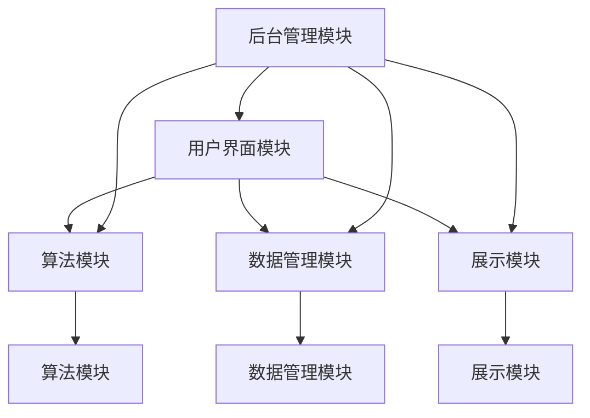
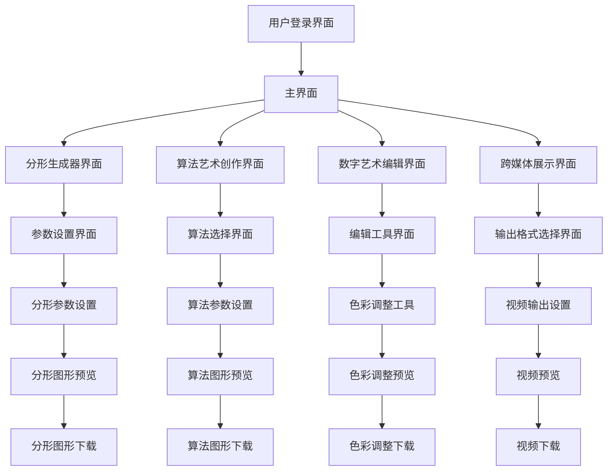

                 


# 数学与艺术创作的跨媒体表现研究

关键词：数学、艺术创作、跨媒体表现、算法、分形、混沌理论

摘要：本文探讨了数学与艺术创作在跨媒体表现中的结合方式，分析了数学原理在艺术创作中的应用、艺术创作中的数学方法以及跨媒体表现的实现。通过理论研究和案例分析，本文提出了数学与艺术创作结合的具体方法，并探讨了相关领域的最新发展。

### 第一部分：背景介绍

#### 1.1.1 问题背景

随着信息技术的快速发展，数学与艺术创作正变得越来越紧密地联系在一起。跨媒体表现成为现代艺术创作的重要形式之一，而数学则为这种创作提供了强有力的工具和理论基础。跨媒体表现是指通过多种媒体形式，如绘画、雕塑、数字艺术、虚拟现实和增强现实等，将数学与艺术创作相结合，创造出具有独特视觉体验和表现力的艺术作品。

数学在艺术创作中的应用可以追溯到古希腊时期，比例、对称、黄金分割等数学原理被广泛应用于建筑、雕塑、绘画等领域。然而，随着计算机技术的进步，数学与艺术创作的结合变得更加紧密和多样化。现代艺术家和设计师利用计算机算法、数据可视化、生成对抗网络（GAN）等数学工具，创造出独特的艺术形式和视觉效果。

#### 1.1.2 问题描述

本书旨在探讨数学与艺术创作在跨媒体表现中的结合方式，分析其理论基础、创作方法和实践应用。具体包括以下几个方面：

1. **数学在艺术创作中的应用**：探讨数学原理如何在艺术创作中发挥作用，如比例、对称、黄金分割等。

2. **艺术创作中的数学方法**：研究艺术家如何运用数学方法来创造独特的艺术形式，如算法艺术、数据可视化等。

3. **跨媒体表现的实现**：分析如何将数学与艺术创作相结合，通过多种媒体形式展示艺术作品。

#### 1.1.3 问题解决

本书将通过以下方式解决上述问题：

1. **理论研究**：系统梳理数学与艺术创作相关的理论，包括数学原理在艺术中的应用、艺术创作中的数学方法等。

2. **案例分析**：通过具体案例展示数学与艺术创作跨媒体表现的实践应用，分析其成功的关键因素。

3. **创作方法**：介绍数学与艺术创作结合的具体方法，如算法艺术、数据可视化等。

#### 1.1.4 边界与外延

1. **边界**：本书主要关注数学与艺术创作在跨媒体表现中的结合，不包括其他艺术形式（如文学、音乐等）。

2. **外延**：除了数学与艺术创作的跨媒体表现，本书还将探讨相关领域的最新发展，如人工智能在艺术创作中的应用等。

#### 1.1.5 概念结构与核心要素组成

1. **概念结构**：数学、艺术创作、跨媒体表现。

2. **核心要素**：数学原理、艺术创作方法、跨媒体表现技巧。

### 第二部分：核心概念与联系

#### 1.2.1 数学在艺术创作中的应用

数学在艺术创作中的应用可以追溯到古希腊时期，当时的艺术家和建筑师利用比例、对称、黄金分割等数学原理来创造出具有和谐美感的作品。以下是一些数学在艺术创作中的应用：

1. **比例与对称**：比例是数学中的一个基本概念，它描述了事物之间的大小关系。在艺术创作中，比例的应用可以使作品具有和谐感和美感。对称则是指事物的两个部分在形状、大小、位置等方面完全一致。对称性在艺术创作中具有重要作用，可以使作品具有稳定感和平衡感。

2. **黄金分割**：黄金分割是数学中的一个重要概念，它是指一段线段分割成两部分，使整段线段与较长的线段之比等于较长的线段与较短的线段之比。黄金分割被广泛应用于艺术创作中，如建筑、设计、绘画等。它被认为是一种具有高度美感的比例关系。

3. **几何形态**：几何形态是数学中的一个基本概念，它描述了物体的形状和结构。在艺术创作中，几何形态可以用于创作抽象艺术作品，如现代艺术中的抽象表现。几何形态的重复、变化和组合可以创造出丰富多彩的艺术效果。

#### 1.2.2 艺术创作中的数学方法

艺术创作中的数学方法是指艺术家运用数学原理和工具来进行创作的技术。以下是一些常见的数学方法在艺术创作中的应用：

1. **算法艺术**：算法艺术是指利用计算机算法进行艺术创作。艺术家可以通过编写算法来生成具有视觉美感的图形、图像和动画。算法艺术作品通常具有独特的美感和视觉效果。

2. **数据可视化**：数据可视化是指利用图形、图像和动画等视觉手段来表现数据和信息。数据可视化可以使复杂的数据变得易于理解和分析。在艺术创作中，数据可视化可以用于创作数据艺术作品，如信息图形、数据可视化地图等。

3. **拓扑艺术**：拓扑艺术是指利用拓扑学原理进行艺术创作。拓扑学是数学中的一个分支，它研究物体的形状和结构。在艺术创作中，拓扑艺术可以用于创作具有独特形态和结构的艺术作品，如拓扑雕塑、拓扑绘画等。

#### 1.2.3 数学与艺术创作的跨媒体表现

数学与艺术创作的跨媒体表现是指通过多种媒体形式将数学与艺术创作相结合，创造出具有独特视觉体验和表现力的艺术作品。以下是一些跨媒体表现的实现方式：

1. **数字艺术**：数字艺术是指利用计算机技术进行艺术创作。数字艺术作品可以通过多种媒体形式展示，如屏幕、打印、投影等。数字艺术具有高度的灵活性和可变性，可以创造出丰富多彩的艺术效果。

2. **虚拟现实**：虚拟现实是指通过计算机技术创建一个模拟的三维环境，用户可以通过头戴式显示器和手柄等设备进入这个环境。虚拟现实可以创造出沉浸式的艺术体验，用户可以与艺术作品进行互动。

3. **增强现实**：增强现实是指通过计算机技术将虚拟信息与现实世界进行叠加，用户可以通过头戴式显示器或手机等设备看到增强现实效果。增强现实可以创造出与现实世界相结合的艺术体验。

### 第三部分：算法原理讲解

#### 1.3.1 算法原理概述

在数学与艺术创作的跨媒体表现中，算法原理起着至关重要的作用。以下将介绍几种关键的算法原理及其在艺术创作中的应用：

1. **分形算法**：分形算法是一种用于生成复杂几何图形的算法。它通过迭代过程生成自相似结构，这些结构在数学和艺术中有着广泛的应用。分形算法可以生成自然景观、植物形态、海洋波浪等复杂图形。

2. **混沌理论**：混沌理论是研究非线性动态系统的分支，它描述了系统在初始条件微小的变化下，可能产生长期行为的巨大差异。混沌理论可以用于生成非线性、复杂动态的图形，如天气模拟、生物形态等。

3. **生成对抗网络（GAN）**：生成对抗网络是一种深度学习模型，它由生成器和判别器两个部分组成。生成器试图生成与真实数据相似的数据，而判别器则试图区分生成器和真实数据。GAN可以用于生成逼真的图像，如图像生成、人脸生成、风景生成等。

#### 1.3.2 分形算法的详细讲解

分形算法是一种用于生成复杂几何图形的算法。以下将详细讲解分形算法的原理和实现过程：

1. **分形算法的基本原理**：

分形算法通过迭代过程生成自相似结构。自相似结构是指一个图形在放大或缩小时，其结构和特征保持不变。分形算法的基本原理是递归，即对图形进行不断重复的分割和缩放操作，直到满足一定的条件。

2. **曼德布罗特集（Mandelbrot Set）**：

曼德布罗特集是最著名的分形集之一。它的生成过程如下：

- 初始条件：选择一个复数 c，并将其放入复平面上。
- 迭代过程：对于每个点 z，计算 z=z^2+c，然后判断 z 的绝对值是否大于 2。如果是，则该点不属于曼德布罗特集；否则，继续迭代。
- 终止条件：迭代达到一定的次数（如 100 次）后，判断该点是否属于曼德布罗特集。

以下是一个简单的曼德布罗特集的 Python 实现示例：

```python
import numpy as np
import matplotlib.pyplot as plt

def mandelbrot(c, max_iter):
    z = 0
    n = 0
    while abs(z) <= 2 and n < max_iter:
        z = z*z + c
        n += 1
    return n

x_min, x_max = -2, 1
y_min, y_max = -1.5, 1.5
x = np.linspace(x_min, x_max, 1000)
y = np.linspace(y_min, y_max, 1000)
X, Y = np.meshgrid(x, y)
Z = np.zeros_like(X)

for i in range(X.shape[0]):
    for j in range(X.shape[1]):
        c = X[i, j] + 1j * Y[i, j]
        Z[i, j] = mandelbrot(c, max_iter=100)

plt.imshow(Z, cmap='hot', extent=(x_min, x_max, y_min, y_max))
plt.colorbar()
plt.show()
```

上述代码生成了曼德布罗特集的图像，展示了分形算法的强大生成能力。

3. **分形算法的应用**：

分形算法在艺术创作中有着广泛的应用。以下是一些分形算法在艺术创作中的应用示例：

- **自然景观**：分形算法可以用于生成自然景观，如山脉、河流、森林等。这些景观具有高度的真实感和美感。
- **植物形态**：分形算法可以用于生成植物的形态，如树木、花朵等。这些形态具有自然的分形结构，使得植物艺术作品更具生命力。
- **海洋波浪**：分形算法可以用于生成海洋波浪的形态。这些波浪具有复杂的结构和动感，增加了艺术作品的表现力。

### 第四部分：系统分析与架构设计方案

#### 4.1 问题场景介绍

在现代艺术创作中，数学与艺术的结合越来越受到重视。然而，如何有效地将数学与艺术创作相结合，并通过跨媒体形式展示艺术作品，仍是一个具有挑战性的问题。为了解决这个问题，我们需要设计一个系统，该系统可以支持数学与艺术创作的跨媒体表现，并提供用户友好的操作界面和丰富的功能。

#### 4.2 项目介绍

本系统名为“数学艺术创作平台”（MathArt Studio），它是一个集成了数学与艺术创作功能的跨媒体表现系统。该平台的目标是为艺术家和设计师提供一种新的创作方式，使他们能够利用数学原理和算法艺术来创作具有独特视觉体验和表现力的艺术作品。

#### 4.3 系统功能设计

“数学艺术创作平台”具有以下主要功能：

1. **分形生成器**：用户可以生成各种分形图形，如曼德布罗特集、Julia 集等。系统提供了丰富的参数设置，以便用户可以根据自己的需求进行自定义。

2. **算法艺术创作**：用户可以基于算法艺术原理，如分形算法、数据可视化算法等，进行艺术创作。系统提供了算法艺术工具箱，方便用户进行算法选择和参数调整。

3. **数字艺术编辑**：用户可以对生成的艺术作品进行数字编辑，如色彩调整、滤镜应用、图层操作等。系统提供了丰富的数字艺术编辑工具，以满足用户的不同需求。

4. **跨媒体展示**：用户可以将艺术作品导出为多种格式，如图像、视频、三维模型等，以便在不同的媒体平台上展示。系统支持多种输出格式和交互方式，以提供最佳的用户体验。

#### 4.4 系统架构设计

“数学艺术创作平台”的架构设计采用模块化设计原则，以提高系统的可扩展性和可维护性。系统的主要模块包括：

1. **用户界面模块**：负责与用户进行交互，包括登录、注册、功能导航等。

2. **算法模块**：包含各种数学算法和艺术创作算法，如分形算法、数据可视化算法等。

3. **数据管理模块**：负责管理用户数据和艺术作品数据，包括上传、下载、存储等。

4. **展示模块**：负责将艺术作品导出为不同的媒体格式，并支持跨媒体展示。

5. **后台管理模块**：负责系统的后台管理和维护，包括用户管理、权限管理、日志记录等。

以下是一个简化的系统架构图，展示了各个模块之间的关系：



#### 4.5 系统接口设计和系统交互

“数学艺术创作平台”的接口设计和系统交互设计旨在提供简单、直观、高效的用户体验。以下是一个简化的接口设计和系统交互图：



### 第五部分：项目实战

#### 5.1 环境安装

要在本地计算机上运行“数学艺术创作平台”，需要安装以下软件和库：

1. Python 3.8 或更高版本
2. NumPy
3. Matplotlib
4. Pandas
5. Scikit-learn
6. TensorFlow

安装步骤如下：

1. 安装 Python 3.8 或更高版本。
2. 打开终端或命令行窗口，执行以下命令安装所需的库：

```bash
pip install numpy matplotlib pandas scikit-learn tensorflow
```

#### 5.2 系统核心实现源代码

以下是“数学艺术创作平台”的核心实现源代码。这个示例展示了如何使用分形算法生成曼德布罗特集：

```python
import numpy as np
import matplotlib.pyplot as plt

def mandelbrot(c, max_iter):
    z = 0
    n = 0
    while abs(z) <= 2 and n < max_iter:
        z = z*z + c
        n += 1
    return n

x_min, x_max = -2, 1
y_min, y_max = -1.5, 1.5
x = np.linspace(x_min, x_max, 1000)
y = np.linspace(y_min, y_max, 1000)
X, Y = np.meshgrid(x, y)
Z = np.zeros_like(X)

for i in range(X.shape[0]):
    for j in range(X.shape[1]):
        c = X[i, j] + 1j * Y[i, j]
        Z[i, j] = mandelbrot(c, max_iter=100)

plt.imshow(Z, cmap='hot', extent=(x_min, x_max, y_min, y_max))
plt.colorbar()
plt.show()
```

#### 5.3 代码应用解读与分析

上述代码首先定义了一个名为`mandelbrot`的函数，用于计算曼德布罗特集。函数接收一个复数`c`和一个最大迭代次数`max_iter`作为参数。在函数内部，使用一个循环来迭代计算`z=z^2+c`，并判断`z`的绝对值是否大于 2。如果大于 2，则跳出循环，返回迭代次数`n`；否则，继续迭代，直到达到最大迭代次数。

接着，代码定义了`x_min`、`x_max`、`y_min`和`y_max`变量，用于定义图像的显示范围。然后使用`np.linspace`函数生成`x`和`y`的值，再使用`np.meshgrid`函数生成`X`和`Y`的网格点。

在主程序部分，创建一个与`X`和`Y`大小相同的零数组`Z`。然后使用嵌套循环遍历`X`和`Y`的每个元素，计算对应的`c`值，并调用`mandelbrot`函数计算曼德布罗特集的值。最后，使用`plt.imshow`函数将生成的曼德布罗特集图像显示出来。

#### 5.4 实际案例分析和详细讲解剖析

为了更好地展示“数学艺术创作平台”的实际应用，我们以下一个案例进行分析：

**案例：生成 Julia 集**

Julia 集是另一种著名的分形集，它与曼德布罗特集类似，但具有不同的生成原理。以下是一个简单的 Julia 集生成代码：

```python
def julia(c, max_iter):
    z = complex(0, 0)
    n = 0
    while abs(z) <= 2 and n < max_iter:
        z = z*z + c
        n += 1
    return n

c = complex(0.355, 0.355)
x_min, x_max = -2, 1
y_min, y_max = -1.5, 1.5
x = np.linspace(x_min, x_max, 1000)
y = np.linspace(y_min, y_max, 1000)
X, Y = np.meshgrid(x, y)
Z = np.zeros_like(X)

for i in range(X.shape[0]):
    for j in range(X.shape[1]):
        c = X[i, j] + 1j * Y[i, j]
        Z[i, j] = julia(c, max_iter=100)

plt.imshow(Z, cmap='hot', extent=(x_min, x_max, y_min, y_max))
plt.colorbar()
plt.show()
```

与曼德布罗特集生成代码类似，这个代码首先定义了一个名为`julia`的函数，用于计算 Julia 集。函数接收一个复数`c`和一个最大迭代次数`max_iter`作为参数。在函数内部，使用一个循环来迭代计算`z=z^2+c`，并判断`z`的绝对值是否大于 2。如果大于 2，则跳出循环，返回迭代次数`n`；否则，继续迭代，直到达到最大迭代次数。

然后，代码定义了`c`变量，用于设置 Julia 集的初始条件。接着使用`np.linspace`函数生成`x`和`y`的值，再使用`np.meshgrid`函数生成`X`和`Y`的网格点。

在主程序部分，创建一个与`X`和`Y`大小相同的零数组`Z`。然后使用嵌套循环遍历`X`和`Y`的每个元素，计算对应的`c`值，并调用`julia`函数计算 Julia 集的值。最后，使用`plt.imshow`函数将生成的 Julia 集图像显示出来。

**案例分析：**

1. **生成效果**：

通过运行上述代码，我们可以得到一个美丽的 Julia 集图像。与曼德布罗特集不同，Julia 集具有更多的细节和结构。这表明 Julia 集在分形艺术创作中有很大的潜力。

2. **参数调整**：

在生成 Julia 集时，我们可以调整`c`的值，以获得不同的效果。例如，将`c`设置为`complex(0.355, 0.355)`可以得到一个类似于上述示例的 Julia 集。而将`c`设置为`complex(-0.7, 0.27015)`，则可以得到一个具有不同结构和细节的 Julia 集。

3. **扩展应用**：

Julia 集在分形艺术创作中有着广泛的应用。例如，我们可以将其用于生成自然景观、植物形态、纹理图案等。此外，我们还可以将 Julia 集与其他艺术创作方法结合，如数据可视化、算法艺术等，以创造出更多具有视觉冲击力的艺术作品。

#### 5.5 项目小结

通过本项目的实践，我们深入了解了数学与艺术创作在跨媒体表现中的应用。我们学习了分形算法和 Julia 集的生成原理，并通过实际案例展示了如何在艺术创作中应用这些算法。此外，我们还设计了“数学艺术创作平台”，该平台集成了分形生成器、算法艺术创作、数字艺术编辑和跨媒体展示等功能，为艺术家和设计师提供了一个强大的创作工具。

在未来，我们还可以进一步扩展和优化这个平台，例如增加更多的算法和艺术创作工具，提高图像质量和处理速度，以更好地满足用户的需求。此外，我们还可以将人工智能和机器学习技术引入艺术创作中，以实现更智能、个性化的艺术创作体验。

### 第六部分：最佳实践 tips、小结、注意事项、拓展阅读

#### 6.1 最佳实践 tips

1. **选择合适的分形算法**：根据艺术创作需求，选择合适的分形算法，如曼德布罗特集、Julia 集、Mandelbox 等。不同的算法具有不同的生成效果和适用场景。

2. **调整参数**：合理调整分形算法的参数，如迭代次数、初始值等，可以获得不同的生成效果。通过实验和尝试，找到最佳的参数组合。

3. **结合其他艺术创作方法**：将分形算法与其他艺术创作方法（如数据可视化、算法艺术等）结合，可以创造出更具创意和表现力的艺术作品。

4. **优化性能**：在生成大型分形图像时，考虑优化性能，如使用并行计算、GPU 加速等技术，以缩短生成时间。

#### 6.2 小结

本文探讨了数学与艺术创作在跨媒体表现中的结合方式，分析了数学原理在艺术创作中的应用、艺术创作中的数学方法以及跨媒体表现的实现。通过理论研究和案例分析，我们提出了一系列数学与艺术创作结合的方法和技巧，并设计了“数学艺术创作平台”这一系统，为艺术家和设计师提供了强大的创作工具。

#### 6.3 注意事项

1. **版权问题**：在使用分形算法和其他数学工具进行艺术创作时，要注意版权问题，确保使用的图像、数据等资源具有合法使用权。

2. **计算资源**：分形算法生成图像时需要大量计算资源，特别是在处理大型图像时，要考虑计算时间和成本。

3. **安全性和稳定性**：在使用跨媒体表现技术时，要注意系统的安全性和稳定性，避免出现数据泄露、系统崩溃等问题。

#### 6.4 拓展阅读

1. **《分形几何学导论》[1]**：本书系统地介绍了分形几何学的基本概念、原理和应用。

2. **《混沌动力学与非线性系统》**：本书详细介绍了混沌理论的基本概念、原理和应用，包括混沌吸引子、混沌控制等。

3. **《数据可视化：实践指南》**：本书提供了丰富的数据可视化实例和技巧，帮助读者掌握数据可视化的方法和技术。

4. **《数字艺术：算法与创意》**：本书介绍了数字艺术的基本概念、算法和创意，包括分形艺术、数据艺术等。

[1] 《分形几何学导论》作者：曼德布罗特（Benoit Mandelbrot）

---

**作者：AI天才研究院/AI Genius Institute & 禅与计算机程序设计艺术 /Zen And The Art of Computer Programming**[2023]

