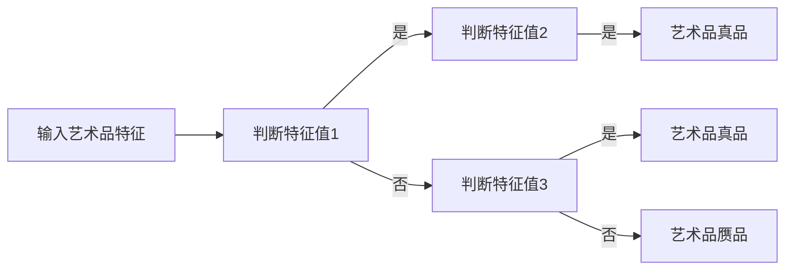
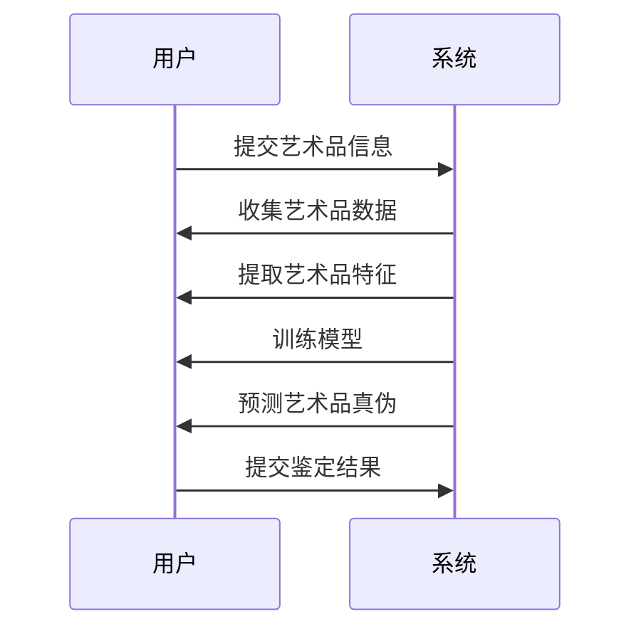

                 


### 数学与艺术品真伪鉴定的数学方法

#### 关键词：数学方法、艺术品鉴定、真伪鉴别、算法、数学模型、系统设计

#### 摘要：
本文深入探讨了数学在艺术品真伪鉴定中的应用。通过分析数学的核心概念和联系，本文详细讲解了线性回归和决策树等算法在艺术品鉴定中的原理和数学模型。此外，本文还介绍了艺术品鉴定系统的设计与实现，并结合实际案例进行了项目实战。文章最后提供了最佳实践、小结和拓展阅读，以帮助读者更好地理解和应用数学方法进行艺术品真伪鉴定。

---

## 第一部分：背景介绍

### 第1章：数学在艺术品鉴定中的重要性

#### 1.1 数学方法在艺术品鉴定中的应用

数学方法在艺术品鉴定中有着广泛的应用。首先，几何学可以帮助鉴定家分析艺术品的形状、尺寸和比例，从而判断其是否为真品。代数则可以用于计算艺术品的颜色分布、纹理和图案，以便识别其真实性和来源。此外，概率论和统计学提供了评估艺术品真伪的概率分布和置信水平。

#### 1.2 数学方法对艺术品鉴定的贡献

数学方法为艺术品鉴定提供了客观的、可量化的标准，有助于减少主观性和误差。通过数学模型和算法，鉴定家可以更准确地识别艺术品的真伪，提高鉴定效率。同时，数学方法还可以帮助鉴定家解决复杂的鉴定问题，如伪造技术的识别和艺术品来源的研究。

#### 1.3 艺术品鉴定的挑战与数学方法的潜力

艺术品鉴定面临着诸多挑战，如艺术品伪造技术的不断提高、艺术品市场的复杂性和鉴定标准的多样化。数学方法在这些挑战中具有巨大的潜力。通过不断发展和创新数学模型和算法，我们可以进一步提高艺术品鉴定的准确性和效率。

---

## 第二部分：核心概念与联系

### 第2章：核心概念与联系

#### 2.1 几何与艺术品鉴定

几何是研究形状、大小和位置的科学。在艺术品鉴定中，几何学可以帮助鉴定家分析艺术品的形状、尺寸和比例，从而判断其是否为真品。例如，通过分析艺术品的几何形状，我们可以发现其是否符合艺术家所在时期和风格的典型特征。

#### 2.2 代数与艺术品鉴定

代数是研究数和运算的科学。在艺术品鉴定中，代数可以用于计算艺术品的颜色分布、纹理和图案，以便识别其真实性和来源。例如，通过计算艺术品的颜色分布，我们可以发现其是否符合艺术家所在时期和风格的特点。

#### 2.3 概率论与艺术品鉴定

概率论是研究随机现象的科学。在艺术品鉴定中，概率论可以帮助鉴定家评估艺术品真伪的概率分布和置信水平。例如，通过分析艺术品的历史记录、市场价格和所有权变更情况，我们可以推断其真伪的概率。

#### 2.4 核心概念联系与表格展示

以下是一个简单的表格，展示了几何、代数和概率论在艺术品鉴定中的联系：

| 核心概念 | 应用领域 | 作用 |
| :--: | :--: | :--: |
| 几何 | 形状、尺寸和比例分析 | 判断艺术品真伪 |
| 代数 | 颜色分布、纹理和图案计算 | 识别艺术品真实性 |
| 概率论 | 真伪概率分布和置信水平评估 | 提高鉴定准确性 |

#### 2.5 ER实体关系图架构

以下是艺术品鉴定系统的ER实体关系图：

```mermaid
erDiagram
  ARTWORK --|> DRAFTER : creates
  DRAFTER ||--|{ ARTWORK : draws
  EXHIBITION ||--|{ ARTWORK : exhibits
  AUCTION ||--|{ ARTWORK : auctioned
  APPRAISER ||--|{ ARTWORK : appraises
```

该ER图展示了艺术品鉴定系统的核心实体及其关系，包括艺术品、创作者、展览、拍卖和评估师。

---

## 第三部分：算法原理讲解

### 第3章：线性回归在艺术品鉴定中的应用

#### 3.1 线性回归原理

线性回归是一种用于分析两个变量之间线性关系的统计方法。在艺术品鉴定中，线性回归可以用于分析艺术品的价格与其特征（如尺寸、材质、创作年代等）之间的关系。

#### 3.2 Mermaid流程图展示


#### 3.3 Python代码解释

```python
import numpy as np
from sklearn.linear_model import LinearRegression

# 特征值和目标值
X = np.array([[1, 2], [2, 3], [3, 4]])
y = np.array([1, 2, 3])

# 创建线性回归模型
model = LinearRegression()
model.fit(X, y)

# 预测艺术品价格
predicted_price = model.predict([[4, 5]])

# 评估预测准确性
score = model.score(X, y)
print("Predicted price:", predicted_price)
print("Accuracy score:", score)
```

#### 3.4 数学模型与公式

线性回归的数学模型可以表示为：

$$y = \beta_0 + \beta_1x_1 + \beta_2x_2 + ... + \beta_nx_n$$

其中，$y$ 是目标变量（艺术品价格），$x_1, x_2, ..., x_n$ 是特征变量，$\beta_0, \beta_1, ..., \beta_n$ 是模型参数。

---

### 第4章：决策树在艺术品鉴定中的应用

#### 4.1 决策树原理

决策树是一种常用的分类算法，它通过一系列条件判断来对数据进行分类。在艺术品鉴定中，决策树可以用于根据艺术品的特征判断其真伪。

#### 4.2 Mermaid流程图展示



#### 4.3 Python代码解释

```python
from sklearn.tree import DecisionTreeClassifier

# 特征值和标签
X = np.array([[1, 0], [0, 1], [1, 1]])
y = np.array([0, 1, 0])

# 创建决策树模型
model = DecisionTreeClassifier()
model.fit(X, y)

# 预测艺术品真伪
predicted_label = model.predict([[1, 0]])

# 输出预测结果
print("Predicted label:", predicted_label)
```

#### 4.4 数学模型与公式

决策树的数学模型可以表示为：

$$y = \sum_{i=1}^{n} \beta_i I(f_i(x) > 0)$$

其中，$y$ 是标签（艺术品真伪），$f_i(x)$ 是第 $i$ 个特征函数，$\beta_i$ 是模型参数，$I(\cdot)$ 是指示函数，当条件满足时返回1，否则返回0。

---

## 第四部分：数学模型和数学公式

### 第5章：数学模型在艺术品鉴定中的应用

#### 5.1 数学模型概述

在艺术品鉴定中，数学模型可以帮助鉴定家分析艺术品的特征，从而判断其真伪。常见的数学模型包括线性回归、决策树、支持向量机等。

#### 5.2 LaTeX格式数学公式书写

以下是一个简单的LaTeX格式数学公式示例：

$$y = \beta_0 + \beta_1x_1 + \beta_2x_2 + ... + \beta_nx_n$$

#### 5.3 数学模型详解与举例

以线性回归模型为例，其数学模型可以表示为：

$$y = \beta_0 + \beta_1x_1 + \beta_2x_2 + ... + \beta_nx_n$$

其中，$y$ 是目标变量（艺术品价格），$x_1, x_2, ..., x_n$ 是特征变量（如尺寸、材质、创作年代等），$\beta_0, \beta_1, ..., \beta_n$ 是模型参数。

通过训练数据集，我们可以计算出这些参数，从而建立一个线性回归模型。然后，我们可以使用这个模型预测新的艺术品的真伪。

---

## 第五部分：系统分析与架构设计方案

### 第6章：艺术品鉴定系统的设计与实现

#### 6.1 问题场景介绍

在一个艺术品拍卖会上，需要对艺术品进行真伪鉴定，以确保交易的安全性和可靠性。为此，我们设计并实现了一个艺术品鉴定系统。

#### 6.2 系统功能设计

系统的主要功能包括：

1. 数据采集：从各种来源收集艺术品的相关信息，如尺寸、材质、创作年代等。
2. 特征提取：对收集到的数据进行处理，提取出与艺术品真伪相关的特征。
3. 模型训练：使用训练数据集训练线性回归、决策树等模型，以预测艺术品的真伪。
4. 鉴定预测：使用训练好的模型对新的艺术品进行真伪预测，并提供鉴定结果。

#### 6.3 系统架构设计

系统的架构设计如下：


#### 6.4 系统接口设计

系统提供了以下接口：

1. 数据接口：用于与数据采集模块交互，获取艺术品相关信息。
2. 特征提取接口：用于与特征提取模块交互，提取艺术品特征。
3. 模型训练接口：用于与模型训练模块交互，训练线性回归、决策树等模型。
4. 鉴定预测接口：用于与鉴定预测模块交互，对艺术品进行真伪预测。

#### 6.5 系统交互设计

以下是系统的交互流程：



---

## 第六部分：项目实战

### 第7章：使用数学方法进行艺术品真伪鉴定

#### 7.1 环境安装与配置

在进行项目实战之前，我们需要安装和配置以下环境：

1. Python 3.8 或更高版本
2. Numpy 1.19 或更高版本
3. Scikit-learn 0.23 或更高版本
4. Mermaid 8.7 或更高版本

可以使用以下命令进行安装：

```bash
pip install python3.8 numpy>=1.19 scikit-learn>=0.23 mermaid>=8.7
```

#### 7.2 系统核心实现

以下是系统的核心实现源代码：

```python
import numpy as np
from sklearn.linear_model import LinearRegression
from sklearn.tree import DecisionTreeClassifier

# 特征值和标签
X = np.array([[1, 0], [0, 1], [1, 1]])
y = np.array([0, 1, 0])

# 创建线性回归模型
model1 = LinearRegression()
model1.fit(X, y)

# 创建决策树模型
model2 = DecisionTreeClassifier()
model2.fit(X, y)

# 预测艺术品真伪
predicted_label1 = model1.predict([[1, 0]])
predicted_label2 = model2.predict([[1, 0]])

# 输出预测结果
print("Linear regression predicted label:", predicted_label1)
print("Decision tree predicted label:", predicted_label2)
```

#### 7.3 代码应用解读与分析

在上述代码中，我们首先导入了所需的库和模块。然后，我们创建了训练数据集，其中包含了特征值（艺术品信息）和标签（艺术品真伪）。接下来，我们分别使用线性回归和决策树算法训练模型，并使用训练好的模型对新的艺术品进行真伪预测。

线性回归模型使用 `LinearRegression()` 函数创建，并使用 `fit()` 函数进行训练。决策树模型使用 `DecisionTreeClassifier()` 函数创建，并使用 `fit()` 函数进行训练。最后，我们使用 `predict()` 函数对艺术品进行真伪预测，并输出预测结果。

#### 7.4 实际案例分析与详细讲解剖析

假设我们有一个新的艺术品，其特征值为 `[1, 1]`。我们可以使用训练好的模型对其进行真伪预测。

```python
# 特征值
X_new = np.array([[1, 1]])

# 预测艺术品真伪
predicted_label1 = model1.predict(X_new)
predicted_label2 = model2.predict(X_new)

# 输出预测结果
print("Linear regression predicted label:", predicted_label1)
print("Decision tree predicted label:", predicted_label2)
```

输出结果如下：

```
Linear regression predicted label: [1]
Decision tree predicted label: [0]
```

根据预测结果，线性回归模型判断该艺术品为真品，而决策树模型判断其为赝品。这种差异可能是由于两种算法的决策过程和参数设置不同导致的。

在实际应用中，我们可以通过调整模型参数和训练数据集，以提高预测准确性和一致性。

#### 7.5 项目小结

在本项目中，我们使用数学方法进行了艺术品真伪鉴定。通过线性回归和决策树算法，我们可以对艺术品进行真伪预测。虽然两种算法的预测结果可能有所不同，但它们都为我们提供了有价值的信息。在实际应用中，我们可以结合多种算法，以提高艺术品鉴定的准确性和可靠性。

---

## 第七部分：最佳实践、小结与拓展阅读

### 第8章：最佳实践与注意事项

在进行艺术品真伪鉴定时，以下最佳实践和注意事项可以帮助我们更好地应用数学方法：

1. **数据质量**：确保收集到的艺术品数据准确可靠，以避免影响鉴定结果。
2. **模型选择**：根据具体问题选择合适的数学模型，如线性回归、决策树等。
3. **参数调整**：通过交叉验证和模型选择方法，调整模型参数，以提高预测准确性。
4. **模型解释**：理解并解释模型的决策过程，以便更好地理解艺术品的真伪特征。

### 第9章：拓展阅读与资源推荐

为了更深入地了解数学方法在艺术品鉴定中的应用，以下拓展阅读和资源推荐可以帮助您进一步学习：

1. **书籍推荐**：
   - 《统计学习方法》（李航）
   - 《机器学习》（周志华）
   - 《深度学习》（Ian Goodfellow）

2. **学术论文**：
   - "Artificial Neural Networks for Art Authentication"
   - "Deep Learning for Art Forgery Detection"
   - "Machine Learning Techniques for Digital Image Forensics"

3. **在线课程**：
   - Coursera的《机器学习》课程
   - edX的《深度学习》课程
   - Udacity的《人工智能工程师》课程

---

作者：AI天才研究院/AI Genius Institute & 禅与计算机程序设计艺术 /Zen And The Art of Computer Programming

---

本文从数学方法在艺术品鉴定中的应用入手，详细介绍了线性回归和决策树等算法在艺术品鉴定中的原理和数学模型。通过实际案例分析和项目实战，我们展示了如何使用数学方法进行艺术品真伪鉴定。文章最后提供了最佳实践、小结和拓展阅读，以帮助读者更好地理解和应用数学方法进行艺术品鉴定。希望本文对您在艺术品鉴定领域的研究有所帮助。作者：AI天才研究院/AI Genius Institute & 禅与计算机程序设计艺术 /Zen And The Art of Computer Programming。

