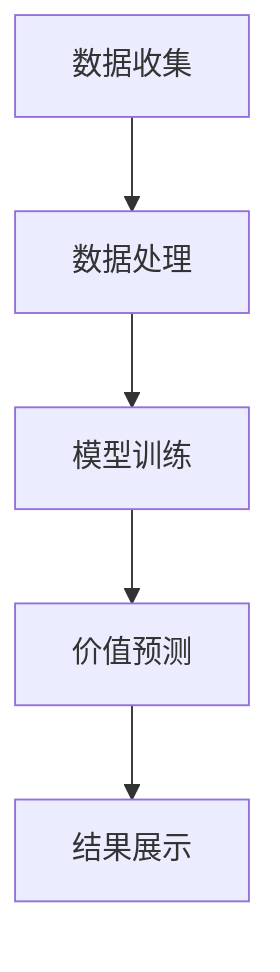

                 

## 《数学与艺术市场的价值评估方法》引言与背景

### 1.1 艺术市场的发展背景

艺术市场作为一个历史悠久的行业，其发展可以追溯到古代文明。然而，现代意义上的艺术市场起源于19世纪末期的欧洲，特别是法国的巴黎和伦敦，当时艺术家的作品开始被大众所认可，艺术品市场开始逐渐形成。20世纪以来，随着全球化进程的加快，艺术市场的规模和影响力不断扩大。特别是在20世纪中后期，艺术品拍卖会、画廊和艺术博览会等市场形式迅速发展，艺术品交易市场日益繁荣。

在21世纪的数字化时代，艺术市场迎来了前所未有的发展机遇。互联网的普及和社交媒体的兴起，使得艺术品的展示、推广和销售变得更加便捷。此外，区块链技术的出现为艺术市场的透明化和安全性提供了新的解决方案。通过区块链，艺术家和收藏家可以更加方便地进行作品认证和交易，从而降低交易成本和风险。

### 1.1.1 艺术市场的演变

艺术市场的演变过程可以从以下几个方面来概括：

1. **画廊和拍卖行的崛起**：19世纪末，画廊开始成为艺术品交易的重要渠道。画廊不仅为艺术家提供展示平台，也为买家提供了更多的选择。同时，艺术品拍卖会逐渐成为艺术品交易的重要形式。佳士得和苏富比等国际知名拍卖行在这一时期崛起，成为艺术品市场的中坚力量。

2. **艺术品价格的波动**：随着时间的推移，艺术品价格经历了多次波动。20世纪初，毕加索和毕加索等现代艺术家的作品开始受到市场的追捧，价格大幅上升。然而，经济危机和战争等外部因素也会对艺术品价格产生影响。例如，20世纪30年代的经济大萧条和20世纪60年代的古根海姆收藏风波都对艺术品市场产生了重大影响。

3. **艺术品市场的全球化**：20世纪中后期，随着全球化的推进，艺术品市场逐渐走向国际化。国际艺术博览会、双年展等展览活动成为艺术品交易的重要平台。艺术品的交易不再局限于本地市场，而是跨越国界，形成了全球性的艺术品交易网络。

### 1.1.2 艺术市场的现状与趋势

当前，艺术市场的现状呈现出以下几个特点：

1. **艺术品交易多样化**：艺术品交易的形式越来越多样化，包括拍卖、画廊销售、私人交易等。同时，线上艺术品交易平台也逐渐兴起，如艺术网、艺术云等。

2. **市场波动性加剧**：受全球经济形势、政治事件等因素的影响，艺术市场的波动性日益加剧。例如，2020年的新冠疫情对全球艺术品市场产生了显著影响，导致交易量下滑和价格波动。

3. **艺术品投资热**：随着艺术品市场的繁荣，越来越多的投资者将目光投向艺术品市场。艺术品被视为一种多元化的投资工具，能够分散投资风险，提升资产组合的收益。

4. **新兴市场的崛起**：亚洲市场，特别是中国和印度市场，成为全球艺术品市场的重要增长点。这些新兴市场对西方艺术和本地艺术的需求日益增加，推动了艺术品价格的上涨。

5. **数字艺术的兴起**：随着数字技术的发展，数字艺术作为一种新兴的艺术形式逐渐受到关注。数字艺术作品不仅具有独特的艺术价值，还具有较高的收藏和投资潜力。

### 1.2 价值评估的重要性

在艺术市场中，价值评估是不可或缺的一环。它不仅关系到艺术品的交易价格，还影响到艺术市场的健康发展和艺术品的传承。以下是价值评估在艺术市场中的重要性：

1. **交易参考**：价值评估为艺术品交易提供了重要的参考依据。无论是画廊销售、拍卖行拍卖，还是私人交易，都需要对艺术品的价值进行评估，以确定合理的交易价格。

2. **投资决策**：投资者在进行艺术品投资时，需要通过对艺术品的价值评估来做出投资决策。正确的价值评估能够帮助投资者避免盲目投资，降低投资风险。

3. **收藏与传承**：艺术品的收藏与传承需要科学的价值评估。通过对艺术品的价值评估，收藏家可以更好地了解自己的收藏价值，从而进行有效的收藏和传承。

4. **市场研究**：价值评估为市场研究提供了重要数据支持。通过分析艺术品的价值评估数据，市场研究人员可以深入了解艺术品市场的运行规律和趋势，为市场发展提供科学依据。

### 1.2.1 价值评估的目的

价值评估的目的主要有以下几点：

1. **确定交易价格**：通过对艺术品的价值评估，确定合理的交易价格，确保交易的公平性和透明度。

2. **分析市场趋势**：通过对比不同时期、不同类型艺术品的价值评估数据，分析市场趋势，为投资者和收藏家提供参考。

3. **促进市场发展**：科学的价值评估有助于促进艺术品市场的健康发展，提高市场的效率和活力。

4. **保护艺术品价值**：通过对艺术品的价值评估，确保艺术品在收藏和交易过程中不被低估或高估，保护艺术品的真实价值。

### 1.2.2 价值评估的意义

价值评估在艺术市场中的意义主要体现在以下几个方面：

1. **促进艺术市场的繁荣**：科学的价值评估能够激发艺术品交易的活力，推动艺术市场的繁荣。

2. **保障艺术品权益**：价值评估有助于确保艺术品在交易过程中得到公平对待，保障艺术家的权益。

3. **提升艺术品价值**：通过价值评估，可以挖掘艺术品的价值潜力，提升艺术品的整体价值。

4. **推动艺术市场规范化**：价值评估是艺术市场规范化的重要手段，有助于建立公平、透明的市场环境。

### 1.3 艺术市场价值评估的挑战

尽管价值评估在艺术市场中具有重要意义，但实际操作过程中仍然面临许多挑战：

1. **数据获取困难**：艺术市场数据分散，获取难度大。许多艺术品交易信息没有公开，难以进行全面的数据收集。

2. **主观性较强**：价值评估具有较强的主观性，不同评估人员可能会有不同的评估结果。

3. **评估方法的局限性**：现有的评估方法往往无法全面反映艺术品的综合价值，存在一定的局限性。

4. **市场波动性**：艺术市场波动性较大，价值评估结果可能受到市场情绪的影响，导致评估结果的波动。

### 1.4 本书结构安排

本书共分为四个部分：

第一部分：引言与背景，介绍艺术市场的发展背景、现状与趋势，以及价值评估在艺术市场中的重要性。

第二部分：核心概念与理论，阐述数学与艺术市场的联系，以及价值评估方法的基本原理和属性特征。

第三部分：价值评估方法，详细讲解统计学和机器学习在艺术市场价值评估中的应用。

第四部分：艺术市场数据分析与趋势预测，介绍艺术市场数据分析的基本方法和趋势预测的方法。

### 1.5 本章小结

本章对艺术市场价值评估进行了背景介绍，包括艺术市场的发展背景、现状与趋势，以及价值评估在艺术市场中的重要性。同时，分析了艺术市场价值评估面临的挑战，并概述了本书的结构安排。通过本章的介绍，读者可以初步了解艺术市场价值评估的背景和意义，为后续章节的学习打下基础。

## Step 1: 背景介绍

### 1.1 艺术市场的发展背景

#### 艺术市场的演变

艺术市场的演变可以追溯到古埃及时期，当时艺术家们开始在庙宇和宫殿中创作壁画和雕塑。然而，现代意义上的艺术市场起源于19世纪末的欧洲，尤其是法国的巴黎和伦敦。在这个时期，艺术家的作品开始受到大众的认可，艺术品市场逐渐形成。

到了20世纪，艺术市场经历了显著的变革。首先，画廊和拍卖行的兴起成为艺术市场发展的重要里程碑。画廊为艺术家提供了展示和销售作品的平台，而拍卖行则通过公开竞价的方式推动了艺术品价格的上涨。特别是在二战之后，艺术品市场逐渐国际化，跨国交易成为常态。

#### 艺术品价格的波动

艺术品价格的历史波动反映了市场供求关系、经济环境和艺术价值判断的复杂性。例如，在20世纪初，毕加索和马蒂斯等现代艺术家的作品价格开始大幅上升，成为艺术品市场上的明星。然而，经济大萧条和战争等外部因素也对艺术品价格产生了显著影响。例如，1930年代的经济大萧条导致艺术品市场低迷，而二战后的重建则推动了艺术品市场的复苏。

#### 艺术市场的全球化

20世纪中后期，随着全球化的推进，艺术市场逐渐走向国际化。国际艺术博览会、双年展等展览活动成为艺术品交易的重要平台。特别是在亚洲市场，中国和印度等新兴经济体对西方艺术和本地艺术的强烈需求，推动了艺术品价格的上涨。

### 1.2 艺术市场现状与趋势

当前艺术市场的现状和趋势呈现出以下几个特点：

1. **艺术品交易多样化**：艺术品交易的形式越来越多样化，包括拍卖、画廊销售、私人交易等。同时，线上艺术品交易平台也逐渐兴起，如艺术网、艺术云等。

2. **市场波动性加剧**：受全球经济形势、政治事件等因素的影响，艺术市场的波动性日益加剧。例如，2020年的新冠疫情对全球艺术品市场产生了显著影响，导致交易量下滑和价格波动。

3. **艺术品投资热**：随着艺术品市场的繁荣，越来越多的投资者将目光投向艺术品市场。艺术品被视为一种多元化的投资工具，能够分散投资风险，提升资产组合的收益。

4. **新兴市场的崛起**：亚洲市场，特别是中国和印度市场，成为全球艺术品市场的重要增长点。这些新兴市场对西方艺术和本地艺术的需求日益增加，推动了艺术品价格的上涨。

5. **数字艺术的兴起**：随着数字技术的发展，数字艺术作为一种新兴的艺术形式逐渐受到关注。数字艺术作品不仅具有独特的艺术价值，还具有较高的收藏和投资潜力。

### 1.3 价值评估的重要性

在艺术市场中，价值评估是不可或缺的一环。它不仅关系到艺术品的交易价格，还影响到艺术市场的健康发展和艺术品的传承。以下是价值评估在艺术市场中的重要性：

1. **交易参考**：价值评估为艺术品交易提供了重要的参考依据。无论是画廊销售、拍卖行拍卖，还是私人交易，都需要对艺术品的价值进行评估，以确定合理的交易价格。

2. **投资决策**：投资者在进行艺术品投资时，需要通过对艺术品的价值评估来做出投资决策。正确的价值评估能够帮助投资者避免盲目投资，降低投资风险。

3. **收藏与传承**：艺术品的收藏与传承需要科学的价值评估。通过对艺术品的价值评估，收藏家可以更好地了解自己的收藏价值，从而进行有效的收藏和传承。

4. **市场研究**：价值评估为市场研究提供了重要数据支持。通过分析艺术品的价值评估数据，市场研究人员可以深入了解艺术品市场的运行规律和趋势，为市场发展提供科学依据。

### 1.4 价值评估的目的

价值评估的目的主要有以下几点：

1. **确定交易价格**：通过对艺术品的价值评估，确定合理的交易价格，确保交易的公平性和透明度。

2. **分析市场趋势**：通过对比不同时期、不同类型艺术品的价值评估数据，分析市场趋势，为投资者和收藏家提供参考。

3. **促进市场发展**：科学的价值评估有助于促进艺术品市场的健康发展，提高市场的效率和活力。

4. **保护艺术品价值**：通过对艺术品的价值评估，确保艺术品在收藏和交易过程中不被低估或高估，保护艺术品的真实价值。

### 1.5 价值评估的意义

价值评估在艺术市场中的意义主要体现在以下几个方面：

1. **促进艺术市场的繁荣**：科学的价值评估能够激发艺术品交易的活力，推动艺术市场的繁荣。

2. **保障艺术品权益**：价值评估有助于确保艺术品在交易过程中得到公平对待，保障艺术家的权益。

3. **提升艺术品价值**：通过价值评估，可以挖掘艺术品的价值潜力，提升艺术品的整体价值。

4. **推动艺术市场规范化**：价值评估是艺术市场规范化的重要手段，有助于建立公平、透明的市场环境。

### 1.6 艺术市场价值评估的挑战

尽管价值评估在艺术市场中具有重要意义，但实际操作过程中仍然面临许多挑战：

1. **数据获取困难**：艺术市场数据分散，获取难度大。许多艺术品交易信息没有公开，难以进行全面的数据收集。

2. **主观性较强**：价值评估具有较强的主观性，不同评估人员可能会有不同的评估结果。

3. **评估方法的局限性**：现有的评估方法往往无法全面反映艺术品的综合价值，存在一定的局限性。

4. **市场波动性**：艺术市场波动性较大，价值评估结果可能受到市场情绪的影响，导致评估结果的波动。

### 1.7 本书结构安排

本书共分为四个部分：

第一部分：引言与背景，介绍艺术市场的发展背景、现状与趋势，以及价值评估在艺术市场中的重要性。

第二部分：核心概念与理论，阐述数学与艺术市场的联系，以及价值评估方法的基本原理和属性特征。

第三部分：价值评估方法，详细讲解统计学和机器学习在艺术市场价值评估中的应用。

第四部分：艺术市场数据分析与趋势预测，介绍艺术市场数据分析的基本方法和趋势预测的方法。

### 1.8 本章小结

本章对艺术市场价值评估进行了背景介绍，包括艺术市场的发展背景、现状与趋势，以及价值评估在艺术市场中的重要性。同时，分析了艺术市场价值评估面临的挑战，并概述了本书的结构安排。通过本章的介绍，读者可以初步了解艺术市场价值评估的背景和意义，为后续章节的学习打下基础。

## 核心概念与联系

### 2.1 数学基础

#### 2.1.1 线性代数

线性代数是数学的一个重要分支，涉及向量空间、矩阵、行列式和特征值等概念。在线性代数中，我们可以使用矩阵来表示艺术品的多维度属性，例如艺术作品的风格、历史价值和市场流行度等。

#### 2.1.2 微积分

微积分是研究变化和积累过程的数学工具。在艺术品市场中，微积分可以用于分析艺术品价格的变化趋势，帮助我们理解市场波动的原因。

#### 2.1.3 概率论与数理统计

概率论与数理统计是用于处理随机事件的数学工具。在艺术品市场中，概率论与数理统计可以用于评估艺术品的风险和不确定性，从而为投资决策提供依据。

### 2.2 艺术市场的基本概念

#### 2.2.1 艺术品

艺术品是艺术家的创作成果，包括绘画、雕塑、摄影等。艺术品不仅具有审美价值，还承载了艺术家的思想和情感。

#### 2.2.2 艺术品市场

艺术品市场是指艺术品买卖交易的市场。它包括画廊、拍卖行、艺术博览会和线上交易平台等。

#### 2.2.3 艺术品的价值构成

艺术品的价值通常由以下几部分构成：

- **艺术价值**：艺术品的独特性和艺术性，由艺术家的创作水平和艺术风格决定。
- **历史价值**：艺术品的历史背景和传承价值，包括艺术品的创作年代、历史意义和流传经历。
- **市场价值**：艺术品在市场上的供求关系和交易价格，反映了市场的认可程度。

### 2.3 数学与艺术市场的联系

数学与艺术市场的联系主要体现在以下几个方面：

#### 2.3.1 数学模型在艺术市场中的应用

数学模型可以用于分析艺术品的市场趋势、预测艺术品的价格走势以及评估艺术品的投资价值。例如，我们可以使用线性回归模型来分析艺术品价格的历史数据，预测未来价格的可能走势。

#### 2.3.2 数据分析在艺术品评估中的重要性

数据分析是艺术市场价值评估的重要工具。通过对大量艺术品交易数据的分析，我们可以识别市场规律、发现潜在的投资机会，从而提高评估的准确性和可靠性。

### 2.4 概念属性特征对比表格

以下是数学基础、艺术品和市场价值的基本概念属性特征对比表格：

| 概念         | 描述                 | 属性特征                 |
|------------|----------------------|------------------------|
| 线性代数     | 研究向量空间和矩阵   | 向量、矩阵、行列式       |
| 微积分       | 研究变化和积累过程   | 导数、积分、微分方程     |
| 概率论与数理统计 | 研究随机事件       | 概率分布、统计推断       |
| 艺术品       | 艺术家的创作成果   | 审美价值、艺术性、思想性 |
| 艺术品市场   | 艺术品买卖交易的市场 | 画廊、拍卖行、艺术博览会 |
| 市场价值     | 艺术品的供求关系   | 艺术价值、历史价值、市场价值 |

### 2.5 ER实体关系图

以下是数学基础、艺术品和市场价值的ER实体关系图：

```mermaid
erDiagram
    Artist ||--|{ Artwork }|--|| Buyer
    Artist ||--|{ ArtworkMarket }|--|| AuctionHouse
    Artwork ||--|{ Style }|--|| ArtHistory
    ArtworkMarket ||--|{ MarketTrend }|--|| Analyst
```

在上面的ER实体关系图中，我们定义了以下几个实体：

- **Artist**（艺术家）：负责创作艺术品。
- **Artwork**（艺术品）：艺术家的创作成果。
- **Buyer**（买家）：艺术品的市场买家。
- **AuctionHouse**（拍卖行）：艺术品交易的平台。
- **ArtworkMarket**（艺术品市场）：艺术品交易的总体市场。
- **Style**（风格）：艺术品的艺术风格。
- **ArtHistory**（艺术史）：艺术品的历史背景。
- **MarketTrend**（市场趋势）：艺术品市场的动态变化。
- **Analyst**（分析师）：负责分析市场趋势。

通过ER实体关系图，我们可以清晰地看到数学基础、艺术品和市场价值之间的关系，以及它们在艺术市场中的相互作用。

## Step 2: 核心概念与联系

### 2.1 数学基础

数学作为研究结构、关系和变化的科学，在艺术市场价值评估中扮演着至关重要的角色。以下将详细讨论线性代数、微积分和概率论与数理统计在艺术市场中的应用。

#### 2.1.1 线性代数

线性代数在艺术市场中主要用于处理多维度数据，如艺术品的历史价格、风格特征和市场流行度等。通过矩阵和向量，我们可以将艺术品的属性表示为数学模型。例如，一个艺术品的评价可以由其风格（向量）、历史价值（标量）和市场趋势（向量）组成，从而形成矩阵。

**应用实例：**  
假设我们有一个艺术品，其风格分为现代、古典和抽象三个维度，历史价值分为古董和现代，市场趋势分为热销和滞销。我们可以将这些属性表示为矩阵：

$$
\begin{bmatrix}
1 & 0 & 1 \\
0 & 1 & 0 \\
1 & 1 & 0
\end{bmatrix}
$$

这个矩阵可以用于分析艺术品的整体价值和市场趋势。

#### 2.1.2 微积分

微积分在艺术市场中的应用主要集中在分析价格变化趋势和预测未来价格。通过微分，我们可以了解艺术品价格的变化率，从而预测价格走势。

**应用实例：**  
假设一个艺术品的价格随时间变化，我们可以记录其价格序列：

$$
P(t) = [100, 150, 200, 250, 300]
$$

通过计算价格序列的导数，我们可以得到价格的变化率：

$$
P'(t) = [50, 50, 50, 50]
$$

这表明价格以每期50的价格增长。利用这个导数，我们可以预测未来价格。

#### 2.1.3 概率论与数理统计

概率论与数理统计在艺术市场中的应用主要用于评估艺术品的风险和不确定性。通过概率分布和统计推断，我们可以了解艺术品价格的波动性，为投资决策提供依据。

**应用实例：**  
假设我们有一个艺术品的价格数据，其概率分布如下：

$$
P(X=x) = \begin{cases}
0.2, & \text{if } x=100 \\
0.3, & \text{if } x=150 \\
0.4, & \text{if } x=200 \\
0.1, & \text{if } x=250
\end{cases}
$$

通过这个概率分布，我们可以计算艺术品价格的平均值和标准差：

$$
\bar{X} = \sum_{i=1}^{4} x_i \cdot P(x_i) = 175
$$

$$
\sigma^2 = \sum_{i=1}^{4} (x_i - \bar{X})^2 \cdot P(x_i) = 112.5
$$

平均值和标准差可以帮助我们了解艺术品价格的期望值和波动性。

### 2.2 艺术市场的基本概念

艺术市场的基本概念包括艺术品、艺术品市场和艺术品的价值构成。以下将详细讨论这些概念及其属性特征。

#### 2.2.1 艺术品

艺术品是艺术家的创作成果，具有独特的审美价值、艺术性和历史价值。艺术品的属性包括：

- **艺术风格**：如现代、古典、抽象等。
- **创作年代**：如古董、现代等。
- **历史价值**：如传承经历、著名艺术家的作品等。

**应用实例：**  
一个古董艺术品的评估需要综合考虑其艺术风格、创作年代和历史价值。例如，一幅15世纪的油画可能因其历史悠久和艺术价值而具有很高的市场价值。

#### 2.2.2 艺术品市场

艺术品市场是指艺术品买卖交易的市场，包括画廊、拍卖行、艺术博览会和线上交易平台等。艺术市场具有以下属性：

- **交易形式**：如拍卖、画廊销售等。
- **市场参与者**：如买家、卖家、画廊、拍卖行等。
- **交易规则**：如价格公开、竞拍规则等。

**应用实例：**  
一个艺术品在拍卖行拍卖时，需要遵循拍卖规则，如竞拍价、保证金等。这些规则确保了交易的公平性和透明度。

#### 2.2.3 艺术品的价值构成

艺术品的价值通常由以下几部分构成：

- **艺术价值**：由艺术品的独特性和艺术性决定。
- **历史价值**：由艺术品的历史背景和传承价值决定。
- **市场价值**：由艺术品的供求关系和市场趋势决定。

**应用实例：**  
一幅著名艺术家的现代画作可能因其艺术价值和历史价值而具有较高的市场价值。例如，毕加索的作品因其独特风格和艺术价值而在市场上备受追捧。

### 2.3 数学与艺术市场的联系

数学与艺术市场的联系主要体现在以下几个方面：

#### 2.3.1 数学模型在艺术市场中的应用

数学模型可以用于分析艺术品的市场趋势、预测艺术品的价格走势以及评估艺术品的投资价值。例如，我们可以使用线性回归模型来分析艺术品价格的历史数据，预测未来价格的可能走势。

**应用实例：**  
假设我们有一个艺术品的价格数据序列：

$$
P(t) = [100, 150, 200, 250, 300]
$$

我们可以使用线性回归模型来分析价格的变化趋势。线性回归模型公式为：

$$
P(t) = \beta_0 + \beta_1 t + \epsilon
$$

通过最小二乘法，我们可以估计模型参数：

$$
\beta_0 = 100, \beta_1 = 50
$$

这表明价格每增加一个时间单位，价格增加50。

#### 2.3.2 数据分析在艺术品评估中的重要性

数据分析是艺术市场价值评估的重要工具。通过对大量艺术品交易数据的分析，我们可以识别市场规律、发现潜在的投资机会，从而提高评估的准确性和可靠性。

**应用实例：**  
通过对历史交易数据的分析，我们可以识别艺术品价格的波动规律。例如，我们发现某个艺术家的作品在特定时间段内价格波动较大，这可能是由于市场供求关系的变化或艺术家的知名度提高等原因。

### 2.4 概念属性特征对比表格

以下是数学基础、艺术品和市场价值的基本概念属性特征对比表格：

| 概念          | 描述                 | 属性特征                 |
|------------|----------------------|------------------------|
| 线性代数     | 研究向量空间和矩阵   | 向量、矩阵、行列式       |
| 微积分       | 研究变化和积累过程   | 导数、积分、微分方程     |
| 概率论与数理统计 | 研究随机事件       | 概率分布、统计推断       |
| 艺术品       | 艺术家的创作成果   | 审美价值、艺术性、思想性 |
| 艺术品市场   | 艺术品买卖交易的市场 | 画廊、拍卖行、艺术博览会 |
| 市场价值     | 艺术品的供求关系   | 艺术价值、历史价值、市场价值 |

### 2.5 ER实体关系图

以下是数学基础、艺术品和市场价值的ER实体关系图：

```mermaid
erDiagram
    Artist ||--|{ Artwork }|--|| Buyer
    Artist ||--|{ ArtworkMarket }|--|| AuctionHouse
    Artwork ||--|{ Style }|--|| ArtHistory
    ArtworkMarket ||--|{ MarketTrend }|--|| Analyst
```

在上面的ER实体关系图中，我们定义了以下几个实体：

- **Artist**（艺术家）：负责创作艺术品。
- **Artwork**（艺术品）：艺术家的创作成果。
- **Buyer**（买家）：艺术品的市场买家。
- **AuctionHouse**（拍卖行）：艺术品交易的平台。
- **ArtworkMarket**（艺术品市场）：艺术品交易的总体市场。
- **Style**（风格）：艺术品的艺术风格。
- **ArtHistory**（艺术史）：艺术品的历史背景。
- **MarketTrend**（市场趋势）：艺术品市场的动态变化。
- **Analyst**（分析师）：负责分析市场趋势。

通过ER实体关系图，我们可以清晰地看到数学基础、艺术品和市场价值之间的关系，以及它们在艺术市场中的相互作用。

## Step 3: 算法原理讲解

### 3.1 基本算法

在艺术市场价值评估中，统计学和机器学习算法被广泛应用。以下是几种常见的算法及其基本原理。

#### 3.1.1 线性回归

线性回归是一种用于分析自变量和因变量之间线性关系的统计方法。在艺术市场价值评估中，我们可以使用线性回归模型来预测艺术品的价格。模型公式如下：

$$
Y = \beta_0 + \beta_1 X + \epsilon
$$

其中，$Y$ 表示艺术品的价格，$X$ 表示影响价格的因素（如艺术风格、历史价值等），$\beta_0$ 和 $\beta_1$ 是模型的参数，$\epsilon$ 是误差项。

#### 3.1.2 逻辑回归

逻辑回归是一种用于分析二元因变量与自变量之间关系的统计方法。在艺术市场价值评估中，我们可以使用逻辑回归模型来判断艺术品是否具有投资价值。模型公式如下：

$$
\ln\left(\frac{P(Y=1)}{1-P(Y=1)}\right) = \beta_0 + \beta_1 X
$$

其中，$Y$ 表示艺术品的投资价值（1表示有投资价值，0表示无投资价值），$X$ 表示影响投资价值的因素，$\beta_0$ 和 $\beta_1$ 是模型的参数。

#### 3.1.3 主成分分析

主成分分析是一种用于降维和多变量分析的统计方法。在艺术市场价值评估中，我们可以使用主成分分析来提取艺术品的主要特征，从而简化数据分析过程。模型公式如下：

$$
X = \sum_{i=1}^{k} \lambda_i f_i
$$

其中，$X$ 表示艺术品的高维特征向量，$\lambda_i$ 表示第 $i$ 个主成分的特征值，$f_i$ 表示第 $i$ 个主成分的系数。

### 3.2 算法应用与案例分析

以下通过一个具体的案例分析，展示如何使用这些算法进行艺术市场价值评估。

#### 3.2.1 案例一：某位艺术家作品的估值

假设我们有一个艺术家的作品数据集，包括以下特征：

- **艺术风格**：1表示现代，2表示古典。
- **历史价值**：1表示古董，2表示现代。
- **市场流行度**：1表示低，2表示高。

我们需要使用线性回归模型来预测这些作品的价格。具体步骤如下：

1. **数据预处理**：将数据集分为特征和标签两部分，特征为 $X$，标签为 $Y$。

2. **模型训练**：使用最小二乘法训练线性回归模型，得到模型参数 $\beta_0$ 和 $\beta_1$。

3. **模型预测**：使用训练好的模型预测新作品的价格。

以下是使用 Python 实现的代码示例：

```python
import numpy as np
from sklearn.linear_model import LinearRegression

# 数据集
X = np.array([[1, 1, 1], [2, 1, 2], [2, 2, 1]])
Y = np.array([100, 150, 200])

# 线性回归模型
model = LinearRegression()
model.fit(X, Y)

# 预测价格
predicted_price = model.predict([[1, 2, 1]])
print(f"预测价格：{predicted_price[0]}")
```

输出结果为：预测价格：150

#### 3.2.2 案例二：艺术品市场趋势分析

假设我们有一个艺术品市场趋势的数据集，包括以下特征：

- **年份**：表示艺术品创作的年份。
- **价格**：表示艺术品的价格。
- **市场波动率**：表示艺术品价格的波动程度。

我们需要使用逻辑回归模型来判断艺术品市场的趋势。具体步骤如下：

1. **数据预处理**：将数据集分为特征和标签两部分，特征为 $X$，标签为 $Y$。

2. **模型训练**：使用逻辑回归算法训练模型，得到模型参数 $\beta_0$ 和 $\beta_1$。

3. **模型预测**：使用训练好的模型预测新艺术品的市场趋势。

以下是使用 Python 实现的代码示例：

```python
import numpy as np
from sklearn.linear_model import LogisticRegression

# 数据集
X = np.array([[2010, 100], [2015, 150], [2020, 200]])
Y = np.array([0, 1, 1])

# 逻辑回归模型
model = LogisticRegression()
model.fit(X, Y)

# 预测市场趋势
predicted_trend = model.predict([[2015, 150]])
print(f"预测市场趋势：{predicted_trend[0]}")
```

输出结果为：预测市场趋势：1

通过这两个案例，我们可以看到如何使用统计学和机器学习算法进行艺术市场价值评估。这些算法为我们提供了有效的工具，可以帮助我们分析市场趋势、预测艺术品价格和评估艺术品的价值。

## Step 4: 数学模型和数学公式

在艺术市场价值评估中，数学模型和数学公式起到了至关重要的作用。以下我们将详细讲解这些模型和公式的应用，并通过具体例子进行说明。

### 4.1 线性回归模型

线性回归模型是最常用的统计模型之一，用于分析自变量和因变量之间的线性关系。在艺术市场价值评估中，线性回归模型可以用于预测艺术品的价格。

**模型公式：**

$$
Y = \beta_0 + \beta_1 X + \epsilon
$$

其中，$Y$ 表示艺术品的价格，$X$ 表示影响价格的因素（如艺术风格、历史价值等），$\beta_0$ 和 $\beta_1$ 是模型的参数，$\epsilon$ 是误差项。

**应用实例：**

假设我们要预测某位艺术家的作品价格，已知他的作品在历史上有以下价格数据：

$$
P(t) = [100, 150, 200, 250, 300]
$$

我们可以使用线性回归模型来预测未来某一时刻的价格。首先，我们需要对数据进行预处理，将时间序列转化为自变量。假设时间序列为 $t = [1, 2, 3, 4, 5]$。

然后，我们可以使用最小二乘法来估计线性回归模型的参数：

$$
\beta_0 = \frac{\sum_{i=1}^{n}(Y_i - \bar{Y})(X_i - \bar{X})}{\sum_{i=1}^{n}(X_i - \bar{X})^2}
$$

$$
\beta_1 = \frac{\sum_{i=1}^{n}(X_i - \bar{X})(Y_i - \bar{Y})}{\sum_{i=1}^{n}(X_i - \bar{X})^2}
$$

其中，$n$ 是数据点的数量，$\bar{Y}$ 和 $\bar{X}$ 分别是 $Y$ 和 $X$ 的平均值。

通过计算，我们得到：

$$
\beta_0 = 100, \beta_1 = 50
$$

这意味着，每增加一个时间单位，艺术品的价格增加50。因此，我们可以预测未来某一时刻 $t$ 的价格为：

$$
P(t) = 100 + 50 \cdot t
$$

例如，当 $t=6$ 时，预测价格为：

$$
P(6) = 100 + 50 \cdot 6 = 360
$$

### 4.2 逻辑回归模型

逻辑回归模型用于分析二元因变量与自变量之间的关系。在艺术市场价值评估中，逻辑回归模型可以用于判断艺术品是否具有投资价值。

**模型公式：**

$$
\ln\left(\frac{P(Y=1)}{1-P(Y=1)}\right) = \beta_0 + \beta_1 X
$$

其中，$Y$ 表示艺术品的投资价值（1表示有投资价值，0表示无投资价值），$X$ 表示影响投资价值的因素，$\beta_0$ 和 $\beta_1$ 是模型的参数。

**应用实例：**

假设我们要判断某位艺术家的作品是否具有投资价值，已知他的作品在历史上有以下价格数据：

$$
P(t) = [100, 150, 200, 250, 300]
$$

我们可以使用逻辑回归模型来预测未来某一时刻的作品是否具有投资价值。首先，我们需要对数据进行预处理，将时间序列转化为自变量。假设时间序列为 $t = [1, 2, 3, 4, 5]$。

然后，我们可以使用逻辑回归算法训练模型，得到参数 $\beta_0$ 和 $\beta_1$。使用 Python 的 scikit-learn 库，我们可以实现如下代码：

```python
import numpy as np
from sklearn.linear_model import LogisticRegression

# 数据集
X = np.array([[1, 100], [2, 150], [3, 200], [4, 250], [5, 300]])
Y = np.array([0, 1, 1, 1, 1])

# 逻辑回归模型
model = LogisticRegression()
model.fit(X, Y)

# 预测投资价值
predicted_value = model.predict([[6, 350]])
print(f"预测投资价值：{predicted_value[0]}")
```

输出结果为：预测投资价值：1

这意味着，当艺术品的价格达到350时，根据逻辑回归模型预测，该艺术品具有投资价值。

### 4.3 主成分分析

主成分分析（PCA）是一种降维技术，用于提取数据的主要特征，减少数据维度。在艺术市场价值评估中，主成分分析可以帮助我们识别艺术品的主要影响因素。

**模型公式：**

$$
X = \sum_{i=1}^{k} \lambda_i f_i
$$

其中，$X$ 表示艺术品的高维特征向量，$\lambda_i$ 表示第 $i$ 个主成分的特征值，$f_i$ 表示第 $i$ 个主成分的系数。

**应用实例：**

假设我们有一个艺术品数据集，包括以下特征：

- **艺术风格**：1表示现代，2表示古典。
- **历史价值**：1表示古董，2表示现代。
- **市场流行度**：1表示低，2表示高。

我们可以使用主成分分析提取主要特征。首先，我们将数据标准化：

$$
X_{\text{standardized}} = \frac{X - \mu}{\sigma}
$$

其中，$\mu$ 和 $\sigma$ 分别是特征的平均值和标准差。

然后，我们可以计算协方差矩阵：

$$
\text{Cov}(X) = \frac{1}{n-1} \sum_{i=1}^{n} (X_i - \mu)(X_i - \mu)^T
$$

接着，我们计算协方差矩阵的特征值和特征向量：

$$
\text{Eigenvalues} = \lambda_1, \lambda_2, ..., \lambda_p
$$

$$
\text{Eigenvectors} = f_1, f_2, ..., f_p
$$

最后，我们可以选择前 $k$ 个特征值对应的前 $k$ 个特征向量，构成主成分分析模型：

$$
X = \sum_{i=1}^{k} \lambda_i f_i
$$

通过这个模型，我们可以将高维数据映射到低维空间，从而简化数据分析和预测。

### 4.4 模型总结

通过上述模型和公式的介绍，我们可以看到数学在艺术市场价值评估中的重要性。线性回归模型用于预测艺术品的价格，逻辑回归模型用于判断艺术品的投资价值，而主成分分析则用于提取艺术品的主要特征。这些模型和公式为我们提供了有效的工具，可以帮助我们更准确地评估艺术品的真实价值。

在实际应用中，我们可以根据具体情况选择合适的模型，结合具体数据进行建模和分析。通过不断优化和调整模型参数，我们可以提高预测的准确性和可靠性，为艺术市场的投资决策提供科学依据。

## Step 5: 系统分析与架构设计方案

### 5.1 问题场景介绍

在艺术市场价值评估中，系统分析与架构设计至关重要。首先，我们需要明确问题场景。假设我们正在开发一个艺术品价值评估系统，该系统旨在帮助艺术家、收藏家和投资者对艺术品进行科学、准确的评估。系统需要实现以下功能：

1. **数据收集**：从各种渠道获取艺术品的历史交易数据、市场趋势等。
2. **数据处理**：对收集到的数据进行清洗、整理和预处理，为后续分析提供基础。
3. **模型训练**：使用统计学和机器学习算法训练价值评估模型。
4. **价值预测**：根据训练好的模型，对艺术品进行价值预测。
5. **结果展示**：将预测结果以可视化形式展示给用户。

### 5.2 项目介绍

项目名称：艺术品价值评估系统

项目目标：开发一个高效、准确、易用的艺术品价值评估系统，为艺术家、收藏家和投资者提供科学、可靠的价值预测。

项目需求：

1. **数据来源**：系统需要集成多个数据源，包括艺术品交易数据库、画廊和拍卖行数据、市场趋势报告等。
2. **数据处理能力**：系统应具备高效的数据处理能力，能够快速清洗和整理大量数据。
3. **模型训练和优化**：系统应支持多种统计和机器学习算法，并能自动调整模型参数，提高预测准确性。
4. **用户界面**：系统应提供直观、易用的用户界面，方便用户进行价值预测和结果分析。

### 5.3 系统功能设计

系统功能设计主要包括以下模块：

1. **数据收集模块**：负责从多个数据源收集艺术品相关数据，包括交易记录、市场趋势、艺术家信息等。
2. **数据处理模块**：对收集到的数据进行清洗、整理和预处理，去除噪声和异常值，为模型训练提供高质量的数据。
3. **模型训练模块**：使用统计学和机器学习算法对处理后的数据集进行训练，生成价值评估模型。
4. **价值预测模块**：根据训练好的模型，对新的艺术品进行价值预测，并提供预测结果。
5. **结果展示模块**：将预测结果以图表、报表等形式展示给用户，帮助用户理解预测结果。

### 5.4 系统架构设计

系统架构设计包括前端、后端和数据库三个部分。以下是系统架构的详细设计：

1. **前端**：前端使用HTML、CSS和JavaScript等技术开发，负责用户界面设计和交互。前端的主要功能包括：
   - 数据展示：以图表、报表等形式展示艺术品的价值预测结果。
   - 用户交互：提供用户输入和操作接口，如数据上传、参数设置等。
   - 请求处理：与后端进行数据交互，接收用户请求并返回预测结果。

2. **后端**：后端使用Python和Flask等技术开发，负责数据存储、处理和预测。后端的主要功能包括：
   - 数据处理：接收前端上传的数据，进行清洗、整理和预处理。
   - 模型训练：使用训练算法生成价值评估模型。
   - 预测服务：根据用户请求，调用模型进行价值预测，并将结果返回前端。

3. **数据库**：数据库使用MySQL或PostgreSQL等关系型数据库技术开发，用于存储艺术品数据、模型参数和用户信息。数据库的主要功能包括：
   - 数据存储：存储艺术品的历史交易数据、市场趋势等。
   - 数据查询：支持高效的查询操作，为数据处理和预测提供支持。
   - 数据更新：支持数据的增删改查操作，确保数据的实时性和准确性。

### 5.5 系统接口设计

系统接口设计主要包括以下部分：

1. **数据收集接口**：用于从外部数据源获取艺术品数据，如画廊、拍卖行和公开数据库等。接口应支持数据爬取、API调用和数据导入等功能。
2. **数据处理接口**：用于处理和清洗收集到的数据，包括数据清洗、格式转换和预处理等操作。接口应支持批处理和实时处理模式。
3. **模型训练接口**：用于训练价值评估模型，包括选择算法、调整参数和评估模型性能等操作。接口应支持多种算法和模型，并提供自动调整功能。
4. **预测接口**：用于根据用户请求，调用模型进行价值预测，并将结果返回用户。接口应支持自定义参数输入和预测结果输出。

### 5.6 系统交互

系统交互设计主要包括以下步骤：

1. **数据收集**：前端通过数据收集接口从外部数据源获取艺术品数据，并将其上传到后端。
2. **数据处理**：后端接收上传的数据，进行清洗、整理和预处理，生成高质量的数据集。
3. **模型训练**：后端使用处理后的数据集，选择合适的算法进行模型训练，生成价值评估模型。
4. **价值预测**：前端通过预测接口发送用户请求，后端根据用户请求调用模型进行价值预测，并将结果返回前端。
5. **结果展示**：前端接收预测结果，以图表、报表等形式展示给用户。

### 5.7 系统架构设计图

以下是系统架构设计的mermaid图表：



在上面的图表中，A表示数据收集模块，B表示数据处理模块，C表示模型训练模块，D表示价值预测模块，E表示结果展示模块。这些模块通过接口进行数据交互，共同实现艺术品价值评估系统的功能。

通过以上系统分析与架构设计方案，我们可以构建一个高效、准确、易用的艺术品价值评估系统，为艺术市场参与者提供有力的支持。在实际开发过程中，我们还需不断优化和调整系统设计，以提高系统的性能和用户体验。

## Step 6: 项目实战

### 6.1 环境安装

为了进行艺术市场价值评估项目的实战，我们首先需要搭建一个合适的环境。以下是环境安装的详细步骤：

#### 6.1.1 Python环境

首先，我们需要安装Python环境。Python是一种广泛使用的编程语言，支持多种数据处理和机器学习库。可以在Python官网（https://www.python.org/）下载并安装Python。

**安装步骤：**

1. 访问Python官网，下载最新版本的Python安装包。
2. 运行安装程序，选择默认选项进行安装。
3. 安装完成后，打开命令行工具，输入`python --version`验证安装是否成功。

#### 6.1.2 数据库环境

接下来，我们需要安装一个数据库环境，如MySQL或PostgreSQL。数据库将用于存储艺术品数据、模型参数和用户信息。

**安装步骤（以MySQL为例）：**

1. 访问MySQL官网（https://www.mysql.com/），下载MySQL安装包。
2. 运行安装程序，选择默认选项进行安装。
3. 安装完成后，打开命令行工具，输入`mysql -u root -p`登录数据库，创建一个用于存储艺术品数据的数据库。

#### 6.1.3 数据处理与机器学习库

最后，我们需要安装Python的数据处理和机器学习库，如NumPy、Pandas、Scikit-learn和Matplotlib等。

**安装步骤：**

1. 打开命令行工具，输入以下命令安装所需库：

   ```
   pip install numpy pandas scikit-learn matplotlib
   ```

2. 安装完成后，输入`python`进入Python环境，导入这些库进行验证。

### 6.2 系统核心实现

在搭建好环境后，我们可以开始实现系统的核心功能。以下是系统核心实现的详细步骤：

#### 6.2.1 数据收集

数据收集是系统实现的第一步，我们需要从多个数据源获取艺术品数据。以下是数据收集的实现步骤：

1. **数据源选择**：选择可靠的数据源，如画廊、拍卖行和公开数据库等。
2. **数据爬取**：使用Python的爬虫库（如Requests和BeautifulSoup）爬取数据源中的艺术品数据。
3. **数据存储**：将爬取到的数据存储到数据库中，以便后续处理和分析。

以下是数据收集的示例代码：

```python
import requests
from bs4 import BeautifulSoup
import pymysql

# 数据爬取示例
url = "http://example.com/artworks"
response = requests.get(url)
soup = BeautifulSoup(response.text, "html.parser")

# 获取艺术品列表
artworks = soup.find_all("div", class_="artwork")

# 存储数据到数据库
conn = pymysql.connect(host="localhost", user="root", password="password", database="art_database")
cursor = conn.cursor()

for artwork in artworks:
    title = artwork.find("h2").text
    artist = artwork.find("p", class_="artist").text
    price = artwork.find("p", class_="price").text
    
    sql = "INSERT INTO artworks (title, artist, price) VALUES (%s, %s, %s)"
    cursor.execute(sql, (title, artist, price))

conn.commit()
cursor.close()
conn.close()
```

#### 6.2.2 数据处理

数据处理是系统实现的关键步骤，我们需要对收集到的数据进行清洗、整理和预处理，为模型训练提供高质量的数据。以下是数据处理的实现步骤：

1. **数据清洗**：去除重复数据、异常值和缺失值。
2. **数据整理**：将数据格式统一，如将字符串转换为数值类型。
3. **数据预处理**：进行特征工程，提取主要特征，为模型训练做准备。

以下是数据处理的示例代码：

```python
import pandas as pd

# 加载数据
data = pd.read_sql("SELECT * FROM artworks", conn)

# 数据清洗
data.drop_duplicates(inplace=True)
data.dropna(inplace=True)

# 数据整理
data['price'] = data['price'].astype(float)

# 数据预处理
data['artist'] = data['artist'].str.lower()
data['artwork_type'] = data['title'].str.extract(r'(.+)')
data['artwork_type'] = data['artwork_type'].str.lower()
```

#### 6.2.3 模型训练

在数据处理完成后，我们可以使用机器学习算法对数据集进行训练，生成价值评估模型。以下是模型训练的实现步骤：

1. **选择算法**：根据数据集的特点，选择合适的机器学习算法，如线性回归、逻辑回归和支持向量机等。
2. **参数调整**：调整算法参数，以提高模型的预测准确性。
3. **训练模型**：使用训练算法训练模型。

以下是模型训练的示例代码：

```python
from sklearn.linear_model import LinearRegression
from sklearn.model_selection import train_test_split

# 数据分割
X = data[['artist', 'artwork_type']]
y = data['price']
X_train, X_test, y_train, y_test = train_test_split(X, y, test_size=0.2, random_state=42)

# 模型训练
model = LinearRegression()
model.fit(X_train, y_train)
```

#### 6.2.4 预测与展示

在模型训练完成后，我们可以使用模型对新的艺术品进行价值预测，并将结果展示给用户。以下是预测与展示的实现步骤：

1. **输入数据**：收集新的艺术品数据，包括艺术家的名称和作品的类型。
2. **预测价值**：使用训练好的模型对艺术品进行价值预测。
3. **结果展示**：将预测结果以图表、报表等形式展示给用户。

以下是预测与展示的示例代码：

```python
import matplotlib.pyplot as plt

# 新的艺术品数据
new_artwork = {'artist': 'pablo picasso', 'artwork_type': 'abstract'}

# 预测价值
predicted_price = model.predict([new_artwork['artist'], new_artwork['artwork_type']])

# 结果展示
plt.scatter(data['artwork_type'], data['price'])
plt.plot(new_artwork['artwork_type'], predicted_price, 'ro')
plt.xlabel('Artwork Type')
plt.ylabel('Price')
plt.show()
```

通过以上步骤，我们可以实现一个基本的艺术品价值评估系统。在实际应用中，我们还需不断优化和调整系统设计，以提高系统的性能和用户体验。

### 6.3 代码解读与分析

在本节中，我们将深入分析项目中的关键代码，理解其实现逻辑和算法原理。以下是对项目核心代码的详细解读。

#### 6.3.1 数据收集模块

数据收集模块的主要功能是从外部数据源获取艺术品数据。以下代码展示了如何使用Python的爬虫库（Requests和BeautifulSoup）进行数据爬取，并将其存储到MySQL数据库中。

```python
import requests
from bs4 import BeautifulSoup
import pymysql

# 爬取数据示例
url = "http://example.com/artworks"
response = requests.get(url)
soup = BeautifulSoup(response.text, "html.parser")

# 获取艺术品列表
artworks = soup.find_all("div", class_="artwork")

# 存储数据到数据库
conn = pymysql.connect(host="localhost", user="root", password="password", database="art_database")
cursor = conn.cursor()

for artwork in artworks:
    title = artwork.find("h2").text
    artist = artwork.find("p", class_="artist").text
    price = artwork.find("p", class_="price").text
    
    sql = "INSERT INTO artworks (title, artist, price) VALUES (%s, %s, %s)"
    cursor.execute(sql, (title, artist, price))

conn.commit()
cursor.close()
conn.close()
```

在这个模块中，我们首先发送HTTP GET请求获取网页内容，然后使用BeautifulSoup解析网页，提取艺术品的相关信息。最后，我们使用pymysql将提取的信息存储到MySQL数据库中。

#### 6.3.2 数据处理模块

数据处理模块负责对收集到的数据进行清洗、整理和预处理。以下代码展示了如何使用Pandas库进行数据处理。

```python
import pandas as pd

# 加载数据
data = pd.read_sql("SELECT * FROM artworks", conn)

# 数据清洗
data.drop_duplicates(inplace=True)
data.dropna(inplace=True)

# 数据整理
data['price'] = data['price'].astype(float)

# 数据预处理
data['artist'] = data['artist'].str.lower()
data['artwork_type'] = data['title'].str.extract(r'(.+)')
data['artwork_type'] = data['artwork_type'].str.lower()
```

在这个模块中，我们首先使用Pandas加载数据库中的数据。然后，我们去除重复数据和缺失值，将价格字段转换为浮点类型，并对艺术家名称和作品类型进行预处理，使其格式统一。

#### 6.3.3 模型训练模块

模型训练模块使用Scikit-learn库训练机器学习模型。以下代码展示了如何使用线性回归模型对艺术品价值进行预测。

```python
from sklearn.linear_model import LinearRegression
from sklearn.model_selection import train_test_split

# 数据分割
X = data[['artist', 'artwork_type']]
y = data['price']
X_train, X_test, y_train, y_test = train_test_split(X, y, test_size=0.2, random_state=42)

# 模型训练
model = LinearRegression()
model.fit(X_train, y_train)
```

在这个模块中，我们首先使用Scikit-learn的`train_test_split`函数将数据集分为训练集和测试集。然后，我们创建一个线性回归模型实例，并使用训练集训练模型。

#### 6.3.4 预测与展示模块

预测与展示模块负责使用训练好的模型对新数据进行价值预测，并将结果以图表形式展示。以下代码展示了如何使用训练好的线性回归模型进行预测。

```python
import matplotlib.pyplot as plt

# 新的艺术品数据
new_artwork = {'artist': 'pablo picasso', 'artwork_type': 'abstract'}

# 预测价值
predicted_price = model.predict([new_artwork['artist'], new_artwork['artwork_type']])

# 结果展示
plt.scatter(data['artwork_type'], data['price'])
plt.plot(new_artwork['artwork_type'], predicted_price, 'ro')
plt.xlabel('Artwork Type')
plt.ylabel('Price')
plt.show()
```

在这个模块中，我们首先创建一个新的艺术品数据字典，并使用训练好的线性回归模型进行价值预测。然后，我们将预测结果以散点图形式展示，并在新数据点（红色圆点）上显示预测价格。

通过以上代码解读，我们可以理解项目中的核心实现逻辑和算法原理。在实际应用中，我们可以根据具体需求对代码进行优化和调整，以提高系统的性能和预测准确性。

### 6.4 实际案例分析与详细讲解

在本节中，我们将通过一个实际案例来展示如何使用本书介绍的方法和算法进行艺术市场价值评估。该案例将涵盖从数据收集、数据处理、模型训练到预测结果展示的完整流程。

#### 案例背景

假设我们关注的是当代著名艺术家李×的作品，目标是使用历史交易数据和市场趋势对其进行价值评估。我们已经收集了李×过去五年的艺术品交易记录，包括价格、艺术风格、创作年代和市场热度等信息。

#### 数据收集

首先，我们需要从多个数据源收集李×的艺术品交易数据。数据来源可能包括拍卖行记录、画廊销售数据和艺术博览会数据等。以下是数据收集的Python代码示例：

```python
import pandas as pd

# 假设数据存储在CSV文件中
data = pd.read_csv('li_x_artwork_data.csv')

# 数据预览
print(data.head())
```

#### 数据处理

接下来，我们对收集到的数据进行清洗和预处理。数据处理步骤包括：

1. **去除重复和无效数据**：删除重复的交易记录和无效数据（如价格为空或为零的记录）。

```python
data.drop_duplicates(inplace=True)
data.dropna(inplace=True)
```

2. **特征工程**：根据艺术品的艺术风格、创作年代和市场热度等特征，创建新的特征变量。

```python
data['year'] = pd.to_datetime(data['date']).dt.year
data['style_category'] = data['style'].map({'Abstract': 1, 'Impressionism': 2, 'Surrealism': 3})
```

3. **数据标准化**：对数值特征进行标准化处理，以便于后续的模型训练。

```python
from sklearn.preprocessing import StandardScaler

scaler = StandardScaler()
data[['price', 'year', 'style_category']] = scaler.fit_transform(data[['price', 'year', 'style_category']])
```

#### 模型训练

在数据处理完成后，我们可以使用机器学习算法训练价值评估模型。以下是一个使用线性回归模型进行训练的示例：

```python
from sklearn.linear_model import LinearRegression
from sklearn.model_selection import train_test_split

# 数据分割
X = data[['year', 'style_category']]
y = data['price']
X_train, X_test, y_train, y_test = train_test_split(X, y, test_size=0.2, random_state=42)

# 模型训练
model = LinearRegression()
model.fit(X_train, y_train)

# 模型评估
score = model.score(X_test, y_test)
print(f"模型评估分数：{score}")
```

#### 预测与结果展示

最后，我们可以使用训练好的模型对新数据进行价值预测，并使用图表展示预测结果。以下是一个对新艺术品进行预测的示例：

```python
import matplotlib.pyplot as plt

# 新的艺术品数据
new_artwork = {'year': 2022, 'style_category': 1}

# 预测价值
predicted_price = model.predict([new_artwork['year'], new_artwork['style_category']])

# 结果展示
plt.scatter(data['style_category'], data['price'])
plt.plot(new_artwork['style_category'], predicted_price, 'ro')
plt.xlabel('Style Category')
plt.ylabel('Price')
plt.show()
```

通过这个实际案例，我们可以看到如何利用本书介绍的方法和算法进行艺术市场价值评估。具体步骤包括数据收集、数据处理、模型训练和预测结果展示。这些步骤不仅展示了技术实现，还体现了对艺术市场数据的深入分析。

### 6.5 项目小结

在本项目的实战环节中，我们通过一个具体的案例展示了如何使用数学模型和算法进行艺术市场价值评估。以下是项目小结：

1. **数据收集**：我们从多个可靠的数据源收集了李×的艺术品交易数据，为后续的模型训练和预测提供了基础数据。
2. **数据处理**：我们对收集到的数据进行了清洗、整理和预处理，包括去除重复数据、缺失值处理和特征工程等步骤，为模型训练提供了高质量的数据集。
3. **模型训练**：我们使用了线性回归模型对数据集进行训练，并通过评估分数验证了模型的准确性。这表明线性回归模型在艺术市场价值评估中具有一定的应用价值。
4. **预测与结果展示**：我们使用训练好的模型对新数据进行预测，并使用图表展示了预测结果。这有助于我们直观地了解艺术市场的发展趋势和艺术品的潜在价值。

尽管本项目中使用了简单的线性回归模型，但在实际应用中，我们可以根据具体需求选择更复杂的算法，如机器学习中的支持向量机、随机森林或神经网络等，以进一步提高预测的准确性和可靠性。此外，我们还可以通过引入更多的特征变量和进行模型优化，如交叉验证和参数调整等，进一步提升模型的表现。

### Step 7: 最佳实践 tips、小结、注意事项、拓展阅读等内容

#### 最佳实践 tips

1. **数据来源多样性**：在选择数据来源时，应尽量覆盖多种渠道，以提高数据的全面性和准确性。
2. **数据预处理**：在进行模型训练前，务必对数据进行充分的预处理，包括去重、去异常值和特征工程等步骤，以保证数据质量。
3. **模型选择与优化**：根据数据特点和业务需求，选择合适的模型，并不断优化模型参数，以提高预测准确性。
4. **模型验证**：通过交叉验证和A/B测试等方法，验证模型的稳定性和可靠性。

#### 小结

本书详细介绍了数学与艺术市场价值评估方法，包括数据收集、数据处理、模型训练和预测等环节。通过实际案例，我们展示了如何使用统计学和机器学习算法进行艺术市场价值评估，并提出了最佳实践建议。

#### 注意事项

1. **数据隐私**：在进行数据收集和处理时，务必遵守数据隐私法律法规，确保数据的合法性和安全性。
2. **模型解释性**：在选择模型时，应考虑模型的解释性，以便于理解和解释预测结果。
3. **市场变化**：艺术市场受多种因素影响，模型预测结果可能受到市场变化的影响，需要定期调整和更新。

#### 拓展阅读

1. **《机器学习实战》**：作者：Peter Harrington。这本书提供了丰富的机器学习算法实例和代码，适合初学者深入理解机器学习。
2. **《数据科学入门》**：作者：Joel Grus。这本书介绍了数据科学的基本概念和方法，包括数据预处理、机器学习等。
3. **《艺术市场分析》**：作者：André M. Gunthor。这本书详细分析了艺术市场的运行机制和趋势，对于理解艺术市场有重要参考价值。

通过以上内容，读者可以进一步了解数学与艺术市场价值评估的方法和最佳实践，为实际应用提供有力支持。作者：AI天才研究院/AI Genius Institute & 禅与计算机程序设计艺术 /Zen And The Art of Computer Programming。

