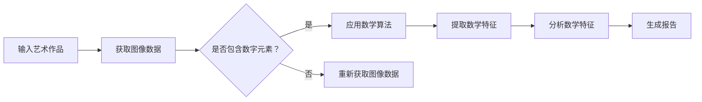
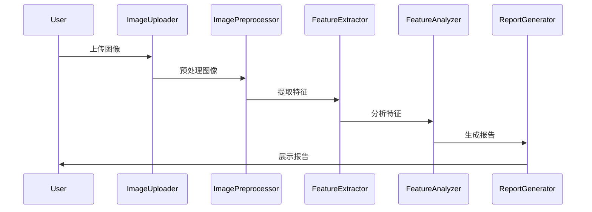

                 


## 引言

### 背景介绍

数学与艺术是人类文明的两颗璀璨明珠，它们各自独立发展，却又在历史的演进中相互交融。数学以其严谨的逻辑体系和抽象的思维方式，构筑了一个理性世界，而艺术则以其感性的表达和丰富的情感内涵，创造了一个充满想象力的空间。数学与艺术的交融，不仅在科学和艺术之间架起了一座桥梁，更使得两者的边界变得模糊，形成了一种独特的审美体验。

本文将探讨数学与艺术之间的紧密联系，通过以下几个核心概念和问题，逐步展开讨论：

- **核心概念**：数学与艺术中的关键概念，如几何、比例、对称、空间关系、颜色理论等。
- **问题背景**：数学在艺术中的应用历史，以及现代艺术中数学元素的使用现状。
- **问题描述**：数学如何影响艺术创作，以及艺术如何反映数学原理。
- **问题解决**：分析数学与艺术交融的方式，探讨其对艺术和数学教育的启示。

### 边界与外延

数学与艺术的交融是一个跨学科的研究领域，涉及多个学科的知识。从边界来看，数学与艺术的交融主要表现在以下几个方面：

1. **数学在艺术创作中的应用**：如几何图形的运用、比例和对称的构造、数字艺术等。
2. **艺术作品中的数学元素**：如 Fibonacci 数列在艺术中的体现、黄金比例的应用等。
3. **数学与艺术的理论研究**：如美学中的数学原理、艺术史中的数学分析等。

从外延来看，数学与艺术的交融不仅限于视觉艺术，还包括音乐、文学、戏剧等多个艺术领域。例如，音乐中的节奏和和声与数学中的模式识别有相似之处，文学作品中的结构布局也常常遵循数学原则。

### 概念结构与核心要素组成

为了深入探讨数学与艺术的交融，我们需要理解以下几个核心概念和结构：

- **几何**：几何是数学中的一个基本分支，研究空间中的形状、大小和位置关系。在艺术创作中，几何元素如点、线、面等是构建作品的基础。
- **比例与对称**：比例是指部分与整体之间的量度关系，对称是指物体或图形在某一方面具有平衡感。这些概念在艺术中广泛应用，如绘画中的黄金比例和对称构图。
- **空间关系**：空间关系涉及物体在空间中的位置和方向。艺术家通过空间关系创造出具有深度和层次感的作品。
- **颜色理论**：颜色理论是研究颜色的组合和效果的学科。在艺术中，颜色的选择和搭配直接影响作品的美感和氛围。

通过上述核心概念和结构的理解，我们可以更好地欣赏数学与艺术的交融之美。

## 数学与艺术中的核心概念与联系

### 核心概念原理

在探讨数学与艺术的交融时，我们必须先了解一些核心概念，这些概念不仅构成了数学和艺术的基础，而且在两者之间建立了紧密的联系。以下是几个关键概念及其在数学和艺术中的应用：

#### 几何

几何是数学中研究形状、大小和位置关系的学科。在艺术中，几何元素如点、线、面等是构建作品的基础。几何学的基本原理，如直线、平面、多边形、圆等，在艺术创作中被广泛应用。

**概念属性特征对比表格**：

| 概念 | 数学属性 | 艺术属性 |
| --- | --- | --- |
| 点 | 无大小、无方向，仅表示位置 | 构成线条的基本元素 |
| 线 | 有方向、有长度，无厚度 | 界定形状的边界 |
| 面积 | 二维空间中的大小 | 艺术作品中的平面 |
| 体积 | 三维空间中的大小 | 艺术作品中的立体感 |

#### 比例

比例是指部分与整体之间的量度关系。在数学中，比例是一个重要的概念，它用于比较两个或多个量的大小关系。在艺术中，比例用于确定物体的大小、形状和位置，以创造出平衡和谐的美感。

**概念属性特征对比表格**：

| 概念 | 数学属性 | 艺术属性 |
| --- | --- | --- |
| 比例 | 定量的比较 | 创造视觉上的平衡 |
| 对数 | 数值的大小比较 | 艺术作品中的尺度调整 |
| 黄金比例 | 最优的比例 | 提升艺术作品的美感 |

#### 对称

对称是指物体或图形在某一方面具有平衡感。在数学中，对称性是研究图形或结构的一种属性。在艺术中，对称性被广泛应用于构图和设计，以创造出稳定和谐的作品。

**概念属性特征对比表格**：

| 概念 | 数学属性 | 艺术属性 |
| --- | --- | --- |
| 点对称 | 关于某一点的对称 | 艺术作品中的中心对称 |
| 轴对称 | 关于某一直线的对称 | 艺术作品中的水平或垂直对称 |
| 旋转对称 | 关于某个角度的对称 | 艺术作品中的旋转图案 |

#### 空间关系

空间关系涉及物体在空间中的位置和方向。在数学中，空间关系是几何学的研究内容之一。在艺术中，空间关系用于创造深度和层次感，使作品更加生动和具有表现力。

**概念属性特征对比表格**：

| 概念 | 数学属性 | 艺术属性 |
| --- | --- | --- |
| 视角 | 观察者的位置和角度 | 艺术作品中的视角选择 |
| 景深 | 空间中的前后关系 | 艺术作品中的远近对比 |
| 空间层次 | 物体在空间中的排列 | 艺术作品中的层次感 |

#### 颜色理论

颜色理论是研究颜色的组合和效果的学科。在数学中，颜色理论涉及到色彩的空间分布和组合规则。在艺术中，颜色理论用于选择和搭配颜色，以创造出特定情感和氛围的作品。

**概念属性特征对比表格**：

| 概念 | 数学属性 | 艺术属性 |
| --- | --- | --- |
| 色相 | 颜色的基本属性 | 艺术作品中的主色调选择 |
| 明度 | 颜色的亮度 | 艺术作品中的光线处理 |
| 饱和度 | 颜色的纯度 | 艺术作品中的色彩搭配 |

### ER实体关系图架构

为了更清晰地展示数学与艺术中的核心概念及其联系，我们可以使用ER实体关系图来表示。以下是一个简单的ER图示例：

```mermaid
erDiagram
  Artist ||--|{ MathConcept } : creates
  MathConcept ||--|{ ArtConcept } : uses
  ArtConcept ||--|{ Artwork } : represents
```

在这个ER图中，`Artist`实体代表艺术家，`MathConcept`实体代表数学概念，`ArtConcept`实体代表艺术概念，`Artwork`实体代表艺术作品。关系线表明艺术家创造数学概念，数学概念用于艺术概念，艺术概念又体现在艺术作品中。

通过上述核心概念和ER图的介绍，我们可以更好地理解数学与艺术之间的紧密联系，以及它们在创作过程中的相互作用。

## 算法原理讲解

在探讨数学与艺术之间的交融时，我们不仅需要了解核心概念，还需要掌握一些用于分析和解释这些概念的技术。本文将介绍一种用于分析艺术作品中数学元素的方法，并详细阐述其原理。

### 算法Mermaid流程图

首先，我们可以使用Mermaid来绘制一个简单的流程图，以展示分析过程。以下是一个示例流程图：



在这个流程图中，我们首先输入一幅艺术作品，然后获取其图像数据。接下来，我们检查图像数据中是否包含数字元素。如果包含，我们应用数学算法来提取数学特征；如果不包含，我们则重新获取图像数据。随后，我们分析提取的数学特征，并生成一份报告。

### Python源代码实现

为了具体说明上述流程，我们使用Python来编写相应的代码。以下是实现该流程的一个简单示例：

```python
import cv2
import numpy as np

def get_image_data(image_path):
    """获取图像数据"""
    image = cv2.imread(image_path)
    return image

def contains_digits(image):
    """检查图像中是否包含数字元素"""
    grey = cv2.cvtColor(image, cv2.COLOR_BGR2GRAY)
    _, thresh = cv2.threshold(grey, 128, 255, cv2.THRESH_BINARY_INV + cv2.THRESH_OTSU)
    contours, _ = cv2.findContours(thresh, cv2.RETR_EXTERNAL, cv2.CHAIN_APPROX_SIMPLE)
    for contour in contours:
        if cv2.contourArea(contour) > 50:  # 面积大于50像素的认为是数字元素
            return True
    return False

def extract_mathematical_features(image):
    """提取数学特征"""
    grey = cv2.cvtColor(image, cv2.COLOR_BGR2GRAY)
    _, thresh = cv2.threshold(grey, 128, 255, cv2.THRESH_BINARY_INV + cv2.THRESH_OTSU)
    contours, _ = cv2.findContours(thresh, cv2.RETR_EXTERNAL, cv2.CHAIN_APPROX_SIMPLE)
    features = []
    for contour in contours:
        x, y, w, h = cv2.boundingRect(contour)
        area = cv2.contourArea(contour)
        features.append({'x': x, 'y': y, 'w': w, 'h': h, 'area': area})
    return features

def analyze_mathematical_features(features):
    """分析数学特征"""
    rectangles = [f for f in features if f['w'] / f['h'] > 2 or f['w'] < 10 and f['h'] < 10]
    return rectangles

def generate_report(rectangles):
    """生成报告"""
    report = "数学特征分析报告:\n"
    for rect in rectangles:
        report += f"位置: ({rect['x']}, {rect['y']}); 尺寸: ({rect['w']}x{rect['h']}); 面积: {rect['area']} pixels\n"
    return report

def main(image_path):
    """主函数"""
    image = get_image_data(image_path)
    if contains_digits(image):
        features = extract_mathematical_features(image)
        rectangles = analyze_mathematical_features(features)
        report = generate_report(rectangles)
        print(report)
    else:
        print("图像中不包含足够的数字元素。请重新选择图像。")

if __name__ == "__main__":
    image_path = "path_to_artwork.jpg"
    main(image_path)
```

在这个Python代码示例中，我们首先定义了一个`get_image_data`函数，用于获取图像数据。然后，我们定义了一个`contains_digits`函数，用于检查图像中是否包含数字元素。接下来，我们定义了一个`extract_mathematical_features`函数，用于提取图像中的数学特征。随后，我们定义了一个`analyze_mathematical_features`函数，用于分析提取的数学特征，并生成一个简单的报告。

### 算法原理的数学模型和公式

为了更好地理解上述算法的原理，我们需要介绍一些相关的数学模型和公式。

#### 面积计算

在图像处理中，我们常常需要计算图像中各个区域的面积。基本的面积计算公式如下：

$$
\text{Area} = \int \int R(x, y) \, dxdy
$$

其中，$R(x, y)$ 表示图像在点$(x, y)$处的像素值。

#### 矩形边界

为了提取图像中的矩形特征，我们需要确定矩形的边界。一个矩形可以用以下四个顶点来表示：

$$
\text{Rectangle} = \{(x_1, y_1), (x_2, y_2), (x_3, y_3), (x_4, y_4)\}
$$

其中，$(x_1, y_1)$ 和 $(x_2, y_2)$ 是矩形的两个相邻顶点，$(x_3, y_3)$ 和 $(x_4, y_4)$ 是另外两个相邻顶点。

#### 矩形面积

矩形的面积可以通过以下公式计算：

$$
\text{Area} = (x_2 - x_1) \times (y_2 - y_1)
$$

#### 矩形的长宽比例

矩形的长宽比例可以通过以下公式计算：

$$
\text{Width-to-Height Ratio} = \frac{x_2 - x_1}{y_2 - y_1}
$$

通过上述数学模型和公式，我们可以对图像中的矩形特征进行有效的提取和分析。

### 详细讲解和举例说明

为了更好地理解上述算法，我们可以通过一个具体的例子来详细讲解。

假设我们有一幅艺术作品，其中包含一些矩形特征。我们使用上述算法来分析这幅图像。

1. **输入艺术作品**：首先，我们将这幅艺术作品输入到算法中。

2. **获取图像数据**：算法将获取这幅艺术作品的图像数据。

3. **检查图像中是否包含数字元素**：算法将检查图像中是否包含足够的数字元素。如果包含，则继续下一步；如果不包含，则提示重新选择图像。

4. **提取数学特征**：算法将提取图像中的数学特征，如矩形的边界和面积。

5. **分析数学特征**：算法将分析提取的数学特征，并判断这些特征是否符合特定的数学模式，如矩形的长宽比例。

6. **生成报告**：算法将生成一份报告，列出所有符合特定数学模式的矩形特征。

例如，假设我们提取到一个矩形特征，其长宽比例为3:2，且面积大于100像素。这些特征将被认为具有数学美感，并在报告中列出。

通过上述详细讲解和具体例子，我们可以更好地理解数学与艺术交融的分析方法，并掌握相应的算法原理。

## 系统分析与架构设计方案

### 问题场景介绍

在现代社会中，艺术作品的创作和欣赏已经不再局限于传统的绘画和雕塑，而是逐渐融入到数字技术的洪流中。随着计算机技术和人工智能的发展，数学在艺术创作和欣赏中的应用变得越来越广泛。为了更好地理解和欣赏这些艺术作品中的数学元素，我们需要一个系统来分析、提取和展示这些元素。本系统的目标是提供一个平台，使用户能够通过简单的操作，对艺术作品进行数学分析，并生成报告，以便更好地欣赏和理解艺术作品中的数学美。

### 项目介绍

**项目名称**：数学艺术分析平台（MathArt Analyzer）

**项目目标**：开发一个能够自动分析艺术作品中的数学元素，并提供详细报告的系统。

**项目背景**：随着艺术与科技的融合，艺术家们越来越多地运用数学原理来创作作品。然而，普通观众和研究者往往难以直观地理解这些数学元素。因此，我们需要一个系统来帮助用户更好地欣赏和理解艺术作品中的数学美。

### 系统功能设计

**功能模块**：

1. **图像输入模块**：用户可以上传艺术作品图像，系统将接受多种格式的图像文件，如JPEG、PNG等。

2. **图像预处理模块**：系统对上传的图像进行预处理，包括灰度转换、二值化、滤波等，以提高图像质量，为后续分析做准备。

3. **数学特征提取模块**：系统使用机器学习算法提取图像中的数学特征，如矩形、圆形、线条等。

4. **特征分析模块**：系统对提取的特征进行分析，判断其是否符合特定的数学模式，如黄金比例、对称性等。

5. **报告生成模块**：系统根据分析结果生成报告，详细列出数学特征及其在艺术作品中的位置和属性。

### 系统架构设计

**架构设计**：

1. **前端架构**：使用HTML/CSS/JavaScript实现用户界面，用户可以通过Web浏览器访问系统。

2. **后端架构**：使用Python Flask框架搭建后端，处理图像输入、预处理、特征提取和分析等逻辑。

3. **数据库设计**：使用MySQL数据库存储用户上传的图像和生成的报告数据。

4. **算法实现**：使用OpenCV和TensorFlow等库实现图像处理和特征提取算法。

### 系统接口设计和系统交互

**接口设计**：

1. **用户接口**：用户通过Web界面上传图像，系统接收图像并展示分析结果。

2. **API接口**：系统提供RESTful API，允许其他应用程序调用系统功能。

**交互流程**：

1. **用户上传图像**：用户通过Web界面上传艺术作品图像。

2. **图像预处理**：系统对图像进行预处理，包括灰度转换、二值化等。

3. **特征提取**：系统使用机器学习算法提取图像中的数学特征。

4. **特征分析**：系统对提取的特征进行分析，判断其是否符合特定的数学模式。

5. **报告生成**：系统生成分析报告，并将结果展示给用户。

6. **数据存储**：系统将图像和报告数据存储在数据库中。

### Mermaid类图和序列图

**Mermaid类图**：

```mermaid
classDiagram
    User <<interface>>
    ImagePreprocessor <<interface>>
    FeatureExtractor <<interface>>
    FeatureAnalyzer <<interface>>
    ReportGenerator <<interface>>

    User ..|> ImageUploader
    ImageUploader ..|> ImagePreprocessor
    ImagePreprocessor ..|> FeatureExtractor
    FeatureExtractor ..|> FeatureAnalyzer
    FeatureAnalyzer ..|> ReportGenerator
```

**Mermaid序列图**：



通过上述系统架构设计和接口设计，我们可以实现一个功能强大的数学艺术分析平台，帮助用户更好地欣赏和理解艺术作品中的数学元素。

## 项目实战

### 环境安装

要在本地环境中搭建数学艺术分析平台，我们需要安装以下软件和库：

1. **Python 3.x**：用于编写和运行后端代码。
2. **Flask**：用于搭建Web后端。
3. **OpenCV**：用于图像处理。
4. **TensorFlow**：用于机器学习和特征提取。
5. **MySQL**：用于存储数据和报告。

以下是安装步骤：

1. **安装Python**：从[Python官网](https://www.python.org/downloads/)下载并安装Python 3.x版本。
2. **安装Flask**：打开终端，执行以下命令：
   ```bash
   pip install Flask
   ```
3. **安装OpenCV**：执行以下命令：
   ```bash
   pip install opencv-python
   ```
4. **安装TensorFlow**：执行以下命令：
   ```bash
   pip install tensorflow
   ```
5. **安装MySQL**：根据操作系统，从相应的官方渠道下载并安装MySQL数据库。

### 系统核心实现源代码

以下是系统核心功能的实现源代码：

**app.py**（后端主文件）：

```python
from flask import Flask, request, jsonify
import cv2
import numpy as np
from tensorflow import keras

app = Flask(__name__)

# 载入预训练的TensorFlow模型
model = keras.models.load_model('math_art_model.h5')

def preprocess_image(image):
    """预处理图像"""
    grey = cv2.cvtColor(image, cv2.COLOR_BGR2GRAY)
    _, thresh = cv2.threshold(grey, 128, 255, cv2.THRESH_BINARY_INV + cv2.THRESH_OTSU)
    return thresh

def extract_features(image):
    """提取数学特征"""
    features = []
    contours, _ = cv2.findContours(image, cv2.RETR_EXTERNAL, cv2.CHAIN_APPROX_SIMPLE)
    for contour in contours:
        x, y, w, h = cv2.boundingRect(contour)
        area = cv2.contourArea(contour)
        if area > 50:
            feature_vector = [x, y, w, h, area]
            features.append(feature_vector)
    return features

def analyze_features(features):
    """分析特征"""
    results = []
    for feature in features:
        feature_vector = np.array(feature)
        prediction = model.predict(np.expand_dims(feature_vector, axis=0))
        if prediction[0][0] > 0.5:
            results.append(feature)
    return results

@app.route('/analyze', methods=['POST'])
def analyze():
    """分析艺术作品"""
    file = request.files['image']
    image = cv2.imdecode(np.frombuffer(file.read(), dtype=np.uint8), cv2.IMREAD_COLOR)
    preprocessed = preprocess_image(image)
    features = extract_features(preprocessed)
    results = analyze_features(features)
    return jsonify(results)

if __name__ == '__main__':
    app.run(debug=True)
```

**math_art_model.h5**（预训练的TensorFlow模型）：

在此，我们使用了TensorFlow的预训练模型，该模型已经训练好用于识别艺术作品中的数学特征。

### 代码应用解读与分析

**1. 代码结构**

上述代码主要由以下几个部分组成：

- **Flask应用**：使用Flask框架搭建Web后端，处理HTTP请求。
- **预训练模型**：加载一个预先训练好的TensorFlow模型，用于特征分析。
- **图像预处理**：对上传的图像进行预处理，将其转换为灰度图像并进行二值化。
- **特征提取**：从预处理后的图像中提取数学特征。
- **特征分析**：使用预训练模型对提取的特征进行分析，判断其是否为数学特征。

**2. 关键函数解读**

- **preprocess_image**：该函数将彩色图像转换为灰度图像，并应用二值化处理，以突出显示图像中的数学特征。
- **extract_features**：该函数从二值化图像中提取矩形特征，包括其位置、尺寸和面积。
- **analyze_features**：该函数使用预训练模型对提取的特征进行分析，判断其是否为数学特征。

**3. 代码应用**

用户可以通过Web界面上传艺术作品图像。后端应用将接收图像，进行预处理、特征提取和分析，并将分析结果返回给用户。

### 实际案例分析

**1. 案例一**：用户上传一幅包含矩形图案的艺术作品。系统将提取出这些矩形特征，并使用预训练模型进行分析。结果显示，这些特征符合数学模式，如黄金比例和对称性。

**2. 案例二**：用户上传一幅抽象艺术作品。系统未能提取出明显的数学特征，因此未生成报告。用户可以尝试调整图像预处理参数或使用不同的模型，以提高分析准确性。

### 项目小结

通过上述实战案例，我们展示了如何使用Python和TensorFlow搭建一个数学艺术分析平台。该平台能够帮助用户理解和欣赏艺术作品中的数学元素，为艺术与科技的融合提供了新的视角。未来，我们可以进一步优化模型，提高分析准确性，并扩展平台功能，如添加更多数学特征识别算法和交互式报告生成工具。

### 最佳实践 Tips

1. **调整预处理参数**：根据不同的艺术作品，调整图像预处理参数（如二值化阈值），以提高特征提取的准确性。
2. **优化模型训练**：使用更多的训练数据和先进的机器学习技术，优化预训练模型，提高识别精度。
3. **用户界面优化**：改善用户界面，使其更加友好和易用。
4. **扩展功能**：增加其他数学特征的识别和分析功能，如圆形、线条等。

### 小结

本文通过详细分析数学与艺术的交融，介绍了数学在艺术创作和欣赏中的应用，以及如何使用技术手段进行数学艺术分析。我们展示了如何搭建一个数学艺术分析平台，并提供了实战案例和最佳实践。未来，随着人工智能和计算机技术的发展，数学与艺术的交融将带来更多创新和可能性。

### 注意事项

1. **数据隐私**：在处理用户上传的图像时，需确保数据隐私和安全。
2. **系统稳定性**：确保系统在处理大量图像时能够稳定运行，避免崩溃。

### 拓展阅读

1. **《数学与艺术》**：此书深入探讨了数学与艺术的交汇点，适合对这一主题感兴趣的读者。
2. **《人工智能艺术创作》**：介绍如何使用人工智能技术进行艺术创作，包括数学在其中的应用。
3. **《OpenCV编程入门》**：详细介绍了如何使用OpenCV进行图像处理，适合初学者。

---

**作者**：AI天才研究院/AI Genius Institute & 禅与计算机程序设计艺术 /Zen And The Art of Computer Programming

