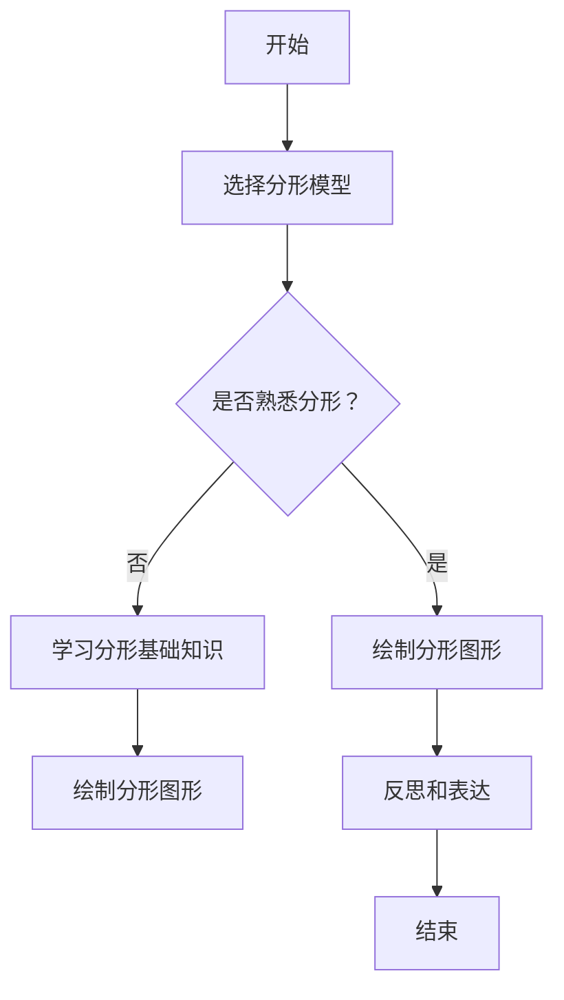
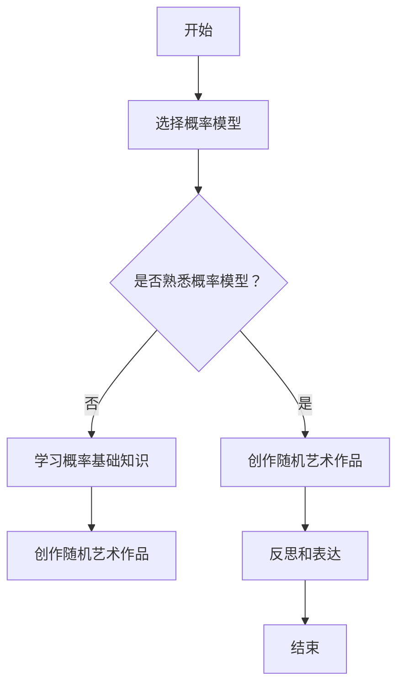
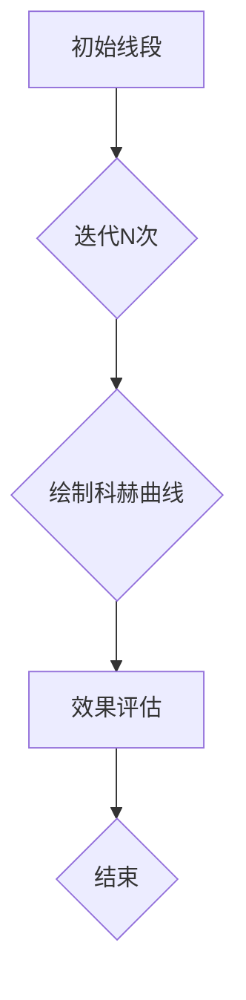
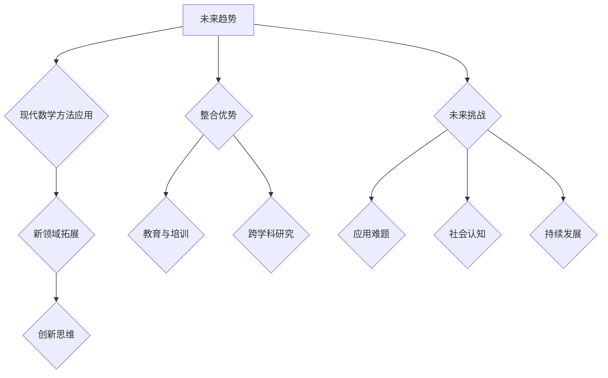
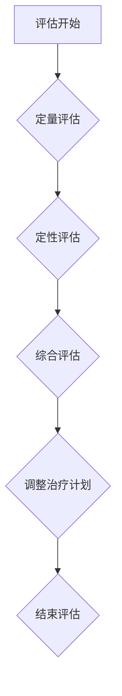
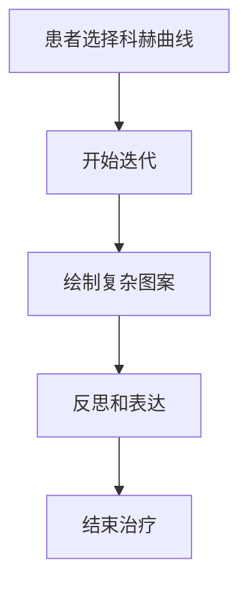
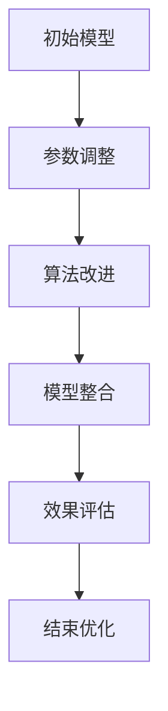

                 

### 文章标题

# 数学与艺术治疗的理论基础

### 关键词

- 数学
- 艺术
- 治疗理论
- 心理健康
- 跨学科研究

### 摘要

本文深入探讨了数学与艺术治疗的理论基础，分析数学在艺术治疗中的应用，及其对心理健康的积极影响。通过介绍数学与艺术的结合，以及数学模型在艺术治疗中的应用，本文为跨学科研究提供了新的视角和思路，旨在为心理健康领域的研究者和从业者提供有价值的参考。

----------------------------------------------------------------

## 第一部分: 数学与艺术治疗概述

### 第1章: 数学与艺术治疗背景

#### 1.1 问题背景

##### 1.1.1 心理健康与治疗需求

随着现代社会生活节奏的加快和压力的不断增加，心理健康问题日益突出。根据世界卫生组织（WHO）的数据，全球有近三分之一的人口在一生中的某个阶段会出现心理健康问题。心理健康问题的严重程度可能导致个体在社会、工作和家庭生活中遇到困难，甚至影响到整个社会的稳定与发展。

##### 1.1.2 数学与艺术的结合

数学是一门抽象的学科，而艺术则是一种表现情感和思想的手段。尽管两者看似截然不同，但它们在许多方面有着深刻的联系。数学可以用来描述和解析艺术作品中的形式和结构，同时艺术也可以为数学提供灵感，使数学研究更加生动和直观。

##### 1.1.3 艺术治疗的理论基础

艺术治疗是一种通过艺术活动来促进个体心理健康的治疗方法。它基于艺术创作的自由表达，帮助个体探索和表达内心的情感和经历。艺术治疗的理论基础包括心理动力学、人本主义和认知行为等不同流派，其核心目标是改善个体的心理状态和生活质量。

#### 1.2 核心概念

##### 1.2.1 数学在艺术治疗中的应用

数学在艺术治疗中的应用主要体现在以下几个方面：

1. **几何形式的应用**：几何图形、对称性和空间关系等在艺术创作中有着广泛的应用。
2. **算法和编程**：通过编程和算法，艺术家可以创造出独特的视觉和听觉效果。
3. **概率和统计**：概率和统计在艺术创作中可以用来模拟自然现象和随机过程。

##### 1.2.2 艺术治疗的基本原理

艺术治疗的基本原理包括：

1. **非语言表达**：艺术治疗允许个体通过非语言方式表达内心情感和经历。
2. **情感宣泄**：艺术创作可以帮助个体释放内心的压力和情感。
3. **自我探索**：艺术治疗提供一个安全的环境，帮助个体深入探索自我和潜意识。

##### 1.2.3 数学与艺术的联系表格

以下是一个简化的数学与艺术的联系表格，展示了两者之间的一些关键点：

| 数学概念 | 艺术表现 |
| :--- | :--- |
| 几何图形 | 艺术构图 |
| 算法和编程 | 数字艺术 |
| 概率和统计 | 随机艺术 |

#### 1.3 艺术治疗中的数学模型

##### 1.3.1 数学公式与模型介绍

在艺术治疗中，数学模型可以用来描述和解析艺术创作中的某些方面。以下是一些常见的数学模型：

1. **分形模型**：分形是一种复杂的几何结构，可以用来模拟自然界中的形态，如植物、云彩等。
2. **迭代函数系统（IFS）**：IFS是一种用于生成复杂图形的数学工具，广泛应用于艺术创作中。
3. **小波分析**：小波分析是一种信号处理技术，可以用于图像和声音的艺术处理。

##### 1.3.2 数学模型应用案例

以下是一些数学模型在艺术治疗中的应用案例：

1. **分形艺术治疗**：通过分形图形的绘制，患者可以探索自我和潜意识。
2. **IFS艺术治疗**：IFS图形的生成可以帮助患者理解变化和复杂性。
3. **小波分析艺术治疗**：通过小波分析处理的声音和图像可以帮助患者放松和减压。

##### 1.3.3 数学模型的mermaid流程图

为了更好地理解数学模型在艺术治疗中的应用，可以使用mermaid绘制流程图。以下是一个简化的分形艺术治疗流程图的示例：

这个流程图展示了分形艺术治疗的基本步骤，包括选择模型、绘制图形、反思和表达。

----------------------------------------------------------------

## 第2章: 数学与艺术治疗的理论基础

### 2.1 数学与艺术治疗的关联性

#### 2.1.1 数学概念的艺术表达

数学概念的艺术表达是指将数学中的几何图形、算法、概率等抽象概念转化为视觉和听觉艺术形式。这种转化不仅增强了数学的美感，也为艺术创作提供了新的视角和手段。例如，分形艺术就是利用数学中的分形理论来创作复杂的视觉作品。

#### 2.1.2 艺术创作的数学思维

艺术创作的数学思维是指艺术家在创作过程中运用数学原理和方法来构思和表现作品。这种思维方式可以帮助艺术家更加精准地表达情感和思想，同时也能提高艺术作品的视觉效果。例如，许多艺术家会在创作中运用黄金分割比例来增强作品的美感。

#### 2.1.3 数学与艺术的融合方法论

数学与艺术的融合方法论包括以下几个方面：

1. **数学工具的使用**：艺术家可以使用各种数学工具，如计算机编程、几何设计软件等来创作作品。
2. **跨学科合作**：数学家与艺术家的合作可以创造出更加创新和有趣的艺术作品。
3. **理论研究**：数学家可以运用数学理论来解释和预测艺术作品中的某些现象。

### 2.2 数学原理在艺术治疗中的应用

#### 2.2.1 几何在艺术治疗中的应用

几何在艺术治疗中的应用非常广泛。通过几何图形的绘制和设计，患者可以探索自我和潜意识。例如，分形几何可以用于创造复杂的图案，这些图案可以帮助患者表达内心深处的情感。

#### 2.2.2 代数在艺术治疗中的应用

代数在艺术治疗中的应用主要体现在数学公式和算法的运用上。通过解方程和编写算法，患者可以体验数学的严谨性和逻辑性，同时也可以通过这种活动来放松和减压。

#### 2.2.3 概率与统计在艺术治疗中的应用

概率与统计在艺术治疗中的应用主要体现在随机艺术和概率游戏的创作和参与中。这种活动可以帮助患者理解随机性和不确定性，从而更好地应对生活中的压力和挑战。

### 2.3 艺术治疗的数学模型实例

#### 2.3.1 艺术治疗的代数模型

一个简单的代数模型可以是“方程艺术治疗”。患者可以通过解代数方程来创作艺术作品。例如，选择一个简单的二次方程，如 \(x^2 + y^2 = r^2\)，然后根据解出的 \(x\) 和 \(y\) 值绘制一个圆形。这个过程中，患者不仅可以体验到数学的乐趣，也可以通过艺术创作来表达情感。

#### 2.3.2 艺术治疗的几何模型

几何模型在艺术治疗中的应用非常广泛。例如，分形几何可以用于创作复杂的艺术作品，如分形树、分形花等。这些作品不仅具有美感和艺术性，也可以帮助患者探索自我和潜意识。

#### 2.3.3 艺术治疗的概率统计模型

概率统计模型在艺术治疗中的应用主要体现在随机艺术和概率游戏的创作和参与中。例如，患者可以通过随机选择颜色和图案来创作随机艺术作品，这种活动可以帮助患者放松和减压。

这个流程图展示了概率统计模型在艺术治疗中的基本步骤，包括选择模型、创作作品、反思和表达。

----------------------------------------------------------------

## 第3章: 数学与艺术治疗的实践应用

### 3.1 艺术治疗中的数学工具

#### 3.1.1 数学工具的选择与应用

在艺术治疗中，选择合适的数学工具至关重要。不同的数学工具可以用于不同的治疗场景。例如，几何工具可以用于构图和形状的创作，而概率工具可以用于随机艺术的创作。

#### 3.1.2 数学工具在艺术治疗中的效果

数学工具在艺术治疗中的应用可以带来多种效果。首先，它们可以帮助患者放松和减压。其次，它们可以提供一种新的表达方式，使患者能够更好地探索和表达自我。最后，数学工具可以激发患者的创造力和好奇心。

#### 3.1.3 数学工具的使用技巧

以下是一些数学工具的使用技巧：

1. **几何工具**：熟练掌握几何工具，如CAD软件，可以创作出更加精细和复杂的作品。
2. **概率工具**：了解概率分布和随机过程，可以创作出更具随机性和不确定性的作品。
3. **代数工具**：掌握代数方程和解法，可以创作出富有逻辑性和结构性的作品。

### 3.2 艺术治疗案例解析

#### 3.2.1 案例一：代数艺术治疗

**案例背景**：一位患有抑郁症的患者在接受艺术治疗时，选择了代数艺术治疗。她通过解代数方程来创作艺术作品。

**治疗过程**：患者在治疗师的指导下，选择了几个简单的二次方程，如 \(x^2 + y^2 = 4\) 和 \(x^2 - y^2 = 1\)。她根据解出的 \(x\) 和 \(y\) 值，绘制了相应的图形。

**治疗效果**：患者表示，通过这种代数艺术治疗，她感到思维更加清晰，情绪也有所缓解。

#### 3.2.2 案例二：几何艺术治疗

**案例背景**：一位患有焦虑症的患者在接受艺术治疗时，选择了几何艺术治疗。

**治疗过程**：患者在治疗师的指导下，使用几何工具创作了复杂的几何图案。这些图案不仅具有美感，还可以帮助患者放松和减压。

**治疗效果**：患者表示，通过几何艺术治疗，她的焦虑感明显减轻，睡眠质量也有所提高。

#### 3.2.3 案例三：概率统计艺术治疗

**案例背景**：一位患有强迫症的患者在接受艺术治疗时，选择了概率统计艺术治疗。

**治疗过程**：患者在治疗师的指导下，通过随机选择颜色和图案来创作艺术作品。这种活动帮助患者理解随机性和不确定性，从而减轻强迫症的症状。

**治疗效果**：患者表示，通过概率统计艺术治疗，她对生活中的不确定性有了更好的接受能力，强迫症的症状明显减轻。

### 3.3 艺术治疗的数学模型构建

#### 3.3.1 数学模型构建步骤

构建艺术治疗的数学模型通常需要以下几个步骤：

1. **需求分析**：明确治疗目标和患者需求。
2. **选择模型**：根据需求和患者特点选择合适的数学模型。
3. **模型构建**：根据所选模型，构建数学模型。
4. **模型验证**：通过实验和反馈验证模型的可行性和效果。

#### 3.3.2 数学模型的应用案例

以下是一个简单的数学模型应用案例：

**案例背景**：一位患有自闭症谱系障碍（ASD）的患者在接受艺术治疗时，使用了分形模型。

**模型构建**：治疗师选择了分形几何模型，如科赫曲线（Koch curve）。科赫曲线是一种递归分形，其构建过程如下：

1. **初始阶段**：绘制一条线段。
2. **迭代阶段**：将线段等分为三部分，删除中间部分，并在两侧各添加一个等长的线段，形成新的曲线。
3. **重复迭代**：重复上述步骤，生成更复杂的曲线。

**应用过程**：患者通过绘制科赫曲线，可以体验递归和自相似的概念，从而有助于理解和表达自闭症谱系障碍中的复杂性。

**效果评估**：患者和治疗师共同评估治疗效果，发现患者在艺术创作中表现出更多的自发性，对环境的适应性也有所提高。

这个流程图展示了分形模型在艺术治疗中的基本步骤，包括初始阶段、迭代阶段、绘制阶段和效果评估阶段。

----------------------------------------------------------------

## 第4章: 数学与艺术治疗的未来展望

### 4.1 艺术治疗的数学模型发展趋势

随着科技的进步和心理学研究的发展，艺术治疗的数学模型也在不断更新和优化。以下是一些可能的发展趋势：

#### 4.1.1 现代数学方法的应用

现代数学方法，如拓扑学、混沌理论和计算几何等，有望在艺术治疗中得到更广泛的应用。这些方法可以提供更加复杂和精细的艺术创作工具，从而为患者提供更丰富的治疗体验。

#### 4.1.2 数学与艺术治疗的新领域

数学与艺术治疗的交叉领域正在不断拓展，如数学哲学、数学心理学等。这些新领域的研究将为数学与艺术治疗的整合提供新的视角和理论支持。

#### 4.1.3 数学与艺术治疗的创新思维

创新思维在数学与艺术治疗中具有重要意义。通过跨学科合作，数学家和艺术家可以共同探讨如何将数学理论应用于艺术创作，从而创造出更加具有治疗价值的艺术作品。

### 4.2 数学与艺术治疗的整合

数学与艺术治疗的整合是指将数学原理和方法应用于艺术治疗实践中。以下是一些整合的关键点：

#### 4.2.1 数学与艺术治疗的优势互补

数学的优势在于其严谨性和逻辑性，而艺术的优势在于其表达性和情感性。两者的整合可以发挥各自的优势，提供更加全面和有效的治疗体验。

#### 4.2.2 数学与艺术治疗的教育与培训

数学与艺术治疗的整合需要专业人才的支持。因此，相关教育和培训项目显得尤为重要。通过系统化的教育和培训，可以提高从业者的专业水平，推动数学与艺术治疗的整合。

#### 4.2.3 数学与艺术治疗的跨学科研究

跨学科研究是数学与艺术治疗整合的重要途径。通过跨学科研究，可以深入探讨数学与艺术治疗的理论基础和实践方法，为两者的整合提供科学依据。

### 4.3 数学与艺术治疗的未来挑战

尽管数学与艺术治疗具有巨大的潜力，但在实际应用中仍面临一些挑战：

#### 4.3.1 数学与艺术治疗的应用难题

数学与艺术治疗的应用需要解决许多技术难题，如如何将复杂的数学理论转化为易于理解的艺术形式，如何评估数学模型的治疗效果等。

#### 4.3.2 数学与艺术治疗的社会认知

数学与艺术治疗作为一种新兴的治疗方法，需要得到社会的广泛认知和接受。这需要通过广泛的宣传和教育，提高公众对数学与艺术治疗的认识。

#### 4.3.3 数学与艺术治疗的持续发展

数学与艺术治疗的持续发展需要不断的创新和探索。这需要政府、学术界和医疗机构等各方面的支持和投入。

这个流程图展示了数学与艺术治疗的未来发展趋势、整合优势、未来挑战以及应对策略。

----------------------------------------------------------------

## 第5章: 数学与艺术治疗的实践技巧

### 5.1 艺术治疗的实践策略

#### 5.1.1 艺术治疗的实施步骤

艺术治疗的实施步骤通常包括以下几个阶段：

1. **评估和诊断**：对患者进行全面的评估，了解其心理状况和治疗需求。
2. **制定计划**：根据评估结果，制定个性化的艺术治疗计划。
3. **实施治疗**：按照治疗计划进行艺术创作活动。
4. **评估和调整**：定期评估治疗效果，并根据需要调整治疗计划。

#### 5.1.2 艺术治疗的注意事项

在艺术治疗实践中，需要注意以下几点：

1. **安全与尊重**：确保患者的安全和隐私，尊重患者的意愿和创作过程。
2. **耐心与支持**：艺术治疗是一个长期的过程，需要耐心和支持。
3. **个体差异**：每个患者的心理状况和需求都不同，需要个性化治疗。

#### 5.1.3 艺术治疗的评估方法

艺术治疗的评估方法包括定量评估和定性评估。定量评估可以通过问卷、量表等方式进行，而定性评估则可以通过观察、访谈等方式进行。以下是一个简化的评估方法流程图：

### 5.2 数学在艺术治疗中的应用技巧

#### 5.2.1 数学工具的运用

在艺术治疗中，数学工具的应用至关重要。以下是一些常见的数学工具及其应用技巧：

1. **几何工具**：使用几何工具，如CAD软件，可以帮助患者创作复杂的几何图形，增强艺术效果。
2. **概率工具**：通过概率工具，如随机数生成器，可以帮助患者创作随机艺术作品，体验不确定性和随机性的魅力。
3. **代数工具**：通过代数工具，如方程式，可以帮助患者理解和表达数学逻辑，增强艺术创作的逻辑性。

#### 5.2.2 数学方法的创新

在艺术治疗中，创新数学方法的运用可以带来更多的治疗效果。以下是一些创新方法：

1. **分形艺术治疗**：利用分形几何的递归特性，可以帮助患者探索自我和潜意识。
2. **混沌艺术治疗**：利用混沌理论的复杂性，可以帮助患者理解和表达情感。
3. **计算机算法**：通过编程和算法，可以帮助患者创作出独特的视觉和听觉效果。

#### 5.2.3 数学与艺术治疗的实践案例

以下是一个简单的数学与艺术治疗的实践案例：

**案例背景**：一位患有焦虑症的患者在接受艺术治疗时，选择了分形艺术治疗。

**治疗过程**：患者和治疗师共同选择了科赫曲线（Koch curve）作为创作工具。患者按照科赫曲线的迭代规则，逐步绘制出越来越复杂的图案。

**治疗效果**：患者表示，通过这种分形艺术治疗，她的焦虑感明显减轻，情绪更加稳定。

这个流程图展示了分形艺术治疗的基本步骤，包括选择工具、迭代绘制、反思和表达。

### 5.3 艺术治疗的数学模型优化

#### 5.3.1 数学模型优化的方法

优化数学模型的方法包括以下几个方面：

1. **参数调整**：通过调整模型参数，可以改变模型的行为和输出结果。
2. **算法改进**：通过改进算法，可以增加模型的准确性和效率。
3. **模型整合**：将多个模型整合到一个系统中，可以提供更全面和准确的治疗方案。

#### 5.3.2 数学模型优化的实践

以下是一个简单的数学模型优化实践案例：

**案例背景**：一位患有自闭症谱系障碍（ASD）的患者在接受艺术治疗时，使用了分形几何模型。

**优化过程**：治疗师通过调整分形几何模型的参数，如迭代次数和分形维数，优化了模型的行为和输出结果。此外，治疗师还改进了绘制算法，提高了绘制的效率。

**效果评估**：患者和治疗师共同评估了优化后的治疗效果，发现患者在艺术创作中的自发性明显提高，对环境的适应性也有所改善。

这个流程图展示了数学模型优化实践的基本步骤，包括参数调整、算法改进、模型整合和效果评估。

#### 5.3.3 数学模型优化效果评估

在数学模型优化后，对效果进行评估是非常重要的。以下是一些评估方法：

1. **定量评估**：通过量化指标，如创作时间、作品复杂度等，评估模型优化效果。
2. **定性评估**：通过观察、访谈等方式，评估模型优化对治疗过程和效果的影响。
3. **患者反馈**：收集患者的反馈，了解他们对模型优化效果的满意度和建议。

通过这些评估方法，可以全面了解数学模型优化效果，为后续优化提供参考。

----------------------------------------------------------------

## 第6章: 数学与艺术治疗的案例分析

### 6.1 案例一：数学艺术治疗实践

#### 6.1.1 案例背景

一位患有社交焦虑症的患者接受了数学艺术治疗。患者在接受治疗之前，常常感到紧张和不安，害怕与他人交流。

#### 6.1.2 治疗过程

在治疗过程中，治疗师引导患者使用分形几何工具创作艺术作品。患者首先学习了分形的基本概念和绘制方法，然后开始创作分形图案。

治疗师鼓励患者在创作过程中自由表达，不受任何限制。随着治疗的深入，患者的创作越来越复杂，图案也越来越美丽。

#### 6.1.3 治疗效果

经过一段时间的数学艺术治疗，患者报告说，他的焦虑感明显减轻，与人交流时更加自信。此外，患者在创作过程中也学会了如何面对和解决问题，这对他的日常生活也有积极影响。

### 6.2 案例二：艺术治疗中的数学应用

#### 6.2.1 案例背景

一位患有抑郁症的患者接受了艺术治疗，治疗师在治疗中引入了数学元素，帮助患者重拾生活的乐趣。

#### 6.2.2 艺术创作过程

患者和治疗师一起选择了代数方程作为创作工具。患者首先学习了代数方程的基本概念和求解方法，然后开始创作代数图案。

治疗师鼓励患者通过解方程来创作艺术作品，如绘制二次函数的图像。患者在这个过程中体验到了数学的严谨性和逻辑性，同时也感受到了艺术创作的乐趣。

#### 6.2.3 治疗效果分析

经过一段时间的艺术治疗，患者报告说，他的抑郁情绪明显改善，生活态度变得更加积极。患者在创作过程中不仅学会了如何处理情绪，还发现了数学和艺术之间的奇妙联系。

### 6.3 案例三：跨学科整合的数学与艺术治疗

#### 6.3.1 案例背景

一位患有创伤后应激障碍（PTSD）的患者接受了跨学科整合的数学与艺术治疗。治疗团队包括数学家、艺术家和治疗师。

#### 6.3.2 治疗方案设计

治疗方案的设计基于混沌理论和随机艺术。治疗师引导患者创作随机图案，并通过混沌迭代生成复杂图形。这种创作过程帮助患者理解和表达复杂的情绪和经历。

#### 6.3.3 治疗效果评估

经过一段时间的跨学科整合治疗，患者报告说，他的情绪稳定，对未来的期望值有所提高。患者在创作过程中学会了如何面对和接受不确定性，这对他的心理康复有重要意义。

这些案例展示了数学与艺术治疗在实践中的应用效果。通过数学与艺术的结合，患者不仅改善了心理健康状况，还发现了新的兴趣和激情。

----------------------------------------------------------------

## 第7章: 数学与艺术治疗的拓展阅读

### 7.1 数学与艺术治疗的研究动态

#### 7.1.1 研究领域发展趋势

数学与艺术治疗作为一个新兴的交叉领域，正逐渐受到关注。以下是一些研究领域的发展趋势：

1. **分形几何的应用**：分形几何在艺术治疗中具有广泛的应用前景，可以用于创作具有治愈效果的艺术作品。
2. **计算机算法的引入**：计算机算法可以用于生成复杂的艺术作品，为艺术治疗提供新的工具和方法。
3. **跨学科研究的深化**：数学与艺术治疗的跨学科研究正在不断深入，包括心理学、教育学等多个领域的融合。

#### 7.1.2 新兴研究方向

以下是一些新兴研究方向：

1. **混沌理论在艺术治疗中的应用**：混沌理论可以用于创作具有治愈效果的艺术作品，帮助患者理解和表达复杂的情感。
2. **代数艺术治疗**：代数艺术治疗是一种结合代数原理的艺术治疗方法，具有很大的发展潜力。
3. **概率艺术治疗**：概率艺术治疗通过随机艺术作品来帮助患者理解和接受不确定性，对心理健康有积极影响。

### 7.2 推荐书籍与文献

以下是一些推荐的书籍和文献，供进一步阅读：

1. **《分形几何学》（Mandelbrot，B.B.）**：介绍了分形几何的基本概念和应用，对艺术治疗研究有重要参考价值。
2. **《数学与艺术的融合》（Hodges，Andrew）**：探讨了数学与艺术之间的关系，为数学与艺术治疗的研究提供了理论基础。
3. **《艺术治疗的理论与实践》（Brandt，Marilyn）**：介绍了艺术治疗的基本原理和应用，对数学与艺术治疗的研究有重要启示。

### 7.3 推荐在线资源

以下是一些推荐的在线资源，供进一步学习和研究：

1. **数学与艺术治疗在线课程**：许多在线教育平台提供了相关的课程，如Coursera、edX等。
2. **学术期刊与论文**：可以通过Google Scholar等学术搜索引擎，查找相关领域的最新研究论文。
3. **专业论坛与社区**：如Reddit的数学与艺术板块、艺术治疗论坛等，可以交流学习经验，获取最新动态。

通过拓展阅读，可以深入了解数学与艺术治疗的理论和实践，为相关研究提供有力支持。

----------------------------------------------------------------

## 作者信息

**作者：AI天才研究院/AI Genius Institute & 禅与计算机程序设计艺术 /Zen And The Art of Computer Programming**

