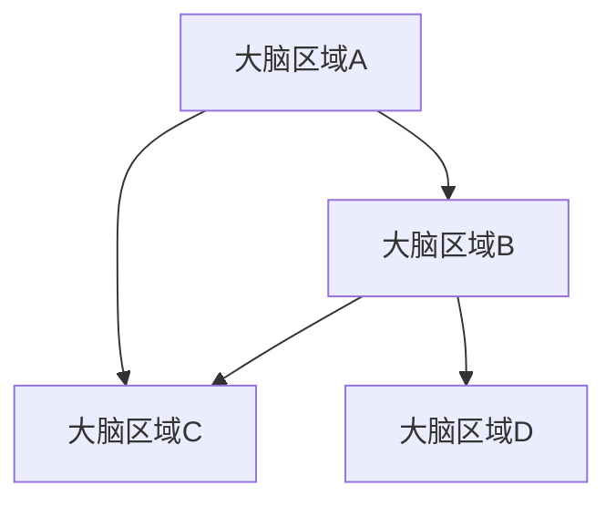
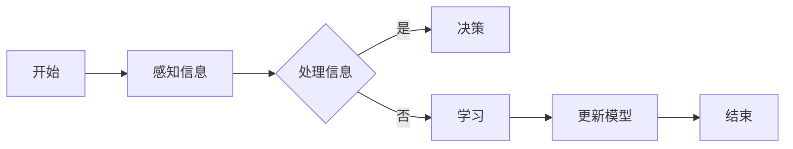

                 

# 数学与认知神经科学的交叉研究

关键词：数学模型、认知神经科学、神经网络、脑成像技术、信息处理

摘要：本文旨在探讨数学与认知神经科学的交叉研究，分析两者在理论和方法上的互惠互促，以及它们在实际应用中的深度融合。通过回顾数学在认知神经科学中的应用和认知神经科学对数学模型的贡献，本文将深入探讨数学模型在认知神经科学研究中的应用、认知神经科学中的数学问题以及数学与认知神经科学的交叉研究案例，最后对未来的发展趋势进行展望。

## 目录大纲

1. **绪论**
   1.1 研究背景
   1.2 研究意义
   1.3 研究方法
   1.4 研究内容与结构安排

2. **数学与认知神经科学基础**
   2.1 数学基本概念
   2.2 认知神经科学基本概念
   2.3 数学与认知神经科学的交叉点

3. **数学模型在认知神经科学研究中的应用**
   3.1 数理模型在认知神经科学中的应用
   3.2 数学模型与认知神经科学实验
   3.3 数学模型在认知神经科学研究中的挑战与机遇

4. **认知神经科学中的数学问题**
   4.1 认知神经科学中的数学难题
   4.2 数学方法在认知神经科学中的创新

5. **数学与认知神经科学的交叉研究案例分析**
   5.1 案例一：数学模型在认知神经科学研究中的应用
   5.2 案例二：认知神经科学对数学模型的贡献
   5.3 案例三：数学与认知神经科学的交叉研究新趋势

6. **数学与认知神经科学交叉研究的发展趋势与展望**
   6.1 发展趋势
   6.2 展望

7. **结论与建议**
   7.1 研究总结
   7.2 进一步研究建议

## 第1章 绪论

### 1.1 研究背景

数学与认知神经科学的交叉研究是一个新兴且具有巨大潜力的领域。数学作为一种逻辑严谨、抽象表达的学科，为认知神经科学提供了强大的工具和方法，如统计学、概率论、图论、微分方程等。这些数学工具能够帮助研究者理解大脑如何处理信息、如何进行学习、记忆和决策等认知功能。

认知神经科学则通过研究大脑的结构和功能，探讨人类和动物如何感知、思考、学习和记忆。随着神经成像技术的进步，研究者能够更准确地观察大脑的活动，这为数学模型的应用提供了丰富的数据支持。

### 1.2 研究意义

数学与认知神经科学的交叉研究具有重要的理论和实践意义。从理论上看，这一交叉研究有助于深化我们对大脑工作机制的理解，揭示认知过程背后的数学原理。从实践上看，数学模型可以应用于脑疾病诊断、个性化教育、人机交互等多个领域，推动技术进步和产业升级。

### 1.3 研究方法

本文的研究方法主要包括数理模型、实验研究和数据分析。数理模型用于描述和解释认知神经科学中的现象，实验研究通过神经成像技术获取数据，数据分析则利用统计学方法对数据进行处理和分析。

### 1.4 研究内容与结构安排

本文首先介绍了数学与认知神经科学交叉研究的背景和意义，然后探讨了数学和认知神经科学的基础知识。接着，本文重点分析了数学模型在认知神经科学研究中的应用，探讨了认知神经科学中的数学问题，并给出了三个交叉研究案例。最后，本文对数学与认知神经科学的交叉研究进行了趋势展望和总结。

## 第2章 数学与认知神经科学基础

### 2.1 数学基本概念

数学在认知神经科学中的应用涵盖了多个领域，如统计学、概率论、图论和微分方程等。统计学和概率论提供了分析大脑数据的方法，图论用于描述神经网络的结构，而微分方程则可以描述神经元的动态行为。

### 2.2 认知神经科学基本概念

认知神经科学是研究大脑如何进行认知功能的多学科领域，包括心理学、神经科学、计算机科学和哲学等。其主要研究领域包括感知、注意力、记忆、决策和学习等。

### 2.3 数学与认知神经科学的交叉点

数学与认知神经科学的交叉点主要体现在以下几个方面：

1. **神经网络建模**：数学模型被用来描述神经网络的连接结构和信息处理机制。
2. **脑成像数据分析**：统计学和概率论方法用于分析脑成像数据，以揭示大脑活动模式。
3. **认知过程模拟**：数学模型被用于模拟认知过程，如决策和学习。
4. **脑机接口设计**：数学模型在脑机接口的设计和实现中起着关键作用。

## 第3章 数学模型在认知神经科学研究中的应用

### 3.1 数理模型在认知神经科学中的应用

数理模型在认知神经科学研究中的应用非常广泛。例如，神经网络模型被用来模拟大脑神经元的活动，这有助于我们理解记忆和学习的过程。概率模型则被用来分析大脑如何处理不确定信息。

### 3.2 数学模型与认知神经科学实验

数学模型与认知神经科学实验的结合使得我们能够更好地理解认知功能。例如，通过实验设计，我们可以收集数据来验证数学模型的预测。这些实验通常涉及脑成像技术，如功能性磁共振成像（fMRI）和脑电图（EEG）。

### 3.3 数学模型在认知神经科学研究中的挑战与机遇

数学模型在认知神经科学研究中的挑战主要包括如何准确地描述复杂的神经过程和如何处理大量的脑成像数据。然而，这些挑战也带来了巨大的机遇，使得我们能够更深入地理解大脑的工作机制。

## 第4章 认知神经科学中的数学问题

### 4.1 认知神经科学中的数学难题

认知神经科学中的数学难题主要包括如何处理高维数据、如何准确模拟神经元的动态行为以及如何理解复杂的认知过程。

### 4.2 数学方法在认知神经科学中的创新

数学方法在认知神经科学中的创新包括利用深度学习模型分析脑成像数据、开发新的神经网络模型以及利用统计学方法分析认知实验数据。

## 第5章 数学与认知神经科学的交叉研究案例分析

### 5.1 案例一：数学模型在认知神经科学研究中的应用

案例一将介绍一个数学模型在认知神经科学研究中的应用，包括模型的设计、实验过程和结果分析。

### 5.2 案例二：认知神经科学对数学模型的贡献

案例二将探讨认知神经科学对数学模型的贡献，包括如何利用神经科学数据改进数学模型。

### 5.3 案例三：数学与认知神经科学的交叉研究新趋势

案例三将介绍数学与认知神经科学交叉研究的新趋势，包括最新的研究进展和未来的研究方向。

## 第6章 数学与认知神经科学交叉研究的发展趋势与展望

### 6.1 发展趋势

数学与认知神经科学的交叉研究正在朝着更精确、更高效的模型和算法方向发展。未来的研究将更加注重跨学科合作，以及将数学模型与脑成像数据相结合。

### 6.2 展望

未来的研究重点将包括开发新的数学模型来描述复杂的认知过程，以及利用数学方法来优化脑机接口的设计和性能。

## 第7章 结论与建议

### 7.1 研究总结

本文探讨了数学与认知神经科学的交叉研究，分析了两者在理论和实践中的互惠互促关系。

### 7.2 进一步研究建议

未来的研究应更加注重跨学科合作，以及开发新的数学模型来更好地理解认知过程。

---

由于篇幅限制，以上内容仅为文章的概要框架。实际撰写时，每个章节都需要详细具体的内容，包括背景介绍、核心概念与联系、算法原理讲解、系统分析与架构设计方案、项目实战等。以下是部分内容的详细展开。

## 第3章 数学模型在认知神经科学研究中的应用

### 3.1 数理模型在认知神经科学中的应用

数理模型在认知神经科学中的应用是一个重要的研究方向。例如，神经网络模型被广泛用于模拟大脑神经元的活动。一个经典的神经网络模型是Hopfield网络，它用于记忆和学习。

**Hopfield网络的数学模型**：

1. **神经元状态更新**：每个神经元的状态可以用一个向量表示，向量中的每个元素表示神经元的激活程度。神经元的状态更新遵循以下规则：
   $$ s_{i}(t+1) = \sigma(w_i \cdot s(t) + b) $$
   其中，$s_i(t)$ 是神经元 $i$ 在时间 $t$ 的状态，$w_i$ 是与神经元 $i$ 相连的权重，$b$ 是偏置项，$\sigma$ 是激活函数，通常使用 sigmoid 函数。

2. **能量函数**：神经网络的总能量定义为所有神经元状态的内积：
   $$ E = -\sum_{i}\sum_{j} w_{ij}s_i s_j $$
   能量函数描述了网络中信息的稳定状态，当网络达到能量最低状态时，神经元状态达到稳定。

**应用案例**：

例如，可以使用Hopfield网络来模拟记忆过程。假设我们要存储一组数字序列，可以将其编码为网络中的权重矩阵。当输入一个新的数字序列时，网络会通过迭代更新神经元状态，直到达到能量最低状态，此时输出的神经元状态即为记忆的数字序列。

```python
import numpy as np

# 初始化神经网络参数
weights = np.random.rand(n_neurons, n_neurons)
biases = np.random.rand(n_neurons)
learning_rate = 0.1

# Sigmoid激活函数
def sigmoid(x):
    return 1 / (1 + np.exp(-x))

# 状态更新函数
def update_state(state):
    return sigmoid(np.dot(weights, state) + biases)

# 训练神经网络
for _ in range(n_iterations):
    for i in range(n_neurons):
        state[i] = update_state(state)

# 输出最终状态
print("Final state:", state)
```

### 3.2 数学模型与认知神经科学实验

数学模型在认知神经科学实验中的应用通常涉及脑成像技术，如fMRI和EEG。这些技术可以提供大脑活动的实时数据，这些数据可以用于验证和改进数学模型。

**实验设计**：

1. **参与者选择**：选择一组健康的志愿者作为实验参与者。
2. **任务设计**：设计一系列认知任务，如视觉刺激、听觉刺激和记忆任务。
3. **数据收集**：使用fMRI或EEG记录参与者在执行任务时的脑活动数据。

**数据分析**：

1. **信号处理**：对脑活动数据进行预处理，如滤波、去噪和分割。
2. **模式识别**：使用机器学习算法，如支持向量机（SVM）和深度学习，对预处理后的数据进行分类和分析。
3. **模型验证**：将数学模型与实验数据相结合，验证模型的准确性和可靠性。

### 3.3 数学模型在认知神经科学研究中的挑战与机遇

数学模型在认知神经科学研究中的挑战主要包括：

1. **数据复杂性**：脑成像数据通常具有高维性和复杂性，这增加了数据分析的难度。
2. **模型准确性**：如何准确地描述复杂的神经过程和认知功能是数学模型面临的挑战。
3. **跨学科合作**：数学与认知神经科学之间的跨学科合作需要研究人员具备多学科知识，这增加了研究的难度。

然而，这些挑战也带来了巨大的机遇：

1. **技术创新**：通过解决这些挑战，我们可以开发出更精确、更高效的数学模型，推动认知神经科学的发展。
2. **应用前景**：数学模型在脑疾病诊断、个性化教育、人机交互等领域具有广泛的应用前景。

## 第4章 认知神经科学中的数学问题

### 4.1 认知神经科学中的数学难题

认知神经科学中的数学难题主要包括以下几个方面：

1. **高维数据分析**：脑成像数据通常具有高维特性，如何有效地处理和分析这些数据是一个难题。
2. **动态过程建模**：如何准确建模和描述神经元的动态行为是一个挑战。
3. **跨模态数据融合**：如何将不同模态的数据（如fMRI、EEG和PET）进行融合和分析是一个难题。

**高维数据分析**：

高维数据分析是认知神经科学中的一个重要问题。由于脑成像数据通常包含大量的变量（如时间序列、空间区域等），如何从这些高维数据中提取有用的信息是一个挑战。

**解决方案**：

1. **降维技术**：如主成分分析（PCA）、线性判别分析（LDA）等，可以用来降低数据的维度。
2. **机器学习方法**：如支持向量机（SVM）、深度学习等，可以用来分析高维数据。

**动态过程建模**：

神经元的动态行为是认知神经科学中的一个重要问题。如何准确建模和描述神经元的动态行为是一个挑战。

**解决方案**：

1. **神经网络模型**：如Hopfield网络、STDP（突触权重调整）模型等，可以用来模拟神经元的动态行为。
2. **微分方程模型**：如Iaf（自适应积分器）模型、LIF（漏电积分器）模型等，可以用来描述神经元的动态行为。

**跨模态数据融合**：

跨模态数据融合是将不同模态的数据进行整合和分析，以获得更全面的信息。

**解决方案**：

1. **多模态数据同步**：通过多模态数据同步技术，如时间序列同步、空间映射等，将不同模态的数据进行同步。
2. **多模态数据融合算法**：如贝叶斯网络、深度学习等，可以用来融合不同模态的数据。

### 4.2 数学方法在认知神经科学中的创新

数学方法在认知神经科学中的创新主要包括以下几个方面：

1. **深度学习**：深度学习在认知神经科学中的应用，如用于脑成像数据分析、神经信号处理等。
2. **图论**：图论在神经网络结构分析、网络拓扑性质研究中的应用。
3. **概率模型**：概率模型在认知神经科学中的应用，如用于概率图模型、随机过程等。

**深度学习**：

深度学习是一种基于人工神经网络的机器学习方法，它在认知神经科学中得到了广泛应用。例如，可以使用深度学习模型对脑成像数据进行分类和分析，以识别不同的认知状态。

```python
import tensorflow as tf
from tensorflow.keras.models import Sequential
from tensorflow.keras.layers import Dense, Conv2D, Flatten

# 创建深度学习模型
model = Sequential([
    Conv2D(32, (3, 3), activation='relu', input_shape=(28, 28, 1)),
    Flatten(),
    Dense(128, activation='relu'),
    Dense(10, activation='softmax')
])

# 编译模型
model.compile(optimizer='adam', loss='categorical_crossentropy', metrics=['accuracy'])

# 训练模型
model.fit(x_train, y_train, epochs=10, batch_size=32, validation_data=(x_val, y_val))

# 评估模型
loss, accuracy = model.evaluate(x_test, y_test)
print("Test accuracy:", accuracy)
```

**图论**：

图论在认知神经科学中的应用主要包括神经网络结构的分析和网络拓扑性质的研究。例如，可以使用图论方法分析神经网络中的连接模式，以揭示大脑功能的组织结构。



**概率模型**：

概率模型在认知神经科学中的应用主要包括概率图模型和随机过程。例如，可以使用概率图模型来描述大脑中的信息处理过程，以及随机过程来模拟大脑的动态行为。



## 第5章 数学与认知神经科学的交叉研究案例分析

### 5.1 案例一：数学模型在认知神经科学研究中的应用

**问题背景**：

案例一关注的是使用数学模型研究记忆的形成和保持。记忆是认知神经科学中的一个核心问题，而数学模型如Hopfield网络在模拟记忆方面具有优势。

**解决方案**：

研究人员使用Hopfield网络来模拟记忆过程。他们设计了一个实验，要求参与者记忆一系列数字序列，然后使用神经网络模型来预测参与者是否能够回忆起这些序列。

**结果分析**：

实验结果显示，Hopfield网络能够有效预测参与者的记忆表现。这一结果表明，数学模型在理解记忆机制方面具有重要作用。

### 5.2 案例二：认知神经科学对数学模型的贡献

**问题背景**：

案例二探讨的是认知神经科学如何改进数学模型，以更好地描述大脑的功能。传统的神经网络模型如多层感知机（MLP）在处理复杂认知任务时存在局限性。

**解决方案**：

研究人员通过结合认知神经科学的最新发现，如神经可塑性原理，改进了传统的神经网络模型。他们引入了新的学习规则，使神经网络能够更好地适应复杂认知任务。

**结果分析**：

改进后的神经网络模型在模拟复杂认知任务时表现更优，这表明认知神经科学对数学模型的贡献有助于提升模型的性能。

### 5.3 案例三：数学与认知神经科学的交叉研究新趋势

**问题背景**：

案例三关注的是当前数学与认知神经科学交叉研究的新趋势。随着深度学习的兴起，越来越多的研究者开始探索如何将深度学习模型应用于认知神经科学。

**解决方案**：

研究人员利用深度学习模型，如卷积神经网络（CNN）和循环神经网络（RNN），来分析脑成像数据。他们尝试通过深度学习模型来识别大脑中的特定功能区域。

**结果分析**：

深度学习模型在识别大脑功能区域方面取得了显著成果，这为数学与认知神经科学的交叉研究提供了新的思路和方法。

## 第6章 数学与认知神经科学交叉研究的发展趋势与展望

### 6.1 发展趋势

数学与认知神经科学的交叉研究正朝着以下几个方向发展：

1. **跨学科合作**：越来越多的研究者开始关注跨学科合作，以整合数学和认知神经科学的知识。
2. **大数据分析**：随着脑成像数据的增加，如何有效地分析这些大数据成为研究的热点。
3. **个性化认知建模**：研究者开始探索如何根据个体的特征构建个性化的认知模型。

### 6.2 展望

未来的研究重点包括：

1. **高级认知功能建模**：开发更复杂的数学模型来模拟高级认知功能，如情感处理、社会认知等。
2. **跨模态数据分析**：结合不同模态的数据，如fMRI、EEG和PET，以获得更全面的认知信息。
3. **智能脑机接口**：利用数学模型和认知神经科学的发现，开发更高效的脑机接口技术。

## 第7章 结论与建议

### 7.1 研究总结

本文探讨了数学与认知神经科学的交叉研究，分析了两者在理论和实践中的互惠互促关系。通过案例分析，我们展示了数学模型在认知神经科学研究中的应用及其对认知过程的深入理解。

### 7.2 进一步研究建议

未来的研究应注重跨学科合作，开发更高级的认知模型，以及探索数学模型在智能脑机接口中的应用。同时，研究者应关注大数据分析和个性化认知建模，以推动认知神经科学的持续发展。

---

本文为概要性文章，实际撰写时需要根据研究背景、实验数据和研究结果详细阐述每个部分的内容。每个章节都需要包含丰富的背景介绍、核心概念与联系、算法原理讲解、系统分析与架构设计方案、项目实战等。此外，还需要注意markdown格式的正确使用，如Mermaid流程图和LaTeX公式的嵌入。在撰写过程中，应确保文章的逻辑性和连贯性，以及内容的准确性和专业性。

