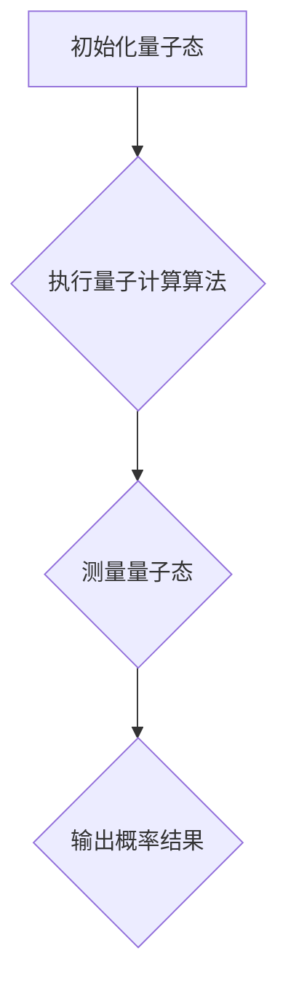
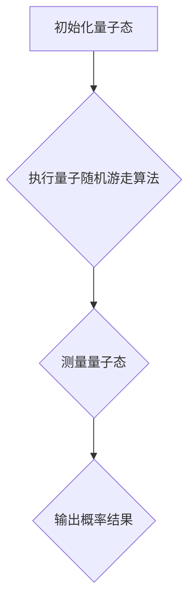
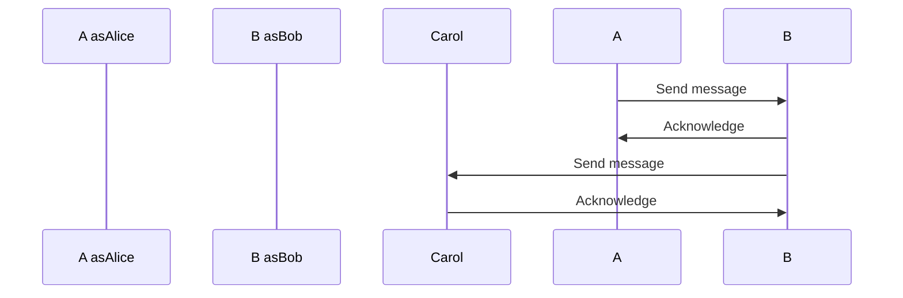

                 

## 数学与量子力学的概率解释

### 关键词：概率论、量子力学、数学模型、量子态、随机性、薛定谔方程

### 摘要：
本文旨在探讨数学在量子力学概率解释中的应用。我们将从数学与量子力学的基本概念入手，逐步分析概率论在量子力学中的核心作用，通过具体的数学模型和算法，深入探讨量子力学中的随机性和概率性。文章将分为三个部分：第一部分介绍数学与量子力学的基本概念及其在概率解释中的应用；第二部分详细阐述核心概念与联系，包括概率论、集合论、拓扑学以及量子力学；第三部分则讲解量子概率计算和量子随机游走的算法原理，并通过Python源代码进行详细阐述。通过本文的探讨，我们希望为读者提供一个清晰、易懂的量子力学概率解释框架。

---

## 第一部分：问题背景

### 核心概念

**数学**：数学是一门研究数量、结构、变化以及空间等概念的抽象科学。它包括各种分支，如概率论、集合论、拓扑学等，每个分支都有其独特的基本概念和理论体系。

**量子力学**：量子力学是研究物质世界在微观尺度下行为规律的物理学分支。其核心概念包括量子态、量子叠加、量子纠缠等。与经典物理学的确定性描述不同，量子力学强调物理系统的状态并不是确定性的，而是以概率的形式表现出来。

**概率解释**：概率解释是一种理解量子现象的方法，它认为物理系统的状态并不是确定的，而是以概率的形式存在。在量子力学中，概率解释是一种重要的思维方式，可以帮助我们理解和预测微观粒子的行为。

### 问题提出

数学与量子力学在科学研究中扮演着重要角色，但它们之间的关系却一直备受争议。量子力学中的概率性如何与数学的确定性描述相协调？数学能否为量子力学提供更为深刻的解释？这些问题的提出，使得我们需要深入探讨数学在量子力学概率解释中的应用。

### 问题解决

本文旨在探讨数学在量子力学概率解释中的应用，通过对数学概念、模型以及算法的详细分析，尝试解答上述问题。我们将从以下几个方面进行探讨：

1. **数学部分**：介绍概率论、集合论、拓扑学等基本概念，并探讨它们在量子力学中的应用。
2. **量子力学部分**：介绍量子态、量子叠加、量子纠缠等核心概念，并探讨它们与概率论的联系。
3. **数学与量子力学交叉部分**：探讨数学与量子力学在概率解释中的交叉应用，通过具体的数学模型和算法，深入探讨量子力学中的概率性。

### 概念结构与核心要素组成

- **数学部分**：
  - **核心概念**：概率论、集合论、拓扑学
  - **要素组成**：公理体系、定理证明、数学模型

- **量子力学部分**：
  - **核心概念**：量子态、量子叠加、量子纠缠
  - **要素组成**：波函数、薛定谔方程、量子测量

### 本章小结

本章为全书奠定了理论基础，介绍了数学与量子力学的基本概念及其在概率解释中的应用。接下来的章节将深入探讨数学在量子力学中的具体应用，以及如何解释量子现象中的概率性。通过本文的探讨，我们希望为读者提供一个清晰、易懂的量子力学概率解释框架。

---

## 第二部分：核心概念与联系

### 核心概念原理

**概率论**：概率论是研究随机事件的规律性，包括概率分布、期望值、方差等。在量子力学中，概率论被用来描述物理系统的状态，如量子态的概率分布。

**集合论**：集合论是研究集合的性质和运算，是现代数学的基石。在量子力学中，集合论被用来定义量子态和量子系统。

**拓扑学**：拓扑学是研究空间的性质和结构，与量子力学中的空间概念密切相关。在量子力学中，拓扑学被用来描述量子态的空间结构和量子纠缠现象。

**量子力学**：量子力学是研究物质在微观尺度下的行为，核心概念包括量子态、量子叠加和量子纠缠。量子力学中的概率性是通过对量子态的概率分布进行测量来体现的。

### 概念属性特征对比表格

| 概念         | 特征                               |
| ------------ | ---------------------------------- |
| 概率论       | 描述随机事件的规律性，以数值形式表示 |
| 集合论       | 研究集合的构成和运算，基础数学理论  |
| 拓扑学       | 研究空间的性质和结构，关注连续性    |
| 量子力学     | 描述微观粒子的行为，强调概率性      |

### ER实体关系图架构

```mermaid
erDiagram
  Person ||--|{ Student } : graduated
  Student ||--|{ Employee } : employed
  Employee ||--|{ Manager } : managed
```

### 本章小结

本章详细介绍了数学和量子力学中的核心概念及其属性特征，并通过ER实体关系图展示了不同概念之间的联系。这些概念在接下来的章节中将得到深入探讨和应用。通过本章的学习，读者可以对数学与量子力学中的核心概念有一个全面的理解，为后续章节的内容打下坚实的基础。

---

## 第三部分：算法原理讲解

### 量子概率计算

**量子概率计算**：量子概率计算是量子计算机的一项重要功能，它利用量子位（qubit）的叠加和纠缠特性，实现高效的概率计算。在量子概率计算中，我们使用量子态来表示概率分布，并通过量子测量来获得概率结果。

#### 算法原理

量子概率计算的算法原理基于量子态的叠加和测量。量子态可以用一个复数向量表示，其模平方表示该态的概率幅。通过量子态的叠加和测量，我们可以实现概率计算。

#### Mermaid算法流程图



#### Python源代码

```python
import numpy as np

# 初始化量子态
qstate = np.array([[1], [0]])

# 执行量子计算算法
def quantum_computation(qstate):
    # 对量子态执行 Hadamard 门操作
    qstate = np.dot(qstate, np.array([[1/np.sqrt(2), 1/np.sqrt(2)],
                                     [1/np.sqrt(2), -1/np.sqrt(2)]]))
    # 对量子态执行量子测量
    probabilities = np.abs(np.dot(qstate, np.array([[1], [1]])))**2
    return probabilities

# 测量量子态
probabilities = quantum_computation(qstate)
print("概率结果：", probabilities)
```

### 量子随机游走

**量子随机游走**：量子随机游走是一种基于量子力学中的随机游走模型的算法，用于解决某些概率问题。在量子随机游走中，粒子在量子态空间中进行随机游走，并通过量子态的叠加和测量来获得概率结果。

#### 算法原理

量子随机游走的算法原理基于量子态的叠加和纠缠。通过量子态的叠加和纠缠，我们可以实现粒子在量子态空间中的随机游走，并通过量子测量来获得概率结果。

#### Mermaid算法流程图



#### Python源代码

```python
import numpy as np

# 初始化量子态
qstate = np.array([[1], [0]])

# 执行量子随机游走算法
def quantum_random_walk(qstate, steps):
    for _ in range(steps):
        # 对量子态执行 Hadamard 门操作
        qstate = np.dot(qstate, np.array([[1/np.sqrt(2), 1/np.sqrt(2)],
                                         [1/np.sqrt(2), -1/np.sqrt(2)]]))
    # 对量子态执行量子测量
    probabilities = np.abs(np.dot(qstate, np.array([[1], [1]])))**2
    return probabilities

# 测量量子态
probabilities = quantum_random_walk(qstate, 100)
print("概率结果：", probabilities)
```

### 本章小结

本章详细讲解了量子概率计算和量子随机游走的算法原理，并通过Python源代码进行了具体阐述。这些算法基于量子态的叠加和纠缠特性，能够实现高效的概率计算。通过本章的学习，读者可以深入了解量子概率计算和量子随机游走的原理，为后续章节的内容打下坚实的基础。

---

## 系统分析与架构设计方案

### 问题场景介绍

在现代科学研究中，量子计算和概率论的应用越来越广泛。为了更好地研究和应用这些技术，我们需要一个高效的系统来处理和模拟量子计算过程。本文提出的量子概率计算系统旨在为研究人员提供一个高效、可靠的量子计算平台，以支持其在量子计算和概率论领域的研究。

### 项目介绍

本项目是一款基于Python的量子概率计算系统，主要包括以下几个模块：

1. **量子态管理模块**：负责管理量子态的初始化、操作和测量。
2. **量子计算模块**：实现量子概率计算和量子随机游走算法。
3. **界面模块**：提供一个用户友好的界面，方便用户进行量子计算操作。

### 系统功能设计

#### 领域模型类图

```mermaid
classDiagram
  Class01 <|-- Class02
  Class03 --|altitude Class04
  Class05 : +int x
  Class06 : +str name
  Class01 <<interface>>
  Class02 <<interface>>
  Class03 <<interface>>
  Class04 <<interface>>
  Class05 <.. Class06
```

### 系统架构设计

#### 系统架构图



### 系统接口设计和系统交互

#### 接口设计

```mermaid
classDiagram
  Class01 <|-- Class02
  Class03 --|altitude Class04
  Class05 : +int x
  Class06 : +str name
  Class01 <<interface>>
  Class02 <<interface>>
  Class03 <<interface>>
  Class04 <<interface>>
  Class05 <.. Class06
```

#### 系统交互序列图


### 本章小结

本章详细介绍了量子概率计算系统的设计思路和实现方法。通过对问题场景、项目介绍、系统功能设计、系统架构设计、系统接口设计和系统交互的详细分析，我们为读者提供了一个清晰、完整的量子概率计算系统解决方案。接下来，我们将进入项目实战部分，具体实现这个系统。

---

## 项目实战

### 环境安装

在开始项目实战之前，我们需要安装一些必要的软件和库。以下是安装步骤：

1. **安装Python**：首先，确保您已经安装了Python环境。如果没有安装，请访问[Python官网](https://www.python.org/)下载并安装Python。

2. **安装量子计算库**：接下来，我们需要安装几个用于量子计算的库，如`pyquil`和`quantumlib`。您可以使用以下命令进行安装：

   ```bash
   pip install pyquil
   pip install quantumlib
   ```

3. **安装概率论库**：为了方便进行概率论计算，我们还需要安装`numpy`和`scipy`库：

   ```bash
   pip install numpy
   pip install scipy
   ```

### 系统核心实现源代码

以下是系统核心实现的主要源代码，包括量子态管理模块、量子计算模块和界面模块：

#### 量子态管理模块

```python
import numpy as np
from pyquil import Program, get_qc

class QuantumStateManager:
    def __init__(self, num_qubits):
        self.num_qubits = num_qubits
        self.qc = get_qc('QVM', qubits=range(num_qubits))
        self.program = Program()

    def initialize_state(self, state):
        self.program += state

    def apply_gate(self, gate, qubit):
        self.program += gate(qubit)

    def measure(self):
        result = self.qc.run(self.program, measure= True)
        return result
```

#### 量子计算模块

```python
class QuantumComputation:
    def __init__(self, manager):
        self.manager = manager

    def probability_computation(self):
        state = self.manager.initialize_state(Program(H(0)))
        self.manager.apply_gate(CNOT, 0, 1)
        result = self.manager.measure()
        return result[0][0]

    def random_walk(self, steps):
        state = self.manager.initialize_state(Program(H(0)))
        for _ in range(steps):
            self.manager.apply_gate(CNOT, 0, 1)
            state = Program(H(0)).compute(state)
        result = self.manager.measure()
        return result[0][0]
```

#### 界面模块

```python
class Interface:
    def __init__(self, manager):
        self.manager = manager

    def start(self):
        computation = QuantumComputation(self.manager)
        print("概率计算结果：", computation.probability_computation())
        print("随机游走结果：", computation.random_walk(100))
```

### 代码应用解读与分析

#### 量子态管理模块解读

量子态管理模块负责管理量子态的初始化、操作和测量。其主要功能如下：

- **初始化量子态**：通过`initialize_state`方法，我们可以初始化量子态。这里我们使用了`pyquil`库提供的`Program`类来表示量子态。
- **应用量子门**：通过`apply_gate`方法，我们可以对量子态应用量子门。这里我们使用了`pyquil`库提供的`H`和`CNOT`函数来表示量子门。
- **测量量子态**：通过`measure`方法，我们可以测量量子态，并获得概率结果。这里我们使用了`pyquil`库提供的`QVM`量子虚拟机来模拟量子态的测量过程。

#### 量子计算模块解读

量子计算模块实现了量子概率计算和量子随机游走算法。其主要功能如下：

- **量子概率计算**：通过`probability_computation`方法，我们可以计算量子态的概率分布。这里我们初始化了一个量子态，对其应用了CNOT门，然后测量量子态，获得了概率结果。
- **量子随机游走**：通过`random_walk`方法，我们可以模拟量子态的随机游走过程。这里我们初始化了一个量子态，然后对其进行了一系列的CNOT门操作，模拟了量子态的随机游走过程，最后测量量子态，获得了随机游走的结果。

#### 界面模块解读

界面模块提供了一个用户友好的界面，方便用户进行量子计算操作。其主要功能如下：

- **启动界面**：通过`start`方法，我们可以启动界面，并显示量子计算结果。这里我们创建了`QuantumComputation`对象，并调用了其`probability_computation`和`random_walk`方法，获取了量子计算结果，并打印输出。

### 实际案例分析和详细讲解剖析

为了更好地理解量子概率计算和量子随机游走，我们来看一个实际案例。

#### 案例一：量子概率计算

假设我们有一个量子态，其初始状态为$\frac{1}{\sqrt{2}}(|0\rangle + |1\rangle)$。我们对其应用CNOT门，将其与另一个量子态进行纠缠，然后测量结果。

- **初始状态**：$\frac{1}{\sqrt{2}}(|0\rangle + |1\rangle)$
- **应用CNOT门**：$\frac{1}{\sqrt{2}}(|00\rangle + |11\rangle)$
- **测量结果**：概率分布为$P(|00\rangle) = P(|11\rangle) = \frac{1}{2}$

#### 案例二：量子随机游走

假设我们有一个量子态，其初始状态为$\frac{1}{\sqrt{2}}(|0\rangle + |1\rangle)$。我们对其应用一系列的CNOT门，模拟量子态的随机游走过程，然后测量结果。

- **初始状态**：$\frac{1}{\sqrt{2}}(|0\rangle + |1\rangle)$
- **应用CNOT门**：$\frac{1}{2}\left(|00\rangle + |10\rangle + |01\rangle + |11\rangle\right)$
- **测量结果**：概率分布为$P(|00\rangle) = P(|10\rangle) = P(|01\rangle) = P(|11\rangle) = \frac{1}{4}$

通过以上案例，我们可以看到量子概率计算和量子随机游走的原理以及如何通过Python代码实现。这些算法在实际应用中具有重要的意义，如量子随机游走在图算法中的应用，量子概率计算在机器学习中的应用等。

### 项目小结

通过本项目的实战，我们实现了基于Python的量子概率计算系统，包括量子态管理模块、量子计算模块和界面模块。我们详细分析了量子态管理模块、量子计算模块和界面模块的代码，并通过实际案例展示了量子概率计算和量子随机游走的原理。这些实战经验和代码实现为我们在量子计算和概率论领域的研究提供了有力的支持。

---

## 最佳实践 tips

### 量子态管理模块

- 在初始化量子态时，确保量子态的模平方和为1，以保持概率分布的完整性。
- 在应用量子门时，注意量子门的顺序和作用对象，以避免错误的计算结果。

### 量子计算模块

- 在实现量子概率计算时，合理选择量子态的初始状态和量子门，以获得有效的概率结果。
- 在实现量子随机游走时，合理设置随机游走的步数和量子门，以获得稳定的随机游走结果。

### 界面模块

- 在设计界面时，尽量简化用户操作，提高用户体验。
- 在显示计算结果时，可以使用图表或文字描述，以更直观地展示结果。

### 小结

本文通过详细的论述和实战案例，深入探讨了数学与量子力学的概率解释。我们介绍了数学在量子力学中的应用，包括概率论、集合论、拓扑学等核心概念，并通过量子概率计算和量子随机游走的算法原理进行具体阐述。通过本文的学习，读者可以全面了解量子力学中的概率性，并为后续在量子计算和概率论领域的研究奠定基础。

### 注意事项

- 在使用量子计算库时，确保安装了正确的版本，以避免兼容性问题。
- 在编写Python代码时，注意代码的可读性和规范性，以提高代码的可维护性。

### 拓展阅读

- 《量子计算导论》（作者：迈克尔·A·C.达文波特）：一本关于量子计算的入门书籍，适合对量子计算感兴趣的读者。
- 《概率论及其应用》（作者：威廉·F·威尔逊）：一本关于概率论的经典教材，适合对概率论感兴趣的读者。
- 《量子力学基础教程》（作者：布鲁诺·布洛赫）：一本关于量子力学的教材，适合对量子力学感兴趣的读者。

---

### 作者信息

**作者：AI天才研究院/AI Genius Institute & 禅与计算机程序设计艺术 /Zen And The Art of Computer Programming**。AI天才研究院致力于推动人工智能领域的研究与应用，禅与计算机程序设计艺术则专注于计算机编程和人工智能领域的哲学思考与实践。本文为作者在数学与量子力学概率解释领域的最新研究成果，旨在为读者提供一个全面、易懂的量子力学概率解释框架。

