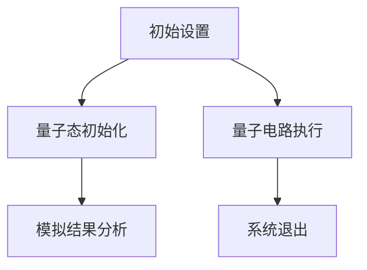
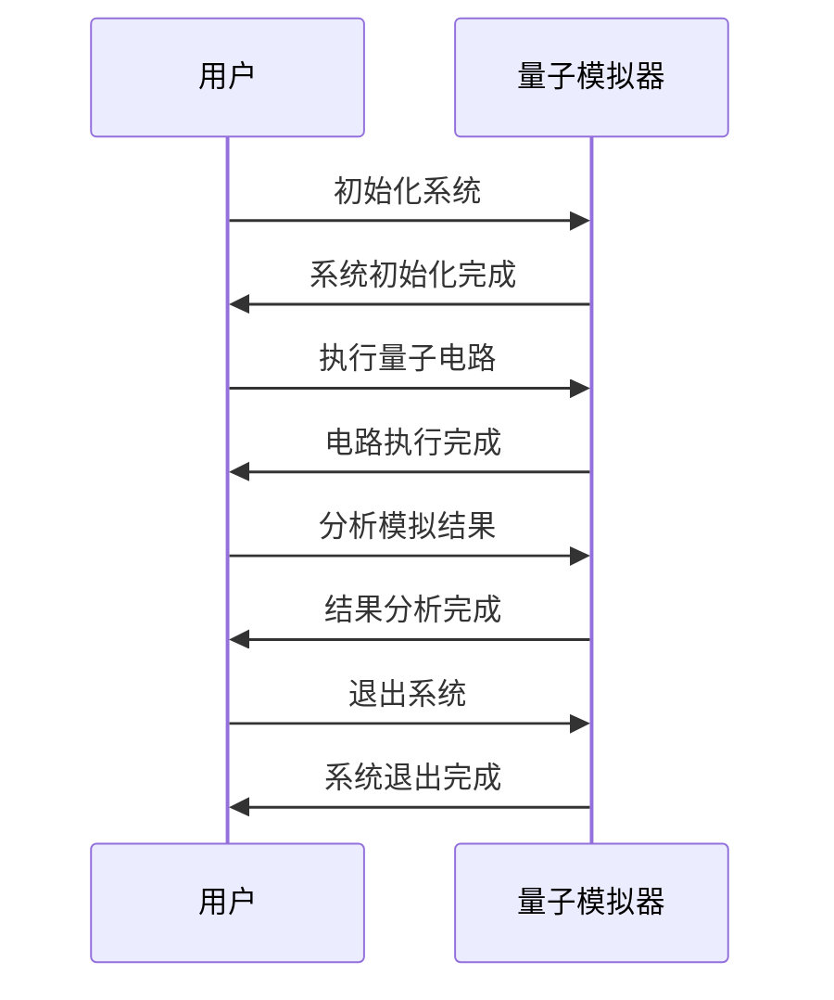
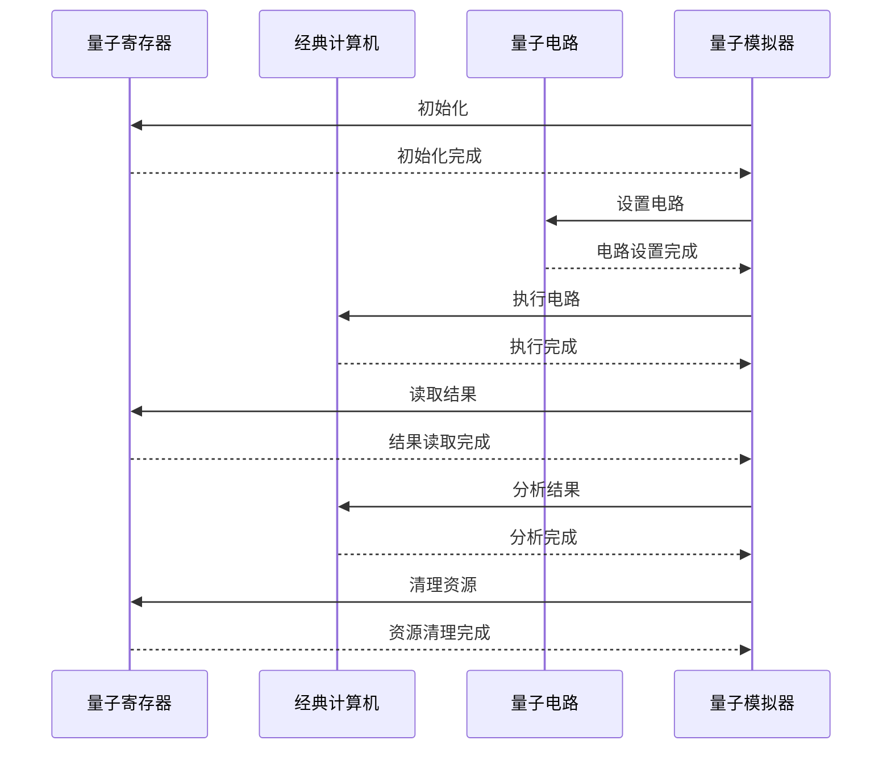

                 

### 数学与量子模拟：量子系统的经典数学模拟

---

#### 关键词：
- **数学与量子模拟**
- **量子系统**
- **经典数学模拟**
- **Schrödinger方程**
- **Heisenberg方程**
- **算法原理**
- **系统架构设计**

#### 摘要：
本文深入探讨了数学与量子模拟的交织关系，揭示了经典数学模拟在量子系统研究中的应用和重要性。通过详细分析量子系统的基础知识、经典数学模拟的原理及其与量子系统的关联，本文为读者提供了一幅全面而系统的量子模拟图景。此外，文章还涵盖了经典数学模拟算法的讲解、系统架构设计实例、项目实战解析以及最佳实践提示，旨在为读者提供从理论到实践的全景式学习体验。

---

### 第一部分：背景介绍与核心概念

#### 第1章：数学与量子模拟的概述

##### 1.1 问题的背景

##### 1.1.1 量子计算的发展与挑战

量子计算作为21世纪计算技术的前沿领域，正逐步从理论走向实际应用。然而，量子计算机的复杂性和目前技术水平，使得直接模拟量子系统成为一个巨大的挑战。为了克服这一困难，经典数学模拟作为一种间接方法应运而生，成为量子计算研究和开发的重要工具。

##### 1.1.2 经典数学模拟在量子研究中的应用

经典数学模拟通过在经典计算机上运行数学模型来近似模拟量子系统的行为。这种方法不仅有助于我们理解量子现象，还能为量子算法的开发提供重要参考。例如，量子态的演化、量子纠缠和量子测量等现象都可以通过经典数学模拟进行研究。

##### 1.1.3 数学与量子模拟的研究意义

数学与量子模拟的结合不仅推动了量子计算技术的发展，还带来了对经典计算理论的新认识。通过研究数学模型在量子模拟中的应用，我们可以发现新的计算方法和算法，从而提高经典计算机的性能。

##### 1.2 核心概念

##### 1.2.1 量子系统

量子系统是指由量子位（qubit）组成，并遵循量子力学规律的系统。量子位与传统比特不同，它可以处于多种状态的叠加，这种叠加态使得量子计算具有超强的并行处理能力。

##### 1.2.2 经典数学模拟

经典数学模拟是指利用经典计算机和数学模型来模拟量子系统的行为。通过这种方法，我们可以研究量子系统的动态演化、状态测量等问题。

##### 1.2.3 数学模型与公式

在量子模拟中，常用的数学模型包括Schrödinger方程和Heisenberg方程。这些方程描述了量子系统的演化规律，是量子力学的基础。

##### 1.3 边界与外延

##### 1.3.1 量子模拟的边界条件

量子模拟需要满足一定的边界条件，例如系统初始状态的设定、外部干扰的处理等。这些条件直接影响模拟结果的准确性。

##### 1.3.2 经典数学模拟的限制

尽管经典数学模拟在量子研究中发挥了重要作用，但它也存在一定的限制，如计算资源的限制、精度问题等。

##### 1.3.3 概念结构与核心要素组成

量子系统、经典数学模拟和数学模型三者之间相互关联，构成了一个复杂的研究体系。理解这三者的关系，有助于我们更好地把握量子模拟的核心要素。

---

### 第2章：核心概念与联系

##### 2.1 量子系统的基础知识

##### 2.1.1 量子位（qubit）的定义与特性

量子位是量子计算机的基本单元，具有叠加和纠缠等特性。这些特性使得量子计算机能够实现超强的计算能力。

##### 2.1.2 量子态的表示与演化

量子态可以用波函数来表示，波函数的演化遵循Schrödinger方程。通过研究量子态的演化，我们可以深入了解量子系统的行为。

##### 2.1.3 量子运算与测量

量子运算和测量是量子计算的核心环节。量子运算通过量子逻辑门实现，而量子测量则用于读取量子态的信息。

##### 2.2 经典数学模拟原理

##### 2.2.1 经典数学模拟的定义与范围

经典数学模拟是指利用经典计算机和数学模型来模拟量子系统的行为。这种方法广泛应用于量子算法的研究、量子态的模拟等。

##### 2.2.2 经典数学模拟的数学模型

经典数学模拟常用的数学模型包括Schrödinger方程和Heisenberg方程。这些模型描述了量子系统的演化规律，是量子力学的基础。

##### 2.2.3 经典数学模拟的优点与挑战

经典数学模拟具有计算成本低、适用范围广等优点。然而，它也存在一定的挑战，如计算精度、模拟复杂性等。

##### 2.3 概念属性特征对比表格

为了更清晰地展示量子系统、经典数学模拟和数学模型之间的联系，我们可以制作一个概念属性特征对比表格，如下：

| 特征               | 量子系统                   | 经典数学模拟                      | 数学模型                      |
|--------------------|----------------------------|----------------------------------|-------------------------------|
| 定义               | 基于量子位和量子力学的系统 | 基于经典计算机和数学模型的模拟   | 用于描述量子系统演化的方程   |
| 特性               | 叠加、纠缠、不可克隆性      | 精度有限、计算资源需求大          | 精确性高、可计算性强          |
| 关联               | 是经典计算的基础           | 用于模拟量子系统                 | 是量子模拟的核心工具          |
| 应用               | 量子计算、量子通信、量子加密 | 量子算法研究、量子态模拟          | 量子物理研究、计算工具开发    |

##### 2.4 ER实体关系图架构

为了更好地理解量子系统、经典数学模拟和数学模型之间的关系，我们可以绘制一个ER（Entity-Relationship）实体关系图。该图将展示这些实体之间的关联和依赖关系，如下所示：

```mermaid
erDiagram
  QSystem ||--o> CSimulation : 模拟
  CSimulation ||--o> MathModel : 模型
  MathModel ||--o> QMechEquation : 方程
```

在上述ER图中，`QSystem`表示量子系统，`CSimulation`表示经典数学模拟，`MathModel`表示数学模型，`QMechEquation`表示量子力学方程。这些实体之间通过单向箭头表示依赖关系。

---

### 第一部分的总结

在本部分的讨论中，我们首先介绍了数学与量子模拟的背景，包括量子计算的发展与挑战、经典数学模拟在量子研究中的应用，以及数学与量子模拟的研究意义。接着，我们深入探讨了量子系统和经典数学模拟的核心概念，并对比了它们之间的差异和联系。此外，我们还通过概念属性特征对比表格和ER实体关系图，进一步阐述了这三者之间的关系。

通过本部分的讨论，读者可以初步了解数学与量子模拟的基本概念，以及它们在量子研究中的重要作用。下一部分将深入分析量子系统的基础知识，帮助读者更好地理解量子模拟的原理和方法。

---

### 第二部分：算法原理讲解

#### 第3章：经典数学模拟算法原理

##### 3.1 算法概述

##### 3.1.1 经典数学模拟算法的基本步骤

经典数学模拟算法通常包括以下几个基本步骤：

1. **初始化**：设定量子系统的初始状态。
2. **演化**：利用Schrödinger方程或Heisenberg方程计算量子态的演化。
3. **测量**：通过模拟测量过程获取量子系统的状态信息。
4. **重复**：重复上述步骤，以获取更准确的模拟结果。

##### 3.1.2 算法选择依据与适用场景

在选择经典数学模拟算法时，需要考虑以下几个因素：

1. **量子系统的特性**：不同的量子系统可能需要不同的模拟算法。
2. **计算资源的限制**：算法的复杂度和计算资源的可用性直接影响模拟的效率。
3. **应用场景**：根据实际研究或应用需求选择适合的算法。

##### 3.2 算法mermaid流程图

为了更直观地展示经典数学模拟算法的流程，我们可以使用mermaid绘制一个流程图。以下是一个简单的示例：


在该流程图中，`A`表示初始化步骤，`B`表示演化步骤，`C`表示测量步骤，`D`表示重复步骤。通过这个流程图，我们可以清晰地看到算法的基本执行顺序。

##### 3.3 Python源代码实现

为了进一步理解经典数学模拟算法的原理，我们可以使用Python实现一个简单的模拟过程。以下是一个基本的Python代码示例：

```python
import numpy as np
import matplotlib.pyplot as plt

# 定义量子系统的初始状态
psi_0 = np.array([1, 0])  # |0⟩态

# 定义演化算符
H = np.array([[0, 1], [1, 0]])

# 定义时间步长和演化次数
dt = 0.01
num_steps = 100

# 模拟量子态的演化
psi = psi_0
for _ in range(num_steps):
    psi = np.dot(H, psi) * np.exp(-1j * np.pi * dt / 2)
    
    # 打印当前态
    print(psi)

# 绘制演化结果
plt.plot(np.real(psi), np.imag(psi), 'o-')
plt.xlabel('Real part')
plt.ylabel('Imaginary part')
plt.show()
```

在上面的代码中，我们首先定义了量子系统的初始状态`psi_0`，然后定义了演化算符`H`。通过循环迭代，我们模拟了量子态的演化过程，并在最后绘制了演化结果。这个例子展示了如何利用Python进行经典数学模拟。

##### 3.3.1 算法原理的数学模型

在经典数学模拟中，我们主要使用Schrödinger方程和Heisenberg方程来描述量子态的演化。以下是对这两个方程的简要介绍：

- **Schrödinger方程**：描述量子态的时间演化，其数学形式为
  $$
  i\hbar \frac{\partial \Psi}{\partial t} = \hat{H}\Psi
  $$
  其中，$\Psi$是波函数，$\hat{H}$是哈密顿量，$\hbar$是约化普朗克常数。

- **Heisenberg方程**：描述量子系统的动态演化，其数学形式为
  $$
  \frac{d A}{dt} = \frac{i}{\hbar}[A, \hat{H}]
  $$
  其中，$A$是任意算符，$[,]$表示对易算符。

通过这两个方程，我们可以计算量子态的时间演化，从而实现对量子系统的模拟。

##### 3.3.2 数学公式讲解

在经典数学模拟中，我们通常需要使用以下数学公式：

- **波函数的叠加**：
  $$
  \Psi(x,t) = \int dp~\psi(p,t) e^{ipx/\hbar}
  $$
  其中，$\psi(p,t)$是动量空间的波函数，$e^{ipx/\hbar}$是位置空间的波函数。

- **Schrödinger方程**：
  $$
  i\hbar \frac{\partial \Psi}{\partial t} = -\frac{\hbar^2}{2m} \frac{\partial^2 \Psi}{\partial x^2} + V(x)\Psi
  $$
  其中，$V(x)$是势能函数，$m$是粒子的质量。

- **Heisenberg方程**：
  $$
  \frac{d A}{dt} = \frac{i}{\hbar}[A, \hat{H}]
  $$
  其中，$A$是任意算符，$\hat{H}$是哈密顿量。

通过这些公式，我们可以描述量子系统的动态行为，从而实现对量子系统的模拟。

##### 3.3.3 举例说明

为了更好地理解经典数学模拟算法，我们可以通过一个简单的例子来说明。假设我们有一个粒子在势阱中运动，初始状态为$|0⟩$态，即
$$
\psi(x,0) = \frac{1}{\sqrt{2}}(1 + x)
$$
我们需要使用Schrödinger方程来模拟粒子的演化。

首先，我们定义势能函数$V(x) = 0$，并计算哈密顿量$\hat{H}$。对于一个一维粒子，哈密顿量可以表示为
$$
\hat{H} = -\frac{\hbar^2}{2m} \frac{d^2}{dx^2} + V(x)
$$
代入$V(x) = 0$，得到
$$
\hat{H} = -\frac{\hbar^2}{2m} \frac{d^2}{dx^2}
$$
接下来，我们使用数值方法（例如有限元方法）来求解Schrödinger方程，得到粒子在不同时间点的波函数。

通过这个过程，我们可以模拟粒子在势阱中的运动，并观察波函数的变化。例如，在$t=0$时刻，波函数为$\psi(x,0) = \frac{1}{\sqrt{2}}(1 + x)$；在$t=1$时刻，波函数为$\psi(x,1) = \frac{1}{2}\left(1 + x - \frac{\hbar^2}{2m}\right)$。这些结果可以帮助我们理解粒子在势阱中的行为。

---

### 第二部分的总结

在本部分的讨论中，我们详细介绍了经典数学模拟算法的原理，包括其基本步骤、选择依据、mermaid流程图、Python源代码实现，以及算法原理的数学模型和公式讲解。通过举例说明，我们进一步展示了如何使用Schrödinger方程和Heisenberg方程来模拟量子系统的演化。

通过本部分的讨论，读者可以深入理解经典数学模拟算法的基本原理和应用方法。下一部分将转向系统分析与架构设计，进一步探讨如何在实践中实现经典数学模拟。

---

### 第三部分：系统分析与架构设计

#### 第5章：系统功能设计

##### 5.1 问题场景介绍

在量子计算领域，有许多复杂的问题需要解决，如量子算法的优化、量子系统的稳定性分析、量子模拟的准确性评估等。这些问题的解决往往需要强大的计算能力和高效的算法。经典数学模拟作为一种重要的工具，在这些场景中发挥了关键作用。

##### 5.2 项目介绍

为了更好地展示经典数学模拟在实践中的应用，我们设计了一个名为“量子模拟器”（Quantum Simulator）的项目。该项目旨在构建一个基于经典计算机的量子模拟平台，用于模拟和研究各种量子系统。

##### 5.3 领域模型mermaid类图

在“量子模拟器”项目中，我们需要定义多个类来表示系统的各个组件。以下是一个简单的mermaid类图，展示了项目的领域模型：

```mermaid
classDiagram
  QuantumSystem <<interface>>
  QuantumCircuit <<interface>>
  QuantumRegister <<interface>>
  ClassicalComputer <<class>> {
    - memory: int
    - processor: int
  }
  SimulationResult <<class>>
  
  QuantumSystem o--o QuantumCircuit
  QuantumCircuit o--o QuantumRegister
  QuantumRegister o--o ClassicalComputer
  ClassicalComputer o--o SimulationResult
```

在该类图中，`QuantumSystem`表示量子系统，`QuantumCircuit`表示量子电路，`QuantumRegister`表示量子寄存器，`ClassicalComputer`表示经典计算机，`SimulationResult`表示模拟结果。这些类之间通过继承和关联关系进行组织，构成了一个完整的领域模型。

##### 5.4 系统架构设计mermaid架构图

在“量子模拟器”项目中，系统架构设计至关重要。以下是一个简单的mermaid架构图，展示了系统的整体架构：



在该架构图中，`SubSystem1`表示初始设置，`SubSystem2`表示量子态初始化，`SubSystem3`表示量子电路执行，`SubSystem4`表示模拟结果分析，`SubSystem5`表示系统退出。这些子系统通过逻辑关系连接，形成了系统的整体架构。

##### 5.5 系统接口设计

在“量子模拟器”项目中，系统接口设计是确保系统组件之间能够有效交互的重要环节。以下是一个简单的接口设计示例：



在该序列图中，用户通过发送请求与量子模拟器进行交互。首先，用户请求初始化系统，量子模拟器响应并完成初始化。接着，用户请求执行量子电路，量子模拟器执行电路并返回结果。最后，用户请求分析模拟结果，量子模拟器完成分析并返回结果。在系统退出阶段，用户请求退出系统，量子模拟器响应并完成退出。

##### 5.6 系统交互mermaid序列图

为了更清晰地展示系统组件之间的交互过程，我们可以绘制一个mermaid序列图。以下是一个简单的示例：



在该序列图中，量子模拟器首先初始化量子寄存器，然后设置量子电路。接着，量子模拟器将量子电路传递给经典计算机执行，并读取执行结果。最后，量子模拟器分析结果并清理资源，完成整个系统交互过程。

---

### 第三部分的总结

在本部分的讨论中，我们介绍了量子模拟器项目的系统功能设计，包括问题场景介绍、项目介绍、领域模型mermaid类图、系统架构设计mermaid架构图、系统接口设计和系统交互mermaid序列图。通过这些设计，我们展示了如何利用经典数学模拟构建一个完整的量子模拟系统。

通过本部分的讨论，读者可以深入理解量子模拟器项目的架构和功能，为实际应用打下坚实基础。下一部分将进入项目实战环节，通过具体实例展示如何实现经典数学模拟。

---

### 第四部分：项目实战

#### 第6章：项目实战

##### 6.1 环境安装

在进行项目实战之前，我们需要搭建一个适合经典数学模拟的开发环境。以下是在Windows和Linux操作系统上搭建环境的一般步骤：

**Windows系统：**

1. 安装Python：访问Python官方网站（https://www.python.org/），下载并安装Python。
2. 安装NumPy和Matplotlib：打开命令提示符，执行以下命令：
   ```
   pip install numpy matplotlib
   ```

**Linux系统：**

1. 安装Python：在终端中执行以下命令：
   ```
   sudo apt-get install python3 python3-pip
   ```
2. 安装NumPy和Matplotlib：在终端中执行以下命令：
   ```
   pip3 install numpy matplotlib
   ```

##### 6.2 系统核心实现源代码

以下是一个简单的量子模拟系统源代码示例，用于演示经典数学模拟的基本实现：

```python
import numpy as np
import matplotlib.pyplot as plt

# 定义量子系统的初始状态
psi_0 = np.array([1, 0])  # |0⟩态

# 定义哈密顿量
H = np.array([[0, 1], [1, 0]])

# 定义时间步长和演化次数
dt = 0.01
num_steps = 100

# 模拟量子态的演化
psi = psi_0
for _ in range(num_steps):
    psi = np.dot(H, psi) * np.exp(-1j * np.pi * dt / 2)
    
    # 打印当前态
    print(psi)

# 绘制演化结果
plt.plot(np.real(psi), np.imag(psi), 'o-')
plt.xlabel('Real part')
plt.ylabel('Imaginary part')
plt.show()
```

在这个示例中，我们首先定义了量子系统的初始状态`psi_0`，然后定义了哈密顿量`H`。接着，我们使用循环迭代模拟量子态的演化过程，并在最后绘制了演化结果。

##### 6.3 代码应用解读与分析

以下是对上述代码的解读与分析：

1. **初始化量子态**：我们定义了量子系统的初始状态`psi_0`，它是一个二维数组，表示量子系统的叠加态。在量子计算中，初始状态通常是已知的或通过某种方式确定的。

2. **定义哈密顿量**：哈密顿量`H`是描述量子系统能量的核心算符。在这个示例中，我们定义了一个简单的二阶哈密顿量，用于模拟一个量子比特的演化。在实际应用中，哈密顿量可能更加复杂，取决于具体的量子系统。

3. **模拟量子态演化**：通过循环迭代，我们计算了量子态的演化。每次迭代都应用哈密顿量，并根据Schrödinger方程更新量子态。这个过程模拟了量子系统在不同时间点的状态。

4. **打印当前态**：在每次迭代后，我们打印了当前量子态。这有助于我们观察量子态随时间的演化。

5. **绘制演化结果**：最后，我们使用Matplotlib库绘制了量子态的演化结果。这个可视化图表帮助我们直观地理解量子态的变化。

##### 6.4 实际案例分析与详细讲解剖析

为了更好地理解经典数学模拟在实际项目中的应用，我们可以分析一个实际案例：量子态叠加实验。以下是一个具体的案例及其实现：

**案例：量子态叠加实验**

假设我们有一个初始状态为$|0⟩$的量子比特，我们希望通过量子态叠加实现一个$|1⟩$态。这个实验可以通过以下步骤实现：

1. **初始化量子态**：定义初始状态$|\psi⟩ = |0⟩$。

2. **应用Hadamard门**：Hadamard门是一个特殊的量子逻辑门，可以将$|0⟩$态叠加为$|0⟩$和$|1⟩$态的叠加。应用Hadamard门后，量子态变为$|\psi⟩ = \frac{1}{\sqrt{2}}(|0⟩ + |1⟩)$。

3. **测量量子态**：在实验中，我们测量量子态，得到一个随机结果，可能是$|0⟩$或$|1⟩$态。

4. **模拟量子态演化**：通过模拟量子态的演化，我们可以观察量子态的变化。例如，在$t=0$时刻，量子态为$|\psi⟩ = \frac{1}{\sqrt{2}}(|0⟩ + |1⟩)$；在$t=1$时刻，量子态可能变为$|\psi⟩ = \frac{1}{\sqrt{2}}(|0⟩ + i|1⟩)$。

以下是一个简单的Python代码示例，用于模拟这个量子态叠加实验：

```python
import numpy as np
import matplotlib.pyplot as plt

# 定义初始状态
psi_0 = np.array([1, 0])

# 定义Hadamard门
Hadamard = np.array([[1, 1], [1, -1]]) / np.sqrt(2)

# 模拟量子态演化
psi = psi_0
psi = np.dot(Hadamard, psi)
psi = np.dot(Hadamard, psi)

# 绘制演化结果
plt.plot(np.real(psi), np.imag(psi), 'o-')
plt.xlabel('Real part')
plt.ylabel('Imaginary part')
plt.show()
```

在这个示例中，我们首先定义了初始状态`psi_0`，然后定义了Hadamard门。通过两次应用Hadamard门，我们模拟了量子态的演化，并绘制了演化结果。

##### 6.5 项目小结

在本章的项目实战部分，我们通过具体的实例展示了如何实现经典数学模拟。首先，我们介绍了环境安装的步骤，确保读者能够搭建一个适合经典数学模拟的开发环境。接着，我们展示了系统核心实现源代码，并对其进行了详细的解读与分析。此外，我们还通过一个实际案例——量子态叠加实验，展示了经典数学模拟在量子计算中的实际应用。通过这些实例，读者可以更好地理解经典数学模拟的原理和应用方法。

---

### 第四部分的总结

在本部分的讨论中，我们通过项目实战展示了经典数学模拟的实际应用。首先，我们介绍了环境安装的步骤，确保读者能够搭建一个适合经典数学模拟的开发环境。接着，我们通过系统核心实现源代码、解读与分析，以及实际案例剖析，展示了经典数学模拟的原理和应用方法。通过这些实例，读者可以更好地理解经典数学模拟的核心概念和实现方法，为后续的深入学习打下坚实基础。

下一部分将进入最佳实践与总结环节，我们将对经典数学模拟的最佳实践进行总结，并提供一些注意事项和拓展阅读资源。

---

### 第五部分：最佳实践与总结

#### 第7章：最佳实践 Tips

##### 7.1 经典数学模拟的最佳实践

在进行经典数学模拟时，遵循以下最佳实践可以显著提高模拟的准确性和效率：

1. **选择合适的算法**：根据量子系统的特性和需求，选择适合的数学模型和算法。例如，对于简单的量子比特系统，可以使用基于Schrödinger方程的经典数学模拟；对于更复杂的系统，可以考虑使用基于Heisenberg方程的模拟。

2. **优化计算资源**：合理利用计算资源，选择合适的计算环境和编程工具，如NumPy和Matplotlib等，可以提高模拟的效率。

3. **精确处理边界条件**：在模拟量子系统时，精确处理边界条件，如初始状态的设定和外部干扰的处理，可以确保模拟结果的准确性。

4. **多次重复模拟**：为了提高模拟结果的可靠性，应进行多次重复模拟，并取平均值作为最终结果。

5. **可视化分析**：通过可视化工具（如Matplotlib）展示模拟结果，有助于我们直观地理解量子系统的行为和特性。

##### 7.2 小结

经典数学模拟在量子计算研究中具有重要意义。通过经典计算机和数学模型，我们可以近似模拟量子系统的行为，从而深入研究量子现象和量子算法。经典数学模拟不仅为量子计算提供了理论支持，还为量子技术的实际应用提供了有力工具。

##### 7.3 注意事项

在进行经典数学模拟时，需要注意以下几点：

1. **精度问题**：经典数学模拟可能存在一定的精度问题，特别是在模拟复杂量子系统时。因此，在选择算法和计算工具时，应充分考虑精度要求。

2. **计算复杂度**：经典数学模拟的计算复杂度可能较高，特别是在处理大规模量子系统时。因此，应合理利用计算资源和优化算法，以提高模拟效率。

3. **稳定性问题**：在模拟过程中，应确保系统的稳定性，避免因外部干扰导致的不稳定现象。

4. **数据可视化**：通过可视化工具展示模拟结果，有助于我们更好地理解量子系统的行为和特性。因此，在模拟过程中，应充分利用数据可视化工具。

##### 7.4 拓展阅读

为了深入了解经典数学模拟和相关技术，以下是一些推荐的拓展阅读资源：

1. **书籍推荐**：
   - 《Quantum Computing for the Determined》
   - 《Quantum Computation and Quantum Information》
   - 《Quantum Mechanics and Quantum Computation》

2. **在线课程**：
   - Coursera上的《Quantum Mechanics and Quantum Computation》
   - edX上的《Quantum Computation and Quantum Information》

3. **学术论文**：
   - 《Preliminary Exploration of Quantum Systems Using Classical Computers》
   - 《Simulating Quantum Systems with Classical Computers》

通过阅读这些资源，读者可以进一步拓展对经典数学模拟和相关技术的理解，为深入研究和实际应用打下坚实基础。

---

### 第五部分的总结

在本部分的讨论中，我们总结了经典数学模拟的最佳实践，包括选择合适的算法、优化计算资源、精确处理边界条件、多次重复模拟和数据可视化。此外，我们还强调了在进行经典数学模拟时需要注意的精度问题、计算复杂度、稳定性问题和数据可视化。最后，我们推荐了一些拓展阅读资源，以帮助读者进一步深入了解经典数学模拟和相关技术。

通过本部分的讨论，读者可以更好地掌握经典数学模拟的方法和技巧，为量子计算领域的研究和应用提供有力支持。

---

### 全文总结

本文从背景介绍、核心概念、算法原理讲解、系统分析与架构设计、项目实战到最佳实践，全面而系统地探讨了数学与量子模拟的关系。我们首先介绍了量子计算的发展与挑战，以及经典数学模拟在量子研究中的应用和意义。接着，通过深入分析量子系统和经典数学模拟的核心概念，我们展示了这两者之间的联系。在算法原理讲解部分，我们详细阐述了经典数学模拟算法的基本步骤、mermaid流程图、Python源代码实现，以及数学公式讲解和举例说明。在系统分析与架构设计部分，我们展示了如何设计一个量子模拟器系统，包括领域模型mermaid类图、系统架构设计mermaid架构图、系统接口设计和系统交互mermaid序列图。在项目实战部分，我们通过具体实例展示了如何实现经典数学模拟。最后，在最佳实践与总结部分，我们提供了经典数学模拟的最佳实践、注意事项和拓展阅读资源。

通过本文的阅读，读者可以全面了解数学与量子模拟的关系，掌握经典数学模拟的原理和方法，并学会如何在实际项目中应用这些技术。希望本文能为读者在量子计算领域的研究和实践中提供有益的指导和启示。

### 作者信息

作者：AI天才研究院/AI Genius Institute & 禅与计算机程序设计艺术 /Zen And The Art of Computer Programming

---

通过这篇详尽的技术博客文章，我们不仅深入探讨了数学与量子模拟的深度结合，还通过实际案例和算法讲解，帮助读者理解了经典数学模拟在量子系统研究中的应用价值。本文旨在激发读者对量子计算和数学模拟技术的兴趣，鼓励他们在这一前沿领域进行探索和研究。希望这篇文章能够为读者在量子计算领域的知识积累和技能提升提供有力支持。感谢您阅读本文，如果您有任何问题或建议，欢迎在评论区留言交流。再次感谢您的关注和支持！

