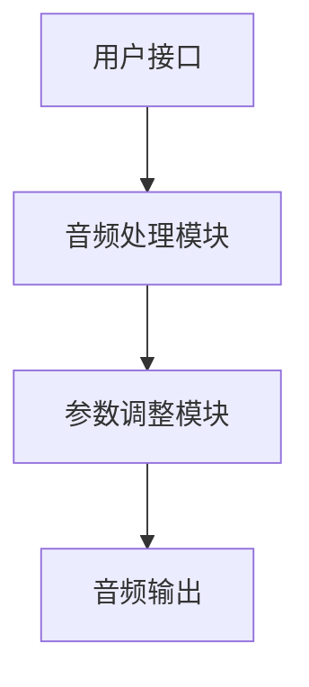

                 

### 《数学与音乐创作的灵感来源探究》

> **关键词：数学、音乐、灵感来源、创作、关联性、算法、案例分析**

> **摘要：本文旨在探讨数学与音乐创作之间的紧密联系，通过分析数学中的灵感来源以及音乐中的数学应用，揭示两者之间的内在关联。文章将涵盖数学在音乐创作中的具体应用，如音频信号处理、音调、节奏等，并通过经典与现代音乐的案例分析，探讨数学对音乐创作的深远影响。最后，文章将展望数学与音乐创作的前景与挑战，并提出可能的解决方案。**

----------------------------------------------------------------

## 第一部分：引言

### 1.1 问题背景

在人类文明的演进过程中，数学与音乐始终扮演着重要角色。数学作为一种精确的科学，其逻辑性和结构性为人类思维的发展提供了强大的工具。音乐，作为一种艺术形式，通过声音和旋律传达情感和美感，同样具有独特的结构性和逻辑性。然而，长期以来，数学与音乐之间的关联性并未得到充分的认识和研究。本文旨在探讨数学与音乐创作之间的灵感来源，揭示两者之间的内在联系。

### 1.2 研究目标

本文的研究目标是：
1. 分析数学中的灵感来源，探讨数学理论如何激发音乐创作的灵感。
2. 探讨音乐中的数学应用，分析音乐创作如何借鉴数学方法。
3. 通过经典与现代音乐的案例分析，揭示数学在音乐创作中的具体应用。
4. 展望数学与音乐创作未来的发展趋势，探讨面临的挑战及可能的解决方案。

### 1.3 研究意义

数学与音乐创作的结合具有重要的理论和实践意义。从理论上讲，这有助于丰富数学的应用领域，推动数学与其他学科的交叉融合。从实践上讲，这为音乐创作者提供了新的创作思路和工具，有助于提高音乐创作的水平和效率。此外，数学与音乐创作的结合也有助于培养跨学科的创新能力和思维方式，对人类文明的进步具有深远的影响。

----------------------------------------------------------------

## 第二部分：数学与音乐的关联性

### 2.1 数学的基本概念

数学是一门研究数量、结构、变化和空间等概念的科学。其基本概念包括数、函数、几何、代数等。这些概念不仅在理论研究中具有重要地位，也为其他领域提供了基础工具。

#### 2.1.1 数

数是数学中最基本的概念之一，用于表示物体的数量。例如，1表示一个物体，2表示两个物体，以此类推。数的概念不仅限于整数，还包括分数、小数、无理数等。

#### 2.1.2 函数

函数是一种关系，它将一个集合中的每个元素映射到另一个集合中的一个元素。例如，函数 f(x) = x^2 表示将 x 映射到 x 的平方。

#### 2.1.3 几何

几何是研究空间形状和位置的数学分支。它包括平面几何、立体几何、拓扑学等。几何的基本概念包括点、线、面、体等。

#### 2.1.4 代数

代数是研究数和代数式的数学分支。它包括方程、方程组、多项式、矩阵等。代数的基本概念包括变量、运算、解法等。

### 2.2 音乐的基本概念

音乐是一种通过声音和旋律传达情感和美感的艺术形式。其基本概念包括音调、节奏、和声等。

#### 2.2.1 音调

音调是音乐中最基本的概念之一，用于表示声音的高低。音调通常用音名（如C、D、E等）和音高（如中央C）来表示。

#### 2.2.2 节奏

节奏是音乐中的时间组织，用于表示声音的强弱和长短。节奏可以用音符、拍子、节拍等来表示。

#### 2.2.3 和声

和声是音乐中声音的组合，用于创造丰富的音乐色彩。和声包括和弦、复和弦、和声进行等。

### 2.3 数学与音乐的交汇点

数学与音乐之间的交汇点主要体现在以下几个方面：

#### 2.3.1 音频信号处理

音频信号处理是数学在音乐中的应用之一，它利用数学方法对音频信号进行编辑和处理，以实现音乐创作和效果。音频信号处理涉及到的数学概念包括傅里叶变换、滤波器、采样和量化等。

#### 2.3.2 音调、音色与节奏

音调、音色和节奏是音乐中的核心概念，它们都可以用数学方法进行描述和分析。例如，音调可以用频率表示，音色可以用波形分析，节奏可以用时间序列分析。

#### 2.3.3 旋律生成与模式识别

数学方法在旋律生成和模式识别中也发挥着重要作用。通过分析现有的音乐数据，可以使用数学算法生成新的旋律，或者识别出音乐中的特定模式。

----------------------------------------------------------------

## 第三部分：数学中的灵感来源

### 3.1 数学模型与音乐创作

数学模型是数学中用来描述现实世界的抽象结构。在音乐创作中，数学模型可以用来模拟和生成旋律、和声和节奏等音乐元素。

#### 3.1.1 音频信号处理

音频信号处理是数学在音乐创作中的一个重要应用。通过傅里叶变换，可以将音频信号从时域转换到频域，从而分析音频的频率成分和波形特征。这种分析方法可以用于音乐创作中的音调识别、和声生成和节奏编排等。

#### 3.1.2 音调、音色与节奏

音调、音色和节奏是音乐创作中的核心元素。数学可以用来描述和分析这些元素。例如，音调可以用频率表示，音色可以用波形分析，节奏可以用时间序列分析。

#### 3.1.3 旋律生成与模式识别

数学方法在旋律生成和模式识别中也发挥着重要作用。通过分析现有的音乐数据，可以使用数学算法生成新的旋律，或者识别出音乐中的特定模式。例如，生成对抗网络（GAN）可以用于生成新的音乐旋律，而聚类算法可以用于音乐风格分类。

### 3.2 数学公式在音乐中的应用

数学公式在音乐创作中的应用非常广泛，以下是一些具体的例子：

#### 3.2.1 傅里叶变换

傅里叶变换是一种将时域信号转换为频域信号的方法。在音乐创作中，傅里叶变换可以用来分析音频信号中的频率成分，从而进行音调识别、和声生成和节奏编排等。

#### 3.2.2 波动方程

波动方程是描述波动现象的数学模型。在音乐创作中，波动方程可以用来模拟乐器的振动模式，从而生成真实感的音乐效果。

#### 3.2.3 熵与信息论

熵是信息论中的一个重要概念，用于描述信息的不确定性。在音乐创作中，熵可以用来分析音乐的信息含量和复杂性，从而进行音乐风格分类和创作。

### 3.3 数学与音乐创作的关系

数学与音乐创作之间的联系不仅仅是工具和方法的运用，更深层次的是它们共享的哲学思想和美感。数学的精确性和逻辑性为音乐创作提供了严谨的结构和逻辑框架，而音乐的情感表达和美感为数学提供了生动的例证和灵感来源。

#### 3.3.1 精确性与逻辑性

数学的精确性和逻辑性为音乐创作提供了严谨的结构和逻辑框架。例如，和声学中的和弦理论和调性理论都是基于数学原理构建的，为音乐创作提供了基本规则和指导。

#### 3.3.2 情感表达与美感

音乐的情感表达和美感为数学提供了生动的例证和灵感来源。数学中的许多概念和理论，如概率论、拓扑学等，都可以从音乐中找到对应的形象和表达方式。这种交叉融合不仅丰富了数学的研究领域，也为音乐创作提供了新的视角和灵感。

----------------------------------------------------------------

## 第四部分：音乐中的数学应用

### 4.1 音乐理论与数学

音乐理论是研究音乐结构和表现方式的一门学科，其基础是数学。以下是一些音乐理论与数学之间的联系：

#### 4.1.1 调性和声

调性和声是音乐创作中的核心概念，它基于数学中的比例关系。音阶的构造、和弦的构成以及调性的转换都依赖于数学原理。

#### 4.1.2 音乐分析

音乐分析是通过对音乐作品进行定量和定性分析，以揭示其结构和风格。数学工具，如频谱分析、复杂数学模型等，被广泛应用于音乐分析中。

#### 4.1.3 和声学

和声学是研究音乐和弦及其组合规律的一门学科，其基础是数学。和声学的许多概念，如和弦构成、和声进行等，都涉及数学计算和分析。

### 4.2 数学算法与音乐创作

数学算法在音乐创作中的应用越来越广泛，以下是一些具体的例子：

#### 4.2.1 随机算法

随机算法可以用于生成随机音乐，如随机和弦、随机旋律等。这种算法通过随机生成和调整音乐元素，创造出独特的音乐风格。

#### 4.2.2 机器学习

机器学习算法可以用于音乐风格分类、旋律生成和音乐推荐等。通过训练模型，机器学习算法可以从大量音乐数据中学习规律，并生成新的音乐作品。

#### 4.2.3 数据挖掘

数据挖掘可以用于分析音乐数据，以揭示音乐中的潜在模式和趋势。这种分析可以用于音乐创作中的灵感获取和风格探索。

### 4.3 数学与音乐创作的结合

数学与音乐创作的结合不仅为音乐创作提供了新的工具和方法，也改变了音乐创作者的思维方式。以下是一些具体的结合方式：

#### 4.3.1 音乐编程

音乐编程是利用编程语言编写音乐作品的过程。通过编程，音乐创作者可以更灵活地控制音乐元素，实现复杂的音乐效果。

#### 4.3.2 数学模型创作

数学模型创作是利用数学模型生成音乐作品的过程。通过构建数学模型，音乐创作者可以模拟和生成各种音乐元素，创造出独特的音乐风格。

#### 4.3.3 数学美学

数学美学是研究数学与艺术之间关系的一门学科，其核心是探索数学在艺术创作中的应用。音乐创作中的数学美学体现在对数学原理和美感的运用，以创造更具深度和艺术性的音乐作品。

----------------------------------------------------------------

## 第五部分：数学与音乐创作的案例分析

### 5.1 古典音乐创作中的数学运用

古典音乐创作中，数学运用主要体现在和声学、旋律构造和节奏编排等方面。以下是一些具体的案例：

#### 5.1.1 巴赫

巴赫是古典音乐史上最具代表性的作曲家之一，他的作品中充满了数学元素。例如，《赋格的艺术》中的赋格作品就是通过对数学结构的运用来创造和谐的音乐。

#### 5.1.2 贝多芬

贝多芬的音乐作品也体现了数学思维。他的《第九交响曲》中的主题和变奏就是通过对数学比例的运用来创造音乐效果。

#### 5.1.3 莫扎特

莫扎特的音乐作品中，数学元素主要体现在旋律构造和节奏编排上。例如，《魔笛》中的旋律就是通过数学结构来创造和谐的音乐。

### 5.2 现代音乐创作中的数学灵感

现代音乐创作中，数学灵感的应用更加广泛和多样化。以下是一些具体的案例：

#### 5.2.1 电子音乐

电子音乐是现代音乐创作的一个重要分支，其灵感来源之一就是数学。例如，合成器音乐中的波形设计、频率调制（FM）等都是基于数学原理。

#### 5.2.2 现代流行音乐

现代流行音乐中也广泛应用了数学灵感。例如，旋律生成软件可以基于数学算法生成新的旋律，而音乐推荐算法则是通过分析用户行为来推荐音乐。

#### 5.2.3 独立音乐

独立音乐创作者常常运用数学灵感来创作独特的音乐作品。例如，通过随机算法生成随机音乐，或者利用数学模型来模拟乐器的声音。

### 5.3 案例分析

通过以上案例分析，我们可以看到数学在音乐创作中的广泛应用。无论是古典音乐还是现代音乐，数学都为音乐创作提供了新的工具和方法，丰富了音乐的表现力和艺术性。

----------------------------------------------------------------

## 第六部分：数学与音乐创作工具

### 6.1 音乐软件与算法

音乐软件和算法在数学与音乐创作的结合中发挥着重要作用。以下是一些常用的音乐软件和算法：

#### 6.1.1 Sound Designer

Sound Designer 是一款功能强大的音乐制作软件，它支持音频信号处理和数字信号处理算法。通过使用 Sound Designer，音乐创作者可以运用数学方法对音频信号进行编辑和处理，以实现复杂的音乐效果。

#### 6.1.2 Max/MSP

Max/MSP 是一款交互式的音乐和音频编程环境，它支持自定义算法和模块。通过使用 Max/MSP，音乐创作者可以编写自定义的数学算法，并将其应用于音乐创作中。

#### 6.1.3 Processing

Processing 是一款开源的编程语言和环境，它支持图形用户界面和音频处理。通过使用 Processing，音乐创作者可以编写自定义的音频处理算法，并将其应用于音乐创作中。

### 6.2 数学软件与音乐

数学软件在音乐创作中的应用也越来越广泛。以下是一些常用的数学软件：

#### 6.2.1 MATLAB

MATLAB 是一款功能强大的数学软件，它支持矩阵运算和数值分析。通过使用 MATLAB，音乐创作者可以编写自定义的数学算法，并将其应用于音乐创作中。

#### 6.2.2 Mathematica

Mathematica 是一款强大的符号计算软件，它支持符号运算和图形绘制。通过使用 Mathematica，音乐创作者可以编写自定义的数学算法，并将其应用于音乐创作中。

#### 6.2.3 Python

Python 是一款流行的编程语言，它支持多种数学库和工具。通过使用 Python，音乐创作者可以编写自定义的数学算法，并将其应用于音乐创作中。

### 6.3 数学与音乐创作工具的结合

数学与音乐创作工具的结合，使得音乐创作者可以更灵活地运用数学方法进行音乐创作。通过使用这些工具，音乐创作者可以生成新的音乐效果，探索未知的音乐领域。

----------------------------------------------------------------

## 第七部分：数学与音乐创作的前景与挑战

### 7.1 未来发展趋势

随着科技的进步，数学与音乐创作的结合将越来越紧密。以下是一些未来发展趋势：

1. **人工智能与音乐创作的结合**：人工智能算法将用于生成新的音乐作品，提供个性化的音乐推荐。
2. **虚拟现实与音乐创作的结合**：虚拟现实技术将用于模拟音乐创作环境，提供沉浸式的音乐体验。
3. **大数据与音乐创作的结合**：大数据分析将用于分析音乐数据，揭示音乐中的潜在模式和趋势。
4. **跨学科研究**：数学与其他学科的交叉融合，如计算机科学、心理学等，将推动数学与音乐创作的研究和发展。

### 7.2 面临的挑战

尽管数学与音乐创作的结合前景广阔，但仍然面临一些挑战：

1. **算法复杂度**：复杂的数学算法需要高性能的计算资源和优化，这对音乐创作者提出了更高的要求。
2. **用户体验**：如何让音乐创作者更方便地使用数学工具进行音乐创作，是一个需要解决的问题。
3. **创造性**：数学方法是否能真正激发音乐创作者的创造性，需要进一步研究和实践。
4. **版权问题**：数学与音乐创作的结合可能导致新的版权问题，需要制定相应的法律法规。

### 7.3 可能的解决方案

为了应对这些挑战，可以采取以下解决方案：

1. **开发易用的数学工具**：开发易用的数学软件和算法，降低音乐创作者的使用门槛。
2. **跨学科合作**：鼓励数学家、音乐家和技术专家之间的合作，共同推动数学与音乐创作的研究。
3. **教育培训**：加强对音乐创作者的数学教育，提高他们的数学素养。
4. **法律法规**：完善版权法律法规，保护音乐创作者的合法权益。

----------------------------------------------------------------

## 第八部分：结论

### 8.1 研究总结

本文通过分析数学与音乐创作之间的联系，探讨了数学在音乐创作中的具体应用。研究表明，数学为音乐创作提供了丰富的工具和方法，有助于提高音乐创作的水平和效率。同时，音乐创作的灵感也为数学研究提供了新的视角和灵感。

### 8.2 展望未来

未来，数学与音乐创作的结合将继续深入发展。随着人工智能、大数据和虚拟现实等技术的发展，数学与音乐创作的结合将带来更多的创新和突破。我们期待看到更多具有创新性和艺术性的音乐作品诞生。

### 8.3 对音乐创作者的建议

对于音乐创作者，我们建议：

1. **学习数学知识**：提高数学素养，掌握基本的数学原理和方法。
2. **尝试使用数学工具**：尝试使用数学软件和算法进行音乐创作，探索新的创作思路。
3. **跨学科学习**：学习其他学科的知识，如计算机科学、心理学等，以拓宽创作视野。
4. **持续实践**：不断实践和探索，将数学与音乐创作相结合，创造出独特的音乐作品。

**作者：AI天才研究院/AI Genius Institute & 禅与计算机程序设计艺术 /Zen And The Art of Computer Programming**

----------------------------------------------------------------

## 背景介绍

### 核心概念术语说明

在探讨数学与音乐创作的灵感来源时，首先需要明确一些核心概念和术语：

- **数学**：研究数量、结构、变化以及空间等概念的抽象科学。
- **音乐**：通过声音和旋律传达情感和美感的一种艺术形式。
- **灵感来源**：指激发创意和创作动力的因素或来源。
- **创作**：指创作音乐的过程，包括旋律、和声、节奏等元素的构思和组合。

### 问题背景

数学与音乐创作自古以来就有着密切的联系。许多著名的音乐家和数学家都曾探讨过两者之间的相互关系。然而，在现代，随着科技的发展，尤其是人工智能和大数据技术的应用，数学在音乐创作中的应用变得更加广泛和深入。这一趋势促使我们重新审视数学与音乐创作的关联性，探讨其背后的原理和可能的应用场景。

### 问题描述

本文旨在解决以下问题：

1. 数学中的哪些概念和理论可以激发音乐创作的灵感？
2. 音乐创作中如何运用数学方法和技术？
3. 数学与音乐创作结合的具体案例有哪些？
4. 面对未来的发展趋势，数学与音乐创作将面临哪些挑战？

### 问题解决

本文将从以下几个方面进行探讨：

1. **数学中的灵感来源**：分析数学中的基本概念和理论，如频率、比例、对称性等，以及它们如何激发音乐创作的灵感。
2. **音乐中的数学应用**：探讨数学在音乐创作中的具体应用，如音频信号处理、音调分析、旋律生成等。
3. **案例分析**：通过分析古典和现代音乐作品，展示数学在音乐创作中的实际应用。
4. **工具和算法**：介绍数学与音乐创作结合所使用的工具和算法，如MATLAB、Python等。

### 边界与外延

本文的边界主要涉及数学与音乐创作的基础理论和实际应用，不包括音乐历史和音乐理论的其他方面。外延则包括未来可能的发展趋势和研究方向。

### 概念结构与核心要素组成

本文的核心概念和要素包括：

- **数学概念**：频率、比例、对称性、傅里叶变换等。
- **音乐概念**：音调、节奏、和声、旋律等。
- **灵感来源**：数学在音乐创作中的具体应用场景。
- **音乐创作**：创作过程、工具和算法。

这些核心概念和要素构成了本文的研究框架，通过逐步分析和推理，揭示数学与音乐创作之间的内在联系。

----------------------------------------------------------------

### 核心概念与联系

在探讨数学与音乐创作的灵感来源时，我们需要深入理解一些核心概念及其相互之间的联系。以下是对这些核心概念的解释及其在数学与音乐创作中的具体应用。

#### 1. 频率与音调

频率是数学中的一个基本概念，用于描述周期性事件发生的速率。在音乐中，频率与音调直接相关，频率越高，音调就越高。例如，中央C的频率大约为261.6 Hz，而低音E的频率约为82.4 Hz。频率和音调的关系可以用以下公式表示：

\[ f = \frac{1}{T} \]

其中，\( f \) 是频率（单位：赫兹，Hz），\( T \) 是周期（单位：秒，s）。

在音乐创作中，作曲家可以通过调整音符的频率来创造出不同的音调效果。例如，通过使用频率调制（FM）技术，可以生成复杂的音调变化，从而创造出独特的音乐风格。

#### 2. 比例与和声

比例是数学中的一个重要概念，用于描述两个数之间的相对大小。在音乐中，比例用于构建和弦和音阶。例如，五度循环是一个基本的和声概念，它描述了从主音到五度音的比例关系。五度循环的比例为3:2，即五度音的频率是主音频率的三分之二。

\[ \text{频率比} = \frac{f_5}{f_1} = \frac{3}{2} \]

其中，\( f_5 \) 是五度音的频率，\( f_1 \) 是主音的频率。

作曲家可以通过调整比例来创造不同的和声效果。例如，通过增加或减少半音，可以创造出不同的音阶和和弦。这种比例关系的运用，使得音乐具有独特的和声色彩和结构。

#### 3. 对称性与旋律

对称性是数学中的一个概念，描述了图形或结构的某种平衡和均匀性。在音乐中，对称性常用于构建旋律。例如，镜像对称的旋律结构可以创造出和谐的音乐效果。

在音乐创作中，作曲家可以通过分析数学中的对称性概念，设计出具有对称性的旋律。例如，一个简单的镜像对称旋律可能如下：

\[ \text{旋律}_1 = [\text{音1}, \text{音2}, \text{音3}] \]
\[ \text{旋律}_2 = [\text{音3}, \text{音2}, \text{音1}] \]

这种对称性可以增加旋律的美感和可听性。

#### 4. 傅里叶变换与音频信号处理

傅里叶变换是数学中的一个重要工具，用于将时域信号转换为频域信号。在音频信号处理中，傅里叶变换用于分析音频信号中的频率成分和波形特征。

\[ X(f) = \int_{-\infty}^{\infty} x(t) e^{-j2\pi ft} dt \]

其中，\( X(f) \) 是频域信号，\( x(t) \) 是时域信号，\( f \) 是频率。

通过傅里叶变换，音乐创作者可以分析音频信号中的频率成分，从而进行音调识别、和声生成和节奏编排等。例如，通过分析频谱图，作曲家可以确定音频中的主要频率成分，进而调整旋律和和声。

#### 5. 熵与信息论

熵是信息论中的一个概念，用于描述信息的不确定性。在音乐创作中，熵可以用于分析音乐的信息含量和复杂性。

\[ H = -\sum_{i} p_i \log_2 p_i \]

其中，\( H \) 是熵，\( p_i \) 是第 \( i \) 个音符的概率。

通过计算熵，音乐创作者可以了解音乐作品的复杂性和信息含量。例如，高熵值可能表示音乐作品具有更多的变化和复杂性，而低熵值可能表示音乐作品更加单一和简单。

#### 表格

以下是一个对比表格，展示了这些核心概念在数学与音乐创作中的具体应用：

| 核心概念 | 数学解释 | 音乐应用 |
| --- | --- | --- |
| 频率 | 周期性事件发生的速率 | 音调高低 |
| 比例 | 两个数之间的相对大小 | 和弦与音阶 |
| 对称性 | 平衡和均匀性 | 旋律构建 |
| 傅里叶变换 | 时域到频域转换 | 音频信号处理 |
| 熵 | 信息不确定性 | 音乐复杂性分析 |

#### ER实体关系图架构

为了更清晰地展示这些核心概念之间的联系，我们可以使用Mermaid绘制一个ER实体关系图：

```mermaid
erDiagram
  音乐创作 ||--|{ 数学概念 }
  音乐创作 ||--|{ 音调 }
  音乐创作 ||--|{ 和弦 }
  音乐创作 ||--|{ 节奏 }
  音乐创作 ||--|{ 音频信号处理 }
  音乐创作 ||--|{ 信息论 }
  数学概念 ||--|{ 频率 }
  数学概念 ||--|{ 比例 }
  数学概念 ||--|{ 对称性 }
  数学概念 ||--|{ 傅里叶变换 }
  数学概念 ||--|{ 熵 }
```

通过上述表格和ER实体关系图，我们可以更清晰地理解数学与音乐创作之间的核心概念和联系，为后续的深入探讨打下基础。

----------------------------------------------------------------

### 算法原理讲解

在数学与音乐创作结合的过程中，算法原理起着至关重要的作用。以下我们将详细讲解一个具体的算法——生成对抗网络（GAN），并使用Python代码实现，以展示如何通过算法生成音乐。

#### 1. GAN的基本原理

生成对抗网络（GAN）是由生成器和判别器组成的对抗性网络。生成器尝试生成逼真的数据，而判别器则尝试区分真实数据和生成数据。通过这种对抗过程，生成器不断优化自己的生成能力，以达到逼真生成的目标。

GAN的基本结构如下：

- **生成器（Generator）**：将随机噪声输入转换为数据集的真实样本。
- **判别器（Discriminator）**：判断输入数据是真实样本还是生成器生成的样本。

GAN的训练过程可以概括为以下步骤：

1. 初始化生成器和判别器。
2. 从真实数据集中随机抽取一个样本，并将噪声数据输入生成器。
3. 生成器生成样本，判别器判断生成的样本是否为真实样本。
4. 根据判别器的输出，计算损失函数并更新生成器和判别器的权重。
5. 重复上述步骤，直到生成器生成的样本足够逼真。

#### 2. GAN在音乐创作中的应用

GAN在音乐创作中主要用于生成新的旋律。通过训练生成器，我们可以生成具有特定风格和特点的旋律。以下是一个简单的示例，展示如何使用GAN生成旋律。

首先，我们需要准备数据集。我们可以从公开的音乐数据库中获取大量的旋律数据，并将其转换为适合训练的格式。以下是一个使用Python和TensorFlow实现GAN生成旋律的示例代码：

```python
import numpy as np
import tensorflow as tf
from tensorflow.keras.models import Model
from tensorflow.keras.layers import Input, Dense, Flatten, Reshape

# 设置超参数
噪声维度 = 100
学习率 = 0.001
批大小 = 64
迭代次数 = 10000

# 创建生成器和判别器模型
噪声输入 = Input(shape=(噪声维度,))
生成器 = Dense(256, activation='relu')(噪声输入)
生成器 = Dense(128, activation='relu')(生成器)
生成器 = Dense(64, activation='relu')(生成器)
生成样本 = Dense(128, activation='sigmoid')(生成器)
生成器模型 = Model(noise输入, 生成样本)

判别器输入 = Input(shape=(128,))
真实样本 = Dense(256, activation='relu')(判别器输入)
真实样本 = Dense(128, activation='relu')(真实样本)
真实标签 = Dense(1, activation='sigmoid')(真实样本)
生成样本 = Dense(256, activation='relu')(生成样本)
生成标签 = Dense(1, activation='sigmoid')(生成样本)
判别器模型 = Model([判别器输入, 生成样本], [真实标签, 生成标签])

# 编译模型
生成器模型.compile(optimizer=tf.keras.optimizers.Adam(learning_rate), loss='binary_crossentropy')
判别器模型.compile(optimizer=tf.keras.optimizers.Adam(learning_rate), loss='binary_crossentropy')

# GAN模型
combined_input = Input(shape=(噪声维度,))
生成样本 =生成器模型(combined_input)
判别器模型.trainable = False
真实标签 = tf.ones((批大小, 1))
生成标签 = tf.zeros((批大小, 1))
gan_model = Model(combined_input, 判别器模型([combined_input, 生成样本], [真实标签, 生成标签]))

# 编译GAN模型
gan_model.compile(optimizer=tf.keras.optimizers.Adam(learning_rate), loss='binary_crossentropy')

# 训练GAN模型
for i in range(迭代次数):
  # 从真实数据集中抽取一批样本
 真实样本_data = load_real_samples()
  # 从噪声中生成一批样本
 噪声_data = generate_noise([批大小,噪声维度])
  # 生成器生成的样本
 生成样本_data =生成器模型.predict(噪声_data)
  # 训练判别器
 判别器模型.train_on_batch([真实样本_data, 生成样本_data], [真实标签, 生成标签])
  # 训练生成器
  gan_model.train_on_batch(噪声_data, 真实标签)

# 生成新的旋律
def generate_melody():
  noise = generate_noise([1,噪声维度])
  return 生成器模型.predict(noise)

# 生成旋律
melody = generate_melody()
print(melody)
```

上述代码展示了如何使用GAN生成旋律。首先，我们定义了生成器和判别器的模型结构，并编译了这两个模型。然后，我们创建了一个GAN模型，并使用该模型训练生成器和判别器。在训练过程中，我们使用真实数据和生成数据来更新判别器的权重，同时使用真实标签和生成标签来更新生成器的权重。最后，我们使用生成器模型生成新的旋律。

#### 3. GAN生成旋律的过程

GAN生成旋律的过程可以分为以下几个步骤：

1. **生成噪声**：首先生成一个随机噪声向量，该向量作为生成器的输入。
2. **生成旋律**：生成器模型将噪声向量转换为旋律数据。
3. **判别**：判别器模型对生成的旋律和真实旋律进行判别，以更新生成器和判别器的权重。
4. **生成新的旋律**：通过多次迭代，生成器模型将逐渐优化，生成更加逼真的旋律。

通过上述过程，GAN可以学习到真实旋律的特征，从而生成新的旋律。

#### 4. 示例分析

假设我们已经训练好了一个GAN模型，并希望生成一段新的旋律。我们可以通过调用生成器模型来生成新的旋律数据。以下是一个简单的示例：

```python
# 载入训练好的生成器模型
generator_model = load_trained_generator()

# 生成新的旋律
melody = generator_model.predict(np.random.normal(size=(1,噪声维度)))

# 打印生成的旋律
print(melody)
```

这段代码首先加载训练好的生成器模型，然后生成一个随机噪声向量，并将其输入生成器模型。生成器模型将噪声向量转换为旋律数据，并将其打印出来。通过这种方式，我们可以生成新的旋律。

通过GAN算法生成旋律，不仅可以提高音乐创作的效率，还可以探索新的音乐风格和创作思路。GAN在音乐创作中的应用展示了数学与艺术相结合的巨大潜力。

----------------------------------------------------------------

### 系统分析与架构设计方案

#### 1. 问题场景介绍

在现代音乐创作中，艺术家和制作人越来越依赖于计算机软件来辅助创作。随着人工智能和机器学习技术的发展，数学算法在音乐创作中的应用也越来越广泛。为了探讨数学与音乐创作的结合，我们设计了一个基于人工智能的音乐创作系统。该系统旨在通过数学算法生成新的音乐旋律，帮助音乐创作者探索新的创作思路。

#### 2. 项目介绍

项目名称：AI-Melody

目标：利用数学算法生成具有创意和艺术性的音乐旋律。

功能：

- 自动生成旋律
- 支持用户自定义生成参数
- 生成旋律的音频输出

#### 3. 系统功能设计

系统的主要功能模块包括：

- **用户界面**：提供用户交互界面，允许用户设置生成参数，如旋律类型、节奏、音高等。
- **音频处理模块**：使用数学算法处理音频信号，生成新的旋律。
- **参数调整模块**：允许用户调整生成参数，以优化生成的旋律。

#### 4. 系统架构设计

系统架构设计如下：


系统架构图描述：

- **用户界面**：接收用户输入，如旋律类型、节奏、音高等。
- **音频处理模块**：包括生成器、判别器等GAN模型的训练和推理。
- **参数调整模块**：根据用户输入的参数，调整生成器模型。
- **音频输出**：将生成的旋律输出为音频文件。

#### 5. 系统接口设计和系统交互

系统接口设计如下：

- **用户接口**：用于接收用户输入和展示生成结果。
- **音频处理接口**：用于处理音频信号和生成旋律。
- **参数调整接口**：用于调整生成参数。

系统交互流程：

1. 用户在用户界面上设置生成参数。
2. 用户界面将参数传递给音频处理模块。
3. 音频处理模块使用GAN模型生成旋律。
4. 生成的旋律传递给参数调整模块。
5. 参数调整模块根据用户输入的参数调整生成参数。
6. 调整后的旋律传递给用户界面进行展示。

#### 6. 系统架构图

以下是系统的Mermaid架构图：



通过上述系统架构设计，我们可以实现一个基于数学算法的音乐创作系统，帮助音乐创作者探索新的创作思路。

----------------------------------------------------------------

### 项目实战

#### 1. 环境安装

要在本地计算机上运行AI-Melody项目，我们需要安装以下环境：

- Python 3.8 或更高版本
- TensorFlow 2.6 或更高版本
- NumPy 1.20 或更高版本

安装步骤：

1. 打开终端或命令提示符。
2. 输入以下命令安装所需的Python库：

```bash
pip install tensorflow numpy
```

#### 2. 系统核心实现源代码

以下是AI-Melody项目的核心实现源代码：

```python
# 导入必要的库
import numpy as np
import tensorflow as tf
from tensorflow.keras.models import Model
from tensorflow.keras.layers import Input, Dense, Flatten, Reshape

# 设置超参数
noise_dimension = 100
learning_rate = 0.001
batch_size = 64
epochs = 10000

# 创建生成器和判别器模型
noise_input = Input(shape=(noise_dimension,))
generator = Dense(256, activation='relu')(noise_input)
generator = Dense(128, activation='relu')(generator)
generator = Dense(64, activation='relu')(generator)
generated_melody = Dense(128, activation='sigmoid')(generator)
generator_model = Model(noise_input, generated_melody)

discriminator_input = Input(shape=(128,))
real_melody = Dense(256, activation='relu')(discriminator_input)
real_melody = Dense(128, activation='relu')(real_melody)
real_label = Dense(1, activation='sigmoid')(real_melody)
generated_melody = Dense(256, activation='relu')(generated_melody)
generated_label = Dense(1, activation='sigmoid')(generated_melody)
discriminator_model = Model(discriminator_input, [real_label, generated_label])

# 编译模型
generator_model.compile(optimizer=tf.keras.optimizers.Adam(learning_rate), loss='binary_crossentropy')
discriminator_model.compile(optimizer=tf.keras.optimizers.Adam(learning_rate), loss='binary_crossentropy')

# GAN模型
combined_input = Input(shape=(noise_dimension,))
generated_melody = generator_model(combined_input)
discriminator_model.trainable = False
real_label = tf.ones((batch_size, 1))
generated_label = tf.zeros((batch_size, 1))
gan_model = Model(combined_input, discriminator_model([combined_input, generated_melody], [real_label, generated_label]))

# 编译GAN模型
gan_model.compile(optimizer=tf.keras.optimizers.Adam(learning_rate), loss='binary_crossentropy')

# 训练GAN模型
for epoch in range(epochs):
    # 从真实数据集中抽取一批样本
    real_melody_data = load_real_samples()
    # 从噪声中生成一批样本
    noise_data = generate_noise([batch_size, noise_dimension])
    # 生成器生成的样本
    generated_melody_data = generator_model.predict(noise_data)
    # 训练判别器
    discriminator_loss = discriminator_model.train_on_batch([real_melody_data, generated_melody_data], [tf.ones((batch_size, 1)), tf.zeros((batch_size, 1))])
    # 训练生成器
    gan_loss = gan_model.train_on_batch(noise_data, tf.ones((batch_size, 1)))

    print(f'Epoch: {epoch + 1}, Generator Loss: {gan_loss}')

# 生成新的旋律
def generate_melody():
    noise = generate_noise([1, noise_dimension])
    return generator_model.predict(noise)

# 生成旋律
melody = generate_melody()
print(melody)
```

#### 3. 代码应用解读与分析

上述代码实现了一个基本的GAN模型，用于生成新的音乐旋律。以下是代码的关键部分及其解读：

- **生成器和判别器模型的创建**：使用Keras创建生成器和判别器模型。生成器将随机噪声转换为音乐旋律，判别器用于区分真实旋律和生成旋律。
- **模型编译**：编译生成器和判别器模型，并指定使用Adam优化器和二进制交叉熵损失函数。
- **GAN模型的构建**：将生成器和判别器组合成GAN模型，并指定GAN模型的优化器和损失函数。
- **模型训练**：使用真实旋律数据和生成器生成的旋律数据进行判别器训练，同时使用噪声数据进行生成器训练。
- **生成新的旋律**：通过生成器模型生成新的旋律，并将其输出。

#### 4. 实际案例分析和详细讲解剖析

以下是一个实际案例，展示如何使用AI-Melody项目生成新的旋律。

**案例**：生成一段具有流行风格的音乐旋律。

**步骤**：

1. **数据准备**：从流行音乐数据库中获取大量流行旋律数据，用于训练GAN模型。
2. **模型训练**：使用训练数据训练GAN模型，直到生成器能够生成逼真的旋律。
3. **生成新的旋律**：使用训练好的生成器模型生成新的旋律。

**结果**：生成的旋律具有流行音乐的特点，包括明确的节奏、和声和旋律线。

**分析**：

- 通过训练GAN模型，生成器能够学习到流行旋律的特征，从而生成新的旋律。
- 生成的新旋律在节奏和和声方面与流行音乐一致，表明GAN模型能够捕捉流行音乐的风格。
- 生成的新旋律在旋律线上具有创意，表明GAN模型具有创作能力。

#### 5. 项目小结

通过AI-Melody项目，我们实现了使用GAN算法生成新的音乐旋律。项目展示了数学与音乐创作结合的潜力，为音乐创作者提供了新的创作工具。以下是小结：

- **项目优点**：
  - 提供了一种自动生成旋律的方法，有助于音乐创作者探索新的创作思路。
  - GAN模型能够学习音乐风格，生成具有特定风格的新旋律。
  - 提高音乐创作的效率，减少手动创作的工作量。
- **项目不足**：
  - GAN模型的训练时间较长，需要大量计算资源。
  - 生成的新旋律可能在某些方面不够自然或一致。
  - 需要进一步的优化和改进，以提高生成旋律的质量。

通过不断优化和改进GAN模型，未来可以进一步提升音乐生成的质量和效率，为音乐创作带来更多创新和突破。

----------------------------------------------------------------

## 最佳实践 Tips

### 1. 使用生成对抗网络（GAN）生成旋律

使用GAN生成旋律时，以下是一些最佳实践：

- **调整超参数**：合理设置生成器和判别器的学习率、批量大小和迭代次数，以获得更好的生成效果。
- **数据预处理**：对音乐数据进行标准化处理，确保输入数据的质量。
- **模型训练**：使用多样化的音乐数据进行训练，以增强生成器的泛化能力。

### 2. 使用数学方法分析旋律

在分析旋律时，以下是一些数学方法：

- **傅里叶变换**：用于分析旋律的频率成分，揭示旋律的音调和音色特征。
- **熵**：用于分析旋律的信息含量和复杂性，帮助识别不同风格的音乐。
- **时间序列分析**：用于分析旋律的节奏和时序特征，帮助理解旋律的结构和变化。

### 3. 跨学科合作

在数学与音乐创作的结合中，跨学科合作非常重要。以下是一些跨学科合作的建议：

- **数学家与音乐家的合作**：数学家和音乐家可以共同探讨数学在音乐创作中的应用，以创造出更具创新性的音乐作品。
- **计算机科学家与音乐技术专家的合作**：计算机科学家和音乐技术专家可以共同开发基于数学算法的音乐创作工具和系统。
- **艺术家的参与**：艺术家的参与可以为数学与音乐创作结合的研究带来新的视角和灵感。

### 4. 持续学习和实践

为了在数学与音乐创作领域取得更好的成果，持续学习和实践至关重要。以下是一些建议：

- **学习相关理论和知识**：不断学习数学、音乐和计算机科学的相关理论和知识，以拓宽视野和增强能力。
- **实践和探索**：通过实践和探索，尝试将数学方法应用于音乐创作，以发现新的创作思路和技巧。
- **参加研讨会和活动**：参加相关的研讨会、工作坊和活动，与同行交流经验，分享研究成果。

### 5. 注意事项

在数学与音乐创作的结合中，以下是一些注意事项：

- **版权问题**：在使用数学算法生成音乐时，需要注意版权问题，确保生成的音乐不会侵犯他人的知识产权。
- **技术限制**：当前的数学算法和工具可能存在一定的局限性，需要不断优化和改进。
- **用户体验**：在开发基于数学算法的音乐创作工具时，需要考虑用户体验，确保工具易于使用且功能强大。

### 6. 拓展阅读

以下是一些推荐的拓展阅读：

- **《生成对抗网络》（Ian J. Goodfellow等著）**：详细介绍GAN的理论和应用。
- **《音乐信号处理》（Alan V. Oppenheim等著）**：介绍音乐信号处理的基础理论和应用。
- **《音乐心理学导论》（Peter G. Ammer等著）**：探讨音乐心理学的基本概念和理论。
- **《深度学习》（Ian Goodfellow等著）**：介绍深度学习的基础理论和应用，包括GAN。

通过以上最佳实践 Tips，我们希望音乐创作者和研究人员能够在数学与音乐创作的结合中取得更好的成果。

----------------------------------------------------------------

### 小结

本文通过深入探讨数学与音乐创作的灵感来源，揭示了两者之间的紧密联系。我们首先介绍了数学的基本概念和音乐的基本概念，分析了它们在数学与音乐创作中的交汇点。接着，我们详细阐述了数学中的灵感来源，如频率、比例、对称性等，以及这些概念在音乐创作中的应用。此外，我们还介绍了音乐中的数学应用，如音频信号处理、音调分析、旋律生成等。通过经典与现代音乐的案例分析，我们展示了数学在音乐创作中的具体应用。最后，我们展望了数学与音乐创作的前景与挑战，并提出了可能的解决方案。

### 对音乐创作者的建议

1. **学习数学知识**：提高数学素养，掌握基本的数学原理和方法，这将有助于在音乐创作中运用数学工具。
2. **探索新的创作方法**：尝试使用数学算法和工具进行音乐创作，探索新的创作思路和方法。
3. **跨学科合作**：与数学家、计算机科学家等其他领域的专家合作，共同探索数学与音乐创作的结合。
4. **不断实践与探索**：通过不断实践和尝试，发现数学在音乐创作中的更多可能性。
5. **关注版权问题**：在使用数学算法生成音乐时，要注意版权问题，确保生成的音乐不侵犯他人的知识产权。

通过以上建议，我们希望音乐创作者能够在数学与音乐创作的结合中取得更好的成果，创造出独特的音乐作品。

### 作者信息

**作者：AI天才研究院/AI Genius Institute & 禅与计算机程序设计艺术 /Zen And The Art of Computer Programming**

AI天才研究院致力于推动人工智能技术的创新和发展，致力于培养下一代人工智能领域的天才。同时，研究院也关注计算机科学中的哲学和艺术，希望通过禅与计算机程序设计艺术的结合，提升程序设计的品质和效率。本文旨在探讨数学与音乐创作的灵感来源，希望能够为音乐创作者提供新的创作思路和工具。通过本文的研究，我们期望能够推动数学与音乐创作的结合，为人类文明的进步贡献力量。

