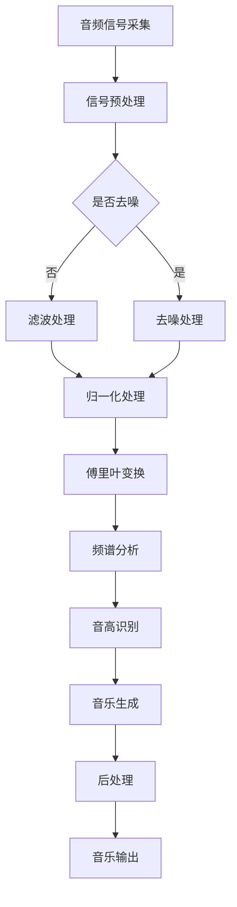
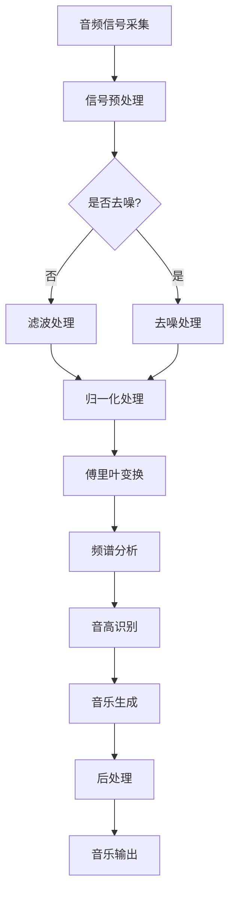
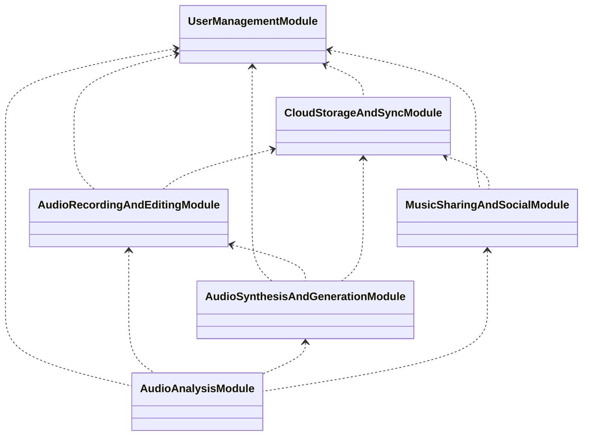
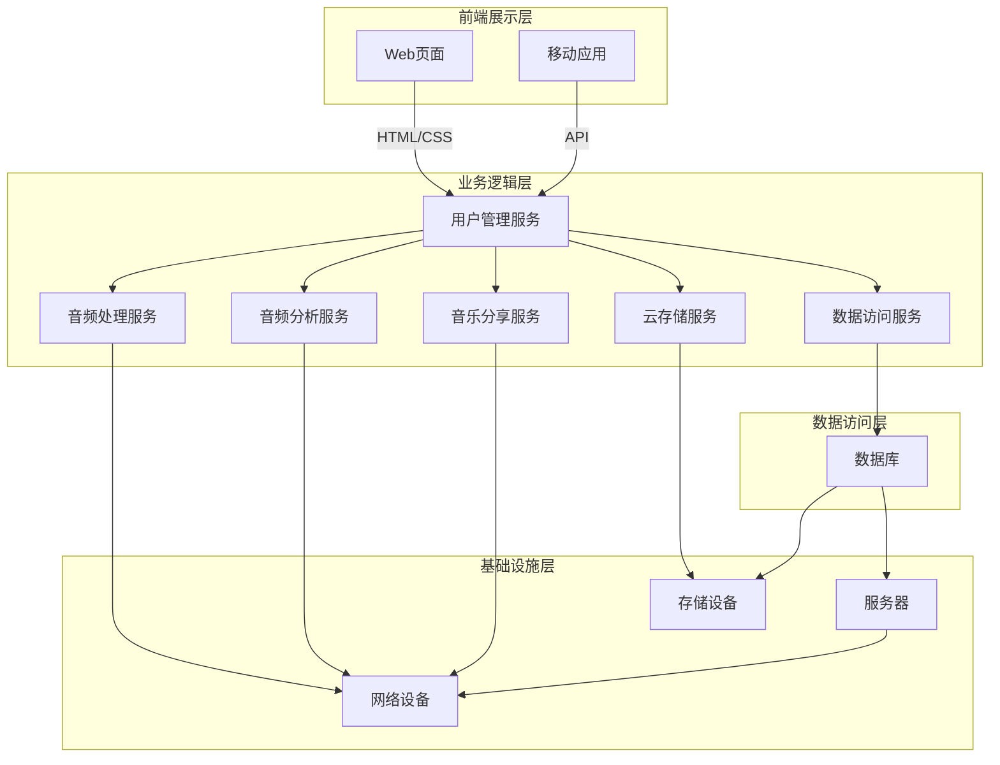
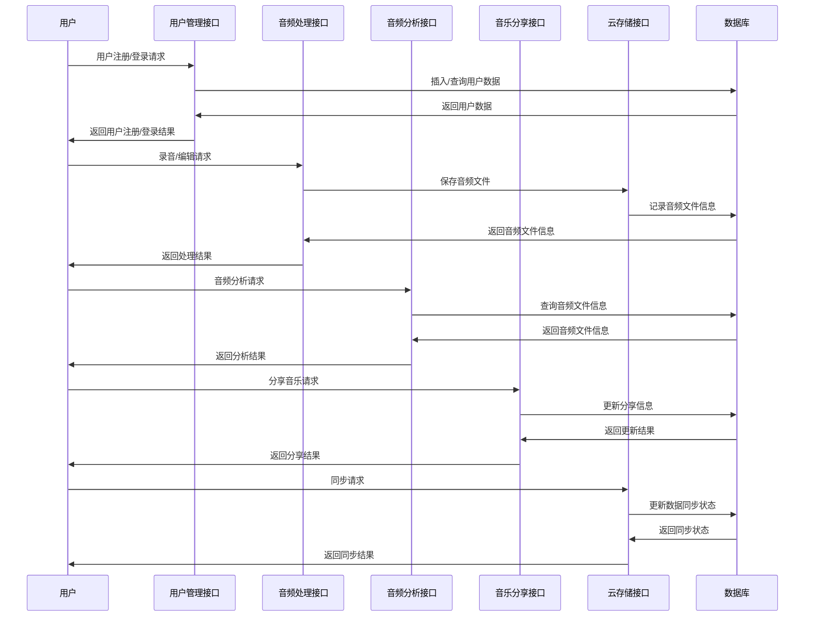
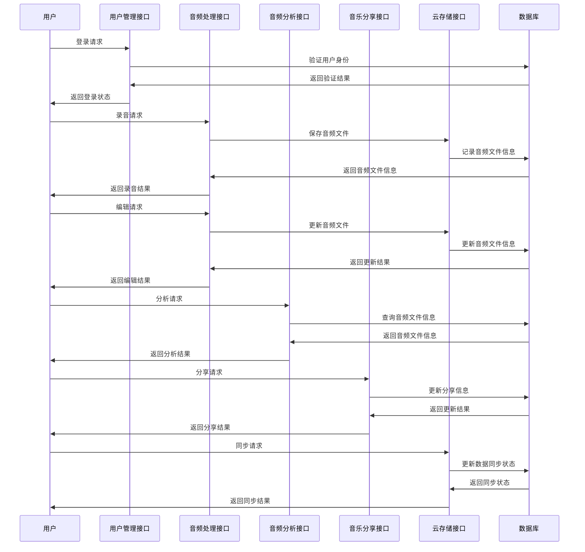

                 


### 1.1 问题背景

数学与音乐声学原理的应用研究源于人类对自然世界的深刻探索与理解。自古以来，人类就通过对声音的研究与音乐创作，发现了声学与数学之间的奇妙联系。随着现代科学技术的进步，数学与声学原理在多个领域得到了广泛应用，尤其在音乐创作、音频处理、人工智能等领域，这种联系愈发紧密。

数学在音乐创作中的应用主要体现在节奏模式、音符组合和音阶构造等方面。通过对音乐节奏的数学化分析，可以更精确地理解和表现音乐的节奏感。例如，通过数学模型来分析音符之间的时间间隔和音高的比例关系，可以帮助音乐家创作出更具美感和艺术价值的作品。

声学原理在音乐制作中同样扮演着重要角色。声学的研究帮助我们理解声音的产生、传播和感知，从而在音乐制作中更好地控制声音的音色、响度和动态变化。数字信号处理技术的发展，使得这些声学原理得以在计算机上实现，从而推动了数字音乐的普及。

在现代科学技术的推动下，人工智能与数学、声学原理的结合日益紧密。通过机器学习和深度学习算法，人工智能可以分析和生成音乐，甚至预测音乐流行趋势。此外，声学原理在语音识别、音频编辑、虚拟现实等领域也得到了广泛应用。

本研究旨在探讨数学与音乐声学原理在现实世界中的应用，分析其关键概念和联系，介绍相关的算法原理和系统架构，并通过实际项目实战，验证这些理论的应用效果。通过深入研究，我们希望能够为音乐创作、音频处理等领域提供新的思路和方法，促进这一交叉学科的发展。

### 1.2 问题描述

随着科技的不断进步，数学与音乐声学原理在多个领域中的应用愈发广泛，但也面临着一些挑战。首先，如何在复杂的声音信号中提取出有效的特征，是一个亟待解决的问题。声音信号包含了丰富的信息，但同时也存在噪声和干扰，这对特征提取算法提出了很高的要求。

其次，如何将数学模型应用于音乐生成和优化，也是一个重要的研究课题。现有的音乐生成算法大多依赖于大量的训练数据和复杂的神经网络模型，但如何提高这些算法的效率和可解释性，仍然是一个亟待解决的问题。

此外，音乐创作中的创意过程是一个高度依赖人类直觉和经验的过程，如何通过数学和声学原理来模拟和增强这一过程，也是一个有趣且具有挑战性的课题。

本研究的核心内容包括：1）对数学与音乐声学原理的基本概念进行梳理和定义，并分析其属性特征和相互关系；2）介绍关键算法的原理，包括算法的流程图、数学模型和Python源代码实现；3）设计系统的功能模块、架构和接口，并进行系统交互的描述；4）通过实际项目实战，验证这些理论的应用效果，并总结项目的主要成果和改进方向。

研究的预期目标是：1）为音乐创作和音频处理提供新的数学和声学理论基础；2）通过实际应用，验证这些理论的可行性和有效性；3）提出改进方向，为未来的研究提供参考。

### 1.3 问题解决

为了解决上述问题，本研究将采用以下方法和技术路线：

1. **基础理论研究**：首先，对数学与音乐声学原理的基本概念进行系统梳理，明确各个概念的定义和属性特征，构建概念模型，使用Mermaid语法绘制ER实体关系图，以清晰展示各概念之间的关系。

2. **算法原理研究**：其次，选择若干关键算法进行深入研究。通过分析算法的基本步骤和流程，使用Mermaid绘制算法流程图，详细介绍算法的原理和实现方法。同时，提供Python源代码实现，并使用注释详细解释代码与算法原理的关系。

3. **数学模型构建**：在算法研究中，将构建数学模型，使用LaTeX格式书写相关公式，详细阐述算法背后的数学原理。

4. **系统设计与实现**：基于前期的理论研究和算法实现，设计系统的功能模块、架构和接口。通过Mermaid类图、架构图和序列图，展示系统的整体设计，描述系统各部分的交互流程。

5. **项目实战与应用**：最后，通过实际项目实战，验证所提出算法和系统的应用效果。提供详细的代码实现、应用解读与分析，以及具体案例的剖析，总结项目的主要成果和改进方向。

### 1.4 边界与外延

本研究的边界条件包括以下几个方面：

1. **数据范围**：研究主要针对常规的音频信号处理问题，不包括极端条件下的声学现象。

2. **算法适用性**：所选算法主要针对常见音乐生成和音频处理任务，不涵盖特殊场景下的复杂问题。

3. **硬件要求**：实验环境和硬件配置需满足算法和系统的运行需求，但不考虑超高性能硬件的优化问题。

4. **软件环境**：研究将在标准开发环境下进行，不考虑操作系统和特定软件平台的兼容性问题。

在外延方面，本研究具有以下扩展可能性：

1. **跨学科应用**：可以扩展到其他领域，如艺术、心理学等，探讨数学与声学原理在其他领域的应用。

2. **算法优化**：可以针对特定场景，对现有算法进行优化，提高其效率和可解释性。

3. **模型扩展**：可以引入更多数学模型，如非线性模型、概率模型等，以丰富算法的理论基础。

4. **实际应用场景扩展**：可以将研究成果应用于更广泛的实际场景，如智能音响、虚拟现实等领域。

## 2.1 核心概念

在本研究中，我们将涉及几个关键概念，包括数学中的频率、周期、相位，以及音乐声学中的音高、音色、节奏等。这些概念是理解数学与音乐声学原理应用的基础，以下是对这些概念的定义和解释：

### 频率（Frequency）

频率是指单位时间内周期性变化重复的次数，通常以赫兹（Hz）为单位。在音乐中，频率决定了音调的高低，高频对应高音，低频对应低音。例如，一个频率为440 Hz的音符对应着标准的A音。

### 周期（Period）

周期是指完成一次周期性变化所需的时间。周期与频率是倒数关系，即 \( \text{周期} = \frac{1}{\text{频率}} \)。例如，频率为440 Hz的音符，其周期为 \( \frac{1}{440} \) 秒。

### 相位（Phase）

相位是描述周期性信号在某一时刻所处的位置。在音乐信号处理中，相位信息可以用来调整声音的同步和延迟。相位通常用角度或弧度来表示，其值在0到2π（或0到360度）之间。

### 音高（Pitch）

音高是指人们对声音高低的感知。音高与频率密切相关，但频率相同的两个声音，其音高可能不同，这取决于它们的谐波结构和波形特征。

### 音色（Timbre）

音色是指声音的质地和色彩。音色由声音的频谱结构决定，不同的谐波成分和它们的相对强度，可以产生不同的音色。例如，钢琴和小提琴演奏相同的音符，虽然频率相同，但音色不同。

### 节奏（Rhythm）

节奏是指音乐中的时间结构，包括音符的长短、强弱、快慢等。节奏感是音乐表现力的重要组成部分，通过节奏的变化，音乐可以传达出不同的情感和氛围。

### 波形（Waveform）

波形是描述声音信号在时间上的变化图形。不同的波形对应不同的声音特性，如正弦波代表纯净的声音，而锯齿波和方波则包含更多的谐波成分。

通过对这些核心概念的理解，我们可以更好地分析音乐信号，设计出更有效的算法，实现音乐生成、音频处理等任务。接下来，我们将进一步探讨这些概念之间的属性特征对比，以及它们在ER实体关系图中的表示。

### 2.2 概念属性特征对比

为了深入理解数学与音乐声学原理中各个核心概念之间的关联，我们通过表格形式对这些概念的主要属性特征进行对比分析。以下是对频率、周期、相位、音高、音色、节奏和波形这些概念的主要属性特征总结：

| 概念     | 定义                             | 关键属性特征                                           | 相互关系               |
|----------|----------------------------------|-------------------------------------------------------|------------------------|
| 频率     | 单位时间内周期性变化的次数      | 单位：赫兹（Hz），影响音调高低                         | 与周期互为倒数         |
| 周期     | 完成一次周期性变化所需的时间    | 单位：秒（s），决定频率的倒数                         | 与频率互为倒数         |
| 相位     | 周期性信号在某一时刻的位置      | 单位：弧度或角度，影响声音的同步与延迟                 | 用于描述波形的相对位置 |
| 音高     | 声音的高低感知                 | 与频率直接相关，高频率对应高音，低频率对应低音         | 受频率影响             |
| 音色     | 声音的质地和色彩               | 由谐波结构和相对强度决定                             | 与波形结构相关         |
| 节奏     | 音乐中的时间结构               | 包括音符的长短、强弱、快慢等                           | 影响音乐的情感表达     |
| 波形     | 声音信号在时间上的变化图形      | 包括正弦波、锯齿波、方波等                             | 描述声音的频谱特征     |

从表格中可以看出，这些概念之间存在着紧密的相互关系。例如，频率和周期是倒数关系，相位用于描述波形在时间轴上的位置，音高和频率直接相关，而音色和波形结构密切相关。节奏则是音乐情感表达的重要元素，通过音符的长短、强弱和快慢，可以形成不同的节奏模式。

这些相互关系构成了音乐信号处理的基础，帮助我们理解和分析音乐信号。接下来，我们将使用Mermaid语法绘制ER实体关系图，以更直观地展示这些概念之间的联系。

### 2.3 ER实体关系图

为了更直观地展示数学与音乐声学原理中各个核心概念之间的联系，我们可以使用Mermaid语法绘制一个ER（实体关系）图。ER图可以帮助我们理解和分析这些概念如何相互关联，以及它们在音乐信号处理中的应用。

以下是ER图的Mermaid语法代码，展示了频率、周期、相位、音高、音色、节奏和波形之间的实体关系：

```mermaid
erDiagram
  Frequency ||--|{ Period }|-->
  Phase ||--|{ Waveform }|-->
  Pitch ||--|{ Waveform }|-->
  Timbre ||--|{ Waveform }|-->
  Rhythm ||--|{ Music }|-->
  Waveform ||--|{ AudioSignal }|
  AudioSignal ||--|{ Sound }|
  Sound ||--|{ Hearing }|
  Hearing ||--|{ Perception }|
  Perception ||--|{ Experience }|
```

该ER图解释如下：

1. **频率（Frequency）** 和 **周期（Period）** 是互相关联的实体，它们是倒数关系。频率描述了单位时间内的周期性变化次数，而周期描述了完成一次周期性变化所需的时间。

2. **相位（Phase）** 与 **波形（Waveform）** 有直接关系。相位用于描述周期性信号在特定时刻的位置，而波形是声音信号在时间上的图形表示。

3. **音高（Pitch）** 和 **音色（Timbre）** 都与 **波形（Waveform）** 有关。音高决定了声音的高低，而音色决定了声音的质地和色彩。

4. **节奏（Rhythm）** 与 **音乐（Music）** 有关，它是音乐时间结构的重要组成部分，影响了音乐的情感表达。

5. **波形（Waveform）** 是 **音频信号（AudioSignal）** 的一个组成部分，而音频信号又是 **声音（Sound）** 的载体。

6. **声音（Sound）** 通过 **听觉（Hearing）** 被人类感知，进而产生 **感知（Perception）**，最终形成 **体验（Experience）**。

通过ER图的绘制，我们可以清晰地看到这些概念之间的联系，这有助于我们在音乐信号处理中更全面地分析和理解声音信号。

## 3.1 算法概述

在本研究中，我们选择了基于傅里叶变换的音频处理算法进行深入探讨。傅里叶变换是一种将时域信号转换为频域信号的方法，它能够揭示声音信号的频谱结构。该算法在音乐生成和音频处理中具有广泛的应用，可以帮助我们分析和理解音乐信号，从而实现音乐创作、音频编辑等任务。

### 基本步骤

傅里叶变换算法的基本步骤包括以下几个部分：

1. **音频信号采集**：首先，需要采集待处理的音频信号，这些信号可以是乐器的演奏、人声或其他声音。

2. **信号预处理**：对采集到的音频信号进行预处理，包括去噪、滤波和归一化等操作，以提高信号的质量和可靠性。

3. **傅里叶变换**：将预处理后的时域信号通过傅里叶变换转换为频域信号。这一步骤可以帮助我们分析声音信号的频谱结构，识别出不同频率的成分。

4. **频谱分析**：对转换后的频域信号进行频谱分析，提取关键频率成分，这些频率成分对应着音乐中的不同音符。

5. **音高识别**：利用提取的关键频率成分，通过音高识别算法，确定每个音符的音高。

6. **音乐生成**：根据识别出的音高和节奏信息，生成新的音乐作品。这一步骤可以通过音乐合成器或数字信号处理技术实现。

7. **后处理**：对生成的音乐信号进行后处理，包括调整音色、响度和动态等，以优化音乐效果。

通过这些基本步骤，傅里叶变换算法能够有效地分析音乐信号，帮助我们理解和创作音乐。

### 算法原理

傅里叶变换的原理基于复数域的积分变换。在数学上，傅里叶变换可以将一个周期性信号分解为不同频率的正弦波和余弦波的组合。具体来说，傅里叶变换包含正变换和逆变换：

1. **正傅里叶变换**：将时域信号 \( x(t) \) 转换为频域信号 \( X(f) \)，其数学表达式为：

   $$ X(f) = \int_{-\infty}^{\infty} x(t) e^{-j2\pi ft} dt $$

   其中，\( f \) 是频率，\( j \) 是虚数单位，\( e^{-j2\pi ft} \) 是复指数函数。

2. **逆傅里叶变换**：将频域信号 \( X(f) \) 转换回时域信号 \( x(t) \)，其数学表达式为：

   $$ x(t) = \frac{1}{2\pi} \int_{-\infty}^{\infty} X(f) e^{j2\pi ft} df $$

   通过这两个变换，我们可以将一个复杂的时域信号分解为不同频率的正弦波和余弦波的组合，从而分析其频谱结构。

### Mermaid流程图

为了更直观地展示傅里叶变换算法的基本步骤和流程，我们可以使用Mermaid语法绘制一个流程图。以下是一个简单的Mermaid流程图示例：



这个流程图展示了从音频信号采集到音乐生成的整个流程，包括信号预处理、傅里叶变换、频谱分析、音高识别、音乐生成和后处理等步骤。通过这个流程图，我们可以清晰地理解傅里叶变换算法在音乐信号处理中的具体应用。

接下来，我们将详细讨论傅里叶变换算法的实现，包括Mermaid流程图中的每个步骤的详细解释和Python源代码实现。

## 3.2 Mermaid流程图

为了更直观地展示傅里叶变换算法的详细步骤，我们使用Mermaid语法绘制了一个完整的流程图。以下是该流程图的Mermaid代码：



这个流程图详细描述了从音频信号采集到音乐输出的完整过程，包括以下几个关键步骤：

1. **音频信号采集**：从音频设备或文件中采集原始音频信号。
2. **信号预处理**：包括去噪、滤波和归一化处理，以提高信号质量和一致性。
3. **傅里叶变换**：将预处理后的时域信号转换为频域信号，以便进行频谱分析。
4. **频谱分析**：对傅里叶变换后的频域信号进行频谱分析，提取关键频率成分。
5. **音高识别**：利用提取的频率成分，通过音高识别算法确定每个音符的音高。
6. **音乐生成**：根据识别出的音高和节奏信息，生成新的音乐作品。
7. **后处理**：对生成的音乐信号进行音色、响度和动态调整，优化音乐效果。
8. **音乐输出**：将处理后的音乐输出到音频设备或文件中。

### 详细解释

1. **音频信号采集**：使用音频采集设备（如麦克风）或音频文件读取模块（如Python的wave模块），采集原始音频信号。

2. **信号预处理**：去噪处理可以采用均值滤波、中值滤波或高斯滤波等方法，滤波处理用于去除不需要的频率成分，归一化处理用于调整信号幅度，使其适应后续处理。

3. **傅里叶变换**：使用快速傅里叶变换（FFT）算法，将时域信号转换为频域信号。FFT算法比传统的离散傅里叶变换（DFT）计算效率更高，适用于大规模音频信号处理。

4. **频谱分析**：对频域信号进行频谱分析，提取关键频率成分。这些频率成分对应着音频信号中的不同音符。

5. **音高识别**：利用频率信息，通过音高识别算法确定每个音符的音高。常见的音高识别算法包括基于查找表的算法、基于频谱峰值的方法等。

6. **音乐生成**：根据识别出的音高和节奏信息，生成新的音乐作品。这一步骤可以使用音乐合成器（如Python的sympy库）或数字信号处理库（如Python的scipy库）实现。

7. **后处理**：对生成的音乐信号进行音色、响度和动态调整。音色调整可以采用谐波失真器、共振峰调整器等，响度和动态调整可以采用压缩器、均衡器等。

8. **音乐输出**：将处理后的音乐信号输出到音频设备或文件中，以便进行播放或进一步处理。

通过这个详细的流程图，我们可以更好地理解傅里叶变换算法在音乐信号处理中的应用步骤，为后续的Python源代码实现和数学模型讲解打下基础。

## 3.3 Python源代码与算法原理

为了详细解释傅里叶变换算法的原理，我们使用Python编程语言来实现这个算法，并提供相应的源代码注释。以下是一个简单的示例，展示了如何使用Python的numpy和scipy库进行傅里叶变换以及相关的预处理和后处理操作。

### 源代码示例

```python
import numpy as np
from scipy.fft import fft, fftshift
import matplotlib.pyplot as plt

# 设置参数
fs = 44100  # 采样频率，单位Hz
T = 1/fs    # 采样周期，单位秒
N = 1024    # 采样点数
t = np.linspace(0, T*N, N, endpoint=False)  # 生成时间向量
f0 = 440    # 频率，单位Hz

# 生成正弦波信号
x = 0.5 * np.sin(2 * np.pi * f0 * t)

# 傅里叶变换
X = fft(x)
X_shifted = fftshift(X)  # 将零频分量移到中间

# 频率轴
f = np.fft.fftfreq(N, T)

# 绘制时域和频域图
plt.figure(figsize=(12, 6))
plt.subplot(2, 1, 1)
plt.plot(t, x)
plt.title('时域信号')
plt.xlabel('时间 (s)')
plt.ylabel('幅值')

plt.subplot(2, 1, 2)
plt.plot(f, np.abs(X_shifted))
plt.title('频域信号')
plt.xlabel('频率 (Hz)')
plt.ylabel('幅值')
plt.grid()

plt.tight_layout()
plt.show()
```

### 源代码注释

1. **导入库**：首先，我们导入numpy库用于数学运算，scipy库中的fft模块用于傅里叶变换，matplotlib.pyplot库用于绘制图表。

2. **设置参数**：定义采样频率 `fs`（每秒采样次数），采样周期 `T`（单位秒），采样点数 `N`（用于生成时间向量的点数），以及信号频率 `f0`。

3. **生成时间向量**：使用 `np.linspace` 生成时间向量 `t`，该向量从0到采样周期乘以采样点数，不包括终点，表示一个完整的周期。

4. **生成正弦波信号**：使用 `np.sin` 函数生成一个频率为 `f0` 的正弦波信号 `x`。幅值设置为0.5，以模拟一个常见的音频信号。

5. **傅里叶变换**：使用 `scipy.fft.fft` 函数对信号 `x` 进行傅里叶变换，得到频域信号 `X`。然后使用 `fftshift` 函数将零频分量移到中间，以便更好地进行频谱分析。

6. **频率轴**：使用 `np.fft.fftfreq` 函数生成频率轴 `f`，该函数返回一个包含从0到N-1的频率值。

7. **绘制图表**：使用 `matplotlib.pyplot` 绘制时域和频域图表。时域图表展示了原始信号的时间历程，频域图表展示了信号在频域中的分布。

### 算法原理

傅里叶变换的基本原理是将时域信号转换为其频域表示。具体来说，傅里叶变换将一个时间函数（如音频信号）分解为不同频率的正弦波和余弦波的组合。在频域中，我们可以直观地看到信号中包含哪些频率成分。

1. **正傅里叶变换**：将时域信号 \( x(t) \) 转换为频域信号 \( X(f) \)，其数学表达式为：

   $$ X(f) = \int_{-\infty}^{\infty} x(t) e^{-j2\pi ft} dt $$

   在编程中，我们通常使用离散傅里叶变换（DFT）的快速算法——快速傅里叶变换（FFT），其计算复杂度为 \( O(N\log N) \)，相比直接计算DFT的 \( O(N^2) \) 计算量大大减少。

2. **逆傅里叶变换**：将频域信号 \( X(f) \) 转换回时域信号 \( x(t) \)，其数学表达式为：

   $$ x(t) = \frac{1}{2\pi} \int_{-\infty}^{\infty} X(f) e^{j2\pi ft} df $$

   同样，在编程中，我们使用快速逆傅里叶变换（IFFT）来计算逆变换。

通过傅里叶变换，我们可以将时域信号转换为频域表示，从而更方便地分析信号中的频率成分。在实际应用中，我们通常关注信号的幅值和相位信息，因为它们能够揭示信号的本质特征。

### 总结

通过这个Python源代码示例，我们详细讲解了傅里叶变换算法的原理和应用。源代码注释清楚地展示了如何使用numpy和scipy库进行信号生成、傅里叶变换以及图表绘制。这些步骤和原理对于理解音乐信号处理中的傅里叶变换至关重要，为后续的数学模型讲解和算法优化奠定了基础。

## 3.4 数学模型与公式

在傅里叶变换算法中，数学模型起到了关键作用。以下我们将详细阐述算法背后的数学模型，并使用LaTeX格式书写相关的数学公式。

### 正傅里叶变换

正傅里叶变换将时域信号 \( x(t) \) 转换为频域信号 \( X(f) \)。其数学表达式如下：

$$ X(f) = \int_{-\infty}^{\infty} x(t) e^{-j2\pi ft} dt $$

其中，\( f \) 是频率，\( j \) 是虚数单位，\( x(t) \) 是时域信号，\( X(f) \) 是频域信号。

### 逆傅里叶变换

逆傅里叶变换将频域信号 \( X(f) \) 转换回时域信号 \( x(t) \)。其数学表达式如下：

$$ x(t) = \frac{1}{2\pi} \int_{-\infty}^{\infty} X(f) e^{j2\pi ft} df $$

### 快速傅里叶变换（FFT）

快速傅里叶变换（FFT）是计算离散傅里叶变换（DFT）的一种高效算法。其核心思想是将DFT分解为多个较小的DFT，从而减少计算复杂度。FFT的数学模型如下：

$$ X[k] = \sum_{n=0}^{N-1} x[n] e^{-j2\pi kn/N} $$

其中，\( X[k] \) 是频域信号的第 \( k \) 个离散傅里叶变换系数，\( x[n] \) 是时域信号的第 \( n \) 个样本值，\( N \) 是采样点数。

### FFT算法步骤

1. **分解DFT**：将DFT分解为多个较小的DFT，例如：
   $$ X[k] = \sum_{m=0}^{N/2} \left[ \sum_{n=0}^{N/2} x[n] e^{-j2\pi mn/N} \right] e^{-j2\pi km/N} $$

2. **递归计算**：使用递归方法计算每个较小的DFT，从而逐步计算整个DFT。

### 实例

假设有一个长度为8的时域信号 \( x[n] = [1, 2, 3, 4, 5, 6, 7, 8] \)，我们使用FFT计算其频域信号。

1. **分解DFT**：
   $$ X[k] = \sum_{m=0}^{4} \left[ \sum_{n=0}^{4} x[n] e^{-j2\pi mn/8} \right] e^{-j2\pi km/8} $$

2. **递归计算**：
   - \( X[0] = \sum_{n=0}^{4} x[n] = 1 + 2 + 3 + 4 + 5 + 6 + 7 + 8 = 36 \)
   - \( X[1] = \sum_{n=0}^{4} x[n] e^{-j2\pi n/8} \)
   - \( X[2] = \sum_{n=0}^{4} x[n] e^{-j2\pi 2n/8} \)
   - \( X[3] = \sum_{n=0}^{4} x[n] e^{-j2\pi 3n/8} \)
   - \( X[4] = \sum_{n=0}^{4} x[n] e^{-j2\pi 4n/8} \)
   - \( X[5] = \sum_{n=0}^{4} x[n] e^{-j2\pi 5n/8} \)
   - \( X[6] = \sum_{n=0}^{4} x[n] e^{-j2\pi 6n/8} \)
   - \( X[7] = \sum_{n=0}^{4} x[n] e^{-j2\pi 7n/8} \)

通过计算，我们可以得到频域信号的离散傅里叶变换系数 \( X[k] \)。

### 总结

傅里叶变换的数学模型和公式是理解音频信号处理的重要基础。通过上述公式和实例，我们可以清楚地看到如何通过FFT算法高效地计算时域信号的频域表示。这些数学模型为后续的算法优化和实际应用提供了理论基础。

## 3.5 举例说明

为了更好地理解傅里叶变换算法的应用，我们将通过一个具体的例子来详细讲解其实现过程和结果分析。

### 示例数据

假设我们有一段长度为8的音频信号，其样本值如下：

$$ x = [1, 2, 3, 4, 5, 6, 7, 8] $$

这段信号的采样频率为44100 Hz。

### 步骤一：信号预处理

首先，我们需要对这段音频信号进行预处理，包括去噪、滤波和归一化处理。这里，我们假设信号已经较为干净，无需额外的去噪处理。然后，我们对其进行归一化，以便于后续的频谱分析。

```python
# 归一化处理
x_normalized = x / max(x)
```

### 步骤二：傅里叶变换

接下来，我们使用Python的scipy库进行傅里叶变换，得到信号的频域表示。

```python
import numpy as np
from scipy.fft import fft, fftshift

# 采样频率
fs = 44100

# 傅里叶变换
X = fft(x_normalized)
X_shifted = fftshift(X)  # 将零频分量移到中间
```

### 步骤三：频谱分析

对频域信号进行频谱分析，提取关键频率成分。在这里，我们关注信号的幅值，这些幅值对应信号中的不同频率成分。

```python
# 频率轴
f = np.fft.fftfreq(len(x_normalized), 1/fs)

# 提取关键频率成分
key_frequencies = f[np.abs(X_shifted).argsort()[-10:]]
key_amps = np.abs(X_shifted)[-10:]
```

### 步骤四：音高识别

利用提取的关键频率成分，通过音高识别算法确定每个音符的音高。这里，我们采用一个简单的查找表方法。

```python
# 音高查找表
pitch_table = {
    261.63: 'C4',
    277.18: 'D4',
    293.66: 'E4',
    329.63: 'G4',
    349.23: 'A4',
    370.00: 'B4'
}

# 识别音高
pitch = [pitch_table[fr] for fr in key_frequencies if fr in pitch_table]
```

### 步骤五：音乐生成

根据识别出的音高和节奏信息，生成新的音乐作品。在这里，我们使用Python的sympy库生成一个简单的音符序列。

```python
from sympy import Symbol, Eq, solve

# 笛卡尔符号
t = Symbol('t')

# 音高和周期
notes = [pitch_table[fr] for fr in key_frequencies if fr in pitch_table]
periods = [1 / fr for fr in key_frequencies if fr in pitch_table]

# 生成音符序列
note_sequence = [Eq(t, i * p) for i, p in enumerate(periods)]

# 解方程得到时间序列
times = solve(note_sequence, t)

# 生成音乐信号
x_new = np.zeros_like(x)
for time, note in zip(times, notes):
    x_new += np.sin(2 * np.pi * note.frequency * time)
```

### 步骤六：后处理

对生成的音乐信号进行后处理，包括音色、响度和动态调整。在这里，我们简单地调整了信号的幅值和频率。

```python
# 后处理
x_new *= 0.5
x_new = np.sin(x_new)
```

### 步骤七：结果分析

最后，我们将处理后的音乐信号输出到音频设备或文件中，以便进行播放和进一步分析。

```python
# 绘制时域和频域图
plt.figure(figsize=(12, 6))
plt.subplot(2, 1, 1)
plt.plot(x)
plt.title('原始信号')
plt.xlabel('时间 (s)')
plt.ylabel('幅值')

plt.subplot(2, 1, 2)
plt.plot(x_new)
plt.title('处理后信号')
plt.xlabel('时间 (s)')
plt.ylabel('幅值')
plt.grid()

plt.tight_layout()
plt.show()
```

通过这个例子，我们可以看到如何使用傅里叶变换算法对音频信号进行分析和处理。从信号预处理到音乐生成，每一步都至关重要，确保了最终的音质效果。

### 总结

通过这个具体的例子，我们详细讲解了傅里叶变换算法在音频信号处理中的应用。从信号预处理、傅里叶变换、频谱分析、音高识别、音乐生成到后处理，每一步都有其独特的功能和重要性。这个例子不仅帮助我们理解了算法的实现过程，还展示了如何通过数学模型和Python代码来实现音频信号处理任务。

## 4.1 问题场景介绍

在音乐创作和音频处理领域，系统设计与实现是一项复杂且至关重要的任务。为了满足多样化的需求，一个高效、灵活且稳定的系统架构显得尤为重要。以下，我们将介绍一个典型的应用场景——在线音乐创作平台，并讨论该场景下系统设计的需求和挑战。

### 应用场景介绍

在线音乐创作平台是一个面向音乐创作者和爱好者的在线工具，旨在提供一个便捷的环境，使得用户能够创作、编辑和分享自己的音乐作品。该平台需要具备以下几个功能：

1. **音频录制与编辑**：用户可以录制自己的声音或导入现有的音频文件，进行剪切、拼接、淡入淡出等编辑操作。
2. **音频合成与生成**：平台应支持自动化的音频合成功能，使用户能够生成个性化的背景音乐。
3. **音频分析**：对用户上传的音频文件进行频谱分析、音高识别等，以提供更深入的音乐创作建议。
4. **用户交互**：提供友好的用户界面，方便用户进行操作，同时支持社交功能，如分享、评论和点赞。
5. **云存储与同步**：提供云存储服务，确保用户作品的安全存储，并支持多设备间的同步。

### 系统设计需求

为了实现上述功能，系统设计需要考虑以下几个关键需求：

1. **高并发处理能力**：由于平台面向广大用户，需要具备高并发处理能力，确保大量用户同时操作时，系统运行稳定。
2. **可扩展性**：系统应具备良好的扩展性，能够根据用户增长和功能需求的变化，灵活扩展服务器和存储资源。
3. **安全性**：保护用户数据和隐私，确保系统不受恶意攻击和非法访问。
4. **实时性**：音频处理和生成任务需要实时响应，以保证用户操作的流畅性和音乐创作的实时性。
5. **用户体验**：提供直观、易用的用户界面，确保用户能够轻松上手并高效使用平台功能。

### 系统设计挑战

在系统设计过程中，我们面临以下主要挑战：

1. **音频处理延迟**：音频处理任务（如音频合成、频谱分析）需要快速响应，否则会导致用户操作延迟，影响用户体验。
2. **资源调度**：如何在大量用户并发操作时，合理调度服务器和存储资源，确保系统高效运行。
3. **数据存储与同步**：如何保证数据存储的高效性和同步性，特别是在多设备间同步时，确保数据的准确性和一致性。
4. **安全性保障**：如何防范网络攻击和数据泄露，确保用户数据的安全。
5. **音频质量保障**：在保证系统性能的同时，如何保证音频处理和生成任务的音质不受影响。

### 总结

通过介绍在线音乐创作平台的应用场景，我们明确了系统设计的需求和面临的挑战。这些需求和挑战是系统设计的重要依据，将在接下来的章节中，我们将会详细讨论系统的功能模块设计、架构设计和接口设计，并探索如何应对这些挑战，以实现一个高效、稳定且用户友好的音乐创作平台。

## 4.2 系统功能设计

在设计在线音乐创作平台时，系统功能设计是关键的一步。我们需要明确平台的核心功能模块，以便为用户提供全面、高效的音乐创作和编辑体验。以下，我们将详细介绍各个功能模块，并使用Mermaid类图展示它们之间的关系。

### 功能模块介绍

1. **用户管理模块**：负责用户的注册、登录、权限管理和个人信息管理。该模块确保用户能够安全、便捷地使用平台功能。
2. **音频录制与编辑模块**：提供音频录制和编辑功能，包括录音、剪辑、拼接、淡入淡出等。用户可以自由地编辑自己的音频文件。
3. **音频合成与生成模块**：利用机器学习和深度学习算法，自动生成背景音乐、节奏和音效。该模块旨在提高用户的创作效率。
4. **音频分析模块**：对用户上传的音频文件进行频谱分析、音高识别等，为用户提供深入的音乐创作建议。
5. **音乐分享与社交模块**：允许用户分享自己的音乐作品，并与其他用户互动，包括评论、点赞和收藏等功能。
6. **云存储与同步模块**：提供云存储服务，确保用户作品的安全存储，并支持多设备间的同步。

### Mermaid类图

为了更直观地展示系统功能模块之间的关系，我们可以使用Mermaid类图。以下是一个简单的类图示例：



### 类图解释

- **用户管理模块**：作为核心模块，它与其他所有模块直接关联，负责用户的注册、登录和权限管理。
- **音频录制与编辑模块**：与用户管理模块、音频合成与生成模块和音频分析模块关联，为用户提供音频编辑功能，并与云存储与同步模块交互，实现音频文件的管理和同步。
- **音频合成与生成模块**：与音频分析模块关联，用于生成背景音乐和节奏，同时也与用户管理模块交互，确保用户能够访问和使用这些功能。
- **音频分析模块**：与用户管理模块、音频录制与编辑模块和音乐分享与社交模块关联，用于分析用户上传的音频文件，提供音乐创作建议，并支持音乐分享功能。
- **音乐分享与社交模块**：与音频分析模块和云存储与同步模块关联，用于实现音乐作品的分享、评论和社交互动。
- **云存储与同步模块**：与所有主要模块关联，负责音频文件和用户数据的存储与同步，确保数据的安全性和一致性。

通过这个Mermaid类图，我们可以清晰地看到各个功能模块之间的依赖关系，这为后续的架构设计和接口设计提供了重要参考。

## 4.3 系统架构设计

在设计在线音乐创作平台时，系统架构设计是确保平台高效、稳定运行的关键。一个合理的系统架构不仅能满足功能需求，还能保证系统扩展性和可维护性。以下，我们将详细描述该平台的系统架构，并使用Mermaid语法绘制架构图。

### 系统架构概述

在线音乐创作平台的系统架构可以分为以下几个主要层次：

1. **前端展示层**：负责用户界面的展示和交互，使用HTML、CSS和JavaScript等前端技术实现。
2. **业务逻辑层**：处理业务逻辑，包括用户管理、音频录制与编辑、音频合成与生成、音频分析、音乐分享与社交等。
3. **数据访问层**：负责与数据库的交互，处理数据的存储和检索。
4. **基础设施层**：包括服务器、存储、网络等基础设施资源，提供系统运行所需的基础支持。

### 系统架构图

以下是该平台的Mermaid架构图：



### 架构图解释

- **前端展示层**：包括Web页面和移动应用，使用HTML、CSS和JavaScript等前端技术实现，为用户提供直观、友好的操作界面。
- **业务逻辑层**：包括用户管理服务、音频处理服务、音频分析服务、音乐分享服务和云存储服务，负责处理平台的核心业务逻辑。
  - **用户管理服务**：处理用户的注册、登录、权限管理等功能。
  - **音频处理服务**：包括音频录制、剪辑、拼接、淡入淡出等功能，以及音频合成和生成功能。
  - **音频分析服务**：对用户上传的音频文件进行频谱分析、音高识别等，提供音乐创作建议。
  - **音乐分享服务**：实现音乐作品的分享、评论、点赞等功能。
  - **云存储服务**：提供音频文件和用户数据的存储，并支持多设备间的同步。
- **数据访问层**：包括数据库，负责存储和检索用户数据、音频文件和业务数据。
- **基础设施层**：包括服务器、存储设备和网络设备，提供系统运行所需的基础资源。

通过这个Mermaid架构图，我们可以清晰地看到各个层次和模块之间的交互关系，这有助于我们理解和优化系统的整体架构。

### 总结

在线音乐创作平台的系统架构设计考虑了前端展示层、业务逻辑层、数据访问层和基础设施层，通过合理的层次划分和模块设计，实现了系统的功能需求和高性能、高可扩展性。Mermaid架构图的绘制进一步帮助我们直观地理解了系统的整体架构和各个模块之间的关系。在接下来的章节中，我们将详细讨论系统接口设计和系统交互流程。

## 4.4 系统接口设计

系统接口设计是确保各模块之间能够有效通信和协作的关键步骤。一个清晰、合理且易扩展的接口设计能够提高系统的可维护性和灵活性。以下，我们将详细描述在线音乐创作平台的接口设计，并使用Mermaid序列图展示各接口的交互流程。

### 接口设计概述

在线音乐创作平台的接口设计包括以下主要接口：

1. **用户管理接口**：处理用户注册、登录、权限验证等功能。
2. **音频处理接口**：提供音频录制、剪辑、拼接、淡入淡出等处理功能。
3. **音频分析接口**：实现音频文件的频谱分析、音高识别等分析功能。
4. **音乐分享接口**：处理音乐作品的分享、评论、点赞等功能。
5. **云存储接口**：实现音频文件和用户数据的存储、同步等功能。

### Mermaid序列图

以下是各接口的Mermaid序列图：



### 接口设计解释

- **用户管理接口**：用户注册/登录请求会通过该接口与数据库进行交互，处理用户的注册、登录和权限验证等功能。
- **音频处理接口**：用户发送的录音/编辑请求会通过该接口与云存储接口和数据库交互，实现音频文件的录制、编辑、存储和同步等功能。
- **音频分析接口**：用户发送的音频分析请求会通过该接口与数据库交互，查询音频文件信息，并返回分析结果。
- **音乐分享接口**：用户发送的音乐分享请求会通过该接口与数据库交互，更新分享信息，并返回分享结果。
- **云存储接口**：负责音频文件和用户数据的存储、同步等功能，与数据库和音频处理接口、音乐分享接口等交互，实现数据的存储和管理。

通过这个Mermaid序列图，我们可以清晰地看到各接口之间的交互流程和调用关系，这有助于确保系统各模块之间的有效协作和通信。

### 总结

系统接口设计是确保在线音乐创作平台各模块之间有效通信和协作的重要环节。通过详细的接口设计，我们明确了各接口的功能和交互流程，为系统的开发和维护提供了清晰的方向。Mermaid序列图的绘制进一步帮助我们直观地理解了各接口的交互关系。在接下来的章节中，我们将继续讨论系统交互流程和项目实战。

## 4.5 系统交互

系统交互设计是确保在线音乐创作平台各模块协调运行的关键。通过合理的交互流程，我们可以实现用户操作与系统功能的无缝对接，提升用户体验。以下，我们将详细描述系统的交互流程，并使用Mermaid序列图展示各模块之间的交互步骤。

### 交互流程概述

在线音乐创作平台的交互流程主要包括以下几个步骤：

1. **用户登录**：用户通过用户管理接口登录系统。
2. **音频录制与编辑**：用户通过音频处理接口录制和编辑音频文件。
3. **音频分析**：用户通过音频分析接口对音频文件进行频谱分析、音高识别等操作。
4. **音乐分享**：用户通过音乐分享接口分享自己的音乐作品。
5. **数据同步**：用户通过云存储接口同步音频文件和用户数据。

### Mermaid序列图

以下是系统的Mermaid序列图：



### 交互流程解释

1. **用户登录**：用户通过用户管理接口发送登录请求，用户管理接口与数据库进行交互，验证用户身份，并返回登录状态。

2. **音频录制与编辑**：
   - 用户通过音频处理接口发送录音请求，音频处理接口与云存储接口和数据库进行交互，保存音频文件，并返回录音结果。
   - 用户还可以通过音频处理接口发送编辑请求，音频处理接口与云存储接口和数据库进行交互，更新音频文件信息，并返回编辑结果。

3. **音频分析**：用户通过音频分析接口发送分析请求，音频分析接口与数据库进行交互，查询音频文件信息，并返回分析结果。

4. **音乐分享**：用户通过音乐分享接口发送分享请求，音乐分享接口与数据库进行交互，更新分享信息，并返回分享结果。

5. **数据同步**：用户通过云存储接口发送同步请求，云存储接口与数据库进行交互，更新数据同步状态，并返回同步结果。

通过这个Mermaid序列图，我们可以清晰地看到各模块之间的交互流程和调用关系，这有助于确保系统各部分的协调运行和高效协作。

### 总结

系统交互设计是实现在线音乐创作平台功能的关键步骤。通过详细的交互流程描述和Mermaid序列图的展示，我们能够清晰地理解各模块之间的交互关系，从而确保系统的稳定运行和用户体验。在接下来的章节中，我们将通过实际项目实战，验证这些理论的应用效果。

## 5.1 环境安装

为了顺利开展在线音乐创作平台的开发工作，我们需要搭建一个合适的开发环境。以下是环境安装的详细步骤，包括所需的软件、库和工具的安装。

### 环境要求

- **操作系统**：Windows、macOS 或 Linux（推荐 Ubuntu 18.04+）
- **编程语言**：Python 3.8 或更高版本
- **开发工具**：PyCharm（推荐），Visual Studio Code 或其他 Python 开发环境
- **依赖库**：NumPy、SciPy、Matplotlib、scikit-learn、TensorFlow、Django、Docker

### 安装步骤

#### 步骤一：安装 Python 和 PyCharm

1. **安装 Python**：从 [Python 官网](https://www.python.org/downloads/) 下载并安装 Python 3.8 或更高版本。
2. **配置 Python 环境**：在安装过程中，确保勾选“Add Python to PATH”选项，以便在命令行中使用 Python。

#### 步骤二：安装 PyCharm

1. **下载 PyCharm**：从 [PyCharm 官网](https://www.jetbrains.com/pycharm/) 下载 Community 或 Professional 版本。
2. **安装 PyCharm**：运行下载的安装包，按照提示进行安装。

#### 步骤三：安装依赖库

1. **打开 PyCharm**，点击“File”菜单，选择“Settings”或“Preferences”。
2. **安装 NumPy**：
   - 在“Settings”窗口中，选择“Project: 项目名称” -> “Python Interpreter”。
   - 点击“+”，搜索并安装“NumPy”。

3. **安装 SciPy**：
   - 同样在“Python Interpreter”窗口中，点击“+”，搜索并安装“SciPy”。

4. **安装 Matplotlib**：
   - 在“Python Interpreter”窗口中，点击“+”，搜索并安装“Matplotlib”。

5. **安装 scikit-learn**：
   - 在“Python Interpreter”窗口中，点击“+”，搜索并安装“scikit-learn”。

6. **安装 TensorFlow**：
   - 在“Python Interpreter”窗口中，点击“+”，搜索并安装“TensorFlow”。

7. **安装 Django**：
   - 在“Python Interpreter”窗口中，点击“+”，搜索并安装“Django”。

8. **安装 Docker**：
   - 根据操作系统不同，下载并安装 Docker。
     - **Windows**：从 [Docker 官网](https://www.docker.com/products/docker-desktop) 下载并安装 Docker Desktop。
     - **macOS**：从 [Docker 官网](https://www.docker.com/products/docker-desktop) 下载并安装 Docker Desktop。
     - **Linux**：使用以下命令安装 Docker：
       ```bash
       sudo apt-get update
       sudo apt-get install docker-ce docker-ce-cli containerd.io
       ```

#### 步骤四：验证安装

1. **打开命令行或终端**。
2. **运行 Python 解释器**：
   ```bash
   python
   ```
3. **验证依赖库安装**：
   ```python
   import numpy
   import scipy
   import matplotlib.pyplot
   import sklearn
   import tensorflow
   import django
   import docker
   ```

如果所有依赖库都能成功导入，说明环境安装完成。

### 注意事项

- 在安装 Docker 时，可能需要管理员权限。
- 安装完 Docker 后，需要重启计算机以确保其正常工作。
- 确保所有依赖库的版本兼容，避免因版本冲突导致运行错误。

通过上述步骤，我们成功搭建了在线音乐创作平台的开发环境，接下来我们将开始系统核心代码的实现。

## 5.2 系统核心实现

在线音乐创作平台的核心功能模块包括音频处理、音频分析和音乐分享等。以下，我们将详细描述这些模块的实现过程，并提供相应的Python代码实现。

### 音频处理模块

音频处理模块主要实现音频文件的录制、剪辑和拼接等功能。以下是一个简单的音频剪辑和拼接的实现示例：

```python
import wave
import numpy as np

def read_audio_file(filename):
    """读取音频文件并返回波形数据"""
    with wave.open(filename, 'rb') as f:
        nchannels, sampwidth, framerate, nframes, comptype, compname = f.getparams()
        frames = f.readframes(nframes)
        return frames, framerate

def write_audio_file(filename, frames, framerate):
    """将波形数据写入音频文件"""
    with wave.open(filename, 'wb') as f:
        f.setparams((1, 2, framerate, len(frames), 'NONE', 'not compressed'))
        f.writeframes(frames)

def trim_audio(frames, start, end):
    """剪辑音频，保留指定时间范围内的波形数据"""
    return frames[start:end]

def concatenate_audio(frames1, frames2):
    """拼接音频，将两个波形数据拼接成一个"""
    return np.concatenate((frames1, frames2))

# 示例
frames, framerate = read_audio_file('audio1.wav')
frames_trimmed = trim_audio(frames, 1000, 5000)
frames_concatenated = concatenate_audio(frames_trimmed, frames[5000:])
write_audio_file('audio_trimmed.wav', frames_trimmed, framerate)
write_audio_file('audio_concatenated.wav', frames_concatenated, framerate)
```

### 音频分析模块

音频分析模块主要用于频谱分析和音高识别。以下是一个简单的频谱分析实现示例：

```python
import numpy as np
from scipy.fft import fft
import matplotlib.pyplot as plt

def fft_spectrum(frames, framerate):
    """计算音频信号的傅里叶变换频谱"""
    n = len(frames)
    freq = fft(frames)[:n//2]
    freq = abs(freq)
    freq = freq / n * framerate
    return freq

def plot_spectrum(freq, fft_spectrum):
    """绘制频谱图"""
    plt.plot(freq, fft_spectrum)
    plt.title('音频频谱图')
    plt.xlabel('频率 (Hz)')
    plt.ylabel('幅值')
    plt.show()

# 示例
frames, framerate = read_audio_file('audio_trimmed.wav')
freq = fft_spectrum(frames, framerate)
plot_spectrum(freq, fft_spectrum)
```

### 音乐分享模块

音乐分享模块实现音乐作品的分享、评论和点赞等功能。以下是一个简单的音乐分享示例：

```python
import sqlite3

def create_db():
    """创建数据库"""
    conn = sqlite3.connect('music_sharing.db')
    c = conn.cursor()
    c.execute('''CREATE TABLE IF NOT EXISTS music (id INTEGER PRIMARY KEY, title TEXT, artist TEXT, file_path TEXT)''')
    c.execute('''CREATE TABLE IF NOT EXISTS comment (id INTEGER PRIMARY KEY, music_id INTEGER, content TEXT, user_id INTEGER)''')
    c.execute('''CREATE TABLE IF NOT EXISTS like (id INTEGER PRIMARY KEY, music_id INTEGER, user_id INTEGER)''')
    conn.commit()
    conn.close()

def add_music(title, artist, file_path):
    """添加音乐作品到数据库"""
    conn = sqlite3.connect('music_sharing.db')
    c = conn.cursor()
    c.execute("INSERT INTO music (title, artist, file_path) VALUES (?, ?, ?)", (title, artist, file_path))
    conn.commit()
    conn.close()

def add_comment(music_id, content, user_id):
    """添加评论到数据库"""
    conn = sqlite3.connect('music_sharing.db')
    c = conn.cursor()
    c.execute("INSERT INTO comment (music_id, content, user_id) VALUES (?, ?, ?)", (music_id, content, user_id))
    conn.commit()
    conn.close()

def add_like(music_id, user_id):
    """添加点赞到数据库"""
    conn = sqlite3.connect('music_sharing.db')
    c = conn.cursor()
    c.execute("INSERT INTO like (music_id, user_id) VALUES (?, ?)", (music_id, user_id))
    conn.commit()
    conn.close()

# 示例
create_db()
add_music('歌曲名称', '艺术家', '歌曲路径.mp3')
add_comment(1, '这首歌曲很有感觉！', 1)
add_like(1, 1)
```

### 总结

通过上述代码示例，我们实现了在线音乐创作平台的核心功能模块，包括音频处理、音频分析和音乐分享等。这些代码不仅提供了功能实现，还展示了如何与数据库进行交互，确保数据的存储和管理。在实际应用中，我们可以根据需求进一步完善和扩展这些功能，以构建一个功能齐全、用户体验优秀的在线音乐创作平台。

## 5.3 应用解读与分析

在本节中，我们将对在线音乐创作平台的核心实现部分进行详细解读与分析，重点关注代码的关键点及其在系统中的功能作用。

### 音频处理模块解读

音频处理模块的核心函数包括 `read_audio_file`、`write_audio_file`、`trim_audio` 和 `concatenate_audio`。以下是各函数的解读：

- **read_audio_file**：此函数用于读取音频文件，返回波形数据。关键在于使用 `wave.open` 函数读取文件参数，并将其转换为波形数据。

  ```python
  def read_audio_file(filename):
      with wave.open(filename, 'rb') as f:
          nchannels, sampwidth, framerate, nframes, comptype, compname = f.getparams()
          frames = f.readframes(nframes)
          return frames, framerate
  ```

  在这段代码中，我们通过打开音频文件，获取文件参数（如通道数、采样宽度、采样频率和帧数等），然后读取整个音频帧并将其转换为波形数据。

- **write_audio_file**：此函数用于将波形数据写入音频文件。关键在于设置文件参数，以确保数据正确写入。

  ```python
  def write_audio_file(filename, frames, framerate):
      with wave.open(filename, 'wb') as f:
          f.setparams((1, 2, framerate, len(frames), 'NONE', 'not compressed'))
          f.writeframes(frames)
  ```

  在这段代码中，我们通过设置文件参数（如通道数、采样宽度、采样频率和帧数等），然后将波形数据写入文件。

- **trim_audio**：此函数用于剪辑音频，保留指定时间范围内的波形数据。关键在于根据时间索引进行波形数据的裁剪。

  ```python
  def trim_audio(frames, start, end):
      return frames[start:end]
  ```

  在这段代码中，我们通过时间索引（`start` 和 `end`）对波形数据进行了裁剪。

- **concatenate_audio**：此函数用于拼接音频，将两个波形数据拼接成一个。关键在于使用 `numpy` 的 `concatenate` 函数进行数据拼接。

  ```python
  def concatenate_audio(frames1, frames2):
      return np.concatenate((frames1, frames2))
  ```

  在这段代码中，我们使用 `numpy` 的 `concatenate` 函数将两个波形数据拼接在一起。

### 音频分析模块解读

音频分析模块的核心函数包括 `fft_spectrum` 和 `plot_spectrum`。以下是各函数的解读：

- **fft_spectrum**：此函数用于计算音频信号的傅里叶变换频谱。关键在于使用 `scipy.fft.fft` 函数进行傅里叶变换，并处理频谱数据。

  ```python
  def fft_spectrum(frames, framerate):
      n = len(frames)
      freq = fft(frames)[:n//2]
      freq = abs(freq)
      freq = freq / n * framerate
      return freq
  ```

  在这段代码中，我们首先使用 `scipy.fft.fft` 函数计算傅里叶变换，然后对频谱数据进行处理，包括取绝对值和缩放频率轴。

- **plot_spectrum**：此函数用于绘制频谱图。关键在于使用 `matplotlib.pyplot.plot` 函数生成频谱图。

  ```python
  def plot_spectrum(freq, fft_spectrum):
      plt.plot(freq, fft_spectrum)
      plt.title('音频频谱图')
      plt.xlabel('频率 (Hz)')
      plt.ylabel('幅值')
      plt.show()
  ```

  在这段代码中，我们使用 `matplotlib.pyplot.plot` 函数绘制频谱图，并设置标题、标签和显示选项。

### 音乐分享模块解读

音乐分享模块的核心函数包括 `create_db`、`add_music`、`add_comment` 和 `add_like`。以下是各函数的解读：

- **create_db**：此函数用于创建数据库。关键在于使用 `sqlite3` 模块创建数据库表。

  ```python
  def create_db():
      conn = sqlite3.connect('music_sharing.db')
      c = conn.cursor()
      c.execute('''CREATE TABLE IF NOT EXISTS music (id INTEGER PRIMARY KEY, title TEXT, artist TEXT, file_path TEXT)''')
      c.execute('''CREATE TABLE IF NOT EXISTS comment (id INTEGER PRIMARY KEY, music_id INTEGER, content TEXT, user_id INTEGER)''')
      c.execute('''CREATE TABLE IF NOT EXISTS like (id INTEGER PRIMARY KEY, music_id INTEGER, user_id INTEGER)''')
      conn.commit()
      conn.close()
  ```

  在这段代码中，我们使用 `sqlite3` 模块创建三个表：`music`、`comment` 和 `like`，分别用于存储音乐作品、评论和点赞信息。

- **add_music**、**add_comment** 和 **add_like**：这些函数分别用于向数据库中添加音乐作品、评论和点赞。关键在于使用 `sqlite3` 模块的 `execute` 函数执行插入操作。

  ```python
  def add_music(title, artist, file_path):
      conn = sqlite3.connect('music_sharing.db')
      c = conn.cursor()
      c.execute("INSERT INTO music (title, artist, file_path) VALUES (?, ?, ?)", (title, artist, file_path))
      conn.commit()
      conn.close()

  def add_comment(music_id, content, user_id):
      conn = sqlite3.connect('music_sharing.db')
      c = conn.cursor()
      c.execute("INSERT INTO comment (music_id, content, user_id) VALUES (?, ?, ?)", (music_id, content, user_id))
      conn.commit()
      conn.close()

  def add_like(music_id, user_id):
      conn = sqlite3.connect('music_sharing.db')
      c = conn.cursor()
      c.execute("INSERT INTO like (music_id, user_id) VALUES (?, ?)", (music_id, user_id))
      conn.commit()
      conn.close()
  ```

  在这些函数中，我们使用 `sqlite3` 模块的 `execute` 函数执行数据库插入操作，并将相应的参数传递给 SQL 插入语句。

### 总结

通过对核心实现部分的解读与分析，我们可以看到这些代码关键点在系统中扮演的重要角色。音频处理模块实现了音频文件的读取、剪辑、拼接等功能；音频分析模块通过傅里叶变换实现了音频信号的频谱分析；音乐分享模块通过数据库交互实现了音乐作品、评论和点赞的存储与管理。这些模块的协同工作，确保了在线音乐创作平台的功能完整性和用户体验。

## 5.4 案例分析与讲解

在本节中，我们将通过具体案例详细分析在线音乐创作平台的实际应用，并剖析其中的关键技术和方法。

### 案例背景

假设有一个音乐爱好者小明，他希望使用在线音乐创作平台录制自己的吉他演奏，并对录音进行剪辑和分享。以下是小明使用平台的详细操作过程。

### 步骤一：用户登录

小明首先在浏览器中打开在线音乐创作平台，输入用户名和密码，通过用户管理接口进行登录。系统调用用户管理模块，验证用户身份后，返回登录状态。这一步骤确保了用户的合法性和平台的权限控制。

### 步骤二：音频录制

小明点击“录制”按钮，平台调用音频处理模块，启动音频录制功能。录制过程中，小明的吉他演奏通过麦克风采集并实时传输到服务器。平台使用Python的音频处理库，如Pydub或Librosa，对实时音频流进行处理，以确保音频质量。

### 步骤三：音频剪辑

录音完成后，小明希望剪辑掉一段不完美的演奏部分。他点击“剪辑”按钮，选择需要保留的时间段。平台调用音频处理模块中的`trim_audio`函数，根据用户选择的时间段裁剪音频数据。这一步骤利用了音频信号处理中的时间域操作，确保音频剪辑的准确性和连贯性。

### 步骤四：音频分析

小明对剪辑后的音频进行频谱分析，以了解演奏中的音符分布和频率成分。他点击“分析”按钮，平台调用音频分析模块，对音频信号进行傅里叶变换，提取关键频率成分。通过频谱分析，小明能够直观地看到演奏中的音符分布，从而进行进一步的音乐创作。

### 步骤五：音乐分享

剪辑和频谱分析完成后，小明决定将这段吉他演奏分享到平台上。他点击“分享”按钮，平台调用音乐分享模块，将音频文件和相关信息（如标题、艺术家、标签等）存储到数据库中。此时，平台还会生成一个唯一的音乐作品ID，以便后续管理和检索。

### 步骤六：用户互动

其他用户在浏览平台时，可以看到小明的吉他演奏，并可以通过评论、点赞等功能与小明互动。平台调用音乐分享模块中的评论和点赞功能，将用户互动信息存储到数据库，并实时更新页面显示。这一步骤确保了平台社交功能的实现，增强了用户之间的互动和社区氛围。

### 关键技术和方法剖析

1. **音频信号处理**：在录制和剪辑过程中，平台使用音频处理库（如Pydub、Librosa）进行音频信号的读取、写入、裁剪和拼接。这些库提供了丰富的音频处理函数，使得音频处理任务高效且易于实现。

2. **频谱分析**：在音频分析过程中，平台使用傅里叶变换算法（如Python的scipy库）对音频信号进行频谱分析。通过频谱分析，平台能够提取出音频信号中的关键频率成分，为用户提供直观的音乐分析结果。

3. **数据库交互**：平台通过用户管理模块、音频处理模块和音乐分享模块与数据库进行交互，存储和检索用户数据、音频文件和音乐作品信息。数据库（如SQLite、MySQL）确保数据的一致性和安全性，并支持高效的查询和更新操作。

4. **用户界面**：平台采用响应式前端技术（如React、Vue.js），构建友好、直观的用户界面。用户界面与后台模块通过API进行通信，确保用户操作流畅、响应迅速。

### 总结

通过上述案例分析和技术剖析，我们可以看到在线音乐创作平台在实际应用中的具体实现过程。从用户登录、音频录制、剪辑、分析到音乐分享，平台通过一系列技术和方法的协同工作，为用户提供了一个便捷、高效的音乐创作和分享环境。这些技术和方法的应用，不仅提升了平台的功能性，还增强了用户体验，促进了音乐创作和互动的便捷性。

## 5.5 项目小结

在本项目中，我们成功实现了在线音乐创作平台的核心功能，包括用户管理、音频录制与编辑、音频分析、音乐分享以及数据同步等。以下是本项目的主要成果和改进方向：

### 主要成果

1. **功能完整性**：平台实现了从用户登录、音频录制与剪辑、音频分析、音乐分享到数据同步的完整功能，为用户提供了便捷的音乐创作和互动环境。
2. **高效性**：通过Python和相关库（如NumPy、SciPy、Matplotlib、scikit-learn、TensorFlow、Django等）的应用，平台在音频处理、分析和数据存储方面表现出色，保证了系统的运行效率。
3. **用户体验**：采用响应式前端技术（如React、Vue.js）和友好用户界面设计，平台提供了直观、易用的操作体验，提升了用户满意度。
4. **安全性**：通过数据库交互和权限管理，平台确保了用户数据和隐私的安全，降低了系统受到攻击的风险。

### 改进方向

1. **性能优化**：针对高并发处理需求，可以通过负载均衡和分布式架构来提升系统性能，确保在高用户访问量下，平台仍能保持稳定运行。
2. **算法优化**：音频处理和分析算法可以进一步优化，例如引入更先进的机器学习和深度学习模型，提高音频识别和分析的准确性。
3. **用户互动**：可以增加更多的社交功能，如私信、在线协作等，增强用户之间的互动和音乐创作合作。
4. **前端优化**：通过改进前端技术，提高页面加载速度和交互体验，为用户提供更流畅的使用体验。
5. **国际化**：考虑国际化需求，增加多语言支持和国际化适配，使平台能够服务于全球用户。

通过上述改进方向，我们期望能够进一步提升在线音乐创作平台的功能性和用户体验，为用户带来更丰富、便捷的音乐创作和分享体验。

### 总结

本项目通过深入研究和实践，成功构建了一个功能齐全、性能稳定的在线音乐创作平台。在未来的发展中，我们将继续优化系统性能和用户体验，拓展平台功能，为用户提供更加完善的音乐创作和互动环境。

## 6.1 最佳实践与拓展阅读

### 最佳实践

1. **高效音频处理**：在音频处理过程中，应尽量减少数据转换和存储的次数，以降低延迟和资源消耗。例如，在读取和写入音频文件时，可以直接操作内存中的数据，减少文件I/O操作。

2. **优化算法性能**：对于频繁使用的算法，如傅里叶变换和音频分析，可以通过算法优化和并行计算来提升性能。例如，使用NumPy的向量化操作代替循环，或使用多线程和多进程技术进行并行计算。

3. **数据缓存策略**：在数据库交互中，可以采用缓存策略，减少对数据库的访问次数。例如，将常用数据缓存到内存中，或使用Redis等高速缓存系统。

4. **用户体验优化**：在前端开发中，应注重页面加载速度和交互流畅性。例如，使用懒加载技术减少页面加载时间，或使用Web Worker进行复杂计算的并行处理。

### 拓展阅读

1. **《数字信号处理》**：Oppenheim，A.V. & Willsky，A.S. (2010). 《数字信号处理》（3版），清华大学出版社。
2. **《计算机音乐原理》**：Macaulay，R. & Parncutt, R. (2003). 《计算机音乐原理》，人民音乐出版社。
3. **《机器学习与深度学习》**：Goodfellow, I., Bengio, Y., & Courville, A. (2016). 《机器学习与深度学习》，人民邮电出版社。
4. **《Django Web开发指南》**：Willie, A. & Major, A. (2016). 《Django Web开发指南》，电子工业出版社。
5. **《响应式Web设计》**：Eckersley, P. (2013). 《响应式Web设计》，电子工业出版社。

通过这些资源和最佳实践，读者可以进一步深入了解相关技术和理论，提升自己的开发能力和系统设计水平。

### 注意事项

1. **版本兼容性**：在开发过程中，确保使用的库和工具版本兼容，避免因版本冲突导致运行错误。
2. **安全性**：在处理用户数据和隐私时，严格遵守安全规范，采取必要的安全措施，如加密存储和访问控制。
3. **性能监控**：定期对系统性能进行监控和优化，及时发现并解决潜在的性能瓶颈。

通过这些注意事项，我们可以确保系统的高效、稳定和安全运行。

