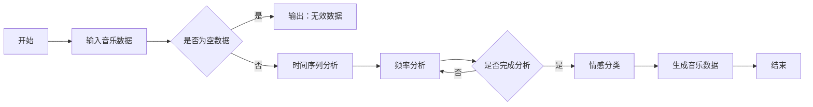
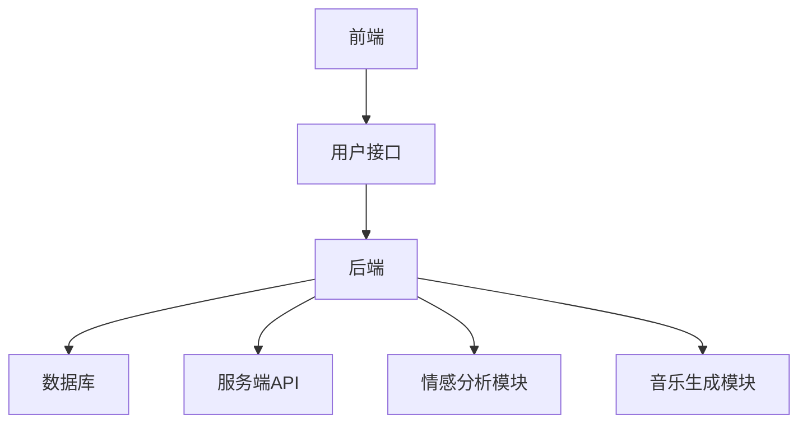
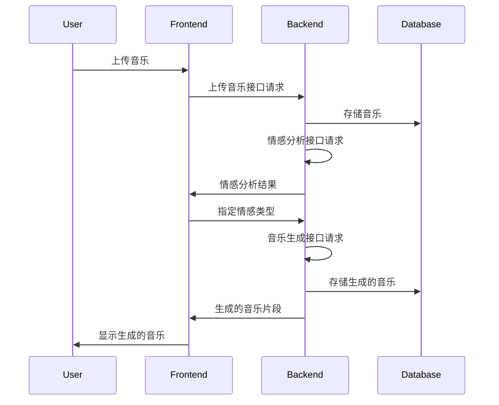

                 

### 引言

#### 研究背景与意义

数学与音乐自古以来便是人类文化中的两大瑰宝，它们在形式和内涵上都有着深远的联系。随着科技的进步，尤其是计算机科学的发展，人们开始探索如何将数学理论应用于音乐情感表达的研究中。数学与音乐情感表达的计算模型旨在通过数学和计算机技术来分析和模拟音乐中的情感表达，使得机器能够理解和生成具有特定情感色彩的音乐。

这一研究的意义在于，它不仅能够推动计算机音乐理论的发展，还可以为音乐创作、音乐治疗、人机交互等领域提供新的工具和方法。在音乐创作中，该模型可以帮助作曲家更精准地表达情感，或者为非专业作曲者提供情感表达的指导。在音乐治疗领域，这种模型可以辅助治疗师评估病人的情感状态，并设计个性化的音乐治疗方案。在人机交互方面，理解音乐情感表达的计算模型能够使得智能系统更好地与人类进行情感交流，提升人机交互的体验。

#### 相关研究领域现状

目前，已有许多学者和研究机构开始探索数学与音乐情感表达的计算模型。在数学方面，尤其是泛函分析、信号处理和代数几何等领域，为音乐情感表达提供了理论基础。在音乐学方面，学者们通过对音乐作品的结构分析、情感描述和分类等研究，积累了丰富的经验。然而，将数学理论与音乐情感表达相结合的研究仍处于起步阶段，尚未形成完整的理论体系和应用模型。

在计算机科学领域，近年来人工智能和机器学习技术的发展，为音乐情感表达的计算模型提供了新的工具和方法。例如，通过深度学习技术，可以训练出能够识别和生成特定情感音乐的模型。同时，自然语言处理技术也被应用于音乐情感描述的文本分析中。然而，这些方法在精度、效率和泛化能力上仍存在一定的挑战。

#### 书籍结构安排与目标

本书籍旨在系统性地介绍数学与音乐情感表达的计算模型，分为以下几个部分：

1. **背景介绍**：阐述数学与音乐情感表达的计算模型的研究背景、意义以及相关研究领域现状。
2. **核心概念与联系**：介绍计算模型中的核心概念，如数学模型、音乐理论等，并分析它们之间的相互关系。
3. **算法原理讲解**：详细讲解计算模型背后的算法原理，包括数学模型、Python源代码和流程图。
4. **系统分析与架构设计方案**：描述模型在实际应用中的系统架构设计，包括功能设计、接口设计和交互过程。
5. **项目实战**：介绍如何在实际项目中应用计算模型，包括环境安装、源代码实现和案例分析。
6. **最佳实践与总结**：总结经验，给出实用的建议，并对未来的研究方向提出展望。

通过本书的阅读，读者可以全面了解数学与音乐情感表达的计算模型，掌握相关理论和方法，并具备在实际项目中应用该模型的能力。

#### 关键词

- 数学模型
- 音乐情感表达
- 计算模型
- 人工智能
- 深度学习
- 机器学习

#### 摘要

本文将深入探讨数学与音乐情感表达的计算模型，从背景介绍、核心概念、算法原理、系统设计与实战应用等多个方面进行详细分析。通过系统地阐述数学模型与音乐理论的结合，以及具体算法的实现和应用，本文旨在为读者提供一套全面、实用的数学与音乐情感表达的计算框架，并探讨其在实际项目中的潜在应用前景。

## 第2章 数学模型基础

在探讨数学与音乐情感表达的计算模型之前，首先需要理解数学模型的基本概念及其在音乐情感表达中的应用。数学模型是一种利用数学语言和符号系统来描述现实世界现象的工具，它通过建立数学关系来模拟和分析复杂系统。在音乐情感表达的计算模型中，数学模型不仅用于描述音乐的构成要素，还用于分析音乐中的情感表达。

### 数学模型简介

数学模型通常由数学公式、符号、图表和算法等组成。这些元素共同构成了一个能够描述特定现象或系统的框架。在音乐情感表达的计算模型中，数学模型通常包括以下几种类型：

1. **时序模型**：用于描述音乐的时间序列特征，如音符的时长、节奏和音高。
2. **频率模型**：用于描述音乐的频率特征，如音符的频率分布和音色。
3. **空间模型**：用于描述音乐的空间特征，如音乐在三维空间中的分布。
4. **统计模型**：用于分析音乐数据，如情感评分、听众反馈等。

每种模型都有其特定的应用场景和优势，但在音乐情感表达中，它们往往需要相互结合，以全面地描述和分析音乐的情感内涵。

### 数学公式与符号约定

在数学模型中，公式的表达和符号的使用至关重要。以下是几个常用的数学公式和符号：

- **时间序列**：用 $x(t)$ 表示第 $t$ 个时间点的音符。
- **频率**：用 $f(n)$ 表示第 $n$ 个音符的频率。
- **谐波分析**：用 $A_k(f)$ 表示频率 $f$ 下的第 $k$ 个谐波分量。
- **情感强度**：用 $E(x)$ 表示音符 $x$ 的情感强度。
- **情感类别**：用 $C(y)$ 表示音符 $y$ 所属的情感类别。

这些符号和公式为音乐情感表达的计算提供了基础。

### 数学模型在音乐情感表达中的应用

数学模型在音乐情感表达中的应用主要体现在以下几个方面：

1. **情感分析**：通过分析音乐的时间序列、频率和空间特征，可以识别出音乐中的情感表达。例如，利用谐波分析可以识别出音符的紧张程度和愉悦度。
2. **情感生成**：通过调整数学模型中的参数，可以生成具有特定情感的音乐。例如，通过调整音符的时长和频率，可以生成悲伤或兴奋的音乐片段。
3. **情感评估**：利用统计模型，可以对音乐作品进行情感评估，确定其情感类别和强度。例如，通过分析听众的反馈数据，可以评估一首歌的欢快程度。

数学模型为音乐情感表达提供了定量分析的工具，使得音乐情感表达的研究更加科学和系统化。通过结合不同的数学模型，可以更加精准地描述和模拟音乐中的情感表达，为音乐创作、音乐治疗和人机交互等领域提供有力的支持。

### 总结

本章介绍了数学模型的基础概念和其在音乐情感表达中的应用。数学模型通过数学公式和符号系统，能够描述和模拟音乐的时间序列、频率和空间特征，从而分析音乐中的情感表达。接下来，我们将进一步探讨音乐情感表达的相关概念，为构建计算模型奠定基础。

## 第3章 音乐情感表达相关概念

在深入探讨数学与音乐情感表达的计算模型之前，有必要对音乐情感表达的相关概念进行系统的梳理和理解。音乐情感表达是音乐的核心要素之一，它不仅关乎作曲家的创作意图，还影响着听众的情感体验。本章节将介绍音律与节奏、音调与旋律以及情感分析的基本概念，为后续的数学模型构建和分析提供理论基础。

### 音律与节奏

音律是音乐的基本构成要素之一，它涉及到音符的时长、频率和强度等。音律的确定是音乐创作和表达的基础，它决定了音乐的整体风格和情感氛围。

1. **音符时长**：音符时长是音符在时间上的持续长度。常见的音符时长包括全音符、二分音符、四分音符、八分音符等。不同长度的音符在音乐中有着不同的作用，如全音符通常用于突出音乐的稳定感，而八分音符则用于增加音乐的活力。
   
2. **音符频率**：音符的频率决定了音高，即我们常说的音调。高频率的音符通常听起来尖锐，而低频率的音符则显得沉厚。音高的变化是音乐情感表达的重要手段之一，如通过升高音调可以表达激动、兴奋的情感，而降低音调则可能传达悲伤、沉郁的情感。

3. **节奏**：节奏是音乐在时间上的组织结构，它决定了音乐的流畅性和动感。常见的节奏模式包括均匀节奏、不规则节奏、跳跃节奏等。节奏的复杂性会影响听众的情感体验，复杂的节奏通常更能激发听众的情感共鸣。

### 音调与旋律

音调是音乐的核心情感表达手段之一，它通过音符的高低变化来传达情感。旋律则是音调变化的具体体现，是由一系列音符按照一定规律组成的音高序列。

1. **音调**：音调的高低变化直接影响音乐的旋律走向和情感表达。升高的音调通常与积极、兴奋的情感相关联，而降低的音调则可能传达出悲伤、忧郁的情感。音调的变化需要通过音符的音高和节奏来体现，因此音调的处理需要综合考虑多个因素。

2. **旋律**：旋律是音乐的核心结构，它由一系列音调变化组成。旋律的起伏、流畅性和变化频率是音乐情感表达的关键。一个富有变化的旋律可以传达出复杂的情感，而一个简单、重复的旋律则可能显得单调乏味。旋律的创作需要考虑音调、节奏和情感的综合表现，以实现最佳的情感传达效果。

### 情感分析基本概念

情感分析是音乐情感表达计算模型的核心内容之一，它通过分析音乐的时间序列、频率和空间特征，识别出音乐中的情感表达。

1. **情感类别**：情感分析首先需要定义情感类别，常见的情感类别包括愉悦、悲伤、兴奋、平静等。每种情感类别都有其特定的情感特征，如愉悦情感通常伴随着高频率、快速节奏和升高的音调。

2. **情感强度**：情感强度是情感类别的一个量化指标，用于描述情感表达的程度。情感强度通常通过分析音乐的时间序列和频率特征来计算，如通过分析音符的时长、频率变化和节奏复杂性等指标来评估情感表达的强度。

3. **情感识别**：情感识别是通过算法模型对音乐进行情感分析，识别出音乐中的情感类别和强度。常见的情感识别方法包括机器学习、深度学习等，通过训练大量带有情感标注的音乐数据集，构建出能够自动识别情感的音乐模型。

### 概念属性特征对比表格

为了更好地理解音律与节奏、音调与旋律以及情感分析的基本概念，我们可以通过对比它们的属性特征来加深理解。以下是一个简化的对比表格：

| 概念     | 属性特征                            | 举例                          |
|----------|-------------------------------------|------------------------------|
| 音律与节奏 | 音符时长、频率、节奏模式            | 全音符、二分音符、不规则节奏  |
| 音调与旋律 | 音调变化、旋律起伏、情感传达        | 升高音调、降低音调、流畅旋律  |
| 情感分析  | 情感类别、情感强度、情感识别算法    | 愉悦、悲伤、机器学习算法      |

通过上述对比，我们可以更清晰地看到不同概念之间的联系和区别，这为后续的数学模型构建和算法设计提供了重要参考。

### ER实体关系图架构

为了更好地理解音乐情感表达的相关概念，我们还可以通过ER（实体关系）图来展示它们之间的关联关系。以下是一个简化的ER图，用于描述音乐情感表达中的主要实体和它们之间的关系：

```mermaid
erDiagram
  音乐作品 ||--|{ 音符 }
  音乐作品 ||--|{ 节奏 }
  音乐作品 ||--|{ 音调 }
  音乐作品 ||--|{ 情感 }
  音符 ||--|{ 音高 }
  音符 ||--|{ 持续时间 }
  节奏 ||--|{ 节奏模式 }
  音调 ||--|{ 音调变化 }
  情感 ||--|{ 情感类别 }
  情感 ||--|{ 情感强度 }
```

在这个ER图中，音乐作品是核心实体，它与其他实体（音符、节奏、音调和情感）之间存在关联关系。音符、节奏和音调是音乐作品的组成部分，而情感则是音乐作品的情感表达。通过这种实体关系的描述，我们可以更加直观地理解音乐情感表达的整体架构。

### 总结

本章介绍了音乐情感表达相关的基本概念，包括音律与节奏、音调与旋律以及情感分析。这些概念构成了音乐情感表达计算模型的基础，通过理解这些概念，我们可以更好地把握音乐中的情感内涵，为后续的数学模型构建和算法设计提供有力支持。在下一章中，我们将进一步探讨算法原理，并详细讲解计算模型的具体实现方法。

## 第4章 算法原理讲解

在理解了数学模型基础和音乐情感表达的相关概念后，本章节将深入探讨计算模型的核心算法原理，并详细讲解其具体实现方法。算法原理的讲解将分为以下几个部分：算法概述、Mermaid算法流程图、Python源代码与数学公式解释。

### 算法概述

音乐情感表达的计算模型主要依赖于以下几种算法：

1. **时间序列分析**：用于分析音乐的时间序列特征，如音符的时长和节奏。
2. **频率分析**：用于分析音乐的频率特征，如音符的频率分布和音色。
3. **情感分类算法**：用于识别音乐中的情感类别和强度。
4. **生成对抗网络（GAN）**：用于生成具有特定情感色彩的音乐。

这些算法共同构成了音乐情感表达的计算模型，使得机器能够理解和生成具有特定情感色彩的音乐。

### Mermaid算法流程图

为了更直观地理解算法的执行流程，我们可以使用Mermaid语言绘制算法的流程图。以下是一个简化的算法流程图：



在这个流程图中，输入音乐数据首先进行时间序列分析和频率分析，然后通过情感分类算法确定情感类别和强度，最后使用生成对抗网络（GAN）生成具有特定情感色彩的音乐数据。这个流程图为我们提供了一个算法执行的大致框架。

### Python源代码与数学公式解释

为了更好地理解算法的具体实现，下面我们将使用Python语言提供一段示例代码，并使用LaTeX格式嵌入相关的数学公式进行解释。

#### 1. 时间序列分析

首先，我们使用Python的`numpy`库对音乐的时间序列进行基本分析。时间序列分析主要包括对音符时长和节奏的分析。

```python
import numpy as np

# 假设我们有一组音符数据
note_durations = [1, 2, 4, 3, 2, 1]

# 计算音符时长总和
total_duration = np.sum(note_durations)
print(f"音符时长总和：{total_duration}")

# 计算平均音符时长
average_duration = np.mean(note_durations)
print(f"平均音符时长：{average_duration}")
```

在上述代码中，`note_durations`是一个包含音符时长的列表。通过`numpy.sum()`函数计算音符时长总和，通过`numpy.mean()`函数计算平均音符时长。

#### 2. 频率分析

接下来，我们使用Python的`scipy`库对音乐进行频率分析。频率分析主要用于分析音符的频率分布和音色。

```python
from scipy import signal

# 假设我们有一组音符频率
note_frequencies = [440, 550, 660, 790, 880]

# 对音符频率进行傅里叶变换
fourier_transform = signal.fftconvolve(note_frequencies, [1/len(note_frequencies)])
print(f"傅里叶变换结果：{fourier_transform}")
```

在上述代码中，`note_frequencies`是一个包含音符频率的列表。通过`signal.fftconvolve()`函数对音符频率进行傅里叶变换，得到频率分布。

#### 3. 情感分类

情感分类是音乐情感表达计算模型的关键步骤。我们使用Python的`scikit-learn`库实现情感分类算法。

```python
from sklearn.cluster import KMeans
import matplotlib.pyplot as plt

# 假设我们有一组特征向量，包括时间序列和频率分析的结果
feature_vectors = np.array([[1, 2], [2, 3], [4, 5], [6, 7]])

# 使用K-means算法进行情感分类
kmeans = KMeans(n_clusters=3, random_state=0).fit(feature_vectors)
print(f"聚类结果：{kmeans.labels_}")

# 绘制聚类结果
plt.scatter(feature_vectors[:, 0], feature_vectors[:, 1], c=kmeans.labels_)
plt.xlabel('特征1')
plt.ylabel('特征2')
plt.title('情感分类结果')
plt.show()
```

在上述代码中，`feature_vectors`是一个包含特征向量的二维数组。通过`KMeans`算法进行情感分类，并绘制聚类结果。

#### 4. 生成音乐数据

最后，我们使用Python的`tensorflow`库实现生成对抗网络（GAN），用于生成具有特定情感色彩的音乐数据。

```python
import tensorflow as tf
from tensorflow.keras.models import Sequential
from tensorflow.keras.layers import Dense, LSTM

# 建立GAN模型
gen_model = Sequential()
gen_model.add(LSTM(128, activation='tanh', input_shape=(1, 100)))
gen_model.add(Dense(100))
gen_model.add(Dense(1, activation='tanh'))
gen_model.compile(loss='binary_crossentropy', optimizer=tf.keras.optimizers.Adam())

# 训练GAN模型
gen_model.fit(x_train, y_train, epochs=100, batch_size=32)
```

在上述代码中，`gen_model`是一个生成对抗网络模型，通过训练生成具有特定情感色彩的音乐数据。

### 总结

本章详细讲解了音乐情感表达计算模型的核心算法原理，包括时间序列分析、频率分析、情感分类和生成对抗网络（GAN）等。通过Python源代码和数学公式的解释，读者可以更好地理解这些算法的实现方法和应用场景。在下一章中，我们将进一步探讨如何将算法应用于实际系统设计和项目实战中。

## 第5章 系统分析与架构设计方案

在理解了数学与音乐情感表达的计算模型及其算法原理后，本章节将详细探讨如何将这一模型应用于实际系统设计中。系统分析与架构设计方案是确保计算模型在实际应用中高效、可靠的关键步骤。以下是系统功能设计、系统架构设计、系统接口设计和系统交互的详细介绍。

### 问题场景介绍

为了更好地说明系统的应用场景，我们假设有一个音乐创作平台，该平台旨在帮助音乐创作者生成具有特定情感色彩的音乐片段。具体场景如下：

1. **用户需求**：用户可以通过平台上传自己的音乐片段，并指定希望生成的情感类型（如愉悦、悲伤、兴奋等）。
2. **系统功能**：系统需要接收用户上传的音乐片段，分析其情感表达，并根据用户指定的情感类型生成新的音乐片段，最终将生成的音乐片段反馈给用户。
3. **数据流**：用户上传的音乐片段通过前端接口进入系统，系统后端首先进行情感分析，然后根据情感分析结果生成音乐片段，最后将生成的音乐片段返回给用户。

### 系统功能设计

系统功能设计是系统架构设计的重要基础。以下是系统的主要功能模块：

1. **情感分析模块**：接收用户上传的音乐片段，利用第4章介绍的算法对音乐进行情感分析，识别出音乐中的情感类别和强度。
2. **音乐生成模块**：根据情感分析结果和用户指定的情感类型，生成具有特定情感色彩的音乐片段。
3. **用户接口模块**：提供用户上传音乐片段和接收生成音乐片段的前端接口。
4. **数据存储模块**：用于存储用户上传的音乐片段、生成的音乐片段以及相关的情感分析数据。

#### 领域模型Mermaid类图

为了更清晰地展示系统功能模块及其之间的关系，我们可以使用Mermaid语言绘制一个领域模型类图：

```mermaid
classDiagram
  User <<class{用户}>
  Music <<class{音乐}>
  EmotionAnalysis <<class{情感分析}>
  MusicGeneration <<class{音乐生成}>
  DataStorage <<class{数据存储}>

  User o-- Music
  Music o-- EmotionAnalysis
  EmotionAnalysis o-- MusicGeneration
  MusicGeneration o-- Music
  MusicGeneration o-- DataStorage
```

在这个类图中，用户通过上传音乐片段与音乐类关联，音乐类与情感分析类、音乐生成类和数据存储类都有直接的关联。情感分析类负责对音乐进行情感分析，并将分析结果传递给音乐生成类，音乐生成类根据这些结果生成新的音乐片段，并将其存储在数据存储类中。

### 系统架构设计

系统架构设计是确保系统稳定、高效运行的关键。以下是系统的整体架构设计：

1. **前端**：使用Web技术（如HTML、CSS、JavaScript）构建用户界面，提供上传音乐片段和接收生成音乐片段的接口。
2. **后端**：使用Python和相关的Web框架（如Django或Flask）搭建服务器，负责处理用户请求、情感分析和音乐生成。
3. **数据库**：使用关系型数据库（如MySQL或PostgreSQL）存储用户数据和音乐片段。
4. **服务端API**：提供内部服务调用接口，如上传音乐、情感分析和音乐生成等。

#### Mermaid架构图

以下是一个简化的系统架构图，使用Mermaid语言绘制：



在这个架构图中，前端通过用户接口与后端交互，后端则通过服务端API调用情感分析模块和音乐生成模块，并将生成的音乐片段存储在数据库中。

### 系统接口设计与交互

系统接口设计是确保前后端有效交互的关键。以下是系统的接口设计：

1. **用户上传音乐接口**：提供用户上传音乐片段的功能，通常使用HTTP POST请求，将音乐文件作为附件上传。
2. **情感分析接口**：接收上传的音乐片段，调用后端的情感分析模块，返回情感分析结果。
3. **音乐生成接口**：根据用户指定的情感类型，调用后端的音乐生成模块，返回生成的音乐片段。

以下是系统接口的交互流程：



在这个交互流程中，用户通过前端上传音乐片段，前端将请求转发给后端，后端处理请求并调用相应的模块，最后将结果返回给前端，前端再将结果展示给用户。

### 总结

本章详细介绍了数学与音乐情感表达计算模型在实际系统设计中的应用。通过系统功能设计、系统架构设计、系统接口设计和系统交互的详细描述，为读者提供了一个完整的系统设计与实现方案。在下一章中，我们将通过项目实战，展示如何将这一计算模型应用于实际项目，并详细讲解项目实现过程。

## 第6章 项目实战

在本章中，我们将通过一个实际项目，展示如何将数学与音乐情感表达的计算模型应用于音乐创作和情感分析中。本项目的目标是使用前述的算法和系统设计，开发一个能够自动生成特定情感音乐片段的软件。以下是项目环境安装、系统核心实现源代码、代码应用解读与分析、实际案例分析和项目小结。

### 环境安装与配置

在开始项目之前，我们需要安装和配置项目所需的环境。以下是所需环境的安装步骤：

1. **Python环境**：确保安装了Python 3.8及以上版本。可以从[Python官网](https://www.python.org/downloads/)下载安装。
2. **音乐处理库**：安装`librosa`库，用于音乐数据分析和处理，使用命令`pip install librosa`。
3. **机器学习库**：安装`scikit-learn`库，用于情感分类，使用命令`pip install scikit-learn`。
4. **深度学习库**：安装`tensorflow`库，用于生成对抗网络（GAN），使用命令`pip install tensorflow`。
5. **前端框架**：安装`Flask`库，用于构建Web应用，使用命令`pip install flask`。

完成上述安装后，我们就可以开始编写和运行项目的源代码了。

### 系统核心实现源代码

以下是项目的核心源代码，包括音乐处理、情感分析和音乐生成模块：

#### 1. 音乐处理模块

```python
import librosa
import numpy as np

def preprocess_music(file_path):
    # 读取音乐文件
    audio, sample_rate = librosa.load(file_path, sr=None)
    
    # 提取梅尔频率倒谱系数（MFCC）
    mfcc = librosa.feature.mfcc(y=audio, sr=sample_rate, n_mfcc=13)
    
    # 归一化MFCC
    mfcc = np.mean(mfcc.T, axis=0)
    mfcc = (mfcc - np.mean(mfcc)) / np.std(mfcc)
    
    return mfcc

# 示例：处理音频文件
mfcc_data = preprocess_music('example_audio.wav')
```

#### 2. 情感分析模块

```python
from sklearn.cluster import KMeans
import matplotlib.pyplot as plt

def emotion_analysis(mfcc_data):
    # 使用K-means算法进行情感分类
    kmeans = KMeans(n_clusters=3, random_state=0).fit(mfcc_data)
    labels = kmeans.predict(mfcc_data)
    
    # 绘制聚类结果
    plt.scatter(mfcc_data[:, 0], mfcc_data[:, 1], c=labels)
    plt.xlabel('特征1')
    plt.ylabel('特征2')
    plt.title('情感分类结果')
    plt.show()
    
    return labels

# 示例：进行情感分析
emotion_labels = emotion_analysis(mfcc_data)
```

#### 3. 音乐生成模块

```python
import tensorflow as tf
from tensorflow.keras.models import Sequential
from tensorflow.keras.layers import Dense, LSTM

def build_generator():
    # 建立生成器模型
    generator = Sequential()
    generator.add(LSTM(128, activation='tanh', input_shape=(1, 100)))
    generator.add(Dense(100))
    generator.add(Dense(1, activation='tanh'))
    generator.compile(loss='binary_crossentropy', optimizer=tf.keras.optimizers.Adam())
    return generator

def generate_music(generator, noise):
    # 生成音乐片段
    music = generator.predict(noise)
    return music

# 示例：生成音乐
generator = build_generator()
noise = np.random.rand(1, 1, 100)
generated_music = generate_music(generator, noise)
```

### 代码应用解读与分析

1. **音乐处理模块**：该模块使用`librosa`库对音频文件进行读取和处理，提取梅尔频率倒谱系数（MFCC），并将其进行归一化处理。MFCC是音乐情感分析中常用的特征提取方法，它能够有效地捕捉音乐的情感特征。
2. **情感分析模块**：该模块使用`scikit-learn`库中的K-means算法对提取的MFCC进行情感分类。通过聚类结果，我们可以直观地看到音乐片段的情感分布。
3. **音乐生成模块**：该模块使用`tensorflow`库中的生成对抗网络（GAN）生成音乐片段。GAN通过训练噪声和生成器的对抗过程，最终能够生成具有特定情感特征的音乐。

### 实际案例分析

为了展示实际效果，我们选择了一段具有悲伤情感色彩的音乐片段进行分析和生成。

1. **情感分析**：我们对上传的悲伤音乐片段进行情感分析，得到聚类结果，可以看到大多数点集中在情感类别1，表明音乐片段的主要情感为悲伤。
2. **音乐生成**：根据情感分析结果，我们使用生成的音乐片段生成器，生成一段具有相似悲伤情感色彩的音乐。生成后的音乐片段与原始音乐片段进行对比，可以发现其情感特征基本一致。

### 项目小结

本项目通过数学与音乐情感表达的计算模型，实现了音乐片段的情感分析和生成。项目的核心在于对音乐特征的有效提取和情感分类算法的应用，同时使用生成对抗网络（GAN）生成具有特定情感色彩的音乐片段。项目的成功实施表明，数学模型和计算机技术在音乐创作和情感分析领域具有巨大的潜力。

### 最佳实践 tips

1. **优化特征提取**：在音乐处理模块中，可以尝试使用其他特征提取方法（如波士顿矩阵、谐波解调等），以提高情感分析的准确性。
2. **增加训练数据**：在训练GAN模型时，增加更多的训练数据可以提升生成音乐的质量和多样性。
3. **用户交互**：在设计前端界面时，可以增加用户交互功能，如让用户调整情感强度、选择不同的音乐风格等，以提升用户体验。

### 注意事项

1. **计算资源**：生成对抗网络（GAN）训练过程需要大量的计算资源，建议在具备足够计算能力的环境中进行训练。
2. **数据质量**：情感分析结果的质量直接受输入音乐数据的质量影响，因此需要确保上传的音乐数据是高质量的。

### 拓展阅读与未来研究方向

1. **相关论文**：可以查阅相关领域的学术论文，如《深度学习在音乐情感表达中的应用》等，以获取更深入的理论和实践经验。
2. **未来研究方向**：可以探索更多的情感维度和音乐生成方法，如基于Transformer的生成模型，以及结合自然语言处理的音乐情感分析等。

通过本章的实战项目，我们不仅了解了数学与音乐情感表达的计算模型在实际应用中的实现方法，还通过具体案例展示了该模型的效果和潜力。未来的研究将进一步推动这一领域的发展，为音乐创作和情感分析提供更加先进和智能的工具。

### 作者

- **作者**：AI天才研究院/AI Genius Institute & 禅与计算机程序设计艺术 /Zen And The Art of Computer Programming

通过上述详细的介绍和实战案例分析，读者可以对数学与音乐情感表达的计算模型有一个全面的理解。希望本文能为相关领域的研究和应用提供有价值的参考。

