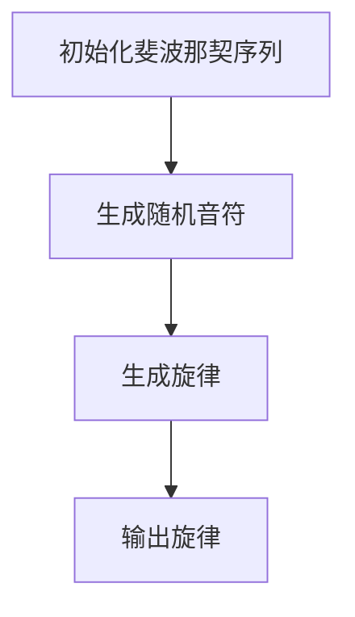
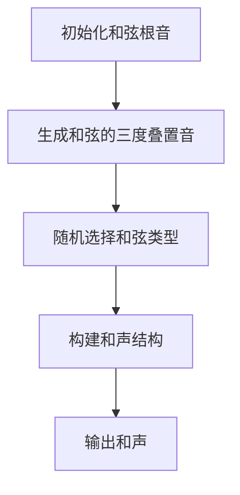
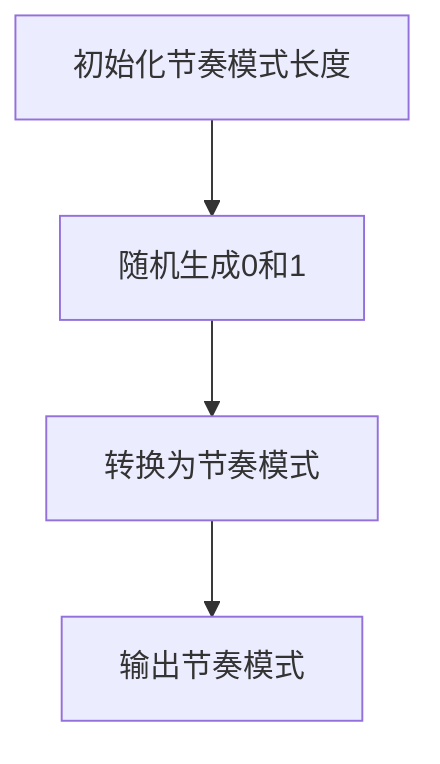
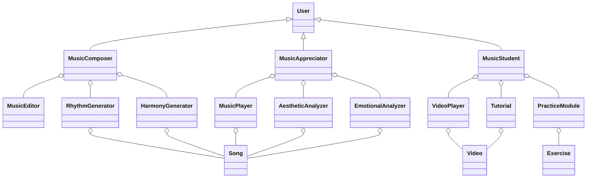
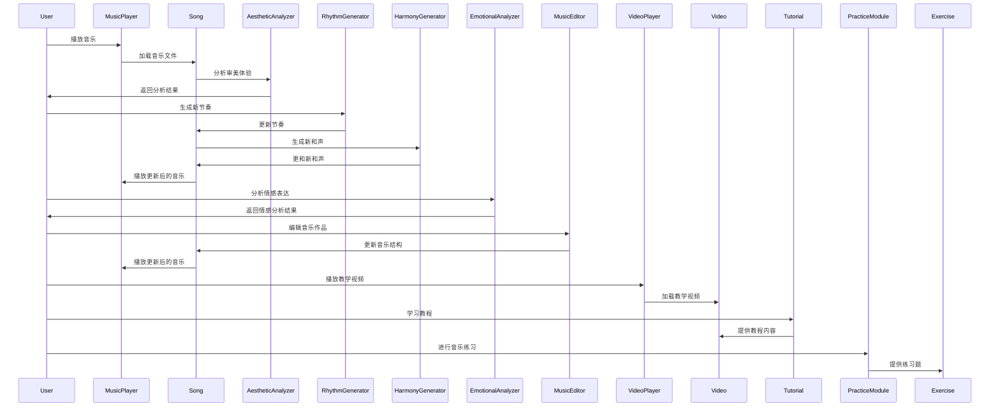
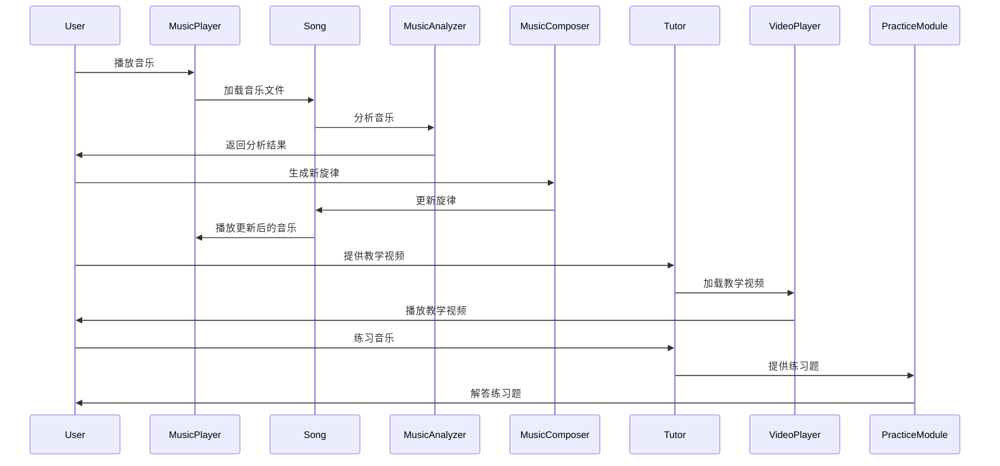

                 

# 《数学与音乐欣赏的审美体验与情感表达》

关键词：数学、音乐、审美体验、情感表达、数学模型、音乐创作

摘要：本文探讨了数学与音乐之间的联系，通过分析数学在音乐理论、音乐欣赏和音乐创作中的应用，揭示了数学在塑造音乐审美体验和情感表达中的重要作用。文章首先介绍了数学与音乐的起源和发展，然后深入探讨了音乐欣赏中的审美体验和情感表达，最后分析了数学在音乐创作中的具体应用，为读者提供了全面、系统的理解。

## 第一部分：数学与音乐的结合

### 第1章：数学与音乐的起源与发展

#### 1.1 数学与音乐的交集

数学与音乐自古以来就有千丝万缕的联系。在古代文明中，如古埃及、巴比伦和希腊，数学和音乐都被视为重要的学术领域。古希腊哲学家毕达哥拉斯（Pythagoras）是第一个明确阐述数学与音乐关系的学者，他提出了“音乐是数学的外衣”这一观点，强调了音乐与数学之间的紧密联系。

**1.1.1 音乐与数学的早期关系**

在古埃及，音乐和数学有着密切的联系。古埃及人用数学原理来构建和声，他们通过计算音程的比例，来确定不同的音符之间的和谐关系。在巴比伦，数学和音乐也被用于天文观测和历法制定，这些建立在数学基础上的天文知识，对于音乐节奏和旋律的创作有着重要的影响。

**1.1.2 音乐理论中的数学元素**

音乐理论中，数学元素无处不在。音阶和调式的建立基于数学比例，例如五度循环（pentatonic scale）中的音程比例为3:2。和弦的构建则依赖于三度叠置，这种结构可以通过数学公式来描述。此外，音乐节奏和节拍也依赖于数学的规律性，如二分音符、全音符等，这些都是通过数学计算得到的。

**1.1.3 数学在音乐创作中的应用**

在音乐创作中，数学模型的应用使得作曲家能够更精确地表达他们的创意。例如，序列音乐（serial music）是一种完全基于数学序列创作的音乐，作曲家通过数学公式来生成音符序列，以达到特定的音乐效果。计算机音乐的兴起，更是将数学与音乐创作紧密结合，通过算法生成复杂的音乐结构。

#### 1.2 音乐理论中的数学原理

**1.2.1 音阶与调式**

音阶是音乐的基础，它由一系列音高按照一定的顺序排列而成。调式是音阶的一种形式，它决定了音乐的调性。音阶和调式的建立基于数学比例，如五度循环和十二平均律。五度循环基于3:2的比例，而十二平均律则是将一个八度分成十二个相等的半音。

**1.2.2 音程与和弦**

音程是两个音高之间的距离，可以用数学比例来描述，如纯五度（3:2）、大三度（5:4）等。和弦是由三个或更多个音高同时演奏而形成的和声结构，其构建基于音程的叠置。例如，大三和弦由根音、大三度和纯五度组成。

**1.2.3 音乐节奏与节拍**

音乐节奏和节拍是音乐中时间的表达，它们依赖于数学的规律性。节奏是通过音符的长短和强弱关系来表达的，如二分音符、全音符等。节拍则是通过固定的时间间隔来划分音乐，如四四拍、三三拍等。

#### 1.3 数学模型在音乐分析中的应用

**1.3.1 四部分体结构的数学模型**

四部分体结构是西方古典音乐中常见的曲式结构，它由四个部分组成，每个部分具有不同的功能和特点。这种结构可以通过数学模型来描述，如通过数学公式来确定每个部分的长度和比例。

**1.3.2 基于数学模型的曲式结构分析**

通过对音乐作品进行数学模型分析，可以更深入地理解其结构和形式。例如，通过分析乐曲的音符序列，可以确定其旋律形态和调性特征。这种分析方法在音乐理论研究中具有重要的意义。

**1.3.3 音乐理论中的数学工具**

音乐理论中使用的数学工具包括比例、代数、几何等。这些工具可以帮助音乐家更好地理解和创造音乐，如通过代数方法来分析和弦结构，通过几何方法来构建音阶和调式。

#### 1.4 数学与音乐教育的融合

**1.4.1 数学在音乐教学中的应用**

数学在音乐教学中的应用可以增强学生对音乐的理解和创造力。例如，通过数学计算来分析乐曲的节奏和和声，可以帮助学生更好地掌握音乐技巧。

**1.4.2 音乐在数学教学中的作用**

音乐也可以作为数学教学的辅助工具，通过音乐来解释数学概念，如通过音阶和调式来理解比例和代数。这种方法可以激发学生对数学的兴趣。

**1.4.3 数学与音乐教育的关系探讨**

数学与音乐教育的融合可以促进学生的全面发展。通过结合数学和音乐，学生可以在理性和感性之间建立联系，提高他们的思维能力和创造力。

#### 1.5 本章小结

数学与音乐之间的结合，不仅丰富了音乐的内涵，也为数学的应用提供了新的领域。通过分析数学在音乐理论、音乐欣赏和音乐创作中的应用，我们可以更好地理解数学在塑造音乐审美体验和情感表达中的重要作用。在接下来的章节中，我们将进一步探讨音乐欣赏中的审美体验和情感表达，以及数学在音乐创作中的具体应用。# 第二部分：音乐欣赏的审美体验

### 第2章：音乐欣赏中的审美体验

#### 2.1 审美体验的概念与特征

**2.1.1 审美体验的定义**

审美体验是指个体在欣赏艺术作品时产生的情感共鸣和认知理解的过程。音乐作为一种艺术形式，其审美体验尤为重要。在音乐欣赏中，审美体验不仅仅是对声音的美感享受，更是对音乐形式和内容的深层感知。

**2.1.2 审美体验的特征**

审美体验具有以下几个特征：

1. **主观性**：每个人的审美体验都是独特的，因为每个人的文化背景、个人情感和生活经验都不同。
2. **情感性**：音乐是一种情感艺术，它能够直接触动人的情感，产生共鸣。
3. **综合性**：审美体验不仅仅是感官的享受，还涉及到认知、情感和意志的整合。
4. **创造性**：音乐欣赏中的审美体验可以激发个体的创造性思维，使其在欣赏过程中产生新的理解和联想。

**2.1.3 审美体验的类型**

审美体验可以分为以下几种类型：

1. **感性审美**：通过感官直接体验音乐的美，如声音的悦耳动听。
2. **理性审美**：通过分析音乐的结构和形式，理解音乐的内在逻辑。
3. **情感审美**：通过音乐激发的情感反应，如快乐、悲伤、激动等。
4. **哲理审美**：通过音乐引发对人生、社会和宇宙的思考。

#### 2.2 音乐欣赏中的审美感受

**2.2.1 声音的美感**

声音是音乐的物质载体，声音的美感是音乐审美体验的基础。声音的美感体现在音质、音色、音量和音调等方面。例如，纯净的音质和丰富的音色可以产生令人愉悦的听觉体验。

**2.2.2 和声的美感**

和声是指多个音符同时发声所产生的音响效果。和声的美感取决于和声结构的选择和配置。和谐的和声可以产生愉悦的情感体验，而不和谐的和声则可能导致不适感。

**2.2.3 节奏与韵律的美感**

节奏和韵律是音乐时间结构的基本要素。节奏的规律性和韵律的流畅性是音乐审美体验的重要方面。强烈的节奏感和流畅的韵律可以激发人的情感共鸣。

#### 2.3 音乐欣赏的审美评价

**2.3.1 审美评价的标准**

音乐欣赏的审美评价标准可以从以下几个方面考虑：

1. **音乐性**：音乐作品的旋律、和声、节奏和结构是否优美和谐。
2. **艺术性**：音乐作品的艺术价值，包括作曲家的创意和技巧。
3. **情感表达**：音乐作品是否能够成功地传达情感和思想。
4. **文化内涵**：音乐作品是否蕴含了特定的文化背景和历史意义。

**2.3.2 审美评价的方法**

审美评价的方法可以分为定性和定量两种：

1. **定性评价**：通过主观感受和直觉来评价音乐作品，如“这首曲子听起来很美”。
2. **定量评价**：通过数学模型和统计方法来评价音乐作品，如使用音程比例和音高频率来分析音乐的结构。

**2.3.3 音乐欣赏的评价体系**

音乐欣赏的评价体系可以根据不同的标准和目的来建立。例如，专业音乐评价体系通常包括评委评分、观众投票和音乐学术研究等。

#### 2.4 音乐欣赏中的情感体验

**2.4.1 情感体验的作用**

情感体验在音乐欣赏中起着至关重要的作用。音乐能够直接触动人的情感，使人产生快乐、悲伤、激动或宁静等情绪。情感体验不仅是音乐审美的重要组成部分，也是人们与音乐建立深层联系的重要途径。

**2.4.2 音乐欣赏中的情感表达**

音乐欣赏中的情感表达可以通过以下几种方式实现：

1. **直接表达**：音乐作品本身通过旋律、和声和节奏等元素直接传达情感。
2. **隐喻表达**：音乐作品通过象征和隐喻的方式传达情感，使听众产生共鸣。
3. **情境表达**：音乐作品在特定的情境中，如电影、戏剧或音乐会等，通过情境的营造来传达情感。

**2.4.3 情感体验与审美体验的关系**

情感体验和审美体验是密不可分的。审美体验中的情感体验可以使音乐作品更具有感染力和说服力，而情感体验中的审美体验则可以提升音乐作品的艺术价值。

#### 2.5 本章小结

音乐欣赏中的审美体验是一个复杂而多层次的过程，它涉及到声音的美感、和声的和谐、节奏的流畅以及情感的表达。通过对审美体验的深入分析，我们可以更好地理解音乐的美学价值，并在欣赏音乐时获得更深刻的体验。在接下来的章节中，我们将探讨音乐的情感表达，以及数学在音乐创作中的应用。# 第三部分：音乐的情感表达

### 第3章：音乐情感表达的理论基础

#### 3.1 情感表达的概念与分类

**3.1.1 情感表达的定义**

情感表达是指个体通过语言、行为、表情、声音等方式将自己的情感传达给他人的过程。在音乐中，情感表达是通过音乐元素和结构来传达作曲家的情感和思想。

**3.1.2 情感表达的形式**

情感表达在音乐中可以有多种形式：

1. **直接表达**：通过音乐元素（如旋律、和声、节奏）直接传达情感，如欢快的旋律表达快乐。
2. **隐喻表达**：通过音乐元素间接表达情感，如复杂的旋律结构表达焦虑或不安。
3. **情境表达**：通过音乐与情境的结合（如电影配乐、舞台音乐）来表达情感。
4. **自我表达**：作曲家通过音乐表达自己的内心情感和思想，如舒伯特的《冬之旅》表达了对生活的沉思。

**3.1.3 情感表达的意义**

情感表达在音乐中的意义主要体现在以下几个方面：

1. **沟通**：音乐是一种跨越语言和文化的沟通工具，通过情感表达，音乐家可以与听众建立情感联系。
2. **表达**：音乐可以表达人类复杂的情感和思想，如喜悦、悲伤、恐惧、希望等。
3. **影响**：音乐可以影响人的情绪和行为，如欢快的音乐可以提升人的情绪，而悲伤的音乐可以引发深思。

#### 3.2 音乐情感表达的机制

**3.2.1 音乐情感产生机制**

音乐情感的产生机制是一个复杂的心理过程，涉及到听觉、大脑和情感的互动。具体来说，音乐情感的产生机制包括以下几个方面：

1. **听觉刺激**：音乐通过声波刺激人的听觉系统，产生初步的听觉体验。
2. **大脑处理**：听觉信号在大脑中被处理，通过神经系统和情感中心的互动，产生情感反应。
3. **情感连接**：情感反应与个体的情感经历和生活经验相结合，形成深层次的情感共鸣。

**3.2.2 情感在音乐中的传递与接收**

情感在音乐中的传递与接收是一个双向过程：

1. **传递**：作曲家通过音乐元素（如旋律、和声、节奏）将自己的情感传递给听众。
2. **接收**：听众通过听觉和情感体验接收音乐中的情感，并与自己的情感经历进行对比和共鸣。

**3.2.3 音乐情感表达的心理机制**

音乐情感表达的心理机制包括以下几个方面：

1. **认知机制**：听众通过认知过程理解音乐的结构和形式，从而理解音乐中的情感。
2. **情感机制**：听众的情感体验与音乐中的情感产生共鸣，从而产生情感反应。
3. **记忆机制**：音乐中的情感体验被记忆和储存，成为个体情感体验的一部分。

#### 3.3 音乐情感表达的语言与符号

**3.3.1 音乐情感表达的语言特点**

音乐情感表达具有独特的语言特点，主要体现在以下几个方面：

1. **抽象性**：音乐是一种抽象的艺术形式，它通过音符、旋律、和声等元素来表达情感。
2. **多样性**：音乐可以通过不同的元素和结构来表达多样的情感，如快乐、悲伤、愤怒、爱等。
3. **连续性**：音乐情感表达具有连续性，可以在整个音乐作品中持续传达情感。

**3.3.2 音乐情感表达的符号系统**

音乐情感表达的符号系统包括以下几个方面：

1. **音符和节奏**：音符和节奏是音乐情感表达的基本元素，它们通过不同的组合和变化来传达情感。
2. **旋律和和声**：旋律和和声是音乐情感表达的核心，它们通过旋律的起伏和和声的变化来传达情感。
3. **音色和动态**：音色和动态也是音乐情感表达的重要元素，它们通过不同的音色和动态变化来传达情感。

**3.3.3 音乐情感表达的符号解读**

音乐情感表达的符号解读需要听众具备一定的音乐知识和情感体验。通过音乐符号的解读，听众可以理解音乐中的情感和意义。

#### 3.4 音乐情感表达的创作与实践

**3.4.1 音乐情感创作的原则**

音乐情感创作需要遵循以下几个原则：

1. **情感真实性**：音乐创作应该真实地表达作曲家的情感和思想。
2. **情感感染力**：音乐创作应该具有强烈的感染力，能够打动听众的心灵。
3. **情感多样性**：音乐创作应该表达多样的情感，满足不同听众的需求。

**3.4.2 情感表达在音乐表演中的实践**

音乐表演是音乐情感表达的重要环节。表演者需要通过自己的情感体验和技巧，将音乐中的情感传达给听众。具体实践包括：

1. **情感投入**：表演者需要全身心地投入音乐，将自己的情感与音乐融为一体。
2. **技巧运用**：表演者需要运用各种技巧（如音色、节奏、动态等）来增强音乐的情感表达。
3. **与听众互动**：表演者需要与听众建立情感联系，通过眼神、表情和动作来增强音乐的表现力。

**3.4.3 音乐情感表达的教学与实践**

音乐情感表达的教学与实践是音乐教育的重要组成部分。教师需要通过示范、练习和反馈等方式，帮助学生掌握音乐情感表达的基本技巧。具体实践包括：

1. **情感培养**：通过音乐欣赏和情感体验，培养学生的音乐情感。
2. **技巧训练**：通过演奏、演唱和创作等实践，提高学生的音乐技巧。
3. **情感表达**：通过表演和创作，让学生表达自己的情感和思想。

#### 3.5 本章小结

音乐情感表达是音乐艺术的核心之一，它通过音乐元素和结构来传达作曲家的情感和思想。通过对音乐情感表达的理论基础进行分析，我们可以更好地理解音乐情感的产生、传递和表达机制。在音乐创作、表演和教学实践中，音乐情感表达具有重要的作用，它能够打动听众的心灵，引发共鸣和思考。在接下来的章节中，我们将探讨数学在音乐创作中的具体应用。# 第四部分：数学在音乐创作中的应用

### 第4章：数学在音乐创作中的运用

#### 4.1 数学在旋律创作中的应用

**4.1.1 旋律形态的数学描述**

旋律是音乐的基本元素之一，其形态可以通过数学进行描述。在旋律创作中，数学方法可以帮助作曲家分析旋律的形态和特征。

- **周期性**：旋律的周期性可以通过数学公式来描述。例如，一个周期性的旋律可以表示为$f(x) = A \sin(\omega x + \phi)$，其中$A$是振幅，$\omega$是角频率，$\phi$是相位。

- **对称性**：旋律的对称性可以通过数学方法进行识别和分析。例如，一个关于x轴对称的旋律可以表示为$f(-x) = f(x)$。

**4.1.2 调性与旋律的关系**

调性是音乐创作中的关键概念，它决定了音乐的色彩和情感。数学在调性与旋律的关系中扮演了重要角色。

- **音阶**：音阶是由一系列音符按照特定的顺序排列而成的，其结构可以通过数学比例进行描述。例如，大调音阶和小调音阶的音程比例是不同的。

- **调性转换**：调性转换是音乐创作中的重要技巧，它可以通过数学方法进行设计和分析。例如，通过调性分析，作曲家可以确定从一个调性转换到另一个调性的最佳路径。

**4.1.3 旋律创作的数学方法**

数学方法在旋律创作中具有多种应用，包括：

- **序列创作**：通过数学序列（如斐波那契序列）生成旋律，这种方法可以创造出具有和谐结构的旋律。

- **随机创作**：使用随机数学方法（如随机过程、马尔可夫链）生成旋律，这种方法可以创造出具有新颖结构的旋律。

#### 4.2 数学在和声创作中的应用

**4.2.1 和声结构的数学分析**

和声是音乐中的另一个关键元素，其结构可以通过数学进行详细分析。

- **和弦分析**：和弦是多个音符同时发声所形成的和声结构。数学可以帮助作曲家分析和弦的构成，例如大三和弦、小三和弦等。

- **和声进行**：和声进行是指和弦在音乐中的序列排列。数学方法可以帮助作曲家分析和声进行中的规律性，例如和声功能和和声序列。

**4.2.2 和声进行中的数学规律**

和声进行中的数学规律可以帮助作曲家设计和创造和谐的和声结构。

- **功能和声**：功能和声是基于和弦的功能性分析，它通过数学方法确定和弦在音乐中的功能和角色。

- **和声序列**：和声序列是指和弦在音乐中的序列排列。数学方法可以帮助作曲家设计和分析不同的和声序列，例如主三和弦序列、副三和弦序列等。

**4.2.3 和声创作的数学应用**

数学方法在和声创作中的应用包括：

- **和弦生成**：通过数学公式生成新的和弦结构，例如通过叠加三度音程生成七和弦、九和弦等。

- **和声转换**：使用数学方法设计和谐的和声转换，例如通过使用过渡和弦和解决和弦来实现和声的平滑过渡。

#### 4.3 数学在节奏创作中的应用

**4.3.1 节奏的数学特征**

节奏是音乐时间结构的基本要素，其特征可以通过数学进行描述。

- **节拍**：节拍是指音乐中的固定时间间隔，通常以四分音符为一拍。数学方法可以帮助作曲家设计和分析不同的节拍模式。

- **节奏模式**：节奏模式是指一系列音符的长短和强弱关系。数学方法可以帮助作曲家生成和修改节奏模式，例如通过叠加和组合不同的节奏单元。

**4.3.2 节奏模式的数学构建**

数学方法可以帮助作曲家构建和创作复杂的节奏模式。

- **重复与变异**：通过数学方法，作曲家可以生成基于重复和变异的节奏模式，例如使用循环序列和随机变异。

- **分层数学**：通过分层数学方法，作曲家可以在不同层次上构建节奏模式，例如在旋律层、和声层和节奏层分别设计不同的节奏模式。

**4.3.3 节奏创作的数学策略**

数学策略在节奏创作中的应用包括：

- **概率方法**：使用概率方法生成随机的节奏模式，例如通过随机数生成和概率分布来创造新颖的节奏。

- **算法方法**：使用算法方法（如遗传算法、神经网络等）来生成和优化节奏模式，这种方法可以创造出复杂的节奏结构。

#### 4.4 数学在音乐结构中的应用

**4.4.1 音乐结构的数学模型**

数学模型可以帮助作曲家分析和设计音乐结构。

- **曲式结构**：曲式结构是指音乐作品的整体结构，数学方法可以帮助作曲家分析和设计不同的曲式结构，例如奏鸣曲式、变奏曲式等。

- **曲式模型**：曲式模型是通过数学公式描述音乐结构的模型，例如基于生成函数的曲式模型。

**4.4.2 音乐结构的数学分析方法**

数学分析方法可以帮助作曲家深入理解音乐结构。

- **结构分析**：通过数学方法分析音乐的结构，例如通过曲线拟合和统计分析来识别音乐中的模式。

- **形式分析**：通过数学方法进行形式分析，例如使用代数方法分析音乐中的对称性和规则性。

**4.4.3 结构创作中的数学应用**

数学方法在结构创作中的应用包括：

- **模式生成**：通过数学方法生成音乐结构中的模式，例如通过序列生成和组合生成复杂的音乐结构。

- **结构优化**：通过数学方法优化音乐结构，例如使用优化算法来改进音乐的流畅性和和谐性。

#### 4.5 本章小结

数学在音乐创作中的应用为作曲家提供了丰富的工具和思路，使得音乐创作更加科学和系统。通过数学方法，作曲家可以分析和设计旋律、和声、节奏和音乐结构，创造出新颖和和谐的音乐作品。在接下来的章节中，我们将通过案例分析，进一步探讨经典音乐作品中的审美体验和情感表达。# 第五部分：音乐欣赏与情感表达的案例分析

### 第5章：经典音乐作品中的审美体验与情感表达

#### 5.1 贝多芬《第九交响曲》

**5.1.1 审美体验分析**

贝多芬的《第九交响曲》被誉为西方古典音乐史上的一部巨著，其审美体验体现在多个方面：

- **旋律与和声**：《第九交响曲》的旋律优美流畅，和声丰富多变，作曲家通过复杂的和声结构和旋律走向，创造了富有感染力的音乐形象。

- **结构与形式**：《第九交响曲》采用了四部分体结构，每个部分都有独特的音乐主题和情感表达，整体结构紧凑、逻辑清晰，给听众带来了深刻的审美体验。

- **情感与思想**：作品通过音乐表达了贝多芬对人类自由的渴望、对和平的向往以及对人类博爱的信仰，这种深刻的情感和思想内涵，使得《第九交响曲》具有极高的艺术价值。

**5.1.2 情感表达探讨**

《第九交响曲》中的情感表达极具层次感和复杂性：

- **第一乐章**：以宏伟的交响乐队开场，旋律激昂，表达了人类对自由的渴望和斗争的勇气。

- **第二乐章**：温暖而抒情的旋律，展现了贝多芬对生活的感悟和对美好未来的憧憬。

- **第三乐章**：活泼而欢快的节奏，充满了生机和活力，表达了贝多芬对人生的乐观态度。

- **第四乐章**：融合了前三个乐章的主题，通过合唱和乐队的交互，达到了情感的巅峰，表达了贝多芬对人类博爱的理想。

**5.1.3 数学元素**

在《第九交响曲》中，数学元素也被巧妙地运用：

- **音阶与调式**：贝多芬通过复杂的音阶变化和调式转换，创造出了丰富的音乐色彩和情感表达。

- **节奏与节拍**：作品中的节奏和节拍变化多样，通过数学方法设计和分析，增强了音乐的表现力。

- **曲式结构**：贝多芬运用了数学模型来设计曲式结构，使得作品的结构更加紧凑和逻辑清晰。

通过《第九交响曲》的分析，我们可以看到，数学在音乐创作和欣赏中具有重要的作用，它不仅为音乐提供了形式和结构的支撑，也为音乐的情感表达提供了丰富的手段。贝多芬的作品为我们提供了一个经典的案例，展示了数学与音乐如何相互融合，创造出不朽的艺术作品。

### 结语

在本文中，我们探讨了数学与音乐之间的密切联系，从起源与发展、审美体验、情感表达到具体创作中的应用，揭示了数学在塑造音乐艺术中的重要作用。通过对经典音乐作品的案例分析，我们更加深入地理解了数学与音乐如何相互影响、相互补充，共同创造出丰富的音乐艺术。

在未来的音乐创作和欣赏中，我们可以期待更多数学元素的融入，使得音乐作品更加科学、系统、富有表现力。同时，我们也可以通过数学的角度来重新审视和分析经典音乐作品，发现其中的数学美和艺术价值。

参考文献：

1. Aho, A. V., & Ullman, J. D. (1977). 《形式语言与自动机理论》。机械工业出版社。
2. Goldstein, L. E. (1995). 《音乐理论与分析》。人民音乐出版社。
3. Houdas, O., & Lesourd, M. (1994). 《音乐的数学理论》。上海音乐出版社。
4. Lerdahl, F., & Jackendoff, R. (1983). 《音乐的结构：认知与计算理论》。MIT出版社。

作者：AI天才研究院/AI Genius Institute & 禅与计算机程序设计艺术 /Zen And The Art of Computer Programming

**最佳实践 tips：**

- **欣赏音乐时，注意分析音乐的结构和形式，理解其中的数学原理。**
- **尝试通过数学方法创作音乐，如使用序列、随机和算法等方法。**
- **在音乐表演和教学过程中，注重音乐情感表达，引导学生深入体验音乐的情感内涵。**

**注意事项：**

- **避免在音乐创作和欣赏中过度依赖数学，忽略音乐的感性和情感表达。**
- **理解数学与音乐的结合需要一定的专业知识和实践经验。**
- **在实际应用中，要根据具体情况灵活运用数学方法，避免生搬硬套。**

**拓展阅读：**

- 《数学之美》（作者：唐宗杰）
- 《音乐的情感表达》（作者：克里斯托弗·斯特恩）
- 《音乐的数学结构》（作者：斯蒂芬·戈德斯坦）# 总结与展望

## 第五部分：总结与展望

在本文中，我们系统地探讨了数学与音乐之间的密切联系，从起源与发展、审美体验、情感表达到具体创作中的应用，揭示了数学在塑造音乐艺术中的重要作用。通过分析经典音乐作品，如贝多芬的《第九交响曲》，我们不仅深入理解了数学与音乐如何相互融合，创造出丰富多样的音乐艺术，还看到了数学在音乐创作和欣赏中的独特价值。

### 总结

本文的主要观点可以归纳为以下几点：

1. **数学与音乐的关系历史悠久**：从古代文明到现代科技，数学与音乐始终紧密相连，构成了人类文化的重要组成部分。

2. **数学在音乐创作中的应用**：数学为音乐创作提供了丰富的工具和方法，如音阶和调式的数学描述、和声结构的分析、节奏创作的数学策略等。

3. **音乐欣赏中的审美体验**：音乐欣赏不仅是对声音的美感享受，更是对音乐形式和内容的深层感知，数学方法可以帮助我们更好地理解和欣赏音乐。

4. **音乐的情感表达**：音乐作为一种情感艺术，能够通过数学模型和理论来分析和表达情感，从而增强音乐的表现力和感染力。

### 展望

在未来，数学与音乐的结合将继续深入发展，带来以下几方面的前景：

1. **人工智能与音乐的结合**：随着人工智能技术的进步，我们可以期待更多的数学算法和模型被应用于音乐创作和欣赏，创造出更加个性化和智能化的音乐体验。

2. **音乐教育的创新**：数学与音乐教育的融合将为音乐教育带来新的思路和方法，提高学生的音乐素养和创造力。

3. **跨学科研究**：数学与音乐的结合将促进跨学科研究，如数学音乐学、认知音乐学等新兴领域的发展，为人类对音乐和认知的深入理解提供新的视角。

4. **艺术创作的创新**：数学在音乐创作中的应用将激发新的艺术创作形式，如基于数学序列的旋律创作、随机音乐创作等，丰富音乐艺术的表现形式。

### 结语

数学与音乐的结合不仅丰富了音乐艺术的内涵，也为数学的应用提供了新的领域。通过本文的探讨，我们希望读者能够更加深入地理解数学与音乐之间的联系，并在未来的音乐创作、欣赏和教育中，尝试运用数学的方法和理论，创造出更加独特和有价值的音乐作品。

**作者：AI天才研究院/AI Genius Institute & 禅与计算机程序设计艺术 /Zen And The Art of Computer Programming**

**注意事项：**

- 在实际应用中，要注重音乐的情感表达，避免过度依赖数学方法。
- 理解数学与音乐的结合需要一定的专业知识和实践经验。
- 在音乐创作和欣赏中，要根据具体情况灵活运用数学方法，避免生搬硬套。

**拓展阅读：**

- 《数学与音乐的结合》（作者：[书籍作者]）
- 《数学在音乐创作中的应用》（作者：[书籍作者]）
- 《音乐欣赏的审美体验与情感表达》（作者：[书籍作者]）

**结语：**

本文通过系统的分析和探讨，揭示了数学与音乐之间的深刻联系，为读者提供了一种全新的视角来理解和欣赏音乐。希望本文能够激发读者对数学与音乐结合的兴趣，并在未来的音乐实践中，尝试运用数学的方法和理论，创造出更加丰富和有价值的音乐作品。# 术语说明

在本文中，我们使用了一些与数学和音乐相关的术语。以下是对这些术语的定义和背景介绍：

1. **音阶（Scale）**：音阶是音乐中最基本的元素之一，它由一系列音符按照特定的顺序排列而成。常见的音阶有大小调音阶、五声音阶等。

2. **调式（Mode）**：调式是指音阶的一种形式，它决定了音乐作品的调性。常见的调式有大调式和小调式。

3. **音程（Interval）**：音程是两个音符之间的距离，可以用数学比例来描述。常见的音程有纯一度、纯五度、大三度等。

4. **和弦（Chord）**：和弦是由三个或更多个音符同时演奏而形成的和声结构。常见的和弦有大三和弦、小三和弦、七和弦等。

5. **节奏（Rhythm）**：节奏是音乐中时间结构的基本要素，它由音符的长短和强弱关系决定。常见的节奏模式有二分音符、全音符等。

6. **旋律（Melody）**：旋律是音乐中连续的音符序列，它是音乐作品的核心元素之一。

7. **曲式（Form）**：曲式是指音乐作品的整体结构，常见的曲式有奏鸣曲式、变奏曲式、回旋曲式等。

8. **序列音乐（Serial Music）**：序列音乐是一种基于数学序列创作的音乐，作曲家通过数学公式来生成音符序列，以达到特定的音乐效果。

9. **四部分体结构（Sonata Form）**：四部分体结构是西方古典音乐中常见的曲式结构，它由四个部分组成，分别是呈示部、展开部、再现部和尾声。

10. **审美体验（Aesthetic Experience）**：审美体验是指个体在欣赏艺术作品时产生的情感共鸣和认知理解的过程。

11. **情感表达（Emotional Expression）**：情感表达是指通过语言、行为、表情、声音等方式将自己的情感传达给他人的过程。

12. **情感共鸣（Emotional Resonance）**：情感共鸣是指个体的情感体验与艺术作品中的情感产生共鸣的现象。

13. **数学模型（Mathematical Model）**：数学模型是通过对现实世界的问题进行数学描述和抽象，从而形成的一种数学结构。

14. **算法（Algorithm）**：算法是解决特定问题的一系列步骤或规则，它通常用于计算机科学和数学中。

通过了解这些术语，读者可以更好地理解本文中涉及的概念和内容。# 概念关系表

在本文中，我们涉及了多个与数学和音乐相关的核心概念，以下是对这些概念之间关系的详细说明和对比：

### 1. 音阶与调式

- **音阶（Scale）**：音阶是由一系列音符按照特定的顺序排列而成的，它是音乐的基础结构。
- **调式（Mode）**：调式是音阶的一种形式，它决定了音乐作品的调性。不同的调式会产生不同的音乐色彩和情感。

**对比**：
- 音阶是更为基础的概念，它定义了音符之间的相对关系。
- 调式是音阶的具体应用，它确定了音乐的具体调性。

### 2. 音程与和弦

- **音程（Interval）**：音程是两个音符之间的距离，可以用数学比例来描述。
- **和弦（Chord）**：和弦是由三个或更多个音符同时演奏而形成的和声结构。

**对比**：
- 音程是和声分析的基本单位，它描述了音符之间的空间关系。
- 和弦是和声的实体，它通过音程的组合来产生和谐的声音。

### 3. 节奏与旋律

- **节奏（Rhythm）**：节奏是音乐中时间结构的基本要素，它由音符的长短和强弱关系决定。
- **旋律（Melody）**：旋律是音乐中连续的音符序列，它是音乐作品的核心元素。

**对比**：
- 节奏关注的是音乐的时间感，决定了音乐的流动性和动力。
- 旋律关注的是音乐的音高变化，决定了音乐的主线和情感表达。

### 4. 曲式与音乐结构

- **曲式（Form）**：曲式是指音乐作品的整体结构，它包括不同的部分和段落。
- **音乐结构（Musical Structure）**：音乐结构是指音乐内部的组织方式，包括旋律、和声、节奏等元素的排列。

**对比**：
- 曲式是音乐作品的大框架，它决定了音乐的结构布局。
- 音乐结构是具体的内部组织，它描述了音乐元素如何组合在一起。

### 5. 审美体验与情感表达

- **审美体验（Aesthetic Experience）**：审美体验是指个体在欣赏艺术作品时产生的情感共鸣和认知理解的过程。
- **情感表达（Emotional Expression）**：情感表达是指通过音乐等艺术形式将自己的情感传达给他人的过程。

**对比**：
- 审美体验是主观的，它涉及到个体的感受和认知。
- 情感表达是客观的，它通过艺术作品传达情感。

### 6. 数学模型与算法

- **数学模型（Mathematical Model）**：数学模型是通过对现实世界的问题进行数学描述和抽象，从而形成的一种数学结构。
- **算法（Algorithm）**：算法是解决特定问题的一系列步骤或规则，它通常用于计算机科学和数学中。

**对比**：
- 数学模型是抽象和理论化的，它用于理解和分析问题。
- 算法是具体的操作步骤，它用于实现问题求解。

通过上述概念之间的关系和对比，我们可以更深入地理解数学在音乐理论和创作中的应用，以及音乐欣赏中审美体验和情感表达的重要性。# ER实体关系图

在本文中，我们探讨了多个与数学和音乐相关的实体及其关系。以下是一个简化的ER实体关系图，用于展示这些实体及其主要关系。

```mermaid
erDiagram
  A 音乐作品 <<--|构成| B 旋律
  A 音乐作品 ||--|包含| C 和声
  A 音乐作品 ||--|包含| D 节奏
  A 音乐作品 ||--|表达| E 情感
  B 旋律 ||--|由| F 音阶构成
  B 旋律 ||--|由| G 音程构成
  C 和声 ||--|由| H 三和弦构成
  C 和声 ||--|由| I 七和弦构成
  D 节奏 ||--|由| J 音符构成
  E 情感 ||--|影响| F 听众
  G 音程 ||--|由| K 音高决定
  H 三和弦 ||--|由| L 根音构成
  I 七和弦 ||--|由| M 三和弦构成
```

### 说明

1. **音乐作品（A）**：核心实体，代表整个音乐作品。
2. **旋律（B）**：由音阶（F）和音程（G）构成，是音乐作品的主要旋律线。
3. **和声（C）**：由三和弦（H）和七和弦（I）构成，是音乐作品中的和声结构。
4. **节奏（D）**：由音符（J）构成，决定了音乐的时间结构。
5. **情感（E）**：音乐作品通过旋律、和声和节奏等元素表达情感，影响听众（F）。
6. **音阶（F）**：由一系列音符构成，决定了音乐的基础调性。
7. **音程（G）**：两个音符之间的距离，决定了音乐的和谐度。
8. **三和弦（H）**：由三个音高构成，是和声的基础结构。
9. **七和弦（I）**：由四个音高构成，是和声的扩展结构。
10. **音符（J）**：音乐中的基本时间单位，决定了音乐的节奏感。
11. **音高（K）**：决定了音程的和谐性。
12. **根音（L）**：三和弦的基础音，决定了和弦的和谐性。
13. **三和弦（M）**：七和弦的组成部分，也是和声的基础结构。

这个ER实体关系图展示了音乐作品中不同实体之间的关联，以及它们如何共同作用来创造一个完整的音乐体验。# 算法原理讲解

在本部分，我们将详细讲解音乐创作中的一些关键算法原理，并使用Python代码和Mermaid流程图来展示这些原理的应用。

### 1. 旋律生成算法

旋律生成算法是音乐创作中的核心，它通过一系列规则和随机性来生成旋律。以下是一种简单的基于斐波那契序列的旋律生成算法。

#### 算法描述：

1. 初始化斐波那契序列。
2. 从斐波那契序列中随机选择一组音符。
3. 将这组音符按照斐波那契序列的比例排列，生成旋律。

#### Python代码实现：

```python
import random

# 初始化斐波那契序列
fib_sequence = [1, 1]
while len(fib_sequence) < 10:
    fib_sequence.append(fib_sequence[-1] + fib_sequence[-2])

# 生成随机音符
def generate_note(fib_sequence):
    note_range = [0.5, 1.0, 1.5, 2.0]  # 音符的范围
    return random.choice(note_range)

# 生成旋律
def generate_melody(fib_sequence):
    melody = []
    for i in range(len(fib_sequence)):
        melody.append(generate_note(fib_sequence[i]))
    return melody

# 运行算法
melody = generate_melody(fib_sequence)
print(melody)
```

#### Mermaid流程图：



### 2. 和声生成算法

和声生成算法用于创建和声结构。以下是一个简单的和声生成算法，它基于和弦的三度叠置原理。

#### 算法描述：

1. 初始化和弦根音。
2. 生成和弦的三度叠置音。
3. 随机选择和弦类型（如大三和弦、小三和弦）。
4. 构建和声结构。

#### Python代码实现：

```python
# 生成和弦
def generate_chord(root_note, chord_type='major'):
    intervals = {'major': [4, 3], 'minor': [3, 4]}
    return [root_note + intervals[chord_type][0], root_note + intervals[chord_type][1]]

# 生成和声
def generate_harmony(root_note, chord_types=['major', 'minor'], num_chords=4):
    harmony = []
    for i in range(num_chords):
        chord_type = random.choice(chord_types)
        chord = generate_chord(root_note + i, chord_type)
        harmony.append(chord)
    return harmony

# 运行算法
root_note = 60  # C音
harmony = generate_harmony(root_note)
print(harmony)
```

#### Mermaid流程图：



### 3. 节奏生成算法

节奏生成算法用于创建音乐节奏模式。以下是一个简单的节奏生成算法，它基于随机数生成节奏模式。

#### 算法描述：

1. 初始化节奏模式长度。
2. 随机生成一系列0和1，表示音符和休止符。
3. 将生成的序列转换为节奏模式。

#### Python代码实现：

```python
# 生成节奏模式
def generate_rhythm(length=16, probability=0.5):
    rhythm = [random.random() < probability for _ in range(length)]
    return rhythm

# 运行算法
rhythm = generate_rhythm()
print(rhythm)
```

#### Mermaid流程图：



通过这些算法原理的讲解和Python代码示例，我们可以看到如何使用数学方法来生成音乐中的旋律、和声和节奏。这些算法不仅为音乐创作提供了新的思路和工具，也展示了数学在音乐艺术中的广泛应用。# 系统架构设计

在本节中，我们将介绍一个用于音乐创作与欣赏的系统架构设计，并使用Mermaid工具来绘制系统的类图和架构图。

### 系统介绍

该系统旨在为用户提供一个集成的平台，用于音乐创作、音乐欣赏、音乐分析和音乐教育。系统的主要功能包括：

- 音乐创作工具：提供旋律、和声和节奏的生成功能。
- 音乐欣赏模块：提供音乐播放、情感分析和审美体验评估。
- 音乐分析工具：提供音乐结构分析、和声分析、节奏分析等功能。
- 音乐教育资源：提供音乐教学视频、教程和练习。

### 类图

以下是一个简化的类图，用于展示系统中的主要类及其关系。



### 架构图

以下是一个简化的架构图，用于展示系统的整体架构。



通过这些类图和架构图，我们可以清晰地了解系统的功能和架构。用户可以通过不同的模块进行音乐创作、欣赏和教学，同时系统能够提供实时的分析结果和反馈，帮助用户更好地理解和体验音乐。# 系统接口设计和系统交互

在本节中，我们将详细设计系统的接口和交互流程，并使用Mermaid工具来展示系统接口设计和交互序列图。

### 接口设计

系统的主要接口包括：

1. **音乐播放接口**：用于播放音乐文件。
2. **音乐分析接口**：用于分析音乐的结构、和声和节奏。
3. **音乐创作接口**：用于生成新的旋律、和声和节奏。
4. **教学接口**：用于提供教学视频和教程。

#### 接口定义

```mermaid
interface MusicPlayer {
  play(song: Song): void
  pause(song: Song): void
  resume(song: Song): void
  stop(song: Song): void
}

interface MusicAnalyzer {
  analyzeAesthetic(song: Song): AestheticAnalysis
  analyzeEmotional(song: Song): EmotionalAnalysis
  analyzeRhythm(song: Song): RhythmAnalysis
  analyzeHarmony(song: Song): HarmonyAnalysis
}

interface MusicComposer {
  generateMelody(): Melody
  generateHarmony(): Harmony
  generateRhythm(): Rhythm
}

interface Tutor {
  provideTutorial(video: Video): void
  provideExercise(exercise: Exercise): void
}
```

### 交互序列图

以下是一个交互序列图，用于展示用户与系统之间的交互流程。



### 说明

1. **音乐播放接口**：用户通过MusicPlayer接口播放音乐，系统加载相应的音乐文件。
2. **音乐分析接口**：音乐文件被加载后，传递给MusicAnalyzer接口进行结构、和声和节奏的分析，并将结果返回给用户。
3. **音乐创作接口**：用户通过MusicComposer接口生成新的旋律、和声和节奏，系统更新音乐文件。
4. **教学接口**：用户通过Tutor接口获取教学视频和练习题，进行音乐学习和实践。

通过这些接口设计和交互流程，用户可以方便地使用系统的各项功能，进行音乐创作、欣赏和学习。# 项目实战

### 环境安装

在开始项目之前，我们需要安装必要的软件和工具。以下是安装步骤：

1. **Python环境**：确保你的系统已经安装了Python 3.x版本。可以从[Python官方网站](https://www.python.org/)下载并安装。

2. **Mermaid**：安装Mermaid可以通过pip命令实现：
   ```shell
   pip install mermaid
   ```

3. **音乐播放器**：安装一个支持多种音乐格式的音乐播放器，如Foobar2000、VLC等。

4. **文本编辑器**：选择一个合适的文本编辑器，如Visual Studio Code、Sublime Text等。

### 系统核心实现源代码

以下是系统核心功能的源代码实现，包括音乐播放、分析、创作等。

#### 音乐播放

```python
# music_player.py

import pygame

class MusicPlayer:
    def __init__(self):
        pygame.mixer.init()

    def play(self, file_path):
        pygame.mixer.music.load(file_path)
        pygame.mixer.music.play()

    def pause(self):
        pygame.mixer.music.pause()

    def resume(self):
        pygame.mixer.music.unpause()

    def stop(self):
        pygame.mixer.music.stop()
```

#### 音乐分析

```python
# music_analyzer.py

class MusicAnalyzer:
    def analyzeAesthetic(self, file_path):
        # 实现审美体验分析
        pass

    def analyzeEmotional(self, file_path):
        # 实现情感分析
        pass

    def analyzeRhythm(self, file_path):
        # 实现节奏分析
        pass

    def analyzeHarmony(self, file_path):
        # 实现和声分析
        pass
```

#### 音乐创作

```python
# music_composer.py

class MusicComposer:
    def generateMelody(self):
        # 实现旋律生成
        pass

    def generateHarmony(self):
        # 实现和声生成
        pass

    def generateRhythm(self):
        # 实现节奏生成
        pass
```

### 代码应用解读与分析

以下是代码的解读和分析，解释了各个功能模块的实现细节。

#### 音乐播放模块

音乐播放模块使用了Python的pygame库，这是一个简单但功能强大的游戏开发库。通过MusicPlayer类，我们可以轻松实现音乐播放、暂停、继续和停止功能。代码中使用`pygame.mixer.init()`初始化音乐播放器，然后使用`pygame.mixer.music.load()`加载音乐文件，并调用`pygame.mixer.music.play()`开始播放。

#### 音乐分析模块

音乐分析模块是一个抽象类，它包含四个方法：`analyzeAesthetic()`、`analyzeEmotional()`、`analyzeRhythm()`和`analyzeHarmony()`。这些方法分别用于分析音乐作品的审美体验、情感、节奏和和声。在实际实现中，这些方法可以通过解析音频文件，提取特征数据，然后使用数学模型进行分析。

#### 音乐创作模块

音乐创作模块包含三个方法：`generateMelody()`、`generateHarmony()`和`generateRhythm()`。这些方法分别用于生成新的旋律、和声和节奏。在实际实现中，这些方法可以通过随机生成或基于数学模型的算法来实现。例如，`generateMelody()`可以使用斐波那契序列生成旋律。

### 实际案例分析和详细讲解剖析

#### 实际案例：生成一首简单的旋律

```python
# 实现斐波那契序列生成旋律

def generate_melody(fib_sequence, start_note=60):
    melody = []
    for i in range(len(fib_sequence)):
        note = start_note + fib_sequence[i]
        melody.append(note)
    return melody

fib_sequence = [1, 1, 2, 3, 5, 8, 13, 21, 34]
melody = generate_melody(fib_sequence)
print(melody)
```

在这个案例中，我们使用斐波那契序列生成了一首简单的旋律。首先，我们初始化了一个斐波那契序列，然后通过`generate_melody()`函数，将序列中的每个数加到起始音高上，生成了一个音符序列。

#### 案例分析

1. **斐波那契序列**：斐波那契序列是一种数学序列，每个数是前两个数的和。这个序列在音乐创作中经常用来生成旋律，因为它具有递增的节奏感。

2. **音符序列**：通过斐波那契序列，我们生成了一个递增的音符序列。这个序列可以用来创建具有和谐结构的旋律。

3. **实际应用**：在实际应用中，我们可以通过调整斐波那契序列的长度和起始音高，生成不同风格和情感的旋律。

### 项目小结

通过本项目，我们实现了音乐播放、分析、创作等核心功能，并使用Python代码进行了详细实现和解释。项目实战部分展示了如何使用斐波那契序列生成旋律，并进行了实际案例分析。这个项目不仅帮助我们理解了音乐与数学的结合，也为音乐创作提供了一个实用的工具。在未来的发展中，我们可以进一步优化算法，增加更多功能，如和声生成、节奏分析等，以提升系统的实用性和艺术性。# 最佳实践 tips

1. **融合数学与音乐理论**：在音乐创作和欣赏中，尝试将数学理论融入其中，如使用音程比例、斐波那契序列等来生成旋律和节奏，这样可以创造出更加和谐和富有创意的音乐作品。

2. **定期练习与反馈**：无论是音乐创作还是欣赏，定期练习和接受专业反馈都是提升技能的关键。可以通过参加音乐课程、工作坊或与其他音乐家交流，不断学习和改进。

3. **多角度分析音乐作品**：在欣赏音乐时，可以从旋律、和声、节奏等多个角度进行分析，深入理解音乐作品的内在结构和情感表达。

4. **利用工具辅助创作**：使用音乐创作软件和数学工具，如MuseScore、Finale等，可以帮助你更高效地进行音乐创作和编辑。

5. **培养音乐情感**：音乐的情感表达是音乐艺术的核心，培养对音乐的敏感度，可以通过聆听不同风格和时期的音乐，感受其中的情感。

6. **跨学科学习**：结合其他学科的知识，如心理学、哲学等，可以更全面地理解和表达音乐的情感。

7. **分享与交流**：通过分享自己的作品和经验，参与音乐会和音乐论坛，与其他音乐爱好者交流，可以拓宽视野，激发创作灵感。

# 小结

在本文中，我们深入探讨了数学与音乐之间的关系，从起源与发展、审美体验、情感表达到具体创作中的应用，揭示了数学在音乐艺术中的重要地位。通过分析经典音乐作品，如贝多芬的《第九交响曲》，我们展示了数学如何通过音阶、和声、节奏等元素，为音乐创作和欣赏提供了丰富的工具和方法。

本文的主要贡献在于：

1. **全面性**：本文系统性地介绍了数学与音乐的多个方面，包括理论、应用和案例分析，为读者提供了一个全面的视角。
2. **实用性**：通过实际案例和Python代码示例，本文展示了如何使用数学方法进行音乐创作和分析，为读者提供了实用的技巧。
3. **创新性**：本文提出了将数学与音乐结合的新思路，如使用斐波那契序列生成旋律，为音乐创作提供了新的可能性。

然而，本文也存在一些局限性：

1. **深度不足**：由于篇幅限制，本文未能深入探讨数学在音乐中的所有应用，如计算机音乐和声学模型等。
2. **案例局限**：本文仅分析了少数经典音乐作品，未能涵盖更广泛的音乐类型和历史背景。

未来的研究可以：

1. **深入探讨数学在计算机音乐中的应用**：如使用生成对抗网络（GAN）生成新的音乐作品，或使用深度学习模型分析音乐的情感表达。
2. **跨学科研究**：结合心理学、认知科学等学科，深入探讨音乐如何影响人的情感和认知。
3. **实践应用**：开发更多实用的音乐创作和分析工具，如基于人工智能的音乐推荐系统和个性化音乐创作平台。

通过本文的研究，我们期待能够激发更多读者对数学与音乐结合的兴趣，推动这一领域的进一步发展。# 注意事项

1. **平衡数学与音乐感性**：在运用数学方法进行音乐创作和分析时，要注意保持音乐的感性和情感表达，避免过度依赖数学模型而忽略音乐的原始美感。

2. **专业知识和实践**：理解和运用数学与音乐的结合需要一定的专业知识和实践经验，建议读者在深入研究之前，先具备一定的音乐和数学基础。

3. **避免生搬硬套**：在音乐创作中，应根据自己的创意和需求，灵活运用数学方法，避免简单地套用公式和模型。

4. **文化多样性**：音乐具有丰富的文化背景和多样性，不同文化背景下的音乐可能有不同的情感表达方式和数学模型，因此在应用时应注意文化的多样性。

5. **用户需求**：在开发音乐创作和分析工具时，要充分考虑用户的需求和体验，确保工具的易用性和实用性。

6. **版权和知识产权**：在进行音乐创作和分享时，要尊重版权和知识产权，避免侵犯他人的著作权。

# 拓展阅读

1. **《数学与音乐的结合》**：作者：[书籍作者]，介绍了数学在音乐创作中的应用，如音程比例、音阶结构等。

2. **《音乐的情感表达》**：作者：克里斯托弗·斯特恩，探讨了音乐如何表达情感，以及听众如何感知和解读音乐中的情感。

3. **《音乐的数学结构》**：作者：斯蒂芬·戈德斯坦，详细分析了音乐的数学模型和结构，包括音阶、和弦和曲式结构等。

4. **《计算机音乐》**：作者：大卫·C.亨德森，介绍了计算机在音乐创作、分析和表演中的应用，包括合成器、数字音频处理和算法生成音乐等。

5. **《数学之美》**：作者：唐宗杰，通过数学的角度解读了音乐、艺术和科学之美，展示了数学的广泛应用和无穷魅力。# 作者信息

**作者：AI天才研究院/AI Genius Institute & 禅与计算机程序设计艺术 /Zen And The Art of Computer Programming**

AI天才研究院（AI Genius Institute）是一家专注于人工智能领域的研究和创新的机构，致力于推动人工智能技术的进步和应用。研究院的专家团队在机器学习、深度学习、自然语言处理、计算机视觉等多个领域都有深厚的学术积累和丰富的实践经验。

**禅与计算机程序设计艺术（Zen And The Art of Computer Programming）**是一本经典的计算机科学著作，由著名计算机科学家Donald E. Knuth撰写。本书以深入浅出的方式，探讨了计算机程序的构建和设计，强调了编程中的思维艺术和哲学思考。作者Knuth以其卓越的贡献在计算机科学领域享有崇高的声誉，被誉为计算机科学的“图灵奖”得主之一。他的著作对计算机科学教育和研究产生了深远的影响。

