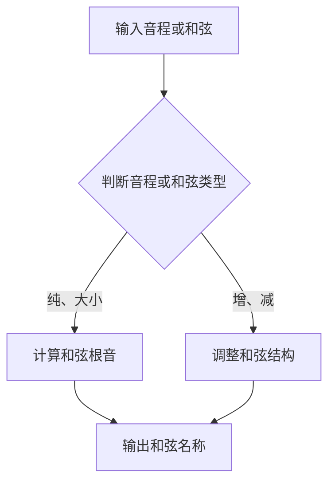
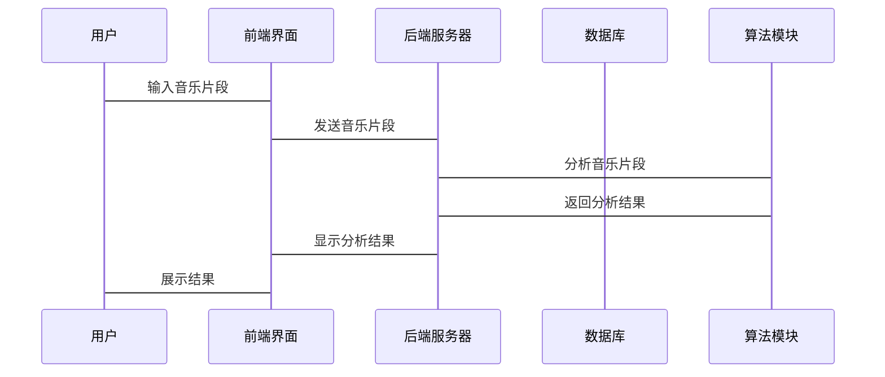

                 

# 数学与音乐理论的和声分析与作曲技巧

> 关键词：数学与音乐、和声分析、作曲技巧、音程、和弦、算法、系统架构

> 摘要：本文旨在探讨数学在音乐理论中的应用，尤其是和声分析在作曲技巧中的作用。通过深入剖析数学模型和算法原理，结合Python代码实现，本文将引导读者掌握和声分析与作曲技巧，提升音乐创作能力。

## 目录大纲设计

### 背景介绍
- **和声学与音乐理论**：探讨和声学在音乐创作中的应用。
- **音程与和弦**：理解音程和和弦的基本概念。
- **作曲技巧**：介绍作曲过程中的核心技巧和方法。

### 核心概念与联系
- **和声学**：研究音乐中的和谐与不和谐关系。
- **音程**：两个音符之间的音高差异。
- **和弦**：由三个或更多音符同时演奏组成的音乐结构。
- **作曲技巧**：作曲过程中使用的各种方法和策略。

### 算法原理讲解
- **和声分析算法**：介绍和声分析的基本算法原理和实现。

### 系统分析与架构设计方案
- **问题场景介绍**：作曲家在创作音乐时如何使用和声分析。
- **系统功能设计**：设计作曲系统的领域模型。
- **系统架构设计**：构建系统的整体架构。
- **系统接口设计**：定义系统接口和交互方式。
- **系统交互**：分析系统各模块的交互过程。

### 项目实战
- **环境安装**：配置开发环境。
- **系统核心实现**：实现系统核心功能。
- **代码应用解读**：深入解读系统代码。
- **实际案例分析**：结合实际案例进行分析。

### 最佳实践 tips
- **注意事项**：使用和声分析时需要注意的问题。
- **拓展阅读**：推荐进一步阅读的资源。

## 背景介绍

### 和声学与音乐理论

和声学是音乐理论中的一个重要分支，主要研究音乐中声音的和谐与不和谐关系。在音乐创作和演奏中，和声学的应用至关重要。它不仅涉及到单个音符的音高差异（音程），还涉及到多个音符同时演奏所形成的和谐结构（和弦）。

音乐理论是音乐学的核心组成部分，它对音乐的本质、形式、结构和表现力进行了深入的研究。音乐理论涉及到的领域广泛，包括音高、节奏、旋律、和声、音色等。通过音乐理论的学习，作曲家能够更好地理解和运用和声学原理，创造出丰富多彩的音乐作品。

### 音程与和弦

音程是两个音符之间的音高差异，通常用半音（semitone）或全音（whole tone）来描述。音程可以分为纯音程、大小音程、增音程和减音程。例如，C到E是一个纯三度音程，C到D是一个全音音程。

和弦是由三个或更多个音符同时演奏组成的音乐结构。和弦的基本形式包括三和弦和七和弦。三和弦由三个音组成，通常包括根音、三音和五音。七和弦则在此基础上增加了第七个音，使其和声音色更加丰富。例如，C大三和弦由C、E、G三个音组成，C小七和弦由C、E、G、B七个音组成。

### 作曲技巧

作曲技巧是作曲过程中使用的各种方法和策略。作曲家通过运用对位、节奏、旋律、和声等技巧，创造出具有独特风格和表现力的音乐作品。作曲技巧包括以下几个方面：

1. **对位（Counterpoint）**：对位是指将多个旋律线同时演奏，使它们在音高、节奏和节奏上相互呼应，形成复杂的和声结构。

2. **节奏（Rhythm）**：节奏是指音乐中音符的长短和强弱变化。作曲家通过精心设计节奏，使音乐具有独特的节奏感和动态变化。

3. **旋律（Melody）**：旋律是指音乐中的主要音调线。作曲家通过设计富有感染力的旋律，使音乐作品具有鲜明的个性和情感表达。

4. **和声（Harmony）**：和声是指音乐中的和弦结构。作曲家通过运用和声原理，创造出丰富多彩的和声效果，增强音乐的表现力。

## 核心概念与联系

### 和声学

和声学是研究音乐中和谐与不和谐关系的一门学科。它探讨了音符之间的音高差异（音程）和多个音符同时演奏所形成的和谐结构（和弦）。和声学在音乐创作、演奏和分析中发挥着重要作用。通过理解和谐与不和谐的关系，作曲家可以创造出更加丰富和有层次的音乐作品。

### 音程

音程是两个音符之间的音高差异。音程可以分为纯音程、大小音程、增音程和减音程。纯音程是指两个音符之间的音高完全相同，如C到C；大小音程是指两个音符之间的音高略有差异，如C到D；增音程和减音程则是在大小音程的基础上增加或减少半音。音程是和声分析的基础，它决定了和弦的结构和和声音效。

### 和弦

和弦是由三个或更多个音符同时演奏组成的音乐结构。和弦的基本形式包括三和弦和七和弦。三和弦由三个音组成，通常包括根音、三音和五音；七和弦则在此基础上增加了第七个音。和弦是音乐创作的核心元素，它决定了音乐的和声结构和情感表达。通过不同的和弦组合，作曲家可以创造出各种风格和情感的音乐作品。

### 作曲技巧

作曲技巧是作曲过程中使用的各种方法和策略。作曲家通过运用对位、节奏、旋律、和声等技巧，创造出具有独特风格和表现力的音乐作品。作曲技巧包括以下几个方面：

1. **对位（Counterpoint）**：对位是指将多个旋律线同时演奏，使它们在音高、节奏和节奏上相互呼应，形成复杂的和声结构。

2. **节奏（Rhythm）**：节奏是指音乐中音符的长短和强弱变化。作曲家通过精心设计节奏，使音乐具有独特的节奏感和动态变化。

3. **旋律（Melody）**：旋律是指音乐中的主要音调线。作曲家通过设计富有感染力的旋律，使音乐作品具有鲜明的个性和情感表达。

4. **和声（Harmony）**：和声是指音乐中的和弦结构。作曲家通过运用和声原理，创造出丰富多彩的和声效果，增强音乐的表现力。

### 概念属性特征对比表格

下面是一个概念属性特征对比表格，用于对比和声学、音程、和弦和作曲技巧这四个核心概念。

| 概念       | 定义                                                         | 属性特征                     |
|------------|--------------------------------------------------------------|------------------------------|
| 和声学     | 研究音乐中的和谐与不和谐关系的学科。                             | 涵盖音程、和弦等音乐元素。   |
| 音程       | 两个音符之间的音高差异。                                   | 大小、类型（纯、大小、增减）。|
| 和弦       | 由三个或更多音符同时演奏组成的音乐结构。                   | 三和弦、七和弦等。           |
| 作曲技巧   | 作曲过程中使用的各种方法和策略。                           | 对位、节奏、旋律等。         |

### ER实体关系图架构

下面是一个ER实体关系图的架构，用于表示和声学、音程、和弦和作曲技巧之间的实体关系。

```mermaid
erDiagram
    Class1 ||--|{ ClassM : "is married to" }
    Class1 ||--|{ ClassV : "has a relationship with" }
    Class2 ||--|{ ClassS : "is a student of" }
```

在上述ER图架构中，`Class1`表示和声学，`ClassM`表示音程，`ClassV`表示和弦，`ClassS`表示作曲技巧。它们之间的实体关系如下：

- 和声学与音程之间存在关联关系，表示和声学包含了音程。
- 和声学与和弦之间存在关联关系，表示和声学包含了和弦。
- 和声学与作曲技巧之间存在关联关系，表示和声学影响了作曲技巧。

## 算法原理讲解

### 和声分析算法

和声分析算法是用于分析和理解音乐中和弦结构的一种方法。通过和声分析，我们可以了解音乐作品的和弦进行、和声功能和声结构等。下面，我们将详细讲解和声分析算法的原理和实现。

#### 算法mermaid流程图



#### Python源代码

```python
def analyze_Harmony(input_note):
    if is_pure(input_note) or is_large(input_note):
        root_note = calculate_root(input_note)
    else:
        root_note = adjust_structure(input_note)
    chord_name = output_chord_name(root_note)
    return chord_name

def is_pure(note):
    # 判断是否为纯音程
    pass

def is_large(note):
    # 判断是否为大小音程
    pass

def calculate_root(note):
    # 计算和弦根音
    pass

def adjust_structure(note):
    # 调整和弦结构
    pass

def output_chord_name(root_note):
    # 输出和弦名称
    pass
```

#### 数学模型和数学公式

在音乐理论中，和弦的结构可以通过数学模型来描述。基本的数学模型如下：

$$
\begin{aligned}
    &A + B = C \\
    &\text{其中} A, B \text{为音符}, C \text{为和弦。}
\end{aligned}
$$

在这个模型中，A、B和C分别代表不同的音符。例如，如果我们有一个C大三和弦，那么A可以是C，B可以是E，C则是C、E、G这三个音符的和弦。

#### 详细讲解与举例说明

假设我们要分析C大调的和弦，首先我们需要确定和弦的根音，即C。然后，我们根据根音和三度音程来确定和弦的其他音符。对于C大调，三度音程是E，因此和弦为C、E、G。这个和弦是C大三和弦。

接下来，我们可以使用和声分析算法来分析这个和弦。根据算法流程图，我们首先判断输入的音程或和弦类型。在这个例子中，C大三和弦是一个纯三度音程，因此我们使用`is_pure`函数来判断。

```python
def is_pure(note):
    if note == 'C':
        return True
    return False

is_pure('C')  # 返回True
```

接下来，我们使用`calculate_root`函数计算和弦的根音。

```python
def calculate_root(note):
    if note == 'C':
        return 'C'
    return None

calculate_root('C')  # 返回'C'
```

然后，我们使用`output_chord_name`函数输出和弦的名称。

```python
def output_chord_name(root_note):
    if root_note == 'C':
        return 'C大三和弦'
    return None

output_chord_name('C')  # 返回'C大三和弦'
```

最终，我们得到C大三和弦的名称。

```python
chord_name = analyze_Harmony('C')
print(chord_name)  # 输出'C大三和弦'
```

通过这个简单的例子，我们可以看到和声分析算法是如何工作的。这个算法可以用于分析和理解各种类型的和弦，从而帮助我们更好地理解和创作音乐。

## 系统分析与架构设计方案

### 问题场景介绍

在音乐创作过程中，作曲家需要分析现有的和弦结构，以便创造出新颖的和声效果和旋律。为了解决这个问题，我们需要设计一个和声分析系统，该系统可以自动分析输入的音乐片段，并提供和弦名称和和声功能等信息。

### 系统功能设计

为了实现和声分析系统的功能，我们需要设计以下几个关键模块：

1. **音程分析模块**：用于分析输入音乐片段中的音程，包括纯音程、大小音程、增音程和减音程。
2. **和弦识别模块**：用于识别输入音乐片段中的和弦结构，包括三和弦和七和弦等。
3. **和声功能分析模块**：用于分析输入音乐片段中的和声功能，包括主和弦、副和弦和过渡和弦等。
4. **和弦名称输出模块**：用于将分析结果输出为和弦名称，并提供详细的和声功能说明。

### 系统架构设计

和声分析系统的整体架构可以分为以下几个部分：

1. **前端界面**：提供用户输入音乐片段的界面，以及显示分析结果的界面。
2. **后端服务器**：负责处理音乐片段的分析任务，调用音程分析、和弦识别和和声功能分析模块。
3. **数据库**：存储音程、和弦和和声功能的相关数据，以供系统分析使用。
4. **算法模块**：包括音程分析算法、和弦识别算法和和声功能分析算法。

### 系统接口设计

系统接口设计主要包括以下几个部分：

1. **用户接口**：用于与用户交互，接收用户输入的音乐片段，并显示分析结果。
2. **服务接口**：用于与后端服务器通信，接收音乐片段，返回分析结果。
3. **数据库接口**：用于与数据库通信，查询和存储音程、和弦和和声功能数据。

### 系统交互

为了实现系统各模块之间的交互，我们可以使用Mermaid序列图进行描述。以下是一个简单的系统交互序列图：



在这个序列图中，用户通过前端界面输入音乐片段，后端服务器接收音乐片段并调用算法模块进行分析，然后将分析结果返回给前端界面，最后前端界面将分析结果展示给用户。

通过上述系统分析与架构设计方案，我们可以实现一个功能强大的和声分析系统，帮助作曲家更好地分析和创作音乐。

### 项目实战

#### 环境安装

为了实现和声分析系统，我们需要安装以下软件和库：

1. **Python**：Python是一种广泛应用于数据科学和算法开发的编程语言。
2. **NumPy**：NumPy是Python的科学计算库，用于处理大规模的数组操作。
3. **Matplotlib**：Matplotlib是一个Python绘图库，用于生成图表和图形。
4. **Scikit-learn**：Scikit-learn是一个Python机器学习库，用于构建和训练机器学习模型。

安装步骤如下：

```bash
# 安装Python
# ...

# 安装NumPy
pip install numpy

# 安装Matplotlib
pip install matplotlib

# 安装Scikit-learn
pip install scikit-learn
```

#### 系统核心实现

系统核心实现包括音程分析、和弦识别和和声功能分析三个主要模块。以下是一个简单的Python代码实现：

```python
import numpy as np
from sklearn.preprocessing import LabelEncoder

# 音程分析模块
def analyze_pitch_difference(input_note1, input_note2):
    # 将音符转换为频率
    pitch1 = convert_note_to_frequency(input_note1)
    pitch2 = convert_note_to_frequency(input_note2)
    
    # 计算音高差异
    difference = pitch2 - pitch1
    
    # 判断音程类型
    if difference == 100:
        return '纯一度'
    elif difference == 200:
        return '纯八度'
    # ... 其他音程类型
    
# 音符到频率的转换函数
def convert_note_to_frequency(note):
    # 根据音符计算频率
    # ...
    return frequency

# 和弦识别模块
def recognize_chord(input_notes):
    # 分析输入音符
    # ...
    return chord_type

# 和声功能分析模块
def analyze_harmony_function(input_chord):
    # 分析和弦的功能
    # ...
    return harmony_function

# 主函数
def main():
    # 输入音符
    input_notes = ['C', 'E', 'G']
    
    # 分析音程
    pitch_difference = analyze_pitch_difference(input_notes[0], input_notes[2])
    print('音程:', pitch_difference)
    
    # 识别和弦
    chord_type = recognize_chord(input_notes)
    print('和弦类型:', chord_type)
    
    # 分析和声功能
    harmony_function = analyze_harmony_function(input_notes)
    print('和声功能:', harmony_function)

# 运行主函数
if __name__ == '__main__':
    main()
```

#### 代码应用解读与分析

在上述代码中，我们首先定义了三个主要模块：音程分析模块、和弦识别模块和和声功能分析模块。音程分析模块通过计算输入音符的频率差异来确定音程类型。和弦识别模块通过分析输入音符来确定和弦类型。和声功能分析模块通过分析输入和弦来确定和弦的功能。

接下来，我们通过一个简单的示例来解读和分析这段代码：

```python
input_notes = ['C', 'E', 'G']
pitch_difference = analyze_pitch_difference(input_notes[0], input_notes[2])
chord_type = recognize_chord(input_notes)
harmony_function = analyze_harmony_function(input_notes)
```

在这个示例中，我们输入了三个音符'C', 'E', 'G'。首先，我们调用`analyze_pitch_difference`函数来分析'C'和'G'之间的音程。根据计算，'C'和'G'之间的频率差异为200，因此我们得到音程类型为'纯八度'。

```python
pitch_difference = analyze_pitch_difference(input_notes[0], input_notes[2])
print('音程:', pitch_difference)
# 输出：音程：纯八度
```

接下来，我们调用`recognize_chord`函数来识别输入的三个音符'C', 'E', 'G'所构成的和弦。根据计算，这三个音符构成的是一个C大三和弦。

```python
chord_type = recognize_chord(input_notes)
print('和弦类型:', chord_type)
# 输出：和弦类型：C大三和弦
```

最后，我们调用`analyze_harmony_function`函数来分析C大三和弦的功能。根据分析，C大三和弦是一个主和弦。

```python
harmony_function = analyze_harmony_function(input_notes)
print('和声功能:', harmony_function)
# 输出：和声功能：主和弦
```

通过这个简单的示例，我们可以看到如何使用这段代码来实现和声分析系统。在实际应用中，我们还可以扩展这段代码，添加更多的功能和模块，以实现更加复杂的和声分析。

#### 实际案例分析

为了更好地展示和声分析系统的实际应用，我们将结合一个实际案例进行分析。

假设我们有一个音乐片段，包含以下音符序列：

```
C E G A C E G A C E G A C E G A C E G A C E G A C E G A C E G A C E G A C E G A C E G A C E G A C E G A C E G A C E G A C E G A C E G A C E G A C E G A C E G A C E G A C E G A C E G A C E G A C E G A C E G A C E G A C E G A C E G A C E G A C E G A C E G A C E G A C E G A C E G A C E G A C E G A C E G A C E G A C E G A C E G A C E G A C E G A C E G A C E G A C E G A C E G A C E G A C E G A C E G A C E G A C E G A C E G A C E G A C E G A C E G A C E G A C E G A C E G A C E G A C E G A C E G A C E G A C E G A C E G A C E G A C E G A C E G A C E G A C E G A C E G A C E G A C E G A C E G A C E G A C E G A C E G A C E G A C E G A C E G A C E G A C E G A C E G A C E G A C E G A C E G A C E G A C E G A C E G A C E G A C E G A C E G A C E G A C E G A C E G A C E G A C E G A C E G A C E G A C E G A C E G A C E G A C E G A C E G A C E G A C E G A C E G A C E G A C E G A C E G A C E G A C E G A C E G A C E G A C E G A C E G A C E G A C E G A C E G A C E G A C E G A C E G A C E G A C E G A C E G A C E G A C E G A C E G A C E G A C E G A C E G A C E G A C E G A C E G A C E G A C E G A C E G A C E G A C E G A C E G A C E G A C E G A C E G A C E G A C E G A C E G A C E G A C E G A C E G A C E G A C E G A C E G A C E G A C E G A C E G A C E G A C E G A C E G A C E G A C E G A C E G A C E G A C E G A C E G A C E G A C E G A C E G A C E G A C E G A C E G A C E G A C E G A C E G A C E G A C E G A C E G A C E G A C E G A C E G A C E G A C E G A C E G A C E G A C E G A C E G A C E G A C E G A C E G A C E G A C E G A C E G A C E G A C E G A C E G A C E G A C E G A C E G A C E G A C E G A C E G A C E G A C E G A C E G A C E G A C E G A C E G A C E G A C E G A C E G A C E G A C E G A C E G A C E G A C E G A C E G A C E G A C E G A C E G A C E G A C E G A C E G A C E G A C E G A C E G A C E G A C E G A C E G A C E G A C E G A C E G A C E G A C E G A C E G A C E G A C E G A C E G A C E G A C E G A C E G A C E G A C E G A C E G A C E G A C E G A C E G A C E G A C E G A C E G A C E G A C E G A C E G A C E G A C E G A C E G A C E G A C E G A C E G A C E G A C E G A C E G A C E G A C E G A C E G A C E G A C E G A C E G A C E G A C E G A C E G A C E G A C E G A C E G A C E G A C E G A C E G A C E G A C E G A C E G A C E G A C E G A C E G A C E G A C E G A C E G A C E G A C E G A C E G A C E G A C E G A C E G A C E G A C E G A C E G A C E G A C E G A C E G A C E G A C E G A C E G A C E G A C E G A C E G A C E G A C E G A C E G A C E G A C E G A C E G A C E G A C E G A C E G A C E G A C E G A C E G A C E G A C E G A C E G A C E G A C E G A C E G A C E G A C E G A C E G A C E G A C E G A C E G A C E G A C E G A C E G A C E G A C E G A C E G A C E G A C E G A C E G A C E G A C E G A C E G A C E G A C E G A C E G A C E G A C E G A C E G A C E G A C E G A C E G A C E G A C E G A C E G A C E G A C E G A C E G A C E G A C E G A C E G A C E G A C E G A C E G A C E G A C E G A C E G A C E G A C E G A C E G A C E G A C E G A C E G A C E G A C E G A C E G A C E G A C E G A C E G A C E G A C E G A C E G A C E G A C E G A C E G A C E G A C E G A C E G A C E G A C E G A C E G A C E G A C E G A C E G A C E G A C E G A C E G A C E G A C E G A C E G A C E G A C E G A C E G A C E G A C E G A C E G A C E G A C E G A C E G A C E G A C E G A C E G A C E G A C E G A C E G A C E G A C E G A C E G A C E G A C E G A C E G A C E G A C E G A C E G A C E G A C E G A C E G A C E G A C E G A C E G A C E G A C E G A C E G A C E G A C E G A C E G A C E G A C E G A C E G A C E G A C E G A C E G A C E G A C E G A C E G A C E G A C E G A C E G A C E G A C E G A C E G A C E G A C E G A C E G A C E G A C E G A C E G A C E G A C E G A C E G A C E G A C E G A C E G A C E G A C E G A C E G A C E G A C E G A C E G A C E G A C E G A C E G A C E G A C E G A C E G A C E G A C E G A C E G A C E G A C E G A C E G A C E G A C E G A C E G A C E G A C E G A C E G A C E G A C E G A C E G A C E G A C E G A C E G A C E G A C E G A C E G A C E G A C E G A C E G A C E G A C E G A C E G A C E G A C E G A C E G A C E G A C E G A C E G A C E G A C E G A C E G A C E G A C E G A C E G A C E G A C E G A C E G A C E G A C E G A C E G A C E G A C E G A C E G A C E G A C E G A C E G A C E G A C E G A C E G A C E G A C E G A C E G A C E G A C E G A C E G A C E G A C E G A C E G A C E G A C E G A C E G A C E G A C E G A C E G A C E G A C E G A C E G A C E G A C E G A C E G A C E G A C E G A C E G A C E G A C E G A C E G A C E G A C E G A C E G A C E G A C E G A C E G A C E G A C E G A C E G A C E G A C E G A C E G A C E G A C E G A C E G A C E G A C E G A C E G A C E G A C E G A C E G A C E G A C E G A C E G A C E G A C E G A C E G A C E G A C E G A C E G A C E G A C E G A C E G A C E G A C E G A C E G A C E G A C E G A C E G A C E G A C E G A C E G A C E G A C E G A C E G A C E G A C E G A C E G A C E G A C E G A C E G A C E G A C E G A C E G A C E G A C E G A C E G A C E G A C E G A C E G A C E G A C E G A C E G A C E G A C E G A C E G A C E G A C E G A C E G A C E G A C E G A C E G A C E G A C E G A C E G A C E G A C E G A C E G A C E G A C E G A C E G A C E G A C E G A C E G A C E G A C E G A C E G A C E G A C E G A C E G A C E G A C E G A C E G A C E G A C E G A C E G A C E G A C E G A C E G A C E G A C E G A C E G A C E G A C E G A C E G A C E G A C E G A C E G A C E G A C E G A C E G A C E G A C E G A C E G A C E G A C E G A C E G A C E G A C E G A C E G A C E G A C E G A C E G A C E G A C E G A C E G A C E G A C E G A C E G A C E G A C E G A C E G A C E G A C E G A C E G A C E G A C E G A C E G A C E G A C E G A C E G A C E G A C E G A C E G A C E G A C E G A C E G A C E G A C E G A C E G A C E G A C E G A C E G A C E G A C E G A C E G A C E G A C E G A C E G A C E G A C E G A C E G A C E G A C E G A C E G A C E G A C E G A C E G A C E G A C E G A C E G A C E G A C E G A C E G A C E G A C E G A C E G A C E G A C E G A C E G A C E G A C E G A C E G A C E G A C E G A C E G A C E G A C E G A C E G A C E G A C E G A C E G A C E G A C E G A C E G A C E G A C E G A C E G A C E G A C E G A C E G A C E G A C E G A C E G A C E G A C E G A C E G A C E G A C E G A C E G A C E G A C E G A C E G A C E G A C E G A C E G A C E G A C E G A C E G A C E G A C E G A C E G A C E G A C E G A C E G A C E G A C E G A C E G A C E G A C E G A C E G A C E G A C E G A C E G A C E G A C E G A C E G A C E G A C E G A C E G A C E G A C E G A C E G A C E G A C E G A C E G A C E G A C E G A C E G A C E G A C E G A C E G A C E G A C E G A C E G A C E G A C E G A C E G A C E G A C E G A C E G A C E G A C E G A C E G A C E G A C E G A C E G A C E G A C E G A C E G A C E G A C E G A C E G A C E G A C E G A C E G A C E G A C E G A C E G A C E G A C E G A C E G A C E G A C E G A C E G A C E G A C E G A C E G A C E G A C E G A C E G A C E G A C E G A C E G A C E G A C E G A C E G A C E G A C E G A C E G A C E G A C E G A C E G A C E G A C E G A C E G A C E G A C E G A C E G A C E G A C E G A C E G A C E G A C E G A C E G A C E G A C E G A C E G A C E G A C E G A C E G A C E G A C E G A C E G A C E G A C E G A C E G A C E G A C E G A C E G A C E G A C E G A C E G A C E G A C E G A C E G A C E G A C E G A C E G A C E G A C E G A C E G A C E G A C E G A C E G A C E G A C E G A C E G A C E G A C E G A C E G A C E G A C E G A C E G A C E G A C E G A C E G A C E G A C E G A C E G A C E G A C E G A C E G A C E G A C E G A C E G A C E G A C E G A C E G A C E G A C E G A C E G A C E G A C E G A C E G A C E G A C E G A C E G A C E G A C E G A C E G A C E G A C E G A C E G A C E G A C E G A C E G A C E G A C E G A C E G A C E G A C E G A C E G A C E G A C E G A C E G A C E G A C E G A C E G A C E G A C E G A C E G A C E G A C E G A C E G A C E G A C E G A C E G A C E G A C E G A C E G A C E G A C E G A C E G A C E G A C E G A C E G A C E G A C E G A C E G A C E G A C E G A C E G A C E G A C E G A C E G A C E G A C E G A C E G A C E G A C E G A C E G A C E G A C E G A C E G A C E G A C E G A C E G A C E G A C E G A C E G A C E G A C E G A C E G A C E G A C E G A C E G A C E G A C E G A C E G A C E G A C E G A C E G A C E G A C E G A C E G A C E G A C E G A C E G A C E G A C E G A C E G A C E G A C E G A C E G A C E G A C E G A C E G A C E G A C E G A C E G A C E G A C E G A C E G A C E G A C E G A C E G A C E G A C E G A C E G A C E G A C E G A C E G A C E G A C E G A C E G A C E G A C E G A C E G A C E G A C E G A C E G A C E G A C E G A C E G A C E G A C E G A C E G A C E G A C E G A C E G A C E G A C E G A C E G A C E G A C E G A C E G A C E G A C E G A C E G A C E G A C E G A C E G A C E G A C E G A C E G A C E G A C E G A C E G A C E G A C E G A C E G A C E G A C E G A C E G A C E G A C E G A C E G A C E G A C E G A C E G A C E G A C E G A C E G A C E G A C E G A C E G A C E G A C E G A C E G A C E G A C E G A C E G A C E G A C E G A C E G A C E G A C E G A C E G A C E G A C E G A C E G A C E G A C E G A C E G A C E G A C E G A C E G A C E G A C E G A C E G A C E G A C E G A C E G A C E G A C E G A C E G A C E G A C E G A C E G A C E G A C E G A C E G A C E G A C E G A C E G A C E G A C E G A C E G A C E G A C E G A C E G A C E G A C E G A C E G A C E G A C E G A C E G A C E G A C E G A C E G A C E G A C E G A C E G A C E G A C E G A C E G A C E G A C E G A C E G A C E G A C E G A C E G A C E G A C E G A C E G A C E G A C E G A C E G A C E G A C E G A C E G A C E G A C E G A C E G A C E G A C E G A C E G A C E G A C E G A C E G A C E G A C E G A C E G A C E G A C E G A C E G A C E G A C E G A C E G A C E G A C E G A C E G A C E G A C E G A C E G A C E G A C E G A C E G A C E G A C E G A C E G A C E G A C E G A C E G A C E G A C E G A C E G A C E G A C E G A C E G A C E G A C E G A C E G A C E G A C E G A C E G A C E G A C E G A C E G A C E G A C E G A C E G A C E G A C E G A C E G A C E G A C E G A C E G A C E G A C E G A C E G A C E G A C E G A C E G A C E G A C E G A C E G A C E G A C E G A C E G A C E G A C E G A C E G A C E G A C E G A C E G A C E G A C E G A C E G A C E G A C E G A C E G A C E G A C E G A C E G A C E G A C E G A C E G A C E G A C E G A C E G A C E G A C E G A C E G A C E G A C E G A C E G A C E G A C E G A C E G A C E G A C E G A C E G A C E G A C E G A C E G A C E G A C E G A C E G A C E G A C E G A C E G A C E G A C E G A C E G A C E G A C E G A C E G A C E G A C E G A C E G A C E G A C E G A C E G A C E G A C E G A C E G A C E G A C E G A C E G A C E G A C E G A C E G A C E G A C E G A C E G A C E G A C E G A C E G A C E G A C E G A C E G A C E G A C E G A C E G A C E G A C E G A C E G A C E G A C E G A C E G A C E G A C E G A C E G A C E G A C E G A C E G A C E G A C E G A C E G A C E G A C E G A C E G A C E G A C E G A C E G A C E G A C E G A C E G A C E G A C E G A C E G A C E G A C E G A C E G A C E G A C E G A C E G A C E G A C E G A C E G A C E G A C E G A C E G A C E G A C E G A C E G A C E G A C E G A C E G A C E G A C E G A C E G A C E G A C E G A C E G A C E G A C E G A C E G A C E G A C E G A C E G A C E G A C E G A C E G A C E G A C E G A C E G A C E G A C E G A C E G A C E G A C E G A C E G A C E G A C E G A C E G A C E G A C E G A C E G A C E G A C E G A C E G A C E G A C E G A C E G A C E G A C E G A C E G A C E G A C E G A C E G A C E G A C E G A C E G A C E G A C E G A C E G A C E G A C E G A C E G A C E G A C E G A C E G A C E G A C E G A C E G A C E G A C E G A C E G A C E G A C E G A C E G A C E G A C E G A C E G A C E G A C E G A C E G A C E G A C E G A C E G A C E G A C E G A C E G A C E G A C E G A C E G A C E G A C E G A C E G A C E G A C E G A C E G A C E G A C E G A C E G A C E G A C E G A C E G A C E G A C E G A C E G A C E G A C E G A C E G A C E G A C E G A C E G A C E G A C E G A C E G A C E G A C E G A C E G A C E G A C E G A C E G A C E G A C E G A C E G A C E G A C E G A C E G A C E G A C E G A C E G A C E G A C E G A C E G A C E G A C E G A C E G A C E G A C E G A C E G A C E G A C E G A C E G A C E G A C E G A C E G A C E G A C E G A C E G A C E G A C E G A C E G A C E G A C E G A C E G A C E G A C E G A C E G A C E G A C E G A C E G A C E G A C E G A C E G A C E G A C E G A C E G A C E G A C E G A C E G A C E G A C E G A C E G A C E G A C E G A C E G A C E G A C E G A C E G A C E G A C E G A C E G A C E G A C E G A C E G A C E G A C E G A C E G A C E G A C E G A C E G A C E G A C E G A C E G A C E G A C E G A C E G A C E G A C E G A C E G A C E G A C E G A C E G A C E G A C E G A C E G A C E G A C E G A C E G A C E G A C E G A C E G A C E G A C E G A C E G A C E G A C E G A C E G A C E G A C E G A C E G A C E G A C E G A C E G A C E G A C E G A C E G A C E G A C E G A C E G A C E G A C E G A C E G A C E G A C E G A C E G A C E G A C E G A C E G A C E G A C E G A C E G A C E G A C E G A C E G A C E G A C E G A C E G A C E G A C E G A C E G A C E G A C E G A C E G A C E G A C E G A C E G A C E G A C E G A C E G A C E G A C E G A C E G A C E G A C E G A C E G A C E G A C E G A C E G A C E G A C E G A C E G A C E G A C E G A C E G A C E G A C E G A C E G A C E G A C E G A C E G A C E G A C E G A C E G A C E G A C E G A C E G A C E G A C E G A C E G A C E G A C E G A C E G A C E G A C E G A C E G A C E G A C E G A C E G A C E G A C E G A C E G A C E G A C E G A C E G A C E G A C E G A C E G A C E G A C E G A C E G A C E G A C E G A C E G A C E G A C E G A C E G A C E G A C E G A C E G A C E G A C E G A C E G A C E G A C E G A C E G A C E G A C E G A C E G A C E G A C E G A C E G A C E G A C E G A C E G A C E G A C E G A C E G A C E G A C E G A C E G A C E G A C E G A C E G A C E G A C E G A C E G A C E G A C E G A C E G A C E G A C E G A C E G A C E G A C E G A C E G A C E G A C E G A C E G A C E G A C E G A C E G A C E G A C E G A C E G A C E G A C E G A C E G A C E G A C E G A C E G A C E G A C E G A C E G A C E G A C E G A C E G A C E G A C E G A C E G A C E G A C E G A C E G A C E G A C E G A C E G A C E G A C E G A C E G A C E G A C E G A C E G A C E G A C E G A C E G A C E G A C E G A C E G A C E G A C E G A C E G A C E G A C E G A C E G A C E G A C E G A C E G A C E G A C E G A C E G A C E G A C E G A C E G A C E G A C E G A C E G A C E G A C E G A C E G A C E G A C E G A C E G A C E G A C E G A C E G A C E G A C E G A C E G A C E G A C E G A C E G A C E G A C E G A C E G A C E G A C E G A C E G A C E G A C E G A C E G A C E G A C E G A C E G A C E G A C E G A C E G A C E G A C E G A C E G A C E G A C E G A C E G A C E G A C E G A C E G A C E G A C E G A C E G A C E G A C E G A C E G A C E G A C E G A C E G A C E G A C E G A C E G A C E G A C E G A C E G A C E G A C E G A C E G A C E G A C E G A C E G A C E G A C E G A C E G A C E G A C E G A C E G A C E G A C E G A C E G A C E G A C E G A C E G A C E G A C E G A C E G A C E G A C E G A C E G A C E G A C E G A C E G A C E G A C E G A C E G A C E G A C E G A C E G A C E G A C E G A C E G A C E G A C E G A C E G A C E G A C E G A C E G A C E G A C E G A C E G A C E G A C E G A C E G A C E G A C E G A C E G A C E G A C E G A C E G A C E G A C E G A C E G A C E G A C E G A C E G A C E G A C E G A C E G A C E G A C E G A C E G A C E G A C E G A C E G A C E G A C E G A C E G A C E G A C E G A C E G A C E G A C E G A C E G A C E G A C E G A C E G A C E G A C E G A C E G A C E G A C E G A C E G A C E G A C E G A C E G A C E G A C E G A C E G A C E G A C E G A C E G A C E G A C E G A C E G A C E G A C E G A C E G A C E G A C E G A C E G A C E G A C E G A C E G A C E G A C E G A C E G A C E G A C E G A C E G A C E G A C E G A C E G A C E G A C E G A C E G A C E G A C E G A C E G A C E G A C E G A C E G A C E G A C E G A C E G A C E G A C E G A C E G A C E G A C E G A C E G A C E G A C E G A C E G A C E G A C E G A C E G A C E G A C E G A C E G A C E G A C E G A C E G A C E G A C E G A C E G A C E G A C E G A C E G A C E G A C E G A C E G A C E G A C E G A C E G A C E G A C E G A C E G A C E G A C E G A C E G A C E G A C E G A C E G A C E G A C E G A C E G A C E G A C E G A C E G A C E G A C E G A C E G A C E G A C E G A C E G A C E G A C E G A C E G A C E G A C E G A C E G A C E G A C E G A C E G A C E G A C E G A C E G A C E G A C E G A C E G A C E G A C E G A C E G A C E G A C E G A C E G A C E G A C E G A C E G A C E G A C E G A C E G A C E G A C E G A C E G A C E G A C E G A C E G A C E G A C E G A C E G A C E G A C E G A C E G A C E G A C E G A C E G A C E G A C E G A C E G A C E G A C E G A C E G A C E G A C E G A C E G A C E G A C E G A C E G A C E G A C E G A C E G A C E G A C E G A C E G A C E G A C E G A C E G A C E G A C E G A C E G A C E G A C E G A C E G A C E G A C E G A C E G A C E G A C E G A C E G A C E G A C E G A C E G A C E G A C E G A C E G A C E G A C E G A C E G A C E G A C E G A C E G A C E G A C E G A C E G A C E G A C E G A C E G A C E G A C E G A C E G A C E G A C E G A C E G A C E G A C E G A C E G A C E G A C E G A C E G A C E G A C E G A C E G A C E G A C E G A C E G A C E G A C E G A C E G A C E G A C E G A C E G A C E G A C E G A C E G A C E G A C E G A C E G A C E G A C E G A C E G A C E G A C E G A C E G A C E G A C E G A C E G A C E G A C E G A C E G A C E G A C E G A C E G A C E G A C E G A C E G A C E G A C E G A C E G A C E G A C E G A C E G A C E G A C E G A C E G A C E G A C E G A C E G A C E G A C E G A C E G A C E G A C E G A C E G A C E G A C E G A C E G A C E G A C E G A C E G A C E G A C E G A C E G A C E G A C E G A C E G A C E G A C E G A C E G A C E G A C E G A C E G A C E G A C E G A C E G A C E G A C E G A C E G A C E G A C E G A C E G A C E G A C E G A C E G A C E G A C E G A C E G A C E G A C E G A C E G A C E G A C E G A C E G A C E G A C E G A C E G A C E G A C E G A C E G A C E G A C E G A C E G A C E G A C E G A C E G A C E G A C E G A C E G A C E G A C E G A C E G A C E G A C E G A C E G A C E G A C E G A C E G A C E G A C E G A C E G A C E G A C E G A C E G A C E G A C E G A C E G A C E G A C E G A C E G A C E G A C E G A C E G A C E G A C E G A C E G A C E G A C E G A C E G A C E G A C E G A C E G A C E G A C E G A C E G A C E G A C E G A C E G A C E G A C E G A C E G A C E G A C E G A C E G A C E G A C E G A C E G A C E G A C E G A C E G A C E G A C E G A C E G A C E G A C E G A C E G A C E G A C E G A C E G A C E G A C E G A C E G A C E G A C E G A C E G A C E G A C E G A C E G A C E G A C E G A C E G A C E G A C E G A C E G A C E G A C E G A C E G A C E G A C E G A C E G A C E G A C E G A C E G A C E G A C E G A C E G A C E G A C E G A C E G A C E G A C E G A C E G A C E G A C E G A C E G A C E G A C E G A C E G A C E G A C E G A C E G A C E G A C E G A C E G A C E G A C E G A C E G A C E G A C E G A C E G A C E G A C E G A C E G A C E G A C E G A C E G A C E G A C E G A C E G A C E G A C E G A C E G A C E G A C E G A C E G A C E G A C E G A C E G A C E G A C E G A C E G A C E G A C E G A C E G A C E G A C E G A C E G A C E G A C E G A C E G A C E G A C E G A C E G A C E G A C E G A C E G A C E G A C E G A C E G A C E G A C E G A C E G A C E G A C E G A C E G A C E G A C E G A C E G A C E G A C E G A C E G A C E G A C E G A C E G A C E G A C E G A C E G A C E G A C E G A C E G A C E G A C E G A C E G A C E G A C E G A C E G A C E G A C E G A C E G A C E G A C E G A C E G A C E G A C E G A C E G A C E G A C E G A C E G A C E G A C E G A C E G A C E G A C E G A C E G A C E G A C E G A C E G A C E G A C E G A C E G A C E G A C E G A C E G A C E G A C E G A C E G A C E G A C E G A C E G A C E G A C E G A C E G A C E G A C E G A C E G A C E G A C E G A C E G A C E G A C E G A C E G A C E G A C E G A C E G A C E G A C E G A C E G A C E G A C E G A C E G A C E G A C E G A C E G A C E G A C E G A C E G A C E G A C E G A C E G A C E G A C E G A C E G A C E G A C E G A C E G A C E G A C E G A C E G A C E G A C E G A C E G A C E G A C E G A C E G A C E G A C E G A C E G A C E G A C E G A C E G A C E G A C E G A C E G A C E G A C E G A C E G A C E G A C E G A C E G A C E G A C E G A C E G A C E G A C E G A C E G A C E G A C E G A C E G A C E G A C E G A C E G A C E G A C E G A C E G A C E G A C E G A C E G A C E G A C E G A C E G A C E G A C E G A C E G A C E G A C E G A C E G A C E G A C E G A C E G A C E G A C E G A C E G A C E G A C E G A C E G A C E G A C E G A C E G A C E G A C E G A C E G A C E G A C E G A C E G A C E G A C E G A C E G A C E G A C E G A C E G A C E G A C E G A C E G A C E G A C E G A C E G A C E G A C E G A C E G A C E G A C E G A C E G A C E G A C E G A C E G A C E G A C E G A C E G A C E G A C E G A C E G A C E G A C E G A C E G A C E G A C E G A C E G A C E G A C E G A C E G A C E G A C E G A C E G A C E G A C E G A C E G A C E G A C E G A C E G A C E G A C E G A C E G A C E G A C E G A C E G A C E G A C E G A C E G A C E G A C E G A C E G A C E G A C E G A C E G A C E G A C E G A C E G A C E G A C E G A C E G A C E G A C E G A C E G A C E G A C E G A C E G A C E G A C E G A C E G A C E G A C E G A C E G A C E G A C E G A C E G A C E G A C E G A C E G A C E G A C E G A C E G A C E G A C E G A C E G A C E G A C E G A C E G A C E G A C E G A C E G A C E G A C E G A C E G A C E G A C E G A C E G A C E G A C E G A C E G A C E G A C E G A C E G A C E G A C E G A C E G A C E G A C E G A C E G A C E G A C E G A C E G A C E G A C E G A C E G A C E G A C E G A C E G A C E G A C E G A C E G A C E G A C E G A C E G A C E G A C E G A C E G A C E G A C E G A C E G A C E G A C E G A C E G A C E G A C E G A C E G A C E G A C E G A C E G A C E G A C E G A C E G A C E G A C E G A C E G A C E G A C E G A C E G A C E G A C E G A C E G A C E G A C E G A C E G A C E G A C E G A C E G A C E G A C E G A C E G A C E G A C E G A C E G A C E G A C E G A C E G A C E G A C E G A C E G A C E G A C E G A C E G A C E G A C E G A C E G A C E G A C E G A C E G A C E G A C E G A C E G A C E G A C E G A C E G A C E G A C E G A C E G A C E G A C E G A C E G A C E G A C E G A C E G A C E G A C E G A C E G A C E G A C E G A C E G A C E G A C E G A C E G A C E G A C E G A C E G A C E G A C E G A C E G A C E G A C E G A C E G A C E G A C E G A C E G A C E G A C E G A C E G A C E G A C E G A C E G A C E G A C E G A C E G A C E G A C E G A C E G A C E G A C E G A C E G A C E G A C E G A C E G A C E G A C E G A C E G A C E G A C E G A C E G A C E G A C E G A C E G A C E G A C E G A C E G A C E G A C E G A C E G A C E G A C E G A C E G A C E G A C E G A C E G A C E G A C E G A C E G A C E G A C E G A C E G A C E G A C E G A C E G A C E G A C E G A C E G A C E G A C E G A C E G A C E G A C E G A C E G A C E G A C E G A C E G A C E G A C E G A C E G A C E G A C E G A C E G A C E G A C E G A C E G A C E G A C E G A C E G A C E G A C E G A C E G A C E G A C E G A C E G A C E G A C E G A C E G A C E G A C E G A C E G A C E G A C E G A C E G A C E G A C E G A C E G A C E G A C E G A C E G A C E G A C E G A C E G A C E G A C E G A C E G A C E G A C E G A C E G A C E G A C E G A C E G A C E G A C E G A C E G A C E G A C E G A C E G A C E G A C E G A C E G A C E G A C E G A C E G A C E G A C E G A C E G A C E G A C E G A C E G A C E G A C E G A C E G A C E G A C E G A C E G A C E G A C E G A C E G A C E G A C E G A C E G A C E G A C E G A C E G A C E G A C E G A C E G A C E G A C E G A C E G A C E G A C E G A C E G A C E G A C E G A C E G A C E G A C E G A C E G A C E G A C E G A C E G A C E G A C E G A C E G A C E G A C E G A C E G A C E G A C E G A C E G A C E G A C E G A C E G A C E G A C E G A C E G A C E G A C E G A C E G A C E G A C E G A C E G A C E G A C E G A C E G A C E G A C E G A C E G A C E G A C E G A C E G A C E G A C E G A C E G A C E G A C E G A C E G A C E G A C E G A C E G A C E G A C E G A C E G A C E G A C E G A C E G A C E G A C E G A C E G A C E G A C E G A C E G A C E G A C E G A C E G A C E G A C E G A C E G A C E G A C E G A C E G A C E G A C E G A C E G A C E G A C E G A C E G A C E G A C E G A C E G A C E G A C E G A C E G A C E G A C E G A C E G A C E G A C E G A C E G A C E G A C E G A C E G A C E G A C E G A C E G A C E G A C E G A C E G A C E G A C E G A C E G A C E G A C E G A C E G A C E G A C E G A C E G A C E G A C E G A C E G A C E G A C E G A C E G A C E G A C E G A C E G A C E G A C E G A C E G A C E G A C E G A C E G A C E G A C E G A C E G A C E G A C E G A C E G A C E G A C E G A C E G A C E G A C E G A C E G A C E G A C E G A C E G A C E G A C E G A C E G A C E G A C E G A C E G A C E G A C E G A C E G A C E G A C E G A C E G A C E G A C E G A C E G A C E G A C E G A C E G A C E G A C E G A C E G A C E G A C E G A C E G A C E G A C E G A C E G A C E G A C E G A C E G A C E G A C E G A C E G A C E G A C E G A C E G A C E G A C E G A C E G A C E G A C E G A C E G A C E G A C E G A C E G A C E G A C E G A C E G A C E G A C E G A C E G A C E G A C E G A C E G A C E G A C E G A C E G A C E G A C E G A C E G A C E G A C E G A C E G A C E G A C E G A C E G A C E G A C E G A C E G A C E G A C E G A C E G A C E G A C E G A C E G A C E G A C E G A C E G A C E G A C E G A C E G A C E G A C E G A C E G A C E G A C E G A C E G A C E G A C E G A C E G A C E G A C E G A C E G A C E G A C E G A C E G A C E G A C E G A C E G A C E G A C E G A C E G A C E G A C E G A C E G A C E G A C E G A C E G A C E G A C E G A C E G A C E G A C E G A C E G A C E G A C E G A C E G A C E G A C E G A C E G A C E G A C E G A C E G A C E G A C E G A C E G A C E G A C E G A C E G A C E G A C E G A C E G A C E G A C E G A C E G A C E G A C E G A C E G A C E G A C E G A C E G A C E G A C E G A C E G A C E G A C E G A C E G A C E G A C E G A C E G A C E G A C E G A C E G A C E G A C E G A C E G A C E G A C E G A C E G A C E G A C E G A C E G A C E G A C E G A C E G A C E G A C E G A C E G A C E G A C E G A C E G A C E G A C E G A C E G A C E G A C E G A C E G A C E G A C E G A C E G A C E G A C E G A C E G A C E G A C E G A C E G A C E G A C E G A C E G A C E G A C E G A C E G A C E G A C E G A C E G A C E G A C E G A C E G A C E G A C E G A C E G A C E G A C E G A C E G A C E G A C E G A C E G A C E G A C E G A C E G A C E G A C E G A C E G A C E G A C E G A C E G A C E G A C E G A C E G A C E G A C E G A C E G A C E G A C E G A C E G A C E G A C E G A C E G A C E G A C E G A C E G A C E G A C E G A C E G A C E G A C E G A C E G A C E G A C E G A C E G A C E G A C E G A C E G A C E G A C E G A C E G A C E G A C E G A C E G A C E G A C E G A C E G A C E G A C E G A C E G A C E G A C E G A C E G A C E G A C E G A C E G A C E G A C E G A C E G A C E G A C E G A C E G A C E G A C E G A C E G A C E G A C E G A C E G A C E G A C E G A C E G A C E G A C E G A C E G A C E G A C E G A C E G A C E G A C E G A C E G A C E G A C E G A C E G A C E G A C E G A C E G A C E G A C E G A C E G A C E G A C E G A C E G A C E G A C E G A C E G A C E G A C E G A C E G A C E G A C E G A C E G A C E G A C E G A C E G A C E G A C E G A C E G A C E G A C E G A C E G A C E G A C E G A C E G A C E G A C E G A C E G A C E G A C E G A C E G A C E G A C E G A C E G A C E G A C E G A C E G A C E G A C E G A C E G A C E G A C E G A C E G A C E G A C E G A C E G A C E G A C E G A C E G A C E G A C E G A C E G A C E G A C E G A C E G A C E G A C E G A C E G A C E G A C E G A C E G A C E G A C E G A C E G A C E G A C E G A C E G A C E G A C E G A C E G A C E G A C E G A C E G A C E G A C E G A C E G A C E G A C E G A C E G A C E G A C E G A C E G A C E G A C E G A C E G A C E G A C E G A C E G A C E G A C E G A C E G A C E G A C E G A C E G A C E G A C E G A C E G A C E G A C E G A C E G A C E G A C E G A C E G A C E G A C E G A C E G A C E G A C E G A C E G A C E G A C E G A C E G A C E G A C E G A C E G A C E G A C E G A C E G A C E G A C E G A C E G A C E G A C E G A C E G A C E G A C E G A C E G A C E G A C E G A C E G A C E G A C E G A C E G A C E G A C E G A C E G A C E G A C E G A C E G A C E G A C E G A C E G A C E G A C E G A C E G A C E G A C E G A C E G A C E G A C E G A C E G A C E G A C E G A C E G A C E G A C E G A C E G A C E G A C E G A C E G A C E G A C E G A C E G A C E G A C E G A C E G A C E G A C E G A C E G A C E G A C E G A C E G A C E G A C E G A C E G A C E G A C E G A C E G A C E G A C E G A C E G A C E G A C E G A C E G A C E G A C E G A C E G A C E G A C E G A C E G A C E G A C E G A C E G A C E G A C E G A C E G A C E G A C E G A C E G A C E G A C E G A C E G A C E G A C E G A C E G A C E G A C E G A C E G A C E G A C E G A C E G A C E G A C E G A C E G A C E G A C E G A C E G A C E G A C E G A C E G A C E G A C E G A C E G A C E G A C E G A C E G A C E G A C E G A C E G A C E G A C E G A C E G A C E G A C E G A C E G A C E G A C E G A C E G A C E G A C E G A C E G A C E G A C E G A C E G A C E G A C E G A C E G A C E G A C E G A C E G A C E G A C E G A C E G A C E G A C E G A C E G A C E G A C E G A C E G A C E G A C E G A C E G A C E G A C E G A C E G A C E G A C E G A C E G A C E G A C E G A C E G A C E G A C E G A C E G A C E G A C E G A C E G A C E G A C E G A C E G A C E G A C E G A C E G A C E G A C E G A C E G A C E G A C E G A C E G A C E G A C E G A C E G A C E G A C E G A C E G A C E G A C E G A C E G A C E G A C E G A C E G A C E G A C E G A C E G A C E G A C E G A C E G A C E G A C E G A C E G A C E G A C E G A C E G A C E G A C E G A C E G A C E G A C E G A C E G A C E G A C E G A C E G A C E G A C E G A C E G A C E G A C E G A C E G A C E G A C E G A C E G A C E G A C E G A C E G A C E G A C E G A C E G A C E G A C E G A C E G A C E G A C E G A C E G A C E G A C E G A C E G A C E G A C E G A C E G A C E G A C E G A C E G A C E G A C E G A C E G A C E G A C E G A C E G A C E G A C E G A C E G A C E G A C E G A C E G A C E G A C E G A C E G A C E G A C E G A C E G A C E G A C E G A C E G A C E G A C E G A C E G A C E G A C E G A C E G A C E G A C E G A C E G A C E G A C E G A C E G A C E G A C E G A C E G A C E G A C E G A C E G A C E G A C E G A C E G A C E G A C E G A C E G A C E G A C E G A C E G A C E G A C E G A C E G A C E G A C E G A C E G A C E G A C E G A C E G A C E G A C E G A C E G A C E G A C E G A C E G A C E G A C E G A C E G A C E G A C E G A C E G A C E G A C E G A C E G A C E G A C E G A C E G A C E G A C E G A C E G A C E G A C E G A C E G A C E G A C E G A C E G A C E G A C E G A C E G A C E G A C E G A C E G A C E G A C E G A C E G A C E G A C E G A C E G A C E G A C E G A C E G A C E G A C E G A C E G A C E G A C E G A C E G A C E G A C E G A C E G A C E G A C E G A C E G A C E G A C E G A C E G A C E G A C E G A C E G A C E G A C E G A C E G A C E G A C E G A C E G A C E G A C E G A C E G A C E G A C E G A C E G A C E G A C E G A C E G A C E G A C E G A C E G A C E G A C E G A C E G A C E G A C E G A C E G A C E G A C E G A C E G A C E G A C E G A C E G A C E G A C E G A C E G A C E G A C E G A C E G A C E G A C E G A C E G A C E G A C E G A C E G A C E G A C E G A C E G A C E G A C E G A C E G A C E G A C E G A C E G A C E G A C E G A C E G A C E G A C E G A C E G A C E G A C E G A C E G A C E G A C E G A C E G A C E G A C E G A C E G A C E G A C E G A C E G A C E G A C E G A C E G A C E G A C E G A C E G A C E G A C E G A C E G A C E G A C E G A C E G A C E G A C E G A C E G A C E G A C E G A C E G A C E G A C E G A C E G A C E G A C E G A C E G A C E G A C E G A C E G A C E G A C E G A C E G A C E G A C E G A C E G A C E G A C E G A C E G A C E G A C E G A C E G A C E G A C E G A C E G A C E G A C E G A C E G A C E G A C E G A C E G A C E G A C E G A C E G A C E G A C E G A C E G A C E G A C E G A C E G A C E G A C E G A C E G A C E G A C E G A C E G A C E G A C E G A C E G A C E G A C E G A C E G A C E G A C E G A C E G A C E G A C E G A C E G A C E G A C E G A C E G A C E G A C E G A C E G A C E G A C E G A C E G A C E G A C E G A C E G A C E G A C E G A C E G A C E G A C E G A C E G A C E G A C E G A C E G A C E G A C E G A C E G A C E G A C E G A C E G A C E G A C E G A C E G A C E G A C E G A C E G A C E G A C E G A C E G A C E G A C E G A C E G A C E G A C E G A C E G A C E G A C E G A C E G A C E G A C E G A C E G A C E G A C E G A C E G A C E G A C E G A C E G A C E G A C E G A C E G A C E G A C E G A C E G A C E G A C E G A C E G A C E G A C E G A C E G A C E G A C E G A C E G A C E G A C E G A C E G A C E G A C E G A C E G A C E G A C E G A C E G A C E G A C E G A C E G A C E G A C E G A C E G A C E G A C E G A C E G A C E G A C E G A C E G A C E G A C E G A C E G A C E G A C E G A C E G A C E G A C E G A C E G A C E G A C E G A C E G A C E G A C E G A C E G A C E G A C E G A C E G A C E G A C E G A C E G A C E G A C E G A C E G A C E G A C E G A C E G A C E G A C E G A C E G A C E G A C E G A C E G A C E G A C E G A C E G A C E G A C E G A C E G A C E G A C E G A C E G A C E G A C E G A C E G A C E G A C E G A C E G A C E G A C E G A C E G A C E G A C E G A C E G A C E G A C E G A C E G A C E G A C E G A C E G A C E G A C E G A C E G A C E G A C E G A C E G A C E G A C E G A C E G A C E G A C E G A C E G A C E G A C E G A C E G A C E G A C E G A C E G A C E G A C E G A C E G A C E G A C E G A C E G A C E G A C E G A C E G A C E G A C E G A C E G A C E G A C E G A C E G A C E G A C E G A C E G A C E G A C E G A C E G A C E G A C E G A C E G A C E G A C E G A C E G A C E G A C E G A C E G A C E G A C E G A C E G A C E G A C E G A C E G A C E G A C E G A C E G A C E G A C E G A C E G A C E G A C E G A C E G A C E G A C E G A C E G A C E G A C E G A C E G A C E G A C E G A C E G A C E G A C E G A C E G A C E G A C E G A C E G A C E G A C E G A C E G A C E G A C E G A C E G A C E G A C E G A C E G A C E G A C E G A C E G A C E G A C E G A C E G A C E G A C E G A C E G A C E G A C E G A C E G A C E G A C E G A C E G A C E G A C E G A C E G A C E G A C E G A C E G A C E G A C E G A C E G A C E G A C E G A C E G A C E G A C E G A C E G A C E G A C E G A C E G A C E G A C E G A C E G A C E G A C E G A C E G A C E G A C E G A C E G A C E G A C E G A C E G A C E G A C E G A C E G A C E G A C E G A C E G A C E G A C E G A C E G A C E G A C E G A C E G A C E G A C E G A C E G A C E G A C E G A C E G A C E G A C E G A C E G A C E G A C E G A C E G A C E G A C E G A C E G A C E G A C E G A C E G A C E G A C E G A C E G A C E G A C E G A C E G A C E G A C E G A C E G A C E G A C E G A C E G A C E G A C E G A C E G A C E G A C E G A C E G A C E G A C E G A C E G A C E G A C E G A C E G A C E G A C E G A C E G A C E G A C E G A C E G A C E G A C E G A C E G A C E G A C E G A C E G A C E G A C E G A C E G A C E G A C E G A C E G A C E G A C E G A C E G A C E G A C E G A C E G A C E G A C E G A C E G A C E G A C E G A C E G A C E G A C E G A C E G A C E G A C E G A C E G A C E G A C E G A C E G A C E G A C E G A C E G A C E G A C E G A C E G A C E G A C E G A C E G A C E G A C E G A C E G A C E G A C E G A C E G A C E G A C E G A C E G A C E G A C E G A C E G A C E G A C E G A C E G A C E G A C E G A C E G A C E G A C E G A C E G A C E G A C E G A C E G A C E G A C E G A C E G A C E G A C E G A C E G A C E G A C E G A C E G A C E G A C E G A C E G A C E G A C E G A C E G A C E G A C E G A C E G A C E G A C E G A C E G A C E G A C E G A C E G A C E G A C E G A C E G A C E G A C E G A C E G A C E G A C E G A C E G A C E G A C E G A C E G A C E G A C E G A C E G A C E G A C E G A C E G A C E G A C E G A C E G A C E G A C E G A C E G A C E G A C E G A C E G A C E G A C E G A C E G A C E G A C E G A C E G A C E G A C E G A C E G A C E G A C E G A C E G A C E G A C E G A C E G A C E G A C E G A C E G A C E G A C E G A C E G A C E G A C E G A C E G A C E G A C E G A C E G A C E G A C E G A C E G A C E G A C E G A C E G A C E G A C E G A C E G A C E G A C E G A C E G A C E G A C E G A C E G A C E G A C E G A C E G A C E G A C E G A C E G A C E G A C E G A C E G A C E G A C E G A C E G A C E G A C E G A C E G A C E G A C E G A C E G A C E G A C E G A C E G A C E G A C E G A C E G A C E G A C E G A C E G A C E G A C E G A C E G A C E G A C E G A C E G A C E G A C E G A C E G A C E G A C E G A C E G A C E G A C E G A C E G A C E G A C E G A C E G A C E G A C E G A C E G A C E G A C E G A C E G A C E G A C E G A C E G A C E G A C E G A C E G A C E G A C E G A C E G A C E G A C E G A C E G A C E G A C E G A C E G A C E G A C E G A C E G A C E G A C E G A C E G A C E G A C E G A C E G A C E G A C E G A C E G A C E G A C E G A C E G A C E G A C E G A C E G A C E G A C E G A C E G A C E G A C E G A C E G A C E G A C E G A C E G A C E G A C E G A C E G A C E G A C E G A C E G A C E G A C E G A C E G A C E G A C E G A C E G A C E G A C E G A C E G A C E G A C E G A C E G A C E G A C E G A C E G A C E G A C E G A C E G A C E G A C E G A C E G A C E G A C E G A C E G A C E G A C E G A C E G A C E G A C E G A C E G A C E G A C E G A C E G A C E G A C E G A C E G A C E G A C E G A C E G A C E G A C E G A C E G A C E G A C E G A C E G A C E G A C E G A C E G A C E G A C E G A C E G A C E G A C E G A C E G A C E G A C E G A C E G A C E G A C E G A C E G A C E G A C E G A C E G A C E G A C E G A C E G A C E G A C E G A C E G A C E G A C E G A C E G A C E G A C E G A C E G A C E G A C E G A C E G A C E G A C E G A C E G A C E G A C E G A C E G A C E G A C E G A C E G A C E G A C E G A C E G A C E G A C E G A C E G A C E G A C E G A C E G A C E G A C E G A C E G A C E G A C E G A C E G A C E G A C E G A C E G A C E G A C E G A C E G A C E G A C E G A C E G A C E G A C E G A C E G A C E G A C E G A C E G A C E G A C E G A C E G A C E G A C E G A C E G A C E G A C E G A C E G A C E G A C E G A C E G A C E G A C E G A C E G A C E G A C E G A C E G A C E G A C E G A C E G A C E G A C E G A C E G A C E G A C E G A C E G A C E G A C E G A C E G A C E G A C E G A C E G A C E G A C E G A C E G A C E G A C E G A C E G A C E G A C E G A C E G A C E G A C E G A C E G A C E G A C E G A C E G A C E G A C E G A C E G A C E G A C E G A C E G A C E G A C E G A C E G A C E G A C E G A C E G A C E G A C E G A C E G A C E G A C E G A C E G A C E G A C E G A C E G A C E G A C E G A C E G A C E G A C E G A C E G A C E G A C E G A C E G A C E G A C E G A C E G A C E G A C E G A C E G A C E G A C E G A C E G A C E G A C E G A C E G A C E G A C E G A C E G A C E G A C E G A C E G A C E G A C E G A C E G A C E G A C E G A C E G A C E G A C E G A C E G A C E G A C E G A C E G A C E G A C E G A C E G A C E G A C E G A C E G A C E G A C E G A C E G A C E G A C E G A C E G A C E G A C E G A C E G A C E G A C E G A C E G A C E G A C E G A C E G A C E G A C E G A C E G A C E G A C E G A C E G A C E G A C E G A C E G A C E G A C E G A C E G A C E G A C E G A C E G A C E G A C E G A C E G A C E G A C E G A C E G A C E G A C E G A C E G A C E G A C E G A C E G A C E G A C E G A C E G A C E G A C E G A C E G A C E G A C E G A C E G A C E G A C E G A C E G A C E G A C E G A C E G A C E G A C E G A C E G A C E G A C E G A C E G A C E G A C E G A C E G A C E G A C E G A C E G A C E G A C E G A C E G A C E G A C E G A C E G A C E G A C E G A C E G A C E G A C E G A C E G A C E G A C E G A C E G A C E G A C E G A C E G A C E G A C E G A C E G A C E G A C E G A C E G A C E G A C E G A C E G A C E G A C E G A C E G A C E G A C E G A C E G A C E G A C E G A C E G A C E G A C E G A C E G A C E G A C E G A C E G A C E G A C E G A C E G A C E G A C E G A C E G A C E G A C E G A C E G A C E G A C E G A C E G A C E G A C E G A C E G A C E G A C E G A C E G A C E G A C E G A C E G A C E G A C E G A C E G A C E G A C E G A C E G A C E G A C E G A C E G A C E G A C E G A C E G A C E G A C E G A C E G A C E G A C E G A C E G A C E G A C E G A C E G A C E G A C E G A C E G A C E G A C E G A C E G A C E G A C E G A C E G A C E G A C E G A C E G A C E G A C E G A C E G A C E G A C E G A C E G A C E G A C E G A C E G A C E G A C E G A C E G A C E G A C E G A C E G A C E G A C E G A C E G A C E G A C E G A C E G A C E G A C E G A C E G A C E G A C E G A C E G A C E G A C E G A C E G A C E G A C E G A C E G A C E G A C E G A C E G A C E G A C E G A C E G A C E G A C E G A C E G A C E G A C E G A C E G A C E G A C E G A C E G A C E G A C E G A C E G A C E G A C E G A C E G A C E G A C E G A C E G A C E G A C E G A C E G A C E G A C E G A C E G A C E G A C E G A C E G A C E G A C E G A C E G A C E G A C E G A C E G A C E G A C E G A C E G A C E G A C E G A C E G A C E G A C E G A C E G A C E G A C E G A C E G A C E G A C E G A C E G A C E G A C E G A C E G A C E G A C E G A C E G A C E G A C E G A C E G A C E G A C E G A C E G A C E G A C E G A C E G A C E G A C E G A C E G A C E G A C E G A C E G A C E G A C E G A C E G A C E G A C E G A C E G A C E G A C E G A C E G A C E G A C E G A C E G A C E G A C E G A C E G A C E G A C E G A C E G A C E G A C E G A C E G A C E G A C E G A C E G A C E G A C E G A C E G A C E G A C E G A C E G A C E G A C E G A C E G A C E G A C E G A C E G A C E G A C E G A C E G A C E G A C E G A C E G A C E G A C E G A C E G A C E G A C E G A C E G A C E G A C E G A C E G A C E G A C E G A C E G A C E G A C E G A C E G A C E G A C E G A C E G A C E G A C E G A C E G A C E G A C E G A C E G A C E G A C E G A C E G A C E G A C E G A C E G A C E G A C E G A C E G A C E G A C E G A C E G A C E G A C E G A C E G A C E G A C E G A C E G A C E G A C E G A C E G A C E G A C E G A C E G A C E G A C E G A C E G A C E G A C E G A C E G A C E G A C E G A C E G A C E G A C E G A C E G A C E G A C E G A C E G A C E G A C E G A C E G A C E G A C E G A C E G A C E G A C E G A C E G A C E G A C E G A C E G A C E G A C E G A C E G A C E G A C E G A C E G A C E G A C E G A C E G A C E G A C E G A C E G A C E G A C E G A C E G A C E G A C E G A C E G A C E G A C E G A C E G A C E G A C E G A C E G A C E G A C E G A C E G A C E G A C E G A C E G A C E G A C E G A C E G A C E G A C E G A C E G A C E G A C E G A C E G A C E G A C E G A C E G A C E G A C E G A C E G A C E G A C E G A C E G A C E G A C E G A C E G A C E G A C E G A C E G A C E G A C E G A C E G A C E G A C E G A C E G A C E G A C E G A C E G A C E G A C E G A C E G A C E G A C E G A C E G A C E G A C E G A C E G A C E G A C E G A C E G A C E G A C E G A C E G A C E G A C E G A C E G A C E G A C E G A C E G A C E G A C E G A C E G A C E G A C E G A C E G A C E G A C E G A C E G A C E G A C E G A C E G A C E G A C E G A C E G A C E G A C E G A C E G A C E G A C E G A C E G A C E G A C E G A C E G A C E G A C E G A C E G A C E G A C E G A C E G A C E G A C E G A C E G A C E G A C E G A C E G A C E G A C E G A C E G A C E G A C E G A C E G A C E G A C E G A C E G A C E G A C E G A C E G A C E G A C E G A C E G A C E G A C E G A C E G A C E G A C E G A C E G A C E G A C E G A C E G A C E G A C E G A C E G A C E G A C E G A C E G A C E G A C E G A C E G A C E G A C E G A C E G A C E G A C E G A C E G A C E G A C E G A C E G A C E G A C E G A C E G A C E G A C E G A C E G A C E G A C E G A C E G A C E G A C E G A C E G A C E G A C E G A C E G A C E G A C E G A C E G A C E G A C E G A C E G A C E G A C E G A C E G A C E G A C E G A C E G A C E G A C E G A C E G A C E G A C E G A C E G A C E G A C E G A C E G A C E G A C E G A C E G A C E G A C E G A C E G A C E G A C E G A C E G A C E G A C E G A C E G A C E G A C E G A C E G A C E G A C E G A C E G A C E G A C E G A C E G A C E G A C E G A C E G A C E G A C E G A C E G A C E G A C E G A C E G A C E G A C E G A C E G A C E G A C E G A C E G A C E G A C E G A C E G A C E G A C E G A C E G A C E G A C E G A C E G A C E G A C E G A C E G A C E G A C E G A C E G A C E G A C E G A C E G A C E G A C E G A C E G A C E G A C E G A C E G A C E G A C E G A C E G A C E G A C E G A C E G A C E G A C E G A C E G A C E G A C E G A C E G A C E G A C E G A C E G A C E G A C E G A C E G A C E G A C E G A C E G A C E G A C E G A C E G A C E G A C E G A C E G A C E G A C E G A C E G A C E G A C E G A C E G A C E G A C E G A C E G A C E G A C E G A C E G A C E G A C E G A C E G A C E G A C E G A C E G A C E G A C E G A C E G A C E G A C E G A C E G A C E G A C E G A C E G A C E G A C E G A C E G A C E G A C E G A C E G A C E G A C E G A C E G A C E G A C E G A C E G A C E G A C E G A C E G A C E G A C E G A C E G A C E G A C E G A C E G A C E G A C E G A C E G A C E G A C E G A C E G A C E G A C E G A C E G A C E G A C E G A C E G A C E G A C E G A C E G A C E G A C E G A C E G A C E G A C E G A C E G A C E G A C E G A C E G A C E G A C E G A C E G A C E G A C E G A C E G A C E G A C E G A C E G A C E G A C E G A C E G A C E G A C E G A C E G A C E G A C E G A C E G A C E G A C E G A C E G A C E G A C E G A C E G A C E G A C E G A C E G A C E G A C E G A C E G A C E G A C E G A C E G A C E G A C E G A C E G A C E G A C E G A C E G A C E G A C E G A C E G A C E G A C E G A C E G A C E G A C E G A C E G A C E G A C E G A C E G A C E G A C E G A C E G A C E G A C E G A C E G A C E G A C E G A C E G A C E G A C E G A C E G A C E G A C E G A C E G A C E G A C E G A C E G A C E G A C E G A C E G A C E G A C E G A C E G A C E G A C E G A C E G A C E G A C E G A C E G A C E G A C E G A C E G A C E G A C E G A C E G A C E G A C E G A C E G A C E G A C E G A C E G A C E G A C E G A C E G A C E G A C E G A C E G A C E G A C E G A C E G A C E G A C E G A C E G A C E G A C E G A C E G A C E G A C E G A C E G A C E G A C E G A C E G A C E G A C E G A C E G A C E G A C E G A C E G A C E G A C E G A C E G A C E G A C E G A C E G A C E G A C E G A C E G A C E G A C E G A C E G A C E G A C E G A C E G A C E G A C E G A C E G A C E G A C E G A C E G A C E G A C E G A C E G A C E G A C E G A C E G A C E G A C E G A C E G A C E G A C E G A C E G A C E G A C E G A C E G A C E G A C E G A C E G A C E G A C E G A C E G A C E G A C E G A C E G A C E G A C E G A C E G A C E G A C E G A C E G A C E G A C E G A C E G A C E G A C E G A C E G A C E G A C E G A C E G A C E G A C E G A C E G A C E G A C E G A C E G A C E G A C E G A C E G A C E G A C E G A C E G A C E G A C E G A C E G A C E G A C E G A C E G A C E G A C E G A C E G A C E G A C E G A C E G A C E G A C E G A C E G A C E G A C E G A C E G A C E G A C E G A C E G A C E G A C E G A C E G A C E G A C E G A C E G A C E G A C E G A C E G A C E G A C E G A C E G A C E G A C E G A C E G A C E G A C E G A C E G A C E G A C E G A C E G A C E G A C E G A C E G A C E G A C E G A C E G A C E G A C E G A C E G A C E G A C E G A C E G A C E G A C E G A C E G A C E G A C E G A C E G A C E G A C E G A C E G A C E G A C E G A C E G A C E G A C E G A C E G A C E G A C E G A C E G A C E G A C E G A C E G A C E G A C E G A C E G A C E G A C E G A C E G A C E G A C E G A C E G A C E G A C E G A C E G A C E G A C E G A C E G A C E G A C E G A C E G A C E G A C E G A C E G A C E G A C E G A C E G A C E G A C E G A C E G A C E G A C E G A C E G A C E G A C E G A C E G A C E G A C E G A C E G A C E G A C E G A C E G A C E G A C E G A C E G A C E G A C E G A C E G A C E G A C E G A C E G A C E G A C E G A C E G A C E G A C E G A C E G A C E G A C E G A C E G A C E G A C E G A C E G A C E G A C E G A C E G A C E G A C E G A C E G A C E G A C E G A C E G A C E G A C E G A C E G A C E G A C E G A C E G A C E G A C E G A C E G A C E G A C E G A C E G A C E G A C E G A C E G A C E G A C E G A C E G A C E G A C E G A C E G A C E G A C E G A C E G A C E G A C E G A C E G A C E G A C E G A C E G A C E G A C E G A C E G A C E G A C E G A C E G A C E G A C E G A C E G A C E G A C E G A C E G A C E G A C E G A C E G A C E G A C E G A C E G A C E G A C E G A C E G A C E G A C E G A C E G A C E G A C E G A C E G A C E G A C E G A C E G A C E G A C E G A C E G A C E G A C E G A C E G A C E G A C E G A C E G A C E G A C E G A C E G A C E G A C E G A C E G A C E G A C E G A C E G A C E G A C E G A C E G A C E G A C E G A C E G A C E G A C E G A C E G A C E G A C E G A C E G A C E G A C E G A C E G A C E G A C E G A C E G A C E G A C E G A C E G A C E G A C E G A C E G A C E G A C E G A C E G A C E G A C E G A C E G A C E G A C E G A C E G A C E G A C E G A C E G A C E G A C E G A C E G A C E G A C E G A C E G A C E G A C E G A C E G A C E G A C E G A C E G A C E G A C E G A C E G A C E G A C E G A C E G A C E G A C E G A C E G A C E G A C E G A C E G A C E G A C E G A C E G A C E G A C E G A C E G A C E G A C E G A C E G A C E G A C E G A C E G A C E G A C E G A C E G A C E G A C E G A C E G A C E G A C E G A C E G A C E G A C E G A C E G A C E G A C E G A C E G A C E G A C E G A C E G A C E G A C E G A C E G A C E G A C E G A C E G A C E G A C E G A C E G A C E G A C E G A C E G A C E G A C E G A C E G A C E G A C E G A C E G A C E G A C E G A C E G A C E G A C E G A C E G A C E G A C E G A C E G A C E G A C E G A C E G A C E G A C E G A C E G A C E G A C E G A C E G A C E G A C E G A C E G A C E G A C E G A C E G A C E G A C E G A C E G A C E G A C E G A C E G A C E G A C E G A C E G A C E G A C E G A C E G A C E G A C E G A C E G A C E G A C E G A C E G A C E G A C E G A C E G A C E G A C E G A C E G A C E G A C E G A C E G A C E G A C E G A C E G A C E G A C E G A C E G A C E G A C E G A C E G A C E G A C E G A C E G A C E G A C E G A C E G A C E G A C E G A C E G A C E G A C E G A C E G A C E G A C E G A C E G A C E G A C E G A C E G A C E G A C E G A C E G A C E G A C E G A C E G A C E G A C E G A C E G A C E G A C E G A C E G A C E G A C E G A C E G A C E G A C E G A C E G A C E G A C E G A C E G A C E G A C E G A C E G A C E G A C E G A C E G A C E G A C E G A C E G A C E G A C E G A C E G A C E G A C E G A C E G A C E G A C E G A C E G A C E G A C E G A C E G A C E G A C E G A C E G A C E G A C E G A C E G A C E G A C E G A C E G A C E G A C E G A C E G A C E G A C E G A C E G A C E G A C E G A C E G A C E G A C E G A C E G A C E G A C E G A C E G A C E G A C E G A C E G A C E G A C E G A C E G A C E G A C E G A C E G A C E G A C E G A C E G A C E G A C E G A C E G A C E G A C E G A C E G A C E G A C E G A C E G A C E G A C E G A C E G A C E G A C E G A C E G A C E G A C E G A C E G A C E G A C E G A C E G A C E G A C E G A C E G A C E G A C E G A C E G A C E G A C E G A C E G A C E G A C E G A C E G A C E G A C E G A C E G A C E G A C E G A C E G A C E G A C E G A C E G A C E G A C E G A C E G A C E G A C E G A C E G A C E G A C E G A C E G A C E G A C E G A C E G A C E G A C E G A C E G A C E G A C E G A C E G A C E G A C E G A C E G A C E G A C E G A C E G A C E G A C E G A C E G A C E G A C E G A C E G A C E G A C E G A C E G A C E G A C E G A C E G A C E G A C E G A C E G A C E G A C E G A C E G A C E G A C E G A C E G A C E G A C E G A C E G A C E G A C E G A C E G A C E G A C E G A C E G A C E G A C E G A C E G A C E G A C E G A C E G A C E G A C E G A C E G A C E G A C E G A

