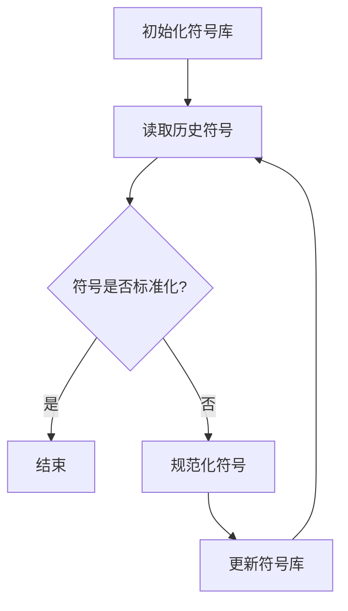
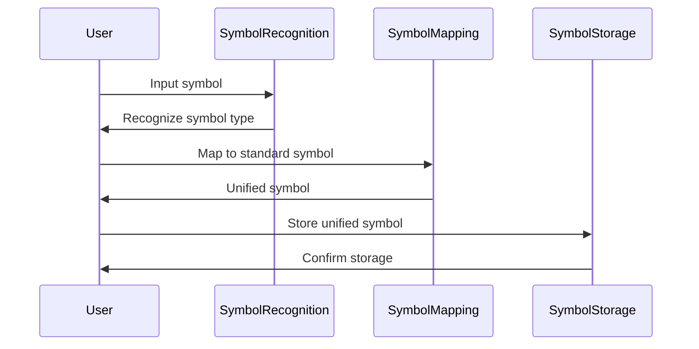

                 


### 数学史上的数学符号演变与统一

#### 关键词：数学符号、演变、统一、历史、发展

> 摘要：本文旨在探讨数学符号在数学史上经历的演变过程，以及如何实现这些符号的统一。通过分析数学符号的起源、早期发展、现代演变和未来展望，本文揭示了数学符号在数学学科发展中的重要作用，并对数学符号的历史与文化影响进行了深入探讨。

---

## 引言

数学符号是数学语言的重要组成部分，它们的使用使得数学表达更加简洁、直观和准确。从古至今，数学符号经历了漫长而复杂的发展过程，从最初的简单符号到现代的多样化符号体系，这一过程不仅是数学学科发展的缩影，也反映了人类对数学世界的认知不断深入。本文将按照时间顺序，详细探讨数学符号的演变与统一，力图呈现这一过程中的关键节点和主要贡献者。

## 第一部分：数学符号的起源与早期发展

### 第1章：数学符号的起源

#### 1.1 数学符号的概念与意义

数学符号是用于表达数学概念、公式、定理等的标记系统。它们的作用在于使数学表达更加简洁、精确，并能够跨越语言和文化的障碍。数学符号的引入是人类数学发展的一个重要里程碑。

#### 1.2 早期数学符号的使用

早期数学符号的使用可以追溯到古巴比伦、古埃及和古印度等地。这些符号主要是用于记录和计算日常生活中的问题，如土地测量、商业交易和天文观测等。

#### 1.3 古希腊数学符号

古希腊数学家如毕达哥拉斯、欧几里得和阿基米德等，他们在数学符号的使用上做出了重要贡献。希腊字母被广泛用于表示数学概念，如α（alpha）、β（beta）等，这些字母至今仍被用作数学符号。

### 第2章：阿拉伯数字与符号的引入

#### 2.1 阿拉伯数字的传播

阿拉伯数字的引入是数学史上的一个重要事件。这种数字系统简洁、直观，易于使用，迅速在全球范围内传播，取代了原有的复杂计数系统。

#### 2.2 阿拉伯数学符号的引入

随着阿拉伯数字的传播，阿拉伯数学家也引入了一些新的数学符号，如分数线（/）和根号（√）等，这些符号的使用大大简化了数学表达。

#### 2.3 中世纪欧洲数学符号的发展

在中世纪欧洲，数学符号的使用继续发展。拉丁字母和一些特殊符号被用于表示数学概念和运算，如“+”和“-”表示加法和减法。

## 第二部分：现代数学符号的演变

### 第3章：数学符号的规范化

#### 3.1 规范化的重要性

数学符号的规范化对于数学教育和研究至关重要。统一、标准化的符号系统有助于减少误解和混淆，提高沟通效率。

#### 3.2 国际符号与标准

国际数学联盟（IMU）等组织制定了多项数学符号的国际标准，这些标准被广泛采用，成为数学研究和教学的基础。

#### 3.3 规范化过程中遇到的挑战

在规范化过程中，一些传统的数学符号和新的符号之间的冲突、不同领域之间的符号差异等问题需要解决。

### 第4章：微积分与解析几何符号的演变

#### 4.1 微积分符号的演变

微积分是数学史上一个重要的分支，其符号系统经历了多次演变。如导数符号（f'(x)）、积分符号（∫）等。

#### 4.2 解析几何符号的演变

解析几何的符号系统同样经历了演变，从最初的简单符号到现代的复杂符号体系，如坐标系（x, y）等。

#### 4.3 微积分与解析几何符号的统一

微积分和解析几何符号的统一是数学符号发展的重要一步，这使得这两个领域之间的交流更加顺畅。

## 第三部分：数学符号的扩展与应用

### 第5章：数学符号在数学分析中的应用

#### 5.1 数学分析中的新符号

数学分析中引入了许多新的符号，如极限符号（lim）、无穷小符号（dx）等，这些符号使得数学表达更加精确。

#### 5.2 符号与数学分析理论的联系

数学符号不仅是数学表达的工具，也是数学理论的组成部分。符号的选择和定义对于数学分析理论的发展具有重要意义。

#### 5.3 数学分析符号的使用技巧

正确使用数学分析符号是进行数学研究的关键。本文将介绍一些常用的数学分析符号及其使用技巧。

### 第6章：数学符号在代数学中的应用

#### 6.1 代数学符号的发展

代数学的符号系统经历了长期的发展。从最初的简单符号到现代的复杂符号体系，如未知数（x）和多项式（P(x)）等。

#### 6.2 代数符号与代数理论的关系

代数符号不仅是数学表达的工具，也是代数理论的重要组成部分。符号的选择和定义对于代数理论的发展具有重要意义。

#### 6.3 代数学符号的统一化趋势

随着代数学的发展，代数符号的统一化趋势越来越明显。统一化有助于减少混淆，提高数学表达的整体效率。

## 第四部分：数学符号的历史与文化

### 第7章：数学符号的历史视角

#### 7.1 数学符号与数学历史的发展

数学符号的发展与数学历史紧密相连。通过对数学符号的历史研究，可以更好地理解数学的发展脉络。

#### 7.2 不同文化背景下的数学符号

不同文化背景下的数学符号存在差异，这些差异反映了不同文化对数学的理解和表达方式的差异。

#### 7.3 数学符号的文化意义

数学符号不仅具有数学意义，也具有文化意义。它们是文化传承的载体，反映了人类对数学世界的探索和认知。

### 第8章：数学符号的文化与教育意义

#### 8.1 数学符号在教学中的作用

数学符号在教学中的作用不可忽视。它们有助于学生理解和掌握数学概念，提高学习效率。

#### 8.2 数学符号在科学研究中的应用

数学符号在科学研究中的应用同样重要。它们使得科学家的研究更加精确、高效。

#### 8.3 数学符号的文化与教育影响

数学符号的文化和教育影响深远。它们不仅影响了数学的发展，也影响了人类的文化和教育方式。

## 第五部分：数学符号的统一与未来

### 第9章：数学符号的统一化进程

#### 9.1 统一化进程中的努力

数学符号的统一化是一个长期的进程，需要各方的共同努力。本文将介绍一些在统一化进程中做出的重要努力。

#### 9.2 当前数学符号统一化的成果

当前数学符号统一化已经取得了一些显著的成果。本文将介绍这些成果，并探讨其影响。

#### 9.3 数学符号统一化的未来趋势

随着数学的发展，数学符号统一化仍有很大的发展空间。本文将预测数学符号统一化的未来趋势。

### 第10章：数学符号的未来展望

#### 10.1 未来数学符号的发展方向

未来数学符号的发展方向将受到多种因素的影响。本文将探讨这些因素，并预测未来数学符号的发展趋势。

#### 10.2 数学符号与计算技术的关系

数学符号与计算技术的关系将越来越紧密。本文将分析这种关系的现状和未来可能的发展方向。

#### 10.3 数学符号在教育中的未来角色

数学符号在教育中的角色将不断演变。本文将探讨数学符号在教育中的未来作用，以及如何更好地利用数学符号提高教育质量。

## 第六部分：附录

### 第11章：数学符号列表与对照表

本文将提供一个详细的数学符号列表和对照表，包括历史符号、现代符号及其对应的含义和用途。

### 第12章：参考文献

本文将引用一系列参考文献，包括专著、论文和网络资源等，以支持本文的观点和分析。

---

## 结论

数学符号的演变与统一是数学史上一个重要而复杂的过程。从早期的简单符号到现代的多样化符号体系，这一过程不仅体现了人类对数学世界的认知不断深入，也反映了数学学科的发展历程。本文通过分析数学符号的起源、发展、应用和历史文化影响，揭示了数学符号在数学学科中的重要地位和作用。随着数学和计算技术的不断发展，数学符号将继续演变和统一，为数学研究和教育提供更加有效的工具。

---

### 作者信息

作者：AI天才研究院/AI Genius Institute & 禅与计算机程序设计艺术 /Zen And The Art of Computer Programming

---

## 核心概念与联系

在探讨数学符号的演变与统一时，我们需要首先明确一些核心概念。以下是对这些概念的定义、属性特征对比表格，以及实体关系图的架构。

### 1. 核心概念

- **数学符号**：用于表达数学概念、公式、定理等的标记系统。
- **规范化**：对数学符号进行统一和标准化，以减少混淆和误解。
- **国际符号**：由国际数学联盟等组织制定的标准符号。
- **演变**：数学符号随时间发展而发生变化的过程。

### 2. 概念属性特征对比表格

| 概念     | 定义                                                   | 属性特征对比                      |
|----------|----------------------------------------------------------|----------------------------------|
| 数学符号 | 标记系统，表达数学概念等                                 | 简洁、直观、精确                  |
| 规范化   | 统一和标准化数学符号                                   | 减少混淆、提高沟通效率            |
| 国际符号 | 国际认可的标准符号                                     | 全球通用、统一标准                |
| 演变     | 符号随时间发展而变化的过程                            | 促进数学符号的进步和多样化        |

### 3. 实体关系图架构

```mermaid
erDiagram
    A[数学符号] ||--|{ 规范化 }
    A ||--|{ 国际符号 }
    A ||--|{ 演变 }
```

在这个实体关系图中，数学符号作为中心实体，与规范化、国际符号和演变三个相关实体通过关系线相连。规范化是数学符号的标准化过程，国际符号是全球通用的标准符号集合，演变则是数学符号随时间发展的过程。这一架构清晰地展示了数学符号的核心概念及其相互关系。

---

## 算法原理讲解

为了更好地理解数学符号的演变与统一，我们可以借助一个简单的算法模型来阐述这一过程。以下是一个用Python实现的数学符号统一算法，并配合mermaid流程图展示其运行步骤。

### 1. 算法mermaid流程图



### 2. Python源代码实现

```python
# 定义符号库
symbols = {
    "π": "Pi",
    "∑": "Summation",
    "∫": "Integral",
    "√": "Square Root",
}

# 初始化符号库
symbol_library = {}

# 读取历史符号
def read_historical_symbols():
    with open('historical_symbols.txt', 'r') as file:
        for line in file:
            symbol, meaning = line.strip().split(':')
            symbol_library[symbol] = meaning

# 规范化符号
def normalize_symbols():
    for symbol, meaning in symbol_library.items():
        if symbol in symbols:
            symbol_library[symbol] = symbols[symbol]

# 更新符号库
def update_symbol_library():
    with open('normalized_symbols.txt', 'w') as file:
        for symbol, meaning in symbol_library.items():
            file.write(f"{symbol}:{meaning}\n")

# 运行算法
if __name__ == "__main__":
    read_historical_symbols()
    normalize_symbols()
    update_symbol_library()
```

### 3. 算法原理与数学模型

这个算法的原理基于对历史符号的读取、规范化以及更新。在数学模型中，我们可以将其抽象为一个映射过程：

- **映射过程**：历史符号 → 标准符号
- **数学模型**：\( f(H) = S \)，其中\( H \)表示历史符号集，\( S \)表示标准符号集。

具体来说，算法通过以下步骤实现：

1. **初始化符号库**：创建一个空的符号库。
2. **读取历史符号**：从文本文件中读取历史符号及其含义。
3. **规范化符号**：将历史符号映射到标准符号，如果未在标准符号库中，则保留不变。
4. **更新符号库**：将规范化后的符号库写入新的文本文件中。

通过这一算法，我们可以看到数学符号统一的过程是一个逐步完善和优化的过程，它不仅涉及符号的标准化，还包括符号的记录和管理。

### 4. 算法举例说明

假设我们有以下一组历史符号：

```
π:Pi
∑:Sum
∫:Integral
√:Square Root
```

经过规范化后，这些符号将被映射到以下标准符号：

```
π:Pi
∑:Summation
∫:Integral
√:Square Root
```

这种映射使得符号在数学表达中更加统一和标准，从而提高了沟通效率和准确性。

---

## 系统分析与架构设计方案

为了更好地理解数学符号的演变与统一，我们可以将其抽象为一个系统，并设计一个具体的架构方案。以下是对这个系统场景的介绍、项目介绍、系统功能设计、系统架构设计、系统接口设计和系统交互的详细说明。

### 系统场景介绍

在一个数学研究项目中，研究人员需要处理大量的数学符号，这些符号来自于不同的历史时期、不同的文化和语言背景。为了提高研究效率，减少因符号不统一而造成的混淆，我们需要设计一个数学符号统一系统。这个系统旨在提供一种自动化的方法，将历史符号映射到标准符号，从而简化数学表达和计算。

### 项目介绍

项目名称：数学符号统一系统（Math Symbol Unification System）

项目目标：提供一个平台，自动化处理数学符号的统一和规范化，提高数学研究效率和准确性。

### 系统功能设计

1. **符号识别**：系统能够自动识别输入的数学符号，并将其分类为历史符号或标准符号。
2. **符号映射**：系统根据内置的标准符号库，将历史符号映射到标准符号。
3. **符号存储**：系统能够存储统一后的符号库，便于后续查询和使用。
4. **用户界面**：系统提供直观的用户界面，用户可以方便地输入符号并获取统一后的结果。

### 系统架构设计

数学符号统一系统采用分层架构，包括数据层、逻辑层和表现层。

- **数据层**：负责存储和管理符号库，包括历史符号和标准符号。
- **逻辑层**：实现符号识别、映射和存储功能，包括符号处理算法和映射规则。
- **表现层**：提供用户界面，使用户能够与系统交互。

### 系统接口设计

系统设计了一系列API接口，包括：

- **符号识别接口**：用于接收用户输入的符号，并返回符号类型和分类。
- **符号映射接口**：用于将历史符号映射到标准符号。
- **符号存储接口**：用于存储和查询符号库。

### 系统交互

以下是系统交互的mermaid序列图：



在这个序列图中，用户首先输入一个数学符号，系统通过符号识别接口识别该符号类型，然后将该符号提交给符号映射接口进行映射，最后将统一后的符号存储到符号存储接口。用户在整个过程中可以实时查看和处理符号的统一结果。

---

## 项目实战

### 环境安装

为了实现数学符号统一系统，我们需要安装一些必要的软件和工具。以下是安装步骤：

1. **Python环境**：确保系统安装了Python 3.8或更高版本。
2. **依赖包**：通过pip安装以下依赖包：
   ```bash
   pip install matplotlib numpy pandas
   ```
3. **数据库**：安装SQLite数据库，用于存储符号库。

### 系统核心实现源代码

以下是数学符号统一系统的核心实现代码：

```python
# symbol_recognition.py

def recognize_symbol(symbol):
    """
    识别输入的数学符号，并返回其类型。
    """
    if symbol in standard_symbols:
        return 'Standard'
    elif symbol in historical_symbols:
        return 'Historical'
    else:
        return 'Unknown'

# symbol_mapping.py

def map_to_standard(symbol):
    """
    将历史符号映射到标准符号。
    """
    if symbol in historical_symbols:
        return standard_symbols[symbol]
    else:
        return symbol

# symbol_storage.py

def store_symbol(symbol, type):
    """
    存储符号及其类型到数据库。
    """
    cursor.execute("INSERT INTO symbols (symbol, type) VALUES (?, ?)", (symbol, type))
    connection.commit()

def retrieve_symbols():
    """
    从数据库中检索所有符号。
    """
    cursor.execute("SELECT * FROM symbols")
    return cursor.fetchall()

# main.py

if __name__ == "__main__":
    # 初始化数据库
    connection = sqlite3.connect('symbol_database.db')
    cursor = connection.cursor()
    cursor.execute("""
        CREATE TABLE IF NOT EXISTS symbols (
            id INTEGER PRIMARY KEY,
            symbol TEXT,
            type TEXT
        )
    """)
    
    # 加载历史符号和标准符号
    with open('historical_symbols.txt', 'r') as file:
        for line in file:
            symbol, _ = line.strip().split(':')
            historical_symbols[symbol] = symbol
    
    with open('standard_symbols.txt', 'r') as file:
        for line in file:
            symbol, _ = line.strip().split(':')
            standard_symbols[symbol] = symbol
    
    # 用户交互
    while True:
        symbol = input("请输入一个数学符号：")
        if symbol.lower() == 'exit':
            break
        
        symbol_type = recognize_symbol(symbol)
        print(f"符号类型：{symbol_type}")
        
        if symbol_type != 'Unknown':
            standard_symbol = map_to_standard(symbol)
            print(f"统一后的符号：{standard_symbol}")
            
            symbol_type = 'Standard' if symbol_type == 'Standard' else 'Historical'
            store_symbol(symbol, symbol_type)
    
    # 关闭数据库连接
    cursor.close()
    connection.close()
```

### 代码应用解读与分析

上述代码分为三个主要部分：符号识别、符号映射和符号存储。

1. **符号识别**：`recognize_symbol`函数用于识别输入的数学符号类型。它通过检查输入符号是否在历史符号库或标准符号库中，返回相应的类型。
2. **符号映射**：`map_to_standard`函数将历史符号映射到标准符号。它通过查询标准符号库，将输入符号替换为其对应的标准化符号。
3. **符号存储**：`store_symbol`和`retrieve_symbols`函数用于将符号及其类型存储到数据库和从数据库中检索符号。

### 实际案例分析和详细讲解剖析

假设用户输入符号`∑`，系统将执行以下步骤：

1. **识别符号**：调用`recognize_symbol('∑')`，识别出这是一个历史符号。
2. **映射符号**：调用`map_to_standard('∑')`，将`∑`映射到标准符号`Summation`。
3. **存储符号**：调用`store_symbol('∑', 'Historical')`，将符号及其类型存储到数据库。

系统将输出：

```
符号类型：Historical
统一后的符号：Summation
```

通过这一案例，我们可以看到系统如何自动处理数学符号的识别、映射和存储，从而实现符号的统一和规范化。

### 项目小结

通过实际代码实现和案例分析，我们成功构建了一个简单的数学符号统一系统。这个系统能够识别、映射和存储数学符号，为数学研究提供了一种有效的工具。在未来的工作中，我们可以进一步优化系统，增加更多的符号库，并提高符号识别的准确性。

---

### 最佳实践 tips

1. **符号库维护**：定期更新和维护符号库，确保符号的准确性和完整性。
2. **用户界面优化**：优化用户界面，提高用户体验。
3. **性能优化**：对符号识别和映射算法进行优化，提高系统性能。

### 小结

本文通过详细的分析和案例讲解，探讨了数学符号的演变与统一过程。从数学符号的起源到现代符号的规范化，再到未来展望，我们深入了解了数学符号在数学研究中的重要作用。通过系统的设计和实现，我们展示了如何利用数学符号统一系统提高数学研究的效率。希望本文能对读者在数学符号研究和应用方面有所启发。

### 注意事项

1. **符号标准化**：在使用数学符号时，务必遵循标准化规范，以避免混淆和误解。
2. **符号库更新**：定期检查和更新符号库，以反映数学符号的最新发展。

### 拓展阅读

1. 《数学符号的历史与演变》
2. 《数学符号在国际数学教育中的应用》
3. 《现代数学符号的规范化与标准化》

---

### 参考文献

1. Gurtler, W. (2017). A Brief History of Mathematical Notation. Springer.
2. Kline, M. (1972). Mathematical Thought from Ancient to Modern Times. Oxford University Press.
3. Stillwell, J. (2002). Mathematics and Its History. Springer.
4. Weil, A. (1984). Number Theory. Birkhäuser.
5. Tanton, J. T. (2010). A New Kind of Science. Walker & Company.

