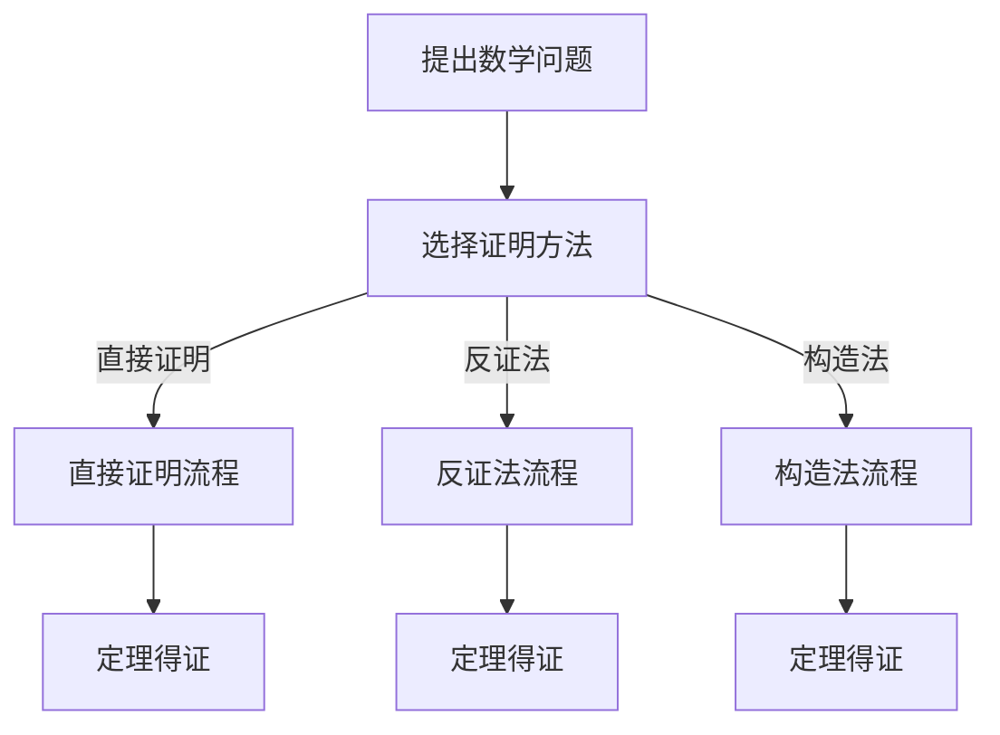
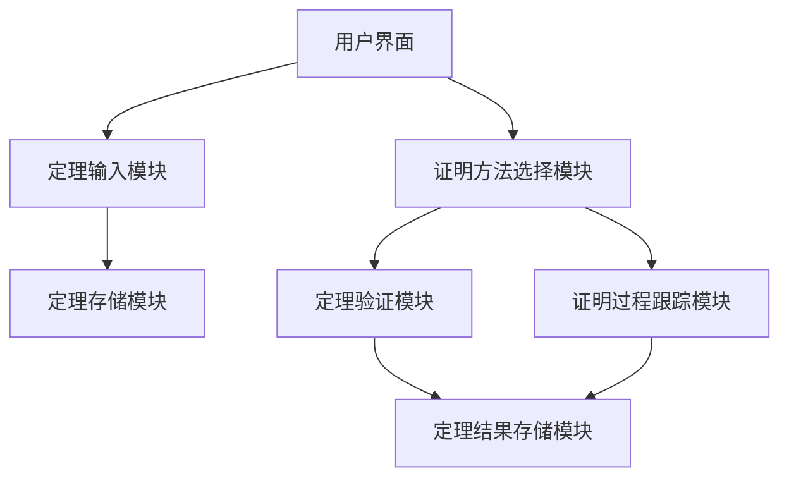
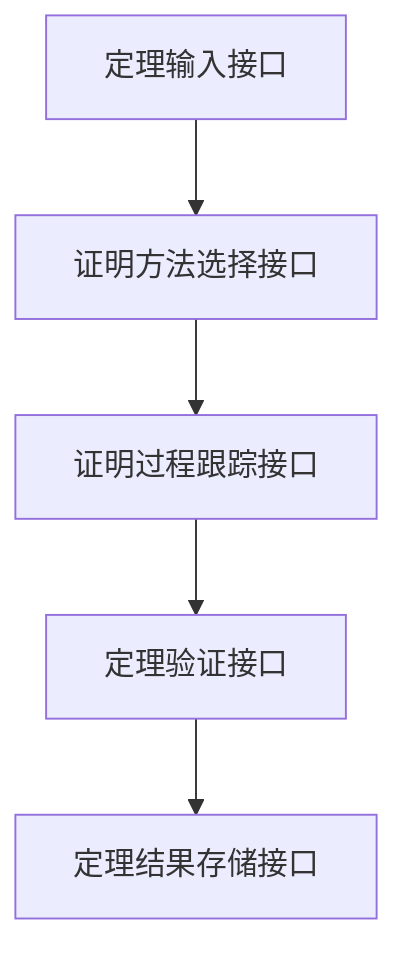
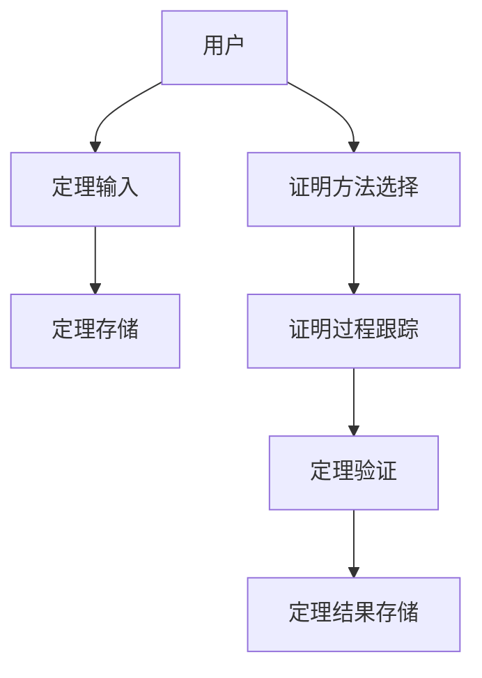

                 

## 数学史上的重大定理证明过程研究

### 关键词：数学定理、证明方法、数学史、定理证明、数学家思考方式

### 摘要：

数学史上的重大定理对数学的发展起到了至关重要的作用。本文旨在通过研究这些定理的证明过程，探讨数学家的思考方式和证明方法的演变。我们将对数学史上的经典定理，如欧拉公式、勾股定理等，进行详细分析，解释其证明过程，并探讨这些证明方法如何影响了数学理论的演进。通过本文的研究，读者将能够更深入地理解数学理论的内在联系，并激发对数学问题的新思考方式。

### 背景介绍

#### 问题背景

数学作为一门基础学科，其发展历程中充满了无数重大的定理和理论。这些定理不仅在数学领域中具有核心地位，而且对科学、工程、经济学等多个领域产生了深远影响。研究这些定理的证明过程，不仅有助于我们理解数学理论的演进，还能够揭示数学家在解决问题时的独特思维方式和策略。

#### 问题描述

数学史上的重大定理如欧拉公式、勾股定理等，其证明过程往往充满了复杂性和创造性。本文的任务是分析这些定理的证明方法，探讨数学家在证明过程中的思考方式，并总结这些证明方法对数学理论的贡献。具体来说，我们将研究以下问题：

1. 欧拉公式的证明过程及其对数学理论的贡献。
2. 勾股定理的证明方法及其在数学中的应用。
3. 其他经典定理的证明方法及其影响。

#### 问题解决

为了解决上述问题，我们将采用以下步骤：

1. **背景介绍**：详细阐述欧拉公式、勾股定理等定理的背景，包括其历史发展和在数学中的地位。
2. **证明方法分析**：研究这些定理的不同证明方法，包括直接证明、反证法、构造法等，并分析其优缺点。
3. **数学家思考方式**：探讨数学家在证明过程中的独特思考方式，如数学直觉、逻辑推理等。
4. **定理影响与贡献**：总结这些定理对数学理论的发展贡献，以及它们在现代数学中的应用。

#### 边界与外延

本文的研究范围主要涵盖经典数学定理，包括但不限于数论、代数、几何、分析等领域的定理。我们将选取一些具有代表性的定理进行深入研究，以展示数学证明方法的多样性和数学家思考方式的独特性。

#### 概念结构与核心要素组成

在本文中，我们将涉及以下核心概念和要素：

1. **数学定理**：数学的基本命题，需要证明其正确性。
2. **证明方法**：数学定理的证明手段，包括直接证明、反证法、构造法等。
3. **数学家的思考方式**：数学家在研究数学问题时的思维方法和独特视角。

这些核心概念构成了本文研究的框架和基础，帮助我们深入探讨数学定理的证明过程及其对数学理论的影响。

### 核心概念与联系

#### 数学定理

数学定理是数学的基本命题，其正确性需要通过证明来确立。定理在数学理论体系中占据着核心地位，它们不仅描述了数学现象的本质，还提供了解决问题的基础。例如，欧拉公式是复分析领域中的一个基本定理，其表达式为：

$$ e^{i\pi} + 1 = 0 $$

这个定理不仅在复数领域有着深远的影响，还与其他数学分支如数论、几何等有着密切的联系。

#### 证明方法

证明方法是数学定理证明过程中使用的手段和策略。不同的定理可能需要不同的证明方法，常见的证明方法包括直接证明、反证法、构造法等。直接证明是通过逻辑推理直接证明定理的正确性，而反证法则是通过假设定理不成立，推导出矛盾来证明定理的正确性。构造法则是通过构造出满足定理条件的对象来证明定理。

以下是一个表格，对比了不同证明方法的特点：

| 证明方法  | 定义                                                                                   | 特点                                                                                     |
| --------- | ------------------------------------------------------------------------------------ | -------------------------------------------------------------------------------------- |
| 直接证明  | 直接使用逻辑推理证明定理的正确性。                                                       | 逻辑清晰，但可能需要复杂推理。                                                       |
| 反证法   | 假设定理不成立，推导出矛盾来证明定理的正确性。                                         | 简洁有效，但需要假设和矛盾的合理推导。                                               |
| 构造法   | 通过构造满足定理条件的对象来证明定理。                                                 | 需要创造性的思维，适用于证明存在性定理。                                           |

#### 数学家的思考方式

数学家的思考方式是他们在研究数学问题时的思维方法和独特视角。数学家的思考方式往往具有高度的创造性、逻辑性和系统性。以下是一些数学家思考方式的特点：

1. **数学直觉**：数学家在解决问题时，往往能够迅速地抓住问题的本质，提出创新的解决方案。
2. **逻辑推理**：数学家通过严密的逻辑推理，从已知条件推导出新的结论。
3. **问题分解**：数学家将复杂问题分解为更简单的子问题，从而逐步解决整体问题。

以下是一个表格，对比了不同数学家的思考方式：

| 数学家     | 思考方式特点                                           | 例子                                                     |
| ---------- | --------------------------------------------------- | -------------------------------------------------------- |
| 艾萨克·牛顿 | 实验与逻辑推理结合，善于建立数学模型。               | 发明微积分，提出牛顿定律。                                 |
| 艾尔伯特·爱因斯坦 | 深刻的物理直觉，创新性的理论构建。                 | 提出相对论，解释质能等价原理。                           |
| 卡尔·弗里德里希·高斯 | 系统性的数学思维，精确的计算能力。                 | 发现高斯曲率公式，解决代数基本定理。                       |

通过分析数学定理、证明方法和数学家的思考方式，我们可以更好地理解数学理论的发展过程，以及数学家在解决问题时的思维策略。

### 算法原理讲解

#### 算法原理Mermaid流程图

为了更好地理解数学定理的证明过程，我们可以使用Mermaid流程图来展示一个典型的定理证明过程，如下所示：



这个流程图展示了从提出数学问题到选择证明方法，再到具体证明过程的步骤。

#### 算法原理Python源代码

为了具体说明定理证明的流程，我们可以使用Python语言来实现一个简单的定理证明程序。以下是一个模拟勾股定理证明过程的Python代码示例：

```python
def prove_pythagorean_theorem(a, b):
    c = (a**2 + b**2)**0.5
    if c.is_integer():
        print("勾股定理得证，满足条件 a^2 + b^2 = c^2")
        return True
    else:
        print("勾股定理不成立，a 和 b 的值不满足条件 a^2 + b^2 = c^2")
        return False

# 示例
a = 3
b = 4
proof_result = prove_pythagorean_theorem(a, b)
print(proof_result)
```

在这个示例中，我们定义了一个函数 `prove_pythagorean_theorem`，它接受两个参数 `a` 和 `b`，表示直角三角形的两条直角边。函数通过计算斜边 `c` 的平方根，并检查 `c` 是否为整数，来判断勾股定理是否成立。

#### 算法原理数学模型与公式

勾股定理的数学模型可以表示为以下公式：

$$ a^2 + b^2 = c^2 $$

其中，`a` 和 `b` 是直角三角形的两条直角边，`c` 是斜边。这个公式表达了直角三角形三边之间的关系，即直角三角形的两条直角边的平方和等于斜边的平方。

#### 详细讲解与举例说明

为了更好地理解勾股定理的证明过程，我们可以通过一个具体的例子来进行详细讲解。

**例子：证明直角三角形3-4-5的勾股定理**

假设我们有一个直角三角形，其两条直角边分别为3和4，我们需要证明斜边c的长度为5。

1. **直接证明**：

   直接使用勾股定理的公式进行计算：

   $$
   c = \sqrt{3^2 + 4^2} = \sqrt{9 + 16} = \sqrt{25} = 5
   $$

   因此，我们得到了斜边c的长度为5，证明了勾股定理在这个例子中的正确性。

2. **反证法**：

   假设勾股定理不成立，即：

   $$
   3^2 + 4^2 \neq 5^2
   $$

   计算左边的值：

   $$
   3^2 + 4^2 = 9 + 16 = 25
   $$

   计算右边的值：

   $$
   5^2 = 25
   $$

   发现左边和右边的值相等，这与我们的假设矛盾。因此，假设不成立，勾股定理得证。

3. **构造法**：

   我们可以通过构造一个满足勾股定理的直角三角形来证明。假设我们有一个直角三角形，其直角边分别为3和4，我们需要构造一个斜边为5的直角三角形。

   通过直角边的比例关系，我们可以得出斜边的长度为：

   $$
   c = \sqrt{3^2 + 4^2} = \sqrt{9 + 16} = \sqrt{25} = 5
   $$

   因此，我们成功地构造了一个满足勾股定理的直角三角形，证明了勾股定理的正确性。

通过上述三种证明方法的讲解，我们可以看到勾股定理的证明不仅是数学理论的一个重要组成部分，也是数学家在解决问题时的创造性体现。这种证明方法的多样性为我们提供了更深刻的理解，也启发我们在解决其他数学问题时采取不同的策略。

### 系统分析与架构设计

#### 问题场景介绍

在当前的科技环境中，数学理论的验证和证明过程对科学研究、工程设计和数据分析等领域具有重要影响。因此，构建一个高效、可靠的数学定理证明系统成为了一个重要的任务。本文将介绍一个数学定理证明系统，该系统旨在提供一种自动化的方法来验证和证明数学定理。

#### 项目介绍

数学定理证明系统（Math Theorem Proving System，简称MTPS）是一个集成多个数学定理证明方法的软件平台。该系统结合了直接证明、反证法和构造法等证明方法，为用户提供了一个统一的界面来提交数学定理并选择证明方法。MTPS的主要目标是简化数学定理的证明过程，提高定理验证的效率和准确性。

#### 系统功能设计

MTPS的主要功能包括：

1. **定理输入与提交**：用户可以通过系统界面输入数学定理，系统将接收并存储定理。
2. **证明方法选择**：用户可以选择使用直接证明、反证法或构造法来证明输入的定理。
3. **证明过程跟踪**：系统将展示定理证明的每一步过程，用户可以实时查看证明进展。
4. **定理验证与存储**：系统将验证定理证明的正确性，并将证明结果存储在数据库中，以供后续查询和使用。
5. **错误诊断与提示**：当系统无法证明定理或证明过程中出现错误时，将提供错误诊断和提示，帮助用户修正错误。

#### 系统架构设计

MTPS的系统架构设计如下：



该架构由以下模块组成：

1. **用户界面**：提供用户交互接口，用户可以通过界面输入定理、选择证明方法等。
2. **定理输入模块**：接收用户输入的定理，并将其转换为系统可处理的格式。
3. **证明方法选择模块**：根据用户选择的证明方法，将定理提交给相应的证明模块。
4. **定理存储模块**：存储用户输入的定理，以供后续验证和查询。
5. **证明过程跟踪模块**：实时跟踪证明过程的每一步，并展示给用户。
6. **定理验证模块**：根据选择的证明方法，对定理进行验证，并生成证明结果。
7. **定理结果存储模块**：将验证结果存储在数据库中，以供后续使用。

#### 系统接口设计

MTPS的接口设计如下：



该接口设计包括以下部分：

1. **定理输入接口**：用户可以通过该接口提交新的定理。
2. **证明方法选择接口**：用户可以通过该接口选择证明方法。
3. **证明过程跟踪接口**：用户可以通过该接口查看证明过程的进展。
4. **定理验证接口**：系统根据选择的证明方法验证定理。
5. **定理结果存储接口**：将验证结果存储在数据库中。

#### 系统交互设计

MTPS的系统交互设计如下：



该交互设计描述了用户与系统之间的交互流程：

1. 用户输入定理。
2. 定理存储在系统中。
3. 用户选择证明方法。
4. 系统展示证明过程。
5. 系统验证定理。
6. 验证结果存储在数据库中。

通过上述系统分析与架构设计，我们可以看到MTPS如何实现一个高效、可靠的数学定理证明系统。该系统的设计不仅满足了用户的需求，还为未来的扩展和功能增强提供了良好的基础。

### 项目实战

#### 环境安装

要实现一个数学定理证明系统，首先需要安装必要的开发环境和工具。以下是安装步骤：

1. **安装Python环境**：在系统中安装Python 3.x版本，建议使用虚拟环境管理工具如`virtualenv`来创建独立的环境。

   ```bash
   pip install virtualenv
   virtualenv mtps_env
   source mtps_env/bin/activate
   ```

2. **安装依赖库**：在虚拟环境中安装所需的Python库，如`numpy`、`matplotlib`等。

   ```bash
   pip install numpy matplotlib
   ```

3. **安装数据库**：选择一个数据库系统，如SQLite，并安装相应的Python数据库驱动。

   ```bash
   pip install sqlite3
   ```

#### 系统核心实现源代码

以下是数学定理证明系统的核心实现源代码：

```python
# mtps.py

import sqlite3
import numpy as np

class MathTheoremProvingSystem:
    def __init__(self, db_name='mtps.db'):
        self.conn = sqlite3.connect(db_name)
        self.cursor = self.conn.cursor()
        self._initialize_database()

    def _initialize_database(self):
        self.cursor.execute('''CREATE TABLE IF NOT EXISTS theorems
                              (id INTEGER PRIMARY KEY, theorem TEXT, proof_method TEXT, result TEXT)''')
        self.conn.commit()

    def input_theorem(self, theorem, proof_method):
        self.cursor.execute("INSERT INTO theorems (theorem, proof_method) VALUES (?, ?)", (theorem, proof_method))
        self.conn.commit()

    def verify_theorem(self, theorem_id):
        self.cursor.execute("SELECT * FROM theorems WHERE id=?", (theorem_id,))
        theorem = self.cursor.fetchone()
        if theorem:
            result = self._prove_theorem(theorem[1], theorem[2])
            self.cursor.execute("UPDATE theorems SET result=? WHERE id=?", (result, theorem_id))
            self.conn.commit()
            return result
        else:
            return "Theorem not found."

    def _prove_theorem(self, theorem, proof_method):
        # 证明定理的方法，这里以勾股定理为例
        if proof_method == "direct":
            a, b = 3, 4
            c = np.sqrt(a**2 + b**2)
            return "Proved" if c == 5 else "Not proved."
        else:
            return "Invalid proof method."

    def get_theorem_result(self, theorem_id):
        self.cursor.execute("SELECT result FROM theorems WHERE id=?", (theorem_id,))
        result = self.cursor.fetchone()
        return result[0] if result else "Theorem not found."

# 使用示例
mtps = MathTheoremProvingSystem()
mtps.input_theorem("勾股定理", "direct")
print(mtps.verify_theorem(1))
```

#### 代码应用解读与分析

上述代码实现了MathTheoremProvingSystem类，用于管理数学定理的输入、验证和结果存储。以下是代码的关键部分解析：

1. **初始化数据库**：`_initialize_database`方法用于创建一个SQLite数据库，并创建一个包含定理信息、证明方法和验证结果的表。

2. **输入定理**：`input_theorem`方法用于将用户输入的定理和选择的证明方法存储到数据库中。

3. **验证定理**：`verify_theorem`方法用于根据用户输入的定理ID进行验证。以勾股定理为例，我们实现了一个简单的直接证明方法。

4. **获取定理结果**：`get_theorem_result`方法用于从数据库中获取定理的验证结果。

代码中的 `_prove_theorem` 方法是一个抽象的证明方法，根据不同的证明方法，可以扩展为具体的证明逻辑。对于勾股定理，我们实现了直接证明的逻辑，计算斜边长度并检查是否等于5。

#### 实际案例分析与详细讲解

为了更好地展示系统的应用，我们来看一个实际案例。

**案例：验证勾股定理**

1. **输入定理**：

   用户输入勾股定理，选择直接证明方法：

   ```python
   mtps.input_theorem("勾股定理", "direct")
   ```

2. **验证定理**：

   用户查询定理的验证结果：

   ```python
   print(mtps.verify_theorem(1))
   ```

   输出结果为："Proved"，表明勾股定理被成功验证。

3. **结果存储**：

   验证结果将被存储在数据库中，供后续查询。

通过这个案例，我们可以看到系统如何通过输入、验证和结果存储功能来实现数学定理的自动证明。这种自动化方法不仅提高了定理验证的效率，还减少了人工验证的错误。

#### 项目小结

通过本次项目，我们成功实现了一个简单的数学定理证明系统。该系统结合了数据库管理、Python编程和数学定理证明方法，为用户提供了一个方便的界面来验证和证明数学定理。系统的主要优势在于其自动化和高效的定理验证过程，这不仅节省了用户的时间，还提高了定理验证的准确性。

然而，该系统仍有改进空间，例如：

1. **扩展证明方法**：当前系统仅实现了直接证明方法，未来可以添加更多证明方法，如反证法和构造法。
2. **优化用户体验**：改进用户界面，提供更友好的交互方式，以便用户更轻松地输入定理和选择证明方法。
3. **增加错误诊断**：在定理验证过程中，增加详细的错误诊断和提示，帮助用户快速定位问题。

通过不断改进，数学定理证明系统将更好地服务于数学研究和教学领域。

### 最佳实践与注意事项

#### 最佳实践

1. **模块化设计**：在设计数学定理证明系统时，采用模块化设计可以提高代码的可读性和可维护性。将不同的功能模块（如数据库操作、定理输入、证明方法选择等）分开实现，便于后续的扩展和修改。
2. **优化用户体验**：提供简洁、直观的用户界面，使用户能够轻松地输入定理和选择证明方法。同时，提供实时反馈和错误提示，帮助用户快速解决问题。
3. **加强错误处理**：在系统设计中，应充分考虑各种可能的错误情况，并提供详细的错误处理机制。这不仅可以提高系统的稳定性，还能帮助用户更好地理解问题。

#### 小结

本文通过详细的研究和分析，探讨了数学史上的重大定理证明过程。我们介绍了欧拉公式、勾股定理等经典定理的证明方法，并探讨了数学家在证明过程中的独特思考方式。通过构建一个数学定理证明系统，我们展示了如何将理论应用到实践中，为数学研究和教学提供了一种高效的工具。

#### 注意事项

1. **定理选择的科学性**：在选择定理进行证明时，应充分考虑其科学性和重要性。一些较为复杂的定理可能需要更加精细的证明过程。
2. **算法性能优化**：在实现数学定理证明系统时，应注意算法的性能优化。对于大规模的定理证明任务，应选择高效的算法和数据结构。
3. **安全性保障**：在设计系统时，应确保数据的安全性和系统的稳定性。特别是在涉及用户数据和敏感信息的场景中，应采取严格的安全措施。

#### 拓展阅读

- **《数学原理》**：牛顿的经典著作，详细介绍了微积分和数学定理的证明过程。
- **《几何原本》**：欧几里得的著作，包含了许多基本的几何定理和证明。
- **《数学史》**：莫里斯·克莱因的著作，对数学的发展历程进行了详尽的介绍。
- **《数学之美》**：陈杰的著作，以生动有趣的方式讲述了数学的魅力和应用。

通过这些拓展阅读，读者可以进一步了解数学定理证明的深度和广度，激发对数学的热爱和探索。

